**i**

--- end of page=0 ---

# **KATA PENGANTAR**

Puji dan syukur kami panjatkan kehadirat Tuhan Yang Maha Esa, atas

limpahan rahmat-Nya sehingga kami dapat menyelesaikan Laporan Akhir Analisis

Demografi untuk Penyusunan RPJPD Kota Semarang Tahun 2025-2045 dapat

diselesaikan tepat pada waktunya dan tidak terdapat kendala yang signifikan. Besar

harapan dari tersusunnya Penyusunan Dokumen Analisis Demografi untuk

Penyusunan RPJPD Kota Semarang Tahun 2025-2045 dapat menjadi acuan

Pemerintah Daerah Kota Semarang dalam merumuskan kebijakan perencanan

pembangunan yang baik secara kewenangan, kelembagaan, serta keterpenuhan

akan sarana prasarana pendukung.

Terima kasih kami ucapkan atas kesempatan dan kepercayaan yang

diberikan kepada kami hingga akhir pelaksanaan penyusunan dokumen ini. Terima

kasih juga kami ucapkan kepada berbagai pihak yang telah membantu menyusun

laporan ini. Dalam penyusunan laporan ini, kami akui masih jauh dari sempurna.

Untuk itu saran dan kritik yang membangun kearah penyempurnaan laporan kami

terima dengan tangan terbuka. Akhir kata demikian pengantar Penyusunan

Dokumen Analisis Demografi untuk Penyusunan RPJPD Kota Semarang Tahun

2025-2045, besar harapan kami laporan ini dapat berguna dan membantu semua

pihak.

**Tim Penyusun**

**ii**

--- end of page=1 ---

# **DAFTAR ISI**

**KATA PENGANTAR ........................................................................................ ii**

**DAFTAR ISI .................................................................................................... iii**

**DAFTAR TABEL ............................................................................................. vi**

**DAFTAR GAMBAR ........................................................................................ ix**

1.2 Landasan Hukum ...................................................................................... 3

1.3 Maksud dan Tujuan .................................................................................. 4

1.4 Ruang Lingkup dan Sasaran ................................................................. 4

1.5 Sistematika Laporan ................................................................................. 5

2.1 Kajian Teoritis ........................................................................... 6

2.1.1 Pengertian Demografi .............................................................. 6

2.1.2 Teori-Teori Demografi .............................................................. 6

2.1.3 Demografi dan Pembangunan ................................................ 9

2.1.4 Karakteristik Demografi ......................................................... 10

2.1.5 Bonus Demografi .................................................................... 12

2.1.6 Kajian Regulasi dan Kelembagaan Data Kependudukan .. 13

2.2 Metode Pelaksanaan Pekerjaan ............................................. 17

2.2.1 Metode-Metode Proyeksi Penduduk .................................... 17

2.2.2 Tata Cara Perencanaan Lingkungan Perumahan di

Perkotaan ................................................................................ 19

2.3 Kerangka Pikir ......................................................................... 20

3.1 Luas Wilayah ........................................................................... 21

3.2 Kondisi Penduduk ................................................................... 24

3.2.1. Jumlah Penduduk ................................................................... 24

**iii**

--- end of page=2 ---

3.2.2. Kepadatan Penduduk ............................................................ 27

3.2.3. Jumlah Penduduk Menurut Usia ........................................... 29

3.2.4. Jumlah Penduduk Menurut Jenis Kelamin per

Kecamatan .............................................................................. 31

3.3 Kondisi Eksisting Sarana Prasanara Lingkungan di Kota

Semarang................................................................................ 35

3.3.1. Kondisi Eksisting Rumah/Tempat Tinggal ........................... 35

3.3.2. Kondisi Eksisting Pemenuhan Kebutuhan Air Minum ......... 40

3.3.3. Kondisi Eksisting Pemenuhan Listirik ................................... 42

3.3.4. Kondisi Eksisting Pengelolaan Persampahan ..................... 44

3.3.5. Kondisi Eksisting Fasilitas Kesehatan .................................. 50

3.3.6. Kondisi Eksisting Fasilitas Pendidikan ................................. 56

**BAB IV KEBIJAKAN PEMBANGUNAN RUANG DI KOTA SEMARANG .. 61**

4.1 Tinjauan Terhadap Peraturan Daerah Provinsi Jawa Tengah

Nomor 7 Tahun 2019 Tentang Rencana Pembangunan dan
Pengembangan Perumahan dan Kawasan Permukiman
Provinsi Jawa Tengah Tahun 2019-2039 ................................ 61

4.2 Tinjauan Terhadap Peraturan Pemerintah No. 13 Tahun

2017 Tentang Peraturan Pemerintah Tentang Perubahan
Atas Peraturan Pemerintah Nomor 26 Tahun 2008 Tentang
Rencana Tata Ruang Wilayah Nasional ................................. 66

4.3 Tinjauan Peraturan Daerah Nomor 16 Tahun 2019 Tentang

Perubahan Atas Peraturan Daerah Provinsi Jawa Tengah
Nomor 6 Tahun 2010 Tentang Rencana Tata Ruang Wilayah
Provinsi Jawa Tengah Tahun 2009-2029 ................................ 67

4.4 Tinjauan Terhadap Peraturan Presiden Republik Indonesia

Nomor 60 Tahun 2022 Tentang Rencana Tata Ruang
Kawasan Strategis Nasional Kawasan Perkotaan Kendal,
Demak, Ungaran, Salatiga, Semarang, dan Purwodadi .......... 68

4.5 Tinjauan Terhadap Peraturan Daerah Kota Semarang

Nomor 5 Tahun 2021 Tentang Perubahan Atas Peraturan
Daerah Nomor 14 Tahun 2011 Tentang Rencana Tata
Ruang Wilayah Kota Semarang Tahun 2011-2031 ................. 74

4.5.1 Rencana Struktur Ruang ....................................................... 74

4.5.2 Rencana Pola Ruang ............................................................. 91

4.5.3 Program Terkait Pengembangan Perumahan dan

Kawasan Permukiman Dalam RTRW Kota Semarang ...... 97

**iv**

--- end of page=3 ---

**BAB V HASIL PROYEKSI DAN IMPLIKASI KEBIJAKAN ......................... 98**

5.1 Hasil Proyeksi Penduduk ............................................................. 98

5.1.1 Jumlah Penduduk Kota Semarang ....................................... 98

5.1.2 Jumlah Penduduk berdasarkan Kelompok Umur .............. 100

5.1.3 Jumlah Penduduk Kota Semarang Berdasarkan

Kecamatan ...................................................................... 106

5.1.4 Kepadatan Penduduk Kota Semarang Berdasarkan

Kecamatan ...................................................................... 115

5.2 Analisis Kebutuhan Hunian serta Sarana dan Prasarana ....... 122

5.2.1 Kebutuhan Hunian ................................................................ 122

5.2.2 Kebutuhan Air Bersih ........................................................... 124

5.2.3 Kebutuhan Energi Listrik ...................................................... 125

5.2.4 Kebutuhan Pengelolaan Persampahan ............................. 126

5.2.5 Kebutuhan Sarana Kesehatan ............................................ 129

5.2.6 Kebutuhan Sarana Pendidikan ........................................... 134

5.2.7 Kebutuhan Sarana Perdagangan dan Niaga ..................... 137

5.3 Implikasi Kebijakan ............................................................... 139

5.3.1 Kebijakan Infrastruktur Kecamatan ................................. 139

5.3.2 Kebijakan Pendukung Kesejahteraan Penduduk Usia

Tua (Lansia) .................................................................... 141

5.3.3 Kebijakan Sektor Kesehatan ........................................... 143

5.3.4 Kebijakan Sektor Pendidikan .......................................... 144

5.3.5 Kebijakan Tenaga Kerja untuk Mendorong

Perekonomian Mandiri .................................................... 145

5.3.6 Kebijakan Pembangunan Inklusif Gender ....................... 146

5.3.7 Kebijakan Strategi Program ............................................ 147

**BAB VI PENUTUP ..................................................................................... 152**

6.1 Kesimpulan ......................................................................... 152

6.2 Rekomendasi ...................................................................... 157

**DAFTAR PUSTAKA .................................................................................... 159**

**v**

--- end of page=4 ---

# **DAFTAR TABEL**

Tabel 2. 1 Matriks Perbedaan Mendasar Data Sensus Penduduk (BPS)
dan Registrasi Penduduk (Kemendagri) ................................... 15
Tabel 2. 2 Kebutuhan Sarana Lingkungan Perumahan di Perkotaan ........ 20
Tabel 3. 1 Wilayah Administratif Menurut Kecamatan di Kota Semarang .. 23
Tabel 3. 2 Jumlah Penduduk Kota Semarang Per Kecamatan Tahun

2012-2022 ................................................................................. 26

Tabel 3. 3 Kepadatan Penduduk Kota Semarang Per Kecamatan Tahun

2012-2022 ................................................................................. 28

Tabel 3. 4 Jumlah Penduduk Kota Semarang Berdasarkan Usia Tahun

2012-2022 ................................................................................. 29

Tabel 3. 5 Jumlah Penduduk Berjenis Kelamin Laki-Laki Kota Semarang

Tahun 2012-2022 ...................................................................... 33

Tabel 3. 6 Jumlah Penduduk Berjenis Kelamin Perempuan Kota
Semarang Tahun 2012-2022 .................................................... 34

Tabel 3.7 Lokasi Permukiman dan Perumahan Kumuh di Kota

Semarang.................................................................................. 35

Tabel 3.8 Sebaran Kawasan Permukiman dan Perumahan Kumuh di

Kota Semarang ......................................................................... 37
Tabel 3. 9 Data Backlog Rumah di Kota Semarang Tahun 2022 ............... 39
Tabel 3. 10 Data Rumah Tidak Layak Huni ................................................. 40
Tabel 3. 11 Daya Terpasang, Produksi, dan Dsitribusi Kota Semarang ...... 43
Tabel 3. 12 Jumlah Pemakaian Energi Listrik PLN Kota Semarang ............ 43
Tabel 3. 13 Jumlah Pelanggan Listrik Menurut Rayon/ULP di Kota
Semarang Tahun 2018-2022 .................................................... 44
Tabel 3. 14 Jumlah Produksi Sampah dan Jumlah Sampah Terangkut Kota
Semarang.................................................................................. 45
Tabel 3. 15 Bank Sampah di Kota Semarang .............................................. 45
Tabel 3. 16 Sebaran TPS3R di Kota Semarang .......................................... 47
Tabel 3. 17 Jumlah Sarana Kesehatan Kota Semarang .............................. 50
Tabel 3. 18 Jumlah Sarana Pendidikan Kota Semarang ............................. 56
Tabel 4. 1 Rencana Aksi pada Rencana Pembangunan dan
Pengembangan Perumahan dan Kawasan Permukiman
Provinsi Jawa Tengah di Kota Semarang ................................. 64
Tabel 4.2 Pusat Kegiatan di Kawasan Perkotaan Sekitarnya ................... 69
Tabel 4.3 Indikasi Program Utama Rencana Pola Ruang Kawasan
Perkotaan Kedungsepur ........................................................... 73
Tabel 4.4 Rencana Pusat Kegiatan Kota Semarang ................................. 74
Tabel 4.5 Program Terkait Pengembangan Perumahan dan Kawasan

Permukiman Dalam RTRW Kota ............................................... 97

Tabel 5. 1. Parameter Hasil Proyeksi Penduduk Kota Semarang Tahun

2025-2045 ................................................................................. 99

**vi**

--- end of page=5 ---

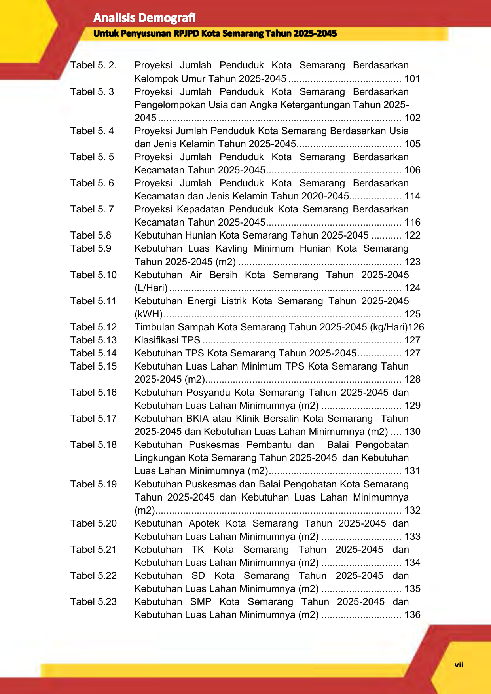

Tabel 5. 2. Proyeksi Jumlah Penduduk Kota Semarang Berdasarkan
Kelompok Umur Tahun 2025-2045 ......................................... 101
Tabel 5. 3 Proyeksi Jumlah Penduduk Kota Semarang Berdasarkan
Pengelompokan Usia dan Angka Ketergantungan Tahun 2025
2045 ........................................................................................ 102

Tabel 5. 4 Proyeksi Jumlah Penduduk Kota Semarang Berdasarkan Usia

dan Jenis Kelamin Tahun 2025-2045 ...................................... 105

Tabel 5. 5 Proyeksi Jumlah Penduduk Kota Semarang Berdasarkan

Kecamatan Tahun 2025-2045 ................................................. 106

Tabel 5. 6 Proyeksi Jumlah Penduduk Kota Semarang Berdasarkan

Kecamatan dan Jenis Kelamin Tahun 2020-2045................... 114

Tabel 5. 7 Proyeksi Kepadatan Penduduk Kota Semarang Berdasarkan

Kecamatan Tahun 2025-2045 ................................................. 116

Tabel 5.8 Kebutuhan Hunian Kota Semarang Tahun 2025-2045 ........... 122
Tabel 5.9 Kebutuhan Luas Kavling Minimum Hunian Kota Semarang
Tahun 2025-2045 (m2) ........................................................... 123
Tabel 5.10 Kebutuhan Air Bersih Kota Semarang Tahun 2025-2045
(L/Hari) .................................................................................... 124
Tabel 5.11 Kebutuhan Energi Listrik Kota Semarang Tahun 2025-2045
(kWH) ...................................................................................... 125
Tabel 5.12 Timbulan Sampah Kota Semarang Tahun 2025-2045 (kg/Hari)126

Tabel 5.13 Klasifikasi TPS ........................................................................ 127

Tabel 5.14 Kebutuhan TPS Kota Semarang Tahun 2025-2045 ................ 127
Tabel 5.15 Kebutuhan Luas Lahan Minimum TPS Kota Semarang Tahun
2025-2045 (m2) ....................................................................... 128
Tabel 5.16 Kebutuhan Posyandu Kota Semarang Tahun 2025-2045 dan
Kebutuhan Luas Lahan Minimumnya (m2) ............................. 129
Tabel 5.17 Kebutuhan BKIA atau Klinik Bersalin Kota Semarang Tahun
2025-2045 dan Kebutuhan Luas Lahan Minimumnya (m2) .... 130
Tabel 5.18 Kebutuhan Puskesmas Pembantu dan Balai Pengobatan
Lingkungan Kota Semarang Tahun 2025-2045 dan Kebutuhan
Luas Lahan Minimumnya (m2) ................................................ 131
Tabel 5.19 Kebutuhan Puskesmas dan Balai Pengobatan Kota Semarang
Tahun 2025-2045 dan Kebutuhan Luas Lahan Minimumnya
(m2) ......................................................................................... 132
Tabel 5.20 Kebutuhan Apotek Kota Semarang Tahun 2025-2045 dan
Kebutuhan Luas Lahan Minimumnya (m2) ............................. 133
Tabel 5.21 Kebutuhan TK Kota Semarang Tahun 2025-2045 dan
Kebutuhan Luas Lahan Minimumnya (m2) ............................. 134
Tabel 5.22 Kebutuhan SD Kota Semarang Tahun 2025-2045 dan
Kebutuhan Luas Lahan Minimumnya (m2) ............................. 135
Tabel 5.23 Kebutuhan SMP Kota Semarang Tahun 2025-2045 dan
Kebutuhan Luas Lahan Minimumnya (m2) ............................. 136

**vii**

--- end of page=6 ---

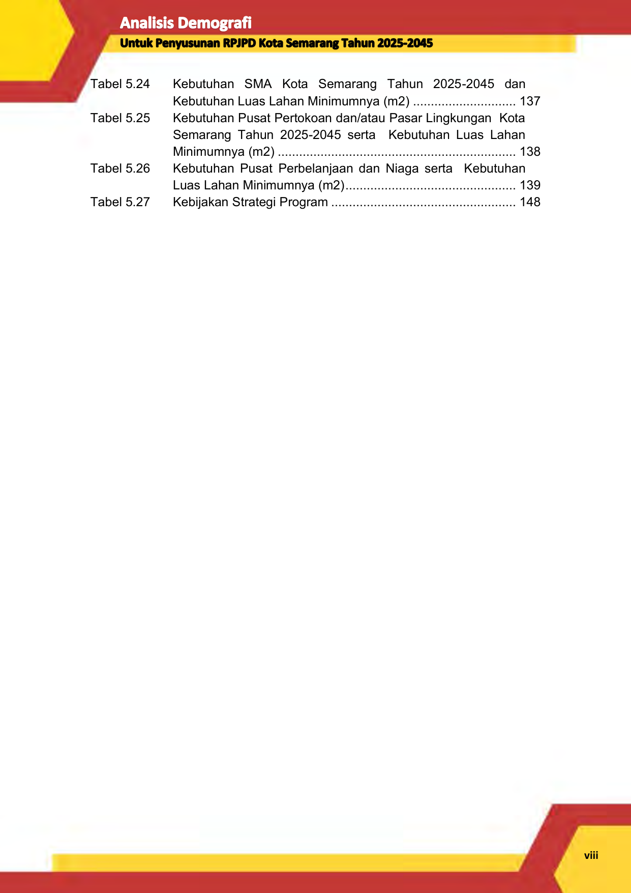

Tabel 5.24 Kebutuhan SMA Kota Semarang Tahun 2025-2045 dan
Kebutuhan Luas Lahan Minimumnya (m2) ............................. 137
Tabel 5.25 Kebutuhan Pusat Pertokoan dan/atau Pasar Lingkungan Kota
Semarang Tahun 2025-2045 serta Kebutuhan Luas Lahan
Minimumnya (m2) ................................................................... 138
Tabel 5.26 Kebutuhan Pusat Perbelanjaan dan Niaga serta Kebutuhan
Luas Lahan Minimumnya (m2) ................................................ 139
Tabel 5.27 Kebijakan Strategi Program .................................................... 148

**viii**

--- end of page=7 ---

# **DAFTAR GAMBAR**

Gambar 2. 1 Tahapan Transisi Demografi ....................................................... 9

Gambar 2. 2 Jenis-Jenis Piramida Penduduk ................................................ 11

Gambar 2. 3 Kerangka Pikir Analisis Demografi Untuk Penyusunan RPJPD

Kota Semarang Tahun 2025-2045 ............................................ 20
Gambar 3. 1 Luas dan Batas Wilayah Administrasi Kota Semarang ............. 21
Gambar 3. 2 Jumlah Penduduk Kota Semarang Tahun 2012-2022 .............. 24
Gambar 3. 3 Kepadatan Penduduk Kota Semarang Tahun 2012-2022 ......... 27
Gambar 3. 4 Piramida Penduduk Kota Semarang Tahun 2012-2022 ............ 31
Gambar 3. 5 Jumlah Penduduk Berdasarkan Jenis Kelamin Kota Semarang

Tahun 2012-2022 ...................................................................... 31

Gambar 3. 6 Persentase Rumah Tangga menurut Sumber Air Minum di

Kota Semarang ......................................................................... 41
Gambar 3. 6 Persentase Rumah tangga menurut Jarak Sumber Air Minum

ke Tempat Penampungan Limbah/Kotoran/Tinja Terdekat di
Kota Semarang ......................................................................... 42
Gambar 5. 1. Proyeksi Jumlah Penduduk Kota Semarang Tahun 2025-2045100
Gambar 5. 2. Piramida Penduduk Kota Semarang Tahun 2025-2045 .......... 104
Gambar 5. 3. Pola Perkembangan Perumahan dan Permukiman Kota

Semarang berdasarkan Proyeksi Persebaran Penduduk di

Kecamatan .............................................................................. 140

Gambar 5. 4. Desain Skala Spasial dan Ruang Alam untuk Mendukung

Hunian Ramah Lansia ............................................................. 143

**ix**

--- end of page=8 ---

# **BAB I** **PENDAHULUAN**

**1.1** **Latar Belakang**

Undang-Undang Nomor 25 tahun 2004 tentang Sistem Perencanaan

Pembangunan Nasional dan Undang-Undang Nomor 23 tahun 2014 tentang

Pemerintahan Daerah mengamanatkan, bahwa dalam rangka penyelenggaraan

pemerintahan, Pemerintah Daerah berkewajiban menyusun perencanaan

pembangunan daerah sebagai satu kesatuan sistem perencanaan pembangunan

nasional. Perencanaan pembangunan daerah tersebut meliputi Rencana

Pembangunan Jangka Panjang Daerah (RPJPD) untuk jangka waktu 20 tahun,

Rencana Pembangunan Jangka Menengah Daerah (RPJMD) untuk jangka waktu

5 (Lima) tahun dan Rencana Kerja Pembangunan Daerah (RKPD) untuk jangka

waktu 1 (Satu) tahun.

Pasal 263 ayat 2 Undang-Undang 23 Tahun 2014 menyebutkan bahwa

RPJPD merupakan penjabaran dari visi, misi, arah kebijakan, dan sasaran pokok

pembangunan Daerah jangka panjang untuk 20 (dua puluh) tahun yang disusun

dengan berpedoman pada RPJPN dan rencana tata ruang wilayah. Sedangkan

Undang- Undang 25 Tahun 2004 pasal 9 ayat 1 menyatakan bahwa RPJP Daerah

memuat visi, misi, dan arah pembangunan Daerah yang mengacu pada RPJP

Nasional.

Pengaturan tentang penyusunan RPJPD bagi daerah lebih detail dimuat

dalam Peraturan Menteri Dalam Negeri Republik Indonesia (Permendagri) Nomor

86 Tahun 2017 Tentang Tata Cara Perencanaan, Pengendalian Dan Evaluasi

Pembangunan Daerah, Tata Cara Evaluasi Rancangan Peraturan Daerah Tentang

Rencana Pembangunan Jangka Panjang Daerah Dan Rencana Pembangunan

Jangka Menengah Daerah, Serta Tata Cara Perubahan Rencana Pembangunan

Jangka Panjang Daerah, Rencana Pembangunan Jangka Menengah Daerah, Dan

Rencana Kerja Pemerintah Daerah. Pasal 16 ayat 1 Permendagri 86/2017 tersebut

dijelaskan bahwa RPJPD harus disusun dengan berbagai tahapan. Mulai dari

persiapan penyusunan, penyusunan rancanganawal, penyusunan rancangan,

pelaksanaan Musrenbang, perumusan rancangan akhir, dan penetapan RPJPD

menjadi Peraturan Daerah.

**1**

--- end of page=9 ---

Dokumen RPJPD yang merupakan bagian dari perencanaan

pembangunan daerah nantinya disusun dengan memperhatikan 4 (empat)

pendekatan seperti yang diamanatkan pada Pasal 7 s/d pasal 10 Peraturan Menteri

Dalam Negeri Nomor 86 Tahun 2017 tentang Tata Cara Perencanaan,

Pengendalian Dan Evaluasi Pembangunan Daerah, Tata Cara Evaluasi

Rancangan Peraturan Daerah Tentang Rencana Pembangunan Jangka Panjang

Daerah dan Rencana Pembangunan Jangka Menengah Daerah, serta Tata Cara

Perubahan Rencana Pembangunan Jangka Panjang Daerah, Rencana

Pembangunan Jangka Menengah Daerah, dan Rencana Kerja Pemerintah Daerah.

Keempat pendekatan tersebut adalah pendekatan teknokratis, pendekatan

partisipatif, pendekatan politis, dan pendekatan perpaduan antara Bottom-Up

dengan Top Down Planning. Adapun secara substansi, penyusunan dokumen

RPJPD nanti akan menggunakan pendekatan holistik-tematik, integratif, dan

spasial.

Salah satu aspek penting sebagai material pendukung dalam perancangan

RPJPD adalah sektor Demografi. Indonesia diperkirakan akan menghadapi era

bonus demografi beberapa tahun ke depan, tepatnya pada tahun 2030 hingga 2040

mendatang. Bonus demografi yang dimaksud adalah masa di mana penduduk usia

produktif (15-64 tahun) akan lebih besar dibanding usia nonproduktif (65 tahun ke

atas) dengan proporsi lebih dari 60% dari total jumlah penduduk Indonesia.

Momentum tersebut tentu saja harus dihadapi dengan perencanaan yang matang.

Bonus demografi menjadi kesempatan strategis bagi Indonesia untuk

melakukan berbagai percepatan pembangunan dengan dukungan sumber daya

manusia (SDM) berusia produktif yang melimpah. Apalagi, tahun 2030 terdapat

agenda besar pembangunan berkelanjutan (Sustainable Development Goals).

Sejalan dengan itu, pemerintah pun telah mencanangkan Visi Indonesia Emas

tahun 2045 dengan harapan terciptanya generasi produktif yang berkualitas.

Lebih lanjut Berdasarkan data Direktorat Jenderal Kependudukan dan

Pencatatan Sipil (Dukcapil) Kementerian Dalam Negeri, jumlah penduduk

Indonesia mencapai 275,36 juta jiwa pada Juni 2022. Dari jumlah tersebut, ada

190,83 juta jiwa (69,3%) penduduk Indonesia yang masuk kategori usia produktif

(15-64 tahun). Terdapat pula 84,53 juta jiwa (30,7%) penduduk yang masuk

kategori usia tidak produktif. Rinciannya, sebanyak 67,16 juta jiwa (24,39%)

penduduk usia belum produktif (0-14 tahun) dan sebanyak 17,38 juta jiwa (6,31%)

**2**

--- end of page=10 ---

merupakan kelompok usia sudah tidak produktif (65 tahun ke atas). Dengan

komposisi jumlah penduduk tersebut di atas, maka rasio ketergantungan/beban

tanggungan (depency ratio) adalah sebesar 44,3%. Hasil tersebut diperoleh dari

jumlah penduduk usia tidak produktif dibagi jumlah penduduk usai produktif. Angka

ketergantungan sebesar 44,3%, artinya setiap 100 penduduk usia produktif

menanggung sebanyak 44-45 jiwa penduduk usia produktif.

Menimbang hal di atas, maka dalam penyusunan kajian Analisis Demografi

Untuk Penyusunan Rpjpd Kota Semarang Tahun 2025-2045 dimaksudkan untuk

menggali lebih jauh mengenai potensi, isu dan permaslahan serta proyeksi

demografi Kota Semarang yang akan menjadi materi penting dalam penyusunan

RPJPD di Kota Semarang. RPJPD yang dimaksud adalah RPJPD tahun 2025

2045.

**1.2** **Landasan Hukum**

Landasan hukum atau dasar hokum pelaksanaan kajian Analisis Demografi

Untuk Penyusunan RPJPD Kota Semarang Tahun 2025-2045 antara lain yakni:

1. Undang-Undang Nomor 25 Tahun 2004 tentang Sistem Perencanaan

Pembangunan Nasional (Lembaran Negara Republik Indonesia Tahun 2004

Nomor 104, Tambahan Lembaran Negara Republik Indonesia Nomor 4421).

2. Undang-Undang Nomor 17 Tahun 2007 tentang Rencana Pembangunan

Jangka Panjang Nasional 2005-2025 (Lembaran Negara Republik Indonesia

Tahun 2007 Nomor 33, Tambahan Lembaran Negara Republik Indonesia

Nomor 4700).

3. Undang-Undang Nomor 26 Tahun 2007 tentang Penataan Ruang (Lembaran

Negara Republik Indonesia Tahun 2007 Nomor 68, Tambahan Lembaran

Negara Republik Indonesia Nomor 4725).

4. Undang-Undang Nomor 12 Tahun 2011 tentang Pembentukan Peraturan

Perundang-Undangan (Lembaran Negara Republik Indonesia Tahun 2011

Nomor 82, Tambahan Lembaran Negara Republik Indonesia Nomor 5234),

sebagaimana telah diubah dengan Undang-Undang Nomor 15 Tahun 2019

tentang Perubahan Atas Undang-Undang Nomor 12 Tahun 2011 tentang

Pembentukan Peraturan Perundang-Undangan (Lembaran Negara Republik

Indonesia Tahun 2019 Nomor 183, Tambahan Lembaran Negara Republik

Indonesia Nomor 6398).

**3**

--- end of page=11 ---

5. Undang-Undang Nomor 23 Tahun 2014 tentang Pemerintahan Daerah

(Lembaran Negara Republik Indonesia Tahun 2014 Nomor 244, Tambahan

Lembaran Negara Republik Indonesia Nomor 5587), sebagaimana telah diubah

beberapa kali, terakhir dengan Undang-Undang Nomor 11 Tahun 2020 tentang

Cipta Kerja (Lembaran Negara Republik Indonesia Tahun 2020 Nomor 245,

Tambahan Lembaran Negara Republik Indonesia Nomor 6573).

**1.3** **Maksud dan Tujuan**

Secara umum maksud dan tujuan dari kajian Analisis Demografi Untuk

Penyusunan RPJPD Kota Semarang Tahun 2025-2045 adalah untuk melakukan

analisis yang komprehensif terhadap sektor demografi di Kota Semarang dikaitkan

dengan isu Bonus Demografi (Indonesia Emas 2045). Kajian ini bertujuan untuk

memahami secara mendalam faktor-faktor yang memengaruhi sektor demografi

Kota Semarang. Adapun tujuan khusus dalam kajian ini sebagai berikut:

1. Menelaah kondisi eksisting demografi Kota Semarang

2. Menganalisis Isu dan permasalahan yang ada berkaitan dengan dinamika

demografi

3. Melakukan proyeksi Demografi Kota Semarang 2025-2045.

4. Menganalisis pentahapan bonus demografi yang akan terjadi di Kota Semarang

5. Menyusun Rekomendasi Kebijakan bagi ingtegrasi hasil kajian terhadap

RPJPD Kota Semarang.

**1.4** **Ruang Lingkup dan Sasaran**

Ruang lingkup Penyusunan Dokumen kajian Analisis Demografi Untuk

Penyusunan RPJPD Kota Semarang Tahun 2025-2045 antara lain meliputi:

a. Penelaahan terhadap regulasi Pemerintahan Daerah.

b. Penyerapan informasi dan masukan dari seluruh instansi dan/atau dinas

terkait, Bappeda Kota Semarang, Dindukcapil, dan Stakeholder terkait

c. Analisis Kewenangan dan Kelembagaan (Regulasi, Kewenangan,

Kelembagaan).

d. Analisis Permasalahan yang dihadapi di lapangan.

Sasaran kegiatan adalah tersusunnya dokumen kajian Analisis Demografi

Untuk Penyusunan RPJPD Kota Semarang Tahun 2025-2045 sesuai dengan

**4**

--- end of page=12 ---

kondisi objektif di lapangan serta sesuai dengan peraturan perundang-undangan

yang berlaku.

**1.5** **Sistematika Laporan**

Sistematika Laporan Pendahuluan Penyusunan Dokumen kajian Analisis

Demografi Untuk Penyusunan RPJPD Kota Semarang Tahun 2025-2045 meliputi:

**BAB I** **PENDAHULUAN**

Berisi latar belakang, landasan hukum, maksud pelaksanaan pekerjaa,

tujuan, ruang lingkup,dan sasaran pelaksanaan pekerjaan serta

sistematika penyunan laporan.

**BAB II KAJIAN TEORITIS DAN METODE PELAKSANAAN PEKERJAAN**

Berisi kajian teori tentang demografi/kependudukan, metode pelaksanaan

pekerjaan dan kerangka pikir penyusunan kajian Analisis Demografi

Untuk Penyusunan RPJPD Kota Semarang Tahun 2025-2045.

**BAB III KONDISI KEPENDUDUKAN KOTA SEMARANG**

Berisi kondisi demografi/kependudukan Kota Semarang yang meliputi,

jumlah penduduk, jumlah penduduk menurut usia, jumlah penduduk

menurut jenis kelamin, jumlah penduduk menurut jenis pendidikan, jumlah

penduduk menurut agama, jumlah kepala keluarga, jumlah anggota

keluarga per KK, dan jenis pekerjaan penduduk, yang digunakan sebagai

dasar proyeksi dan analisis kondisi penduduk selama 20 tahun yang akan

datang.

**BAB IV RENCANA PELAKSANAAN PEKERJAAN**

Berisi rencana kegiatan dan rancangan sistematika laporan akhir dalam

Kajian Analisis Demografi Untuk Penyusunan RPJPD Kota Semarang

Tahun 2025-2045.

**BAB V PENUTUP**

Berisi kesimpulan dan langkah-langkah yang akan dilakukan dalam

pelaksanaan pekerjaan Kajian Analisis Demografi Untuk Penyusunan

RPJPD Kota Semarang Tahun 2025-2045.

**5**

--- end of page=13 ---

# **BAB II** **KAJIAN TEORITIS DAN** **METODE PELAKSANAAN PEKERJAAN**

**2.1** **Kajian Teoritis**

**2.1.1** **Pengertian Demografi**

Demografi berasal dari gabungan kata bahasa Yunani, yaitu _demos_ yang

berarti penduduk serta _graphein_ yang berarti gambaran tulisan atau catatan. Maka,

demografi adalah ilmu yang mempelajari penduduk atau manusia. Harmadi (2016)

berpendapat bahwa demografi merupakan ilmu tentang penduduk yang dilihat dari

ukuran (jumlah), struktur/komposisi, distribusi, serta faktor-faktor yang

mempengaruhinya (fertilitas, mortalitas, dan migrasi). Mantra (2000) beropini

bahwa ilmu kependudukan lebih luas dari demografi murni karena dalam

memahami kependudukan di suatu wilayah, faktor-faktor nondemografis ikut

dilibatkan, seperti ekonomi, sosial, budaya, lingkungan, politik, dll. Oleh karena itu,

ilmu kependudukan bukan lagi disiplin teoritis tunggal, tetapi lebih bersifat

interdisipliner.

**2.1.2** **Teori-Teori Demografi**

Teori-teori mengenai demografi terus mengalami perkembangan. Teori

teori demografi yang sebelumnya banyak dibahas yaitu:

**A.** **Malhusian**

Hipotesis Thomas Robert Malthus (1998) muncul pada tahun 1798 yang

membahas mengenai hubungan antara penduduk dengan pangan. Malthus

berpendapat bahwa pertumbuhan penduduk yang cepat dikarenakan hubungan

antara laki-laki dan perempuan yang akan menghasilkan kehamilan dan

kelahiran yang tidak dapat dicegah. Jumlah penduduk yang meningkat

membutuhkan sediaan pangan yang cukup. Malthus mengatakan bahwa jika

tidak ada faktor penghambat, maka penduduk akan tumbuh menurut deret ukur,

sedangkan sumber-sumber pangan akan tumbuh seperti deret hitung. Dia juga

mengatakan bahwa faktor-faktor yang menghambat perkembangan penduduk

yaitu _preventive checks_ yang meliputi pengekangan diri ( _moral restraint_ ) dan

perbuatan buruk ( _vice_ ) serta _positive check_ yang terdiri dari perbuatan buruk

**6**

--- end of page=14 ---

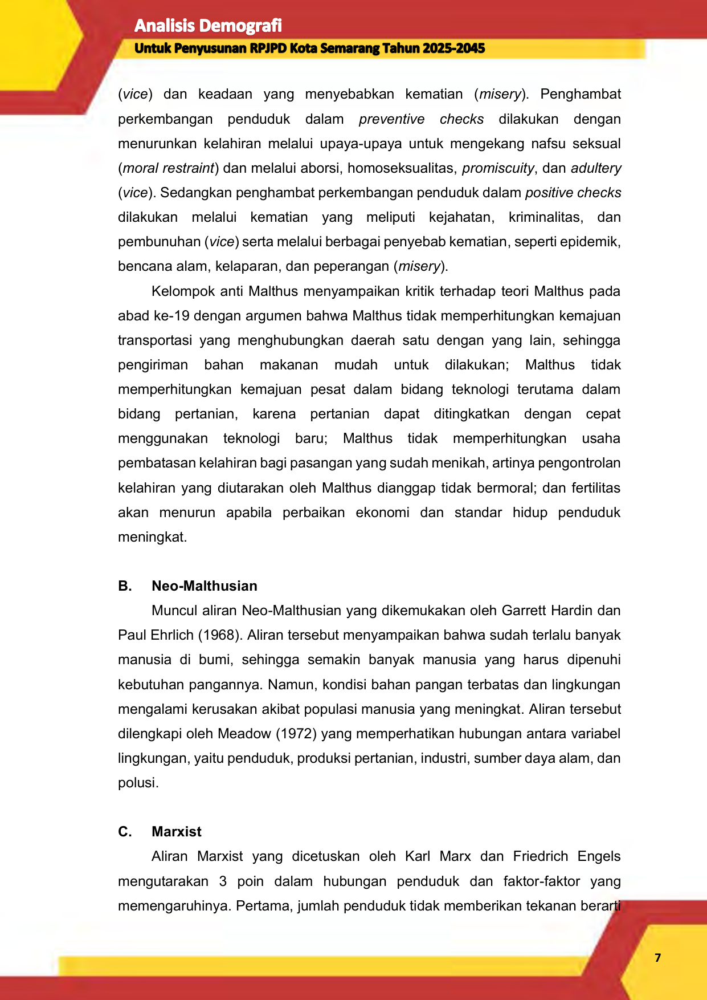

( _vice_ ) dan keadaan yang menyebabkan kematian ( _misery_ ). Penghambat

perkembangan penduduk dalam _preventive checks_ dilakukan dengan

menurunkan kelahiran melalui upaya-upaya untuk mengekang nafsu seksual

( _moral restraint_ ) dan melalui aborsi, homoseksualitas, _promiscuity_, dan _adultery_

( _vice_ ). Sedangkan penghambat perkembangan penduduk dalam _positive checks_

dilakukan melalui kematian yang meliputi kejahatan, kriminalitas, dan

pembunuhan ( _vice_ ) serta melalui berbagai penyebab kematian, seperti epidemik,

bencana alam, kelaparan, dan peperangan ( _misery_ ).

Kelompok anti Malthus menyampaikan kritik terhadap teori Malthus pada

abad ke-19 dengan argumen bahwa Malthus tidak memperhitungkan kemajuan

transportasi yang menghubungkan daerah satu dengan yang lain, sehingga

pengiriman bahan makanan mudah untuk dilakukan; Malthus tidak

memperhitungkan kemajuan pesat dalam bidang teknologi terutama dalam

bidang pertanian, karena pertanian dapat ditingkatkan dengan cepat

menggunakan teknologi baru; Malthus tidak memperhitungkan usaha

pembatasan kelahiran bagi pasangan yang sudah menikah, artinya pengontrolan

kelahiran yang diutarakan oleh Malthus dianggap tidak bermoral; dan fertilitas

akan menurun apabila perbaikan ekonomi dan standar hidup penduduk

meningkat.

**B.** **Neo-Malthusian**

Muncul aliran Neo-Malthusian yang dikemukakan oleh Garrett Hardin dan

Paul Ehrlich (1968). Aliran tersebut menyampaikan bahwa sudah terlalu banyak

manusia di bumi, sehingga semakin banyak manusia yang harus dipenuhi

kebutuhan pangannya. Namun, kondisi bahan pangan terbatas dan lingkungan

mengalami kerusakan akibat populasi manusia yang meningkat. Aliran tersebut

dilengkapi oleh Meadow (1972) yang memperhatikan hubungan antara variabel

lingkungan, yaitu penduduk, produksi pertanian, industri, sumber daya alam, dan

polusi.

**C.** **Marxist**

Aliran Marxist yang dicetuskan oleh Karl Marx dan Friedrich Engels

mengutarakan 3 poin dalam hubungan penduduk dan faktor-faktor yang

memengaruhinya. Pertama, jumlah penduduk tidak memberikan tekanan berarti

**7**

--- end of page=15 ---

terhadap peningkatan kebutuhan pangan, tetapi lebih besar dampaknya

terhadap kesempatan kerja. Kedua, kemelaratan terjadi bukan karena cepatnya

pertumbuhan penduduk, tetapi karena kaum kapitalis mengambil sebagian besar

hak para buruh. Ketiga, semakin tinggi tingkat jumlah penduduk, maka semakin

tinggi pula produktivitasnya. Hal ini terjadi jika teknologi tidak menggantikan

tenaga kerja manusia, sehingga manusia tidak perlu menekan jumlah kelahiran

dan ini berarti menolak teori Malthus tentang _moral restraint_ untuk menekan

angka kelahiran. Aliran ini dulu banyak digunakan di negara-negara yang

menganut paham sosialis, seperti Cina, Vietnam, maupun Korea Utara.

**D.** **Transisi Demografi**

Teori transisi demografi dicetus oleh Warren Thompson pada tahun 1929.

Teori ini membagi transisi demografi menjadi 4 tahap sebagai berikut:

1. Tahap pertama ditandai dengan jumlah kelahiran dan kematian yang sangat

tinggi dan tidak terkendali setiap tahunnya. Sehingga, menghasilkan laju

pertumbuhan penduduk yang sangat rendah (0). Faktor-faktor penyebab

kematian di antaranya yaitu adanya peperangan, gagal panen, kelaparan

sebagai akibat tingginya harga pangan, dan meluasnya wabah penyakit

menular

2. Tahap kedua ditandai dengan angka kematian menurun dengan cepat

karena kemajuan teknologi, penemuan obat-obatan antibiotik, dan

peningkatan nutrisi . Angka kelahiran tetap tinggi. Sehingga, laju

pertumbuhan penduduk meningkat.

3. Tahap ketiga ditandai dengan angka kelahiran yang menurun dengan cepat

karena adanya program keluarga berencana dan tersedianya alat

kontrasepsi secara luas. Selain itu, angka kematian terus menurun, namun

penurunannya melambat. Pertumbuhan penduduk dalam tahap ini

cenderung lambat. Tingkat pendidikan mulai meningkat pada tahap ini.

4. Tahap keempat ditandai dengan angka kelahiran dan kematian yang rendah.

Tingkat pertumbuhan penduduk tahap ini sangat rendah (0). Tahap ini

biasanya dijalani oleh negara yang sudah maju.

**8**

--- end of page=16 ---

**Gambar 2. 1 Tahapan Transisi Demografi**

**2.1.3** **Demografi dan Pembangunan**

Penduduk dan pembangunan saling berkaitan. Pembangunan dilakukan

dengan tujuan menyejahterakan penduduk. Penduduk berperan sebagai subjek

sekaligus objek dalam pembangunan. Penduduk sebagai subjek berarti penduduk

menjadi pelaku dalam pembangunan. Penduduk sebagai pelaku dalam

pembangunan memerlukan kualitas yang tinggi, sehingga pembangunan yang

dihasilkan juga akan tinggi. Kualitas penduduk dapat ditingkatkan apabila jumlah

dan laju pertumbuhan penduduk dapat dikendalikan, sehingga seimbang dengan

daya tampung dan daya dukung lingkungan. Selain itu, distribusinya juga perlu

diarahkan untuk mencapai keseimbangan tersebut. Penduduk sebagai objek berarti

penduduk menjadi sasaran dalam pembangunan melalui peningkatan kemampuan.

Sebagai sasaran dalam pembangunan, diperlukan jumlah, struktur, laju

pertumbuhan, dan distribusinya untuk mencapai pemerataan dan keadilan.

Pembangunan yang baik adalah pembangunan yang berdasarkan bukti

melalui data. Data yang valid menjadi kunci dalam menentukan perencanaan

pembangunan. Data mengenai jumlah, struktur, pertumbuhan, dan karakteristik

penduduk serta data penunjang lainnya harus tersedia terus menerus dan

diperbarui setiap saat. Dinamika penduduk akan mengubah struktur, komposisi,

dan persebaran penduduk. Dengan melakukan proyeksi, maka dapat diperkirakan

perubahan kebutuhan yang harus dipenuhi termasuk fasilitas pelayanan publik

yang perlu disediakan. Pembangunan yang berkelanjutan akan mengusahakan

pemenuhan kebutuhan hidup generasi saat ini dan memikirkan kepentingan

penduduk generasi yang akan datang.

**9**

--- end of page=17 ---

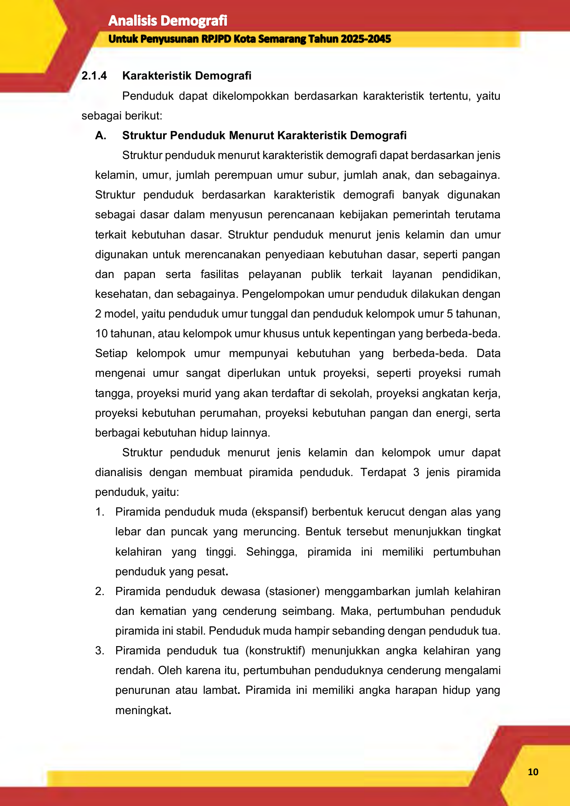

**2.1.4** **Karakteristik Demografi**

Penduduk dapat dikelompokkan berdasarkan karakteristik tertentu, yaitu

sebagai berikut:

**A.** **Struktur Penduduk Menurut Karakteristik Demografi**

Struktur penduduk menurut karakteristik demografi dapat berdasarkan jenis

kelamin, umur, jumlah perempuan umur subur, jumlah anak, dan sebagainya.

Struktur penduduk berdasarkan karakteristik demografi banyak digunakan

sebagai dasar dalam menyusun perencanaan kebijakan pemerintah terutama

terkait kebutuhan dasar. Struktur penduduk menurut jenis kelamin dan umur

digunakan untuk merencanakan penyediaan kebutuhan dasar, seperti pangan

dan papan serta fasilitas pelayanan publik terkait layanan pendidikan,

kesehatan, dan sebagainya. Pengelompokan umur penduduk dilakukan dengan

2 model, yaitu penduduk umur tunggal dan penduduk kelompok umur 5 tahunan,

10 tahunan, atau kelompok umur khusus untuk kepentingan yang berbeda-beda.

Setiap kelompok umur mempunyai kebutuhan yang berbeda-beda. Data

mengenai umur sangat diperlukan untuk proyeksi, seperti proyeksi rumah

tangga, proyeksi murid yang akan terdaftar di sekolah, proyeksi angkatan kerja,

proyeksi kebutuhan perumahan, proyeksi kebutuhan pangan dan energi, serta

berbagai kebutuhan hidup lainnya.

Struktur penduduk menurut jenis kelamin dan kelompok umur dapat

dianalisis dengan membuat piramida penduduk. Terdapat 3 jenis piramida

penduduk, yaitu:

1. Piramida penduduk muda (ekspansif) berbentuk kerucut dengan alas yang

lebar dan puncak yang meruncing. Bentuk tersebut menunjukkan tingkat

kelahiran yang tinggi. Sehingga, piramida ini memiliki pertumbuhan

penduduk yang pesat **.**

2. Piramida penduduk dewasa (stasioner) menggambarkan jumlah kelahiran

dan kematian yang cenderung seimbang. Maka, pertumbuhan penduduk

piramida ini stabil. Penduduk muda hampir sebanding dengan penduduk tua.

3. Piramida penduduk tua (konstruktif) menunjukkan angka kelahiran yang

rendah. Oleh karena itu, pertumbuhan penduduknya cenderung mengalami

penurunan atau lambat **.** Piramida ini memiliki angka harapan hidup yang

meningkat **.**

**10**

--- end of page=18 ---

**Gambar 2. 2** **Jenis-Jenis Piramida Penduduk**

**B.** **Struktur Penduduk Menurut Karakteristik Sosial dan Budaya**

Struktur penduduk menurut karakteristik sosial dan budaya dapat

berdasarkan status kawin, bahasa, etnis/suku bangsa, agama, pendidikan,

kepemilikan identitas dan akte, dan sebagainya. Struktur penduduk menurut

status kawin bermanfaat untuk analisis fertilitas karena status kawin secara tidak

langsung berpengaruh terhadap fertilitas. Struktur penduduk menurut pendidikan

dapat dibuat tabulasi jumlah penduduk yang berada pada umur sekolah.

Informasi tersebut bermanfaat untuk menyusun kebijakan tentang jumlah

sekolah, jumlah guru, dan pembiayaannya yang harus dikeluarkan oleh

pemerintah. Informasi tentang jumlah dan persentase penduduk yang

menamatkan jenjang pendidikan tertentu juga dibutuhkan dalam perencanaan

layanan pendidikan dan ketenagakerjaan.

**C.** **Struktur Penduduk Menurut Karakteristik Ekonomi**

Struktur penduduk menurut karakteristik ekonomi dapat berdasarkan

kegiatan utama sehari-hari, bekerja atau tidak bekerja, status pekerjaan, jenis

mata pencaharian, rata-rata jam kerja, pendapatan, dan sebagainya. Struktur

penduduk menurut karakteristik ekonomi dapat dikelompokkan berdasarkan

kegiatan utama yang dilakukan sehari-hari, angkatan kerja, bekerja,

menganggur, dan sebagainya. Penduduk usia kerja yaitu penduduk berumur 15

tahun dan lebih. Penduduk yang termasuk angkatan kerja adalah penduduk usia

kerja yang bekerja atau punya pekerjaan namun sementara tidak bekerja dan

pengangguran. Penduduk yang termasuk bukan angkatan kerja adalah

penduduk usia kerja yang masih sekolah, mengurus rumah tangga, atau

**11**

--- end of page=19 ---

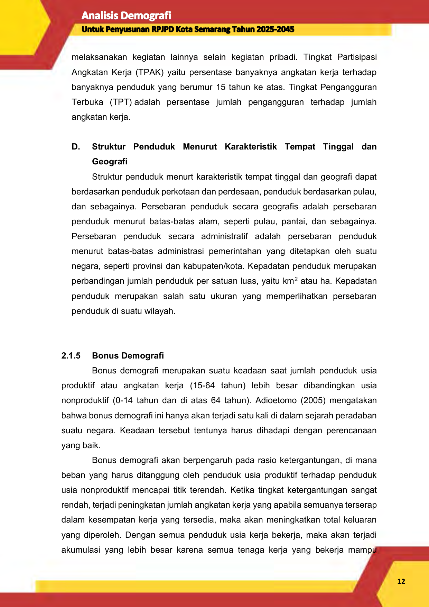

melaksanakan kegiatan lainnya selain kegiatan pribadi. Tingkat Partisipasi

Angkatan Kerja (TPAK) yaitu persentase banyaknya angkatan kerja terhadap

banyaknya penduduk yang berumur 15 tahun ke atas. Tingkat Pengangguran

Terbuka (TPT) adalah persentase jumlah pengangguran terhadap jumlah

angkatan kerja.

**D.** **Struktur Penduduk Menurut Karakteristik Tempat Tinggal dan**

**Geografi**

Struktur penduduk menurt karakteristik tempat tinggal dan geografi dapat

berdasarkan penduduk perkotaan dan perdesaan, penduduk berdasarkan pulau,

dan sebagainya. Persebaran penduduk secara geografis adalah persebaran

penduduk menurut batas-batas alam, seperti pulau, pantai, dan sebagainya.

Persebaran penduduk secara administratif adalah persebaran penduduk

menurut batas-batas administrasi pemerintahan yang ditetapkan oleh suatu

negara, seperti provinsi dan kabupaten/kota. Kepadatan penduduk merupakan

perbandingan jumlah penduduk per satuan luas, yaitu km [2] atau ha. Kepadatan

penduduk merupakan salah satu ukuran yang memperlihatkan persebaran

penduduk di suatu wilayah.

**2.1.5** **Bonus Demografi**

Bonus demografi merupakan suatu keadaan saat jumlah penduduk usia

produktif atau angkatan kerja (15-64 tahun) lebih besar dibandingkan usia

nonproduktif (0-14 tahun dan di atas 64 tahun). Adioetomo (2005) mengatakan

bahwa bonus demografi ini hanya akan terjadi satu kali di dalam sejarah peradaban

suatu negara. Keadaan tersebut tentunya harus dihadapi dengan perencanaan

yang baik.

Bonus demografi akan berpengaruh pada rasio ketergantungan, di mana

beban yang harus ditanggung oleh penduduk usia produktif terhadap penduduk

usia nonproduktif mencapai titik terendah. Ketika tingkat ketergantungan sangat

rendah, terjadi peningkatan jumlah angkatan kerja yang apabila semuanya terserap

dalam kesempatan kerja yang tersedia, maka akan meningkatkan total keluaran

yang diperoleh. Dengan semua penduduk usia kerja bekerja, maka akan terjadi

akumulasi yang lebih besar karena semua tenaga kerja yang bekerja mampu

**12**

--- end of page=20 ---

memperbesar tabungan mereka. Oleh karena itu, bonus demografi dapat

dimanfaatkan apabila penduduk usia kerja yang jumlahnya sangat besar tersebut

dapat memperoleh kesempatan kerja yang produktif. Kesempatan kerja tersebut

dapat diperoleh apabila kualitas sumber daya manusianya unggul dan mampu

bersaing. Apabila penawaran tenaga kerja yang besar tidak ditunjang dengan

kesempatan kerja yang memadai, maka tingkat pengangguran terbuka akan

semakin meningkat.

**2.1.6** **Kajian Regulasi dan Kelembagaan Data Kependudukan**

Data jumlah, struktur dan dinamika penduduk berperan penting dalam

penyusunan perencanaan pembangunan. Mengingat pentingnya data tersebut,

hampir setiap instansi pemerintah di Indonesia membutuhkan data tersebut untuk

kepentingan program dan kegiatan mereka. Guna mengatasi kebutuhan data

kependudukan, pemerintah melalui UU No 16 tahun 1997 tentang Statistik telah

menetapkan Badan Pusat Statistik sebagai Lembaga yang bertanggungjawab

untuk mengumpulkan dan mengolah data statistik kependudukan bagi keperluan

pembangunan. Namun disisi lainnya, pemerintah melalui UU No 24 tahun 2013

tentang Perubahan atas Undang-Undang Nomor 23 Tahun 2006 tentang

Administrasi Kependudukan, juga mengamanatkan Kementerian Dalam Negeri

melalui Direktorat Jenderal Kependudukan dan Pencatatan Sipil yang diteruskan

pada tingkat daerah melalui Dinas Kependudukan dan Pencatatan Sipil sebagai

penanggungjawab penyedia data kependudukan untuk perencanaan

pembangunan. UU ini juga secara tegas memerintahkan seluruh pemerintah

daerah untuk menggunakan data hasil registrasi penduduk dan pencatatan sipil

dalam penyusunan perencanaan pembangunan wilayah masing−masing.

Dengan munculnya kedua UU di atas menimbulkan kerancuan tentang data

mana yang harus digunakan, dan apakah data yang ada dapat memenuhi

kebutuhan seluruh perencanaan pembangunan. Secara umum terdapat perbedaan

mendasar antara data kependudukan yang dihasilkan BPS dan Ditjen

Kependudukan & Pencatatan Sipil Kemendagri, khususnya dalam hal metode

pengumpulan data, sehingga pemanfataannya pun harus tepat. Masing−masing

data memiliki kelemahan dan keunggulan yang harus dipahami oleh seluruh

pengguna data agar tidak salah dalam menggunakan data tersebut.

**13**

--- end of page=21 ---

Perbedaan mendasar dari kedua pengumpulan data tersebut adalah:

1. Pengumpulan data statistik oleh BPS bertujuan untuk mendukung pembangunan

nasional, mengembangkan sistem statistik  nasional yang handal, efektif dan

efisien; meningkatkan kesadaran masyarakat akan arti dan kegunaan statistik

dan  mendukung  pengembangan ilmu pengetahuan dan teknologi. Sementara

pengumpulan data yang dilakukan melalui kegiatan registrasi penduduk dan

pencatatan sipil bertujuan untuk mengadmistrasi penduduk dalam rangka

penerbitan dokumen dan data kependudukan melalui pendaftaran penduduk,

pencatatan sipil, pengelolaan informasi administrsi kependudukan dan

pendayagunaan hasilnya untuk pelayanan publik dan pembangunan sektor lain.

2. Metode yang digunakan berbeda baik cara pengumpulan data, jangka waktu

pengumpulan maupun siapa yang dicacah dan apa saja yang dicacah.

a. Dalam sensus penduduk, data dikumpulkan melalui pencatatan dengan

mendatangi penduduk berdasarkan lokasi saat dicacah (de facto). Registrasi

penduduk (Kemendagri) menggunakan metode penduduk yang aktif

mendaftar,meskipun pendekatan “jemputbola” sekarang juga dilakukan untuk

peningkatan cakupan administrasi kependudukan.

b. Data statistik dikumpulkan dalam jangka waktu tertentu seperti 10 tahun untuk

Sensus Penduduk. Sedangkan untuk ketenagakerjaan (Sakernas), kondisi

sosial ekonomi (Susenas) dilakukan setiap tahun 2 kali. Sementara registrasi

penduduk dan pencatatan sipil dilakukan secara terus  menerus  setiap hari

tergantung pada peristiwa mutasi dan peristiwa penting yang dialami oleh

penduduk. Dilaksanakan hingga unit administrasi yang paling kecil yaitu

kelurahan/desa.

c. Data yang dicacah untuk data statistik (sensus) adalah karakteristik geografi,

demografi, sosial dan ekonomi, kematian untuk bayi, balita dan dewasa dan

kelahiran. Sementara Registrasi mencatat individu beserta karakteristiknya

(biodata penduduk) dan peristiwa penting (kelahiran, kematian, perkawinan,

perceraian, adopsi dan pengangkatan anak).

d. Data statistik kependudukan dilakukan secara menyeluruh sebagai

_benchmark_ data penduduk (sensus) dan data sampel survei untuk mengukur

berbagai indikator dan parameter demografi yang penting. Data sampel

sangat tergantung pada metode pengambilan sampel dan memiliki

kerentanan terhadap sampling error.

**14**

--- end of page=22 ---

Sementara registrasi penduduk dilakukan untuk seluruh penduduk di

suatu kabupaten/kota yang secara sah memenuhi syarat administratif sebagai

penduduk di kabupaten/kota tersebut. Oleh sebab itu, sebenarnya data

registrasi dan pencatatan vital di suatu wilayah, hanya mencakup mereka

yang secara legal diakui sebagai penduduk (memiliki tempat tinggal yang sah

di wilayah tersebut). Sementara dalam wilayah kabupaten/kota terdapat

penduduk pelaku migrasi yang tidak memenuhi syarat ataupun tidak

menginginkan pindah status kependudukan mereka. Sehingga dalam satu

kabupaten/kota selalu terdapat penduduk tidak sah bagi kabupaten/kota

tersebut tetapi sah di kabupaten/kota asal. Adanya persyaratan tempat tinggal

yang sah menyebabkan sebagian penduduk yang tidak memiliki tempat

tinggal tetap juga tidak pernah tercatat oleh administrasi kependudukan

e. Data statistik BPS dapat digunakan untuk mengestimasi berbagai parameter

demografi, sosial dan ekonomi. Sementara data registrasi penduduk dan

pencatatan vital belum bisa memenuhi seluruh kebutuhan penghitungan

parameter demografi seperti kelahiran, kematian (bayi dan ibu), gizi buruk,

kemisikinan, ketenagakerjaan, kesehatan dan lain sebagainya.

**Tabel 2. 1 Matriks Perbedaan Mendasar Data Sensus Penduduk (BPS) dan**

**Registrasi Penduduk (Kemendagri)**

|Jenis Sensus Penduduk Registrasi Penduduk Perbedaan|Col2|Col3|
|---|---|---|
|**1. Definisi**|Suatu proses pengumpulan, pengolahan, penyajian data kependudukan termasuk ciri−ciri sosial ekonominya yang dilaksanakan dalam suatu waktu tertentu terhadap semua orang dalam suatu negara atau suatu teritorial tertentu (UN dalam Shryock & Siegel, hal 115)|Pencatatan kejadian vital dan perubahan parameter kependudukan seperti kelahiran, kematian dan perpindahan penduduk oleh petugas pencatatan berdasarkan laporan dari penduduk|
|**2. Waktu** **pencatatan**|Periodik (10 tahun atau 5 tahun sekali)|Terus menerus secara kontinu|
|**3. Cara** **pencacahan**|Yang   dicatat    individu (orangnya) Dalam sensus pencacah mendatangi rumah tangga, mewawancarai dan mencatat ciri−ciri setiap orang dalam rumah tangga tersebut.|Yang dicatat kejadiannyaDalam pencatatan registrasi masyarakat/penduduk sendiri yang harus melaporkan kejadian vital atau perubahan kependudukan misalnya kelahiran, kematian, pindah dan lain−lainnya|

**15**

--- end of page=23 ---

|Jenis Sensus Penduduk Registrasi Penduduk Perbedaan|Col2|Col3|
|---|---|---|
|**4. Isi catatan**|Bersifat data dasar penduduk yaitu penduduk menurut ciri demografi (umur, jenis kelamin) ciri sosial ekonomi seperti pendidikan, pekerjaan, tempat tinggal, pendapatan dan lain−lain|Sangat singkat, dan umumnya hal−hal pokok yang berhubungan dengan sifatnya untuk keperluan legal/hukum: •  Nama, umur, nama suami/isteri, jenis kelamin •  Tanggal kejadian, tanggal pelaporan, tempat/ alamat kejadian/pelaporan, alamat rumah dan lain-‐lain|
|**5. Kebaikan**|•  Karena cakupannya yang menyeluruh untuk semua penduduk dan simultan, maka terhindar dari kesalahan sampling •  Campuran sistem_de facto_ dan _de_ _jure_,  memungkinkan menjaring semua penduduk yang ada pada saat pencacahan •  Dipublikasikan secara meluas •  Dapat dilakukan analisa sampai tingkat kabupaten|Kalau dilakukan secara kontinu dan konsisten ditunjang dengan sistem yang sempurna maka registrasi penduduk merupakan sumber data yang terbaik karena : •  ada jaminan mengenai kontinuitas dan kelengkapan data, asal semua kejadian dilaporkan kepada petugas _(complete_ _& _ _coverage_)  kecermatan laporan (_accuracy_)  •  asal setiap kejadian segera dilaporkan, •  tersedianya data secara terus menerus asal dibuat pelaporan berupa data statistik (rekap data), misalnya statistik kelahiran atau kematian tingkat kecamatan atau kabupaten dalam suatu tahun tertentu.|
|**6. Kelemahan** |•  Memerlukan biaya pengumpulan yang cukup besar •  Hanya tersedia setiap periode tertentu (10 tahun atau 5 tahun sekali) •  Umumnya tidak mempublikasikan data pada level administrasi terendah misalnya kabupaten/kecamatan secara rinci|•  Umumnya pendaftaran penduduk hanya dilakukan terhadap penduduk_de jure_saja, yaitu yang memenuhi syarat− syarat menjadi penduduk saja, sehingga berakibat pada kekurangan cacah. •  Sifatnya legal, hanya sedikit informasi yang disajikan. •  Sangat tergantung pada sistem (peraturan dan organisasi pelaksanaan), petugas pelaksana serta kesadaran masyarakat untuk melapor. •  Kalau pencatatan tidak dilaksanakan secara konsisten dan terus menerus maka kelengkapan dan kecermatan data terganggu.|

**16**

--- end of page=24 ---

**2.2** **Metode Pelaksanaan Pekerjaan**

**2.2.1** **Metode-Metode Proyeksi Penduduk**

Menurut Badan Pusat Statistik (2010), terdapat 2 metode untuk

memproyeksikan jumlah penduduk pada masa yang akan datang, yaitu metode

matematik dan metode komponen dengan penjelasan sebagai berikut:

**A.** **Metode Matematik**

Metode ini sering disebut juga dengan metode tingkat pertumbuhan

penduduk ( _growth rate_ ). Metode ini merupakan estimasi dari total penduduk

dengan menggunakan tingkat pertumbuhan penduduk secara matematik.

Proyeksi berdasarkan tingkat pertumbuhan penduduk mengasumsikan

pertumbuhan penduduk yang konstan, baik untuk model aritmatika, geometrik,

atau eksponensial untuk mengestimasi jumlah penduduk.

1. Metode Aritmatik

Proyeksi penduduk dengan metode aritmatik mengasumsikan bahwa

jumlah penduduk pada masa yang akan datang akan bertambah dengan jumlah

penduduk yang sama setiap tahunnya. Formula pada metode aritmatik yaitu

sebagai berikut:

𝑃 𝑡 = 𝑃 0 (1 + 𝑟𝑡) dengan 𝑟=

( 𝑃 [𝑃] 0 [𝑡] ~~[−]~~ [1][)]

𝑡

Keterangan:

P t = Jumlah penduduk pada tahun t

P 0 = Jumlah penduduk pada tahun dasar

r = Laju pertumbuhan penduduk

t = Periode waktu antara tahun dasar dan tahun t (dalam tahun)

2. Metode Geometrik

Proyeksi penduduk dengan metode geometrik menggunakan asumsi

bahwa jumlah penduduk akan bertambah secara geometrik menggunakan dasar

perhitungan bunga majemuk (Adioetomo dan Samosir, 2010). Laju pertumbuhan

penduduk ( _rate of growth_ ) dianggap sama untuk setiap tahun. Formula pada

metode geometrik yaitu sebagai berikut:

**17**

--- end of page=25 ---

1

𝑃 𝑡 = 𝑃 0 (1 + 𝑟) [𝑡] dengan 𝑃 𝑡 𝑡 −1
𝑟= ( 𝑃 0 ~~[)]~~

Keterangan:

P t = Jumlah penduduk pada tahun t

P 0 = Jumlah penduduk pada tahun dasar

r = Laju pertumbuhan penduduk

t = Periode waktu antara tahun dasar dan tahun t (dalam tahun)

3. Metode Eksponensial

Proyeksi penduduk dengan metode eksponensial menggambarkan

pertambahan penduduk yang terjadi secara sedikit-sedikit sepanjang tahun,

berbeda dengan metode geometrik yang mengasumsikan bahwa pertambahan

penduduk hanya terjadi pada satu saat selama kurun waktu tertentu (Adioetomo

dan Samosir, 2010). Formula pada metode eksponensial yaitu sebagai berikut:

𝑃 𝑡 = 𝑃 0 𝑒 [𝑟𝑡] dengan 𝑟=

𝐼𝑛
{ ( 𝑃 [𝑃] 0 [𝑡] ~~[)]~~ [}]

𝑡

Keterangan:

P t = Jumlah penduduk pada tahun t

P 0 = Jumlah penduduk pada tahun dasar

r = Laju pertumbuhan penduduk

t = Periode waktu antara tahun dasar dan tahun t (dalam tahun)

e = Bilangan pokok dari sistem logaritma natural (ln) yang besarnya adalah

2,7182818

**B.** **Metode Komponen**

Metode komponen berbasis pada pengertian bahwa perubahan penduduk

suatu wilayah pada periode tertentu merupakan akumulasi dari kejadian

kelahiran dan kematian ( _natural increase_ ) serta net migrasi. Formula pada

metode komponen yaitu sebagai berikut:

𝑃 𝑡 = 𝑃 0 + (𝐿−𝑀) + (𝑀𝑖𝑔𝐼𝑛−𝑀𝑖𝑔𝑂𝑢𝑡)

Keterangan:

P t = Jumlah penduduk pada tahun t

P 0 = Jumlah penduduk pada tahun dasar

L = Jumlah kelahiran

**18**

--- end of page=26 ---

M = Jumlah kematian

MigIn = Jumlah migrasi masuk

MigOut = Jumlah migrasi keluar

Apabila proyeksi penduduk dihitung untuk jangka waktu yang pendek

(kurang dari 5 tahun), baik dengan metode matematik ataupun metode

komponen akan didapati hasil jumlah penduduk yang hampir tidak ada

perbedaan. Hasil proyeksi penduduk untuk jangka waktu pendek dengan metode

matematik relatif masih cukup baik karena kelahiran, kematian, dan perpindahan

tidak berubah secara signifikan. Namun, apabila memproyeksikan penduduk

dalam jangka lebih panjang, hasil metode matematik akan semakin bias seiring

dengan panjangnya periode proyeksi. Hal tersebut dikarenakan kelahiran,

kematian, dan perpindahan pada periode yang panjang telah banyak berubah,

baik pola maupun tingkatnya. Maka, proyeksi penduduk dengan metode

komponen dianggap lebih sesuai untuk memproyeksikan penduduk dalam

jangka waktu yang panjang karena telah mempertimbangkan komponen

komponen yang memengaruhi pertumbuhan penduduk (kelahiran, kematian,

dan perpindahan).

**2.2.2** **Tata Cara Perencanaan Lingkungan Perumahan di Perkotaan**

Standar Nasional Indonesia 03-1733-2004 Tentang Tata Cara

Perencanaan Lingkungan Perumahan di Perkotaan merupakan panduan (dokumen

nasional) yang berfungsi sebagai kerangka acuan untuk perencanaan,

perancangan, dan penaksiran kebutuhan ruang. Berdasarkan SNI tersebut,

penataan lingkungan merupakan suatu usaha untuk memperbaiki, mengubah, dan

mengatur kembali lingkungan tertentu yang sesuai dengan prinsip pemanfaatan

ruang secara optimal. Analisis kebutuhan ruang merupakan analisis untuk

mengetahui kebutuhan jumlah unit dan luas lahan untuk mewadahi kelompok

kelompok aktivitas yang direncanakan agar dapat berfungsi dan berjalan dengan

baik. Standar tersebut berbasis pada jumlah penduduk pendukung dalam

menentukan kebutuhan ruang. Kebutuhan sarana lingkungan perumahan di

perkotaan yaitu sebagai berikut:

**19**

--- end of page=27 ---

**Tabel 2. 2** **Kebutuhan Sarana Lingkungan Perumahan di Perkotaan**

|Sarana Kesehatan|Col2|Col3|Col4|Col5|Col6|
|---|---|---|---|---|---|
|**Sarana**|~~**Jumlah**~~ **Penduduk** **Pendukung** **(Jiwa)**|**Kebutuhan** **Lahan (m2) ** |**Sarana** |~~**Jumlah**~~ **Penduduk** **Pendukung** **(Jiwa)**|**Kebutuhan** **Lahan (m2) **|
|Posyandu |1.250|    60|~~Puskesmas dan~~ Balai Pengobatan|120.000|1.000|
|~~BKIA/Klinik~~ Bersalin |30.000|   3.000|Apotek|30.000|250|
|~~Puskesmas~~ Pembantu dan Balai Pengobatan Lingkungan |30.000 | 300 | | | |
|~~**Sarana Pendidikan**~~ |~~**Sarana Pendidikan**~~ |~~**Sarana Pendidikan**~~ |~~**Sarana Perdagangan dan Niaga**~~ |~~**Sarana Perdagangan dan Niaga**~~ |~~**Sarana Perdagangan dan Niaga**~~ |
|**Sarana**|~~**Jumlah**~~ **Penduduk** **Pendukung** **(Jiwa)**|**Kebutuhan** **Lahan (m2) **|**Sarana** |~~**Jumlah**~~ **Penduduk** **Pendukung** **(Jiwa)**|**Kebutuhan** **Lahan (m2) **|
|TK|1.250|       500 |~~Pusat Pertokoan~~ dan/atau Pasar Lingkungan |30.000|10.000|
|SD|1.600|   2.000 |~~Pusat Perbelanjaan~~ dan Niaga |120.000|36.000|
|SLTP|4.800|   9.000 |  |  |  |
|SMU |4.800 |   12.500|   12.500|   12.500|   12.500|

_Sumber: SNI 03-1733-2004_

**2.3** **Kerangka Pikir**

Dalam penyusunan Penyusunan Dokumen kajian Analisis Demografi Untuk

Penyusunan RPJPD Kota Semarang Tahun 2025-2045 kerangka pikir yang

digunakan digambarkan sebagai berikut:

**Gambar 2. 3 Kerangka Pikir Analisis Demografi Untuk Penyusunan RPJPD**

**Kota Semarang Tahun 2025-2045**

**20**

--- end of page=28 ---

# **BAB III** **KONDISI KEPENDUDUKAN DAN KONDISI EKSISTING SARANA** **PRASANA KOTA SEMARANG**

**3.1** **Luas Wilayah**

Kota Semarang merupakan kota strategis yang berada di tengah-tengah

Pulau Jawa yang terletak antara garis 60 50’ – 70 10’ Lintang Selatan dan garis

1090 35’ – 1100 50’ Bujur Timur. Kota Semarang memiliki wilayah seluas 373,70

km2 dan merupakan 1,15% dari total luas daratan Provinsi Jawa Tengah dengan

batas wilayah:

    - sebelah barat : Kabupaten Kendal

    - sebelah timur : Kabupaten Demak

    - sebelah selatan : Kabupaten Semarang

    - sebelah utara : Laut Jawa

Sumber: Dinas Penataan Ruang Kota Semarang

**Gambar 3. 1 Luas dan Batas Wilayah Administrasi Kota Semarang**

**21**

--- end of page=29 ---

**22**

--- end of page=30 ---

Secara administrasi, Kota Semarang terbagi atas 16 Kecamatan dan 177

Kelurahan. Secara rinci luas masing-masing kecamatan adalah sebagai berikut :

**Tabel 3. 1 Wilayah Administratif Menurut Kecamatan di Kota Semarang**

|No 1 M|Kecamatan Mijen|Banyaknya Kelurahan 14|Luas Wilayah (Km2) 57.55|
|---|---|---|---|
|~~1 ~~ ~~M~~  |~~ijen~~ |~~14~~ |~~57.55~~ |
|~~2 ~~ ~~G~~  |~~unungpati~~ |~~16~~ |~~54.11~~ |
|~~3 ~~ ~~B~~  |~~anyumanik~~ |~~11~~ |~~25.69~~ |
|~~4 ~~ ~~G~~  |~~ajah Mungkur~~ |~~8 ~~ |~~9.07~~ |
|~~5 ~~ ~~S~~  |~~emarang Selatan~~ |~~10~~ |~~5.928~~ |
|~~6 ~~ ~~C~~  |~~andisari~~ |~~7 ~~ |~~6.54~~ |
|~~7 ~~ ~~T~~  |~~embalang~~ |~~12~~ |~~44.2~~ |
|~~8 ~~ ~~P~~  |~~edurungan~~ |~~12~~ |~~20.72~~ |
|~~9 ~~ ~~G~~ |~~enuk~~ |~~13~~ |~~27.39~~ |
|~~10 G~~ |~~ayamsari~~ |~~7 ~~ |~~6.177~~ |
|~~11 S~~ |~~emarang Timur~~ |~~10~~ |~~7.7~~ |
|~~12 S~~ |~~emarang Utara~~ |~~9 ~~ |~~10.97~~ |
|~~13 S~~ |~~emarang Tengah~~ |~~15~~ |~~6.14~~ |
|~~14 S~~ |~~emarang Barat~~ |~~16~~ |~~21.74~~ |
|~~15 T~~ |~~ugu~~ |~~7 ~~ |~~31.78~~ |
|~~16 N~~ |~~galiyan~~ |~~10~~ |~~37.99~~ |
|~~Kota Semarang~~ |~~Kota Semarang~~ |~~**177**~~ |~~**373.7**~~|

Sumber: BPS Kota Semarang

Kedudukan Kota Semarang sebagai ibukota Provinsi Jawa Tengah dan

ditunjang lokasi yang strategis pada jalur lalu lintas ekonomi Pulau Jawa

menjadikan Kota Semarang tidak hanya berperan sebagai pusat pemerintahan

tetapi juga salah satu pusat ekonomi di Jawa Tengah. Kota Semarang memiliki

lokasi strategis sebagai koridor pembangunan di Provinsi Jawa Tengah yang

terdiri dari empat simpul pintu gerbang yaitu koridor pantai utara, koridor selatan,

koridor timur dan koridor barat, dan juga didukung sejumlah fasilitas transportasi

seperti Pelabuhan Tanjung Emas, Bandar Udara Internasional Ahmad Yani,

Terminal Terboyo, serta Stasiun Kereta Api Tawang dan Poncol yang semakin

menguatkan peran Kota Semarang sebagai simpul aktivitas pembangunan

sekaligus gerbang perekonomian di Provinsi Jawa Tengah dan bagian tengah

Pulau Jawa.

**23**

--- end of page=31 ---

**3.2** **Kondisi Penduduk**

**3.2.1. Jumlah Penduduk**

Selama 10 tahuan terakhir dari tahun 2012 hingga 2022 pertumbuhan

penduduk di Kota Semarang mengalami perkembangan yang fluktuatif

cenderung meningkat. Tercatat tahun 2012 jumlah penduduk Kota Semarang

sebesar 1.559.198 jiwa melonjak hingga 1.814.110 jiwa di tahun 2019, namun

kembali berangsur menurun sejak tahun 2020 hingga 2022 menjadi 1.659.975

jiwa ditahun 2022. Penurunan jumlah penduduk Kota Semarang sejak tahun

2020 dianulir disebabkan karena tingginya angka kematian akibat pandemic

covid 19 yang terjadi sejak tahun 2019. Secara rinci kondisi jumlah penduduk

Kota Semarang tahun 2012 hingga 2022 dapat dilihat pada gambar berikut.

Sumber: BPS Kota Semarang,2023

**Gambar 3. 2 Jumlah Penduduk Kota Semarang Tahun 2012-2022**

Selaras dengan kondisi fluktuatif di tingkat kota, perkembangan jumlah

penduduk di masing-masing kecamatan di Kota Semarang. Selama 10 tahun

terakhir rata-rata kecamatan yang memiliki jumlah penduduk paling tinggi berada

di Kecamatan Pedurungan, Tembalang, Semarang Barat, Banyumanik, dan

Ngaliyan. Tingginya jumlah penduduk di kelima kecamatan tersebut

dimungkinkan akan terus terjadi pada tahun-tahun yang akan datang, sehingga

perlu diperhatikan ketersediaan sarana prasarana, dan sumber daya pendukung

pembangunan wilayah kecamatan. Secara rinci jumlah penduduk di masing

**24**

--- end of page=32 ---

masing kecamatan di Kota Semarang tahun 2012 hingga 2022 dapat dilihat pada

tabel berikut.

**25**

--- end of page=33 ---

**Tabel 3. 2 Jumlah Penduduk Kota Semarang Per Kecamatan Tahun 2012-2022**

|Kecamatan|Jumlah Penduduk|Col3|Col4|Col5|Col6|Col7|Col8|Col9|Col10|Col11|Col12|Col13|
|---|---|---|---|---|---|---|---|---|---|---|---|---|
|**Kecamatan** |~~**2012**~~ |~~**2013**~~ |~~**2014**~~  |~~**2015**~~ |~~**2016**~~ |~~**2017**~~ |~~**2018**~~ |~~**2019**~~ |~~**2020**~~ |~~**2021**~~ |~~**2022**~~ |~~**Rata-Rata**~~ |
|~~Mijen~~ |~~56.570~~ |~~57.887~~ | ~~56.570~~  |~~61.405~~ |~~63.348~~ |~~70.889~~ |~~74.864~~ |~~76.037~~ |~~80.906~~ |~~83.321~~ |~~85.818~~ |~~**69.783**~~ |
|~~Gunungpati~~ |~~75.027~~ |~~75.885~~ | ~~75.027~~  |~~78.641~~ |~~79.984~~ |~~88.746~~ |~~116.928~~ |~~118.760~~ |~~98.023~~ |~~98.343~~ |~~98.674~~ |~~**91.276**~~ |
|~~Banyumanik~~ |~~128.225~~ |~~130.494~~ | ~~128.225~~  |~~132.508~~ |~~133.489~~ |~~146.732~~ |~~162.408~~ |~~164.953~~ |~~142.076~~ |~~141.689~~ |~~141.319~~ |~~**141.102**~~ |
|~~Gajahmungkur~~ |~~63.430~~ |~~63.599~~ | ~~63.430~~  |~~63.707~~ |~~63.766~~ |~~69.510~~ |~~59.743~~ |~~60.679~~ |~~56.232~~ |~~55.857~~ |~~55.490~~ |~~**61.404**~~ |
|~~Semarang Selatan~~ |~~82.931~~ |~~82.293~~ | ~~82.931~~  |~~79.620~~ |~~79.162~~ |~~85.456~~ |~~69.433~~ |~~70.522~~ |~~62.030~~ |~~61.616~~ |~~61.212~~ |~~**74.291**~~ |
|~~Candisari~~ |~~79.902~~ |~~79.706~~ | ~~79.902~~  |~~79.258~~ |~~78.863~~ |~~85.652~~ |~~75.671~~ |~~76.857~~ |~~75.456~~ |~~74.952~~ |~~74.461~~ |~~**78.244**~~ |
|~~Tembalang~~ |~~142.941~~ |~~147.564~~ | ~~142.941~~  |~~156.868~~ |~~159.066~~ |~~175.732~~ |~~206.271~~ |~~209.504~~ |~~189.680~~ |~~191.560~~ |~~193.480~~ |~~**174.146**~~ |
|~~Pedurungan~~ |~~175.770~~ |~~177.143~~ | ~~175.770~~  |~~180.282~~ |~~181.629~~ |~~199.153~~ |~~211.376~~ |~~214.689~~ |~~193.151~~ |~~193.128~~ |~~193.125~~ |~~**190.474**~~ |
|~~Genuk~~ |~~91.527~~ |~~93.439~~ | ~~91.527~~  |~~97.545~~ |~~99.508~~ |~~110.556~~ |~~117.174~~ |~~119.010~~ |~~123.310~~ |~~125.967~~ |~~128.696~~ |~~**108.933**~~ |
|~~Gayamsari~~ |~~73.584~~ |~~73.745~~ | ~~73.584~~  |~~74.178~~ |~~74.122~~ |~~80.751~~ |~~81.755~~ |~~83.036~~ |~~70.261~~ |~~69.792~~ |~~69.334~~ |~~**74.922**~~ |
|~~Semarang Timur~~ |~~78.889~~ |~~78.622~~ | ~~78.889~~  |~~77.331~~ |~~76.608~~ |~~82.867~~ |~~74.592~~ |~~75.762~~ |~~66.302~~ |~~65.859~~ |~~65.427~~ |~~**74.650**~~ |
|~~Semarang Utara~~ |~~127.921~~ |~~128.026~~ | ~~127.921~~  |~~127.752~~ |~~127.132~~ |~~137.776~~ |~~117.801~~ |~~119.647~~ |~~117.605~~ |~~116.820~~ |~~116.054~~ |~~**124.041**~~ |
|~~Semarang Tengah~~ |~~71.674~~ |~~71.200~~ | ~~71.674~~  |~~70.179~~ |~~69.711~~ |~~74.954~~ |~~60.158~~ |~~61.102~~ |~~55.064~~ |~~54.696~~ |~~54.338~~ |~~**64.977**~~ |
|~~Semarang Barat~~ |~~158.981~~ |~~158.668~~ | ~~158.981~~  |~~158.131~~ |~~157.554~~ |~~171.315~~ |~~162.501~~ |~~165.048~~ |~~148.879~~ |~~147.885~~ |~~146.915~~ |~~**157.714**~~ |
|~~Tugu~~ |~~30.904~~ |~~31.279~~ | ~~30.904~~  |~~31.954~~ |~~32.041~~ |~~35.023~~ |~~32.818~~ |~~33.333~~ |~~32.822~~ |~~32.948~~ |~~33.079~~ |~~**32.464**~~ |
|~~Ngaliyan~~  |~~120.922~~ |~~122.555~~ | ~~120.922~~  |~~125.828~~ |~~126.734~~ |~~137.980~~ |~~162.622~~ |~~165.171~~ |~~141.727~~ |~~142.131~~ |~~142.553~~ |~~**137.195**~~ |
|~~**Kota Semarang**~~  |~~**1.559.198**~~ |~~**1.572.105**~~ | ~~**1.559.198**~~|~~**1.595.187**~~|~~**1.602.717**~~|~~**1.753.092**~~|~~**1.786.114**~~|~~**1.814.110**~~|~~**1.653.524**~~|~~**1.656.564**~~|~~**1.659.975**~~|~~**1.655.617**~~|

Sumber: BPS Kota Semarang, 2023

**26**

--- end of page=34 ---

**3.2.2. Kepadatan Penduduk**

Kepadatan penduduk Kota Semarang tahun 2012 hingga 2022 juga

mengalami perkembangan fluktuatif cenderung meningkat, selaras dengan

pertumbuhan jumlah penduduk di Kota Semarang. Tercatat pada tahun 2012

kepadatan penduduk di Kota Semarang sebesar 4.172 jiwa/Km [2] meningkat di

tahun 2022 menjadi 4.441 jiwa/Km [2] . Kepadatan penduduk di Kota Semarang

paling tinggi terjadi di tahun 2019 sebesar 4.855 jiwa/Km [2] . Berkaca dari kondisi

tahun 2019 tingginya kepadatan penduduk di Kota Semarang dimungkinkan

akan terjadi di tahun-tahun yang akan datang sehingga perlu diperhatikan daya

dukung dan daya tampung lingkungan dalam pemenuhan sarana prasarana di

Kota Semarang ke depannya. Secara rinci kondisi kepadatan penduduk tahun

2012 hingga 2022 dapat dilihat sebagai berikut.

Sumber: BPS Kota Semarang, 2023.

**Gambar 3. 3 Kepadatan Penduduk Kota Semarang Tahun 2012-2022**

Selama kurun waktu 10 tahun kecamtan yang memiliki tingkat kepadatan

penduduk paling tinggi di Kota Semarang antara lain adalah Kecamatan

Semarang Selatan, Gayamsari, Candisari, Semarang Utara, dan Semarang

Timur. Secara rinci kondisi kepadatan penduduk di Kota Semarang per

Kecamatan dapat dilihat pada table berikut ini.

**27**

--- end of page=35 ---

**Tabel 3. 3 Kepadatan Penduduk Kota Semarang Per Kecamatan Tahun 2012-2022**

|Kecamatan|Kepadatan Wilayah|Col3|Col4|Col5|Col6|Col7|Col8|Col9|Col10|Col11|Col12|Col13|
|---|---|---|---|---|---|---|---|---|---|---|---|---|
|**Kecamatan** |~~** 2012**~~ |~~** 2013**~~ |~~** 2014**~~ |~~** 2015**~~ |~~** 2016**~~ |~~** 2017**~~ |~~** 2018**~~ |~~** 2019**~~ |~~** 2020**~~ |~~** 2021**~~ |~~** 2022**~~ |~~**Rata-Rata**~~  |
|~~Mijen~~ |~~   983~~ |~~  1.005~~ |~~   983~~ |~~  1.067~~ |~~  1.101~~ |~~  1.213~~ |~~  1.301~~ |~~  1.321~~ |~~  1.431~~ |~~  1.474~~ |~~  1.518~~ |~~** 1.218**~~  |
|~~Gunungpati~~ |~~  1.387~~ |~~  1.402~~ |~~  1.387~~ |~~  1.453~~ |~~  1.478~~ |~~  2.023~~ |~~  2.161~~ |~~  2.195~~ |~~  1.682~~ |~~  1.688~~ |~~  1.693~~ |~~** 1.686**~~  |
|~~Banyumanik~~ |~~  4.991~~ |~~  5.079~~ |~~  4.991~~ |~~  5.158~~ |~~  5.196~~ |~~  6.072~~ |~~  6.322~~ |~~  6.421~~ |~~  4.777~~ |~~  4.764~~ |~~  4.751~~ |~~** 5.320**~~  |
|~~Gajahmungkur~~ |~~  6.993~~ |~~  7.012~~ |~~  6.993~~ |~~  7.024~~ |~~  7.030~~ |~~  6.611~~ |~~  6.587~~ |~~  6.690~~ |~~  6.018~~ |~~  5.978~~ |~~  5.939~~ |~~** 6.625**~~  |
|~~Semarang Selatan~~ |~~ 13.990~~ |~~ 13.882~~ |~~ 13.990~~ |~~ 13.431~~ |~~ 13.354~~ |~~ 11.755~~ |~~ 11.713~~ |~~ 11.896~~ |~~ 10.432~~ |~~ 10.362~~ |~~ 10.294~~ |~~** 12.282**~~  |
|~~Candisari~~ |~~ 12.217~~ |~~ 12.187~~ |~~ 12.217~~ |~~ 12.119~~ |~~ 12.059~~ |~~ 11.613~~ |~~ 11.570~~ |~~ 11.752~~ |~~ 11.795~~ |~~ 11.717~~ |~~ 11.640~~ |~~** 11.899**~~  |
|~~Tembalang~~ |~~  3.234~~ |~~  3.338~~ |~~  3.234~~ |~~  3.549~~ |~~  3.599~~ |~~  4.394~~ |~~  4.667~~ |~~  4.740~~ |~~  4.806~~ |~~  4.853~~ |~~  4.902~~ |~~** 4.120**~~  |
|~~Pedurungan~~ |~~  8.483~~ |~~  8.549~~ |~~  8.483~~ |~~  8.701~~ |~~  8.766~~ |~~  9.839~~ |~~ 10.202~~ |~~ 10.361~~ |~~  9.150~~ |~~  9.149~~ |~~  9.149~~ |~~** 9.166**~~  |
|~~Genuk~~ |~~  3.342~~ |~~  3.411~~ |~~  3.342~~ |~~  3.561~~ |~~  3.633~~ |~~  4.045~~ |~~  4.278~~ |~~  4.345~~ |~~  4.747~~ |~~  4.849~~ |~~  4.954~~ |~~** 4.046**~~  |
|~~Gayamsari~~ |~~ 11.913~~ |~~ 11.938~~ |~~ 11.913~~ |~~ 12.009~~ |~~ 12.000~~ |~~ 12.853~~ |~~ 13.235~~ |~~ 13.443~~ |~~ 11.296~~ |~~ 11.221~~ |~~ 11.147~~ |~~** 12.088**~~  |
|~~Semarang Timur~~ |~~ 10.245~~ |~~ 10.210~~ |~~ 10.245~~ |~~ 10.043~~ |~~  9.949~~ |~~  9.722~~ |~~  9.687~~ |~~  9.839~~ |~~ 12.229~~ |~~ 12.147~~ |~~ 12.067~~ |~~** 10.580**~~  |
|~~Semarang Utara~~ |~~ 11.661~~ |~~ 11.670~~ |~~ 11.661~~ |~~ 11.646~~ |~~ 11.589~~ |~~ 10.771~~ |~~ 10.738~~ |~~ 10.907~~ |~~ 10.323~~ |~~ 10.254~~ |~~ 10.187~~ |~~** 11.037**~~  |
|~~Semarang Tengah~~ |~~ 11.673~~ |~~ 11.596~~ |~~ 11.673~~ |~~ 11.430~~ |~~ 11.353~~ |~~  9.833~~ |~~  9.798~~ |~~  9.951~~ |~~ 10.643~~ |~~ 10.572~~ |~~ 10.503~~ |~~** 10.820**~~  |
|~~Semarang Barat~~ |~~  7.313~~ |~~  7.298~~ |~~  7.313~~ |~~  7.274~~ |~~  7.247~~ |~~  7.408~~ |~~  7.475~~ |~~  7.592~~ |~~  6.868~~ |~~  6.822~~ |~~  6.778~~ |~~** 7.217**~~  |
|~~Tugu~~ |~~   972~~ |~~   984~~ |~~   972~~ |~~  1.005~~ |~~  1.008~~ |~~  1.008~~ |~~  1.033~~ |~~  1.049~~ |~~  1.167~~ |~~  1.171~~ |~~  1.176~~ |~~** 1.050**~~  |
|~~Ngaliyan~~ |~~  3.183~~ |~~  3.226~~ |~~  3.183~~ |~~  3.312~~ |~~  3.336~~ |~~  4.050~~ |~~  4.281~~ |~~  4.348~~ |~~  3.297~~ |~~  3.306~~ |~~  3.316~~ |~~** 3.531**~~  |
|~~**Kota Semarang**~~ |~~**  4.172**~~ |~~**  4.206**~~ |~~**  4.172**~~|~~**  4.269**~~|~~**  4.289**~~|~~**  4.628**~~|~~**  4.780**~~|~~**  4.855**~~|~~**  4.424**~~|~~**  4.432**~~|~~**  4.441**~~|~~** 4.424**~~|

Sumber: BPS Kota Semarang, 2023

**28**

--- end of page=36 ---

**3.2.3. Jumlah Penduduk Menurut Usia**

Jumlah penduduk menurut usa di Kota Semarang selama 10 tahun terakhir sejak tahun 2012 hingga 2022 rata-rata

didominasi oleh penduduk usia 20 – 24 tahun, usia 15 – 19 tahun dan usia 30 – 34 tahun. Melihat kondisi tersebut dimungkinkan

selama dua puluh tahun ke depan akan terjadi lonjakan penduduk pada usia 25 tahun hingga 44 tahun. Melihat kondisi tersebut

maka perlu diperhatikan ketersediaan lapangan pekerjaan, pemenuhan pangan dan aspek lain yang penting bagi keberlanjutan

pembangunan masyarakat. Kondisi jumlah penduduk Kota Semarang berdasarkan usia secara rinci dapat dilihat sebagai

berikut.

**Tabel 3. 4 Jumlah Penduduk Kota Semarang Berdasarkan Usia Tahun 2012-2022**

|Kelompok Umur|Jumlah Penduduk|Col3|Col4|Col5|Col6|Col7|Col8|Col9|Col10|Col11|Col12|Rata-Rata|
|---|---|---|---|---|---|---|---|---|---|---|---|---|
|**Kelompok** **Umur**|**2012**|**2013**|**2014**|**2015**|**2016**|**2017**|**2018**|**2019**|**2020**|**2021**|**2022**|**2022**|
|0 - 4|124.567|125.877|127.144|128.160|130.294|124.855|130.121|132.390|117.085|116.177|115.384|** 124.732**|
|5 - 9|123.667|125.079|126.317|127.296|131.909|125.206|133.452|131.260|122.988|121.932|121.061|** 126.379**|
|10 - 14|120.204|121.431|122.605|123.540|132.709|132.470|135.380|122.967|126.945|125.648|124.332|** 126.203**|
|15 - 19|144.573|145.665|146.865|147.816|149.474|149.301|150.703|165.593|130.816|129.178|127.834|** 144.347**|
|20 - 24|153.759|154.103|155.126|156.023|176.013|195.427|184.371|203.873|127.826|125.551|123.356|** 159.584**|
|25 - 29|147.324|148.565|149.777|150.794|157.822|157.058|165.799|156.358|130.016|128.973|127.842|** 147.303**|
|30 - 34|137.114|138.394|139.641|140.630|137.870|139.728|137.330|138.052|132.695|132.127|131.434|** 136.820**|
|35 - 39|123.188|124.347|125.471|126.367|133.647|144.722|134.667|133.963|135.294|135.236|135.311|** 132.019**|
|40 - 44|116.952|118.074|119.109|119.929|124.926|120.652|128.270|128.692|134.160|134.398|134.405|** 125.415**|
|45 - 49|104.742|105.768|106.592|107.253|118.014|123.842|121.124|123.063|120.315|121.310|122.443|** 115.861**|
|50 - 54|88.909|89.675|90.286|90.773|108.391|106.267|113.779|116.267|106.845|108.078|109.113|** 102.580**|
|55 - 59|63.552|64.026|64.364|64.654|86.662|85.192|93.851|96.369|91.166|93.158|95.163|** 81.651**|
|60 - 64|36.369|36.563|36.731|36.858|52.844|60.663|59.577|61.596|72.877|74.977|77.040|** 55.100**|
|65 +|74.280|74.540|74.878|75.173|88.853|87.709|97.690|103.667|104.496|109.821|56.408|** 86.138**|
|**Jumlah** |**  1.559.200** |**  1.572.107** |**  1.584.906** |**  1.595.266**|**  1.729.428**|**  1.753.092**|**  1.786.114**|**  1.814.110**|** 1.653.524**|** 1.656.564**|** 1.601.126**|** 1.664.131**|

Sumber: BPS Kota Semarang, 2023

**29**

--- end of page=37 ---

Kondisi penduduk berdasarkan usia dan jenis kelamin selanjutnya dapat

dilihat detail melalui bentuk piramida penduduk. Selama 20 tahun kebelakang

struktur penduduk di Kota Semarang menurut usia membentuk piramida

penduduk statisioner. Dengan rata-rata komposisi penduduk paling banyak usia

lebih dadi 65 tahun sejak tahun 2012 hingga 2021, namun di tahun 2022 piramida

penduduk menunjukan bentuk statisioner dengan penduduk banyak pada usia

35-44 tahun. Gambaran piramida penduduk di Kota Semarang sejak tahun 2012

hingga 2022 dapat dilihat sebagai berikut.

**30**

--- end of page=38 ---

Sumber: BPS Kota Semarang, 2023

**Gambar 3. 4 Piramida Penduduk Kota Semarang Tahun 2012-2022**

**3.2.4. Jumlah Penduduk Menurut Jenis Kelamin per Kecamatan**

Penduduk Kota Semarang sejak tahun 2012 hingga 2022 di dominasi

oleh penduduk berjenis kelamin perempuan. Dominasi penduduk perempuan

dibandingan penduduk laki-laki tertinggi terjadi pada tahun 2019, dengan kondisi

terdapat 35.514 jiwa penduduk perempuan lebih banyak dibanding jumlah

penduduk laki-laki. Sedangkan dominasi penduduk perempuan dibandingkan

penduduk laki-laki paling kecil terjadi pada tahun 2012, dengan kondisi hanya

sebanyak 7.612 jiwa penduduk perempuan mendominasi penduduk laki-laki.

Secara rinci gambar jumlah penduduk menurut jenis kelamin di Kota Semarang

dapat dilihat sebagai berikut.

950.000

900.000

850.000

800.000

750.000

700.000

|Col1|Col2|Col3|Col4|Col5|Col6|12|Col8|Col9|Col10|
|---|---|---|---|---|---|---|---|---|---|
||||**398**|   **4.128**|**52** **910.362**|**.298** **924.8**||||
||||**8.030** **881.**|**858.964**   **89**|**875.7** |**889**|**1** **083**|**5** **.779**|**1** **083**|
|**176** **.929**|**.705**  **7.176**|**2.886**  **02.301**|**84**||||**818.44** **835.**|**819.78** **836**|**818.44** **835.**|
|**781.** **79**|**787**  **79**|**79**  **8**||||||||

**2012** **2013** **2014** **2015** **2016** **2017** **2018** **2019** **2020** **2021** **2022**

Laki-Laki Perempuan

Sumber: BPS Kota Semarang, 2023

**Gambar 3. 5 Jumlah Penduduk Berdasarkan Jenis Kelamin**

**Kota Semarang Tahun 2012-2022**

**31**

--- end of page=39 ---

Lima Kecamatan dengan jumlah penduduk laki-laki paling tinggi terdapat

di Kecamatan Pedurungan, Tembalang, Semarang Barat, Banyumanik, dan

Ngaliyan. Sedangkan jumlah penduduk perempuan paling banyak terdapat di

Kecamatan Pedurungan, Tembalang, Semarang Barat, Banyumanik dan

Ngaliyan. Kondisi sebaran penduduk berdasarkan jenis kelamin juga perlu

diperhatikan untuk memetakan kebutuhan sarana prasarana sesuai dengan

kebutuhan gender. Secara rinci kondisi jumlah penduduk berdasarkan jenis

kelamin laki-laki dan perempuan dapat dilihat pada Tabel 3.5 dan Tabel 3.6

berikut.

**32**

--- end of page=40 ---

**Tabel 3. 5 Jumlah Penduduk Berjenis Kelamin Laki-Laki Kota Semarang Tahun 2012-2022**

|Kecamatan|Laki laki|Col3|Col4|Col5|Col6|Col7|Col8|Col9|Col10|Col11|Col12|Col13|
|---|---|---|---|---|---|---|---|---|---|---|---|---|
|**Kecamatan** |~~**2012**~~ |~~**2013**~~ |~~**2014**~~ |~~**2015**~~ |~~**2016**~~ |~~**2017**~~ |~~**2018**~~ |~~**2019**~~ |~~**2020**~~ |~~**2021**~~ |~~**2022**~~ |~~**Rata-Rata**~~ |
|~~Mijen~~ |~~   28.479~~ |~~    29.192~~ |~~   29.957~~ |~~   30.942~~ |~~   34.991~~ |~~   35.271~~ |~~   37.519~~ |~~    38.099~~ |~~   40.520~~ |~~   41.695~~ |~~   40.520~~ |~~**   35.199**~~ |
|~~Gunungpati~~ |~~   37.534~~ |~~    37.963~~ |~~   38.713~~ |~~   39.403~~ |~~   54.366~~ |~~   43.772~~ |~~   58.058~~ |~~    58.956~~ |~~   49.023~~ |~~   49.179~~ |~~   49.023~~ |~~**   46.908**~~ |
|~~Banyumanik~~ |~~   63.671~~ |~~    64.158~~ |~~   64.591~~ |~~   65.158~~ |~~   76.263~~ |~~   71.137~~ |~~   79.363~~ |~~    80.590~~ |~~   70.074~~ |~~   69.891~~ |~~   70.074~~ |~~**   70.452**~~ |
|~~Gajahmungkur~~ |~~   31.760~~ |~~    31.859~~ |~~   31.890~~ |~~   31.909~~ |~~   29.852~~ |~~   34.299~~ |~~   29.731~~ |~~    30.190~~ |~~   27.592~~ |~~   27.396~~ |~~   27.592~~ |~~**   30.370**~~ |
|~~Semarang Selatan~~ |~~   41.357~~ |~~    40.758~~ |~~   39.504~~ |~~   39.323~~ |~~   33.086~~ |~~   41.536~~ |~~   32.951~~ |~~    33.461~~ |~~   30.168~~ |~~   29.954~~ |~~   30.168~~ |~~**   35.661**~~ |
|~~Candisari~~ |~~   39.649~~ |~~    39.517~~ |~~   39.551~~ |~~   39.333~~ |~~   37.157~~ |~~   41.854~~ |~~   37.006~~ |~~    37.578~~ |~~   37.232~~ |~~   36.967~~ |~~   37.232~~ |~~**   38.461**~~ |
|~~Tembalang~~ |~~   72.234~~ |~~    74.629~~ |~~   78.378~~ |~~   79.440~~ |~~   96.198~~ |~~   87.580~~ |~~  102.115~~ |~~   103.695~~ |~~   94.453~~ |~~   95.369~~ |~~   94.453~~ |~~**   88.959**~~ |
|~~Pedurungan~~ |~~   86.884~~ |~~    87.441~~ |~~   88.138~~ |~~   89.005~~ |~~  100.946~~ |~~   97.025~~ |~~  104.617~~ |~~   106.235~~ |~~   95.791~~ |~~   95.725~~ |~~   95.791~~ |~~**   95.236**~~ |
|~~Genuk~~ |~~   45.928~~ |~~    46.912~~ |~~   47.861~~ |~~   49.086~~ |~~   55.506~~ |~~   54.909~~ |~~   58.681~~ |~~    59.589~~ |~~   61.884~~ |~~   63.182~~ |~~   61.884~~ |~~**   55.038**~~ |
|~~Gayamsari~~ |~~   37.099~~ |~~    37.254~~ |~~   37.297~~ |~~   37.463~~ |~~   39.335~~ |~~   40.176~~ |~~   40.487~~ |~~    41.113~~ |~~   34.912~~ |~~   34.664~~ |~~   34.912~~ |~~**   37.701**~~ |
|~~Semarang Timur~~ |~~   38.842~~ |~~    38.671~~ |~~   38.378~~ |~~   38.072~~ |~~   34.544~~ |~~   40.327~~ |~~   34.404~~ |~~    34.936~~ |~~   32.181~~ |~~   31.952~~ |~~   32.181~~ |~~**   35.863**~~ |
|~~Semarang Utara~~ |~~   62.339~~ |~~    62.256~~ |~~   62.264~~ |~~   62.041~~ |~~   57.475~~ |~~   65.911~~ |~~   57.275~~ |~~    58.161~~ |~~   58.051~~ |~~   57.692~~ |~~   58.051~~ |~~**   60.138**~~ |
|~~Semarang Tengah~~ |~~   35.023~~ |~~    64.766~~ |~~   34.541~~ |~~   34.333~~ |~~   27.912~~ |~~   36.188~~ |~~   27.798~~ |~~    28.228~~ |~~   26.373~~ |~~   26.186~~ |~~   26.373~~ |~~**   33.429**~~ |
|~~Semarang Barat~~ |~~   79.214~~ |~~    78.970~~ |~~   78.884~~ |~~   78.650~~ |~~   78.420~~ |~~   83.877~~ |~~   79.089~~ |~~    80.312~~ |~~   73.130~~ |~~   72.610~~ |~~   73.130~~ |~~**   77.844**~~ |
|~~Tugu~~ |~~   15.393~~ |~~    15.642~~ |~~   15.761~~ |~~   15.942~~ |~~   15.999~~ |~~   17.234~~ |~~   16.380~~ |~~    16.633~~ |~~   16.457~~ |~~   16.515~~ |~~   16.457~~ |~~**   16.219**~~ |
|~~Ngaliyan~~ |~~   60.387~~ |~~    61.188~~ |~~   61.952~~ |~~   62.786~~ |~~   75.980~~ |~~   67.868~~ |~~   80.279~~ |~~    81.521~~ |~~   70.600~~ |~~   70.808~~ |~~   70.600~~ |~~**   69.452**~~ |
|~~**Kota Semarang**~~ |~~**  775.79**~~ |~~**   781.176**~~ |~~**  787.705**~~ |~~**  792.886**~~|~~**  848.030**~~|~~**  858.964**~~|~~**  875.752**~~|~~**   889.298**~~|~~**  818.441**~~|~~**  819.785**~~|~~**  818.441**~~|~~**  824.206**~~|

Sumber: BPS Kota Semarang, 2023

**33**

--- end of page=41 ---

**Tabel 3. 6 Jumlah Penduduk Berjenis Kelamin Perempuan Kota Semarang Tahun 2012-2022**

|Kecamatan|Perempuan|Col3|Col4|Col5|Col6|Col7|Col8|Col9|Col10|Col11|Col12|Col13|
|---|---|---|---|---|---|---|---|---|---|---|---|---|
|**Kecamatan** |~~**2012**~~ |~~**2013**~~ |~~**2014**~~ |~~**2015**~~ |~~**2016**~~ |~~**2017**~~ |~~**2018**~~ |~~**2019**~~ |~~**2020**~~ |~~**2021**~~ |~~**2022**~~ |~~**Rata-Rata**~~ |
|~~Mijen~~ |~~   28.09~~ |~~1    28.695~~ |~~   29.468~~ |~~   30.463~~ |~~   34.798~~ |~~   35.618~~ |~~   37.345~~ |~~   37.938~~ |~~   40.386~~ |~~   41.626~~ |~~   40.386~~ |~~**   34.983**~~ |
|~~Gunungpati~~ |~~   37.49~~ |~~3    37.922~~ |~~   38.595~~ |~~   39.238~~ |~~   55.079~~ |~~   44.974~~ |~~   58.870~~ |~~   59.804~~ |~~   49.000~~ |~~   49.164~~ |~~   49.000~~ |~~**   47.194**~~ |
|~~Banyumanik~~ |~~   64.55~~ |~~4    66.336~~ |~~   66.813~~ |~~   67.350~~ |~~   79.731~~ |~~   75.595~~ |~~   83.045~~ |~~   84.363~~ |~~   72.002~~ |~~   71.798~~ |~~   72.002~~ |~~**   73.054**~~ |
|~~Gajahmungkur~~ |~~   31.67~~ |~~0    31.740~~ |~~   31.770~~ |~~   31.798~~ |~~   30.108~~ |~~   35.211~~ |~~   30.013~~ |~~   30.489~~ |~~   28.640~~ |~~   28.461~~ |~~   28.640~~ |~~**   30.776**~~ |
|~~Semarang Selatan~~ |~~   41.57~~ |~~4    51.535~~ |~~   40.448~~ |~~   40.297~~ |~~   36.598~~ |~~   43.920~~ |~~   36.481~~ |~~   37.061~~ |~~   31.862~~ |~~   31.662~~ |~~   31.862~~ |~~**   38.482**~~ |
|~~Candisari~~ |~~   40.25~~ |~~3    40.189~~ |~~   40.095~~ |~~   39.925~~ |~~   38.789~~ |~~   43.798~~ |~~   38.665~~ |~~   39.279~~ |~~   38.224~~ |~~   37.985~~ |~~   38.224~~ |~~**   39.584**~~ |
|~~Tembalang~~ |~~   70.70~~ |~~7    79.935~~ |~~   76.319~~ |~~   77.428~~ |~~   98.033~~ |~~   88.152~~ |~~  104.156~~ |~~  105.809~~ |~~   95.227~~ |~~   96.191~~ |~~   95.227~~ |~~**   89.744**~~ |
|~~Pedurungan~~ |~~   88.88~~ |~~6    89.702~~ |~~   90.361~~ |~~   91.277~~ |~~  102.920~~ |~~  102.128~~ |~~  106.759~~ |~~  108.453~~ |~~   97.360~~ |~~   97.403~~ |~~   97.360~~ |~~**   97.510**~~ |
|~~Genuk~~ |~~   45.59~~ |~~9    46.527~~ |~~   47.357~~ |~~   48.459~~ |~~   55.280~~ |~~   55.646~~ |~~   58.493~~ |~~   59.421~~ |~~   61.426~~ |~~   62.785~~ |~~   61.426~~ |~~**   54.765**~~ |
|~~Gayamsari~~ |~~   36.48~~ |~~5    36.491~~ |~~   36.553~~ |~~   36.715~~ |~~   40.059~~ |~~   40.575~~ |~~   41.268~~ |~~   41.923~~ |~~   35.349~~ |~~   35.128~~ |~~   35.349~~ |~~**   37.809**~~ |
|~~Semarang Timur~~ |~~   40.04~~ |~~7    39.951~~ |~~   39.641~~ |~~   39.259~~ |~~   40.317~~ |~~   42.541~~ |~~   40.189~~ |~~   40.826~~ |~~   34.121~~ |~~   33.907~~ |~~   34.121~~ |~~**   38.629**~~ |
|~~Semarang Utara~~ |~~   65.58~~ |~~2    65.770~~ |~~   65.870~~ |~~   65.711~~ |~~   60.683~~ |~~   71.865~~ |~~   60.525~~ |~~   61.486~~ |~~   59.554~~ |~~   59.128~~ |~~   59.554~~ |~~**   63.248**~~ |
|~~Semarang Tengah~~ |~~   36.65~~ |~~1    36.434~~ |~~   36.186~~ |~~   35.846~~ |~~   32.463~~ |~~   38.766~~ |~~   32.360~~ |~~   32.874~~ |~~   28.691~~ |~~   28.510~~ |~~   28.691~~ |~~**   33.407**~~ |
|~~Semarang Barat~~ |~~   79.76~~ |~~7    79.698~~ |~~   79.626~~ |~~   79.481~~ |~~   82.634~~ |~~   87.438~~ |~~   83.412~~ |~~   84.736~~ |~~   75.749~~ |~~   75.275~~ |~~   75.749~~ |~~**   80.324**~~ |
|~~Tugu~~ |~~   15.51~~ |~~1    15.637~~ |~~   15.831~~ |~~   16.012~~ |~~   16.042~~ |~~   17.789~~ |~~   16.439~~ |~~   16.700~~ |~~   16.365~~ |~~   16.433~~ |~~   16.365~~ |~~**   16.284**~~ |
|~~Ngaliyan~~ |~~   60.53~~ |~~5    61.367~~ |~~   62.243~~ |~~   63.042~~ |~~   77.864~~ |~~   70.113~~ |~~   82.343~~ |~~   83.650~~ |~~   71.127~~ |~~   71.323~~ |~~   71.127~~ |~~**   70.430**~~ |
|~~**Kota Semarang**~~ |~~**  783.40**~~ |~~**5   790.929**~~ |~~**  797.176**~~ |~~**  802.301**~~|~~**  881.398**~~|~~**  894.128**~~|~~**  910.362**~~|~~**  924.812**~~|~~**  835.083**~~|~~**  836.779**~~|~~**  835.083**~~|~~**  844.678**~~|

Sumber: BPS Kota Semarang, 2023

**34**

--- end of page=42 ---

**3.3** **Kondisi Eksisting Sarana Prasanara Lingkungan di Kota Semarang**

**3.3.1. Kondisi Eksisting Rumah/Tempat Tinggal**

Pemenuhan kebutuhan rumah/tempat tinggal sering kali dihadapkan

pada permasalahan pemukiman kumuh yang cenderung mengakibatknya

munculnya rumah tidak layak huni. Pada tahun 2021, Pemerintah Kota

Semarang menetapkan lokasi perumahan dan permukiman kumuh seluas

431,54 Ha yang meliputi 45 (empat puluh lima) kelurahan di 13 (tiga belas)

kecamatan melalui SK Walikota Semarang Nomor 050/275 Tahun 2021 tentang

Penetapan Lokasi Perumahan Kumuh dan Permukiman Kumuh di Kota

Semarang, kondisi tersebut data dasar penanganan perumahan dan

permukiman kumuh dalam Peraturan Walikota (PERWALI) Kota Semarang

Nomor 19 Tahun 2023 tentang Rencana Pencegahan dan Peningkatan Kualitas

Perumahan Kumuh dan Pemukiman Kumuh Tahun 2022-2026. Tercatat Lokasi

perumahan dan permukiman kumuh meliputi 45 (empat puluh lima) kelurahan di

13 (tiga belas) kecamatan, dengan luas total sebesar 431, 54 Ha (empat ratus

tiga puluh satu koma lima puluh empat hektar). Penetapan lokasi perumahan dan

permukiman kumuh di Kota Semarang menjadi acuan prioritas pembangunan

daerah dalam bidang perumahan dan permukiman bersama pemerintah provinsi

dan pusat.

**Tabel 3.7 Lokasi Permukiman dan Perumahan Kumuh di Kota Semarang**

|No|Lokasi|Col3|Luas permukiman (Ha)|Skoring|Tingkat Kekumuhan|
|---|---|---|---|---|---|
|**No** |**KEC.** |**KEL.** |**KEL.** |**KEL.** |**KEL.** |
|~~1 ~~ |~~Banyumanik~~ |~~Jabungan~~ |~~18,5~~ |~~19~~ |~~Kumuh Ringan~~ |
|~~2 ~~ |~~Gayamsari~~ |~~Kaligawe~~ |~~7,86~~ |~~18~~ |~~Kumuh Ringan~~ |
|~~3 ~~ |~~Gayamsari~~ |~~Tambakrejo~~ |~~5,11~~ |~~25~~ |~~Kumuh Ringan~~ |
|~~4 ~~ |~~Genuk~~ |~~Bangetayu Kulon~~ |~~1,5~~ |~~17~~ |~~Kumuh Ringan~~ |
|~~5 ~~ |~~Genuk~~ |~~Bangetayu Wetan~~ |~~8,35~~ |~~17~~ |~~Kumuh Ringan~~ |
|~~6 ~~ |~~Genuk~~ |~~Banjardowo~~ |~~28,15~~ |~~17~~ |~~Kumuh Ringan~~ |
|~~7 ~~ |~~Genuk~~ |~~Karang Roto~~ |~~5,05~~ |~~30~~ |~~Kumuh Ringan~~ |
|~~8 ~~ |~~Genuk~~ |~~Kudu~~ |~~6,4~~ |~~32~~ |~~Kumuh Ringan~~ |
|~~9 ~~ |~~Genuk~~ |~~Trimulyo~~ |~~2,03~~ |~~18~~ |~~Kumuh Ringan~~ |
|~~10~~ |~~Gunungpati~~ |~~Plalangan~~ |~~3,19~~ |~~39~~ |~~Kumuh Sedang~~ |
|~~11~~ |~~Gunungpati~~ |~~Pongangan~~ |~~5,81~~ |~~29~~ |~~Kumuh Ringan~~ |
|~~12~~ |~~Gunungpati~~ |~~Sukorejo~~ |~~2,4~~ |~~23~~ |~~Kumuh Ringan~~ |
|~~13~~ |~~Mijen~~ |~~Jatibarang~~ |~~25,62~~ |~~32~~ |~~Kumuh Ringan~~ |
|~~14~~ |~~Mijen~~ |~~Karangmalang~~ |~~15,61~~ |~~33~~ |~~Kumuh Ringan~~ |
|~~15~~|~~Mijen~~|~~Kedungpani~~|~~4,74~~|~~18~~|~~Kumuh Ringan~~|

**35**

--- end of page=43 ---

|No|Lokasi|Col3|Luas permukiman (Ha)|Skoring|Tingkat Kekumuhan|
|---|---|---|---|---|---|
|**No** |**KEC.** |**KEL.** |**KEL.** |**KEL.** |**KEL.** |
|~~16~~ |~~Mijen~~ |~~Ngadirgo~~ |~~10,97~~ |~~29~~ |~~Kumuh Ringan~~ |
|~~17~~ |~~Mijen~~ |~~Polaman~~ |~~11,54~~ |~~34~~ |~~Kumuh Ringan~~ |
|~~18~~ |~~Mijen~~ |~~Purwosari~~ |~~8,25~~ |~~46~~ |~~Kumuh Sedang~~ |
|~~19~~ |~~Mijen~~ |~~Tambangan~~ |~~19,62~~ |~~39~~ |~~Kumuh Sedang~~ |
|~~20~~ |~~Mijen~~ |~~Wonolopo~~ |~~11,96~~ |~~22~~ |~~Kumuh Ringan~~ |
|~~21~~ |~~Mijen~~ |~~Wonoplumbon~~ |~~14,97~~ |~~41~~ |~~Kumuh Sedang~~ |
|~~22~~ |~~Ngaliyan~~ |~~Wates~~ |~~8,74~~ |~~23~~ |~~Kumuh Ringan~~ |
|~~23~~ |~~Ngaliyan~~ |~~Wonosari~~ |~~18,1~~ |~~21~~ |~~Kumuh Ringan~~ |
|~~24~~ |~~Pedurungan~~ |~~Muktiharjo Kidul~~ |~~8,62~~ |~~22~~ |~~Kumuh Ringan~~ |
|~~25~~ |~~Semarang Barat~~ |~~Tawangmas~~ |~~2,6~~ |~~16~~ |~~Kumuh Ringan~~ |
|~~26~~ |~~Semarang Tengah~~ |~~Jagalan~~ |~~0,4~~ |~~29~~ |~~Kumuh Ringan~~ |
|~~27~~ |~~Semarang Tengah~~ |~~Kauman~~ |~~1,4~~ |~~42~~ |~~Kumuh Sedang~~ |
|~~28~~ |~~Semarang Timur~~ |~~Kemijen~~ |~~8,99~~ |~~20~~ |~~Kumuh Ringan~~ |
|~~29~~ |~~Semarang Utara~~ |~~Bandarharjo~~ |~~4,26~~ |~~24~~ |~~Kumuh Ringan~~ |
|~~30~~ |~~Semarang Utara~~ |~~Bulu Lor~~ |~~1,85~~ |~~22~~ |~~Kumuh Ringan~~ |
|~~31~~ |~~Semarang Utara~~ |~~Dadapsari~~ |~~25,32~~ |~~18~~ |~~Kumuh Ringan~~ |
|~~32~~ |~~Semarang Utara~~ |~~Kuningan~~ |~~14,1~~ |~~18~~ |~~Kumuh Ringan~~ |
|~~33~~ |~~Semarang Utara~~ |~~Panggung Kidul~~ |~~5,47~~ |~~18~~ |~~Kumuh Ringan~~ |
|~~34~~ |~~Semarang Utara~~ |~~Plombokan~~ |~~4,83~~ |~~20~~ |~~Kumuh Ringan~~ |
|~~35~~ |~~Semarang Utara~~ |~~Purwosari~~ |~~2,84~~ |~~17~~ |~~Kumuh Ringan~~ |
|~~36~~ |~~Semarang Utara~~ |~~Tanjungmas~~ |~~17,34~~ |~~16~~ |~~Kumuh Ringan~~ |
|~~37~~ |~~Tembalang~~ |~~Kedungmundu~~ |~~13,3~~ |~~23~~ |~~Kumuh Ringan~~ |
|~~38~~ |~~Tembalang~~ |~~Meteseh~~ |~~5,71~~ |~~39~~ |~~Kumuh Sedang~~ |
|~~39~~ |~~Tembalang~~ |~~Rowosari~~ |~~13,75~~ |~~22~~ |~~Kumuh Ringan~~ |
|~~40~~ |~~Tugu~~ |~~Karanganyar~~ |~~19,25~~ |~~18~~ |~~Kumuh Ringan~~ |
|~~41~~ |~~Tugu~~ |~~Mangkang Kulon~~ |~~6,37~~ |~~22~~ |~~Kumuh Ringan~~ |
|~~42~~ |~~Tugu~~ |~~Mangkang Wetan~~ |~~8,03~~ |~~17~~ |~~Kumuh Ringan~~ |
|~~43~~ |~~Tugu~~ |~~Mangunharjo~~ |~~2,55~~ |~~18~~ |~~Kumuh Ringan~~ |
|~~44~~ |~~Tugu~~ |~~Randu Garut~~ |~~13,9~~ |~~23~~ |~~Kumuh Ringan~~ |
|~~45~~|~~Tugu~~ |~~Tugurejo~~ |~~6,19~~ |~~27~~|~~Kumuh Ringan~~|
|~~**TOTAL**~~  |~~**TOTAL**~~  |~~**TOTAL**~~  |~~**431,54**~~ |||

_Sumber:_ _Peraturan Walikota (PERWALI) Kota Semarang Nomor 19 Tahun 2023 tentang_
_Rencana Pencegahan dan Peningkatan Kualitas Perumahan Kumuh dan_

_Pemukiman Kumuh Tahun 2022-2026_

Permukiman kumuh di Kota Semarang umumnya berada di pinggiran

kota, bantaran rel dan bantaran sungai dengan tipologi dataran rendah dan tepi

air. Seperti permasalahan– permasalahan permukiman kumuh umumnya,

permsalahan yang banyak terjadi didaerah permukiman kumuh Kota Semarang

adalah permasalahan sampah, jalan, dan drainase lingkungan.

Kawasan permukiman kumuh yang terdapat di Kota Semarang berupa

kawasan kumuh bertipologi permukiman kumuh pesisir, permukiman kumuh

pinggir kota, permukiman kumuh pusat kota, permukiman padat bangunan,

permukiman baru, permukiman genangan banjir, permukiman dekat sungai,

permukiman bantaran sungai, permukiman dekat pertanian dan permukiman

**36**

--- end of page=44 ---

pesisir. Berdasarkan total keseluruhan kumuh yaitu sebesar 431,54 Ha. Lokasi

kawasan kumuh Kota Semarang dapat dilihat pada tabel berikut.

**Tabel 3.8 Sebaran Kawasan Permukiman dan Perumahan Kumuh di Kota**

**Semarang**

|No|Nama Kawasan|Kecamatan|Kelurahan|Kondisi Awal|Kondisi Akhir|
|---|---|---|---|---|---|
|~~**1 **~~ |~~Kawasan Banjardowo~~ |~~Genuk~~ |~~Banjardowo~~ |~~28,15~~ |~~28,15~~ |
|~~**2 **~~ |~~Kawasan Tambangan~~ |~~Mijen~~ |~~Tambangan~~ |~~19,62~~ |~~19,62~~ |
|~~**3 **~~ |~~Kawasan Karanganyar~~ |~~Tugu~~ |~~Karanganyar~~ |~~19,25~~ |~~19,25~~ |
|~~**4 **~~ |~~Kawasan Jabungan~~ |~~Banyumanik~~ |~~Jabungan~~ |~~18,5~~ |~~18,5~~ |
|~~**5 **~~ |~~Kawasan Jatibarang~~  |~~Mijen~~ |~~Jatibarang~~ |~~25,62~~ |~~25,62~~ |
|~~**6 **~~ |~~Kawasan~~ ~~Dadapsari-~~ Kuningan |~~Semarang Utara~~ |~~Dadapsari~~ |~~25,32~~ |~~25,32~~ |
|~~**6 **~~ |~~Kawasan~~ ~~Dadapsari-~~ Kuningan |~~Semarang Utara~~ |~~Kuningan~~ |~~14,1~~ |~~14,1~~ |
|~~**7 **~~ |~~Kawasan Tanjung Mas~~ |~~Semarang Utara~~ |~~Tanjung Mas~~|~~17,34~~ |~~17,34~~ |
||~~**Jumlah Luasan Permukiman Kumuh**~~  |~~**Jumlah Luasan Permukiman Kumuh**~~  |~~**Jumlah Luasan Permukiman Kumuh**~~  |~~**167,9**~~ |~~**167,9**~~ |

_Sumber:_ _Peraturan Walikota (PERWALI) Kota Semarang Nomor 19 Tahun 2023 tentang_
_Rencana Pencegahan dan Peningkatan Kualitas Perumahan Kumuh dan_

_Pemukiman Kumuh Tahun 2022-2026_

**37**

--- end of page=45 ---

**38**

--- end of page=46 ---

Selanjutnya untuk menentukan kebutuhan rumah perlu untuk melihat

kondisi eksisting _Backlog_ Rumah di suatu daerah. _Backlog_ Rumah adalah salah

satu indikator yang digunakan untuk mengukur jumlah kebutuhan rumah.

_Backlog_ rumah dari perspektif kepenghunian dihitung dengan mengacu pada

konsep perhitungan ideal: 1 keluarga menghuni 1 rumah. Rumus yang digunakan

untuk menghitung backlog rumah dari perspektif kepenghunian adalah:

_**Backlog**_ **= ∑Keluarga – ∑Rumah**

Data dasar kondisi _Baclog_ Rumah di Kota Semarang pada tahun 2022 di

masing-masing kecamatan **digambarkan** sebagai berikut.

**Tabel 3. 9 Data** _**Backlog**_ **Rumah di Kota Semarang Tahun 2022**

|Kecamatan|Jumlah KK|Jumlah Rumah|Backlog|
|---|---|---|---|
|~~**Banyumanik**~~ |~~46.606~~ |~~46.720~~ |~~-114~~ |
|~~**Candisari**~~ |~~27.879~~ |~~18.727~~ |~~9.152~~ |
|~~**Gajahmungkur**~~ |~~19.984~~ |~~16.958~~ |~~3.026~~ |
|~~**Gayamsari**~~ |~~24.080~~ |~~17.658~~ |~~6.422~~ |
|~~**Genuk**~~ |~~36.580~~ |~~37.113~~ |~~-533~~ |
|~~**Gunungpati**~~ |~~31.364~~ |~~33.185~~ |~~-1.821~~ |
|~~**Mijen**~~ |~~24.620~~ |~~27.389~~ |~~-2.769~~ |
|~~**Ngaliyan**~~ |~~44.804~~ |~~44.492~~ |~~312~~ |
|~~**Pedurungan**~~ |~~62.372~~ |~~58.321~~ |~~4.051~~ |
|~~**Semarang Barat**~~ |~~52.518~~ |~~40.407~~ |~~12.111~~ |
|~~**Semarang Selatan**~~ |~~24.098~~ |~~19.703~~ |~~4.395~~ |
|~~**Semarang Tengah**~~ |~~22.985~~ |~~19.388~~ |~~3.597~~ |
|~~**Semarang Timur**~~ |~~25.710~~ |~~19.981~~ |~~5.729~~ |
|~~**Semarang Utara**~~ |~~43.115~~ |~~29.417~~ |~~13.698~~ |
|~~**Tembalang**~~ |~~57.635~~ |~~57.873~~ |~~-238~~ |
|~~**Tugu**~~ |~~11.383~~ |~~10.454~~ |~~929~~ |
|~~**Kota Semarang**~~ |~~**555.733**~~ |~~**497.786**~~ |~~**57.947**~~ |

_Sumber: Dokumen Rencana Kawasan Permukiman (RKP) Kota Semarang Tahun 2022_

Berdasarkan Peraturan Menteri Pekerjaan Umum dan Perumahan

Rakyat Republik Indonesia No. 07/PRT/M/2018 tentang Bantuan Stimulan

Perumahan Swadaya, Rumah Tidak Layak Huni yang selanjutnya disingkat

RTLH adalah rumah yang tidak memenuhi persyaratan keselamatan bangunan,

kecukupan minimum luas bangunan, dan kesehatan penghuni. Data dasar RTLH

mejadi salah satu data yang perlu diperhatikan untuk mellihat kondisi kebutuhan

rumah/tempat tinggal masyarkat kedepannya. Hingga bulan November 2023

masih terdapat 6.113 Rumah Tidak Layak Huni di Kota Semarang. Kecamatan

dengan RTLH tertinggi terdapat di Kecamatan Semarnag Utara dengan RTLH

**39**

--- end of page=47 ---

sebanyak 1.110 unit. Rincian kodisi RTLH Kota Semarang Tahun 2023 dapat

dilihat sebagai berikut.

**Tabel 3. 10 Data Rumah Tidak Layak Huni**

|KECAMATAN|JUMLAH|
|---|---|
|~~**Semarang Tengah**~~ |~~299 Unit~~ |
|~~**Semarang Utara**~~ |~~1.110 Unit~~ |
|~~**Semarang Timur**~~ |~~348 Unit~~ |
|~~**Gayamsari**~~ |~~292 Unit~~ |
|~~**Genuk**~~ |~~667 Unit~~ |
|~~**Pedurungan**~~ |~~307 Unit~~ |
|~~**Semarang Selatan**~~ |~~123 Unit~~ |
|~~**Candisari**~~ |~~248 Unit~~ |
|~~**Gajahmungkur**~~ |~~153 Unit~~ |
|~~**Tembalang**~~ |~~840 Unit~~ |
|~~**Banyumanik**~~ |~~164 Unit~~ |
|~~**Gunungpati**~~ |~~248 Unit~~ |
|~~**Semarang Barat**~~ |~~294 Unit~~ |
|~~**Mijen**~~ |~~411 Unit~~ |
|~~**Ngaliyan**~~ |~~440 Unit~~ |
|~~**Tugu**~~ |~~169 Unit~~ |
|~~**Jumlah Kota Semarang**~~ |~~**6.113 Unit**~~|

_Sumber: Bappeda Kota Semarang, 2023_

**3.3.2. Kondisi Eksisting Pemenuhan Kebutuhan Air Minum**

Air bersih merupakan kebutuhan manusia yang paling mendasar,

terutama untuk kebutuhan minum dan memasak. Dalam satu hari seseorang

membutuhkan air minum rata-rata 1,5 liter (sekitar 8 gelas). Di samping

pemenuhan kebutuhan akan air harus mencukupi, tentunya harus diperhatikan

pula faktor kebersihan dan kesehatan air yang digunakan. Ketiadaan air bersih

dapat mengakibatkan berbagai penyakit, seperti diare dan cacingan.

Ketersediaan air bersih kini menjadi salah satu prioritas utama dalam

pembangunan mengingat ketersediaan air bersih yang semakin tidak berimbang

dengan pertambahan jumlah penduduk. Ketersediaan air bersih dalam rumah

tangga dapat dilihat dari sumber air minum yang digunakan serta jarak sumber

air minum ke tempat penampungan limbah/kotoran/tinja terdekat. Air bersih

dikatakan tersedia dalam rumah tangga jika sumber air minumnya terlindung,

seperti diperoleh dari air kemasan bermerk, air isi ulang, leding meteran, leding

**40**

--- end of page=48 ---

eceran, sumur bor/pompa, dan sumur terlindung. Sumber air minum terlindung

tersebut dianggap merupakan sumber air bersih dengan catatan sumur

bor/pompa dan sumur terlindung memiliki jarak lebih dari 10 meter ke tempat

penampungan limbah/kotoran/tinja terdekat. Bukan air bersih disini mencakup

sumber air minum tidak terlindung seperti sumur tak terlindung, mata air tak

terlindung, air sungai, air hujan, dan lainnya.

Terdapat Rumah Tangga 98,48% di Kota Semarang menggunakan

sumber air minum terlindung, sedangkan 1,52% sisanya menggunakan sumber

air minum dari sumber tak terlindung. Dari sumber air minum terlindung yang

digunakan oleh rumah tangga, sebagian besar rumah tangga menggunakan

sumber air minum yang berasal dari air kemasan bermerk/isi ulang, yaitu sebesar

63,77%. Secara rinci gambaran persentase rumah tangga menurut sumber air

minum di Kota Semarang dpaat dilihat pada gambar berikut.

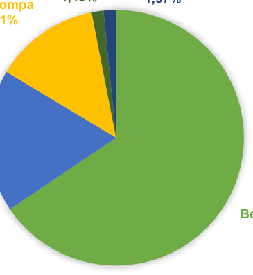

_Sumber: Dokumen Rencana Kawasan Permukiman (RKP) Kota Semarang Tahun 2022_

**Gambar 3. 6** **Persentase Rumah Tangga menurut Sumber Air Minum di**
**Kota Semarang**

Seperti yang telah disebutkan sebelumnya, jarak sumber air minum ke

tempat penampungan tinja juga menjadi syarat ketersediaan air bersih. Menurut

Kementrian Kesehatan, agar tidak mencemari sumber air minum, maka lubang

penampungan tinja sebaiknya berjarak 10-15meter dari sumber air bersih.

**41**

--- end of page=49 ---

Berdasarkan gambar di bawah ini. tercatat bahwa sekitar 75,47% rumah tangga

sudah memiliki sumber air minum yang berjarak lebih dari 10 meter dari tempat

penampungan tinja terdekat. Sementara itu, rumah tangga yang tidak

mengetahui jarak sumber air minumnya ke tempat penampungan tinja sebesar

10,61%.

80,00%

70,00%

60,00%

50,00%

40,00%

30,00%

20,00%

10,00%

0,00%

10,61%

|75,47%|Col2|
|---|---|
|75,47%||
|||
|||
|||
|||
|||
||13,92%|
|||

<10 M ≥ 10 M Tidak Tahu

_Sumber: Dokumen Rencana Kawasan Permukiman (RKP) Kota Semarang Tahun 2022_

**Gambar 3. 7** **Persentase Rumah tangga menurut Jarak Sumber Air**
**Minum ke Tempat Penampungan Limbah/Kotoran/Tinja**
**Terdekat di Kota Semarang**

**3.3.3. Kondisi Eksisting Pemenuhan Listirik**

Kebutuhan energi listrik akan terus meningkat sejalan dengan

peningkatan roda perekonomian di Kota Semarang. Maka dari itu, PLN sebagai

Perusahaan Negara yang menangani lisirik terus meningkatkan kinerjanya

sebagai antisipasi dari peningkatan kebutuhan tenaga listrik. Tercatat pada tahun

2021 jumlah produksi listrik PLN mencapai 4.261.932,38 MWh dengan daya

terpasang sebesar 2.420,82 MVA dan MWh terjual hingga 4.007.835,61 MWh.

Berikut kebutuhan energi listrik Kota Semarang berdasarkan golongan tarif tahun

2021.

**42**

--- end of page=50 ---

**Tabel 3. 11** **Daya Terpasang, Produksi, dan Dsitribusi Kota Semarang**

|Rayon/ULP|Daya Terpasang (MVA)|Produksi Listrik (MWh)|Listrik Terjual (MWh)|Dipakai Sendiri (MWh)|Susut/ Hilang (MWh)|
|---|---|---|---|---|---|
|Semarang Tengah| 574.419|969,13|907,60|0,53|61,00|
|Semarang Barat|527.084|899,56|862,20|0,53|36,83|
|Semarang Timur|554.785|979,06|889,97|0,53|88,56|
|Semarang Selatan|265.977|413,84|388,35|0,53|24,96|
|**Kota Semarang**  |**1.922.265** |**3.261,59** |**3.048,12**|**2,12**|**211,35**|

_Sumber: Kota Semarang dalam Angka, 2023_

Kebutuhan energi listrik akan terus meningkat sejalan dengan

peningkatan roda perekonomian di Kota Semarang. Maka dari itu, PLN sebagai

Perusahaan Negara yang menangani lisirik terus meningkatkan kinerjanya

sebagai antisipasi dari peningkatan kebutuhan tenaga listrik. Tercatat pada tahun

2021 jumlah produksi listrik PLN mencapai 3.120.718,06 MWh dengan daya

terpasang sebesar 1.598,81 MVA dan listrik terjual hingga 2.943.455,47 MWh.

Berikut kebutuhan energi listrik Kota Semarang berdasarkan golongan tarif tahun

2021.

**Tabel 3. 12** **Jumlah Pemakaian Energi Listrik PLN Kota Semarang**

|Golongan|Daya Terpasang (MVA)|Produksi Listrik (MWh)|Listrik Terjual (MWh)|Dipakai Sendiri (MWh)|Susut/ Hilang (MWh)|
|---|---|---|---|---|---|
|~~1. Sosial~~ |~~156,07~~ |~~18.737,93~~  |~~18.737,93~~ |~~2,12~~ |~~0,25~~ |
|~~2. Rumah~~ Tangga |~~732,56~~ |~~93.431,04~~  |~~93.431,04~~ |~~2,12~~ |~~0,25~~ |
|~~3. Usaha~~ |~~538,93~~ |~~67.943,66~~  |~~67.943,66~~ |~~2,12~~ |~~0,25~~ |
|~~4. Industri~~ |~~501,04~~  |~~63.004,37~~  |~~63.004,37~~ |~~2,12~~ |~~0,25~~ |
|~~5. Perkantoran~~ |~~68,78~~ |~~7.192,18~~  |~~7.192,18~~ |~~2,12~~ |~~0,25~~ |
|~~**Jumlah** ~~ |~~**1.997,38**~~ |~~**249.841,18**~~ |~~**249.841,18**~~|~~**10,60**~~|~~**1,25**~~|

_Sumber: Kota Semarang dalam Angka, 2023_

Pada tahun 2021, jumlah pelanggan listrik di Kota Semarang mencapai

583.059 pelanggan. Berikut ini adalah jumlah pelanggan listrik berdasarkan

rayon/ULP di Kota Semarang pada tahun 2019-2021:

**43**

--- end of page=51 ---

**Tabel 3. 13** **Jumlah Pelanggan Listrik Menurut Rayon/ULP di Kota**
**Semarang Tahun 2018-2022**

|Rayon/ULP|2018|2019|2020|2021|2022|
|---|---|---|---|---|---|
|Semarang Tengah|126.594|129.785| 133.166|135.912|138.957|
|Semarang Barat|101.240|104.784| 108.038|111.386|114.864|
|Semarang Timur|208.143|218.899| 228.706|237.994|247.048|
|Semarang Selatan|83.851|88.303| 93.642|97.767|102.336|
|**Jumlah**  |**519.828** |**541.771** | **563.552**|**583.059**|**603.205**|

_Sumber: Kota Semarang dalam Angka, 2023_

**3.3.4. Kondisi Eksisting Pengelolaan Persampahan**

Pola pengumpulan sampah yang diterapkan di Kota Semarang dapat

dibedakan menjadi 3 macam, yaitu pola komunal tidak langsung, individual tidak

langsung, dan individual langsung. Pada umumnya, sampah rumah tangga atau

permukiman di tiap-tiap kecamatan yang berada di Kota Semarang menerapkan

pola pengumpulan sampah individual tidak langsung dimana masyarakat

membuang sampah rumah tangga atau permukiman ke gerobak untuk diangkut

ke TPS terdekat sebelum truk mengangkut sampah yang terdapat di TPS ke TPA

Jatibarang. Berbeda dengan pola pengumpulan sampah yang berasal dari

fasilitas umum seperti pertokoan, perhotelan, sarana kesehatan, rumah makan,

tempat hiburan, sekolah dan kantor. Pelayanan persampahan yang berasal dari

fasilitas umum tidak hanya menggunakan sistem individual tidak langsung,

melainkan sistem individual langsung dimana dump truck mengambil sampah

secara door to door setiap harinya. Sedangkan untuk sistem komunal tidak

langsung, yaitu masyarakat membawa sendiri sampahnya menuju ke lokasi TPS

terdekat. Sistem jaringan persampahan yang ada di Kota Semarang mayoritas

adalah diangkut dari unit terkecil (rumah tangga) sampai dengan ke TPA

Jatibarang.

Berdasarkan jumlah produksi sampah dan jumlah sampah yang

terangkut, rata-rata sudah di atas 80% sampah terangkut. Sehingga jaringan

persampahan di Kota Semarang dapat dikatakan baik. Secara rinci jumlah

produksi sampah dan jumlah sampah terangkut di Kota Semarang dapat dilihat

sebagai berikut.

**44**

--- end of page=52 ---

**Tabel 3. 14** **Jumlah Produksi Sampah dan Jumlah Sampah Terangkut**
**Kota Semarang**

|No Kecamatan Produksi Terangkut Persentase Pelayanan|Col2|Col3|Col4|Col5|Col6|
|---|---|---|---|---|---|
|~~**1**~~ ~~M~~  |~~ijen~~ |~~177,94~~ |~~154,63~~ | ~~87%~~  |~~Baik~~ |
|~~**2**~~ ~~G~~  |~~unungpati~~ |~~238,22~~ |~~206,98~~ | ~~87%~~  |~~Baik~~ |
|~~**3**~~ ~~B~~  |~~anyumanik~~ |~~405,68~~ |~~358,31~~ | ~~88%~~  |~~Baik~~ |
|~~**4**~~ ~~G~~  |~~ajahmungkur~~ |~~204,72~~ |~~177,90~~ | ~~87%~~  |~~Baik~~ |
|~~**5**~~ ~~S~~  |~~emarang Selatan~~ |~~269,56~~ |~~234,19~~ | ~~87%~~  |~~Baik~~ |
|~~**6**~~ ~~C~~  |~~andisari~~ |~~259,25~~ |~~225,22~~ | ~~87%~~  |~~Baik~~ |
|~~**7**~~ ~~T~~  |~~embalang~~ |~~448,69~~ |~~389,82~~ | ~~87%~~  |~~Baik~~ |
|~~**8**~~ ~~P~~  |~~edurungan~~ |~~564,28~~ |~~490,27~~ | ~~87%~~  |~~Baik~~ |
|~~**9**~~ ~~G~~  |~~enuk~~ |~~288,52~~ |~~250,66~~ | ~~87%~~  |~~Baik~~ |
|~~**10**~~ ~~G~~  |~~ayamsari~~ |~~236,89~~ |~~205,81~~ | ~~87%~~  |~~Baik~~ |
|~~**11**~~ ~~S~~  |~~emarang Timur~~ |~~258,05~~ |~~224,18~~ | ~~87%~~  |~~Baik~~ |
|~~**12**~~ ~~S~~  |~~emarang Utara~~ |~~413,13~~ |~~358,92~~ | ~~87%~~  |~~Baik~~ |
|~~**13**~~ ~~S~~  |~~emarang Tengah~~ |~~233,95~~ |~~203,29~~ | ~~87%~~  |~~Baik~~ |
|~~**14**~~ ~~S~~  |~~emarang Barat~~ |~~519,20~~ |~~451,10~~ | ~~87%~~  |~~Baik~~ |
|~~**15**~~ ~~T~~  |~~ugu~~ |~~96,67~~ |~~83,99~~ | ~~87%~~  |~~Baik~~ |
|~~**16**~~ ~~N~~  |~~galiyan~~ |~~384,11~~ |~~333,74~~ | ~~87%~~  |~~Baik~~ |
| ~~**T**~~ |~~**otal** ~~ |~~**4.998,85** ~~ |~~**4.349,00**~~ | ~~**87%** ~~ |~~**Baik** ~~ |

_Sumber: Dokumen Rencana Kawasan Permukiman (RKP) Kota Semarang Tahun 2022_

Dalam upaya mengurangi sampah yang terangkut ke TPA, di Kota

Semarang terdapat bank sampah yang dikelola oleh masyarakat. Berikut ini

adalah bank sampah yang ada di Kota Semarang.

**Tabel 3. 15** **Bank Sampah di Kota Semarang**

|No|Nama|m3/hr|Kelurahan|Kecamatan|
|---|---|---|---|---|
|~~**1**~~ |~~BS Adi Dharma~~ |~~38,20~~ |~~Sendangguwo~~ |~~Tembalang~~ |
|~~**2**~~ |~~BS Aisah~~ |~~74,67~~ |~~Pedurungan Kidul~~ |~~Pedurungan~~ |
|~~**3**~~ |~~BS Aji Guna~~ |~~19,76~~ |~~Ngaliyan~~ |~~Ngaliyan~~ |
|~~**4**~~ |~~BS APL Jomblang~~ | |~~Jomblang~~ |~~Candisari~~ |
|~~**5**~~ |~~BS Bangkid~~ | |~~Jomblang~~ |~~Candisari~~ |
|~~**6**~~ |~~BS Bangkit Sejahtera~~ |~~7,67~~ |~~Sumurejo~~ |~~Gunungpati~~ |
|~~**7**~~ |~~BS Bina Mandiri~~ |~~6,22~~ |~~Pedurungan Kidul~~ |~~Pedurungan~~ |
|~~**8**~~ |~~BS Cahaya Teratai~~ | |~~Kalipancur~~ |~~Ngaliyan~~ |
|~~**9**~~ |~~BS Cinta Bunga~~ | |~~Tembalang~~ |~~Tembalang~~ |
|~~**10**~~ |~~BS Guyup Rukun~~ |~~2,10~~ |~~Gunungpati~~ |~~Gunungpati~~ |
|~~**11**~~ |~~BS Indria Jaya~~ |~~48,37~~ |~~Kalipancur~~ |~~Ngaliyan~~ |
|~~**12**~~ |~~BS Kalicari Asri~~ | |~~Kalicari~~ |~~Pedurungan~~ |
|~~**13**~~ |~~BS Karya Manunggal~~ | |~~Sendangguwo~~ |~~Tembalang~~ |
|~~**14**~~ |~~BS Kemuning~~ |~~2,00~~ |~~Ngijo~~ |~~Gunungpati~~ |
|~~**15**~~ |~~BS KSM Mawar~~ |~~2,40~~ |~~Mangkang Kulon~~ |~~Tugu~~ |
|~~**16**~~ |~~BS KSM Melati Putih~~ | |~~Candi~~ |~~Candisari~~ |
|~~**17**~~ |~~BS KSM Mukti Asih~~ |~~2,30~~ |~~Muktiharjo Kidul~~ |~~Pedurungan~~ |
|~~**18**~~ |~~BS Lestari~~ | |~~Jomblang~~ |~~Candisari~~ |
|~~**19**~~ |~~BS Lestari~~ | |~~Purwoyoso~~ |~~Ngaliyan~~ |
|~~**20**~~|~~BS M Ngaliyan~~||~~Ngaliyan~~|~~Ngaliyan~~|

**45**

--- end of page=53 ---

|No|Nama|m3/hr|Kelurahan|Kecamatan|
|---|---|---|---|---|
|~~**21**~~ |~~BS Maju Mapan~~ Krapyak | |~~Purwoyoso~~ |~~Ngaliyan~~ |
|~~**22**~~ |~~BS Mandiri~~ | |~~Trimulyo~~ |~~Genuk~~ |
|~~**23**~~ |~~BS Matahari~~ |~~2,40~~ |~~Beringin~~ |~~Ngaliyan~~ |
|~~**24**~~ |~~BS Mawar~~ | |~~Cepoko~~ |~~Gunungpati~~ |
|~~**25**~~ |~~BS Mawar Merah~~ |~~20,08~~ |~~Tugurejo~~ |~~Tugu~~ |
|~~**26**~~ |~~BS Mekar Jaya~~ | |~~Pedurungan Kidul~~ |~~Pedurungan~~ |
|~~**27**~~ |~~BS Mekar Sari~~ Sebumi |~~1,35~~ |~~Karang malang~~ |~~mijen~~ |
|~~**28**~~ |~~BS Melati~~ | |~~Jomblang~~ |~~Candisari~~ |
|~~**29**~~ |~~BS Melati Jatingaleh~~ | |~~Jomblang~~ |~~Candisari~~ |
|~~**30**~~ |~~BS Melati Mangkang~~ |~~11,59~~ |~~Mangkang Kulon~~ |~~Tugu~~ |
|~~**31**~~ |~~BS Melati Ngaliyan~~ | |~~Ngaliyan~~ |~~Ngaliyan~~ |
|~~**32**~~ |~~BS Mentari~~ |~~5,92~~ |~~pakintelan~~ |~~Gunungpati~~ |
|~~**33**~~ |~~BS Mulya Sejahtera~~ |~~22,68~~ |~~plalangan~~ |~~Gunungpati~~ |
|~~**34**~~ |~~BS Omah Resik~~ |~~6,26~~ |~~banyumanik~~ |~~banyumanik~~ |
|~~**35**~~ |~~BS Pandan Wangi~~ | |~~sawah besar~~ |~~gayamsari~~ |
|~~**36**~~ |~~BS Pandowo Berjaya~~ | |~~banyumanik~~ |~~banyumanik~~ |
|~~**37**~~ |~~BS Payung Lestari~~ |~~30,00~~ |~~pudak payung~~ |~~banyumanik~~ |
|~~**38**~~ |~~BS Persada~~ | |~~pudak payung~~ |~~banyumanik~~ |
|~~**39**~~ |~~BS Plamongan Sari~~ | |~~plamongansari~~ |~~Pedurungan~~ |
|~~**40**~~ |~~BS PMPL Waras~~ |~~4,60~~ |~~wonotingal~~ |~~Candisari~~ |
|~~**41**~~ |~~BS Prigel~~ | |~~pleburan~~ |~~semarang selatan~~ |
|~~**42**~~ |~~BS Raflesia~~ |~~18,29~~ |~~Jomblang~~ |~~Candisari~~ |
|~~**43**~~ |~~BS Raos Emi~~ |~~38,00~~ |~~plamongansari~~ |~~Pedurungan~~ |
|~~**44**~~ |~~BS Resik Apik~~ | |~~srondol kulon~~ |~~banyumanik~~ |
|~~**45**~~ |~~BS Resik Becik~~ |~~8,10~~ |~~Krobokan~~ |~~semarang barat~~ |
|~~**46**~~ |~~BS RT 2 RW XIII~~ Tambakaji | |~~Tambak aji~~ |~~Ngaliyan~~ |
|~~**47**~~ |~~BS Rumah Kreasi~~ Ibu | |~~pleburan~~ |~~semarang selatan~~ |
|~~**48**~~ |~~BS Sadar Diri~~ |~~17,69~~ |~~mangkang wetan~~ |~~Tugu~~ |
|~~**49**~~ |~~BS Sami Guyub~~ | |~~Tambak aji~~ |~~Ngaliyan~~ |
|~~**50**~~ |~~BS Sami Rukun~~ | |~~Tambak aji~~ |~~Ngaliyan~~ |
|~~**51**~~ |~~BS Sari Asri 1~~ |~~33,00~~ |~~tandang~~ |~~Tembalang~~ |
|~~**52**~~ |~~BS Sedyo Mulyo~~ | |~~brumbungan~~ |~~semarang tengah~~ |
|~~**53**~~ |~~BS Sejahtera~~ | |~~brumbungan~~ |~~semarang tengah~~ |
|~~**54**~~ |~~BS Sekarjati Sari~~ | |~~brumbungan~~ |~~semarang tengah~~ |
|~~**55**~~ |~~BS Selingsri~~ |~~8,00~~ |~~Sendangguwo~~ |~~Tembalang~~ |
|~~**56**~~ |~~BS Sempulur Asri~~ | |~~gedawang~~ |~~banyumanik~~ |
|~~**57**~~ |~~BS Setuk~~ | |~~pudak payung~~ |~~Banyumanik~~ |
|~~**58**~~ |~~BS SMP 5 Semarang~~ | |~~wonotingal~~ |~~Candisari~~ |
|~~**59**~~ |~~BS Sri Rejeki~~ |~~43,33~~ |~~Tembalang~~ |~~Tembalang~~ |
|~~**60**~~ |~~BS Srikandhi~~ | |~~Tembalang~~ |~~Tembalang~~ |
|~~**61**~~ |~~BS Subur Makmur~~ | |~~pedurungan lor~~ |~~Pedurungan~~ |
|~~**62**~~ |~~BS Sukses Pleburan~~ | |~~pleburan~~ |~~semarang selatan~~ |
|~~**63**~~ |~~BS Sumurejo~~ | |~~sumurejo~~ |~~Gunungpati~~ |
|~~**64**~~ |~~BS Walisongo~~ | |~~Purwoyoso~~ |~~Ngaliyan~~ |
|~~**65**~~ |~~BS Bina Arta Mulia~~ | |~~srondol kulon~~ |~~banyumanik~~ |
|~~**66**~~|~~BS Bina Mandiri III~~|~~4,78~~|~~Pedurungan Kidul~~|~~Pedurungan~~|

**46**

--- end of page=54 ---

|No|Nama|m3/hr|Kelurahan|Kecamatan|
|---|---|---|---|---|
|~~No~~  |~~**Nama** ~~ |~~**m3/hr** ~~ |~~**Kelurahan** ~~ |~~**Kecamatan** ~~ |
|~~**67**~~ |~~BS Durian~~ | |~~petompon~~ |~~Gajah mungkur~~ |
|~~**68**~~ |~~BS Gedawang Asri~~ |~~8,78~~ |~~gedawang~~ |~~Banyumanik~~ |
|~~**69**~~ |~~BS Gemah Ripah~~ |~~2,87~~ |~~kedungmundu~~ |~~Tembalang~~ |
|~~**70**~~ |~~BS Guyub Rukun~~ | |~~kemijen~~ |~~Semarang Timur~~ |
|~~**71**~~ |~~BS Kemijen I~~ |~~31,45~~ |~~kemijen~~ |~~Semarang Timur~~ |
|~~**72**~~ |~~BS Limbah Berkah~~ |~~7,29~~ |~~kembangarum~~ |~~Semarang Barat~~ |
|~~**73**~~ |~~BS Mandiri~~ |~~5,00~~ |~~genuksari~~ |~~Genuk~~ |
|~~**74**~~ |~~BS Mawar~~ |~~1,50~~ |~~mangkang kulon~~ |~~Tugu~~ |
|~~**75**~~ |~~BS Rejo Asri~~ |~~5,83~~ |~~genuksari~~ |~~Genuk~~ |
|~~**76**~~ |~~BS Resik Sejahtera~~ | |~~sambiroto~~ |~~Tembalang~~ |
|~~**77**~~ |~~BS Seroja Asri~~ |~~10,07~~ |~~sukorejo~~ |~~Gunungpati~~ |

_Sumber: Dokumen Rencana Kawasan Permukiman (RKP) Kota Semarang Tahun 2022_

Dalam upaya mengurangi sampah Kota Semarang juga dilayani oleh

TPS3R. Berikut ini adalah TPS3R yang ada di Kota Semarang.

**Tabel 3. 16** **Sebaran TPS3R di Kota Semarang**

|No|Nama TPS3R|Alamat Lengkap|Luas Bangunan TPS3R (m+)|Jumlah Layanan|Tahun Pembangunan|
|---|---|---|---|---|---|
|~~**1 **~~ ~~T~~ K  |~~PST Ngudi~~ amulyan |~~Kec. Gajahmungkur~~ |~~60~~ |~~300 KK~~ |~~2008~~ |
|~~**2 **~~ ~~T~~  |~~PST Bulu Lor~~ |~~Kec. Semarang~~ Utara |~~60~~ |~~200 KK~~ |~~2008~~ |
|~~**3 **~~ ~~T~~ P  |~~PST~~ adangsari |~~Kec. Banyumanik~~ |~~60~~ |~~200 KK~~ |~~2010~~ |
|~~**4 **~~ ~~T~~ P K  |~~PST~~ edurungan idul |~~Kec. Pedurungan~~ |~~60~~ |~~200 KK~~ |~~2010~~ |
|~~**5 **~~ ~~T~~ P L  |~~PST~~ edurungan or |~~Kec. Pedurungan~~ |~~60~~ |~~200 KK~~ |~~2010~~ |
|~~**6 **~~ ~~T~~ A  |~~PST~~ RHANUDSE |~~Kec. Candisari~~ |~~60~~ |~~100 KK~~ |~~2013~~ |
|~~**7 **~~ ~~T~~  |~~PST BSB~~ |~~Kec. Mijen~~ |~~1~~ |~~1000 KK~~ |~~2010~~ |
|~~**8 **~~ ~~T~~    |~~PST~~ Mangkang Wetan |~~Kec. Tugu~~ |~~60~~ |~~200 KK~~ |~~2012~~ |
|~~**9 **~~ ~~T~~ K G  |~~PST~~ aranganyar unung |~~Kec. Candisari~~ |~~60~~ |~~200 KK~~ |~~2014~~ |
|~~**10**~~ ~~T~~  |~~PST Ngaliyan~~ |~~Kec. Ngaliyan~~ |~~60~~ |~~200 KK~~ |~~2010~~ |
|~~**11**~~ ~~T~~  |~~PST Pleburan~~ |~~ Kec. Semarang~~ Selatan |~~60~~ |~~200 KK~~ |~~2010~~ |
|~~**12**~~ ~~T~~ |~~PST Bon Bin~~ Mangkang|~~Kec. Tugu~~|~~60~~|~~200 KK~~|~~2010~~|

**47**

--- end of page=55 ---

|No|Nama TPS3R|Alamat Lengkap|Luas Bangunan TPS3R (m+)|Jumlah Layanan|Tahun Pembangunan|
|---|---|---|---|---|---|
|~~**13**~~ ~~T~~ S  |~~PST~~ ambiroto |~~Kec. Tembalang~~ |~~60~~ |~~200 KK~~ |~~2015~~ |
|~~**14**~~ ~~T~~ P  |~~PST~~ udakpayung |~~Kec. Banyumanik~~ |~~60~~ |~~200 KK~~ |~~2012~~ |
|~~**15**~~ ~~T~~  |~~PST Kaligawe~~ |~~ Kec. Gayamsari~~ |~~60~~ |~~200 KK~~ |~~2012~~ |
|~~**16**~~ ~~T~~  |~~PST Kalicari~~ |~~Kec. Pedurungan~~ |~~60~~ |~~200 KK~~ |~~2015~~ |
|~~**17**~~ ~~T~~ T  |~~PST~~ ambakaji |~~Kec. Tugu~~ |~~60~~ |~~200 KK~~ |~~2012~~ |
|~~**18**~~ ~~T~~ T  |~~PST~~ embalang |~~Kec. Tembalang~~ |~~60~~ |~~200 KK~~ |~~2015~~ |
|~~**19**~~ ~~T~~  |~~PST DLH~~ |~~Kec. Tugu~~ |~~30~~ |~~Kantor~~ |~~2008~~ |
|~~**20**~~ ~~T~~  |~~PST Ngesrep~~ |~~Ngesrep Kecamatan~~ Banyumanik |~~60~~ |~~200 KK~~ |~~2015~~ |
|~~**21**~~ ~~T~~ K  |~~PST Gua~~ reo |~~Kel. Kandri Kec.~~ Gunungpati |~~60~~ |~~200 KK~~ |~~2015~~ |
|~~**22**~~ ~~T~~  |~~PST Palebon~~ |~~Kel. Palebon Kec.~~ Pedurungan |~~40~~ |~~200 KK~~ |~~2015~~ |
|~~**23**~~ ~~T~~ M K  |~~PST~~ uktiharjo idul |~~Kel. Muktiharjo Kidul~~ Kec. Pedurungan |~~40~~ |~~200 KK~~ |~~2016~~ |
|~~**24**~~ ~~T~~ J  |~~PST~~ abungan |~~Kel. Jabungan Kec.~~ Banyumanik |~~40~~ |~~200 KK~~ |~~2016~~ |
|~~**25**~~ ~~T~~ R |~~PST~~ owosari |~~Kel. Rowosari Kec.~~ Tembalang |~~40~~ |~~200 KK~~ |~~2016~~ |

_Sumber: Dokumen Rencana Kawasan Permukiman (RKP) Kota Semarang Tahun 2022_

**48**

--- end of page=56 ---

**49**

--- end of page=57 ---

**3.3.5. Kondisi Eksisting Fasilitas Kesehatan**

Sarana kesehatan terdiri dari klinik, puskesmas, dan Rumah Sakit, baik

swata ataupun milik pemerintah. Sebaran sarana kesehatan per kelurahan di

Kota Semarang diuraikan dalam tabel berikut:

**Tabel 3. 17** **Jumlah Sarana Kesehatan Kota Semarang**

|No|Kelurahan|RS|RS Bersalin|Poliklinik/Balai Pengobatan|Puskesmas|Apotek|
|---|---|---|---|---|---|---|
|**Kecamatan Mijen**|**Kecamatan Mijen**|**Kecamatan Mijen**|**Kecamatan Mijen**|**Kecamatan Mijen**|**Kecamatan Mijen**|**Kecamatan Mijen**|
|1|Cangkiran|0|0|1|0|3|
|2|Bubakan|0|0|0|0|1|
|3|Karangmalang|0|0|0|1|0|
|4|Polaman|0|0|0|0|0|
|5|Purwosari|0|0|0|0|0|
|6|Tambangan|1|0|0|1|0|
|7|Jatisari|0|0|1|0|4|
|8|Mijen|0|0|1|0|1|
|9|Jatibarang|0|0|0|0|0|
|10|Kedungpani|0|0|0|0|0|
|11|Pesantren|0|0|0|0|1|
|12|Ngadirgo|0|0|0|0|1|
|13|Wonolopo|0|0|1|0|1|
|14|Wonoplumbon|0|0|0|0|0|
|**Kecamatan Gunungpati**|**Kecamatan Gunungpati**|**Kecamatan Gunungpati**|**Kecamatan Gunungpati**|**Kecamatan Gunungpati**|**Kecamatan Gunungpati**|**Kecamatan Gunungpati**|
|15|Gunungpati|0|0|2|1|2|
|16|Plalangan|0|0|0|1|1|
|17|Sumurejo|0|0|0|0|0|
|18|Pakintelan|0|0|0|0|0|
|19|Mangunsari|0|0|1|0|1|
|20|Patemon|0|0|1|0|1|
|21|Ngijo|0|0|1|0|0|
|22|Nongkosawit|0|0|0|0|0|
|23|Cepoko|0|0|0|0|0|
|24|Jatirejo|0|0|0|0|0|
|25|Kandri|0|0|0|0|0|
|26|Pungangan|0|0|0|0|0|
|27|Kalisegoro|0|0|0|0|0|
|28|Sekaran|0|0|0|1|3|
|29|Sukorejo|0|0|0|0|1|
|30|Sadeng|1|0|0|0|1|
|**Kecamatan Banyumanik**|**Kecamatan Banyumanik**|**Kecamatan Banyumanik**|**Kecamatan Banyumanik**|**Kecamatan Banyumanik**|**Kecamatan Banyumanik**|**Kecamatan Banyumanik**|
|31|Pudakpayung|0|0|2|1|4|
|32|Gedawang|0|0|0|0|0|
|33|Jabungan|0|0|0|0|0|

**50**

--- end of page=58 ---

|No|Kelurahan|RS|RS Bersalin|Poliklinik/Balai Pengobatan|Puskesmas|Apotek|
|---|---|---|---|---|---|---|
|34|Padangsari|0|0|2|1|4|
|35|Banyumanik|0|0|1|0|4|
|36|Srondol Wetan|2|0|3|0|7|
|37|Pedalangan|0|0|3|0|3|
|38|Sumurboto|0|0|3|0|3|
|39|Srondol Kulon|0|0|3|1|3|
|40|Tinjomoyo|0|0|1|0|1|
|41|Ngesrep|0|0|1|1|3|
|**Kecamatan Gajahmungkur**|**Kecamatan Gajahmungkur**|**Kecamatan Gajahmungkur**|**Kecamatan Gajahmungkur**|**Kecamatan Gajahmungkur**|**Kecamatan Gajahmungkur**|**Kecamatan Gajahmungkur**|
|42|Sampangan|0|0|1|1|4|
|43|Bendanduwur|0|0|0|0|0|
|44|Karangrejo|0|0|1|0|2|
|45|Gajahmungkur|0|0|1|0|1|
|46|Bendan Ngisor|0|0|2|0|2|
|47|Petompon|2|0|2|0|4|
|48|Bendungan|0|0|0|0|0|
|49|Lempongsari|0|0|0|0|0|
|**Kecamatan Semarang Selatan**|**Kecamatan Semarang Selatan**|**Kecamatan Semarang Selatan**|**Kecamatan Semarang Selatan**|**Kecamatan Semarang Selatan**|**Kecamatan Semarang Selatan**|**Kecamatan Semarang Selatan**|
|50|Bulustalan|0|0|0|0|3|
|51|Barusari|2|0|1|0|5|
|52|Randusari|1|0|3|0|3|
|53|Mugassari|0|0|1|1|2|
|54|Pleburan|0|0|1|0|2|
|55|Wonodri|1|0|2|0|4|
|56|Peterongan|1|0|5|0|3|
|57|Lamper Kidul|0|0|5|0|5|
|58|Lamper Lor|0|0|2|0|0|
|59|Lamper Tengah|0|0|0|0|4|
|**Kecamatan Candisari**|**Kecamatan Candisari**|**Kecamatan Candisari**|**Kecamatan Candisari**|**Kecamatan Candisari**|**Kecamatan Candisari**|**Kecamatan Candisari**|
|60|Jatingaleh |0|0|4|0|0|
|61|~~Karanganyar~~ Gunung|0|0|0|0|2|
|62|Jomblang|0|0|1|1|0|
|63|Candi|0|0|1|0|1|
|64|Kaliwiru|0|0|2|0|3|
|65|Wonotingal|0|0|0|1|0|
|66|Tegalsari|1|0|2|0|2|
|**Kecamatan Tembalang**|**Kecamatan Tembalang**|**Kecamatan Tembalang**|**Kecamatan Tembalang**|**Kecamatan Tembalang**|**Kecamatan Tembalang**|**Kecamatan Tembalang**|
|67|Rowosari|0|0|0|0|0|
|68|Meteseh|0|0|3|1|4|
|69|Kramas|0|0|0|0|0|
|70|Tembalang|1|0|1|0|2|
|71|Bulusan|0|0|1|0|2|
|72|Mangunharjo|1|0|0|0|1|
|73|Sendangmulyo|1|0|1|0|8|

**51**

--- end of page=59 ---

|No|Kelurahan|RS|RS Bersalin|Poliklinik/Balai Pengobatan|Puskesmas|Apotek|
|---|---|---|---|---|---|---|
|74|Sambiroto|0|0|2|1|6|
|75|Jangli|0|0|0|0|0|
|76|Tandang|0|0|1|0|1|
|77|Kedungmundu|0|0|2|0|3|
|78|Sendangguwo|0|0|0|0|2|
|**Kecamatan Pedurungan**|**Kecamatan Pedurungan**|**Kecamatan Pedurungan**|**Kecamatan Pedurungan**|**Kecamatan Pedurungan**|**Kecamatan Pedurungan**|**Kecamatan Pedurungan**|
|79|Gemah|1|0|4|0|4|
|80|Pedurungan Kidul|0|0|0|0|2|
|81|Plamongan Sari|1|0|0|0|3|
|82|Penggaron Kidul|0|0|0|0|0|
|83|Pedurungan Lor|0|0|1|0|3|
|84|Tlogomulyo|0|0|0|0|1|
|85|Pedurungan Tengah|0|0|2|0|6|
|86|Palebon|0|0|2|0|4|
|87|Kalicari|0|0|1|0|4|
|88|Tlogosari Kulon|0|0|8|2|11|
|89|Tlogosari Wetan|0|0|1|0|1|
|90|Muktiharjo Kidul|0|0|2|0|3|
|**Kecamatan Genuk**|**Kecamatan Genuk**|**Kecamatan Genuk**|**Kecamatan Genuk**|**Kecamatan Genuk**|**Kecamatan Genuk**|**Kecamatan Genuk**|
|91|Muktiharjo Lor|0|0|1|0|0|
|92|Gebangsari|0|0|2|0|3|
|93|Genuksari|0|0|2|1|1|
|94|Bangetayu Kulon|0|0|0|0|1|
|95|Bangetayu Wetan|0|0|0|1|0|
|96|Sembungharjo|0|0|1|0|3|
|97|Penggaron Lor|0|0|0|0|0|
|98|Kudu|0|0|0|0|0|
|99|Karangroto|0|0|1|0|1|
|100|Banjardowo|0|0|2|0|2|
|101|Trimulyo|0|0|2|0|1|
|102|Terboyo Wetan|0|0|0|0|0|
|103|Terboyo Kulon|1|0|0|0|1|
|**Kecamatan Gayamsari**|**Kecamatan Gayamsari**|**Kecamatan Gayamsari**|**Kecamatan Gayamsari**|**Kecamatan Gayamsari**|**Kecamatan Gayamsari**|**Kecamatan Gayamsari**|
|104|Pandean Lamper|0|0|5|0|4|
|105|Gayamsari|1|0|1|1|3|
|106|Siwalan|0|0|0|0|1|
|107|Sambirejo|0|0|2|0|3|
|108|Sawahbesar|0|0|1|0|2|
|109|Kaligawe|0|0|0|0|1|
|110|Tambakrejo|0|0|0|0|0|
|**Kecamatan Semarang Timur**|**Kecamatan Semarang Timur**|**Kecamatan Semarang Timur**|**Kecamatan Semarang Timur**|**Kecamatan Semarang Timur**|**Kecamatan Semarang Timur**|**Kecamatan Semarang Timur**|
|111|Karangturi|0|0|0|0|1|
|112|Karangtempel|0|0|2|1|3|
|113|Rejosari|1|0|1|0|1|

**52**

--- end of page=60 ---

|No|Kelurahan|RS|RS Bersalin|Poliklinik/Balai Pengobatan|Puskesmas|Apotek|
|---|---|---|---|---|---|---|
|114|Sarirejo|0|0|0|0|1|
|115|Kebonagung|0|0|0|0|1|
|116|Bugangan|1|0|0|0|2|
|117|Mlatiharjo|1|0|1|0|1|
|118|Mlatibaru|0|0|0|0|1|
|119|Rejomulyo|0|0|2|1|1|
|120|Kemijen|0|0|1|0|1|
|**Kecamatan Semarang Utara**|**Kecamatan Semarang Utara**|**Kecamatan Semarang Utara**|**Kecamatan Semarang Utara**|**Kecamatan Semarang Utara**|**Kecamatan Semarang Utara**|**Kecamatan Semarang Utara**|
|121|Bulu Lor|0|0|0|1|1|
|122|Plombokan|0|0|0|0|2|
|123|Panggungkidul|0|0|0|0|1|
|124|Panggung Lor|0|0|1|0|1|
|125|Kuningan|0|0|0|0|1|
|126|Purwosari|0|0|1|0|1|
|127|Dadapsari|0|0|0|0|3|
|128|Bandarharjo|0|0|1|1|0|
|129|Tanjung Mas|0|0|1|0|2|
|**Kecamatan Semarang Tengah**|**Kecamatan Semarang Tengah**|**Kecamatan Semarang Tengah**|**Kecamatan Semarang Tengah**|**Kecamatan Semarang Tengah**|**Kecamatan Semarang Tengah**|**Kecamatan Semarang Tengah**|
|130|Pekunden|2|0|0|0|2|
|131|Karangkidul|0|0|4|0|5|
|132|Jagalan|0|0|1|0|1|
|133|Brumbungan|0|0|1|0|1|
|134|Miroto|0|0|0|1|2|
|135|Gabahan|0|0|0|0|3|
|136|Kranggan|0|0|1|0|2|
|137|Purwodinatan|0|0|1|0|1|
|138|Kauman|0|0|0|0|1|
|139|Bangunharjo|0|0|1|0|0|
|140|Kembangsari|0|0|0|0|2|
|141|Pandansari|0|0|2|0|1|
|142|Sekayu|0|0|1|1|2|
|143|Pendrikan Kidul|0|0|3|0|1|
|144|Pendrikan Lor|0|0|1|0|3|
|**Kecamatan Semarang Barat**|**Kecamatan Semarang Barat**|**Kecamatan Semarang Barat**|**Kecamatan Semarang Barat**|**Kecamatan Semarang Barat**|**Kecamatan Semarang Barat**|**Kecamatan Semarang Barat**|
|145|Kembangarum|0|0|1|1|0|
|146|Manyaran|0|0|0|0|3|
|147|Ngemplaksimo ngan|0|0|3|1|2|
|148|Bongasari|0|0|0|0|2|
|149|Bojongsalaman|0|0|5|0|1|
|150|Cabean|0|0|1|0|1|
|151|Salamanmloyo|0|0|0|0|2|
|152|Gisikdrono|0|0|1|0|3|
|153|Kalibanteng Kidul|0|0|3|0|4|
|154|Kalibanteng Kulon|1|0|2|1|3|

**53**

--- end of page=61 ---

|No|Kelurahan|RS|RS Bersalin|Poliklinik/Balai Pengobatan|Puskesmas|Apotek|
|---|---|---|---|---|---|---|
|155|Krapyak|0|0|1|0|2|
|156|Tambak Harjo|0|0|0|0|1|
|157|Tawangsari|0|0|1|0|1|
|158|Karang Ayu|0|0|2|1|3|
|159|Krobokan|0|0|1|1|3|
|160|Tawangmas|0|0|1|0|4|
|**Kecamatan Tugu**|**Kecamatan Tugu**|**Kecamatan Tugu**|**Kecamatan Tugu**|**Kecamatan Tugu**|**Kecamatan Tugu**|**Kecamatan Tugu**|
|161|Jerakah|0|0|2|0|0|
|162|Tuugrejo|0|0|0|0|0|
|163|Karanganyar|0|0|0|1|0|
|164|Randu Garut|0|0|0|0|0|
|165|Mangkang Wetan|0|0|0|0|0|
|166|Mangunharjo|0|0|0|0|0|
|167|Mangkang Kulon|0|0|0|0|0|
|**Kecamatan Ngaliyan**|**Kecamatan Ngaliyan**|**Kecamatan Ngaliyan**|**Kecamatan Ngaliyan**|**Kecamatan Ngaliyan**|**Kecamatan Ngaliyan**|**Kecamatan Ngaliyan**|
|168|Podorejo|0|0|0|0|0|
|169|Wates|0|0|2|0|3|
|170|Bringin|0|0|2|0|1|
|171|Ngaliyan|1|0|1|1|1|
|172|Bambankerep|0|0|0|0|0|
|173|Kalipancur|0|0|2|0|3|
|174|Purwoyoso|0|0|2|1|3|
|175|Tambakaji|1|0|1|1|1|
|176|Gondoriyo|0|0|0|0|0|
|177|Wonosari|0|0|3|0|5|
|**Jumlah Kota Semarang** |**Jumlah Kota Semarang** |**27** |**0 ** |**181**|**35**|**308**|

Sumber: Kota Semarang dalam Angka 2023

**54**

--- end of page=62 ---

**55**

--- end of page=63 ---

**3.3.6. Kondisi Eksisting Fasilitas Pendidikan**

Jumlah sarana Pendidikan di Kota Semarang meliputi TK, RA, SD, MI,

MTs, SMA, dan SMK sudah tergolong merata dan tersebar di seluruh wilayah

Kecamatan yang ada. Berikut tabel sebaran jumlah unit sarana pendidikan per

kelurahan di Kota Semarang

**Tabel 3. 18** **Jumlah Sarana Pendidikan Kota Semarang**

|No|Kelurahan|SD|Col4|MI|Col6|SMP|Col8|MTS|Col10|SMA|Col12|MA|Col14|Akademi/PT|
|---|---|---|---|---|---|---|---|---|---|---|---|---|---|---|
|**No**|**Kelurahan**|**N**|**S**|**N**|**S**|**N**|**S**|**N**|**S**|**N**|**S**|**N**|**S**|**S**|
|**Kecamatan Mijen**|**Kecamatan Mijen**|**Kecamatan Mijen**|**Kecamatan Mijen**|**Kecamatan Mijen**|**Kecamatan Mijen**|**Kecamatan Mijen**|**Kecamatan Mijen**|**Kecamatan Mijen**|**Kecamatan Mijen**|**Kecamatan Mijen**|**Kecamatan Mijen**|**Kecamatan Mijen**|**Kecamatan Mijen**|**Kecamatan Mijen**|
|1|Cangkiran|2|0|0|0|0|1|0|0|0|0|0|0|0|
|2|Bubakan|1|0|0|0|1|0|0|0|0|0|0|0|0|
|3|Karangmalang|1|0|0|0|0|0|0|0|0|0|0|0|0|
|4|Polaman|1|0|0|1|0|0|0|2|0|0|0|2|0|
|5|Purwosari|2|0|0|0|0|0|0|1|0|0|0|0|0|
|6|Tambangan|2|1|0|0|0|0|0|0|0|0|0|0|0|
|7|Jatisari|1|2|0|0|0|1|0|0|0|1|0|0|0|
|8|Mijen|0|1|0|0|0|1|0|0|0|0|0|0|0|
|9|Jatibarang|3|0|0|1|0|0|0|0|0|0|0|0|1|
|10|Kedungpani|2|3|0|0|0|1|0|0|0|1|0|0|0|
|11|Pesantren|1|0|0|0|0|0|0|0|0|0|0|0|0|
|12|Ngadirgo|3|0|0|1|0|1|0|1|1|0|0|0|0|
|13|Wonolopo|3|0|0|1|1|2|0|3|1|1|0|2|0|
|14|Wonoplumbon|2|0|0|0|1|0|0|0|0|0|0|0|0|
|**Kecamatan Gunungpati**|**Kecamatan Gunungpati**|**Kecamatan Gunungpati**|**Kecamatan Gunungpati**|**Kecamatan Gunungpati**|**Kecamatan Gunungpati**|**Kecamatan Gunungpati**|**Kecamatan Gunungpati**|**Kecamatan Gunungpati**|**Kecamatan Gunungpati**|**Kecamatan Gunungpati**|**Kecamatan Gunungpati**|**Kecamatan Gunungpati**|**Kecamatan Gunungpati**|**Kecamatan Gunungpati**|
|15|Gunungpati|3|0|0|2|0|1|0|1|0|0|0|0|0|
|16|Plalangan|4|0|0|1|0|2|0|0|1|1|0|1|0|
|17|Sumurejo|2|0|1|0|1|0|0|1|0|0|0|0|0|
|18|Pakintelan|3|0|0|1|0|1|0|1|0|1|0|0|0|
|19|Mangunsari|1|0|0|2|0|0|0|0|0|0|0|0|0|
|20|Patemon|2|1|0|1|0|0|0|1|0|0|0|1|0|
|21|Ngijo|2|0|0|0|0|0|0|1|0|0|0|1|0|
|22|Nongkosawit|2|0|0|1|1|1|0|0|0|2|0|0|1|
|23|Cepoko|1|0|0|1|1|1|0|0|0|0|0|0|0|
|24|Jatirejo|1|1|0|0|0|1|0|0|0|0|0|0|0|
|25|Kandri|2|0|0|0|0|0|0|0|0|0|0|0|0|
|26|Pungangan|1|1|0|2|0|0|0|0|0|0|0|0|0|
|27|Kalisegoro|1|1|0|0|0|0|0|0|0|0|0|0|0|
|28|Sekaran|2|0|0|2|0|0|0|0|0|0|0|0|2|
|29|Sukorejo|3|2|0|2|0|2|0|0|0|2|0|0|0|
|30|Sadeng|3|1|0|0|0|0|0|1|0|0|0|1|0|
|**Kecamatan Banyumanik**|**Kecamatan Banyumanik**|**Kecamatan Banyumanik**|**Kecamatan Banyumanik**|**Kecamatan Banyumanik**|**Kecamatan Banyumanik**|**Kecamatan Banyumanik**|**Kecamatan Banyumanik**|**Kecamatan Banyumanik**|**Kecamatan Banyumanik**|**Kecamatan Banyumanik**|**Kecamatan Banyumanik**|**Kecamatan Banyumanik**|**Kecamatan Banyumanik**|**Kecamatan Banyumanik**|

**56**

--- end of page=64 ---

|No|Kelurahan|SD|Col4|MI|Col6|SMP|Col8|MTS|Col10|SMA|Col12|MA|Col14|Akademi/PT|
|---|---|---|---|---|---|---|---|---|---|---|---|---|---|---|
|**No**|**Kelurahan**|**N**|**S**|**N**|**S**|**N**|**S**|**N**|**S**|**N**|**S**|**N**|**S**|**S**|
|31|Pudakpayung|3|1|0|0|1|1|0|0|0|1|0|0|0|
|32|Gedawang|2|3|0|0|0|1|0|1|0|0|0|1|0|
|33|Jabungan|1|0|0|1|0|0|0|0|0|0|0|0|0|
|34|Padangsari|2|2|0|0|0|2|0|0|1|1|0|0|0|
|35|Banyumanik|4|0|0|0|0|0|0|0|0|1|0|0|0|
|36|Srondol Wetan|6|2|0|0|2|3|0|0|1|1|0|0|0|
|37|Pedalangan|3|2|0|0|0|1|0|0|0|1|0|0|2|
|38|Sumurboto|1|3|0|0|1|0|0|0|0|0|0|0|0|
|39|Srondol Kulon|3|0|0|0|0|1|0|0|0|0|0|0|0|
|40|Tinjomoyo|3|1|0|0|0|2|0|0|0|1|0|0|0|
|41|Ngesrep|3|1|0|0|0|1|0|0|0|1|0|0|0|
|**Kecamatan Gajahmungkur**|**Kecamatan Gajahmungkur**|**Kecamatan Gajahmungkur**|**Kecamatan Gajahmungkur**|**Kecamatan Gajahmungkur**|**Kecamatan Gajahmungkur**|**Kecamatan Gajahmungkur**|**Kecamatan Gajahmungkur**|**Kecamatan Gajahmungkur**|**Kecamatan Gajahmungkur**|**Kecamatan Gajahmungkur**|**Kecamatan Gajahmungkur**|**Kecamatan Gajahmungkur**|**Kecamatan Gajahmungkur**|**Kecamatan Gajahmungkur**|
|42|Sampangan|2|2|0|0|1|1|0|0|0|2|0|0|1|
|43|Bendanduwur|0|0|0|0|0|0|0|0|0|0|0|0|0|
|44|Karangrejo|2|1|0|0|1|3|0|0|0|2|0|0|2|
|45|Gajahmungkur|4|2|0|0|0|0|0|0|0|1|0|0|0|
|46|Bendan Ngisor|1|1|0|0|0|0|0|0|0|0|0|0|1|
|47|Petompon|3|1|0|0|0|0|0|0|0|0|0|0|0|
|48|Bendungan|1|0|0|0|0|0|0|0|0|0|0|0|0|
|49|Lempongsari|1|0|0|0|0|0|0|0|0|0|0|0|0|
|**Kecamatan Semarang Selatan**|**Kecamatan Semarang Selatan**|**Kecamatan Semarang Selatan**|**Kecamatan Semarang Selatan**|**Kecamatan Semarang Selatan**|**Kecamatan Semarang Selatan**|**Kecamatan Semarang Selatan**|**Kecamatan Semarang Selatan**|**Kecamatan Semarang Selatan**|**Kecamatan Semarang Selatan**|**Kecamatan Semarang Selatan**|**Kecamatan Semarang Selatan**|**Kecamatan Semarang Selatan**|**Kecamatan Semarang Selatan**|**Kecamatan Semarang Selatan**|
|50|Bulustalan|1|0|0|1|0|0|0|0|0|0|0|0|0|
|51|Barusari|2|0|0|0|1|0|0|0|0|0|0|1|1|
|52|Randusari|0|4|0|0|0|2|0|0|0|0|0|0|0|
|53|Mugassari|0|3|0|0|1|1|0|0|1|0|0|0|1|
|54|Pleburan|4|1|0|0|0|0|0|0|0|0|0|0|2|
|55|Wonodri|1|0|0|0|0|2|0|0|0|2|0|0|3|
|56|Peterongan|1|3|0|0|2|1|0|0|0|1|0|0|0|
|57|Lamper Kidul|2|2|0|0|0|1|0|0|0|0|0|0|0|
|58|Lamper Lor|1|0|0|0|0|0|0|0|0|0|0|0|0|
|59|Lamper Tengah|2|0|0|0|0|0|0|0|1|0|0|0|0|
|**Kecamatan Candisari**|**Kecamatan Candisari**|**Kecamatan Candisari**|**Kecamatan Candisari**|**Kecamatan Candisari**|**Kecamatan Candisari**|**Kecamatan Candisari**|**Kecamatan Candisari**|**Kecamatan Candisari**|**Kecamatan Candisari**|**Kecamatan Candisari**|**Kecamatan Candisari**|**Kecamatan Candisari**|**Kecamatan Candisari**|**Kecamatan Candisari**|
|60|Jatingaleh |2|3|0|0|0|4|0|0|0|2|0|0|1|
|61|~~Karanganyar~~ Gunung|2|2|0|0|0|1|0|0|0|0|0|0|0|
|62|Jomblang|5|2|0|0|1|2|0|0|0|1|0|0|1|
|63|Candi|3|0|0|0|0|1|0|0|0|0|0|0|1|
|64|Kaliwiru|1|1|0|0|0|0|0|0|0|0|0|0|0|
|65|Wonotingal|1|2|0|0|1|0|0|0|0|0|0|0|1|
|66|Tegalsari|3|0|0|0|0|0|0|0|0|0|0|0|0|
|**Kecamatan Tembalang**|**Kecamatan Tembalang**|**Kecamatan Tembalang**|**Kecamatan Tembalang**|**Kecamatan Tembalang**|**Kecamatan Tembalang**|**Kecamatan Tembalang**|**Kecamatan Tembalang**|**Kecamatan Tembalang**|**Kecamatan Tembalang**|**Kecamatan Tembalang**|**Kecamatan Tembalang**|**Kecamatan Tembalang**|**Kecamatan Tembalang**|**Kecamatan Tembalang**|
|67|Rowosari|2|0|0|4|0|0|0|2|0|0|0|1|0|
|68|Meteseh|1|2|0|2|0|1|0|2|0|0|0|2|0|

**57**

--- end of page=65 ---

|No|Kelurahan|SD|Col4|MI|Col6|SMP|Col8|MTS|Col10|SMA|Col12|MA|Col14|Akademi/PT|
|---|---|---|---|---|---|---|---|---|---|---|---|---|---|---|
|**No**|**Kelurahan**|**N**|**S**|**N**|**S**|**N**|**S**|**N**|**S**|**N**|**S**|**N**|**S**|**S**|
|69|Kramas|1|0|0|0|0|0|0|0|0|0|0|0|0|
|70|Tembalang|1|0|0|0|0|0|0|0|0|0|0|0|3|
|71|Bulusan|1|2|0|0|0|1|0|2|0|0|0|2|0|
|72|Mangunharjo|1|1|0|1|1|1|0|0|0|0|0|0|0|
|73|Sendangmulyo|4|3|0|0|1|3|1|0|0|0|0|0|0|
|74|Sambiroto|3|1|0|1|0|2|0|0|1|0|0|0|2|
|75|Jangli|0|3|0|0|1|1|0|0|0|1|0|0|0|
|76|Tandang|4|3|0|1|0|0|0|0|0|0|0|0|0|
|77|Kedungmundu|1|1|0|1|1|0|0|0|0|0|0|0|2|
|78|Sendangguwo|2|0|0|2|0|0|0|0|0|0|0|0|0|
|**Kecamatan Pedurungan**|**Kecamatan Pedurungan**|**Kecamatan Pedurungan**|**Kecamatan Pedurungan**|**Kecamatan Pedurungan**|**Kecamatan Pedurungan**|**Kecamatan Pedurungan**|**Kecamatan Pedurungan**|**Kecamatan Pedurungan**|**Kecamatan Pedurungan**|**Kecamatan Pedurungan**|**Kecamatan Pedurungan**|**Kecamatan Pedurungan**|**Kecamatan Pedurungan**|**Kecamatan Pedurungan**|
|79|Gemah|1|1|0|0|1|1|0|0|1|1|0|0|0|
|80|Pedurungan Kidul|5|1|0|1|0|0|0|1|0|0|1|0|1|
|81|Plamongan Sari|2|1|0|1|0|0|0|1|0|0|0|1|1|
|82|Penggaron Kidul|1|1|0|1|0|1|0|1|0|0|0|1|0|
|83|Pedurungan Lor|2|1|0|1|0|1|0|0|0|1|0|0|0|
|84|Tlogomulyo |1|1|0|1|1|0|0|0|0|0|0|0|0|
|85|~~Pedurungan~~ Tengah|2|2|0|1|0|0|0|1|0|0|0|0|2|
|86|Palebon|3|0|0|0|1|3|0|0|0|1|0|0|2|
|87|Kalicari|3|6|0|1|1|2|1|0|0|2|0|0|0|
|88|Tlogosari Kulon|6|2|0|2|0|1|0|1|0|0|0|1|1|
|89|Tlogosari Wetan|2|1|0|1|0|0|0|1|0|0|0|1|0|
|90|Muktiharjo Kidul|4|2|0|0|0|2|0|0|0|0|0|0|0|
|**Kecamatan Genuk**|**Kecamatan Genuk**|**Kecamatan Genuk**|**Kecamatan Genuk**|**Kecamatan Genuk**|**Kecamatan Genuk**|**Kecamatan Genuk**|**Kecamatan Genuk**|**Kecamatan Genuk**|**Kecamatan Genuk**|**Kecamatan Genuk**|**Kecamatan Genuk**|**Kecamatan Genuk**|**Kecamatan Genuk**|**Kecamatan Genuk**|
|91|Muktiharjo Lor|1|0|0|0|0|0|0|0|0|0|0|0|0|
|92|Gebangsari|3|1|0|1|1|0|0|0|1|0|0|0|0|
|93|Genuksari|2|1|0|3|0|0|0|0|0|0|0|0|0|
|94|Bangetayu Kulon|1|0|0|0|1|0|0|0|0|0|1|0|0|
|95|Bangetayu Wetan|2|0|0|3|0|2|0|1|0|1|0|0|0|
|96|Sembungharjo|2|0|0|1|0|1|0|0|0|0|0|0|0|
|97|Penggaron Lor|0|0|0|2|0|0|0|2|0|0|0|1|0|
|98|Kudu|0|2|0|1|0|0|0|0|0|0|0|0|0|
|99|Karangroto|4|0|0|2|1|1|0|1|0|0|0|1|0|
|100|Banjardowo|0|1|0|1|0|0|0|1|0|0|0|0|0|
|101|Trimulyo|2|0|0|0|0|0|0|0|0|0|0|0|0|
|102|Terboyo Wetan|0|1|0|0|0|1|0|0|0|0|0|0|0|
|103|Terboyo Kulon|0|0|0|0|0|1|0|0|0|1|0|0|1|
|**Kecamatan Gayamsari**|**Kecamatan Gayamsari**|**Kecamatan Gayamsari**|**Kecamatan Gayamsari**|**Kecamatan Gayamsari**|**Kecamatan Gayamsari**|**Kecamatan Gayamsari**|**Kecamatan Gayamsari**|**Kecamatan Gayamsari**|**Kecamatan Gayamsari**|**Kecamatan Gayamsari**|**Kecamatan Gayamsari**|**Kecamatan Gayamsari**|**Kecamatan Gayamsari**|**Kecamatan Gayamsari**|
|104|Pandean Lamper|5|0|0|1|0|0|0|0|0|0|0|0|0|
|105|Gayamsari|2|0|0|0|0|4|0|0|0|1|0|0|1|
|106|Siwalan|1|0|0|0|0|0|0|0|0|1|0|0|1|
|107|Sambirejo|2|1|0|0|0|1|0|0|0|0|0|0|1|

**58**

--- end of page=66 ---

|No|Kelurahan|SD|Col4|MI|Col6|SMP|Col8|MTS|Col10|SMA|Col12|MA|Col14|Akademi/PT|
|---|---|---|---|---|---|---|---|---|---|---|---|---|---|---|
|**No**|**Kelurahan**|**N**|**S**|**N**|**S**|**N**|**S**|**N**|**S**|**N**|**S**|**N**|**S**|**S**|
|108|Sawahbesar|2|1|0|0|1|1|0|0|0|0|0|0|0|
|109|Kaligawe|1|1|0|0|0|1|0|0|0|0|0|0|0|
|110|Tambakrejo|3|2|0|0|0|1|0|0|0|1|0|0|0|
|**Kecamatan Semarang Timur**|**Kecamatan Semarang Timur**|**Kecamatan Semarang Timur**|**Kecamatan Semarang Timur**|**Kecamatan Semarang Timur**|**Kecamatan Semarang Timur**|**Kecamatan Semarang Timur**|**Kecamatan Semarang Timur**|**Kecamatan Semarang Timur**|**Kecamatan Semarang Timur**|**Kecamatan Semarang Timur**|**Kecamatan Semarang Timur**|**Kecamatan Semarang Timur**|**Kecamatan Semarang Timur**|**Kecamatan Semarang Timur**|
|111|Karangturi|0|1|0|0|0|0|0|0|0|0|0|0|1|
|112|Karangtempel|1|1|0|0|1|4|0|0|0|3|0|0|1|
|113|Rejosari|2|1|0|1|0|1|0|0|0|0|0|0|0|
|114|Sarirejo|3|4|0|0|0|0|0|0|0|0|0|0|0|
|115|Kebonagung|0|1|0|0|1|0|0|0|0|0|0|0|0|
|116|Bugangan|3|2|0|0|0|2|0|0|0|0|0|0|0|
|117|Mlatiharjo|2|1|0|0|0|1|1|0|0|0|0|0|1|
|118|Mlatibaru|0|4|0|0|0|2|0|0|0|0|0|0|1|
|119|Rejomulyo|0|0|0|1|0|0|0|0|0|0|0|0|0|
|120|Kemijen|3|0|0|0|0|0|0|0|0|0|0|0|0|
|**Kecamatan Semarang Utara**|**Kecamatan Semarang Utara**|**Kecamatan Semarang Utara**|**Kecamatan Semarang Utara**|**Kecamatan Semarang Utara**|**Kecamatan Semarang Utara**|**Kecamatan Semarang Utara**|**Kecamatan Semarang Utara**|**Kecamatan Semarang Utara**|**Kecamatan Semarang Utara**|**Kecamatan Semarang Utara**|**Kecamatan Semarang Utara**|**Kecamatan Semarang Utara**|**Kecamatan Semarang Utara**|**Kecamatan Semarang Utara**|
|121|Bulu Lor|1|2|0|1|0|1|0|0|0|0|0|0|0|
|122|Plombokan|0|0|0|0|0|0|0|0|0|0|0|0|0|
|123|Panggungkidul|1|1|0|0|0|2|0|0|0|1|0|0|0|
|124|Panggung Lor|1|2|0|0|1|0|0|0|1|0|0|0|0|
|125|Kuningan|4|1|0|1|0|1|0|0|0|0|0|0|0|
|126|Purwosari|2|1|0|0|0|0|0|0|0|0|0|0|0|
|127|Dadapsari|1|2|0|0|0|1|0|0|0|0|0|0|1|
|128|Bandarharjo|2|3|0|2|0|1|0|0|0|0|0|0|0|
|129|Tanjung Mas|1|5|0|1|0|1|0|0|0|0|0|0|0|
|**Kecamatan Semarang Tengah**|**Kecamatan Semarang Tengah**|**Kecamatan Semarang Tengah**|**Kecamatan Semarang Tengah**|**Kecamatan Semarang Tengah**|**Kecamatan Semarang Tengah**|**Kecamatan Semarang Tengah**|**Kecamatan Semarang Tengah**|**Kecamatan Semarang Tengah**|**Kecamatan Semarang Tengah**|**Kecamatan Semarang Tengah**|**Kecamatan Semarang Tengah**|**Kecamatan Semarang Tengah**|**Kecamatan Semarang Tengah**|**Kecamatan Semarang Tengah**|
|130|Pekunden|1|3|0|0|0|2|0|0|0|2|0|0|1|
|131|Karangkidul|1|2|0|0|1|3|0|0|0|1|0|0|1|
|132|Jagalan|0|2|0|0|0|1|0|0|0|1|0|0|0|
|133|Brumbungan|1|0|0|0|1|0|0|0|0|1|0|0|0|
|134|Miroto|1|1|0|0|0|1|0|0|0|0|0|0|0|
|135|Gabahan|2|2|0|0|0|1|0|0|0|1|0|0|0|
|136|Kranggan|0|0|0|0|0|0|0|0|0|1|0|0|0|
|137|Purwodinatan|0|2|0|0|1|1|0|0|0|0|0|0|0|
|138|Kauman|0|2|0|0|0|1|0|0|0|0|0|0|0|
|139|Bangunharjo|1|2|0|0|1|1|0|0|0|0|0|0|0|
|140|Kembangsari|2|1|0|0|0|0|0|0|0|0|0|0|1|
|141|Pandansari|0|1|0|0|0|0|0|0|0|0|0|0|0|
|142|Sekayu|1|2|0|0|0|2|0|0|2|1|0|0|0|
|143|Pendrikan Kidul|1|0|0|1|1|1|0|0|0|0|0|0|2|
|144|Pendrikan Lor|3|1|0|0|0|2|0|0|0|0|0|0|0|
|145|Kembangarum|3|1|0|0|0|2|0|0|0|2|0|0|0|
|146|Manyaran|3|1|0|0|1|1|0|0|0|1|0|0|1|

**59**

--- end of page=67 ---

|No|Kelurahan|SD|Col4|MI|Col6|SMP|Col8|MTS|Col10|SMA|Col12|MA|Col14|Akademi/PT|
|---|---|---|---|---|---|---|---|---|---|---|---|---|---|---|
|**No**|**Kelurahan**|**N**|**S**|**N**|**S**|**N**|**S**|**N**|**S**|**N**|**S**|**N**|**S**|**S**|
|147|Ngemplaksimongan|2|2|0|0|0|0|0|0|0|0|0|0|0|
|148|Bongasari|0|0|0|1|0|0|0|0|0|0|0|0|2|
|149|Bojongsalaman|2|1|0|1|0|1|0|0|0|0|0|0|1|
|150|Cabean|0|2|0|0|0|0|0|0|0|0|0|0|0|
|151|Salamanmloyo|1|1|0|0|0|1|0|0|0|0|0|0|0|
|152|Gisikdrono|3|3|0|1|1|3|0|0|0|1|0|0|1|
|153|Kalibanteng Kidul|3|0|0|0|0|1|0|0|1|1|0|0|0|
|154|Kalibanteng Kulon|2|0|0|0|0|1|0|0|0|1|0|0|0|
|155|Krapyak|1|0|0|0|0|0|0|0|0|0|0|0|2|
|156|Tambak Harjo|1|1|0|0|1|0|0|0|0|0|0|0|0|
|157|Tawangsari|0|3|0|0|0|2|0|0|0|2|0|0|0|
|158|Karang Ayu|3|1|0|0|0|2|0|0|0|1|0|0|0|
|159|Krobokan|1|2|0|0|1|0|0|0|0|0|0|0|0|
|**Kecamatan Tugu**|**Kecamatan Tugu**|**Kecamatan Tugu**|**Kecamatan Tugu**|**Kecamatan Tugu**|**Kecamatan Tugu**|**Kecamatan Tugu**|**Kecamatan Tugu**|**Kecamatan Tugu**|**Kecamatan Tugu**|**Kecamatan Tugu**|**Kecamatan Tugu**|**Kecamatan Tugu**|**Kecamatan Tugu**|**Kecamatan Tugu**|
|160|Tawangmas|2|2|0|1|0|2|0|1|0|2|0|0|1|
|161|Jerakah|0|0|0|1|0|1|0|0|0|1|0|0|0|
|162|Tuugrejo|3|0|0|1|0|1|0|0|0|0|0|0|0|
|163|Karanganyar|2|0|0|1|0|0|0|0|0|0|0|0|0|
|164|Randu Garut|1|0|0|1|0|0|0|0|0|0|0|0|0|
|165|Mangkang Wetan|3|1|0|1|0|2|0|1|0|0|0|1|1|
|166|Mangunharjo|1|0|0|2|0|0|0|0|0|0|0|0|0|
|167|Mangkang Kulon|3|0|0|1|1|0|0|1|0|0|0|1|0|
|168|Podorejo|3|0|0|1|0|1|0|0|0|0|0|0|0|
|**Kecamatan Ngaliyan**|**Kecamatan Ngaliyan**|**Kecamatan Ngaliyan**|**Kecamatan Ngaliyan**|**Kecamatan Ngaliyan**|**Kecamatan Ngaliyan**|**Kecamatan Ngaliyan**|**Kecamatan Ngaliyan**|**Kecamatan Ngaliyan**|**Kecamatan Ngaliyan**|**Kecamatan Ngaliyan**|**Kecamatan Ngaliyan**|**Kecamatan Ngaliyan**|**Kecamatan Ngaliyan**|**Kecamatan Ngaliyan**|
|169|Wates|2|0|0|1|0|0|0|1|0|0|0|1|0|
|170|Bringin|2|0|0|0|0|0|0|1|0|0|0|0|0|
|171|Ngaliyan|4|0|0|1|1|0|0|0|0|0|0|0|0|
|172|Bambankerep|0|0|0|1|0|0|0|0|1|0|0|0|0|
|173|Kalipancur|2|3|0|0|0|1|0|0|0|0|0|0|0|
|174|Purwoyoso|6|2|0|1|1|1|0|0|0|0|0|0|0|
|175|Tambakaji|5|1|0|1|0|0|0|0|1|0|0|0|2|
|176|Gondoriyo|1|0|0|0|0|0|0|0|0|0|0|0|0|
|177|Wonosari|3|1|0|1|0|1|0|1|0|0|0|1|0|
| |**Jumlah** |**328** |**186** |**1 ** |**85**|**45**|**138**|**3 **|**37**|**16**|**62**|**2 **|**25**|**60**|

_Keterangan: N (Negeri), S (Swasta)_

Sumber: Kota Semarang dalam Angka 2023

**60**

--- end of page=68 ---

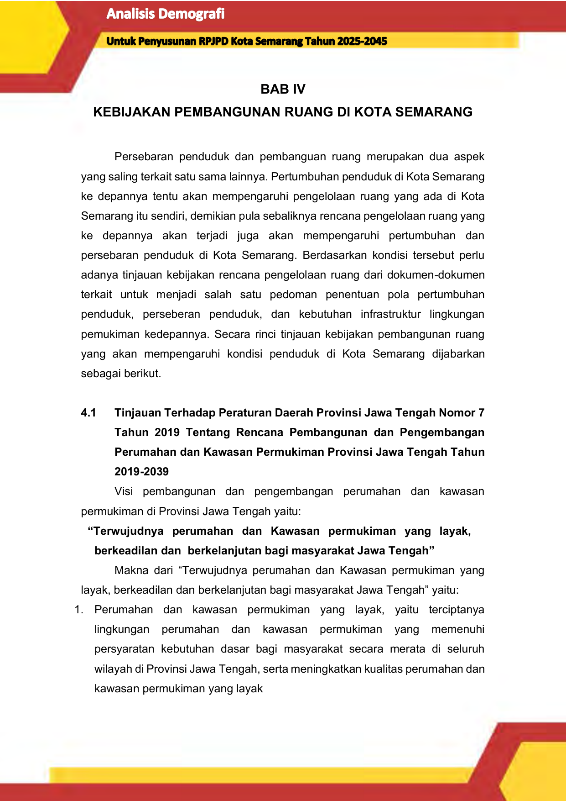
# **BAB IV** **KEBIJAKAN PEMBANGUNAN RUANG DI KOTA SEMARANG**

Persebaran penduduk dan pembanguan ruang merupakan dua aspek

yang saling terkait satu sama lainnya. Pertumbuhan penduduk di Kota Semarang

ke depannya tentu akan mempengaruhi pengelolaan ruang yang ada di Kota

Semarang itu sendiri, demikian pula sebaliknya rencana pengelolaan ruang yang

ke depannya akan terjadi juga akan mempengaruhi pertumbuhan dan

persebaran penduduk di Kota Semarang. Berdasarkan kondisi tersebut perlu

adanya tinjauan kebijakan rencana pengelolaan ruang dari dokumen-dokumen

terkait untuk menjadi salah satu pedoman penentuan pola pertumbuhan

penduduk, perseberan penduduk, dan kebutuhan infrastruktur lingkungan

pemukiman kedepannya. Secara rinci tinjauan kebijakan pembangunan ruang

yang akan mempengaruhi kondisi penduduk di Kota Semarang dijabarkan

sebagai berikut.

**4.1** **Tinjauan Terhadap Peraturan Daerah Provinsi Jawa Tengah Nomor 7**

**Tahun 2019 Tentang Rencana Pembangunan dan Pengembangan**

**Perumahan dan Kawasan Permukiman Provinsi Jawa Tengah Tahun**

**2019-2039**

Visi pembangunan dan pengembangan perumahan dan kawasan

permukiman di Provinsi Jawa Tengah yaitu:

**“Terwujudnya perumahan dan Kawasan permukiman yang layak,**

**berkeadilan dan berkelanjutan bagi masyarakat Jawa Tengah”**

Makna dari “Terwujudnya perumahan dan Kawasan permukiman yang

layak, berkeadilan dan berkelanjutan bagi masyarakat Jawa Tengah” yaitu:

1. Perumahan dan kawasan permukiman yang layak, yaitu terciptanya

lingkungan perumahan dan kawasan permukiman yang memenuhi

persyaratan kebutuhan dasar bagi masyarakat secara merata di seluruh

wilayah di Provinsi Jawa Tengah, serta meningkatkan kualitas perumahan dan

kawasan permukiman yang layak

**61**

--- end of page=69 ---

2. Perumahan dan kawasan yang berkeadilan, yaitu terwujudnya hasil

pembangunan dibidang perumahan dan kawasan permukiman dapat

dinikmati secara proporsional bagi seluruh warga negara Indonesia di Provinsi

Jawa Tengah.

3. Perumahan dan kawasan yang berkelanjutan, yaitu kondisi perumahan dan

kawasan permukiman yang sesuai dengan daya dukung dan daya tampung

permukiman Provinsi Jawa Tengah guna mewujudkan pembangunan

berkelanjutan.

Dengan mengacu kepada hakekat bahwa keberadaan perumahan dan

kawasan permukiman yang layak akan sangat menentukan kualitas masyarakat

dan lingkungannya di masa depan, serta prinsip pemenuhan kebutuhan akan

perumahan dan kawasan permukiman yang layak adalah merupakan tanggung

jawab masyarakat sendiri, maka penempatan masyarakat sebagai pelaku utama

dengan strategi pemberdayaan merupakan upaya yang sangat strategis.

Sehingga Misi yang harus dilaksanakan dalam rangka mewujudkan Visi

penyelenggaraan perumahan dan permukiman di Provinsi Jawa Tengah, adalah

sebagai berikut:

**1. Menyelenggarakan perumahan dan Kawasan permukiman yang**

**layak huni dalam lingkungan yang sehat, aman, serasi, dan teratur**

**serta berkelanjutan**

Penyelenggaran perumahan dan kawasan permukiman yang layak

sesuai Undang-undang Nomor 1 Tahun 2011 tentang Perumahan dan

Kawasan Permukiman harus diikuti dengan kelengkapan prasarana

lingkungan sebagai kelengkapan dasar fisik lingkungan hunian yang

memenuhi standar tertentu untuk kebutuhan bertempat tinggal yang layak,

sehat, aman, dan nyaman. Dengan demikian, tujuan penyelenggaraan

perumahan dan kawasan permukiman Provinsi Jawa Tengah yakni untuk

menjamin terwujudnya rumah yang layak huni dan terjangkau dalam

lingkungan yang sehat, aman, serasi, teratur, terencana, terpadu, dan

berkelanjutan sesuai Pasal 3 UU. No. 1 Tahun 2011.

Misi ini jika dikaitkan dengan rencana pembangunan dan

pengembangan kawasan permukiman Jawa Tengah yakni meliputi pada

**62**

--- end of page=70 ---

kewenangan PKP Kumuh Provinsi dan PKP rawan bencana. Hal ini

sebagai perwujudan PKP yang layak huni huni dalam lingkungan yang

sehat, aman, serasi, dan teratur di PKP kumuh dan rawan bencana.

**2. Menyelenggarakan** **perumahan dan kawasan permukiman**

**dengan prinsip keseimbangan yang dapat diakses oleh semua pihak**

Perumahan dan kawasan permukiman Provinsi Jawa Tengah

diselenggarakan untuk mendukung penataan dan pengembangan wilayah

serta penyebaran penduduk yang proporsional melalui pertumbuhan

lingkungan hunian dan kawasan permukiman sesuai dengan tata ruang

untuk mewujudkan keseimbangan kepentingan, terutama bagi MBR. Hal

ini maksudkan agar, seluruh masyarakat di Jawa Tengah mampu

mengakses pemenuhan perumahan dan kawasan permukiman.

Misi ini merupakan untuk mewujudkan misi pada kewenangan PKP

lintas batas dan PKP Kabupaten/kota. Hal ini bertujuan agar

penyelenggaraan perumahan dan kawasan permukiman dapat diakses

oleh seluruh wilayah (kabupaten/kota) di Jawa Tengah termasuk di

wilayah perbatasan.

**3. Menyelenggarakan perumahan dan kawasan permukiman yang**

**berwawasan lingkungan, mendukung kegiatan perekonomian dan**

**sosial budaya masyarakat**

Pembangunan perumahan dan kawasan permukiman yang layak

termasuk bagian dari proses pembangunan berkelanjutan. Kegiatan ini

juga mampu mendorong kegiatan perekonomian dan fungsi daya

dukungan serta keberlangsungan sosial budaya. Hal ini terkait untuk

mendukung fungsi nilai strategis kawasan, terutama fungsi strategis

provinsi.

**4. Menyelenggarakan perumahan dan kawasan permukiman pada**

**lintas sektoral, lintas wilayah, dan lintas pemangku kepentingan**

Pembangunan perumahan dan kawasan permukiman merupakan

kegiatan sektor yang terpadu dengan sektor lainnya. Hal ini senada

dengan penyelenggaraannya yang dilakukan antar stakeholder

(pemerintah, pelaku usaha/ swasta, dan masyarakat). Selain itu

**63**

--- end of page=71 ---

penyelenggaraan perumahan dan kawasan permukiman sesuai dengan

asas kemitraan Undang-undang Nomor 1 Tahun 2011 tentang

Perumahan dan Kawasan Permukiman yakni memberikan landasan agar

penyelenggaraan perumahan dan kawasan permukiman dilakukan oleh

Pemerintah dan pemerintah daerah dengan melibatkan peran pelaku

usaha dan masyarakat, dengan prinsip saling memerlukan, memercayai,

memperkuat, dan menguntungkan yang dilakukan, baik langsung maupun

tidak langsung.

Selanjutnya pengembangan infratruktur juga mempedomani rencana aksi

pada Rencana Pembangunan dan Pengembangan Perumahan dan Kawasan

Permukiman Provinsi Jawa Tengah, khususnya yang turut berlokasi di Kota

Semarang antara lain sebagai berikut:

**Tabel 4. 1 Rencana Aksi pada Rencana Pembangunan dan Pengembangan**

**Perumahan dan Kawasan Permukiman Provinsi Jawa Tengah di**
**Kota Semarang**

|Lingkup|Lokasi (Kabupaten/ Kota)|Usulan Program Kebijakan Umum Kebijakan Strategis|Col4|Penanggungjawab|
|---|---|---|---|---|
|**Lingkup**  |~~**Lokasi**~~ **(Kabupaten/** **Kota)** |~~**Usulan Program**~~ **Kebijakan Umum** **Kebijakan Strategis**  |**Kebijakan Strategis** |**Kebijakan Strategis** |
|~~**PKP**~~    |~~Kabupaten/~~ Kota di Jawa Tengah | |~~Identifikasi potensi~~ pengembangan dan pembangunan PKP perkotaan atau perdesaan yang meliputi potensi sumber daya alam, potensi sumber daya manusia, potensi ekonomi, potensi sosial dan potensi budaya; |~~Pemerintah Pusat~~ Pemerintah Provinsi Pemerintah Kab/Kota |
|    |~~Kabupaten/~~ Kota di Jawa Tengah | |~~Kajian kebijakan~~ peningkatan efisiensi potensi PKP perkotaan atau perdesaan dalam mendukung fungsi dan peranan perdesaan dan perkotaan, yang memanfaatkan sumber daya dan kegiatan sosial ekonomi setempat |~~Pemerintah Pusat~~ Pemerintah Provinsi Pemerintah Kab/Kota |
|    |~~Kabupaten/~~ Kota di Jawa engah | |~~Rencana~~ KASIBA/LISIBA |~~Pemerintah Pusat~~ Pemerintah Provinsi Pemerintah Kab/Kota |
|   |~~Kabupaten/~~ Kota di Jawa engah||~~Arahan penyediaan~~ pelayanan PKP perkotaan atau|~~Pemerintah Pusat~~ Pemerintah Provinsi Pemerintah Kab/Kota|

**64**

--- end of page=72 ---

|Lingkup|Lokasi (Kabupaten/ Kota)|Usulan Program Kebijakan Umum Kebijakan Strategis|Col4|Penanggungjawab|
|---|---|---|---|---|
|**Lingkup**|~~**Lokasi**~~ **(Kabupaten/** **Kota)**|~~**Usulan Program**~~ **Kebijakan Umum** **Kebijakan Strategis** |**Kebijakan Strategis** |**Kebijakan Strategis** |
||||~~perdesaan yang belum~~ ada ||
|    |~~Kabupaten/~~ Kota di Jawa Tengah |~~Pembangunan Rumah~~ Baru (vertikal maupun horisontal) sebesar 25% (514.415 unit) dilima tahun pertama |~~Pembangunan Baru~~ Terintegrasi Program Pusat, Provinsi dan Kabupaten/Kota |~~Pemerintah Pusat~~ Pemerintah Provinsi Pemerintah Kab/Kota |
|    |~~Kabupaten/~~ Kota di Jawa Tengah |~~Pembangunan Rumah~~ Baru (vertikal maupun horisontal) ebesar 30% (617.334 unit) dilima tahun kedua |~~Pembangunan Baru~~ Terintegrasi Program Pusat, Provinsi dan Kabupaten/Kota |~~Pemerintah Pusat~~ Pemerintah Provinsi Pemerintah Kab/Kota |
|    |~~Kabupaten/~~ Kota di Jawa Tengah |~~Pembangunan Rumah~~ Baru (vertikal maupun horisontal) sebesar 30% (617.334 unit) dilima tahun ketiga |~~Pembangunan Baru~~ Terintegrasi Program Pusat, Provinsi dan Kabupaten/Kota |~~Pemerintah Pusat~~ Pemerintah Provinsi Pemerintah Kab/Kota |
|    |~~Kabupaten/~~ Kota di Jawa Tengah |~~Penataan kembali~~ penguasaan, pemilikan, penggunaan, dan pemanfaatan tanah sesuai dengan  RTRW |~~Penyediaan Tanah Bagi~~ PKP |~~Pemerintah Pusat~~ Pemerintah Provinsi Pemerintah Kab/Kota |
|    |~~Kabupaten/~~ Kota di Jawa Tengah |~~Pembangunan PSU PK~~ | |~~Pemerintah Pusat~~ Pemerintah Provinsi Pemerintah Kab/Kota |
|    |~~Kabupaten/~~ Kota di Jawa Tengah |~~Penataan kembali~~ bidang-bidang tanah termasuk hak atas tanah dan/atau penggunaan tanahnya dengan dilengkapi Prasarana, Sarana, dan Utilitas Umum | |~~Pemerintah Pusat~~ Pemerintah Provinsi Pemerintah Kab/Kota |
|    |~~Kabupaten/~~ Kota di Jawa Tengah |~~Peningkatan kualitas~~ permukiman |~~Penyelenggaraan PSU~~ Permukiman |~~Pemerintah Pusat~~ Pemerintah Provinsi Pemerintah Kab/Kota |
|    |~~Kabupaten/~~ Kota di Jawa Tengah |~~Pembentukan kelompok~~ swadaya masyarakat sebagai pemberdayaan masyarakat dalam pembangunan perkotaan dan menjaga kualitas permukiman | |~~Pemerintah Pusat~~ Pemerintah Provinsi Pemerintah Kab/Kota |
|    |~~Kabupaten/~~ Kota di Jawa Tengah |~~Pencegahan~~ tumbuhnya perumahan dan permukiman kumuh | |~~Pemerintah Pusat~~ Pemerintah Provinsi Pemerintah Kab/Kota |
|    |~~Kabupaten/~~ Kota di Jawa Tengah |~~Pengawasan dan~~ pengendalian terhadap kesesuaian perizinan, standar teknis, dan kelayakan fungsi | |~~Pemerintah Pusat~~ Pemerintah Provinsi Pemerintah Kab/Kota |

_Sumber: Peraturan Daerah Provinsi Jawa Tengah Nomor 7 Tahun 2019 Tentang Rencana_

_Pembangunan dan Pengembangan Perumahan dan Kawasan Permukiman Provinsi_
_Jawa Tengah Tahun 2019-2039_

**65**

--- end of page=73 ---

**4.2** **Tinjauan Terhadap Peraturan Pemerintah No. 13 Tahun 2017 Tentang**

**Peraturan** **Pemerintah** **Tentang** **Perubahan** **Atas** **Peraturan**

**Pemerintah Nomor 26 Tahun 2008 Tentang Rencana Tata Ruang**

**Wilayah Nasional**

Berdasarkan Peraturan Pemerintah No. 13 Tahun 2017 Tentang

Peraturan Pemerintah Tentang Perubahan Atas Peraturan Pemerintah Nomor 26

Tahun 2008 Tentang Rencana Tata Ruang Wilayah Nasional, penataan ruang

wilayah nasional bertujuan untuk mewujudkan:

1. Ruang wilayah nasional yang aman, nyaman, produktif, dan

berkelanjutan;

2. Keharmonisan antara lingkungan alam dan lingkungan buatan;

3. Keterpaduan perencanaan tata ruang wilayah nasional, provinsi, dan

kabupaten/kota;

4. Keterpaduan pemanfaatan ruang darat, ruang laut, dan ruang udara,

termasuk ruang di dalam bumi dalam kerangka negara kesatuan republik

indonesia;

5. Keterpaduan pengendalian pemanfaatan ruang wilayah nasional,

provinsi, dan kabupaten/kota dalam rangka pelindungan fungsi ruang dan

pencegahan dampak negatif terhadap lingkungan akibat pemanfaatan

ruang;

6. Pemanfaatan sumber daya alam secara berkelanjutan bagi peningkatan

kesejahteraan masyarakat;

7. Keseimbangan dan keserasian perkembangan antarwilayah;

8. Keseimbangan dan keserasian kegiatan antarsektor;

9. Pertahanan dan keamanan negara yang dinamis serta integrasi nasional

Kota Semarang termasuk dalam Kawasan Perkotaan Kendal-Semarang

Salatiga-Demak-UngaranPurwodadi (Kedungsepur) tergolong dalam kategori

Pusat Kegiatan Nasional yaitu II/C/3, yang merupakan pengembangan pada

tahap II dengan fokus revitalisasi dan percepatan pengembangan kota-kota

pusat pertumbuhan nasional yang diwujudkan dengan cara revitalisasi kota-kota

yang telah berfungsi.

**66**

--- end of page=74 ---

**4.3** **Tinjauan Peraturan Daerah Nomor 16 Tahun 2019 Tentang Perubahan**

**Atas Peraturan Daerah Provinsi Jawa Tengah Nomor 6 Tahun 2010**

**Tentang Rencana Tata Ruang Wilayah Provinsi Jawa Tengah Tahun**

**2009-2029**

Sistem pelayanan perkotaan di Provinsi Jawa Tengah didasarkan pada

dua aspek, yaitu potensi dan permasalahan yang berkembang di lapangan dan

arahan kebijakan yang tertuang dalam RTRWN. Rencana sistem pelayanan

perkotaan di Provinsi Jawa Tengah untuk lebih lengkapnya dapat dilihat sebagai

berikut:

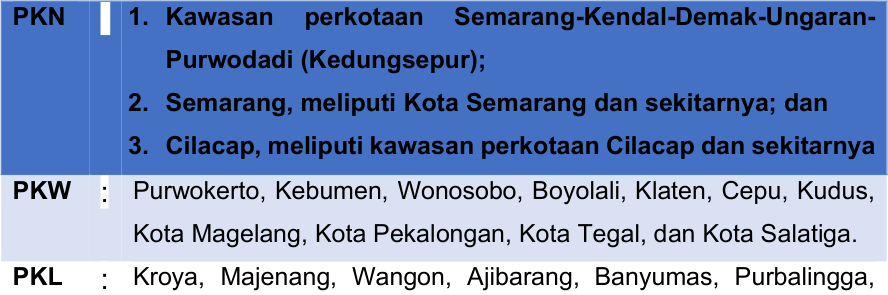

Bobotsari, Sokaraja, Banjarnegara, Klampok, Gombong,

Karanganyar Kebumen, Prembun, Kutoarjo, Purworejo, Mungkid,

Muntilan, Mertoyudan, Borobudur, Secang, Ampel, Sukoharjo,

Kartasura, Wonogiri, Karanganyar, Sragen, Jaten, Delanggu,

Prambanan, Tawangmangu, Blora, Purwodadi, Gubug, Godong,

Rembang, Pati, Juwana, Tayu, Jepara, Pecangaan, Demak,

Mranggen, Ungaran, Ambarawa, Temanggung, Parakan, Kendal,

Boja, Kaliwungu, Weleri, Sukorejo, Batang, Kajen, Wiradesa,

Comal, Pemalang, Slawi-Adiwerna, Ketanggungan-Kersana,

Bumiayu, Brebes, Kedungwuni, Karangkobar, Gemolong, Bangsri,

Limpung.

Berdasarkan sistem pelayanan perkotaan di Provinsi Jawa Tengah, Kota

Semarang merupakan PKN (Pusat Kegiatan Nasional). Dengan ditunjuknya Kota

Semarang sebagai PKN, maka beberapa fungsi Kota Semarang adalah sebagai

berikut:

**67**

--- end of page=75 ---

1. Sebagai simpul utama kegiatan ekspor-impor atau pintu gerbang menuju

kawasan internasional;

2. Sebagai pusat kegiatan industri dan jasa skala nasional atau yang melayani

beberapa provinsi; dan/atau

3. Sebagai simpul utama transportasi skala nasional atau melayani beberapa

provinsi.

**4.4** **Tinjauan Terhadap Peraturan Presiden Republik Indonesia Nomor 60**

**Tahun 2022 Tentang Rencana Tata Ruang Kawasan Strategis**

**Nasional Kawasan Perkotaan Kendal, Demak, Ungaran, Salatiga,**

**Semarang, dan Purwodadi**

Kawasan Perkotaan Kendal, Demak, Ungaran, Salatiga, Semarang, dan

Purwodadi yang selanjutnya disebut Kawasan Perkotaan Kedungsepur

merupakan KSN dari sudut kepentingan pertumbuhan ekonomi. Rencana sistem

pusat permukiman dalam KSN ini terdiri atas:

**1. Pusat Kegiatan di Kawasan Perkotaan Inti**

Pusat kegiatan di Kawasan Perkotaan Inti ditetapkan sebagai pusat

kegiatan utama dan pendorong pengembangan Kawasan Perkotaan di

sekitarnya. Pusat kegiatan di Kawasan Perkotaan Inti berada di Kota Semarang,

meliputi:

1) pusat pemerintahan provinsi;

2) pusat pemerintahan kota;

3) pusat perdagangan barang dan/ atau jasa skala internasional, nasional,

dan regional;

4) pusat pelayanan pendidikan tinggi;

5) pusat pelayanan olahraga skala internasional, nasional, dan regional;

6) pusat pelayanan kesehatan skala internasional, nasional, dan regional;

7) pusat pelayanan sistem angkutan umum penumpang dan angkutan

barang regional;

8) pusat pelayanan transportasi laut nasional;

9) pusat pelayanan transportasi udara internasional dan nasional;

10) pusat kegiatan pertahanan dan keamanan negara;

**68**

--- end of page=76 ---

11) pusat kegiatan industri;

12) pusat kegiatan Pariwisata dan ekonomi kreatif;

13) pusat pertumbuhan kelautan berupa sentra industri maritim; dan

14) pusat kegiatan pertemuan, pameran, dan sosial budaya.

**2. Pusat Kegiatan di Kawasan Perkotaan Sekitarnya**

Pusat kegiatan di Kawasan Perkotaan di sekitarnya ditetapkan sebagai

penyeimbang perkembangan Kawasan Perkotaan Inti. Pusat kegiatan di

Kawasan Perkotaan di sekitamya meliputi:

**Tabel 4.2** **Pusat Kegiatan di Kawasan Perkotaan Sekitarnya**

|No|Pusat Kegiatan di Kawasan Perkotaan Sekitarnya|Fungsi|
|---|---|---|
|~~**1 **~~ |~~Kawasan Perkotaan~~ Kendal di Kabupaten Kendal |•  ~~pusat pelayanan sistem angkutan umum penumpang~~ regional; •  pusat kegiatan industri; •  pusat kegiatan Pariwisata dan ekonomi kreatif; •  pusat kegiatan pertanian; •  pusat kegiatan perdagangan barang dan/atau jasa; dan •  pusat kegiatan pertahanan dan keamanan negara.  |
|~~**2 **~~ |~~Kawasan Perkotaan~~ Kaliwungu di Kabupaten Kendal |•  ~~pusat pelayanan sistem angkutan umum penumpang~~ regional; •  pusat kegiatan industri; •  pusat kegiatan perdagangan barang dan/atau jasa; dan •  pusat kegiatan pertanian.  |
|~~**3 **~~ |~~Kawasan Perkotaan~~ Weleri di Kabupaten Kendal |•  ~~pusat pertahanan dan keamanan negara;~~ •  pusat pelayanan sistem angkutan umum penumpang regional; •  pusat kegiatan perikanan; •  pusat kegiatan pertanian.  |
|~~**4 **~~ |~~Kawasan Perkotaan~~ Boja di Kabupaten Kendal |•  ~~pusat pelayanan sistem angkutan umum penumpang~~ regional; •  pusat kegiatan pertanian; •  pusat kegiatan industri.  |
|~~**5 **~~ |~~Kawasan Perkotaan~~ Sukorejo di Kabupaten Kendal |•  ~~pusat pelayanan sistem angkutan umum penumpang~~ regional; •  pusat kegiatan pertanian  |
|~~**6 **~~|~~Kawasan Perkotaan~~ Demak di Kabupaten Demak|•  ~~pusat pelayanan sistem angkutan umum penumpang~~ regional; •  pusat perdagangan barang dan/atau jasa; •  pusat pertumbuhan kelautan dan perikanan berupa sentra kegiatan usaha pergaraman; •  pusat kegiatan pertanian;|

**69**

--- end of page=77 ---

|No|Pusat Kegiatan di Kawasan Perkotaan Sekitarnya|Fungsi|
|---|---|---|
|||•  ~~pusat kegiatan industri;~~ •  pusat kegiatan Pariwisata dan ekonomi kreatif; •  pusat kegiatan pertahanan dan keamanan negara.  |
|~~**7 **~~ |~~Kawasan Perkotaan~~ Mranggen di Kabupaten Demak |•  ~~pusat kegiatan industri;~~ •  pusat kegiatan pertanian  |
|~~**8 **~~ |~~Kawasan Perkotaan~~ Sayung di Kabupaten Demak, |•  ~~pusat kegiatan industri; pusat pertumbuhan kelautan dan~~ perikanan berupa sentra kegiatan perikanan tangkap dan/atau perikanan budi daya; •  pusat kegiatan pertanian  |
|~~**9 **~~ |~~Kawasan Perkotaan~~ Ungaran di Kabupaten Semarang |•  ~~pusat pelayanan sistem angkutan umum penumpang dan~~ angkutan barang regional; •  pusat kegiatan industri; •  pusat kegiatan pertanian; •  pusat kegiatan perdagangan barang dan/atau jasa regional; •  pusat kegiatan Pariwisata dan ekonomi kreatif.  |
|~~**10**~~ |~~Kawasan Perkotaan~~ Ambarawa di Kabupaten Semarang |•  ~~pusat pelayanan sistem angkutan umum penumpang dan~~ angkutan barang regional; pusat perdagangan barang dan/ atau jasa skala regional; •  pusat kegiatan pertahanan dan keamanan negara; •  pusat kegiatan pertanian; •  pusat kegiatan perikanan; •  pusat kegiatan Pariwisata dan ekonomi kreatif  |
|~~**11**~~ |~~Kawasan Perkotaan~~ Bawen di Kabupaten Semarang |•  ~~pusat pelayanan sistem angkutan umum penumpang~~ regional; •  pusat kegiatan perdagangan barang dan/ atau jasa; •  pusat kegiatan industri; •  pusat kegiatan pertanian; •  pusat kegiatan Pariwisata dan ekonomi kreatif  |
|~~**12**~~ |~~Kawasan Perkotaan~~ Salatiga di Kota Salatiga |•  ~~pusat pelayanan sistem angkutan umum penumpang dan~~ angkutan barang regional; •  pusat kegiatan pertahanan dan keamanan negara; •  pusat kegiatan perdagangan barang dan/ atau jasa; •  pusat kegiatan kesehatan; •  pusat pelayanan pendidikan tinggi|
|~~**13**~~|~~Kawasan Perkotaan~~ Purwodadi di lz,abupaten Grobogan|•  pusat pelayanan sistem angkutan umum penumpang regional; •  pusat kegiatan perdagangan barang dan/atau jasa •  pusat kegiatan industri; •  pusat kegiatan pertanian; •  pusat kegiatan pertahanan dan keamanan negara|

**70**

--- end of page=78 ---

|No|Pusat Kegiatan di Kawasan Perkotaan Sekitarnya|Fungsi|
|---|---|---|
|~~**14**~~ |~~Kawasan Perkotaan~~ Gubug di Kabupaten Grobogan |•  ~~pusat kegiatan industri;~~ •  pusat kegiatan pertanian |

_Sumber: Peraturan Presiden Republik Indonesia Nomor 60 Tahun 2022 Tentang Rencana Tata_

_Ruang Kawasan Strategis Nasional Kawasan Perkotaan Kendal, Demak, Ungaran,_
_Salatiga, Semarang, dan Purwodadi_

**3. Pusat Pertumbuhan Kelautan**

Berdasarkan Peraturan Presiden Republik Indonesia Nomor 60 Tahun

2022 Tentang Rencana Tata Ruang Kawasan Strategis Nasional Kawasan

Perkotaan Kendal, Demak, Ungaran, Salatiga, Semarang, dan Purwodadi, pusat

pertumbuhan kelautan terdiri atas:

1) Pusat pertumbuhan kelautan dan perikanan meliputi: sentra kegiatan

perikanan tangkap dan/ atau perikanan budidaya dan sentra kegiatan

usaha pergaraman. Sentra kegiatan perikanan tangkap dan/atau

perikanan budi daya sebagaimana dimaksud pada berada di Kecamatan

Bonang pada Kabupaterr Dernak. Sentra kegiatan usaha pergaraman

berada di Kecamatan Wedung dan Kecamatan Karangtengah pada

Kabupaten Demak.

2) Pusat industri kelautan, meliputi: sentra industri maritim berada di

Kecamatan Semarang Utara pada Kota Semarang.

Indikasi program utama perwujudan Struktur Ruang Kawasan Perkotaan

Kedungsepur terdiri atas:

a. pengembangan, peningkatan, dan/atau pemantapan fungsi Kawasan

Perkotaan Inti sebagai pusat pemerintahan daerah provinsi, pusat

pemerintahan daerah kota, pusat perdagangan barang dan/atau jasa

skala intemasional, nasional, dan regional, pusat pelayanan pendidikan

tinggi, pusat pelayanan olahraga skala internasional, nasional, dan

regional, pusat pelayanan kesehatan skala internasional, nasional, dan

regional, pusat pelayanan sistem angkutan umum penumpang dan

angkutan barang regional, pusat pelayanan transportasi laut nasional,

**71**

--- end of page=79 ---

pusat pelayanan transportasi udara internasional dan nasional, pusat

kegiatan pertahanan dan keamanan negara, pusat kegiatan Pariwisata

dan ekonomi kreatif, pusat pertumbuhan kelautan dan perikanan, pusat

kegiatan industri serta pusat kegiatan pertemuan, pameran, dan sosial

budaya, serta penyusunan dan penetapan rencana detail tata ruang

kabupaten/kota;

b. pengembangan, peningkatan, dan/atau pemantapan fungsi Kawasan

Perkotaan di Sekitarnya sebagai pusat perdagangan barang dan/atau

jasa, pusat pelayanan pendidikan tinggi, pusat pelayanan kesehatan,

pusat kegiatan industri, pusat pertumbuhan kelautan dan perikanan, pusat

kegiatan pertanian, pusat kegiatan pertahanan dan keamanan negara,

pusat kegiatan Pariwisata dan ekonomi kreatif, pusat pelayanan sistem

angkutan umum penumpang regional, pusat kegiatan perikanan serta

penyrusunan dan penetapan rencana detail tata ruang kabupaten/kota;

c. pengembangan, peningkatan, dan/atau pemantapan kualitas sistem

jaringan transportasi yang meliputi sistem jaringan jalan, sistem jaringan

transportasi sungai dan penyeberangan, sistem jaringan perkeretaapian,

sistem jaringan transportasi laut, dan sistem jaringan transportasi udara;

d. pengembangan, peningkatan, dan/atau pemantapan sistem jaringan

energi yang meliputi jaringan pipa minyak dan gas bumi, jaringan gas kota,

pembangkitan tenaga listrik, dan jaringan transmisi tenaga listrik;

e. pengembangan, peningkatan, dan/atau pemantapan sistem jaringan

telekomunikasi yang meliputi jaringan tetap dan jaringan bergerak;

f. pengembangan, peningkatan, dan/atau pemantapan sistem jaringan

sumber daya air yang meliputi sungai, waduk, CAT, sistem pengendalian

banjir dan kenaikan paras muka air laut/rob, sistem jaringan irigasi, dan

sistem pengamanan pantai;

g. pengembangan, peningkatan, dan/atau pemantapan sistem jaringan

prasarana perkotaan yang meliputi SPAM, sistem jaringan drainase,

sistem jaringan air limbah, sistem pengelolaan persampahan; dan

h. pembangunan, peningkatan, dan/atau pemantapan jalur evakuasi untuk

kawasan rawan bencana.

**72**

--- end of page=80 ---

Indikasi program utama perwujudan Rencana Pola Ruang Kawasan

Perkotaan Kedungsepur terdiri atas:

**Tabel 4.3** **Indikasi Program Utama Rencana Pola Ruang Kawasan**
**Perkotaan Kedungsepur**

|No|Pola Ruang Kawasan|Fungsi|
|---|---|---|
|~~**1 **~~ |~~Kawasan~~ Lindung |~~Zona Lindung diprioritaskan untuk pengembangan, rehabilitasi, revitalisasi, dan~~ peningkatan fungsi lindung pada kawasan yang rnemberikan pelindungan terhadap kawasan bawahannya, kawasan pelindungan setempat, kawasan konservasi, Kawasan Lindung geologi, dan Kawasan Lindung lainnya. |
|~~**2 **~~|~~Kawasan~~ Budidaya|~~Zona Budi Daya diprioritaskan untuk:~~ •  pengembangan, rehabilitasi, revitalisasi, dan peningkatan fungsi kawasan peruntukan permukiman teratur dengan kepadatan tinggi, kepadatan sedang, dan kepadatan rendah; • pengembangan, rehabilitasi, revitalisasi, dan peningkatan fungsi kawasan peruntukan pemerintahan daerah provinsi, kabupaten, kota, dan/atau kecamatan; • pengembangan, rehabilitasi, revitalisasi, dan peningkatan fungsi kawasan peruntukan perdagangan barang dan/atau jasa skala internasional, nasional, dan regional; • pengembangan, rehabilitasi, revitalisasi, dan peningkatan fungsi kawasan peruntukan pelayanan pendidikan tinggi; • pengembangan, rehabilitasi, revitalisasi, dan peningkatan fungsi kawasan peruntukan pelayanan olahraga skala internasional, nasional, regional, dan lokal; • pengembangan, rehabilitasi, revitalisasi, dan peningkatan fungsi kawasan peruntukan pelayanan kesehatan skala internasional, nasional, regional, dan lokal; • pengembangan, rehabilitasi, revitalisasi, dan peningkatan fungsi kawasan peruntukan pelayanan sistem angkutan umum penumpang dan angkutan barang regional; • pengembangan, rehabilitasi, revitalisasi, dan peningkatan fungsi kawasan peruntukan pelayanan transportasi laut internasional, nasional, dan regional; • pengembangan, rehabilitasi, revitalisasi, dan peningkatan fungsi kawasan peruntukan pelayanan transportasi udara internasional, nasional, dan regional; • pengembangan, rehabilitasi, revitalisasi, dan peningkatan fungsi kawasan peruntukan kegiatan pertahanan dan keamanan negara; • pengembangan, rehabilitasi, revitalisasi, dan peningkatan fungsi kawasan peruntukan kegiatan Pariwisata dan ekonomi kreatif; • pengembangan, rehabilitasi, revitalisasi, dan peningkatan fungsi kawasan peruntukan kegiatan pertanian, perkebunan, dan petemakan; • pengembangan, rehabilitasi, revitalisasi, dan peningkatan fungsi kawasan peruntukan perikanan; • pengembangan, rehabilitasi, revitalisasi, dan peningkatan fungsi kawasan peruntukan industri skala nasional baik berupa Kawasan Industri maupun pusat kegiatan industri;|

**73**

--- end of page=81 ---

|No|Pola Ruang Kawasan|Fungsi|
|---|---|---|
|||•~~ pengembangan, rehabilitasi, revitalisasi, dan peningkatan fungsi kawasan~~ peruntukan kegiatan hutan produksi tetap; dan • pengembangan, rehabilitasi, revitalisasi, dan peningkatan fungsi kawasan peruntukan kegiatan pertemuan, pameran, dan sosial budaya |

_Sumber: Peraturan Presiden Republik Indonesia Nomor 60 Tahun 2022 Tentang Rencana Tata_

_Ruang Kawasan Strategis Nasional Kawasan Perkotaan Kendal, Demak, Ungaran,_
_Salatiga, Semarang, dan Purwodadi_

**4.5** **Tinjauan Terhadap Peraturan Daerah Kota Semarang Nomor 5 Tahun**

**2021 Tentang Perubahan Atas Peraturan Daerah Nomor 14 Tahun**

**2011 Tentang Rencana Tata Ruang Wilayah Kota Semarang Tahun**

**2011-2031**

Tinjauan terhadap Peraturan Daerah Kota Semarang Nomor 5 Tahun

2021 Tentang Perubahan Atas Peraturan Daerah Nomor 14 Tahun 2011 Tentang

Rencana Tata Ruang Wilayah Kota Semarang Tahun 2011-2031 berfungsi untuk

melihat lokus-lokus pembangunan berdasarkan rencana struktur ruang dan pola

ruang yang ada di dalamnya. Peraturan Daerah Kota Semarang Nomor 5 Tahun

2021 Tentang Perubahan Atas Peraturan Daerah Nomor 14 Tahun 2011 Tentang

Rencana Tata Ruang Wilayah Kota Semarang Tahun 2011-2031 memiliki

keterkaitan yang erat dengan proyeksi arah persebaran penduduk di Kota

Semarang dalam waktu 20 tahun ke depan. Secara rinci kondisi rencana struktur

ruang dan pola ruang dalam RTRW tahun 2011-2031 dijabarkan sebagai berikut.

**4.5.1 Rencana Struktur Ruang**

**4.5.1.1. Struktur Ruang**

**A.** **Pusat Kegiatan**

Pusat kegiatan meliputi pusat pelayanan kota, sub pusat pelayanan kota,

dan pusat lingkungan, dengan rincian masing-masing sebagai berikut:

**Tabel 4.4** **Rencana Pusat Kegiatan Kota Semarang**

|No|Pusat Kegiatan|Lokasi|Daerah Pelayanan|Keterangan|
|---|---|---|---|---|
|~~1 ~~|~~Pusat~~ Pelayanan Kota|~~BWK I, II, III~~||~~Pusat pelayanan kota~~ sebagaimana dimaksud dilengkapi dengan prasarana|

**74**

--- end of page=82 ---

|No|Pusat Kegiatan|Lokasi|Col4|Daerah Pelayanan|Keterangan|
|---|---|---|---|---|---|
||||||~~dan sarana ekonomi,~~ sosial, dan/atau administrasi skala pelayanan Kota dan/ atau Regional. Prasarana dan sarana ekonomi, sosial, dan/atau administrasi diarahkan memiliki ruang interaksi publik yang berupa RTH dan/atau RTNH. |
|~~2 ~~ |~~Sub pusat~~ pelayanan kota |~~BWK IV~~ ~~BWK V~~ ~~BWK VI~~ ~~BWK VII~~ ~~BWK VIII~~ ~~BWK IX~~ ~~BWK X~~ |~~BWK IV~~ ~~BWK V~~ ~~BWK VI~~ ~~BWK VII~~ ~~BWK VIII~~ ~~BWK IX~~ ~~BWK X~~ |~~Kelurahan Genuksari dan Kelurahan~~ Banjardowo |~~Sub pusat pelayanan~~ kota dilengkapi dengan prasarana dan sarana ekonomi, sosial, dan/atau administrasi skala pelayanan BWK. Prasarana dan sarana ekonomi, sosial, dan/atau administrasi di sub pelayanan kota diarahkan memiliki ruang interaksi publik yang berupa  RTH dan/atau RTNH. |
|~~2 ~~ |~~Sub pusat~~ pelayanan kota |~~BWK IV~~ ~~BWK V~~ ~~BWK VI~~ ~~BWK VII~~ ~~BWK VIII~~ ~~BWK IX~~ ~~BWK X~~ |~~BWK IV~~ ~~BWK V~~ ~~BWK VI~~ ~~BWK VII~~ ~~BWK VIII~~ ~~BWK IX~~ ~~BWK X~~ |~~Kelurahan Palebon, Kelurahan Gemah,~~ Kelurahan Pedurungan Kidul, Kelurahan Pedurungan Tengah, dan Kelurahan Pedurungan Lor |~~Kelurahan Palebon, Kelurahan Gemah,~~ Kelurahan Pedurungan Kidul, Kelurahan Pedurungan Tengah, dan Kelurahan Pedurungan Lor |
|~~2 ~~ |~~Sub pusat~~ pelayanan kota |~~BWK IV~~ ~~BWK V~~ ~~BWK VI~~ ~~BWK VII~~ ~~BWK VIII~~ ~~BWK IX~~ ~~BWK X~~ |~~BWK IV~~ ~~BWK V~~ ~~BWK VI~~ ~~BWK VII~~ ~~BWK VIII~~ ~~BWK IX~~ ~~BWK X~~ |~~Kelurahan Meteseh dan Kelurahan~~ Sendangmulyo |~~Kelurahan Meteseh dan Kelurahan~~ Sendangmulyo |
|~~2 ~~ |~~Sub pusat~~ pelayanan kota |~~BWK IV~~ ~~BWK V~~ ~~BWK VI~~ ~~BWK VII~~ ~~BWK VIII~~ ~~BWK IX~~ ~~BWK X~~ |~~BWK IV~~ ~~BWK V~~ ~~BWK VI~~ ~~BWK VII~~ ~~BWK VIII~~ ~~BWK IX~~ ~~BWK X~~ |~~Kelurahan Srondol  Kulon, Kelurahan~~ Srondol Wetan,  Kelurahan Banyumanik |~~Kelurahan Srondol  Kulon, Kelurahan~~ Srondol Wetan,  Kelurahan Banyumanik |
|~~2 ~~ |~~Sub pusat~~ pelayanan kota |~~BWK IV~~ ~~BWK V~~ ~~BWK VI~~ ~~BWK VII~~ ~~BWK VIII~~ ~~BWK IX~~ ~~BWK X~~ |~~BWK IV~~ ~~BWK V~~ ~~BWK VI~~ ~~BWK VII~~ ~~BWK VIII~~ ~~BWK IX~~ ~~BWK X~~ |~~Kelurahan Gunungpati, Kelurahan~~ Plalangan,  Kelurahan Cepoko, dan Kelurahan Nongkosawit |~~Kelurahan Gunungpati, Kelurahan~~ Plalangan,  Kelurahan Cepoko, dan Kelurahan Nongkosawit |
|~~2 ~~ |~~Sub pusat~~ pelayanan kota |~~BWK IV~~ ~~BWK V~~ ~~BWK VI~~ ~~BWK VII~~ ~~BWK VIII~~ ~~BWK IX~~ ~~BWK X~~ |~~BWK IV~~ ~~BWK V~~ ~~BWK VI~~ ~~BWK VII~~ ~~BWK VIII~~ ~~BWK IX~~ ~~BWK X~~ |~~Kelurahan Mijen, Kelurahan Jatibarang,~~ Kelurahan Wonolopo |~~Kelurahan Mijen, Kelurahan Jatibarang,~~ Kelurahan Wonolopo |
|~~2 ~~ |~~Sub pusat~~ pelayanan kota |~~BWK IV~~ ~~BWK V~~ ~~BWK VI~~ ~~BWK VII~~ ~~BWK VIII~~ ~~BWK IX~~ ~~BWK X~~ |~~BWK IV~~ ~~BWK V~~ ~~BWK VI~~ ~~BWK VII~~ ~~BWK VIII~~ ~~BWK IX~~ ~~BWK X~~ |~~Kelurahan Mangkang Kulon, Kelurahan~~ Mangkang Wetan, dan Kelurahan Wonosari |~~Kelurahan Mangkang Kulon, Kelurahan~~ Mangkang Wetan, dan Kelurahan Wonosari |
|~~3 ~~ |~~Pusat~~ lingkungan |  |  | |~~Pusat lingkungan~~ dilengkapi dengan prasarana dan sarana pelayanan ekonomi, sosial dan/atau administrasi skala pelayanan lingkungan permukiman. Prasarana dan sarana ekonomi, sosial, dan/atau administrasi di pusat lingkungan diarahkan memiliki ruang interaksi publik yang berupa RTH dan/atau RTNH. |
|~~3.1~~|~~Pusat~~ lingkungan BWK I|~~Pusat~~ lingkungan I.1 ~~Pusat~~ lingkungan I.2|~~Kelurahan~~ Sekayu |~~Kelurahan Pindrikan  Lor, Kelurahan~~ Pindrikan Kidul, Kelurahan Pandansari, Kelurahan Kembang Sari, Kelurahan Bangunharjo, Kelurahan Kauman, Kelurahan Kranggan, Kelurahan Purwodinatan, Kelurahan Miroto, Kelurahan Pekunden, Kelurahan Gabahan, Kelurahan Brumbungan, Kelurahan Jagalan dan Kelurahan Karang Kidul | |
|~~3.1~~|~~Pusat~~ lingkungan BWK I|~~Pusat~~ lingkungan I.1 ~~Pusat~~ lingkungan I.2|~~Kelurahan~~ Kemijen|~~Kelurahan Rejomulyo, Kelurahan~~ Mlatiharjo, Kelurahan Mlatibaru, Kelurahan Kebonagung dan Kelurahan Bugangan||

**75**

--- end of page=83 ---

|No|Pusat Kegiatan|Lokasi|Col4|Daerah Pelayanan|Keterangan|
|---|---|---|---|---|---|
|||~~Pusat~~ lingkungan I.3 ~~Pusat~~ lingkungan I.4 ~~Pusat~~ lingkungan I.5 |~~Kelurahan~~ Rejosari |~~Kelurahan Sarirejo, Kelurahan~~ Karangturi dan Kelurahan Karangtempel | |
|||~~Pusat~~ lingkungan I.3 ~~Pusat~~ lingkungan I.4 ~~Pusat~~ lingkungan I.5 |~~Kelurahan~~ Mugasari |~~Kelurahan Bulustalan, Kelurahan~~ Barusari dan Kelurahan Randusari | |
|||~~Pusat~~ lingkungan I.3 ~~Pusat~~ lingkungan I.4 ~~Pusat~~ lingkungan I.5 |~~Kelurahan~~ Peterongan |~~Kelurahan Pleburan, Kelurahan Wonodri,~~ Kelurahan Lamper Lor, Kelurahan Lamper Kidul dan Kelurahan Lamper Tengah. | |
|~~3.2~~ |~~Pusat~~ lingkungan BWK II |~~Pusat~~ lingkungan II.1 ~~Pusat~~ lingkungan II.2 ~~Pusat~~ lingkungan II.3 ~~Pusat~~ lingkungan II.4 |~~Kelurahan~~ Sampangan |~~Kelurahan Petompon, Kelurahan Bendan~~ Ngisor dan Kelurahan Bendan Duwur | |
|~~3.2~~ |~~Pusat~~ lingkungan BWK II |~~Pusat~~ lingkungan II.1 ~~Pusat~~ lingkungan II.2 ~~Pusat~~ lingkungan II.3 ~~Pusat~~ lingkungan II.4 |~~Kelurahan~~ Gajahmungkur |~~Kelurahan Bendungan, Kelurahan~~ Lempongsari dan Kelurahan Karangrejo | |
|~~3.2~~ |~~Pusat~~ lingkungan BWK II |~~Pusat~~ lingkungan II.1 ~~Pusat~~ lingkungan II.2 ~~Pusat~~ lingkungan II.3 ~~Pusat~~ lingkungan II.4 |~~Kelurahan~~ Candi |~~Kelurahan Candi dan Kelurahan~~ Wonotingal dengan daerah pelayanan Kelurahan Kaliwiru dan Kelurahan Tegalsari | |
|~~3.2~~ |~~Pusat~~ lingkungan BWK II |~~Pusat~~ lingkungan II.1 ~~Pusat~~ lingkungan II.2 ~~Pusat~~ lingkungan II.3 ~~Pusat~~ lingkungan II.4 |~~Kelurahan~~ Jatingaleh |~~Kelurahan Jomblang dan Kelurahan~~ Karanganyar Gunung | |
|~~3.3~~ |~~Pusat~~ lingkungan BWK III |~~Pusat~~ lingkungan III.1 ~~Pusat~~ lingkungan III.2 ~~Pusat~~ lingkungan III.3 ~~Pusat~~ lingkungan III.4 ~~Pusat~~ lingkungan III.5 ~~Pusat~~ lingkungan III.6 ~~Pusat~~ lingkungan III.7 |~~Kelurahan~~ Tanjungmas |~~Kelurahan Bandarharjo~~ | |
|~~3.3~~ |~~Pusat~~ lingkungan BWK III |~~Pusat~~ lingkungan III.1 ~~Pusat~~ lingkungan III.2 ~~Pusat~~ lingkungan III.3 ~~Pusat~~ lingkungan III.4 ~~Pusat~~ lingkungan III.5 ~~Pusat~~ lingkungan III.6 ~~Pusat~~ lingkungan III.7 |~~Kelurahan~~ Kuningan |~~Kelurahan Purwosari dan Kelurahan~~ Dadapsari | |
|~~3.3~~ |~~Pusat~~ lingkungan BWK III |~~Pusat~~ lingkungan III.1 ~~Pusat~~ lingkungan III.2 ~~Pusat~~ lingkungan III.3 ~~Pusat~~ lingkungan III.4 ~~Pusat~~ lingkungan III.5 ~~Pusat~~ lingkungan III.6 ~~Pusat~~ lingkungan III.7 |~~Kelurahan~~ Panggung Lor |~~Kelurahan Panggung  Kidul, Kelurahan~~ Plombokan dan  Kelurahan Bulu Lor | |
|~~3.3~~ |~~Pusat~~ lingkungan BWK III |~~Pusat~~ lingkungan III.1 ~~Pusat~~ lingkungan III.2 ~~Pusat~~ lingkungan III.3 ~~Pusat~~ lingkungan III.4 ~~Pusat~~ lingkungan III.5 ~~Pusat~~ lingkungan III.6 ~~Pusat~~ lingkungan III.7 |~~Kelurahan~~ Tawangmas |~~Kelurahan Tawangsari,  Kelurahan~~ Krobokan, Kelurahan Tambakharjo dan Kelurahan Karangayu | |
|~~3.3~~ |~~Pusat~~ lingkungan BWK III |~~Pusat~~ lingkungan III.1 ~~Pusat~~ lingkungan III.2 ~~Pusat~~ lingkungan III.3 ~~Pusat~~ lingkungan III.4 ~~Pusat~~ lingkungan III.5 ~~Pusat~~ lingkungan III.6 ~~Pusat~~ lingkungan III.7 |~~Kelurahan~~ Cebean |~~Kelurahan Salaman  Mloyo, Kelurahan~~ Bojongsalaman,  Kelurahan Ngemplak Simongan dan Kelurahan Bongsari | |
|~~3.3~~ |~~Pusat~~ lingkungan BWK III |~~Pusat~~ lingkungan III.1 ~~Pusat~~ lingkungan III.2 ~~Pusat~~ lingkungan III.3 ~~Pusat~~ lingkungan III.4 ~~Pusat~~ lingkungan III.5 ~~Pusat~~ lingkungan III.6 ~~Pusat~~ lingkungan III.7 |~~Kelurahan~~ Manyaran |~~Kelurahan Girikdrono dan Kelurahan~~ Kalibanteng Kidul | |
|~~3.3~~ |~~Pusat~~ lingkungan BWK III |~~Pusat~~ lingkungan III.1 ~~Pusat~~ lingkungan III.2 ~~Pusat~~ lingkungan III.3 ~~Pusat~~ lingkungan III.4 ~~Pusat~~ lingkungan III.5 ~~Pusat~~ lingkungan III.6 ~~Pusat~~ lingkungan III.7 |~~Kelurahan~~ Kalibanteng Kulon |~~Kelurahan Krapyak dan  Kelurahan~~ Kembangarum | |
|~~3.4~~ |~~Pusat~~ lingkungan BWK IV |~~Pusat~~ lingkungan IV.1 ~~Pusat~~ lingkungan IV.2 |~~Kelurahan~~ Terboyo Wetan |~~Kelurahan Terboyo Kulon,  Kelurahan~~ Trimulyo,  Kelurahan  Muktiharjo Lor, Kelurahan Gebangsari, Kelurahan Genuksari dan Kelurahan Bangetayu Kulon | |
|~~3.4~~ |~~Pusat~~ lingkungan BWK IV |~~Pusat~~ lingkungan IV.1 ~~Pusat~~ lingkungan IV.2 |~~Kelurahan~~ Banjardowo |~~Kelurahan Karangroto,  Kelurahan Kudu,~~ Kelurahan Sambungharjo,  Kelurahan Bangetayu Wetan dan Kelurahan Penggaron Lor | |
|~~3.5~~|~~Pusat~~ lingkungan BWK V|~~Pusat~~ lingkungan V.1 ~~Pusat~~ lingkungan V.2|~~Kelurahan~~ Kaligawe |~~Kelurahan Tambakrejo dan Kelurahan~~ Sawah  Besar | |
|~~3.5~~|~~Pusat~~ lingkungan BWK V|~~Pusat~~ lingkungan V.1 ~~Pusat~~ lingkungan V.2|~~Kelurahan~~ Gayamsari|~~Kelurahan Sambirejo,  Kelurahan~~ Siwalan dan  Kelurahan Pandean Lamper||

**76**

--- end of page=84 ---

|No|Pusat Kegiatan|Lokasi|Col4|Daerah Pelayanan|Keterangan|
|---|---|---|---|---|---|
|||~~Pusat~~ lingkungan V.3 ~~Pusat~~ lingkungan V.4 ~~Pusat~~ lingkungan V.5 |~~Kelurahan~~ Tlogosari Kulon |~~Kelurahan Muktiharjo Kidul~~ | |
|||~~Pusat~~ lingkungan V.3 ~~Pusat~~ lingkungan V.4 ~~Pusat~~ lingkungan V.5 |~~Kelurahan~~ Palebon |~~Kelurahan Kalicari dan Kelurahan~~ Gemah | |
|||~~Pusat~~ lingkungan V.3 ~~Pusat~~ lingkungan V.4 ~~Pusat~~ lingkungan V.5 |~~Kelurahan~~ Pedurungan Kidul |~~Kelurahan Tlogosari Wetan, Kelurahan~~ Tlogomulyo, Kelurahan Pedurungan Tengah, Kelurahan Pedurungan Lor, Kelurahan | |
|~~3.6~~ |~~Pusat~~ lingkungan BWK VI |~~Pusat~~ lingkungan VI.1 ~~Pusat~~ lingkungan VI.2 ~~Pusat~~ lingkungan VI.3 |~~Kelurahan~~ Bulusan |~~Kelurahan Tembalang, Kelurahan~~ Mangunharjo, Kelurahan Kramas, Kelurahan Meteseh dan Kelurahan Rowosari | |
|~~3.6~~ |~~Pusat~~ lingkungan BWK VI |~~Pusat~~ lingkungan VI.1 ~~Pusat~~ lingkungan VI.2 ~~Pusat~~ lingkungan VI.3 |~~Kelurahan~~ Sendangmulyo |~~Kelurahan Kedungmundu~~ | |
|~~3.6~~ |~~Pusat~~ lingkungan BWK VI |~~Pusat~~ lingkungan VI.1 ~~Pusat~~ lingkungan VI.2 ~~Pusat~~ lingkungan VI.3 |~~Kelurahan~~ Sambiroto |~~Kelurahan Sendangguwo, Kelurahan~~ Tandang dan Kelurahan Jangli | |
|~~3.7~~ |~~Pusat~~ lingkungan BWK VII |~~Pusat~~ lingkungan VII.1 ~~Pusat~~ lingkungan VII.2 ~~Pusat~~ lingkungan VII.3 |~~Kelurahan~~ Ngesrep |~~Kelurahan Tinjomoyo, Kelurahan~~ Srondol Kulon dan Kelurahan Sumurboto | |
|~~3.7~~ |~~Pusat~~ lingkungan BWK VII |~~Pusat~~ lingkungan VII.1 ~~Pusat~~ lingkungan VII.2 ~~Pusat~~ lingkungan VII.3 |~~Kelurahan~~ Pedalangan |~~Kelurahan Srondol Wetan dan Kelurahan~~ Padangsari | |
|~~3.7~~ |~~Pusat~~ lingkungan BWK VII |~~Pusat~~ lingkungan VII.1 ~~Pusat~~ lingkungan VII.2 ~~Pusat~~ lingkungan VII.3 |~~Kelurahan~~ Gedawang |~~Kelurahan Banyumanik, Kelurahan~~ Jabungan dan Kelurahan Pudakpayung | |
|~~3.8~~ |~~Pusat~~ lingkungan BWK VIII |~~Pusat~~ lingkungan VIII.1 ~~Pusat~~ lingkungan VIII.2 |~~Kelurahan~~ Nongkosawit |~~Kelurahan Gunungpati, Kelurahan~~ Plalangan, Kelurahan Cepoko, Kelurahan Jatirejo, Kelurahan Kandri, Kelurahan Pongangan dan Kelurahan Sadeng | |
|~~3.8~~ |~~Pusat~~ lingkungan BWK VIII |~~Pusat~~ lingkungan VIII.1 ~~Pusat~~ lingkungan VIII.2 |~~Kelurahan~~ Sekaran |~~Kelurahan Sumurejo, Kelurahan~~ Pakintelan, Kelurahan Mangunsari, Kelurahan Ngijo, Kelurahan Patemon, Kelurahan Kalisegoro dan Kelurahan Sukorejo | |
|~~3.9~~ |~~Pusat~~ lingkungan BWK IX |~~Pusat~~ lingkungan IX.1 ~~Pusat~~ lingkungan IX.2 ~~Pusat~~ lingkungan IX.3 ~~Pusat~~ lingkungan IX.4 |~~Kelurahan~~ Kedungpane |~~Kelurahan Jatibarang dan Kelurahan~~ Pesantren | |
|~~3.9~~ |~~Pusat~~ lingkungan BWK IX |~~Pusat~~ lingkungan IX.1 ~~Pusat~~ lingkungan IX.2 ~~Pusat~~ lingkungan IX.3 ~~Pusat~~ lingkungan IX.4 |~~Kelurahan Mijen~~ |~~Kelurahan Wonolopo Kelurahan~~ Ngadirgo dan Kelurahan Wonoplumbon | |
|~~3.9~~ |~~Pusat~~ lingkungan BWK IX |~~Pusat~~ lingkungan IX.1 ~~Pusat~~ lingkungan IX.2 ~~Pusat~~ lingkungan IX.3 ~~Pusat~~ lingkungan IX.4 |~~Kelurahan~~ Cangkiran |~~Kelurahan Bubakan, Kelurahan~~ Tambangan dan Kelurahan Jatisari | |
|~~3.9~~ |~~Pusat~~ lingkungan BWK IX |~~Pusat~~ lingkungan IX.1 ~~Pusat~~ lingkungan IX.2 ~~Pusat~~ lingkungan IX.3 ~~Pusat~~ lingkungan IX.4 |~~Kelurahan~~ Purwosari |~~Kelurahan Polaman dan Kelurahan~~ Karangmalang | |
|~~3.10~~|~~Pusat~~ lingkungan BWK X|~~Pusat~~ lingkungan X.1 ~~Pusat~~ lingkungan X.2 ~~Pusat~~ lingkungan X.3|~~Kelurahan~~ Ngaliyan |~~Kelurahan Bambankerep, Kelurahan~~ Kalipancur dan Kelurahan Purwoyoso | |
|~~3.10~~|~~Pusat~~ lingkungan BWK X|~~Pusat~~ lingkungan X.1 ~~Pusat~~ lingkungan X.2 ~~Pusat~~ lingkungan X.3|~~Kelurahan~~ Tambakaji |~~Kelurahan Wonosari, Kelurahan~~ Gondoriyo, Kelurahan Beringin, Kelurahan Wates dan Kelurahan Podorejo | |
|~~3.10~~|~~Pusat~~ lingkungan BWK X|~~Pusat~~ lingkungan X.1 ~~Pusat~~ lingkungan X.2 ~~Pusat~~ lingkungan X.3|~~Kelurahan~~ Mangunharjo|~~Kelurahan Mangkang Kulon, Kelurahan~~ Mangkang Wetan, Kelurahan Randugarut, Kelurahan Karanganyar,||

**77**

--- end of page=85 ---

|No|Pusat Kegiatan|Lokasi|Col4|Daerah Pelayanan|Keterangan|
|---|---|---|---|---|---|
|||||~~Kelurahan Tugurejo dan Kelurahan~~ Jerakah ||

_Sumber: Peraturan Daerah Kota Semarang Nomor 5 Tahun 2021 Tentang Perubahan Atas_

_Peraturan Daerah Nomor 14 Tahun 2011 Tentang Rencana Tata Ruang Wilayah Kota_
_Semarang Tahun 2011-2031_

**B.** **Rencana Sistem Jaringan Prasarana**

Rencana sistem jaringan prasarana meliputi: jaringan transportasi,

energi, sumber daya air, sistem jaringan persampahan. sistem penyediaan air

minum, sistem pengelolaan air limbah, sistem drainase, sistem jaringan pejalan

kaki, jalur dan ruang evakuasi bencana, dan sistem jaringan lainnya.

**1.** **Rencana Sistem Jaringan Sungai, Danau, dan Penyeberangan**

Sistem jaringan sungai, danau, dan penyeberangan sebagaimana

dimaksud meliputi pengembangan transportasi wisata sungai Kaligarang,

Banjir Kanal Barat, Banjir Kanal Timur, Kali Semarang dan pengembangan

transportasi wisata waduk Jatibarang.

**2.** **Rencana Jaringan Infrastruktur Ketenagalistrikan**

Jaringan infrastruktur ketenagalistrikan sebagaimana dimaksud meliputi:

1. Infrastruktur pembangkitan tenaga listrik dan sarana

pendukungnya Infrastruktur pembangkitan tenaga listrik dan

sarana pendukungnya meliputi:

a. Pembangkit Listrik Tenaga Uap (PLTU) Tambak Lorok di

Kecamatan Semarang Utara;

b. Pembangkit Listrik Tenaga Air (PLTA) Jatibarang;

c. Pembangkit Listrik Tenaga Sampah (PLTSa) Tempat

Pengolahan Akhir (TPA) Sampah Jatibarang di Kecamatan

Mijen.

2. Gardu indukGardu induk sebagaimana dimaksud berada di:

Kecamatan Ngaliyan, Semarang Barat, Semarang Utara,

Kecamatan Gayamsari, dan Banyumanik.

3. Infrastruktur penyaluran tenaga listrik dan sarana pendukungnya

Infrastruktur penyaluran tenaga listrik dan sarana pendukungnya

meliputi:

a. Jaringan transmisi tenaga listrik meliputi:

**78**

--- end of page=86 ---

1) Saluran Udara Tegangan Ekstra Tinggi (SUTET) melewati:

a) Kecamatan Gunung Pati; dan

b) Kecamatan Mijen

2) Saluran Udara Tegangan Tinggi (SUTT) sebagaimana

dimaksud melewati:

a) Kecamatan Ngaliyan;

b) Kecamatan Mijen;

c) Kecamatan Gunungpati;

d) Kecamatan Gajahmungkur;

e) Kecamatan Semarang Selatan;

f) Kecamatan Semarang Tengah;

g) Kecamatan Semarang Utara;

h) Kecamatan Semarang Timur;

i) Kecamatan Genuk;

j) Kecamatan Gayamsari;

k) Kecamatan Pedurungan;

l) Kecamatan Tembalang; dan

m) Kecamatan Banyumanik.

b. Jaringan distribusi tenaga listrik meliputi:

1) Saluran Udara Tegangan Menengah (SUTM) dan Saluran

Udara Tegangan Rendah (SUTR) yang terdapat di seluruh

wilayah Daerah; dan

2) Saluran Kabel Tegangan Menengah (SKTM) berada

Kecamatan Semarang Tengah, Kecamatan Semarang

Selatan, dan Semarang Timur.

**79**

--- end of page=87 ---

**80**

--- end of page=88 ---

**3. Rencana Sistem Jaringan Sumber Daya Air**

Prasarana sumber daya air sebagaimana dimaksud meliputi:

1. Sistem jaringan irigasi

Sistem jaringan irigasi sebagaimana dimaksud berupa

perlindungan dan peningkatan jaringan irigasi primer, sekunder,

dan tersier meliputi D.I Lintas Kabupaten/Kota yang meliputi: D.I

Penggaron, D.I Sidopangus, D.I Dolok.

2. Sistem pengendalian banjir

Sistem pengendalian banjir berupa pembangunan fasilitas

penangkap dan penampung air meliputi:

a. Embung pada sub sistem drainase Sungai Mangkang

meliputi: Embung Wonosari di Kelurahan Wonosari, Embung

Tambakaji di Kelurahan Tambakaji, Embung Bringin di

Kelurahan Bringin dan Kelurahan Gondoriyo, Embung

Kedungpane di Kelurahan Kedungpane dan Embung Wates

di Kelurahan Wates.

b. Embung pada sub sistem drainase Sungai Plumbon berupa

Embung Ngadirgo di Kelurahan Ngadirgo embung pada sub

sistem drainase Sungai Silandak meliputi Embung Purwoyoso

di Kelurahan Purwoyoso dan Embung Bambankerep di

Kelurahan Bambankerep.

c. Embung pada sub sistem drainase Sungai Madukoro berupa

Embung Madukoro di Kelurahan Tawangmas;

d. Rencana embung pada sub sistem drainase Sungai

Semarang Indah meliputi Embung Semarang Indah di

Kelurahan Krobokan;

e. Embung pada sub sistem drainase Sungai Banjir Kanal Timur

meliputi Embung Sambiroto I di Kelurahan Sambiroto,

Embung Sambiroto II di Kelurahan Sambiroto, Embung Jangli

di Kelurahan Jangli dan Embung Mangunharjo di Kelurahan

Mangunharjo;

**81**

--- end of page=89 ---

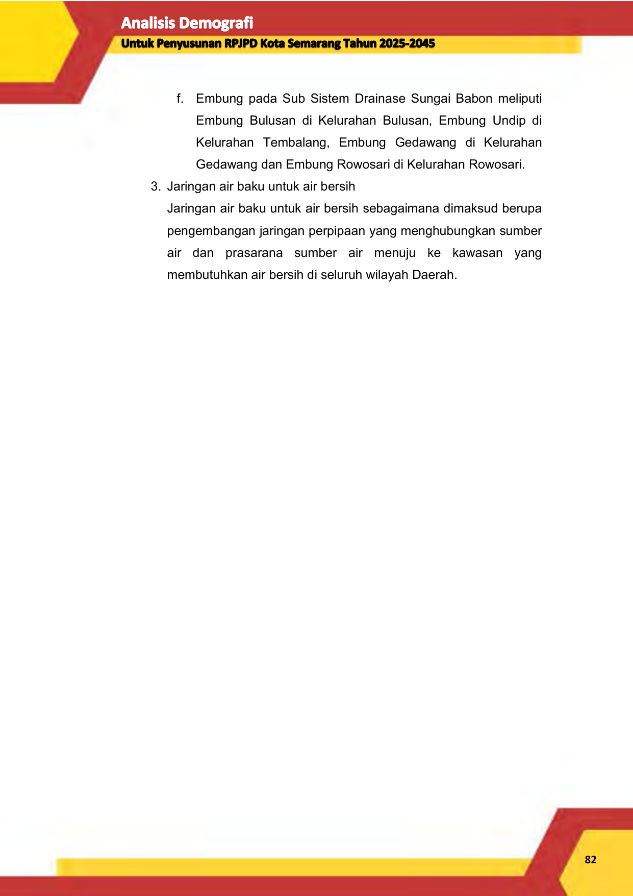

f. Embung pada Sub Sistem Drainase Sungai Babon meliputi

Embung Bulusan di Kelurahan Bulusan, Embung Undip di

Kelurahan Tembalang, Embung Gedawang di Kelurahan

Gedawang dan Embung Rowosari di Kelurahan Rowosari.

3. Jaringan air baku untuk air bersih

Jaringan air baku untuk air bersih sebagaimana dimaksud berupa

pengembangan jaringan perpipaan yang menghubungkan sumber

air dan prasarana sumber air menuju ke kawasan yang

membutuhkan air bersih di seluruh wilayah Daerah.

**82**

--- end of page=90 ---

**83**

--- end of page=91 ---

**4. Rencana Sistem Jaringan Persampahan**

Sistem jaringan persampahan sebagaimana dimaksud meliputi:

1. Tempat Pemprosesan Akhir (TPA) sampah

Tempat Pemrosesan Akhir (TPA) sampah sebagaimana dimaksud

meliputi: TPA Jatibarang di Kecamatan Mijen dan TPA Regional

2. Tempat Penampungan Sampah Sementara (TPS)

Tempat Penampungan Sementara (TPS) sebagaimana dimaksud

meliputi pengembangan dan penyediaan TPS di kawasan

permukiman dan kawasan pusat pelayanan.

**84**

--- end of page=92 ---

**85**

--- end of page=93 ---

**5. Rencana Sistem Penyediaan Air Minum**

Sistem penyediaan air minum sebagaimana dimaksud meliputi:

1. Jaringan perpipaan

Jaringan perpipaan sebagaimana dimaksud meliputi:

a. Unit air baku

Unit air baku permukaan berada di Kecamatan Tembalang,

Kecamatan Gajahmungkur, Kecamatan Gunungpati,

Kecamatan Mijen, dan Kecamatan lainnya. Unit air baku dari

dalam tanah berada di Kecamatan Mijen, kecamatan

Pedurungan, dan Kecamatan lainnya.

b. Unit produksi

Unit produksi Unit air baku sebagaimana dimaksud berada di

Kecamatan Tembalang, Kecamatan Gajahmungkur,

Kecamatan Gunungpati, Kecamatan Mijen, Kecamatan Mijen,

kecamatan Pedurungan, dan Kecamatan lainnya.

c. Unit distribusi

Unit distribusi sebagaimana dimaksud dilakukan melalui:

1) jaringan primer, meliputi:

a) peningkatan sistem jaringan primer yang melalui Jalan

Banjardowo-Pertigaan Jalan Brigjend. Sudiarto

Sendangmulyo;

b) peningkatan sistem jaringan primer yang melalui Jalan

di Kelurahan Karangroto;

c) peningkatan sistem jaringan primer yang melalui Jalan

Tentara Pelajar – Jalan Raya Kedungmundu;

d) peningkatan sistem jaringan primer yang melalui Jalan

S. Parman – Jalan Sultan Agung – Jalan Teuku Umar –

Jalan Setiabudi – Jalan Perintis Kemerdekaan;

e) peningkatan sistem jaringan primer yang melalui Jalan

Diponegoro;

f) peningkatan sistem jaringan primer yang melalui Jalan

Raya Ungaran-Gunungpati; dan

**86**

--- end of page=94 ---

g) peningkatan sistem jaringan primer yang melalui Jalan

Kedungpane -Boja.

2) sistem jaringan sekunder, meliputi:

a) peningkatan sistem jaringan sekunder yang melalui

Jalan Raya Semarang Kendal – Jalan Siliwangi – Jalan

Jend. Sudirman – Jalan Mgr. Sugiyopranoto – Jalan

Pandanaran – Simpang Lima – Jalan A. Yani – Jalan

Brigjend. Katamso – Jalan Majapahit – Jalan Brigjend.

Sudiarto;

b) peningkatan sistem jaringan sekunder yang melalui

Jalan Raya Banjardowo – Jalan Citarum – Pedurungan;

c) peningkatan sistem jaringan sekunder yang melalui

Jalan Raya Tlogosari – Supriyadi;

d) peningkatan sistem jaringan sekunder yang melalui

Jalan di kawasan lingkungan industri kecil (LIK)

Terboyo;

e) peningkatan sistem jaringan sekunder yang melalui

Jalan Raya Kaligawe – Jalan R. Patah – Jalan

Widoharjo – Jalan Dr. Cipto – Jalan Kompol Maksum –

Jalan Mataram – Jalan Dr. Wahidin;

f) peningkatan sistem jaringan sekunder yang melalui

Jalan Sriwijaya – Jalan Veteran – Jalan Kaligarang –

Jalan Kelud Raya;

g) peningkatan sistem jaringan sekunder yang melalui

Jalan Ronggowarsito – Jalan Cendrawasih – Jalan MT.

Haryono;

h) peningkatan sistem jaringan sekunder yang melalui

Jalan Sompok Lama – Jalan Sompok Baru – Jalan

Tentara Pelajar – Jalan Raya Kedungmundu;

i) peningkatan sistem jaringan sekunder yang melalui

Jalan Imam Bonjol – Jalan Hasanudin;

**87**

--- end of page=95 ---

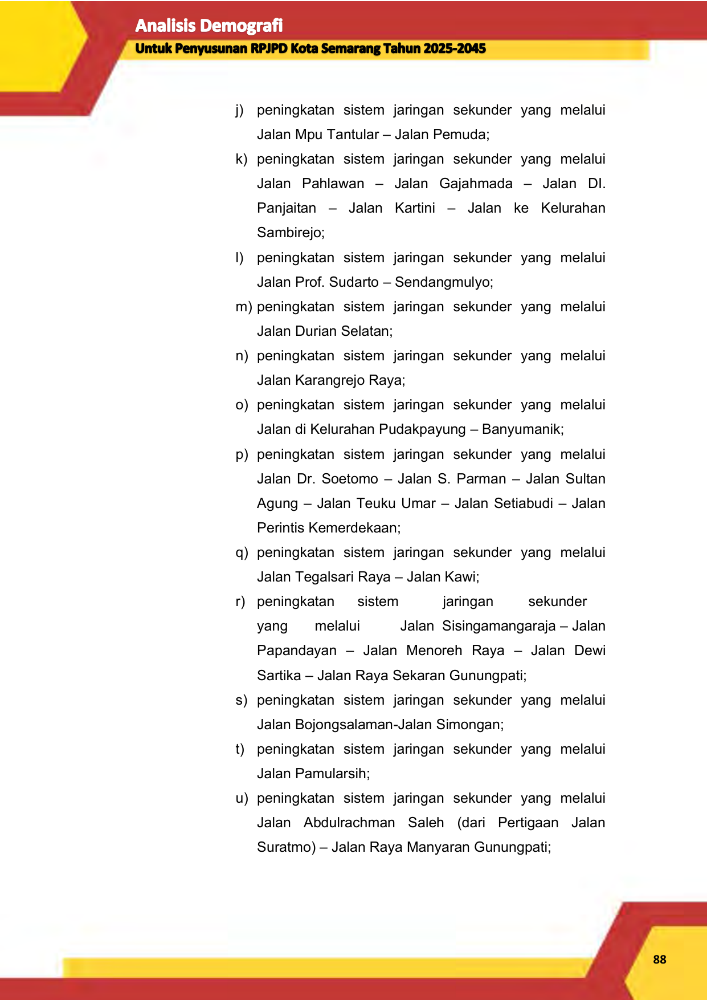

j) peningkatan sistem jaringan sekunder yang melalui

Jalan Mpu Tantular – Jalan Pemuda;

k) peningkatan sistem jaringan sekunder yang melalui

Jalan Pahlawan – Jalan Gajahmada – Jalan DI.

Panjaitan – Jalan Kartini – Jalan ke Kelurahan

Sambirejo;

l) peningkatan sistem jaringan sekunder yang melalui

Jalan Prof. Sudarto – Sendangmulyo;

m) peningkatan sistem jaringan sekunder yang melalui

Jalan Durian Selatan;

n) peningkatan sistem jaringan sekunder yang melalui

Jalan Karangrejo Raya;

o) peningkatan sistem jaringan sekunder yang melalui

Jalan di Kelurahan Pudakpayung – Banyumanik;

p) peningkatan sistem jaringan sekunder yang melalui

Jalan Dr. Soetomo – Jalan S. Parman – Jalan Sultan

Agung – Jalan Teuku Umar – Jalan Setiabudi – Jalan

Perintis Kemerdekaan;

q) peningkatan sistem jaringan sekunder yang melalui

Jalan Tegalsari Raya – Jalan Kawi;

r) peningkatan sistem jaringan sekunder

yang melalui Jalan Sisingamangaraja – Jalan

Papandayan – Jalan Menoreh Raya – Jalan Dewi

Sartika – Jalan Raya Sekaran Gunungpati;

s) peningkatan sistem jaringan sekunder yang melalui

Jalan Bojongsalaman-Jalan Simongan;

t) peningkatan sistem jaringan sekunder yang melalui

Jalan Pamularsih;

u) peningkatan sistem jaringan sekunder yang melalui

Jalan Abdulrachman Saleh (dari Pertigaan Jalan

Suratmo) – Jalan Raya Manyaran Gunungpati;

**88**

--- end of page=96 ---

v) peningkatan sistem jaringan sekunder yang melalui

Jalan Hanoman Raya;

w) peningkatan sistem jaringan sekunder yang melalui

Jalan Gatot Subroto – Jalan Manyaran – Mijen;

x) peningkatan sistem jaringan sekunder yang melalui

Jalan Raya Semarang - Boja – Jalan di Kelurahan

Cangkiran;

y) peningkatan sistem jaringan sekunder yang melalui

Jalan Kedungpane – Jalan Koptu Suyono; dan aa)

peningkatan sistem jaringan sekunder yang melalui

Jalan Kokrosono – Jalan Madukoro – Jalan Indraprasta

d. Unit pelayanan

Unit pelayanan sebagaimana dimaksud terdiri atas:

1) Semarang Bagian Barat;

2) Semarang Bagian Utara;

3) Semarang Bagian Timur;

4) Semarang Bagian Selatan; dan

5) Semarang Bagian Tengah.

2. Bukan Jaringan perpipaan

Bukan jaringan perpipaan sebagaimana dimaksud meliputi:

a. Sumur dangkal

Sumur dangkal berada di Kecamatan Gunungpati, Kecamatan

Ngaliyan, Kecamatan Gajahmungkur, Kecamatan Candisari,

Kecamatan Tembalang, dan Kecamatan Banyumanik.

b. Sumur pompa

Sumur pompa berada di Kecamatan Gajahmungkur,

Kecamatan Candisari, Kecamatan Tembalang, Kecamatan

Banyumanik, Kecamatan, Mijen, Kecamatan Gunungpati,

Kecamatan Ngaliyan.

c. Fasilitas penampungan air hujan

Fasilitas penampungan air hujan sebagaimana dimaksud

berada di seluruh wilayah daerah

**89**

--- end of page=97 ---

**90**

--- end of page=98 ---

**4.5.2 Rencana Pola Ruang**

Rencana Pola Ruang yang terdapat dalam Peraturan Daerah Kota

Semarang Nomor 5 Tahun 2021 Tentang Perubahan Atas Peraturan Daerah

Nomor 14 Tahun 2011 Tentang Rencana Tata Ruang Wilayah Kota Semarang

Tahun 2011-2031 terdiri dari Kawasan Peruntukan Lindung, dan Kawasan

Peruntukan Budidaya: Kawasan Budidaya Permukiman. Tinjauan rencana pola

ruang yang termuat dalam RTRW difokuskan pada rencana Kawasan

Peruntukan Budidaya: Kawasan Budidaya Permukiman untuk menjadi pedoman

penentuan persebaran penduduk dan kebutuhan rumah tinggal ke depannya.

Kawasan permukiman meliputi kawasan perumahan, perdagangan dan jasa,

perkantoran, pendidikan, olahraga, transportasi, kesehatan, dan peribadatan.

**A.** **Kawasan Perumahan**

Kawasan perumahan dengan luas kurang lebih 15.447 (Lima belas ribu

empat ratus empat puluh tujuh) hektar meliputi:

1. Kawasan perumahan di daratan, dengan luas kurang lebih 15.360 (lima belas

ribu tiga ratus enam puluh) hektar yang tersebar di seluruh kecamatan; dan

2. Kawasan perumahan yang berdasarkan peraturan perundang-undangan

masih ditetapkan sebagai kawasan perairan selanjutnya disebut kawasan

reklamasi perairan/kawasan perumahan dengan luas kurang lebih 87

(Delapan puluh tujuh) hektar berada di pantai utara Kecamatan Tugu.

Pengaturan kawasan perumahan meliputi:

1. Perumahan dengan kepadatan tinggi meliputi perumahan pusat kota yaitu di

BWK I, BWK II, BWK III, BWK V. Rencana pengembangan kawasan

perumahan kepadatan tinggi meliputi:

a. peningkatan kualitas prasarana lingkungan perumahan danpenyediaan

ruang terbuka hijau dan ruang terbuka non hijau; dan

b. peningkatan kualitas hunian di kawasan perumahan melalui

pembangunan perumahan secara vertikal.

2. Perumahan dengan kepadatan sedang meliputi perumahan di BWK IV, BWK

VI, BWK VII, dan BWK X khusus Kecamatan Tugu. Rencana pengembangan

kawasan perumahan kepadatan sedang meliputi:

**91**

--- end of page=99 ---

a. peningkatan kualitas prasarana lingkungan perumahan danpenyediaan

ruang terbuka hijau dan ruang terbuka non hijau; dan

b. penyediaan prasarana dan sarana umum dengan proporsi 40%(empat

puluh persen) dari keseluruhan luas lahan perumahan.

3. Perumahan dengan kepadatan rendah meliputi perumahan di BWK VIII,

BWK IX, dan BWK X khusus Kecamatan Ngaliyan. Rencana pengembangan

kawasan perumahan kepadatan rendah meliputi:

a. peningkatan kualitas prasarana lingkungan perumahan dan

b. penyediaan ruang terbuka hijau dan ruang terbuka non hijau; dan

c. penyediaan prasarana dan sarana umum dengan proporsi 40% (empat

puluh persen) dari keseluruhan luas lahan perumahan.

**B.** **Kawasan Perdagangan dan Jasa**

Kawasan perdagangan dan jasa dengan luas kurang lebih 4.473 (Empat

ribu empat ratus tujuh puluh tiga) hektar meliputi:

1. Kawasan perdagangan dan jasa di daratan, dengan luas kurang lebih 4.428

(empat ribu empat ratus dua puluh delapan) hektar yang tersebar diseluruh

kecamatan; dan

2. Kawasan perdagangan dan jasa yang berdasarkan ketentuan peraturan

perundangundangan masih ditetapkan sebagai kawasan perairan

selanjutnya disebut kawasan reklamasi perairan/kawasan perdagangan dan

jasa dengan luas kurang lebih 45 (empat puluh lima) hektar berada di pantai

utara Kecamatan Tugu.

Jenis kegiatan perdagangan dan jasa yang dikembangkan meliputi:

1. Perdagangan dan jasa skala pelayanan regional/ nasional/

internasional

Pengembangan perdagangan dan jasa skala regional/ nasional/

internasional meliputi: BWK I, BWK II, BWK III, BWK V, BWK VII,

BWK X, dan BWK lainnya yang berada dalam jangkauan jalan

kolektor dan arteri primer.

**92**

--- end of page=100 ---

2. Perdagangan dan jasa skala pelayanan kota

Pengembangan perdagangan dan jasa skala Kota meliputi: BWK I,

BWK II, BWK III, BWK V, BWK VI, BWK VII, BWK IX, dan BWK X.

3. Perdagangan dan jasa skala pelayanan BWK

Pengembangan perdagangan dan jasa skala pelayanan BWK

berada di seluruh BWK.

4. Perdagangan dan jasa skala pelayanan lingkungan

Pengembangan perdagangan dan jasa skala lingkungan berada di

seluruh BWK.

5. Perdagangan dan jasa lainnya, meliputi:

a. pengembangan jasa pameran (exhibition center) dan jasa

pertemuan (convention center) di Kecamatan Pedurungan,

Kecamatan Semarang Selatan, Kecamatan Gajahmungkur

dan Kecamatan Semarang Utara; dan

b. meningkatkan dan mengarahkan pengembangan jasa

penginapan di pusat kota dan pusat BWK.

**C.** **Kawasan Perkantoran**

Kawasan perkantoran dengan luas kurang lebih 483 (Empat ratus

delapan puluh tiga) hektar meliputi:

1. Kawasan perkantoran di daratan, dengan luas kurang lebih 482 (empat ratus

delapan puluh dua) hektar yang tersebar diseluruh kecamatan; dan

2. Kawasan perkantoran yang berdasarkan ketentuan peraturan perundang

undangan masih ditetapkan sebagai Kawasan perairan selanjutnya disebut

kawasan reklamasi perairan/kawasan perkantoran dengan luas kurang lebih

1 (satu) hektar berada di pantai utara Kecamatan Tugu.

Jenis kegiatan perkantoran meliputi:

1. Perkantoran pemerintah

Pengembangan perkantoran pemerintah meliputi:

a. peningkatan kawasan perkantoran Pemerintah Daerah Provinsi Jawa

Tengah di Jalan Pahlawan, Jalan Madukoro, dan lokasi lainnya;

b. peningkatan kawasan Kantor Walikota dan DPRD di Jalan Pemuda;

**93**

--- end of page=101 ---

c. pengembangan kawasan kantor pelayanan publik Pemerintah Daerah di

Kecamatan Mijen;

d. peningkatan kawasan perkantoran pemerintah skala kelurahandan

kecamatan di seluruh Daerah; dan

e. peningkatan kawasan balai kota atau Kantor Walikota dan DPRDserta

Kantor Gubernur Jawa Tengah dan DPRD Provinsi JawaTengah dengan

peyediaan terbuka publik yang dapat digunakan untuk interaksi sosial.

2. Perkantoran swasta

Pengembangan perkantoran swasta meliputi:

a. mengarahkan dan mengembangkan kegiatan perkantoran swasta besar

berlokasi di kawasan perdagangan dan jasa; dan

b. pemenuhan sarana dan prasarana kegiatan perkantoran.

**D.** **Kawasan Pendidikan**

Kawasan pendidikan dengan luas kurang lebih 779 (tujuh ratus tujuh

puluh sembilan) hektar yang tersebar diseluruh kecamatan. Rencana

pengembangan kawasan pendidikan meliputi:

1. Peningkatan kualitas kawasan pendidikan tinggi di BWK I, BWK II, BWK IV,

BWK V, BWK VI, BWK VII, BWK VIII, dan BWK X melalui pengaturan

kawasan dan penataan lingkungan; dan

2. Pengembangan fasilitas pendidikan dasar sampai menengah diarahkan

disetiap BWK sebagai bagian dari fasilitas lingkungan.

**E.** **Kawasan Olahraga**

Kawasan olahraga dengan luas kurang lebih 381 (tiga ratus delapan

puluhsatu) hektar yang tersebar di seluruh kecamatan. Rencana peningkatan

kawasan olahraga meliputi:

1. peningkatan Gelanggang olahraga Jatidiri di Kecamatan Gajahmungkur;

2. peningkatan Stadion Citarum di Kecamatan Semarang Timur;

3. peningkatan Stadion Tri Lomba Juang di Kecamatan Semarang Tengah;

4. peningkatan Stadion Diponegoro di Kecamatan Semarang Tengah;

**94**

--- end of page=102 ---

5. peningkatan Gelanggang olahraga Manunggal Jati di Kecamatan

Pedurungan;

6. pengembangan Pusat olahraga di Kecamatan Pedurungan; dan

7. pengembangan Pusat olahraga di Kecamatan Mijen.

Kawasan olahraga beskala BWK dan lingkungan direncanakan terpadu

dengan rencana ruang terbuka hijau dan ruang terbuka non hijau serta

dikembangkan di setiap BWK.

**F.** **Kawasan Transportasi**

Kawasan transportasi dengan luas kurang lebih 1.222 (Seribu dua ratus

dua puluh dua) hektar meliputi:

1. Kawasan transportasi di daratan, dengan luas kurang lebih 941 Sembilan

ratus empat puluh satu) hektar. Kawasan transportasi di daratan terdapat di:

Kecamatan Mijen, Gunungpati, Genuk, Tugu, Semarang Utara, Semarang

Timur, Semarang Barat, dan Pedurungan.

2. Kawasan transportasi yang berdasarkan ketentuan peraturan perundang

undangan masih ditetapkan sebagai kawasan perairan selanjutnya disebut

kawasan reklamasi perairan/kawasan transportasi dengan luas kurang lebih

281 (dua ratus delapan puluh satu) hektar berada di pantai utara Kecamatan

Semarang Utara.

Pengembangan kegiatan transportasi meliputi: teminal angkutan umum,

stasiun kereta api antar kota dan kereta api perkotaan, Bandar Udara

Internasional Ahmad Yani, Pelabuhan Tanjung Emas, dan pengembangan

dermaga angkutan sungai dan penyeberangan. Pengelolaan dan pembangunan

kegiatan di kawasan transportasi memperhatikan keterpaduan dengan

lingkungan sekitarnya.

**G.** **Kawasan Kesehatan**

Kawasan kesehatan dengan luas kurang lebih 90 (sembilan puluh)

hektar berada di seluruh wilayah Daerah.

**H.** **Kawasan Peribadatan**

Kawasan peribadatan dengan luas kurang lebih 101 (seratus satu)

hektar berada di seluruh wilayah Daerah.

**95**

--- end of page=103 ---

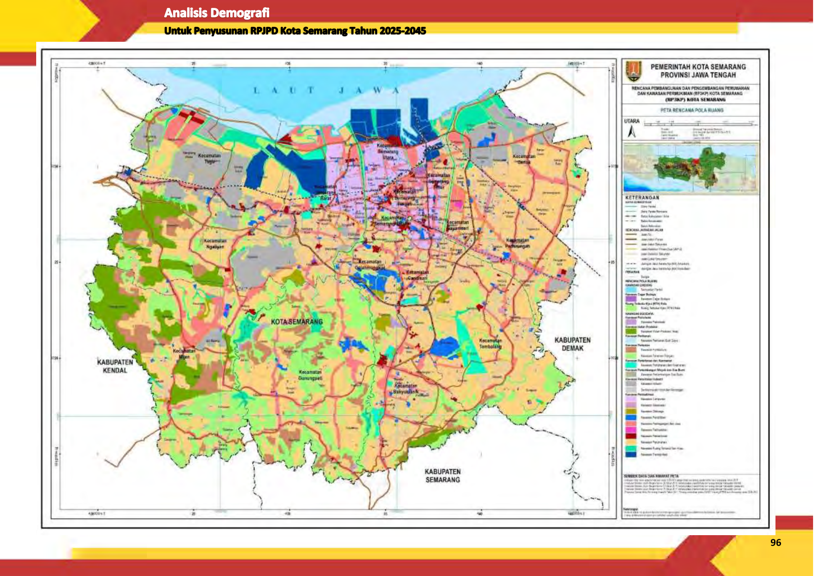

**96**

--- end of page=104 ---

**4.5.3 Program Terkait Pengembangan Perumahan dan Kawasan**

**Permukiman Dalam RTRW Kota Semarang**

Adapun rangkaian program terkait perumahan dan kawasan

permukiman antara lain:

**Tabel 4. 5 Program Terkait Pengembangan Perumahan dan Kawasan**

**Permukiman Dalam RTRW Kota**

|No|Program Utama|Lokasi|Instansi Pelaksana|
|---|---|---|---|
|~~1 ~~ ~~P~~ k m p s S  |~~eremajaan perumahan di~~ awasan - kawasan kumuh, elalui konsolidasi lahan dan engembangan perumahan ecara vertikal di seluruh Kota emarang |~~Seluruh Wilayah Kota~~ |• KemenPU, • Dinas PU |
|~~2 ~~ ~~P~~ k p d p  |~~engaturan~~ ebijakan enyediaan sarana an prasarana ermukiman |~~Seluruh Wilayah Kota~~ |•~~ KemenPU,~~ • Dinas PU |
|~~3 ~~ ~~P~~  |~~embangunan Rusun Pekerja~~ | |~~KemenPU~~ |
|~~4 ~~ ~~P~~ J  |~~eningkatan dan Pembangunan~~ alan Kota |~~Seluruh Wilayah Kota~~ |~~Dinas PU~~ |
|~~5 ~~ ~~P~~ p s  |~~eningkatan infrastruktur~~ embangkitan tenaga listrik dan arana pendukungnya |~~Seluruh Wilayah Kota~~ |• Kemen ESDM • PT. PLN |
|~~6 ~~ ~~P~~ ja  |~~eningkatan dan pengembangan~~ ringan telekomunikasi |~~Seluruh Wilayah Kota~~ |•~~ Dinas Kominfo~~ • Swasta |
|~~7 ~~ ~~P~~ pr  |~~eningkatan sediaan dan~~ asarana sumber air |~~Seluruh Wilayah Kota~~ |~~Dinas PU~~ |
|~~8 ~~ ~~P~~ p p li u |~~eningkatan infrastruktur~~ erkotaan: sistem persampahan, enyediaan air minum, air mbah, drainase, angkutan mum |~~Seluruh Wilayah Kota~~ |•~~ Dinas Kebersihan &~~ Pertamanan • Dinas Lingkungan Hidup • Dinas PU • PDAM Tirta Moedal • Kemen LHK • Swasta • Kementerian Perhubungan • Dinas Perhubungan |

_Sumber: Peraturan Daerah Kota Semarang Nomor 5 Tahun 2021 Tentang Perubahan Atas_

_Peraturan Daerah Nomor 14 Tahun 2011 Tentang Rencana Tata Ruang Wilayah Kota_
_Semarang Tahun 2011-2031_

**97**

--- end of page=105 ---

# **BAB V** **HASIL PROYEKSI DAN IMPLIKASI KEBIJAKAN**

**5.1** **Hasil Proyeksi Penduduk**

Perhitungan proyeksi jumlah penduduk Kota Semarang tahun 2025-2045

menggunakan 2 metode pedekatan. Proyeksi jumlah total penduduk di hitung

berdasarkan metode pendekatan yang digunakan BPS dengan menggunakan

asumsi _Total Fertility Rate_ (TFR) dan _Infant Mortality Rate_ (IMR). Selain itu

perhitungan jumlah penduduk juga menggunakan pendekatan statistic

matematik dengan meggunakan metode arimatika, eksponensial, dan geometrik.

Dari ketiga metode yang digunakan untuk memproyeksikan jumlah penduduk

digunakan metode dengan nilai atau tingkat eror paling kecil yakni metode

geometrik. Tahap selanjutnya dengan mempertimbangkan kebijakan

pengelolaan ruang yang ada di Kota Semarang, maka dilakukan smoothing data

untuk mendapatkan hasil persebaran penduduk yang rasional di setiap

kecamatannya. Hasil proyeksi jumlah penduduk di Kota Semarang secara rinci

dijabarkan sebagai berikut.

**5.1.1** **Jumlah Penduduk Kota Semarang**

Parameter proyeksi penduduk di Kota Semarang menggunakan BPS

Kota Semarang dengan data dasar tahun 2020 yang bersumber dari log form

hasil sensus penduduk 2020. _Total Fertility Rate_ (TFR) merupakan jumlah rata

rata anak yang dilahirkan setiap wanita. Diproyeksikan kondisi _Total Fertility Rate_

_(TFR)_ mengalami mengalami penurun dari tahun 2025-2045, penurunan TFR

yang ada dimasyakarakat dimungkinkan terjadi salah satunya karena adanya

pola faktor usia pernikahan di masyarakat semakin tinggi mulai berkisar antara

25-30 tahun, sehingga menyebabkan kecenderungan angka kelahiran juga

semakin kecil. Selain itu menurut _New household economic_ s adanya

kecenderungan meningkatnya pendapatan dan Pendidikan penduduk

perempuan menyebbkan semain banyaknya waktu yang digunakan untuk

mengurus anak (khususnya waktu ibu), sehingga beripmact pada berkurangnya

**98**

--- end of page=106 ---

minat melahirkan anak diusia muda atau dengan rentan waktu pendek

(Ritonga,2003:7). Dengan mempertimbangan tren pola kehidupan masyarakat di

Kota Semarang maka TFR di Kota Semarang dari tahun 2025 hingga 2045 terus

mengalami penurunan dari nilai 1,76 tahun 2025 menjadi 1,72 di tahun 2045.

Paramter yang kedua yang digunakan untuk memproyeksi jumlah

penduduk adalah _Infant Mortality Rate_ (IMR). Angka kematian bayi/ _Infant_

_Mortality_ _Rate_ adalah kematian yang terjadi sebelum bayi berumur satu tahun

per 1.000 kelahiran hidup pada satu tahun tertentu. Angka ini digunakan sebagai

indikator kemajuan tingkat pelayanan kesehatan ibu dan anak. Kondisi _Infant_

_Mortality Rate_ (IMR) di Kota Semarang diproyeksi terus mengalami penurunan

dengan mempertimbangkan semakin baiknya pelayanan terhadap kesehatan ibu

dan anak sehingga tinggkat kematian bayi dapat terus ditekan dan diminimalisir.

Selain itu semakin meningkatnya tingkat Pendidikan ibu juga memiliki peran yang

penting dalam penurunan _Infant Mortality Rate_ (IMR) di Kota Semarang semala

20 tahun yang akan datang. Kondis _Infant Mortality Rate_ (IMR) di tahun 2025

diproyeksikan berada diangka 9,32 kemudian berangsur menurun hingga tahun

2045 _Infant Mortality Rate_ (IMR) di Kota Semarang sebar 6,06. Secara rinci

parameter hasil proyeksi penduduk di Kota Semarang tahun 2025 hingga 2045

dijabarkan dalam tabel berikut.

**Tabel 5. 1. Parameter Hasil Proyeksi Penduduk Kota Semarang**

**Tahun 2025-2045**

|Parameter|2020|2025|2030|2035|2040|2045|
|---|---|---|---|---|---|---|
|**FERTILITAS**|||||||
|_Total Fertility Rate (TFR)_|1,79|1,76|1,75|1,74|1,73|1,72|
|**MORTALITAS**|||||||
|_Infant Mortality Rate_ (IMR) |10,59 |9,32 |8,18 |6,86 |6,40 |6,06|

Keterangan: Data tahun 2020 berdasarkan hasil Long Form Sensus Penduduk 2020
Data tahun 2025-2035 berdasarkan hasil proyeksi penduduk

Berdasarkan parameter pertumbuhan penduduk, selanjutnya

diproyeksikan jumlah penduduk di Kota Semarang pada tahun 2025-2045. Hasil

proyeksi menunjukan bahwa dari tahun 2025 hingga 2045 akan terus jadi

peningkatan jumlah penduduk di Kota Semarang. Diproyeksikan di tahun 2025

**99**

--- end of page=107 ---

jumlah penduduk Kota Semarang sebesar 1.722.421 jiwa meningkat 3,49%

menjadi 1.782.575 jiwa di tahun 2030, kemudian meningkat kembali 2,60%

menjadi 1.828.904 jiwa di tahun 2035, meningkat kembali 1,69% menjadi

1.859.868 jiwa di tahun 2040, dan meningkat 0,80% di tahun 2045 menjadi

1.874.716 jiwa. Secara rinci perumbuhan jumlah penduduk di Kota Semarang

digambarkan dalam gambar berikut .

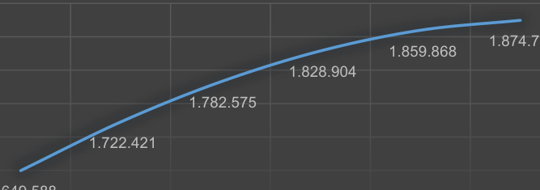

**Gambar 5. 1. Proyeksi Jumlah Penduduk Kota Semarang Tahun 2025-2045**

**5.1.2** **Jumlah Penduduk berdasarkan Kelompok Umur**

Berdasarkan kelompok umur, jumlah penduduk usia 0-44 tahun selama

2025-2045 setiap tahunnya diproyeksikan akan terus mengalami penurunan,

dikarenakan semakin kecilnya angka kelahiran yang disebabkan oleh adanya

perubahan pola hidup penduduk khususnya perempuan, dari segi Pendidikan

maupun pendapatan/pekerjaan. Selanjutnya jumlah penduduk usia 45-49 tahun

diprediksi akan mulai mengalami penurunan di tahun 2040 hingga 2045,

sedangkan jumlah penduduk usia 55-95 tahun akan mulai mengalami penurunan

di tahun 2045.

Berbanding terbalik dengan kondisi jumlah penduduk usia ≤54 tahun,

jumlah penduduk usia ≥64 tahun akan terus mengalami peningkatan selama

kurun waktu 2025-2045. Kondisi tersebut menggambarkan bahwa pertumbuhan

**100**

--- end of page=108 ---

jumlah penduduk lansia (usia tua) kan terus mengalami peningkatan setiap

tahunnya. Secara rinci kondisi jumlah penduduk berdasarkan usia di Kota

Semarang tahun 2025 hingga 2045 dijabarkan sebagai berikut.

**Tabel 5. 2. Proyeksi Jumlah Penduduk Kota Semarang Berdasarkan**

**Kelompok Umur Tahun 2025-2045**

|Kelompok Umur|2020 (Data Dasar)|2025|2030|2035|2040|2045|
|---|---|---|---|---|---|---|
|~~0-4~~ |~~116.860~~ |~~113.924~~ |~~111.097~~ |~~108.847~~ |~~106.041~~ |~~102.648~~ |
|~~5-9~~ |~~122.751~~ |~~117.215~~ |~~114.261~~ |~~111.436~~ |~~109.192~~ |~~106.380~~ |
|~~10-14~~ |~~126.699~~ |~~123.226~~ |~~117.671~~ |~~114.709~~ |~~111.877~~ |~~109.625~~ |
|~~15-19~~ |~~130.562~~ |~~127.173~~ |~~123.702~~ |~~118.130~~ |~~115.164~~ |~~112.324~~ |
|~~20-24~~ |~~127.577~~ |~~130.482~~ |~~127.098~~ |~~123.645~~ |~~118.080~~ |~~115.107~~ |
|~~25-29~~ |~~129.763~~ |~~127.065~~ |~~129.955~~ |~~126.591~~ |~~123.166~~ |~~117.624~~ |
|~~30-34~~ |~~132.437~~ |~~129.679~~ |~~126.964~~ |~~129.858~~ |~~126.496~~ |~~123.083~~ |
|~~35-39~~ |~~135.027~~ |~~132.159~~ |~~129.413~~ |~~126.716~~ |~~129.613~~ |~~126.251~~ |
|~~40-44~~ |~~133.889~~ |~~134.288~~ |~~131.451~~ |~~128.727~~ |~~126.060~~ |~~128.955~~ |
|~~45-49~~ |~~120.067~~ |~~132.694~~ |~~133.113~~ |~~130.335~~ |~~127.661~~ |~~125.036~~ |
|~~50-54~~ |~~106.624~~ |~~118.067~~ |~~130.563~~ |~~131.046~~ |~~128.379~~ |~~125.788~~ |
|~~55-59~~ |~~90.978~~ |~~103.726~~ |~~114.992~~ |~~127.299~~ |~~127.893~~ |~~125.381~~ |
|~~60-64~~ |~~72.728~~ |~~86.525~~ |~~98.842~~ |~~109.791~~ |~~121.734~~ |~~122.432~~ |
|~~65-69~~ |~~51.905~~ |~~66.683~~ |~~79.667~~ |~~91.324~~ |~~101.744~~ |~~113.038~~ |
|~~70-74~~ |~~26.349~~ |~~44.848~~ |~~57.986~~ |~~69.774~~ |~~80.418~~ |~~89.955~~ |
|~~75+~~ |~~25.372~~ |~~34.667~~ |~~55.800~~ |~~80.676~~ |~~106.350~~ |~~131.089~~ |
|~~**Jumlah**~~ |~~**1.649.588**~~|~~**1.722.421**~~|~~**1.782.575**~~|~~**1.828.904**~~|~~**1.859.868**~~|~~**1.874.716**~~|

Jika dilihat dari komposisi jumlah penduduk berdasarkan kelompok usia

muda (0-14 tahun), usia produktif (15-64 tahun) dan usia tua (≥65 tahun),

diproyeksikan jumlah usia produktif masih mendominasi atau lebih banyak

dibandikan usia non produktif (penduduk usia muda dan tua) di tahun 2025

hingga 2045. Meskipun demikian angka ketergantungan penduduk diproyeksikan

terus mengalami peningkatan dari 2025 angka ketergantungan sebesar 40,97%

(artinya dalam 100 penduduk usia produktif menanggung beban 41 penduduk

usia non produktif) meningkat setiap tahunnya hingga ditahun 2045 angka

ketergantungan Kota Semarang menjadi 53,42% artinya dalam 100 penduduk

usia produktif menanggung beban 53 penduduk usia non produktif). Secara rinci

proyeksi kondisi jumlah penduduk Kota Semarang berdasarkan kelompok umur

dan angka ketergantungan dapat dilihat pada tabel berikut.

**101**

--- end of page=109 ---

**Tabel 5. 3 Proyeksi Jumlah Penduduk Kota Semarang Berdasarkan**

**Pengelompokan Usia dan Angka Ketergantungan Tahun 2025-**
**2045**

|Kelompok Usia|2020 (Data Dasar)|2025|2030|2035|2040|2045|
|---|---|---|---|---|---|---|
|~~0-14 (usia muda)~~ |~~366.310~~ |~~354.365~~ |~~343.029~~ |~~334.992~~ |~~327.110~~ |~~318.653~~ |
|~~15-64 (usia produktif)~~ |~~1.179.652~~ |~~1.221.858~~ |~~1.246.093~~ |~~1.252.138~~ |~~1.244.246~~ |~~1.221.981~~ |
|~~≥65 (usia tua)~~ |~~103.626~~ |~~146.198~~ |~~193.453~~ |~~241.774~~ |~~288.512~~ |~~334.082~~ |
|~~**Jumlah**~~ |~~**1.649.588**~~ |~~**1.722.421**~~ |~~**1.782.575**~~ |~~**1.828.904**~~ |~~**1.859.868**~~ |~~**1.874.716**~~ |
|~~**Angka Ketergantungan**~~  |~~**39,84%**~~|~~**40,97%**~~|~~**43,05%**~~|~~**46,06%**~~|~~**49,48%**~~|~~**53,42%**~~|

Angka ketergantungan penduduk atau yang biasa disebut Rasio

Ketergantungan ( _Dependency Ratio_ ) merupakan dapat menjadi metode

pendekekatan untuk menentukan bonus demografi. Terdapat dua metode

pendekatan yang yakni metode Cheung et al (Makripuddin, 2019) dan metode

Adioetomo (BPS, 2012) yang menggunakan rasio ketergantungan sebagai

perhitungan bonus demografi. Metode Cheung et al., (2003) menggunakan rasio

ketergantungan (dependency ratio) sebagai pendekatan untuk menghitung

bonus demografi dimana penduduk usia tidak produktif yang dimaksud adalah

penduduk muda (0-14 tahun) dan penduduk tua atau lanjut usia (≥65 tahun),

sedangkan penduduk usia produktif adalah penduduk usia 15 sampai 64 tahun.

Dalam metode Cheung et al., (2003) suatu negara atau daerah dinyatakan telah

mengalami bonus demografi, ketika rasio ketergantungan ( _dependency_ _ratio)_

berada **dibawah 50** . Jika berdasar pada metode pendektan bonus demografi

berdasarkan Cheung et al., (2003) maka Kota Semarang telah mengalami bonus

demografi mulai tahun 2025 hingga 2040, sedangkan ditahun diatas tahun 2040

Kota Semarang tidak lagi mengalami bonus demografi melainkan memasuki

kondisi mayoritas penduduk lansia.

Sedangkan metode Adioetomo (2012) juga menggunakan rasio

ketergantungan ( _dependency ratio_ )s ebagai pendekatan untuk menghitung

bonus demografi dimana penduduk usia tidak produktif yang dimaksud

Adioetomo adalah penduduk muda (0-14 tahun) dan penduduk tua atau lanjut

usia (≥65 tahun), sedangkan penduduk usia produktif adalah penduduk usia 15

sampai 64 tahun. Dalam metode Adioetomo (2012) suatu negara atau daerah

dinyatakan telah mengalami bonus demografi, ketika rasio ketergantungan

**102**

--- end of page=110 ---

( _dependency ratio_ ) **mencapai 44** . Berdasarkan metode Adiortomo Kota

Semarang mengalami bonus demografi mulai tahun 2030 hingga 2045.

Berdasarkan kedua metode pendekatan tersebut maka dapat

diasumsikan bahwa Kota Semarang akan mengalami bonus demografi pada

kisaran tahun 2030-2040. Sehingga dalam rentan waktu tersebut perlu

diperkirakan dan dipersiapan kebijakan terkait peningkatan kualitas SDM untuk

menyiapkan tenaga kerja yang produktif dan unggul sehingga dapat menekan

anka tingkat pengangguran. Di tahun 2025 perlu adanya kebijakan berbasis

peningkatan SDM yang berdaya saing untuk mendorong kompetensi masyarakat

sekalius mendorong terbukanya peluang usaha baru. Memasuki Tahun 2030

hingga 2040 perlu penguatan kapasitas SDM dan penguatan sektor usaha baik

dibidang UMKM maupun sektor yang perpotensi lainnya untuk mendorong

serapan tenaga kerja dan tumbuhnya ekonomi masyarakat yang mandiri.

Selanjutnya memasuki tahun 2045 perlu adanya dorongan untuk menumbuhkan

peluang kerja berbasis lansia sebagai upaya memfasilitasi masyarakat usia

lansia yang membutuhkan pekerjaan.

Komposisi penduduk berdasarkan usia dan jenis kelamin dari tahun 2025

hinggga 2045 mengalami perkembangan yang cukup signifikan. Pada tahun

2025 hingga 2030 diproyeksikan piramida penduduk Kota Semarang berbentuk

Piramida stasioner berbentuk granat atau segi empat dengan jumlah penduduk

paling banyak pada udia produktif. Sedangkan memasuki tahun 2035-2045

piramida penduduk di Kota Semarang diproyeksikan berbentuk Piramida

konstruktif memiliki bentuk seperti batu nisan atau guci terbalik atau sarang

tawon dengan jumlah penduduk usia >75 tahun lebih besar dibanding penduduk

usia lainnya. Secara rinci proyeksi bentuk piramida penduduk Kota Semarnag

tahun 2025-2045 digambarkan sebagai berikut.

**103**

--- end of page=111 ---

**Gambar 5. 2. Piramida Penduduk Kota Semarang Tahun 2025-2045**

Proyeksi jumlah pendunduk berdasarkan usia dan jenis kelamin dari

tahun 2025-2045 selanjutnya digambarkan pada tabel berikut.

**104**

--- end of page=112 ---

**Tabel 5. 4 Proyeksi Jumlah Penduduk Kota Semarang Berdasarkan Usia dan Jenis Kelamin Tahun 2025-2045**

|Kelompok Umur|2020 (Data Dasar)|Col3|Col4|2025|Col6|Col7|2030|Col9|Col10|2035|Col12|Col13|2040|Col15|Col16|2045|Col18|Col19|
|---|---|---|---|---|---|---|---|---|---|---|---|---|---|---|---|---|---|---|
|**Kelompok** **Umur** |**L ** |**P ** |**Jumlah** |**L ** |**P ** |**Jumlah** |**L ** |**P ** |**Jumlah** |**L ** |**P ** |**Jumlah** |**L ** |**P ** |**Jumlah** |**L ** |**P ** |**Jumlah** |
|~~0-4~~ |~~59.841~~ |~~57.019~~ |~~**116.860**~~ |~~58.107~~ |~~55.817~~ |~~**113.924**~~ |~~56.673~~ |~~54.424~~ |~~**111.097**~~ |~~55.543~~ |~~53.304~~ |~~**108.847**~~ |~~54.128~~ |~~51.913~~ |~~**106.041**~~ |~~52.411~~ |~~50.237~~ |~~**102.648**~~ |
|~~5-9~~ |~~62.794~~ |~~59.957~~ |~~**122.751**~~ |~~60.107~~ |~~57.108~~ |~~**117.215**~~ |~~58.362~~ |~~55.899~~ |~~**114.261**~~ |~~56.931~~ |~~54.505~~ |~~**111.436**~~ |~~55.805~~ |~~53.387~~ |~~**109.192**~~ |~~54.387~~ |~~51.993~~ |~~**106.380**~~ |
|~~10-14~~ |~~65.212~~ |~~61.487~~ |~~**126.699**~~ |~~63.281~~ |~~59.945~~ |~~**123.226**~~ |~~60.575~~ |~~57.096~~ |~~**117.671**~~ |~~58.820~~ |~~55.889~~ |~~**114.709**~~ |~~57.384~~ |~~54.493~~ |~~**111.877**~~ |~~56.250~~ |~~53.375~~ |~~**109.625**~~ |
|~~15-19~~ |~~67.155~~ |~~63.407~~ |~~**130.562**~~ |~~65.455~~ |~~61.718~~ |~~**127.173**~~ |~~63.527~~ |~~60.175~~ |~~**123.702**~~ |~~60.813~~ |~~57.317~~ |~~**118.130**~~ |~~59.059~~ |~~56.105~~ |~~**115.164**~~ |~~57.621~~ |~~54.703~~ |~~**112.324**~~ |
|~~20-24~~ |~~65.037~~ |~~62.540~~ |~~**127.577**~~ |~~66.912~~ |~~63.570~~ |~~**130.482**~~ |~~65.218~~ |~~61.880~~ |~~**127.098**~~ |~~63.309~~ |~~60.336~~ |~~**123.645**~~ |~~60.608~~ |~~57.472~~ |~~**118.080**~~ |~~58.857~~ |~~56.250~~ |~~**115.107**~~ |
|~~25-29~~ |~~64.963~~ |~~64.800~~ |~~**129.763**~~ |~~64.368~~ |~~62.697~~ |~~**127.065**~~ |~~66.227~~ |~~63.728~~ |~~**129.955**~~ |~~64.548~~ |~~62.043~~ |~~**126.591**~~ |~~62.665~~ |~~60.501~~ |~~**123.166**~~ |~~59.989~~ |~~57.635~~ |~~**117.624**~~ |
|~~30-34~~ |~~65.688~~ |~~66.749~~ |~~**132.437**~~ |~~64.606~~ |~~65.073~~ |~~**129.679**~~ |~~64.003~~ |~~62.961~~ |~~**126.964**~~ |~~65.856~~ |~~64.002~~ |~~**129.858**~~ |~~64.188~~ |~~62.308~~ |~~**126.496**~~ |~~62.320~~ |~~60.763~~ |~~**123.083**~~ |
|~~35-39~~ |~~66.768~~ |~~68.259~~ |~~**135.027**~~ |~~65.603~~ |~~66.556~~ |~~**132.159**~~ |~~64.513~~ |~~64.900~~ |~~**129.413**~~ |~~63.914~~ |~~62.802~~ |~~**126.716**~~ |~~65.771~~ |~~63.842~~ |~~**129.613**~~ |~~64.103~~ |~~62.148~~ |~~**126.251**~~ |
|~~40-44~~ |~~65.756~~ |~~68.133~~ |~~**133.889**~~ |~~66.326~~ |~~67.962~~ |~~**134.288**~~ |~~65.168~~ |~~66.283~~ |~~**131.451**~~ |~~64.083~~ |~~64.644~~ |~~**128.727**~~ |~~63.494~~ |~~62.566~~ |~~**126.060**~~ |~~65.351~~ |~~63.604~~ |~~**128.955**~~ |
|~~45-49~~ |~~58.406~~ |~~61.661~~ |~~**120.067**~~ |~~64.953~~ |~~67.741~~ |~~**132.694**~~ |~~65.518~~ |~~67.595~~ |~~**133.113**~~ |~~64.386~~ |~~65.949~~ |~~**130.335**~~ |~~63.326~~ |~~64.335~~ |~~**127.661**~~ |~~62.757~~ |~~62.279~~ |~~**125.036**~~ |
|~~50-54~~ |~~51.172~~ |~~55.452~~ |~~**106.624**~~ |~~57.135~~ |~~60.932~~ |~~**118.067**~~ |~~63.572~~ |~~66.991~~ |~~**130.563**~~ |~~64.159~~ |~~66.887~~ |~~**131.046**~~ |~~63.086~~ |~~65.293~~ |~~**128.379**~~ |~~62.071~~ |~~63.717~~ |~~**125.788**~~ |
|~~55-59~~ |~~43.196~~ |~~47.782~~ |~~**90.978**~~ |~~49.318~~ |~~54.408~~ |~~**103.726**~~ |~~55.129~~ |~~59.863~~ |~~**114.992**~~ |~~61.415~~ |~~65.884~~ |~~**127.299**~~ |~~62.050~~ |~~65.843~~ |~~**127.893**~~ |~~61.071~~ |~~64.310~~ |~~**125.381**~~ |
|~~60-64~~ |~~34.772~~ |~~37.956~~ |~~**72.728**~~ |~~40.437~~ |~~46.088~~ |~~**86.525**~~ |~~46.254~~ |~~52.588~~ |~~**98.842**~~ |~~51.819~~ |~~57.972~~ |~~**109.791**~~ |~~57.839~~ |~~63.895~~ |~~**121.734**~~ |~~58.518~~ |~~63.914~~ |~~**122.432**~~ |
|~~65-69~~ |~~24.264~~ |~~27.641~~ |~~**51.905**~~ |~~31.061~~ |~~35.622~~ |~~**66.683**~~ |~~36.237~~ |~~43.430~~ |~~**79.667**~~ |~~41.601~~ |~~49.723~~ |~~**91.324**~~ |~~46.768~~ |~~54.976~~ |~~**101.744**~~ |~~52.333~~ |~~60.705~~ |~~**113.038**~~ |
|~~70-74~~ |~~11.954~~ |~~14.395~~ |~~**26.349**~~ |~~20.180~~ |~~24.668~~ |~~**44.848**~~ |~~25.954~~ |~~32.032~~ |~~**57.986**~~ |~~30.456~~ |~~39.318~~ |~~**69.774**~~ |~~35.164~~ |~~45.254~~ |~~**80.418**~~ |~~39.720~~ |~~50.235~~ |~~**89.955**~~ |
|~~75+~~ |~~9.528~~ |~~15.844~~ |~~**25.372**~~ |~~13.788~~ |~~20.879~~ |~~**34.667**~~ |~~22.606~~ |~~33.194~~ |~~**55.800**~~ |~~32.325~~ |~~48.351~~ |~~**80.676**~~ |~~41.325~~ |~~65.025~~ |~~**106.350**~~ |~~49.930~~ |~~81.159~~ |~~**131.089**~~ |
|~~**Jumlah**~~|~~**816.506**~~|~~**833.082**~~|~~**1.649.588**~~|~~**851.637**~~|~~**870.784**~~|~~**1.722.421**~~|~~**879.536**~~|~~**903.039**~~|~~**1.782.575**~~|~~**899.978**~~|~~**928.926**~~|~~**1.828.904**~~|~~**912.660**~~|~~**947.208**~~|~~**1.859.868**~~|~~**917.689**~~|~~**957.027**~~|~~**1.874.716**~~|

**105**

--- end of page=113 ---

**5.1.3** **Jumlah Penduduk Kota Semarang Berdasarkan Kecamatan**

Proyeksi jumlah penduduk di Kota Semarang selain di hitung secara

matematis juga memperhatikan kebijakan pengembangan infrastruktur dalam

beberapa dokumen perencanaan ruang di Kota Semarang. Dari tahun 2025

hingga 2045 terdapat 7 kecamatan yang terus mengalami pertambahan jumlah

penduduk setiap tahunnya yakni Kecamatan Mijen, Gunungpati, Banyumanik,

Tembalang,Pedurungan, Genuk, dan Ngaliyan. Selain karena tren selama 10

tahun kebelakang di 7 kecamatan tersebut terus mengalami kenaikan,

pertambahan jumlah penduduk juga diprediksi terjadi karena arah persebaran

penduduk yang mulai menuju daerah pinggi (pusat pelayanan kota) atau daerah

perbatasan, dan juga karena faktor pembangunan infratruktur daerah pinggiran

kota yang semakin massif. Dilain sisi pertambahan jumlah penduduk di 7

kecamatan tersebut, menyebabkan jumlah penduduk di 9 kecamtan lainnya

semakin menurun setiap tahunnya.

Hingga akhir 2045, terdapat 4 kecamatan dengan jumlah penduduk

terkecil yakni Kecamatan Candisari, Semarang Timur, Semarang Tengah, dan

Tugu, dimana ke-4 kecamtan tersebut saat ini dapat dikatakan sebagai pusat

perkotaan yang nantinya diprediksi penduduknya akan cenderung bergeser ke

daerah pinggiran yang memiliki kemudahan akses mobilitas, cenderung terhindar

dari macet, dan memiliki luas lahan yang cukup memadai untuk tempat tinggal.

Secara rinci proyeksi jumlah penduduk di Kota Semarang berdasarkan

kecamatan pada tahun 2025- 2045 dapat dilihat pada tabel berikut.

**Tabel 5. 5 Proyeksi Jumlah Penduduk Kota Semarang Berdasarkan**

**Kecamatan Tahun 2025-2045**

|Kecamatan|2022 (Data Dasar)|Jumlah|Col4|Col5|Col6|Col7|
|---|---|---|---|---|---|---|
|**Kecamatan**   |~~**2022**~~ **Data Dasar)** |~~**2025**~~ |~~**2030**~~ |~~**2035**~~ |~~**2040**~~ |~~**2045**~~ |
|~~Mijen~~    |~~     56.570~~ |~~     100.328~~ |~~     122.796~~ |~~     149.069~~ |~~     171.399~~ |~~     177.508~~ |
|~~Gunungpati~~    |~~     75.027~~ |~~     113.089~~ |~~     128.740~~ |~~     144.898~~ |~~     155.732~~ |~~     163.831~~ |
|~~Banyumanik~~    |~~    128.225~~ |~~     149.586~~ |~~     155.556~~ |~~     159.496~~ |~~     166.084~~ |~~     172.017~~ |
|~~Gajahmungkur~~    |~~     63.430~~ |~~      51.650~~ |~~      45.294~~ |~~      36.631~~ |~~      27.300~~ |~~      24.128~~ |
|~~Semarang Selatan~~    |~~     82.931~~ |~~      51.808~~ |~~      41.008~~ |~~      28.882~~ |~~      21.891~~ |~~      19.818~~ |
|~~Candisari~~    |~~     79.902~~ |~~      72.190~~ |~~      66.966~~ |~~      59.268~~ |~~      48.749~~ |~~      44.354~~ |
|~~Tembalang~~    |~~    142.941~~ |~~     221.346~~ |~~     256.573~~ |~~     295.815~~ |~~     330.863~~ |~~     348.778~~ |
|~~Pedurungan~~    |~~    175.770~~ |~~     202.856~~ |~~     211.113~~ |~~     217.443~~ |~~     221.536~~ |~~     223.078~~ |
|~~Genuk~~    |~~     91.527~~ |~~     144.999~~ |~~     168.835~~ |~~     195.084~~ |~~     211.348~~ |~~     216.464~~ |
|~~Gayamsari~~    |~~     73.584~~ |~~      67.550~~ |~~      62.859~~ |~~      55.671~~ |~~      48.641~~ |~~      43.694~~ |
|~~Semarang Timur~~ |~~     78.889~~|~~      59.252~~|~~      50.761~~|~~      40.257~~|~~      32.344~~|~~      27.918~~|

**106**

--- end of page=114 ---

|Kecamatan (|2022 Data Dasar)|Jumlah|Col4|Col5|Col6|Col7|
|---|---|---|---|---|---|---|
|**Kecamatan** **(**  |~~**2022**~~ **Data Dasar)** |~~**2025**~~ |~~**2030**~~ |~~**2035**~~ |~~**2040**~~ |~~**2045**~~ |
|~~Semarang Utara~~    |~~    127.921~~ |~~     111.418~~ |~~     103.435~~ |~~      93.132~~ |~~      85.154~~ |~~      79.437~~ |
|~~Semarang Tengah~~    |~~     71.674~~ |~~      46.618~~ |~~      37.212~~ |~~      26.173~~ |~~      20.026~~ |~~      16.603~~ |
|~~Semarang Barat~~    |~~    158.981~~ |~~     142.529~~ |~~     134.363~~ |~~     123.859~~ |~~     112.664~~ |~~     108.714~~ |
|~~Tugu~~    |~~     30.904~~ |~~      33.114~~ |~~      31.409~~ |~~      27.196~~ |~~      24.134~~ |~~      21.149~~ |
|~~Ngaliyan~~    |~~    120.922~~ |~~     154.087~~ |~~     165.653~~ |~~     176.030~~ |~~     182.004~~ |~~     187.225~~ |
|~~**Kota Semarang**~~ |~~**   1.559.198**~~|~~**    1.722.421**~~|~~**    1.782.575**~~|~~**    1.828.904**~~|~~**    1.859.869**~~|~~**    1.874.717**~~|

**107**

--- end of page=115 ---

**108**

--- end of page=116 ---

**109**

--- end of page=117 ---

**110**

--- end of page=118 ---

**111**

--- end of page=119 ---

**112**

--- end of page=120 ---

Selanjutnya komposisi jumlah penduduk Kota Semarang munurut

kecamatan dan jenis kelamin diproyeksikan bahwa dari tahun 2025 hingga 2025

masih di dominasi penduduk berjenis kelamin perempuan. Namun terdapat

6kecamtan yang penduduk berjenis kelamin laki-laki diproyeksikan cenderung

lebih banyak dari penduduk berjenis kelamin perempuan, kecamtan tersebut

antara lain yakni Kecamtan Gunungpati, Tembalang, Pedurungan, Genuk, Tugu

dna Ngaliyan. Sedangkan 10 kecamatan lainnya seperti Kecamatan Mijen,

Banyumanik, Gajahmungkur, Semarang Selatan, Candisari, Gayamsari,

Semarang Timur, Semarang Utara, Semarang Tengah, dan Semarang Barat

diproyeksikan cenderung di dominasi oleh penduduk berjenis kelamin laki-laki.

Secara rinci proyeksi jumlah penduduk berdaekan kecamtan dan jenis kelamin

dapat dilihat pada tabel berikut.

**113**

--- end of page=121 ---

**Tabel 5. 6 Proyeksi Jumlah Penduduk Kota Semarang Berdasarkan Kecamatan dan Jenis Kelamin Tahun 2020-2045**

|Kecamatan|2022 (Data Dasar)|Col3|Col4|2025|Col6|Col7|2030|Col9|Col10|
|---|---|---|---|---|---|---|---|---|---|
|~~**Kecamatan**~~ |~~**Laki-Laki**~~ |~~**Perempuan**~~  |~~**Jumlah**~~ |~~**Laki-Laki**~~ |~~**Perempuan**~~ |~~**Jumlah**~~ |~~**Laki-Laki**~~ |~~**Perempuan**~~ |~~**Jumlah**~~ |
|~~Mijen~~ |~~28.479~~ |~~28.091~~  |~~56.570~~ |~~49.917~~ |~~50.411~~ |~~100.328~~ |~~60.578~~ |~~62.218~~ |~~122.796~~ |
|~~Gunungpati~~ |~~37.534~~ |~~37.493~~  |~~75.027~~ |~~57.333~~ |~~55.756~~ |~~113.089~~ |~~66.062~~ |~~62.678~~ |~~128.740~~ |
|~~Banyumanik~~ |~~63.671~~ |~~64.554~~  |~~128.225~~ |~~73.805~~ |~~75.781~~ |~~149.586~~ |~~76.606~~ |~~78.950~~ |~~155.556~~ |
|~~Gajahmungkur~~ |~~31.760~~ |~~31.670~~  |~~63.430~~ |~~24.676~~ |~~26.975~~ |~~51.650~~ |~~20.756~~ |~~24.539~~ |~~45.294~~ |
|~~Semarang Selatan~~ |~~41.357~~ |~~41.574~~  |~~82.931~~ |~~24.176~~ |~~27.632~~ |~~51.808~~ |~~17.950~~ |~~23.058~~ |~~41.008~~ |
|~~Candisari~~ |~~39.649~~ |~~40.253~~  |~~79.902~~ |~~35.203~~ |~~36.987~~ |~~72.190~~ |~~32.030~~ |~~34.936~~ |~~66.966~~ |
|~~Tembalang~~ |~~72.234~~ |~~70.707~~  |~~142.941~~ |~~111.095~~ |~~110.251~~ |~~221.346~~ |~~129.684~~ |~~126.889~~ |~~256.573~~ |
|~~Pedurungan~~ |~~86.884~~ |~~88.886~~  |~~175.770~~ |~~101.222~~ |~~101.634~~ |~~202.856~~ |~~105.833~~ |~~105.281~~ |~~211.113~~ |
|~~Genuk~~ |~~45.928~~ |~~45.599~~  |~~91.527~~ |~~73.967~~ |~~71.033~~ |~~144.999~~ |~~87.450~~ |~~81.385~~ |~~168.835~~ |
|~~Gayamsari~~ |~~37.099~~ |~~36.485~~  |~~73.584~~ |~~33.017~~ |~~34.533~~ |~~67.550~~ |~~29.972~~ |~~32.887~~ |~~62.859~~ |
|~~Semarang Timur~~ |~~38.842~~ |~~40.047~~  |~~78.889~~ |~~28.017~~ |~~31.234~~ |~~59.252~~ |~~23.050~~ |~~27.711~~ |~~50.761~~ |
|~~Semarang Utara~~ |~~62.339~~ |~~65.582~~  |~~127.921~~ |~~54.928~~ |~~56.490~~ |~~111.418~~ |~~50.716~~ |~~52.719~~ |~~103.435~~ |
|~~Semarang Tengah~~ |~~35.023~~ |~~36.651~~  |~~71.674~~ |~~21.494~~ |~~25.124~~ |~~46.618~~ |~~16.113~~ |~~21.099~~ |~~37.212~~ |
|~~Semarang Barat~~ |~~79.214~~ |~~79.767~~  |~~158.981~~ |~~68.973~~ |~~73.556~~ |~~142.529~~ |~~63.791~~ |~~70.572~~ |~~134.363~~ |
|~~Tugu~~ |~~15.393~~ |~~15.511~~  |~~30.904~~ |~~16.565~~ |~~16.548~~ |~~33.114~~ |~~15.504~~ |~~15.905~~ |~~31.409~~ |
|~~Ngaliyan~~ |~~60.387~~ |~~60.535~~  |~~120.922~~ |~~77.249~~ |~~76.838~~ |~~154.087~~ |~~83.441~~ |~~82.211~~ |~~165.653~~ |
|~~**Kota Semarang**~~ |~~**775.793**~~|~~**783.405**~~|~~**1.559.198**~~|~~**851.637**~~|~~**870.784**~~|~~**1.722.421**~~|~~**879.536**~~|~~**903.039**~~|~~**1.782.575**~~|

|Kecamatan|2035|Col3|Col4|2040|Col6|Col7|2045|Col9|Col10|
|---|---|---|---|---|---|---|---|---|---|
|~~**Kecamatan**~~ |~~**Laki-Laki**~~ |~~**Perempuan**~~  |~~**Jumlah**~~ |~~**Laki-Laki**~~ |~~**Perempuan**~~ |~~**Jumlah**~~ |~~**Laki-Laki**~~ |~~**Perempuan**~~ |~~**Jumlah**~~ |
|~~Mijen~~ |~~72.866~~ |~~76.203~~  |~~149.069~~ |~~78.379~~ |~~93.020~~ |~~171.399~~ |~~78.958~~ |~~98.550~~ |~~177.508~~ |
|~~Gunungpati~~ |~~75.258~~ |~~69.640~~  |~~144.898~~ |~~79.109~~ |~~76.623~~ |~~155.732~~ |~~82.200~~ |~~81.631~~ |~~163.831~~ |
|~~Banyumanik~~ |~~78.249~~ |~~81.247~~  |~~159.496~~ |~~80.579~~ |~~85.505~~ |~~166.084~~ |~~83.463~~ |~~88.555~~ |~~172.017~~ |
|~~Gajahmungkur~~ |~~15.571~~ |~~21.061~~  |~~36.631~~ |~~10.948~~ |~~16.352~~ |~~27.300~~ |~~9.902~~ |~~14.226~~ |~~24.128~~ |
|~~Semarang Selatan~~ |~~11.074~~ |~~17.808~~  |~~28.882~~ |~~10.247~~ |~~11.644~~ |~~21.891~~ |~~9.482~~ |~~10.336~~ |~~19.818~~ |
|~~Candisari~~ |~~27.466~~ |~~31.802~~  |~~59.268~~ |~~21.352~~ |~~27.398~~ |~~48.749~~ |~~18.813~~ |~~25.541~~ |~~44.354~~ |
|~~Tembalang~~ |~~150.549~~ |~~145.267~~  |~~295.815~~ |~~165.208~~ |~~165.655~~ |~~330.863~~ |~~175.362~~ |~~173.416~~ |~~348.778~~ |
|~~Pedurungan~~ |~~109.402~~ |~~108.041~~  |~~217.443~~ |~~111.798~~ |~~109.739~~ |~~221.536~~ |~~112.875~~ |~~110.203~~ |~~223.078~~ |
|~~Genuk~~ |~~102.617~~ |~~92.467~~  |~~195.084~~ |~~110.951~~ |~~100.397~~ |~~211.348~~ |~~114.122~~ |~~102.341~~ |~~216.464~~ |
|~~Gayamsari~~ |~~25.529~~ |~~30.142~~  |~~55.671~~ |~~22.529~~ |~~26.112~~ |~~48.641~~ |~~19.099~~ |~~24.594~~ |~~43.694~~ |
|~~Semarang Timur~~ |~~16.992~~ |~~23.266~~  |~~40.257~~ |~~14.644~~ |~~17.700~~ |~~32.344~~ |~~12.101~~ |~~15.817~~ |~~27.918~~ |
|~~Semarang Utara~~ |~~45.166~~ |~~47.966~~  |~~93.132~~ |~~43.114~~ |~~42.039~~ |~~85.154~~ |~~41.686~~ |~~37.751~~ |~~79.437~~ |
|~~Semarang Tengah~~ |~~9.870~~ |~~16.303~~  |~~26.173~~ |~~8.514~~ |~~11.512~~ |~~20.026~~ |~~7.094~~ |~~9.509~~ |~~16.603~~ |
|~~Semarang Barat~~ |~~57.330~~ |~~66.529~~  |~~123.859~~ |~~51.424~~ |~~61.240~~ |~~112.664~~ |~~49.194~~ |~~59.520~~ |~~108.714~~ |
|~~Tugu~~ |~~13.030~~ |~~14.166~~  |~~27.196~~ |~~12.987~~ |~~11.147~~ |~~24.134~~ |~~11.505~~ |~~9.644~~ |~~21.149~~ |
|~~Ngaliyan~~ |~~89.009~~ |~~87.020~~  |~~176.030~~ |~~90.878~~ |~~91.126~~ |~~182.004~~ |~~91.832~~ |~~95.393~~ |~~187.225~~ |
|~~**Kota Semarang**~~|~~**899.978**~~|~~**928.926**~~|~~**1.828.904**~~|~~**912.660**~~|~~**947.208**~~|~~**1.859.868**~~|~~**917.689**~~|~~**957.027**~~|~~**1.874.716**~~|

**114**

--- end of page=122 ---

**5.1.4** **Kepadatan Penduduk Kota Semarang Berdasarkan Kecamatan**

Kepadatan penduduk adalah banyaknya penduduk per satuan luas.

Kegunaannya perhitungan kepadatan penduduk adalah sebagai dasar kebijakan

pemerataan penduduk dalam program transmigrasi. Kepadatan penduduk kasar

atau _crude population density_ (CPD) menunjukkan jumlah penduduk untuk setiap

kilometer persegi luas wilayah. Klasifikasi kepadatan penduduk menurut SNI 03

6981-2004 memiputi:

1. Rendah yaitu kepadatan penduduk di <150 jiwa/ha atau 15.000 jiwa/km [2 ]

2. Sedang yaitu kepadatan penduduk antara 151–200 jiwa/ha atau 15.100

20.000 jiwa/km [2 ]

3. Tinggi yaitu kepadatan penduduk antara 201–400 jiwa/ha atau 20.100

40.000 jiwa/km [2 ]

4. Sangat padat yaitu kepadatan penduduk >400 jiwa/ha atau 40.000 jiwa/km [2 ]

Selama kurun waktu 20 tahun dari tahun 2025 hingga 2045, kepadatan

penduduk di Kota Semarang diproyeksikan terus meningkat seiring dengan

peningkatan jumlah penduduk di Kota Semarang. Pada tahun 2025 kepadatan

penduduk di Kota Semarang di prediksi mencapai 4.608 jiwa/km [2], kemudian

terus mengalami kenaikan setiap tahunnya hingga tahun 2045 diprediksi

kepadatan penduduk di Kota Semarang mencapai 5.016 jiwa/km [2] .

Dari tahun 2025 hingga 2045 Kota Semarang mengalami perubahan

wilayah dilihat dari kepadatan penduduknya. Pada tahun 2025 diproyeksikan

terdapat 5 Kecamatan dengan kepadatan penduduk berstatus rendah yakni

Kecamatan Mijen, Gunungpati, Banyumanik, Tugu dan Ngaliyan. Di tahun 2030

2035 diproyeksikan terdapat 5 kecamatan dengan kepdatan penduduk berstatus

rendah yakni kecamatan Mijen, Gunungpati, Gajahmungkur, Tugu dan Ngaliyan.

Jika dilihat secara detail Kecamatan Banyumanik mengalami perubahan kondisi

yang awalnya memiliki kepdatan penduduk rendah berubah menjadi kecamatan

dengan kepadatan penduduk sedang, berbanding terbalik dengan Kecamatan

Gajahmungkur yang mulai berubah menjadi kecamatan dengan kepadatan

penduduk bersatatus rendah.

Di tahun 2040 hingga 2045 di proyeksikan terdapat 6 kecamatan dengan

kondisi status kepadatan penduduknya rendah yakni Kecamatan Mijen,

**115**

--- end of page=123 ---

Gunungpati, Gajahmungkur, Semarang Tengah, Tugu, dan Ngaliyan. Proyeksi

terjadi perubahan kondisi kepadatan penduduk di Kecamatan Semarang Tengah

yang semula berkepadatan penduduk sedang berubah menjadi rendah, yang

diasumsikan terjadi karena adanya perpindahan penduduk menuju daerah

pinggiran. Secara rinci proyeksi kondisi kepadatan penduduk di Kota Semarang

Tahun 2025-2045 dapat dilihat pada tabel berikut.

**Tabel 5. 7 Proyeksi Kepadatan Penduduk Kota Semarang Berdasarkan**

**Kecamatan Tahun 2025-2045**

|Kecamatan|Luas Wilayah (Km2)|Kepadatan Penduduk Jiwa/Km2|Col4|Col5|Col6|Col7|
|---|---|---|---|---|---|---|
|**Kecamatan** |~~**Luas**~~ **Wilayah** **(Km2) ** |~~**2025**~~ |~~**2030**~~ |~~**2035**~~ |~~**2040**~~ |~~**2045**~~ |
|~~Mijen~~ |~~56,52~~ |~~1.775~~ |~~2.173~~ |~~2.637~~ |~~3.033~~ |~~3.141~~ |
|~~Gunungpati~~ |~~58,27~~ |~~1.941~~ |~~2.209~~ |~~2.487~~ |~~2.673~~ |~~2.812~~ |
|~~Banyumanik~~ |~~29,74~~ |~~5.030~~ |~~5.231~~ |~~5.363~~ |~~5.585~~ |~~5.784~~ |
|~~Gajahmungkur~~ |~~9,34~~ |~~5.530~~ |~~4.850~~ |~~3.922~~ |~~2.923~~ |~~2.583~~ |
|~~Semarang Selatan~~ |~~5,95~~ |~~8.707~~ |~~6.892~~ |~~4.854~~ |~~3.679~~ |~~3.331~~ |
|~~Candisari~~ |~~6,40~~ |~~11.280~~ |~~10.463~~ |~~9.261~~ |~~7.617~~ |~~6.930~~ |
|~~Tembalang~~ |~~39,47~~ |~~5.608~~ |~~6.500~~ |~~7.495~~ |~~8.383~~ |~~8.837~~ |
|~~Pedurungan~~ |~~21,11~~ |~~9.609~~ |~~10.001~~ |~~10.300~~ |~~10.494~~ |~~10.567~~ |
|~~Genuk~~ |~~25,98~~ |~~5.581~~ |~~6.499~~ |~~7.509~~ |~~8.135~~ |~~8.332~~ |
|~~Gayamsari~~ |~~6,22~~ |~~10.860~~ |~~10.106~~ |~~8.950~~ |~~7.820~~ |~~7.025~~ |
|~~Semarang Timur~~ |~~5,42~~ |~~10.932~~ |~~9.366~~ |~~7.428~~ |~~5.967~~ |~~5.151~~ |
|~~Semarang Utara~~ |~~11,39~~ |~~9.782~~ |~~9.081~~ |~~8.177~~ |~~7.476~~ |~~6.974~~ |
|~~Semarang Tengah~~ |~~5,17~~ |~~9.017~~ |~~7.198~~ |~~5.062~~ |~~3.873~~ |~~3.211~~ |
|~~Semarang Barat~~ |~~21,68~~ |~~6.574~~ |~~6.198~~ |~~5.713~~ |~~5.197~~ |~~5.014~~ |
|~~Tugu~~ |~~28,13~~ |~~1.177~~ |~~1.117~~ |~~967~~ |~~858~~ |~~752~~ |
|~~Ngaliyan~~ |~~42,99~~ |~~3.584~~ |~~3.853~~ |~~4.095~~ |~~4.234~~ |~~4.355~~ |
|~~**Kota Semarang**~~|~~**374**~~|~~**4.608**~~|~~**4.769**~~|~~**4.893**~~|~~**4.976**~~|~~**5.016**~~|

**116**

--- end of page=124 ---

**117**

--- end of page=125 ---

**118**

--- end of page=126 ---

**119**

--- end of page=127 ---

**120**

--- end of page=128 ---

**121**

--- end of page=129 ---

**5.2** **Analisis Kebutuhan Hunian serta Sarana dan Prasarana**

**5.2.1** **Kebutuhan Hunian**

Berdasarkan Penyusunan Profil Kependudukan Kota Semarang Tahun

2022, rata-rata jumlah anggota keluarga di Kota Semarang adalah sebanyak

3,03 yang artinya setiap keluarga rata-rata terdiri dari 3 orang. Apabila

diasumsikan 1 Kepala Keluarga memiliki 1 hunian, maka kebutuhan hunian Kota

Semarang pada tahun 2025-2045 adalah sebagai berikut:

**Tabel 5.8 Kebutuhan Hunian Kota Semarang Tahun 2025-2045**

|Kecamatan|2025|2030|2035|2040|2045|
|---|---|---|---|---|---|
|~~Mijen~~ |~~33.443~~ |~~40.932~~ |~~49.690~~ |~~57.133~~ |~~59.169~~ |
|~~Gunungpati~~ |~~37.696~~ |~~42.913~~ |~~48.299~~ |~~51.911~~ |~~54.610~~ |
|~~Banyumanik~~ |~~49.862~~ |~~51.852~~ |~~53.165~~ |~~55.361~~ |~~57.339~~ |
|~~Gajahmungkur~~ |~~17.217~~ |~~15.098~~ |~~12.210~~ |~~9.100~~ |~~8.043~~ |
|~~Semarang Selatan~~ |~~17.269~~ |~~13.669~~ |~~9.627~~ |~~7.297~~ |~~6.606~~ |
|~~Candisari~~ |~~24.063~~ |~~22.322~~ |~~19.756~~ |~~16.250~~ |~~14.785~~ |
|~~Tembalang~~ |~~73.782~~ |~~85.524~~ |~~98.605~~ |~~110.288~~ |~~116.259~~ |
|~~Pedurungan~~ |~~67.619~~ |~~70.371~~ |~~72.481~~ |~~73.845~~ |~~74.359~~ |
|~~Genuk~~ |~~48.333~~ |~~56.278~~ |~~65.028~~ |~~70.449~~ |~~72.155~~ |
|~~Gayamsari~~ |~~22.517~~ |~~20.953~~ |~~18.557~~ |~~16.214~~ |~~14.565~~ |
|~~Semarang Timur~~ |~~19.751~~ |~~16.920~~ |~~13.419~~ |~~10.781~~ |~~9.306~~ |
|~~Semarang Utara~~ |~~37.139~~ |~~34.478~~ |~~31.044~~ |~~28.385~~ |~~26.479~~ |
|~~Semarang Tengah~~ |~~15.539~~ |~~12.404~~ |~~8.724~~ |~~6.675~~ |~~5.534~~ |
|~~Semarang Barat~~ |~~47.510~~ |~~44.788~~ |~~41.286~~ |~~37.555~~ |~~36.238~~ |
|~~Tugu~~ |~~11.038~~ |~~10.470~~ |~~9.065~~ |~~8.045~~ |~~7.050~~ |
|~~Ngaliyan~~ |~~51.362~~ |~~55.218~~ |~~58.677~~ |~~60.668~~ |~~62.408~~ |
|~~**Kota Semarang**~~|~~**574.140**~~|~~**594.192**~~|~~**609.635**~~|~~**619.956**~~|~~**624.906**~~|

Kebutuhan hunian Kota Semarang adalah sebanyak 574.140 hunian

pada tahun 2025, 594.192 hunian pada tahun 2030, 609.635 hunian pada tahun

2035, 619.956 hunian pada tahun 2040, dan 624.906 hunian pada tahun 2045.

Berdasarkan SNI 03-1733-2004 Tentang Tata Cara Perencanaan

Lingkungan Perumahan di Perkotaan, kebutuhan udara segar orang dewasa per

jam adalah 16–24 m [3], sedangkan kebutuhan udara segar anak-anak per jam

adalah 8–12 m [3] . Dengan pergantian udara dalam ruang sebanyak-banyaknya 2

kali per jam dan tinggi plafon rata-rata 2,5 m, maka kebutuhan luas lantai

minimum per orang dewasa adalah 9,6 m [2], sedangkan kebutuhan luas lantai

minimum bagi anak-anak adalah 4,8 m [2] . Apabila 1 Kepala Keluarga terdiri dari 3

**122**

--- end of page=130 ---

anggota keluarga yang meliputi 2 orang dewasa (Ayah dan Ibu) dan 1 anak,

maka kebutuhan luas lantai minimum untuk keluarga tersebut dihitung sebagai

berikut:

Luas lantai utama = (2 x 9,6) + (1 x 4,8) m [2] = 24 m [2]

Luas lantai pelayanan = 50% x 28,8 m [2] = 12 m [2]

Total luas lantai = 36 m [2]

Apabila koefisien dasar bangunan 50%, maka luas kavling minimum untuk

keluarga dengan 3 anggota keluarga adalah sebagai berikut:

Luas kavling minimum =

100

50 [ 𝑥 36 m] [2] [ = 72 m] [2]

Oleh karena itu, kebutuhan luas kavling minimum untuk hunian Kota Semarang

pada tahun 2025-2045 adalah sebagai berikut:

**Tabel 5.9 Kebutuhan Luas Kavling Minimum Hunian Kota Semarang**

**Tahun 2025-2045 (m** **[2]** **)**

|Kecamatan|2025|2030|2035|2040|2045|
|---|---|---|---|---|---|
|~~Mijen~~ |~~2.407.876~~ |~~2.947.096~~ |~~3.577.661~~ |~~4.113.580~~ |~~4.260.189~~ |
|~~Gunungpati~~ |~~2.714.144~~ |~~3.089.757~~ |~~3.477.559~~ |~~3.737.574~~ |~~3.931.943~~ |
|~~Banyumanik~~ |~~3.590.069~~ |~~3.733.345~~ |~~3.827.897~~ |~~3.986.019~~ |~~4.128.410~~ |
|~~Gajahmungkur~~ |~~1.239.601~~ |~~1.087.067~~ |~~879.154~~ |~~655.190~~ |~~579.076~~ |
|~~Semarang Selatan~~ |~~1.243.389~~ |~~984.194~~ |~~693.174~~ |~~525.395~~ |~~475.633~~ |
|~~Candisari~~ |~~1.732.559~~ |~~1.607.188~~ |~~1.422.428~~ |~~1.169.983~~ |~~1.064.495~~ |
|~~Tembalang~~ |~~5.312.311~~ |~~6.157.762~~ |~~7.099.562~~ |~~7.940.714~~ |~~8.370.681~~ |
|~~Pedurungan~~ |~~4.868.547~~ |~~5.066.723~~ |~~5.218.624~~ |~~5.316.873~~ |~~5.353.879~~ |
|~~Genuk~~ |~~3.479.986~~ |~~4.052.046~~ |~~4.682.020~~ |~~5.072.348~~ |~~5.195.128~~ |
|~~Gayamsari~~ |~~1.621.210~~ |~~1.508.616~~ |~~1.336.101~~ |~~1.167.385~~ |~~1.048.651~~ |
|~~Semarang Timur~~ |~~1.422.039~~ |~~1.218.270~~ |~~966.179~~ |~~776.252~~ |~~670.041~~ |
|~~Semarang Utara~~ |~~2.674.036~~ |~~2.482.450~~ |~~2.235.163~~ |~~2.043.688~~ |~~1.906.491~~ |
|~~Semarang Tengah~~ |~~1.118.838~~ |~~893.078~~ |~~628.152~~ |~~480.622~~ |~~398.463~~ |
|~~Semarang Barat~~ |~~3.420.688~~ |~~3.224.718~~ |~~2.972.615~~ |~~2.703.926~~ |~~2.609.142~~ |
|~~Tugu~~ |~~794.724~~ |~~753.817~~ |~~652.708~~ |~~579.207~~ |~~507.578~~ |
|~~Ngaliyan~~ |~~3.698.080~~ |~~3.975.666~~ |~~4.224.711~~ |~~4.368.094~~ |~~4.493.394~~ |
|~~**Kota Semarang**~~ |~~**41.338.098**~~|~~**42.781.793**~~|~~**43.893.705**~~|~~**44.636.849**~~|~~**44.993.197**~~|

Kebutuhan luas kavling minimum hunian Kota Semarang adalah sebesar

41.338.098 m [2] pada tahun 2025, 42.781.793 m [2] pada tahun 2030, 43.893.705

m [2] pada tahun 2035, 44.636.849 m [2] pada tahun 2040, dan 44.993.197 m [2] pada

tahun 2045.

**123**

--- end of page=131 ---

**5.2.2** **Kebutuhan Air Bersih**

Berdasarkan SNI 19-6728.1-2002 Tentang Penyusunan Neraca Sumber

Daya – Bagian 1: Sumber Daya Air Spasial, konsumsi air penduduk perkotaan

adalah sebesar 120 L/hari untuk setiap orang. Kementerian Pekerjaan Umum

dan Perumahan Rakyat (PUPR) (2007) juga menyampaikan bahwa angka

tersebut merupakan kebutuhan pokok minimal pemakaian air setiap orang.

Angka tersebut termasuk dalam kategori akses optimal menurut _World Health_

_Organization_ ( _WHO_ ) (2003). Oleh karena itu, kebutuhan air bersih Kota

Semarang pada tahun 2025-2045 adalah sebagai berikut:

**Tabel 5.10 Kebutuhan Air Bersih Kota Semarang Tahun 2025-2045 (L/Hari)**

|Kecamatan|2025|2030|2035|2040|2045|
|---|---|---|---|---|---|
|~~Mijen~~ |~~12.039.381~~ |~~14.735.481~~  |~~17.888.304~~ |~~20.567.898~~ |~~21.300.945~~ |
|~~Gunungpati~~ |~~13.570.719~~ |~~15.448.784~~  |~~17.387.796~~ |~~18.687.870~~ |~~19.659.717~~ |
|~~Banyumanik~~ |~~17.950.343~~ |~~18.666.723~~  |~~19.139.483~~ |~~19.930.096~~ |~~20.642.052~~ |
|~~Gajahmungkur~~ |~~6.198.006~~ |~~5.435.335~~  |~~4.395.768~~ |~~3.275.950~~ |~~2.895.379~~ |
|~~Semarang Selatan~~ |~~6.216.945~~ |~~4.920.972~~  |~~3.465.869~~ |~~2.626.976~~ |~~2.378.167~~ |
|~~Candisari~~ |~~8.662.795~~ |~~8.035.939~~  |~~7.112.139~~ |~~5.849.914~~ |~~5.322.476~~ |
|~~Tembalang~~ |~~26.561.556~~ |~~30.788.808~~  |~~35.497.809~~ |~~39.703.570~~ |~~41.853.405~~ |
|~~Pedurungan~~ |~~24.342.735~~ |~~25.333.614~~  |~~26.093.118~~ |~~26.584.364~~ |~~26.769.394~~ |
|~~Genuk~~ |~~17.399.931~~ |~~20.260.229~~  |~~23.410.099~~ |~~25.361.738~~ |~~25.975.640~~ |
|~~Gayamsari~~ |~~8.106.050~~ |~~7.543.082~~  |~~6.680.503~~ |~~5.836.926~~ |~~5.243.257~~ |
|~~Semarang Timur~~ |~~7.110.194~~ |~~6.091.352~~  |~~4.830.896~~ |~~3.881.259~~ |~~3.350.204~~ |
|~~Semarang Utara~~ |~~13.370.181~~ |~~12.412.252~~  |~~11.175.813~~ |~~10.218.442~~ |~~9.532.457~~ |
|~~Semarang Tengah~~ |~~5.594.192~~ |~~4.465.391~~  |~~3.140.759~~ |~~2.403.109~~ |~~1.992.317~~ |
|~~Semarang Barat~~ |~~17.103.441~~ |~~16.123.588~~  |~~14.863.075~~ |~~13.519.630~~ |~~13.045.711~~ |
|~~Tugu~~ |~~3.973.621~~ |~~3.769.084~~  |~~3.263.542~~ |~~2.896.035~~ |~~2.537.892~~ |
|~~Ngaliyan~~ |~~18.490.400~~ |~~19.878.332~~ |~~21.123.554~~ |~~21.840.469~~ |~~22.466.971~~ |
|~~**Kota Semarang**~~ |~~**206.690.490**~~|~~**213.908.966**~~|~~**219.468.527**~~|~~**223.184.247**~~|~~**224.965.984**~~|

Kebutuhan air bersih Kota Semarang adalah sebanyak 206.690.490 L/hari pada

tahun 2025, 213.908.966 L/hari pada tahun 2030, 219.468.527 L/hari pada tahun

2035, 223.184.247 L/hari pada tahun 2040, dan 224.965.984 L/hari pada tahun

2045.

**124**

--- end of page=132 ---

**5.2.3** **Kebutuhan Energi Listrik**

Kebutuhan energi listrik dilihat dari konsumsi listrik per kapita. Konsumsi

[listrik per kapita adalah jumlah energi listrik yang digunakan atau dimanfaatkan](https://databoks.katadata.co.id/tags/energi)

di suatu daerah, dibagi dengan jumlah penduduknya dalam periode satu tahun.

Hal tersebut menunjukkan rata-rata konsumsi energi listrik tiap penduduk.

Konsumsi energi listrik Kota Semarang pada tahun 2021 adalah sebesar

2.943.455.470 kWh. Jika dibagi dengan jumlah penduduknya pada tahun 2021,

maka diperoleh konsumsi listrik per kapita sebesar 1.777 kWh per kapita. Angka

tersebut meningkat sebesar 0,24% dari konsumsi listrik per kapita tahun 2020

(1.773 kWh). Mengacu pada perhitungan pertumbuhan konsumsi listrik per

kapita tersebut, maka kebutuhan energi listrik Kota Semarang pada tahun 2025

2045 sebagai berikut:

**Tabel 5.11 Kebutuhan Energi Listrik Kota Semarang Tahun 2025-2045**

**(kWH)**

|Kecamatan|2025|2030|2035|2040|2045|
|---|---|---|---|---|---|
|~~Mijen~~ |~~180.006.435~~ |~~222.977.551~~ |~~273.915.803~~ |~~318.660.739~~ |~~333.863.748~~ |
|~~Gunungpati~~ |~~202.902.195~~ |~~233.771.263~~ |~~266.251.736~~ |~~289.533.254~~ |~~308.139.703~~ |
|~~Banyumanik~~ |~~268.384.001~~ |~~282.465.161~~ |~~293.074.566~~ |~~308.779.200~~ |~~323.536.481~~ |
|~~Gajahmungkur~~ |~~92.669.298~~ |~~82.247.584~~ |~~67.310.478~~ |~~50.754.661~~ |~~45.381.191~~ |
|~~Semarang Selatan~~ |~~92.952.462~~ |~~74.464.232~~ |~~53.071.345~~ |~~40.700.038~~ |~~37.274.574~~ |
|~~Candisari~~ |~~129.521.518~~ |~~121.599.961~~ |~~108.905.078~~ |~~90.633.370~~ |~~83.422.676~~ |
|~~Tembalang~~ |~~397.134.300~~ |~~465.896.761~~ |~~543.562.487~~ |~~615.131.842~~ |~~655.995.991~~ |
|~~Pedurungan~~ |~~363.959.660~~ |~~383.348.676~~ |~~399.552.551~~ |~~411.874.511~~ |~~419.574.357~~ |
|~~Genuk~~ |~~260.154.544~~ |~~306.578.126~~ |~~358.468.650~~ |~~392.932.244~~ |~~407.133.316~~ |
|~~Gayamsari~~ |~~121.197.367~~ |~~114.142.050~~ |~~102.295.625~~ |~~90.432.151~~ |~~82.181.019~~ |
|~~Semarang Timur~~ |~~106.307.847~~ |~~92.174.434~~ |~~73.973.408~~ |~~60.132.780~~ |~~52.509.957~~ |
|~~Semarang Utara~~ |~~199.903.848~~ |~~187.822.405~~ |~~171.130.350~~ |~~158.315.467~~ |~~149.408.484~~ |
|~~Semarang Tengah~~ |~~83.641.390~~ |~~67.570.373~~ |~~48.093.073~~ |~~37.231.629~~ |~~31.226.891~~ |
|~~Semarang Barat~~ |~~255.721.582~~ |~~243.982.412~~ |~~227.591.798~~ |~~209.461.138~~ |~~204.474.018~~ |
|~~Tugu~~ |~~59.411.469~~ |~~57.033.840~~ |~~49.973.195~~ |~~44.868.597~~ |~~39.778.054~~ |
|~~Ngaliyan~~ |~~276.458.651~~ |~~300.799.250~~ |~~323.455.778~~ |~~338.376.818~~ |~~352.139.645~~ |
|~~**Kota Semarang**~~ |~~**3.090.326.566**~~|~~**3.236.874.080**~~|~~**3.360.625.921**~~|~~**3.457.818.437**~~|~~**3.526.040.105**~~|

Kebutuhan energi listrik Kota Semarang adalah sebanyak 3.090.326.566 kWh

pada tahun 2025, 3.236.874.080 kWh pada tahun 2030, 3.360.625.921 kWh

pada tahun 2035, 3.457.818.437 kWh pada tahun 2040, dan 3.526.040.105 kWh

pada tahun 2045.

**125**

--- end of page=133 ---

**5.2.4** **Kebutuhan Pengelolaan Persampahan**

Menurut Kementerian Lingkungan Hidup dan Kehutanan (KLHK), total

produksi sampah nasional pada tahun 2020 telah mencapai 67,8 juta ton. Hal

tersebut berarti ada sekitar 185.753 ton sampah dihasilkan oleh 270 juta

penduduk setiap harinya atau setiap penduduk memproduksi sekitar 0,7 kg

sampah setiap harinya. Oleh karena itu, timbulan sampah per hari Kota

Semarang pada tahun 2025-2045 adalah sebagai berikut:

**Tabel 5.12 Timbulan Sampah Kota Semarang Tahun 2025-2045 (kg/Hari)**

|Kecamatan|2025|2030|2035|2040|2045|
|---|---|---|---|---|---|
|~~Mijen~~ |~~70.230~~ |~~85.957~~  |~~104.348~~ |~~119.979~~ |~~124.256~~ |
|~~Gunungpati~~ |~~79.163~~ |~~90.118~~  |~~101.429~~ |~~109.013~~ |~~114.682~~ |
|~~Banyumanik~~ |~~104.710~~ |~~108.889~~  |~~111.647~~ |~~116.259~~ |~~120.412~~ |
|~~Gajahmungkur~~ |~~36.155~~ |~~31.706~~  |~~25.642~~ |~~19.110~~ |~~16.890~~ |
|~~Semarang Selatan~~ |~~36.266~~ |~~28.706~~  |~~20.218~~ |~~15.324~~ |~~13.873~~ |
|~~Candisari~~ |~~50.533~~ |~~46.876~~  |~~41.487~~ |~~34.124~~ |~~31.048~~ |
|~~Tembalang~~ |~~154.942~~ |~~179.601~~  |~~207.071~~ |~~231.604~~ |~~244.145~~ |
|~~Pedurungan~~ |~~141.999~~ |~~147.779~~  |~~152.210~~ |~~155.075~~ |~~156.155~~ |
|~~Genuk~~ |~~101.500~~ |~~118.185~~  |~~136.559~~ |~~147.943~~ |~~151.525~~ |
|~~Gayamsari~~ |~~47.285~~ |~~44.001~~  |~~38.970~~ |~~34.049~~ |~~30.586~~ |
|~~Semarang Timur~~ |~~41.476~~ |~~35.533~~  |~~28.180~~ |~~22.641~~ |~~19.543~~ |
|~~Semarang Utara~~ |~~77.993~~ |~~72.405~~  |~~65.192~~ |~~59.608~~ |~~55.606~~ |
|~~Semarang Tengah~~ |~~32.633~~ |~~26.048~~  |~~18.321~~ |~~14.018~~ |~~11.622~~ |
|~~Semarang Barat~~ |~~99.770~~ |~~94.054~~  |~~86.701~~ |~~78.865~~ |~~76.100~~ |
|~~Tugu~~ |~~23.179~~ |~~21.986~~  |~~19.037~~ |~~16.894~~ |~~14.804~~ |
|~~Ngaliyan~~ |~~107.861~~ |~~115.957~~  |~~123.221~~ |~~127.403~~ |~~131.057~~ |
|~~**Kota Semarang**~~ |~~**1.205.695**~~|~~**1.247.802**~~|~~**1.280.233**~~|~~**1.301.908**~~|~~**1.312.302**~~|

Timbulan sampah Kota Semarang adalah sebesar 1.205.695 kg/hari

atau 440.079 ton pada tahun 2025, 1.247.802 kg/hari atau 455.448 ton pada

tahun 2030, 1.280.233 kg/hari atau 467.285 ton pada tahun 2035, 1.301.908

kg/hari atau 475.196 ton pada tahun 2040, dan 1.312.302 kg/hari atau 478.990

ton pada tahun 2045.

Timbulan sampah tersebut tentunya membutuhkan prasarana

pengelolaan sampah, seperti Tempat Pembuangan Sementara (TPS).

Berdasarkan SNI 3242:2008 Tentang Pengelolaan Sampah di Permukiman,

terdapat 3 klasifikasi TPS, yaitu sebagai berikut:

**126**

--- end of page=134 ---

**Tabel 5.13 Klasifikasi TPS**

|TPS|Kapasitas Pelayanan|Col3|Luas Lahan (m2)|Col5|
|---|---|---|---|---|
|**TPS** |~~**Jumlah**~~ **Penduduk** |~~**Volume**~~ **(m3) ** |**Minimum**  |**Maksimum** |
|~~Tipe I (RW)~~ |~~2.500~~ |~~100~~ | ~~10~~  |~~50~~ |
|~~Tipe II Kelurahan)~~ |~~30.000~~ |~~300~~ | ~~60~~  |~~200~~ |
|~~Tipe III (Kecamatan)~~ |~~120.000~~|~~1.000~~| ~~> 200~~| ~~> 200~~|

_Sumber: SNI 3242:2008_

Berdasarkan kapasitas pelayanan jumlah penduduknya, kebutuhan TPS

Kota Semarang pada tahun 2025-2045 dapat dilihat pada table sebagai berikut:

**Tabel 5.14 Kebutuhan TPS Kota Semarang Tahun 2025-2045**

|Kecamatan|TPS Tipe I|Col3|Col4|Col5|Col6|TPS Tipe II|Col8|Col9|Col10|Col11|TPS Tipe III|Col13|Col14|Col15|Col16|
|---|---|---|---|---|---|---|---|---|---|---|---|---|---|---|---|
|**Kecamatan** |~~**2025**~~ |~~**2030**~~ |~~**2035**~~ |~~**2040**~~ |~~**2045**~~ |~~**2025**~~ |~~**2030**~~ |~~**2035**~~ | ~~**2040**~~  |~~**2045**~~ |~~**2025**~~ |~~**2030**~~ |~~**2035**~~ |~~**2040**~~ |~~**2045**~~ |
|~~Mijen~~ |~~40~~ |~~49~~ |~~60~~ |~~69~~ |~~71~~ |~~3 ~~ |~~4 ~~ |~~5~~ | ~~6 ~~  |~~6 ~~ |~~1 ~~ |~~1 ~~ |~~1 ~~ |~~1 ~~ |~~1 ~~ |
|~~Gunungpati~~ |~~45~~ |~~51~~ |~~58~~ |~~62~~ |~~66~~ |~~4 ~~ |~~4 ~~ |~~5~~ | ~~5 ~~  |~~5 ~~ |~~1 ~~ |~~1 ~~ |~~1 ~~ |~~1 ~~ |~~1 ~~ |
|~~Banyumanik~~ |~~60~~ |~~62~~ |~~64~~ |~~66~~ |~~69~~ |~~5 ~~ |~~5 ~~ |~~5~~ | ~~6 ~~  |~~6 ~~ |~~1 ~~ |~~1 ~~ |~~1 ~~ |~~1 ~~ |~~1 ~~ |
|~~Gajahmungkur~~ |~~21~~ |~~18~~ |~~15~~ |~~11~~ |~~10~~ |~~2 ~~ |~~2 ~~ |~~1~~ | ~~1 ~~  |~~1 ~~ |~~0 ~~ |~~0 ~~ |~~0 ~~ |~~0 ~~ |~~0 ~~ |
|~~Semarang Selatan~~ |~~21~~ |~~16~~ |~~12~~ |~~9 ~~ |~~8 ~~ |~~2 ~~ |~~1 ~~ |~~1~~ | ~~1 ~~  |~~1 ~~ |~~0 ~~ |~~0 ~~ |~~0 ~~ |~~0 ~~ |~~0 ~~ |
|~~Candisari~~ |~~29~~ |~~27~~ |~~24~~ |~~19~~ |~~18~~ |~~2 ~~ |~~2 ~~ |~~2~~ | ~~2 ~~  |~~1 ~~ |~~1 ~~ |~~1 ~~ |~~0 ~~ |~~0 ~~ |~~0 ~~ |
|~~Tembalang~~ |~~89~~ |~~103~~ |~~118~~ |~~132~~ |~~140~~ |~~7 ~~ |~~9 ~~ |~~10~~ | ~~11~~  |~~12~~ |~~2 ~~ |~~2 ~~ |~~2 ~~ |~~3 ~~ |~~3 ~~ |
|~~Pedurungan~~ |~~81~~ |~~84~~ |~~87~~ |~~89~~ |~~89~~ |~~7 ~~ |~~7 ~~ |~~7~~ | ~~7 ~~  |~~7 ~~ |~~2 ~~ |~~2 ~~ |~~2 ~~ |~~2 ~~ |~~2 ~~ |
|~~Genuk~~ |~~58~~ |~~68~~ |~~78~~ |~~85~~ |~~87~~ |~~5 ~~ |~~6 ~~ |~~7~~ | ~~7 ~~  |~~7 ~~ |~~1 ~~ |~~1 ~~ |~~2 ~~ |~~2 ~~ |~~2 ~~ |
|~~Gayamsari~~ |~~27~~ |~~25~~ |~~22~~ |~~19~~ |~~17~~ |~~2 ~~ |~~2 ~~ |~~2~~ | ~~2 ~~  |~~1 ~~ |~~1 ~~ |~~1 ~~ |~~0 ~~ |~~0 ~~ |~~0 ~~ |
|~~Semarang Timur~~ |~~24~~ |~~20~~ |~~16~~ |~~13~~ |~~11~~ |~~2 ~~ |~~2 ~~ |~~1~~ | ~~1 ~~  |~~1 ~~ |~~0 ~~ |~~0 ~~ |~~0 ~~ |~~0 ~~ |~~0 ~~ |
|~~Semarang Utara~~ |~~45~~ |~~41~~ |~~37~~ |~~34~~ |~~32~~ |~~4 ~~ |~~3 ~~ |~~3~~ | ~~3 ~~  |~~3 ~~ |~~1 ~~ |~~1 ~~ |~~1 ~~ |~~1 ~~ |~~1 ~~ |
|~~Semarang Tengah~~ |~~19~~ |~~15~~ |~~10~~ |~~8 ~~ |~~7 ~~ |~~2 ~~ |~~1 ~~ |~~1~~ | ~~1 ~~  |~~1 ~~ |~~0 ~~ |~~0 ~~ |~~0 ~~ |~~0 ~~ |~~0 ~~ |
|~~Semarang Barat~~ |~~57~~ |~~54~~ |~~50~~ |~~45~~ |~~43~~ |~~5 ~~ |~~4 ~~ |~~4~~ | ~~4 ~~  |~~4 ~~ |~~1 ~~ |~~1 ~~ |~~1 ~~ |~~1 ~~ |~~1 ~~ |
|~~Tugu~~ |~~13~~ |~~13~~ |~~11~~ |~~10~~ |~~8 ~~ |~~1 ~~ |~~1 ~~ |~~1~~ | ~~1 ~~  |~~1 ~~ |~~0 ~~ |~~0 ~~ |~~0 ~~ |~~0 ~~ |~~0 ~~ |
|~~Ngaliyan~~ |~~62~~ |~~66~~ |~~70~~ |~~73~~ |~~75~~ |~~5 ~~ |~~6 ~~ |~~6~~ | ~~6 ~~  |~~6 ~~ |~~1 ~~ |~~1 ~~ |~~1 ~~ |~~2 ~~ |~~2 ~~ |
|~~**Kota Semarang**~~ |~~**689**~~|~~**713**~~|~~**732**~~|~~**744**~~|~~**750**~~|~~**57**~~|~~**59**~~|~~**61**~~| ~~**62**~~|~~**62**~~|~~**14**~~|~~**15**~~|~~**15**~~|~~**15**~~|~~**16**~~|

Kebutuhan TPS Kota Semarang adalah sebagai berikut: TPS tipe I

sebanyak 689 unit pada tahun 2025, 713 unit pada tahun 2030, 732 unit pada

tahun 2035, 744 unit pada tahun 2040, dan 750 unit pada tahun 2045; TPS tipe

II sebanyak 57 unit pada tahun 2025, 59 unit pada tahun 2030, 61 unit pada tahun

2035, 62 unit pada tahun 2040, dan 62 unit pada tahun 2045; serta TPS tipe III

sebanyak 14 unit pada tahun 2025, 15 unit pada tahun 2030, 15 unit pada tahun

2035, 15 unit pada tahun 2040, dan 16 unit pada tahun 2045. Kebutuhan luas

lahan minimum untuk TPS-TPS tersebut dapat dilihat pada tabel sebagai berikut:

**127**

--- end of page=135 ---

**Tabel 5.15 Kebutuhan Luas Lahan Minimum TPS Kota Semarang Tahun 2025-2045 (m** **[2]** **)**

|Kecamatan|TPS Tipe I|Col3|Col4|Col5|Col6|TPS Tipe II|Col8|Col9|Col10|Col11|TPS Tipe III|Col13|Col14|Col15|Col16|
|---|---|---|---|---|---|---|---|---|---|---|---|---|---|---|---|
| **Kecamatan** |~~**2025**~~ |~~**2030**~~  |~~**2035**~~ |~~**2040**~~  |~~**2045**~~ |~~**2025**~~ |~~**2030**~~ |~~**2035**~~ |~~**2040**~~ |~~**2045**~~ |~~**2025**~~ |~~**2030**~~ |~~**2035**~~ |~~**2040**~~ |~~**2045**~~ |
|~~Mijen~~ |~~401~~ | ~~491~~  |~~596~~ | ~~686~~  |~~710~~ |~~201~~ |~~246~~ |~~298~~ |~~343~~ |~~355~~ |~~167~~ |~~205~~ |~~248~~ |~~286~~ |~~296~~ |
|~~Gunungpati~~ |~~452~~ | ~~515~~  |~~580~~ | ~~623~~  |~~655~~ |~~226~~ |~~257~~ |~~290~~ |~~311~~ |~~328~~ |~~188~~ |~~215~~ |~~241~~ |~~260~~ |~~273~~ |
|~~Banyumanik~~ |~~598~~ | ~~622~~  |~~638~~ | ~~664~~  |~~688~~ |~~299~~ |~~311~~ |~~319~~ |~~332~~ |~~344~~ |~~249~~ |~~259~~ |~~266~~ |~~277~~ |~~287~~ |
|~~Gajahmungkur~~ |~~207~~ | ~~181~~  |~~147~~ | ~~109~~  |~~97~~ |~~103~~ |~~91~~ |~~73~~ |~~55~~ |~~48~~ |~~86~~ |~~75~~ |~~61~~ |~~45~~ |~~40~~ |
|~~Semarang Selatan~~ |~~207~~ | ~~164~~  |~~116~~ | ~~88~~  |~~79~~ |~~104~~ |~~82~~ |~~58~~ |~~44~~ |~~40~~ |~~86~~ |~~68~~ |~~48~~ |~~36~~ |~~33~~ |
|~~Candisari~~ |~~289~~ | ~~268~~  |~~237~~ | ~~195~~  |~~177~~ |~~144~~ |~~134~~ |~~119~~ |~~97~~ |~~89~~ |~~120~~ |~~112~~ |~~99~~ |~~81~~ |~~74~~ |
|~~Tembalang~~ |~~885~~ | ~~1.026~~  |~~1.183~~ | ~~1.323~~  |~~1.395~~ |~~443~~ |~~513~~ |~~592~~ |~~662~~ |~~698~~ |~~369~~ |~~428~~ |~~493~~ |~~551~~ |~~581~~ |
|~~Pedurungan~~ |~~811~~ | ~~844~~  |~~870~~ | ~~886~~  |~~892~~ |~~406~~ |~~422~~ |~~435~~ |~~443~~ |~~446~~ |~~338~~ |~~352~~ |~~362~~ |~~369~~ |~~372~~ |
|~~Genuk~~ |~~580~~ | ~~675~~  |~~780~~ | ~~845~~  |~~866~~ |~~290~~ |~~338~~ |~~390~~ |~~423~~ |~~433~~ |~~242~~ |~~281~~ |~~325~~ |~~352~~ |~~361~~ |
|~~Gayamsari~~ |~~270~~ | ~~251~~  |~~223~~ | ~~195~~  |~~175~~ |~~135~~ |~~126~~ |~~111~~ |~~97~~ |~~87~~ |~~113~~ |~~105~~ |~~93~~ |~~81~~ |~~73~~ |
|~~Semarang Timur~~ |~~237~~ | ~~203~~  |~~161~~ | ~~129~~  |~~112~~ |~~119~~ |~~102~~ |~~81~~ |~~65~~ |~~56~~ |~~99~~ |~~85~~ |~~67~~ |~~54~~ |~~47~~ |
|~~Semarang Utara~~ |~~446~~ | ~~414~~  |~~373~~ | ~~341~~  |~~318~~ |~~223~~ |~~207~~ |~~186~~ |~~170~~ |~~159~~ |~~186~~ |~~172~~ |~~155~~ |~~142~~ |~~132~~ |
|~~Semarang Tengah~~ |~~186~~ | ~~149~~  |~~105~~ | ~~80~~  |~~66~~ |~~93~~ |~~74~~ |~~52~~ |~~40~~ |~~33~~ |~~78~~ |~~62~~ |~~44~~ |~~33~~ |~~28~~ |
|~~Semarang Barat~~ |~~570~~ | ~~537~~  |~~495~~ | ~~451~~  |~~435~~ |~~285~~ |~~269~~ |~~248~~ |~~225~~ |~~217~~ |~~238~~ |~~224~~ |~~206~~ |~~188~~ |~~181~~ |
|~~Tugu~~ |~~132~~ | ~~126~~  |~~109~~ | ~~97~~  |~~85~~ |~~66~~ |~~63~~ |~~54~~ |~~48~~ |~~42~~ |~~55~~ |~~52~~ |~~45~~ |~~40~~ |~~35~~ |
|~~Ngaliyan~~ |~~616~~ | ~~663~~  |~~704~~ | ~~728~~  |~~749~~ |~~308~~ |~~331~~ |~~352~~ |~~364~~ |~~374~~ |~~257~~ |~~276~~ |~~293~~ |~~303~~ |~~312~~ |
|~~**TOTAL**~~ |~~**6.890**~~| ~~**7.130**~~|~~**7.316**~~| ~~**7.439**~~|~~**7.499**~~|~~**3.445**~~|~~**3.565**~~|~~**3.658**~~|~~**3.720**~~|~~**3.749**~~|~~**2.871**~~|~~**2.971**~~|~~**3.048**~~|~~**3.100**~~|~~**3.125**~~|

Kebutuhan luas lahan minimum TPS Kota Semarang adalah sebagai berikut: TPS tipe I sebanyak 6.890 m [2] pada tahun

2025, 7.130 m [2] pada tahun 2030, 7.316 m [2] pada tahun 2035, 7.439 m [2] pada tahun 2040, dan 7.499 m [2] pada tahun 2045; TPS

tipe II sebanyak 3.445 m [2] pada tahun 2025, 3.565 m [2] pada tahun 2030, 3.658 m [2] pada tahun 2035, 3.720 m [2] pada tahun 2040,

dan 3.749 m [2] pada tahun 2045; serta TPS tipe III sebanyak 2.871 m [2] pada tahun 2025, 2.971 m [2] pada tahun 2030, 3.048 m [2]

pada tahun 2035, 3.100 m [2] pada tahun 2040, dan 3.125 m [2] pada tahun 2045.

**128**

--- end of page=136 ---

**5.2.5** **Kebutuhan Sarana Kesehatan**

Berdasarkan SNI 03-1733-2004 Tentang Tata Cara Perencanaan

Lingkungan Perumahan di Perkotaan, kebutuhan sarana kesehatan Kota

Semarang tahun 2025-2045 dapat dilihat sebagai berikut:

**A.** **Posyandu**

Posyandu berfungsi memberikan pelayanan kesehatan untuk anak-anak

usia balita. Kebutuhan posyandu Kota Semarang tahun 2025-2045 dan kebutuhan

luas lahan minimumnya dapat dilihat pada tabel berikut:

**Tabel 5.16 Kebutuhan Posyandu Kota Semarang Tahun 2025-2045 dan**

**Kebutuhan Luas Lahan Minimumnya (m** **[2]** **)**

|Kecamatan|Kebutuhan Posyandu 2025 2030 2035 2040 2045|Col3|Col4|Col5|Col6|Kebutuhan Luas Lahan Minimum Posyandu (m2)|Col8|Col9|Col10|Col11|
|---|---|---|---|---|---|---|---|---|---|---|
|**Kecamatan** |**Kebutuhan Posyandu** ~~**2025**~~ ~~**2030**~~ ~~**2035**~~ ~~**2040**~~ ~~**2045**~~     |~~**2030**~~  |~~**2035**~~ |~~**2040**~~ |~~**2045**~~ |~~**2025**~~ |~~**2030**~~ |~~**2035**~~ |~~**2040**~~ |~~**2045**~~ |
|~~Mijen~~ |~~80~~ | ~~98~~  |~~119~~ |~~137~~ |~~142~~ |~~4.816~~ |~~5.894~~ |~~7.155~~ |~~8.227~~ |~~8.520~~ |
|~~Gunungpati~~ |~~90~~ | ~~103~~  |~~116~~ |~~125~~ |~~131~~ |~~5.428~~ |~~6.180~~ |~~6.955~~ |~~7.475~~ |~~7.864~~ |
|~~Banyumanik~~ |~~120~~ | ~~124~~  |~~128~~ |~~133~~ |~~138~~ |~~7.180~~ |~~7.467~~ |~~7.656~~ |~~7.972~~ |~~8.257~~ |
|~~Gajahmungkur~~ |~~41~~  | ~~36~~  |~~29~~ |~~22~~ |~~19~~ |~~2.479~~ |~~2.174~~ |~~1.758~~ |~~1.310~~ |~~1.158~~ |
|~~Semarang Selatan~~ |~~41~~ | ~~33~~  |~~23~~ |~~18~~ |~~16~~ |~~2.487~~ |~~1.968~~ |~~1.386~~ |~~1.051~~ |~~951~~ |
|~~Candisari~~ |~~58~~ | ~~54~~  |~~47~~ |~~39~~ |~~35~~ |~~3.465~~ |~~3.214~~ |~~2.845~~ |~~2.340~~ |~~2.129~~ |
|~~Tembalang~~ |~~177~~ | ~~205~~  |~~237~~ |~~265~~ |~~279~~ |~~10.625~~ |~~12.316~~ |~~14.199~~ |~~15.881~~ |~~16.741~~ |
|~~Pedurungan~~ |~~162~~ | ~~169~~  |~~174~~ |~~177~~ |~~178~~ |~~9.737~~ |~~10.133~~ |~~10.437~~ |~~10.634~~ |~~10.708~~ |
|~~Genuk~~ |~~116~~ | ~~135~~  |~~156~~ |~~169~~ |~~173~~ |~~6.960~~ |~~8.104~~ |~~9.364~~ |~~10.145~~ |~~10.390~~ |
|~~Gayamsari~~ |~~54~~ | ~~50~~  |~~45~~ |~~39~~ |~~35~~ |~~3.242~~ |~~3.017~~ |~~2.672~~ |~~2.335~~ |~~2.097~~ |
|~~Semarang Timur~~ |~~47~~ | ~~41~~  |~~32~~ |~~26~~ |~~22~~ |~~2.844~~ |~~2.437~~ |~~1.932~~ |~~1.553~~ |~~1.340~~ |
|~~Semarang Utara~~ |~~89~~  | ~~83~~  |~~75~~ |~~68~~ |~~64~~ |~~5.348~~ |~~4.965~~ |~~4.470~~ |~~4.087~~ |~~3.813~~ |
|~~Semarang Tengah~~ |~~37~~ | ~~30~~  |~~21~~ |~~16~~ |~~13~~ |~~2.238~~ |~~1.786~~ |~~1.256~~ |~~961~~ |~~797~~ |
|~~Semarang Barat~~ |~~114~~ | ~~107~~  |~~99~~ |~~90~~ |~~87~~ |~~6.841~~ |~~6.449~~ |~~5.945~~ |~~5.408~~ |~~5.218~~ |
|~~Tugu~~ |~~26~~ | ~~25~~  |~~22~~ |~~19~~ |~~17~~ |~~1.589~~ |~~1.508~~ |~~1.305~~ |~~1.158~~ |~~1.015~~ |
|~~Ngaliyan~~ |~~123~~ | ~~133~~ |~~141~~ |~~146~~ |~~150~~ |~~7.396~~ |~~7.951~~ |~~8.449~~ |~~8.736~~ |~~8.987~~ |
|~~**Kota Semarang**~~ |~~**1.378**~~|~~** 1.426**~~|~~**1.463**~~|~~**1.488**~~|~~**1.500**~~|~~**82.676**~~|~~**85.564**~~|~~**87.787**~~|~~**89.274**~~|~~**89.986**~~|

Kebutuhan posyandu Kota Semarang adalah sebanyak 1.378 unit pada tahun

2025, 1.426 unit pada tahun 2030, 1.463 unit pada tahun 2035, 1.488 unit pada

tahun 2040, dan 1.500 unit pada tahun 2045. Kebutuhan luas lahan minimum

posyandu Kota Semarang adalah sebesar 82.676 m [2] pada tahun 2025, 85.564 m [2]

pada tahun 2030, 87.787 m [2] pada tahun 2035, 89.274 m [2] pada tahun 2040, dan

89.986 m [2] pada tahun 2045.

**129**

--- end of page=137 ---

**B.** **Balai Kesejahteraan Ibu dan Anak (BKIA) atau Klinik Bersalin**

Balai Kesejahteraan Ibu dan Anak (BKIA) atau klinik bersalin berfungsi

melayani ibu, baik sebelum, pada saat, maupun sesudah melahirkan serta

melayani anak usia sampai dengan 6 tahun. Kebutuhan BKIA atau klinik bersalin

Kota Semarang tahun 2025-2045 dan kebutuhan luas lahan minimumnya dapat

dilihat pada tabel berikut:

**Tabel 5.17 Kebutuhan BKIA atau Klinik Bersalin Kota Semarang**

**Tahun 2025-2045 dan Kebutuhan Luas Lahan Minimumnya (m** **[2]** **)**

|Kecamatan|Kebutuhan BKIA atau Klinik Bersalin|Col3|Col4|Col5|Col6|Kebutuhan Luas Lahan Minimum BKIA atau Klinik Bersalin (m2)|Col8|Col9|Col10|Col11|
|---|---|---|---|---|---|---|---|---|---|---|
|**Kecamatan** |~~**2025**~~ |~~**2030**~~ | ~~**2035**~~  |~~**2040**~~ |~~**2045**~~ |~~**2025**~~ |~~**2030**~~ |~~**2035**~~ |~~**2040**~~ |~~**2045**~~ |
|~~Mijen~~ |~~3 ~~ |~~4~~ | ~~5 ~~  |~~6 ~~ |~~6 ~~ |~~10.033~~ |~~12.280~~ |~~14.907~~ |~~17.140~~ |~~17.751~~ |
|~~Gunungpati~~ |~~4 ~~ |~~4~~ | ~~5 ~~  |~~5 ~~ |~~5 ~~ |~~11.309~~ |~~12.874~~ |~~14.490~~ |~~15.573~~ |~~16.383~~ |
|~~Banyumanik~~ |~~5 ~~ |~~5~~ | ~~5 ~~  |~~6 ~~ |~~6 ~~ |~~14.959~~ |~~15.556~~ |~~15.950~~ |~~16.608~~ |~~17.202~~ |
|~~Gajahmungkur~~ |~~2 ~~ |~~2~~ | ~~1 ~~  |~~1 ~~ |~~1 ~~ |~~5.165~~ |~~4.529~~ |~~3.663~~ |~~2.730~~ |~~2.413~~ |
|~~Semarang Selatan~~ |~~2 ~~ |~~1~~ | ~~1 ~~  |~~1 ~~ |~~1 ~~ |~~5.181~~ |~~4.101~~ |~~2.888~~ |~~2.189~~ |~~1.982~~ |
|~~Candisari~~ |~~2 ~~ |~~2~~ | ~~2 ~~  |~~2 ~~ |~~1 ~~ |~~7.219~~ |~~6.697~~ |~~5.927~~ |~~4.875~~ |~~4.435~~ |
|~~Tembalang~~ |~~7 ~~ |~~9~~ | ~~10~~  |~~11~~ |~~12~~ |~~22.135~~ |~~25.657~~ |~~29.582~~ |~~33.086~~ |~~34.878~~ |
|~~Pedurungan~~ |~~7 ~~ |~~7~~ | ~~7 ~~  |~~7 ~~ |~~7 ~~ |~~20.286~~ |~~21.111~~ |~~21.744~~ |~~22.154~~ |~~22.308~~ |
|~~Genuk~~ |~~5 ~~ |~~6~~ | ~~7 ~~  |~~7 ~~ |~~7 ~~ |~~14.500~~ |~~16.884~~ |~~19.508~~ |~~21.135~~ |~~21.646~~ |
|~~Gayamsari~~ |~~2 ~~ |~~2~~ | ~~2 ~~  |~~2 ~~ |~~1 ~~ |~~6.755~~ |~~6.286~~ |~~5.567~~ |~~4.864~~ |~~4.369~~ |
|~~Semarang Timur~~ |~~2 ~~ |~~2~~ | ~~1 ~~  |~~1 ~~ |~~1 ~~ |~~5.925~~ |~~5.076~~ |~~4.026~~ |~~3.234~~ |~~2.792~~ |
|~~Semarang Utara~~ |~~4 ~~ |~~3~~ | ~~3 ~~  |~~3 ~~ |~~3 ~~ |~~11.142~~ |~~10.344~~ |~~9.313~~ |~~8.515~~ |~~7.944~~ |
|~~Semarang Tengah~~ |~~2 ~~ |~~1~~ | ~~1 ~~  |~~1 ~~ |~~1 ~~ |~~4.662~~ |~~3.721~~ |~~2.617~~ |~~2.003~~ |~~1.660~~ |
|~~Semarang Barat~~ |~~5 ~~ |~~4~~ | ~~4 ~~  |~~4 ~~ |~~4 ~~ |~~14.253~~ |~~13.436~~ |~~12.386~~ |~~11.266~~ |~~10.871~~ |
|~~Tugu~~ |~~1 ~~ |~~1~~ | ~~1 ~~  |~~1 ~~ |~~1 ~~ |~~3.311~~ |~~3.141~~ |~~2.720~~ |~~2.413~~ |~~2.115~~ |
|~~Ngaliyan~~ |~~5 ~~ |~~6~~ | ~~6 ~~  |~~6 ~~ |~~6 ~~ |~~15.409~~ |~~16.565~~ |~~17.603~~ |~~18.200~~ |~~18.722~~ |
|~~**Kota Semarang**~~ |~~**57**~~|~~**59**~~| ~~**61**~~|~~**62**~~|~~**62**~~|~~**172.242**~~|~~**178.257**~~|~~**182.890**~~|~~**185.987**~~|~~**187.472**~~|

Kebutuhan BKIA atau klinik bersalin Kota Semarang adalah sebanyak 57 unit

pada tahun 2025, 59 unit pada tahun 2030, 61 unit pada tahun 2035, 62 pada

tahun 2040, dan 62 unit pada tahun 2045. Kebutuhan luas lahan minimum BKIA

atau klinik bersalin Kota Semarang adalah sebesar 172.242 m [2] pada tahun 2025,

178.257 m [2] pada tahun 2030, 182.890 m [2] pada tahun 2035, 185.987 m [2] pada

tahun 2040, dan 187.472 m [2] pada tahun 2045.

**130**

--- end of page=138 ---

**C.** **Puskesmas Pembantu dan Balai Pengobatan Lingkungan**

Puskesmas pembantu dan balai pengobatan lingkungan berfungsi

sebagai unit pelayanan kesehatan sederhana yang memberikan pelayanan

kesehatan terbatas dan membantu pelaksanaan kegiatan puskesmas dalam

lingkup wilayah yang lebih kecil. Kebutuhan puskesmas pembantu dan balai

pengobatan lingkungan Kota Semarang tahun 2025-2045 dan kebutuhan luas

lahan minimumnya dapat dilihat pada tabel berikut:

**Tabel 5.18 Kebutuhan Puskesmas Pembantu dan**

**Balai Pengobatan Lingkungan Kota Semarang Tahun 2025-2045**

**dan Kebutuhan Luas Lahan Minimumnya (m** **[2]** **)**

|Kecamatan|Kebutuhan Puskesmas Pembantu dan Balai Pengobatan Lingkungan 2025 2030 2035 2040 2045|Col3|Col4|Col5|Col6|Kebutuhan Luas Lahan Minimum Puskesmas Pembantu dan Balai Pengobatan Lingkungan (m2)|Col8|Col9|Col10|Col11|
|---|---|---|---|---|---|---|---|---|---|---|
|**Kecamatan** |~~**Kebutuhan Puskesmas**~~ **Pembantu dan Balai** **Pengobatan Lingkungan** ~~**2025 2030 2035 2040 2045**~~     |~~**2030**~~ |~~** 2035**~~  |~~**2040**~~ |~~**2045**~~ |~~**2025**~~ |~~**2030**~~ |~~**2035**~~ |~~**2040**~~ |~~**2045**~~ |
|~~Mijen~~ |~~3 ~~ |~~4~~ | ~~5 ~~  |~~6 ~~ |~~6 ~~ |~~1.003~~ |~~1.228~~ |~~1.491~~ |~~1.714~~ |~~1.775~~ |
|~~Gunungpati~~ |~~4 ~~ |~~4~~ | ~~5 ~~  |~~5 ~~ |~~5 ~~ |~~1.131~~ |~~1.287~~ |~~1.449~~ |~~1.557~~ |~~1.638~~ |
|~~Banyumanik~~ |~~5 ~~ |~~5~~ | ~~5 ~~  |~~6 ~~ |~~6 ~~ |~~1.496~~ |~~1.556~~ |~~1.595~~ |~~1.661~~ |~~1.720~~ |
|~~Gajahmungkur~~ |~~2 ~~ |~~2~~ | ~~1 ~~  |~~1 ~~ |~~1 ~~ |~~517~~ |~~453~~ |~~366~~ |~~273~~ |~~241~~ |
|~~Semarang Selatan~~ |~~2 ~~ |~~1~~ | ~~1 ~~  |~~1 ~~ |~~1 ~~ |~~518~~ |~~410~~ |~~289~~ |~~219~~ |~~198~~ |
|~~Candisari~~ |~~2 ~~ |~~2~~ | ~~2 ~~  |~~2 ~~ |~~1 ~~ |~~722~~ |~~670~~ |~~593~~ |~~487~~ |~~444~~ |
|~~Tembalang~~ |~~7 ~~ |~~9~~ | ~~10~~  |~~11~~ |~~12~~ |~~2.213~~ |~~2.566~~ |~~2.958~~ |~~3.309~~ |~~3.488~~ |
|~~Pedurungan~~ |~~7 ~~ |~~7~~ | ~~7 ~~  |~~7 ~~ |~~7 ~~ |~~2.029~~ |~~2.111~~ |~~2.174~~ |~~2.215~~ |~~2.231~~ |
|~~Genuk~~ |~~5 ~~ |~~6~~ | ~~7 ~~  |~~7 ~~ |~~7 ~~ |~~1.450~~ |~~1.688~~ |~~1.951~~ |~~2.113~~ |~~2.165~~ |
|~~Gayamsari~~ |~~2 ~~ |~~2~~ | ~~2 ~~  |~~2 ~~ |~~1 ~~ |~~676~~ |~~629~~ |~~557~~ |~~486~~ |~~437~~ |
|~~Semarang Timur~~ |~~2 ~~ |~~2~~ | ~~1 ~~  |~~1 ~~ |~~1 ~~ |~~593~~ |~~508~~ |~~403~~ |~~323~~ |~~279~~ |
|~~Semarang Utara~~ |~~4 ~~ |~~3~~ | ~~3 ~~  |~~3 ~~ |~~3 ~~ |~~1.114~~ |~~1.034~~ |~~931~~ |~~852~~ |~~794~~ |
|~~Semarang Tengah~~ |~~2 ~~ |~~1~~ | ~~1 ~~  |~~1 ~~ |~~1 ~~ |~~466~~ |~~372~~ |~~262~~ |~~200~~ |~~166~~ |
|~~Semarang Barat~~ |~~5 ~~ |~~4~~ | ~~4 ~~  |~~4 ~~ |~~4 ~~ |~~1.425~~ |~~1.344~~ |~~1.239~~ |~~1.127~~ |~~1.087~~ |
|~~Tugu~~ |~~1 ~~ |~~1~~ | ~~1 ~~  |~~1 ~~ |~~1 ~~ |~~331~~ |~~314~~ |~~272~~ |~~241~~ |~~211~~ |
|~~Ngaliyan~~ |~~5 ~~ |~~6~~ | ~~6 ~~  |~~6 ~~ |~~6 ~~ |~~1.541~~ |~~1.657~~ |~~1.760~~ |~~1.820~~ |~~1.872~~ |
|~~**Kota Semarang**~~ |~~**57**~~|~~**59**~~| ~~**61**~~|~~**62**~~|~~**62**~~|~~**17.224**~~|~~**17.826**~~|~~**18.289**~~|~~**18.599**~~|~~**18.747**~~|

Kebutuhan puskesmas pembantu dan balai pengobatan lingkungan Kota

Semarang adalah sebanyak 57 unit pada tahun 2025, 59 unit pada tahun 2030,

61 unit pada tahun 2035, 62 pada tahun 2040, dan 62 unit pada tahun 2045.

Kebutuhan luas lahan minimum puskesmas pembantu dan balai pengobatan

lingkungan Kota Semarang adalah sebesar 17.224 m [2] pada tahun 2025, 17.826

m [2] pada tahun 2030, 18.289 m [2] pada tahun 2035, 18.599 m [2] pada tahun 2040,

dan 18.747 m [2] pada tahun 2045.

**131**

--- end of page=139 ---

**D.** **Puskesmas dan Balai Pengobatan**

Puskesmas dan balai pengobatan berfungsi sebagai sarana pelayanan

kesehatan tingkat pertama yang memberikan pelayanan kepada penduduk

dalam penyembuhan penyakit serta melaksanakan program pemeliharaan

kesehatan dan pencegahan penyakit di wilayah kerjanya. Kebutuhan puskesmas

dan balai pengobatan Kota Semarang tahun 2025-2045 dan kebutuhan luas

lahan minimumnya dapat dilihat pada tabel berikut:

**Tabel 5.19 Kebutuhan Puskesmas dan Balai Pengobatan Kota Semarang**

**Tahun 2025-2045 dan Kebutuhan Luas Lahan Minimumnya (m** **[2]** **)**

|Kecamatan|Kebutuhan Puskesmas dan Balai Pengobatan 2025 2030 2035 2040 2045|Col3|Col4|Col5|Col6|Kebutuhan Luas Lahan Minimum Puskesmas dan Balai Pengobatan (m2)|Col8|Col9|Col10|Col11|
|---|---|---|---|---|---|---|---|---|---|---|
|**Kecamatan** |~~**Kebutuhan Puskesmas dan**~~ **Balai Pengobatan** ~~**2025 2030 2035 2040 2045**~~     |~~**2030**~~ |~~** 2035**~~  |~~**2040**~~ |~~**2045**~~ |~~**2025**~~ |~~**2030**~~ |~~**2035**~~ |~~**2040**~~ |~~**2045**~~ |
|~~Mijen~~ |~~1 ~~ |~~1~~ | ~~1 ~~  |~~1 ~~ |~~1 ~~ |~~836~~ |~~1.023~~ |~~1.242~~ |~~1.428~~ |~~1.479~~ |
|~~Gunungpati~~ |~~1 ~~ |~~1~~ | ~~1 ~~  |~~1 ~~ |~~1 ~~ |~~942~~ |~~1.073~~ |~~1.207~~ |~~1.298~~ |~~1.365~~ |
|~~Banyumanik~~ |~~1 ~~ |~~1~~ | ~~1 ~~  |~~1 ~~ |~~1 ~~ |~~1.247~~ |~~1.296~~ |~~1.329~~ |~~1.384~~ |~~1.433~~ |
|~~Gajahmungkur~~ |~~0 ~~ |~~0~~ | ~~0 ~~  |~~0 ~~ |~~0 ~~ |~~430~~ |~~377~~ |~~305~~ |~~227~~ |~~201~~ |
|~~Semarang Selatan~~ |~~0 ~~ |~~0~~ | ~~0 ~~  |~~0 ~~ |~~0 ~~ |~~432~~ |~~342~~ |~~241~~ |~~182~~ |~~165~~ |
|~~Candisari~~ |~~1 ~~ |~~1~~ | ~~0 ~~  |~~0 ~~ |~~0 ~~ |~~602~~ |~~558~~ |~~494~~ |~~406~~ |~~370~~ |
|~~Tembalang~~ |~~2 ~~ |~~2~~ | ~~2 ~~  |~~3 ~~ |~~3 ~~ |~~1.845~~ |~~2.138~~ |~~2.465~~ |~~2.757~~ |~~2.906~~ |
|~~Pedurungan~~ |~~2 ~~ |~~2~~ | ~~2 ~~  |~~2 ~~ |~~2 ~~ |~~1.690~~ |~~1.759~~ |~~1.812~~ |~~1.846~~ |~~1.859~~ |
|~~Genuk~~ |~~1 ~~ |~~1~~ | ~~2 ~~  |~~2 ~~ |~~2 ~~ |~~1.208~~ |~~1.407~~ |~~1.626~~ |~~1.761~~ |~~1.804~~ |
|~~Gayamsari~~ |~~1 ~~ |~~1~~ | ~~0 ~~  |~~0 ~~ |~~0 ~~ |~~563~~ |~~524~~ |~~464~~ |~~405~~ |~~364~~ |
|~~Semarang Timur~~ |~~0 ~~ |~~0~~ | ~~0 ~~  |~~0 ~~ |~~0 ~~ |~~494~~ |~~423~~ |~~335~~ |~~270~~ |~~233~~ |
|~~Semarang Utara~~ |~~1 ~~ |~~1~~ | ~~1 ~~  |~~1 ~~ |~~1 ~~ |~~928~~ |~~862~~ |~~776~~ |~~710~~ |~~662~~ |
|~~Semarang Tengah~~ |~~0 ~~ |~~0~~ | ~~0 ~~  |~~0 ~~ |~~0 ~~ |~~388~~ |~~310~~ |~~218~~ |~~167~~ |~~138~~ |
|~~Semarang Barat~~ |~~1 ~~ |~~1~~ | ~~1 ~~  |~~1 ~~ |~~1 ~~ |~~1.188~~ |~~1.120~~ |~~1.032~~ |~~939~~ |~~906~~ |
|~~Tugu~~ |~~0 ~~ |~~0~~ | ~~0 ~~  |~~0 ~~ |~~0 ~~ |~~276~~ |~~262~~ |~~227~~ |~~201~~ |~~176~~ |
|~~Ngaliyan~~ |~~1 ~~ |~~1~~ | ~~1 ~~  |~~2 ~~ |~~2 ~~ |~~1.284~~ |~~1.380~~ |~~1.467~~ |~~1.517~~ |~~1.560~~ |
|~~**Kota Semarang**~~ |~~**14**~~|~~**15**~~| ~~**15**~~|~~**15**~~|~~**16**~~|~~**14.354**~~|~~**14.855**~~|~~**15.241**~~|~~**15.499**~~|~~**15.623**~~|

Kebutuhan puskesmas dan balai pengobatan Kota Semarang adalah sebanyak

14 unit pada tahun 2025, 15 unit pada tahun 2030, 15 unit pada tahun 2035, 15

pada tahun 2040, dan 16 unit pada tahun 2045. Kebutuhan luas lahan minimum

puskesmas dan balai pengobatan Kota Semarang adalah sebesar 14.354 m [2]

pada tahun 2025, 14.855 m [2] pada tahun 2030, 15.241 m [2] pada tahun 2035,

15.499 m [2] pada tahun 2040, dan 15.623 m [2] pada tahun 2045.

**132**

--- end of page=140 ---

**E.** **Apotek**

Apotek berfungsi untuk melayani penduduk dalam pengadaan obat

obatan, baik untuk penyembuhan maupun pencegahan. Kebutuhan apotek Kota

Semarang tahun 2025-2045 dan kebutuhan luas lahan minimumnya dapat dilihat

pada tabel berikut:

**Tabel 5.20 Kebutuhan Apotek Kota Semarang Tahun 2025-2045 dan**

**Kebutuhan Luas Lahan Minimumnya (m** **[2]** **)**

|Kecamatan|Kebutuhan Apotek 2025 2030 2035 2040 2045|Col3|Col4|Col5|Col6|Kebutuhan Luas Lahan Minimum Apotek (m2)|Col8|Col9|Col10|Col11|
|---|---|---|---|---|---|---|---|---|---|---|
|**Kecamatan** |**Kebutuhan Apotek** ~~**2025 2030 2035 2040 2045**~~     |~~**2030**~~ |~~** 2035**~~  |~~**2040**~~ |~~**2045**~~ |~~**2025**~~ |~~**2030**~~ |~~**2035**~~ |~~**2040**~~ |~~**2045**~~ |
|~~Mijen~~ |~~3 ~~ |~~4~~ | ~~5 ~~  |~~6 ~~ |~~6 ~~ |~~836~~ |~~1.023~~ |~~1.242~~ |~~1.428~~ |~~1.479~~ |
|~~Gunungpati~~ |~~4 ~~ |~~4~~ | ~~5 ~~  |~~5 ~~ |~~5 ~~ |~~942~~ |~~1.073~~ |~~1.207~~ |~~1.298~~ |~~1.365~~ |
|~~Banyumanik~~ |~~5 ~~ |~~5~~ | ~~5 ~~  |~~6 ~~ |~~6 ~~ |~~1.247~~ |~~1.296~~ |~~1.329~~ |~~1.384~~ |~~1.433~~ |
|~~Gajahmungkur~~ |~~2 ~~ |~~2~~ | ~~1 ~~  |~~1 ~~ |~~1 ~~ |~~430~~ |~~377~~ |~~305~~ |~~227~~ |~~201~~ |
|~~Semarang Selatan~~ |~~2 ~~ |~~1~~ | ~~1 ~~  |~~1 ~~ |~~1 ~~ |~~432~~ |~~342~~ |~~241~~ |~~182~~ |~~165~~ |
|~~Candisari~~ |~~2 ~~ |~~2~~ | ~~2 ~~  |~~2 ~~ |~~1 ~~ |~~602~~ |~~558~~ |~~494~~ |~~406~~ |~~370~~ |
|~~Tembalang~~ |~~7 ~~ |~~9~~ | ~~10~~  |~~11~~ |~~12~~ |~~1.845~~ |~~2.138~~ |~~2.465~~ |~~2.757~~ |~~2.906~~ |
|~~Pedurungan~~ |~~7 ~~ |~~7~~ | ~~7 ~~  |~~7 ~~ |~~7 ~~ |~~1.690~~ |~~1.759~~ |~~1.812~~ |~~1.846~~ |~~1.859~~ |
|~~Genuk~~ |~~5 ~~ |~~6~~ | ~~7 ~~  |~~7 ~~ |~~7 ~~ |~~1.208~~ |~~1.407~~ |~~1.626~~ |~~1.761~~ |~~1.804~~ |
|~~Gayamsari~~ |~~2 ~~ |~~2~~ | ~~2 ~~  |~~2 ~~ |~~1 ~~ |~~563~~ |~~524~~ |~~464~~ |~~405~~ |~~364~~ |
|~~Semarang Timur~~ |~~2 ~~ |~~2~~ | ~~1 ~~  |~~1 ~~ |~~1 ~~ |~~494~~ |~~423~~ |~~335~~ |~~270~~ |~~233~~ |
|~~Semarang Utara~~ |~~4 ~~ |~~3~~ | ~~3 ~~  |~~3 ~~ |~~3 ~~ |~~928~~ |~~862~~ |~~776~~ |~~710~~ |~~662~~ |
|~~Semarang Tengah~~ |~~2 ~~ |~~1~~ | ~~1 ~~  |~~1 ~~ |~~1 ~~ |~~388~~ |~~310~~ |~~218~~ |~~167~~ |~~138~~ |
|~~Semarang Barat~~ |~~5 ~~ |~~4~~ | ~~4 ~~  |~~4 ~~ |~~4 ~~ |~~1.188~~ |~~1.120~~ |~~1.032~~ |~~939~~ |~~906~~ |
|~~Tugu~~ |~~1 ~~ |~~1~~ | ~~1 ~~  |~~1 ~~ |~~1 ~~ |~~276~~ |~~262~~ |~~227~~ |~~201~~ |~~176~~ |
|~~Ngaliyan~~ |~~5 ~~ |~~6~~ | ~~6 ~~  |~~6 ~~ |~~6 ~~ |~~1.284~~ |~~1.380~~ |~~1.467~~ |~~1.517~~ |~~1.560~~ |
|~~**Kota Semarang**~~ |~~**57**~~|~~**59**~~| ~~**61**~~|~~**62**~~|~~**62**~~|~~**14.354**~~|~~**14.855**~~|~~**15.241**~~|~~**15.499**~~|~~**15.623**~~|

Kebutuhan apotek Kota Semarang adalah sebanyak 57 unit pada tahun 2025, 59

unit pada tahun 2030, 61 unit pada tahun 2035, 62 pada tahun 2040, dan 62 unit

pada tahun 2045. Kebutuhan luas lahan minimum apotek Kota Semarang adalah

sebesar 14.354 m [2] pada tahun 2025, 14.855 m [2] pada tahun 2030, 15.241 m [2]

pada tahun 2035, 15.499 m [2] pada tahun 2040, dan 15.623 m [2] pada tahun 2045.

**133**

--- end of page=141 ---

**5.2.6** **Kebutuhan Sarana Pendidikan**

Berdasarkan SNI 03-1733-2004 Tentang Tata Cara Perencanaan

Lingkungan Perumahan di Perkotaan, kebutuhan sarana pendidikan Kota

Semarang tahun 2025-2045 dapat dilihat sebagai berikut:

**A.** **Taman Kanak-Kanak (TK)**

Taman Kanak-Kanak (TK) merupakan penyelenggaraan kegiatan belajar

dan mengajar pada tingkatan prabelajar dengan lebih menekankan pada

kegiatan bermain sebesar 75%, selebihnya bersifat pengenalan. Kebutuhan TK

Kota Semarang tahun 2025-2045 dan kebutuhan luas lahan minimumnya dapat

dilihat pada tabel berikut:

**Tabel 5.21 Kebutuhan TK Kota Semarang Tahun 2025-2045 dan**

**Kebutuhan Luas Lahan Minimumnya (m** **[2]** **)**

|Kecamatan|Kebutuhan TK|Col3|Col4|Col5|Col6|Kebutuhan Luas Lahan Minimum TK (m2)|Col8|Col9|Col10|Col11|
|---|---|---|---|---|---|---|---|---|---|---|
|**Kecamatan**  |~~**2025**~~ |~~**2030**~~ |~~**2035**~~  |~~**2040**~~ |~~**2045**~~ |~~**2025**~~ |~~**2030**~~ |~~**2035**~~ |~~**2040**~~ |~~**2045**~~ |
|~~Mijen~~ |~~80~~ |~~98~~ |~~119~~  |~~137~~ |~~142~~ |~~40.131~~ |~~49.118~~ |~~59.628~~ |~~68.560~~ |~~71.003~~ |
|~~Gunungpati~~ |~~90~~ |~~103~~ |~~116~~  |~~125~~ |~~131~~ |~~45.236~~ |~~51.496~~ |~~57.959~~ |~~62.293~~ |~~65.532~~ |
|~~Banyumanik~~ |~~120~~ |~~124~~ |~~128~~  |~~133~~ |~~138~~ |~~59.834~~ |~~62.222~~ |~~63.798~~ |~~66.434~~ |~~68.807~~ |
|~~Gajahmungkur~~ |~~41~~ |~~36~~ |~~29~~  |~~22~~ |~~19~~ |~~20.660~~ |~~18.118~~ |~~14.653~~ |~~10.920~~ |~~9.651~~ |
|~~Semarang Selatan~~ |~~41~~ |~~33~~ |~~23~~  |~~18~~ |~~16~~ |~~20.723~~ |~~16.403~~ |~~11.553~~ |~~8.757~~ |~~7.927~~ |
|~~Candisari~~ |~~58~~ |~~54~~ |~~47~~  |~~39~~ |~~35~~ |~~28.876~~ |~~26.786~~ |~~23.707~~ |~~19.500~~ |~~17.742~~ |
|~~Tembalang~~ |~~177~~ |~~205~~ |~~237~~  |~~265~~ |~~279~~ |~~88.539~~ |~~102.629~~ |~~118.326~~ |~~132.345~~ |~~139.511~~ |
|~~Pedurungan~~ |~~162~~ |~~169~~ |~~174~~  |~~177~~ |~~178~~ |~~81.142~~ |~~84.445~~ |~~86.977~~ |~~88.615~~ |~~89.231~~ |
|~~Genuk~~ |~~116~~ |~~135~~ |~~156~~  |~~169~~ |~~173~~ |~~58.000~~ |~~67.534~~ |~~78.034~~ |~~84.539~~ |~~86.585~~ |
|~~Gayamsari~~ |~~54~~ |~~50~~ |~~45~~  |~~39~~ |~~35~~ |~~27.020~~ |~~25.144~~ |~~22.268~~ |~~19.456~~ |~~17.478~~ |
|~~Semarang Timur~~ |~~47~~ |~~41~~ |~~32~~  |~~26~~ |~~22~~ |~~23.701~~ |~~20.305~~ |~~16.103~~ |~~12.938~~ |~~11.167~~ |
|~~Semarang Utara~~ |~~89~~ |~~83~~ |~~75~~  |~~68~~ |~~64~~ |~~44.567~~ |~~41.374~~ |~~37.253~~ |~~34.061~~ |~~31.775~~ |
|~~Semarang Tengah~~ |~~37~~ |~~30~~ |~~21~~  |~~16~~ |~~13~~ |~~18.647~~ |~~14.885~~ |~~10.469~~ |~~8.010~~ |~~6.641~~ |
|~~Semarang Barat~~ |~~114~~ |~~107~~ |~~99~~  |~~90~~ |~~87~~ |~~57.011~~ |~~53.745~~ |~~49.544~~ |~~45.065~~ |~~43.486~~ |
|~~Tugu~~ |~~26~~ |~~25~~ |~~22~~  |~~19~~ |~~17~~ |~~13.245~~ |~~12.564~~ |~~10.878~~ |~~9.653~~ |~~8.460~~ |
|~~Ngaliyan~~ |~~123~~ |~~133~~ |~~141~~  |~~146~~ |~~150~~ |~~61.635~~ |~~66.261~~ |~~70.412~~ |~~72.802~~ |~~74.890~~ |
|~~**Kota Semarang**~~ |~~**1.378**~~|~~**1.426**~~|~~**1.463**~~|~~**1.488**~~|~~**1.500**~~|~~**688.968**~~|~~**713.030**~~|~~**731.562**~~|~~**743.947**~~|~~**749.887**~~|

Kebutuhan TK Kota Semarang adalah sebanyak 1.378 unit pada tahun

2025, 1.426 unit pada tahun 2030, 1.463 unit pada tahun 2035, 1.488 pada tahun

2040, dan 1.500 unit pada tahun 2045. Kebutuhan luas lahan minimum TK Kota

Semarang adalah sebesar 688.968 m [2] pada tahun 2025, 713.030 m [2] pada tahun

2030, 731.562 m [2] pada tahun 2035, 743.947 m [2] pada tahun 2040, dan 749.887

m [2] pada tahun 2045.

**134**

--- end of page=142 ---

**B.** **Sekolah Dasar (SD)**

Sekolah Dasar (SD) merupakan salah satu bentuk satuan pendidikan

dasar yang menyelenggarakan program belajar selama 6 tahun. Kebutuhan SD

Kota Semarang tahun 2025-2045 dan kebutuhan luas lahan minimumnya dapat

dilihat pada tabel berikut:

**Tabel 5.22 Kebutuhan SD Kota Semarang Tahun 2025-2045 dan**

**Kebutuhan Luas Lahan Minimumnya (m** **[2]** **)**

|Kecamatan 20|Kebutuhan SD|Col3|Col4|Col5|Kebutuhan Luas Lahan Minimum SD (m2)|Col7|Col8|Col9|Col10|
|---|---|---|---|---|---|---|---|---|---|
|**Kecamatan** ~~**20**~~ |~~**25**~~ ~~**2030**~~  |~~**2035**~~ |~~**2040**~~ |~~**2045**~~ |~~**2025**~~ |~~**2030**~~ |~~**2035**~~ |~~**2040**~~ |~~**2045**~~ |
|~~Mijen~~ |~~63~~ ~~77~~  |~~93~~ |~~107~~ |~~111~~ |~~125.410~~ |~~153.495~~ |~~186.336~~ |~~214.249~~ |~~221.885~~ |
|~~Gunungpati~~ |~~71~~ ~~80~~  |~~91~~ |~~97~~ |~~102~~ |~~141.362~~ |~~160.925~~ |~~181.123~~ |~~194.665~~ |~~204.789~~ |
|~~Banyumanik~~ |~~93~~ ~~97~~  |~~100~~ |~~104~~ |~~108~~ |~~186.983~~ |~~194.445~~ |~~199.370~~ |~~207.605~~ |~~215.021~~ |
|~~Gajahmungkur~~ |~~32~~ ~~28~~  |~~23~~ |~~17~~ |~~15~~ |~~64.563~~ |~~56.618~~ |~~45.789~~ |~~34.124~~ |~~30.160~~ |
|~~Semarang Selatan~~ |~~32~~ ~~26~~  |~~18~~ |~~14~~ |~~12~~ |~~64.760~~ |~~51.260~~ |~~36.103~~ |~~27.364~~ |~~24.773~~ |
|~~Candisari~~  |~~45~~ ~~42~~  |~~37~~ |~~30~~ |~~28~~ |~~90.237~~ |~~83.708~~ |~~74.085~~ |~~60.937~~ |~~55.442~~ |
|~~Tembalang~~ ~~1~~  |~~38~~ ~~160~~  |~~185~~ |~~207~~ |~~218~~ |~~276.683~~ |~~320.717~~ |~~369.769~~ |~~413.579~~ |~~435.973~~ |
|~~Pedurungan~~ ~~1~~ |~~27~~ ~~132~~  |~~136~~ |~~138~~ |~~139~~ |~~253.570~~ |~~263.892~~ |~~271.803~~ |~~276.920~~ |~~278.848~~ |
|~~Genuk~~ |~~91~~ ~~106~~  |~~122~~ |~~132~~ |~~135~~ |~~181.249~~ |~~211.044~~ |~~243.855~~ |~~264.185~~ |~~270.580~~ |
|~~Gayamsari~~ |~~42~~ ~~39~~  |~~35~~ |~~30~~ |~~27~~ |~~84.438~~ |~~78.574~~ |~~69.589~~ |~~60.801~~ |~~54.617~~ |
|~~Semarang Timur~~ |~~37~~ ~~32~~  |~~25~~ |~~20~~ |~~17~~ |~~74.065~~ |~~63.452~~ |~~50.322~~ |~~40.430~~ |~~34.898~~ |
|~~Semarang Utara~~ |~~70~~ ~~65~~  |~~58~~ |~~53~~ |~~50~~ |~~139.273~~ |~~129.294~~ |~~116.415~~ |~~106.442~~ |~~99.296~~ |
|~~Semarang Tengah~~ |~~29~~ ~~23~~  |~~16~~ |~~13~~ |~~10~~ |~~58.273~~ |~~46.514~~ |~~32.716~~ |~~25.032~~ |~~20.753~~ |
|~~Semarang Barat~~ |~~89~~ ~~84~~  |~~77~~ |~~70~~ |~~68~~ |~~178.161~~ |~~167.954~~ |~~154.824~~ |~~140.829~~ |~~135.893~~ |
|~~Tugu~~ |~~21~~ ~~20~~  |~~17~~ |~~15~~ |~~13~~ |~~41.392~~ |~~39.261~~ |~~33.995~~ |~~30.167~~ |~~26.436~~ |
|~~Ngaliyan~~  |~~96~~ ~~104~~  |~~110~~ |~~114~~ |~~117~~ |~~192.608~~ |~~207.066~~ |~~220.037~~ |~~227.505~~ |~~234.031~~ |
|~~**Kota Semarang**~~ ~~**1.0**~~ |~~**77**~~ ~~**1.114**~~|~~**1.143**~~|~~**1.162**~~|~~**1.172**~~|~~**2.153.026**~~|~~**2.228.218**~~|~~**2.286.130**~~|~~**2.324.836**~~|~~**2.343.396**~~|

Kebutuhan SD Kota Semarang adalah sebanyak 1.077 unit pada tahun

2025, 1.114 unit pada tahun 2030, 1.143 unit pada tahun 2035, 1.162 pada tahun

2040, dan 1.172 unit pada tahun 2045. Kebutuhan luas lahan minimum SD Kota

Semarang adalah sebesar 2.153.026 m [2] pada tahun 2025, 2.228.218 m [2] pada

tahun 2030, 2.286.130 m [2] pada tahun 2035, 2.324.836 m [2] pada tahun 2040, dan

2.343.396 m [2] pada tahun 2045.

**C.** **Sekolah Menengah Pertama (SMP)**

Sekolah Menengah Pertama (SMP) merupakan salah satu bentuk

satuan pendidikan dasar yang menyelenggarakan proram belajar selama 3 tahun

setelah SD. Kebutuhan SMP Kota Semarang tahun 2025-2045 dan kebutuhan

luas lahan minimumnya dapat dilihat pada tabel berikut:

**135**

--- end of page=143 ---

**Tabel 5.23 Kebutuhan SMP Kota Semarang Tahun 2025-2045 dan**

**Kebutuhan Luas Lahan Minimumnya (m** **[2]** **)**

|Kecamatan 20|Kebutuhan SMP|Col3|Col4|Col5|Kebutuhan Luas Lahan Minimum SMP (m2)|Col7|Col8|Col9|Col10|
|---|---|---|---|---|---|---|---|---|---|
|**Kecamatan** ~~**20**~~ |~~**25**~~ ~~**2030**~~  |~~**2035**~~ |~~**2040**~~ |~~**2045**~~ |~~**2025**~~ |~~**2030**~~ |~~**2035**~~ |~~**2040**~~ |~~**2045**~~ |
|~~Mijen~~ |~~21~~ ~~26~~  |~~31~~ |~~36~~ |~~37~~ |~~188.115~~ |~~230.242~~ |~~279.505~~ |~~321.373~~ |~~332.827~~ |
|~~Gunungpati~~ |~~24~~ ~~27~~  |~~30~~ |~~32~~ |~~34~~ |~~212.042~~ |~~241.387~~ |~~271.684~~ |~~291.998~~ |~~307.183~~ |
|~~Banyumanik~~ |~~31~~ ~~32~~  |~~33~~ |~~35~~ |~~36~~ |~~280.474~~ |~~291.668~~ |~~299.054~~ |~~311.408~~ |~~322.532~~ |
|~~Gajahmungkur~~ |~~11~~ ~~9 ~~  |~~8 ~~ |~~6 ~~ |~~5 ~~ |~~96.844~~ |~~84.927~~ |~~68.684~~ |~~51.187~~ |~~45.240~~ |
|~~Semarang Selatan~~ |~~11~~ ~~9 ~~  |~~6 ~~ |~~5 ~~ |~~4 ~~ |~~97.140~~ |~~76.890~~ |~~54.154~~ |~~41.047~~ |~~37.159~~ |
|~~Candisari~~ |~~15~~ ~~14~~  |~~12~~ |~~10~~ |~~9 ~~ |~~135.356~~ |~~125.562~~ |~~111.127~~ |~~91.405~~ |~~83.164~~ |
|~~Tembalang~~ |~~46~~ ~~53~~  |~~62~~ |~~69~~ |~~73~~ |~~415.024~~ |~~481.075~~ |~~554.653~~ |~~620.368~~ |~~653.959~~ |
|~~Pedurungan~~ |~~42~~ ~~44~~  |~~45~~ |~~46~~ |~~46~~ |~~380.355~~ |~~395.838~~ |~~407.705~~ |~~415.381~~ |~~418.272~~ |
|~~Genuk~~ |~~30~~ ~~35~~  |~~41~~ |~~44~~ |~~45~~ |~~271.874~~ |~~316.566~~ |~~365.783~~ |~~396.277~~ |~~405.869~~ |
|~~Gayamsari~~ |~~14~~ ~~13~~  |~~12~~ |~~10~~ |~~9 ~~ |~~126.657~~ |~~117.861~~ |~~104.383~~ |~~91.202~~ |~~81.926~~ |
|~~Semarang Timur~~ |~~12~~ ~~11~~  |~~8 ~~ |~~7 ~~ |~~6 ~~ |~~111.097~~ |~~95.177~~ |~~75.483~~ |~~60.645~~ |~~52.347~~ |
|~~Semarang Utara~~ |~~23~~ ~~22~~  |~~19~~ |~~18~~ |~~17~~ |~~208.909~~ |~~193.941~~ |~~174.622~~ |~~159.663~~ |~~148.945~~ |
|~~Semarang Tengah~~ |~~10~~ ~~8 ~~  |~~5 ~~ |~~4 ~~ |~~3 ~~ |~~87.409~~ |~~69.772~~ |~~49.074~~ |~~37.549~~ |~~31.130~~ |
|~~Semarang Barat~~ |~~30~~ ~~28~~  |~~26~~ |~~23~~ |~~23~~ |~~267.241~~ |~~251.931~~ |~~232.236~~ |~~211.244~~ |~~203.839~~ |
|~~Tugu~~ |~~7 ~~ ~~7 ~~  |~~6 ~~ |~~5 ~~ |~~4 ~~ |~~62.088~~ |~~58.892~~ |~~50.993~~ |~~45.251~~ |~~39.655~~ |
|~~Ngaliyan~~  |~~32~~ ~~35~~  |~~37~~ |~~38~~ |~~39~~ |~~288.912~~ |~~310.599~~ |~~330.056~~ |~~341.257~~ |~~351.046~~ |
|~~**Kota Semarang**~~ ~~**3**~~ |~~**59**~~ ~~**371**~~|~~**381**~~|~~**387**~~|~~**391**~~|~~**3.229.539**~~|~~**3.342.328**~~|~~**3.429.196**~~|~~**3.487.254**~~|~~**3.515.094**~~|

Kebutuhan SMP Kota Semarang adalah sebanyak 359 unit pada tahun 2025,

371 unit pada tahun 2030, 381 unit pada tahun 2035, 387 pada tahun 2040, dan

391 unit pada tahun 2045. Kebutuhan luas lahan minimum SMP Kota Semarang

adalah sebesar 3.229.539 m [2] pada tahun 2025, 3.342.328 m [2] pada tahun 2030,

3.429.196 m [2] pada tahun 2035, 3.487.254 m [2] pada tahun 2040, dan 3.515.094

m [2] pada tahun 2045.

**D.** **Sekolah Menengah Atas (SMA)**

Sekolah Menengah Atas (SMA) merupakan satuan pendidikan yang

menyelenggarakan program pendidikan menengah yang mengutamakan

perluasan pengetahuan dan peningkatan keterampilan siswa. Kebutuhan SMA

Kota Semarang tahun 2025-2045 dan kebutuhan luas lahan minimumnya dapat

dilihat pada tabel berikut:

**136**

--- end of page=144 ---

**Tabel 5.24 Kebutuhan SMA Kota Semarang Tahun 2025-2045 dan**

**Kebutuhan Luas Lahan Minimumnya (m** **[2]** **)**

|Kecamatan 20|Kebutuhan SMA|Col3|Col4|Col5|Kebutuhan Luas Lahan Minimum SMA (m2)|Col7|Col8|Col9|Col10|
|---|---|---|---|---|---|---|---|---|---|
|**Kecamatan** ~~**20**~~ |~~**25**~~ ~~**2030**~~  |~~**2035**~~ |~~**2040**~~ |~~**2045**~~ |~~**2025**~~ |~~**2030**~~ |~~**2035**~~ |~~**2040**~~ |~~**2045**~~ |
|~~Mijen~~ |~~21~~ ~~26~~  |~~31~~ |~~36~~ |~~37~~ |~~261.271~~ |~~319.780~~ |~~388.201~~ |~~446.352~~ |~~462.260~~ |
|~~Gunungpati~~ |~~24~~ ~~27~~  |~~30~~ |~~32~~ |~~34~~ |~~294.503~~ |~~335.260~~ |~~377.339~~ |~~405.553~~ |~~426.643~~ |
|~~Banyumanik~~ |~~31~~ ~~32~~  |~~33~~ |~~35~~ |~~36~~ |~~389.547~~ |~~405.094~~ |~~415.353~~ |~~432.511~~ |~~447.961~~ |
|~~Gajahmungkur~~ |~~11~~ ~~9 ~~  |~~8 ~~ |~~6 ~~ |~~5 ~~ |~~134.505~~ |~~117.954~~ |~~95.394~~ |~~71.093~~ |~~62.834~~ |
|~~Semarang Selatan~~ |~~11~~ ~~9 ~~  |~~6 ~~ |~~5 ~~ |~~4 ~~ |~~134.916~~ |~~106.792~~ |~~75.214~~ |~~57.009~~ |~~51.610~~ |
|~~Candisari~~ |~~15~~ ~~14~~  |~~12~~ |~~10~~ |~~9 ~~ |~~187.995~~ |~~174.391~~ |~~154.343~~ |~~126.951~~ |~~115.505~~ |
|~~Tembalang~~ |~~46~~ ~~53~~  |~~62~~ |~~69~~ |~~73~~ |~~576.423~~ |~~668.160~~ |~~770.352~~ |~~861.623~~ |~~908.277~~ |
|~~Pedurungan~~ |~~42~~ ~~44~~  |~~45~~ |~~46~~ |~~46~~ |~~528.271~~ |~~549.775~~ |~~566.257~~ |~~576.918~~ |~~580.933~~ |
|~~Genuk~~ |~~30~~ ~~35~~  |~~41~~ |~~44~~ |~~45~~ |~~377.603~~ |~~439.675~~ |~~508.032~~ |~~550.385~~ |~~563.707~~ |
|~~Gayamsari~~ |~~14~~ ~~13~~  |~~12~~ |~~10~~ |~~9 ~~ |~~175.913~~ |~~163.695~~ |~~144.976~~ |~~126.669~~ |~~113.786~~ |
|~~Semarang Timur~~ |~~12~~ ~~11~~  |~~8 ~~ |~~7 ~~ |~~6 ~~ |~~154.301~~ |~~132.191~~ |~~104.837~~ |~~84.229~~ |~~72.704~~ |
|~~Semarang Utara~~ |~~23~~ ~~22~~  |~~19~~ |~~18~~ |~~17~~ |~~290.151~~ |~~269.363~~ |~~242.531~~ |~~221.754~~ |~~206.868~~ |
|~~Semarang Tengah~~ |~~10~~ ~~8 ~~  |~~5 ~~ |~~4 ~~ |~~3 ~~ |~~121.402~~ |~~96.905~~ |~~68.159~~ |~~52.151~~ |~~43.236~~ |
|~~Semarang Barat~~ |~~30~~ ~~28~~  |~~26~~ |~~23~~ |~~23~~ |~~371.168~~ |~~349.904~~ |~~322.549~~ |~~293.395~~ |~~283.110~~ |
|~~Tugu~~ |~~7 ~~ ~~7 ~~  |~~6 ~~ |~~5 ~~ |~~4 ~~ |~~86.233~~ |~~81.794~~ |~~70.823~~ |~~62.848~~ |~~55.076~~ |
|~~Ngaliyan~~  |~~32~~ ~~35~~  |~~37~~ |~~38~~ |~~39~~ |~~401.267~~ |~~431.387~~ |~~458.410~~ |~~473.969~~ |~~487.564~~ |
|~~**Kota Semarang**~~ ~~**3**~~ |~~**59**~~ ~~**371**~~|~~**381**~~|~~**387**~~|~~**391**~~|~~**4.485.471**~~|~~**4.642.122**~~|~~**4.762.772**~~|~~**4.843.408**~~|~~**4.882.074**~~|

Kebutuhan SMA Kota Semarang adalah sebanyak 359 unit pada tahun 2025,

371 unit pada tahun 2030, 381 unit pada tahun 2035, 387 pada tahun 2040, dan

391 unit pada tahun 2045. Kebutuhan luas lahan minimum SMA Kota Semarang

adalah sebesar 4.485.471 m [2] pada tahun 2025, 4.642.122 m [2] pada tahun 2030,

4.762.772 m [2] pada tahun 2035, 4.843.408 m [2] pada tahun 2040, dan 4.882.074

m [2] pada tahun 2045.

**5.2.7** **Kebutuhan Sarana Perdagangan dan Niaga**

Berdasarkan SNI 03-1733-2004 Tentang Tata Cara Perencanaan

Lingkungan Perumahan di Perkotaan, kebutuhan sarana perdagangan Kota

Semarang tahun 2025-2045 dapat dilihat sebagai berikut:

**A.** **Pusat Pertokoan dan/atau Pasar Lingkungan**

Pusat pertokoan dan/atau pasar lingkungan menjual keperluan sehari

hari termasuk sayur, daging, ikan, buah-buahan, beras, tepung, bahan-bahan

pakaian, pakaian, barang-barang kelontong, alat-alat pendidikan, alat-alat rumah

tangga, serta pelayanan jasa. Kebutuhan pusat pertokoan dan/atau pasar

lingkungan Kota Semarang Tahun 2025-2045 dapat dilihat pada tabel berikut:

**137**

--- end of page=145 ---

**Tabel 5.25 Kebutuhan Pusat Pertokoan dan/atau Pasar Lingkungan**

**Kota Semarang Tahun 2025-2045 serta**
**Kebutuhan Luas Lahan Minimumnya (m** **[2]** **)**

|Kecamatan|Kebutuhan Pusat Pertokoan dan/atau Pasar Lingkungan|Col3|Col4|Col5|Col6|Kebutuhan Luas Lahan Minimum Pusat Pertokoan dan/atau Pasar Lingkungan (m2)|Col8|Col9|Col10|Col11|
|---|---|---|---|---|---|---|---|---|---|---|
|**Kecamatan** |~~**2025**~~ |~~**2030**~~ |~~**2035**~~  |~~**2040**~~ |~~**2045**~~ |~~**2025**~~ |~~**2030**~~ |~~**2035**~~ |~~**2040**~~ |~~**2045**~~ |
|~~Mijen~~ |~~3 ~~ |~~4~~ | ~~5 ~~  |~~6 ~~ |~~6 ~~ |~~33.443~~ |~~40.932~~ |~~49.690~~ |~~57.133~~ |~~59.169~~ |
|~~Gunungpati~~ |~~4 ~~ |~~4~~ | ~~5 ~~  |~~5 ~~ |~~5 ~~ |~~37.696~~ |~~42.913~~ |~~48.299~~ |~~51.911~~ |~~54.610~~ |
|~~Banyumanik~~ |~~5 ~~ |~~5~~ | ~~5 ~~  |~~6 ~~ |~~6 ~~ |~~49.862~~ |~~51.852~~ |~~53.165~~ |~~55.361~~ |~~57.339~~ |
|~~Gajahmungkur~~ |~~2 ~~ |~~2~~ | ~~1 ~~  |~~1 ~~ |~~1 ~~ |~~17.217~~ |~~15.098~~ |~~12.210~~ |~~9.100~~ |~~8.043~~ |
|~~Semarang Selatan~~ |~~2 ~~ |~~1~~ | ~~1 ~~  |~~1 ~~ |~~1 ~~ |~~17.269~~ |~~13.669~~ |~~9.627~~ |~~7.297~~ |~~6.606~~ |
|~~Candisari~~ |~~2 ~~ |~~2~~ | ~~2 ~~  |~~2 ~~ |~~1 ~~ |~~24.063~~ |~~22.322~~ |~~19.756~~ |~~16.250~~ |~~14.785~~ |
|~~Tembalang~~ |~~7 ~~ |~~9~~ | ~~10~~  |~~11~~ |~~12~~ |~~73.782~~ |~~85.524~~ |~~98.605~~ |~~110.288~~ |~~116.259~~ |
|~~Pedurungan~~ |~~7 ~~ |~~7~~ | ~~7 ~~  |~~7 ~~ |~~7 ~~ |~~67.619~~ |~~70.371~~ |~~72.481~~ |~~73.845~~ |~~74.359~~ |
|~~Genuk~~ |~~5 ~~ |~~6~~ | ~~7 ~~  |~~7 ~~ |~~7 ~~ |~~48.333~~ |~~56.278~~ |~~65.028~~ |~~70.449~~ |~~72.155~~ |
|~~Gayamsari~~ |~~2 ~~ |~~2~~ | ~~2 ~~  |~~2 ~~ |~~1 ~~ |~~22.517~~ |~~20.953~~ |~~18.557~~ |~~16.214~~ |~~14.565~~ |
|~~Semarang Timur~~ |~~2 ~~ |~~2~~ | ~~1 ~~  |~~1 ~~ |~~1 ~~ |~~19.751~~ |~~16.920~~ |~~13.419~~ |~~10.781~~ |~~9.306~~ |
|~~Semarang Utara~~ |~~4 ~~ |~~3~~ | ~~3 ~~  |~~3 ~~ |~~3 ~~ |~~37.139~~ |~~34.478~~ |~~31.044~~ |~~28.385~~ |~~26.479~~ |
|~~Semarang Tengah~~ |~~2 ~~ |~~1~~ | ~~1 ~~  |~~1 ~~ |~~1 ~~ |~~15.539~~ |~~12.404~~ |~~8.724~~ |~~6.675~~ |~~5.534~~ |
|~~Semarang Barat~~ |~~5 ~~ |~~4~~ | ~~4 ~~  |~~4 ~~ |~~4 ~~ |~~47.510~~ |~~44.788~~ |~~41.286~~ |~~37.555~~ |~~36.238~~ |
|~~Tugu~~ |~~1 ~~ |~~1~~ | ~~1 ~~  |~~1 ~~ |~~1 ~~ |~~11.038~~ |~~10.470~~ |~~9.065~~ |~~8.045~~ |~~7.050~~ |
|~~Ngaliyan~~ |~~5 ~~ |~~6~~ | ~~6 ~~  |~~6 ~~ |~~6 ~~ |~~51.362~~ |~~55.218~~ |~~58.677~~ |~~60.668~~ |~~62.408~~ |
|~~**Kota Semarang**~~ |~~**57**~~|~~**59**~~| ~~**61**~~|~~**62**~~|~~**62**~~|~~**574.140**~~|~~**594.192**~~|~~**609.635**~~|~~**619.956**~~|~~**624.906**~~|

Kebutuhan pusat pertokoan dan/atau pasar lingkunga Kota Semarang adalah

sebanyak 57 unit pada tahun 2025, 59 unit pada tahun 2030, 61 unit pada tahun

2035, 62 pada tahun 2040, dan 62 unit pada tahun 2045. Kebutuhan luas lahan

minimum pusat pertokoan dan/atau pasar lingkunga Kota Semarang adalah

sebesar 574.140 m [2] pada tahun 2025, 594.192 m [2] pada tahun 2030, 609.635 m [2]

pada tahun 2035, 619.956 m [2] pada tahun 2040, dan 624.906 m [2] pada tahun

2045.

**B.** **Pusat Perbelanjaan dan Niaga**

Pusat perbelanjaan dan niaga selain menjual kebutuhan sehari-hari,

pakaian, barang kelontong, dan elektronik, juga untuk pelayanan jasa, seperti

perbengkelan, reparasi, tempat hiburan, serta kegiatan niaga lainnya, seperti

kantor, bank, industri kecil, dan lain-lain. Kebutuhan pusat perbelanjaan dan

niaga Kota Semarang Tahun 2025-2045 dapat dilihat pada tabel berikut:

**138**

--- end of page=146 ---

**Tabel 5.26 Kebutuhan Pusat Perbelanjaan dan Niaga serta**

**Kebutuhan Luas Lahan Minimumnya (m** **[2]** **)**

|Kecamatan|Kebutuhan Pusat Perbelanjaan dan Niaga|Col3|Col4|Col5|Col6|Kebutuhan Luas Lahan Minimum Pusat Perbelanjaan dan Niaga (m2)|Col8|Col9|Col10|Col11|
|---|---|---|---|---|---|---|---|---|---|---|
|**Kecamatan** |~~**2025**~~ |~~**2030**~~ | ~~**2035**~~  |~~**2040**~~ |~~**2045**~~ |~~**2025**~~ |~~**2030**~~ |~~**2035**~~ |~~**2040**~~ |~~**2045**~~ |
|~~Mijen~~ |~~1 ~~ |~~1~~ | ~~1 ~~  |~~1 ~~ |~~1 ~~ |~~30.098~~ |~~36.839~~ |~~44.721~~ |~~51.420~~ |~~53.252~~ |
|~~Gunungpati~~ |~~1 ~~ |~~1~~ | ~~1 ~~  |~~1 ~~ |~~1 ~~ |~~33.927~~ |~~38.622~~ |~~43.469~~ |~~46.720~~ |~~49.149~~ |
|~~Banyumanik~~ |~~1 ~~ |~~1~~ | ~~1 ~~  |~~1 ~~ |~~1 ~~ |~~44.876~~ |~~46.667~~ |~~47.849~~ |~~49.825~~ |~~51.605~~ |
|~~Gajahmungkur~~ |~~0 ~~ |~~0~~ | ~~0 ~~  |~~0 ~~ |~~0 ~~ |~~15.495~~ |~~13.588~~ |~~10.989~~ |~~8.190~~ |~~7.238~~ |
|~~Semarang Selatan~~ |~~0 ~~ |~~0~~ | ~~0 ~~  |~~0 ~~ |~~0 ~~ |~~15.542~~ |~~12.302~~ |~~8.665~~ |~~6.567~~ |~~5.945~~ |
|~~Candisari~~ |~~1 ~~ |~~1~~ | ~~0 ~~  |~~0 ~~ |~~0 ~~ |~~21.657~~ |~~20.090~~ |~~17.780~~ |~~14.625~~ |~~13.306~~ |
|~~Tembalang~~ |~~2 ~~ |~~2~~ | ~~2 ~~  |~~3 ~~ |~~3 ~~ |~~66.404~~ |~~76.972~~ |~~88.745~~ |~~99.259~~ |~~104.634~~ |
|~~Pedurungan~~ |~~2 ~~ |~~2~~ | ~~2 ~~  |~~2 ~~ |~~2 ~~ |~~60.857~~ |~~63.334~~ |~~65.233~~ |~~66.461~~ |~~66.923~~ |
|~~Genuk~~ |~~1 ~~ |~~1~~ | ~~2 ~~  |~~2 ~~ |~~2 ~~ |~~43.500~~ |~~50.651~~ |~~58.525~~ |~~63.404~~ |~~64.939~~ |
|~~Gayamsari~~ |~~1 ~~ |~~1~~ | ~~0 ~~  |~~0 ~~ |~~0 ~~ |~~20.265~~ |~~18.858~~ |~~16.701~~ |~~14.592~~ |~~13.108~~ |
|~~Semarang Timur~~ |~~0 ~~ |~~0~~ | ~~0 ~~  |~~0 ~~ |~~0 ~~ |~~17.775~~ |~~15.228~~ |~~12.077~~ |~~9.703~~ |~~8.376~~ |
|~~Semarang Utara~~ |~~1 ~~ |~~1~~ | ~~1 ~~  |~~1 ~~ |~~1 ~~ |~~33.425~~ |~~31.031~~ |~~27.940~~ |~~25.546~~ |~~23.831~~ |
|~~Semarang Tengah~~ |~~0 ~~ |~~0~~ | ~~0 ~~  |~~0 ~~ |~~0 ~~ |~~13.985~~ |~~11.163~~ |~~7.852~~ |~~6.008~~ |~~4.981~~ |
|~~Semarang Barat~~ |~~1 ~~ |~~1~~ | ~~1 ~~  |~~1 ~~ |~~1 ~~ |~~42.759~~ |~~40.309~~ |~~37.158~~ |~~33.799~~ |~~32.614~~ |
|~~Tugu~~ |~~0 ~~ |~~0~~ | ~~0 ~~  |~~0 ~~ |~~0 ~~ |~~9.934~~ |~~9.423~~ |~~8.159~~ |~~7.240~~ |~~6.345~~ |
|~~Ngaliyan~~ |~~1 ~~ |~~1~~ | ~~1 ~~  |~~2 ~~ |~~2 ~~ |~~46.226~~ |~~49.696~~ |~~52.809~~ |~~54.601~~ |~~56.167~~ |
|~~**Kota Semarang**~~ |~~**14**~~|~~**15**~~| ~~**15**~~|~~**15**~~|~~**16**~~|~~**516.726**~~|~~**534.772**~~|~~**548.671**~~|~~**557.961**~~|~~**562.415**~~|

Kebutuhan pusat perbelanjaan dan niaga Kota Semarang adalah sebanyak 14

unit pada tahun 2025, 15 unit pada tahun 2030, 15 unit pada tahun 2035, 15 pada

tahun 2040, dan 16 unit pada tahun 2045. Kebutuhan luas lahan minimum pusat

pertokoan dan/atau pasar lingkunga Kota Semarang adalah sebesar 516.726 m [2]

pada tahun 2025, 534.772 m [2] pada tahun 2030, 548.671 m [2] pada tahun 2035,

557.961 m [2] pada tahun 2040, dan 562.415 m [2] pada tahun 2045.

**5.3** **Implikasi Kebijakan**

**5.3.1** **Kebijakan Infrastruktur Kecamatan**

Berdasarkan hasil proyeksi jumlah penduduk per Kecamatan terjadi pola

persebaran penduduk yang cenderung beralih ke daerah pinggiran, sehingga

menyebabkan daerah pinggiran atau perbatasan dengan Kabupaten sekitar

menjadi lebih tinggi jumlah penduduknya. Kecenderungan perubahan pola

perseberan penduduk di Kota Semarang yang diproyeksikan akan mulai terjadi

di tahun 2025 hingga 2045 tersebut selaras dengan terori perubahan pola ruang

**139**

--- end of page=147 ---

yang digagas oleh Von Thunen tentang pola penggunaan lahan yang didasarkan

pada jarak.

**Gambar 5. 3. Pola Perkembangan Perumahan dan Permukiman Kota**

**Semarang berdasarkan Proyeksi Persebaran Penduduk di**
**Kecamatan**

Von Thunen menyebutkan bahwa terdapat kecenderungan

perkembangan di wilayah studi bahwa pada pusat kota mempunyai harga lahan

yang tinggi sehingga mempunyai spesifikasi pemanfaatan yang lebih tinggi

tingkat ekonomisnya, seperti perdagangan dan jasa yang mempunyai jangkauan

pelayanan tingkat regional. Sehingga atas dasar itulah mengapa di pusat kota

harga lahan semakin tinggi, dan ini tidak menguntungkan apabila lahan di pusat

kota diperuntukkan sebagai permukiman. Akibatnya banyak muncul

permukiman-permukiman baru di daerah pinggiran yang mempunyai harga lahan

relatif murah. Kecenderungan perkembangan fisik di Kota Semarang, pada

hakekatnya tercermin dari bentuk struktur keruangan wilayah yang terbentuk

karena posisinya secara geografis dan karakteristik tempatnya. Kota Semarang

secara umum dan garis besar, pola kecenderungan pekembangan fisik

perumahan dan kawasan permukimannya mengikuti kondisi prasarana

khususnya kondisi jalur jalan.

Berdasarkan pada proyeksi pola persebaran penduduk yang terjadi

mobilisasi di daerah pinggiran kota, meka perlu diperhatikan penyediaan hunian

dan pembukaan lahan perumahan baru di daerah-daerah pinggiran kota. Pada

kecamatan-kecamatan yang diproyeksi akan terus mengalami pertambahan

**140**

--- end of page=148 ---

jumlah penduduk seperti Kecamatan Mijen, Gunungpati, Banyumanik,

Tembalang,Pedurungan, Genuk, dan Ngaliyan, tentunya akan diikuti dengan

tentunya akan terus membutuhkan penambahan hunian berserta sarana dan

prasarana sehingga langkah pertama yang perlu diambil adalah kebijakan

penataan ruang dengan memperhatikan daya dukung dan daya tampung

lingkungan, kebijakan pemenuhan infrastruktur jalan dalam kondisi baik,

kebijakan penataan system drainase agar tidak menimbulkan effect negative

berkelanjutan seperti adanya banjir bandang, dan pemenuhan infrastruktur

pelayanan dasar seperti sarana pendidikan dasar (SD,SMP,SMA), saran

keseharan (puskesmas, apotik, polikilik) yang memadai dan mudah diakses.

**5.3.2** **Kebijakan Pendukung Kesejahteraan Penduduk Usia Tua (Lansia)**

Memperhatikan hasil proyeksi pertumbuhan penduduk dimana mulai

tahun 2040 kondisi jumlah penduduk Kota Semarang akan cenderung didominasi

oleh penduduk usia tua (lansia) sehingga perlu adanya kebijakan pendukung

untuk yang dapat mendorong kesejahteraan penduduk di usia tua kedepannya

khusunya dalam desain infrastruktur kota. Pertumbuhan penduduk yang

didominasi oleh penduduk laki-laki saat ini telah dialami oleh mayoritas negara di

eropa. Di negara-negara Eropa saat ini seperti Jerman, penduduk usia lansia

mewakili lebih dari 20% total populasi, dimana keterbatasan mobilitas dan

aksesibilitas masih menjadi aspek utama yang harus diatasi, kondisi tersebut

yang tentunya juga akan dialami Kota Semarang ke depannya khusunya

memasuki tahun 2040.

Aspek utama yang perlu diperhatikan dalam mendukung kesejahteraan

lansia adalah pemenuhan persediaan perumahan yang mampu menyediakan

keamanan, kenyamanan, dan kesejahteraan. WHO (2018) merekomendasikan

bahwa pola desain permuhan sosial dengan konsep multikeluarga atau

multigenerasi menjadi salah satu solusi untuk menciptakan perumahan yang

layak bagi lansia. Beberapa aspek seperti Kesesuaian, Prioritas, dan Kelayakan

menjadi tolok ukur yang harus dipenuhi dalam penyediaan hunian bagi lansia.

Kemudahan mobilitas di area perumahan untuk memudahkan evakuasi jika

terjadi bencana seperti kebakaran atau kedaruratan medis juga menjadi aspek

**141**

--- end of page=149 ---

krusial secara teknis yang perlu diperhatikan dalam penyediaan perumahan di

Kota Semarang. Penekanan 3 aspek (Kesesuaian, Prioritas, dan Kelayakan)

untuk lansia harus mulai di jadikan tolok ukur utama dalam review pendirian

perumahan baru di Kota Semarang.

Selain kebijakan terkahit hunian yang perlu diperhatikan kebijakan ruang

terbuka hijau, kebijakan sarana transportasi dan kebijakan sarana untuk

berkumpul yang nyaman dan mudah di akses oleh lansia juga menjadi fokus

yang harus mulai di perhatikan dalam pembangunan infrastruktur Kota

Semarang kedepannya. Menurut Wijayanti dkk (2015) beberapa terdapat

arsitektur yang perlu diperhatikan dalam mendesain hunian dan lingkungan yang

nyaman bagi lansia adalah sebagai berikut:

A. Skala mikro, mengkonvergensi ruang-ruang dalam rumah, yang

dikelompokkan berdasarkan sifat ruang

     - Ruang pribadi: kamar tidur dan ruang ibadah

     - Ruang semi privat: ruang keluarga, ruang tamu, dan teras

B. Skala Meso, mengkonvergensi ruang-ruang luar rumah dalam lingkungan

perumahan, yang dikelompokkan dalam ruang alam:

     - Ruang semi publik: jalan raya, lapangan olah raga, rumah tetangga

C. Skala Mikro, termasuk ruang alam:

     - Ruang publik: pasar, kawasan perumahan, kios-kios di kawasan

perumahan.

Gambaran kondisi ideal yang perlu diperhatikan dalam mendesain

Kawasan hunian atau perumahan yang ramah lansia dapat dilihat sebagai

berikut.

**142**

--- end of page=150 ---

**Gambar 5. 4. Desain Skala Spasial dan Ruang Alam untuk Mendukung**

**Hunian Ramah Lansia**

**5.3.3** **Kebijakan Sektor Kesehatan**

Kesehatan juga menjadi salah satu sektor yang perlu di perhatikan

selama 20 tahun yang akan datang, selain karena sektor kesehatan merupakan

pelayanan dasar, sektor kesehatan juga menjadi hal yang urgent atau penting

untuk menunjang kesejahteraan hidup lansia. Prioritas pada perhatian kesehatan

lansia menjadi pilar untuk untuk meningkatan kesejahteraan penduduk. Program

program kesehatan juga perlu didesain untuk memberikan fokus perhatian pada

kesehatan masyarakat usia lanjut, mengingat ke depannya di Kota Semarang

akan cenderung di dominasi penduduk lansia.

Kebijakan penyelenggaraan sistem layanan kesehatan yang universal

dianggap sebagai salah satu system untuk mendorong kesejahteraan

masyarakat yang mayoritas penduduk usia tua atau lansia. Hal yang perlu

menjadi perhatian adalah kapasitas pemerintah dalam menyediakan system

layanan kesehatan universal seperti pemenuhan asuransi kesehatan yang

**143**

--- end of page=151 ---

memadai untuk masyarakat marginal khususnya masyarakat lansia

berpenghasilan rendah. Meminimalisir system administrasi pelayanan kesehatan

sehingga pelayanan kesehatan dapat diakses dengan mudah dimanapun dan

kapanpun. Berupaya meminimalisir biaya yang dikeluarkan untuk pelayanan

pada pasien-pasien terkhusus lansia pada fasilitas kesehatan (puskesmas atau

rumah sakit) milik pemerintah, hal ini seperti yang dilakukan di negara-negara

maju yang memberikan kemudahan perawatan atau pelayanan bagi masyarakat

marginal baik dari masyarakat miskin maupun lansia. Perbaikan infrastruktur

kesehatan yang aman, nyaman dan mudah akses bagi lansia juga menjadi salah

satu prioritas yang perlu diperhatikan dalam pembangunan maupun revitalisasi

sarana prasarana kesehatan milik publik.

**5.3.4** **Kebijakan Sektor Pendidikan**

Pendidikan merupakan faktor krusial yang mempengaruhi kesehatan

dan perekembangan hidup seseorang. Kenkel (1991) menemukan bahwa

sekolah mempengaruhi pengetahuan kesehatan dan gaya hidup sehat. Cutler

dan Lleras-Muney (2008) menyatakan bahwa pendidikan mempengaruhi

kesehatan dan perilaku kesehatan, menyatakan bahwa pendidikan dapat

“mengarah pada hal-hal dan metode pengambilan keputusan yang berbeda” dan

mengubah perilaku kesehatan. Kebijakan Pendidikan sangat erat kaitannya

dengan kebijakan kebijakan yang mempengaruhi pola hidup masyarakat.

Tren peningkatan kualitas pendidikan penduduk di Kota Semarang perlu

diimbangi dengan dukungan mendorong peningkatan kesadaran akan

kesehatan, mengingat kedepannya mayoritas penduduk di Kota Semarang akan

didominasi penduduk lansia. Pendidikan didorong untuk memberikan pengajaran

pada pola hidup sehat, untuk mendorong terciptanya kesejahteraan masyarakat

ke depannya. Selain mendorong desain pendidik dengan penekatan

pembelajaran pola hidup sehat dimasyarakat, pendidikan juga perlu didorong

untuk mampu meningkatan kapasitas SDM masyarakat yang berkompeten dan

memiliki daya saing.

Kebijakan pendidikan juga perlu didorong kedesain Pendidikan dasar

yang berfokus pada menciptakan kapasitas dan ketrampilan penduduk yang siap

**144**

--- end of page=152 ---

untuk bekerja. Memperluas system pendidikan dasar dengan mengadopsi

kerjasama dengan dunia usaha menjadi salah satu upaya untuk mendorong

persiapan SDM yang kompeten dan terampil di dunia kerja. Peemnuhan sarana

prasana Pendidikan terkhusus pada kecamatan yang diproyeksi mengalami

peningkatan penduduk hingga 2045 juga perlu segera di persiapkan untuk

memenuhi kebutuhan akan sarana prasarana pendidikan di setiap kecamatan.

Kapasitas pendidik dan tenaga pendidik juga menjadi focus yang perlu

dipersiapkan untuk mendorong peningkatan SDM yang unggul di Kota

Semarang. Kerjasama dengan perguruan tinggi/universitas/politeknik yang

berlokasi di Kota Semarang perlu dilakukan untuk menjadi partner Pemerintah

Kota Samarang dalam menciptakan tenaga kerja yang berkompeten.

**5.3.5** **Kebijakan Tenaga Kerja untuk Mendorong Perekonomian Mandiri**

Dihadapkannya kondisi tingginya jumlah penduduk lansia mulai tahun

2040 perlu disikapi dengan mempersiapkan kondisi ekonomi masyarakat kayng

mumpuni untuk melanjutkan hidup. Berkaca dari negara-negara maju yang

memiliki lansia dengan proporsi lebih banyak, perlu adanya kebijakan tenaga

kerja yang diambil untuk mengakomodasi penduduk lansia. Terdapat beberapa

upaya yang dapat diambil untuk menjawab tantangan tingginya lansia ke

depannya. Opsi _pertama_ perlu dilakukan persiapan peningkatan kompetensi

penduduk usia produktif sehingga mampu mendorong peningkatan produktifitas

kerja baik dalam membuka lapangan usaha baru maupun menjadi tenaga kerja

professional, yang nantinya diorong untuk berimplikasi pada peningkatan

perndapatan perkapita masyarakat. Peningkatan profesionalitas tenaga kerja

dan penciptaan lapangan kerja baru diharapkan mampu mendorong peningkatan

standarisasi upah di Kota Semarang sehingga mampu mendorong peningkatan

pendapatan upah per kapita selama masa muda. Hal ini diharapkan menjadi

salah satu upaya mempersiapkan kepasitas finansial ketika waktu pensiun atau

memasuki masa lansia.

Opsi _kedua_ adalah melakukan perubahan struktur tenaga kerja dengan

mendorong upaya partisipasi lansia sebagai angkatan kerja, sehingga dapat

menjadi solusi penundaan masa pensiun. Pemilihan opsi kedua ini berimplikasi

**145**

--- end of page=153 ---

pada perlunya penciptaan lapangan pekerjaan baru bagi masyarakat lansia

sekaligus melakukan restrukturisasi usia kerja sehingga lansia dapat dianggap

sebagai bagian dari usia kerja.

Mempertimbangkan kedua opsi tersebut, saat ini yang paling ideal untuk

dapat dilakukan adalah mendorong tumbuhnya lapangan industri baru untuk

penduduk usia produktif sekaligus peningkatan kompetensi ketrampilan kerja

penduduk usia kerja sehingga dapat menjadi tenaga kerja profesional dan

berdaya saing. Dorongan pembukaan lapangan usaha baru dan peningkatan

produktifitas SDM diupayakan agar mampu meningkatan pendapatan perkapita

masyarakat sehingga dapat menjadi bekal utama ketika masyarakat memasuki

masa pensiun.

**5.3.6** **Kebijakan Pembangunan Inklusif Gender**

Memperhatikan hasil proyeksi penduduk, komposisi penduduk penduduk

di Kota Semarang ke depannya akan di domininasi oleh penduduk berjenis

kelamin perempuan dan lansia, maka perlu adanya dorongan pembangunan

inklusif gender. Pembangunan berbasis gender juga menjadi amanat dari

SDGs/TPB tujuan ke-11 yang menyerukan pentingnya penyediaan akses

universal terhadap ruang-ruang hijau dan publik yang aman, inklusif dan mudah

diakses, khususnya bagi perempuan dan anak-anak, orang lanjut usia, dan

penyandang disabilitas.

Untuk mendorong terwujudnya pembangunan inklusif gender perlu

dipersiapkan berbagai aspek pendukung seperti penyediaan lapangan kerja

yang inklusif (terbuka bagi perempuan, disabilitas dan lansia), menciptakan

infrasturktur yang inklusif aman bagi perempuan, anak, disabilitas, dan lansia,

menciptakan keterbukaan akses partisipasi dalam pengambilan keputusan yang

adil dan melibatkan kelompok marginal serta mendorong tumbuhnya

pemberdayaan perempuan dan keterwakilan perempuan dalam kelembagaan

untuk mengatasi kesenjangan dan diskriminasi yang menjamin kesejahteraan.

Dorongan untuk meningkatkan pembangunan inklusif gender di Kota

Semarnag sudah mulai digerakan sejak lama, namun yang perlu menjadi catatan

kedepannya kebijakan pembanunan inklusif harus dipastikan keberlanjutannya

**146**

--- end of page=154 ---

sehingga tidak ada masyarakat yang tertinggal dalam kemajuan Kota Semarang

ke depannya.

**5.3.7** **Kebijakan Strategi Program**

Berdasarkan pada kondisi hasil proyeksi jumlah penduduk, proyeksi

kebutuhan hunian dan sarana prasana lingkungan, serta memperhatikan langkah

kebijakan yang perlu diambil dalam menghadapi kondisi tersebut, maka secara

rinci kebijakan strategi yang perlu diambil antara lain sebagai berikut.

**147**

--- end of page=155 ---

**Tabel 5.27 Kebijakan Strategi Program**

|Aspek Proyeksi|Point Hasil Proyeksi|Kebijakan Strategi Program|
|---|---|---|
|~~**Proyeksi Jumlah Penduduk** ~~   |~~**Proyeksi Jumlah Penduduk** ~~   |~~**Proyeksi Jumlah Penduduk** ~~   |
|~~1. Kelompok Umur~~ |~~Memasuki tahun 2040 Kelompok umur usia tua~~ (lansia) cenderung mendominasi di Kota Semarang    |`o`~~ Peningkatan kapasitas SDM untuk mendorong~~ kompetensi tenaga kerja yang unggul `o` Peningkatan kerjasama pendidikan dengan dunia usaha dan perguruan tinggi untuk mendorong tumbuhnya SDM yang siap kerja dan profesional `o` Penciptaan lapangan kerja baru yang inklusif (dapat diakses oleh perempuan, disabilitas, dan lansia) `o` Peningkatan pendapatan perkapita masyarakat `o` Peningkatan hunian perumahan multigenerasi yang memberikan kemudahan mobilitas khusunya untuk penduduk lansia `o` Peningkatan infratruktur yang ramah bagi lansia salah satunya melalui program kampung lansia `o` Peningkatan jaminan kesehatan bagi masyarakat marginal terkhusus lansia `o` Mendorong tumbuhnya pola hidup sehat untuk meningkatan angka harapan hidup masyarakat |
|~~2. Jenis Kelamin~~|~~Penduduk~~ ~~berjenis~~ ~~kelamin~~ ~~perempuan~~ cenderung lebih banyak di setiap umur dan kecamatan ke depannya|`o`~~ Pengembangan pembangunan berbasis gender yang~~ berkelanjutan. `o` Penciptaan lapangan kerja baru yang inklusif (dapat diakses oleh perempuan, disabilitas, dan lansia) `o` Memberikan kemudahan akses Pendidikan bagi penduduk perempuan|

**148**

--- end of page=156 ---

|Aspek Proyeksi|Point Hasil Proyeksi|Kebijakan Strategi Program|
|---|---|---|
|||`o`~~ Peningkatan emberdayaan perempuan dan keterwakilan~~ perempuan dalam kelembagaan untuk mengatasi kesenjangan dan diskriminasi yang menjamin kesejahteraan |
|~~3. Sebaran Jumlah Penduduk~~ berdasarkan Kecamatan |~~Pergeseran penduduk ke daerah pinggiran~~ menyebabkan beberapa kecamatan di daerah perbatasan seperti Kecamatan Mijen, Gunungpati, Banyumanik, Tembalang, Pedurungan, Genuk, dan Ngaliyan memiliki jumlah penduduk yang lebih banyak dibandingkan kecamatan lainnya.|`o`~~ Peningkatan hunian yang memadai di daerah pinggiran~~ dengan memperhatikan daya dukung dan daya tampung lingkungan `o` Pemenuhan sarana prasarana lingkungan (Pendidikan, kesehatan, air bersih, perdagangan) untuk menunjang fasilitas penduduk.|
|~~**Kebutuhan Hunian dan Sarpras**~~   |~~**Kebutuhan Hunian dan Sarpras**~~   |~~**Kebutuhan Hunian dan Sarpras**~~   |
|~~1. Kebutuhan Perumahan/Hunian~~ |~~Kebutuhan hunian yang harus dipenuhi sesuai~~ dengan pola persebaran penduduk ke depannya. |~~Pengembangan perumahan/hunian melalui:~~ `o` Penyediaan perumahan/hunian di kecamatan- kecamatan yang menjadi lokasi penambahan jumlah penduduk berbasis multigenerasi `o` Memperhatikan daya dukung dan daya tampung lingkungan dalam membuka lingkungan perumahan atau hunian baru khusunya di wilayah rawan bencana (longsor dan banjir) `o` Penyediaan sarana hunian/perumahan yang dilengkapi dengan sistem sistem drainase, Jalan, system Jaringan Limbah, dan Proteksi Kebakaran sesuai standar |
|~~2. Kebutuhan Air Bersih~~|~~Kebutuhan air bersih yang harus yang~~ mengalami peningkatan setiap tahunyya|~~Pengembangan jaringan air bersih melalui:~~|

**149**

--- end of page=157 ---

|Aspek Proyeksi|Point Hasil Proyeksi|Kebijakan Strategi Program|
|---|---|---|
||~~seiring dengan pertambahan jumlah~~ penduduk dan harus dipenuhi |`o`~~ Penyediaan jaringan air bersih yang dapat~~ terlayani/tersambung dengan lokasi perumahan (tapping dari pipa PDAM) `o` Penyediaan sarana air bersih komunal, meliputi jaringan distribusi, tangki penampungan, dan rumah pompa |
|~~3. Kebutuhan Energi Listrik~~ |~~Kebutuhan energi listrik yang mengalami~~ peningkatan setiap tahunnya harus dapat disediakan dan dipenuhi |~~Pengembangan jaringan listrik meliputi:~~ `o` Penyediaan jaringan listrik sesuai kebutuhan berdasarkan jumlah penduduk dan aktivitas kawasan sesuai standar teknis yang berlaku; `o` Penempatan utilitas penunjang tidak mengganggu aktivitas penduduk |
|~~4. Kebutuhan Pengelolaan Sampah~~ |~~Peningkatan timbulan sampah sehingga~~ membutuhkan pola pengelolaan sampah dan tempat pengelolaan yang mencukupi agar tidak menimbulakan timbulan sampah yang menumpuk dan tidak terurai. |~~Pengembangan jaringan persampahan meliputi:~~ `o` Penyediaan prasarana dan sarana persampahan yang melayani skala lingkungan dan kawasan `o` Penyediaan tempat pengolahan sampah `o` Penyediaan tempat pembuangan sampah komunal untuk rusun sewa berupa tempat sampah/tempat pembuangan sementara (TPS) |
|~~5. Kebutuhan Sarpras Kesehatan~~ |~~Peningkatan kebutuhan sarana prasarana~~ kesehatan setiap tahunnya dan harus dipenuhi untuk menjamin terpenuhinya pelayanan kesehatan masyarakat |~~Pengembangan sarana kesehatan meliputi:~~ `o` Penyediaan sarana kesehatan sesuai kebutuhan berdasarkan jumlah penduduk sesuai standar teknis yang berlaku `o` Penempatan sarana kesehatan di lokasi dengan akses terjangkau |
|~~6. Kebutuhan Sarpras Pendidikan~~|~~Peningkatan kebutuhan sarpras Pendidikan~~ berdasarkan tingkatannya, yang harus|~~Pengembangan sarana pendidikan meliputi:~~|

**150**

--- end of page=158 ---

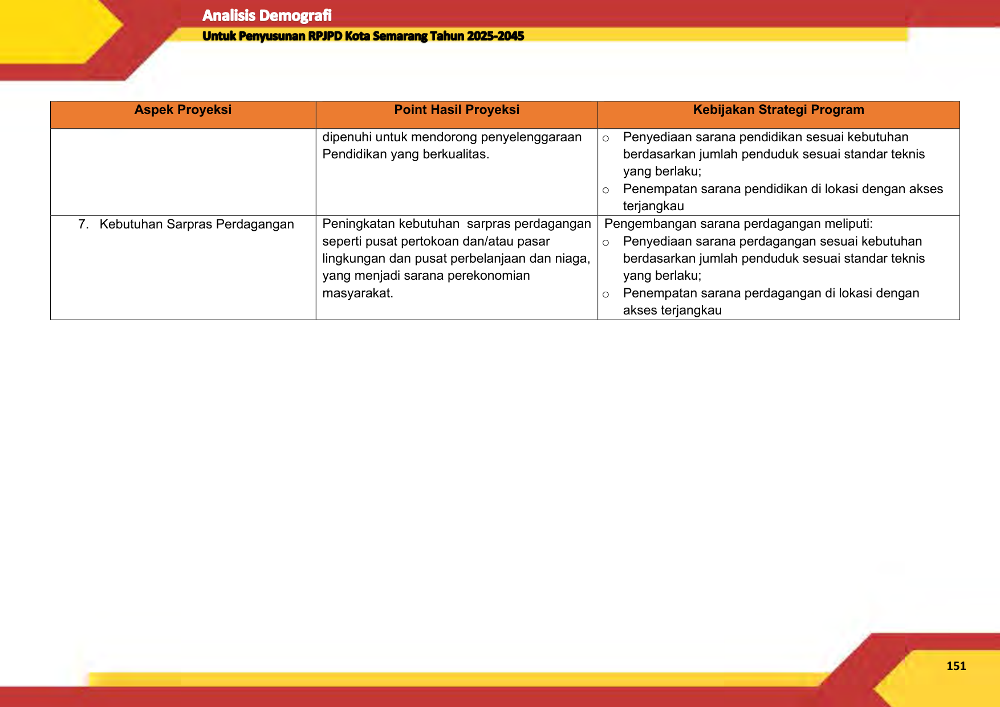

|Aspek Proyeksi|Point Hasil Proyeksi|Kebijakan Strategi Program|
|---|---|---|
||~~dipenuhi untuk mendorong penyelenggaraan~~ Pendidikan yang berkualitas. |`o`~~ Penyediaan sarana pendidikan sesuai kebutuhan~~ berdasarkan jumlah penduduk sesuai standar teknis yang berlaku; `o` Penempatan sarana pendidikan di lokasi dengan akses terjangkau |
|~~7. Kebutuhan Sarpras Perdagangan~~ |~~Peningkatan kebutuhan  sarpras perdagangan~~ seperti pusat pertokoan dan/atau pasar lingkungan dan pusat perbelanjaan dan niaga, yang menjadi sarana perekonomian masyarakat.|~~Pengembangan sarana perdagangan meliputi:~~ `o` Penyediaan sarana perdagangan sesuai kebutuhan berdasarkan jumlah penduduk sesuai standar teknis yang berlaku; `o` Penempatan sarana perdagangan di lokasi dengan akses terjangkau|

**151**

--- end of page=159 ---

# **BAB VI** **PENUTUP**

**6.1** **Kesimpulan**

Kesimpulan hasil proyeksi penduduk dan analisis kebutuhan hunian

serta sarana dan prasarana lingkungan di Kota Semarang meliputi

1. Berdasarkan parameter pertumbuhan penduduk, selanjutnya diproyeksikan

jumlah penduduk di Kota Semarang pada tahun 2025-2045. Hasil proyeksi

menunjukan bahwa dari tahun 2025 hingga 2045 akan terus jadi peningkatan

jumlah penduduk di Kota Semarang. Diproyeksikan di tahun 2025 jumlah

penduduk Kota Semarang sebesar 1.722.421 jiwa meningkat menjadi

1.874.716 jiwa jiwa di tahun 2045.

2. Jumlah penduduk usia 0-44 tahun selama 2025-2045 setiap tahunnya

diproyeksikan akan terus mengalami penurunan, dikarenakan semakin

kecilnya angka kelahiran yang disebabkan oleh adanya perubahan pola

hidup penduduk khususnya perempuan, dari segi Pendidikan maupun

pendapatan/pekerjaan.

3. Komposisi jumlah penduduk berdasarkan kelompok usia muda (0-14 tahun),

usia produktif (15-64 tahun) dan usia tua (≥65 tahun), diproyeksikan jumlah

usia produktif masih mendominasi atau lebih banyak dibandikan usia non

produktif (penduduk usia muda dan tua) di tahun 2025 hingga 2045.

Meskipun demikian angka ketergantungan penduduk diproyeksikan terus

mengalami peningkatan dari 2025 angka ketergantungan sebesar 40,97%

(artinya dalam 100 penduduk usia produktif menanggung beban 41

penduduk usia non produktif) meningkat setiap tahunnya hingga ditahun

2045 angka ketergantungan Kota Semarang menjadi 53,42% artinya dalam

100 penduduk usia produktif menanggung beban 53 penduduk usia non

produktif).

4. Dari tahun 2025 hingga 2045 terdapat 7 kecamatan yang terus mengalami

pertambahan jumlah penduduk setiap tahunnya yakni Kecamatan Mijen,

Gunungpati, Banyumanik, Tembalang,Pedurungan, Genuk, dan Ngaliyan.

**152**

--- end of page=160 ---

Selain karena tren selama 10 tahun kebelakang di 7 kecamatan tersebut

terus mengalami kenaikan, pertambahan jumlah penduduk juga diprediksi

terjadi karena arah persebaran penduduk yang mulai menuju daerah pinggi

(pusat pelayanan kota) atau daerah perbatasan, dan juga karena faktor

pembangunan infratruktur daerah pinggiran kota yang semakin massif.

5. Terdapat dua metode pendekatan untuk menentukan bonus demografi yang

yakni metode Cheung et al dan metode Adioetomo. Berdasarkan kedua

metode pendekatan tersebut maka dapat diasumsikan bahwa Kota

Semarang akan mengalami bonus demografi pada kisaran tahun 2030-2040

6. Komposisi jumlah penduduk Kota Semarang munurut kecamatan dan jenis

kelamin diproyeksikan bahwa dari tahun 2025 hingga 2025 masih di dominasi

penduduk berjenis kelamin perempuan.

7. Selama kurun waktu 20 tahun dari tahun 2025 hingga 2045, kepadatan

penduduk di Kota Semarang diproyeksikan terus meningkat seiring dengan

peningkatan jumlah penduduk di Kota Semarang. Pada tahun 2025

kepadatan penduduk di Kota Semarang di prediksi mencapai 4.608 jiwa/km [2],

kemudian terus mengalami kenaikan setiap tahunnya hingga tahun 2045

diprediksi kepadatan penduduk di Kota Semarang mencapai 5.016 jiwa/km [2] .

8. Dari tahun 2025 hingga 2045 Kota Semarang mengalami perubahan wilayah

dilihat dari kepadatan penduduknya. Pada tahun 2025 diproyeksikan

terdapat 5 Kecamatan dengan kepadatan penduduk berstatus rendah yakni

Kecamatan Mijen, Gunungpati, Banyumanik, Tugu dan Ngaliyan. Hingga di

tahun 2040 hingga 2045 di proyeksikan terdapat 6 kecamatan dengan

kondisi status kepadatan penduduknya rendah yakni Kecamatan Mijen,

Gunungpati, Gajahmungkur, Semarang Tengah, Tugu, dan Ngaliyan.

9. Kebutuhan hunian Kota Semarang adalah sebanyak 574.140 hunian pada

tahun 2025, 594.192 hunian pada tahun 2030, 609.635 hunian pada tahun

2035, 619.956 hunian pada tahun 2040, dan 624.906 hunian pada tahun

2045. Kebutuhan luas kavling minimum hunian Kota Semarang adalah

sebesar 41.338.098 m [2] pada tahun 2025, 42.781.793 m [2 ] pada tahun 2030,

43.893.705 m [2] pada tahun 2035, 44.636.849 m [2] pada tahun 2040, dan

44.993.197 m [2] pada tahun 2045.

**153**

--- end of page=161 ---

10. Kebutuhan air bersih Kota Semarang adalah sebanyak 206.690.490 L/hari

pada tahun 2025, 213.908.966 L/hari pada tahun 2030, 219.468.527 L/hari

pada tahun 2035, 223.184.247 L/hari pada tahun 2040, dan 224.965.984

L/hari pada tahun 2045.

11. Timbulan sampah Kota Semarang adalah sebesar 1.205.695 kg/hari atau

440.079 ton pada tahun 2025, 1.247.802 kg/hari atau 455.448 ton pada tahun

2030, 1.280.233 kg/hari atau 467.285 ton pada tahun 2035, 1.301.908

kg/hari atau 475.196 ton pada tahun 2040, dan 1.312.302 kg/hari atau

478.990 ton pada tahun 2045.

12. Kebutuhan TPS Kota Semarang adalah sebagai berikut: TPS tipe I sebanyak

689 unit pada tahun 2025, 713 unit pada tahun 2030, 732 unit pada tahun

2035, 744 unit pada tahun 2040, dan 750 unit pada tahun 2045; TPS tipe II

sebanyak 57 unit pada tahun 2025, 59 unit pada tahun 2030, 61 unit pada

tahun 2035, 62 unit pada tahun 2040, dan 62 unit pada tahun 2045; serta

TPS tipe III sebanyak 14 unit pada tahun 2025, 15 unit pada tahun 2030, 15

unit pada tahun 2035, 15 unit pada tahun 2040, dan 16 unit pada tahun 2045.

13. Kebutuhan luas lahan minimum TPS Kota Semarang adalah sebagai berikut:

TPS tipe I sebanyak 6.890 m [2] pada tahun 2025, 7.130 m [2] pada tahun 2030,

7.316 m [2] pada tahun 2035, 7.439 m [2] pada tahun 2040, dan 7.499 m [2] pada

tahun 2045; TPS tipe II sebanyak 3.445 m [2] pada tahun 2025, 3.565 m [2] pada

tahun 2030, 3.658 m [2] pada tahun 2035, 3.720 m [2] pada tahun 2040, dan

3.749 m [2] pada tahun 2045; serta TPS tipe III sebanyak 2.871 m [2] pada tahun

2025, 2.971 m [2] pada tahun 2030, 3.048 m [2] pada tahun 2035, 3.100 m [2] pada

tahun 2040, dan 3.125 m [2] pada tahun 2045

14. Kebutuhan posyandu Kota Semarang adalah sebanyak 1.378 unit pada

tahun 2025, 1.426 unit pada tahun 2030, 1.463 unit pada tahun 2035, 1.488

unit pada tahun 2040, dan 1.500 unit pada tahun 2045. Kebutuhan luas lahan

minimum posyandu Kota Semarang adalah sebesar 82.676 m [2] pada tahun

2025, 85.564 m [2] pada tahun 2030, 87.787 m [2] pada tahun 2035, 89.274 m [2]

pada tahun 2040, dan 89.986 m [2] pada tahun 2045.

15. Kebutuhan BKIA atau klinik bersalin Kota Semarang adalah sebanyak 57 unit

pada tahun 2025, 59 unit pada tahun 2030, 61 unit pada tahun 2035, 62 pada

**154**

--- end of page=162 ---

tahun 2040, dan 62 unit pada tahun 2045. Kebutuhan luas lahan minimum

BKIA atau klinik bersalin Kota Semarang adalah sebesar 172.242 m [2] pada

tahun 2025, 178.257 m [2] pada tahun 2030, 182.890 m [2] pada tahun 2035,

185.987 m [2] pada tahun 2040, dan 187.472 m [2] pada tahun 2045.

16. Kebutuhan puskesmas pembantu dan balai pengobatan lingkungan Kota

Semarang adalah sebanyak 57 unit pada tahun 2025, 59 unit pada tahun

2030, 61 unit pada tahun 2035, 62 pada tahun 2040, dan 62 unit pada tahun

2045. Kebutuhan luas lahan minimum puskesmas pembantu dan balai

pengobatan lingkungan Kota Semarang adalah sebesar 17.224 m [2] pada

tahun 2025, 17.826 m [2] pada tahun 2030, 18.289 m [2] pada tahun 2035, 18.599

m [2] pada tahun 2040, dan 18.747 m [2] pada tahun 2045.

17. Kebutuhan puskesmas dan balai pengobatan Kota Semarang adalah

sebanyak 14 unit pada tahun 2025, 15 unit pada tahun 2030, 15 unit pada

tahun 2035, 15 pada tahun 2040, dan 16 unit pada tahun 2045. Kebutuhan

luas lahan minimum puskesmas dan balai pengobatan Kota Semarang

adalah sebesar 14.354 m [2] pada tahun 2025, 14.855 m [2] pada tahun 2030,

15.241 m [2] pada tahun 2035, 15.499 m [2] pada tahun 2040, dan 15.623 m [2]

pada tahun 2045.

18. Kebutuhan apotek Kota Semarang adalah sebanyak 57 unit pada tahun

2025, 59 unit pada tahun 2030, 61 unit pada tahun 2035, 62 pada tahun

2040, dan 62 unit pada tahun 2045. Kebutuhan luas lahan minimum apotek

Kota Semarang adalah sebesar 14.354 m [2] pada tahun 2025, 14.855 m [2] pada

tahun 2030, 15.241 m [2] pada tahun 2035, 15.499 m [2] pada tahun 2040, dan

15.623 m [2] pada tahun 2045.

19. Kebutuhan TK Kota Semarang adalah sebanyak 1.378 unit pada tahun 2025,

1.426 unit pada tahun 2030, 1.463 unit pada tahun 2035, 1.488 pada tahun

2040, dan 1.500 unit pada tahun 2045. Kebutuhan luas lahan minimum TK

Kota Semarang adalah sebesar 688.968 m [2] pada tahun 2025, 713.030 m [2]

pada tahun 2030, 731.562 m [2] pada tahun 2035, 743.947 m [2] pada tahun

2040, dan 749.887 m [2] pada tahun 2045.

20. Kebutuhan SD Kota Semarang adalah sebanyak 1.077 unit pada tahun 2025,

1.114 unit pada tahun 2030, 1.143 unit pada tahun 2035, 1.162 pada tahun

**155**

--- end of page=163 ---

2040, dan 1.172 unit pada tahun 2045. Kebutuhan luas lahan minimum SD

Kota Semarang adalah sebesar 2.153.026 m [2] pada tahun 2025, 2.228.218

m [2] pada tahun 2030, 2.286.130 m [2] pada tahun 2035, 2.324.836 m [2] pada

tahun 2040, dan 2.343.396 m [2] pada tahun 2045.

21. Kebutuhan SMP Kota Semarang adalah sebanyak 359 unit pada tahun 2025,

371 unit pada tahun 2030, 381 unit pada tahun 2035, 387 pada tahun 2040,

dan 391 unit pada tahun 2045. Kebutuhan luas lahan minimum SMP Kota

Semarang adalah sebesar 3.229.539 m [2] pada tahun 2025, 3.342.328 m [2]

pada tahun 2030, 3.429.196 m [2] pada tahun 2035, 3.487.254 m [2] pada tahun

2040, dan 3.515.094 m [2] pada tahun 2045.

22. Kebutuhan SMA Kota Semarang adalah sebanyak 359 unit pada tahun 2025,

371 unit pada tahun 2030, 381 unit pada tahun 2035, 387 pada tahun 2040,

dan 391 unit pada tahun 2045. Kebutuhan luas lahan minimum SMA Kota

Semarang adalah sebesar 4.485.471 m [2] pada tahun 2025, 4.642.122 m [2]

pada tahun 2030, 4.762.772 m [2] pada tahun 2035, 4.843.408 m [2] pada tahun

2040, dan 4.882.074 m [2] pada tahun 2045.

23. Kebutuhan pusat pertokoan dan/atau pasar lingkunga Kota Semarang

adalah sebanyak 57 unit pada tahun 2025, 59 unit pada tahun 2030, 61 unit

pada tahun 2035, 62 pada tahun 2040, dan 62 unit pada tahun 2045.

Kebutuhan luas lahan minimum pusat pertokoan dan/atau pasar lingkunga

Kota Semarang adalah sebesar 574.140 m [2] pada tahun 2025, 594.192 m [2]

pada tahun 2030, 609.635 m [2] pada tahun 2035, 619.956 m [2] pada tahun

2040, dan 624.906 m [2] pada tahun 2045.

24. Kebutuhan pusat perbelanjaan dan niaga Kota Semarang adalah sebanyak

14 unit pada tahun 2025, 15 unit pada tahun 2030, 15 unit pada tahun 2035,

15 pada tahun 2040, dan 16 unit pada tahun 2045. Kebutuhan luas lahan

minimum pusat pertokoan dan/atau pasar lingkunga Kota Semarang adalah

sebesar 516.726 m [2] pada tahun 2025, 534.772 m [2] pada tahun 2030, 548.671

m [2] pada tahun 2035, 557.961 m [2] pada tahun 2040, dan 562.415 m [2] pada

tahun 2045.

**156**

--- end of page=164 ---

**6.2** **Rekomendasi**

Berdasarkan hasil perhitungan proyeksi penduduk dan kebutuhan

hunian serta sarana dan prasarana lingkungan di Kota Semarang Tahun 2025

2045 maka rekomendasi kebijakan yang perlu diambil untuk mengakomodir

kondisi komposisi penduduk dan kebutuhan sarana parasarana lingkungan

antara lain adalah:

1. Mendorong penyedian infrastuktur hunian sesuai dengan kebutuhan,

khususnya dengan melakukan optimalisasi penggunalan lahan di

kecamatan-kecamatan yang diproyeksi mengalami pertambahan penduduk.

Penyediaan hunian juga harus memperhatikan pola ruang dan struktur ruang

yang terdapat dalam RTRW Kota Semarang

2. Dengan memperhatikan adanya bonus demografi di tahun 2025 perlu

adanya kebijakan berbasis peningkatan SDM yang berdaya saing untuk

mendorong kompetensi masyarakat sekalius mendorong terbukanya

peluang usaha baru. Memasuki Tahun 2030 hingga 2040 perlu penguatan

kapasitas SDM dan penguatan sektor usaha baik dibidang UMKM maupun

sektor yang perpotensi lainnya untuk mendorong serapan tenaga kerja dan

tumbuhnya ekonomi masyarakat yang mandiri. Selanjutnya memasuki tahun

2045 perlu adanya dorongan untuk menumbuhkan peluang kerja berbasis

lansia sebagai upaya memfasilitasi masyarakat usia lansia yang

membutuhkan pekerjaan.

3. Mendorong tumbuhnya peluang usaha berbasis perempuan mengingat

kedepannya komposisi penduduk perempuan cenderung lebih banyak

dibandingkan penduduk laki-laki.

4. Memfokuskan pembangunan TPS sebagai sarana pengelolaan

persampahan di wilayah padat penduduk sesuai kebutuhan sarparas

pengelolaan persambahan dengan memperhatikan kondisi lingkungan

5. Mendorong terpenuhinya kebutuhan sarana ksehatan untuk mempersiapkan

kualitas kesehatan penduduk terkhusus penduduk lansia.

6. Mendorong pemenuhan sarana Pendidikan yang mendorong peningkatan

kompetensi SDM masyarakat sejak tahun 2025 untuk mempersiapkan

peluang dan tantangan menghadapi bonus demografi.

**157**

--- end of page=165 ---

7. Menciptakan perumahan multigenerasi seperti yang telah muncul di Kota

Berlin Jerman untuk mendorong munculnya desain ruang kota yang ramah

dan lanyak sebagai hunian lansia.

**158**

--- end of page=166 ---

# **DAFTAR PUSTAKA**

Adioetomo, S. M. (2005). _Bonus Demografi Menjelaskan Hubungan antara_

_Pertumbuhan Penduduk dengan Pertumbuhan Ekonomi._ Retrieved from

Universitas Indonesia Library:

https://lib.ui.ac.id/m/detail.jsp?id=115532&lokasi=lokal#

Adioetomo, S. M., & Samosir, O. B. (2010). _Dasar-Dasar Demografi Edisi 2._

Jakarta Selatan: Salemba Empat.

Badan Pusat Statistik. (2010). _Pedoman Penghitungan Pedoman Penghitungan_

_Proyeksi Penduduk Proyeksi Penduduk dan Angkatan Kerja._ Retrieved

from Media Neliti: https://media.neliti.com/media/publications/49951-ID

pedoman-penghitungan-proyeksi-penduduk-dan-tenaga-kerja.pdf

Ehrlich, P. R. (1968). _The Population Bomb._ New York: Ballantine Books.

Harmadi, S. H. (2016). _Analisis Data Demografi._ Retrieved from Perpustakaan

Universitas Terbuka: https://pustaka.ut.ac.id/lib/espa4355-analisis-data

demografi/#tab-id-3

Malthus, T. R. (1998). _An Essay on the Principle of Population._ London: ESPN.

Mantra, I. B. (2000). _Demografi Umum._ Yogyakarta: Pustaka Pelajar.

Meadows, D. H., Meadows, D. L., Randers, J., & Behrens III, W. W. (1972). _The_

_Limits to Growth: A Report for the Club of Rome’s Project on the_

_Predicament of Mankind._ New York: Universe Books.

Standar Nasional Indonesia 03-1733-2004 Tentang Tata Cara Perencanaan

Lingkungan Perumahan di Perkotaan

**159**

--- end of page=167 ---

