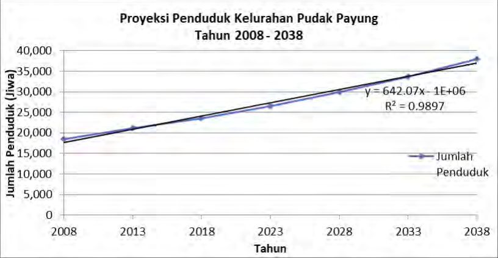
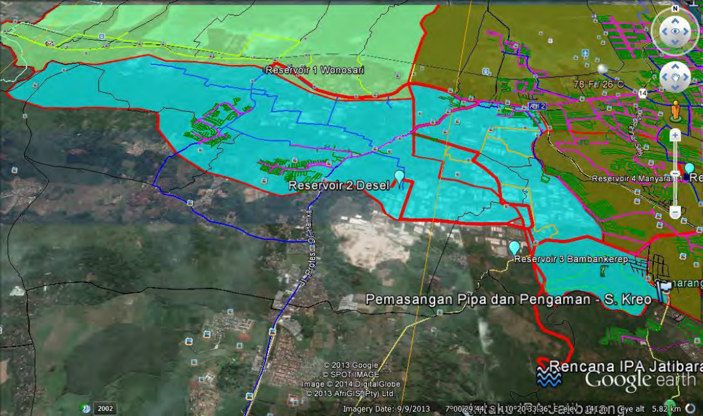
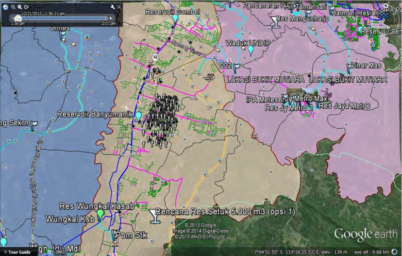
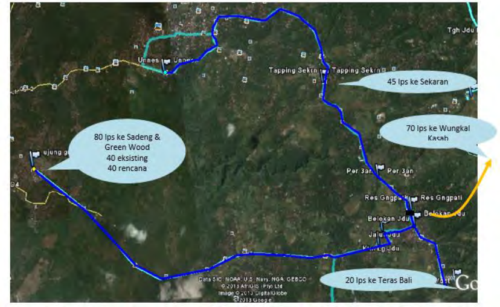
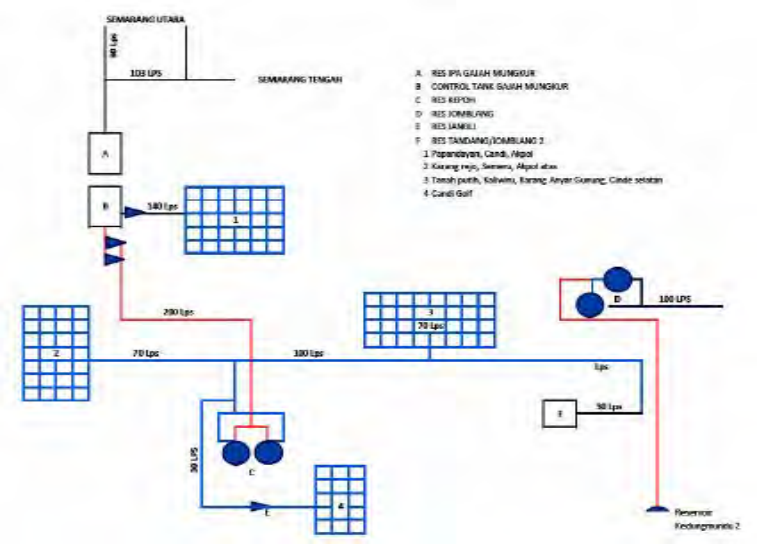
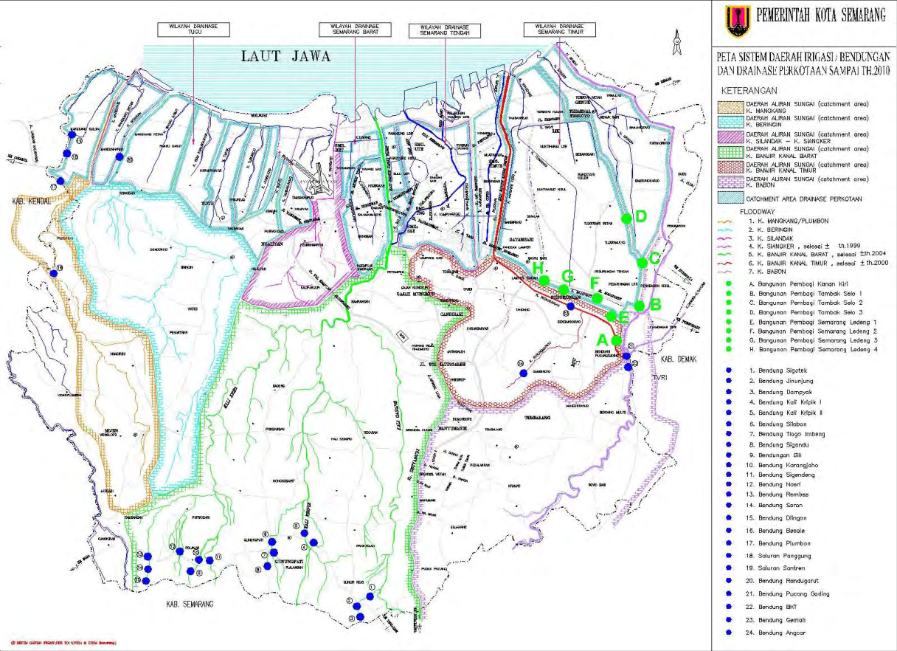
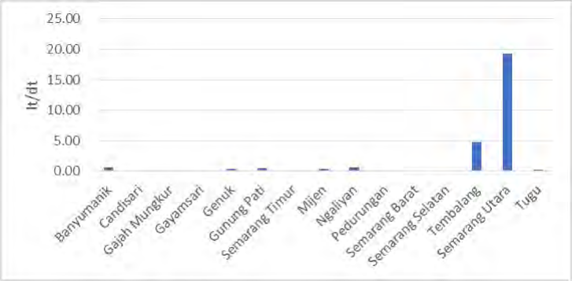

--- end of page=0 ---

**CV. Rekayasa Jati Mandiri** **Laporan Akhir**

### **KATA PENGANTAR**

Penyusunan Rencana Induk SPAM Kota Semarang merupakan

implementasi Peraturan Pemerintah No 122 Tahun 2015 tentang Sistem

Penyediaan Air Minum. Penyusunan Review Rencana Induk SPAM ini mengacu

kepada Permen PU No. 27 Tahun 2016 tentang Penyelenggaraan Sistem

Penyediaan Air Minum. Arah studi ini memberikan gambaran kebutuhan air

minum, potensi air baku dan menyusun skenario/program pengembangan

Rencana Induk SPAM di Kota Semarang sampai dengan tahun 2038.

Sampai tahun 2038 kebutuhan air rata-rata Kota Semarang ini

diperkirakan sebesar 6.421 l/dt dengan target akses pelayanan sebesar 100%.

Sumber air baku yang dapat dimanfaatkan untuk pengembangan SPAM di Kota

Semarang adalah Kaligarang, Pucang Gading, Kudu, Jatibarang dan beberapa

mata air.

Oleh karena itu masih diperlukan kerja keras dalam pemenuhan

kebutuhan air minum di Kota Semarang. Permasalahan utama dalam

pengembangan SPAM di Kota Semarang adalah tingginya nilai kehilangan air

sebesar 39% pada tahun 2017 dan pada tahun 2016 sebesar 40,10% dengan

cakupan pelayanan yang hanya sebesar 61,02% pada akhir tahun 2016

berdasarkan draft laporan rencana bisnis PDAM 2017, serta cakupan pelayanan

mencapai 61,57% pada akhir tahun 2017 berdasarkan laporan BPKP tahun

2017. Namun permasalahan ini dapat diatasi, bila efektifitas pelayanan dan

kinerja pegawai dapat diperbaiki.

Akhirnya, Kami ucapkan terima kasih yang sebesar-besarnya kepada

pihak-pihak yang telah merampungkan terlibat aktif dalam penyusunan Review

Rencana Induk SPAM Kota Semarang. Semoga buku ini dapat bermanfaat

dalam mendukung upaya Pengembangan SPAM di Kota Semarang.

Semarang, Oktober 2018

Tim Penyusun

**Penyusunan Review RISPAM Kota Semarang 2018** **i**

--- end of page=1 ---

**CV. Rekayasa Jati Mandiri** **Laporan Akhir**

**DAFTAR ISI**

**KATA PENGANTAR ................................................................................................i**

**DAFTAR ISI ............................................................................................................ ii**

**DAFTAR TABEL .................................................................................................. vii**

**DAFTAR GAMBAR .............................................................................................. xv**

**BAB I PENDAHULUAN ....................................................................................... I-1**

1.1. Latar Belakang ....................................................................................... I-1

1.2. Maksud dan Tujuan ................................................................................ I-2

1.2.1. Maksud ............................................................................................ I-2

1.2.2. Tujuan ............................................................................................. I-3

1.3. Sasaran .................................................................................................. I-3

1.4. Lingkup Kegiatan .................................................................................... I-4

1.5. Keluaran ................................................................................................. I-5

1.6. Sistem Penulisan Laporan ..................................................................... I-5

**BAB II GAMBARAN UMUM WILAYAH STUDI ................................................. II-1**

2.1. Karakteristik Fisik Dasar ....................................................................... II-1

2.1.1. Iklim ................................................................................................ II-1

2.1.2. Kemiringan Lereng ......................................................................... II-2

2.1.3. Morfologi (Bentuk Lahan) .............................................................. II-2

2.1.4. Geologi ........................................................................................... II-3

2.1.5. Hidrogeologi ................................................................................... II-3

2.2. Penggunaan Lahan ............................................................................... II-9

2.3. Kondisi Sarana dan Prasarana ........................................................... II-11

2.3.1. Pengelolaan Air Limbah ............................................................... II-11

2.3.2. Persampahan ............................................................................... II-15

2.3.3. Drainase ....................................................................................... II-18

2.3.4. Perekonomian .............................................................................. II-22

2.3.5. Kesehatan .................................................................................... II-23

2.3.6. Peribadatan .................................................................................. II-24

2.3.7. Transportasi ................................................................................. II-25

2.3.8. Kebutuhan Listrik ......................................................................... II-26

2.3.9. Telepon ........................................................................................ II-27

2.3.10. Jalan ............................................................................................. II-27

**Penyusunan Review RISPAM Kota Semarang 2018** **ii**

--- end of page=2 ---

**CV. Rekayasa Jati Mandiri** **Laporan Akhir**

2.3.11. Obyek Wisata ............................................................................... II-27

2.4. Kondisi Sosial Ekonomi ....................................................................... II-28

2.4.1. Kependudukan ............................................................................. II-28

2.4.2. Produk Domestik Regional Bruto (PDRB) ................................... II-29

2.5. Fungsi dan Peran Kota ....................................................................... II-31

2.6. Kondisi Keuangan Daerah .................................................................. II-31

2.6.1. Penerimaan Daerah ..................................................................... II-31

2.6.2. Pengeluaran Daerah .................................................................... II-32

2.6.3. Pembiayaan Daerah .................................................................... II-32

**BAB III KONDISI SPAM EKSISTING KOTA SEMARANG .............................. III-1**

3.1. Umum ................................................................................................... III-1

3.1.1. Cakupan Pelayanan ...................................................................... III-1

3.1.2. Tingkat Pemakaian (Domestik, Non Domestik, dan Keseluruhan)

………………………………………………………………………….III-2

3.1.3. Tingkat Kehilangan Air .................................................................. III-3

3.2. Aspek Teknis .................................................................................... III-7

3.2.1. SPAM PDAM Kota Semarang ...................................................... III-7

3.2.1.1. SPAM Kota ................................................................................ III-7

3.2.2. SPAM Lembaga Pengelola Non PDAM ..................................... III-26

3.3. Aspek Non Teknis .............................................................................. III-27

3.3.1. Aspek Keuangan ......................................................................... III-27

3.3.2. Aspek Institusional dan Manajemen ........................................... III-34

3.4. Kendala dan Permasalahan ............................................................... III-39

3.4.1. Aspek Teknis ............................................................................... III-39

3.4.2. Aspek Non Teknis ....................................................................... III-41

**BAB IV STANDAR/KRITERIA PERENCANAAN ............................................. IV-1**

4.1. Standar Kebutuhan Air ......................................................................... IV-1

4.1.1. Kebutuhan Domestik..................................................................... IV-1

4.1.2. Kebutuhan Non Domestik ............................................................. IV-2

4.2. Kriteria Perencanaan ........................................................................... IV-2

4.2.1. Unit Air Baku ................................................................................. IV-2

4.2.2. Unit Transmisi ............................................................................... IV-5

4.2.3. Unit Produksi ................................................................................. IV-7

4.2.4. Unit Distribusi ................................................................................ IV-9

**Penyusunan Review RISPAM Kota Semarang 2018** **iii**

--- end of page=3 ---

**CV. Rekayasa Jati Mandiri** **Laporan Akhir**

4.2.5. Unit Pelayanan ............................................................................ IV-11

4.3. Periode Perencanaan ........................................................................ IV-12

4.4. Kriteria Daerah Layanan .................................................................... IV-13

**BAB V PROYEKSI KEBUTUHAN AIR ............................................................... V-1**

5.1. Rencana Pemanfaatan Ruang .............................................................. V-1

5.2. Rencana Daerah Pelayanan ................................................................. V-8

5.2.1. Kondisi Eksisting Sistem Penyediaan Air Minum Kota SemarangV-8

5.2.2. Rencana Pengembangan Sistem Penyediaan Air Minum .......... V-13

5.3. Proyeksi Jumlah Penduduk................................................................. V-14

5.4. Proyeksi Kebutuhan Air Minum ........................................................... V-23

5.4.1. Kebutuhan Domestik.................................................................... V-23

5.4.2. Kebutuhan Non-Domestik ............................................................ V-25

5.4.3. Kehilangan Air .............................................................................. V-27

5.4.4. Kebutuhan Air Rata – Rata .......................................................... V-29

5.4.5. Kebutuhan Hari Maksimum (Qhm) .............................................. V-30

5.4.6. Kebutuhan Jam Puncak (Qjp)...................................................... V-31

5.4.7. Pendekatan Perhitungan ............................................................. V-32

**BAB VI POTENSI AIR BAKU ............................................................................ VI-1**

6.1. Potensi Air Permukaan ........................................................................ VI-1

6.1.1. Sungai ........................................................................................... VI-1

6.1.1.1 Sungai Garang .................................................................................... VI-6

6.1.1.2. Sungai Blorong .............................................................................. VI-6

6.1.1.3. Sungai Babon ............................................................................ VI-7

6.1.1.4. Sungai Lusi ................................................................................ VI-8

6.1.2. Polder ............................................................................................ VI-8

6.1.3. Waduk ......................................................................................... VI-10

6.1.4. Embung ....................................................................................... VI-12

6.1.5. Pemanfaatan Air Permukaan oleh PDAM ................................. VI-15

6.2. Potensi Air Tanah ............................................................................... VI-15

6.2.1 Jenis Akuifer ................................................................................ VI-15

6.2.2 Cekungan Air Bawah Tanah & Air Bawah Tanah ...................... VI-18

6.3. Sumber Lain ....................................................................................... VI-23

6.3.1 Mata Air ....................................................................................... VI-23

6.3.2 Air Hujan...................................................................................... VI-23

**Penyusunan Review RISPAM Kota Semarang 2018** **iv**

--- end of page=4 ---

**CV. Rekayasa Jati Mandiri** **Laporan Akhir**

**BAB VII RENCANA INDUK DAN PRA DESAIN PENYELENGGARAAN SPAM**

**............................................................................................................................ VII-1**

7.1. Rencana Pola Pemanfaatan Ruang Wilayah ..................................... VII-1

7.1.1. Kebijakan Tata Ruang ............................................................... VII-20

7.1.2. Struktur Tata Ruang ................................................................... VII-20

7.1.3. Pola Pemanfaatan Ruang Wilayah............................................ VII-21

7.2. Pengembangan Wilayah/Daerah Pelayanan (Zonasi) ..................... VII-23

7.3. Tingkat Pelayanan............................................................................. VII-28

7.4. Rencana Pentahapan Pengembangan (5 Tahunan) ........................ VII-28

7.4.1. Sistem Zona Pelayanan SPAM Semarang Barat...................... VII-58

7.4.2. Sistem Zona Pelayanan Pramuka (Pudak Payung) .................. VII-68

7.4.3. Sistem Zona Pelayanan Blorong/Jatisari .................................. VII-70

7.4.4. Reservoir Mangunharjo ............................................................. VII-72

7.4.5. Switching Semarang Barat ........................................................ VII-73

7.4.6. Switching Jaringan Aliran Gajah Mungkur dan Kudu ................ VII-75

7.4.7. Sistem Zona Pelayanan Baru Kaligarang ................................. VII-76

7.4.8. Sistem Zona Pelayanan Baru Kudu .......................................... VII-77

7.4.9. Sistem Zona Pelayanan Pucanggading .................................... VII-80

7.4.10. Sistem Zona Pelayanan Meteseh .............................................. VII-80

7.4.11. Reservoir Trangkil ...................................................................... VII-81

7.4.12. Reservoir Kaba .......................................................................... VII-82

7.5. Kebutuhan Air .................................................................................... VII-82

7.5.1. Klasifikasi Pelanggan ................................................................. VII-83

7.5.2. Kebutuhan Air Domestik ............................................................ VII-85

7.5.3. Kebutuhan Air Non Domestik .................................................... VII-91

7.5.4. Kehilangan Air ............................................................................ VII-99

7.5.5. Rekapitulasi Kebutuhan Air ..................................................... VII-100

7.6. Alternatif Rencana Penyelenggaraan ............................................. VII-101

7.6.1. Sistem Zona Pelayanan Jaringan Perpipaan (JP) .................. VII-101

7.6.2. Sistem Zona Pelayanan Bukan Jaringan Perpipaan (BJP) .... VII-102

7.7. Penurunan Tingkat Kebocoran ....................................................... VII-106

7.7.1. Penurunan Kebocoran Teknis ................................................. VII-106

7.7.2. Penurunan Kebocoran Non Teknis ......................................... VII-106

7.8. Potensi Sumber Air Baku ................................................................ VII-107

**Penyusunan Review RISPAM Kota Semarang 2018** **v**

--- end of page=5 ---

**CV. Rekayasa Jati Mandiri** **Laporan Akhir**

7.8.1. Perhutungan Water Balance.................................................... VII-115

7.8.2. Rekomendasi Sumber Air yang digunakan ............................. VII-122

7.9. Keterpaduan dengan Prasarana dan Sarana Sanitasi ................... VII-122

7.9.1. Air Limbah ....................................................................................... VII-122

7.9.2. Kebutuhan Air untuk Prasarana dan Sarana Sanitasi .................... VII-141

7.10. Perkiraan Kebutuhan Biaya ............................................................ VII-143

**BAB VIII ANALISIS KEUANGAN .................................................................... VIII-1**

8.1 Kebutuhan Investasi dan Sumber Pendanaan .................................. VIII-1

8.1.1 Kebutuhan Investasi ................................................................... VIII-4

8.1.2 Sumber Pendanaan .................................................................. VIII-10

8.1.3 Pentahapan Sumber Pendanaan ............................................. VIII-69

8.2 Dasar Penentuan Asumsi Keuangan ............................................... VIII-71

8.3 Hasil Analisis Kelayakan .................................................................. VIII-72

8.3.1 Tahap I (Mendesak) .................................................................. VIII-74

8.3.2 Tahap II (Jangka Menengah).................................................... VIII-76

8.3.3 Tahap III (Jangka Panjang) ...................................................... VIII-77

8.3.4 Affordability ............................................................................... VIII-78

8.3.5 Sensitivity Analisys ................................................................... VIII-80

**BAB IX PENGEMBANGAN KELEMBAGAAN PELAYANAN AIR MINUM ..... IX-1**

9.1 Organisasi ............................................................................................ IX-2

9.1.1 Bentuk Badan Pengelola ............................................................... IX-2

9.2 Sumber Daya Manusia ......................................................................... IX-3

9.2.1 Jumlah Kebutuhan Sumber Daya Manusia .................................. IX-3

9.2.2 Kualifikasi ...................................................................................... IX-8

9.3 Pelatihan ............................................................................................... IX-9

9.4 Perjanjian Kerjasama ............................................................................ IX-9

9.4.1 Tujuan ......................................................................................... IX-13

9.4.2 Organisasi Mitra Yang Terlibat .................................................. IX-13

9.4.3 Mekanisme Kesepakatan………………………………………..IX-14

**Penyusunan Review RISPAM Kota Semarang 2018** **vi**

--- end of page=6 ---

**CV. Rekayasa Jati Mandiri** **Laporan Akhir**

**DAFTAR TABEL**

Tabel II.1 Penggunaan Areal Tanah Kota Semarang Tahun 2016 (Ha) .... II-9

Tabel II.2 Sarana Pengumpulan Sampah di Kota Semarang

Tahun 2016 ................................................................................. II-15

Tabel II.3 Jumlah Pedagang Menurut Kecamatan di Kota Semarang

Tahun 2016 ................................................................................. II-22

Tabel II.4 Banyaknya Pasar dan Jenis Pasar Kota Semarang

2011-2015 ................................................................................... II-23

Tabel II.5 Jumlah Fasilitas Kesehatan Kota Semarang Tahun 2016 ......... II-23

Tabel II.6 Jumlah Penduduk Menurut Kecamatan dan Agama yang Dianut

di Kota Semarang Tahun 2016 ................................................... II-24

Tabel II.7 Jumlah Tempat Peribadatan Menurut Kecamatan di Kota

Semarang Tahun 2016 ............................................................... II-24

Tabel II.8 Daya Terpasang, Produksi, dan Distribusi Listrik PT. PLN

(Pesero) pada Cabang/Ranting PLN di Kota Semarang

Tahun 2011-2016 ........................................................................ II-26

Tabel II.9 Panjang Jalan Menurut Keadaan dan Pemerintahan yang

Mengelolanya .............................................................................. II-27

Tabel II.10 Banyaknya Pengunjung Obyek Wisata Kota Semarang 2016... II-28

Tabel II.11 Jumlah Penduduk Menurut Kecamatan di Kota Semarang

Tahun 2016 ................................................................................. II-29

Tabel II.12 Produk Domestik Regional Bruto (PDRB) Menurut Lapangan

Usaha Atas Dasar Harga Konstan 2010 Tahun 2014-2016

(Miliar Rupiah) ............................................................................. II-30

Tabel II.13 Penerimaan Daerah Kota Semarang Tahun 2015 – 2017 ......... II-31

Tabel II.14 Belanja Daerah Kota Semarang Tahun 2015 – 2017 ................ II-32

Tabel II.15 Pembiayaan Daerah Kota Semarang Tahun 2015 – 2017 ........ II-33

Tabel III.1 Cakupan Pelayanan Pdam Kota Semarang Tahun

2014 – 2016 ................................................................................ III-2

Tabel III.2 Tingkat Pemakaian Air Tahun 2017 ........................................... III-2

Tabel III.3 Laporan Kehilangan Air Tahun 2017 ......................................... III-5

Tabel III.4 Sumber Mata Air Pdam Tirta Moedal Kota Semarang ............... III-8

Tabel III.5 Sumber Air Permukaan Pdam Tirta Moedal Kota Semarang .... III-8

Tabel III.6 Data Panjang Pipa Transmisi Dan Distribusi ............................. III-17

**Penyusunan Review RISPAM Kota Semarang 2018** **vii**

--- end of page=7 ---

**CV. Rekayasa Jati Mandiri** **Laporan Akhir**

Tabel III.7 Data Water Meter Setiap Cabang Pdam Kota Semarang.......... III-18

Tabel III.8 Rekapitulasi Pamsimas Kota Semarang Tahun 2018 ................ III-22

Tabel III.9 Laporan Posisi Keuangan Pdam Tirta Moedal 2015, 2016,

2017 ............................................................................................. III-27

Tabel III.10 Laporan Laba/Rugi Pdam Tirta Moedal 2015, 2016, 2017 ........ III-28

Tabel III.11 Tarif Rata-Rata Dan Full Cost Recovery PDAM Tirta Moedal

Tahun 2015, 2016 ....................................................................... III-29

Tabel III.12 Struktur Tarif Pdam Tirta Moedal Tahun 2016 dan 2015 ........... III-29

Tabel III.13 Realisasi Penggunaan Dana PAMSIMAS .................................. III-31

Tabel III.14 Rekap Saldo Akhir Kas Seluruh Proyek Pamsimas Pada Akhir

Tahun 2012 ................................................................................. III-32

Tabel III.15 Realisasi Dana Progam PNPM Tahun 2007 S/D 2012 .............. III-32

Tabel III.16 Realisasi Dana APBN Penyediaan Air Bersih Program DTKP .. III-33

Tabel III.17 Jumlah pegawai PDAM Tirta Moedal Kota Semarang Bulan

Desember 2017 ........................................................................... III-37

Tabel III.18 Permasalahan Dan Penyebab Masalah Aspek Teknis di

PDAM Kota Semarang ................................................................ III-39

Tabel III.19 Permasalahan Dan Penyebab Masalah Aspek Kelembagaan

di PDAM Kota Semarang ............................................................ III-40

Tabel III.201 Permasalahan Dan Penyebab Masalah Aspek Keuangan di

PDAM Kota Semarang ................................................................ III-41

Tabel IV.1 Tingkat Konsumsi/Pemakaian Air Rumah Tangga Sesuai

Kategori Kota ............................................................................... IV-1

Tabel IV.2 Materi Survey Air Baku .............................................................. IV-3

Tabel IV.3 Kriteria Teknis Pipa Transmisi ................................................... IV-6

Tabel IV.4 Kriteria Teknis Pipa Distribusi .................................................... IV-10

Tabel IV.5 Matriks Kriteria Utama Penyusunan Rispam untuk Berbagai

Klasifikasi Kota ........................................................................... IV-12

Tabel V.1 SPAM Pelayanan Non Perpipaan Kota Semarang ................... V-9

Tabel V.2 Rencana Pengembangan SPAM Jaringan Primer Kota

Semarang .................................................................................... V-13

Tabel V.3 Rencana Investasi PDAM Kota Semarang ................................ V-13

Tabel V.4 Contoh Perbandingan Standar Deviasi Perhitungan Proyeksi

(Kelurahan Pudak Payung) ........................................................ V-17

**Penyusunan Review RISPAM Kota Semarang 2018** **viii**

--- end of page=8 ---

**CV. Rekayasa Jati Mandiri** **Laporan Akhir**

Tabel V.5 Hasil Proyeksi Penduduk setiap Kecamatan di Kota Semarang

(2017 – 2038) ............................................................................. V-19

Tabel V.6 Hasil Proyeksi Penduduk setiap Kecamatan di Kota Semarang

(2012 – 2033) ............................................................................. V-20

Tabel V.7 Tingkat Konsumsi/Pemakaian Air Rumah Tangga Sesuai

Katergori Kota ............................................................................. V-23

Tabel V.8 Tingkat Kebutuhan Air Domestik Kota Semarang 2017-2038 .. V-24

Tabel V.9 Jumlah Kegiatan Non Domestik Kota Semarang 2017-2038 ... V-26

Tabel V.10 Tingkat Kebutuhan Air Non Domestik Kota Semarang

2017-2038 .................................................................................. V-27

Tabel V.11 Proyeksi Tingkat Kehilangan Air Kota Semarang 2017-2038 .... V-29

Tabel V.12 Proyeksi Tingkat Kebutuhan Air Rata-Rata Kota Semarang

2017-2038 ................................................................................... V-30

Tabel V.13 Proyeksi Tingkat Kebutuhan Harian Maksimum Kota Semarang

2017-2038 ................................................................................... V-31

Tabel V.14 Proyeksi Tingkat Kebutuhan Jam Puncak Kota Semarang

2017-2038 .................................................................................. V-32

Tabel V.15 Proyeksi Kebutuhan Air Minum Kota Semarang Tahun

2017 – 2038 ................................................................................ V-34

Tabel V.16 Proyeksi Kebutuhan Air Minum Kota Semarang Tahun

2012 – 2033 ............................................................................... V-35

Tabel VI.1 Daftar Sungai Kota Semarang .................................................... VI-2

Tabel VI.2 Daftar Polder Kota Semarang .................................................... VI-9

Tabel VI.3 Daftar Waduk Kota Semarang ................................................... VI-11

Tabel VI.4 Daftar Embung Kota Semarang .................................................. VI-13

Tabel VI.5 Pemanfaatan Air Permukaan oleh PDAM ................................. VI-16

Tabel VI.6 Pemakaian Air Bawah Tanah 2018 ............................................ VI-21

Tabel VI.7 Air Bawah Tanah Wilayah Barat Sebagai Sumber Air Baku

PDAM Kota Semarang ................................................................ VI-21

Tabel VI.8 Air Bawah Tanah Wilayah Timur Sebagai Sumber Air Baku

PDAM Kota Semarang ............................................................... VI-22

Tabel VI.9 Mata Air Sebagai Sumber Air Baku PDAM Kota Semarang ..... VI-24

Tabel VI.10 Daftar Penerima Rain Water Harvesting Tahun 2018 ................ VI-24

Tabel VII.1 _Supply_ Eksisting dan Rencana di Kota Semarang ..................... VII-50

Tabel VII.2 Analisis Defisit/Surplus _Supply_ Air Minum di Kota Semarang ... VII-53

**Penyusunan Review RISPAM Kota Semarang 2018** **ix**

--- end of page=9 ---

**CV. Rekayasa Jati Mandiri** **Laporan Akhir**

Tabel VII.3 Kebutuhan Air Domestik Kecamatan Semarang Barat .............. VII-85

Tabel VII.4 Kebutuhan Air Domestik Kecamatan Tugu ................................ VII-86

Tabel VII.5 Kebutuhan Air Domestik Kecamatan Ngaliyan ......................... VII-87

Tabel VII.6 Kebutuhan Air Domestik Kecamatan Tembalang ..................... VII-88

Tabel VII.7 Kebutuhan Air Domestik Kecamatan Banyumanik .................... VII-89

Tabel VII.8 Kebutuhan Air Domestik Kecamatan Mijen ............................... VII-90

Tabel VII.9 Kebutuhan Air Non Domestik Kecamatan Semarang Barat ...... VII-91

Tabel VII.10 Kebutuhan Air Non Domestik Kecamatan Tugu ........................ VII-92

Tabel VII.11 Kebutuhan Air Non Domestik Kecamatan Ngaliyan .................. VII-93

Tabel VII.12 Kebutuhan Air Non Domestik Kecamatan Tembalang .............. VII-95

Tabel VII.13 Kebutuhan Air Non Domestik Kecamatan Banyumanik ............. VII-96

Tabel VII.14 Kebutuhan Air Non Domestik Kecamatan Mijen ....................... VII-97

Tabel VII.15 Rekapitulasi Kebutuhan Air Domestik Sistem Prioritas ............. VII-100

Tabel VII.16 Rekapitulasi Kebutuhan Air Non Domestik Sistem Prioritas ..... VII-100

Tabel VII.17 Hasil Perhitungan Debit Andalan Tahunan Kali Kreo ............... VII-107

Tabel VII.18 Hasil Perhitungan Debit Andalan Tahunan Kali Garang Hulu . VII-108

Tabel VII.19 Hasil Perhitungan Debit Andalan Tahunan Kali Garang Hilir ... VII-109

Tabel VII.20 Hasil Perhitungan Debit Andalan Tahunan Kali Blorong ......... VII-109

Tabel VII.21 Hasil Perhitungan Debit Andalan Tahunan Kali Lusi ............... VII-110

Tabel VII.22 Hasil Perhitungan Debit Andalan Tahunan Kali Serang .......... VII-111

Tabel VII.23 Hasil Perhitungan Debit Andalan Tahunan Kali Babon ............ VII-112

Tabel VII.24 Water Balance DAS Garang (Kreo-Kripik-Garang) ................... VII-115

Tabel VII.25 Water Balance DAS Blorong ...................................................... VII-117

Tabel VII.26 Water Balance DAS Serang-Lusi .............................................. VII-120

Tabel VII.27 Water Balance Kali Babon ......................................................... VII-121

Tabel VII.28 Jumlah IPAL Komunal di Kota Semarang ................................. VII-123

Tabel VII.29 Tahapan Pengembangan Air Limbah Domestik Kota Semarang

..................................................................................................... VII-126

Tabel VII.30 Analisis Kebutuhan Air Bersih untuk Pengolahan Limbah ........ VII-127

Tabel VII.31 Analisis Kebutuhan IPAL dan Air Bersih untuk Pengolahan Limbah

..................................................................................................... VII-128

Tabel VII.32 Analisis Kebutuhan Air Bersih untuk Pencucian ....................... VII-133

Tabel VII.33 Analisis Kebutuhan Air Bersih untuk Pencucian per Kecamatan

..................................................................................................... VII-134

**Penyusunan Review RISPAM Kota Semarang 2018** **x**

--- end of page=10 ---

**CV. Rekayasa Jati Mandiri** **Laporan Akhir**

Tabel VII.34 Analisis Kebutuhan Sarana dan Prasarana Air Bersih untuk Pencucian

.................................................................................................... VII-136

Tabel VII.35 Analisis Kebutuhan Air Bersih untuk Kecamatan Semarang Utara

..................................................................................................... VII-141

Tabel VII.36 Analisis Kebutuhan Air Bersih untuk Kecamatan Tembalang ... VII-142

Tabel VII.37 Total Kebutuhan Investasi (Tahun 2018 – 2038) ...................... VII-143

Tabel VII.38 Total Kebutuhan Investasi Tahap Mendesak

(Tahun 2019 – 2023)................................................................... VII-152

Tabel VII.39 Total Kebutuhan Investasi Tahap Jangka Menengah

(Tahun 2024 – 2028) .................................................................. VII-156

Tabel VII.40 Total Kebutuhan Investasi Tahap Jangka Panjang

(Tahun 2029 – 2038) .................................................................. VII-158

Tabel VIII.1 Usulan Biaya Pembangunan Pengembangan RISPAM (Pudak

Payung, Intake+IPA Jatisari, Switching SPAM Semarang Barat

KPBU, Intake Kaligarang, Reservoar Setuk, Reservoar

Mangunharjo) Tahun 2019 – 2023 Tahap I PROGRAM

PERPIPAAN .............................................................................. VIII-5

Tabel VIII.2  Usulan Biaya Program Non Fisik PDAM Tahun 2019 – 2023 . VIII-6

Tabel VIII.3 Usulan BiayaProgram Pengurangan NRW PDAM Tahun 2019 –

2023 ............................................................................................ VIII-7

Tabel VIII.4 Usulan Biaya Pembangunan Pengembangan RISPAM

(Uprating SPAM Kudu) Tahun 2024 – 2028 Tahap II PROGRAM

PERPIPAAN ............................................................................... VIII-8

Tabel VIII.5 Usulan Biaya Pembangunan Pengembangan RISPAM (Uprating

Pucang Gading) Tahun 2029 – 2038 Tahap III PROGRAM

PERPIPAAN ............................................................................... VIII-9

Tabel VIII.6 Usulan Biaya Program Non Fisik PDAM Tahun 2029 – 2038 .. VIII-9

Tabel VIII.7 Usulan Biaya Program Fisik Non PDAM Tahun 2029 –

2038 ............................................................................................ VIII-10

Tabel VIII.8  Sumber Pendanaan dan Pentahapan Pendanaan Tahap I

(Perhitungan Tanpa Inflasi) Dalam Juta Rp ............................... VIII-12

Tabel VIII.9  Sumber Pendanaan dan Pentahapan Pendanaan Tahap I

(Perhitungan dengan Inflasi 6% per tahun (Tahun dasar 2018))

.................................................................................................... VIII-17

**Penyusunan Review RISPAM Kota Semarang 2018** **xi**

--- end of page=11 ---

**CV. Rekayasa Jati Mandiri** **Laporan Akhir**

Tabel VIII.10 Sumber Pendanaan dan Pentahapan Pendanaan Tahap II

(Perhitungan Tanpa Inflasi) ........................................................ VIII-20

Tabel VIII.11 Sumber Pendanaan dan Pentahapan Pendanaan Tahap II

(Perhitungan dengan Inflasi 6% per tahun (Tahun dasar 2018)

.................................................................................................... VIII-23

Tabel VIII.12 Sumber Pendanaan dan Pentahapan Pendanaan Tahap III

(Perhitungan Tanpa Inflasi) ........................................................ VIII-25

Tabel VIII.13 Sumber Pendanaan dan Pentahapan Pendanaan Tahap III

(Perhitungan dengan Inflasi 6% per tahun (Tahun dasar 2018) )

.................................................................................................... VIII-30

Tabel VIII.14 Rekap Investasi Opsi 1 .............................................................. VIII-36

Tabel VIII.15 Sumber Pendanaan dan Pentahapan Pendanaan Tahap I

(Perhitungan Tanpa Inflasi) ........................................................ VIII-39

Tabel VIII.16 Sumber Pendanaan dan Pentahapan Pendanaan Tahap I

(Perhitungan dengan Inflasi 6% per tahun (Tahun dasar 2018) )

.................................................................................................... VIII-45

Tabel VIII.17 Sumber Pendanaan dan Pentahapan Pendanaan Tahap II

(Perhitungan Tanpa Inflasi) ........................................................ VIII-50

Tabel VIII.18 Sumber Pendanaan dan Pentahapan Pendanaan Tahap II

(Perhitungan dengan Inflasi 6% per tahun (Tahun dasar 2018) )

.................................................................................................... VIII-53

Tabel VIII.19 Sumber Pendanaan dan Pentahapan Pendanaan Tahap III

(Perhitungan Tanpa Inflasi) ........................................................ VIII-55

Tabel VIII.20 Sumber Pendanaan dan Pentahapan Pendanaan Tahap III

(Perhitungan dengan Inflasi 6% per tahun (Tahun dasar 2018) )

.................................................................................................... VIII-60

Tabel VIII.21 Rekap Investasi Opsi 2 ............................................................... VIII-65

Tabel VIII.22 Rencana Pentahapan Pembangunan SPAM mencakup

pengembangan kawasan Pudak Payung, Intake+IPA Jatisari,

Switching SPAM Semarang Barat KPBU, Intake Kaligarang,

Reservoar Setuk, Reservoar Mangunharjo., Uprating IPA

Kudu, Renewal SPAM Meteseh, Reservoar Kaba, Reservoar

Trangkil serta Uprating Pucang GadingTahun 2019-2038 ........ VIII-69

Tabel VIII.23 Pentahapan Pendaaan Tahap I ................................................. VIII-70

Tabel VIII.24 Pentahapan Pendaaan Tahap II ................................................ VIII-70

**Penyusunan Review RISPAM Kota Semarang 2018** **xii**

--- end of page=12 ---

**CV. Rekayasa Jati Mandiri** **Laporan Akhir**

Tabel VIII.25 Pentahapan Pendaaan Tahap III ............................................... VIII-70

Tabel VIII.26 Indikator Kelayakan FInansial Menurut Opsi Pendanaan 1 ...... VIII-73

Tabel VIII.27 Indikator Kelayakan Finansial Tahap I Hanya PDAM ............... VIII-74

Tabel VIII.28 Perhitungan B/C Ratio Tahap I .................................................. VIII-75

Tabel VIII.29 Indikator Kelayakan Finansial Tahap II Hanya PDAM .............. VIII-76

Tabel VIII.30 Perhitungan B/C Ratio Tahap II ................................................ VIII-76

Tabel VIII.31 Indikator Kelayakan Finansial Tahap III Hanya PDAM .............. VIII-77

Tabel VIII.32 Perhitungan B/C Ratio Tahap III ................................................ VIII-78

Tabel VIII.33 Indikator Affordabillity Air Minum Dengan Asumsi Kebutuhan Air Rata

rata Rumah Tangga Meningkat Hingga Maksimal 25 m3/bln/sr

.................................................................................................... VIII-79

Tabel VIII.34 Indikator Affordabillity Air Minum Dengan Asumsi Kebutuhan Air Rata

rata Rumah Tangga terus Meningkat ......................................... VIII-79

Tabel VIII.35 Indikator Kelayakan Finansial Kondisi 1 dengan Asumsi Pendapatan

turun 5% ...................................................................................... VIII-81

Tabel VIII.36 Indikator Kelayakan Finansial Kondisi 1 dengan Asumsi Pendapatan

turun 6% ...................................................................................... VIII-82

Tabel VIII.37 Indikator Kelayakan Finansial Kondisi 1 dengan Asumsi Biaya Naik

6% ............................................................................................... VIII-83

Tabel VIII.38 Indikator Kelayakan Finansial Kondisi 1 dengan Asumsi Biaya Naik

7% ............................................................................................... VIII-85

Tabel VIII.39 Indikator Kelayakan Finansial Kondisi 1 dengan Asumsi Biaya Naik 3%

dan Pendapatan Turun 3%......................................................... VIII-86

Tabel VIII.40 Indikator Kelayakan Finansial Kondisi 1 dengan Asumsi Biaya Naik

4% dan Pendapatan Turun 3% .................................................. VIII-87

Tabel VIII.41 Indikator Kelayakan Finansial Kondisi 1 dengan Asumsi Biaya Naik

3% dan Pendapatan Turun 4% .................................................. VIII-88

Tabel VIII.42 Indikator Kelayakan Finansial Kondisi 2 dengan Asumsi Pendapatan

Turun 4% .................................................................................... VIII-89

Tabel VIII.43 Penurunan Pendapatan 8% dan Penurunan Pendapatan Lebih Dari

8% (contoh: 9%) ......................................................................... VIII-90

Tabel VIII.44 Indikator Kelayakan Finansial Kondisi 2 dengan Asumsi Biaya

Investasi Naik 9% dan 10% ........................................................ VIII-91

Tabel VIII.45 Indikator Kelayakan Finansial Kondisi 2 dengan Asumsi Biaya

Investasi Naik 3% dan Pendapatan Turun 4 % ......................... VIII-92

**Penyusunan Review RISPAM Kota Semarang 2018** **xiii**

--- end of page=13 ---

**CV. Rekayasa Jati Mandiri** **Laporan Akhir**

Tabel VIII.46 Laporan Arus Kas (Cash Flow) ................................................. VIII-93

Tabel VIII.47 Rasio Kemampuan Membayar Hutang PDAM .......................... VIII-94

Tabel VIII.48 Perkiraan Besaran Angsuran/ Bulan Atas Pinjaman Yang Diajukan

.................................................................................................... VIII-95

Tabel VIII.49 Debt Service Coverage Ratio (DCR) PDAM dengan Jumlah Hutang

Sesuai Kebutuhan Investasi Jangka Menengah dan Panjang (Kondisi

1) ................................................................................................. VIII-97

Tabel VIII.50 Debt Service Coverage Ratio (DCR) PDAM dengan Jumlah Hutang

Sesuai Kebutuhan Investasi Jangka Menengah dan Panjang (Kondisi

1) ................................................................................................. VIII-97

Tabel VIII.51 Debt Service Coverage Ratio (DCR) PDAM dengan Jumlah Hutang

Sesuai Kebutuhan Investasi Jangka Menengah dan Panjang (Kondisi

2) ................................................................................................. VIII-98

Tabel VIII.52 Debt Service Coverage Ratio (DCR) PDAM dengan Jumlah Hutang

Sesuai Kebutuhan Investasi Jangka Menengah dan Panjang (Kondisi

2) ................................................................................................. VIII-99

Tabel IX.1 Kebutuhan Sumber Daya Manusia ............................................ IX-5

Tabel IX.2 Usulan Organisasi PDAM ........................................................... IX-7

**Penyusunan Review RISPAM Kota Semarang 2018** **xiv**

--- end of page=14 ---

**CV. Rekayasa Jati Mandiri** **Laporan Akhir**

**DAFTAR GAMBAR**

Gambar 2.1 Peta Administrasi Kota Semarang ............................................. II-5

Gambar 2.2 Peta Topografi Kota Semarang ................................................. II-6

Gambar 2.3 Peta Geologi Kota Semarang .................................................... II-7

Gambar 2.4 Peta Hidrogeologi Kota Semarang ............................................ II-8

Gambar 2.5 Peta Tata Guna Lahan Kota Semarang .................................... II-10

Gambar 2.6 Peta Sistem Air Limbah Kota Semarang ................................... II-14

Gambar 2.7 Peta Sistem Persampahan Kota Semarang .............................. II-17

Gambar 2.8 Peta Sistem Drainase Kota Semarang ...................................... II-21

Gambar 3.1 Data-Data Sumber Air Baku Pdam Tirta Moedal Kota

Semarang .................................................................................. III-7

Gambar 3.2 Diagram Alir Ipa Kaligarang 3 ................................................... III-12

Gambar 3.3 Bangunan IPA Kudu .................................................................. III-13

Gambar 3.4 Proporsi Realisasi Dana Pamsimas 2008-2012 ....................... III-30

Gambar 3.5 Realisasi Dana Progam PNPM Tahun 2007 S/D 2012 ............. III-33

Gambar 3.6 Realisasi Dana APBN Penyediaan Air Bersih Program DTKP III-34

Gambar 3.7 Struktur Organisasi Pdam Kota Semarang .............................. III-38

Gambar 5.1 Peta Struktur Ruang Kota Semarang 2011 – 2031 .................. V-5

Gambar 5.2 Peta Pembagian BWK Kota Semarang 2011 – 2031 .............. V-6

Gambar 5.3 Peta Pola Ruang Kota Semarang 2011 – 2031 ....................... V-7

Gambar 5.4 Peta Jaringan Air Minum Kota Semarang 2011 – 2031 ........... V-10

Gambar 5.5 Peta Persebaran PAMSIMAS Kota Semarang ........................ V-11

Gambar 5.6 Peta Persebaran ABT Kota Semarang ..................................... V-12

Gambar 5.7 Contoh Grafik Proyeksi Penduduk berdasarkan Metode Geometri

(Kelurahan Pudak Payung) ....................................................... V-17

Gambar 5.8 Proyeksi Penduduk Kota Semarang Tahun 2008 – 2038 ........ V-18

Gambar 5.9 Peta Kepadatan Penduduk Kota Semarang 2011 – 2031 ....... V-21

Gambar 5.10 Peta Jumlah Penduduk Kota Semarang 2011 – 2031 ............. V-22

Gambar 5.11 Proyeksi Kebutuhan Air Kota Semarang 2017 – 2038 ............. V-33

Gambar 6.1 Peta Sungai Kota Semarang .................................................... VI-5

Gambar 6.2 Peta Polder Kota Semarang ..................................................... VI-10

Gambar 6.3 Peta Waduk Kota Semarang .................................................... VI-12

Gambar 6.4 Peta Embung Kota Semarang .................................................. VI-15

Gambar 6.5 Peta CAT Kota Semarang ......................................................... VI-20

**Penyusunan Review RISPAM Kota Semarang 2018** **xv**

--- end of page=15 ---

**CV. Rekayasa Jati Mandiri** **Laporan Akhir**

Gambar 6.6  Peta ABT Kota Semarang ......................................................... VI-23

Gambar 6.7 Peta Penerima Rain Water Harvesting Tahun 2018 ................ VI-27

Gambar 7.1 Peta Rencana Struktur Ruang Kota Semarang ....................... VII-18

Gambar 7.2 Peta Pola Pemanfaatan Ruang Kota Semarang ...................... VII-19

Gambar 7.3 Peta Pelayanan Air Minum JP .................................................. VII-24

Gambar 7.4 Peta Pelayanan Air Minum BJP (PAMSIMAS) ......................... VII-25

Gambar 7.5 Peta Pelayanan Air Minum BJP (DLHK-Rain Water Harvesting)

.................................................................................................... VII-26

Gambar 7.6 Peta Pelayanan Air Minum BJP(ABT Tercatat di Bapenda Kota

Semarang .................................................................................. VII-27

Gambar 7.7 Supply and Demand Air Minum Kota Semarang Tahun 2018 –

2038 ........................................................................................... VII-40

Gambar 7.8 Peta Pelayanan Air Minum JP dan BJP Eksisting ..................... VII-42

Gambar 7.9 Rencana Pengembangan Supply and Demand Air Minum Kota

Semarang Tahun 2018 – 2038 ................................................. VII-43

Gambar 7.10 Surplus dan Defisit _Supply_ Kota Semarang ............................. VII-57

Gambar 7.11 Wilayah dengan Pelayanan )% oleh PDAM yang akan Dilayani Spam

Semarang Barat ........................................................................ VII-59

Gambar 7.12 Jaringan Transmisi 5 Distrik .................................................... VII-60

Gambar 7.13 Skema SPAM Semarang Barat ............................................... VII-61

Gambar 7.14 Jaringan Pipa Distribusi Reservoir Wonosari-Pelayanan Zona/

Distrik 1 .................................................................................... VII-62

Gambar 7.15 Jaringan Pipa Distribusi Reservoir Desel-Pelayanan Zona/

Distrik 2 .................................................................................... VII-63

Gambar 7.16 Jaringan Pipa Distribusi Reservoir Bambankerep-Pelayanan

Zona/Distrik 3 .......................................................................... VII-64

Gambar 7.17 Jaringan Pipa Distribusi Reservoir Manyaran 1-Pelayanan Zona/

Distrik 4 .................................................................................... VII-65

Gambar 7.18 Jaringan Pipa Distribusi Reservoir Manyaran 2-Pelayanan

Zona/Distrik 5 ............................................................................ VII-66

Gambar 7.19 Skema SPAM 5 Zona/Distrik dari IPA Jatibarang ................... VII-67

Gambar 7.20 Skema SPAM Pramuka (Pudak Payung) ............................... VII-68

Gambar 7.21 Skema SPAM dari Reservoir Setuk .......................................... VII-68

Gambar 7.22 Skema SPAM dari Pramuka ..................................................... VII-68

**Penyusunan Review RISPAM Kota Semarang 2018** **xvi**

--- end of page=16 ---

**CV. Rekayasa Jati Mandiri** **Laporan Akhir**

Gambar 7.23 Wilayah dengan Pelayanan 0% oleh PDAM yang akan Dilayani SPAM

Pramuka ................................................................................... VII-69

Gambar 7.24 Pembangunan SPAM Blorong/Jatisari ..................................... VII-70

Gambar 7.25 Skema SPAM Jatisari ............................................................... VII-70

Gambar 7.26 Wilayah dengan Pelayanan 0% oleh PDAM yang akan Dilayani SPAM

Jatisari ...................................................................................... VII-71

Gambar 7.27 Perijinan, Pembebasan, dan Pembangunan Reservoir,

Mangunharjo ............................................................................. VII-72

Gambar 7.28 Skema SPAM dari Reservoir Mangunharjo ............................. VII-72

Gambar 7.29 Switching Jaringan Aliran Gunung Pati .................................... VII-73

Gambar 7.30 Pelayanan Switching dari Gunung Pati .................................... VII-73

Gambar 7.31 Skema Switching dari Gunung Pati ......................................... VII-74

Gambar 7.32 Pelayanan Switching Aliran Gajah Mungkur ............................. VII-75

Gambar 7.33 Skema Switching Aliran Gajah Mungkur ................................... VII-76

Gambar 7.34 Pelayanna Switching IPA Gajah Mungkur- Res. Kepoh ........... VII-76

Gambar 7.35 Skema Pelayanan Baru Kaligarang (Uprating) ........................ VII-77

Gambar 7.36 Skema Uprating Kaligarang ...................................................... VII-77

Gambar 7.37 Skema Pelayanan Baru Kudu (Uprating) ................................. VII-78

Gambar 7.38 Skema Uprating Kudu .............................................................. VII-78

Gambar 7.39 Wilayah dengan Pelayanan 0% oleh PDAM yang akan Dilayani SPAM

Kudu ......................................................................................... VII-79

Gambar 7.40 Skema SPAM dari IPA Pucanggading ..................................... VII-80

Gambar 7.41 Skema Pelayanan IPA Meteseh .............................................. VII-80

Gambar 7.42 Skema SPAM dari IPA Meteseh ............................................. VII-81

Gambar 7.43 Skema Pelayanan dari Reservoir Trangkil .............................. VII-81

Gambar 7.44 Skema SPAM dari Reservoir Trangkil ..................................... VII-81

Gambar 7.45 Skema Pelayanan dari Reservoir Kaba ................................... VII-82

Gambar 7.46 Skema SPAM dari Reservoir Kaba .......................................... VII-82

Gambar 7.47 Proyeksi Kebutuhan Air Kota Semarang Tahun 2018 – 2038.. VII-83

Gambar 7.48 Proyeksi Kehilangan Air Teknis dan Non-Teknis SPAM JP

Semarang ................................................................................... VII-99

Gambar 7.49 Rekomendasi Rencana Penyelenggaraan SPAM (Sistem Perpipaan)

.................................................................................................. VII-101

Gambar 7.50 Rekomendasi Rencana Penyelenggaraan SPAM (Sistem BJP)

.................................................................................................. VII-104

**Penyusunan Review RISPAM Kota Semarang 2018** **xvii**

--- end of page=17 ---

**CV. Rekayasa Jati Mandiri** **Laporan Akhir**

Gambar 7.51 Rekomendasi Rencana Penyelenggaraan SPAM (Sistem JP

dan BJP) .................................................................................... VII-105

Gambar 7.52 Peta Embung Kota Semarang ................................................. VII-113

Gambar 7.53 Peta Bendung Kota Semarang ................................................. VII-114

Gambar 7.54 Skema DAS Garang .................................................................. VII-116

Gambar 7.55 Skema DAS Blorong.................................................................. VII-117

Gambar 7.56 Skema DAS Serang-Saluran Klambu Kudu ............................. VII-118

Gambar 7.57 Skema Saluran Klambu Kudu .................................................. VII-119

Gambar 7.58 Skema DAS Babon dan Banjir Kanal Timur ............................ VII-121

Gambar 7.59 Kebutuhan Air untuk Pengolahan Limbah Domestik Kota

Semarang .................................................................................. VII-128

Gambar 7.60 Peta Zona dan Sistem Sanitasi Air Limbah Kota Semarang .... VII-130

Gambar 7.61 Peta Zona dan Sistem Sanitasi Persampahan Kota Semarang

.................................................................................................. VII-137

Gambar 7.62 Peta Zona dan Sistem Sanitasi Drainase Kota Semarang ..... VII-140

Gambar 9.1 Usulan Struktur Pengelolaan PDAM .......................................... IX-3

Gambar 9.2 Usulan Skema Kelembagaan SPAM ......................................... IX-6

Gambar 9.3 Usulan Struktur Organisasi Pengelolaan Air Minum Berbasis

Masyarakat  .................................................................................................. IX-8

**Penyusunan Review RISPAM Kota Semarang 2018** **xviii**

--- end of page=18 ---

**CV. Rekayasa Jati Mandiri                                                   Laporan Akhir**

### **PENDAHULUAN**
# **BAB I**

**1.1.** **Latar Belakang**

Target akses air minum 100% membutuhkan sinergi dari seluruh

pemangku kepentingan dalam menyusun strategi pencapaian. Kota Semarang

juga memiliki tantangan yang sama dalam mewujudkan target dimaksud.

Berbagai upaya dalam memenuhi kebutuhan air baku menjadi salah satu strategi

untuk pencapaian target akses universal tersebut.

Rencana Induk Sistem Penyediaan Air Minum (RISPAM) Kota

Semarang telah disusun tahun 2013. Dokumen tersebut telah menjadi pedoman

dalam menyusun program pembangunan sarana dan prasarana air minum di

Kota Semarang. Dokumen RISPAM digunakan dalam percepatan pemenuhan

kebutuhan air minum, melalui strategi dan target yang telah disusun dalam

dokumen.

Sesuai dengan konsep dalam penyusunan Dokumen RISPAM, maka

harus dilakukan review setiap 5 tahun untuk disesuaikan dengan kebijakan,

perkembangan infrastruktur air minum, arah perkembangan kota, dan kebijakan

strategis lain. Perkembangan Kota Semarang, pertumbuhan penduduk,

peningkatan sarana dan prasarana air minum, dan perubahan arah kebijakan

menyebabkan target-target penyediaan air minum juga mengalami pergeseran.

RISPAM menjadi dokumen rujukan dari kegiatan Rencana Teknik Rinci

Air Minum yang akan direalisasikan menjadi pembangunan fisik. Keberadaan

dokumen induk harus sesuai dengan kondisi eksisting terbaru.

Penyediaan air minum merupakan salah satu kebutuhan dasar dan hak

sosial ekonomi masyarakat yang harus dipenuhi oleh Pemerintah, baik

Pemerintah Daerah maupun Pemerintah Pusat. Ketersediaan air minum

merupakan salah satu penentu peningkatan kesejahteraan masyarakat.

Diharapkan dengan ketersediaan air minum yang mencukupi dapat

meningkatkan derajat kesehatan masyarakat, dapat mendorong peningkatan

produktivitas masyarakat. Peningkatan produktivitas dapat mendukung

peningkatan pertumbuhan ekonomi masyarakat.

**Penyusunan Review RISPAM Kota Semarang 2018** **I- 1**

--- end of page=19 ---

**CV. Rekayasa Jati Mandiri                                                   Laporan Akhir**

Pembangunan waduk Jatibarang sebagai salah satu sumber air baku air

minum, menjadi _trigger_ untuk memacu tingkat capaian penyediaan air minum

Kota Semarang. Kerjasama pemerintah dengan badan usaha membuka peluang

untuk segera merealisasikan pembangunan sarana air minum. Begitu pula

dengan peningkatan pelayanan air minum pada bagian lain di Kota Semarang,

membutuhkan strategi dalam pencapaiannya.

Terjadinya peningkatan jumlah penduduk, laju pembangunan sarana

permukiman, perhotelan dan kawasan permukiman di Kota Semarang,

menyebabkan asumsi-asumsi perencanaan harus dilakukan penyesuaian.

Asumsi perencanaan pada saat RISPAM tahun 2013, harus disesuaikan dengan

perkembangan saat ini. Penyediaan Air Minum Wilayah yang menyeluruh

( _comprehensive_ ), berkelanjutan ( _sustainable_ ) dan terarah ( _focus_ ), membutuhkan

asumsi perencanaan yang tepat.

Menggunakan dasar latar belakang diatas dan keberadaan Dokumen

RISPAM Kota Semarang yang telah disusun tahun 2013, membutuhkan

pembaharuan sesuai dengan perkembangan dan kebijakan yang ada. Kewajiban

menyusun Rencana Induk Sistem Penyediaan Air Minum, harus dipenuhi sesuai

dengan Peraturan Pemerintah Republik Indonesia Nomor 122 Tahun 2015

tentang Sistem Penyediaan Air Minum. Memperhatikan hal-hal di atas, pada

Tahun Anggaran 2018 melalui Anggaran Pendapatan dan Belanja Daerah Kota

Semarang pada Badan Perencanaan dan Pembangunan Daerah (Bappeda)

Kota Semarang melakukan kegiatan Review Rencana Induk Sistem Penyediaan

Air Minum (RISPAM) Kota Semarang.

**1.2.** **Maksud dan Tujuan**
Maksud dan tujuan kegiatan penyusunan Review Rencana Induk Sistem

Penyediaan Air Minum (RISPAM) Kota Semarang adalah sebagai berikut:

**1.2.1.** **Maksud**

Maksud dari kegiatan Penyusunan Review Rencana Induk Sistem Penyediaan

Air Minum (RISPAM) Kota Semarang adalah:

1. Menyusun rancangan Review/pembaharuan Rencana Induk Sistem

Penyediaan Air Minum (RISPAM) Kota Semarang, untuk membantu

Pemerintah Kota Semarang dalam pemenuhan target 100%

penyediaan air minum;

**Penyusunan Review RISPAM Kota Semarang 2018** **I- 2**

--- end of page=20 ---

**CV. Rekayasa Jati Mandiri                                                   Laporan Akhir**

2. Membantu pemerintah Kota Semarang dalam menyusun program

strategis dalam pengembangan air minum;

3. Memperoleh Review dokumen perencanaan induk Sistem

Penyediaan Air Minum, sebagai dokumen rujukan dalam

pengembangan air minum di Kota Semarang;

4. Memberikan masukan bagi Pemerintah Pusat, Provinsi, dan Kota

Semarang dalam upaya mengembangkan prasarana dan sarana air

minum melalui program terpadu, berkelanjutan dan terarah

sehingga diperoleh pelayanan air minum yang memenuhi standar

Kualitas, Kuantitas dan Kontinuitas (K3).

**1.2.2.** **Tujuan**
Tujuan dari kegiatan Penyusunan Review Rencana Induk Sistem Penyediaan Air

Minum (RISPAM) Kota Semarang adalah:

1. Menghasilkan review dokumen Rencana Induk Sistem Penyediaan

Air Minum (RISPAM), yang dapat menjadi pedoman pengembangan

SPAM di Kota Semarang dengan jangka waktu perencanaan 20

tahun terhitung mulai tahun 2018;

2. Menghasilkan dokumen yang memuat mekanisme kerjasama antar

_stakeholder_ dalam pengembangan Sistem Penyediaan Air Minum,

dan keterlibatan sektor-sektor pembiayaan;

**1.3.** **Sasaran**

Sasaran yang akan dicapai dalam pelaksanaan kegiatan ini adalah:

1. Tersusunnya jaringan utama sistem penyediaan air minum;

2. Tersusunnya rencana program dan pengembangan SPAM untuk

jangka pendek (1-5 tahun), jangka menengah (6-10 tahun) dan

jangka panjang (11-20 tahun);

3. Tersusunnya rencana pembiayaan dan pola investasi

pengembangan SPAM;

4. Tersusunnya Rencana Induk Sistem Penyediaan Air Minum

(RISPAM) terbaharui untuk pedoman pengembangan SPAM Kota

Semarang disesuaikan dengan peraturan perundang-undangan

terbaru.

**Penyusunan Review RISPAM Kota Semarang 2018** **I- 3**

--- end of page=21 ---

**CV. Rekayasa Jati Mandiri                                                   Laporan Akhir**

**1.4.** **Lingkup Kegiatan**
Lingkup kegiatan Penyusunan Review Rencana Induk Sistem Penyediaan Air

Minum (RISPAM) Kota Semarang ini meliputi:

Melakukan review Rencana Induk SPAM Kota Semarang dengan syarat

dan ketentuan penyusunan Rencana Induk Pengembangan SPAM yang diatur

dalam Peraturan Pemerintah Nomor 122 Tahun 2015 tentang Sistem

Penyediaan Air Minum. Ruang Lingkup berisi tentang:

1. Pembaharuan Penyelenggaraan Pengembangan Sistem

Penyediaan Air Minum.

2. Pertimbangan dasar untuk pembaharuan RISPAM mencakup faktor

internal dan faktor eksternal sebagai berikut:

Faktor Internal

a. Pertumbuhan penduduk

b. Perkembangan wilayah kota

c. Perubahan penyediaan air minum dari sistem yang sudah

dibangun

d. Perubahan kebijakan dalam pengembangan air minum

e. Perubahan pembiayaan

f. Perubahan pengelolaan

g. Perubahan target dan sasaran

h. Perubahan tata kelola dan kerja sama antar daerah

Faktor Eksternal

a. Kebijakan akses universal air minum

b. Kebijakan perubahan organisasi tata laksana

c. Kebijakan kewenangan pengelolaan air minum

d. Perubahan iklim dan ketersediaan air baku

3. Melakukan koordinasi dengan pemangku kepentingan pengelolaan

RISPAM, meliputi koordinasi penyamaan standar substansi dan

sistematika penyusunan serta koordinasi untuk proses konsolidasi

hasil pekerjaan pendampingan.

4. Melakukan review terhadap pemenuhan spesifikasi dan kriteria

teknis yang diatur dalam NSPM bidang air minum.

5. Melakukan review terhadap kesesuaian rencana detail, perhitungan

dan gambar teknis dengan situasi dan kondisi lokasi

pengembangan SPAM.

**Penyusunan Review RISPAM Kota Semarang 2018** **I- 4**

--- end of page=22 ---

**CV. Rekayasa Jati Mandiri                                                   Laporan Akhir**

6. Menyusun review dokumen RISPAM Kota Semarang sesuai

dengan pedoman penyusunan dokumen RISPAM.

**1.5.** **Keluaran**

Keluaran yang diharapkan dari kegiatan ini adalah:

1. Buku laporan dan Buku Rencana Induk Pengembangan SPAM

(RISPAM) terbaharui yang siap ditindaklanjuti Pemerintah Kota

Semarang untuk menjadi dokumen legal SPAM Kota Semarang dan

dokumen ini merupakan hasil kesepakatan dengan Bappeda Kota

Semarang, Dinas Pekerjaan Umum Kota Semarang, Dinas

Perumahan dan Kawasan Permukiman dan PDAM Tirta Moedal

Kota Semarang;

2. Album gambar tentang Rencana Induk SPAM Kota Semarang;

3. Ringkasan Laporan Rencana Induk SPAM Kota Semarang.

**1.6.** **Sistem Penulisan Laporan**
Sistematika penulisan dalam Laporan Pendahuluan Penyusunan Review

Rencana Induk Sistem Penyediaan Air Minum Kota Semarang disajikan sebagai

berikut :

|BAB I|PENDAHULUAN Berisi tentang latar belakang, maksud dan tujuan, sasaran, lingkup kegiatan dan lokasi kegiatan serta keluaran yang diharapkan dalam kegiatan Penyusunan Review Rencana Induk Sistem Penyediaan Air Minum Kota Semarang.|
|---|---|
|~~**BAB II**~~  |~~GAMBARAN UMUM WILAYAH STUDI~~ Berisi tentang gambaran umum lokasi studi yang meliputi kondisi fisik dasar, rumah dan lahan, kondisi sarana dan prasarana, serta kondisi sosial ekonomi budaya Kota Semarang. |
|~~**BAB III**~~|~~KONDISI SISTEM PENYEDIAAN AIR MINUM EKSISTING~~ Berisi uraian kondisi eksiting SPAM Kota yang masuk ke dalam lingkup rencana Penyelenggaraan SPAM Kota Semarang yang meliputi aspek teknis, permasalahan aspek teknis, skematik SPAM eksisting serta aspek non teknis (keuangan, institusional, dan|

**Penyusunan Review RISPAM Kota Semarang 2018** **I- 5**

--- end of page=23 ---

**CV. Rekayasa Jati Mandiri                                                   Laporan Akhir**

|Col1|kelembagaan).|
|---|---|
|~~**BAB IV**~~  |~~STANDAR/KRITERIA PERENCANAAN~~ Berisi uraian kriteria teknis, metoda dan standar Penyelenggaraan SPAM yang meliputi periode perencanaan standar pemakaian air, kebutuhan air, kehilangan sistem serta metoda proyeksi penduduk. |
|~~**BAB V**~~  |~~PROYEKSI KEBUTUHAN AIR~~ Berisi tentang rencana pemanfaatan ruang, rencana daerah pelayanan, proyeksi jumlah penduduk dan proyeksi kebutuhan air minum Kota Semarang sampai dengan akhir tahun periode perencanaan tahun 2038. |
|~~**BAB VI**~~  |~~POTENSI AIR BAKU~~ Berisi tentang potensi sumber-sumber air baku di wilayah Kota Semarang yang dapat dimanfaatkan untuk Penyelenggaraan SPAM Kota Semarang sampai dengan akhir tahun periode perencanaan 2038. |
|~~**BAB VII**~~  |~~RENCANA INDUK DAN PRA DESAIN PENYELENGGARAAN~~ SPAM Berisi tentang rencana pola pemanfaatan ruang dan kawasan Kota Semarang, Penyelenggaraan daerah pelayanan, rencana pentahapan Penyelenggaraan dan skenario/konsep Penyelenggaraan SPAM Kota Semarang. |
|~~**BAB VIII**~~ |~~ANALISIS KEUANGAN~~ Berisi tentang rencana kebutuhan investasi dan sumber pendanaan, dasar penentusn asumsi keuangan, dan analisis kelayakan. |
|~~**BAB IX**~~ |~~PENGEMBANGAN KELEMBAGAAN PELAYANAN AIR MINUM~~ Berisi tentang rencana pengembangan organisasi dan atau badan pengelola, pengembahan sumber daya manusia, dan perjanjian kerjasama.|

**Penyusunan Review RISPAM Kota Semarang 2018** **I- 6**

--- end of page=24 ---

**CV. Rekayasa Jati Mandiri                                                   Laporan Akhir**

# **BAB II**

### **WILAYAH STUDI**

**2.1.** **Karakteristik Fisik Dasar**

Kota Semarang terletak antara 6 [o] 50’ – 7 [o] 10’ Lintang Selatan dan 109 [o]

35’ – 110 [o] 50’ Bujur Timur. Luas wilayah Kota Semarang sebesar 373,7 km [2] .

Secara administratif, Kota Semarang terdiri dari 16 Kecamatan dan 177

Kelurahan. Kecamatan terluas adalah Kecamatan Mijen (57,55 km [2] ) sedangkan

kecamatan terkecil adalah Kecamatan Semarang Selatan (5,93 km [2] ). Batas –

batas wilayah Kota Semarang antara lain:

➢ Sebelah Utara : Laut Jawa

➢ Sebelah Barat : Kabupaten Kendal

➢ Sebelah Timur : Kabupaten Demak

➢ Sebelah Selatan : Kabupaten Semarang

**2.1.1.** **Iklim**

Parameter iklim yang dapat dihimpun dan mempunyai kaitan erat dengan

Perencanaan SPAM Kota Semarang adalah tipe iklim, curah hujan dan suhu

udara.

**1.** **Tipe Iklim**

Secara Klimatologi, Kota Semarang mempunyai iklim tropik basah yang

dipengaruhi oleh angin muson barat dan muson timur. Bulan November hingga

Mei, angin bertiup dari arah utara barat laut (NW) menciptakan musim hujan

dengan membawa banyak uap air dan hujan. Bulan Juni hingga Oktober angin

bertiup dari selatan tenggara (SE) menciptakan musim kemarau, karena

membawa sedikit uap air. Sifat periode ini adalah sedikit jumlah curah hujan,

kelembaban lebih rendah, dan jarang mendung.

**2.** **Curah Hujan**

Berdasarkan data Kota Semarang dalam angka 2017, curah hujan di

Kota Semarang mempunyai sebaran yang tidak merata sepanjang tahun,

dengan total curah hujan rata-rata 181,83 mm selama tahun 2016.

**Penyusunan Review RISPAM Kota Semarang 2018** **II- 1**

--- end of page=25 ---

**CV. Rekayasa Jati Mandiri                                                   Laporan Akhir**

**3.** **Suhu Udara**

Suhu minimum rata-rata yang diukur di Stasiun Klimatologi Kota

Semarang tahun 2016 berubah-ubah setiap bulannya. Suhu minimum rata-rata

yang tercatat mulai dari 20,3°C pada Bulan Juli hingga 22,5°C pada Bulan April

dan November. Selain itu, suhu maksimum rata-rata juga berubah-ubah mulai

dari 30°C pada Bulan Januari dan Februari hingga 33,7°C pada Bulan

September.

**2.1.2.** **Kemiringan Lereng**

Wilayah Kota Semarang secara topografi, terdiri dari daerah pantai,

dataran rendah dan dataran tinggi atau perbukitan. Kota Semarang secara

umum mempunyai ketinggian sekitar 0,75-359 meter diatas permukaan laut

(mdpl). dengan penjelasan sebagai berikut :

1. Dibagian utara yang merupakan pantai dan dataran rendah dengan

kemiringan 0-2% dan mempunyai ketinggian 0,75-3,5 meter diatas

permukaan laut yang diwakili oleh titik tinggi di daerah pantai

Pelabuhan Tanjung Mas dan Simpang Lima.

2. Dibagian selatan merupakan daerah perbukitan dengan kemiringan

2-40% dan mempunyai ketinggian 90-359 mdpl yang diwakili oleh

titik tinggi yang berlokasi di Candi Baru, Jatingaleh, Gombel, Mijen

dan Gunungpati.

**2.1.3.** **Morfologi (Bentuk Lahan)**

Struktur morfologi Kota Semarang dapat dilihat dari pola jaringan jalan

dan perbedaan ketinggiannya. Pola jaringan jalan dibedakan menjadi 2 (dua)

pola yaitu pola grid dan pola tidak teratur ( _irregular_ ). Di kawasan pusat kota, pola

jaringan jalannya merupakan pola grid. Hal ini menunjukkan bahwa kawasan

pusat kota, yang berada di dataran rendah, merupakan daerah yang

berkembang dengan cepat dan terencana. Dengan adanya pertambahan

penduduk, pertumbuhan Kota Semarang mulai merambat kearah timur dan

selatan sehingga pola grid juga diterapkan pada daerah tersebut. Sedangkan

pada daerah pinggiran perkotaan, banyak ditemukan pola jaringan jalan tidak

teratur. Hal ini dikarenakan adanya perbedaan ketinggian dan perkembang

daerah yang tidak terencana.

**Penyusunan Review RISPAM Kota Semarang 2018** **II- 2**

--- end of page=26 ---

**CV. Rekayasa Jati Mandiri                                                   Laporan Akhir**

**2.1.4.** **Geologi**

Kondisi Geologi, Kota Semarang berdasarkan Peta Geologi Lembar

Magelang - Semarang (RE. Thaden, dkk; 1996), tatanan stratigrafi daerah

Ungaran dan sekitarnya dapat diklompokan menjadi beberapa formasi yang

secara umum berupa kelompok batuan sedimen dan kelompok batuan vulkanik.

Susunan stratigrafinya adalah sebagai berikut Aluvium (Qa), Batuan Gunungapi

Gajahmungkur (Qhg), Batuan Gunungapi Kaligesik (Qpk), Formasi Jongkong

(Qpj), Formasi Damar (QTd), Formasi Kaligetas (Qpkg), Formasi Kalibeng

(Tmkl), Formasi Kerek (Tmk). Pada dataran rendah berupa endapan aluvial

sungai, endapan fasies dataran delta dan endapan fasies pasang-surut.

Endapan tersebut terdiri dari selang-seling antara lapisan pasir, pasir lanauan

dan lempung lunak, dengan sisipan lensa-lensa kerikil dan pasir vulkanik.

**2.1.5.** **Hidrogeologi**

**1.** **Air Permukaan**

Sungai -sungai yang mengalir di Kota Semarang antara lain Kali

Garang, Kali Pengkol, Kali Kreo, Kali Banjir kanal Timur, Kali Babon, Kali Sringin,

Kali Kripik, Kali Dungadem dan lain sebagainya. Kali Garang yang bermata air di

gunung Ungaran, alur sungainya memanjang ke arah utara hingga mencapai

Pegandan tepatnya di Tugu Soeharto, bertemu dengan aliran Kali Kreo dan Kali

Kripik. Kali Garang sebagai sungai utama pembentuk kota bawah yang mengalir

membelah lembah-lembah Gunung Ungaran mengikuti alur yang berbelok-belok

dengan aliran yang cukup deras. Setelah diadakan pengukuran debit Kali

Garang mempunyai debit 53,0% dari debit total dan kali Kreo 34,7% selanjutnya

Kali Kripik 12,3%.

**2.** **Air Tanah**

Air Tanah Bebas ini merupakan air tanah yang terdapat pada lapisan

pembawa air (aquifer) dan tidak tertutup oleh lapisan kedap air. Permukaan air

tanah bebas ini sangat dipengaruhi oleh musim dan keadaan lingkungan

sekitarnya. Penduduk Kota Semarang yang berada di dataran rendah, banyak

memanfaatkan air tanah ini dengan membuat sumur-sumur gali (dangkal)

dengan kedalaman rata-rata 3-18 m. Sedangkan, peduduk di dataran tinggi

hanya dapat memanfaatkan sumur gali pada musim penghujan dengan

kedalaman berkisar antara 20-40 m.

**Penyusunan Review RISPAM Kota Semarang 2018** **II- 3**

--- end of page=27 ---

**CV. Rekayasa Jati Mandiri                                                   Laporan Akhir**

Air Tanah Tertekan adalah air yang terkandung di dalam suatu lapisan

pembawa air yang berada diantara 2 lapisan batuan kedap air sehingga hampir

tetap debitnya disamping kualitasnya juga memenuhi syarat sebagai air bersih.

Debit air ini sedikit sekali dipengaruhi oleh musim dan keadaan di sekelilingnya.

Untuk daerah Semarang bawah lapisan aquifer didapat dari endapan alluvial dan

delta sungai Garang. Kedalaman lapisan aquifer ini berkisar antara 50-90 meter,

terletak di ujung Timur laut kota dan pada mulut sungai Garang lama yang

terletak di pertemuan antara lembah sungai Garang dengan dataran pantai.

Kelompok aquifer delta Garang ini disebut pula kelompok aquifer utama karena

merupakan sumber air tanah yang potensial dan bersifat tawar. Semarang yang

berbatasan dengan kaki perbukitan air tanah artois ini terletak pada endapan

pasir dan konglomerat formasi damar yang mulai diketemukan pada kedalaman

antara 50-90 m. Pada daerah perbukitan kondisi artois masih mungkin

ditemukan, karena adanya formasi damar yang permeable dan sering

mengandung sisipan-sisipan batuan lanau atau batu lempung.

**Penyusunan Review RISPAM Kota Semarang 2018** **II- 4**

--- end of page=28 ---

**CV. Rekayasa Jati Mandiri** **Laporan Akhir**

**Gambar 2.1**

**Peta Administrasi Kota Semarang**

**Penyusunan Review RISPAM Kota Semarang 2018** **II- 5**

--- end of page=29 ---

**CV. Rekayasa Jati Mandiri** **Laporan Akhir**

**Gambar 2.2**

**Peta Topografi Kota Semarang**

**Penyusunan Review RISPAM Kota Semarang 2018** **II- 6**

--- end of page=30 ---

**CV. Rekayasa Jati Mandiri** **Laporan Akhir**

**Gambar 2.3**

**Penyusunan Review RISPAM Kota Semarang 2018** **Peta Geologi Kota Semarang** **II- 7**

--- end of page=31 ---

**CV. Rekayasa Jati Mandiri** **Laporan Akhir**

**Gambar 2. 4**

**Peta Hidrogeologi Kota Semarang**

**Penyusunan Review RISPAM Kota Semarang 2018** **II- 8**

--- end of page=32 ---

**CV. Rekayasa Jati Mandiri                                                     Laporan Akhir**

**2.2.** **Penggunaan Lahan**
Berdasarkan data penggunaan lahan dari BPS Kota Semarang (Kota Semarang

Dalam Angka 2016), penggunaan lahan di Kota Semarang teridiri dari:

– Tanah Sawah

–
Tegal

–
Ladang/Huma

– Perkebunan

–
Hutan Rakyat

– Sementara Tidak Diusahakan

–
Tambak/Kolam/Empang

–
Jalan/Pemukiman/Perkantoran/Sungai

–
Padang Rumput

Seperti yang terlihat pada Tabel II.1, Hingga akhir Tahun 2015 diketahui

bahwa penggunaan lahan terbesar adalah untuk pemukiman/jalan/perkantoran/

sungai sebesar 17.768,23 ha (48,69% dari seluruh penggunaan yang ada).

Penggunaan terbesar ke dua adalah untuk tegalan/kebun mencapai 7.588,71 ha

atau 25,19% dari seluruh penggunaan yang ada.

**Tabel II. 1**

**Penggunaan Areal Tanah Kota Semarang Tahun 2016 (Ha)**

|Kecamatan|Tanah Sawah|Tegalan|Ladang/ Huma|Hutan Rakyat|Padang Rumput|Sementara Tidak Diusahakan|Tambak/ Kolam/ Empang|Pemukiman /Jalan/ Perkantoran / Sungai|Satuan|
|---|---|---|---|---|---|---|---|---|---|
|Mijen|885,00|1950,00|-|89,59|4,50|-|960,91|1.449,74|Ha |
|Gunungpati|1.386,00|2.573,50|-|-|-|-|-|1.439,58|1.439,58|
|Banyumanik |69,73|462,06|614,00|150,00|-|-|154,40|1.062,87|1.062,87|
|~~Gajah~~ Mungkur |-|-|2,97|-|-|-|16,10|745,90|745,90|
|~~Semarang~~ Selatan|-|-|19,98|-|-|13,87|26,25|495,41|495,41|
|Candisari|432,00|592,64|92,30|18,00|-|100,00|83,34|3.101,76|3.101,76|
|Tembalang|64,00|392,00|-|-|-|-|1507,00|109,00|109,00|
|Pedurungan|84,90|534,02|-|-|-|-|35,00|2.084,52|2.084,52|
|Genuk|4,00|5,20|-|-|13,00|3,50|46,55|445,98|445,98|
|Gayamsari |-|-|-|-|-|-|-|770,25|770,25|
|~~Semarang~~ Timur |32,00|24,30|-|274,00|-|6,42|53,00|1.996,86|1.996,86|
|~~Semarang~~ Utara |-|8,90|4,44|-|-|-|50,21|1.069,72|1.069,72|
|~~Semarang~~ Tengah |-|-|-|-|-|-|-|848,05|848,05|
|~~Semarang~~ Barat|-|5,48|-|-|-|5,44|322,55|271,53|271,53|
|Tugu|378,00|949,00|20,00|813,30|10,00|-|-|1.126,00|1.126,00|
|Ngaliyan|454,00|91,61|-|-|454,14|-|1378,53|751,06|751,06|
|**Jumlah** |**3.789,63**|**7.588,71**|**753,69**|**1.344,89**|**481,64**|**129,23**|**4.633,84**|**17.768,23**|**17.768,23**|
|~~**Presentase**~~ **(%)** |**10,39%** |**20,80%** |**2,07%** |**3,69%** |**1,32%**|**0,35%**|**12,70%**|**48,69%**||

_Sumber: Kota Semarang dalam Angka 2017_

**Penyusunan Review RISPAM Kota Semarang 2018** **II- 9**

--- end of page=33 ---

**CV. Rekayasa Jati Mandiri** **Laporan Akhir**

**Gambar 2. 5**

**Peta Tata Guna Lahan Kota Semarang**

**Penyusunan Review RISPAM Kota Semarang 2018** **II- 10**

--- end of page=34 ---

**CV. Rekayasa Jati Mandiri                                                   Laporan Akhir**

**2.3.** **Kondisi Sarana dan Prasarana**

**2.3.1.** **Pengelolaan Air Limbah**

Pengelolaan limbah cair rumah tangga di Kota Semarang, baik limbah

dari toilet ( _black water_ ) maupun limbah air cucian dan kamar mandi ( _grey water_ )

masih menggunakan sistem setempat ( _onsite_ ). Kota Semarang hingga saat ini

belum memiliki sistem pengelolaan air limbah secara terpusat ( _offsite)_ atau

dengan sistem _sewerage_ . Pengelolaaan limbah cair domestik dilaksanakan

dengan cara sebagai berikut:

a. Sistem pembuangan air limbah yang berasal dari toilet dialirkan ke

dalam _septic tank_ (tangki septik) dan air limpasan dari tangki septik

diresapkan ke dalam tanah atau dibuang ke saluran umum

b. Air limbah non-toilet yang berasal dari mandi, cuci dan buangan

dapur dibuang langsung ke saluran umum/sungai

Teknologi pengolahan limbah cair domestik/rumah tangga dengan

sistem _on site treatment_ dengan teknologi _an aerob_ . Limbah cair dari tangki

septik dibuang ke Instalasi Pengolahan Lumpur Tinja (IPLT) melalui jasa

perusahaan penyedot tinja swasta dan Dinas Lingkungan Hidup Kota Semarang.

IPLT Semarang berada di Kelurahan Terboyo Kulon Kecamatan Genuk. Luas

areal IPLT 19,8 Ha dengan daya tampung pembuangan awal 16 m [3] . Jumlah

limbah cair yang dibuang ke IPLT dalam sebulan rata-rata 82 m [3] atau setara

hampir 1.000 m [3] dalam setahun.

Pengelolaan limbah cair di Kota Semarang dilaksanakan oleh :

1) Dinas Lingkungan Hidup Kota Semarang **pada** Unit Pelaksana

Teknis Daerah (UPTD) Pengelolaan Air Limbah.

2) Dinas Pengelolaan Sumber Daya Air dan Energi Sumber Daya

Mineral (PSDA & ESDM). Dinas PSDA & ESDM berperan dalam

pembangunan sarana dan prasarana air limbah. Sarana dan

prasarana tersebut selanjutnya dikelola oleh Kelompok Swadaya

Masyarakat (KSM).

3) Dinas Perumahan dan Kawasan Pemukiman Kota Semarang

memiliki IPLT (Instalasi Pengolahan Lumpur Tinja) yang terletak di

Kelurahan Terboyo Kulon Kecamatan Genuk Kota Semarang yang

setiap harinya menerima buangan lumpur tinja dari hasil

penyedotan DKP dari masyarakat maupun dari swasta (CV

Doremon Djaya, CV Lala, CV Santoso, dan lain-lain) dengan

pengenaan retribusi.

**Penyusunan Review RISPAM Kota Semarang 2018** **II- 11**

--- end of page=35 ---

**CV. Rekayasa Jati Mandiri                                                   Laporan Akhir**

Pengolahan limbah tinja di Instalasi Pengolahan Lumpur Tinja (IPLT)

Kota Semarang masih dilakukan secara konvensional. Cara yang digunakan

yakni dengan lahan buang tinja yang kemudian disalurkan ke beberapa bak

penampungan, kemudian diangkat ke permukaan untuk dijadikan bahan

campuran pupuk organik. Jumlah limbah cair dan tinja yang dibuang ke IPLT

perhari rata-rata 82 m [3] . Limbah cair itu dibuang sekitar 10 truk perhari. Jumlah

lumpur tinja yang diolah rata-rata 82 meter kubik perhari. Sedangkan yang didaur

ulang dan digunakan kembali berjumlah 20 meter kubik perhari.

Di samping dilayani oleh perusahan penyedot tinja swasta, Dinas

Perumahan dan Kawasan Pemukiman Kota Semarang. Dinas Perumahan dan

Kawasan Pemukiman Kota Semarang hingga saat ini hanya memiliki 2 buah truk

penyedot tinja dengan rata-rata penyedotan tinja perhari 8-12 meter kubik. Tarif

yang dikenakan antara pemerintah dan swasta berbeda. Pemerintah

menerapkan biaya Rp 100.000 per 4 sampai 6 meter kubik. Sedangkan

perusahaan swasta bertarif Rp 125.000 sampai Rp 150.000 untuk volume tinja

yang sama.

Pengelolaan air limbah di bawah koordinasi Dinas PSDA & ESDM

dilakukan dengan pembuatan MCK pada lingkungan lingkup Rukun Warga (RW)

sehingga warga mudah untuk mengakses. Secara teknis MCK dilengkapi dengan

pengolah air limbah secara sederhana yaitu dengan septik tank bersusun di

mana diharapkan air limbah yang keluar sudah memiliki kualitas yang dapat

didegradasi oleh lingkungan.

Pemilihan teknologi ini diharapkan mampu untuk meminimalisir biaya

operasional serta pemeliharaan oleh masyarakat sehingga diharapkan dengan

kemudahan operasional masyarakat mampu mengelola dengan baik.

Sejumlah permasalahan dalam pengelolaan limbah cair di Kota

Semarang, di antaranya adalah :

_1._ Belum terbangunnya fasilitas pengolahan air buangan kota

( _sewerage system)._

2. Belum terbangunnya sarana pengelolaan limbah cair domestik

secara terpusat.

3. Kurang memadainya sistem pengelolaan limbah cair domestik/

rumah tangga individual _(on site treatment)_ atau semi komunal;

4. Masih dijumpainya sistem pengelolaan limbah cair domestik dengan

teknologi cubluk.

**Penyusunan Review RISPAM Kota Semarang 2018** **II- 12**

--- end of page=36 ---

**CV. Rekayasa Jati Mandiri                                                   Laporan Akhir**

5. Belum adanya Peraturan Walikota yang mengatur tentang

Pengelolaan Limbah Cair Domestik.

6. Terbatasnya cakupan pelayanan jaringan air limbah.

7. Jalan masuk ke lokasi IPLT di Kelurahan Terboyo Kulon Kecamatan

Genuk Kota Semarang kondisinya sangat memprihatinkan sehingga

truk-truk pengangkut lumpur tinja banyak yang terseok-seok menuju

lokasi :

a) Pengelolaan IPLT masih dilakukan secara konvensional belum

menggunakan peralatan yang modern.

b) Lokasi IPLT berdekatan dengan laut sehingga air laut sering

menghempas tempat pengolahan lumpur tinja.

c) Pengetahuan warga akan pentingnya sanitasi masih rendah

d) Belum adanya peraturan daerah untuk penanganan sanitasi.

Ketersediaan lahan menjadi syarat mutlak dalam pengolahan air limbah, hal ini

yang sulit disediakan oleh masyarakat khususnya daerah padat penduduk.

**Penyusunan Review RISPAM Kota Semarang 2018** **II- 13**

--- end of page=37 ---

**CV. Rekayasa Jati Mandiri** **Laporan Akhir**

**Gambar 2. 6**

**Penyusunan Review RISPAM Kota Semarang 2018** **II- 14**

**Peta Sistem Air Limbah Kota Semarang**

--- end of page=38 ---

**CV. Rekayasa Jati Mandiri                                                   Laporan Akhir**

**2.3.2.** **Persampahan**

Sampah di Kota Semarang berasal dari rumah tangga, kantor

pemerintah dan swasta, pasar dan sebagainya. Bedasarkan data Dinas

Lingkungan Hidup Kota Semarang 2017, produksi sampah di Kota Semarang

hingga akhir tahun 2016 tercatat sebesar 5.080,00 m [3] . Dari total sampah

tersebut, sampah yang terangkut hingga TPA sebesar 3.897,04 m [3] (77% dari

total sampah yang diproduksi). Sampah tersebut terdiri dari ±62% sampah

organik dan ±38% sampah anorganik.

Pengelolaan sampah di Kota Semarang dilakukan oleh Dinas

Lingkungan Hidup Kota Semarang didukung oleh masing-masing kecamatan.

Untuk mempermudah pengangkutan sampah, bak kontainer sampah telah

diletakkan di jalan-jalan protokol maupun pasar-pasar yang ada di setiap

kelurahan dengan total bak kontainer sampah Kota Semarang sebanyak 403

buah. Selain itu, Dinas Kebersihan dan Pertamanan Kota Semarang memiliki

sarana dan prasarana untuk menunjang pengangkutan sampah sebagai berikut:

**Tabel II. 2**

**Sarana Pengumpulan Sampah di Kota Semarang Tahun 2016**

|No|Sarana Pengumpulan Sampah|Jumlah|Satuan|
|---|---|---|---|
|~~1 ~~ |~~Truk Armroll~~ |~~90~~ |Unit |
|~~2 ~~ |~~Dump Truk Sampah~~ |~~28~~ |~~28~~ |
|~~3 ~~ |~~Truck Krain~~ |~~2 ~~ |~~2 ~~ |
|~~4 ~~ |~~Tangki~~ |~~13~~ |~~13~~ |
|~~5 ~~ |~~Truck Compactor~~ |~~4 ~~ |~~4 ~~ |
|~~6 ~~ |~~Roda 4~~ |~~19~~ |~~19~~ |
|~~7 ~~ |~~Roda 2~~ |~~45~~ |~~45~~ |
|~~8 ~~ |~~Roda 3~~ |~~29~~ |~~29~~ |
|~~9 ~~ |~~Roadsweeper~~ |~~2 ~~ |~~2 ~~ |
|~~10~~ |~~Alat Pel Pedestrian~~ |~~2 ~~ |~~2 ~~ |
|~~11~~ |~~Trailler Urinoir~~ |~~4 ~~ |~~4 ~~ |
|~~12~~ |~~Kontainer Sampah~~ |~~448~~ |~~448~~ |
|~~13~~ |~~Buldozer~~ |~~4 ~~ |~~4 ~~ |
|~~14~~ |~~Excavator~~ |~~2 ~~ |~~2 ~~ |
|~~15~~ |~~Wheel Loader~~ |~~1 ~~ |~~1 ~~ |
|~~16~~ |~~Backhoe Loader~~ |~~3 ~~ |~~3 ~~ |

_Sumber: Dinas Kebersihan dan Pertamanan Kota Semarang, 2017_

Permasalahan yang masih dihadapi dalam pengelolaan sampah di Kota

Semarang antara lain adalah:

a. Keterbatasan sarana dan prasarana dalam pengelolaan sampah

(alat berat, truk, jalan masuk ke area TPA yang rusak) dan lain 

lain.

**Penyusunan Review RISPAM Kota Semarang 2018** **II- 15**

--- end of page=39 ---

**CV. Rekayasa Jati Mandiri                                                   Laporan Akhir**

b. Keberadaan TPA sudah jenuh, perlu mencari lahan pengganti baru

tetapi sulit dilakukan.

c. Kesadaran masyarakat masih rendah di dalam pengolahan sampah

menjadi bahan yang mempunyai nilai tinggi (kompos).

d. Bertambahnya jumlah penduduk berdampak pada peningkatan

timbulan sampah

e. Biaya operasional yang kurang memadai, keterbatasan infrastruktur

dan logistik dapat menciptakan terakumulasinya sampah ditempat

pembuangan akhir / TPA

f. Kurang terintegrasinya pengelolaan sampah oleh masyarakat dan

swasta dengan sistem pengelolaan sampah kota

g. Belum dapat diterapkannya pengelolaan sampah dengan metode

3R ( _reduce, reuse, recycle_ ) secara optimal.

h. Masih adanya perilaku buruk dalam penanganan sampah, seperti :

membuang sampah sembarangan, membakar sampah dan

menimbun sampah, tanpa ada pemilahan.

**Penyusunan Review RISPAM Kota Semarang 2018** **II- 16**

--- end of page=40 ---

**CV. Rekayasa Jati Mandiri** **Laporan Akhir**

**Gambar 2. 7**

**Penyusunan Review RISPAM Kota Semarang 2018** **Peta Sistem Persampahan Kota Semarang** **II- 17**

--- end of page=41 ---

**CV. Rekayasa Jati Mandiri                                                   Laporan Akhir**

**2.3.3.** **Drainase**

Pengelolaan drainase kota di Kota Semarang kewenangannya berada di

Dinas Pengelolaan Sumber Daya Air & Energi Sumber Daya Mineral (PSDA &

ESDM) sesuai dengan Peraturan Walikota Semarang No. 32 tahun 2008. Selain

itu penanganan drainase didasarkan pada Keputusan Walikota Nomor:

614.05/061 tentang Pembentukan Tim Teknis Penanganan Banjir dan Rob Kota

Semarang.

Untuk pengelolaan drainase pada skala permukiman dilakukan oleh

Dinas Perumahan dan Kawasan Pemukiman Kota Semarang sebagai dinas

teknis yang tugas pokok dan fungsinya sebagai pelayanan penataan

pembangunan dan lingkungan Perumahan dan Permukiman yang aman, tertib,

asri dan sehat.

Prasarana lingkungan permukiman merupakan kelengkapan dasar fisik

lingkungan yang memungkinkan lingkungan permukiman dapat berfungsi

sebagaimana mestinya. Prasarana utama meliputi jaringan jalan, jaringan

pembuangan air limbah dan sampah, jaringan drainase, jaringan pengadaan air

bersih, jaringan listrik, telepon, gas, dan sebagainya.

Pengelolaan drainase skala kota di Kota Semarang terdiri dari 3 sistem

yaitu Sistem Barat, Sistem Semarang Tengah dan Sistem Semarang Timur.

a. Sistem Semarang Barat terdiri dari beberapa Sub Sistem yaitu :

1) Sub Sistem Mangkang

2) Sub Sistem Bringin

3) Sub Sistem Tugu

4) Sub Sistem Silandak

5) Sub Sistem Tawang

6) Sub Sistem Banjir Kanal

b. Sistem Semarang Tengah terdiri dari beberapa Sub Sistem yaitu:

1) Sub Sistem Bulu

2) Sub Sistem Tanah Mas

3) Sub Sistem Kali Asin

4) Sub Sistem Bandarharjo Barat

5) Sub Sistem Bandarharjo Timur

6) Sub Sistem Kota Lama

7) Sub Sistem Banger Utara

8) Sub Sistem Banger Selatan

**Penyusunan Review RISPAM Kota Semarang 2018** **II- 18**

--- end of page=42 ---

**CV. Rekayasa Jati Mandiri                                                   Laporan Akhir**

9) Sub Sistem Tugu Muda

10) Sub Sistem Simpang Lima

c. Sistem Semarang Timur terdiri dari beberapa Sub Sistem yaitu:

1) Sub Sistem Banjir Kanal Timur

2) Sub Sistem Tenggang

3) Sub Sistem Sringin

4) Sub Sistem Babon

5) Sub Sistem Pedurungan

Saluran drainase di Kota Semarang merupakan saluran yang digunakan

untuk pembuangan baik air limbah domestik (rumah tangga), _non domestic_

(perniagaan) maupun drainase air hujan. Sehingga saluran drainase kota

mempunyai karakteristik limbah yang sangat kompleks karena percampuran

antara saluran air limbah dan limpasan air hujan.

Sampah yang berada di saluran sangat menyulitkan air mengalir ke laut.

Sehingga genangan air merupakan persoalan yang muncul di beberapa kawasan

permukiman. Saat hujan turun maupun tidak fenomena banjir dirasakan oleh

masyarakat hampir di tiap tahun dan beberapa kawasan permukiman. Hal

tersebut sangat berkaitan dengan perubahan tata guna lahan.

Pengelolaan drainase kota saat ini dilakukan oleh Pemerintah Kota

Semarang melalui Dinas PSDA & ESDM, dengan penerapan baik dari sisi teknis

maupun teknologi. Tinjauan aspek teknis dan operasional pelaksanaan

pengelolaan drainase di Kota Semarang dilakukan berdasarkan pada

karakteristik kota yang terdiri dari daerah yang berada di dataran tinggi (atas) dan

daerah yang berada di daerah rendah (bawah).

Berdasarkan karakteristiknya penanganan drainase terdiri dari dua jenis

yaitu :

a. Daerah atas

Penanganan drainase pada daerah atas yaitu dengan mengurangi/

menahan debit aliran dengan membangun DAM, kolam

penampungan, _ceck dam, infiltration dam, interceptor drain._

b. Daerah bawah

Penanganan drainase untuk daerah bawah dilakukan dengan

penerapan sistem polder dan pompa.

Permasalahan drainase yang dihadapi Kota Semarang adalah sebagai

berikut :

**Penyusunan Review RISPAM Kota Semarang 2018** **II- 19**

--- end of page=43 ---

**CV. Rekayasa Jati Mandiri                                                   Laporan Akhir**

1) Belum adanya peraturan daerah yang mengatur tentang

pengelolaan drainase di Kota Semarang.

2) Tidak terkelolanya air limbah rumah tangga ( _Greywater,_ yang

berasal dari buangan air cuci dan air mandi) _,_ sehingga drainase

lingkungan masih bercampur antara air hujan dengan air limbah

rumah tangga.

3) Penurunan tanah yang terjadi di hampir seluruh daerah bawah,

yang ditandai dengan meluasnya daerah genangan rob.

4) Tingkat sedimentasi dan sampah yang tinggi pada saluran,

mengakibatkan perubahan kapasitas saluran yang cenderung

mengecil.

5) Perubahan fungsi daerah resapan menjadi permukiman di

daerah hulu.

6) Peralihan fungsi daerah bantaran menjadi bangunan di daerah

hilir.

7) Kurangnya kapasitas pompa, menyebabkan masih terjadinya

banjir dan rob.

8) Kurangnya kepedulian warga akan kebersihan lingkungan,

saluran pembuang.

9) Kesadaran masyarakat akan pentingnya drainase lingkungan

masih rendah.

10) Belum adanya resapan khusus rumah tangga untuk

menampung air limbah rumah tangga ( _greywater,_ yang berasal

dari buangan air cuci dan air mandi) _,_ sehingga drainase

lingkungan masih bercampur antara air hujan dengan air limbah

rumah tangga.

11) Belum adanya sistem _sewerage_ pengelolaan air limbah.

**Penyusunan Review RISPAM Kota Semarang 2018** **II- 20**

--- end of page=44 ---

**CV. Rekayasa Jati Mandiri** **Laporan Akhir**

**Gambar 2. 8**

**Penyusunan Review RISPAM Kota Semarang 2018** **II- 21**

**Peta Sistem Drainase Kota Semarang**

--- end of page=45 ---

**CV. Rekayasa Jati Mandiri                                                   Laporan Akhir**

**2.3.4.** **Perekonomian**

Peran daerah dalam mendukung perekonomian nasional cukup besar

namun sejalan dengan perkembangan perekonomian nasional, peran tersebut

menjadi belum optimal. Fenomena perekonomian saat ini cenderung menuntut

adanya peran aktif dari para eksekutif untuk lebih banyak menggali potensi

perekonomian daerahnya, serta memainkan peranan yang lebih besar dalam

merangsang aktifitas ekonomi daerah, yang bertujuan mengembangkan potensi

perekonomian daerah secara optimal.

Perekonomian di Kota Semarang lebih terpusat pada perdagangan dan

jasa. Sarana perdagangan yang ada di Kota Semarang lebih didominasi oleh

pasar swalayan dengan jumlah 53 buah. Sedangkan jumlah pedagang terbanyak

merupakan padagang kecil.

**Tabel II. 3**

**Jumlah Pedagang Menurut Kecamatan di Kota Semarang Tahun 2016**

|No|Kecamatan|Pedagang Besar|Pedagang Menengah|Pedagang Kecil|
|---|---|---|---|---|
|1|Mijen|2|10|~~173~~ |
|2|Gunung Pati|14|12|~~596~~|
|3|Banyumanik |6|49|197|
|4|~~Gajah~~ Mungkur |1|20|526|
|5|~~Semarang~~ Selatan|6|32|827|
|6|Candisari|2|13|196|
|7|Tembalang|3|47|428|
|8|Pedurungan|6|50|1.584|
|9|Genuk|9|14|796|
|10|Gayamsari |2|17|482|
|11|~~Semarang~~ Timur |6|13|480|
|12|~~Semarang~~ Utara |16|227|1.613|
|13|~~Semarang~~ Tengah |3|28|1.818|
|14|~~Semarang~~ Barat|5|43|1.180|
|15|Tugu|1|6|380|
|16|Ngaliyan|4|14|1.282|
|**Jumlah** |**Jumlah** |**86** |**595** |**12.558**|

_Sumber: Kota Semarang dalam Angka 2017_

**Penyusunan Review RISPAM Kota Semarang 2018** **II- 22**

--- end of page=46 ---

**CV. Rekayasa Jati Mandiri                                                   Laporan Akhir**

**Tabel II. 4**

**Banyaknya Pasar dan Jenis Pasar Kota Semarang 2011-2015**

|JENIS PASAR|2011|2012|2013|2014|2015|
|---|---|---|---|---|---|
|Dept. Store|10|10|10|10|10|
|Pasar Swalayan|52|52|53|53|53|
|Pusat Perbelanjaan|2|2|2|2|2|
|Pasar Umum|47|47|47|47|47|
|Pasar Hewan|1|1|1|1|1|
|Pasar Buah|1|1|1|1|1|
|Pasar Sepeda|1|1|1|1|1|
|Pasar Ikan|2|2|2|2|2|
|Lain-lain|3|3|3|3|3|
|**Jumlah** |**119** |**119**|**120**|**120**|**120**|

_Sumber: Dinas Pasar Kota Semarang, 2016_

**2.3.5.** **Kesehatan**

Perbaikan kesehatan masyarakat harus terus ditingkatkan dengan cara

pencegahan dan pemberantasan penyakit menular, pembinaan kesehatan

lingkungan permukiman, penyediaan dan pengawasan air bersih, penyuluhan

kesehatan masyarakat serta pelayanan kesehatan ibu dan anak serta pamulihan

kesehatan. Pencegahan penyakit dan cara hidup sehat lebih diutamakan

daripada pengobatan. Untuk itu, Pemerintah Daerah, dalam hal ini Dinas

Kesehatan telah melaksanakan berbagai macam imunisasi pada masyarakat.

Selama tahun 2016, kegiatan imunisasi yang telah dilaksanakan adalah BCG,

Polio, DPT dan Campak. Selain itu, adanya fasilitas sarana prasarana kesehatan

juga dibutuhkan untuk menunjang perbaikan kesehatan masyarakat. Berikut

merupakan data jumlah fasilitas kesehatan Kota Semarang tahun 2015.

**Tabel II. 5**

**Jumlah Fasilitas Kesehatan Kota Semarang Tahun 2016**

|NO|FASILITAS KESEHATAN|UNIT|
|---|---|---|
|1|~~Rumah Sakit Umum~~ • Tipe A • Tipe B • Tipe C • Tipe D| 1  5  7  2|
|2|Rumah sakit Bersalin|5|
|3|Puskesmas|37|
|4|Puskesmas Pembantu|35|
|5|Posyandu|1.575|
|**Jumlah** |**Jumlah** |**1.667** |

_Sumber: Kota Semarang dalam Angka 2017_

**Penyusunan Review RISPAM Kota Semarang 2018** **II- 23**

--- end of page=47 ---

**CV. Rekayasa Jati Mandiri                                                   Laporan Akhir**

**2.3.6.** **Peribadatan**

Masyarakat di Kota Semarang memeluk agama yang berbeda-beda.

Mayoritas penduduk Kota Semarang memeluk agama Islam. Hal ini didukung

dengan banyaknya masjid maupun mushalla yang ada di Kota Semarang.

Sarana peribadatan lainnya juga telah terdistribusi dengan cukup merata dan

mampu menampung jumlah pemeluknya.

**Tabel II. 6**

**Jumlah Penduduk Menurut Kecamatan dan Agama yang Dianut**

**di Kota Semarang Tahun 2016**

|No|Kecamatan|Islam|Protestan|Katolik|Hindu|Budha|Lainnya|
|---|---|---|---|---|---|---|---|
|1|Mijen |65.692|2.232|1.786|61|18|0|
|2|~~Gunung~~ Pati|105.200|1.952|1.845|158|291|0|
|3|Banyumanik |127.546|12.763|14.512|378|795|0|
|4|~~Gajah~~ Mungkur |52.012|3.488|4.149|148|163|0|
|5|~~Semarang~~ Selatan|55.991|5.646|6.239|960|545|303|
|6|Candisari|62.033|6.337|6.449|561|476|87|
|7|Tembalang|167.893|12.816|12.535|351|505|130|
|8|Pedurungan|168.541|15.847|15.207|1.032|1.830|1.409|
|9|Genuk|104.728|2.843|2.941|133|141|0|
|10|Gayamsari |71.008|3.347|3.752|427|804|56|
|11|~~Semarang~~ Timur |51.220|9.437|10.591|1.207|2.181|120|
|12|~~Semarang~~ Utara |95.511|9.437|10.591|370|2.216|34|
|13|~~Semarang~~ Tengah |36.716|8.183|8.738|1.229|5.340|168|
|14|~~Semarang~~ Barat|126.680|15.127|15.012|2.642|1.614|0|
|15|Tugu|31.690|180|151|7|12|0|
|16|Ngaliyan|136.709|7.629|7.363|988|1.035|120|
|**Jumlah** |**Jumlah** |**1.459.170** |**117.257** |**121.974**|**10.652**|**17.966**|**2.427**|

_Sumber: Kota Semarang dalam Angka 2017_

**Tabel II. 7**

**Jumlah Tempat Peribadatan Menurut Kecamatan**

**di Kota Semarang Tahun 2016**

|No|Kecamatan|Masjid|Mushola|Gereja|Pura/Vihara|
|---|---|---|---|---|---|
|1|Mijen|69|140|15|1|
|2|Gunung Pati|94|223|4|2|
|3|Banyumanik|116|121|33|1|

**Penyusunan Review RISPAM Kota Semarang 2018** **II- 24**

--- end of page=48 ---

**CV. Rekayasa Jati Mandiri                                                   Laporan Akhir**

|No|Kecamatan|Masjid|Mushola|Gereja|Pura/Vihara|
|---|---|---|---|---|---|
|4|Gajah Mungkur|57|61|17|1|
|5|Semarang Selatan|59|53|21|2|
|6|Candisari|50|44|12|1|
|7|Tembalang|112|196|20|0|
|8|Pedurungan|123|204|17|3|
|9|Genuk|54|240|6|0|
|10|Gayamsari|54|62|8|0|
|11|Semarang Timur|39|87|22|6|
|12|Semarang Utara|54|106|29|0|
|13|Semarang Tengah|28|71|18|17|
|14|Semarang Barat|111|87|50|4|
|15|Tugu|18|86|1|0|
|16|Ngaliyan |96 |151 |14 |0  |
|~~**Jumlah**~~ |~~**Jumlah**~~ |~~**1.134**~~ |~~**1.932**~~|~~**287**~~|~~**38**~~|

_Sumber: Kota Semarang dalam Angka 2017_

**2.3.7.** **Transportasi**

Dalam menyediakan sarana transportasi, terdapat 3 jenis transportasi

yang ada di Kota Semarang. Transportasi tersebut adalah transportasi darat,

laut, dan udara. Untuk memenuhi transportasi darat tersedia 2 jenis kendaraan

angkutan darat utama, yaitu kendaraan bermotor dan kereta api. Salah satu jenis

kendaraan bermotor yang digunakan untuk angkutan penumpang dengan jumlah

besar adalah Bus. Angkutan Bus besar terbagi dalam Antar Kota Dalam Propinsi

(AKDP) dan Antar Kota Antar Propinsi (AKAP).

Untuk bus AKDP pada tahun 2015 yang masuk ke Terminal Bus

Terboyo Semarang sebanyak 123.540 atau rata-rata setiap bulannya sebanyak

10.295 bus. Untuk bus AKAP sebanyak 37.157 bus yang masuk terminal

Terboyo selama tahun 2014 atau rata-rata 3.096 bus perbulan. Sedangkan untuk

jumlah penumpang kereta api kelas eksekutif mencapai 2.021.901 orang atau

rata-rata sekitar 168.492 orang / bulan.

Angkutan Laut juga merupakan sarana perhubungan yang cukup

penting di Kota Semarang. Dari kunjungan kapal selama tahun 2015, banyaknya

kapal yang mendarat di Pelabuhan Tanjung Mas sebanyak 2.413 kapal, dengan

barang yang diturunkan sebanyak 7.379.978 ton, sedangkan jumlah barang yang

dimuat sebesar 3.023.416 ton.

**Penyusunan Review RISPAM Kota Semarang 2018** **II- 25**

--- end of page=49 ---

**CV. Rekayasa Jati Mandiri                                                   Laporan Akhir**

Selain angkatan darat dan laut, angkutan udara mulai dirasakan

manfaatnya seiring dengan kemajuan pembangunan. Arus lalu lintas pesawat

udara pada tahun 2015 yang datang dan berangkat tercatat sebanyak 29.897

pesawat. Bila dibandingkan dengan tahun sebelumnya mengalami kenaikan

sebesar 15,42%. Sedangkan jumlah penumpang datang dan berangkat masing

masing sebanyak 1.781.719 orang dan 1.751.687 orang, yang mana mengalami

kenaikan masing-masing sekitar 22,30% dan 15,21% dibandingkan dengan

tahun sebelumnya.

**2.3.8.** **Kebutuhan Listrik**

Kebutuhan energi listrik akan terus meningkat sejalan dengan

peningkatan roda perekonomian di kota Semarang. PLN sebagai Perusahaan

Negara yang menangani listrik terus meningkatkan kinerjanya sebagai antisipasi

dari peningkatan kebutuhan tenaga listrik. Kegiatan industri membutuhkan listrik

terbanyak dibandingkan dengan kegiatan lainnya dengan terjualnya listrik

sebesar 1.779.028. Sedangkan kegiatan dengan kebutuhan listrik terkecil adalah

perkantoran dengan listrik terjual sebesar 156.113.

**Tabel II. 8**

**Daya Terpasang, Produksi, dan Distribusi Listrik PT. PLN (Pesero) pada**

**Cabang/Ranting PLN di Kota Semarang Tahun 2011-2016**

|Golongan|Satuan|Daya Terpasang|Produksi Listrik|Listrik Terjual|Dipakai Sendiri|Susut/Hilang|
|---|---|---|---|---|---|---|
|Sosial|KWh |32,594|121,763|194,284|0|285,166|
|Rumah tangga|Rumah tangga|1,214,871|1,020,016|1,753,641|0|0|
|Usaha|Usaha|67,609|414,990|703,580|0|14,486,277|
|Industri|Industri|1,449|633,868|1,779,028|0|12,012,038|
|Perkantoran|Perkantoran|8,154|79,231|156,113|0|886,761|
|Lainnya |Lainnya |0  |0  |0|0|0|

_Sumber: Kota Semarang dalam Angka 2017_

**Penyusunan Review RISPAM Kota Semarang 2018** **II- 26**

--- end of page=50 ---

**CV. Rekayasa Jati Mandiri                                                   Laporan Akhir**

**2.3.9.** **Telepon**
Perkembangan jaringan telekomunikasi beberapa tahun terakhir cukup

pesat, terlihat dengan banyaknya satuan sambungan yang dipasarkan kepada

masyarakat. Jika dilihat dari sebaran tiap kecamatan yang ada, maka jaringan

telepon telah menjangkaunya seluruh kelurahan yang ada di tiap kecamatan di

Kota Semarang.

**2.3.10. Jalan**

Jalan merupakan prasarana pengangkutan yang penting untuk

memperlancar kegiatan perekonomian. Makin meningkatnya usaha

pembangunan jalan makin memudahkan mobilitas penduduk dan memperlancar

lalu lintas barang dari satu daerah ke daerah lain. Panjang jalan di seluruh

wilayah kota Semarang mencapai 2.785 Km, dimana bila dilihat dari jenis

permukaannya 1.840 km sudah diaspal, sedangkan dari kondisinya 56,63%

dalam keadaan baik; 26,57% dalam keadaan sedang; dan sisanya dalam

keadaan rusak.

**Tabel II. 9**

**Panjang Jalan Menurut Keadaan dan Pemerintahan yang Mengelolanya**

|No|Keadaan|Satuan|Negara|Provinsi|Kabupaten/ Kota|Jumlah|
|---|---|---|---|---|---|---|
|~~I ~~|Jenis Permukaan a.Aspal b.Kerikil c.Tanah d.Tidak Dirinci|Km | 68 0  0  0  | 27 0  0  0| 1.745 83 171 691| 1.840 83 171 691|
|**Jumlah** |**Jumlah** || **68**| **27**|**2690**|**2785**|

_Sumber: Kota Semarang dalam Angka 2017_

**2.3.11. Obyek Wisata**

Perkembangan kepariwisataan saat ini makin penting, tidak saja dalam

rangka meningkatkan devisa Negara, akan tetapi juga dalam rangka memperluas

kesempatan kerja dan pemerataan pendapatan. Obyek wisata yang terdapat di

Kota Semarang dan banyaknya pengunjung tahun 2015 dapat dilihat dalam tabel

berikut:

**Penyusunan Review RISPAM Kota Semarang 2018** **II- 27**

--- end of page=51 ---

**CV. Rekayasa Jati Mandiri                                                   Laporan Akhir**

**Tabel II. 10**

**Banyaknya Pengunjung Obyek Wisata Kota Semarang 2016**

|Nama Obyek|Satuan|Pengunjung|Col4|
|---|---|---|---|
|**Nama Obyek**|**Satuan**|**WISNUS**|**WISMAN**|
|Taman Lele|Jiwa|26.846|0|
|Tinjomoyo|Tinjomoyo|2.368|0|
|Taman Margasatwa Mangkang|Taman Margasatwa Mangkang|250.001|5|
|Tanjung Mas|Tanjung Mas|16.695|0|
|Goa Kreo|Goa Kreo|5.981|27|
|Marina|Marina|191.240|0|
|Puri Maerokoco|Puri Maerokoco|24.325|2|
|Gelanggang Pemuda|Gelanggang Pemuda|76.970|0|
|Ngaliyan Tirta Indah|Ngaliyan Tirta Indah|18.892|0|
|ISC|ISC|33.294|2|
|Oasis|Oasis|1.465|0|
|Water Blaster|Water Blaster|139.339|0|
|Paradise Club|Paradise Club|6.407|0|
|TBRS|TBRS|25.524|0|
|Museum Ronggowarsito|Museum Ronggowarsito|38.562|182|
|MEC Tapak Tugurejo|MEC Tapak Tugurejo|81.983|0|
|Museum Rekor Indonesia|Museum Rekor Indonesia|13.572|1.856|
|Museum Nyonya Meneer|Museum Nyonya Meneer|12.768|1.188|
|Taman Ria Wonderia|Taman Ria Wonderia|138.157|0|
|Vihara Budha Gaya|Vihara Budha Gaya|14.310|171|
|Masjid Agung Jateng|Masjid Agung Jateng|338.877|0|
|**2016** |**2016** |**1.457.576**|**3.442**|

_Sumber: Kota Semarang dalam Angka 2017_

**2.4.** **Kondisi Sosial Ekonomi**

**2.4.1.** **Kependudukan**

Berdasarkan data statistik Kota Semarang 2017, penduduk Kota

Semarang periode tahun 2016 tercatat sebesar 1.729.428 jiwa dengan

pertumbuhan penduduk selama tahun 2016 sebesar 1,66%. Kondisi tersebut

memberi arti bahwa pembangunan kependudukan, khususnya usaha untuk

**Penyusunan Review RISPAM Kota Semarang 2018** **II- 28**

--- end of page=52 ---

**CV. Rekayasa Jati Mandiri                                                   Laporan Akhir**

menurunkan jumlah kelahiran, masih perlu usaha keras untuk memberikan hasil

yang nyata.

Dalam kurun waktu 5 tahun (2011-2016), kepadatan penduduk

cenderung naik seiring dengan kenaikan jumlah penduduk. Di sisi lain,

penyebaran penduduk di masing-masing kecamatan belum merata. Di wilayah

Kota Semarang, tercatat Kecamatan Gayamsari sebagai wilayah terpadat

(12.853 penduduk per km [2] ), sedangkan Kecamatan Tugu merupakan wilayah

dengan kepadatan terendah (1.008 per km [2] ).

**Tabel II. 11**

**Jumlah Penduduk Menurut Kecamatan di Kota Semarang Tahun 2016**

|No|Kecamatan|Luas (Km2)|Jumlah Kelurahan|Penduduk (Jiwa)|Kepadatan (orang/km2)|
|---|---|---|---|---|---|
|1|Mijen|57,55|14|69.789|1.213|
|2|Gunung Pati|54,11|16|109.445|2.023|
|3|Banyumanik|25,69|11|155.994|6.072|
|4|Gajah Mungkur|9,07|8|59.960|6.611|
|5|Semarang Selatan|5,93|10|69.684|11.755|
|6|Candisari|6,54|7|75.946|11.613|
|7|Tembalang|44,20|12|194.231|4.394|
|8|Pedurungan|20,72|12|203.866|9.839|
|9|Genuk|27,39|13|110.786|4.045|
|10|Gayamsari|6,18|7|79.394|12.853|
|11|Semarang Timur|7,70|10|74.861|9.722|
|12|Semarang Utara|10,97|9|118.158|10.771|
|13|Semarang Tengah|6,14|15|60.375|9,833|
|14|Semarang Barat|21,74|16|161.054|7.408|
|15|Tugu|31,78|7|32.041|1,008|
|16|Ngaliyan|37,99|10|153.844|4.050|
|**Jumlah** |**Jumlah** |**373,70** |**177**|**1.729.428**|**4.628**|

_Sumber: Kota Semarang dalam Angka 2017_

**2.4.2.** **Produk Domestik Regional Bruto (PDRB)**

Pertumbuhan ekonomi disamping dapat berdampak pada peningkatan

pendapatan perkapita, pada akhirnya juga akan berpengaruh pada pendapatan

Pertumbuhan ekonomi yang ditunjukkan oleh angka PDRB atas dasar harga

konstan merupakan salah satu indikator untuk melihat keberhasilan

pembangunan. Pada tahun 2016, pertumbuhan ekonomi Kota Semarang

**Penyusunan Review RISPAM Kota Semarang 2018** **II- 29**

--- end of page=53 ---

**CV. Rekayasa Jati Mandiri                                                   Laporan Akhir**

sebesar 5,69%, sedikit mengalami penurunan dibandingkan tahun 2015 sebesar

yang memiliki pertumbuhan ekonomi sebesar 5,80%.

Ada 3 sektor yang cukup besar sumbangannya dalam PDRB atas dasar

harga berlaku, yaitu sektor industri pengolahan; konstruksi; serta perdagangan

besar dan eceran, reparasi dan perawatan mobil. Sumbangan sektor industri

pengolahan pada tahun 2014-2016 mengalami fluktuasi mulai dari 27,11% pada

tahun 2013 hingga 27,45% pada tahun 2016. Untuk sektor Konstruksi mengalami

kenaikan dari 26,68% pada tahun 2014 menjadi 26,88% pada tahun 2016.

Sedangkan untuk sektor perdagangan besar dan eceran, reparasi dan

perawatan mobil cenderung mengalami penurunan yang awalnya 14,93% pada

tahun 2014 menjadi 14,06% pada tahun 2016.

**Tabel II. 12**

**Produk Domestik Regional Bruto (PDRB) Menurut Lapangan Usaha Atas Dasar**

**Harga Konstan 2010 Tahun 2014-2016 (Miliar Rupiah)**

|LAPANGAN USAHA|Col2|2014|2015|2016|
|---|---|---|---|---|
|A    B    C  D  E  F  G      H    I    J    K  L  M,N O        P  Q    R,S,T|Pertanian, Kehutanan, dan Perikanan Pertambangan dan Penggalian Industri Pengolahan Pengadaan Listrik, Gas Pengadaan Air Konstruksi Perdagangan besar dan eceran, reparasi dan perawatan mobil Transportasi dan Pergudangan Penyediaan Akomodasi dan Makan Minum Informasi dan Komunikasi Jasa Keuangan Real Estate Jasa Perusahaan Administrasi Pemerintahan, Pertahanan dan Jaminan Sosial Jasa Pendidikan Jasa Kesehatan dan Kegiatan Sosial Jasa Lainnya|984,82   181,45   27.431,69 131,77 102,77 26.845,87 15.684,78     3.757,98   3.281,19   9.442,90   4.147,37 3.050,69 598,09 3.246,38       2.339,22 712,98   1.189,92|1.041,93   183,86   28.700,57 134,71 104,15 28.462,91 16.370,90     3.945,35   3.485,87   10.341,28   4.462,46 3.285,25 648,83 3.422,19       2.510,83 758,57   1.229,00|1.079,01   183,04   29.774,29 145,19 107,00 30.196,84 17.264,31     4.198,86   3.702,33   11.206,44   4.868,49 3.513,59 714,99 3.505,47       2.697,31 820,06   1.320,98|
|**PDRB** |**PDRB** |**103.109,87** |**109.088,69**|**115.298,17**|

_Sumber: Kota Semarang dalam Angka 2017_

**Penyusunan Review RISPAM Kota Semarang 2018** **II- 30**

--- end of page=54 ---

**CV. Rekayasa Jati Mandiri                                                   Laporan Akhir**

**2.5.** **Fungsi dan Peran Kota**
Adapun fungsi dan peran yang diemban Kota Semarang adalah sebagai berikut:

1. Sebagian pusat pemerintahan propinsi yang merupakan

perpanjangan dari pemerintah pusat di Propinsi Jawa Tengah dan

sebagian pusat pemerintahan kota yang membawahi 16 wilayah

kecamatan

2. Sebagai pusat pertumbuhan dan pusat aktivitas regional

3. Sebagian pusat perdagangan dan jasa komersil dengan skala lokal

(kota) hingga internasional. Peran ini didukung oleh jaringan yang

menghubungkan Kota Semarang dengan wilayah dan kota-kota di

sekitarnya.

4. Sebagian pusat atau simpul transportasi dengan skala lokal (kota)

hingga internasional. Hal ini didukung dengan adanya pelabuhan

laut, pelabuhan udara, dan statiun kereta api dan terminal bus.

5. Setiap daerah produksi manufaktur dengan skala lokal hingga

internasional Kota Semarang memiliki dua kawasan industri yang

sedang dikembangkan dengan berbagai fasilitas pendukungnya

yang berada di kawasan Tugu dan kawasan Terboyo.

6. Sebagai pusat pelayanan umum terutama sebagai pusat pelayanan

pendidikan, olahraga dan rekreasi dengan skala pelayanan lokal

terutama untuk pendidikan.

**2.6.** **Kondisi Keuangan Daerah**

**2.6.1.** **Penerimaan Daerah**

Penerimaan daerah adalah penerimaan yang merupakan hak

pemerintah daerah yang diakui sebagai penambah kekayaan bersih.

Penerimaan daerah kota Semarang selama tahun 2015 hingga 2017

nampak dalam struktur APBD sebagaimana tabel II.14 berikut.

Komponen penerimaan daerah berasal dari: Penerimaan Asli Daerah

(PAD), Dana Perimbangan, Pendapatan lain-lain.

**Tabel II. 13**

**Penerimaan Daerah Kota Semarang Tahun 2015 - 2017**

|Col1|2017|2016|2015|
|---|---|---|---|
|Pendapatan asli daerah|326.684.586.000|268.963.621.000|238.219.647.000|
|Dana perimbangan|1.322.849.073.000|1.097.476.980.000|943.724.244.000|
|Lain-lain pendapatan|308.733.447.000|503.559.063.000|367.312.962.000|

**Penyusunan Review RISPAM Kota Semarang 2018** **II- 31**

--- end of page=55 ---

**CV. Rekayasa Jati Mandiri                                                   Laporan Akhir**

|Col1|2017|2016|2015|
|---|---|---|---|
|~~yang sah~~||||
|Jumlah pendapatan |1.958.267.106.000 |1.869.999.664.000 |1.549.256.853.000|

_Sumber: Dokumen APBD Kota Semarang 2015-2017_

Tabel tersebut menyatakan bahwa berdasarkan jumlah nominal

pendapatan kota Semarang dalam tiga tahun pengamatan selalu mengalami

peningkatan. Namun jika dilihat lebih jauh ternyata bahwa memang terjadi

kenaikan namun besarnya kenaikan tersebut secara prosentase justru turun.

Misal pendapatan daerah dari tahun 2015 ke 2016 naik sebesar 20,7%.

Selanjutnya pada tahun 2016 jumlah pendapatan juga naik, namun kenaikan

tersebut tetap di bawah tahun 2016, yaitu hanya sebesar 4,7% dibanding 2015.

**2.6.2.** **Pengeluaran Daerah**

Pengeluaran daerah adalah pengeluaran biaya/belanja yang

terdiri dari Belanja langsung dan belanja tidak langsung yang dilakukan

oleh Pemerintah Kota Semarang. Berikut ini uraian dua jenis belanja

tersebut tahun 2015 – 2017.

**Tabel II. 14**

**Belanja Daerah Kota Semarang Tahun 2015 – 2017**

|Col1|2017|2016|2015|
|---|---|---|---|
|Belanja tidak langsung| 1.251.400.615.000 | 1.226.183.936.000  | 1.056.699.611.000  |
|Belanja langsung| 748.536.491.000 | 727.756.464.000  | 571.324.845.000  |
|Jumlah belanja | 1.999.937.106.000 | 1.953.940.400.000| 1.628.024.456.000|

_Sumber: APBD Kota Semarang 2015-2017_

Sebagaimana pendapatan, biaya atau pengeluaran kota Semarang tahun 2015

2017 juga mengalami kenaikan secara jumlah Rp; namun secara porsentase,

kenaikan tahun 2016 (sebesar 20%), angka ini lebih tinggi daripada kenaikan

2016 ke 2017 (2,4%).

**2.6.3.** **Pembiayaan Daerah**
Pembiayaan daerah adalah seluruh transaksi keuangan

pemerintah, baik penerimaan maupun pengeluaran, yang perlu dibayar

atau akan diterima kembali, yang dalam penganggaran pemerintah

terutama dimaksudkan untuk menutup defisit dan atau memanfaatkan

surplus anggaran.

**Penyusunan Review RISPAM Kota Semarang 2018** **II- 32**

--- end of page=56 ---

**CV. Rekayasa Jati Mandiri                                                   Laporan Akhir**

**Tabel II. 15**

**Pembiayaan Daerah Kota Semarang Tahun 2015 – 2017**

|Col1|2017|2016|2015|
|---|---|---|---|
|Surplus/defisit|(41.670.000.000)|(83.940.736.000)|(78.767.603.000)|
|Penerimaan pembiayaan|41.670.000.000|83.949.370.000|83.284.870.000|
|Pengeluaran pembiayaan|-|(8.634.000)|(4.517.267.000)|
|SILPA |-  |-|-|

_Sumber: APBD Kota Semarang 2015-2017_

Surplus / defisit yang terjadi sebagai selisih pendapatan dan belanja daerah

kemudian ditanggungkan kepada pembiayaan. Jika difisit maka penerimaan

pembiayaan harus dapat menutup defisit, dan jika terjadi surplus, maka pengeluaran

pembiayaan akan menyediakan alokasi penggunaan surplus. Selama tiga tahun

pengamatan seluruhnya terjadi defisit. Defisit tersebut kemudian ditutup dengan

besarnya penerimaan pembiayaan. Defisit terbesar terjadi tahun 2016.

**Penyusunan Review RISPAM Kota Semarang 2018** **II- 33**

--- end of page=57 ---

**CV. Rekayasa Jati Mandiri                                                   Laporan Akhir**
## **KOTA SEMARANG BAB III**

**3.1.** **Umum**

**3.1.1.** **Cakupan Pelayanan**
Bedasarkan Laporan Evaluasi Kinerja PDAM Tirta Moedal Kota

Semarang Tahun 2017, sampai dengan 31 Desember 2017 PDAM Tirta Moedal

Kota Semarang memiliki pelanggan aktif sebanyak 169.938 SR. Dari jumlah

tersebut sebanyak 2.891 SR berasal dari pemasangan hibah air minum Ausaid

dan 1.456 SR dari hibah air minum APBN perkotaan, dan 165.591 SR berasal

dari pemasangan SR regular PDAM. Jumlah penduduk terlayani di wilayah

administrasi sebanyak 1.021.242 jiwa atau 61,57% dari jumlah penduduk

sebanyak 1.658.552 jiwa. Sedangkan jumlah penduduk di wilayah teknis yang

terlayani sebanyak 1.021.242 atau 65,17% dari jumlah penduduk yang ada

jaringan pipa PDAM sebanyak 1.567.119 jiwa.

Selama tahun 2017, PDAM Tierta Moedal Kota Semarang telah berupaya

untuk meningkatkan cakupan pelayanannya melalui penambahan pelanggan

sambungan rumah sebesar 5.358 SR. Pemerintah Kota Semarang dalam

dokumen RISPAM menargetkan cakupan pelayanan PDAM sebesar 77,90% di

akhir tahun 2018. Dengan realisasi cakupan pelayanan administratif sebesar

61,02% di akhir tahun 2016, dan dengan memperhatikan trend peningkatan

cakupan pelayanan 3 tahun terakhir sebesar 0,9%, serta aspek lainnya seperti

bantuan instalasi perpipaan dari Satker PKPAM dan adanya PSN SPAM

Semarang Barat, dapat disimpulkan bahwa PDAM Tirta Moedal Kota Semarang

sudah siap mendukung target 100% akses air minum nasional.

Selama tahun 2016, PDAM Tirta Moedal Kota Semarang telah berupaya

untuk meningkatkan cakupan pelayanan dengan menambah jaringan transmisi

dan distribusi sepanjang 40.007 m senilai Rp 8.617.827.000,00 lokasinya

tersebar di wilayah Kota Semarang antara lain di jalan Kokrosono, Jatingaleh

Gombel, Genuk, Gunungpati dan lainnya, serta menambah pelanggan sebanyak

6.042 sambungan. Tahun 2017, PDAM telah menetapkan target pemasangan

sambungan baru sebanyak 10.000 unit.

**Penyusunan Review RISPAM Kota Semarang 2018** **III-1**

--- end of page=58 ---

**CV. Rekayasa Jati Mandiri                                                   Laporan Akhir**

Sebagai wujud tanggung jawab untuk menjamin hak setiap orang dalam

mendapat air minum bagi kebutuhan pokok minimal sehari-hari, Pemerintah Kota

Semarang pada tahun 2016 membantu upaya peningkatan PDAM melalui

penambahan modal sebesar Rp 492.005.508.000,00 (melalui mekanisme hibah

dari Pemerintah Pusat). Cakupan pelayanan PDAM Kota Semarang dapat dilihat

pada tabel berikut ini.

**Tabel III. 1**

**Cakupan Pelayanan Pdam Kota Semarang Tahun 2014 – 2016**

|No|Uraian|Tahun|Col4|Col5|
|---|---|---|---|---|
|**No** |**Uraian** |~~**2014**~~ |~~**2015**~~ |~~**2016**~~ |
|~~1 ~~ |~~Jumlah Penduduk~~ |~~18.750~~ |~~19.500~~ |~~33.000~~ |
|~~2 ~~ |~~Jumlah Pelanggan~~ |~~152.014~~ |~~160.427~~ |~~165.478~~ |
|~~3 ~~ |~~Penduduk Terlayani~~ |~~1.021.262~~ |~~966.922~~ |~~997.322~~ |
|~~4.~~ |~~Cakupan Pelayanan~~ |~~64,22%~~ |~~60,12%~~ |~~61,02%~~ |

_Sumber : Laporan Evaluasi Kinerja PDAM Tirta Moedal Kota Semarang Tahun 2017_

**3.1.2.** **Tingkat Pemakaian (Domestik, Non Domestik, dan Keseluruhan)**
Bedasarkan Laporan Evaluasi Kinerja PDAM Tirta Moedal Kota

Semarang Tahun 2017, selama tahun 2017, volume air terjual adalah 49.213.480

m [3] dengan jumlah pelanggan 169.938 SL. Dengan demikian tingkat pemakaian

air rata-rata adalah 24,1 m [3] /SL/bln. Dari 49.213.480 m [3] volume air yang terjual

selama tahun 2017, 40.099.497 m [3] atau sekitar 81,48% dikonsumsi oleh

pelanggan domestik. Sedangka sisanya, yaitu 9.113.983 m [3] atau sekitar 18,52%

terjual kepada pelanggan non domestik.

Dengan jumlah pelanggan domestik (Rumah Tangga) sebanyak 155.774

SL, konsumsi rata-rata pelanggan domestik adalah 21.45 m [3] /SL/bln. Sedangkan

jumlah pelanggan non domestik sebanyak 14.164 SL tingkat konsumsi rata

ratanya adalah 53,62 m [3] /SL/bln. Gambaran tingkat pemakaian pada tahun 2017

dapat dilihat pada tabel berikut ini.

**Tabel III. 2**

**Tingkat Pemakaian Air Tahun 2017**

|No.|Kelompok Pelanggan|Jumlah Pelanggan (SL)|Jumlah Pemakaian Air (m3)|Tingkat Konsumsi|Col6|
|---|---|---|---|---|---|
|**No.** |**Kelompok** **Pelanggan** |~~**Jumlah**~~ **Pelanggan** **(SL)** |~~**Jumlah**~~ **Pemakaian** **Air (m3) ** |**(m3/SL/tahun)** |**(m3/SL/bln)** |
| |~~Domestik~~ | | | | |
|~~1 ~~ |~~Rumah Tangga I~~ |~~- ~~ |~~- ~~ |~~- ~~ |~~- ~~ |
|~~2 ~~ |~~Rumah Tangga II~~ |~~26~~ |~~6.439~~ |~~247,7~~ |~~20,6~~ |
|~~3 ~~ |~~Rumah Tangga III~~ |~~100.97~~ |~~25.505.975~~ |~~253,0~~ |~~21,1~~ |
|~~4 ~~ |~~Rumah Tangga IV~~ |~~45.286~~ |~~11.561.583~~ |~~255,3~~ |~~21,3~~ |
|~~5 ~~ |~~Rumah Tangga V~~ |~~9.665~~ |~~3.025.500~~ |~~313,0~~ |~~26,1~~ |
|~~6~~|~~Rumah Tangga~~|~~- ~~|~~- ~~|~~- ~~|~~- ~~|

**Penyusunan Review RISPAM Kota Semarang 2018** **III-2**

--- end of page=59 ---

**CV. Rekayasa Jati Mandiri                                                   Laporan Akhir**

|No.|Kelompok|Jumlah|Jumlah|Tingkat Konsumsi|Col6|
|---|---|---|---|---|---|
||~~Niaga~~ |||||
| |~~Non-Domestik~~ | | | | |
|~~7 ~~ |~~Sosial Khusus~~ |~~1.375~~ |~~773.991~~ |~~562,9~~ |~~46,9~~ |
|~~8 ~~ |~~Sosial Umum~~ |~~382~~ |~~764.809~~ |~~2.002,1~~ |~~166,8~~ |
|~~9 ~~ |~~Instasi~~ Pemerintah I |~~933~~ |~~1.099.203~~ |~~1.178,1~~ |~~98.2~~ |
|~~10~~ |~~Instansi~~ Pemerintah II |~~204~~ |~~757.990~~ |~~3.175,6~~ |~~309,6~~ |
|~~11~~ |~~Lembaga~~ Pendidikan I |~~110~~ |~~65.943~~ |~~599,5~~ |~~50,0~~ |
|~~12~~ |~~Lembaga~~ Pendidikan II |~~115~~ |~~76.877~~ |~~668,5~~ |~~55,7~~ |
|~~13~~ |~~Lembaga~~ Pendidikan III |~~27~~ |~~18.271~~ |~~676,7~~ |~~56,4~~ |
|~~14~~ |~~Niaga I~~ |~~2.539~~ |~~738.274~~ |~~290,8~~ |~~24,2~~ |
|~~15~~ |~~Niaga II~~ |~~1.181~~ |~~350.687~~ |~~296,9~~ |~~24,7~~ |
|~~16~~ |~~Niaga III~~ |~~2.347~~ |~~739.916~~ |~~315,3~~ |~~26,3~~ |
|~~17~~ |~~Niaga IV~~ |~~3.429~~ |~~916.273~~ |~~267,2~~ |~~22,3~~ |
|~~18~~ |~~Niaga V~~ |~~923~~ |~~518.800~~ |~~562,1~~ |~~46,8~~ |
|~~19~~ |~~Niaga VI~~ |~~442~~ |~~761.116~~ |~~1.722,0~~ |~~143,5~~ |
|~~20~~ |~~Industri I~~ |~~69~~ |~~21.405~~ |~~310,2~~ |~~25,9~~ |
|~~21~~ |~~Industri II~~ |~~35~~ |~~19.138~~ |~~546,8~~ |~~45,6~~ |
|~~22~~ |~~Industri III~~ |~~37~~ |~~267.413~~ |~~7.227,4~~ |~~602,3~~ |
|~~23~~ |~~Warung Air~~ |~~2 ~~ |~~508~~ |~~254,0~~ |~~21,2~~ |
|~~24~~ |~~Tarif Khusus~~ |~~3 ~~ |~~836.240~~ |~~278.746,7~~ |~~23.228,9~~ |
|~~25~~ |~~Warung Khusus~~ |~~5 ~~ |~~5.284~~ |~~1.056,8~~ |~~88,1~~ |
|~~26~~ |~~Niaga Khusus~~ |~~5 ~~ |~~367.533~~ |~~73.506,6~~ |~~6.125,6~~ |
|~~27~~ |~~Air Bantuan~~ |~~- ~~ |~~14~~ |~~- ~~ |~~- ~~ |
|~~28~~ |~~Tangki~~ |~~1 ~~ |~~- ~~ |~~- ~~ |~~- ~~ |
| |~~Jumlah~~ |~~169.938~~ |~~49.213.480~~ |~~289,6~~ |~~24,1~~ |

Sumber : _Laporan Evaluasi Kinerja PDAM Tirta Moedal Kota Semarang Tahun 2017_

**3.1.3.** **Tingkat Kehilangan Air**
a. Tingkat Kehilangan Unit Produksi

Persentase tingkat kehilangan air di unit produksi tahun 2016

sebesar 10,87% dari volume produksi riil, sedangkan pada tahun 2015

sebesar 9,87%. Tingkat kehilangan air tahun 2016 naik 1% dibanding

tahun 2015. Tingkat kehilangan air di unit produksi ini antara lain

disebabkan adanya pembersihan sedimentasi dan pencucian filter.

b. Tingkat Kehilangan Unit Distribusi

Persentase tingkat kehilangan air di unit distribusi tahun 2016

sebesar 40,10% dari air yang didistribusikan, sedangkan pada tahun

2015 sebesar 41,23%. Tingkat kehilangan air tahun 2016 turun 1,13%

dibandingkan tahun 2015. Persentase tingkat kehilangan air di unit

distribusi masih lebih tinggi dibanding dengan standar yang telah

ditentukan sebesar 20%. Masih tingginya tingkat kehilangan air di unit

**Penyusunan Review RISPAM Kota Semarang 2018** **III-3**

--- end of page=60 ---

**CV. Rekayasa Jati Mandiri                                                   Laporan Akhir**

distribusi tahun 2016 antara lain disebabkan masih adanya water meter

pelanggan yang lama/rusak, instalasi distribusi yang lama/rusak lokasinya

sulit diidentifikasi, pencurian air, administrasi/kesalahan catat meter, dan

adanya pemakaian sendiri.

PDAM memiliki meter air induk di instalasi produksi maupun sebagian

instalasi distribusi dan sebagian besar berfungsi dengan baik. Upaya PDAM Tirta

Moedal Kota Semarang di tahun 2016 untuk menurunkan tingkat kehilangan air

adalah dengan melakukan penggantian meter air pada 15.520 pelanggan yang

meter airnya lama/rusak, perbaikan/penggantian pipa distribusi, dan

perbaikan/penggantian water meter induk yang rusak.

**Penyusunan Review RISPAM Kota Semarang 2018** **III-4**

--- end of page=61 ---

**CV. Rekayasa Jati Mandiri** **Laporan Akhir**

**Tabel III. 3**

**Laporan Kehilangan Air Tahun 2017**

|No|Uraian|Bulan|Col4|Col5|Col6|Col7|Col8|Col9|Col10|Col11|Col12|Col13|Col14|Jumlah s/d|
|---|---|---|---|---|---|---|---|---|---|---|---|---|---|---|
|**No**|**Uraian** |**Jan**|**Feb**|**Maret**|**April**|**Mei**|**Juni**|**Juli**|**Agust**|**Sept**|**Okt**|**Nov**|**Des**||
|1|~~Produksi Air~~ (m3)  |**8.389.088**|**7.487.210**|**8.270.876**|**7.991.095**|**8.147.288**|**8.056.966**|**8.210.061**|**8.290.728**|**8.007.710**|**8.128.581**|**7.526.113**|**8.107.502**|96.613.218|
|2|~~Volume~~ Distribusi (m3)  |7.245.141|6.923.948|7.493.076|7.304.608|7.288.009|7.014.027|7.388.100|7.597.264|7.286.197|7.418.583|7.100.576|7.672.523|87.732.052|
|3|~~Konsumsi~~ Resmi Berekening (RAM) |4.072.255|4.013.143|3.806.786|4.196.663|4.109.898|3.945.442|4.290.283|4.106.641|4.364.451|4.073.290|4.126.438|4.129.213|49.234.503|
|4|~~Konsumsi~~ Resmi Tak Berekening ||||||||||||||
||•~~ Bantuan~~ Masyarakat Sekitar Sumber|177.220|183.174|195.647|194.155|293.991|191.161|199.285|188.792|189.248|185.017|169.974|174.268|2.341.932|
||• Air Bantuan (Tangki) |1.500|1.155|1.665|1.610|2.275|1.825|1.940|1.740|2.875|2.745|3.765|1.800|24.895|
| |•~~ Tapping~~ Illegal Kab Semarang |180.509 |153.981 |120.672 |105.825 | |101.593 |110.204 |203.890 |196.886 |191.034 |194.345 |187.488 |1.746.427 |
||~~Total~~ |~~359.229~~|~~338.310~~|~~317.984~~|~~301.590~~|~~296.266~~|~~294.579~~|~~311.429~~|~~394.422~~|~~389.009~~|~~378.796~~|~~368.084~~|~~363.556~~|~~4.113.254~~|
|5|~~Konsumsi~~ Tak Resmi Tak Berekening ||||||||||||||
||•~~ Denda~~ Pelanggan|3.000|50|3.750|1.300|2.650|1.400|5.650|12.250|2.550|2.900|8.000|750|44.250|

**Penyusunan Review RISPAM Kota Semarang 2018** **III-5**

--- end of page=62 ---

**CV. Rekayasa Jati Mandiri** **Laporan Akhir**

|No|Uraian|Bulan|Col4|Col5|Col6|Col7|Col8|Col9|Col10|Col11|Col12|Col13|Col14|Jumlah s/d|
|---|---|---|---|---|---|---|---|---|---|---|---|---|---|---|
|**No**|**Uraian** |**Jan**|**Feb**|**Maret**|**April**|**Mei**|**Juni**|**Juli**|**Agust**|**Sept**|**Okt**|**Nov**|**Des**||
|6|~~Kehilangan~~ Air (m3)  |2.810.657|2.572.445|3.364.556|2.805.055|2.879.195|1.772.606|2.780.838|3.083.951|2.530.187|2.963.597|2.598.054|3.179.004|33.340.145|
|7|~~Kehilangan~~ Air (%) |38,79|37,15|44,90|38,40|39,51|39,53|37,64|40,59|34,73|39,95|36,59|41,43|39|
|8|~~TKA~~ Produksi (m3)  |1.143.947|563.262|777.800|686|859.279|1.042.939|822|693.464|721.513|709.998|425.537|439.979|7.379.226|
|9|~~TKA~~ Produksi (%) |13,64 |7,52 |9,40 |8,59 |10,55 |12,94|10,01|8,36|9,01|8,73|5,65|5,37|9,2|

_Sumber : Laporan PDAM Tirta Moedal Kota Semarang 2017_

Keterangan:

         - Data volume Produksi berdasarkan Laporan Produksi I & Produksi II

         - Data Volume Distribusi, Konsumsi Resmi Tak Berekening dan Konsumsi Tak Resmi Tak Berekening berdasarkan Laporan SAD

PPTKA

         - Data Konsumsi Resmi Berekening (RAM) berdasarkan aporan PTI

         - Revisi Volume Produksi berdasarkan Laporan Produksi II untuk bulan Agustus-November

**Penyusunan Review RISPAM Kota Semarang 2018** **III-6**

--- end of page=63 ---

**CV. Rekayasa Jati Mandiri                                                           Laporan Akhir**

**3.2.** **Aspek Teknis**

**3.2.1.** **SPAM PDAM Kota Semarang**

**3.2.1.1. SPAM Kota**

**A. Jaringan Perpipaan (JP)**

**(1). Unit Air Baku**

Sumber air baku utama PDAM Tirta Moedal Kota Semarang meliputi 4 jenis

sumber utama, yaitu :

a. Mata Air (8,25%)

b. Air Permukaan/Sungai (67,26%)

c. Sumur Pegunungan (24,03%)

d. Sumur Kota (0,47%)

Total Produksi Air baku di PDAM Semarang ialah 3.650,13 Lt/det dengan

pembagian seperti gambar berikut ini :

**Gambar 3. 1**

**Data-Data Sumber Air Baku PDAM Tirta Moedal Kota Semarang**

_Sumber : Draft Rencana Bisnis PDAM Kota Semarang 2018 – 2022_

**a. Mata Air**

PDAM Kota Semarang memiliki 7 mata air yang terdapat di Kalido Besar,

Ancar, Mudal Besar, Mudal Kecil, Lawang I, Lawang II dan Abimanyu. Untuk

lebih jelasnya dapat dilihat pada tabel berikut

**Penyusunan Review RISPAM Kota Semarang 2018** **III-7**

--- end of page=64 ---

**CV. Rekayasa Jati Mandiri                                                           Laporan Akhir**

**Tabel III. 4**

**Sumber Mata Air PDAM Tirta Moedal Kota Semarang**

|No|Instalasi|Kapasitas Terpasang (liter/detik)|Kapasitas Riil (m3)|Volume Produksi (m3)|
|---|---|---|---|---|
|1|Kalido Besar|49|1.185.813|1.185.813|
|2|Ancar|17|866.085|866.085|
|3|Mudal Besar|108|3.377.196|3.377.196|
|4|Mudal Kecil|40|1.314.115|1.314.115|
|5|Lawang |45|1.309.301|1.309.301|
|6|~~TKS~~ (Lawang II)|40|1.091.418|1.091.418|
|7  |Abimanyu |2|68.979|68.979|
|~~**JUMLAH**~~ |~~**JUMLAH**~~ |301,00000 |9.212.907 |9.212.907 |

_Sumber: Laporan Evaluasi Kinerja PDAM Tirta Moedal Kota Semarang, 2016_

**b. Air Permukaan/Sungai**

Air Permukaan diambil dari Sungai Garang,Sungai Babon, Saluran air

baku Klambu-Kudu. Jumlah pemakaiannya belum maksimal di gunakan

dikarenakan beberapa kendala.

**Tabel III. 5**

**Sumber Air Permukaan PDAM Tirta Moedal Kota Semarang**

|No|Instalasi|Kapasitas Terpasang (liter/detik)|Volume Produksi (m3)|Kapasitas Menganggur (m3)|
|---|---|---|---|---|
|~~1 ~~ |IPA Kaligarang I|500|17.991.301|1.363.077|
|~~2 ~~ |IPA Kaligarang II|80|2.171.282|358.510|
|~~3 ~~ |IPA Kaligarang III|250|9.589.408|(102.688)|
|~~4 ~~ |IPA Kaligarang IV|300|6.849.345|1.056.255|
|~~5 ~~ |IPA Pucanggading|60|1.683.504|213.840|
|~~6 ~~ |IPA Kudu |1.250 |28.834.942|10.693.058|
|~~7 ~~|~~IPA Meteseh~~ (Tidak Berproduksi)| -|-|-|
|**JUMLAH**|**JUMLAH**|2.455|67.119.782|13.201.114|

_Sumber: Laporan Evaluasi Kinerja PDAM Tirta Moedal Kota Semarang, 2016_

**Penyusunan Review RISPAM Kota Semarang 2018** **III-8**

--- end of page=65 ---

**CV. Rekayasa Jati Mandiri                                                           Laporan Akhir**

**c. Sumur Pegunungan**

PDAM Kota Semarang memiliki 30 Sumur Artetis yang terdapat di Kab.

Semarang, Kab. Kendal dan Kota Semarang Sistem pengambilan sumber air

baku di Kota Semarang melalui pemompaan untuk pelayanan ke atas dan

secara gravitasi untuk pelayanan yang terdapat di bawah.

**d. Sumur Kota**

Sumur Wilayah Kota Semarang sebagian besar tidak beroperasi lagi. Hal

ini dikarenakan debit air dari sumur tersebut semakin berkurang dan dibutuhkan

kapasitas pompa yang lebih tinggi lagi. Pengambilan air sumur dalam wilayah

Kota Semarang sudah tidak efisien lagi. Berdasarkan peninjauan lapangan dan

data dari laporan evaluasi kinerja PDAM Kota Semarang tahun 2016 terdapat 8

sumur kota.

**(2). Unit Produksi**

Sumber daya air yang digunakan oleh PDAM Semarang berasal dari

berbagai macam sumber, seperti: air permukaan, mata air dan air tanah dalam.

Sumber – sumber air baku tersebut ada yang langsung digunakan sebagai air

bersih yang langsung dialirkan ke konsumen tanpa melalui pengolahan, tetapi

ada juga yang harus melalui tahapan pengolahan air pada Instalasi Pengolahan

Air Bersih (IPA).

 - **IPA KALIGARANG**

Untuk IPA Kaligarang, sumber air bakunya berasal dari Sungai Garang.

Pengolahan air bersih di IPA Kaligarang, salah satu contoh adalah IPA III adalah

cabang Semarang Tengah, sebagian wilayah Cabang Barat, sebagian wilayah

Cabang Selatan dan sebagian wilayah Cabang Utara.

1) Intake

Lokasi intake pada sumber air yaitu Sungai

Garang, dengan kapasitas produksi sebesar

300 lt/dtk.

**Penyusunan Review RISPAM Kota Semarang 2018** **III-9**

--- end of page=66 ---

**CV. Rekayasa Jati Mandiri                                                           Laporan Akhir**

2) Koagulasi

Pada proses koagulasi, koagulan dicampur

dengan air baku selama beberapa saat

hingga merata. Setelah pencampuran ini,

akan terjadi destabilisasi koloid yang ada

pada air baku. Koloid yang sudah

kehilangan muatannya atau terdestabilisasi

mengalami saling tarik menarik sehingga

cenderung untuk membentuk gumpalan

yang lebih besar.

3) Flokulasi

Flok-flok kecil yang sudah terbentuk di

koagulator diperbesar disini. Faktor-faktor

yang mempengaruhi bentuk flok yaitu

kekeruhan pada air baku, tipe dari

suspended solids, pH, alkalinitas, bahan

koagulan yang dipakai, dan lamanya

pengadukan. Beberapa tipe flokulator adalah

channel floculator (buffle channel horizontal,

buffle channel vertikal, buffle channel vertikal

dengan diputar, melalui plat berlubang,

dalam Cone, dan dengan pulsator),

pengadukan secara mekanik, pengadukan

melalui media pengadukan secara

pneumatik (dengan udara).

4) Sedimentasi

Sedimentasi adalah pemisahan partikel

secara gravitasi. Pengendapan kandungan

zat padat di dalam air dapat digolongkan

menjadi pengendapan diskrit (kelas 1),

pengendapan flokulen (kelas 2),

pengendapan zone, pengendapan

kompresi/tertekan. Jenis bak pengendap

adalah bak pengendap aliran batch dan bak

**Penyusunan Review RISPAM Kota Semarang 2018** **III-10**

--- end of page=67 ---

**CV. Rekayasa Jati Mandiri                                                           Laporan Akhir**

pengendap dengan aliran kontinu.

5) Filtrasi

Proses filtrasi adalah mengalirkan air

hasil sedimentasi atau air baku melalui

media pasir. Proses yang terjadi selama

penyaringan adalah pengayakan

(straining), flokulasi antar butir,

sedimentasi antar butir, dan proses

biologis. Dilihat dari segi desain

kecepatan, filtrasi dapat digolongkan

menjadi saringan pasir cepat (filter

bertekanan dan filter terbuka) dan

saringan pasir lambat.

Setelah filter digunakan beberapa saat, filter akan mengalami penyumbatan.

Untuk itu perlu pembersihan, yang dapat dilakukan dengan pencucian dengan

udara dan pencucian dengan air (pencucian permukaan filter dengan

penyemprotan dan pencucian dengan backwash).

Sedangkan tenaga untuk pencucian dapat dilakukan dengan cara pompa

(memompa air yang ada di reservoir penampung ke dasar filter), menggelontor

air yang ada di reservoir atas (elevated tank) secara gravitasi ke dasar filter, dan

menggelontor air yang ada di filter sebelahnya ke filter yang sudah jenuh

(interfilter).

6) Reservoir

Reservoir digunakan pada sistem distribusi

untuk meratakan aliran, untuk mengatur

tekanan, dan untuk keadaan darurat.

**Penyusunan Review RISPAM Kota Semarang 2018** **III-11**

--- end of page=68 ---

**CV. Rekayasa Jati Mandiri                                                           Laporan Akhir**

**Gambar 3. 2**
**Diagram Alir IPA Kaligarang 3**
_Sumber: PDAM Tirta Moedal Kota Semarang_

**Penyusunan Review RISPAM Kota Semarang 2018** **III-12**

--- end of page=69 ---

**CV. Rekayasa Jati Mandiri                                                           Laporan Akhir**

  - **IPA KUDU**

Sumber air baku berasal dari Bendungan Klambu, dengan debit intake

IPA Kudu sebesar 1400 lt/dtk. Kapasitas air bersih yang dihasilkan 1250 lt/dtk.

Kapasitas Reservoir Kudu 2 x 5.000 m [3] . Kapasitas air bersih yang dipompakan

ke Reservoir Kedung Mundu 500 lt/dtk dengan pipa Ø 800 mm sepanjang 11,3

km. Kapasitas air bersih yang dipompakan ke zona timur 1 sebesar 520 lt/dtk

dengan pipa Ø 200-800 mm. Kapasistas air bersih yang dialirkan gravitasi ke

zona timur 2 sebesar 230 lt/dtk dengan pipa Ø 200-800 mm.

**Gambar 3. 3**
**Bangunan IPA Kudu**

_Sumber: PDAM Tirta Moedal Kota Semarang_

1) Intake

Tempat pengambilan air baku dari saluran

Klambu – Kudu yang dilengkapi dengan Bar

screen / penyaring yang bertujuan untuk

menyaring benda-benda terapung (sampah)

agar tidak sampai masuk ruang intake

karena bisa mengganggu kinerja pompa.

Pompa Intake berfungsi untuk mengambil air

baku dari intake kemudian disalurkan ke

menara koagulator, yang terdiri dari 2 unit

beroperasi sedangkan 1 unit standby.

**Penyusunan Review RISPAM Kota Semarang 2018** **III-13**

--- end of page=70 ---

**CV. Rekayasa Jati Mandiri                                                           Laporan Akhir**

2) Koagulasi

Proses koagulasi adalah proses pemberian

koagulan (contoh : tawas/CMA) dengan

maksud mengurangi gaya tolak menolak

antar partikel koloid sehingga partikel

tersebut bisa bergabung menjadi flok-flok

kecil

3) Flokulasi

Flokulasi yaitu proses pembentukan flokulan

dengan maksud menggabungkan flok-flok

kecil yang telah terbentuk pada proses

sebelumnya (koagulasi) sehingga menjadi

besar dan mudah untuk diendapkan dalam

proses flokulasi mengalami pengadukan

lambat untuk memberikan kesempatan flok

flok kecil menjadi semakin besar dan

mencegah pecahnya kembali flok-flok yang

sudah terbentuk.

4) Sedimentasi

Didalam proses sedimentasi partikel-partikel

/ flok-flok yang terbentuk dari flokulasi akan

mengendap pada bak sedimentasi. Pada

bak sedimentasi dilengkapi tube settler yang

bertujuan untuk mempercepat proses

pengendapan.

5) Filtrasi

Proses filtrasi bertujuan untuk melakukan

penyaringan flok-flok halus yang belum

terendapkan pada bak sedimentasi. Proses

filtrasi dilakukan dengan cara melalui media

porous yaitu : pasir silica/kwarsa.

**Penyusunan Review RISPAM Kota Semarang 2018** **III-14**

--- end of page=71 ---

**CV. Rekayasa Jati Mandiri                                                           Laporan Akhir**

6) Reservoir

Air hasil olahan dari filtrasi akan ditampung

di bak reservoir air bersih dengan kapasitas

2 x 5.000 m3 sebelumnya diinjeksi gas chlor

setelah itu baru didistribusikan ke pelanggan

baik melalui pipa transmisi maupun pipa

distribusi.

7) Reservoir dari IPA Kudu

Bak reservoir ini mendapatkan air bersih

dari IPA Kudu

  - **IPA PUCANG GADING**

Sumber air baku IPA Pucang Gading berasal dari Kalibabon dengan debit 50

lt/dtk.

1) Intake

Berfungsi sebagai pemisah kotoran padat

dan kasar seperti sampah plastik, termasuk

pasir yang selanjutnya dipompa ke unit

pengolahan.

2) Koagulasi

Merupakan proses pembubuhan bahan

kimia berupa aluminium sulfat (tawas)

ataupun CMA sehingga kotoran-kotorannya

terpisah dengan air

**Penyusunan Review RISPAM Kota Semarang 2018** **III-15**

--- end of page=72 ---

**CV. Rekayasa Jati Mandiri                                                           Laporan Akhir**

3) Flokulasi

Merupakan proses pengadukan lambat yang

menghasilkan flok-flok halus.

4) Sedimentasi

Proses di mana terjadi pengendapan flok

flok lumpur yang terbentuk pada saat

koagulasi.

5) Filtrasi

Proses filtrasi bertujuan untuk melakukan

penyaringan flok-flok halus yang belum

terendapkan pada bak sedimentasi. Proses

filtrasi dilakukan dengan cara melalui media

poros yaitu : pasir silica.

6) Reservoir Pucang Gading

Bak reservoir dengan kapasitas 50 m3

sebelumnya diinjeksi gas chlor setelah itu

baru didistribusikan ke pelanggan.

**Penyusunan Review RISPAM Kota Semarang 2018** **III-16**

--- end of page=73 ---

**CV. Rekayasa Jati Mandiri                                                           Laporan Akhir**

**(4). Unit Distribusi**

Pipa transmisi dan distribusi PDAM Kota Semarang terbagi dalam dua sistem

pengaliran yaitu cara gravitasi dan menggunakan pompa/booster pump. Unit terdiri

dari:

➢ Pipa Transmisi

➢ Bak Pelepas Tekan (BPT)

➢ Reservoir Distribusi

➢ Pipa Distribusi

➢ Meter Induk Distribusi

Air bersih dari unit produksi didistribusikan ke konsumen dengan sistem gravitasi

kecuali pada daerah – daerah yang lebih tinggi dan ujung – ujung pipa distribusi

menggunakan booster pump.

Pipa distribusi adalah pipa yang dimulai dari reservoir distribusi, tower distribusi

atau pipa distribusi yang mensupplay air minum di daerah pelayanan. Pipa distribusi

terdiri atas distribusi jaringan pipa utama dan distribusi cabang dari pipa utama dan

menghubungkannya dengan pipa pelayanan.

Jaringan distribusi adalah rangkaian pipa yang berhubungan dan digunakan

untuk mengalirkan air ke konsumen. Tata letak distribusi ditentukan oleh kondisi

topografi daerah layanan dan lokasi instalasi pengolahan.

**Tabel III. 6**

**Data Panjang Pipa Transmisi Dan Distribusi**

|DIAMETER PIPA (mm)|PANJANG PIPA (m)|Col3|Col4|
|---|---|---|---|
|**DIAMETER** **PIPA (mm)**|**EKSISTING**|**SUDP**|**JUMLAH**|
|800|-|14.872|14.872|
|700 |3.812 |6.701 |10.513 |
|~~600~~|~~24.871~~|~~2.579~~|~~     27.450~~|
|500 |13.377 |14.339 |27.716 |
|~~450~~|~~8.700~~|~~- ~~|~~      8.700~~|
|400|3.886|11.554|15.440|
|350|8.629|-|8.629|
|300|17.173|26.098|43.271|
|250|29.743|16.937|46.680|
|225|4.928|-|4.928|
|200|35.603|7.312|42.915|
|150|63.419|14.304|77.723|

**Penyusunan Review RISPAM Kota Semarang 2018** **III-17**

--- end of page=74 ---

**CV. Rekayasa Jati Mandiri                                                           Laporan Akhir**

|DIAMETER PIPA (mm)|PANJANG PIPA (m)|Col3|Col4|
|---|---|---|---|
|**DIAMETER** **PIPA (mm)**|**EKSISTING**|**SUDP**|**JUMLAH**|
|100|180.841|40.439|221.280|
|75/80|147.284|27.354|174.638|
|60|28.101|-|28.101|
|50/63|563.660|109.541|673.201|
|40|64.222|-|64.222|
|30|3.735|-|3.735|
|25|55.363|-|55.363|
|**Total** |**  1.257.347** |**  292.030** |**   1.549.377** |

_Sumber: Laporan Evaluasi Kinerja PDAM Tirta Moedal Kota Semarang Tahun 2017_

Jumlah pelanggan dengan water meternya yang tidak berfungsi sebanyak

13.859 unit, karena :

➢ Kondisi Alam (ketanem dan DOP) = 4.151 unit

➢ Kondisi Teknis (mati, buram, lepas) = 3.312 unit

➢ Kondisi Lapangan (rumah kosong, gembok) = 6.396 unit

**Tabel III. 7**

**Data Water Meter Setiap Cabang PDAM Kota Semarang**

|NO|KONDISI|Satuan|JUMLAH PELANGGAN|Col5|Col6|Col7|Col8|JUMLAH|
|---|---|---|---|---|---|---|---|---|
|**NO**|**KONDISI**|**Satuan**|~~**SELATAN**~~|~~**TIMUR**~~|~~**UTARA**~~|~~**BARAT**~~|~~**TENGAH**~~|~~**TENGAH**~~|
|1|Baik|Unit |20.979|29.916|20.778|26.555|17.623|115.851|
|2|Ketanem|Ketanem|143|317|3.553|3|78|4.094|
|3|Bureng|Bureng|423|446|337|292|91|1.589|
|4|Mati|Mati|145|89|1.356|37|48|1.675|
|5|Kebalik|Kebalik|2|0|0|0|0|2|
|6|Mundur|Mundur|9  |0  |0  |2  |21 |32|
|7  |Lain – lain|Lain – lain||||||-|
| |- Gembok|- Gembok|648|534|82|22|81|1.367|
| |- Lepas|- Lepas|13|0|15|1|19|48|
| |- DOP|- DOP|12|0|25|10|10|57|
| |- Rumah Kosong|- Rumah Kosong|1679|206|1.423|1.620|101|5.029|
| |- RKS Terbaca|- RKS Terbaca|0|1.469|709|0|309|2.487|
| |- Belum Ketemu|- Belum Ketemu|0|93|0|0|13|106|
| |- Sumur|- Sumur|0|0|263|0|647|910|
||- Ganti Meter |- Ganti Meter |203|44|134|263|312|956|
| |~~- Laporan~~ Pelanggan|~~- Laporan~~ Pelanggan|432|257|311|0|34|1.034|
||- Terhalang |- Terhalang |27 |75 |72 |0  |17|191|

_Sumber: Laporan Cabang Produksi Per Agustus 2013, PDAM Kota Semarang_

**Penyusunan Review RISPAM Kota Semarang 2018** **III-18**

--- end of page=75 ---

**CV. Rekayasa Jati Mandiri                                                           Laporan Akhir**

**(5). Unit Pelayanan**

**A.** **Unit Pelayanan**

Berdasarkan faktor lokasi, maka pihak PDAM Kota Semarang menentukan

daerah yang akan dilayani. Sedangkan berdasarkan karakteristik hidroliknya, daerah

distribusi Kota Semarang dibagi menjadi 5 (lima) wilayah pelayanan yang meliputi

Semarang Barat, Semarang Timur, Semarang Selatan, Semarang Utara dan

Semarang Tengah.

Berdasarkan kategori pelanggan, pelanggan PDAM Semarang dibagi menjadi 10

kategori pelanggan yang meliputi :

1. Sosial

2. Warung Air

3. Rumah Tangga

4. Instansi Pemerintah

5. Lembaga Pendidikan

6. Niaga

7. Industri

8. Pelabuhan

9. Terminal Air

10. KU Khusus

**a) Pelayanan Cabang Selatan**

Pelayanan air minum PDAM Cabang Selatan Kota Semarang yang terbagi

menjadi :

Utara : Jl. Tol, Jl. Dr. Wahidin, Jl. Tentara Pelajar Selatan

Barat : Kali Kripik, Sumur Jurang

Selatan : Kalidoh Timur – Barat

Timur : Jl. Tol, Salak Utama Batas Kab. Semarang

Wilayah Semarang Selatan melayani 24.077 jumlah pelanggan. Wilayah ini

mendapat pasokan air dari 3 reservoir, yakni: Wungkul Kasab (310,11 l/dt), Sumber

Kalidoh (133,84 l/dt), dan Banyu Manik (43,81 l/dt). Pada daerah pelayanan Semarang

Selatan menggunakan sistem buka tutup valve, valve taksi digunakan selama 2 hari

dan beroperasional pukul 13.00 dan berhenti pada pukul 06.00, valve Gombel

digunakan selama 48 jam terus menurus, valve Banyumanik digunakan 2 hari sekali

dimana pada pukul 06.00 hanya dibuka 1 putaran saja, sedangkan pada pukul 16.00

**Penyusunan Review RISPAM Kota Semarang 2018** **III-19**

--- end of page=76 ---

**CV. Rekayasa Jati Mandiri                                                           Laporan Akhir**

dibuka sebanyak 6 putaran. Valve Vora digunakan 2 hari sekali, beroperasional pada

pukul 16.00 dan berhenti pada pukul 06.00 WIB.

Pelanggan PDAM di wilayah Semarang Selatan juga mencakup industri (32

pelanggan) instansi pemerintah (350 pelanggan), lembaga pendidikan (55 pelanggan),

niaga (1314 pelanggan), rumah tangga (27.314 pelanggan), fasilitas sosial (284

pelanggan), warung air dan terminal air (5 Pelanggan).

**b) Pelayanan Cabang Timur**

Pelayanan air minum PDAM Cabang Timur Kota Semarang yang terbagi

menjadi:

Utara : Laut Jawa

Barat : Sungai Banjirkanal, Jl. Brigjen Sudiarto Sebelah Selatan, Jl. Kompol

Maksum Sebelah Timur, Jl. Mataram Sebelah Timur (Pasar

Peterongan sampai dengan ujung Jl. Tentara Pelajar Sebagian Barat)

Selatan : Jl. Tentara Pelajar sebagian Utara, Jl. Raya Kedung Mundu sampai

dengan Perumahan Klipang Permai

Timur : Kabupaten Demak (Sayung sampai dengan Mranggen)

Wilayah Semarang Timur melayani 39.028 jumlah pelanggan aktif. Wilayah ini

mendapat pasokan air dari 3 reservoir, yakni: Kudu (411,73 l/dt), Kedung Mundu

(137,52 l/dt), dan Pucang Gading (88,88 l/dt). Pelanggan PDAM di wilayah Semarang

Timur mencakup industri (14 pelanggan) instansi pemerintah (88 pelanggan), lembaga

pendidikan (31 pelanggan), niaga (1.722 pelanggan), rumah tangga (42.817

pelanggan), fasilitas sosial (385 pelanggan), warung air dan terminal air (23

Pelanggan).

**c) Pelayanan Cabang Utara**

Pelayanan air minum PDAM Cabang Utara Kota Semarang yang terbagi

menjadi:

Utara : Laut Jawa

Barat : Bajir Kanal Barat

Selatan : Kaligarang, Jl. A. Yani, Jl. Pandanaran, Mataram, Kompol Maksum,

Majapahit

Timur : Banjir Kanal Timur

Wilayah Semarang Utara melayani 28.846 jumlah pelanggan aktif. Wilayah ini

mendapat pasokan air dari 5 reservoir, yakni: Kudu (495,33 l/dt), Jomblang (33,20 l/dt),

dari Kedung Mundu (42,02 l/dt), Siranda (130 l/dt), Sultan Agung (215,18 l/dt), Gajah

Mungkur (134,08 l/dt). Pelanggan PDAM di wilayah Semarang Utara mencakup

**Penyusunan Review RISPAM Kota Semarang 2018** **III-20**

--- end of page=77 ---

**CV. Rekayasa Jati Mandiri                                                           Laporan Akhir**

industri (115 pelanggan) instansi pemerintah (210 pelanggan), lembaga pendidikan (95

pelanggan), niaga (5.416 pelanggan), rumah tangga (31.397 pelanggan), rumah

tangga niaga (3 pelanggan), fasilitas sosial (1.180 pelanggan), warung air (11

Pelanggan).

**d) Pelayanan Cabang Barat**

Pelayanan air minum PDAM Cabang Barat Kota Semarang yang terbagi

menjadi:

Utara : Laut Jawa

Barat : Kabupaten Kendal

Selatan : Kabupaten Semarang sampai dengan Kec. Boja (Kabupaten Kendal)

Timur : Banjir Kanal Barat

Wilayah Semarang Barat melayani 30.367 jumlah pelanggan aktif. Wilayah ini

dilayani oleh 3 reservoir, yakni: reservoir Cangkiran (46 l/dt), reservoir Gunung Pati

(203,66 l/dt), dan dari Kali Garang (209,46 l/dt). Pelanggan PDAM di wilayah

Semarang Barat mencakup industri (58 pelanggan) instansi pemerintah (168

pelanggan), lembaga pendidikan (45 pelanggan), niaga (1.718 pelanggan), Bandara

Ahmad Yani, rumah tangga (30.843 pelanggan), fasilitas sosial (671 pelanggan),

Terminal Air (16 Pelanggan).

**e) Pelayanan Cabang Tengah**

Pelayanan air minum PDAM Cabang Tengah Kota Semarang yang terbagi

menjadi:

Utara : Jl. A. Yani, Jl. Pandanaran

Barat : Banjir Kanal Barat

Selatan : Jl. Tol

Timur : Jl. MT. Haryono, Jl. Dr. Wahidin

Wilayah Semarang Tengah melayani 19.245 jumlah pelanggan aktif. Wilayah

Semarang Tengah ini mendapat pasokan air dari reservoir, yakni: Kaligarang, Gajah

Mungkur dan Siranda (980 l/dt), Jomblang (63,4 l/dt), Kepoh, dan Wungkul Kasab (30

l/dt). Wilayah Semarang Tengah memiliki jumlah debit yang besar, dikarenakan

wilayah Semarang Tengah ini digunakan sebagai akses sistem distribusi ke Semarang

bagian Utara, Selatan serta Semarang Barat. Pelanggan PDAM di wilayah Semarang

Timur mencakup industri (9 pelanggan) instansi pemerintah (212 pelanggan), lembaga

pendidikan (69 pelanggan), niaga (1.899 pelanggan), rumah tangga (22.675

pelanggan), fasilitas sosial dan terminal air (374 pelanggan).

**Penyusunan Review RISPAM Kota Semarang 2018** **III-21**

--- end of page=78 ---

**CV. Rekayasa Jati Mandiri                                                           Laporan Akhir**

**B. Bukan Jaringan Perpipaan (BJP)**

Sistem layanan air bersih, selain dilayani oleh PDAM juga oleh saluran air

bersih yang berasal dari :

1. Sumur gali (pribadi dan umum)

2. Sumur pompa tangan (dangkal dan dalam)

3. Sumur pompa listrik

4. Perlindungan Mata air (Keran umum, tandon air, hidran umum)

Perlindungan mata air adalah mata air yang terletak di pelosok atau di

pegunungan dan dimanfaatkan oleh masyarakat setempat sebagai sumber air bersih.

Berikut ini adalah gambaran sistem non perpipaan yang ada di Kota Semarang,

yang dikelola oleh masyarakat.

**Tabel III. 8**

**Rekapitulasi Sumur Dalam Kota Semarang Tahun 2018**

|Kecamatan|Kelurahan|Col3|Col4|
|---|---|---|---|
|Kecamatan|Kelurahan|SR|jiwa|
|Banyumanik|Banyumanik|137|685|
||Gedawang|275|1.375|
||Jabungan|50|250|
||Ngesrep|320|1.600|
||Padangsari|56|280|
||Pedalangan|167|835|
||Pudakpayung|145|725|
||Srondol Kulon|83|415|
||Tinjomoyo|355|1.775|
|Banyumanik Total||1.538|7.690|
|Candisari|Karanganyar Gunung|245|1.225|
|Candisari Total||245|1.225|
|Gayamsari|Gariyamsari|72|360|
||Sawah Besar|350|1.750|
||Siwalan|279|1.395|
|Gayamsari Total||701|3.505|
|Genuk|Bangetayu Kulon|660|3.300|
||Bangetayu Wetan|390|1.950|
||Banjardowo|404|2.020|
||Gebangsari|100|500|
||Genuksari|627|3.135|
||Karangroto|171|855|
||Kudu|167|835|
||Muktiharjo Lor|72|360|
||Penggaron Lor|169|845|

**Penyusunan Review RISPAM Kota Semarang 2018** **III-22**

--- end of page=79 ---

**CV. Rekayasa Jati Mandiri                                                           Laporan Akhir**

|Kecamatan|Kelurahan|Col3|Col4|
|---|---|---|---|
|Kecamatan|Kelurahan|SR|jiwa|
||Sembungharjo|425|2.125|
||Terboyo Wetan|96|480|
||Trimulyo|132|660|
|Genuk Total||3.413|17.065|
|Gunung Pati|Cepoko|280|1.400|
||Gunung Pati|248|1.240|
||Jatirejo|275|1.375|
||Kalisegoro|194|970|
||Kandri|107|535|
||Mangunsari|50|250|
||Ngijo|183|915|
||Nongko sawit|75|375|
||Pakintelan|530|2.650|
||Patemon|225|1.125|
||Plalangan|390|1.950|
||Pongangan|199|995|
||Sadeng|50|250|
||Sekaran|69|345|
||Sukorejo|115|575|
||Sumurrejo|550|2.750|
|Gunung Pati Total||3.440|17.200|
|Mijen|Bubakan|260|1.300|
||Cangkiran|222|1.110|
||Jatibarang|238|1.190|
||Karang malang|210|1.050|
||Kedungpane|42|210|
||Mijen|525|2.625|
||Ngadirgo|325|1.625|
||Polaman|233|1.165|
||Purwosari|296|1.480|
||Tambangan|335|1.675|
||Wono Plumbon|270|1.350|
||Wonolopo|315|1.575|
|Mijen Total||3.271|16.355|
|Ngaliyan|Babankerep|263|1.315|
||Gondoriyo|213|1.065|
||Ngaliyan|283|1.415|
||Podorejo|583|2.915|
||Tambak Aji|243|1.215|
||Wates|283|1.415|
||Wonosari|570|2.850|

**Penyusunan Review RISPAM Kota Semarang 2018** **III-23**

--- end of page=80 ---

**CV. Rekayasa Jati Mandiri                                                           Laporan Akhir**

|Kecamatan|Kelurahan|Col3|Col4|
|---|---|---|---|
|Kecamatan|Kelurahan|SR|jiwa|
|Ngaliyan Total||2.438|12.190|
|Pedurungan|Gemah|305|1.525|
||Kalicari|50|250|
||Muktiharjo Kidul|198|990|
||Pedurungan Kidul|285|1.425|
||Pedurungan Lor|662|3.310|
||Pedurungan Tengah|113|565|
||Penggaron Kidul|555|2.775|
||Plamongansari|168|840|
||Tlogomulyo|512|2.560|
||Tlogosari Kulon|321|1.605|
||Tlogosari Wetan|226|1.130|
|Pedurungan Total||3.345|16.725|
|Semarang Utara|Bandarharjo|150|750|
|Semarang Utara Total||150|750|
|Tembalang|Bulusan|150|750|
||Jangli|225|1.125|
||Kedung Mundu|196|980|
||Kramas|54|270|
||Mangunharjo|311|1.555|
||Meteseh|144|720|
||Rowosari|50|250|
||Sambiroto|105|525|
||Sendangguwo|107|535|
||Sumurboto|50|250|
||Tandang|386|1.930|
||Tembalang|183|915|
|Tembalang Total||1.861|9.305|
|Tugu|Jrakah|303|1.515|
||Karanganyar|350|1.750|
||Mangkang Kulon|296|1.480|
||Mangkang wetan|100|500|
||Mangunharjo|157|785|
||Randu garut|170|850|
||Tugurejo|153|765|
|Tugu Total||1.529|7.645|
|**Grand Total** ||**32.902**|**164.510**|

_Sumber : PAMSIMAS 2018_

**Penyusunan Review RISPAM Kota Semarang 2018** **III-24**

--- end of page=81 ---

**CV. Rekayasa Jati Mandiri                                                           Laporan Akhir**

**3.2.1.2. SPAM IKK**

Berdasarkan data PDAM dan BPS Kota Semarang tahun 2017, tidak terdapat

SPAM IKK. SPAM Kota Semarang terbagi menjadi 5 cabang yaitu :

**a)** **Cabang Selatan**

Pelayanan air minum PDAM Cabang Selatan Kota Semarang yang terbagi menjadi :

Utara : Jl. Tol, Jl. Dr. Wahidin, Jl. Tentara Pelajar Selatan

Barat : Kali Kripik, Sumur Jurang

Selatan : Kalidoh Timur – Barat

Timur : Jl. Tol, Salak Utama Batas Kab. Semarang

Wilayah Semarang Selatan melayani 24.077 jumlah pelanggan. Wilayah ini mendapat

pasokan air dari 3 reservoir, yakni: Wungkul Kasab (310,11 l/dt), Sumber Kalidoh

(133,84 l/dt), dan Banyu Manik (43,81 l/dt).

**b)** **Cabang Timur**

Pelayanan air minum PDAM Cabang Timur Kota Semarang yang terbagi menjadi :

Utara : Laut Jawa

Barat : Sungai Banjirkanal, Jl. Brigjen Sudiarto Sebelah Selatan, Jl. Kompol

Maksum Sebelah Timur, Jl. Mataram Sebelah Timur (Pasar

Peterongan sampai dengan ujung Jl. Tentara Pelajar Sebagian Barat)

Selatan : Jl. Tentara Pelajar sebagian Utara, Jl. Raya Kedung Mundu sampai

dengan Perumahan Klipang Permai

Timur : Kabupaten Demak (Sayung sampai dengan Mranggen)

Wilayah Semarang Timur melayani 39.028 jumlah pelanggan aktif. Wilayah ini

mendapat pasokan air dari 3 reservoir, yakni: Kudu (411,73 l/dt), Kedung Mundu

(137,52 l/dt), dan Pucang Gading (88,88 l/dt).

**c)** **Cabang Utara**

Pelayanan air minum PDAM Cabang Utara Kota Semarang yang terbagi menjadi:

Utara : Laut Jawa

Barat : Bajir Kanal Barat

Selatan : Kaligarang, Jl. A. Yani, Jl. Pandanaran, Mataram, Kompol Maksum,

Majapahit

Timur : Banjir Kanal Timur

Wilayah Semarang Utara melayani 28.846 jumlah pelanggan aktif. Wilayah ini

mendapat pasokan air dari 5 reservoir, yakni: Kudu (495,33 l/dt), Jomblang (33,20 l/dt),

**Penyusunan Review RISPAM Kota Semarang 2018** **III- 25**

--- end of page=82 ---

**CV. Rekayasa Jati Mandiri                                                           Laporan Akhir**

dari Kedung Mundu (42,02 l/dt), Siranda (130 l/dt), Sultan Agung (215,18 l/dt), Gajah

Mungkur (134,08 l/dt).

**d)** **Cabang Barat**

Pelayanan air minum PDAM Cabang Barat Kota Semarang yang terbagi menjadi:

Utara : Laut Jawa

Barat : Kabupaten Kendal

Selatan : Kabupaten Semarang sampai dengan Kec. Boja (Kabupaten Kendal)

Timur : Banjir Kanal Barat

Wilayah Semarang Barat melayani 30.367 jumlah pelanggan aktif. Wilayah ini dilayani

oleh 3 reservoir, yakni: reservoir Cangkiran (46 l/dt), reservoir Gunung Pati (203,66

l/dt), dan dari Kali Garang (209,46 l/dt).

**e)** **Cabang Tengah**

Pelayanan air minum PDAM Cabang Tengah Kota Semarang yang terbagi menjadi:

Utara : Jl. A. Yani, Jl. Pandanaran

Barat : Banjir Kanal Barat

Selatan : Jl. Tol

Timur : Jl. MT. Haryono, Jl. Dr. Wahidin

Wilayah Semarang Tengah melayani 19.245 jumlah pelanggan aktif. Wilayah

Semarang Tengah ini mendapat pasokan air dari reservoir, yakni: Kaligarang, Gajah

Mungkur dan Siranda (980 l/dt), Jomblang (63,4 l/dt), Kepoh, dan Wungkul Kasab (30

l/dt).

**3.2.2.** **SPAM Lembaga Pengelola Non PDAM**
Sistem layanan air bersih, selain dilayani oleh PDAM juga oleh saluran air bersih yang

berasal dari :

1. Sumur gali (pribadi dan umum)

2. Sumur pompa tangan (dangkal dan dalam)

3. Sumur pompa listrik

4. Perlindungan Mata air (Keran umum, tandon air, hidran umum)

Perlindungan mata air adalah mata air yang terletak di pelosok atau di

pegunungan dan dimanfaatkan dan dikelola oleh masyarakat oleh masyarakat

setempat sebagai sumber air bersih.

**Penyusunan Review RISPAM Kota Semarang 2018** **III- 26**

--- end of page=83 ---

**CV. Rekayasa Jati Mandiri                                                           Laporan Akhir**

**3.2.2.1. SPAM Kota Semarang**

Berdasarkan data PDAM dan BPS Kota semarang Lembaga non PDAM di Kota

Semarang dikelola oleh masyarakat.

**3.2.2.2. SPAM IKK**

Berdasarkan data PDAM dan BPS Kota Semarang tahun 2017, tidak terdapat

SPAM IKK

**3.2.2.3. SPAM Perdesaan**

Berdasarkan data PDAM dan BPS Kota Semarang tahun 2017, tidak terdapat

SPAM Perdesaan

**3.3.** **Aspek Non Teknis**

**3.3.1.** **Aspek Keuangan**
**A.** **Jaringan Perpipaan**

**1.** **Laporan Posisi Keuangan**

Berikut ini adalah ringkasan neraca PDAM Tirta Moedal pada 31 Desember

2015-2017. Neraca atau laporan posisi keuangan adalah laporan yang

menunjukkan posisi aset, kewajiban, dan ekuitas PDAM Tirta Moedal pada

akhir tahun.

**Tabel III. 9**

**Laporan Posisi Keuangan PDAM Tirta Moedal Tahun 2015, 2016, 2017**

|Rekening|Satuan|NERACA|Col4|Col5|
|---|---|---|---|---|
|**Rekening** |~~**Satuan**~~|~~**31/12/2015**~~ |~~**31/12/2016**~~ |~~**31/12/2017**~~ |
|~~Aset Lancar~~ |Rupiah |~~149.845.599.245~~ |~~143.342.373.446~~ |~~157.703.067.093~~ |
|~~Aset Tetap~~ |~~Aset Tetap~~ |~~248.431.120.274~~ |~~244.471.075.884~~ |~~224.009.913.257~~ |
|~~Jumlah Asset~~ |~~Jumlah Asset~~ |~~398.276.719.519~~ |~~387.813.449.330~~ |~~381.712.980.350~~ |
|~~Kewajiban jangka pendek~~ |~~Kewajiban jangka pendek~~ |~~32.124.673.383~~|~~23.517.976.797~~|~~481.052.093.002~~|
|~~Kewajiban jangka panjang~~ |~~Kewajiban jangka panjang~~ |||15.823.249.880|
|~~Kewajiban lain-lain~~ |~~Kewajiban lain-lain~~ |47.378.666.501|42.824.985.884|497.282.746.828|
|~~Jumlah Kewajiban~~ |~~Jumlah Kewajiban~~ |398.276.719.519|387.813.449.330|381.712.980.350|
|~~Ekuitas~~ |~~Ekuitas~~ |350.898.053.018|344.988.463.446|115.569.766.478|
|~~Jumlah Kewajiban &~~ ekuitas |~~Jumlah Kewajiban &~~ ekuitas |398.276.719.519 |387.813.449.330 |381.712.980.350|

_Sumber: Laporan Audit atas Laporan Keuangan 2015, 2016, 2017 PDAM Tirta Moedal_

**Penyusunan Review RISPAM Kota Semarang 2018** **III- 27**

--- end of page=84 ---

**CV. Rekayasa Jati Mandiri                                                           Laporan Akhir**

Jumlah aset mengalami kenaikan sepanjang tahun pengamatan, namun

kenaikan tersebut tidak signifikan; dari tahun 2015 ke 2016 sebesar 1,6% dan

tahun 2016 ke 2017 hanya sebesar 2,7%. Pada tahun 2016 PDAM kota

Semarang mengalami restrukturisasi hutang kepada pemerintah pusat diganti

menjadi penyertaan modal pemda kota. Sehingga kewajiban menjadi turun drastis

dari 2015 ke 2016 bahkan hanya sampai setengah dari toral 2016 (91,39%).

**2.** **Laporan laba/rugi**

Berikut ini adalah ringkasan laporan laba/rugi selama tahun 2015-2017. Tabel

menyajikan perhitungan laba rugi PDAM Tirta Moedal yang menunjukkan

adanya laba bersih pegawai.

**Tabel III. 10**

**Laporan Laba/Rugi PDAM Tirta Moedal 2015, 2016, 2017**

|REKENING|Satuan|LAPORAN LABA/RUGI|Col4|Col5|
|---|---|---|---|---|
|**REKENING**|**Satuan**|~~**2015**~~|~~**2016**~~|~~**2017**~~|
|Pendapatan air|Rupiah |199.803.562.428|191.485.690.928|183.652.578.652|
|Pendapatan non air|Pendapatan non air|16.515.196.442|13.921.816.951|17.580.809.933|
|Total Pendapatan|Total Pendapatan|216.318.758.870|205.407.507.879|201.233.388.585|
|Beban usaha|Beban usaha|196.966.569.559|193.590.778.204|201.288.697.737|
|Laba usaha |Laba usaha |19.352.189.311|11.816.729.675|55.309.152|
|~~Pendapatan & beban~~ lain-lain |~~Pendapatan & beban~~ lain-lain |6.315.378.289|6.731.717.970|6.067.564.146|
|~~Laba usaha sebelum~~ pajak|~~Laba usaha sebelum~~ pajak|25.667.567.600 |18.548.447.645 |6.012.254.994 |
|Taksiran PPh|Taksiran PPh|~~3.417.270.250~~ |~~1.351.710.900~~ |~~53.306.750~~ |
|**Laba Bersih** |**Laba Bersih** |~~**22.250.297.350**~~ |~~**17.196.736.745**~~ |~~**5.958.948.244**~~|

_Sumber: Laporan Audit atas Laporan Keuangan 2015,2016,2017_

**3.** **Laporan Tarif Rata-rata dan FCR**

Berikut ini adalah ringkasan tarif rata-rata dan _full cost recovery_ PDAM Tirta

Moedal 2015, 2016.

**Penyusunan Review RISPAM Kota Semarang 2018** **III- 28**

--- end of page=85 ---

**CV. Rekayasa Jati Mandiri                                                           Laporan Akhir**

**Tabel III. 11**

**Tarif Rata-Rata Dan Full Cost Recovery PDAM Tirta Moedal Tahun 2015, 2016**

|KETERANGAN|TARIF DAN FCR|Col3|
|---|---|---|
|**KETERANGAN**|~~**2016**~~ |~~**2015**~~  |
|Kinerja (Permendagri 47/99) |~~Baik~~ |~~Cukup~~ |
|~~Tingkat Kesehatan~~ (BPPSPAM) |~~Sehat~~ |~~Sehat~~ |
|~~Tingkat Kehilangan Air Unit~~ Produksi |~~10,87%~~ |~~9,87%~~ |
|~~Tingkat Kehilangan Air Unit~~ Distribusi|~~40,10%~~ |~~41,23%~~ |
|Produksi Air (m3)  |~~93.088.556,00~~ |~~89.231.654~~ |
|~~Penjualan Air (m3) ~~ |~~       49.698.227,0~~ |~~47.264.284~~ |
|~~Penjualan Air (Rp)~~ |~~191.485.690.928,00~~ |~~183.652.578.652~~ |
|~~Total Biaya Operasional (Rp)~~ |~~193.590.778.204,00~~ |~~201.288.697.737~~ |
|~~Tarif Rata-rata (Rp/m3) ~~ |~~3.852,97~~ |~~3.885,65~~ |
|~~Harga Pokok Air (Rp/m3) ~~ |~~2.599,55~~ |~~2.819,75~~ |
|~~Selisih harga jual terhadap harga~~ pokok |~~1.253,42~~ |~~1.065,90~~ |
|~~Tarif Rata-rata/FCR (%)~~ |~~148,2%~~|~~137,8%~~|

_Sumber: Laporan audit BPKP 2016 & 2017_

Tabel di atas menerangkan kepada kita bahwa tarif rata-rata sudah melebihi tarif FCR.

Sehingga laba dapat diharapkan.

**4.** **Laporan Struktur Tarif**

Berikut ini adalah struktur tarif yang berlaku melalui periode akhir tahun

selama dua tahun berturut-turut.

**Tabel III. 12**

**Struktur Tarif PDAM Tirta Moedal Tahun 2016 dan 2015**

|Col1|2016|Col3|Col4|2015|Col6|Col7|
|---|---|---|---|---|---|---|
| |**m3 **|~~**Rata-**~~ **rata/m3 **|~~**Pendapatan**~~ **Air (Rp.)**|**m3 **|~~**Rata-**~~ **rata/m3 **|~~**Pendapatan**~~ **Air (Rp.)**|
|~~Rumah~~ tangga |39.051.563|3.682|143.769.891.247|37.337.635|3.640,57|135.930.273.852|
|~~Instansi~~ Pemerintah |1.685.891|5270,52|8.885.522.233|1.606.684|5.869,13|9.429.837.265|
|~~lembaga~~ pendidikan |150.093|4259,75|639.358.657|154.229|4.415,73|681.033.622|
|~~sosial~~ |1.442.812|1383,39|1.995.971.693|1.444.707|1.491,11|2.154.217.055|
|~~niaga~~ |3.905.193|7097,25|27.716.131.019|3.626.071|7.384,69|26.777.410.253|
|~~industri~~ |291.187|12345,85|3.594.951.024|286.403|12.456,75|3.567.650.570|
|~~khusus~~ |3.166.933|1509,51|4.780.517.033|2.802.850|1.782,73|4.996.724.781|
|~~tanki~~|4.555|22.700|103.400.000|5.708|20.196,78|115.283.240|

**Penyusunan Review RISPAM Kota Semarang 2018** **III- 29**

--- end of page=86 ---

**CV. Rekayasa Jati Mandiri                                                           Laporan Akhir**

|Col1|2016|Col3|Col4|2015|Col6|Col7|
|---|---|---|---|---|---|---|
| |**m3 **|~~**Rata-**~~ **rata/m3 ** |~~**Pendapatan**~~ **Air (Rp.)**|**m3 **|~~**Rata-**~~ **rata/m3 ** |~~**Pendapatan**~~ **Air (Rp.)**|
| |49.698.227 | |191.485.742.906 |47.264.287||183.652.430.638|

_Sumber: Laporan audit BPKP 2016 & 2017_

**B.  Sistem Non Perpipaan**

**1. Pamsimas**

Program Penyediaan Air Minum dan Sanitasi Berbasis Masyarakat di kota

Semarang dilaksanakan sejak tahun 2008. Selama lima tahun tersebut program ini

sudah melayani kebutuhan air sebanyak 84.703 jiwa yang tersebar di 74 desa 19

kecamatan.

**Gambar 3. 4**

**Proporsi Realisasi Dana Pamsimas 2008-2012**

_Sumber: Kemenpu Ditjen Satker PAM Jateng, 2008-2012_

Sumber dana Pamsimas berasal dari pencairan dana APBN dan APBD,

yang didukung oleh swadaya masyarakat baik berupa material seperti uang tunai,

atau material pembangunan serta non material seperti tenaga kerja yang

dilakukan secara gotong royong ( _in-cash_ dan _in-kind_ ). Proporsi penyandang

terbesar dari program ini adalah dana APBN yang secara total mencapai 68% dari

keseluruhan kebutuhan dana, kemudian swadaya masyarakat berbentuk material

15%, baru kemudian pencairan APBD 14%, dan swadaya masyarakat berupa

uang tunai 3%.

**Penyusunan Review RISPAM Kota Semarang 2018** **III- 30**

--- end of page=87 ---

**CV. Rekayasa Jati Mandiri** **Laporan Akhir**

**Tabel III. 13**

**Realisasi Penggunaan Dana PAMSIMAS**

|NO|TAHUN|Satuan|SUMBER DANA|Col5|Col6|Col7|Col8|Col9|
|---|---|---|---|---|---|---|---|---|
|**NO**|**TAHUN**|**Satuan**|**APBD**|**APBN**|**_IN-CASH_**|**_IN-KIND_**|~~**DANA**~~ **LAIN**|**TOTAL**|
|1|2008|Rupiah |247.500.000|1.732.500.000|99.000.000|396.000.000||2.475.000.000|
|2|2009|2009|412.500.000|2.887.500.000|165.000.000|748.000.000||4.213.000.000|
|3|2010|2010|770.000.000|2.310.000.000|132.000.000|616.000.000||3.828.000.000|
|4|2011|2011|852.500.000|3.287.500.000|165.000.000|748.000.000||5.053.000.000|
|5|2012|2012|852.500.000|4.687.500.000|165.000.000|748.000.000||6.453.000.000|
|**TOTAL**  |**TOTAL**  |**TOTAL**  |**3.135.000.000** |**14.905.000.000** |**726.000.000**|**3.256.000.000**|**- **|**22.022.000.000**|

_Sumber: Kemenpu Ditjen Satker PAM Jateng, 2008-2012_

**Penyusunan Review RISPAM Kota Semarang 2018** **III-** **31**

--- end of page=88 ---

**CV. Rekayasa Jati Mandiri                                                           Laporan Akhir**

Besarnya tarif/m [3] untuk penggunaan air bervariasi di setiap kelurahan, mulai

dari yang paling murah sebesar Rp 1.000/m [3] hingga yang paling mahal Rp 2.000/m [3] .

Biaya pemasangan untuk masing-masing SR bervariasi untuk tiap kelurahan mulai dari

Rp 150.000/SR sampai dengan Rp 750.000/SR. Abonemen per bulan juga hanya Rp

1.000 hingga Rp 5.000; biaya operasional/ bulan Rp 200.000 hingga Rp 1.000.000;

pendapatan/bulan untuk masing-masing kelurahan mencapai Rp 1.500.000 hingga Rp

3.000.000. besarnya saldo akhir per tahun 2012 untuk masing-masing kelurahan juga

berbeda-beda dari yang tidak memiliki saldo sama sekali karena air tidak mengalir

hingga yang terbesar Rp 46.796.150 di kelurahan Banget Ayu Kulon yang dibangun

pada tahun 2009 dan dibentuk tahun 2010. Berikut rekap jumlah saldo akhir kas untuk

seluruh proyek pamsimas tahun bangun 2009 s/d 2012. Untuk tahun program 2012

belum tersedia data yang cukup, satu-satunya data yang masuk tersedia dari

kelurahan Sawah Besar Gayamsari yang diprogramkan dan dibentuk tahun 2012,

saldo akhir sudah mencapai Rp 8.000.000.

**Tabel III. 14**

**Rekap Saldo Akhir Kas Seluruh Proyek Pamsimas Pada Akhir Tahun 2012**

|NO|TAHUN PROGRAM|SATUAN|SALDO AKHIR|
|---|---|---|---|
|1|2008|Rupiah |86.956.725|
|2|2009|2009|290.421.190|
|3|2010|2010|146.884.000|
|4|2011|2011|126.521.650|
|5|2012|2012|n/a|
|**Total** |**Total** |**Total** |**       650.783.565** |

_Sumber: Kemenpu Ditjen Satker PAM Jateng, 2008-2012_

**2. PNPM**

Program PNPM untuk air minum dimulai tahun 2007, berikut ini rincian

besarnya realisasi anggaran yang dikeluarkan untuk membiayai program PNPM.

**Tabel III. 15**

**Realisasi Dana Progam PNPM Tahun 2007 S/D 2012**

|TAHUN|SATUAN|BLM|SWADAYA|TOTAL|
|---|---|---|---|---|
|~~2007~~ |Rupiah|~~    559.948.750~~ |~~    173.183.600~~ |~~    733.132.350~~ |
|~~2008~~ |~~2008~~ |~~n/a~~ |~~n/a~~ |~~n/a~~ |
|~~2009~~ |~~2009~~ |~~    300.812.500~~ |~~     86.016.500~~ |~~    386.829.000~~ |
|~~2010~~|~~2010~~|~~    727.790.000~~|~~    186.653.400~~|~~    914.443.400~~|

**Penyusunan Review RISPAM Kota Semarang 2018** **III- 32**

--- end of page=89 ---

**CV. Rekayasa Jati Mandiri                                                           Laporan Akhir**

|TAHUN|SATUAN|BLM|SWADAYA|TOTAL|
|---|---|---|---|---|
|~~2011~~ ||~~    782,750,000~~ |~~    189,716,000~~ |~~    972,466,000~~ |
|~~2012~~ |~~2012~~ |~~  1,020,950,000~~ |~~    265,726,000~~ |~~  1,286,676,000~~ |
|~~**Jumlah**~~ |~~**Jumlah**~~ |~~**  3,392,251,250**~~ |~~**    901,295,500**~~ |~~**  4,293,546,750**~~|

_Sumber: Kemenpu Ditjen Satker PAM Jateng, 2007-2012_

**Gambar 3. 5**

**Realisasi Dana Progam PNPM Tahun 2007 S/D 2012**

_Sumber: Kemenpu Ditjen Satker PAM Jateng, 2008-2012_

Tabel dan gambar di atas menunjukkan besarnya realisasi pembiayaan untuk

program penyediaan air minum masyarakat melalui program PNPM. Realisasi terbesar

terjadi tahun 2012; dan terkecil tahun 2009. Program ini mengharapkan partisipasi aktif

masyarakat sebagai penerima manfaat sekaligus partner kerja pemerintah. Sehingga

untuk setiap pekerjaan pasti membutuhkan sharing dana antara pemerintah dengan

dengan APBN dan swadaya masyarakat. Secara total realisasi APBN mencapai 71%

dan swadaya masyarakat mencapai 29% dari total nilai pekerjaan.

**3. DTKP**

Berikut ini adalah besarnya dana APBN terkait realisasi program penyediaan air bersih

yang dilaksanakan di kota Semarang tahun 2007 s/d 2010.

**Tabel III. 16**

**Realisasi Dana APBN Penyediaan Air Bersih Program DTKP**

|TAHUN|SATUAN|TOTAL REALISASI DANA|
|---|---|---|
|2007|Rupiah|456.050.000|
|2008|2008|688.761.000|

**Penyusunan Review RISPAM Kota Semarang 2018** **III- 33**

--- end of page=90 ---

**CV. Rekayasa Jati Mandiri                                                           Laporan Akhir**

|TAHUN|SATUAN|TOTAL REALISASI DANA|
|---|---|---|
|2009||693.776.000|
|2010|2010|n/a|
|**Total** |**Total** |**        1.838.587.000** |

_Sumber: DTKP Kota Semarang, 2007-2010_

**Gambar 3. 6**

**Realisasi Dana APBN Penyediaan Air Bersih Program DTKP**

_Sumber: DTKP Kota Semarang, 2007-2010_

Realisasi dana terbesar untuk penyediaan air bersih program DTKP terjadi

pada tahun 2009 yang membangun fasilitas air bersih dalam 7 lokasi dengan besaran

pekerjaan per lokasi secara rata-rata sama besar sekitar Rp 98.000.000,00.

**3.3.2.** **Aspek Institusional dan Manajemen**
**A. Jaringan Perpipaan**

**1.  Sejarah Perkembangan PDAM Kota Semarang**

**a.** **Hindia Belanda**

**Tahun 1911 s/d 1923**

Untuk mencukupi kebutuhan air minum bagi masyarakat Kota Semarang.

Pihak Belanda membangun 4 sumber alam yaitu : Mudal Besar, Mudal

Kecil, Lawang, dan Ancar.

**Tahun 1923 s/d 1932**

Dibangun lagi 2 sumber alam yaitu : Kalidoh dan Kalidoh kecil.

Selanjutnya pada tahun 1979 kalidoh kecil diserahkan pada Perusahaan

Daerah Air Minum Kabupaten Ungaran.

**Penyusunan Review RISPAM Kota Semarang 2018** **III- 34**

--- end of page=91 ---

**CV. Rekayasa Jati Mandiri                                                           Laporan Akhir**

**b. Penjajahan Jepang**

8 Desember s/d 14 Agustus 1945 : GERMEENTE WATER LEIDING

SEMARANG diubah dalam bahasa Jepang menjadi SEMARANG SIYA

KUSYO yang artinya PERUSAHAAN DAERAH AIR MINUM SEMARANG.

**c.** **Pemerintahan Republik Indonesia**

**Tahun 1952 :**

Untuk menambah kapasitas dibangun 2 (dua) sumur artetis di jalan

Purwogondo dan jalan Arjuna.

**Tahun 1959 – 1965 :**

Status berubah dari bagian Dinas Pekerjaan Umum Kotapraja Semarang

menjadi Dinas Penghasilan Daerah Kotapraja Semarang, dimulai

pembangunan Instalasi Pnjernihan Kaligarang bahan baku diambil dari air

sungai Kaligarang dengan debit 500 ldt. Berdasarkan SK DPRD nomor :

48/KEP/DPRD/64 tanggal 22 Desember 1964 statusnya berubah menjadi

Perusahaan Daerah Air Minum Kotapraja Semarang.

**Tahun 1967 – 1984 :**

Pembangunan sumur artetis dan kantor pusat PDAM antara lain : sumur

artetis di Ronggowarsito, Kinibalu, Brumbungan, Manyaran, Mijen,

Rejosari, Seleses, Abimanyu, Senjoyo, Jangli, Raden Patah, Gondoriyo,

Erowati, Citandui, Blimbing, Bugangan, dan Kencono wungu.

**Tahun 1989 :**

Melalui Proyek Pembangunan Air Minum (PDAM), PDAM mendapatkan

pinjaman dana dari ADB dan bantuan dana pendamping dari pemerintah

pusat untuk membangun 30 sumur artetis di lereng gunung Ungaran serta

1 sumur artetis di jalan cendrawasih, semarang.

**Tahun 1994 :**

Pembangunan Instalasi pengolah air minum yang menggunakan bahan

baku air sungai Kaligarang dengan kapasitas sebesar 250 l/dt, dan

sebesar 150 l/dt, IPA Pucang Gading sebesar 50 l/dt, serta

mengoptimalkan IPA miniplant Kaligarang dari 140 l/dt menjadi 80 l/dt.

**Tahun 1997 – 1999 :**

Dengan pinjaman dana dari IBRD, PDAM Kota Semarang membangun

IPA Kudu dengan kapasitas 1250 l/dt, Resevoir Kedung Mundu,

Pemasangan Pipa Transmisi Kudu – Kedung Mundu dan Pipa distribusi

**Penyusunan Review RISPAM Kota Semarang 2018** **III- 35**

--- end of page=92 ---

**CV. Rekayasa Jati Mandiri                                                           Laporan Akhir**

untuk memenuhi kebutuhan aktivitas pelabuhan dan Pemasangan Pipa

tersier untuk pelayanan masyarakat wilayah Semarang Timur

**Tahun 2002 :**

IPA Kudu mulai dioperasionalkan untuk memenuhi kebutuhan aliran di

wilayah timur dan sebagian utara

**2.  Sumber Daya Manusia**

Karyawan merupakan salah satu asset yang berharga bagi sebuah

perusahaan termasuk bagi PDAM Tirta Moedal Kota Semarang dimana

karyawan menjadi ujung tombak pelayanan masyarakat. Memperhatikan

Keputusan Walikota Semarang No. 061.1/15 tanggal 29 Januari 2004 tentang

susunan Organisasi dan Tata Kerja Perusahaan Daerah Air Minum Kota

Semarang, jumlah pegawai PDAM Tirta Moedal Kota Semarang per

September 2018 sebanyak 490 orang, dengan rincian status kepegawaian

berikut :

**Penyusunan Review RISPAM Kota Semarang 2018** **III- 36**

--- end of page=93 ---

**CV. Rekayasa Jati Mandiri** **Laporan Akhir**

**Tabel III. 17**

**JUMLAH PEGAWAI PDAM TIRTA MOEDAL KOTA SEMARANG**

**BULAN DESEMBER 2017**

|No.|SATUAN KERJA|Jumlah|Jenis Kelamin|Col5|Tingkat Pendidikan|Col7|Col8|Col9|Col10|Col11|Status Pegawai|Col13|Col14|Col15|Col16|
|---|---|---|---|---|---|---|---|---|---|---|---|---|---|---|---|
|**No.**|**SATUAN KERJA**|**Jumlah**|**L **|**P **|**S2**|**Sarjana**|**Diploma**|**SLTA**|**SLTP**|**SD**|**Profesional**|**PP**|**Capeg**|**Honorer**|**Kontrak**|
|1  2  3  4  5  6  7  8  9  10 11 12 13 14 15 16 17 18|Direksi Staf Ahli Direksi Satuan Pengawas Intern Penelitian dan Pengembangan Keuangan Sekretariat Perlengkapan Kepegawaian Produksi I Produksi II Transmisi dan Distribusi Perencanaan dan Evaluasi Peralatan dan Pemeliharaan Cabang Semarang Timur Cabang Semarang Selatan Cabang Semarang Utara Cabang Semarang Barat Cabang Semarang Tengah|2  23 10 18 17 27 16 16 47 31 65 13 33 37 30 34 39 32|2  17 5  10 6  13 11 8  41 29 62 10 31 23 21 24 28 22|0  6  5  8  11 14 5  8  6  2  3  3  2  14 9  10 11 10|2  3  0  0  0  1  0  0  0  0  0  1  0  0  0  1  0  0|0  5  6  8  7  7  7  9  6  6  4  7  7  4  4  7  6  10|0  3  2  3  2  4  1  1  3  4  2  2  1  3  3  5  4  3|0  10 2  7  8  14 8  5  30 16 35 3  19 28 19 19 26 15|0  2  0  0  0  0  0  1  6  5  11 0  2  2  1  1  2  1|0  0  0  0  0  1  0  0  2  0  13 0  4  0  3  1  1  3|1  0  0  0  0  0  0  0  0  0  0  0  0  0  0  0  0  0|1  22 10 17 16 27 15 14 43 27 56 12 27 34 29 32 37 31|0  0  0  0  0  0  0  0  0  0  0  0  0  0  0  0  0  0|0  0  0  0  0  0  1  1  3  3  4  0  3  1  0  0  1  1|0  1  0  1  1  0  0  1  1  1  5  1  2  2  1  2  1  0|
|**JUMLAH**|**JUMLAH**|**490**|**363**|**127**|**8 **|**110**|**46**|**264**|**34**|**28**|**1 **|**450**|**0 **|**18**|**20**|

Sumber Data: Bagian Kepegawaian 2017

**Penyusunan Review RISPAM Kota Semarang 2018** **III- 37**

--- end of page=94 ---

**CV. Rekayasa Jati Mandiri** **Laporan Akhir**

**Penyusunan Review RISPAM Kota Semarang 2018** **III** _-_ **38**

--- end of page=95 ---

**CV. Rekayasa Jati Mandiri                                                   Laporan Akhir**

**3.** **Pengaturan**

Perusahaan Daerah Air Minum (PDAM) Kota Semarang berdasarkan

SK DPRD nomor : 48/KEP/DPRD/64 tanggal 22 Desember 1964 statusnya

berubah menjadi Perusahaan Daerah Air Minum Kotapraja Semarang. Susunan

organisasi dan tata Kerja Perusahaan Daerah Air Minum Kota Semarang

ditetapkan berdasarkan Keputusan Walikota Semarang No. 061.1/15 tanggal 29

Januari 2004. Berdasarkan Peraturan Walikota Semarang No 690/0248 tahun

2009 tarif PDAM Tirta Moedal mengalami penyesuaian setiap 6 bulan sekali.

PDAM Tirta Moedal selama 3 tahun pengamatan mengalami perbaikan baik

dalam kinerja sesuai PERMENDAGRI 49/1999 maupun dalam kategori tingkat

kesehatan sesuai kriteria BPPSPAM.

**3.4.** **Kendala dan Permasalahan**

**3.4.1.** **Aspek Teknis**
**3.4.1.1. Permasalahan Penyelenggaraan SPAM PDAM**

**Tabel III. 18**

**Permasalahan Dan Penyebab Masalah Aspek Teknis di PDAM Kota**

**Semarang**

|NO|PERMASALAHAN|PENYEBAB MASALAH|
|---|---|---|
|~~1 ~~                             |~~Kehilangan air masih cukup~~ tinggi 39%                           |•  ~~Kondisi meter pelanggan (buram,~~ mati, rusak, ketanam dan sebagainya) •  Akurasi pencatatan meter oleh petugas yang kurang baik •  Kondisi jaringan sebagian sudah tua •  Sistem jaringan belum tertata dengan baik •  Adanya kehilangan air non fisik yang disebabkan oleh adanya konsumsi air tak resmi (sambungan liar) •  Standar opertaing prosedur mutasi pelanggan dan billing system yang belum berjalan sebagaimana|

**Penyusunan Review RISPAM Kota Semarang 2018** **III-39**

--- end of page=96 ---

**CV. Rekayasa Jati Mandiri                                                   Laporan Akhir**

|NO|PERMASALAHAN|PENYEBAB MASALAH|
|---|---|---|
| | |~~mestinya~~    |
|~~2 ~~ |~~Cakupan pelayanan 61,02%~~ |•  ~~Terbatasnya~~ ~~pasokan~~ ~~terutama~~ cabang Selatan dan Barat •  Terbatasanya jangkauan pipa distribusi tersier •  Diameter pipa distribusi primer/utama sudah tidak sesuai (kurang memadai) |

_Sumber: PDAM Tirta Moedal Kota Semarang, 2017_

**3.4.1.2. Permasalahan Penyelenggaraan SPAM Lembaga Pengelola Non**

**PDAM**

Tidak Terdapat data permasalahan peyelenggaraan SPAM Lembaga

pengelola Non PDAM.

**3.4.2.** **Aspek Non Teknis**
**1.** **Aspek Kelembagaan**

**Tabel III. 19**

**Permasalahan Dan Penyebab Masalah Aspek Kelembagaan di PDAM Kota**

**Semarang**

|NO|PERMASALAHAN|PENYEBAB MASALAH|
|---|---|---|
|~~1 ~~ |~~Etos~~ ~~kerja~~ ~~belum~~ ~~sesuai~~ kebutuhan perusahaan   |•  ~~Sistem rekruitmen pegawai kurang~~ baik •  Belum adanya sistem pembinaan dan pelatihan pegawai yang memadai •  Belum diterapkan sistem penghargaan dan hukuman  |
|~~2 ~~ |~~Rasio~~ ~~Pelanggan~~ ~~Industri~~ dan Niaga terlalu kecil |•  ~~Banyaknya kelompok industri dan~~ niaga yang masih menggunakan air bawah tanah    |
|~~3 ~~|~~Rata-rata tingkat konsumsi~~ masih rendah|•  ~~Pelanggan~~ ~~masih~~ ~~memiliki~~ alternatif sumber air •  Harga air PDAM dinilai mahal|

**Penyusunan Review RISPAM Kota Semarang 2018** **III-40**

--- end of page=97 ---

**CV. Rekayasa Jati Mandiri                                                   Laporan Akhir**

|NO|PERMASALAHAN|PENYEBAB MASALAH|
|---|---|---|
|||•  ~~Diduga terdapat sambungan T~~ sebelum meter air     |
|~~4 ~~ |~~Organisasi tidak responsif~~ dan berjalan lambat |•  ~~Sistem~~ ~~dan~~ ~~prosedur~~ ~~belum~~ lengkap jika sudah adapun masih rumit •  Teknologi informasi belum lengkap dan belum terintegrasi •  Kualitas sumber daya manusia kurang memadai |

_Sumber: PDAM Tirta Moedal Kota Semarang, 2017_

**2.** **Aspek Keuangan**

**Tabel III. 20**

**Permasalahan Dan Penyebab Masalah Aspek Keuangan di PDAM Kota**

**Semarang**

|NO|PERMASALAHAN|PENYEBAB MASALAH|
|---|---|---|
|~~1 ~~       |~~Pada~~ ~~tahun~~ ~~2017~~ ~~terjadi~~ kenaikan kewajiban jangka pendek dari tahun 2016.           |•  ~~Kenaikan tersebut berasal dari~~ kenaikan beberapa pos utang, yakni: utang usaha, utang pajak, dan beban yang masih harus dibayar seperti pembelian chlorine dan meter air.    |
|~~2 ~~ |~~Akumulasi piutang air yang~~ cukup tinggi |•  ~~Efektifitas~~ ~~penagihan~~ ~~masih~~ rendah serta pemberian sanksi kepada pelanggan penunggak belum tegas |

_Sumber: PDAM Tirta Moedal Kota Semarang, 2017_

**Penyusunan Review RISPAM Kota Semarang 2018** **III-41**

--- end of page=98 ---

**CV. Rekayasa Jati Mandiri                                                    Laporan Akhir**
## **BAB IV**

**4.1.** **Standar Kebutuhan Air**

**4.1.1.** **Kebutuhan Domestik**

Kegiatan domestik adalah kegiatan yang dilakukan didalam rumah

tangga. Standar konsumsi pemakaian domestik ditentukan berdasarkan rata-rata

pemakaian air perhari yang diperlukan oleh setiap orang. Standar konsumsi

pemakaian air domestik dapat dilihat pada Tabel IV.1 berikut ini.

**Tabel IV. 1**

**Tingkat Konsumsi/Pemakaian Air Rumah Tangga Sesuai Kategori Kota**

|NO|KATEGORI KOTA|JUMLAH PENDUDUK (jiwa)|SISTEM|TINGKAT PEMAKAIAN AIR (l/orang/hari)|
|---|---|---|---|---|
|1|Kota Metropolitan|>1.000.000 |~~Non~~ Standar |190|
|2|Kota Besar|~~500.000 –~~ 1.000.000|~~Non~~ Standar |170|
|3|Kota Sedang|100.000 – 500.000|~~Non~~ Standar |150|
|4  |Kota Kecil |20.000 – 100.000 |~~Standar~~ BNA |130 |
|~~5 ~~|~~Kota kecamatan~~ |~~<20.000~~|~~Standar IKK~~ |~~100~~|
|6  |~~Kota Pusat~~ Pertumbuhan |<3.000  |~~Standar~~ DPP|60|

Sumber: SK-SNI Air Minum

Kebutuhan air untuk rumah tangga (domestik) dihitung

berdasarkan jumlah penduduk tahun perencanaan. Kebutuhan air untuk

daerah domestik ini dilayani dengan sambungan rumah (SR) dan hidran

umum (HU). Kebutuhan air bersih untuk daerah domestik ini dapat

dihitung berdasarkan persamaan berikut :

**Kebutuhan air = % pelayanan x a x b**

Dimana :

a = jumlah pemakaian air (liter/ orang/ hari)

b = jumlah penduduk daerah pelayanan (jiwa)

**Penyusunan Review RISPAM Kota Semarang 2018** **IV- 1**

--- end of page=99 ---

**CV. Rekayasa Jati Mandiri                                                    Laporan Akhir**

**4.1.2.** **Kebutuhan Non Domestik**

Kegiatan non domestik adalah kegiatan penunjang kota terdiri dari

kegiatan komersial berupa industri, perkantoran, perniagaan dan kegiatan sosial

seperti sekolah, rumah sakit dan tempat ibadah. Penentuan kebutuhan air non

domestik didasarkan pada faktor jumlah penduduk pendukung dan jumlah unit

fasilitas yang dimaksud. Fasilitas perkotaan tersebut antara lain adalah fasilitas

umum, industri dan komersil. Proyeksi kebutuhan air bersih untuk memenuhi

sistem penyediaan air bersih non domestik di Kota Semarang ditentukan sebesar

15 - 20% dari kebutuhan domestik.

**4.2.** **Kriteria Perencanaan**

**4.2.1.** **Unit Air Baku**

Pengembangan teknis SPAM air baku harus disusun berdasarkan

ketentuan dimana debit pengambilan harus lebih besar daripada debit yang

dibutuhkan, sekurang-kurangnya 130% kebutuhan rata-rata air minum. Bilamana

kapasitas air baku tidak dapat tercapai karena keterbatasan sumbernya akibat

musim kemarau, maka dilakukan konversi debit surplus pada musim hujan

menjadi debit cadangan dimusim kemarau. Debit cadangan ini harus melebihi

kapasitas kebutuhan air minum. Menentukan air baku yang ada diperlukan

informasi-informasi awal dari data-data yang sudah ada maupun dari survey

secara langsung untuk memperoleh data sumber air baku yang dapat digunakan.

Survey air baku dimaksudkan untuk mendapatkan informasi mengenai berbagai

alternatif sumber air baku yang dapat digunakan untuk memenuhi kebutuhan

masyarakat di lokasi perencanaan.

Pelaksanaan penentuan sumber air baku harus memenuhi ketentuan

sebagai berikut :

      - Debit minimum dari sumber air baku

      - Kuantitas sumber air baku harus terjamin kuantitasnya

      - Kualitas air baku harus memenuhi ketentuan baku mutu air yang

berlaku

      - Jarak sumber air baku ke daerah pelayanan maksimum sesuai

dengan  ketentuan untuk masing-masing sumber air baku.

Persiapan survey air baku diperlukan persiapan-persiapan

sebagai berikut :

      - Persiapan administrasi yang meliputi surat pengantar yang

dibutuhkan.

**Penyusunan Review RISPAM Kota Semarang 2018** **IV- 2**

--- end of page=100 ---

**CV. Rekayasa Jati Mandiri                                                    Laporan Akhir**

      - Persiapan formulir yang dibutuhkan untuk menyusun data yang

dibutuhkan agar mempermudah pelaksanaan pengumpulan data

dilapangan.

Materi survey air baku seperti pada Tabel IV.2 berikut ini.

**Tabel IV. 2**

**Materi Survey Air Baku**

|No.|SUMBER AIR BAKU|DATA YANG DIPERLUKAN|KETERANGAN|
|---|---|---|---|
|~~1.~~ |~~Mata Air~~ |~~Lokasi dan ketinggian~~ Kualitas air (visual dan laboratorium) Kuantitas dan kontinuitas Peruntukkan saat ini Kepemilikan lahan di sekitar mata air Jarak ke daerah pelayanan Hal-hal yang mempengaruhi kualitas Jalan masuk ke mata air |~~Sumber layak dipilih~~ bila tidak ada konflik kepentingan dengan masyarakat Kualitas dan kuantitas memenuhi ketentuan yang berlaku |
|~~2.~~ |~~Air Tanah~~ |~~Lokasi~~ Kualitas, kuantitas dan kontinuitas Peruntukan saat ini Kepemilikan Jarak ke daerah pelayanan Jalan masuk ke mata air |   |
|~~3.~~ |~~Air~~ Permukaan |~~Lokasi dan ketinggian~~ Kualitas air (visual dan laboratorium) Kuantitas dan kontinuitas Peruntukkan saat ini Jarak ke unit pengolahan dan ke daerah pelayanan |~~Sumber~~ ~~dipilih~~ ~~jika~~ alternatif satu dan dua tidak ada   |
|~~4.~~ |~~Air Hujan~~ |~~Curah hujan~~ Kualitas dan kuantitas air hujan |~~Sumber~~ ~~dipilih~~ ~~jika~~ 1,2,3 tidak ada|

_Sumber : Permen PU No.18 Tahun 2007_

    - Persiapan peta lokasi, topografi, geologi, dan data sekunder lainnya

    - Interpretasi peta-peta, foto udara dan data mengenai lokasi sumber air

baku yang akan dimanfaatkan.

Ketentuan teknis yang digunakan dalam pengambilan sumber air

baku harus memenuhi ketentuan sebagai berikut :

1.  Sumber air baku

Sumber air baku yang dapat digunakan sebagai air baku adalah

mata air, air tanah, air permukaan dan air hujan

**Penyusunan Review RISPAM Kota Semarang 2018** **IV- 3**

--- end of page=101 ---

**CV. Rekayasa Jati Mandiri                                                    Laporan Akhir**

2. Dasar-dasar perencanaan bangunan pengambilan air baku

Dasar-dasar perencanaan bangunan pengambilan air baku terdiri

dari

a. Survey dan identifikasi sumber air baku, mengenai :

    - mata air

    - debit

    - kuaitas air

    - pemanfaatan

b. Perhitungan debit sumber air baku :

Pengukuran debit mata air, menggunakan pengukuran debit air

dengan pelimpah. Alat ukur pelimpah yang dapat digunakan adalah

alat ukur Thompson berbentuk V dengan sudut celah 30º, 45º, 60º

dan 90º.

Alat ukur Thompson sudut celah 90º dengan rumus :

**Q = 1,417. H³/²**

dimana :

Q = debit aliran (m³/detik)

H = tinggi muka air dari ambang (m)

1,417 = konstanta konversi waktu (perdetik)

Penampung dan pengukuran volume air dengan mengukur

lamanya (t) air mengisi penampungan air yang mempunyai voleme

tertentu:

_**Debit air (Q) = Volume penampungan . (L/detik)**_

_**t**_

dengan mengukur perubahan tinggi muka air (H) dalam

penampungan yang memiliki luas tertentu (A) dalam jangka waktu

tertentu, maka dapat dihitung :

_**Debit (Q) = H x A (L/dtk)**_

_**t**_

**Penyusunan Review RISPAM Kota Semarang 2018** **IV- 4**

--- end of page=102 ---

**CV. Rekayasa Jati Mandiri                                                    Laporan Akhir**

Potensi air tanah

a) Perkiraan potensi air tanah dangkal dapat diperoleh melalui survey

terhadap 10 buah sumur gali yang bisa mewakili kondisi air tanah

dangkal didesa tersebut.

b) Perkiraan potensi sumur tanah dalam dapat diperoleh informasi data

dari  instansi terkait, meliputi : kedalaman sumur, kualitas air dan

kuantitas serta knstruksinya.

Perhitungan debit air permukaan Perhitungan debit air sungai dilakukan

dengan mengukur luas potongan melintang penampang basah sungai

dan kecepatan rata-rata alirannya dengan rumus :

_**Q = A . v**_

_**v = C.√R. S**_

dimana : Q = debit (m/detik)

A = Luas penampang basah (m²)

R = Jari-jari hidrolik (m)

S = Kemiringan/ slope

C = Koefisien Chezy = 157,6

1 + m/√R

m = Koefisien bazin

Selain pengukuran, perlu diperoleh data-data lain dan informasi yang

dapat diperoleh dari penduduk. Data-data yang diperlukan seperti debit

aliran, pemanfaatan sungai, tinggi muka air minimum dan maksimum.

**4.2.2.** **Unit Transmisi**

Setelah data-data primer dan sekunder terkumpul dan dilakukan analisis

hidrologi maka langkah selanjutnya adalah menentukan sistem pengaliran dari

air baku terpilih yang sesuai dengan lokasi dan kondisi wilayah pelayanannya,

yang dimaksudkan disini adalah menentukan sistem jaringan pipa dari sumber

air ke daerah pelayanan/distribusi. Konsep yang digunakan adalah sistem

grafitasi, yaitu penentuan jalur pipa dari elevasi tinggi ke elevasi yang lebih

rendah sesuai dengan kondisi topografi. Sistem Transmisi yang dimaksud adalah

pengaliran air baku dari sumber air menuju bangunan pengolahan maupun

reservoir sebelum disalurkan melalui sistem distribusi. Jaringan pipa transmisi ini

**Penyusunan Review RISPAM Kota Semarang 2018** **IV- 5**

--- end of page=103 ---

**CV. Rekayasa Jati Mandiri                                                    Laporan Akhir**

diutamakan untuk melindungi air baku ke unit pengolahan dalam kapasitas yang

besar dan terlindungi dari hal-hal yang dapat mencemari kualitas air baku.

Perencanaan teknis unit transmisi harus mengoptimalkan jarak antara air

baku menuju unit produksi atau dari unit produksi menuju ke reservoir/jaringan

distribusi sependek mungkin, terutama untuk sistem transmisi distribusi. Hal ini

karena transmisi distribusi pada dasarnya dirancang untuk dapat mengalirkan

debit aliran untuk kebutuhan jam puncak, sedangkan pipa transmisi air baku

dirancang mengalirkan kebutuhan maksimum. Pipa transmisi sedapat mungkin

dapat diletakkan sedemikian serupa dibawah level garis hidroulis untuk

menjamin aliran sebagaimana diharapkan dalam perhitungan agar debit aliran

yang dapat dicapai masih sesuai dengan yang diharapkan.

Pemasangan pipa transmisi, perlu memasang angker penahan pipa pada

bagian belokan baik dalam bentuk belokan arah vertikal maupun belokan arah

horisontal untuk menahan gaya yang ditimbulkan akibat tekanan internal dalam

pipa dan energi kinetik dari aliran air dalam pipa yang mengakibatkan kerusakan

pipa maupun kebocoran aliran air dalam pipa tersebut secara berlebihan.

Sistem transmisi harus menerapkan metode-metode yang mampu

mengendalikan pukulan air ( _water hammer_ ) yaitu bilamana sistem aliran tertutup

dalam suatu pipa transmisi terjadi perubahan kecepatan aliran air secara tiba

tiba yang menyebabkan pecahnya pipa transmisi atau berubahnya posisi pipa

transmisi dari semula.

**Tabel IV. 3**

**Kriteria Teknis Pipa Transmisi**

|NO|URAIAN|NOTASI|KRITERIA|
|---|---|---|---|
|~~1.~~ |~~Debit Perencanaan~~ |~~Q~~max  |~~Kebutuhan~~ ~~air~~ ~~hari~~ maksimum Qmax = fmax x Qrata-rata  |
|~~2.~~ |~~Faktor hari maksimum~~ |~~f~~max  |~~1.1 – 1.5~~ |
|~~3.~~ |~~Jenis Saluran~~ | |~~Pipa atau saluran terbuka~~ |
|~~4.~~ |~~Kecepatan aliran di dalam pipa~~ :  Kecepatan minimum Kecepatan maksimum Pipa PVC Pipa DCIP | Vmin  Vmax  | 0.3 – 0.6 mdet   3.0 – 4.5 m/det 6 m/det |
|~~5.~~|~~Tekanan air dalam pipa :~~ Tekanan minimum Tekanan maksimum Pipa PVC| Hmin  Hmax| 1 atm   6 – 8 atm|

**Penyusunan Review RISPAM Kota Semarang 2018** **IV- 6**

--- end of page=104 ---

**CV. Rekayasa Jati Mandiri                                                    Laporan Akhir**

|NO|URAIAN|NOTASI|KRITERIA|
|---|---|---|---|
||~~Pipa DCIP~~ Pipa PE 100 Pipa PE 80 ||~~10 atm~~ 1,24 Mpa 9 Mpa |
|~~6.~~ |~~Kecepatan saluran terbuka :~~ Kecepatan minimum Kecepatan maksimum | Vmin  vmax  | 0.6 m/det 1.5 m/det |
|~~7.~~ |~~Kemiringan saluran terbuka~~ |~~S ~~ |~~(0.5 – 1) 0/00~~ |
|~~8.~~ |~~Tinggi bebas saluran terbuka~~ |~~Hw~~ |~~15 cm (minimum)~~ |
|~~9.~~ |~~Kemiringan tebing terhadap~~ saluran ||~~45o untuk trapesium~~|

_Sumber : Permen PU No.18 Tahun 2007_

Perencanaan jalur pipa transmisi harus memenuhi ketentuan sebagai berikut :

a. Jalur pipa sependek mungkin

b. Menghindari jalur yang mengakibatkan konstruksi sulit dan mahal

_c._ Tinggi hidrolis pipa minimum 5 m diatas pipa, sehingga cukup

menjamin operasi _air Valve_

d. Menghindari perbedaan elevasi yang terlalu besar sehingga tidak ada

perbedaan kelas pipa Sedangkan penentuan dimensi pipa transmisi

harus memenuhi ketentuan teknis sebagai berikut :

    - Pipa harus direncanakan untuk mengalirkan debit maksimum harian

    - Kehilangan tekanan dalam pipa tidak lebih dari 30% dari total tekanan

statis pada sistem transmisi dengan pemompaan. Sistem grafitasi,

kehilangan tekanan maksimum 5 m/1000 m atau sesuai dengan

spesifikasi pipa.

**4.2.3.** **Unit Produksi**

Pengembangan SPAM unit produksi disusun berdasarkan kajian kualitas

air yang akan diolah, dimana kondisi rata-rata dan terburuk yang mungkin terjadi

dijadikan sebagai acuan dalam penetapan proses pengolahan air, yang

kemudian dikaitkan dengan sasaran standar kualitas air minum yang akan

dicapai. Rangkaian proses pengolahan air umumnya terdiri dari satuan operasi

dan satuan proses untuk memisahkan material kasar, material tersuspensi,

material terlarut, proses netralisasi dan proses desinfeksi. Unit produksi dapat

terdiri dari unit koagulasi, flokulasi, sedimentasi, filtrasi, netralisasi dan

desinfeksi. Perlindungan utama dalam sistem penyediaan air minum unit

produksi yang dimulai dari sumber air baku sampai penyediaan air yang siap dan

layak untuk digunakan sebagai air bersih.

**Penyusunan Review RISPAM Kota Semarang 2018** **IV- 7**

--- end of page=105 ---

**CV. Rekayasa Jati Mandiri                                                    Laporan Akhir**

**a. Bangunan Penangkap Mata Air (** _**Broncaptering**_ **)**

Perlindungan Mata Air (PMA) dalam hal ini merupakan bangunan

penangkap mata air sekaligus unit produksi, bila menggunakan

desinfektan sebelum didistribusikan. Ketentuan umum PMA yang harus

dipenuhi dalam SPAM adalah sarana PMA sesuai dengan spesifikasi

teknis, mengikuti petunjuk pemeliharaan dan terjaminnya kontinuitas air

minum.

**b. Bangunan Pengambil Air Baku dari Air Tanah (Sumur)**

Menurut letak dan kondisi aliran, secara umum air tanah dapat dibedakan

menjadi 2 kelompok, yaitu air tanah dan sungai bawah tanah. Air tanah

diuraikan lagi kedalam air tanah bebas (air tanah dangkal) dan air tanah

tertekan (air tanah dalam), yang dimaksud dengan air tanah dangkal

adalah air tanah yang terdapat didalam suatu lapisan pembawa air

(akuifer) yang dibagian atasnya tidak tertutupi oleh lapisan kedap air

( _impermeable_ ). Tipe air tanah bebas ini seperti pada sumur-sumur gali

penduduk. Untuk air tanah tertekan (air tanah dalam) adalah air tanah

yang terdapat didalam suatu lapisan pembawa air (akuifer) yang

terkurung, baik pada bagian atasnya maupun bagian bawahnya oleh

lapisan kedap air (i _mpermeable_ ). Tipe air tanah tertekan ini umumnya

dimanfaatkan dengan cara membuat bangunan konstruksi sumur dalam.

Sungai bawah tanah merupakan aliran air melalui rongga atau celah yang

berada dibawah permukaan tanah sebagai akibat tetesan/rembesan dari

tanah disekelilingnya. Pemanfaatan sumber air ini biasanya dengan

bangunan bendung bawah tanah, dalam pemanfaatannya sebagai air

baku untuk air minum, air tanah juga harus memenuhi parameter kualitas

air. Kualitas air ini bertujuan untuk mengetahui kondisi fisik, kimiawi dan

kondisi biologis air baku yang nantinya dipergunakan untuk

merencanakan sistem pengolahan air. Perlindungan air tanah melalui

konstruksi sumur juga harus memenuhi persyaratan konstruksi sumur,

seperti lokasi sumur harus aman terhadap polusi yang disebabkan

pengaruh luar, sehingga harus dilengkapi pagar keliling, bangunan

pengambilan air tanah dapat dikonstruksikan secara mudah dan

ekonomis, serta dimensi sumur harus memperhatikan kebutuhan

maksimum harian.

**Penyusunan Review RISPAM Kota Semarang 2018** **IV- 8**

--- end of page=106 ---

**CV. Rekayasa Jati Mandiri                                                    Laporan Akhir**

**c. Bangunan Saringan Pasir Lambat.**

Proses produksi air baku yang maksimal diperlukan unit filter/penyaringan

melalui bangunan saringan pasir lambat, bangunan ini berfungsi sebagai

proses penyaringan material kasar/halus agar tertahan didalam saringan

pasir lambat, sehingga diperoleh air baku yang jernih dan bersih secara

fisik.

**d. Instalansi Pengolahan Air Minum Konvensional**

Instalansi pengolahan air minum dilakukan sebagai upaya untuk

mengurangi kandungan air baku dari zat-zat pencemar baik secara fisik,

kimiawi maupun bakteriologi (biologis) sehingga diperoleh kualitas air

yang layak dan sehat untuk dikonsumsi masyarakat secara umum.

Instalasi pengolahan air dilakukan apabila air baku yang digunakan

memiliki kondisi air yang keruh, terbuka, rawan pencemaran, kandungan

kandungan zat terlarut/tersuspensi terlalu tinggi, seperti air sungai dan air

danau.

**4.2.4.** **Unit Distribusi**

Pengembangan SPAM unit distribusi dapat berupa jaringan perpipaan

yang terkoneksi satu dengan lainnya membentuk jaringan tertutup ( _loop_ ), sistem

jaringan distribusi bercabang ( _dead-end distribution system_ ) atau kombinasi

kedua sistem tersebut ( _grade system_ ). Bentuk jaringan pipa distribusi ditentukan

oleh kondisi topografi, lokasi reservoir, luas wilayah pelayanan, jumlah

pelanggan dan jaringan jalan dimana pipa akan dipasang.

Ketentuan-ketentuan yang harus dipenuhi dalam perencanaan denah

sistem distribusi adalah sebagai berikut :

a. Denah sistem distribusi ditentukan berdasarkan keadaan topografi

wilayah pelayanan dan lokasi instalansi pengolahan air.

b. Tipe sistem distribusi ditentukan berdasarkan keadaan topografi

wilayah pelayanan.

c. Jika keadaan topografi tidak memungkinkan untuk sistem grafitasi

seluruhnya, diusulkan kombinasi sistem grafitasi dan pompa. Jika

wilayah pelayanan semua relatif datar, dapat digunakan sistem

perpompaan langsung, kombinasi dengan menara air, atau

penambahan pompa penguat ( _booster pump_ ) .

**Penyusunan Review RISPAM Kota Semarang 2018** **IV- 9**

--- end of page=107 ---

**CV. Rekayasa Jati Mandiri                                                    Laporan Akhir**

d. Jika terdapat perbedaan elavasi wilayah pelayanan terlalu besar atau

lebih dari 40 m, wilayah pelayanan dibagi menjadi beberapa zona

sedemikian rupa, sehingga memenuhi persyaratan tekanan

minimum. Untuk mengatasi tekanan yang berlebihan dapat

digunakan katup pelepas tekan ( _presurre reducing valve_ ), sedangkan

untuk mengatasi kekurangan tekanan dapat digunakan pompa

penguat.

**Tabel IV. 4**

**Kriteria Teknis Pipa Distribusi**

|NO|URAIAN|NOTASI|KRITERIA|
|---|---|---|---|
|~~1.~~ |~~Debit Perencanaan~~ |~~Q~~puncak  |~~Kebutuhan air hari maksimum~~ Qmax = fpeakx Qrata-rata  |
|~~2.~~ |~~Faktor hari maksimum~~ |~~f~~max  |~~1.15 – 3~~ |
|~~3.~~ |~~Kecepatan aliran di dalam~~ pipa : Kecepatan minimum Kecepatan maksimum Pipa PVC atau ACP Pipa DCIP atau baja | Vmin  Vmax  | 0.3 – 0.6 mdet   3.0 – 4.5 m/det 6 m/det |
|~~4.~~ |~~Tekanan air dalam pipa :~~ Tekanan minimum   Tekanan maksimum Pipa PVC atau ACP Pipa Baja atau DCIP Pipa PE 100 Pipa PE 80 | Hmin    Hmax| (0.5 – 1) atm, pada titik jangkauan pelayanan terjauh   6 – 8 atm 10 atm 1,24 Mpa Mpa|

_Sumber : Permen PU No.18 Tahun 2007_

Air yang dihasilkan dari produksi air dapat ditampung dalam reservoir air

yang akan berfungsi untuk menjaga kesetimbangan antara produksi dan

kebutuhan, sebagai penyimpan kebutuhan air dalam kondisi darurat, dan

sebagai penyediaan kebutuhan air untuk keperluan instalansi. Reservoir air

dibangun dalam bentuk reservoir tanah yang umumnya untuk menampung

produksi air atau dalam bentuk menara air yang umumnya untuk mengantisipasi

kebutuhan puncak didaerah distribusi. Reservoir dibangun baik dengan

konstruksi baja maupun dengan konstruksi beton bertulang. Pada perencanaan

reservoir hal utama yang perlu diperhatikan adalah :

**Penyusunan Review RISPAM Kota Semarang 2018** **IV- 10**

--- end of page=108 ---

**CV. Rekayasa Jati Mandiri                                                    Laporan Akhir**

**a. Lokasi dan tinggi reservoir**

Lokasi dan tinggi reservoir ditentukan berdasarkan pertimbangan

sebagai

berikut :

    - Reservoir pelayanan ditempat sedekat mungkin dengan pusat daerah

pelayanan, kecuali kalau keadaan tidak memungkinkan.

    - Tinggi reservoir pada sistem grafitasi ditentukan sedemikian rupa,

sehingga tekanan minimum sesuai dengan hasil perhitungan hidrolis

di jaringan distribusi.

    - Jika elevasi muka tanah wilayah pelayanan bervariasi, maka wilayah

pelayanan dapat dibagi beberapa zona wilayah pelayanan yang

dilayani masing-masing dengan satu reservoir.

**b. Voume reservoir**

    - Reservoir pelayanan

Volume reservoir pelayanan ( _service_ _reservoir_ ) ditentukan

berdasarkan : jumlah volume air maksimum yang harus ditampung

pada saat pemakaian air minimum ditambah dengan volume air yang

harus disediakan pada saat pengaliran jam puncak karena danya

fluktuasi pemakaian air di wilayah pelayanan dan periode pengisian

reservoir. Serta cadangan air untuk pemadam kebakaran kota sesuai

dengan peraturan daerah yang berlaku disamping juga untuk

kebutuhan air khusus, seperti pengurasan reservoir, taman dan

peristiwa khusus.

    - Reservoir penyeimbang

Volume efektif reservoir penyeimbang ( _balance reservoir_ ) ditentukan

berdasarkan keseimbangan aliran keluar dan aliran masuk reservoir

selama pemakaian air didaerah pelayanan. Sistem pengisian

reservoir dapat dilakuka dengan pompa maupun grafitasi.

**4.2.5.** **Unit Pelayanan**
Nilai standar pelayanan masyarakat (SPM) cakupan akses air minum

yang aman melalui SPAM dengan jaringan perpipaan terlindungan adalah

peningkatan jumlah unit pelayanan baik melalui Sambungan Rumah, Hidran

Umum, maupun terminal air yang dinyatakan dalam persentase peningkatan

jumlah masyarakat yang mendapatkan pelayanan SPAM dengan jaringan

**Penyusunan Review RISPAM Kota Semarang 2018** **IV- 11**

--- end of page=109 ---

**CV. Rekayasa Jati Mandiri                                                    Laporan Akhir**

perpipaan bukan jaringan perpipaan terlindungi pada akhir tahun pencapaian

SPM terhadap jumlah total masyarakat diseluruh Kota Semarang.

Berikut ini adalah rumus perhitungan untuk mengetahui persentase

peningkatan jumlah masyarakat yang mendapatkan akses terhadap air minum

yang aman melalui SPAM jaringan perpipaan dan bukan jaringan perpipaan,

terhadap total masyarakat di seluruh Kota Semarang.

SPM cakupan pelayanan =   Masyarakat terlayani
 Proyeksi total masyarakat

**4.3.** **Periode Perencanaan**

Sasaran pelayanan pada tahap awal prioritas harus ditujukan pada

daerah yang belum mendapat pelayanan air minum dan memiliki kepadatan

penduduk yang tinggi serta kawasan strategis. Setelah itu prioritas pelayanan

diarahkan pada daerah pengembangan sesuai dengan arahan dalam

perencanaan induk kota.

Suatu sistem penyediaan air minum harus direncanakan dan dibangun

sedemikian rupa, sehingga dapat memenuhi tujuan di bawah ini :

a. Tesedianya air dalam jumlah yang cukup dengan kualitas yang memenuhi air

minum.

b. Tersedianya air setiap waktu atau kesinambungan.

c. Tersedianya air dengan harga yang terjangkau oleh masyarakat atau

pemakai.

d. Tersedianya pedoman operasi atau pemeliharaan dan evaluasi

Kriteria perencanaan untuk suatu wilayah dapat disesuaikan dengan

kondisi setempat. Dengan demikian periode perencanaan dalam Penyusunan

RISPAM untuk berbagai klasifikasi kota dapat dilihat pada tabel IV.5 berikut ini.

**Tabel IV. 5**

**Matriks Kriteria Utama Penyusunan Rispam untuk Berbagai Klasifikasi Kota**

|No|Kriteria Teknis|Kategori Kota|Col4|Col5|Col6|
|---|---|---|---|---|---|
|**No** |**Kriteria Teknis** |~~**Metro (>1juta)**~~ **Jiwa** |~~**Besar (500-**~~ **1juta) Jiwa** |~~**Sedang  (100-**~~ **500rb) Jiwa** |~~**Kecil (20-**~~ **100rb) Jiwa** |
|~~1 ~~ |~~Jenis Pekerjaan~~ |~~Rencana Induk~~ |~~Rencana Induk~~ |~~Rencana Induk~~ |~~- ~~ |
|~~2 ~~ |~~Horison~~ Perencanaan |~~20 Tahun~~ |~~15-20 Tahun~~ |~~15-20 Tahun~~ |~~15-20 Tahun~~ |
|~~3 ~~ |~~Sumber Air Baku~~ |~~Investigasi~~ |~~Investigasi~~ |~~Identifikasi~~ |~~Identifikasi~~ |
|~~4 ~~ |~~Pelaksana~~ |~~Penyedia Jasa/~~ Penyelenggara/ Pemda |~~Penyedia Jasa/~~ Penyelenggara/ Pemda |~~Penyedia Jasa/~~ Penyelenggara/ Pemda |~~Penyedia Jasa/~~ Penyelenggara/ Pemda |
|~~5 ~~ |~~Peninjauan Ulang~~ |~~Per 5 Tahun~~ |~~Per 5 Tahun~~ |~~Per 5 Tahun~~ |~~Per 5 Tahun~~ |
|~~6 ~~ |~~Penanggungjawab~~ |~~Penyelenggara/~~ Pemda |~~Penyelenggara/~~ Pemda |~~Penyelenggara/~~ Pemda |~~Penyelenggara/~~ Pemda |
|~~7 ~~|~~Sumber~~|~~- Hibah LN~~|~~- Hibah LN~~|~~- Hibah LN~~|~~-  Pinjaman LN~~|

**Penyusunan Review RISPAM Kota Semarang 2018** **IV- 12**

--- end of page=110 ---

**CV. Rekayasa Jati Mandiri                                                    Laporan Akhir**

|No|Kriteria Teknis|Kategori Kota|Col4|Col5|Col6|
|---|---|---|---|---|---|
||~~Pendanaan~~|~~- Pinjaman LN~~ - Pinjaman DN - APBD - PDAM - Swasta|~~- Pinjaman LN~~ - Pinjaman DN - APBD - PDAM - Swasta|~~- Pinjaman LN~~ - Pinjaman DN - APBD - PDAM - Swasta|~~- APBD~~|

_Sumber: Permen PU No.18 Tahun 2007_

Rencana Induk Pengembangan SPAM harus memenuhi syarat sebagai berikut :

a. Berorientasi ke depan;

b. Mudah dilaksanakan atau realistis; dan

c. Mudah direvisi atau fleksibel.

Rencana Pengembangan Induk Kota Semarang direncanakan untuk

periode desain yaitu sampai dengan tahun 2038.

**Strategi Penanganan**

Untuk mendapatkan suatu perencanaan yang optimum, maka strategi

pemecahan permasalahan dan pemenuhan kebutuhan air minum di suatu kota

diatur sebagai berikut:

 - Pemanfaatan air tanah dangkal yang baik

 - Pemanfaatan kapasitas belum terpakai atau idle capacity

 - Pengurangan jumlah air tak berekening (ATR)

 - Pembangunan baru (peningkatan produksi dan perluasan sistem)

**4.4.** **Kriteria Daerah Layanan**
Kriteria Daerah pelayanan disesuaikan dengan arah pengembangan yang

ada dalam RTRW serta memperhatikan daerah potensial, daerah yang tinggi

kepadatan penduduknya, daerah strategis (wisata, industri, perkantoran), daerah

dengan penduduk berpenghasilan rendah (MBR), daerah rawan air, serta

kebijakan pemerintah kota dalam penyediaan air minum. Daerah pelayanan

harus dapat memenuhi kriteria dasar pelayanan air minum yaitu:

 - Seluruh masyarakat mendapatkan akses pelayanan air minum.

 - Masyarakat dapat langsung meminum air tanpa harus dimasak.

 - Masyarakat mampu memelihara kesehatan karena berkurangnya penyakit

yang terkait dengan air minum.

 - Masyarakat menikmati peningkatan kesejahteraan akibat peningkatan

pengelolaan air minum.

 - Masyarakat dan dunia usaha dapat berpartisipasi aktif.

**Penyusunan Review RISPAM Kota Semarang 2018** **IV- 13**

--- end of page=111 ---

**CV. Rekayasa Jati Mandiri                                                    Laporan Akhir**

- Pemerintah pusat dan Pemerintah daerah bersama masyarakat

mengamankan ketersediaan air baku.

Kriteria daerah layanan dibagi menjadi dua yaitu, daerah perkotaan dan

daerah perdesaan. Daerah perkotaan merupakan daerah yang terlayani oleh

PDAM. Daerah perkotaan merupakan daerah ibukota kecamatan. Sedangkan,

untuk daerah layanan perdesaan merupakan daerah yang tidak dapat dilayani

oleh PDAM dan hanya dapat dijangkau dengan program perdesaan baik berupa

PAMSIMAS maupun DAK ataupun bantuan pemerintah lainnya.

**Penyusunan Review RISPAM Kota Semarang 2018** **IV- 14**

--- end of page=112 ---

**CV. Rekayasa Jati Mandiri                                                    Laporan Akhir**
## **BAB V**

**5.1.** **Rencana Pemanfaatan Ruang**
Pada dasarnya kebijakan perencanaan tata ruang meliputi penyusunan

kerangka regulasi sebagai penjabaran dari RTRW dan peninjauan kembali serta

penyempurnaan RTRW. Bedasarkan RTRW Kota Semarang tahun 2011-2031

Kebijakan penataan ruang dilakukan melalui:

a. Kebijakan dan strategi pengembangan struktur ruang.

b. Kebijakan dan strategi pengembangan pola ruang.

c. Kebijakan dan strategi pengembangan kawasan strategis.

Sementara itu, kebijakan pemanfaatan ruang meliputi kebijakan

Pengembangan Struktur Ruang yaitu:

1. Kebijakan Pengembangan Sistem Kota-kota

    - Kebijakan pembangunan/pengembangan infrastruktur sistem kota

kota

    - Kebijakan pengembangan sistem kota-kota sesuai fungsi utamanya

2. Kebijakan Pengembangan Kawasan Strategis di Kota Semarang

3. Kebijakan Pengembangan Infrastruktur Wilayah

    - Kebijakan Pengembangan Sistem Prasarana Transportasi, yang terdiri

dari:

a. Kebijakan Pembangunan dan Pengembangan Sistem Jaringan

Jalan

b. Kebijakan Pengembangan Sistem Angkutan Umum Massal

c. Kebijakan Pengembangan Sarana Transportasi

    - Kebijakan Pengembangan Sistem Irigasi yaitu Kebijakan

Pengembangan Sistem Prasana Sumber Daya Air

    - Kebijakan Pengembangan Sistem Drainase yaitu Kebijakan

Peningkatan Kualitas Sistem Drainase

    - Kebijakan Pengembangan Jaringan Air Bersih yaitu Kebijakan

Peningkatan Kualitas Sistem Air Bersih dan Pelayanan Air Bersih

    - Kebijakan Pengembangan Jaringan Telekomunikasi

    - Kebijakan Pengembangan Jaringan Listrik dan Energi

**Penyusunan Review RISPAM Kota Semarang 2018** **V- 1**

--- end of page=113 ---

**CV. Rekayasa Jati Mandiri                                                    Laporan Akhir**

   - Kebijakan Sistem Persampahan (Pengembangan fasilitas pengolahan

sampah)

   - Kebijakan Sistem Sanitasi Lingkungan yang terdiri dari:

a. Kebijakan Peningkatan Kualitas Sistem Sanitasi Pemukiman

b. Kebijakan Pengembangan Sistem Pengolahan Air Limbah dan B3

c. Kebijakan Pengembangan Sistem Pengolahan Limbah Tinja

4. Kebijakan Pengembangan Pola Ruang

    - Kebijakan Pengelolaan dan Pemantapan Kawasan Lindung

    - Kebijakan pengendalian, pemulihan pelestarian dan rehabilitasi

Kawasan Lindung

    - Kebijakan pengembangan kawasan budidaya sesuai dengan

kapasitas daya dukung lingkungan (ketersediaan air, kawasan

konservasi, iklim mikro, dll) dan kesesuaian lainnya

    - Kebijakan pembangunan perumahan dan pemukiman dilaksanakan

secara efisien dengan memperhatikan kelayakan teknis, sosial,

ekonomi, politik/demokratis dan lingkungan

    - Kebijakan pengembangan fasilitas sosial dan fasilitas umum

    - Kebijakan pengembangan potensi perekonomian daerah

Kota Semarang memiliki lahan yang sangat luas yang terbagi ke dalam

kawasan perkotaan dan pedesaan dengan beragam kekhasan kondisi topografi

dan kondisi lahan yang beragam dengan sifat tanah yang beragam menjadikan

kota ini memiliki peluang untuk dikembangkan berbagai macam jenis sumber

ekonomi kota. Tetapi pada sisi yang lain, penggunaan lahan yang berada pada

lahan yang tidak sesuai akan mejadi mengganggu perkembangan kota baik

secara mikro maupun makro. Terlebih lagi, belum menyebarnya berbagai macam

pusat aktivitas menjadikan masih belum berkembangnya beberapa daerah

pinggiran Kota Semarang.

Selain kebijakan Pengembangan Struktur Ruang,rencana struktur ruang

terdiri dari rencana pengembangan sistem pusat pelayanan; danrencana

pengembangan sistem jaringan. Rencana pengembangan sistem pusat

pelayanan sebagaimana dimaksudmeliputi :

a. rencana pembagian wilayah kota (BWK); dan

b. rencana penetapan pusat pelayanan.

Rencana pembagian Wilayah Kota (BWK) terdiri atas:

**Penyusunan Review RISPAM Kota Semarang 2018** **V- 2**

--- end of page=114 ---

**CV. Rekayasa Jati Mandiri                                                    Laporan Akhir**

  - BWK I meliputi Kecamatan Semarang Tengah, Kecamatan Semarang

Timur dan Kecamatan Semarang Selatan dengan luas kurang lebih 2.223

(dua ribu dua ratus dua puluh tiga) hektar, dengan pengembangan fungsi

utama perkantoran, perdagangan dan jasa;

  - BWK II meliputi Kecamatan Candisari dan Kecamatan Gajahmungkur

dengan luas kurang lebih 1.320 (seribu tiga ratus dua puluh) hektar,

dengan pengembangan fungsi utama perkantoran, perdagangan dan

jasa, serta pendidikan kepolisian dan olah raga;

  - BWK III meliputi Kecamatan Semarang Barat dan Kecamatan Semarang

Utara dengan luas kurang lebih 3.522 (tiga ribu lima ratus dua puluh dua)

hektar, dengan pengembangan fungsi utama perkantoran, perdagangan

dan jasa, serta transportasi udara dan transportasi laut;

  - BWK IV meliputi Kecamatan Genuk dengan luas kurang lebih 2.738 (dua

ribu tujuh ratus tiga puluh delapan) hektar, dengan pengembangan fungsi

utama industri;

  - BWK V meliputi Kecamatan Gayamsari dan Kecamatan Pedurungan

dengan luas kurang lebih 2.622 (dua ribu enam ratus dua puluh dua)

hektar;

  - BWK VI meliputi Kecamatan Tembalang dengan luas kurang lebih 4.420

(empat ribu empat ratus dua puluh) hektar, dengan pengembangan fungsi

utama pendidikan;

  - BWK VII meliputi Kecamatan Banyumanik dengan luas kurang lebih

2.509 (dua ribu lima ratus sembilan) hektar, dengan pengembangan

fungsi utama perkantoran militer;

  - BWK VIII meliputi Kecamatan Gunungpati dengan luas kurang lebih 5.399

(lima ribu tiga ratus Sembilan puluh sembilan) hektar, dengan

pengembangan fungsi utama pendidikan;

  - BWK IX meliputi Kecamatan Mijen dengan luas kurang lebih 6.213 (enam

ribu dua ratus tiga belas) hektar, dengan pengembangan fungsi utama

kantor pelayanan publik; dan

  - BWK X meliputi Kecamatan Ngaliyan dan Kecamatan Tugu dengan luas

kurang lebih 6.393 (enam ribu tiga ratus Sembilan puluh tiga) hektar,

dengan pengembangan fungsi utama industri.

Rencana penetapan pusat pelayanan meliputi :

a. pusat pelayanan kota;

**Penyusunan Review RISPAM Kota Semarang 2018** **V- 3**

--- end of page=115 ---

**CV. Rekayasa Jati Mandiri                                                    Laporan Akhir**

b. sub pusat pelayanan kota; dan

c. pusat lingkungan.

Pusat pelayanan Kota ditetapkan di BWK I, BWK II, dan BWK III, yang

berfungsi sebagai pusat pelayanan pemerintahan Kota dan pusat kegiatan

perdagangan dan jasa.

Kota Semarang didesain dalam beberapa wilayah pusat dan sub pusat,

yang diantara pusat dan sub pusat tersebut akan terhubungkan dengan jaringan

infrastruktur jalan yang mendukung. Bentuk rencana struktur ruang ini seperti

pada Gambar 5.1.

Apabila dibandingkan dengan kondisi eksisting yang ada, rumusan

struktur ruang yang ada ternyata mengalami pergeseran perkembangan.

Beberapa bentuk pergeseran ini dapat terlihat dari beberapa hal, diantaranya ;

- Tidak berkembangnya beberapa sub pusat yang diharapkan

Rumusan struktur yang menjadikan beberapa sub pusat di daerah pinggiran

ternyata tidak berkembang seperti yang diharapkan. Beberapa sub pusat

yang ada cenderung berkembang pada daerah yang tidak diskenariokan

untuk berkembang dan menjadi pusat aktivitas. Bentuk pergeseran ini salah

satunya bisa dilihat dari perkembangan kawasan Tembalang dan

Banyumanik sebagai pusat aktivitas baru di Kota Semarang, yang

seharusnya menjadikan daerah Pudak Payung sebagai pusat aktivitas

masyarakat yang ada. Kondisi ini juga dapat dilihat pada beberapa sub pusat

lain.

- Keterbatasan kota bawah sebagai pusat utama kota

Kondisi ini menjadi salah satu permasalahan utama Kota Semarang.

Rumusan struktur ruang yang menjadikan kawasan kota bawah sebagai

pusat utama dirasa sudah kurang sesuai lagi dengan kondisi yang ada.

Limitasi lingkungan menjadi permasalahan utama yang harus diperhatikan.

Kondisi struktur tanah yang sudah terbatas mengharuskan perlunya

pembatasan aktivitas fisik. Hal ini tentunya mengharuskan adanya

pengalihan pusat baru di wilayah lain. Pengoptimalan beberapa sub pusat

yang ada menjadi langkah awal yang secepat mungkin dilaksanakan.

**Penyusunan Review RISPAM Kota Semarang 2018** **V- 4**

--- end of page=116 ---

**CV. Rekayasa Jati Mandiri** **Laporan Akhir**

**Penyusunan Review RISPAM Kota Semarang 2018** **Peta Struktur Ruang Kota Semarang 2011 – 2031** **V- 5**

--- end of page=117 ---

**CV. Rekayasa Jati Mandiri** **Laporan Akhir**

**Gambar 5.2**

**Penyusunan Review RISPAM Kota Semarang 2018** **Peta Pembagian BWK Kota Semarang 2011 – 2031** **V- 6**

--- end of page=118 ---

**CV. Rekayasa Jati Mandiri** **Laporan Akhir**

**Gambar 5.3**

**Penyusunan Review RISPAM Kota Semarang 2018** **Peta Pola Ruang Kota Semarang 2011 – 2031** **V- 7**

--- end of page=119 ---

**CV. Rekayasa Jati Mandiri                                                     Laporan Akhir**

**5.2.** **Rencana Daerah Pelayanan**
Pelayanan air minum merupakan komponen yang strategis dalam

pembangunan dan merupakan salah satu _entry point_ dalam penanggulangan

kemiskinan. Pengembangan jaringan air minum di Kota Semarang sampai

dengan akhir tahun perencanaan didasarkan pada kebutuhan seluruh penduduk.

Terpenuhinya kebutuhan akan air minum akan memperlancar kegiatan sehari –

hari sehingga dapat memperbaiki kualitas hidup masyarakat di Kota Semarang.

Pelayanan air minum ini tentunya harus mencakup seluruh wilayah Kota

Semarang agar kebutuhan air minum seluruh masyarakat Kota Semarang dapat

terpenuhi secara merata. Air minum yang disalurkan dapat melalui Sistem

Penyediaan Air Minum jaringan perpipaan maupun bukan jaringan perpipaan.

**5.2.1.** **Kondisi Eksisting Sistem Penyediaan Air Minum Kota Semarang**
Cakupan pelayanan air minum perpipaan PDAM berdasarkan laporan

BPKP pada tahun 2017 baru memenuhi 61,57% dari total jumlah penduduk Kota

Semarang. Jumlah ini masih lebih kecil dibandingkan rencana cakupan

pelayanan pada RISPAM Kota Semarang 2013 yang mempunyai target cakupan

pelayanan sebesar 89,75% pada tahun 2017. Sedangkan jumlah penlanggan

PDAM Kota Semarang pada tahun 2017 tercatat sebanyak 171.429 sambungan

rumah. Jumlah ini juga masih lebih kecil daripada rencana pelayanan yang

mempunyai target 233.063 sambungan rumah.Sebagian besar wilayah yang

tingkat pelayanan air minum perpipaannya masih rendah antara lain Kecamatan

Mijen, Kecamatan Gunungpati, dan Kecamatan Tugu.

Selain dengan jaringan perpipaan, kebutuhan air minum di Kota

Semarang juga dipenuhi melalui jaringan non-perpipaan. Jaringan non-perpipaan

tersebutberupa program PAMSIMAS, PNPM, DTKP ataupun swadaya. Total

pelanggan yang menggunakan jaringan non-perpipaan di Kota Semarang

sebanyak 32.902 sambungan dengan cakupan pelayanan non-perpipaan

sebesar 12,14% dari total penduduk di Kota Semarang.

Sistem non perpipaan pada wilayah yang tidak terlayani jaringan

perpipaan menyediakan air minum dengan cara penggalian atau pengeboran air

tanah permukaan; pengeboran air tanah dalam secara terbatas dengan

mempertimbangkan kelestarian lingkungan; pengembangan pemanfaatan air

hujan; pengolahan air payau dan air laut; dan penyediaan terminal air untuk

kawasan-kawasan yang belum terlayani jaringan perpipaan. Tabel di bawah ini

**Penyusunan Review RISPAM Kota Semarang 2018** **V- 8**

--- end of page=120 ---

**CV. Rekayasa Jati Mandiri                                                     Laporan Akhir**

menunjukkan beberapa program yang telah dilaksanakan untuk memenuhi

kebutuhan daerah yang belum bisa terlayani oleh PDAM.

**Tabel V.1.**
**SPAM Pelayanan Non Perpipaan Kota Semarang**

|NO|KECAMATAN|PELAYANAN NON PERPIPAAN|Col4|Col5|Col6|Col7|Col8|
|---|---|---|---|---|---|---|---|
|**NO**|**KECAMATAN**|***PAMSIMAS**|***ABT**|***DAK**|**PNPM**|**DTKP**|**SWADAYA**|
|1|Mijen|12| 11| 5| 16| 3| 7|
|2|Gunung Pati|16| 5| 11| 22| 7| 22|
|3|Banyumanik|9| 39| 7| 4| 1| 11|
|4|Gajah Mungkur|0| 26| 0| 1| 0| 0|
|5|Semarang Selatan|0| 41| 0| 5| 0| 0|
|6|Candisari|1| 22| 8| 5| 4| 4|
|7|Tembalang|12| 9| 6| 19| 2| 24|
|8|Pedurungan|11| 18| 2| 0| 0| 5|
|9|Genuk|12| 25| 3| 7| 0| 5|
|10|Gayamsari|3| 7| 2| 0| 0| 1|
|11|Semarang Timur|0| 9| 1| 2| 0| 0|
|12|Semarang Utara|1| 14| 1| 3| 0| 1|
|13|Semarang Tengah|0| 51| 0| 7| 0| 1|
|14|Semarang Barat|0| 35| 1| 1| 2| 3|
|15|Tugu|7| 14| 5| 13| 2| 12|
|16|Ngaliyan|7| 62| 21| 12| 6| 31|
|TOTAL |TOTAL |96 | 388 | 73 | 117 | 27 | 127 |

_Sumber: PSDA&ESDM, DTKP, BAPPEDA, DKK Kota Semarang (Data Tahun 2007-2013)_
_*PSDA, BAPENDA, BAPPEDA, DKK Kota Semarang (Data Tahun 2017)_

**Penyusunan Review RISPAM Kota Semarang 2018** **V- 9**

--- end of page=121 ---

**CV. Rekayasa Jati Mandiri** **Laporan Akhir**

**Penyusunan Review RISPAM Kota Semarang 2018** **Peta Jaringan Air Minum Kota Semarang 2011 –2031** **V- 10**

--- end of page=122 ---

**CV. Rekayasa Jati Mandiri** **Laporan Akhir**

**Gambar 5.5**

**Penyusunan Review RISPAM Kota Semarang 2018** **Peta Persebaran PAMSIMAS Kota Semarang** **V- 11**

--- end of page=123 ---

**CV. Rekayasa Jati Mandiri** **Laporan Akhir**

**Gambar 5.6**

**Peta Persebaran ABT Kota Semarang**

**Penyusunan Review RISPAM Kota Semarang 2018** **V- 12**

--- end of page=124 ---

**CV. Rekayasa Jati Mandiri                                                     Laporan Akhir**

**5.2.2.** **Rencana Pengembangan Sistem Penyediaan Air Minum**
Rencana sistem penyediaan air minum meliputi pengembangan sistem

jaringan perpipaan dan pengembangan sistem non perpipaan. Rencana

pengembangan sistem jaringan air minum (perpipaan) meliputi jaringan primer

seperti ditunjukkan pada Tabel V.2 berikut ini :

**Tabel V.2.**
**Rencana Pengembangan SPAM Jaringan Primer Kota Semarang**

|Cabang PDAM|Lokasi|
|---|---|
|Timur|~~Jalan Banjardowo – Pertigaan Jalan Brigjend. Sudiarto –~~ Sendangmulyo|
|Timur|Jalan di Kelurahan Karangroto|
|Timur|Jalan Tentara Pelajar – Jalan Raya Kedungmundu |
|Selatan|~~Jalan S. Parman – Jalan Sultan Agung – Jalan Teuku~~ Umar – Jalan Setiabudi – Jalan Perintis Kemerdekaan|
|Tengah|Jalan Diponegoro|
|Selatan|Jalan Raya Ungaran – Gunungpati|
|Barat |Jalan Kedungpane – Boja |

_Sumber: RISPAM Kota Semarang 2013_

Rencana pengembangan SPAM Kota Semarang berkaitan juga dengan

rencana investasi besar oleh PDAM yang ditunjukkan tabel di bawah ini.

**Tabel V.3.**
**Rencana Investasi PDAM Kota Semarang**

|No|Uraian Pekerjaan|
|---|---|
|1|~~Pengembangan dan pemasangan pipa di Ngaliyan –~~ Cangkringan |
|2|~~Pengembangan dan pemasangan Pipa Di Wilayah~~ Mangunharjo |
|3|~~Pengembangan dan pemasangan Pipa Di Sekaran –~~ Gunungpati |
|4|~~Pengembangan dan pemasangan Pipa Jaringan Distribusi~~ Pramuka |
|5|~~Pengembangan dan pemasangan Pipa Jaringan Distribusi~~ Jatibarang |
|6|~~Pengembangan dan pemasangan Pipa Jaringan Transmisi~~ Dari Ipa Kaligarang Ke Gajah Mungkur |
|7|~~Pemasangan Pipa Jaringan Pipa Transmisi Kalidoh -~~ Pudakpayung (Tahap 1 Dan 2)|
|8|Pembangunan IPA Blorong 200 Lt/Dt|
|9  |Instalasi sistem Scada |

_Sumber: RISPAM Kota Semarang 2013_

**Penyusunan Review RISPAM Kota Semarang 2018** **V- 13**

--- end of page=125 ---

**CV. Rekayasa Jati Mandiri                                                     Laporan Akhir**

Selain pengembangan jaringan primer, Pemerintah Kota Semarang

melalui PDAM juga melakukan pengembangan dan peningkatan reservoir di

seluruh kecamatan dan peningkatan bangunan pengolah air minum ( _water_

_treament_ ) di seluruh kecamatan. Sedangkan rencana peningkatan sistem

jaringan sekunder meliputi hampir seluruh wilayah cabang PDAM.

Pada daerah yang memiliki tingkat pelayanan air minum perpipaannya

masih rendah seperti Kecamatan Mijen dan Kecamatan Gunung Pati, yang

memiliki elevasi tinggi, penyediaan air minum dapat memaksimalkan SPAM

bukan jaringan perpipaan dikarenakan masih banyaknya sumber air berupa mata

air dan perbedaan ketinggian yang tinggi. SPAM bukan jaringan perpipaan ini

tentunya memperlukan pengelolaan yang baik agar sistem penyediaan air minum

dapat terlindungi dan terselenggara dengan baik.Selain itu, Kecamatan Tugu

yang tingkat pelayanannya juga masih rendah, dapat dilakukan ekstensi pipa

PDAM agar wilayah tersebut dapat terlayani dengan baik dan juga dengan

pengembangan teknologi desalinasi untuk mendapatkan air minum sehingga air

laut dapat menjadi sumber alternatif untuk menyediakan air minum.

**5.3.** **Proyeksi Jumlah Penduduk**
Pertumbuhan penduduk merupakan faktor utama dalam kepentingan

perencanaan dan perancangan serta evaluasi penyediaan air minum. Secara

umum, kebutuhan akan air bersih akan semakin meningkat sesuai dengan

peningkatan jumlah penduduk. Untuk itu dalam perencanaan kebutuhan air

minum pada masa yang akan datang diperlukan proyeksi penduduk dari daerah

perencanaan tersebut. Proyeksi penduduk ini dihitung berdasarkan setiap

kelurahan yang ada di Kota Semarang dan dengan menggunakan metode

sebagai berikut:

1. Metode Aritmatika

2. Metode Geometri

3. Metode Least Square

**Metode Aritmatika**

Metode ini didasarkan pada angka kenaikan penduduk rata-rata setiap

tahun. Metode ini digunakan jika data berkala menunjukkan jumlah penambahan

yang relatif sama setiap tahunnya. Metode ini juga merupakan metode proyeksi

dengan regresi sederhana. Persamaan umumnya adalah :

**Penyusunan Review RISPAM Kota Semarang 2018** **V- 14**

--- end of page=126 ---

**CV. Rekayasa Jati Mandiri                                                     Laporan Akhir**

_Y = a + bx_

Keterangan:

Y = nilai variabel berdasarkan garis regresi, populasi ke - n

x = Bilangan independen, bilangan yang dihitung dari tahun awal

a =

 _Yi_ _Xi_ 2 −  _Xi_  _XiYi_

( ) ( ) ( ) ( )

_n_  _Xi_ 2 −  _Xi_ 2

( ) ( )

 _Yi_ _Xi_ −  _Xi_ 

_Yi_ _Xi_ −  _Xi_  _XiYi_

2

2 2

 _Xi_ − 

_n_  _Xi_ −  _Xi_

a = konstanta

b = koefesien arah garis (gradien) regresi linier

_n_  _XiYi_ −  _Xi_  _Yi_

) ( ) ( )
b = [(]

_n_  _Xi_ 2 −  _Xi_ 2

~~(~~ ~~)~~ ( )

**Metode Geometri**

Metode ini didasarkan pada rasio pertambahan penduduk rata-rata

tahunan. Sering digunakan untuk memperkirakan data yang perkembangannya

melaju sangat cepat. Persamaan umumnya adalah:

_b_
_Y_ = _a_ . _X_

Persamaan diatas dapat dikembalikan kepada model linier dengan mengambil

logaritma napirnya (Ln), dimana _:_

_Ln Y = Ln a + b x Ln X_

Persamaan tersebut linier dalam Ln X dan Ln Y.

a =  Ln(Yi) − b   Ln(Xi)

n

 (Ln(Xi)  Ln(Yi)) −  Ln(Xi)  

n   Ln(Xi 2 ) −  ln(X) 2

b = n   (Ln(Xi)  Ln(Yi)) −  Ln(Xi)   Ln(Yi)

n   − 

=
n   Ln(Xi 2 ) −  ln(X) 2

Keterangan:

Y = Nilai variabel Y berdasarkan garis regresi, populasi ke - n

X = Bilangan independen, bilangan yang dihitung dari tahun awal

a = konstanta

b = koefesien arah garis (gradien) regresi linier

**Metode Least Square**

Metode ini menggunakan persamaan linear untuk menemukan garis

paling sesuai untuk kumpulan data lampau guna memperkirakan data di masa

depan.

**Penyusunan Review RISPAM Kota Semarang 2018** **V- 15**

--- end of page=127 ---

**CV. Rekayasa Jati Mandiri                                                     Laporan Akhir**

Perhitungan metode least square dilakukan dengan perhitungan :

Pn = a+bx

a = {(∑Y)(∑X²)-(∑X)(∑Y.X)}/{(n(∑X²))-(∑X)²}

b = {n(∑Y.X)-(∑X)(∑Y)}/{n(∑X²)-(∑X)²}

Dimana :

Pn= penduduk proyeksi

x = waktu terhadap tahun dasar

Y = Penduduk

X = Tahun ke- perencanaan

n = Banyak nya data

**Pemilihan Metode Proyeksi**

Pemilihan metode dilakukan dengan menghitung _standar_ _deviasi_

(simpangan baku)dan nilai koefisien korelasi.

Persamaan Standar Deviasi :

Persamaan Koefisien Korelasi :

dimana :

x I = P – P’

y I = P  = Jumlah penduduk awal

_**y**_ = Pr = Jumlah penduduk rata-rata

y’ = P’ = Jumlah penduduk yang akan dicari

Pemilihan metode proyeksi yang paling tepat jika :

- Memiliki standar deviasi yang paling kecil yang berarti menunjukkan kecilnya

penyimpangan data dari nilai rata – rata

- Harga R yang paling mendekati _1_ atau _–1_ .

**Penyusunan Review RISPAM Kota Semarang 2018** **V- 16**

--- end of page=128 ---

**CV. Rekayasa Jati Mandiri                                                     Laporan Akhir**

**Tabel V.4.**

**Contoh Perbandingan Standar Deviasi Perhitungan Proyeksi**

**(Kelurahan Pudak Payung)**

|Tahun|Jumlah Penduduk Aktual (Jiwa)|Hasil Perhitungan|Col4|Col5|
|---|---|---|---|---|
|Tahun|Jumlah Penduduk Aktual (Jiwa)|Aritmetik|Geometrik|Least Square|
|2008|18.444|18.444|18.540|18.613|
|2009|18.806|18.944|18.988|19.110|
|2010|19.833|19.444|19.447|19.606|
|2011|20.305|19.943|19.917|20.103|
|2012|20.866|20.443|20.398|20.600|
|2013|21.161|20.943|20.891|21.097|
|2014|21.586|21.443|21.396|21.594|
|2015|21.961|21.942|21.913|22.091|
|2016|22.442|22.442|22.442|22.588|
|Standar Deviasi |Standar Deviasi |1.379|**1.347**|1.361|

_Sumber: Hasil Analisis Konsultan, 2018_

**Gambar 5.7 Contoh Grafik Proyeksi Penduduk berdasarkan Metode**

**Geometri**

**(Kelurahan Pudak Payung)**

**Penyusunan Review RISPAM Kota Semarang 2018** **V- 17**

--- end of page=129 ---

**CV. Rekayasa Jati Mandiri                                                     Laporan Akhir**

Proyeksi ditentukan dari beberapa metode perhitungan; yaitu metode

aritmatik, geometrik dan _least square_ dengan menggunakan data jumlah

penduduk tahun terakhir. Pemilihan metode proyeksi berdasarkan metode

proyeksi yang memilik nilai standar deviasi terkecil dari tiga perhitungan.

Berdasarkan Tabel V.4, standar deviasi yang terkecil adalah perhitungan

dengan metode geometri dan hasil perhitungan yang lebih mendekati jumlah

penduduk aktual dibandingkan metode lainnya. Penentuan metode proyeksi ini

dilakukan untuk setuap kelurahan sehingga didapatkan total penduduk Kota

Semarang. Selain itu, untuk memperkuat pemilihan metode ini, digunakan nilai

koefisien korelasi (R [2] ) yang ada pada grafik.

Berbeda dengan baju batridef yang tidak selurhuhnya diproyeksikan.

Proyeksi tersebut hanya memproyeksikan Kota Semarang. Oleh karena itu,

diharapkan proyeksi penduduk dengan data – data kelurahan dapat

menghasilkan proyeksi penduduk yang lebih lengkap dan jelas.

Pada gambar 5.7, dapat dilihat bahwa nilai R [2] hampir mendekati 1

dengan nilai sebesar 0,9897. Nilai R [2] ini menguatkan bahwa metode Geometri ini

yang juga memiliki standar deviasi minumum.

**Gambar 5.8 Proyeksi Penduduk Kota Semarang Tahun 2008 – 2038**

**Penyusunan Review RISPAM Kota Semarang 2018** **V- 18**

--- end of page=130 ---

**CV. Rekayasa Jati Mandiri** **Laporan Akhir**

**Tabel V.5.**

**Hasil Proyeksi Penduduk setiap Kecamatan di Kota Semarang (2017 – 2038)**

|NO|KECAMATAN|Satuan|TAHUN DATA ASLI|Col5|Col6|TAHUN HASIL PROYEKSI|Col8|Col9|Col10|Col11|
|---|---|---|---|---|---|---|---|---|---|---|
|**NO**|**KECAMATAN**|**Satuan**|~~**2014**~~|~~**2015**~~|~~**2016**~~|~~**2018**~~|~~**2023**~~|~~**2028**~~|~~**2033**~~|~~**2038**~~|
|1|Mijen|jiwa |59.425|61.405|63.348|67.044|76.785|87.404|99.081|112.033|
|2|Gunungpati|Gunungpati|77.308|78.641|79.984|83.871|91.848|99.995|108.331|116.879|
|3|Banyumanik|Banyumanik|131.404|132.508|133.489|137.082|145.859|156.095|168.157|182.517|
|4|Gajahmungkur|Gajahmungkur|63.660|63.707|63.766|65.007|66.390|67.809|69.266|70.764|
|5|Semarang Selatan|Semarang Selatan|79.952|79.620|79.162|78.901|76.826|74.777|72.756|70.763|
|6|Candisari|Candisari|79.646|79.258|78.863|79.411|79.292|79.173|79.054|78.935|
|7|Tembalang|Tembalang|154.697|156.868|159.066|168.086|193.219|222.591|257.013|297.467|
|8|Pedurungan|Pedurungan|178.544|180.272|181.629|187.108|199.543|213.053|227.834|244.121|
|9|Genuk|Genuk|95.211|97.534|99.508|104.861|119.652|137.175|158.035|182.988|
|10|Gayamsari|Gayamsari|73.850|74.178|74.122|75.300|76.874|78.564|80.380|82.331|
|11|Semarang Timur|Semarang Timur|78.019|77.331|76.608|75.439|72.279|69.118|65.957|62.796|
|12|Semarang Utara|Semarang Utara|128.034|127.720|127.132|127.905|128.922|129.978|131.075|132.214|
|13|Semarang Tengah|Semarang Tengah|70.727|70.259|69.711|68.676|65.943|63.211|60.478|57.745|
|14|Semarang Barat|Semarang Barat|158.510|158.131|157.554|157.547|156.595|155.781|155.120|154.629|
|15|Tugu|Tugu|31.592|31.954|32.041|33.458|37.450|42.215|47.959|54.956|
|16|Ngaliyan|Ngaliyan|124.195 |125.828 |126.734 |132.689 |143.986 |155.584 |167.534 |179.902 |
|**Total Kota Semarang** |**Total Kota Semarang** | |**1.584.774**|**1.595.214**|**1.602.717**|**1.642.385**|**1.731.463**|**1.832.521**|**1.948.031**|**2.081.042**|

_Sumber: Hasil Analisis Konsultan, 2018_

**Penyusunan Review RISPAM Kota Semarang 2018** **V- 19**

--- end of page=131 ---

**CV. Rekayasa Jati Mandiri** **Laporan Akhir**

**Tabel V.6.**

**Hasil Proyeksi Penduduk setiap Kecamatan di Kota Semarang (2012 – 2033)**

|NO|KECAMATAN|Satuan|TAHUN DATA ASLI|Col5|Col6|TAHUN HASIL PROYEKSI|Col8|Col9|Col10|Col11|
|---|---|---|---|---|---|---|---|---|---|---|
|**NO**|**KECAMATAN**|**Satuan**|~~**2009**~~|~~**2010**~~|~~**2011**~~|~~**2013**~~|~~**2018**~~|~~**2023**~~|~~**2028**~~|~~**2033**~~|
|1|Mijen|jiwa |51.035|52.711|54.875|57.512|65.337|72.989|80.504|87.910|
|2|Gunungpati|Gunungpati|68.548|71.174|73.459|76.764|86.695|96.417|105.974|115.397|
|3|Banyumanik|Banyumanik|122.931|125.909|127.287|128.945|136.319|143.722|151.150|158.596|
|4|Gajahmungkur|Gajahmungkur|62.093|62.413|63.241|63.070|64.327|65.695|67.151|68.678|
|5|Semarang Selatan|Semarang Selatan|81.671|85.309|87.047|90.529|101.248|111.760|122.109|132.327|
|6|Candisari|Candisari|79.857|80.224|80.595|79.666|79.552|79.647|79.909|80.304|
|7|Tembalang|Tembalang|130.298|133.434|138.362|143.425|159.323|174.939|190.331|205.543|
|8|Pedurungan|Pedurungan|166.229|171.599|174.133|178.307|192.999|207.548|221.985|236.331|
|9|Genuk|Genuk|82.925|85.877|89.148|93.417|106.092|118.489|130.664|142.663|
|10|Gayamsari|Gayamsari|72.385|74.748|74.545|75.133|78.525|81.972|85.462|88.987|
|11|Semarang Timur|Semarang Timur|79.656|80.433|81.260|81.166|83.086|85.138|87.292|89.529|
|12|Semarang Utara|Semarang Utara|126.935|127.170|127.841|126.109|125.300|124.850|124.684|124.745|
|13|Semarang Tengah|Semarang Tengah|72.605|73.174|73.484|72.839|73.223|73.778|74.470|75.271|
|14|Semarang Barat|Semarang Barat|159.621|159.946|160.608|158.284|156.910|156.001|155.459|155.212|
|15|Tugu|Tugu|27.598|27.846|29.807|31.360|35.902|40.338|44.691|48.977|
|16|Ngaliyan|Ngaliyan|112.721 |115.466 |118.482 |121.697 |132.601 |143.371 |154.036 |164.616 |
|**Total Kota Semarang**  |**Total Kota Semarang**  | |**1.505.909** |**1.526.398**|**1.543.557**|**1.578.223**|**1.677.439**|**1.776.655**|**1.875.870**|**1.975.086**|

_Sumber:RISPAM Kota Semarang 2013_

**Penyusunan Review RISPAM Kota Semarang 2018** **V- 20**

--- end of page=132 ---

**CV. Rekayasa Jati Mandiri** **Laporan Akhir**

**Gambar 5.9**

**Penyusunan Review RISPAM Kota Semarang 2018** **Peta Kepadatan Penduduk Kota Semarang 2011 – 2031** **V- 21**

--- end of page=133 ---

**CV. Rekayasa Jati Mandiri** **Laporan Akhir**

**Gambar 5.10**

**Penyusunan Review RISPAM Kota Semarang 2018** **Jumlah Penduduk Kota Semarang 2011 – 2031** **V- 22**

--- end of page=134 ---

**CV. Rekayasa Jati Mandiri                                                     Laporan Akhir**

**5.4.** **Proyeksi Kebutuhan Air Minum**
Proyeksi kebutuhan air bersih untuk suatu kota diperhitungkan dengan

memperhatikan beberapa faktor yang dapat menyebabkan bertambahnya jumlah

kebutuhan air bersih. Faktor tersebut adalah :

1. Pertambahan jumlah penduduk

2. Tingkat kehidupan sosial ekonomi dan aktifitas penduduk setempat

3. Keadaan iklim daerah setempat

4. Rencana daerah pelayanan pada tiap tahapan perencanaan dan

kemungkinan perluasannya

**5.4.1.** **Kebutuhan Domestik**

Kegiatan domestik adalah kegiatan yang dilakukan didalam rumah

tangga. Standar konsumsi pemakaian domestik ditentukan berdasarkan rata

rata pemakaian air perhari yang diperlukan oleh setiap orang. Standar konsumsi

pemakaian air domestik dapat dilihat pada tabel berikut ini.

**Tabel V.7.**

**Tingkat Konsumsi/Pemakaian Air Rumah Tangga Sesuai Katergori Kota**

|NO|KATEGORI KOTA|JUMLAH PENDUDUK (jiwa)|SISTEM|TINGKAT PEMAKAIAN AIR (l/orang/hari)|
|---|---|---|---|---|
|~~1 ~~ |~~Kota Metropolitan~~ |~~>1.000.000~~ |~~Non Standar~~ |~~190~~ |
|~~2 ~~ |~~Kota Besar~~ |~~500.000 –~~ 1.000.000 |~~Non Standar~~ |~~170~~ |
|~~3 ~~ |~~Kota Sedang~~ |~~100.000 –~~ 500.000 |~~Non Standar~~ |~~150~~ |
|~~4 ~~ |~~Kota Kecil~~ |~~20.000 – 100.000~~ |~~Standar BNA~~ |~~130~~ |
|~~5 ~~ |~~Kota kecamatan~~ |~~< 20.000~~ |~~Standar IKK~~ |~~100~~ |
|~~6 ~~|~~Kota Pusat~~ Pertumbuhan |~~< 3.000~~ |~~Standar DPP~~|~~60~~|

_Sumber: SK-SNI Air Minum_

Konsumsi perkapita Kota Semarang tahun 2017 berdasarkan BPKP

PDAM Kota Semarang Tahun 2017 sebesar 122 liter/orang/hari. Nilai konsumsi

domestik ini lebih kecil daripada standar konsumsi air bersih untuk kota besar

dan kota metropolitan, yaitu 190 liter/orang/hari.

Kebutuhan air untuk rumah tangga (domestik) dihitung berdasarkan

jumlah penduduk tahun perencanaan. Kebutuhan air untuk daerah domestik ini

**Penyusunan Review RISPAM Kota Semarang 2018** **V- 23**

--- end of page=135 ---

**CV. Rekayasa Jati Mandiri                                                     Laporan Akhir**

dilayani dengan sambungan rumah (SR) dan hidran umum (HU). Kebutuhan air

bersih untuk daerah domestik ini dapat dihitung berdasarkan persamaan berikut :

Kebutuhan air = % pelayanan x a x b

Dimana :

a = jumlah pemakaian air (liter/ orang/ hari)

b = jumlah penduduk daerah pelayanan (jiwa)

Tahun 2017:

Jumlah Pemakaian Air = 122 l/o/h

Jumlah Penduduk = 1.625.823 jiwa

Cakupan Pelayanan = 63,26%

Jumlah kebutuhan air domestik =

**Tabel V.8.**

**Tingkat Kebutuhan Air Domestik Kota Semarang 2017-2038**

|No|Kecamatan|Satuan|Debit|Col5|Col6|Col7|Col8|Col9|
|---|---|---|---|---|---|---|---|---|
|**No**|**Kecamatan**|**Satuan**|~~**2017**~~|~~**2018**~~|~~**2023**~~|~~**2028**~~|~~**2033**~~|~~**2038**~~|
|1|Banyumanik|l/dt |164,47|179,67|219,34|248,43|284,50|329,88|
|2|Candisari|Candisari|60,20|74,35|119,24|126,01|133,75|142,67|
|3|Gajahmungkur|Gajahmungkur|90,68|92,73|99,84|107,92|117,19|127,90|
|4|Gayamsari|Gayamsari|48,02|62,04|115,60|125,04|135,99|148,80|
|5|Genuk|Genuk|28,93|49,25|179,93|218,32|267,38|330,73|
|6|Gunung Pati|Gunung Pati|53,43|67,51|138,12|159,15|183,28|211,25|
|7|Mijen|Mijen|5,56|25,64|115,47|139,11|167,63|202,49|
|8|Ngaliyan|Ngaliyan|75,38|96,17|216,52|247,62|283,45|325,16|
|9|Pedurungan|Pedurungan|201,40|216,98|300,07|339,09|385,47|441,22|
|10|Semarang Barat|Semarang Barat|196,94|212,48|235,49|247,93|262,44|279,48|
|11|Semarang Selatan|Semarang Selatan|86,50|100,91|115,53|119,01|123,09|127,90|
|12|Semarang Tengah|Semarang Tengah|69,66|83,91|99,16|100,60|102,32|104,37|
|13|Semarang Timur|Semarang Timur|64,66|78,85|108,69|110,00|111,59|113,50|
|14|Semarang Utara|Semarang Utara|119,48|134,23|193,87|206,87|221,76|238,96|
|15|Tembalang|Tembalang|180,48|195,85|290,56|354,27|434,83|537,64|
|16|Tugu|Tugu|3,47|23,53|56,32|67,19|81,14|99,33|
|17|Tidak Tercatat|Tidak Tercatat|3,22|3,25|0,00|0,00|0,00|0,00|
|**Kota Semarang** |**Kota Semarang** |**Kota Semarang** |**1.452,49** |**1.697,36**|**2.603,75**|**2.916,56**|**3.295,83**|**3.761,27**|

_Sumber: Hasil Analisis Konsultan, 2018_

**Penyusunan Review RISPAM Kota Semarang 2018** **V- 24**

--- end of page=136 ---

**CV. Rekayasa Jati Mandiri                                                     Laporan Akhir**

**5.4.2.** **Kebutuhan Non-Domestik**

Proyeksi kebutuhan air non-domestik diketahui dengan cara menghitung

kebutuhan air setiap kegiatan non-domestik. Kegiatan non-domestik yang ada di

Kota Semarang antara lain pendidikan, peribadatan, kesehatan, perdagangan,

dan jasa. Untuk menghitung kebutuhan air non-domestik Kota Semarang

dilakukan seperti contoh berikut:

a. Pendidikan (TK)

Jumlah TK = 651 unit

Kebutuhan air tiap unit = 1,78 m [3] /unit/hari

Jumlah kebutuhan air =

b. Peribadatan (Masjid)

Jumlah Masjid = 1.134 unit

Kebutuhan air tiap unit = 1,56 m [3] /unit/hari

Jumlah kebutuhan air =

c. Kesehatan (Rumah Sakit)

Jumlah Rumah Sakit = 16 unit

Kebutuhan air tiap unit = 5,56 m [3] /unit/hari

Jumlah kebutuhan air =

d. Perdagangan (Pasar Umum)

Jumlah Pasar Umum = 52 unit

Kebutuhan air tiap unit = 1,03 m [3] /unit/hari

Jumlah kebutuhan air =

e. Jasa (Koperasi)

Jumlah Koperasi = 997 unit

Kebutuhan air tiap unit = 1,03 m [3] /unit/hari

Jumlah kebutuhan air =

Berdasarkan perhitungan di atas, setelah seluruh kebutuhan air setiap

kegiatan dijumlahkan, didapatkan kebutuhan air non-domestik di Kota Semarang

tahun 2017 sebesar 465,53 liter/detik.

**Penyusunan Review RISPAM Kota Semarang 2018** **V- 25**

--- end of page=137 ---

**CV. Rekayasa Jati Mandiri                                                     Laporan Akhir**

**Tabel V.9.**

**Jumlah Kegiatan Non Domestik Kota Semarang 2017-2038**

|NO.|URAIAN|Satuan|Jumlah|Col5|Col6|Col7|Col8|Col9|
|---|---|---|---|---|---|---|---|---|
|**NO.**|**URAIAN**|**Satuan**|~~**2017**~~|~~**2018**~~|~~**2023**~~|~~**2028**~~|~~**2033**~~|~~**2038**~~|
|1|TK|Unit |651|657|691|729|772|823|
|2|SD/MI|SD/MI|591|597|630|666|708|756|
|3|SMP/MTs|SMP/MTs|220|222|233|246|260|277|
|4|SMU/MA|SMU/MA|189|191|201|212|225|240|
|5|SMK|SMK|13|13|13|14|14|15|
|6|Universitas/akademi|Universitas/akademi|50|50|52|54|57|59|
|7|Rumah Sakit|Rumah Sakit|16|16|17|17|18|19|
|8|Rumah Bersalin|Rumah Bersalin|65|66|70|75|81|87|
|9|Puskesmas|Puskesmas|61|62|66|70|75|81|
|10|Klinik Pengobatan|Klinik Pengobatan|109|110|115|120|127|135|
|11|Dokter Praktek|Dokter Praktek|640|643|663|685|711|742|
|12|Bidan Praktek|Bidan Praktek|129|131|139|148|158|170|
|13|Dukun Bayi|Dukun Bayi|111|113|124|136|150|167|
|14|Masjid|Masjid|1.134|1.147|1.215|1.292|1.379|1.478|
|15|Mushola|Mushola|1.932|1.960|2.107|2.274|2.463|2.681|
|16|Gereja|Gereja|287|289|298|309|322|337|
|17|Kuil/wihara/pura|Kuil/wihara/pura|38|38|38|37|37|37|
|18|Pondok Pesantren|Pondok Pesantren|16|16|19|22|25|29|
|19|Pasar Umum|Pasar Umum|52|52|55|57|61|64|
|20|Toko/Kios/Warung|Toko/Kios/Warung|13.822|13.943|14.617|15.420|16.379|17.529|
|21|Koperasi|Koperasi|997|1.002|1.028|1.059|1.095|1.139|
|22|Hotel/Losmen|Hotel/Losmen|61|61|60|58|57|56|
|23|Warung makan|Warung makan|4.352|4.367|4.450|4.555|4.685|4.845|
|24|Apotek |Apotek |124|125|130|137|144|152|
|25|~~Industri Besar dan~~ Sedang|~~Industri Besar dan~~ Sedang|321|323|331|341|353|367|
|26|Industri Kecil |Industri Kecil |721|723|732|744|758|775|
|27|~~Industri Rumah~~ tangga|~~Industri Rumah~~ tangga|2.283|2.288|2.317|2.352|2.395|2.447|
|**JUMLAH** |**JUMLAH** |**JUMLAH** |**28.985** |**29.204**|**30.410**|**31.831**|**33.511**|**35.507**|

_Sumber: Hasil Analisis Konsultan, 2018_

**Penyusunan Review RISPAM Kota Semarang 2018** **V- 26**

--- end of page=138 ---

**CV. Rekayasa Jati Mandiri                                                     Laporan Akhir**

**Tabel V.10.**

**Tingkat Kebutuhan Air Non Domestik Kota Semarang 2017-2038**

|No|Kecamatan|Satuan|Debit|Col5|Col6|Col7|Col8|Col9|
|---|---|---|---|---|---|---|---|---|
|**No**|**Kecamatan**|**Satuan**|~~**2017**~~|~~**2018**~~|~~**2023**~~|~~**2028**~~|~~**2033**~~|~~**2038**~~|
|1|Banyumanik|l/dt |20,98|21,40|23,78|26,68|30,29|34,82|
|2|Candisari|Candisari|22,06|22,19|22,90|23,75|24,76|25,96|
|3|Gajahmungkur|Gajahmungkur|15,65|15,84|16,88|18,06|19,44|21,05|
|4|Gayamsari|Gayamsari|13,74|13,91|14,82|15,88|17,12|18,60|
|5|Genuk|Genuk|40,84|42,29|50,58|61,14|74,73|92,41|
|6|Gunung Pati|Gunung Pati|20,69|21,27|24,43|28,01|32,14|36,95|
|7|Mijen|Mijen|20,61|21,38|25,62|30,65|36,71|44,11|
|8|Ngaliyan|Ngaliyan|10,54|10,83|12,39|14,18|16,25|18,65|
|9|Pedurungan |Pedurungan |19,77|20,20|22,58|25,36|28,67|32,65|
|10|~~Semarang~~ Barat |~~Semarang~~ Barat |53,73|54,00|55,55|57,45|59,77|62,62|
|11|~~Semarang~~ Selatan |~~Semarang~~ Selatan |50,45|50,51|50,94|51,61|52,58|53,88|
|12|~~Semarang~~ Tengah |~~Semarang~~ Tengah |27,84|27,83|27,86|27,99|28,24|28,62|
|13|~~Semarang~~ Timur |~~Semarang~~ Timur |31,99|31,94|31,79|31,73|31,78|31,96|
|14|~~Semarang~~ Utara|~~Semarang~~ Utara|63,49|63,97|66,63|69,68|73,22|77,36|
|15|Tembalang|Tembalang|36,92|38,31|46,24|56,24|68,96|85,31|
|16|Tugu|Tugu|16,24|16,73|19,50|22,99|27,47|33,31|
|**Kota Semarang** |**Kota Semarang** |**Kota Semarang** |**465,53** |**472,60**|**512,47**|**561,42**|**622,13**|**698,26**|

_Sumber: Hasil Analisis Konsultan, 2018_

**5.4.3.** **Kehilangan Air**
Kehilangan air terdiri dari kehilangan air di instalansi dan kehilangn air

ditingkat distribusi. Kehilangan air di instalansi disebabkan karena pemakaian air

untuk keperluan proses pengolahan air yang meliputi pencucian media filter dan

pengurasan bak sedimentasi. Kualitas air baku yang stabil di musim kemarau

dan musim penghujan merupakan potensi terhadap pengolahan air menjadi lebih

ringan, sehingga pemeliharaan dan perawatan di unit-unit pengolahan menjadi

lebih ringan juga. Kehilangan air ditingkat distribusi banyak disebabkan karena

kebocoran air karena kurangnya perawatan, serta kualitas tanah pada jalur pipa

yang rawan longsor dan ditepi sungai sehingga rawan kebocoran pipa akibat

tidak mampu menahan beban dari longsoran maupun banjir. Selain itu adanya

pencurian air, perusakan meter air, dan kondisi meter air di pelanggan yang

sering rusak, disamping faktor pembacaan meter air oleh petugas pengontrol

**Penyusunan Review RISPAM Kota Semarang 2018** **V- 27**

--- end of page=139 ---

**CV. Rekayasa Jati Mandiri                                                     Laporan Akhir**

meter merupakan beberapa faktor yang mempengaruhi kehilangan air di sistem

distribusi. Berdasarkan uraian diatas kehilangan air dapat dibagi menjadi 3

kategori, yaitu:

**A. Kehilangan air rencana (** _**unacounted for water**_ **)**

Kehilangan air rencana memang dialokasikan khusus untuk kelancaran

operasi dan pemeliharaan fasilitas, faktor ketidaksempurnaan komponen

fasilitas dan hal lain yang direncanakan beban biaya.

**B. Kehilangan air insidentil**

Penggunaan air yang sifatnya insedentil, misalnya penggunaan air yang

tidak dialokasikan khusus, seperti pemadam kebakaran.

**C. Kehilangan air secara administrasi**

Kehilangan air secara administrasi dapat disebabkan oleh :

   Kesalahan pencatatan meter

   Kehilangan air akibat sambungan liar

   Kehilangan akibat kebocoran dan pencurian illegal

Kehilangan air yang terjadi di SPAM Kota Semarang terdiri dari

kehilangan air di instalansi dan kehilangan air di tingkat distribusi. Standar

kehilangan air berkisar antara 20-30% (Ditjen Cipta Karya, Dept. PU, 1994).

Tingkat kehilangan air (NRW) di PDAM Kota Semarang masih berfluktuasi

karena berbagai macam faktor, misalnya karena pemilihan metode perhitungan

dan belum akuratnya kondisi jaringan perpipaan eksisting. Tingkat kehilangan air

di Kota Semarang pada tahun 2017 sebesar 39,14%. Nilai kebocoran ini sudah

lebih kecil dari pada kebocoran yang direncanakan di RISPAM Kota Semarang

Tahun 2013 sebesar 41,07% pada tahun 2017. Tingkat kebocoran ini

direncanakan akan memenuhi standar yang ditetapkan (20%) pada tahun 2038

dengan penurunan kebocoran pertahun sebesar 0,911%. Untuk menentukan

besarnya debit kehilangan air dapat dilakukan dengan perhitungan berikut:

Kehilangan Air = %Kehilangan air x (Kebutuhan air domestik + Kebutuhan

air non-domestik)

= 39,14% x (1.452,49 + 465,53) = 750,71 l/detik

**Penyusunan Review RISPAM Kota Semarang 2018** **V- 28**

--- end of page=140 ---

**CV. Rekayasa Jati Mandiri                                                     Laporan Akhir**

**Tabel V.11.**

**Proyeksi Tingkat Kehilangan Air Kota Semarang 2017-2038**

|No|Kecamatan|Satuan|Debit|Col5|Col6|Col7|Col8|Col9|
|---|---|---|---|---|---|---|---|---|
|**No**|**Kecamatan**|**Satuan**|~~**2017**~~|~~**2018**~~|~~**2023**~~|~~**2028**~~|~~**2033**~~|~~**2038**~~|
|1|Banyumanik|l/dt |72,58|76,87|81,86|80,10|77,30|72,94|
|2|Candisari|Candisari|32,19|36,90|47,86|43,60|38,93|33,73|
|3|Gajahmungkur|Gajahmungkur|41,62|41,51|39,30|36,68|33,55|29,79|
|4|Gayamsari|Gayamsari|24,17|29,03|43,91|41,03|37,60|33,48|
|5|Genuk|Genuk|27,31|34,99|77,62|81,36|84,01|84,63|
|6|Gunung Pati|Gunung Pati|29,01|33,94|54,73|54,49|52,90|49,64|
|7|Mijen|Mijen|10,24|17,97|47,51|49,42|50,18|49,32|
|8|Ngaliyan|Ngaliyan|33,63|40,90|77,08|76,22|73,60|68,76|
|9|Pedurungan |Pedurungan |86,57|90,67|108,64|106,11|101,70|94,77|
|10|~~Semarang~~ Barat |~~Semarang~~ Barat |98,11|101,87|97,99|88,91|79,13|68,42|
|11|~~Semarang~~ Selatan |~~Semarang~~ Selatan |53,60|57,89|56,05|49,68|43,14|36,36|
|12|~~Semarang~~ Tengah |~~Semarang~~ Tengah |38,16|42,72|42,77|37,44|32,06|26,60|
|13|~~Semarang~~ Timur |~~Semarang~~ Timur |37,83|42,35|47,30|41,26|35,21|29,09|
|14|~~Semarang~~ Utara|~~Semarang~~ Utara|71,61|75,77|87,71|80,52|72,44|63,26|
|15|Tembalang|Tembalang|85,09|89,52|113,41|119,52|123,72|124,59|
|16|Tugu|Tugu|7,72|15,39|25,53|26,26|26,67|26,53|
|17 |Tidak Tercatat |Tidak Tercatat |1,26 |1,24 |0,00 |0,00 |0,00 |0,00 |
|~~**Kota Semarang**~~|~~**Kota Semarang**~~|~~**Kota Semarang**~~|~~**750,71**~~|~~**829,54**~~|~~**1.049,28**~~|~~**1.012,59**~~|~~**962,14**~~|~~**891,90**~~|
|**Tingkat Kebocoran** |**Tingkat Kebocoran** |**Tingkat Kebocoran** |**39,14%** |**38,23%**|**33,67%**|**29,11%**|**24,56%**|**20,00%**|

_Sumber: Hasil Analisis Konsultan, 2018_

**5.4.4.** **Kebutuhan Air Rata – Rata**

Jumlah pemakaian air perorangnya sangat bervariasi antara suatu daerah

dengan daerah lainnya, sehingga secara keseluruhan penggunaan air dalam

suatu sistem penyediaan airpun akan bervariasi. Bervariasinya pemakaian air ini

disebabkan oleh beberapa faktor, antara lain: iklim, standar hidup, aktivitas

masyarakat, tingkat sosial dan ekonomi, pola serta kebiasaan masyarakat dan

hari libur. Berhubungan dengan fluktuasi pemakaian air ini, terdapat tiga macam

pengertian, yaitu :

   - Pemakaian air rata – rata perhari

❖ Pemakaian air rata – rata dalam satu hari

❖ Pemakaian air setahun dibagi dengan 365 hari

**Penyusunan Review RISPAM Kota Semarang 2018** **V- 29**

--- end of page=141 ---

**CV. Rekayasa Jati Mandiri                                                     Laporan Akhir**

Kebutuhan Air Rata – Rata = Kebutuhan air domestik + Kebutuhan air non

domestik + Kebocoran

= 1.452,49 + 465,53 + 750,71 = 2.668,74 l/detik

**Tabel V.12.**

**Proyeksi Tingkat Kebutuhan Air Rata-Rata Kota Semarang 2017-2038**

|No|Kecamatan|Satuan|Debit|Col5|Col6|Col7|Col8|Col9|
|---|---|---|---|---|---|---|---|---|
|**No**|**Kecamatan**|**Satuan**|~~**2017**~~|~~**2018**~~|~~**2023**~~|~~**2028**~~|~~**2033**~~|~~**2038**~~|
|1|Banyumanik|l/dt |258,03|277,94|324,98|355,21|392,09|437,65|
|2|Candisari|Candisari|114,45|133,43|190,00|193,36|197,44|202,35|
|3|Gajahmungkur|Gajahmungkur|147,96|150,08|156,01|162,66|170,18|178,74|
|4|Gayamsari|Gayamsari|85,93|104,98|174,33|181,94|190,72|200,88|
|5|Genuk|Genuk|97,09|126,53|308,13|360,83|426,11|507,78|
|6|Gunung Pati|Gunung Pati|103,13|122,72|217,28|241,65|268,33|297,83|
|7|Mijen|Mijen|36,41|64,99|188,59|219,18|254,52|295,92|
|8|Ngaliyan|Ngaliyan|119,55|147,90|306,00|338,03|373,29|412,57|
|9|Pedurungan |Pedurungan |307,74|327,86|431,28|470,55|515,84|568,64|
|10|~~Semarang~~ Barat |~~Semarang~~ Barat |348,78|368,35|389,03|394,29|401,34|410,51|
|11|~~Semarang~~ Selatan |~~Semarang~~ Selatan |190,55|209,31|222,52|220,30|218,81|218,13|
|12|~~Semarang~~ Tengah |~~Semarang~~ Tengah |135,67|154,46|169,80|166,03|162,62|159,58|
|13|~~Semarang~~ Timur |~~Semarang~~ Timur |134,47|153,15|187,78|183,00|178,58|174,55|
|14|~~Semarang~~ Utara|~~Semarang~~ Utara|254,58|273,98|348,22|357,07|367,43|379,59|
|15|Tembalang|Tembalang|302,50|323,67|450,21|530,02|627,51|747,54|
|16|Tugu|Tugu|27,43|55,65|101,34|116,44|135,29|159,16|
|17 |Tidak Tercatat |Tidak Tercatat |4,48 |4,50 |0,00 |0,00 |0,00 |0,00 |
|~~**Kota Semarang**~~ |~~**Kota Semarang**~~ |~~**Kota Semarang**~~ |~~**2.668,74**~~ |~~**2.999,51**~~ |~~**4.165,50**~~|~~**4.490,57**~~|~~**4.880,10**~~|~~**5.351,43**~~|

_Sumber: Hasil Analisis Konsultan, 2018_

**5.4.5.** **Kebutuhan Hari Maksimum (Qhm)**
Fluktuasi pemakaian air dari hari ke hari dalam satu tahun sangat

bervariasi dan terdapat satu hari dimana pemakaian air lebih besar dibandingkan

dengan hari lainnya. Kebutuhan air pada hari maksimum digunakan sebagai

dasar perencanaan untuk menghitung kapasitas sumber air dan sistem

perpipaan transmisi. Faktor hari maksimum (fm) Kota Semarang yang didapatkan

dari penelitian berkisar antara 1,01 sampai 1,22. Kota Semarang faktor hari

maksimum (fm) yang digunakan sebagai kriteria desain adalah 1,2.

Kebutuhan Hari Maksimum = fm x Kebutuhan air rata – rata

= 1,2 x 2.668,74 = 3.202,48 l/detik

**Penyusunan Review RISPAM Kota Semarang 2018** **V- 30**

--- end of page=142 ---

**CV. Rekayasa Jati Mandiri                                                     Laporan Akhir**

**Tabel V.13.**

**Proyeksi Tingkat Kebutuhan Harian Maksimum Kota Semarang 2017-2038**

|No|Kecamatan|Satuan|Debit|Col5|Col6|Col7|Col8|Col9|
|---|---|---|---|---|---|---|---|---|
|**No**|**Kecamatan**|**Satuan**|~~**2017**~~|~~**2018**~~|~~**2023**~~|~~**2028**~~|~~**2033**~~|~~**2038**~~|
|1|Banyumanik|l/dt |309.63|333.53|389.97|426.26|470.51|525,17|
|2|Candisari|Candisari|137.34|160.12|228.00|232.03|236.92|242,82|
|3|Gajahmungkur|Gajahmungkur|177.55|180.10|187.21|195.19|204.21|214,48|
|4|Gayamsari|Gayamsari|103.11|125.97|209.20|218.33|228.86|241,06|
|5|Genuk|Genuk|116.51|151.84|369.76|432.99|511.33|609,33|
|6|Gunung Pati|Gunung Pati|123.75|147.27|260.73|289.98|322.00|357,40|
|7|Mijen|Mijen|43.69|77.99|226.31|263.02|305.43|355,10|
|8|Ngaliyan|Ngaliyan|143.46|177.48|367.20|405.63|447.95|495,08|
|9|Pedurungan |Pedurungan |369.28|393.43|517.54|564.67|619.01|682,37|
|10|~~Semarang~~ Barat |~~Semarang~~ Barat |418.54|442.02|466.83|473.15|481.61|492,61|
|11|~~Semarang~~ Selatan |~~Semarang~~ Selatan |228.66|251.17|267.02|264.36|262.57|261,76|
|12|~~Semarang~~ Tengah |~~Semarang~~ Tengah |162.80|185.35|203.76|199.24|195.14|191,50|
|13|~~Semarang~~ Timur |~~Semarang~~ Timur |161.36|183.78|225.33|219.60|214.30|209,46|
|14|~~Semarang~~ Utara|~~Semarang~~ Utara|305.50|328.78|417.86|428.48|440.91|455,51|
|15|Tembalang|Tembalang|363.00|388.41|540.25|636.03|753.02|897,05|
|16|Tugu|Tugu|32.92|66.78|121.61|139.72|162.35|190,99|
|17 |Tidak Tercatat |Tidak Tercatat |5.38 |5.39 |0.00 |0.00 |0.00 |0,00 |
|~~**Kota Semarang**~~ |~~**Kota Semarang**~~ |~~**Kota Semarang**~~ |~~**3.202,48**~~ |~~**3.599.41**~~|~~**4.998.60**~~|~~**5.388.68**~~|~~**5.856.12**~~|~~**6.421.71**~~|

_Sumber: Hasil Analisis Konsultan, 2018_

**5.4.6.** **Kebutuhan Jam Puncak (Qjp)**
Faktor jam puncak (fp) adalah suatu kondisi dimana pemakaian air pada

jam tersebut mencapai maksimum. Faktor jam puncak biasanya dipengaruhi oleh

jumlah penduduk dan tingkat perkembangan kota, dimana semakin besar jumlah

penduduknya semakin beraneka ragam aktivitas penduduknya. Bertambahnya

aktivitas penduduk, maka fluktuasi pemakaian air semakin kecil. Berdasarkan

penelitian yang pernah dilakukan, faktor jam puncak (fp) di Kota Semarang

berkisar antara 1,2 – 2,2. Kota Semarang ditetapkan faktor jam puncak (fp)

sebesar 1,7.

Kebutuhan Jam Puncak = fp x Kebutuhan air rata – rata

= 1,7 x 2.668,74 = 4.536,85 l/detik

**Penyusunan Review RISPAM Kota Semarang 2018** **V- 31**

--- end of page=143 ---

**CV. Rekayasa Jati Mandiri                                                     Laporan Akhir**

**Tabel V.14.**

**Proyeksi Tingkat Kebutuhan Jam Puncak Kota Semarang 2017-2038**

|No|Kecamatan|Satuan|Debit|Col5|Col6|Col7|Col8|Col9|
|---|---|---|---|---|---|---|---|---|
|**No**|**Kecamatan**|**Satuan**|~~**2017**~~|~~**2018**~~|~~**2023**~~|~~**2028**~~|~~**2033**~~|~~**2038**~~|
|1|Banyumanik|l/dt |438,65|472,50|552,46|603,86|666,55|744,00|
|2|Candisari|Candisari|194,56|226,84|323,00|328,72|335,64|344,00|
|3|Gajahmungkur|Gajahmungkur|251,53|255,14|265,22|276,53|289,30|303,85|
|4|Gayamsari|Gayamsari|146,07|178,46|296,37|309,31|324,22|341,50|
|5|Genuk|Genuk|165,05|215,10|523,83|613,40|724,39|863,22|
|6|Gunung Pati|Gunung Pati|175,32|208,63|369,37|410,81|456,16|506,32|
|7|Mijen|Mijen|61,90|110,48|320,60|372,61|432,69|503,06|
|8|Ngaliyan|Ngaliyan|203,23|251,43|520,20|574,65|634,60|701,37|
|9|Pedurungan|Pedurungan|523,15|557,36|733,18|799,94|876,93|966,69|
|10|Semarang Barat|Semarang Barat|592,93|626,19|661,34|670,29|682,28|697,87|
|11|Semarang Selatan|Semarang Selatan|323,93|355,83|378,28|374,51|371,98|370,82|
|12|Semarang Tengah|Semarang Tengah|230,63|262,58|288,66|282,26|276,45|271,29|
|13|Semarang Timur|Semarang Timur|228,60|260,35|319,22|311,09|303,59|296,73|
|14|Semarang Utara|Semarang Utara|432,79|465,77|591,97|607,01|624,62|645,30|
|15|Tembalang|Tembalang|514,25|550,25|765,35|901,04|1.066,78|1.270,83|
|16|Tugu|Tugu|46,64|94,60|172,28|197,94|229,99|270,57|
|17|Tidak Tercatat|Tidak Tercatat|7,62|7,64|0,00|0,00|0,00|0,00|
|**Kota Semarang** |**Kota Semarang** |**Kota Semarang** |**4.536,85** |**5.099,16**|**7.081,34**|**7.633,97**|**8.296,17**|**9.097,43**|

_Sumber: Hasil Analisis Konsultan, 2018_

**5.4.7.** **Pendekatan Perhitungan**
Secara ringkas dari berbagai standar kriteria yang disebutkan di sub bab

sebelumnya, pemilihan standar kriteria yang digunakan dalam menyusun

kebutuhan air bersih di Kota Semarang adalah sebagai berikut:

1. Perhitungan perencanaan sistem penyediaan air minum sampai dengan

Tahun 2038 (MDG’s) dengan tingkat pelayanan sampai dengan 100%

dari jumlah penduduk.

2. Tingkat kehilangan air menurun mulai dari 39,07% pada tahun 2017

menjadi 20% pada tahun 2038.

3. Wilayah perencanaan kegiatan ini meliputi wilayah Kota Semarang

seluruhnya.

4. Satu SR melayani 6 jiwa/orang.

5. Pelayanan air : 122 l/orang/hari.

6. Faktor hari maksimum : 1,2.

7. Faktor jam puncak : 1,7.

**Penyusunan Review RISPAM Kota Semarang 2018** **V- 32**

--- end of page=144 ---

**CV. Rekayasa Jati Mandiri                                                     Laporan Akhir**

Berikut Grafik Proyeksi Kebutuhan Air Kota Semarang 2017-2038

berupa grafik gabungan dari kebutuhan air rata-rata, kebutuhan air jam

puncang, kebutuhan air hari maksimum, dan kebocoran air.

**Gambar 5.11 Proyeksi Kebutuhan Air Kota Semarang 2017 – 2038**

**Penyusunan Review RISPAM Kota Semarang 2018** **V- 33**

--- end of page=145 ---

**CV. Rekayasa Jati Mandiri** **Laporan Akhir**

**Tabel V.15.**

**Proyeksi Kebutuhan Air Minum Kota Semarang Tahun 2017 – 2038**

|NO|URAIAN|SATUAN|2017|2018|2023|2028|2033|2038|
|---|---|---|---|---|---|---|---|---|
|~~**A **~~ 1 3 4   **B ** 1 2   **C**   **D **   **E ** 1 2   **F **   **G **   **H ** |~~**Penduduk**~~ Jumlah Penduduk Tingkat Pelayanan Jumlah Penduduk Yang Dilayani   **Kebutuhan Domestik** Jumlah Sambungan Rumah (SR) Total Kebutuhan Domestik   **Kebutuhan Non Domestik**   **Kebutuhan Total (B + C)**   **Kehilangan Air** % kehilangan debit kehilangan air   **Kebutuhan Air Rata-rata (D+E)**   **Kebutuhan Hari Maksimum**   **Kebutuhan Jam Puncak** | **jiwa** **% ** **jiwa**     **SR** **lt/dt**   **lt/dt**   **lt/dt**     **% ** **lt/dt**   **lt/dt**   **lt/dt**   **lt/dt**| 1.625.823 61,57% 1.028.574     171.429 1.452   466   1.918     39,1 751   2.669   3.202   4.537|  1.642.385 72,45% 1.189.885     198.314 1.697   473   2.170     38,2 830   3.000   3.559   5.099|  1.731.463 100,00% 1.731.463     288.577 2.604   512   3.116     33,7 1.049   4.166   4.999   7.081|  1.832.521 100,00% 1.832.521     305.420 2.917   561   3.478     29,1 1.013   4.491   5.389   7.634|  1.948.031 100,00% 1.948.031     324.672 3.296   622   3.918     24,6 962   4.880   5.856   8.296|  2.081.042 100,00% 2.081.042     346.840 3.761   698   4.459     20,0 892   5.351   6.422   9.097|

_Sumber: Hasil Analisis Konsultan, 2018_

**Penyusunan Review RISPAM Kota Semarang 2018** **V- 34**

--- end of page=146 ---

**CV. Rekayasa Jati Mandiri** **Laporan Akhir**

**Tabel V.16.**

**Proyeksi Kebutuhan Air Minum Kota Semarang Tahun 2012 – 2033**

|NO|URAIAN|SATUAN|2012|2013|2018|2023|2028|2033|
|---|---|---|---|---|---|---|---|---|
|~~**A **~~ 1 3 4   **B ** 1 2   **C**   **D **   **E ** 1 2   **F **   **G **   **H ** |~~**Penduduk**~~ Jumlah Penduduk Tingkat Pelayanan Jumlah Penduduk Yang Dilayani   **Kebutuhan Domestik** Jumlah Sambungan Rumah (SR) Total Kebutuhan Domestik   **Kebutuhan Non Domestik**   **Kebutuhan Total (B + C)**   **Kehilangan Air** % kehilangan debit kehilangan air   **Kebutuhan Air Rata-rata (D+E)**   **Kebutuhan Hari Maksimum**   **Kebutuhan Jam Puncak** | **jiwa** **% ** **jiwa**     **SR** **lt/dt**   **lt/dt**   **lt/dt**     **% ** **lt/dt**   **lt/dt**   **lt/dt**   **lt/dt**| 1.558.380 59,0 931.152     186.230 1.778   356   2.134     50,8 1.084   **3.218**   **3.861**   **5.470**| 1.578.223 63,0 1.006.782     201.356 1.923   385   2.307     58,7 1.354   **3.662**   **4.394**   **6.225**| 1.677.439 77,9 1.307.416     261.483 2.497   499   2.996     49,1 1.470   **4.467**   **5.360**   **7.593**| 1.776.655 85,3 1.515.382     303.076 2.894   579   3.473     39,5 1.370   **4.843**   **5.811**   **8.233**| 1.875.870 92,6 1.737.939     347.588 3.319   664   3.983     20,0 797   **4.779**   **5.735**   **8.125**| 1.975.086 100,0 1.975.086     395.017 3.772   754   4.526     20,0 905   **5.431**   **6.518**   **9.234**|

_Sumber: Hasil Analisis Konsultan, 2018_

**Penyusunan Review RISPAM Kota Semarang 2018** **V- 35**

--- end of page=147 ---

**CV. Rekayasa Jati Mandiri                                             Laporan Akhir**

### **POTENSI AIR BAKU**
## **BAB VI**

**6.1.** **Potensi Air Permukaan**

Potensi air permukaan di Kota Semarang bersumber dari sungai, waduk,

polder dan embung. Berdasarkan dokumen RISPAM Kota Semarang Tahun

2013 dan Perwal Semarang No.4 Tahun 2018 tentang Rencana Induk Sistem

Pengembangan Penyediaan Air Minum (RISPAM) Kota Semarang Tahun 2018

2038 dinyatakan bahwa kondisi hidrologi (potensi air permukaan) di Kota

Semarang bersumber pada sungai - sungai yang mengalir di Kota Semarang,

antara lain Kali Garang, Kali Pengkol, Kali Kreo, Kali Banjir Kanal Timur, Kali

Babon, Kali Sringin, Kali Kripik, Kali Dungadem dan lain sebagainya.

**6.1.1. Sungai**

Secara garis besar, sungai-sungai di Kota Semarang terbagi dalam 3

kewenangan, yaitu kota, balai besar, dan non-status. Sungai-sungai dalam

kewenangan kota terdapat 16 sungai, dan berada di bagian utara dari Kota

Semarang, sedangkan sungai-sungai dalam kewenangan balai besar terdapat 7

sungai, dan berada di bagian tengah dan selatan dari Kota Semarang. Terdapat

juga sungai-sungai tidak dalam kewenangan kota maupun balai besar, yang

sedikitnya terdapat sekitar 25 sungai. Berikut rekapitulasi daftar sungai di Kota

Semarang.

**Penyusunan Review RISPAM Kota Semarang 2018** **VI- 1**

--- end of page=148 ---

**CV. Rekayasa Jati Mandiri** **Laporan Akhir**

**Tabel VI. 1**

**Daftar Sungai Kota Semarang**

|NO|NAMA SUNGAI|TITIK PENGENAL PANGKAL|TITIK PENGENAL UJUNG|PANJANG SUNGAI/ ANAK SUNGAI (Km)|CATCHMENT AREA (Ha)|KETERANGAN|
|---|---|---|---|---|---|---|
|~~1 ~~ |~~Plumbon~~ |~~Kel. Wonolopo~~ |~~Muara / Laut Jawa~~ |~~18,450~~ |~~1,395~~ |~~Pengendalian Banjir~~ |
|~~2 ~~ |~~Bringin~~ |~~Kel. Jatibarang~~ |~~Muara / Laut Jawa~~ |~~19,086~~ |~~1,424~~ |~~Pengendalian Banjir~~ |
|~~3 ~~ |~~Siangker~~ |~~Kel. Kembangarum~~ |~~Muara / Laut Jawa~~ |~~5,000~~ |~~984~~ |~~Pengendalian Banjir~~ |
|~~4 ~~ |~~Silandak~~ |~~Kel. Kalipancur~~ |~~Muara / Laut Jawa~~ |~~7,550~~ |~~984~~ |~~Pengendalian Banjir~~ |
|~~5 ~~ |~~Banjir Kanal Barat~~ |~~Bendung Simongan~~ |~~Muara / Laut Jawa~~ |~~9,500~~ |~~2,092~~ |~~Pengendalian Banjir~~ |
|~~6 ~~ |~~Banjir Kanal Timur~~ |~~Bendung Puncang Gading~~ |~~Muara / Laut Jawa~~ |~~14,234~~ |~~1,147~~ |~~Pengendalian Banjir~~ |
|~~7 ~~|~~Babon~~|~~Bendung Puncang Gading~~|~~Muara / Laut Jawa~~|~~17,500~~|~~1,835~~|~~Pengendalian Banjir~~ |
|8|Mangkang Wetan|Kel. Mangunharjo|Muara / Laut Jawa|4,000|471|~~Saluran Drainase~~ Wilayah Tugu |
|9|Randugarut|Kel. Randu Garut|Muara / Laut Jawa|4,060|495|~~Saluran Drainase~~ Wilayah Tugu |
|10|Tapak|Kel. Tambak Aji|Muara / Laut Jawa|3,050|474|~~Saluran Drainase~~ Wilayah Tugu |
|11|Karanganyar|Kel. Tambak Aji|Muara / Laut Jawa|3,110|371|~~Saluran Drainase~~ Wilayah Tugu |
|12|Tugurejo|Kel. Tugurejo|Muara / Laut Jawa|2,979|342|~~Saluran Drainase~~ Wilayah Tugu |
|13|Jumbleng|Kel. Jerakah|K. Silandak|2,850|268|~~Saluran Drainase~~ Wilayah Tugu |
|14|Tambakharjo|Kel. Tambakharjo|K. Silandak|2,000|462|~~Saluran Drainase~~ Wilayah Tugu |
|15|Tawang Sari|Kel. Tawang Sari|Banjir Kanal Barat|1,200|314|~~Saluran Drainase~~ Wilayah Barat |
|16|Karangayu|Kel. Bongsari|Banjir Kanal Barat|3,150|460|~~Saluran Drainase~~ Wilayah Barat |
|17|Ronggolawe|Kel. Bongsari|Banjir Kanal Barat|2,950|460|~~Saluran Drainase~~ Wilayah Barat |
|18|Bulu|Kel. Barusari|Banjir Kanal Barat|5,090|196|~~Saluran Drainase~~ Wilayah Tengah|

**Penyusunan Review RISPAM Kota Semarang 2018** **VI- 2**

--- end of page=149 ---

**CV. Rekayasa Jati Mandiri** **Laporan Akhir**

|NO|NAMA SUNGAI|TITIK PENGENAL PANGKAL|TITIK PENGENAL UJUNG|PANJANG SUNGAI/ ANAK SUNGAI (Km)|CATCHMENT AREA (Ha)|KETERANGAN|
|---|---|---|---|---|---|---|
|19|Baru|Kel. Bandarharjo|K. Semarang|0.750|185|~~Saluran Drainase~~ Wilayah Tengah |
|20|Semarang|Banjir Kanal Barat|Muara / Laut Jawa|6,750|746|~~Saluran Drainase~~ Wilayah Tengah |
|21|Banger|Kel. Karang Tempel|Muara / Laut Jawa|6,526|675|~~Saluran Drainase~~ Wilayah Tengah |
|22|Kartini|Kel. Pekunden|Banjir Kanal Timur|2,200|474|~~Saluran Drainase~~ Wilayah Tengah |
|23|Tenggang|Kel. Gemah|Muara / Laut Jawa|12,170|1,127|~~Saluran Drainase~~ Wilayah Timur |
|24|Sringin |Kel. Bangetayu Wetan |Muara / Laut Jawa |9,500 |932 |~~Saluran Drainase~~ Wilayah Timur|
|25 |~~Tenggang II~~ |~~Kel. Pandean Lamper~~|~~K. Tenggang~~|~~2,550~~|~~1,127~~|Saluran Drainase Wilayah Timur |
|25 |~~(Divered Channel) /~~ Sambirejo |Kel. Pandean Lamper |K. Tenggang |3,050 |1,127 |1,127 |
| |~~**Total** ~~ | | |~~**168,505** ~~ |~~**20,567** ~~ | |
|~~26~~ |~~Tawangsari~~  |~~Kel. Tawangsari~~ |~~Banjir Kanal Barat~~ |~~1,200~~ |~~**- **~~ |~~- ~~ |
|~~27~~ |~~Kreo~~  |~~**- **~~ |~~**- **~~ |~~0,017~~ |~~**- **~~ |~~- ~~ |
|~~28~~ |~~Gondorio~~ |~~**- **~~ |~~**- **~~ |~~7,869~~ |~~**- **~~ |~~- ~~ |
|~~29~~ |~~Contok~~ |~~**- **~~ |~~**- **~~ |~~8.269~~ |~~**- **~~ |~~- ~~ |
|~~30~~ |~~Mangkang Kulon~~ |~~- ~~ |~~- ~~ |~~4,972~~ |~~- ~~ |~~- ~~ |
|~~31~~ |~~Silandak Hulu~~ |~~- ~~ |~~- ~~ |~~1,897~~ |~~- ~~ |~~- ~~ |
|~~32~~ |~~Klampisan~~ |~~- ~~ |~~- ~~ |~~1,926~~ |~~- ~~ |~~- ~~ |
|~~33~~ |~~Lutung~~ |~~- ~~ |~~- ~~ |~~0,008~~ | |~~- ~~ |
|~~34~~|~~Jangli~~ |~~Kel. Jatingaleh~~|~~Sungai Jetak~~|~~0,007~~|~~- ~~|~~- ~~|
|35 |~~Anak sungai kali~~ garang |-  |-  |-  |-  |-  |
|~~36~~ |~~Jetak~~ |~~- ~~ |~~- ~~ |~~- ~~ |~~- ~~ |~~- ~~ |
|~~37~~ |~~Gede~~ |~~**- **~~ |~~**- **~~ |~~**- **~~ |~~**- **~~ |~~- ~~ |
|~~38~~ |~~Duren~~ |~~Kel. Tembalang~~ |~~Sungai Gede~~ |~~0,006~~ |~~- ~~ |~~- ~~ |
|~~39~~ |~~Gribig~~ |~~- ~~ |~~- ~~ |~~13,446~~ |~~- ~~ |~~- ~~ |
|~~40~~ |~~Kembang~~ |~~- ~~ |~~- ~~ |~~- ~~ |~~- ~~ |~~- ~~ |
|~~41~~|~~Seketak~~|~~Kel. Pudakpayung~~|~~Kel. Tembalang~~|~~0,007~~|~~- ~~|~~- ~~|

**Penyusunan Review RISPAM Kota Semarang 2018** **VI- 3**

--- end of page=150 ---

**CV. Rekayasa Jati Mandiri** **Laporan Akhir**

|NO|NAMA SUNGAI|TITIK PENGENAL PANGKAL|TITIK PENGENAL UJUNG|PANJANG SUNGAI/ ANAK SUNGAI (Km)|CATCHMENT AREA (Ha)|KETERANGAN|
|---|---|---|---|---|---|---|
|~~42~~ |~~Siangker~~ |~~- ~~ |~~- ~~ |~~- ~~ |~~- ~~ |~~- ~~ |
|~~43~~ |~~Mangkang Tengah~~ |~~- ~~ |~~- ~~ |~~- ~~ |~~- ~~ |~~- ~~ |
|~~44~~ |~~Karanganyar~~ |~~- ~~ |~~- ~~ |~~- ~~ |~~- ~~ |~~- ~~ |
|~~45~~ |~~Silandak~~ |~~- ~~ |~~- ~~ |~~- ~~ |~~- ~~ |~~- ~~ |
|~~46~~ |~~Asin~~ |~~Kel. Plombokan~~ |~~Sungai Semarang~~ |~~0,002~~ |~~- ~~ |~~- ~~ |
|~~47~~ |~~Licik~~ |~~- ~~ |~~- ~~ |~~- ~~ |~~- ~~ |~~- ~~ |
|~~48~~ |~~Blorong~~ |~~- ~~ |~~- ~~ |~~- ~~ |~~- ~~ |~~- ~~ |
|~~49~~ |~~Garang~~ |~~Kel. Sumurejo~~ |~~Sungai Banjir Kanal Barat~~ |~~0,014~~ |~~- ~~ |~~- ~~ |
|~~50~~ |~~Candi~~ |~~- ~~ |~~- ~~ |~~- ~~ |~~- ~~ |~~- ~~ |
|~~51~~ |~~Bajak~~ |~~- ~~ |~~- ~~ |~~- ~~ |~~- ~~ |~~- ~~ |
|~~52~~|~~Cacil~~ |~~- ~~ |~~- ~~ |~~- ~~ |~~- ~~|~~- ~~|

_Sumber : Dinas Pengelolaan Sumber Daya Air dan Dinas Pekerjaan Umum Kota Semarang tahun 2018_

**Penyusunan Review RISPAM Kota Semarang 2018** **VI- 4**

--- end of page=151 ---

**CV. Rekayasa Jati Mandiri** **Laporan Akhir**

**Gambar 6. 1**

**Penyusunan Review RISPAM Kota Semarang 2018** **Peta Sungai Kota Semarang** **VI- 5**

--- end of page=152 ---

**CV. Rekayasa Jati Mandiri                                             Laporan Akhir**

**6.1.1.1** **Sungai Garang**

Sungai Garang memiliki dua buah anak sungai, yaitu Sungai Kripik dan

Sungai Kreo yang mempunyai panjang masing-masing 12 km dan 10 km. Daerah

tangkapan Sungai Garang mencapai 204 km [2], termasuk daerah tangkapan

Sungai Kripik 934 km [2] dan Sungai Kreo 70 km [2] . Pada jalur Sungai Garang

terdapat Bendung Simongan yang terletak 5,3 km dari muara sungai. Luas

daerah genangan Sungai Garang mencapai sekitar 145 ha dengan kedalaman

mencapai 2 m hingga 3 m.

Sungai Garang memiliki 56 anak sungai yang langsung mengalir ke

Sungai Garang dan memiliki daerah aliran seluas 2.538 ha. Di daerah

Sampangan sering terjadi genangan banjir, hal ini dikarenakan oleh elevasi

daerah Sampangan yang lebih rendah dari Sungai Garang. Genangan banjir

juga sering terjadi jika pintu–pintu air ke Sungai Garang ditutup.Sungai Kreo

mremiliki 28 anak sungai yang langsung mengalir ke Sungai Kripik dengan total

luas daerah aliran 3.350 ha.

**6.1.1.2. Sungai Blorong**

Sungai Blorong terletak di sebelah barat kota yang memiliki daerah

tangkapan seluas 157 km [2] : dengan panjang sungai 60 km. Pada jalur sungai ini

dibangun sebuah bendung (Bendung Pengilon) yang berfungsi sebagai bendung

irigasi. Daerah genangan Sungai Blorong meliputi daerah seluas 590 ha dengan

kedalaman rata-rata 0,5 m yang merupakan daerah pertanian dan sebagian

daerah pemukiman.

Sungai Blorong memilki kualitas yang relatif belum tercemar aktivitas

limbah domestik atau industri. Izin pengambilan air yang diperoleh hanya dapat

memanfaatkan 50 Lps. Berdasarkan data Master Plan Air Baku Kota Semarang,

2011, hasil observasi dari Ruas BSB di DAS Blorong Hulu berpotensi sebagai

sumber air memenuhi laju kebutuhan air kota Semarang Kawasan Selatan 

Barat - up stream Waduk Jatibarang dan substitusi ABT Sumur Bor terpasang di

Kabupaten Kendal (disebut sumur Bor wilayah Barat ).

Sungai Blorong memiliki debit banjir 25 tahunan sebesar 772 m [3] /dt.

Berdasarkan data tersebut terlihat bahwa debit rata-rata tertinggi terjadi pada

bulan Februari yaitu sebesar 12,76 m [3] /dt, dan terendah pada bulan Nopember

dan Desember yaitu 0 m [3] /dt.

**Penyusunan Review RISPAM Kota Semarang 2018** **VI- 6**

--- end of page=153 ---

**CV. Rekayasa Jati Mandiri                                             Laporan Akhir**

**6.1.1.3.** **Sungai Babon**
Sungai Babon dengan DAS seluas 77 km [2] berasal dari Gunung Ungaran

mengalir ke arah utara menuju Laut Jawa, melewati sebelah Timur Kota

Semarang dan bermuara di Teluk Semarang. Sungai Babon yang merupakan

bagian hilir dari Sungai Dolog dan Penggaron memiliki kapasitas yang sangat

kecil dan daerah genangannya dari Banjir Kanal Timur sampai ke Sungai Dolok.

Untuk menanggulangi masalah ini dibangunlah Bendung Pucang Gading di

Sungai Penggaron pada tahun 1920-an. Sungai Penggaron dihubungkan juga ke

Banjir Kanal Timur sehingga aliran banjir dari hulu dapat terbagi. Sedangkan

Sungai Dolog dan Sungai Penggaron di hubungkan dengan Banjir Kanal Kebon

Batur yang dibangun pada tahun 1978. Dengan adanya Banjir Kanal Kebon

Batur ini aliran banjir dapat dialirankan dari Sungai Dolog ke Sungai Penggaron

kemudian dapat mengalir ke Banjir Kanal Timur.

Bangunan Sungai utama yang ada di Sungai Babon adalah Bendung

Pucanggading, yang terletak kurang lebih 13 km di hulu muara. Di hulu bendung

sungainya dinamakan Sungai Gede yang dimanfaatkan untuk fasilitas

pengambilan air irigasi dan fasilitas pengendalian banjir.

Saluran pengelak yang berada di hulu Bendung Pucang Gading dibangun

pada tahun 1920 untuk mengalihkan banjir kurang dari 200 m [3] /dt dari Sungai

Penggaron ke Banjir Kanal Timur. Bagian hilir Sungai Babon dari Pucang Gading

merupakan dataran rendah dan merupakan kawasan padat penduduk dan

kawasan irigasi. Kerusakan banjir sering terjadi di kawasan ini karena

ketidakmampuan Sungai Babon menampung debit banjir. Di lain pihak, di hulu

Pucang Gading adalah kawasan perbukitan dan kerusakan banjir serius belum

pernah terjadi.

Sungai Babon dimanfaatkan untuk sumber air baku Instalasi Pengolahan

Air Pucang Gading dan Meteseh. Debit air Sungai Babon relatif kecil pada musim

kemarau, pengoperasian IPA Pucang Gading tidak optimal berkisar antara Q =

40 – 50 l/dt sedangkan kapasitas terpasang sebesar Q = 60 l/dt. Sistem

penyadapan pada IPA Pucanggading menggunakan saluran pipa langsung dari

sungai. Pada saat muka air terendah di musim kemarau posisi pipa penyadap

berada lebih tinggi dari muka air. Jika posisi pipa penyadap diturunkan maka

akan terjadi permasalahan pada musim penghujan dimana pipa tertutup oleh

sampah dan lumpur.

**Penyusunan Review RISPAM Kota Semarang 2018** **VI- 7**

--- end of page=154 ---

**CV. Rekayasa Jati Mandiri                                             Laporan Akhir**

Kapasitas terpasang IPA Meteseh sebesar 12 l/dt tidak dapat

dioperasikan karena bendung peninggi air telah rusak. Muka air eksisting tidak

cukup tinggi untuk disadap. Bangunan tanggul yang rusak disebabkan

konstruksinya rusak karena diterjang banjir. Awalnya, Instalasi Meteseh melayani

kebutuhan perumahan di daerah sekitar seperti Dinar Mas. Kini kebutuhan air

baku perumahan di suplai dari IPA Pucang Gading ke reservoir Meteseh yang

kemudian di pompa lagi ke masyarakat.

**6.1.1.4.** **Sungai Lusi**

Sungai Lusi adalah sebuah sungai yang melintas di tengah-tengah

Kabupaten Grobogan dari timur mulai dari Bulu Kabupaten Rembang. Di aliranya

sungai ini bertemu dengan Kali Serang di Penawangan Kabupaten Grobogan

Jawa Tengah. Sungai ini terletak di antara pegunungan Kapur Utara dan

pegunungan Kendeng. Sungai ini merupakan sungai terbesar di Kabupaten

Demak, Kabupaten Kudus, Kabupaten Grobogan, dan Kabupaten Blora. Sungai

ini juga merupakan salah satu sungai terpanjang di Jawa Tengah dengan

panjang sungai 208,5 km dengan luas DAS mencapai 3079,83 km². Di aliran

sungai ini terdapat 3 bendungan besar yaitu bendung Dumpil Ngaringan,

bendung Klambu Klambu, bendung Wilalung Undaan. Di bendung Wilalung yang

terletak di Undaan Kudus, aliran sungai dipecah menjadi 2 yaitu ke sungai wulan

melalui 2 pintu air dan sungai juwana melalui 9 pintu air. Bendung klambu

memiliki debit rata rata tahunan 108,93 m [3] /dt yang dapat dimanfaatkan sebagai

sumber air.

S ungai Lusi mempunyai puluhan anak sungai yang berhulu di pegunungan

Kapur Utara maupun di pegunungan Kendeng. Hampir setiap musim penghujan

sungai Lusi meluap. Dan banjir terbesar yg perenah terjadi di aliran sungai lusi yaitu

pada tahun 1993 dan 2007. Untuk mengatasi hal tersebut saat ini sedang dikerjakan

pembangunan enam waduk di sepanjang sungai Lusi, yaitu waduk Banjarharjo,

Kedungsapen, Kedungwaru, Tirto, Ngemplak, Dumpil, dan Bandungharjo.

**6.1.2. Polder**

Kota Semarang memiliki 6 Polder dengan kondisi 5 polder sudah

beroperasi dan 1 polder dalam proses ( Polder Banger). Kapasitas polder

terbesar yaitu Polder Banger sebesar 220.000 m [3] dan kapasitas polder terkecil

yaitu Polder Tawang dan Polder Bulu Drain sebesar 15.000 m [3] .

**Penyusunan Review RISPAM Kota Semarang 2018** **VI- 8**

--- end of page=155 ---

**CV. Rekayasa Jati Mandiri                                             Laporan Akhir**

**Tabel VI. 2**

**Daftar Polder Kota Semarang**

|NO|NAMA|LOKASI|KAPASITAS ( m3)|DIBANGUN (TAHUN)|FUNGSI|
|---|---|---|---|---|---|
|~~1 ~~ |~~Kali~~ Semarang |~~Tanah Mas,~~ Semarang Utara |~~88.400~~ |~~2009~~ |~~Pengendali banjir di~~ wilayah tengah Kota Semarang |
|~~2 ~~ |~~Muktiharjo~~ Kidul |~~Muktiharjo~~ Kidul, Gayamsari |~~174.000~~ |~~2014~~ |~~Menampung~~ Sebagian debit puncak banjir untuk sementara waktu dan pengaturan debit yang mengalir ke hilir sesuai kapasitas tampungnya |
|~~3 ~~ |~~Tawang~~ |~~Tanjung~~ Mas, Semarang Utara |~~15.000~~ |~~1999-2000~~ |~~Tampungan air dan~~ rekreasi |
|~~4 ~~ |~~Pasar~~ Waru |~~Kaligawe,~~ Gayamsari |~~- ~~ |~~2009~~ |~~-~~ |
|~~5 ~~ |~~Bulu Drain~~ |~~Tawangmas,~~ Semarang Utara |~~15.000~~ |~~1999-2000~~ |~~Tampungan dari~~ saluran utama yang terdiri dari Saluran Kokrosono, Gondomono, Udowo Raya, Sentiaki, Erowati Utara, Palgunadi, Anggraini, Bima, Brotojoyo |
|~~6 ~~ |~~Banger~~ | |~~220.000~~ |~~Proses~~ |~~- ~~ |

_Sumber : Dinas Pengelolaan Sumber Daya Air Kota Semarang tahun 2018_

**Penyusunan Review RISPAM Kota Semarang 2018** **VI- 9**

--- end of page=156 ---

**CV. Rekayasa Jati Mandiri** **Laporan Akhir**

**Gambar 6. 2**
**Penyusunan Review RISPAM Kota Semarang 2018** **Peta Polder Kota Semarang** **VI- 10**

--- end of page=157 ---

**CV. Rekayasa Jati Mandiri                                            Laporan Akhir**

**6.1.3. Waduk**

Kota Semarang memiliki 2 Waduk dengan kondisi sudah beroperasi, Berikut
daftar tabel Waduk di Kota Semarang.

**Tabel VI. 3**

**Daftar Waduk Kota Semarang**

|NO|NAMA|LOKASI|KAPASITAS ( m3)|DIBANGUN (TAHUN)|FUNGSI|
|---|---|---|---|---|---|
|~~1 ~~ |~~Jatibarang~~ |~~Kecamatan~~ Gunung Pati |~~20.400.000~~ |~~2004~~ |~~Sumber air baku untuk~~ air minum, objek rekreasi dan pengendalian banjir di Kota Semarang Q 50 Th |
|~~2 ~~ |~~Diponegoro~~ |~~Tembalang,~~ Kec. Tembalang |~~478.240~~ |~~2013~~ |~~Penyedia air baku~~ UNDIP, PLTMH, mengurangi debit banjir pada daerah hilir, dan meningkatkan kapasitas resapan air tanah sebagai usaha konservasi |

_Sumber : Dinas Pengelolaan Sumber Daya Air Kota Semarang tahun 2018_

**Penyusunan Review RISPAM Kota Semarang 2018** **VI- 11**

--- end of page=158 ---

**CV. Rekayasa Jati Mandiri** **Laporan Akhir**

**Gambar 6. 3**

**Penyusunan Review RISPAM Kota Semarang 2018** **Peta Waduk Kota Semarang** **VI- 12**

--- end of page=159 ---

**CV. Rekayasa Jati Mandiri                                            Laporan Akhir**

**6.1.4. Embung**

**Tabel VI. 4**

**Daftar embung Kota Semarang**

|NO|NAMA|LOKASI|KAPASITAS ( m3)|DIBANGUN (TAHUN)|FUNGSI|
|---|---|---|---|---|---|
|~~1 ~~ |~~UNNES~~ |~~Kel. Sekaran,~~ Kec. Gunungpati |~~5.000~~ |~~2009~~ |~~Konservasi~~ (memperbesar peresapan air ke tanah) da permanenan air hujan |
|~~2 ~~ |~~BSB~~ |~~Kel.~~ Pesantren, Kec. Mijen |~~216.000~~ |~~-~~ |~~Tampungan air~~ dan rekreasi |
|~~3 ~~ |~~Embung~~ Jambungan Banyumanik |~~Kel.~~ Jambungan, Kec. Banyumanik |~~74.62~~ |~~2015~~ |~~Tampungan air~~ untuk pertanian |
|~~4 ~~ |~~Embung~~ Purwosari Mijen |~~Kel.~~ Purwosari, Kec. Mijen |~~75.00~~ |~~2015~~ |~~Tampungan air~~ untuk pertanian |
|~~5 ~~ |~~Embung~~ Tegalsari |~~Kel. Tegalsari,~~ Kec. Gajahmungkur |~~37.50~~ |~~2015~~ |~~Tampungan air~~ untuk pertanian |
|~~6 ~~ |~~Embung~~ Meteseh Rowosari |~~Kel. Rowosari,~~ Kec. Tembalang |~~75.00~~ |~~2015~~ |~~Tampungan air~~ untuk pertanian |
|~~7 ~~ |~~Embung~~ Kebun Dinas Purwosari Mijen |~~Kel.~~ Purwosari, Kec. Mijen |~~63.24~~ |~~2015~~ |~~Tampungan air~~ untuk pertanian |
|~~8 ~~ |~~Embung~~ Ngijo Gunungpati |~~Kel. Ngijo Kec.~~ Gunungpati |~~69.34~~ |~~2015~~ |~~Tampungan air~~ untuk pertanian |
|~~9 ~~ |~~Embung~~ Jatibarang Mijen |~~Kel.~~ Jatibarang Kec. Mijen |~~40.79~~ |~~2015~~ |~~Tampungan air~~ untuk pertanian |
|~~10~~ |~~Embung~~ Tlogosari Pedurungan |~~Kel. Tlogosari,~~ Kec. Pedurungan |~~61.60~~ |~~2015~~ |~~Tampungan air~~ untuk pertanian |
|~~11~~ |~~Tirtoasri~~ Kalimas |~~Wonolopo,~~ Mijen |~~- ~~ |~~-~~ |~~Dalam rencana~~ |
|~~12~~ |~~Bubakan~~ Mijen |~~Bubakan~~ Mijen |~~- ~~ |~~-~~ |~~Dalam rencana~~ |
|~~13~~ |~~Kolam~~ Detensi Banyumanik |~~Banyumanik~~ |~~- ~~ |~~-~~ |~~Dalam rencana~~ |
|~~14~~ |~~Plumbon~~ |~~- ~~ |~~- ~~ |~~-~~ |~~Dalam rencana~~ |
|~~15~~ |~~Podorejo~~ |~~- ~~ |~~- ~~ |~~-~~ |~~Dalam rencana~~ |
|~~16~~ |~~Ngadirgo~~ |~~- ~~ |~~- ~~ |~~-~~ |~~Dalam rencana~~ |
|~~17~~|~~Wonorejo 1~~|~~- ~~|~~- ~~|~~-~~|~~Dalam rencana~~|

**Penyusunan Review RISPAM Kota Semarang 2018** **VI- 13**

--- end of page=160 ---

**CV. Rekayasa Jati Mandiri                                            Laporan Akhir**

|NO|NAMA|LOKASI|KAPASITAS ( m3)|DIBANGUN (TAHUN)|FUNGSI|
|---|---|---|---|---|---|
|~~18~~ |~~Wonorejo 2~~ |~~- ~~ |~~- ~~ |~~-~~ |~~Dalam rencana~~ |
|~~19~~ |~~Bringin~~ |~~- ~~ |~~- ~~ |~~-~~ |~~Dalam rencana~~ |
|~~20~~ |~~Kedungpane~~ |~~- ~~ |~~- ~~ |~~-~~ |~~Dalam rencana~~ |
|~~21~~ |~~Wonorejo~~ Gondoriyo |~~- ~~ |~~- ~~ |~~-~~ |~~Dalam rencana~~ |
|~~22~~ |~~K.Kangkung~~ - Gondoriyo |~~- ~~ |~~- ~~ |~~-~~ |~~Dalam rencana~~ |
|~~23~~ |~~Jludang-~~ Gondoriyo |~~- ~~ |~~- ~~ |~~-~~ |~~Dalam rencana~~ |
|~~24~~ |~~Ngaliyan 1~~ |~~- ~~ |~~- ~~ |~~-~~ |~~Dalam rencana~~ |
|~~25~~ |~~Ngaliyan 2~~ |~~- ~~ |~~- ~~ |~~-~~ |~~Dalam rencana~~ |
|~~26~~ |~~Mangunharjo~~ |~~-~~ |~~- ~~ |~~-~~ |~~Dalam rencana~~ |
|~~27~~ |~~Tandang~~ |~~- ~~ |~~- ~~ |~~-~~ |~~Dalam rencana~~|

_Sumber : Dinas Pengelolaan Sumber Daya Air Kota Semarang tahun 2018_

**Penyusunan Review RISPAM Kota Semarang 2018** **VI- 14**

--- end of page=161 ---

**CV. Rekayasa Jati Mandiri** **Laporan Akhir**

**Gambar 6. 4**

**Penyusunan Review RISPAM Kota Semarang 2018** **Peta Embung Kota Semarang** **VI- 15**

--- end of page=162 ---

**CV. Rekayasa Jati Mandiri                                             Laporan Akhir**

**6.1.5. Pemanfaatan Air Permukaan oleh PDAM**

**Tabel VI. 5**

**Pemanfaatan Air Permukaan oleh PDAM**

|UNIT PRODUKSI|TAHUN PEMBUATAN|KAPASITAS AWAL TERPASANG (l/dt)|KAPASITAS PRODUKSI (l/dt)|KAPASITAS DISTRIBUSI (l/dt)|SUMBER AIR BAKU|
|---|---|---|---|---|---|
|~~IPA Sungai~~ Garang I |1965|600|600|556,78|Sungai- sungai DAS Garang |
|~~IPA Sungai~~ Garang II |1982|80|80|60,58|60,58|
|~~IPA Sungai~~ Garang III |1995|300|300|307,12|307,12|
|~~IPA Sungai~~ Garang IV |1995|300|250|203,28|203,28|
|~~IPA Pucang~~ Gading|1995|60|60|53,43|~~Sungai~~ Babon |
|IPA Kudu |2001|1.250|1.250|804,43|~~Saluran~~ Klambu|
|~~IPA~~ Meteseh (Pasif) |2007 |15 |15 |0  | |
|~~Jumlah~~ |~~Jumlah~~ |~~2.605~~ |~~2.555~~ |~~1.985,62~~||

_Sumber : Profil PDAM Tirta Moedal Kota Semarang 2016_

**6.2.** **Potensi Air Tanah**

**6.2.1** **Jenis Akuifer**

Kondisi hidrogeologi (potensi air tanah) di Kota Semarang dibagi menjadi empat

kelompok akuifer (Peta Konservasi ABT Daerah Semarang dan Sekitarnya),

yakni;

       Kelompok Akuifer Endapan Kuarter

       Kelompok Akuifer Formasi Damar

       Kelompok Akuifer Breksi Volkanik

       Kelompok Akuifer Produk Gunung Api Muda

A. Kelompok Akuifer Endapan Kuarter

Kelompok akuifer ini terdapat di daerah pantai yang merupakan

endapan pantai dan endapan sungai. Penyebarannya tidak menerus ke

arah horizontal, dengan variasi litologi, sehingga di beberapa tempat

dijumpai adanya lebih dari satu akuifer. Setiap lapisan akuifer dipisahkan

oleh lapisan yang kelulusannya relatif rendah. Umumnya litologi akuifer

berupa lapisan tipis pasir lempungan, pasir halus sampai kasar, atau

kerikil yang tersisip dalam lapisan lempung plastis mengandung

cangkang kerang, dengan lapisan penutupnya berupa lempung.

Mengingat sifat litologi lapisan penutupnya yang setengah padu, maka

**Penyusunan Review RISPAM Kota Semarang 2018** **VI- 16**

--- end of page=163 ---

**CV. Rekayasa Jati Mandiri                                             Laporan Akhir**

kelompok akuifer secara hidrolika berhubungan dengan tata akuifer ABT

tak-tertekan yang terletak di atasnya. Disamping itu di dalam kelompok

akuifer ini sendiri, setiap lapisan akuifer secara hidrolika juga saling

berhubungan. Kedalaman akuifer berkisar dari 30-90 m di bagian barat

(daerah Bulu dan Kalibanteng) sedangkan di bagian timur (daerah

Tambaklorok) mencapai lebih dari 90 m di bawah muka tanah setempat

(bmt). Kelompok akuifer ini berdasarkan sifat fisik dan kualitas ABT,

masih dapat dibedakan lagi menjadi dua bagian, yaitu:

        - Kelompok Akuifer Delta Garang

Kelompok akuifer ini disebut pula sebagai kelompok akuifer

utama, karena merupakan sumber ABT yang paling potensial dan

produktif di daerah pusat Kota Semarang. Batas sebaran lateral

akuifer delta Garang memanjang ke arah timur laut dengan

membentuk dua buah punggungan bawah permukaan yang

dipisahkan oleh sebuah lekukan, sebuah punggungan mengarah

ke timur laut yakni kurang lebih memanjang searah dengan Jalan

Pemuda, terus mengikuti jalan raya yang menuju ke Demak, dan

sebuah punggungan yang lain kurang lebih mengarah ke utara

dari daerah Bulu, Penggung sampai Boomlama.

Daerah-daerah yang ditempati oleh endapan Delta Garang

antara lain meliputi daerah Semarang Kota, Daerah Tanah Mas,

sekitar Poncol, Pengapon, Pelabuhan, daerah Tugu Muda dan

sebagian daerah Kaligawe bagian barat. Kedalaman akuifer

secara umum berkisar antara 30-90 m bmt, dengan ketebalan

setiap lapisan akuifer antara 1,0-6,0 m. litologi akuifer disusun

oleh batupasir berbutir sedang sampai kasar atau konglomerat.

        - Kelompok Akuifer Endapan Laut Kuarter

Secara umum akuifer endapan laut kuarter ini litologinya terdiri

atas pasir lempungan, pasir halus sampai kasar yang sebagian

mengandung cangkang kerang. Kedalaman akuifer beragam,

mulai dari 30 m bmt sampai lebih dari 150 m bmt. Sebarannya di

sepanjang dataran pantai utara daerah Semarang, di mana

kedudukan akuifer di bagian timur umumnya lebih dalam dari pada

**Penyusunan Review RISPAM Kota Semarang 2018** **VI- 17**

--- end of page=164 ---

**CV. Rekayasa Jati Mandiri                                             Laporan Akhir**

di bagian barat. Endapan Kuarter ini merupakan endapan laut,

endapan pantai, dan endapan sungai.

B. Kelompok Akuifer Formasi Damar

Kelompok Akuifer terdapat pada Formasi Damar, penyebaran kelompok

akuifer ini di daerah pebukitan Candi, sehingga keterdapatannya cukup

dalam. Kedudukan akuifer bervariasi dengan kedalaman akuifer berkisar

antara 30-100 m bmt. Di daerah Simongan, karena terletak di daerah

lembah, maka kedudukan akuifernya umumnya relatif dangkal, yaitu sekitar

50-70 m bmt.

Sumurbor yang menyadap kelompok akuifer Formasi Damar ini dapat

dijumpai di daerah Simongan, Randugarut, Mangkang, Ngaliyan, Manyaran,

Bendan Sampangan, Candi, Kedungmundu, Jangli, Jatingaleh, dan Gombel.

Di daerah Simongan, Randugarut, Mangkang, ABT dari kelompok akuifer ini

dimanfaatkan untuk keperluan industri, sedangkan di daerah Candi,

Ngaliyan, Manyaran, Kedungmundu, Jangli, Jatingaleh, dan

Gombel.umumnya dimanfaatkan untuk keperluan pemukiman.

Secara umum litologi akuifer utamanya terdiri atas konglomerat dan

batupasir tufan dengan lapisan kedap yang menutupinya berupa

batulempung, tufa, maupun breksi.

C. Kelompok Akuifer Breksi Vulkanik

Kelompok akuifer ini terdapat di dataran tinggi, yaitu mulai dari Ngesrep di

bagian utara dan berlanjut ke arah selatan hingga ke daerah Srondol,

Banyumanik, Watugong dan Pudakpayung. Litologi penyusunnya terdiri dari

batu pasir tufaan, breksi volkanik, tuf, dan konglomerat. Kedudukan akuifer

dijumpai pada kedalaman lebih dari 35 m bmt, yaitu antar 35-117 m bmt.

D. Kelompok Akuifer Produk Gunung Api Muda

Kelompok akuifer ini terdapat di daerah kaki Gunung Ungaran.

Penyebarannya mulai dari daerah Klepu di bagian selatan dan berlanjut ke

utara ke daerah Ungaran, kemudian terus melingkar ke barat hingga ke

daerah Gunungpati dan Boja. Litologi akuifer umumnya terdiri dari tufa

pasiran, batupasir tufaan, aglomerat, dan lava vesikuler. Kedalaman akuifer

berkisar antara 20-180 m bmt. Beberapa mataair muncul dari kelompok

akuifer ini dengan debit besar ( lebih dari 50 l/dt). Mataair-mataair tersebut

umumnya telah diturap oleh PDAM Kota Semarang, dan PDAM Kabupaten

Semarang sebagai sumber baku air bersih.

**Penyusunan Review RISPAM Kota Semarang 2018** **VI- 18**

--- end of page=165 ---

**CV. Rekayasa Jati Mandiri                                             Laporan Akhir**

**6.2.2** **Cekungan Air Bawah Tanah & Air Bawah Tanah**
Cekungan Air Bawah Tanah adalah suatu daerah tempat ditemukannya

lapisan pengandung air (akuifer) dengan pasokan ABT yang memiliki perilaku

ABT yang tertentu dan kualitas tertentu pula. Pasokan ABT tersebut sangat

dipengaruhi oleh faktor curah hujan, sifat fisik batuan, morfologi dan struktur

geologinya.

Berdasarkan Peta Cekungan Air Bawah Tanah Provinsi Jawa Tengah

yang disusun oleh Direktorat Jendral Geologi dan Sumber Daya Mineral, Kota

Semarang tersusun oleh dua Cekungan Air Bawah Tanah, yaitu Cekungan Air

Bawah Tanah Semarang-Demak dan Cekungan Air Bawah Tanah Ungaran.

1. Cekungan Air Bawah Tanah Semarang-Demak

Cekungan Air Bawah Tanah meliputi wilayah Kecamatan Banyumanik,

Kecamatan Tembalang, Kecamatan Pedurungan, Kecamatan Genuk,

Kecamatan Gayamsari, Kecamatan Semarang Timur, Kecamatan Semarang

Selatan, Kecamatan Semarang Tengah, Kecamatan Semarang Utara,

Kecamatan Semarang Barat, Kecamatan Candisari, Kecamatan Gajah Mungkur,

Kecamatan Tugu, Kecamatan Ngaliayan, dan sebagian wilayah Kecamatan

Mijen. Cekungan Air Bawah Tanah Semarang-Demak mempunyai jumlah aliran

air bawah tanah tidak tertekan sebanyak 581,3 juta m3/tahun dan jumlah aliran

air bawah tanah tertekan sebanyak 16,5 juta m3/tahun.

2 Cekungan Air Bawah Tanah Ungaran

Cekungan Air Bawah Tanah ini meliputi Kecamatan Gunungpati dan

sebagian wilayah Kecamatan Mijen. Cekungan Air Bawah Tanah ungaran

mempunyai jumlah aliran air bawah tanah tidak tertekan sebanyak 144,7 juta

m3/tahun dan jumlah aliran air bawah tanah tertekan sebanyak 8,1 juta

m3/tahun.

Sistem penyediaan air minum komunal air tanah dalam merupakan

sistem penyediaan air minum yang menggunakan air tanah dalam sebagai

sumber air baku untuk air minum. Data eksisting keberadaan sumber air tanah

dalam, sebagai sumber air baku PDAM Kota Semarang. Data sumur tersebut

yang terdapat di Kab. Semarang, Kab. Kendal dan Kota Semarang sebanyak 30

buah, tercatat total memiliki debit sebesar 510,2 l/dt.

**Penyusunan Review RISPAM Kota Semarang 2018** **VI- 19**

--- end of page=166 ---

**CV. Rekayasa Jati Mandiri** **Laporan Akhir**

**Gambar 6. 5**

**Peta CAT Kota Semarang**

**Penyusunan Review RISPAM Kota Semarang 2018** **VI- 20**

--- end of page=167 ---

**CV. Rekayasa Jati Mandiri                                            Laporan Akhir**

3. Potensi air bawah tanah (ABT) terpasang di Kota Semarang berupa

sumur bor dengan Q=110 l/detik dan di Pegunungan Wilayah Barat (Q = 510

l/detik) sedangkan Pegunungan Wilayah Timur ( Q=409 l/dt). Total produksi

sumur bor saat awal terpasang kurang lebih Q = 1.023 l/dt dan saat ini hanya

berproduksi kurang lebih sebesar 508 l/detik. Pada dasarnya ABT dalam konsep

pengembangan SPAM perkotaan hanya sebagai sumber air alternatif karena

kapasitas air terbatas < 5 % dari potensi air permukaan.

**Tabel VI. 6**

**Pemakaian Air Bawah Tanah 2018**

|No|BULAN|JUMLAH (m3)|
|---|---|---|
|~~1 ~~ |~~Januari~~ |~~417.989~~ |
|~~2 ~~ |~~Februari~~ |~~864.030~~ |
|~~3 ~~ |~~Maret~~ |~~838.372~~ |
|~~4 ~~ |~~April~~ |~~731.398~~ |
|~~5 ~~ |~~Mei~~ |~~835.359~~ |
|~~6 ~~ |~~Juni~~ |~~1.059.460~~ |
| |~~**Total**~~ |~~**4.728.608**~~ |

_Sumber : Badan Pendapatan Daerah Kota Semarang 2018_

**Tabel VI. 7**

**Air Bawah Tanah Wilayah Barat Sebagai Sumber Air Baku PDAM Kota**

**Semarang**

|SUMBER AIR|TAHUN PEMBUATAN SISTEM|KAPASITAS AWAL TERPASANG (l/dt)|KAPASITAS PRODUKSI (l/dt)|KAPASITAS DISTRIBUSI (l/dt)|
|---|---|---|---|---|
|~~Grajegan~~ |~~1989~~ |~~16,13~~ |~~14,78~~ |~~14,78~~ |
|~~Tampingan~~ |~~1989~~ |~~16,00~~ |~~15,61~~ |~~15,61~~ |
|~~Kalilongas~~ |~~1989~~ |~~12,00~~ |~~11,80~~ |~~11,80~~ |
|~~Campurejo~~ |~~1989~~ |~~14,50~~ |~~13,40~~ |~~13,40~~ |
|~~Kali Lengko~~ |~~1989~~ |~~9,04~~ |~~8,16~~ |~~8,16~~ |
|~~Cangkiran A~~|~~1989~~|~~15,99~~|~~16,07~~|~~16,07~~|
|Gowok Medini |1989 |12,00 |12,28 |12,28 |
|~~Jati Kalangan~~ |~~1989~~ |~~22,16~~ |~~17,90~~ |~~17,90~~ |
|~~Cangkiran B~~ |~~1989~~ |~~12,00~~ |~~11,99~~ |~~11,99~~ |
|~~Bubakan~~ |~~1989~~ |~~0,00~~ |~~0,00~~ |~~0,00~~ |
|~~Rejosari~~|~~1989~~|~~13,12~~|~~10,37~~|~~10,37~~|

**Penyusunan Review RISPAM Kota Semarang 2018** **VI- 21**

--- end of page=168 ---

**CV. Rekayasa Jati Mandiri                                            Laporan Akhir**

|SUMBER AIR|TAHUN PEMBUATAN SISTEM|KAPASITAS AWAL TERPASANG (l/dt)|KAPASITAS PRODUKSI (l/dt)|KAPASITAS DISTRIBUSI (l/dt)|
|---|---|---|---|---|
|~~Kuncen~~ |~~1989~~ |~~14,77~~ |~~15,25~~ |~~15,25~~ |
|~~Peremasan~~ |~~1989~~ |~~20,00~~ |~~19,80~~ |~~19,80~~ |
|~~Ngabean~~ |~~1989~~ |~~4,74~~ |~~4,87~~ |~~4,87~~ |
|~~**Jumlah**~~  |~~**Jumlah**~~  |~~**182,45**~~ |~~**172,28**~~ |~~**172,28**~~|

_Sumber : Profil PDAM Tirta Moedal Kota Semarang 2016_

**Tabel VI. 8**

**Air Bawah Tanah Wilayah Timur Sebagai Sumber Air Baku PDAM Kota**

**Semarang**

|SUMBER AIR|TAHUN PEMBUATAN SISTEM|KAPASITAS AWAL TERPASANG (l/dt)|KAPASITAS PRODUKSI (l/dt)|KAPASITAS DISTRIBUSI (l/dt)|
|---|---|---|---|---|
|~~Kalidoh~~ |~~1989~~ |~~105,88~~ |~~98,48~~ |~~98,48~~ |
|~~Kd. Babi II~~ |~~1989~~ |~~13,45~~ |~~12,11~~ |~~12,11~~ |
|~~Sicepit~~ |~~1989~~ |~~34,98~~ |~~24,09~~ |~~24,09~~ |
|~~Gowongan~~ |~~1989~~ |~~66,00~~ |~~66,19~~ |~~66,19~~ |
|~~Ngablak~~ |~~1989~~ |~~34,13~~ |~~31,94~~ |~~31,94~~ |
|~~Genuk~~ |~~1989~~ |~~10,73~~ |~~10,68~~ |~~10,68~~ |
|~~Blanten~~ |~~1989~~ |~~7,00~~ |~~7,29~~ |~~7,29~~ |
|~~Sembungan~~ |~~1989~~ |~~10,01~~ |~~6,26~~ |~~6,26~~ |
|~~Karangbolo~~ |~~1989~~ |~~21,31~~ |~~20,65~~ |~~20,65~~ |
|~~Kretek~~ |~~1989~~|~~38,00~~|~~37,50~~|~~37,50~~|
|~~Sumur~~ Jurang |1989|9,00|8,84|8,84|
|~~Jurang~~ Dampit |1989 |12,67 |11,92 |11,92 |
|~~Pengkol~~ |~~1989~~ |~~23,63~~ |~~21,78~~ |~~21,78~~ |
|~~**Jumlah**~~ |~~**Jumlah**~~ |~~**386,79**~~ |~~**357,73**~~|~~**357,73**~~|

_Sumber : Profil PDAM Tirta Moedal Kota Semarang 2016_

**Penyusunan Review RISPAM Kota Semarang 2018** **VI- 22**

--- end of page=169 ---

**CV. Rekayasa Jati Mandiri** **Laporan Akhir**

**Gambar 6. 6**

**Penyusunan ReviewRISPAM Kota Semarang 2018** **Peta ABT Kota Semarang Tahun 2018** **VI-23**

--- end of page=170 ---

**CV. Rekayasa Jati Mandiri                                            Laporan Akhir**

**6.3.** **Sumber Lain**

**6.3.1** **Mata Air**

Keberadaan mata air yang tersebar di Kota Semarang merupakan potensi

sumber air baku. Meskipun mata air tersebut memiliki debit yang tidak terlalu

besar, namun apabila dikombinasikan dan dihubungkan dengan saluran

perpipaan, debit yang dihasilkan bisa cukup memadai untuk memfasilitasi

sumber air baku masyarakat di beberapa kawasan. Sumber Mata Air di Kota

Semarang yang digunakan sebagai sumber air baku PDAM Kota Semarang

meliputi : mata air Kalidoh Besar, Seleses, Ancar, Mudal Besar, Mudal Kecil,

Lawang I, Abimanyu dan Lawang II dengan jumlah kapasitas produksi sebesar

319,88 l/dt.

**Tabel VI. 9**

**Mata Air Sebagai Sumber Air Baku PDAM Kota Semarang**

|SUMBER AIR|TAHUN PEMBUATAN SISTEM|KAPASITAS AWAL TERPASANG (l/dt)|KAPASITAS PRODUKSI (l/dt)|KAPASITAS DISTRIBUSI (l/dt)|
|---|---|---|---|---|
|~~Kalido~~ Besar |1911 |51,10 |46,48 |46,48 |
|~~_Seleses_ ~~ |~~1977~~ |~~0,03~~ |~~0,00~~ |~~0,00~~ |
|~~Ancar~~ |~~1932~~|~~27,88~~|~~27,37~~|~~27,37~~|
|~~Mudal~~ Besar |1911 |112,63 |101,79 |101,79 |
|~~Mudal Kecil~~ |~~1911~~ |~~46,49~~ |~~43,22~~ |~~43,22~~ |
|~~Lawang~~ |~~1912~~ |~~42,32~~ |~~41,20~~ |~~41,20~~ |
|~~Abimanyu~~ |~~1977~~|~~1,21~~|~~0,72~~|~~0,72~~|
|~~TKS~~ (Lawang II) |1998 |38,22 |36,32 |36,32 |
|~~**Jumlah**~~ |~~**Jumlah**~~ |~~**319,88**~~ |~~**297,10**~~ |~~**297,10**~~ |

Sumber : Profil PDAM Tirta Moedal Kota Semarang 2016

**6.3.2** **Air Hujan**

**Tabel VI. 10**

**Daftar Penerima** _**Rain Water Harvesting**_ **Tahun 2018**

|NO|NAMA INSTANSI|ALAMAT|
|---|---|---|
|~~1 ~~ |~~SD N Karang Malang 1 Semarang~~ |~~Jl. Karangmalang RT 02 RW 02,~~ Karangmalang, Kec. Mijen |
|~~2 ~~ |~~SD Jatisari Mijen Semarang~~ |~~Jl. Raya Rm. Hadi Soebeno, Jatisari,~~ Kec. Mijen |
|~~3 ~~|~~SMA N 13 Semarang~~|~~Jl. Rowo Semanding, Wonolopo, Mijen~~|

**Penyusunan ReviewRISPAM Kota Semarang 2018** **VI-24**

--- end of page=171 ---

**CV. Rekayasa Jati Mandiri                                            Laporan Akhir**

|NO|NAMA INSTANSI|ALAMAT|
|---|---|---|
|~~4 ~~ |~~SD N Tambak Haji 5 Semarang~~ |~~Jl. Walisongo, Tambakaji, Ngaliyan~~ |
|~~5 ~~ |~~SD N Tugurejo 2 Semarang~~ |~~Jl. Tapaksari, Tugurejo, Tugu~~ |
|~~6 ~~ |~~SMP N 19 Semarang~~ |~~Jl. Abdulrahman Saleh, Manyaran~~ Semarang Barat |
|~~7 ~~ |~~SD N Bojong Salaman 1 Semarang~~ |~~Jl. Pamularsih Dalam, RT.05/RW.08,~~ Bojongsalaman, Semarang Barat |
|~~8 ~~ |~~SD N Bulu Lor Semarang~~ |~~Jl. Surtikanti Raya No.31, Bulu Lor,~~ Semarang Utara |
|~~9 ~~ |~~SMP N 4 Semarang~~ |~~Jl. Tambak Dalam Raya, Sawah Besar,~~ Gayamsari |
|~~10~~ |~~SMP N 34 Semarang~~ |~~Jl. Tlogomulyo, Pedurungan~~ |
|~~11~~ |~~SMP N 39 Semarang~~ |~~Jl. Sompok Lama No.43 A, Peterongan,~~ Semarang Selatan |
|~~12~~ |~~SMP N 42 Semarang~~ |~~Jl. Klipang, Sendangmulyo, Tembalang~~ |
|~~13~~ |~~SD N Srondol Kulon 2~~ |~~Jl. Dr. Setiabudi No. 193 B, Srondol~~ Kulon, Banyumanik |
|~~14~~ |~~SD N Sumur Rejo~~ |~~Jl. Sumurgunung no.3 Rt.01 Rw.05 Kel.~~ Sumurrejo Kec. Gunungpati |
|~~15~~ |~~SD N Pakintelan 1~~ |~~Jl. Winongsari, Pakintelan, Kec.~~ Gunung Pati |
|~~16~~ |~~SD N Gunung Pati 3~~ |~~Jl. Sikrangkeng, Gunungpati~~ |
|~~17~~ |~~RW 1 Kelurahan Karang Malang~~ | |
|~~18~~ |~~Musdi Kebun Tanam RT 1 RW 9 Kel.~~ Rowosari | |
|~~19~~ |~~Khusen Kebun Tanam RT 2 RW 9~~ Kel. Rowosari | |
|~~20~~ |~~Suhbi Kebun Tanam RT 2 RW 9~~ Kel. Rowosari | |
|~~21~~|~~Nadheri Kebun Tanam RT 2 RW 9~~ Kel. Rowosari||

**Penyusunan ReviewRISPAM Kota Semarang 2018** **VI-25**

--- end of page=172 ---

**CV. Rekayasa Jati Mandiri                                            Laporan Akhir**

|NO|NAMA INSTANSI|ALAMAT|
|---|---|---|
|~~22~~ |~~Zaenal Abidin Kebun Tanam RT 2~~ RW 9 Kel. Rowosari | |
|~~23~~ |~~Sukiyar Kebun Tanam RT 2 RW 9~~ Kel. Rowosari | |
|~~24~~ |~~Radiman Kebun Tanam RT 2 RW 9~~ Kel. Rowosari | |
|~~25~~ |~~Ali Nursalim Kebun Tanam RT 3 RW~~ 9 Kel. Rowosari | |
|~~26~~ |~~Ihwanto Kebun Tanam RT 3 RW 9~~ Kel. Rowosari | |
|~~27~~ |~~Tiah Kebun Tanam RT 2 RW 9 Kel.~~ Rowosari | |
|~~28~~ |~~Kambali Kebun Tanam RT 5 RW 9~~ Kel. Rowosari | |
|~~29~~ |~~Subur Kebun Tanam RT 5 RW 9~~ Kel. Rowosari | |
|~~30~~ |~~Rohmah Kebun Tanam RT 5 RW 9~~ Kel. Rowosari | |
|~~31~~ |~~Paino Kebun Tanam RT 5 RW 9~~ Kel. Rowosari | |

_Sumber: Dinas Lingkungan Hidup Kota Semarang 2018_

**Penyusunan ReviewRISPAM Kota Semarang 2018** **VI-26**

--- end of page=173 ---

**CV. Rekayasa Jati Mandiri** **Laporan Akhir**

**Gambar 6. 7**

**Penyusunan ReviewRISPAM Kota Semarang 2018** **Peta Penerima Rain Water Harvesting Tahun 2018** **VI-27**

--- end of page=174 ---

**CV. Rekayasa Jati Mandiri                                            Laporan Akhir**

#### **DESAIN PENYELENGGARAAN**

**7.1.** **Rencana Pola Pemanfaatan Ruang Wilayah**
Rencana struktur ruang Kota Semarang meliputi :

1) Rencana pengembangan sistem pusat pelayanan

Rencana pengembangan sistem pusat pelayanan Kota Semarang

meliputi:

`o` Rencana pembagian wilayah kota (BWK); dan

`o` Rencana penetapan pusat pelayanan.

Rencana pembagian Wilayah Kota (BWK) terdiri atas :

  - BWK I meliputi Kecamatan Semarang Tengah, Kecamatan Semarang

Timur dan Kecamatan Semarang Selatan dengan luas kurang lebih 2.223

(dua ribu dua ratus dua puluh tiga) hektar;

  - BWK II meliputi Kecamatan Candisari dan Kecamatan Gajahmungkur

dengan luas kurang lebih 1.320 (seribu tiga ratus dua puluh) hektar;

  - BWK III meliputi Kecamatan Semarang Barat dan Kecamatan Semarang

Utara dengan luas kurang lebih 3.522 (tiga ribu lima ratus dua puluh dua)

hektar;

  - BWK IV meliputi Kecamatan Genuk dengan luas kurang lebih 2.738 (dua

ribu tujuh ratus tiga puluh delapan) hektar;

  - BWK V meliputi Kecamatan Gayamsari dan Kecamatan Pedurungan

dengan luas kurang lebih 2.622 (dua ribu enam ratus dua puluh dua)

hektar;

  - BWK VI meliputi Kecamatan Tembalang dengan luas kurang lebih 4.420

(empat ribu empat ratus dua puluh) hektar;

  - BWK VII meliputi Kecamatan Banyumanik dengan luas kurang lebih

2.509 (dua ribu lima ratus sembilan) hektar;

  - BWK VIII meliputi Kecamatan Gunungpati dengan luas kurang lebih 5.399

(lima ribu tiga ratus Sembilan puluh sembilan) hektar;

  - BWK IX meliputi Kecamatan Mijen dengan luas kurang lebih 6.213 (enam

ribu dua ratus tiga belas) hektar; dan

**Penyusunan Review RISPAM Kota Semarang 2018** **VII-1**

--- end of page=175 ---

**CV. Rekayasa Jati Mandiri                                            Laporan Akhir**

  - BWK X meliputi Kecamatan Ngaliyan dan Kecamatan Tugu dengan luas

kurang lebih 6.393 (enam ribu tiga ratus Sembilan puluh tiga) hektar.

Masing-masing BWK dikembangkan dengan fungsi sebagai berikut:

  - Perkantoran, perdagangan dan jasa di BWK I, BWK II, BWK III;

  - Pendidikan kepolisian dan olah raga di BWK II;

  - Transportasi udara dan transportasi laut di BWK III;

  - Industri di BWK IV dan BWK X;

  - Pendidikan di BWK VI dan BWK VIII;

  - Perkantoran militer di BWK VII; dan

  - Kantor pelayanan publik di BWK IX.

Rencana Penetapan Pusat Pelayanan Kota Semarang meliputi :

a. Pusat pelayanan kota, ditetapkan untuk BWK I, BWK II, dan BWK III.

Pusat pelayanan skala kota berfungsi sebagai pusat pelayanan

pemerintahan Kota dan pusat kegiatan perdagangan dan jasa.

Pusat kegiatan pemerintahan berupa pusat pelayanan kegiatan

pemerintahan yang dilengkapi dengan pengembangan fasilitas, meliputi:

–
Kantor Walikota; dan

–
Fasilitas kantor pemerintahan pendukung dan pelayanan publik.

Pusat pelayanan perdagangan dan jasa skala kota dilengkapi

dengan:

–
Pusat perbelanjaan skala kota;

–
Perkantoran swasta; dan

–
Kegiatan jasa lainnya.

b. Sub pusat pelayanan kota. Sub pusat pelayanan kota merupakan pusat

BWK yang dilengkapi dengan sarana lingkungan perkotaan skala

pelayanan BWK yang meliputi :

–
Sarana perdagangan dan jasa;

–
Sarana pendidikan;

–
Sarana kesehatan;

–
Sarana peribadatan; dan

–
Sarana pelayanan umum.

Rencana lokasi pengembangan sub pusat pelayanan kota dimasing

masing BWK meliputi:

**Penyusunan Review RISPAM Kota Semarang 2018** **VII-2**

--- end of page=176 ---

**CV. Rekayasa Jati Mandiri                                            Laporan Akhir**

–
Sub pusat pelayanan kota di BWK II meliputi Kelurahan Sampangan

dan Kelurahan Bendan Ngisor;

–
Sub pusat pelayanan kota di BWK III meliputi Kelurahan Cabean,

Kelurahan Salaman Mloyo, dan Kelurahan Karangayu.

–
Sub pusat pelayanan kota di BWK IV meliputi Kelurahan Genuksari

dan Kelurahan Banjardowo;

–
Sub pusat pelayanan kota di BWK V meliputi Kelurahan Palebon,

Kelurahan Gemah, Kelurahan Pedurungan Kidul, Kelurahan

Pedurungan Tengah, dan Kelurahan Pedurungan Lor;

–
Sub pusat pelayanan kota di BWK VI meliputi Kelurahan Meteseh

dan Kelurahan Sendangmulyo;

–
Sub pusat pelayanan kota di BWK VII meliputi Kelurahan Srondol

Kulon, Kelurahan Srondol Wetan, Kelurahan Banyumanik;

–
Sub pusat pelayanan kota di BWK VIII meliputi Kelurahan

Gunungpati, Kelurahan Plalangan, Kelurahan Cepoko, dan Kelurahan

Nongkosawit;

–
Sub pusat pelayanan kota di BWK IX meliputi Kelurahan Mijen,

Kelurahan Jatibarang, Kelurahan Wonolopo; dan

–
Sub pusat pelayanan kota di BWK X meliputi Kelurahan Mangkang

Kulon, Kelurahan Mangkang Wetan, dan Kelurahan Wonosari.

c. Pusat lingkungan. Pusat lingkungan dilengkapi dengan sarana lingkungan

perkotaan skala pelayanan sebagian BWK, meliputi :

–
Sarana perdagangan;

–
Sarana pendidikan;

–
Sarana kesehatan;

–
Sarana peribadatan; dan

–
Sarana pelayanan umum.

Rencana lokasi pengembangan pusat lingkungan di BWK I meliputi :

–
Pusat lingkungan I.1 terdapat di Kelurahan Sekayu dengan daerah

pelayanan Kelurahan Pindrikan Lor, Kelurahan Pindrikan Kidul,

Kelurahan Pandansari, Kelurahan Kembang Sari, Kelurahan

Bangunharjo, Kelurahan Kauman, Kelurahan Kranggan, Kelurahan

Purwodinatan, Kelurahan Miroto, Kelurahan Pekunden, Kelurahan

**Penyusunan Review RISPAM Kota Semarang 2018** **VII-3**

--- end of page=177 ---

**CV. Rekayasa Jati Mandiri                                            Laporan Akhir**

Gabahan, Kelurahan Brumbungan, Kelurahan Jagalan dan Kelurahan

Karang Kidul;

–
Pusat lingkungan I.2 terdapat di Kelurahan Kemijen dengan daerah

pelayanan Kelurahan Rejomulyo, Kelurahan Mlatiharjo, Kelurahan

Mlatibaru, Kelurahan Kebonagung dan Kelurahan Bugangan;

–
Pusat lingkungan I.3 terdapat di Kelurahan Rejosari dengan daerah

pelayanan Kelurahan Sarirejo, Kelurahan Karangturi dan Kelurahan

Karangtempel;

–
Pusat lingkungan I.4 terdapat di Kelurahan Mugasari dengan daerah

pelayanan Kelurahan Bulustalan, Kelurahan Barusari dan Kelurahan

Randusari; dan

–
Pusat lingkungan I.5 terdapat di Kelurahan Peterongan dengan

daerah pelayanan Kelurahan Pleburan, Kelurahan Wonodri,

Kelurahan Lamper Lor, Kelurahan Lamper Kidul dan Kelurahan

Lamper Tengah

Rencana pengembangan pusat lingkungan di BWK II meliputi :

–
Pusat lingkungan II.1 terdapat di Kelurahan Sampangan dengan

daerah pelayanan Kelurahan Petompon, Kelurahan Bendan Ngisor

dan Kelurahan Bendan Duwur;

–
Pusat lingkungan II.2 terdapat di Kelurahan Gajahmungkur dengan

daerah pelayanan Kelurahan Bendungan, Kelurahan Lempongsari

dan Kelurahan Karangrejo;

–
Pusat lingkungan II.3 terdapat di Kelurahan Candi dan Kelurahan

Wonotingal dengan daerah pelayanan Kelurahan Kaliwiru dan

Kelurahan Tegalsari; dan

–
Pusat lingkungan II.4 terdapat di Kelurahan Jatingaleh dengan

daerah pelayanan Kelurahan Jomblang dan Kelurahan Karanganyar

Gunung.

Rencana pengembangan pusat lingkungan di BWK III meliputi :

–
Pusat lingkungan III.1 terdapat di Kelurahan Tanjungmas dengan

daerah pelayanan Kelurahan Bandarharjo;

–
Pusat lingkungan III.2 terdapat di Kelurahan Kuningan dengan

daerah pelayanan Kelurahan Purwosari dan Kelurahan Dadapsari;

**Penyusunan Review RISPAM Kota Semarang 2018** **VII-4**

--- end of page=178 ---

**CV. Rekayasa Jati Mandiri                                            Laporan Akhir**

–
Pusat lingkungan III.3 terdapat di Kelurahan Panggung Lor dengan

daerah pelayanan Kelurahan Panggung Kidul, Kelurahan Plombokan

dan Kelurahan Bulu Lor;

–
Pusat lingkungan III.4 terdapat di Kelurahan Tawangmas dengan

daerah pelayanan Kelurahan Tawangsari, Kelurahan Krobokan,

Kelurahan Tambakharjo dan Kelurahan Karangayu;

–
Pusat lingkungan III.5 terdapat di Kelurahan Cebean dengan daerah

pelayanan Kelurahan Salaman Mloyo, Kelurahan Bojongsalaman,

Kelurahan Ngemplak Simongan dan Kelurahan Bongsari;

–
Pusat lingkungan III.6 terdapat di Kelurahan Manyaran dengan

daerah pelayanan Kelurahan Girikdrono dan Kelurahan Kalibanteng

Kidul; dan

–
Pusat lingkungan III.7 terdapat di Kelurahan Kalibanteng Kulon

dengan daerah pelayanan Kelurahan Krapyak dan Kelurahan

Kembangarum.

Rencana pengembangan pusat lingkungan di BWK IV meliputi :

–
Pusat lingkungan IV.1 terdapat di Kelurahan Terboyo Wetan dengan

daerah pelayanan Kelurahan Terboyo Kulon, Kelurahan Trimulyo,

Kelurahan Muktiharjo Lor, Kelurahan Gebangsari, Kelurahan

Genuksari dan Kelurahan Bangetayu Kulon;

–
Pusat lingkungan IV.2 terdapat di Kelurahan Banjardowo dengan

daerah pelayanan Kelurahan Karangroto, Kelurahan Kudu, Kelurahan

Kelurahan Sambungharjo, Kelurahan Bangetayu Wetan dan

Kelurahan Penggaron Lor.

Rencana pengembangan pusat lingkungan di BWK V meliputi :

–
Pusat lingkungan V.1 terdapat di Kelurahan Kaligawe dengan daerah

pelayanan Kelurahan Tambakrejo dan Kelurahan Sawah Besar;

–
Pusat lingkungan V.2 terdapat di Kelurahan Gayamsari dengan

daerah pelayanan Kelurahan Sambirejo, Kelurahan Siwalan dan

Kelurahan Pandean Lamper;

–
Pusat lingkungan V.3 terdapat di Kelurahan Tlogosari Kulon dengan

daerah pelayanan Kelurahan Muktiharjo Kidul;

–
Pusat lingkungan V.4 terdapat di Kelurahan Palebon dengan daerah

pelayanan Kelurahan Kalicari dan Kelurahan Gemah; dan

**Penyusunan Review RISPAM Kota Semarang 2018** **VII-5**

--- end of page=179 ---

**CV. Rekayasa Jati Mandiri                                            Laporan Akhir**

–
Pusat lingkungan V.5 terdapat di Kelurahan Pedurungan Kidul

dengan daerah pelayanan Kelurahan Tlogosari Wetan, Kelurahan

Tlogomulyo, Kelurahan Pedurungan Tengah, Kelurahan Pedurungan

Lor, Kelurahan Plamongansari dan Kelurahan Penggaron Kidul.

Rencana pengembangan pusat lingkungan di BWK VI meliputi :

–
Pusat lingkungan VI.1 terdapat di Kelurahan Bulusan dengan daerah

pelayanan Kelurahan Tembalang, Kelurahan Mangunharjo,

Kelurahan Kramas, Kelurahan Meteseh dan Kelurahan Rowosari;

–
Pusat lingkungan VI.2 terdapat di Kelurahan Sendangmulyo dengan

daerah pelayanan Kelurahan Kedungmundu; dan

–
Pusat lingkungan VI.3 terdapat di Kelurahan Sambiroto dengan

daerah pelayanan Kelurahan Sendangguwo, Kelurahan Tandang dan

Kelurahan Jangli.

Rencana pengembangan pusat lingkungan di BWK VII meliputi :

–
Pusat lingkungan VII.1 terdapat di Kelurahan Ngesrep dengan daerah

pelayanan Kelurahan Tinjomoyo, Kelurahan Srondol Kulon dan

Kelurahan Sumurboto;

–
Pusat lingkungan VII.2 terdapat di Kelurahan Pedalangan dengan daerah

pelayanan Kelurahan Srondol Wetan dan Kelurahan Padangsari; dan

–
Pusat lingkungan VII.3 terdapat di Kelurahan Gedawang dengan daerah

pelayanan Kelurahan Banyumanik, Kelurahan Jabungan dan

Kelurahan Pudakpayung.

Rencana pengembangan pusat lingkungan di BWK VIII meliputi :

–
Pusat lingkungan VIII.1 terdapat di Kelurahan Nongkosawit dengan

daerah pelayanan Kelurahan Gunungpati, Kelurahan Plalangan,

Kelurahan Cepoko, Kelurahan Jatirejo, Kelurahan Kandri, Kelurahan

Pongangan dan Kelurahan Sadeng; dan;

–
Pusat lingkungan VIII.2 terdapat di Kelurahan Sekaran dengan

daerah pelayanan Kelurahan Sumurejo, Kelurahan Pakintelan,

Kelurahan Mangunsari, Kelurahan Ngijo, Kelurahan Patemon,

Kelurahan Kalisegoro dan Kelurahan Sukorejo.

Rencana pengembangan pusat lingkungan di BWK IX meliputi :

–
Pusat lingkungan IX.1 terdapat di Kelurahan Kedungpane dengan

daerah pelayanan Kelurahan Jatibarang dan Kelurahan Pesantren;

**Penyusunan Review RISPAM Kota Semarang 2018** **VII-6**

--- end of page=180 ---

**CV. Rekayasa Jati Mandiri                                            Laporan Akhir**

–
Pusat lingkungan IX.2 terdapat di Kelurahan Mijen dengan daerah

pelayanan Kelurahan Wonolopo, Kelurahan Ngadirgo dan Kelurahan

Wonoplumbon;

–
Pusat lingkungan IX.3 terdapat di Kelurahan Cangkiran dengan

daerah pelayanan Kelurahan Bubakan, Kelurahan Tambangan dan

Kelurahan Jatisari; dan

–
Pusat lingkungan IX.4 terdapat di Kelurahan Purwosari dengan

daerah pelayanan Kelurahan Polaman dan Kelurahan Karangmalang.

Rencana pengembangan pusat lingkungan di BWK X meliputi :

–
Pusat lingkungan X.1 terdapat di Kelurahan Ngaliyan dengan daerah

pelayanan Kelurahan Bambankerep, Kelurahan Kalipancur dan

Kelurahan Purwoyoso;

–
Pusat lingkungan X.2 terdapat di Kelurahan Tambakaji dengan

daerah pelayanan Kelurahan Wonosari, Kelurahan Gondoriyo,

Kelurahan Beringin, Kelurahan Wates dan Kelurahan Podorejo; dan

–
Pusat lingkungan X.3 terdapat di Kelurahan Mangunharjo dengan

daerah pelayanan Kelurahan Mangkang Kulon, Kelurahan Mangkang

Wetan, Kelurahan Randugarut, Kelurahan Karanganyar, Kelurahan

Tugurejo dan Kelurahan Jerakah.

2) Rencana pengembangan sistem jaringan.

Rencana Pengembangan Sistem Jaringan meliputi :

`o` Rencana pengembangan sistem jaringan transportasi;

`o` Rencana pengembangan sistem jaringan energi;

`o` Rencana pengembangan sistem jaringan telekomunikasi;

`o` Rencana pengembangan sistem jaringan prasarana sumber daya air;

`o` Rencana pengembangan pengembangan sistem infrastruktur perkotaan;

dan

`o` Rencana pengembangan sistem prasarana dan sarana perkotaan

lainnya.

Terkait dengan pengembangan RISPAM Kota Semarang, maka berikut ini

dijabarkan rencana pengembangan sistem jaringan prasarana sumber daya air

dan pengembangan sistem infrastruktur perkotaan.

**Penyusunan Review RISPAM Kota Semarang 2018** **VII-7**

--- end of page=181 ---

**CV. Rekayasa Jati Mandiri                                            Laporan Akhir**

**A. Rencana Pengembangan Sistem Jaringan Prasarana Sumber Daya Air**

Rencana pengembangan sistem jaringan prasarana sumber daya air

meliputi:

–
Pengembangan sistem prasarana air baku dan irigasi;

–
Penyediaan prasarana air bersih, penggunaan air tanah dan pemanfaatan

air hujan; dan

–
Pengendalian rob dan banjir.

**1) Rencana Pengembangan Sistem Prasarana Air Baku dan Irigasi**

Rencana pengembangan sistem prasarana air baku dan irigasi terdiri dari:

**a) Penanganan terhadap Daerah Aliran Sungai (DAS)**

Rencana penanganan terhadap daerah aliran sungai (DAS) berupa

peningkatan kualitas daerah aliran sungai pada Wilayah Sungai Jratun Seluna

yang meliputi:

➔ DAS Lintas Kabupaten/Kota:

1. DAS Banjir Kanal Barat

2. DAS Banjir Kanal Timur

3. DAS Babon

➔ DAS Dalam Kota :

1. DAS Mangkang Kulon;

2. DAS Mangkang;

3. DAS Mangkang Wetan;

4. DAS Beringin;

5. DAS Randugarut;

6. DAS Boom Karanganyar;

7. DAS Tapak;

8. DAS Tugurejo;

9. DAS Jumbleng;

10. DAS Silandak/ Tambakharjo;

11. DAS Siangker;

12. DAS Tawang/ Karangayu;

13. DAS Semarang/ Asin;

14. DAS Baru;

15. DAS Tenggang;

16. DAS Sringin.

**b) Penanganan terhadap Daerah Irigasi (D.I)**

**Penyusunan Review RISPAM Kota Semarang 2018** **VII-8**

--- end of page=182 ---

**CV. Rekayasa Jati Mandiri                                            Laporan Akhir**

Rencana penanganan terhadap daerah irigasi (D.I) berupa perlindungan

jaringan irigasi meliputi :

➔ D.I Lintas Kabupaten/Kota:

1. D.I Penggaron

2. D.I Sidopangus

3. D.I Dolok

➔ D.I Dalam Kota meliputi 79 D.I

**c) Pengembangan Waduk dan Embung**

Rencana pengembangan waduk dan embung meliputi :

➔ Rencana pengembangan waduk terdapat pada sub sistem drainase Sungai

Banjir Kanal Barat, yang mana meliputi :

1. Waduk Jatibarang dengan luas kurang lebih 127 (seratus dua puluh tujuh)

hektar berada di Kelurahan Kedungpane Kecamatan Mijen, Kelurahan

Kandri dan Jatirejo Kecamatan Gunungpati;

2. Waduk Kripik dengan luas kurang lebih 230 (dua ratus tiga puluh) hektar

berada di Kelurahan Sadeng, Kelurahan Sukorejo, Kelurahan Sekaran,

Kelurahan Kalisegoro dan Kelurahan Pongangan Kecamatan

Gunungpati;

3. Waduk Mundingan dengan luas kurang lebih 203 (dua ratus tiga) hektar

berada di Kelurahan Jatibarang, Kelurahan Purwosari dan Kelurahan

Mijen Kecamatan Mijen dan Kelurahan Cepoko Kecamatan Gunungpati;

dan

4. Waduk Garang dengan luas kurang lebih 64 (enam puluh empat) hektar

berada di Kelurahan Pakintelan Kecamatan Gunungpati dan Kelurahan

Pudakpayung Kecamatan Banyumanik.

➔ Rencana pengembangan embung pada sub sistem drainase sungai, yang

mana meliputi :

1. Rencana embung pada sub sistem drainase Sungai Mangkang meliputi :

Embung Wonosari di Kelurahan Wonosari, Embung Tambakaji di

Kelurahan Tambakaji, Embung Bringin di Kelurahan Bringin dan

Kelurahan Gondoriyo, Embung Kedungpane di Kelurahan Kedungpane

dan Embung Wates di Kelurahan Wates;

2. Rencana embung pada sub sistem drainase Sungai Plumbon meliputi

Embung Ngadirgo di Kelurahan Ngadirgo;

**Penyusunan Review RISPAM Kota Semarang 2018** **VII-9**

--- end of page=183 ---

**CV. Rekayasa Jati Mandiri                                            Laporan Akhir**

3. Rencana embung pada sub sistem drainase Sungai Silandak meliputi

Embung Purwoyoso di Kelurahan Purwoyoso dan Embung

Bambankerep di Kelurahan Bambankerep;

4. Rencana embung pada sub sistem drainase Sungai Madukoro meliputi

Embung Madukoro di Kelurahan Tawangmas;

5. Rencana embung pada sub sistem drainase Sungai Semarang Indah

meliputi Embung Semarang Indah di Kelurahan Krobokan;

6. Rencana embung pada sub sistem drainase Sungai Banjir Kanal Timur

meliputi Embung Sambiroto I di Kelurahan Sambiroto, Embung

Sambiroto II di Kelurahan Sambiroto, Embung Jangli di Kelurahan Jangli

dan Embung Mangunharjo di Kelurahan Mangunharjo; dan

7. Rencana embung pada Sub Sistem Drainase Sungai Babon meliputi

Embung Bulusan di Kelurahan Bulusan, Embung Undip di Kelurahan

Tembalang, Embung Gedawang di Kelurahan Gedawang dan Embung

Rowosari di Kelurahan Rowosari.

**2) Rencana Penyediaan Prasarana Air Bersih, Penggunaan Air Tanah, dan**

**Pemanfaatan Air Hujan**

Rencana penyediaan prasarana air bersih, penggunaan air tanah, dan

pemanfaatan air hujan, terdiri dari:

a. Pembatasan pengambilan air tanah di Kecamatan Tugu, Kecamatan

Semarang Barat, Kecamatan Semarang Utara, Kecamatan Semarang

Tengah, Kecamatan Semarang Selatan, Kecamatan Semarang Timur,

Kecamatan Genuk, Kecamatan Pedurungan dan Kecamatan Gayamsari;

b. Peningkatan dan pengembangan sistem prasarana air permukaan melalui

sistem perpipaan di seluruh kecamatan; dan

c. Pengembangan pemanfaatan air hujan di seluruh kecamatan.

**3) Rencana Pengendalian Rob Dan Banjir**

Rencana pengendalian rob dan banjir meliputi:

a. Pengembangan kolam tampung air di Kecamatan Semarang Utara;

b. Pengembangan tanggul pantai di Kecamatan Tugu, Kecamatan Semarang

Barat, Kecamatan Semarang Utara dan Kecamatan Genuk;

c. Normalisasi aliran sungai di seluruh wilayah Kota Semarang;

d. Pengendalian kawasan terbangun di Kecamatan Gunungpati, Kecamatan

Mijen dan Kecamatan Ngaliyan; dan

**Penyusunan Review RISPAM Kota Semarang 2018** **VII-10**

--- end of page=184 ---

**CV. Rekayasa Jati Mandiri                                            Laporan Akhir**

e. Peningkatan kualitas jaringan drainase di seluruh wilayah Kota Semarang.

**B. Rencana Pengembangan Sistem Infrastruktur Perkotaan**

Rencana pengembangan sistem infrastruktur perkotaan meliputi :

a. Rencana sistem persampahan;

b. Rencana sistem penyediaan air minum;

c. Rencana sistem pengelolaan air limbah;

d. Rencana sistem drainase;

e. Rencana jaringan jalan pejalan kaki; dan

f. Rencana jalur dan ruang evakuasi bencana.

**1) Rencana Sistem Persampahan**

Rencana sistem persampahan meliputi :

**a.** **Rencana Tempat Pemprosesan Akhir (TPA) sampah**

Rencana Tempat Pemprosesan Akhir (TPA) sampah terdiri dari:

– Pengembangan dan peningkatan TPA Jatibarang di Kelurahan

Kedungpane; dan

–
Peningkatan teknologi pengolahan sampah.

Peningkatan teknologi pengolahan sampah adalah sistem pengolahan

dengan sanitary landfill.

**b. Rencana Tempat Pengelolaan Sampah Terpadu (TPST)**

Rencana Tempat Pengelolaan Sampah Terpadu (TPST) meliputi

pengembangan dan penyediaan TPST di kawasan permukiman dan kawasan

pusat pelayanan.

Untuk mengurangi timbulan sampah dari TPST yang dibawa ke TPA, setiap

TPST dilengkapi dengan fasilitas pengolahan sampah.

**2) Rencana Sistem Penyediaan Air Minum**

Rencana sistem penyediaan air minum meliputi :

a. Pengembangan sistem jaringan perpipaan; dan

b. Pengembangan sistem non perpipaan

Rencana pengembangan sistem jaringan air minum (perpipaan) meliputi :

a. Jaringan primer

Rencana sistem jaringan primer meliputi :

**Penyusunan Review RISPAM Kota Semarang 2018** **VII-11**

--- end of page=185 ---

**CV. Rekayasa Jati Mandiri                                            Laporan Akhir**

–
Peningkatan sistem jaringan primer yang melalui jalan banjardowo –

pertigaan jalan brigjend. Sudiarto – sendangmulyo;

–
Peningkatan sistem jaringan primer yang melalui jalan di kelurahan

karangroto;

–
Peningkatan sistem jaringan primer yang melalui jalan tentara pelajar –

jalan raya kedungmundu;

–
Peningkatan sistem jaringan primer yang melalui jalan s. Parman – jalan

sultan agung – jalan teuku umar – jalan setiabudi – jalan perintis

kemerdekaan;

–
Peningkatan sistem jaringan primer yang melalui jalan diponegoro;

–
Peningkatan sistem jaringan primer yang melalui jalan raya ungaran –

gunungpati; dan

–
Peningkatan sistem jaringan primer yang melalui jalan kedungpane –

boja;

b. Jaringan sekunder

Rencana sistem jaringan sekunder meliputi :

–
Peningkatan sistem jaringan sekunder yang melalui jalan raya semarang

kendal – jalan siliwangi – jalan jend. Sudirman – jalan mgr.

Sugiyopranoto – jalan pandanaran – simpang lima – jalan a. Yani – jalan

brigjend. Katamso – jalan majapahit – jalan brigjend. Sudiarto;

–
Peningkatan sistem jaringan sekunder yang melalui jalan raya

banjardowo – jalan citarum – pedurungan;

–
Peningkatan sistem jaringan sekunder yang melalui jalan raya tlogosari –

supriyadi;

–
Peningkatan sistem jaringan sekunder yang melalui jalan di kawasan

lingkungan industri kecil (lik) terboyo;

–
Peningkatan sistem jaringan sekunder yang melalui jalan raya kaligawe –

jalan R. Patah – jalan widoharjo – jalan dr. Cipto – jalan kompol maksum

– jalan mataram – jalan dr. Wahidin;

–
Peningkatan sistem jaringan sekunder yang melalui jalan sriwijaya – jalan

veteran – jalan kaligarang – jalan kelud raya;

–
Peningkatan sistem jaringan sekunder yang melalui jalan ronggowarsito –

jalan cendrawasih – jalan mt. Haryono;

–
Peningkatan sistem jaringan sekunder yang melalui jalan sompok lama –

jalan sompok baru – jalan tentara pelajar – jalan raya kedungmundu;

**Penyusunan Review RISPAM Kota Semarang 2018** **VII-12**

--- end of page=186 ---

**CV. Rekayasa Jati Mandiri                                            Laporan Akhir**

–
Peningkatan sistem jaringan sekunder yang melalui jalan imam bonjol –

jalan hasanudin;

–
Peningkatan sistem jaringan sekunder yang melalui jalan mpu tantular –

jalan pemuda;

–
Peningkatan sistem jaringan sekunder yang melalui jalan pahlawan –

jalan gajahmada – jalan di. Panjaitan – jalan kartini – jalan ke kelurahan

sambirejo;

–
Peningkatan sistem jaringan sekunder yang melalui jalan prof. Sudarto –

sendangmulyo;

–
Peningkatan sistem jaringan sekunder yang melalui jalan durian selatan;

–
Peningkatan sistem jaringan sekunder yang melalui jalan karangrejo raya;

–
Peningkatan sistem jaringan sekunder yang melalui jalan di kelurahan

pudakpayung – banyumanik;

–
Peningkatan sistem jaringan sekunder yang melalui jalan dr. Soetomo –

jalan s. Parman – jalan sultan agung – jalan teuku umar – jalan setiabudi

– jalan perintis kemerdekaan;

–
Peningkatan sistem jaringan sekunder yang melalui jalan tegalsari raya –

jalan kawi;

– Peningkatan sistem jaringan sekunder yang melalui jalan

sisingamangaraja – jalan papandayan – jalan menoreh raya – jalan dewi

sartika – jalan raya sekaran gunungpati;

–
Peningkatan sistem jaringan sekunder yang melalui jalan bojongsalaman

– jalan simongan;

–
Peningkatan sistem jaringan sekunder yang melalui jalan pamularsih;

–
Peningkatan sistem jaringan sekunder yang melalui jalan abdulrachman

saleh (dari pertigaan jalan suratmo) – jalan raya manyaran gunungpati;

–
Peningkatan sistem jaringan sekunder yang melalui jalan hanoman raya;

–
Peningkatan sistem jaringan sekunder yang melalui jalan gatot subroto –

jalan manyaran – mijen;

–
Peningkatan sistem jaringan sekunder yang melalui jalan raya semarang

– boja – jalan di kelurahan cangkiran;

–
Peningkatan sistem jaringan sekunder yang melalui jalan kedungpane –

jalan koptu suyono; dan

–
Peningkatan sistem jaringan sekunder yang melalui jalan kokrosono –

jalan madukoro – jalan indraprasta.

**Penyusunan Review RISPAM Kota Semarang 2018** **VII-13**

--- end of page=187 ---

**CV. Rekayasa Jati Mandiri                                            Laporan Akhir**

c. Pengembangan fasilitas pengolahan air minum

Rencana pengembangan fasilitas pengolahan air minum meliputi :

–
Pengembangan dan peningkatan reservoir di seluruh kecamatan; dan

–
Pengembangan dan peningkatan bangunan pengolah air minum (water

treament) di seluruh kecamatan.

d. Peningkatan kualitas air bersih menjadi air minum di kawasan fasilitas

pelayanan umum.

Rencana pengembangan sistem non perpipaan dilakukan pada wilayah yang

tidak terlayani jaringan perpipaan meliputi :

a. Penggalian atau pengeboran air tanah permukaan;

b. Pengeboran air tanah dalam secara terbatas dengan mempertimbangkan

kelestarian lingkungan;

c. Pengembangan pemanfaatan air hujan;

d. Pengolahan air payau dan air laut; dan

e. Penyediaan terminal air untuk kawasan-kawasan yang belum terlayani

jaringan perpipaan

f. Lokasi pengembangan sistem non perpipaan dilakukan di seluruh wilayah

Kota.

**3) Rencana Prasarana Air Limbah**

Rencana sistem pengelolaan air limbah meliputi:

a. Sistem pembuangan air limbah bahan berbahaya dan beracun;

Rencana sistem pembuangan air limbah bahan berbahaya dan beracun

akan ditetapkan lebih lanjut berdasarkan peraturan perundang-undangan.

b. Sistem pembuangan air limbah industri dan kegiatan komersial, meliputi:

–
Pengembangan sistem instalasi pengolahan air limbah (IPAL) industri di

kawasan industri di Kecamatan Tugu, Kecamatan Ngaliyan, Kecamatan

Genuk dan Kecamatan Pedurungan; dan

–
Pengembangan sistem instalasi pengolahan air limbah (IPAL) kegiatan

perdagangan dan jasa di pusat pelayanan kota dan sub pusat

pelayanan kota.

c. Sistem pembuangan air limbah rumah tangga baik individual maupun

komunal, meliputi:

**Penyusunan Review RISPAM Kota Semarang 2018** **VII-14**

--- end of page=188 ---

**CV. Rekayasa Jati Mandiri                                            Laporan Akhir**

–
Sistem pembuangan air limbah rumah tangga individual diarahkan pada

kawasan perumahan kepadatan rendah di kecamatan tembalang,

kecamatan banyumanik, kecamatan gunungpati, kecamatan mijen dan

kecamatan ngaliyan; dan

–
Sistem pembuangan air limbah rumah tangga komunal diarahkan pada

kawasan perumahan kepadatan tinggi di seluruh kecamatan.

**4) Rencana Sistem Prasarana Drainase**

Rencana sistem prasarana drainase meliputi :

a. Sistem drainase Mangkang

Sistem Drainase Mangkang memiliki luas daerah aliran sungai kurang lebih

9.272 (sembilan ribu dua ratus tujuh puluh dua) hektar yang terdiri atas 2 (dua)

sub sistem meliputi :

–
Sub Sistem Sungai Mangkang dengan luas kurang lebih 4.372 (empat

ribu tiga ratus tujuh puluh dua) hektar terdiri dari Sungai Mangkang Kulon,

Mangkang Wetan dan Plumbon; dan

–
Sub Sistem Sungai Bringin dengan luas kurang lebih 4.900 (empat ribu

sembilan ratus) hektar terdiri dari Sungai Bringin, Sungai Randugarut,

Sungai Karanganyar dan Sungai Tapak.

b. Sistem drainase Semarang Barat

Sistem Drainase Semarang Barat memiliki luas daerah aliran sungai kurang

lebih 3.104 (tiga ribu seratus empat) hektar yang terdiri dari 4 (empat) sub sistem

meliputi:

–
Sub Sistem Sungai Tugurejo dengan luas kurang lebih 733 (tujuh ratus

tiga puluh tiga) hektar meliputi Sungai Jumbleng, Sungai Buntu, Sungai

Tambak Harjo dan Sungai Tugurejo;

–
Sub Sistem Sungai Silandak dengan luas kurang lebih 926 (sembilan

ratus dua puluh enam) hektar;

–
Sub Sistem Sungai Siangker dengan luas kurang lebih 1.022 (seribu dua

puluh dua) hektar meliputi saluran Madukoro, Sungai Tawang, Sungai

Karangayu, Sungai Ronggolawe dan Sungai Siangker; dan

–
Sub Sistem Bandar Udara Ahmad Yani dengan luas kurang lebih 424

(empat ratus dua puluh empat) hektar adalah Saluran Lingkar Selatan

Barat yang meliputi Sungai Selinga, Sungai Simangu, Sungai Tawang

dan Sungai Banteng yang merupakan kawasan drainase semi tertutup.

**Penyusunan Review RISPAM Kota Semarang 2018** **VII-15**

--- end of page=189 ---

**CV. Rekayasa Jati Mandiri                                            Laporan Akhir**

c. Sistem drainase Semarang Tengah

Sistem Drainase Semarang Tengah memiliki luas daerah aliran sungai

kurang lebih 22.307 (dua puluh dua ribu tiga ratus tujuh) hektar yang terdiri dari 8

(delapan) sub sistem meliputi :

–
Sub Sistem Sungai Banjir Kanal Barat dengan luas kurang lebih 2.005

(dua ribu lima) hektar meliputi Sungai Kripik, Sungai Kreo dan Sungai

Garang terletak di Kota Semarang dan Kabupaten Semarang;

–
Sub Sistem Sungai Bulu dengan luas kurang lebih 94 (sembilan puluh

empat) hektar meliputi Saluran Jl. Hasanudin, Saluran Jl. Brotojoyo,

Saluran Panggung Kidul dan Saluran Bulu Lor;

–
Sub Sistem Sungai Semarang dengan luas kurang lebih 1.352 (seribu tiga

ratus lima puluh dua) hektar;

–
Sub Sistem Sungai Simpang Lima dengan luas kurang lebih 340 (tiga

ratus empat puluh) hektar;

–
Sub Sistem Sungai Banger dengan luas kurang lebih 524 (lima ratus dua

puluh empat) hektar.

–
Sub Sistem Sungai Bandarharjo dengan luas kurang lebih 302 (tiga ratus

dua) hektar;

–
Sub Sistem Sungai Asin dengan luas kurang lebih 282 (dua ratus delapan

puluh dua) hektar; dan

–
Sub Sistem Sungai Baru dengan luas kurang lebih 186 (seratus delapan

puluh enam) hektar.

d. Sistem drainase Semarang Timur.

Sistem Drainase Semarang Timur memiliki luas daerah aliran sungai kurang

lebih 31.043 (tiga puluh satu ribu empat puluh tiga) hektar yang terdiri dari 5

(lima) sub sistem meliputi :

–
Sub Sistem Banjir Kanal Timur dengan luas kurang lebih 3.705 (tiga ribu

tujuh ratus lima) hektar meliputi Sungai Candi, Sungai Bajak, Sungai

Kedungmundu dan Saluran Bulu Lor;

–
Sub Sistem Sungai Tenggang dengan luas kurang lebih 1.138 (seribu

seratus tiga puluh delapan) hektar;

–
Sub Sistem Sungai Sringin dengan luas kurang lebih 1.527 (seribu lima

ratus dua puluh tujuh) hektar;

**Penyusunan Review RISPAM Kota Semarang 2018** **VII-16**

--- end of page=190 ---

**CV. Rekayasa Jati Mandiri                                            Laporan Akhir**

–
Sub Sistem Sungai Babon dengan luas kurang lebih 12.715 (dua belas

ribu tujuh ratus lima belas) hektar meliputi Sungai Gede, Sungai Meteseh,

Sungai Jetak dan Sungai Sedoro; dan

–
Sub Sistem Sungai Pedurungan dengan luas kurang lebih 1.077 (seribu

tujuh puluh tujuh) hektar.

**Penyusunan Review RISPAM Kota Semarang 2018** **VII-17**

--- end of page=191 ---

**CV. Rekayasa Jati Mandiri** **Laporan Akhir**

**Gambar 7.1**

**Penyusunan Review RISPAM Kota Semarang 2018** **Peta Rencana Struktur Ruang Kota Semarang** **VII-18**

--- end of page=192 ---

**CV. Rekayasa Jati Mandiri** **Laporan Akhir**

**Gambar 7.2**

**Penyusunan Review RISPAM Kota Semarang 2018** **Peta Pola Pemanfaatan Ruang Kota Semarang** **VII-19**

--- end of page=193 ---

**CV. Rekayasa Jati Mandiri                                            Laporan Akhir**

**7.1.1.** **Kebijakan Tata Ruang**

Tujuan Penataan Ruang Wilayah Kota Semarang adalah “terwujudnya

Kota Semarang sebagai pusat perdagangan dan jasa berskala internasional

yang aman, nyaman, produktif, dan berkelanjutan”. Kebijakan penataan ruang

dilakukan melalui :

a. Kebijakan dan strategi pengembangan struktur ruang;

b. Kebijakan dan strategi pengembangan pola ruang; dan

c. Kebijakan dan strategi pengembangan kawasan strategis.

**7.1.2.** **Struktur Tata Ruang**

Kebijakan pengembangan struktur ruang meliputi :

a. Pemantapan pusat pelayanan kegiatan yang memperkuat kegiatan

perdagangan dan jasa berskala internasional;

b. Peningkatan aksesbilitas dan keterkaitan antar pusat kegiatan; dan

c. Peningkatan kualitas dan jangkauan pelayanan sistem prasarana sarana

umum.

Strategi pemantapan pusat pelayanan kegiatan yang memperkuat

kegiatan perdagangan dan jasa berskala internasional meliputi :

  - Menetapkan hirarki sistem pusat pelayanan secara berjenjang;

  - Mengembangkan pelayanan pelabuhan laut dan bandar udara sebagai

pintu gerbang nasional;

  - Mengembangkan pusat perdagangan modern dan tradisional berskala

internasional;

  - Mengembangkan kegiatan pendidikan menengah kejuruan, akademi, dan

perguruan tinggi;

  - Mengembangkan kegiatan wisata alam dan wisata budaya; dan

  - Mengembangkan kegiatan jasa pertemuan dan jasa pameran.

Strategi peningkatan aksesbilitas dan keterkaitan antar pusat kegiatan

meliputi :

  - Meningkatkan kapasitas jaringan jalan yang mendorong interaksi kegiatan

antar pusat pelayanan kegiatan kota.

  - Mengembangkan jalan lingkar dalam (inner ring road) jalan lingkar tengah

(middle ring road), jalan lingkar luar (outer ring road), dan jalan radial;

  - Meningkatkan pelayanan moda transportasi yang mendukung tumbuh

dan berkembangnya pusat pelayanan kegiatan kota;

**Penyusunan Review RISPAM Kota Semarang 2018** **VII-20**

--- end of page=194 ---

**CV. Rekayasa Jati Mandiri                                            Laporan Akhir**

  - Mengembangkan sistem transportasi massal;

  - Mengembangkan terminal angkutan umum regional, terminal angkutan

umum dalam kota, sub terminal angkutan umum;

  - Mengembangkan terminal barang yang bersinergi dengan pelabuhan laut;

dan

  - Meningkatkan integrasi sistem antar moda.

Strategi peningkatan kualitas dan jangkauan pelayanan sistem prasarana

sarana umum meliputi :

  - Mendistribusikan sarana lingkungan di setiap pusat kegiatan sesuai

fungsi kawasan dan hirarki pelayanan;

  - Mengembangkan sistem prasarana energi;

  - Mengembangkan sistem jaringan telekomunikasi dan informasi pada

kawasan pertumbuhan ekonomi;

  - Mengembangkan prasarana sumber daya air;

  - Meningkatkan sistem pengelolaan persampahan dengan teknik-teknik

yang berwawasan lingkungan;

  - Meningkatkan kualitas air bersih menjadi air minum;

  - Meningkatkan prasarana pengelolaan air limbah; dan

  - Mengembangkan sistem prasarana drainase secara terpadu.

**7.1.3.** **Pola Pemanfaatan Ruang Wilayah**

Kebijakan dan strategi pengembangan pola ruang meliputi:

a. Kebijakan dan strategi pengelolaan kawasan lindung; dan

b. Kebijakan dan strategi pengembangan kawasan budidaya.

Kebijakan pengelolaan kawasan lindung meliputi :

a. Peningkatan pengelolaan kawasan yang berfungsi lindung;

b. Pelestarian kawasan cagar budaya; dan

c. Peningkatan dan penyediaan ruang terbuka hijau yang proporsional di

seluruh wilayah Kota.

Strategi peningkatan pengelolaan kawasan yang berfungsi lindung

meliputi

    - Mengembalikan dan mengatur penguasaan tanah sesuai peruntukan

fungsi lindung secara bertahap untuk Negara;

    - Meningkatkan nilai konservasi pada kawasan-kawasan lindung; dan

**Penyusunan Review RISPAM Kota Semarang 2018** **VII-21**

--- end of page=195 ---

**CV. Rekayasa Jati Mandiri                                            Laporan Akhir**

   - Menetapkan kawasan yang memiliki kelerengan di atas 40 % (empat

puluh persen) sebagai kawasan yang berfungsi lindung.

Strategi pelestarian kawasan cagar budaya meliputi:

    - Meningkatkan nilai kawasan bersejarah dan/atau bernilai arsitektur

tinggi; dan

    - Mengembangkan potensi sosial budaya masyarakat yang memiliki nilai

sejarah.

Strategi peningkatan dan penyediaan ruang terbuka hijau yang

proporsional di seluruh wilayah Kota meliputi :

    - Mempertahankan fungsi dan menata ruang terbuka hijau yang ada;

    - Mengembalikan ruang terbuka hijau yang telah beralih fungsi;

    - Meningkatkan ketersediaan ruang terbuka hijau di kawasan pusat kota;

   - Mengembangkan kegiatan _agroforestry_ di kawasan pertanian lahan

kering yang dimiliki masyarakat;

    - Mengembangkan inovasi dalam penyediaan ruang terbuka hijau; dan

   - Mengembangkan kemitraan atau kerjasama dengan swasta dalam

penyediaan dan pengelolaan ruang terbuka hijau.

Kebijakan pengembangan kawasan budidaya meliputi:

   - Pengaturan pengembangan kawasan budidaya sesuai dengan daya

dukung dan daya tampung;

    - Pengembangan ruang kota yang kompak dan efisien; dan

   - Pengelolaan dan pengembangan kawasan pantai.

Strategi pengaturan pengembangan kawasan budidaya sesuai dengan

daya dukung dan daya tampung meliputi:

   - Mengarahkan kawasan terbangun kepadatan rendah di kawasan

bagian atas;

   - Mengoptimalkan pengembangan kawasan pusat kota; dan

   - Membatasi pengembangan kawasan industri.

Strategi perwujudan pemanfaatan ruang kota yang kompak dan efisien

meliputi:

   - Mengembangkan kawasan budidaya terbangun secara vertikal di

kawasan pusat kota; dan

   - Mengembangkan ruang-ruang kawasan yang kompak dan efisien

dengan sistem insentif dan disinsentif.

    - Strategi pengelolaan dan pengembangan kawasan pantai meliputi :

**Penyusunan Review RISPAM Kota Semarang 2018** **VII-22**

--- end of page=196 ---

**CV. Rekayasa Jati Mandiri                                            Laporan Akhir**

    - Mengelola dan mengembangkan reklamasi pantai yang mendukung

kelestarian lingkungan dan keberlanjutan penghidupan masyarakat;

   - Mengembangkan kolam tampung air dan tanggul pantai untuk

menanggulangi potensi banjir dan rob; dan

    - Melakukan penghijauan kawasan pantai.

**7.2.** **Pengembangan Wilayah/Daerah Pelayanan (Zonasi)**
Dasar pengembangan wilayah/daerah pelayanan adalah peta-peta

pelayanan air minum sistem JP dan BJP yang memberikan gambaran wilayah

wilayah terlayani dan yang belum terlayani. Adapun peta-peta tersebut yang

diketengahkan sebagai berikut:

**Penyusunan Review RISPAM Kota Semarang 2018** **VII-23**

--- end of page=197 ---

**CV. Rekayasa Jati Mandiri** **Laporan Akhir**

**Gambar 7.3**

**Penyusunan ReviewRISPAM Kota Semarang 2018** **Peta Pelayanan Air Minum JP** **VII-24**

--- end of page=198 ---

**CV. Rekayasa Jati Mandiri** **Laporan Akhir**

**Gambar 7.4**

**Penyusunan ReviewRISPAM Kota Semarang 2018** **Peta Pelayanan Air Minum BJP (PAMSIMAS)** **VII-25**

--- end of page=199 ---

**CV. Rekayasa Jati Mandiri** **Laporan Akhir**

**Gambar 7.5**

**Penyusunan ReviewRISPAM Kota Semarang 2018** **Peta Pelayanan Air Minum BJP (DLHK-Rain** **VII-26**

**Water Harvesting)**

--- end of page=200 ---

**CV. Rekayasa Jati Mandiri** **Laporan Akhir**

**Gambar 7.6**

**Penyusunan ReviewRISPAM Kota Semarang 2018** **Peta Pelayanan Air Minum BJP (ABT Tercatat** **VII-27**

**di Bapenda Kota Semarang)**

--- end of page=201 ---

**CV. Rekayasa Jati Mandiri                                            Laporan Akhir**

**7.3.** **Tingkat Pelayanan**
Berdasarkan data laporan BPKP tahun 2017, dimana cakupan pelayanan

air minum perpipaan PDAM pada tahun 2017 baru memenuhi 61,57% dari total

jumlah penduduk Kota Semarang. Jumlah ini masih lebih kecil dibandingkan

rencana cakupan pelayanan pada RISPAM Kota Semarang 2013 yang

mempunyai target cakupan pelayanan sebesar 89,75% pada tahun 2017.

Sedangkan jumlah penlanggan PDAM Kota Semarang pada tahun 2017 tercatat

sebanyak 171.429 sambungan rumah.Jumlah ini juga masih lebih kecil daripada

rencana pelayanan yang mempunyai target 233.063 sambungan rumah.

Selain dengan jaringan perpipaan, kebutuhan air minum di Kota Semarang

juga dipenuhi melalui jaringan non-perpipaan. Jaringan non-perpipaan tersebut

berupa program Pamsimas, PNPM, DTKP ataupun swadaya. Menurut data

sumur dalam Kota Semarang dan PAMSIMAS oleh Dinas PSDA dari tahun 2001

2012, terlayani sebanyak 32.902 sambungan. Berikut persentase pelayanan

SPAM di Kota Semarang:

Total sambungan rumah : 270.991 sambungan

Total SR dilayani PDAM : 171.429 sambungan

Cakupan pelayanan PDAM : (perhitungan

sendiri)

Cakupan pelayanan PDAM : 61,57% (laporan BPKP tahun 2017)

Total SR SPAM non-PDAM : 32.902 sambungan

Cakupan SPAM non-PDAM :

Total pelayanan SPAM : 61,57%+12,14% = 73,71%

Tingkat pelayanan SPAM eksisting di Kota Semarang mencapai 100%,

dengan pembagian SPAM PDAM sebesar 61,57%, dan SPAM non-PDAM

sebesar 12,14% dengan besarnya debit air yang tersedia dari jaringan non

perpipaan ini sebesar sebesar 903,9 liter/KK/hari. Sisa sambungan rumah atau

penduduk sebesar 26,29% yang tidak masuk dalam cakupan pelayanan PDAM

maupun SPAM BJP ternasuk SPAM yang tidak terlindungi dan tidak tercatat

PDAM.

**7.4.** **Rencana Pentahapan Pengembangan (5 Tahunan)**
Pentahapan pengembangan direncanakan berdasarkan baseline

RISPAM 2013 dengan ditambahkannya beberapa program kota (RC100, AC3P,

Rencana Tindak Lanjut Strategi Ketahanan Kota Semarang, Strategi Ketahanan

**Penyusunan Review RISPAM Kota Semarang 2018** **VII-28**

--- end of page=202 ---

**CV. Rekayasa Jati Mandiri                                            Laporan Akhir**

Kota Semarang Rencana Adaptasi Kota Semarang Hadapi Perubahan Iklim,

RPJMD Kota Semarang, Kegiatan Strategis Jangka Menengah Nasional maupun

Provinsi Jawa Tengah di Kota Semarang Tahun 2016 – 2020, dan Jakstrada

Kota Semarang) yang sesuai dengan kebutuhan penyediaan air minum dan

program PDAM Kota Semarang, dan kondisi eksiting pelayanan air minum,

antara lain:

a. RC100 Kota Semarang

      - Peningkatan Skala Pemanen air hujan

      - Pengembangan pertanian perkotaan

      - Penyusunan rencana kontijensi secara partisipatif

      - Peningkatan kapasitas pemangku kepentingan dalam menghadapi

bencana dan wabah penyakit

      - Peningkatan aksesibilitas ke pusat pertumbuhan

      - Peningkatan sistem e-musrenbang

      - Peningkatan perencanaan (SIMPERDA) penganggaran (SIM

ANGGARAN)

      - Peningkatan kinerja dan penggunaan sistem pelaporan online

Peningkatan informasi publik terkait proses perizinan

b. Asian Cities Climate Change Programme (AC3P)

      - Pengumpulan dan pemutahiran data

      - Mengembangkan akses alternatif ke layanan dasar

      - Pindah dari perikanan tambak ke pengolahan ikan/udang

      - Menggalang modal warga untuk mengalirkan bantuan pemerintah

      - Keterlibatan politik dan organisasi masyarakat lokal

      - Limbah industri sebagai peletak dasar

c. Rencana Tindak Lanjut Strategi Ketahanan Kota Semarang

      - Pembentukan dan penguatan KSB di wilayah rawan bencana

      - Penyusunan rencana kontinjensi ditingkat kelurahan dan kota

      - Meningkatan kemitraan lintas batas antara pemerintah kota dan

kabupaten semarang untuk mengurangi risiko dan dampak banjir

di wilayah kanal banjir barat

      - Peningkatan kualitas kemitraan pemangku kepentingan dalam

pengurangan risiko bencana

      - Peningkatan kapasitas BPBD dan penyebarluasan informasi

**Penyusunan Review RISPAM Kota Semarang 2018** **VII-29**

--- end of page=203 ---

**CV. Rekayasa Jati Mandiri                                            Laporan Akhir**

publik mengenai bencana

      - Peningkatan pelayanan persampahan ditingkat kelurahan melalui

pembentukan 20 bank sampah

      - Studi kelayakan _intermediate treatment facility_

      - Menjalin kerjasama dengan pihak swasta untuk melakukan studi

biodigester dan mengembangkan pengelolaan sampah organik

skala komunal

      - Publikasi dan kampanye mengenai pengelolaan sampah menjadi

energi

      - Membangun biodigester skala komunal di wilayah yang sesuai

hasil kajian dan menjamin keberlanjutan penerapan biodigester

      - Pengembangan portal daring SIMPERDA

      - Penguatan kapasitas komunikasi OPD kota semarang

      - Penguatan kapasitas masyarakat dalam dan untuk perencanaan

pembangunan

      - Pengembangan sistem perizinan daring (online)

      - Kajian teknis dan ekonomi terkait potensi dan teknik pertanian

perkotaan kota semarang

      - Peningkatan pengetahuan masyarakat terkait pertanian perkotaan

      - Koordinasi lintas dinas pemerintahan Kota Semarang dan

kerjasama dengan perusahaan swasta,LSM dan universitas

      - Pendampingan dan pelatihan pertanian perkotaan

      - Pembentukkan dan pengautan bank sampah di kelurahan yang

sudah menerapkan pengelolaan sampah mandiri

      - Pembentukkan pasar dan mendukung pemasaran produk hasil

pengelolaan sampah

      - Peningkatan kapasitas organisasi dan penerapan manjemen bank

sampah secara profesional

      - Publikasi bank sampah

      - Melakukan implementasi pemanen air hujan di bangunan publik

      - Peningkatan kualitas hasil pemanen air hujan

      - Peningkatan kesadaran masyarakat terhadap inisiatif pemanen air

hujan melalui publkasi

      - Pendampingan kepada pelaksanaan pemanen air hujan

**Penyusunan Review RISPAM Kota Semarang 2018** **VII-30**

--- end of page=204 ---

**CV. Rekayasa Jati Mandiri                                            Laporan Akhir**

      - Menjalin kerjasama dengan pihak swasta untuk mendorong

penerapan pemanen air hujan

d. Strategi Ketahanan Kota Semarnag Rencana Adaptasi Kota Semarang

Hadapi Perubahan Iklim

      - _Rain harvesting_

      - Penghematan penggunaan air dan _re-use_

      - Purifikasi sumur/sumber air besih yang terkontaminasi

      - Desalinasi air laut

      - Tanggul laut

      - Saluran sabuk tengah

      - Sistem drainase lingkungan(tersier)

      - Shelter banjir

      - Konservasi di wilayah upstream Waduk Jatibarang

      - Perlindungan sumber air baku melalui pengelolaan limbah cair

rumah tangga

      - Penanganan vegetatif untuk mengatasi longsor di daerah

kelerangan tinggi

      - _Green belt_ disepanjang garis pantai di lahan pertambakan

      - Diverifikasi usaha dan produk kelautan dan perikanan

      - Pengarusutaman perubahan iklim kedalam kurikulum pendidikan

      - Pembentukkan _center for cities_ and _climate changes_

      - Pelibatkan sektor privat di dalam kegiatan adaptasi perubahan

iklim

      - Kajian lingkungan hidup strategis terhadap rencana tata ruang

wilayah dengan kriteria perubahan iklim

e. RPJMD Kota Semarang

      - Program upaya kesehatan masyarakat

      - Program standariasi pelayanan kesehatan

      - Program pengadaan, peningkatan dan perbaikan sarpras

kesehatan dan jaringannya

      - Program pengadaan, peningkatan sarana dan prasarana rumah

sakit / rumah sakit jiwa/ rumah sakit paru-paru / rumah sakit mata

**Penyusunan Review RISPAM Kota Semarang 2018** **VII-31**

--- end of page=205 ---

**CV. Rekayasa Jati Mandiri                                            Laporan Akhir**

      - Program pembangunan meliputi Program pencegahan dan

penanggulangan penyakit menular

      - Program Promosi Kesehatan dan Pemberdayaan Masyarakat

      - Program perbaikan gizi masyarakat

      - Program peningkatan keselamatan ibu melahirkan dan anak

      - Program Pendidikan Anak Usia Dini

      - Program Wajib Belajar Pendidikan Dasar Sembilan Tahun

      - Program Pendidikan Menengah

      - Program Pendidikan Non Formal

      - Program Peningkatan Kualitas Pendidik dan tenaga Kependidikan

      - Program manajemen pelayanan pendidikan

      - Program peningkatan kesempatan kerja

      - Program Pemberdayaan Fakir Miskin, Komunitas Adat Terpencil

(KAT) dan Penyandang Masalah Kesejahteraan Sosial (PMKS)

Lainnya

      - Program Pemberdayaan Kelembagaan Kesejahteraan Sosial

      - Program Pelayanan Kesehatan Masyarakat Miskin

      - Program Peningkatan Partisipasi Masyarakat Dalam Membangun

Kelurahan

      - Program Peningkatan peran serta dan kesetaraan gender dalam

pembangunan

      - Program Pemberdayaan lembaga ekonomi pembangunan

kelurahan

      - Program Pengembangan Nilai Warisan Budaya

      - Program Pengelolaan Kekayaan Cagar Budaya

      - Program peningkatan sistem pengawasan internal dan

pengendalian kebijakan kepala daerah

      - Progam peningkatan dan pengembangan pengelolaan keuangan

daerah

      - Program pengelolaan aset daerah

      - Program perencanaan pembangunan daerah

      - Program peningkatan akuntabilitas kinerja penyelenggaraan

pemerintahan daerah

      - Program optimalisasi pemanfaatan teknologi informasi

**Penyusunan Review RISPAM Kota Semarang 2018** **VII-32**

--- end of page=206 ---

**CV. Rekayasa Jati Mandiri                                            Laporan Akhir**

      - Program Peningkatan Profesionalisme Tenaga Pemeriksa dan

aparatur pengawasan

      - Program Pembinaan dan pengembangan Aparatur

      - Program pembinaan dan peningkatan organisasi perangkat

daerah

      - Program Pengendalian dan Penanganan Ketentraman dan

Ketertiban Umum

      - Program Pendidikan Politik Masyarakat

      - Program Pengembangan Wawasan kebangsaan

      - Program peningkatan kententraman dan kenyamanan lingkungan

      - Program pengendalian pemanfaatan ruang

      - Program pengendalian banjir dan rob

      - Program peningkatan pelayanan angkutan

      - Program Pembangunan sarana dan prasarana dasar perkotaan

      - Program pembangunan jalan dan jembatan

      - Program pengendalian pencemaraan dan perusakan lingkungan

      - Program ketahanan pangan

      - Program Peningkatan produksi pertanian/perkebunan

      - Program Peningkatan pemasaran hasil produksi pertanian/

perkebunan

      - Program Pengembangan perikanan tangkap

      - Program Pengembangan Budidaya perikanan

      - Program Optimalisasi pengelolaan dan pemasaran produksi

perikanan

      - Program peningkatan dan pengembangan ekspor

      - Program peningkatan kualitas kelembagaan koperasi

      - Program pembinaan pedagang kaki lima dan asongan

      - Program peningkatan efisiensi perdagangan dalam negeri

      - Progam eningkatan dan pengembangan pemasaraan dan jaringan

usaha UMKM

      - Program Pengembangan IKM

      - Program Pengembangan Industri Kreatif

      - Program Sentra-Sentra Industri Potensial

      - Program Pengembangan pemasaran pariwisata

**Penyusunan Review RISPAM Kota Semarang 2018** **VII-33**

--- end of page=207 ---

**CV. Rekayasa Jati Mandiri                                            Laporan Akhir**

      - Program Pengembangan destinasi wisata

      - Pengembangan Industri Pariwisata

      - Peningkatan promosi dan kerjasama investasi

      - Program Peningkatan Iklim Investasi dan Realisasi Investasi

f. Kegiatan Strategis Jangka Menengah Nasional maupun Provinsi Jawa

Tengah di Kota Semarang Tahun 2016 – 2021

      - Peraturan dan Pengembangan SPAM

      - Pembinaan dan Pengawasan Pengembangan SPAM

         - Fasilitasi Penguatan Kapasitas Pemda

         - Rekomendasi Sumber Pembiayaan dan Pola Investasi

Bidang Air Minum

         - Laporan Faslitasi Penguatan Kapasitas Kelembagaan dan

SDM Bidang Air Minum

      - Pembangunan SPAM dan Pengembangan Jaringan Perpipaan di

Kawasan Khusus

         - Pembangunan SPAM dan Pengembangan Jaringan

Perpipaan di Kawasan Nelayan

         - Pembangunan SPAM dan Pengembangan Jaringan

Perpipaan di Kawasan Kumuh

         - Pembangunan SPAM dan Pengembangan Jaringan

Perpipaan di Pulau Terluar Rawan Air

         - Pembangunan Idle SPAM dan Pengembangan Jaringan

Perpipaan di Kawasan Rawan Air

      - Pembangunan kereta layang Jrakah-Poncol-Tawang-Alastuwo

(termasuk _flyover_ Kaligawe)

      - Pembangunan LRT dalam kota Semarang, termasuk akses ke

bandara

      - Pengembangan transit dan semi BRT

      - Pengembangan Pelabuhan Tanjung Mas

      - Pembangunan _flyover_ Kalibanteng menuju Pelabuhan

      - Pembangunan Jalan tol Batang-Semarang

      - Pembangunan jalan tol Semarang-Solo

      - Pembangunan jalan lingkar luar Semarang

      - Pipa Kepodang – Tambaklorok sepanjang 250 km

      - Pembangunan Serat Optik

**Penyusunan Review RISPAM Kota Semarang 2018** **VII-34**

--- end of page=208 ---

**CV. Rekayasa Jati Mandiri                                            Laporan Akhir**

      - Normalisasi dan perkuatan tebing Banjir Kanal Timur

      - Penyempurnaan SAB Klambu Kudu (Demak, Purwodadi,

Semarang)

      - Pembangunan SPAM Kota Semarang Barat

      - Revitalisasi museum dan penataan Taman Budaya Jawa Tengah

      - Penyediaan rumah bagi masyarakat berpenghasilan rendah

(Pamsimas) dari Kementrian Pekerjaan Umum Direktorat Jenderal

Cipta Karya

      - Kegiatan Hibah Air minum dari Kementrian Pekerjaan Umum

Direktorat Jenderal Cipta Karya bersama Australian AID dalam

Kota tanpa kumuh (Kotaku) oleh Direktorat Jenderal Cipta Karya

Kementerian Pekerjaan Umum dan Perumahan Rakyat (PUPR)

      - _Neighborhood Upgrading and Shelter Project_ (NUSP) yang

merupakan kegiatan dari Direktorat Pengembangan Kawasan

Permukiman Direktorat Jenderal Cipta Karya Kementrian

Pekerjaan Umum dan Perumahan Rakyat

      - Energi Asal sampah Kota-kota besar (berdasarkan Perpres 13

Tahun 2016 tentang Percepatan Pelaksanaan Proyek Strategis

Nasional)

      - Percepatan Pembangunan Pembangkit Listrik berbasis Sampah

(PLTSa) (berdasarkan Perpres No. 18 Tahun 2016)

      - Sanitasi Berbasis Masyarakat (SANIMAS) oleh Direktorat Jenderal

Cipta Karya Kementrian PU dan kegiatan Hibah Sanitasi

      - Program Kartu Indonesia Sehat dari pusat dan Jaminan

Kesehatan

      - Daerah (Jamkesda) dari provinsi melalui program Jaminan

Kesehatan Masyarakat Kota (Jamkesmaskot)

      - Program Bantuan Operasional Sekolah melalui program

Pendampingan BOS

      - Beras Miskin (Raskin) melalui program pendampingan Raskin

      - Program Keluarga Harapan (PKH) melalui program

pendampingan PKH

      - Program Rumah Tidak Layak Huni (RTLH) dari provinsi melalui

program perbaikan Rumah Tidak Layak Huni (RTLH)

      - Program Kartu Indonesia Pintar melalui program-program

**Penyusunan Review RISPAM Kota Semarang 2018** **VII-35**

--- end of page=209 ---

**CV. Rekayasa Jati Mandiri                                            Laporan Akhir**

pemberian beasiswa bagi siswa miskin

      - Program pengentasan kemiskinan dari pusat dan provinsi melalui

fasilitasi Tim Koordinasi Penanggulangan Kemiskinan Daerah

(TKPKD)

      - Program pengendalian inflasi dari pusat dan provinsi melalui

fasilitasi Tim Pengendali Inflasi Daerah (TPID)

g. Jakstrada Air Minum Kota Semarang

      - Peningkatan penyediaan air baku untuk air minum secara

berkelanjutan

i. Meningkatkan konservasi wilayah sungai dan perlindungan

sumber air baku terutama yang berupa air bawah tanah

ii. Melakukan kajian lingkungan terhadap kegiatan

pembangunan SPAM

iii. Meningkatkan upaya penyediaan air baku untuk air minum

iv. Meningkatkan efisiensi dan efektifitas pengelolaan sumber

daya air melalui pendekatan berbasis wilayah sungai

v. Meningkatkan efisiensi dan efektifitas pemanfaatan air baku

melalui sistem regional

      - Penyelenggaraan inovasi teknologi SPAM untuk meningkatkan

produktivitas SPAM yang sudah ada dan untuk dapat menerapkan

teknologi alternatif dalam mendapatkan sumber air baku yang

baru.

i. Mendorong penelitian untuk mengembangkan teknologi

bidang air minum termasuk teknologi desalinasi air laut untuk

sumber alternatif air baku

ii. Mengembangkan sistem informasi dan pendataan dalam

rangka pemantauan dan evaluasi kinerja pelayanan air minum

iii. Memasarkan hasil inovasi teknologi

iv. Menerapkan teknologi tepat guna dalam Penyelenggaraan

SPAM pada daerah dengan keterbatasan kualitas air baku

v. Menyusun rencana implementasi prinsip pembangunan

berkelanjutan dalam pengelolaan SPAM

      - Peningkatan akses aman air minum bagi seluruh masyarakat

melalui jaringan perpipaan dan bukan jaringan perpipaan

terlindungi

**Penyusunan Review RISPAM Kota Semarang 2018** **VII-36**

--- end of page=210 ---

**CV. Rekayasa Jati Mandiri                                            Laporan Akhir**

i. Mengembangkan SPAM dalam rangka pemenuhan kebutuhan

pelayanan minimal untuk memperluas jangkauan pelayanan

air minum terutama untuk masyarakat berpenghasilan rendah

ii. Mengembangkan SPAM dalam rangka mendukung

pertumbuhan ekonomi

iii. Meningkatkan dan memperluas akses air minum yang aman

melalui SPAM bukan jaringan perpipaan terlindungi dan

berkelanjutan

iv. Meningkatkan kualitas air minum yang memenuhi persyaratan

baku mutu yang berlaku

v. Menurunkan tingkat kehilangan air

      - Peningkatan kemampuan pendanaan operator dan

penyelenggaraan alternatif sumber pembiayaan

i. Meningkatkan kemampuan financial internal Penyelenggara

SPAM

ii. Meningkatkan komitmen Pemerintah dalam pendanaan

Penyelenggaraan SPAM

iii. Mengembangkan pola pembiayaan melalui Corporate Social

Responsibility (CSR)

iv. Meningkatkan pendanaan melalui perolehan dana non

pemerintah, seperti pinjaman dan hibah dalam dan luar

negeri, pinjaman perbankan, pinjaman non-perbankan, dan

obligasi perusahaan

      - Peningkatan kapasitas kelembagaan penyelenggaraan

Penyelenggaraan SPAM

i. Memperkuat kapasitas Sumber Daya Manusia (SDM) di

dalam Penyelenggaraan SPAM

ii. Memperkuat peran dan Fungsi dinas/instansi/SKPD dalam

Penyelenggaraan SPAM

iii. Menerapkan prinsip _Good Corporate Governance_ untuk

Penyelenggara/operator SPAM

iv. Mengembangkan kapasitas SDM dengan pola _Center of_

_Excellent_

v. Mengembangkan manajemen asset SPAM dalam rangka

meningkatkan efisiensi dan efektifitas pengelolaan

**Penyusunan Review RISPAM Kota Semarang 2018** **VII-37**

--- end of page=211 ---

**CV. Rekayasa Jati Mandiri                                            Laporan Akhir**

vi. Peningkatan kapasitas kelembagaan JP non PDAM, seperti

Program Penyediaan Air Minum dan Sanitasi Berbasis

Masyarakat (PAMSIMAS), Program Nasional Pemberdayaan

Masyarakat Mandiri Perkotaan (PNPM-MP), program Dinas

Tata Kota Dan Perumahan (DTKP) dan program ESDM Prov.

Jawa Tengah, dana aspirasi dewan, dan dari developer atau

pengembang perumahan

      - Peningkatan peran dan kemitraan badan usaha dan masyarakat;

dengan meningkatkan kepedulian masyarakat dalam

penyelenggaraan SPAM

h. PDAM Kota Semarang

      - Intake Pudak Payung (Pramuka) 110 l/dt + IPA Pudak Payung

(Pramuka) 100 l/dt + transmisi + distribusi (Reservoir Setuk dan

Mangunharjo, JDB, dan JDL) + pelayanan (8.000 SR)

      - Intake Jatisari 220 l/dt + IPA Jatisari/Blorong 200 l/dt + transmisi +

distribusi (JDU, JDB, JDL) + pelayanan (5.685 SR)

      - KPBU SPAM Semarang Barat : Intake Jatibarang 1.050 l/dt + IPA

Jatibarang 1.000 l/dt + transmisi + distribusi (JDU, JDB, JDL) +

pelayanan (80.000 SR)

      - Program Switching

`o` Pengalihan Pelayanan dari Reservoir Gunungpati dan Sumur

di Semarang Selatan (Semarang Barat)

`o` Pengalihan Pelayanan dari IPA Gajamungkur dan Control

Tank melalui Reservoir Kepoh

`o` Pengalihan dari Produksi IPA Kudu

      - Intake Kaligarang 110 l/dt + IPA Kaligarang 100 l/dt + distribusi

(JDU, JDB, JDL) + pelayanan (5.187 SR)

      - Uprating Intake Kudu 660 l/dt + Uprating IPA Kudu 600 l/dt +

distribusi (JDU, JDB, JDL) + pelayanan (48.000 SR)

      - Uprating Intake Pucang Gading 55 l/dt + Uprating IPA Pucang

Gading 50 l/dt

      - Reservoir Kaba kapasitas 50 m [3] (Dana DAK)

      - Reservoir Trangkil kapasitas 100 m [3] (Dana DAK)

      - Pembaharuan dan pengoperasian IPA Meteseh 15 l/dt

      - Program Non-Fisik

**Penyusunan Review RISPAM Kota Semarang 2018** **VII-38**

--- end of page=212 ---

**CV. Rekayasa Jati Mandiri                                            Laporan Akhir**

➢ Bidang Pelayanan Pelanggan (2018-2038)

➢ Bidang Teknik (2018)

➢ Bidang Organisasi dan Manajemen (2018-2038)

➢ Bidang Personalia dan SDM (2018-2038)

➢ Bidang Hukum (2018-2038)

➢ Bidang Kemitraan (2018-2038)

➢ Bidang Keuangan (2018-2038)

      - Pengurangan NRW

`o` Kampanye Internal;

`o` Kampanye kepada Pelanggan;

`o` Pencanangan Komitmen; dan

`o` Pelatihan

➢ Optimasi meter produksi; Optimasi meter pelanggan;

_Reservoir overflow control;_

➢ Monitoring dan Kontrol (Sistem SCADA)

➢ Penyesuaian jaringan (± 30 DMA)

➢ Perbaikan pipa persil (30%)

➢ Perbaikan kebocoran pipa sekunder (5 kebocoran per km)

➢ Manajemen tekanan (Pemasangan 50 PRV)

      - Non-PDAM Kota Semarang

      - Penurunan NRW beserta Pendampingan PDAM (Hibah dari

Belanda G2G)

      - PAMSIMAS: Hibah MBR dan Air Minum Perkotaan/Perdesaan

(AMP)

      - PNPM-MP

      - DTKP

      - ESDM

      - DAK

      - Peningkatan jaringan distribusi; Penambahan SR; Serta

penggatian pipa distribusi yang rusak dan pemeriksaan kualitas air

      - Pengembangan kapasitas organisasi SPAM Komunal

      - Pembinaan, pendampingan, pemanfaatan AM

      - Studi manajemen aset SPAM non PDAM

      - Penguatan Kelembagaan PAMSIMAS

      - Perlindungan Sumber Daya Air

**Penyusunan Review RISPAM Kota Semarang 2018** **VII-39**

--- end of page=213 ---

**CV. Rekayasa Jati Mandiri                                            Laporan Akhir**

`o` Program penghijauan SAB dan daerah hulu

`o` Rainwater harvesting (Panen air hujan)

`o` Sumur resapan

Selanjutnya rencana pentahapan pengembangan didasarkan dan

disinkronisasi dengan _supply and demand_ air minum Kota Semarang periode

perencanaan tahun 2018 – 2038. Berikut ini diketengahkan grafik _supply and_

_demand._

|Non-PDAM (air hujan) = 137 l/detik|Col2|
|---|---|
|Non-PDAM (air hujan) = 137 l/detik|Non-PDAM (air tanah) = 424 l/detik|

|Col1|Mata air PDAM = l/detik|
|---|---|
|||
||~~Air tanah PDAM =~~ 878 l/detik|

**Gambar 7.7** _**Supply and Demand**_ **Air Minum Kota Semarang**

**Tahun 2018 – 2038**

**Catatan:**

: PDAM

: Non-PDAM

Berdasarkan **Gambar 7.7** mengenai _supply and demand_ air minum Kota

Semarang Tahun 2018 – 2038 dapat dijelaskan bahwa suplai PDAM dan non

PDAM belum dapat adaptif mengatasi permasalahan kekurangan suplai

dibandingkan dengan kebutuhan air maksimum per tahun hingga tahun 2038.

Oleh karena itu, Pemerintah Kota Semarang melalui PDAM Kota Semarang

memerlukan rencana tambahan suplai air baku dan sekaligus memperluas atau

mengembangkan cakupan pelayanannya. Peningkatan pelayanan perlu

memperhatikan arah pengembangan pusat-pusat kegiatan yang sebagai sumber

_demand_ air minum, seperti:

**Penyusunan Review RISPAM Kota Semarang 2018** **VII-40**

--- end of page=214 ---

**CV. Rekayasa Jati Mandiri                                            Laporan Akhir**

  - Pengembangan area-area permukiman di wilayah Kecamatan

Tembalang, Kecamatan Ngaliyan, dan Kecamatan Mijen

  - Pengembangan pusat-pusat bisnis di Semarang daerah Timur,

Kecamatan Ngaliyan, dan lain-lain.

Selain itu, jaringan SPAM perlu ditingkatkan pada wilayah yang belum

dilayani oleh PDAM, yang mana ditunjukkan pada Gambar 7.6, yang ditunjukkan

pada area yang diarsir.

**Penyusunan Review RISPAM Kota Semarang 2018** **VII-41**

--- end of page=215 ---

**CV. Rekayasa Jati Mandiri** **Laporan Akhir**

Wilayah Mijen =

Direncanakan dilayani

SPAM Jatisari

**Gambar 7.8**

**Peta Pelayanan Air Minum JP dan BJP Eksisting**

**Penyusunan Review RISPAM Kota Semarang 2018** **VII-42**

--- end of page=216 ---

**CV. Rekayasa Jati Mandiri                                            Laporan Akhir**

Berdasarkan rencana pengembangan PDAM Kota Semarang:

  - Intake Pudak Payung (Pramuka) 110 l/dt + IPA Pudak Payung (Pramuka)

100 l/dt + transmisi + distribusi (Reservoir Setuk dan Mangunharjo, JDB,

dan JDL) + pelayanan (8.000 SR)

  - Intake Jatisari 220 l/dt + IPA Jatisari/Blorong 200 L/detik + transmisi +

distribusi (JDU, JDB, JDL) + pelayanan (5.685 SR)

  - KPBU SPAM Semarang Barat : Intake Jatibarang 1.050 l/dt + IPA

Jatibarang 1.000 l/dt + transmisi + distribusi (JDU, JDB, JDL) + pelayanan

(80.000 SR)

  - Program Switching

`o` Pengalihan Pelayanan dari Reservoir Gunungpati dan Sumur di

Semarang Selatan (Semarang Barat)

`o` Pengalihan Pelayanan dari IPA Gajamungkur dan Control Tank

melalui Reservoir Kepoh

`o` Pengalihan dari Produksi IPA Kudu

  - Intake Kaligarang 110 l/dt + IPA Kaligarang 100 l/dt + distribusi (JDU,

JDB, JDL) + pelayanan (5.187 SR)

  - Uprating Intake Kudu 660 l/dt + Uprating IPA Kudu 600 l/dt + distribusi

(JDU, JDB, JDL) + pelayanan (48.000 SR)

  - Uprating Intake Pucang Gading 55 l/dt + Uprating IPA Pucang Gading 50

l/dt

|Rencana PDAM: Jatibarang + Kaligarang + Jatisari + Pramuka (Pudak Payung)+ Uprating Kudu + Uprating Pucang Gading = 2075 l/detik|Rencana PDAM: Jatibarang + Kaligarang + Jatisari + Pramuka (Pudak Payung)+ Uprating Kudu + Uprating Pucang Gading = 2075 l/detik|Col3|
|---|---|---|
| Rencana PDAM: Jatibarang + Kaligarang + Jatisari + Pramuka (Pudak Payung)+ Uprating Kudu + Uprating Pucang Gading = 2075 l/detik|Rencana PDAM: Jatibarang + Kaligarang + Jatisari + Pramuka (Pudak Payung)+ Uprating Kudu + Uprating Pucang Gading = 2075 l/detik||
||||
||||
||||
||||

**Gambar 7.9 Rencana Pengembangan** _**Supply and Demand**_ **Air Minum Kota**

**Semarang Tahun 2018 – 2038**

**Penyusunan Review RISPAM Kota Semarang 2018** **VII-43**

--- end of page=217 ---

**CV. Rekayasa Jati Mandiri                                            Laporan Akhir**

**Catatan:**

: PDAM ~~:~~ : Non-PDAM

Rencana pentahapan pengembangan untuk menambah _supply_ air minum

seperti yang dijabarkan diketengahkan sebagai berikut:

a. Tahap I Program Mendesak (Tahun 2018 – 2023)

     - Intake Pudak Payung (Pramuka) 110 L/detik + IPA Pudak Payung

(Pramuka) 100 L/detik + transmisi + distribusi (Reservoir Setuk dan

Mangunharjo, JDB, dan JDL) + pelayanan (8.000 SR)

     - Intake Jatisari 220 L/detik + IPA Jatisari/Blorong 200 L/detik +

transmisi + distribusi (JDU, JDB, JDL) + pelayanan (5.685 SR)

     - KPBU SPAM Semarang Barat : Intake Jatibarang 1.050 L/detik +

IPA Jatibarang 1.000 L/detik + transmisi + distribusi (JDU, JDB,

JDL) + pelayanan (80.000 SR)

     - Program Switching

`o` Pengalihan Pelayanan dari Reservoir Gunungpati dan Sumur

di Semarang Selatan (Semarang Barat)

`o` Pengalihan Pelayanan dari IPA Gajamungkur dan Control

Tank melalui Reservoir Kepoh

`o` Pengalihan dari Produksi IPA Kudu

     - Intake Kaligarang 110 L/detik + IPA Kaligarang 100 L/detik +

distribusi (JDU, JDB, JDL) + pelayanan (5.187 SR)

      - Pembaharuan dan pengoperasian IPA Meteseh 15 L/s

      - Program Non Fisik PDAM Bidang Teknik (2018)

      - Pemberdayaan dalam rangkan penurunan NRW

`o` Kampanye Internal;

`o` Kampanye kepada Pelanggan;

`o` Pencanangan Komitmen; dan

`o` Pelatihan

      - Optimasi meter produksi; Optimasi meter pelanggan; _Reservoir_

_overflow control_

      - Monitoring dan Kontrol (Sistem SCADA)

      - Penyesuaian jaringan (± 30 DMA)

      - Perbaikan pipa persil (30%)

      - Perbaikan kebocoran pipa sekunder (5 kebocoran per km)

**Penyusunan Review RISPAM Kota Semarang 2018** **VII-44**

--- end of page=218 ---

**CV. Rekayasa Jati Mandiri                                            Laporan Akhir**

      - Manajemen tekanan (Pemasangan 50 PRV)

      - Pengembangan kapasitas organisasi SPAM Komunal

      - Pembinaan, pendampingan, pemanfaatan AM

      - Studi manajemen aset SPAM non PDAM

      - Penguatan Kelembagaan PAMSIMAS

      - Penurunan NRW beserta Pendampingan PDAM (Hibah dari

Belanda G2G)

b. Tahap II Program Jangka Menengah (Tahun 2023 – 2028)

      - Uprating Intake Kudu 660 L/detik + Uprating IPA Kudu 600 L/detik

+ distribusi (JDU, JDB, JDL) + pelayanan (48.000 SR)

      - Reservoir Kaba kapasitas 50 m [3] (Dana DAK)

      - Reservoir Trangkil kapasitas 100 m [3] (Dana DAK)

      - SPAM Meteseh (distribusi dan pelayanan)

      - Pemenuhan _demand_ air bersih untuk O&M pengelolaan sampah

dan air limbah dengan _supply_ dari PDAM maupun non-PDAM

(PAMSIMAS)

c. Tahap III Program Jangka Panjang (Tahun 2029 – 2038)

     - Uprating Intake Pucang Gading 55 L/detik + Uprating IPA Pucang

Gading 50 L/detik

     - Program Non-Fisik PDAM

➢ Bidang Pelayanan Pelanggan (2018-2038)

➢ Bidang Organisasi dan Manajemen (2018-2038)

➢ Bidang Personalia dan SDM (2018-2038)

➢ Bidang Hukum (2018-2038)

➢ Bidang Kemitraan (2018-2038)

➢ Bidang Keuangan (2018-2038)

     - Unit Produksi (PAMSIMAS)

      - Unit Produksi (PNPM)

      - Peningkatan jaringan distribusi; Penambahan SR; Serta

penggatian pipa distribusi yang rusak dan pemeriksaan kualitas air

      - Perlindungan Sumber Daya Air

➢ Program penghijauan SAB dan daerah hulu

➢ Rainwater harvesting (Panen air hujan)

➢ Sumur resapan

**Penyusunan Review RISPAM Kota Semarang 2018** **VII-45**

--- end of page=219 ---

**CV. Rekayasa Jati Mandiri                                            Laporan Akhir**

Seperti yang sudah dijabarkan pada gambar 7.7,  jumlah _supply_ dari

PDAM berjumlah 3634 l/dt, dari _rain harvesting unit_ sebesar 137,22 l/dt,

sedangkan non-PDAM seperti PAMSIMAS dan DAK sebesar 424 l/dt, dengan

_supply_ yang direncanakan sebesar 2.697 L/detik, maka suplai air minum tersebut

telah dapat memenuhi kebutuhan air harian maksimum Kota Semarang hingga

tahun 2038.

Berdasarkan Perda Provinsi Jawa Tengah No. 3 Tahun 2018, tentang

pengelolaan air tanah, pengembangan air tanah sebagaimana dimaksud pada

hanya dapat dilaksanakan selama potensi air tanah masih memungkinkan

diambil secara aman serta tidak menimbulkan daya rusak air tanah dan

lingkungan hidup, sehingga dalam penggunaan ABT perlu dipertimbangkan

kembali agar tidak merusak lingkungan hidup. Oleh karena itu, disarankan

wilayah yang telah atau akan dilayani oleh PDAM melalui jaringan perpipaan

untuk menutup atau mengurangi jumlah sumur ABT yang tidak tercatat dan/atau

tidak terlindungi dengan peraturan daerah atau peraturan walikota.

Sedangkan untuk daerah yang belum atau baru akan dilayani oleh

perpipaan PDAM, diperlukan kerjasama antara pihak PDAM, pemerintah

setempat, masyarakat, dan pihak pelayanan air minum non-PDAM seperti

PAMSIMAS. Kerja sama tersebut dapat berbentuk toleransi pelayanan hingga

jaringan PDAM selesai dibangun. Untuk mekanisme kerja sama tersebut

dijelaskan lebih detail pada Bab 9 tentang kelembagaan.

Berikut penjabaran _supply_ per kecamatan di Kota Semarang:

Contoh perhitungan _supply_ eksisting:

`o` Jumlah pelanggan PDAM = 171.429 sambungan

`o` Jumlah pelanggan di Semarang Tengah = 8.222 sambungan

`o` Total _supply_ dari PDAM = 3.634 LPS

`o` Estimasi _supply_ PDAM di Semarang Tengah = (8222/171429)×3634 LPS

= 178,26 LPS

`o` _Supply_ PAMSIMAS+DAK di Semarang Tengah = 1,5 l/dt

`o` Jumlah unit RWH di Kecamatan Mijen = 2 unit

`o` _Supply_ per unit RWH = 1,2 L/detik

`o` Total _Supply_ = 1,5 + 178,26 + (2×1,2) = 182,17 l/dt

**Penyusunan Review RISPAM Kota Semarang 2018** **VII-46**

--- end of page=220 ---

**CV. Rekayasa Jati Mandiri                                            Laporan Akhir**

1. Estimasi _supply_ rencana SPAM Kudu:

`o` Wilayah yang akan dilayani IPA Kudu ( _uprating_ ): Kecamatan Semarang

Tengah; Kecamatan Semarang Utara; Kecamatan Semarang Timur;

Kecamatan Gayamsari; Kecamatan Genuk; Kecamatan Pedurungan

Contoh perhitungan:

`o` Jumlah pelanggan di wilayah pelayanan = 62.807 sambungan

`o` Jumlah pelanggan di Kecamatan Semarang Tengah = 8.222 sambungan

`o` Total _supply_ dari _Uprating_ IPA Kudu = 600 LPS

`o` Estimasi _supply_ rencana di Semarang Tengah

= (8.222/62.807) × 600 LPS × 1,3

= 102,11 LPS

2. Estimasi _supply_ rencana SPAM Kaligarang:

`o` Wilayah yang akan dilayani IPA Kaligarang ( _uprating_ ): Kecamatan Gajah

Mungkur, Kecamatan Semarang Selatan, dan Kecamatan Candisari.

Contoh perhitungan:

`o` Jumlah pelanggan di wilayah pelayanan = 28.017 sambungan

`o` Jumlah pelanggan di Kecamatan Semarang Selatan = 10.209 sambungan

`o` Total _supply_ dari _Uprating_ IPA Kudu = 100 LPS

`o` Estimasi _supply_ rencana di Semarang Tengah

= (10.209/28.017) × 100 LPS × 1,3

= 52,11 LPS

3. Estimasi _supply_ rencana SPAM Pramuka:

`o` Wilayah yang akan dilayani IPA Pramuka: Kecamatan Banyumanik dan

Kecamatan Tembalang.

Contoh perhitungan:

`o` Jumlah pelanggan di wilayah pelayanan = 40.708 sambungan

`o` Jumlah pelanggan di Kecamatan Tembalang = 21.301 sambungan

`o` Total _supply_ dari IPA Pramuka = 100 LPS

`o` Estimasi _supply_ rencana di Tembalang

= (21.301 /40.708) × 100 LPS × 1,3

= 67,6 LPS

**Penyusunan Review RISPAM Kota Semarang 2018** **VII-47**

--- end of page=221 ---

**CV. Rekayasa Jati Mandiri                                            Laporan Akhir**

4. Estimasi _supply_ rencana SPAM Meteseh:

`o` Wilayah yang akan dilayani IPA Meteseh: Kecamatan Tembalang

`o` Total _supply_ dari IPA Meteseh = 15 LPS

`o` Estimasi _supply_ rencana di Tembalang

= 15 LPS × 1,3

= 19,5 LPS

5. Estimasi _supply_ rencana SPAM Pucang Gading:

`o` Wilayah yang akan dilayani IPA Pucang Gading ( _uprating_ ): Kecamatan

Tembalang

`o` Total _supply_ dari _Uprating_ IPA Pucang Gading = 50 LPS

`o` Estimasi _supply_ rencana di Tembalang

= 50 LPS × 1,3

= 65 LPS

6. Estimasi _supply_ rencana SPAM Jatisari:

`o` Wilayah yang akan dilayani IPA Jatisari: Kecamatan Mijen

`o` Total _supply_ dari _Uprating_ IPA Kudu = 200 LPS

`o` Estimasi _supply_ rencana di Semarang Tengah

= 200 LPS × 1,3

= 260 LPS

7. Estimasi _supply_ rencana SPAM Semarang Barat:

`o` Estimasi supply rencana ini dikecualikan pada zona pengembangan

Semarang Barat (Kecamatan Semarang Barat, Kecamatan Tugu, dan

Kecamatan Ngaliyan). Dikarenakan Kecamatan Tugu merupakan _greenfield_

_area_ . Berikut pembagian distrik dan jenis area menurut data dari PDAM Tirta

Moedal (2018):

Contoh perhitungan:

`o` Jumlah pelanggan di wilayah pelayanan = 62.807 sambungan

`o` Jumlah pelanggan di Kecamatan Semarang Tengah = 8.222 sambungan

`o` Total _supply_ dari _Uprating_ IPA Kudu = 600 LPS

`o` Estimasi _supply_ rencana di Semarang Tengah

= (8.222/62.807) × 600 LPS × 1,3

= 102,11 LPS

**Penyusunan Review RISPAM Kota Semarang 2018** **VII-48**

--- end of page=222 ---

**CV. Rekayasa Jati Mandiri                                            Laporan Akhir**

`o` Greenfield Area

   - Distrik 1 (Tugu dan Ngaliyan) = 130 LPS

`o` Semi Greenfield Area

   - Distrik 2 (Ngaliyan) = 210 LPS

   - Distrik 3 (Ngaliyan) = 70 LPS

`o` Brownfield Area

   - Distrik 4 (Semarang Barat dan Ngaliyan) = 190 LPS

   - Distrik 5 (Semarang Barat dan Tugu) = 400 LPS

Dari pembagian tersebut dihitung berapa jumlah _supply_ per kecamatan:

`o` Supply rencana Semarang Barat = ((190/2)+(400/2)) × 1,3

= 383,50 LPS

`o` Supply rencana Ngaliyan = (210+70+(130/2)+(190/2)) × 1,3

= 572 LPS

`o` Supply rencana Tugu = ((400/2)+(130/2)) × 1,3

= 344,50 LPS

**Penyusunan Review RISPAM Kota Semarang 2018** **VII-49**

--- end of page=223 ---

**CV. Rekayasa Jati Mandiri** **Laporan Akhir**

**Tabel VII.1**
_**Supply**_ **Eksisting dan Rencana di Kota Sematang**

|Kecamatan|Supply Eksisting|Col3|Col4|Col5|Col6|Col7|Supply Rencana4|Col9|Col10|Col11|Col12|Col13|
|---|---|---|---|---|---|---|---|---|---|---|---|---|
|**Kecamatan**|**PAMSIMAS** **+DAK1 ** |**PDAM2 **  |**PDAM2 **  |~~**Rain Water**~~ **Harvesting3 **|~~**Rain Water**~~ **Harvesting3 **|**Total** **Supply** **Eksisting** |**Pendek** |**Menengah** |**Menengah** |**Panjang** |**Total** |~~**Sumber**~~ **Air** **Supply** **Rencana**|
|**Kecamatan**|**PAMSIMAS** **+DAK1 ** |**PDAM2 **  |**PDAM2 **  |**Jumlah** **unit**|**Debit** |**Debit** |**Debit** |**Debit** |**Debit** |**Debit** |**Debit** |**Debit** |
|**Kecamatan**|~~**l/detik**~~|~~**pelanggan**~~|~~**l/detik**~~|~~**l/detik**~~|~~**l/detik**~~|~~**l/detik**~~|~~**l/detik**~~|~~**l/detik**~~ |~~**l/detik**~~ |~~**l/detik**~~ |~~**l/detik**~~ |~~**l/detik**~~ |
|**Semarang Tengah**|1,5|8222|178,26|2|2,41|182,17|||~~102,11~~||~~102,11~~|Uprating IPA Kudu 600 L/s – Saluran Klambu Kudu |
|**Semarang Utara**|1,5|14102|305,74|7|8,43|315,67|||175,13||175,13|175,13|
|**Semarang Timur**|1,5|7631|165,45|3|3,61|170,56|||94,77||94,77|94,77|
|**Gayamsari**|7,5|5667|122,87|3|3,61|133,98|||70,38||70,38|70,38|
|**Genuk**|16,5|3415|74,04|8|9,63|100,17|||42,41||42,41|42,41|
|**Pedurungan**|19,5|23770|515,35|12|14,44|549,30|||295,20||295,20|295,20|
|**Semarang Selatan**|0|10209|221,34|4|4,81|226,15|52,11|52,11|||52,11|~~Uprating~~ IPA Kaligarang 100 L/s – Kaligarang Hilir |
|**Candisari**|34,5|7105|154,04||0,00|188,54|36,26|36,26|||36,26|36,26|
|**Gajah Mungkur**|0|10703|232,05|2|2,41|234,46|54,63|54,63|||54,63|54,63|
|**Tembalang**|49,5|21301|461,82|21|25,28|536,60|87,10|87,10||65,00|152,10|~~IPA~~ Pramuka 100 L/s – Kaligarang Hulu; Uprating IPA Pucang Gading 50 L/s – Bendung Pucang Gading; IPA Meteseh 15|

**Penyusunan Review RISPAM Kota Semarang 2018** **VII-50**

--- end of page=224 ---

**CV. Rekayasa Jati Mandiri** **Laporan Akhir**

|Kecamatan|Supply Eksisting|Col3|Col4|Col5|Col6|Col7|Supply Rencana4|Col9|Col10|Col11|Col12|Col13|
|---|---|---|---|---|---|---|---|---|---|---|---|---|
|**Kecamatan**|**PAMSIMAS** **+DAK1 ** |**PDAM2 **  |**PDAM2 **  |~~**Rain Water**~~ **Harvesting3 **|~~**Rain Water**~~ **Harvesting3 **|**Total** **Supply** **Eksisting** |**Pendek** |**Menengah** |**Menengah** |**Panjang** |**Total** |~~**Sumber**~~ **Air** **Supply** **Rencana** |
|**Kecamatan**|**PAMSIMAS** **+DAK1 ** |**PDAM2 **  |**PDAM2 **  |**Jumlah** **unit**|**Debit** |**Debit** |**Debit** |**Debit** |**Debit** |**Debit** |**Debit** |**Debit** |
|**Kecamatan**|~~**l/detik**~~|~~**pelanggan**~~|~~**l/detik**~~|~~**l/detik**~~|~~**l/detik**~~|~~**l/detik**~~|~~**l/detik**~~|~~**l/detik**~~|~~**l/detik**~~|~~**l/detik**~~|~~**l/detik**~~|~~**l/detik**~~|
|||||||||||||~~L/s – Kali~~ Pengkol |
|**Banyumanik**|39|19407|420,76|15|18,06|477,82|62,40|62,40|||62,40|~~IPA~~ Pramuka 100 L/s – Kaligarang Hulu|
|**Gunungpati**|51|6306|136,72|5|6,02|193,74|||||0,00|-  |
|**Semarang Barat**|10,5|23244|503,95|9|10,83|525,28|383,50|383,50|||383,50|~~IPA~~ Jatibarang 1000 L/s – Sungai Kreo |
|**Ngaliyan**|141|8897|192,89|7|8,43|342,32|572,00|572,00|||572,00|572,00|
|**Tugu**|24|410|8,89|9|10,83|43,72|344,50|344,50|||344,50|344,50|
|**Mijen**|27|656|14,22|7|8,43|49,65|260|260|||260,00|~~IPA~~ Jatisari 200 L/s – Sungai Blorong |
|**Total** |**424,5** |**171429** |**3634,00** |**114** |**137,22** |**4270,12** |**1852,50** |**1852,50** |**780,00** |**65,00** |**2697,50** | |

_Sumber :_ _[1]_ _Dinas PSDA Kota Semarang, 2017;_ _[2]_ _PDAM Kota Semarang, 2018,_ _[3]_ _ACCRN, 2012 & BLH Kota Semarang, 2018;_ _[4]_ _Business Plan PDAM Kota Semarang, 2018_

**Penyusunan Review RISPAM Kota Semarang 2018** **VII-51**

--- end of page=225 ---

**CV. Rekayasa Jati Mandiri                                            Laporan Akhir**

Dari tabel VIII. 1 dijabarkan _supply_ setiap kecamatan di Kota Semarang

berdasarkan sumber _supply_ . Supply terdiri dari beberapa sumber, PAMSIMAS

dan DAK, PDAM (Air Permukaan, Air Tanah, dan Mata Air), dan air hujan.

Sedangkan supply rencana ditentukan dari perencanaan jangka pendek

(mendesak), menengah, dan panjang, dimana setiap program akan melayani

beberapa kecamatan. Untuk mengetahui kecamatan mana yang masih

mengalami kekurangan _supply_, maka perlu dihitung besar suplus/defisit per

kecamatan. Berikut hasil perhitungan debit suplus/defisit per kecamatan di Kota

Semarang:

Contoh perhitungan:

`o` _Supply_ eksisting Kecamatan Mijen = 49,65 L/detik

`o` _Supply_ rencana Mijen Jangka Pendek = 260 L/detik

`o` _Supply_ akumulasi Mijen Jangka Pendek = 49,65 + 260

= 309,65 L/detik

`o` _Supply_ akumulasi Mijen Jangka Menengah = 309,65 L/detik

`o` _Supply_ akumulasi Mijen Jangka Panjang = 309,65 L/detik

`o` _Demand_ Mijen Eksisting (2018) = 77,99 L/detik

`o` _Demand_ Mijen Jangka Pendek (2023) = 226,31 L/detik

`o` _Demand_ Mijen Jangka Menengah (2028) = 263,02 L/detik

`o` _Demand_ Mijen Jangka Panjang (2038) = 355,10 L/detik

`o` Defisit/Surplus Kecamatan Mijen (Eksisting)

= Supply Eksisting - Demand (2018)

= 49,65 L/s – 77,99 L/s = -28,34 L/s (defisit)

`o` Defisit/Surplus Kecamatan Mijen (Jangka Pendek)

= Supply Eksisting + supply jangka pendek - Demand (2023)

= 49,65 L/s + 260 L/s – 226,31 L/s = 83,84 L/s (surplus)

`o` Defisit/Surplus Kecamatan Mijen (Jangka Menengah)

= Supply Eksisting + supply jangka pendek + supply jangka menengah Demand (2028)

= 49,65 L/s + 260 L/s + 0 – 263,02 L/s = 46,64 L/s (surplus)

`o` Defisit/Surplus Kecamatan Mijen (Jangka Panjang)

= Supply Eksisting + supply jangka pendek + supply jangka menengah +
supply jangka panjang - Demand (2038)

= 49,65 L/s + 260 L/s + 0 + 0 – 355,10 L/s = -45,45 L/s (defisit)

**Penyusunan Review RISPAM Kota Semarang 2018** **VII-52**

--- end of page=226 ---

**CV. Rekayasa Jati Mandiri** **Laporan Akhir**

**Tabel VII.2**
**Analisis Defisit/Surplus** _**Supply**_ **Air Minum di Kota Semarang**

|Kecamatan|Supply Akumulasi|Col3|Col4|Col5|Total Supply|Demand|Col8|Col9|Col10|Defisit/Surplus|Col12|Col13|Col14|Kondisi dan Rekomendasi|
|---|---|---|---|---|---|---|---|---|---|---|---|---|---|---|
|**Kecamatan** |**Eksisting**|**Pendek**|**Menengah**|**Panjang**|**Panjang**|**Panjang**|**Panjang**|**Panjang**|**Panjang**|**Panjang**|**Panjang**|**Panjang**|**Panjang**|**Panjang**|
|**Kecamatan** |**Eksisting**|**Pendek**|**Menengah**|**Panjang**|**Panjang**|**Eksisting** **(2018)**|**Pendek** **(2023)**|**Menengah** **(2028)**|**Panjang** **(2038)**|**Eksisting**|**Pendek**|**Menengah**|**Panjang**|**Panjang**|
|**Kecamatan** |**l/detik** |**l/detik** |**l/detik** |**l/detik** |**l/detik** |**l/detik** |**l/detik** |**l/detik** |**l/detik** |**l/detik** |**l/detik** |**l/detik** |**l/detik** |**l/detik** |
|~~**Semarang**~~ **Tengah** |~~182,17~~ |~~182,17~~ |~~284,28~~ |~~284,28~~ |~~284,28~~ |~~185,35~~ |~~203,76~~ |~~199,24~~ |~~191,50~~ |~~19,37~~ |~~-21,59~~ |~~85,04~~ |~~92,78~~ |~~Surplus (92,78~~ L/s) |
|~~**Semarang**~~ **Utara** |~~315,67~~ |~~315,67~~ |~~490,80~~ |~~490,80~~ |~~490,80~~ |~~328,78~~ |~~417,86~~ |~~428,48~~ |~~455,51~~ |~~10,17~~ |~~-102,19~~ |~~62,32~~ |~~35,29~~ |~~Surplus (35,29~~ L/s) |
|~~**Semarang**~~ **Timur**|~~170,56~~ |~~170,56~~ |~~265,33~~ |~~265,33~~ |~~265,33~~ |~~183,78~~ |~~225,33~~ |~~219,60~~ |~~209,46~~ |~~-13,22~~ |~~-54,77~~ |~~45,73~~ |~~55,87~~ |~~Surplus (55,87~~ L/s) |
|**Gayamsari**|~~133,98~~ |~~133,98~~ |~~204,35~~ |~~204,35~~ |~~204,35~~ |~~125,97~~ |~~209,20~~ |~~218,33~~ |~~241,06~~ |~~8,01~~ |~~-75,22~~ |~~-13,98~~ |~~-36,71~~ |~~Defisit (36,71~~ L/s) |
|**Gayamsari**|~~133,98~~ |~~133,98~~ |~~204,35~~ |~~204,35~~ |~~204,35~~ |~~125,97~~ |~~209,20~~ |~~218,33~~ |~~241,06~~ |~~8,01~~ |~~-75,22~~ |~~-13,98~~ |~~-36,71~~ |~~Direkomen-~~ dasikan penambahan supply dari Semarang Timur (Kudu) |
|**Genuk**|~~100,17~~ |~~100,17~~ |~~142,58~~ |~~142,58~~ |~~142,58~~ |~~151,84~~ |~~369,76~~ |~~432,99~~ |~~609,33~~ |~~-51,67~~ |~~-269,59~~ |~~-290,41~~ |~~-466,75~~ |~~Defisit (466,75~~ L/s) |
|**Genuk**|~~100,17~~ |~~100,17~~ |~~142,58~~ |~~142,58~~ |~~142,58~~ |~~151,84~~ |~~369,76~~ |~~432,99~~ |~~609,33~~ |~~-51,67~~ |~~-269,59~~ |~~-290,41~~ |~~-466,75~~ |~~Direkomen-~~ dasikan penambahan supply dari Pedurungan (Kudu) atau air laut (304,62 L/s) |
|**Pedurungan**|~~549,30~~|~~549,30~~|~~844,50~~|~~844,50~~|~~844,50~~|~~393,43~~|~~517,54~~|~~564,67~~|~~682,37~~|~~155,87~~|~~31,76~~|~~279,83~~|~~162,13~~|~~Surplus~~ (162,13 L/s)|

**Penyusunan Review RISPAM Kota Semarang 2018** **VII-53**

--- end of page=227 ---

**CV. Rekayasa Jati Mandiri** **Laporan Akhir**

|Kecamatan|Supply Akumulasi|Col3|Col4|Col5|Total Supply|Demand|Col8|Col9|Col10|Defisit/Surplus|Col12|Col13|Col14|Kondisi dan Rekomendasi|
|---|---|---|---|---|---|---|---|---|---|---|---|---|---|---|
|**Kecamatan**|**Eksisting**|**Pendek**|**Menengah**|**Panjang**|**Panjang**|**Panjang**|**Panjang**|**Panjang**|**Panjang**|**Panjang**|**Panjang**|**Panjang**|**Panjang**|**Panjang**|
|**Kecamatan**|**Eksisting**|**Pendek**|**Menengah**|**Panjang**|**Panjang**|**Eksisting** **(2018)**|**Pendek** **(2023)**|**Menengah** **(2028)**|**Panjang** **(2038)**|**Eksisting**|**Pendek**|**Menengah**|**Panjang**|**Panjang**|
|**Kecamatan**|**l/detik** |**l/detik** |**l/detik** |**l/detik** |**l/detik** |**l/detik** |**l/detik** |**l/detik** |**l/detik** |**l/detik** |**l/detik** |**l/detik** |**l/detik** |**l/detik** |
|**Semarang** **Selatan**|~~226,15~~ |~~278,26~~ |~~278,26~~ |~~278,26~~ |~~278,26~~ |~~251,17~~ |~~267,02~~ |~~264,36~~ |~~261,76~~ |~~-25,02~~ |~~11,24~~ |~~13,90~~ |~~16,50~~ |~~Surplus (16,5~~ L/s)  |
|**Candisari** |~~188,54~~ |~~224,81~~ |~~224,81~~ |~~224,81~~ |~~224,81~~ |~~160,12~~ |~~228,00~~ |~~232,03~~ |~~242,82~~ |~~28,42~~ |~~-3,19~~ |~~-7,22~~ |~~-18,01~~ |~~Defisit (18,01~~ L/s) |
|**Candisari** |~~188,54~~ |~~224,81~~ |~~224,81~~ |~~224,81~~ |~~224,81~~ |~~160,12~~ |~~228,00~~ |~~232,03~~ |~~242,82~~ |~~28,42~~ |~~-3,19~~ |~~-7,22~~ |~~-18,01~~ |~~Direkomen-~~ dasikan penambahan supply dari Gajah Mungkur (Kaligarang) |
|~~**Gajah**~~ **Mungkur**|~~234,46~~ |~~289,09~~ |~~289,09~~ |~~289,09~~ |~~289,09~~ |~~180,10~~ |~~187,21~~ |~~195,19~~ |~~214,48~~ |~~54,36~~ |~~101,88~~ |~~93,90~~ |~~74,61~~ |~~Surplus (74,61~~ L/s) |
|**Tembalang**|~~536,60~~ |~~610,70~~ |~~610,70~~ |~~675,70~~ |~~610,70~~ |~~388,41~~ |~~540,25~~ |~~636,03~~ |~~897,05~~ |~~148,19~~ |~~70,45~~ |~~-25,33~~ |~~-286,35~~ |~~Defisit (286,35~~ L/s) |
|**Tembalang**|~~536,60~~ |~~610,70~~ |~~610,70~~ |~~675,70~~ |~~610,70~~ |~~388,41~~ |~~540,25~~ |~~636,03~~ |~~897,05~~ |~~148,19~~ |~~70,45~~ |~~-25,33~~ |~~-286,35~~ |~~Direkomen-~~ dasikan penambahan supply dari Banyumanik (Pramuka), pemanfaatan waduk Diponegoro, air hujan, dan air tanah (258,3 L/s) |
|**Banyumanik**|~~477,82~~|~~553,22~~|~~553,22~~|~~553,22~~|~~553,22~~|~~333,53~~|~~389,97~~|~~426,26~~|~~525,17~~|~~144,29~~|~~163,25~~|~~126,96~~|~~28,05~~|~~Surplus (28,05~~ L/s)|

**Penyusunan Review RISPAM Kota Semarang 2018** **VII-54**

--- end of page=228 ---

**CV. Rekayasa Jati Mandiri** **Laporan Akhir**

|Kecamatan|Supply Akumulasi|Col3|Col4|Col5|Total Supply|Demand|Col8|Col9|Col10|Defisit/Surplus|Col12|Col13|Col14|Kondisi dan Rekomendasi|
|---|---|---|---|---|---|---|---|---|---|---|---|---|---|---|
|**Kecamatan**|**Eksisting**|**Pendek**|**Menengah**|**Panjang**|**Panjang**|**Panjang**|**Panjang**|**Panjang**|**Panjang**|**Panjang**|**Panjang**|**Panjang**|**Panjang**|**Panjang**|
|**Kecamatan**|**Eksisting**|**Pendek**|**Menengah**|**Panjang**|**Panjang**|**Eksisting** **(2018)**|**Pendek** **(2023)**|**Menengah** **(2028)**|**Panjang** **(2038)**|**Eksisting**|**Pendek**|**Menengah**|**Panjang**|**Panjang**|
|**Kecamatan**|**l/detik** |**l/detik** |**l/detik** |**l/detik** |**l/detik** |**l/detik** |**l/detik** |**l/detik** |**l/detik** |**l/detik** |**l/detik** |**l/detik** |**l/detik** |**l/detik** |
|**Gunungpati** |~~193,74~~ |~~193,74~~ |~~193,74~~ |~~193,74~~ |~~193,74~~ |~~147,27~~ |~~260,73~~ |~~289,98~~ |~~357,40~~ |~~46,47~~ |~~-66,99~~ |~~-96,24~~ |~~-163,66~~ |~~Defisit (163,66~~ L/s) |
|**Gunungpati** |~~193,74~~ |~~193,74~~ |~~193,74~~ |~~193,74~~ |~~193,74~~ |~~147,27~~ |~~260,73~~ |~~289,98~~ |~~357,40~~ |~~46,47~~ |~~-66,99~~ |~~-96,24~~ |~~-163,66~~ |~~Direkomen-~~ dasikan penambahan supply dari air hujan dan air tanah. |
|~~**Semarang**~~ **Barat**|~~525,28~~ |~~908,78~~ |~~908,78~~ |~~908,78~~ |~~908,78~~ |~~442,02~~ |~~466,83~~ |~~473,15~~ |~~492,61~~ |~~83,26~~ |~~441,95~~ |~~435,63~~ |~~416,17~~ |~~Surplus (416,~~ 17 L/s) |
|**Mijen**|~~49,65~~ |~~309,65~~ |~~309,65~~ |~~309,65~~ |~~309,65~~ |~~77,99~~ |~~226,31~~ |~~263,02~~ |~~355,10~~ |~~-28,34~~ |~~83,34~~ |~~46,63~~ |~~-45,45~~ |~~Defisit (45,45~~ L/s) |
|**Mijen**|~~49,65~~ |~~309,65~~ |~~309,65~~ |~~309,65~~ |~~309,65~~ |~~77,99~~ |~~226,31~~ |~~263,02~~ |~~355,10~~ |~~-28,34~~ |~~83,34~~ |~~46,63~~ |~~-45,45~~ |~~Direkomen-~~ dasikan penambahan supply dari Ngaliyan (Jatibarang). |
|**Ngaliyan**|~~342,32~~ |~~914,32~~ |~~914,32~~ |~~914,32~~ |~~914,32~~ |~~177,48~~ |~~367,20~~ |~~405,63~~ |~~495,08~~ |~~164,84~~ |~~547,12~~ |~~508,69~~ |~~419,24~~ |~~Surplus~~ (419,24 L/s) |
|**Tugu** |~~43,72~~ |~~388,22~~ |~~388,22~~ |~~388,22~~ |~~388,22~~ |~~66,78~~ |~~121,61~~ |~~139,72~~ |~~190,99~~ |~~-23,06~~ |~~266,61~~ |~~248,50~~ |~~197,23~~ |~~Surplus~~ (197,23 L/s) |
|~~**Total**~~|~~**4270,12**~~ |~~**6122,62**~~|~~**6902,62**~~|~~**6967,62**~~|~~**6967,62**~~|~~**3,594,02**~~|~~**4,998,58**~~|~~**5,388,68**~~|~~**6,421,69**~~|~~**705,62**~~|~~**1302,60**~~|~~**1320,86**~~|~~**297,00**~~|~~**Surplus**~~|

_Sumber: Hasil Analisis Konsultan, 2018_

**Penyusunan Review RISPAM Kota Semarang 2018** **VII-55**

--- end of page=229 ---

**CV. Rekayasa Jati Mandiri                                            Laporan Akhir**

Dari tabel VII. 2 dijabarkan defisit/surplus setiap kecamatan di Kota

Semarang berdasarkan _supply_ dan _demand_ setiap kecamatan. _Supply_

Kecamatan yang mengalami defisit ditandai dengan warna kotak merah. Untuk

memenuhi kebutuhan air minum di Kota Semarang, diperlukan pengaliran aliran

dari kecamatan yang surplus menuju kecamatan yang mengalami defisit Surplus

tersebut dapat dialirkan menuju kecamatan yang mengalami defisit, seperti

Kecamatan Tembalang, Kecamatan Gayamsari, Kecamatan Candisari,

Kecamatan Genuk, dan Kecamatan Mijen. Sedangkan untuk Kecamatan Gunung

Pati perlu dipertimbangkan sumber lainnya seperti SPAM BJP, mengingat belum

adanya jaringan PDAM. Selain supply dari air permukaan yang sudah

direncanakan, juga dapat dilakukan pemanfaatan dari:

      - Air permukaan (polder/waduk)

      - Air hujan

      - Air laut

      - Air tanah (opsi terakhir) untuk memenuhi kekurangan

Berdasarkan hasil perhitungan konsultan yang dijabarkan pada tabel

VII.2, didapatkan beberapa kecamatan yang defisit dan surplus, sehingga

diperlukan _supply_ tambahan, berikut rekomendasi yang diberikan:

a. Kecamatan Gayamsari mengalami defisit sebesar 36,71 L/s, sehingga

diperlukan _supply_ tambahan dari Kecamatan Semarang Timur dengan

surplus sebesar 55,87 L/s.

b. Kecamatan Genuk mengalami defisit sebesar 466,75 L/s sehingga

diperlukan _supply_ dari Kecamatan Pedurungan dengan surplus sebesar

162,13 L/s dan pengolahan air laut sebesar 304,62 L/s.

c. Kecamatan Candisari mengalami defisit sebesar 18,01 L/s sehingga

diperlukan _supply_ dari Kecamatan Gajah Mungkur dengan surplus

sebesar 74,61 L/s.

d. Kecamatan Tembalang mengalami defisit sebesar 286,35 L/s sehingga

diperlukan _supply_ dari Kecamatan Banyumanik dengan surplus sebesar

28,05 L/s, serta _supply_ air tanah dan air hujan sebesar 258,3 L/s.

e. Kecamatan Gunungpati mengalami defisit sebesar 163,66 L/s sehingga

diperlukan _supply_ air tanah dan air hujan sebesar 163,66 L/s.

f. Kecamatan Mijen mengalami defisit sebesar 45,45 L/s sehingga

diperlukan _supply_ dari Kecamatan Ngaliyan dengan surplus sebesar

419,24 L/s.

**Penyusunan Review RISPAM Kota Semarang 2018** **VII-56**

--- end of page=230 ---

**CV. Rekayasa Jati Mandiri** **Laporan Akhir**

**Gambar 7.10**

**Surplus dan Defisit** _**Supply**_ **Kota Semarang**

**Penyusunan Review RISPAM Kota Semarang 2018** **VII-57**

--- end of page=231 ---

**CV. Rekayasa Jati Mandiri                                            Laporan Akhir**

**7.4.1.** **Sistem Zona Pelayanan SPAM Semarang Barat**
Daerah pelayanan terdiri dari 5 zona dalam 3 kecamatan, yaitu Kecamatan

Semarang Barat, Kecamatan Tugu, dan Kecamatan Ngaliyan.

**Penyusunan Review RISPAM Kota Semarang 2018** **VII-58**

--- end of page=232 ---

**CV. Rekayasa Jati Mandiri** **Laporan Akhir**

Wilayah Ngaliyan =

Direncanakan dilayani

SPAM Jatibarang

**Gambar 7.11**

**Wilayah dengan pelayanan 0% oleh PDAM yang akan Dilayani SPAM Semarang Barat**

**Penyusunan Review RISPAM Kota Semarang 2018** **VII-59**

--- end of page=233 ---

**CV. Rekayasa Jati Mandiri** **Laporan Akhir**

**Gambar 7.12 Jaringan Transmisi 5 Distrik**

_Sumber : RISPAM Kota Semarang, 2013_

**Penyusunan Review RISPAM Kota Semarang 2018** **VII-60**

--- end of page=234 ---

**CV. Rekayasa Jati Mandiri** **Laporan Akhir**

**Gambar 7.13 Skema SPAM Semarang Barat**

_Sumber : PDAM Kota Semarang, 2018_

**Penyusunan Review RISPAM Kota Semarang 2018** **VII-61**

--- end of page=235 ---

**CV. Rekayasa Jati Mandiri** **Laporan Akhir**

**Gambar 7.14 Jaringan Pipa Distribusi Reservoir Wonosari-Pelayanan Zona/Distrik 1**

_Sumber : RISPAM Kota Semarang, 2013_

**Penyusunan Review RISPAM Kota Semarang 2018** **VII-62**

--- end of page=236 ---

**CV. Rekayasa Jati Mandiri** **Laporan Akhir**

**Gambar 7.15 Jaringan Pipa Distribusi Reservoir Desel-Pelayanan Zona/Distrik 2**

_Sumber : RISPAM Kota Semarang, 2013_

**Penyusunan Review RISPAM Kota Semarang 2018** **VII-63**

--- end of page=237 ---

**CV. Rekayasa Jati Mandiri** **Laporan Akhir**

**Gambar 7.16 Jaringan Pipa Distribusi Reservoir Bambankerep-Pelayanan Zona/Distrik 3**

_Sumber : RISPAM Kota Semarang, 2013_

**Penyusunan Review RISPAM Kota Semarang 2018** **VII-64**

--- end of page=238 ---

**CV. Rekayasa Jati Mandiri** **Laporan Akhir**

**Gambar 7.17 Jaringan Pipa Distribusi Reservoir Manyaran 1-Pelayanan Zona/Distrik 4**

_Sumber : RISPAM Kota Semarang, 2013_

**Penyusunan Review RISPAM Kota Semarang 2018** **VII-65**

--- end of page=239 ---

**CV. Rekayasa Jati Mandiri** **Laporan Akhir**

**Gambar 7.18 Jaringan Pipa Distribusi Reservoir Manyaran 2-Pelayanan Zona/Distrik 5**

_Sumber : RISPAM Kota Semarang, 2013_

**Penyusunan Review RISPAM Kota Semarang 2018** **VII-66**

--- end of page=240 ---

**CV. Rekayasa Jati Mandiri** **Laporan Akhir**

**Gambar 7.19 Skema SPAM 5 Zona/Distrik dari IPA Jatibarang**

_Sumber : RISPAM Kota Semarang, 2013_

**Penyusunan Review RISPAM Kota Semarang 2018** **VII-67**

--- end of page=241 ---

**CV. Rekayasa Jati Mandiri                                            Laporan Akhir**

**7.4.2.** **Sistem Zona Pelayanan Pramuka (Pudak Payung)**
Daerah pelayanan terdiri dari 1 zona dalam 2 kecamatan, yaitu

Kecamatan Banyumanik dan Tembalang. Distribusi dimulai dari reservoir Setuk.

**Gambar 7.20 Skema SPAM Pramuka (Pudak Payung)**

_Sumber : RISPAM Kota Semarang, 2013_

**Gambar 7.21 Skema SPAM dari Reservoir Setuk**

_Sumber : RISPAM Kota Semarang, 2013_

**Gambar 7.22 Skema SPAM dari IPA Pramuka**

_Sumber : RISPAM Kota Semarang, 2013_

**Penyusunan Review RISPAM Kota Semarang 2018** **VII-68**

--- end of page=242 ---

**CV. Rekayasa Jati Mandiri** **Laporan Akhir**

**Gambar 7.23**

**Wilayah dengan pelayanan 0% oleh PDAM yang akan Dilayani SPAM Pramuka**

**Penyusunan Review RISPAM Kota Semarang 2018** **VII-69**

--- end of page=243 ---

**CV. Rekayasa Jati Mandiri                                            Laporan Akhir**

**7.4.3.** **Sistem Zona Pelayanan Blorong/Jatisari**
Daerah pelayanan terdiri dari 1 zona dalam 1 kecamatan, yaitu

Kecamatan Mijen (Kelurahan Mijen, Jatisari, Pesantren, Kedungpane,

Wonoplumbon, Ngadirgo, Podorejo, Kuningan, Wonolopo dan Wates).

**Gambar 7.24 Pembangunan SPAM Blorong/Jatisari**

_Sumber : RISPAM Kota Semarang, 2013_

Q= 110

Ø 315 mm
Q= 100

**Gambar 7.25 Skema SPAM Jatisari**

_Sumber : PDAM Kota Semarang, 2018_

**Penyusunan Review RISPAM Kota Semarang 2018** **VII-70**

--- end of page=244 ---

**CV. Rekayasa Jati Mandiri** **Laporan Akhir**

Wilayah Mijen =

Direncanakan dilayani

SPAM Jatisari

**Gambar 7.26**

**Wilayah dengan pelayanan 0% oleh PDAM yang akan Dilayani SPAM Jatisari**

**Penyusunan Review RISPAM Kota Semarang 2018** **VII-71**

--- end of page=245 ---

**CV. Rekayasa Jati Mandiri                                            Laporan Akhir**

**7.4.4.** **Reservoir Mangunharjo**

**Gambar 7.27 Perijinan, Pembebasan, dan Pembangunan Reservoir,**

**Mangunharjo**
_Sumber : RISPAM Kota Semarang, 2013_

**Gambar 7.28 Skema SPAM dari Reservoir Mangunharjo**

_Sumber : RISPAM Kota Semarang, 2013_

**Penyusunan Review RISPAM Kota Semarang 2018** **VII-72**

--- end of page=246 ---

**CV. Rekayasa Jati Mandiri                                            Laporan Akhir**

**7.4.5.** **Switching Semarang Barat**
Rencana kegiatan pengembangan SPAM Kota Semarang melalui

Program KPBU akan menambah pelanggan baru sebanyak 4.182 SR dan

melayani pelanggan eksisitng sebanyak 3.151 SR. Pengalihan pelayanan

dilakukan dari reservoir Gunungpati dan Sumur di Semarang Selatan ke wilayah

Sekaran, pengembangan pelayanan area Green Wood dan Teras Bali.

**Gambar 7.29 Switching Jaringan Aliran Gunung Pati**

_Sumber : RISPAM Kota Semarang, 2013_

**Gambar 7.30 Pelayanan Switching dari Gunung Pati**

_Sumber : RISPAM Kota Semarang, 2013_

**Penyusunan Review RISPAM Kota Semarang 2018** **VII-73**

--- end of page=247 ---

**CV. Rekayasa Jati Mandiri                                            Laporan Akhir**

**Gambar 7.31 Skema Switching dari Gunung Pati**

_Sumber : RISPAM Kota Semarang, 2013_

**Penyusunan Review RISPAM Kota Semarang 2018** **VII-74**

--- end of page=248 ---

**CV. Rekayasa Jati Mandiri                                            Laporan Akhir**

**7.4.6.** **Switching Jaringan Aliran Gajah Mungkur dan Kudu**
Produksi dari IPA Gajahmungkur untuk pelayanan wilayah KPS

Semarang Barat adalah sebesar 233 liter per detik melalui Pamularsih dan 30

liter per detik melalui Kontol Tank ke arah Srininditho. Pada waktu dekat juga

akan dilakukan peningkatan kapasitas produksi IPA Gajahmungkur sebesar 100

liter per detik yang sesuai rencana akan digunakan untuk menambah pasokan

pelayanan wilayah Semarang Barat sehingga apabila peningkatan kapasitas

produksi IPA Gajahmungkur telah dilakukan maka diperlukan pengalihan aliran

sebesar 363 liter per detik.

Saat ini Reservoir Jomblang memperoleh pasokan dari IPA Kudu

sebesar 100 liter/det melalui pemompaan dari Reservoir Kedungmundu 2.

Pasokan tersebut untuk melayani area sepanjang Jalan MT. Haryono sebesar 50

liter/det dan sisanya untuk area Tanah Putih. Karena ada perubahan pasokan

untuk area Tanah Putih yang pada mulanya dilayani oleh sistim pemompaan dari

Reservoir Jomblang sebesar 50 liter/detik yang kemudian dilayani dari Reservoir

Kepoh secara gravitasi maka ada tambahan aliran dari Reservoir Jomblang

kearah Jalan MT. Haryono sebesar 50 liter/det.

**Gambar 7.32 Pelayanan Switching Aliran Gajah Mungkur**

_Sumber : RISPAM Kota Semarang, 2013_

**Penyusunan Review RISPAM Kota Semarang 2018** **VII-75**

--- end of page=249 ---

**CV. Rekayasa Jati Mandiri                                            Laporan Akhir**

**Gambar 7.33 Skema Switching Aliran Gajah Mungkur**

_Sumber : RISPAM Kota Semarang, 2013_

**Gambar 7.34 Pelayanan Switching IPA Gajah Mungkur – Res. Kepoh**

_Sumber : RISPAM Kota Semarang, 2013_

**7.4.7.** **Sistem Zona Pelayanan Baru Kaligarang**

Jumlah pelanggan baru yang akan ditambah melalui program _uprating_ di

adalah 5.187 SR dengan pembangunan IPA Kaligarang sebesar 200 l/d yang

**Penyusunan Review RISPAM Kota Semarang 2018** **VII-76**

--- end of page=250 ---

**CV. Rekayasa Jati Mandiri                                            Laporan Akhir**

terletak di kecamatan Gajah Mungkur yang mana akan melayani wilayah

pelayanan Kecamatan Gajah Mungkur, Semarang Selatan, dan Candisari.

**Gambar 7.35 Skema Pelayanan Baru Kaligarang (** _**Uprating**_ **)**

_Sumber: Business Plan PDAM Kota Semarang, 2018_

**Gambar 7.36 Skema Uprating Kaligarang**
_Sumber: Business Plan PDAM Kota Semarang, 2018_

**7.4.8.** **Sistem Zona Pelayanan Baru Kudu**

Jumlah pelanggan baru yang akan dilayani melalui program reguler di

wilayah pelayanan baru Kudu adalah 14.808 unit untuk Kecamatan Gayamsari,

Genuk, Pedurungan, Semarang Utara, Semarang Timur, Semarang Tengah.

**Penyusunan Review RISPAM Kota Semarang 2018** **VII-77**

--- end of page=251 ---

**CV. Rekayasa Jati Mandiri                                            Laporan Akhir**

**Gambar 7.37 Skema Pelayanan Baru Kudu (** _**Uprating**_ **)**

_Sumber: Business Plan PDAM Kota Semarang, 2018_

**Gambar 7.38 Skema Uprating Kudu**

_Sumber: Business Plan PDAM Kota Semarang, 2018_

**Penyusunan Review RISPAM Kota Semarang 2018** **VII-78**

--- end of page=252 ---

**CV. Rekayasa Jati Mandiri** **Laporan Akhir**

**Gambar 7.39**

**Wilayah dengan pelayanan 0% oleh PDAM yang akan Dilayani SPAM Kudu**

**Penyusunan Review RISPAM Kota Semarang 2018** **VII-79**

--- end of page=253 ---

**CV. Rekayasa Jati Mandiri                                            Laporan Akhir**

**7.4.9.** **Sistem Zona Pelayanan Pucanggading**

Wilayah pelayanan Pucanggading adalah Kecamatan Tembalang

(Sendangmulyo, Klipang, dan Bukit Kencana).

**Gambar 7.40 Skema SPAM dari IPA Meteseh**

_Sumber: PDAM Kota Semarang, 2018_

**7.4.10. Sistem Zona Pelayanan Meteseh**

IPA Meteseh yang mana diperlukan pembaharuan dan persiapan

pengoperasian baik dari segi teknis maupun non teknis. IPA Meteseh akan

melayani Perumahan Dinarmas (800 SR) dan Bukit Kencana (1000 SR) di

Keluarahan Meteseh yang mana sebagian juga di layani secara bergilir oleh IPA

Pucanggading lewat Reservoir Kedung Mundu.

**Gambar 7.41 Skema Pelayanan IPA Meteseh**

_Sumber: PDAM Kota Semarang, 2018_

**Penyusunan Review RISPAM Kota Semarang 2018** **VII-80**

--- end of page=254 ---

**CV. Rekayasa Jati Mandiri                                            Laporan Akhir**

**Gambar 7.42 Skema SPAM dari IPA Meteseh**

_Sumber: PDAM Kota Semarang, 2018_

**7.4.11. Reservoir Trangkil**

Reservoir Trangkil melayani Perumahan Puri Santika, Bukit Sekorejo,

dan Trangkil Sejahtera dengan air produksi IPA Kaligarang IV dengan jumlah SR

yang dilayani sebanyak 1500.

**Gambar 7.43 Skema Pelayanan dari Reservoir Trangkil**

_Sumber: PDAM Kota Semarang, 2018_

**Gambar 7.44 Skema SPAM dari Reservoir Trangkil**

_Sumber: PDAM Kota Semarang, 2018_

**Penyusunan Review RISPAM Kota Semarang 2018** **VII-81**

--- end of page=255 ---

**CV. Rekayasa Jati Mandiri                                            Laporan Akhir**

**7.4.12. Reservoir Kaba**

Reservoir Kaba melayani daerah Kinibalu-Pasar Mrican di bagian selatan

Kota Semarang dengan air produksi IPA Kudu melalui Reservoir Kedung Mundu

dengan jumlah SR yang dilayani sebanyak 700.

**Gambar 7.45 Skema Pelayanan dari Reservoir Kaba**

_Sumber: PDAM Kota Semarang, 2018_

**Gambar 7.46 Skema SPAM dari Reservoir Kaba**

_Sumber: PDAM Kota Semarang, 2018_

_: PDAM Kota Semarang, 2018_

**7.5.** **Kebutuhan Air**

Kebutuhan air didapatkan dari jumlah penduduk dikali dengan unit

konsumsi air eksisting dan proyeksi hingga akhir tahun perencanaan. Kebutuhan

air merupakan kontrol terhadap jumlah suplai air baku air minum, dimana suplai

air baku air minum seharusnya berstatus surplus hingga akhir tahun

**Penyusunan Review RISPAM Kota Semarang 2018** **VII-82**

--- end of page=256 ---

**CV. Rekayasa Jati Mandiri                                            Laporan Akhir**

perencanaan. Berikut ini diketengahkan grafik kebutuhan air Kota Semarang

periode perencanaan tahun 2018-2038.

**Gambar 7.47 Proyeksi Kebutuhan Air Kota Semarang Tahun 2018 - 2038**

_Sumber: Hasil Analisis Konsultan, 2018_

**7.5.1.** **Klasifikasi Pelanggan**

Klasiifikasi pelanggan dalam air minum secara keseluruhan dibagi

menjadi 2 kategori besar, yaitu:

a. Pelanggan PDAM atau Jaringan Perpipaan (JP)

Klasifikasi pelanggan PDAM atau JP berdasarkan dokumen Rencana

Bisnis 2018-2022, terdiri dari:

  - Domestik:

i. Rumah Tangga I

ii. Rumah Tangga II

iii. Rumah Tangga III

iv. Rumah Tangga IV

v. Rumah Tangga V

vi. Rumah Tangga Niaga

  - Non-Domestik:

i. Sosial Khusus

ii. Sosial Umum

iii. Instansi Pemerintah I

iv. Instansi Pemerintah II

v. Lembaga Pendidikan I

**Penyusunan Review RISPAM Kota Semarang 2018** **VII-83**

--- end of page=257 ---

**CV. Rekayasa Jati Mandiri                                            Laporan Akhir**

vi. Lembaga Pendidikan II

vii. Lembaga Pendidikan III

viii. Niaga I

ix. Niaga II

x. Niaga III

xi. Niaga IV

xii. Niaga V

xiii. Niaga VI

xiv. Industri I

xv. Industri II

xvi. Industri III

xvii. Warung Air

xviii. Tarif Khusus

xix. Warung Khusus

xx. Niaga Khusus

xxi. Air Bantuan

xxii. Tangki

b. Pelanggan Non-PDAM atau Bukan Jaringan Perpipaan (BJP)

Secara garis besar, klasifikasi Non-PDAM atau BJP berdasarkan

pencatatan pada pengguna ABT di Kota Semarang melalui Badan

Pendapatan Daerah (Bapenda), terdiri dari:

i. Rumah Tangga

ii. Niaga

iii. Industri

Klasifikasi pelanggan PDAM/JP dan Non-PDAM/BJP pada prinsipnya

sama. Kebutuhan air pada setiap klasifikasi pelanggan berbeda-beda, oleh

karena itu kriteria desain unit konsumsi air minum direncanakan berdasarkan

data eksisting, sehingga kebutuhan air yang didapatkan dapat mendekati kondisi

riilnya.

**Penyusunan Review RISPAM Kota Semarang 2018** **VII-84**

--- end of page=258 ---

**CV. Rekayasa Jati Mandiri** **Laporan Akhir**

**7.5.2.** **Kebutuhan Air Domestik**

**Sistem Zona Pelayanan SPAM Semarang Barat**

**Tabel VII.3 Kebutuhan Air Domestik Kecamatan Semarang Barat**

|NO.|URAIAN|SATUAN|Col4|Mendesak|Col6|Jangka Menengah|Col8|Jangka Panjang|Col10|
|---|---|---|---|---|---|---|---|---|---|
|**NO.** |**URAIAN** |**SATUAN** |~~**2017**~~ |~~**2018**~~ |~~**2022**~~ |~~**2023**~~ |~~**2028**~~ |~~**2029**~~ |~~**2038**~~ |
|~~**A **~~ |~~**PENDUDUK**~~ | | | | | | | | |
|~~**1 **~~ |~~**Penduduk**~~ |~~jiwa~~ |~~157.753~~ |~~157.547~~ |~~156.775~~ |~~156.595~~ |~~155.781~~ |~~155.636~~ |~~154.629~~ |
|~~**2 **~~ |~~**Tingkatan pelayanan**~~ |~~% ~~ |~~88,41%~~ |~~94,54%~~ |~~100,00%~~ |~~100,00%~~ |~~100,00%~~ |~~100,00%~~ |~~100,00%~~ |
|~~**3 **~~ |~~**Rasio**~~ | ||||| | | |
| |~~a. SR~~ |~~% ~~ |~~97%~~ |~~98%~~ |~~100%~~ |~~100%~~ |~~100%~~ |~~100%~~ |~~100%~~ |
| |~~b. HU~~ |~~% ~~ |~~3%~~ |~~2%~~ |~~0%~~ |~~0%~~ |~~0%~~ |~~0%~~ |~~0%~~ |
|~~**4 **~~ |~~**Konsumsi per kapita**~~ | ||||| | | |
| |~~a. SR~~ |~~l/o/h~~ |~~122~~ |~~123~~ |~~129~~ |~~130~~ |~~138~~ |~~139~~ |~~156~~ |
| |~~b. HU~~ |~~l/o/h~~ |~~30~~ |~~30~~ |~~30~~ |~~30~~ |~~30~~ |~~30~~ |~~30~~ |
|~~**5 **~~ |~~**Faktor pemakaian**~~ | ||||| | | |
| |~~a. Hari Maksimum~~ | |~~1,2~~ |~~1,2~~ |~~1,2~~ |~~1,2~~ |~~1,2~~ |~~1,2~~ |~~1,2~~ |
| |~~b. Jam Puncak~~ | |~~1,7~~|~~1,7~~|~~1,7~~|~~1,7~~|~~1,7~~ |~~1,7~~ |~~1,7~~ |
|~~**6 **~~ |~~**Penduduk tiap unit**~~ | ||||| | | |
| |~~a. SR~~ |~~jiwa~~ |~~6 ~~ |~~6 ~~ |~~6 ~~ |~~6 ~~ |~~6 ~~ |~~6 ~~ |~~6 ~~ |
| |~~b. HU~~ |~~jiwa~~ |~~100~~|~~100~~|~~100~~|~~100~~|~~100~~ |~~100~~ |~~100~~ |
|~~**B **~~ |~~**KEBUTUHAN DOMESTIK**~~ | ||||| | | |
|~~**1 **~~ |~~**Penduduk**~~ |~~Jiwa~~ |~~157.753~~ |~~157.547~~ |~~156.775~~ |~~156.595~~ |~~155.781~~ |~~155.636~~ |~~154.629~~ |
|~~**2 **~~ |~~**Cakupan pelayanan**~~ |~~% ~~ |~~88,41%~~|~~94,54%~~|~~100,00%~~|~~100,00%~~|~~100,00%~~ |~~100,00%~~ |~~100,00%~~ |
|~~**3 **~~ |~~**Penduduk terlayani**~~ | ||||| | | |
| |~~a. Total~~ |~~Jiwa~~ |~~139.464~~ |~~148.953~~ |~~156.775~~ |~~156.595~~ |~~155.781~~ |~~155.636~~ |~~154.629~~ |
| |~~b. Sambungan Rumah(SR)~~ |~~Unit~~ |~~23.244~~ |~~24.825~~ |~~26.129~~ |~~26.099~~ |~~25.964~~ |~~25.939~~ |~~25.772~~ |
| |~~c. Hidran Umum (HU)~~ |~~Unit~~ |~~42~~|~~30~~|~~0 ~~|~~0 ~~|~~0 ~~|~~0 ~~|~~0 ~~|
|~~**4 **~~ |~~**Kebutuhan Air Domestik**~~ | ||||||||
| |~~a. SR~~ |~~l/dt~~ |~~197~~ |~~212~~ |~~233~~ |~~235~~ |~~248~~ |~~251~~ |~~279~~ |
| |~~b. HU~~ |~~l/dt~~ |~~0,0~~ |~~0,0~~ |~~0,0~~ |~~0,0~~ |~~0,0~~ |~~0,0~~ |~~0,0~~ |
| |~~**TOTAL DOMESTIK**~~ |~~l/dt~~|~~**197**~~|~~**212**~~|~~**233**~~|~~**235**~~|~~**248**~~|~~**251**~~|~~**279**~~|

_Sumber: Hasil Analisis Konsultan, 2018_

**Penyusunan Review RISPAM Kota Semarang 2018** **VII-85**

--- end of page=259 ---

**CV. Rekayasa Jati Mandiri** **Laporan Akhir**

**Tabel VII.4 Kebutuhan Air Domestik Kecamatan Tugu**

|NO.|URAIAN|SATUAN|Col4|Mendesak|Col6|Jangka Menengah|Col8|Jangka Panjang|Col10|
|---|---|---|---|---|---|---|---|---|---|
|**NO.** |**URAIAN** |**SATUAN** |~~**2017**~~ |~~**2018**~~ |~~**2022**~~ |~~**2023**~~ |~~**2028**~~ |~~**2029**~~ |~~**2038**~~ |
|~~**A **~~ |~~**PENDUDUK**~~ | | | | | | | | |
|~~**1 **~~ |~~**Penduduk**~~ |~~jiwa~~ |~~32.738~~ |~~33.458~~ |~~36.595~~ |~~37.450~~ |~~42.215~~ |~~43.278~~ |~~54.956~~ |
|~~**2 **~~ |~~**Tingkatan pelayanan**~~ |~~% ~~ |~~7,51%~~|~~49,30%~~|~~100,00%~~ |~~100,00%~~ |~~100,00%~~ |~~100,00%~~ |~~100,00%~~ |
|~~**3 **~~ |~~**Rasio**~~ | ||| | | | | |
| |~~a. SR~~ |~~% ~~ |~~97%~~ |~~98%~~ |~~100%~~ |~~100%~~ |~~100%~~ |~~100%~~ |~~100%~~ |
| |~~b. HU~~ |~~% ~~ |~~3%~~|~~2%~~|~~0%~~ |~~0%~~ |~~0%~~ |~~0%~~ |~~0%~~ |
|~~**4 **~~ |~~**Konsumsi per kapita**~~ | ||| | | | | |
| |~~a. SR~~ |~~l/o/h~~ |~~122~~ |~~123~~ |~~129~~ |~~130~~ |~~138~~ |~~139~~ |~~156~~ |
| |~~b. HU~~ |~~l/o/h~~ |~~30~~|~~30~~|~~30~~ |~~30~~ |~~30~~ |~~30~~ |~~30~~ |
|~~**6 **~~ |~~**Faktor pemakaian**~~ | ||| | | | | |
| |~~a. Hari Maksimum~~ | |~~1,2~~ |~~1,2~~ |~~1,2~~ |~~1,2~~ |~~1,2~~ |~~1,2~~ |~~1,2~~ |
| |~~b. Jam Puncak~~ | |~~1,7~~|~~1,7~~|~~1,7~~ |~~1,7~~ |~~1,7~~ |~~1,7~~ |~~1,7~~ |
|~~**7 **~~ |~~**Penduduk tiap unit**~~ | ||| | | | | |
| |~~a. SR~~ |~~jiwa~~ |~~6 ~~ |~~6 ~~ |~~6 ~~ |~~6 ~~ |~~6 ~~ |~~6 ~~ |~~6 ~~ |
| |~~b. HU~~ |~~jiwa~~ |~~100~~|~~100~~|~~100~~ |~~100~~ |~~100~~ |~~100~~ |~~100~~ |
| | | ||| | | | | |
|~~**B **~~ |~~**KEBUTUHAN DOMESTIK**~~ | ||| | | | | |
|~~**1 **~~ |~~**Penduduk**~~ |~~jiwa~~ |~~32.738~~ |~~33.458~~ |~~36.595~~ |~~37.450~~ |~~42.215~~ |~~43.278~~ |~~54.956~~ |
|~~**2 **~~ |~~**Cakupan pelayanan**~~ |~~% ~~ |~~7,51%~~|~~49,30%~~|~~100,00%~~ |~~100,00%~~ |~~100,00%~~ |~~100,00%~~ |~~100,00%~~ |
|~~**3 **~~ |~~**Penduduk terlayani**~~ | ||| | | | | |
| |~~a. Total~~ |~~jiwa~~ |~~2.460~~ |~~16.496~~ |~~36.595~~ |~~37.450~~ |~~42.215~~ |~~43.278~~ |~~54.956~~ |
| |~~b. Sambungan Rumah(SR)~~ |~~unit~~ |~~410~~ |~~2.749~~ |~~6.099~~ |~~6.242~~ |~~7.036~~ |~~7.213~~ |~~9.159~~ |
| |~~c. Hidran Umum (HU)~~ |~~unit~~ |~~1 ~~|~~3 ~~|~~0 ~~ |~~0 ~~ |~~0 ~~ |~~0 ~~ |~~0 ~~ |
|~~**4 **~~ |~~**Kebutuhan Air Domestik**~~ | ||| | | | | |
| |~~a. SR~~ |~~l/dt~~ |~~3 ~~ |~~24~~ |~~54~~ |~~56~~ |~~67~~ |~~70~~ |~~99~~ |
| |~~b. HU~~ |~~l/dt~~ |~~0,0~~ |~~0,0~~ |~~0,0~~ |~~0,0~~ |~~0,0~~ |~~0,0~~ |~~0,0~~ |
| |~~**TOTAL DOMESTIK**~~ |~~l/dt~~|~~**3 **~~|~~**24**~~|~~**54**~~|~~**56**~~|~~**67**~~|~~**70**~~|~~**99**~~|

_Sumber: Hasil Analisis Konsultan, 2018_

**Penyusunan Review RISPAM Kota Semarang 2018** **VII-86**

--- end of page=260 ---

**CV. Rekayasa Jati Mandiri** **Laporan Akhir**

**Tabel VII.5 Kebutuhan Air Domestik Kecamatan Ngaliyan**

|NO.|URAIAN|SATUAN|Col4|Mendesak|Col6|Jangka Menengah|Col8|Jangka Panjang|Col10|
|---|---|---|---|---|---|---|---|---|---|
|**NO.** |**URAIAN** |**SATUAN** |~~**2017**~~ |~~**2018**~~ |~~**2022**~~ |~~**2023**~~ |~~**2028**~~ |~~**2029**~~ |~~**2038**~~ |
|~~**A **~~ |~~**PENDUDUK**~~ | | | | | | | | |
|~~**1 **~~ |~~**Penduduk**~~ |~~jiwa~~ |~~130.461~~ |~~132.689~~ |~~141.704~~ |~~143.986~~ |~~155.584~~ |~~157.944~~ |~~179.902~~ |
|~~**2 **~~ |~~**Tingkatan pelayanan**~~ |~~% ~~ |~~40,92%~~ |~~50,81%~~ |~~100,00%~~ |~~100,00%~~ |~~100,00%~~ |~~100,00%~~ |~~100,00%~~ |
|~~**3 **~~ |~~**Rasio**~~ | | | | | | | | |
| |~~a. SR~~ |~~% ~~ |~~97%~~ |~~98%~~ |~~100%~~ |~~100%~~ |~~100%~~ |~~100%~~ |~~100%~~ |
| |~~b. HU~~ |~~% ~~ |~~3%~~ |~~2%~~ |~~0%~~ |~~0%~~ |~~0%~~ |~~0%~~ |~~0%~~ |
|~~**4 **~~ |~~**Konsumsi per kapita**~~ | | | | | | | | |
| |~~a. SR~~ |~~l/o/h~~ |~~122~~ |~~123~~ |~~129~~ |~~130~~ |~~138~~ |~~139~~ |~~156~~ |
| |~~b. HU~~ |~~l/o/h~~ |~~30~~ |~~30~~ |~~30~~ |~~30~~ |~~30~~ |~~30~~ |~~30~~ |
|~~**6 **~~ |~~**Faktor pemakaian**~~ | | | | | | | | |
| |~~a. Hari Maksimum~~ | |~~1,2~~ |~~1,2~~ |~~1,2~~ |~~1,2~~ |~~1,2~~ |~~1,2~~ |~~1,2~~ |
| |~~b. Jam Puncak~~ | |~~1,7~~ |~~1,7~~ |~~1,7~~ |~~1,7~~ |~~1,7~~ |~~1,7~~ |~~1,7~~ |
|~~**7 **~~ |~~**Penduduk tiap unit**~~ | | | | | | | | |
| |~~a. SR~~ |~~jiwa~~ |~~6 ~~ |~~6 ~~ |~~6 ~~ |~~6 ~~ |~~6 ~~ |~~6 ~~ |~~6 ~~ |
| |~~b. HU~~ |~~jiwa~~ |~~100~~ |~~100~~ |~~100~~ |~~100~~ |~~100~~ |~~100~~ |~~100~~ |
| | | | | | | | | | |
|~~**B **~~ |~~**KEBUTUHAN DOMESTIK**~~ | | | | | | | | |
|~~**1 **~~ |~~**Penduduk**~~ |~~jiwa~~ |~~130.461~~ |~~132.689~~ |~~141.704~~ |~~143.986~~ |~~155.584~~ |~~157.944~~ |~~179.902~~ |
|~~**2 **~~ |~~**Cakupan pelayanan**~~ |~~% ~~ |~~40,92%~~ |~~50,81%~~ |~~100,00%~~ |~~100,00%~~ |~~100,00%~~ |~~100,00%~~ |~~100,00%~~ |
|~~**3 **~~ |~~**Penduduk terlayani**~~ | | | | | | | | |
| |~~a. Total~~ |~~jiwa~~ |~~53.382~~ |~~67.418~~ |~~141.704~~ |~~143.986~~ |~~155.584~~ |~~157.944~~ |~~179.902~~ |
| |~~b. Sambungan Rumah(SR)~~ |~~unit~~ |~~8.897~~ |~~11.236~~ |~~23.617~~ |~~23.998~~ |~~25.931~~ |~~26.324~~ |~~29.984~~ |
| |~~c. Hidran Umum (HU)~~ |~~unit~~ |~~16~~ |~~13~~ |~~0 ~~ |~~0 ~~ |~~0 ~~ |~~0 ~~ |~~0 ~~ |
|~~**4 **~~ |~~**Kebutuhan Air Domestik**~~ | | | | | | | | |
| |~~a. SR~~ |~~l/dt~~ |~~75~~ |~~96~~ |~~211~~ |~~217~~ |~~248~~ |~~254~~ |~~325~~ |
| |~~b. HU~~ |~~l/dt~~ |~~0,0~~ |~~0,0~~ |~~0,0~~ |~~0,0~~ |~~0,0~~ |~~0,0~~ |~~0,0~~ |
| |~~**TOTAL DOMESTIK**~~ |~~l/dt~~|~~**75**~~|~~**96**~~|~~**211**~~|~~**217**~~|~~**248**~~|~~**254**~~|~~**325**~~|

_Sumber: Hasil Analisis Konsultan, 2018_

**Penyusunan Review RISPAM Kota Semarang 2018** **VII-87**

--- end of page=261 ---

**CV. Rekayasa Jati Mandiri** **Laporan Akhir**

**Sistem Zona Pelayanan Pramuka**

**Tabel VII.6 Kebutuhan Air Domestik Kecamatan Tembalang**

|NO.|URAIAN|SATUAN|Col4|Mendesak|Col6|Jangka Menengah|Col8|Jangka Panjang|Col10|
|---|---|---|---|---|---|---|---|---|---|
|**NO.** |**URAIAN** |**SATUAN** |~~**2017**~~ |~~**2018**~~ |~~**2022**~~ |~~**2023**~~ |~~**2028**~~ |~~**2029**~~ |~~**2038**~~ |
|~~**A **~~ |~~**PENDUDUK**~~ | | | | | | | | |
|~~**1 **~~ |~~**Penduduk**~~ |~~jiwa~~ |~~163.507~~ |~~168.086~~ |~~187.877~~ |~~193.219~~ |~~222.591~~ |~~229.043~~ |~~297.467~~ |
|~~**2 **~~ |~~**Tingkatan pelayanan**~~ |~~% ~~ |~~78,17%~~ |~~81,68%~~ |~~100,00%~~ |~~100,00%~~ |~~100,00%~~ |~~100,00%~~ |~~100,00%~~ |
|~~**3 **~~ |~~**Rasio**~~ | | | | | | | | |
| |~~a. SR~~ |~~% ~~ |~~97%~~ |~~98%~~ |~~100%~~ |~~100%~~ |~~100%~~ |~~100%~~ |~~100%~~ |
| |~~b. HU~~ |~~% ~~ |~~3%~~ |~~2%~~ |~~0%~~ |~~0%~~ |~~0%~~ |~~0%~~ |~~0%~~ |
|~~**4 **~~ |~~**Konsumsi per kapita**~~ | | | | | | | | |
| |~~a. SR~~ |~~l/o/h~~ |~~122~~ |~~123~~ |~~129~~ |~~130~~ |~~138~~ |~~139~~ |~~156~~ |
| |~~b. HU~~ |~~l/o/h~~ |~~30~~ |~~30~~ |~~30~~ |~~30~~ |~~30~~ |~~30~~ |~~30~~ |
|~~**6 **~~ |~~**Faktor pemakaian**~~ | | | | | | | | |
| |~~a. Hari Maksimum~~ | |~~1,2~~ |~~1,2~~ |~~1,2~~ |~~1,2~~ |~~1,2~~ |~~1,2~~ |~~1,2~~ |
| |~~b. Jam Puncak~~ | |~~1,7~~ |~~1,7~~ |~~1,7~~ |~~1,7~~ |~~1,7~~ |~~1,7~~ |~~1,7~~ |
|~~**7 **~~ |~~**Penduduk tiap unit**~~ | | | | | | | | |
| |~~a. SR~~ |~~jiwa~~ |~~6 ~~ |~~6 ~~ |~~6 ~~ |~~6 ~~ |~~6 ~~ |~~6 ~~ |~~6 ~~ |
| |~~b. HU~~ |~~jiwa~~ |~~100~~ |~~100~~ |~~100~~ |~~100~~ |~~100~~ |~~100~~ |~~100~~ |
| | | | | | | | | | |
|~~**B **~~ |~~**KEBUTUHAN DOMESTIK**~~ | | | | | | | | |
|~~**1 **~~ |~~**Penduduk**~~ |~~jiwa~~ |~~163.507~~ |~~168.086~~ |~~187.877~~ |~~193.219~~ |~~222.591~~ |~~229.043~~ |~~297.467~~ |
|~~**2 **~~ |~~**Cakupan pelayanan**~~ |~~% ~~ |~~78,17%~~ |~~81,68%~~ |~~100,00%~~ |~~100,00%~~ |~~100,00%~~ |~~100,00%~~ |~~100,00%~~ |
|~~**3 **~~ |~~**Penduduk terlayani**~~ | | | | | | | | |
| |~~a. Total~~ |~~jiwa~~ |~~127.806~~ |~~137.295~~ |~~187.877~~ |~~193.219~~ |~~222.591~~ |~~229.043~~ |~~297.467~~ |
| |~~b. Sambungan Rumah(SR)~~ |~~unit~~ |~~21.301~~ |~~22.882~~ |~~31.313~~ |~~32.203~~ |~~37.099~~ |~~38.174~~ |~~49.578~~ |
| |~~c. Hidran Umum (HU)~~ |~~unit~~ |~~38~~ |~~27~~ |~~0 ~~ |~~0 ~~ |~~0 ~~ |~~0 ~~ |~~0 ~~ |
|~~**4 **~~ |~~**Kebutuhan Air Domestik**~~ | | | | | | | | |
| |~~a. SR~~ |~~l/dt~~ |~~180~~ |~~196~~ |~~279~~ |~~291~~ |~~354~~ |~~369~~ |~~538~~ |
| |~~b. HU~~ |~~l/dt~~ |~~0,0~~ |~~0,0~~ |~~0,0~~ |~~0,0~~ |~~0,0~~ |~~0,0~~ |~~0,0~~ |
| |~~**TOTAL DOMESTIK**~~ |~~l/dt~~|~~**180**~~|~~**196**~~|~~**279**~~|~~**291**~~|~~**354**~~|~~**369**~~|~~**538**~~|

_Sumber: Hasil Analisis Konsultan, 2018_

**Penyusunan Review RISPAM Kota Semarang 2018** **VII-88**

--- end of page=262 ---

**CV. Rekayasa Jati Mandiri** **Laporan Akhir**

**Tabel VII.7 Kebutuhan Air Domestik Kecamatan Banyumanik**

|NO.|URAIAN|SATUAN|Col4|Mendesak|Col6|Jangka Menengah|Col8|Jangka Panjang|Col10|
|---|---|---|---|---|---|---|---|---|---|
|**NO.** |**URAIAN** |**SATUAN** |~~**2017**~~ |~~**2018**~~ |~~**2022**~~ |~~**2023**~~ |~~**2028**~~ |~~**2029**~~ |~~**2038**~~ |
|~~**A **~~ |~~**PENDUDUK**~~ | | | | | | | | |
|~~**1 **~~ |~~**Penduduk**~~ |~~jiwa~~ |~~135.476~~ |~~137.082~~ |~~143.997~~ |~~145.859~~ |~~156.095~~ |~~158.348~~ |~~182.517~~ |
|~~**2 **~~ |~~**Tingkatan pelayanan**~~ |~~% ~~ |~~85,97%~~ |~~91,88%~~ |~~100,00%~~ |~~100,00%~~ |~~100,00%~~ |~~100,00%~~ |~~100,00%~~ |
|~~**3 **~~ |~~**Rasio**~~ | | | | | | | | |
| |~~a. SR~~ |~~% ~~ |~~97%~~ |~~98%~~ |~~100%~~ |~~100%~~ |~~100%~~ |~~100%~~ |~~100%~~ |
| |~~b. HU~~ |~~% ~~ |~~3%~~ |~~2%~~ |~~0%~~ |~~0%~~ |~~0%~~ |~~0%~~ |~~0%~~ |
|~~**4 **~~ |~~**Konsumsi per kapita**~~ | | | | | | | | |
| |~~a. SR~~ |~~l/o/h~~ |~~122~~ |~~123~~ |~~129~~ |~~130~~ |~~138~~ |~~139~~ |~~156~~ |
| |~~b. HU~~ |~~l/o/h~~ |~~30~~ |~~30~~ |~~30~~ |~~30~~ |~~30~~ |~~30~~ |~~30~~ |
|~~**5 **~~ |~~**Faktor pemakaian**~~ | | | | | | | | |
| |~~a. Hari Maksimum~~ | |~~1,2~~ |~~1,2~~ |~~1,2~~ |~~1,2~~ |~~1,2~~ |~~1,2~~ |~~1,2~~ |
| |~~b. Jam Puncak~~ | |~~1,7~~ |~~1,7~~ |~~1,7~~ |~~1,7~~ |~~1,7~~ |~~1,7~~ |~~1,7~~ |
|~~**6 **~~ |~~**Penduduk tiap unit**~~ | | | | | | | | |
| |~~a. SR~~ |~~jiwa~~ |~~6 ~~ |~~6 ~~ |~~6 ~~ |~~6 ~~ |~~6 ~~ |~~6 ~~ |~~6 ~~ |
| |~~b. HU~~ |~~jiwa~~ |~~100~~ |~~100~~ |~~100~~ |~~100~~ |~~100~~ |~~100~~ |~~100~~ |
| | | | | | | | | | |
|~~**B **~~ |~~**KEBUTUHAN DOMESTIK**~~ | | | | | | | | |
|~~**1 **~~ |~~**Penduduk**~~ |~~jiwa~~ |~~135.476~~ |~~137.082~~ |~~143.997~~ |~~145.859~~ |~~156.095~~ |~~158.348~~ |~~182.517~~ |
|~~**2 **~~ |~~**Cakupan pelayanan**~~ |~~% ~~ |~~85,97%~~ |~~91,88%~~ |~~100,00%~~ |~~100,00%~~ |~~100,00%~~ |~~100,00%~~ |~~100,00%~~ |
|~~**3 **~~ |~~**Penduduk terlayani**~~ | | | | | | | | |
| |~~a. Total~~ |~~jiwa~~ |~~116.466~~ |~~125.955~~ |~~143.997~~ |~~145.859~~ |~~156.095~~ |~~158.348~~ |~~182.517~~ |
| |~~b. Sambungan Rumah(SR)~~ |~~unit~~ |~~19.411~~ |~~20.992~~ |~~24.000~~ |~~24.310~~ |~~26.016~~ |~~26.391~~ |~~30.419~~ |
| |~~c. Hidran Umum (HU)~~ |~~unit~~ |~~35~~ |~~25~~ |~~0 ~~ |~~0 ~~ |~~0 ~~ |~~0 ~~ |~~0 ~~ |
|~~**4 **~~ |~~**Kebutuhan Air Domestik**~~ | | | | | | | | |
| |~~a. SR~~ |~~l/dt~~ |~~164~~ |~~180~~ |~~214~~ |~~219~~ |~~248~~ |~~255~~ |~~330~~ |
| |~~b. HU~~ |~~l/dt~~ |~~0,0~~ |~~0,0~~ |~~0,0~~ |~~0,0~~ |~~0,0~~ |~~0,0~~ |~~0,0~~ |
| |~~**TOTAL DOMESTIK**~~ |~~l/dt~~|~~**164**~~|~~**180**~~|~~**214**~~|~~**219**~~|~~**248**~~|~~**255**~~|~~**330**~~|

_Sumber: Hasil Analisis Konsultan, 2018_

**Penyusunan Review RISPAM Kota Semarang 2018** **VII-89**

--- end of page=263 ---

**CV. Rekayasa Jati Mandiri** **Laporan Akhir**

**Sistem Zona Pelayanan Blorong/Jatisari**

**Tabel VII.8 Kebutuhan Air Domestik Kecamatan Mijen**

|NO.|URAIAN|SATUAN|Col4|Mendesak|Col6|Jangka Menengah|Col8|Jangka Panjang|Col10|
|---|---|---|---|---|---|---|---|---|---|
|**NO.** |**URAIAN** |**SATUAN** |~~**2017**~~ |~~**2018**~~ |~~**2022**~~ |~~**2023**~~ |~~**2028**~~ |~~**2029**~~ |~~**2038**~~ |
|~~**A **~~ |~~**PENDUDUK**~~ | | | | | | | | |
|~~**1 **~~ |~~**Penduduk**~~ |~~jiwa~~ |~~65.187~~ |~~67.044~~ |~~74.772~~ |~~76.785~~ |~~87.404~~ |~~89.648~~ |~~112.033~~ |
|~~**2 **~~ |~~**Tingkatan pelayanan**~~ |~~% ~~ |~~6,04%~~ |~~26,81%~~ |~~100,00%~~ |~~100,00%~~ |~~100,00%~~ |~~100,00%~~ |~~100,00%~~ |
|~~**3 **~~ |~~**Rasio**~~ | | | | | | | | |
| |~~a. SR~~ |~~% ~~ |~~97%~~ |~~98%~~ |~~100%~~ |~~100%~~ |~~100%~~ |~~100%~~ |~~100%~~ |
| |~~b. HU~~ |~~% ~~ |~~3%~~ |~~2%~~ |~~0%~~ |~~0%~~ |~~0%~~ |~~0%~~ |~~0%~~ |
|~~**4 **~~ |~~**Konsumsi per kapita**~~ | | | | | | | | |
| |~~a. SR~~ |~~l/o/h~~ |~~122~~ |~~123~~ |~~129~~ |~~130~~ |~~138~~ |~~139~~ |~~156~~ |
| |~~b. HU~~ |~~l/o/h~~ |~~30~~ |~~30~~ |~~30~~ |~~30~~ |~~30~~ |~~30~~ |~~30~~ |
|~~**6 **~~ |~~**Faktor pemakaian**~~ | | | | | | | | |
| |~~a. Hari Maksimum~~ | |~~1,2~~ |~~1,2~~ |~~1,2~~ |~~1,2~~ |~~1,2~~ |~~1,2~~ |~~1,2~~ |
| |~~b. Jam Puncak~~ | |~~1,7~~ |~~1,7~~ |~~1,7~~ |~~1,7~~ |~~1,7~~ |~~1,7~~ |~~1,7~~ |
|~~**7 **~~ |~~**Penduduk tiap unit**~~ | | | | | | | | |
| |~~a. SR~~ |~~jiwa~~ |~~6 ~~ |~~6 ~~ |~~6 ~~ |~~6 ~~ |~~6 ~~ |~~6 ~~ |~~6 ~~ |
| |~~b. HU~~ |~~jiwa~~ |~~100~~ |~~100~~ |~~100~~ |~~100~~ |~~100~~ |~~100~~ |~~100~~ |
| | | | | | | | | | |
|~~**B **~~ |~~**KEBUTUHAN DOMESTIK**~~ | | | | | | | | |
|~~**1 **~~ |~~**Penduduk**~~ |~~jiwa~~ |~~65.187~~ |~~67.044~~ |~~74.772~~ |~~76.785~~ |~~87.404~~ |~~89.648~~ |~~112.033~~ |
|~~**2 **~~ |~~**Cakupan pelayanan**~~ |~~% ~~ |~~6,04%~~ |~~26,81%~~ |~~100,00%~~ |~~100,00%~~ |~~100,00%~~ |~~100,00%~~ |~~100,00%~~ |
|~~**3 **~~ |~~**Penduduk terlayani**~~ | | | | | | | | |
| |~~a. Total~~ |~~jiwa~~ |~~3.936~~ |~~17.972~~ |~~74.772~~ |~~76.785~~ |~~87.404~~ |~~89.648~~ |~~112.033~~ |
| |~~b. Sambungan Rumah(SR)~~ |~~unit~~ |~~656~~ |~~2995~~ |~~12.462~~ |~~12.797~~ |~~14.567~~ |~~14.941~~ |~~18.672~~ |
| |~~c. Hidran Umum (HU)~~ |~~unit~~ |~~1 ~~ |~~4 ~~ |~~0 ~~ |~~0 ~~ |~~0 ~~ |~~0 ~~ |~~0 ~~ |
|~~**4 **~~ |~~**Kebutuhan Air Domestik**~~ | | | | | | | | |
| |~~a. SR~~ |~~l/dt~~ |~~6 ~~ |~~26~~ |~~111~~ |~~115~~ |~~139~~ |~~144~~ |~~202~~ |
| |~~b. HU~~ |~~l/dt~~ |~~0,0~~ |~~0,0~~ |~~0,0~~ |~~0,0~~ |~~0,0~~ |~~0,0~~ |~~0,0~~ |
| |~~**TOTAL DOMESTIK**~~ |~~l/dt~~|~~**6 **~~|~~**26**~~|~~**111**~~|~~**115**~~|~~**139**~~|~~**144**~~|~~**202**~~|

_Sumber: Hasil Analisis Konsultan, 2018_

**Penyusunan Review RISPAM Kota Semarang 2018** **VII-90**

--- end of page=264 ---

**CV. Rekayasa Jati Mandiri** **Laporan Akhir**

**7.5.3.** **Kebutuhan Air Non Domestik**

**Sistem Zona Pelayanan SPAM Semarang Barat**

**Tabel VII.9 Kebutuhan Air Non Domestik Kecamatan Semarang Barat**

|NO|Desa/Kelurahan|Satuan|Col4|Mendesak|Col6|Jangka Menengah|Col8|Jangka Panjang|Col10|
|---|---|---|---|---|---|---|---|---|---|
|**NO** |**Desa/Kelurahan** |**Satuan** |~~**2017**~~ |~~**2018**~~ |~~**2022**~~ |~~**2023**~~ |~~**2028**~~ |~~**2029**~~ |~~**2038**~~ |
|~~**A **~~|~~**KEBUTUHAN AIR**~~|| | | | | | | |
||TK|l/det|~~ 1,32~~ |~~ 1,33~~ |~~ 1,38~~ |~~ 1,39~~ |~~ 1,46~~ |~~ 1,47~~ |~~ 1,63~~ |
||SD/MI|l/det|~~ 1,09~~ |~~ 1,10~~ |~~ 1,14~~ |~~ 1,15~~ |~~ 1,22~~ |~~ 1,23~~ |~~ 1,37~~ |
||SMP/MTs|l/det|~~ 0,47~~ |~~ 0,48~~ |~~ 0,49~~ |~~ 0,50~~ |~~ 0,52~~ |~~ 0,53~~ |~~ 0,59~~ |
||SMU/MA|l/det|~~ 0,41~~ |~~ 0,42~~  |~~ 0,43~~  |~~ 0,43~~  |~~ 0,46~~  |~~ 0,46~~  |~~ 0,51~~  |
||SMK|l/det|~~ -~~ |~~ -~~ |~~ -~~ |~~ -~~ |~~ -~~ |~~ -~~ |~~ -~~ |
||Universitas/akademi|l/det|~~ 0,14~~ |~~ 0,15~~  |~~ 0,15~~  |~~ 0,15~~  |~~ 0,15~~  |~~ 0,16~~  |~~ 0,17~~  |
||Rumah Sakit|l/det|~~ -~~ |~~ -~~ |~~ -~~ |~~ -~~ |~~ -~~ |~~ -~~ |~~ -~~ |
||Rumah Bersalin|l/det|~~ 0,39~~ |~~ 0,39~~ |~~ 0,41~~ |~~ 0,41~~ |~~ 0,44~~ |~~ 0,45~~ |~~ 0,51~~ |
||Puskesmas|l/det|~~ 0,45~~ |~~ 0,46~~ |~~ 0,48~~ |~~ 0,48~~ |~~ 0,51~~ |~~ 0,52~~ |~~ 0,59~~ |
||Klinik Pengobatan|l/det|~~ 0,22~~ |~~ 0,22~~  |~~ 0,22~~  |~~ 0,23~~  |~~ 0,24~~  |~~ 0,24~~  |~~ 0,26~~  |
||Dokter Praktek|l/det|~~ -~~ |~~ -~~  |~~ -~~  |~~ -~~  |~~ -~~  |~~ -~~  |~~ -~~  |
||Bidan Praktek|l/det|~~ -~~ |~~ -~~  |~~ -~~  |~~ -~~  |~~ -~~  |~~ -~~  |~~ -~~  |
||Dukun Bayi|l/det|~~ -~~ |~~ -~~ |~~ -~~ |~~ -~~ |~~ -~~ |~~ -~~ |~~ -~~ |
||Masjid|l/det|~~ 2,00~~ |~~ 2,02~~ |~~ 2,11~~ |~~ 2,13~~ |~~ 2,26~~ |~~ 2,28~~ |~~ 2,56~~ |
||Mushola|l/det|~~ 1,57~~ |~~ 1,59~~ |~~ 1,68~~ |~~ 1,70~~ |~~ 1,83~~ |~~ 1,85~~ |~~ 2,14~~ |
||Gereja|l/det|~~ 0,90~~ |~~ 0,91~~ |~~ 0,93~~ |~~ 0,93~~ |~~ 0,96~~ |~~ 0,97~~ |~~ 1,04~~ |
||Kuil/wihara/pura|l/det|~~ 0,07~~ |~~ 0,07~~  |~~ 0,07~~  |~~ 0,07~~  |~~ 0,07~~  |~~ 0,07~~  |~~ 0,07~~  |
||Pondok Pesantren|l/det|~~ -~~ |~~ -~~ |~~ -~~ |~~ -~~ |~~ -~~ |~~ -~~ |~~ -~~ |
||Pasar Umum|l/det|~~ 0,04~~ |~~ 0,04~~ |~~ 0,04~~ |~~ 0,04~~ |~~ 0,04~~ |~~ 0,04~~ |~~ 0,04~~ |
||Toko/Kios/Warung|l/det|~~ 15,59~~ |~~ 15,71~~ |~~ 16,23~~ |~~ 16,37~~ |~~ 17,18~~ |~~ 17,36~~ |~~ 19,38~~ |
||Koperasi|l/det|~~ 1,48~~ |~~ 1,48~~ |~~ 1,51~~ |~~ 1,51~~ |~~ 1,55~~ |~~ 1,56~~ |~~ 1,65~~ |
||Hotel/Losmen|l/det|~~ 0,07~~ |~~ 0,07~~ |~~ 0,07~~ |~~ 0,07~~ |~~ 0,07~~ |~~ 0,07~~ |~~ 0,06~~ |
||Warung makan|l/det|~~ 8,17~~|~~ 8,18~~|~~ 8,26~~|~~ 8,29~~|~~ 8,44~~|~~ 8,48~~|~~ 8,91~~|

**Penyusunan Review RISPAM Kota Semarang 2018** **VII-91**

--- end of page=265 ---

**CV. Rekayasa Jati Mandiri** **Laporan Akhir**

|NO|Desa/Kelurahan|Satuan|Col4|Mendesak|Col6|Jangka Menengah|Col8|Jangka Panjang|Col10|
|---|---|---|---|---|---|---|---|---|---|
|**NO**|**Desa/Kelurahan**|**Satuan**|~~**2017**~~ |~~**2018**~~  |~~**2022**~~  |~~**2023**~~  |~~**2028**~~  |~~**2029**~~  |~~**2038**~~  |
||Apotek|l/det|~~ -~~ |~~ -~~ |~~ -~~ |~~ -~~ |~~ -~~ |~~ -~~ |~~ -~~ |
||Industri Besar dan Sedang|l/det|~~ 11,62~~ |~~ 11,66~~ |~~ 11,86~~ |~~ 11,91~~ |~~ 12,21~~ |~~ 12,27~~ |~~ 13,01~~ |
||Industri Kecil|l/det|~~ 2,02~~ |~~ 2,03~~ |~~ 2,04~~ |~~ 2,04~~ |~~ 2,06~~ |~~ 2,07~~ |~~ 2,13~~ |
||Industri Rumah tangga |l/det |~~ 5,69~~ |~~ 5,70~~ |~~ 5,73~~ |~~ 5,74~~ |~~ 5,79~~ |~~ 5,81~~ |~~ 5,98~~ |
| |~~**TOTAL NON-DOMESTIK**~~ |~~**l/det**~~|~~**53,73**~~|~~**54,00**~~|~~**55,21**~~|~~**55,55**~~|~~**57,45**~~|~~**57,87**~~|~~**62,62**~~|

_Sumber: Hasil Analisis Konsultan, 2018_

**Tabel VII.10 Kebutuhan Air Non Domestik Kecamatan Tugu**

|NO|Desa/Kelurahan|Satuan|Col4|Mendesak|Col6|Jangka Menengah|Col8|Jangka Panjang|Col10|
|---|---|---|---|---|---|---|---|---|---|
|**NO**|**Desa/Kelurahan**|**Satuan**|**2017**|**2018**|**2022**|**2023**|**2028**|**2029**|**2038**|
|**A **|**KEBUTUHAN AIR**|| | | | | | | |
||TK|l/det|~~ 0,16~~ |~~ 0,17~~ |~~ 0,19~~ |~~ 0,20~~ |~~ 0,24~~ |~~ 0,25~~ |~~ 0,35~~ |
||SD/MI|l/det|~~ 0,45~~ |~~ 0,47~~ |~~ 0,53~~ |~~ 0,55~~ |~~ 0,66~~ |~~ 0,68~~ |~~ 0,97~~ |
||SMP/MTs|l/det|~~ 0,16~~ |~~ 0,17~~ |~~ 0,19~~ |~~ 0,20~~ |~~ 0,24~~ |~~ 0,25~~ |~~ 0,35~~ |
||SMU/MA|l/det|~~ 0,06~~ |~~ 0,06~~  |~~ 0,07~~  |~~ 0,08~~  |~~ 0,09~~  |~~ 0,09~~  |~~ 0,13~~  |
||SMK|l/det|~~ -~~ |~~ -~~  |~~ -~~  |~~ -~~  |~~ -~~  |~~ -~~  |~~ -~~  |
||Universitas/akademi|l/det|~~ -~~ |~~ -~~  |~~ -~~  |~~ -~~  |~~ -~~  |~~ -~~  |~~ -~~  |
||Rumah Sakit|l/det|~~ -~~ |~~ -~~  |~~ -~~  |~~ -~~  |~~ -~~  |~~ -~~  |~~ -~~  |
||Rumah Bersalin|l/det|~~ -~~ |~~ -~~ |~~ -~~ |~~ -~~ |~~ -~~ |~~ -~~ |~~ -~~ |
||Puskesmas|l/det|~~ 0,13~~ |~~ 0,13~~ |~~ 0,15~~ |~~ 0,16~~ |~~ 0,19~~ |~~ 0,20~~ |~~ 0,29~~ |
||Klinik Pengobatan|l/det|~~ 0,02~~ |~~ 0,02~~ |~~ 0,02~~ |~~ 0,02~~ |~~ 0,03~~ |~~ 0,03~~ |~~ 0,04~~ |
||Dokter Praktek|l/det|~~ 0,07~~ |~~ 0,07~~ |~~ 0,08~~ |~~ 0,09~~ |~~ 0,10~~ |~~ 0,10~~ |~~ 0,14~~ |
||Bidan Praktek|l/det|~~ 0,11~~ |~~ 0,11~~  |~~ 0,13~~  |~~ 0,13~~  |~~ 0,16~~  |~~ 0,17~~  |~~ 0,24~~  |
||Dukun Bayi|l/det|~~ -~~ |~~ -~~ |~~ -~~ |~~ -~~ |~~ -~~ |~~ -~~ |~~ -~~ |
||Masjid|l/det|~~ 0,33~~ |~~ 0,34~~ |~~ 0,38~~ |~~ 0,40~~ |~~ 0,48~~ |~~ 0,50~~ |~~ 0,71~~ |
||Mushola|l/det|~~ 1,55~~ |~~ 1,61~~ |~~ 1,87~~ |~~ 1,94~~ |~~ 2,36~~ |~~ 2,45~~ |~~ 3,62~~ |
||Gereja|l/det|~~ 0,02~~|~~ 0,02~~|~~ 0,02~~|~~ 0,02~~|~~ 0,03~~|~~ 0,03~~|~~ 0,04~~|

**Penyusunan Review RISPAM Kota Semarang 2018** **VII-92**

--- end of page=266 ---

**CV. Rekayasa Jati Mandiri** **Laporan Akhir**

|NO|Desa/Kelurahan|Satuan|Col4|Mendesak|Col6|Jangka Menengah|Col8|Jangka Panjang|Col10|
|---|---|---|---|---|---|---|---|---|---|
|**NO**|**Desa/Kelurahan**|**Satuan**|~~**2017**~~ |~~**2018**~~  |~~**2022**~~  |~~**2023**~~  |~~**2028**~~  |~~**2029**~~  |~~**2038**~~  |
||Kuil/wihara/pura|l/det|~~ -~~ |~~ -~~  |~~ -~~  |~~ -~~  |~~ -~~  |~~ -~~  |~~ -~~  |
||Pondok Pesantren|l/det|~~ -~~ |~~ -~~ |~~ -~~ |~~ -~~ |~~ -~~ |~~ -~~ |~~ -~~ |
||Pasar Umum|l/det|~~ 0,01~~ |~~ 0,01~~ |~~ 0,01~~ |~~ 0,01~~ |~~ 0,02~~ |~~ 0,02~~ |~~ 0,02~~ |
||Toko/Kios/Warung|l/det|~~ 5,88~~ |~~ 6,06~~ |~~ 6,88~~ |~~ 7,11~~ |~~ 8,45~~ |~~ 8,77~~ |~~ 12,51~~ |
||Koperasi|l/det|~~ 0,21~~ |~~ 0,22~~  |~~ 0,25~~  |~~ 0,25~~  |~~ 0,29~~  |~~ 0,30~~  |~~ 0,41~~  |
||Hotel/Losmen|l/det|~~ -~~ |~~ -~~ |~~ -~~ |~~ -~~ |~~ -~~ |~~ -~~ |~~ -~~ |
||Warung makan|l/det|~~ 0,62~~ |~~ 0,64~~  |~~ 0,71~~  |~~ 0,73~~  |~~ 0,84~~  |~~ 0,86~~  |~~ 1,16~~  |
||Apotek|l/det|~~ -~~ |~~ -~~ |~~ -~~ |~~ -~~ |~~ -~~ |~~ -~~ |~~ -~~ |
||Industri Besar dan Sedang|l/det|~~ 6,04~~ |~~ 6,21~~ |~~ 6,93~~ |~~ 7,14~~ |~~ 8,29~~ |~~ 8,55~~ |~~ 11,59~~ |
||Industri Kecil|l/det|~~ 0,30~~ |~~ 0,31~~ |~~ 0,34~~ |~~ 0,35~~ |~~ 0,40~~ |~~ 0,41~~ |~~ 0,54~~ |
||Industri Rumah tangga|l/det|~~ 0,11~~ |~~ 0,11~~ |~~ 0,12~~ |~~ 0,13~~ |~~ 0,15~~ |~~ 0,15~~ |~~ 0,20~~ |
| |**TOTAL NON-DOMESTIK** |**l/det**|~~**16,24**~~|~~**16,73**~~|~~**18,89**~~|~~**19,50**~~|~~**22,99**~~|~~**23,80**~~|~~**33,31**~~|

_Sumber: Hasil Analisis Konsultan, 2018_

**Tabel VII.11 Kebutuhan Air Non Domestik Kecamatan Ngaliyan**

|NO|Desa/Kelurahan|Satuan|Col4|Mendesak|Col6|Jangka Menengah|Col8|Jangka Panjang|Col10|
|---|---|---|---|---|---|---|---|---|---|
|**NO**|**Desa/Kelurahan**|**Satuan**|~~**2017**~~|~~**2018**~~|~~**2022**~~|~~**2023**~~|~~**2028**~~|~~**2029**~~|~~**2038**~~|
|**A **|**KEBUTUHAN AIR**|| | | | | | | |
||TK|l/det|~~ 0,91~~ |~~ 0,93~~ |~~ 1,03~~ |~~ 1,06~~ |~~ 1,21~~ |~~ 1,24~~ |~~ 1,58~~ |
||SD/MI|l/det|~~ 0,87~~ |~~ 0,89~~ |~~ 0,99~~ |~~ 1,02~~ |~~ 1,16~~ |~~ 1,20~~ |~~ 1,53~~ |
||SMP/MTs|l/det|~~ 0,29~~ |~~ 0,30~~ |~~ 0,33~~ |~~ 0,34~~ |~~ 0,38~~ |~~ 0,39~~ |~~ 0,50~~ |
||SMU/MA|l/det|~~ 0,31~~ |~~ 0,32~~  |~~ 0,35~~  |~~ 0,36~~  |~~ 0,41~~  |~~ 0,43~~  |~~ 0,54~~  |
||SMK|l/det|~~ -~~ |~~ -~~ |~~ -~~ |~~ -~~ |~~ -~~ |~~ -~~ |~~ -~~ |
||Universitas/akademi|l/det|~~ 0,06~~ |~~ 0,06~~ |~~ 0,07~~ |~~ 0,07~~ |~~ 0,08~~ |~~ 0,08~~ |~~ 0,10~~ |
||Rumah Sakit|l/det|~~ 0,13~~ |~~ 0,13~~ |~~ 0,14~~ |~~ 0,15~~ |~~ 0,17~~ |~~ 0,17~~ |~~ 0,21~~ |
||Rumah Bersalin|l/det|~~ 0,26~~|~~ 0,27~~|~~ 0,30~~|~~ 0,31~~|~~ 0,36~~|~~ 0,37~~|~~ 0,48~~|

**Penyusunan Review RISPAM Kota Semarang 2018** **VII-93**

--- end of page=267 ---

**CV. Rekayasa Jati Mandiri** **Laporan Akhir**

|NO|Desa/Kelurahan|Satuan|Col4|Mendesak|Col6|Jangka Menengah|Col8|Jangka Panjang|Col10|
|---|---|---|---|---|---|---|---|---|---|
|**NO**|**Desa/Kelurahan**|**Satuan**|~~**2017**~~ |~~**2018**~~  |~~**2022**~~  |~~**2023**~~  |~~**2028**~~  |~~**2029**~~  |~~**2038**~~  |
||Puskesmas|l/det|~~ -~~ |~~ -~~  |~~ -~~  |~~ -~~  |~~ -~~  |~~ -~~  |~~ -~~  |
||Klinik Pengobatan|l/det|~~ -~~ |~~ -~~ |~~ -~~ |~~ -~~ |~~ -~~ |~~ -~~ |~~ -~~ |
||Dokter Praktek|l/det|~~ 0,72~~ |~~ 0,74~~ |~~ 0,81~~ |~~ 0,83~~ |~~ 0,92~~ |~~ 0,94~~ |~~ 1,15~~ |
||Bidan Praktek|l/det|~~ 0,49~~ |~~ 0,50~~ |~~ 0,56~~ |~~ 0,58~~ |~~ 0,67~~ |~~ 0,69~~ |~~ 0,89~~ |
||Dukun Bayi|l/det|~~ 0,27~~ |~~ 0,28~~ |~~ 0,32~~ |~~ 0,33~~ |~~ 0,40~~ |~~ 0,41~~ |~~ 0,56~~ |
||Masjid|l/det|~~ 1,73~~ |~~ 1,78~~ |~~ 1,99~~ |~~ 2,05~~ |~~ 2,36~~ |~~ 2,42~~ |~~ 3,12~~ |
||Mushola|l/det|~~ 2,73~~ |~~ 2,81~~ |~~ 3,18~~ |~~ 3,28~~ |~~ 3,83~~ |~~ 3,95~~ |~~ 5,22~~ |
||Gereja|l/det|~~ 0,25~~ |~~ 0,26~~  |~~ 0,28~~  |~~ 0,29~~  |~~ 0,32~~  |~~ 0,33~~  |~~ 0,41~~  |
||Kuil/wihara/pura|l/det|~~ -~~ |~~ -~~  |~~ -~~  |~~ -~~  |~~ -~~  |~~ -~~  |~~ -~~  |
||Pondok Pesantren|l/det|~~ -~~ |~~ -~~ |~~ -~~ |~~ -~~ |~~ -~~ |~~ -~~ |~~ -~~ |
||Pasar Umum|l/det|~~ 0,05~~ |~~ 0,05~~  |~~ 0,05~~  |~~ 0,06~~  |~~ 0,06~~  |~~ 0,06~~  |~~ 0,08~~  |
||Toko/Kios/Warung|l/det|~~ -~~ |~~ -~~ |~~ -~~ |~~ -~~ |~~ -~~ |~~ -~~ |~~ -~~ |
||Koperasi|l/det|~~ 0,69~~ |~~ 0,71~~ |~~ 0,77~~ |~~ 0,79~~ |~~ 0,88~~ |~~ 0,89~~ |~~ 1,09~~ |
||Hotel/Losmen|l/det|~~ 0,02~~ |~~ 0,02~~ |~~ 0,03~~ |~~ 0,03~~ |~~ 0,03~~ |~~ 0,03~~ |~~ 0,03~~ |
||Warung makan|l/det|~~ 0,76~~ |~~ 0,78~~  |~~ 0,84~~  |~~ 0,86~~  |~~ 0,95~~  |~~ 0,97~~  |~~ 1,17~~  |
||Apotek|l/det|~~ -~~ |~~ -~~  |~~ -~~  |~~ -~~  |~~ -~~  |~~ -~~  |~~ -~~  |
||Industri Besar dan Sedang|l/det|~~ -~~ |~~ -~~  |~~ -~~  |~~ -~~  |~~ -~~  |~~ -~~  |~~ -~~  |
||Industri Kecil|l/det|~~ -~~ |~~ -~~  |~~ -~~  |~~ -~~  |~~ -~~  |~~ -~~  |~~ -~~  |
||Industri Rumah tangga|l/det|~~ -~~ |~~ -~~ |~~ -~~ |~~ -~~ |~~ -~~ |~~ -~~ |~~ -~~ |
| |**TOTAL NON-DOMESTIK** |**l/det**|~~**10,54**~~|~~**10,83**~~|~~**12,06**~~|~~**12,39**~~|~~**14,18**~~|~~**14,57**~~|~~**18,65**~~|

_Sumber: Hasil Analisis Konsultan, 2018_

**Penyusunan Review RISPAM Kota Semarang 2018** **VII-94**

--- end of page=268 ---

**CV. Rekayasa Jati Mandiri** **Laporan Akhir**

**Sistem Zona Pelayanan Pramuka**

**Tabel VII.12 Kebutuhan Air Non Domestik Kecamatan Tembalang**

|NO|Desa/Kelurahan|Satuan|Col4|Mendesak|Col6|Jangka Menengah|Col8|Jangka Panjang|Col10|
|---|---|---|---|---|---|---|---|---|---|
|**NO**|**Desa/Kelurahan**|**Satuan**|**2017**|**2018**|**2022**|**2023**|**2028**|**2029**|**2038**|
|**A **|**KEBUTUHAN AIR**|| | | | | | |  |
||TK|l/det|~~ 1,32~~ |~~ 1,37~~ |~~ 1,59~~ |~~ 1,65~~ |~~ 2,01~~ |~~ 2,09~~ |~~ 3,03~~  |
||SD/MI|l/det|~~ 0,97~~ |~~ 1,01~~ |~~ 1,17~~ |~~ 1,22~~ |~~ 1,49~~ |~~ 1,55~~ |~~ 2,25~~  |
||SMP/MTs|l/det|~~ 0,37~~ |~~ 0,38~~ |~~ 0,45~~ |~~ 0,46~~ |~~ 0,56~~ |~~ 0,59~~ |~~ 0,85~~  |
||SMU/MA|l/det|~~ 0,41~~ |~~ 0,43~~  |~~ 0,50~~  |~~ 0,52~~  |~~ 0,63~~  |~~ 0,66~~  |~~ 0,95~~  |
||SMK|l/det|~~ -~~ |~~ -~~ |~~ -~~ |~~ -~~ |~~ -~~ |~~ -~~ |~~ -~~  |
||Universitas/akademi|l/det|~~ 0,14~~ |~~ 0,15~~ |~~ 0,17~~ |~~ 0,18~~ |~~ 0,21~~ |~~ 0,22~~ |~~ 0,31~~  |
||Rumah Sakit|l/det|~~ 0,06~~ |~~ 0,07~~ |~~ 0,08~~ |~~ 0,08~~ |~~ 0,10~~ |~~ 0,10~~ |~~ 0,14~~  |
||Rumah Bersalin|l/det|~~ 0,45~~ |~~ 0,47~~ |~~ 0,55~~ |~~ 0,58~~ |~~ 0,71~~ |~~ 0,74~~ |~~ 1,10~~  |
||Puskesmas|l/det|~~ 0,45~~ |~~ 0,47~~ |~~ 0,55~~ |~~ 0,57~~ |~~ 0,71~~ |~~ 0,74~~ |~~ 1,09~~  |
||Klinik Pengobatan|l/det|~~ 0,11~~ |~~ 0,11~~ |~~ 0,13~~ |~~ 0,13~~ |~~ 0,16~~ |~~ 0,17~~ |~~ 0,24~~  |
||Dokter Praktek|l/det|~~ 0,60~~ |~~ 0,62~~  |~~ 0,70~~  |~~ 0,73~~  |~~ 0,87~~  |~~ 0,90~~  |~~ 1,26~~  |
||Bidan Praktek|l/det|~~ -~~ |~~ -~~ |~~ -~~ |~~ -~~ |~~ -~~ |~~ -~~ |~~ -~~  |
||Dukun Bayi|l/det|~~ 0,63~~ |~~ 0,66~~ |~~ 0,79~~ |~~ 0,83~~ |~~ 1,05~~ |~~ 1,11~~ |~~ 1,72~~  |
||Masjid|l/det|~~ 2,02~~ |~~ 2,10~~ |~~ 2,46~~ |~~ 2,56~~ |~~ 3,14~~ |~~ 3,27~~ |~~ 4,80~~  |
||Mushola|l/det|~~ 3,54~~ |~~ 3,69~~ |~~ 4,37~~ |~~ 4,56~~ |~~ 5,67~~ |~~ 5,93~~ |~~ 8,93~~  |
||Gereja|l/det|~~ 0,36~~ |~~ 0,37~~  |~~ 0,43~~  |~~ 0,44~~  |~~ 0,53~~  |~~ 0,55~~  |~~ 0,77~~  |
||Kuil/wihara/pura|l/det|~~ -~~ |~~ -~~ |~~ -~~ |~~ -~~ |~~ -~~ |~~ -~~ |~~ -~~  |
||Pondok Pesantren|l/det|~~ 0,62~~ |~~ 0,65~~ |~~ 0,82~~ |~~ 0,86~~ |~~ 1,15~~ |~~ 1,21~~ |~~ 2,05~~  |
||Pasar Umum|l/det|~~ 0,04~~ |~~ 0,04~~ |~~ 0,04~~ |~~ 0,04~~ |~~ 0,05~~ |~~ 0,06~~ |~~ 0,08~~  |
||Toko/Kios/Warung|l/det|~~ 19,50~~ |~~ 20,23~~ |~~ 23,46~~ |~~ 24,37~~ |~~ 29,62~~ |~~ 30,83~~ |~~ 45,00~~  |
||Koperasi|l/det|~~ 0,56~~ |~~ 0,58~~  |~~ 0,66~~  |~~ 0,68~~  |~~ 0,81~~  |~~ 0,84~~  |~~ 1,16~~  |
||Hotel/Losmen|l/det|~~ -~~ |~~ -~~ |~~ -~~ |~~ -~~ |~~ -~~ |~~ -~~ |~~ -~~  |
||Warung makan|l/det|~~ 1,80~~|~~ 1,86~~|~~ 2,11~~|~~ 2,18~~|~~ 2,57~~|~~ 2,65~~|~~ 3,65~~|

**Penyusunan Review RISPAM Kota Semarang 2018** **VII-95**

--- end of page=269 ---

**CV. Rekayasa Jati Mandiri** **Laporan Akhir**

|NO|Desa/Kelurahan|Satuan|Col4|Mendesak|Col6|Jangka Menengah|Col8|Jangka Panjang|Col10|
|---|---|---|---|---|---|---|---|---|---|
|**NO**|**Desa/Kelurahan**|**Satuan**|~~**2017**~~ |~~**2018**~~ |~~**2022**~~ |~~**2023**~~ |~~**2028**~~ |~~**2029**~~ |~~**2038**~~  |
||Apotek|l/det|~~ 0,13~~ |~~ 0,14~~ |~~ 0,16~~ |~~ 0,16~~ |~~ 0,20~~ |~~ 0,20~~ |~~ 0,29~~  |
||Industri Besar dan Sedang|l/det|~~ 0,70~~ |~~ 0,72~~ |~~ 0,82~~ |~~ 0,85~~ |~~ 1,01~~ |~~ 1,05~~ |~~ 1,45~~  |
||Industri Kecil|l/det|~~ 0,60~~ |~~ 0,62~~ |~~ 0,70~~ |~~ 0,72~~ |~~ 0,84~~ |~~ 0,87~~ |~~ 1,17~~  |
||Industri Rumah tangga|l/det|~~ 1,54~~ |~~ 1,59~~ |~~ 1,79~~ |~~ 1,85~~ |~~ 2,16~~ |~~ 2,23~~ |~~ 3,01~~ |
| |**TOTAL NON-DOMESTIK** |**l/det**|~~**36,92**~~|~~**38,31**~~|~~**44,51**~~|~~**46,24**~~|~~**56,24**~~|~~**58,54**~~|~~**85,31**~~|

_Sumber: Hasil Analisis Konsultan, 2018_

**Tabel VII.13 Kebutuhan Air Non Domestik Kecamatan Banyumanik**

|NO|Desa/Kelurahan|Satuan|Col4|Mendesak|Col6|Jangka Menengah|Col8|Jangka Panjang|Col10|
|---|---|---|---|---|---|---|---|---|---|
|**NO**|**Desa/Kelurahan**|**Satuan**|**2017**|**2018**|**2022**|**2023**|**2028**|**2029**|**2038**|
|**A **|**KEBUTUHAN AIR**|| | | | | | | |
||TK|l/det|~~ 1,13~~ |~~ 1,16~~ |~~ 1,26~~ |~~ 1,29~~ |~~ 1,46~~ |~~ 1,50~~ |~~ 1,93~~ |
||SD/MI|l/det|~~ 0,87~~ |~~ 0,88~~ |~~ 0,97~~ |~~ 0,99~~ |~~ 1,12~~ |~~ 1,15~~ |~~ 1,49~~ |
||SMP/MTs|l/det|~~ 0,27~~ |~~ 0,27~~ |~~ 0,30~~ |~~ 0,31~~ |~~ 0,34~~ |~~ 0,35~~ |~~ 0,45~~ |
||SMU/MA|l/det|~~ 0,21~~ |~~ 0,21~~ |~~ 0,23~~ |~~ 0,24~~ |~~ 0,27~~ |~~ 0,27~~ |~~ 0,35~~ |
||SMK|l/det|~~ 0,04~~ |~~ 0,04~~ |~~ 0,04~~ |~~ 0,05~~ |~~ 0,05~~ |~~ 0,05~~ |~~ 0,06~~ |
||Universitas/akademi|l/det|~~ 0,04~~ |~~ 0,04~~ |~~ 0,05~~ |~~ 0,05~~ |~~ 0,05~~ |~~ 0,05~~ |~~ 0,07~~ |
||Rumah Sakit|l/det|~~ 0,13~~ |~~ 0,13~~ |~~ 0,14~~ |~~ 0,14~~ |~~ 0,16~~ |~~ 0,17~~ |~~ 0,21~~ |
||Rumah Bersalin|l/det|~~ 0,32~~ |~~ 0,33~~ |~~ 0,37~~ |~~ 0,37~~ |~~ 0,43~~ |~~ 0,44~~ |~~ 0,58~~ |
||Puskesmas|l/det|~~ 0,26~~ |~~ 0,26~~ |~~ 0,29~~ |~~ 0,30~~ |~~ 0,34~~ |~~ 0,35~~ |~~ 0,46~~ |
||Klinik Pengobatan|l/det|~~ 0,27~~ |~~ 0,28~~ |~~ 0,30~~ |~~ 0,31~~ |~~ 0,34~~ |~~ 0,35~~ |~~ 0,45~~ |
||Dokter Praktek|l/det|~~ 0,98~~ |~~ 0,99~~ |~~ 1,07~~ |~~ 1,09~~ |~~ 1,20~~ |~~ 1,23~~ |~~ 1,52~~ |
||Bidan Praktek|l/det|~~ 0,47~~ |~~ 0,48~~ |~~ 0,53~~ |~~ 0,54~~ |~~ 0,62~~ |~~ 0,64~~ |~~ 0,83~~ |
||Dukun Bayi|l/det|~~ 0,02~~ |~~ 0,02~~ |~~ 0,02~~ |~~ 0,02~~ |~~ 0,03~~ |~~ 0,03~~ |~~ 0,04~~ |
||Masjid|l/det|~~ 2,09~~|~~ 2,14~~|~~ 2,36~~|~~ 2,42~~|~~ 2,75~~|~~ 2,83~~|~~ 3,68~~|

**Penyusunan Review RISPAM Kota Semarang 2018** **VII-96**

--- end of page=270 ---

**CV. Rekayasa Jati Mandiri** **Laporan Akhir**

|NO|Desa/Kelurahan|Satuan|Col4|Mendesak|Col6|Jangka Menengah|Col8|Jangka Panjang|Col10|
|---|---|---|---|---|---|---|---|---|---|
|**NO**|**Desa/Kelurahan**|**Satuan**|~~**2017**~~ |~~**2018**~~ |~~**2022**~~ |~~**2023**~~ |~~**2028**~~ |~~**2029**~~ |~~**2038**~~ |
||Mushola|l/det|~~ 2,18~~ |~~ 2,24~~ |~~ 2,50~~ |~~ 2,57~~ |~~ 2,96~~ |~~ 3,05~~ |~~ 4,08~~ |
||Gereja|l/det|~~ 0,60~~ |~~ 0,61~~ |~~ 0,65~~ |~~ 0,67~~ |~~ 0,74~~ |~~ 0,76~~ |~~ 0,94~~ |
||Kuil/wihara/pura|l/det|~~ 0,02~~ |~~ 0,02~~  |~~ 0,02~~  |~~ 0,02~~  |~~ 0,02~~  |~~ 0,02~~  |~~ 0,02~~  |
||Pondok Pesantren|l/det|~~ -~~ |~~ -~~ |~~ -~~ |~~ -~~ |~~ -~~ |~~ -~~ |~~ -~~ |
||Pasar Umum|l/det|~~ 0,06~~ |~~ 0,06~~ |~~ 0,07~~ |~~ 0,07~~ |~~ 0,08~~ |~~ 0,08~~ |~~ 0,10~~ |
||Toko/Kios/Warung|l/det|~~ 3,89~~ |~~ 3,97~~ |~~ 4,33~~ |~~ 4,42~~ |~~ 5,00~~ |~~ 5,13~~ |~~ 6,64~~ |
||Koperasi|l/det|~~ 1,04~~ |~~ 1,05~~  |~~ 1,13~~  |~~ 1,15~~  |~~ 1,27~~  |~~ 1,30~~  |~~ 1,60~~  |
||Hotel/Losmen|l/det|~~ -~~ |~~ -~~ |~~ -~~ |~~ -~~ |~~ -~~ |~~ -~~ |~~ -~~ |
||Warung makan|l/det|~~ 0,86~~ |~~ 0,87~~  |~~ 0,93~~  |~~ 0,95~~  |~~ 1,04~~  |~~ 1,06~~  |~~ 1,29~~  |
||Apotek|l/det|~~ -~~ |~~ -~~ |~~ -~~ |~~ -~~ |~~ -~~ |~~ -~~ |~~ -~~ |
||Industri Besar dan Sedang|l/det|~~ 4,65~~ |~~ 4,73~~ |~~ 5,07~~ |~~ 5,17~~ |~~ 5,70~~ |~~ 5,82~~ |~~ 7,16~~ |
||Industri Kecil|l/det|~~ 0,21~~ |~~ 0,21~~ |~~ 0,23~~ |~~ 0,23~~ |~~ 0,25~~ |~~ 0,26~~ |~~ 0,31~~ |
||Industri Rumah tangga|l/det|~~ 0,39~~ |~~ 0,39~~ |~~ 0,42~~ |~~ 0,42~~ |~~ 0,46~~ |~~ 0,47~~ |~~ 0,56~~ |
| |**TOTAL NON-DOMESTIK** |**l/det**|~~**20,98**~~|~~**21,40**~~|~~**23,26**~~|~~**23,78**~~|~~**26,68**~~|~~**27,34**~~|~~**34,82**~~|

_Sumber: Hasil Analisis Konsultan, 2018_

**Sistem Zona Pelayanan Blorong/Jatisari**

**Tabel VII.14 Kebutuhan Air Non Domestik Kecamatan Mijen**

|NO|Desa/Kelurahan|Satuan|Col4|Mendesak|Col6|Jangka Menengah|Col8|Jangka Panjang|Col10|
|---|---|---|---|---|---|---|---|---|---|
|**NO**|**Desa/Kelurahan**|**Satuan**|~~**2017**~~|~~**2018**~~|~~**2022**~~|~~**2023**~~|~~**2028**~~|~~**2029**~~|~~**2038**~~|
|**A **|**KEBUTUHAN AIR**|| | | | | | | |
||TK|l/det|~~ 0,80~~ |~~ 0,83~~ |~~ 0,97~~ |~~ 1,00~~ |~~ 1,21~~ |~~ 1,25~~ |~~ 1,74~~ |
||SD/MI|l/det|~~ 0,70~~ |~~ 0,73~~ |~~ 0,85~~ |~~ 0,88~~ |~~ 1,06~~ |~~ 1,10~~ |~~ 1,54~~ |
||SMP/MTs|l/det|~~ 0,31~~ |~~ 0,32~~ |~~ 0,37~~ |~~ 0,39~~ |~~ 0,46~~ |~~ 0,48~~ |~~ 0,67~~ |
||SMU/MA|l/det|~~ 0,19~~|~~ 0,19~~|~~ 0,22~~|~~ 0,23~~|~~ 0,28~~|~~ 0,29~~|~~ 0,41~~|

**Penyusunan Review RISPAM Kota Semarang 2018** **VII-97**

--- end of page=271 ---

**CV. Rekayasa Jati Mandiri** **Laporan Akhir**

|NO|Desa/Kelurahan|Satuan|Col4|Mendesak|Col6|Jangka Menengah|Col8|Jangka Panjang|Col10|
|---|---|---|---|---|---|---|---|---|---|
|**NO**|**Desa/Kelurahan**|**Satuan**|~~**2017**~~ |~~**2018**~~  |~~**2022**~~  |~~**2023**~~  |~~**2028**~~  |~~**2029**~~  |~~**2038**~~  |
||SMK|l/det|~~ -~~ |~~ -~~  |~~ -~~  |~~ -~~  |~~ -~~  |~~ -~~  |~~ -~~  |
||Universitas/akademi|l/det|~~ -~~ |~~ -~~  |~~ -~~  |~~ -~~  |~~ -~~  |~~ -~~  |~~ -~~  |
||Rumah Sakit|l/det|~~ -~~ |~~ -~~ |~~ -~~ |~~ -~~ |~~ -~~ |~~ -~~ |~~ -~~ |
||Rumah Bersalin|l/det|~~ 0,77~~ |~~ 0,80~~ |~~ 0,95~~ |~~ 0,98~~ |~~ 1,20~~ |~~ 1,25~~ |~~ 1,78~~ |
||Puskesmas|l/det|~~ 0,32~~ |~~ 0,33~~ |~~ 0,39~~ |~~ 0,41~~ |~~ 0,50~~ |~~ 0,52~~ |~~ 0,74~~ |
||Klinik Pengobatan|l/det|~~ 0,04~~ |~~ 0,04~~ |~~ 0,04~~ |~~ 0,04~~ |~~ 0,05~~ |~~ 0,06~~ |~~ 0,08~~ |
||Dokter Praktek|l/det|~~ 0,22~~ |~~ 0,22~~  |~~ 0,26~~  |~~ 0,26~~  |~~ 0,31~~  |~~ 0,32~~  |~~ 0,43~~  |
||Bidan Praktek|l/det|~~ -~~ |~~ -~~  |~~ -~~  |~~ -~~  |~~ -~~  |~~ -~~  |~~ -~~  |
||Dukun Bayi|l/det|~~ -~~ |~~ -~~ |~~ -~~ |~~ -~~ |~~ -~~ |~~ -~~ |~~ -~~ |
||Masjid|l/det|~~ 1,25~~ |~~ 1,30~~ |~~ 1,51~~ |~~ 1,57~~ |~~ 1,90~~ |~~ 1,98~~ |~~ 2,79~~ |
||Mushola|l/det|~~ 2,53~~ |~~ 2,64~~ |~~ 3,12~~ |~~ 3,25~~ |~~ 3,99~~ |~~ 4,16~~ |~~ 6,03~~ |
||Gereja|l/det|~~ 0,27~~ |~~ 0,28~~ |~~ 0,32~~ |~~ 0,33~~ |~~ 0,39~~ |~~ 0,40~~ |~~ 0,55~~ |
||Kuil/wihara/pura|l/det|~~ 0,02~~ |~~ 0,02~~  |~~ 0,02~~  |~~ 0,02~~  |~~ 0,02~~  |~~ 0,02~~  |~~ 0,03~~  |
||Pondok Pesantren|l/det|~~ -~~ |~~ -~~ |~~ -~~ |~~ -~~ |~~ -~~ |~~ -~~ |~~ -~~ |
||Pasar Umum|l/det|~~ 0,01~~ |~~ 0,01~~ |~~ 0,01~~ |~~ 0,01~~ |~~ 0,02~~ |~~ 0,02~~ |~~ 0,03~~ |
||Toko/Kios/Warung|l/det|~~ 7,12~~ |~~ 7,38~~ |~~ 8,55~~ |~~ 8,87~~ |~~ 10,65~~ |~~ 11,05~~ |~~ 15,51~~ |
||Koperasi|l/det|~~ 0,02~~ |~~ 0,02~~  |~~ 0,03~~  |~~ 0,03~~  |~~ 0,03~~  |~~ 0,04~~  |~~ 0,05~~  |
||Hotel/Losmen|l/det|~~ -~~ |~~ -~~ |~~ -~~ |~~ -~~ |~~ -~~ |~~ -~~ |~~ -~~ |
||Warung makan|l/det|~~ 0,64~~ |~~ 0,66~~ |~~ 0,75~~ |~~ 0,78~~ |~~ 0,90~~ |~~ 0,93~~ |~~ 1,23~~ |
||Apotek|l/det|~~ 0,05~~ |~~ 0,05~~ |~~ 0,06~~ |~~ 0,06~~ |~~ 0,07~~ |~~ 0,07~~ |~~ 0,10~~ |
||Industri Besar dan Sedang|l/det|~~ 4,42~~ |~~ 4,56~~ |~~ 5,20~~ |~~ 5,37~~ |~~ 6,30~~ |~~ 6,50~~ |~~ 8,67~~ |
||Industri Kecil|l/det|~~ 0,32~~ |~~ 0,33~~ |~~ 0,37~~ |~~ 0,38~~ |~~ 0,44~~ |~~ 0,45~~ |~~ 0,58~~ |
||Industri Rumah tangga|l/det|~~ 0,63~~ |~~ 0,65~~ |~~ 0,73~~ |~~ 0,75~~ |~~ 0,87~~ |~~ 0,89~~ |~~ 1,16~~ |
| |**TOTAL NON-DOMESTIK** |**l/det**|~~**20,61**~~|~~**21,38**~~|~~**24,71**~~|~~**25,62**~~|~~**30,65**~~|~~**31,77**~~|~~**44,11**~~|

_Sumber: Hasil Analisis Konsultan, 2018_

**Penyusunan Review RISPAM Kota Semarang 2018** **VII-98**

--- end of page=272 ---

**CV. Rekayasa Jati Mandiri                                            Laporan Akhir**

**7.5.4.** **Kehilangan Air**

**Gambar 7.48 Proyeksi Kehilangan Air Teknis dan Non-Teknis SPAM JP Kota**

**Semarang**
_Sumber: Hasil Analisis Konsultan, 2018_

Kehilangan air merupakan bagian dari kebutuhan air yang harus

diperhitungkan, karena kehilangan air ini digunakan dalam bagian pemeliharaan

SPAM Kota Semarang secara keseluruhan, khususnya SPAM JP. Gambar 7.30

diatas merupakan gambaran kehilangan air teknis dan non-teknis, dimana

kehilangan air direncanakan sebesar 20% dari debit rata-rata yang dimulai pada

tahun 2027 – 2038, dengan memperhatikan kehilangan air awal pada tahun 2017

sebesar 39,14% ( Rencana Bisnis 2018-2022; PDAM, 2018).

**Penyusunan Review RISPAM Kota Semarang 2018** **VII-99**

--- end of page=273 ---

**CV. Rekayasa Jati Mandiri                                            Laporan Akhir**

Berdasarkan dokumen Rencana Bisnis 2018-2022 tersebut dijelaskan

bahwa proyeksi penurunan kehilangan air sebesar 0,911% per tahun, sehingga

target kehilangan air sebesar 20% baru terjadi pada tahun 2038. Namun untuk

proyeksi kehilangan air direncanakan dimulai pada tahun 2018 yang didasarkan

pada proyeksi kehilangan air pada RISPAM 2013.

**7.5.5.** **Rekapitulasi Kebutuhan Air**

**Tabel VII.15 Rekapitulasi Kebutuhan Air Domestik Sistem Prioritas**

|No.|Kecamatan|Satuan|Mendesak|Col5|Jangka Menengah|Col7|Jangka Panjang|Col9|
|---|---|---|---|---|---|---|---|---|
|**No.**|**Kecamatan** |**Satuan**|~~**2018**~~ |~~**2022**~~ |~~**2023**~~ |~~**2028**~~|~~**2029**~~|~~**2038**~~|
|1  |~~Semarang~~ Barat |l/detik |~~212~~ |~~233~~ |~~235~~ |248 |251 |279 |
|~~2 ~~ |~~Tugu~~ |~~l/detik~~ |~~24~~ |~~54~~ |~~56~~ |~~67~~ |~~70~~ |~~99~~ |
|~~3 ~~ |~~Ngaliyan~~ |~~l/detik~~ |~~96~~ |~~211~~ |~~217~~ |~~248~~ |~~254~~ |~~325~~ |
|~~4 ~~ |~~Mijen~~ |~~l/detik~~ |~~26~~ |~~111~~ |~~115~~ |~~139~~ |~~144~~ |~~202~~ |
|~~5 ~~ |~~Tembalang~~ |~~l/detik~~ |~~196~~ |~~279~~ |~~291~~ |~~354~~ |~~369~~ |~~538~~ |
|~~6 ~~ |~~Banyumanik~~ |~~l/detik~~ |~~180~~ |~~214~~|~~219~~|~~248~~|~~255~~|~~330~~|

_Sumber: Hasil Analisis Konsultan, 2018_

**Tabel VII.16 Rekapitulasi Kebutuhan Air Non Domestik Sistem Prioritas**

|No.|Kecamatan|Satuan|Mendesak|Col5|Jangka Menengah|Col7|Jangka Panjang|Col9|
|---|---|---|---|---|---|---|---|---|
|**No.**|**Kecamatan** |**Satuan**|~~**2018**~~ |~~**2022**~~ |~~**2023**~~ |~~**2028**~~ |~~**2029**~~ |~~**2038**~~ |
|1  |~~Semarang~~ Barat |l/detik |~~54,00~~ |~~55,21~~ |~~55,55~~ |~~57,45~~ |~~57,87~~ |~~62,62~~ |
|~~2 ~~ |~~Tugu~~ |~~l/detik~~ |~~16,73~~ |~~18,89~~ |~~19,50~~ |~~22,99~~ |~~23,80~~ |~~33,31~~ |
|~~3 ~~ |~~Ngaliyan~~ |~~l/detik~~ |~~10,83~~ |~~12,06~~ |~~12,39~~ |~~14,18~~ |~~14,57~~ |~~18,65~~ |
|~~4 ~~ |~~Mijen~~ |~~l/detik~~ |~~20,61~~ |~~21,38~~ |~~24,71~~ |~~25,62~~ |~~30,65~~ |~~31,77~~ |
|~~5 ~~ |~~Tembalang~~ |~~l/detik~~ |~~38,31~~ |~~44,51~~ |~~46,24~~ |~~56,24~~ |~~58,54~~ |~~85,31~~ |
|~~6 ~~ |~~Banyumanik~~ |~~l/detik~~ |~~21,40~~ |~~23,26~~|~~23,78~~|~~26,68~~|~~27,34~~|~~34,82~~|

_Sumber: Hasil Analisis Konsultan, 2018_

**Penyusunan Review RISPAM Kota Semarang 2018** **VII-100**

--- end of page=274 ---

**CV. Rekayasa Jati Mandiri** **Laporan Akhir**

**7.6.** **Alternatif Rencana Penyelenggaraan**
Berdasarkan tahap pengembangan yang sudah dijabarkan di sub bab sebelumnya, rencana penyelenggaraan SPAM dibagi
menjadi penyelenggaraan SPAM JP dan SPAM BJP.

**7.6.1.** **Sistem Zona Pelayanan Jaringan Perpipaan (JP)**

**Gambar 7.49 Rekomendasi Rencana Penyelenggaraan SPAM (Sistem Perpipaan)**

_Sumber : RISPAM Kota Semarang, 2013_

**Penyusunan Review RISPAM Kota Semarang 2018** **VII-101**

--- end of page=275 ---

**CV. Rekayasa Jati Mandiri                                            Laporan Akhir**

**7.6.2.** **Sistem Zona Pelayanan Bukan Jaringan Perpipaan (BJP)**

Berdasarkan dokumen RISPAM Kota Semarang Tahun 2013 bahwa

pelayanan air non-perpipaan atau non-PDAM terdapat beberapa program; yaitu

Program Penyediaan Air Minum dan Sanitasi Berbasis Masyarakat (Pamsimas),

Program Nasional Pemberdayaan Masyarakat - Mandiri Perkotaan (PNPM-MP),

program Dinas Tata Kota Dan Perumahan (DTKP) dan program ESDM Prov. Jawa

Tengah.

Dalam penyediaan air minum (SPAM) di kota Semarang, diperlukan

kerjasama dan sinergisitas antara PDAM dengan program non-PDAM seperti

Pamsimas, DAK, dan lain-lain.  Dimana program non-PDAM dapat melayani

penduduk yang belum dapat dijangkau oleh PDAM baik karena terkendala masalah

teknis maupun non-teknis. Sehingga dengan sinkronisasi tersebut dapat tercapai

penyediaan air minum yang menyeluruh, terlindungi, dan tercatat di seluruh Kota

Semarang. Pelayanan non-perpipaan akan diproyeksikan sebagai salah satu

sumber penting bagi pemenuhan kebutuhan air bersih Kota Semarang. Strategi

rencana pengembangan SPAM non-perpipaan adalah dengan meningkatkan

produksi secara stabil sekitar 20 l/detik per tahun dengan tetap memperhatikan

prinsip-prinsip konservasi sumber daya air. Gambar 7.32 menunjukkan rencana

pengembangan sistem non-perpipaan.

a. Mensinergikan penyediaan air minum, yaitu PDAM dengan pihak non-PDAM

(PAMSIMAS, pelayanan melalui DAK, dan lain-lain) dalam rangka memenuhi

penyediaan air minum Kota Semarang, terutama di wilayah yang sulit

dijangkau PDAM, seperti Kecamatan Gunung Pati dan sebagian Kecamatan

Mijen.

b. Mengembangkan sistem non-perpipaan atau sumber alternatif seperti air

hujan antara lain adalah Kecamatan Tembalang dikarenakan defisit _supply_

yang masih tinggi.

c. Mengembangkan program fisik; seperti perbaikan dan peremajaan fasilitas

SPAM non-perpipaan komunal maupun non fisik; seperti pengembangan

kapasitas organisasi maupun personal pengurus SPAM non-perpipaan

komunal.

d. Membatasi pengembangan program non-PDAM pada Kecamatan Tugu,

Kecamatan Semarang Barat, dan Kecamatan Ngaliyan karena akan dilayani

**Penyusunan Review RISPAM Kota Semarang 2018** **VII-102**

--- end of page=276 ---

**CV. Rekayasa Jati Mandiri                                            Laporan Akhir**

oleh PDAM. Selain itu, wilayah Kecamatan Gajah Mungkur, Kecamatan

Banyumanik, Kecamatan Semarang Selatan, Kecamatan Candisari juga

perlu membatasi pengembangan program non-PDAM, dikarenakan

kecamatan tersebut termasuk dalam wilayah pelayanan PDAM.

e. Membatasi dan mengurangi jaringan non-perpipaan pada kecamatan

Kecamatan Semarang Utara, Kecamatan Genuk, Kecamatan Pedurungan,

Kecamatan Semarang Tengah, Kecamatan Semarang Timur, Kecamatan

Gayamsari dikarenakan terdapat ancaman banjir dan rob, serta kejenuhan

wilayah.

Sedangkan Gambar 7.38 menunjukkan batas-batas eksploitasi air tanah

dalam mendukung sistem pelayanan air minum non-perpipaan (non-PDAM).

Pada daerah yang memiliki tingkat pelayanan air minum perpipaannya masih

rendah seperti Kecamatan Mijen dan Kecamatan Gunung Pati, yang memiliki elevasi

tinggi, penyediaan air minum dapat memaksimalkan SPAM bukan jaringan

perpipaan dikarenakan masih banyaknya sumber air berupa mata air dan perbedaan

ketinggian yang tinggi. SPAM bukan jaringan perpipaan ini tentunya memperlukan

pengelolaan yang baik agar sistem penyediaan air minum dapat terlindungi dan

terselenggara dengan baik.

**Penyusunan Review RISPAM Kota Semarang 2018** **VII-103**

--- end of page=277 ---

**CV. Rekayasa Jati Mandiri** **Laporan Akhir**

**Gambar 7.50 Rekomendasi Rencana Penyelenggaraan SPAM (Sistem BJP)**

_Sumber : RISPAM Kota Semarang, 2013_

**Penyusunan Review RISPAM Kota Semarang 2018** **VII-104**

--- end of page=278 ---

**CV. Rekayasa Jati Mandiri** **Laporan Akhir**

**Gambar 7.51 Rekomendasi Rencana Penyelenggaraan SPAM (Sistem JP dan BJP)**

_Sumber : RISPAM Kota Semarang, 2013_

**Penyusunan Review RISPAM Kota Semarang 2018** **VII-105**

--- end of page=279 ---

**CV. Rekayasa Jati Mandiri                                            Laporan Akhir**

**7.7.** **Penurunan Tingkat Kebocoran**
Penurunan tingkat kebocoran diprioritaskan pada wilayah pelayanan

eksisting (brown zone), dimana tingkat kebocoran eksisting sebesar ±40%.

Berdasarkan dokumen Rencana Bisnis PDAM Tahun 2018-2022, tingkat

kebocoran eksisting sebesar ±40% pada tahun 2018 dan diprediksikan tingkat

kebocoran rencana sebesar ±36% pada tahun 2022, sehingga didapatkan

penurunan tingkat kebocoran yang direncanakan sebesar 0,91% per tahun baik

kebocoran teknis maupun non-teknis.

Tingkat kebocoran dalam kriteria desain menurut Permen PU No.122

Tahun 2015 direncanakan sebesar 20%. Berdasarkan dokumen RISPAM 2013

dan Perwal Kota Semarang No. 4 Tahun 2018, tingkat kebocoran direncanakan

mencapai sebesar 20% pada tahun 2033.

Korelasi tingkat kebocoran rencana dengan Permen PU No.122 Tahun

2015, RISPAM 2013, dan Perwal Kota Semarang No. 4 Tahun 2018, maka target

kebocoran mencapai 20% pada tahun 2038. Hal ini tentunya tetap

memperhatikan kondisi teknis dan non-teknis pada perkembangan Kota

Semarang ke depannya.

**7.7.1.** **Penurunan Kebocoran Teknis**

Kebocoran teknis menurut Buku Pegangan tentang Air Tak Berekening

(NRW) untuk Manajer tahun 2008 (Farley dkk, 2008) bahwa kebocoran teknis

terdiri dari:

a. Kebocoran dari pipa transmisi dan distribusi

b. Kebocoran dan limpahan dari reservoir dan tanki penyimpanan

perusahaan air minum

c. Kebocoran pada pipa dinas hingga ke meter pelanggan

Kebocoran teknis secara eksisting pada SPAM di Kota Semarang tidak

terdapat informasi akurat, oleh karena itu PDAM dapat menargetkan kehilangan

teknis yang tidak lebih dari 14 - 16% dari konsumsi resmi.

**7.7.2.** **Penurunan Kebocoran Non Teknis**

Kehilangan nonfisik/komersial menurut Buku Pegangan tentang Air Tak

Berekening (NRW) untuk Manajer tahun 2008 (Farley dkk, 2008) bahwa

kebocoran nonfisik/komersial dapat dirinci menjadi empat elemen fundamental,

yaitu:

**Penyusunan Review RISPAM Kota Semarang 2018** **VII-106**

--- end of page=280 ---

**CV. Rekayasa Jati Mandiri                                            Laporan Akhir**

a. Ketidakakuratan meter pelanggan

b. Konsumsi tak resmi

c. Kesalahan pembacaan meter

d. Kesalahan penanganan data dan pembukuan

PDAM dapat menargetkan kehilangan non teknis/nonfisik yang tidak lebih

dari 4- 6% dari konsumsi resmi (Farley dkk, 2008).

**7.8.** **Potensi Sumber Air Baku**

Beberapa sumber air baku andal yang direncanakan sebagai suplai

kebutuhan air minum, antara lain:

**a. Kali Kreo**

Berdasarkan debit rerata tahunan didapatkan debit andalan Kali Kreo

dengan probabilitas 90% sebesar 1,384 m [3] /detik, sedangkan dengan probabilitas

80% sebesar 1,901 m [3] /detik atau lebih besar dari rencana IPA Jatibarang

dengan kapasitas 1.000 liter/detik, sebagaimana hasil analisis data 2005-2017

sebagai berikut:

**Tabel VII.17 Hasil Perhitungan Debit Andalan Tahunan Kali Kreo**

|n|Tahun|Q (m3/detik)|LogQ|
|---|---|---|---|
|1|2010|1,300|~~0,262~~ |
|2|2008|1,831|~~0,605~~ |
|3|2012|1,928|~~0,657~~ |
|4|2007|2,062|~~0,724~~ |
|5|2013|2,420|~~0,884~~ |
|6|2009|2,438|~~0,891~~ |
|7|2005|2,695|~~0,992~~ |
|8|2014|3,404|~~1,225~~ |
|9|2011|3,479|~~1,247~~ |
|10|2006|5,257|~~1,660~~ |
|11|2015|10,384|~~2,340~~ |
|12|2017|13,788|~~2,624~~ |
|13|2016|14,510|~~2,675~~ |
|Rerata|Rerata|Rerata|~~1,291~~ |
|Standar Deviasi|Standar Deviasi|Standar Deviasi|~~0,765~~ |
|Kemencengan|Kemencengan|Kemencengan|~~0,823~~|

**Penyusunan Review RISPAM Kota Semarang 2018** **VII-107**

--- end of page=281 ---

**CV. Rekayasa Jati Mandiri                                            Laporan Akhir**

|n|Tahun|Q (m3/detik)|LogQ|
|---|---|---|---|
|K90|K90|K90|~~-1,162~~ |
|y90|y90|y90|~~0,403~~ |
|**Q90**|**Q90**|**Q90**|~~**1,496**~~ |
|K80|K80|K80|~~-0,856~~ |
|Y80|Y80|Y80|~~0,637~~ |
|**Q80** |**Q80** |**Q80** |~~**1,890**~~|

Sumber: Analisis Konsultan, 2018

**b. Kali Kripik**

Belum terdapat data

**c. Kali Garang Hulu**

Berdasarkan debit rerata tahunan didapatkan debit andalan Kali Garang Hulu

dengan probabilitas 90% sebesar 1,666 m [3] /detik, sedangkan dengan probabilitas

80% sebesar 1,718 m [3] /detik, sebagaimana hasil analisis data 2010-2015 sebagai

berikut:

**Tabel VII. 18 Hasil Perhitungan Debit Andalan Tahunan Kali Garang Hulu**

|n|Tahun|Q (m3/detik)|LogQ|
|---|---|---|---|
|~~1 ~~ |~~2011~~ |~~1,82~~ |~~0,600~~ |
|~~2 ~~ |~~2012~~ |~~2,04~~ |~~0,715~~ |
|~~3 ~~ |~~2013~~ |~~1,81~~ |~~0,596~~ |
|~~4 ~~ |~~2014~~ |~~1,83~~ |~~0,606~~ |
|~~5 ~~|~~2015~~|~~1,63~~|~~0,490~~|
|Rerata|Rerata|Rerata|0,601|
|Standar Deviasi|Standar Deviasi|Standar Deviasi|0,071|
|Kemencengan|Kemencengan|Kemencengan|0,073|
|K90|K90|K90|-1,274|
|y90|y90|y90|0,510|
|**Q90**|**Q90**|**Q90**|**1,666**|
|K80|K80|K80|-0,845|
|Y80|Y80|Y80|0,541|
|**Q80** |**Q80** |**Q80** |**1,718**|

Sumber: Analisis Konsultan, 2018

**Penyusunan Review RISPAM Kota Semarang 2018** **VII-108**

--- end of page=282 ---

**CV. Rekayasa Jati Mandiri                                            Laporan Akhir**

**d. Kali Garang Hilir**

Berdasarkan debit rerata tahunan didapatkan debit andalan Kali Garang

Hilir dengan probabilitas 90% sebesar 3,912 m3/detik, sedangkan dengan

probabilitas 80% sebesar 4,136 m3/detik, sebagaimana hasil analisis data 2011

2015 sebagai berikut:

**Tabel VII. 19 Hasil Perhitungan Debit Andalan Tahunan Kali Garang Hilir**

|n|Tahun|Q (m3/detik)|LogQ|
|---|---|---|---|
|~~1 ~~ |~~2011~~ |4,95|1,599|
|~~2 ~~ |~~2012~~ |4,04|1,397|
|~~3 ~~ |~~2013~~ |3,97|1,379|
|~~4 ~~ |~~2014~~ |4,94|1,598|
|~~5 ~~|~~2015~~|6,26|1,834|
|Rerata|Rerata|Rerata|1,562|
|Standar Deviasi|Standar Deviasi|Standar Deviasi|0,166|
|Kemencengan|Kemencengan|Kemencengan|0,644|
|K90|K90|K90|-1,193|
|y90|y90|y90|1,364|
|**Q90**|**Q90**|**Q90**|**3,912**|
|K80|K80|K80|-0,857|
|Y80|Y80|Y80|1,420|
|**Q80** |**Q80** |**Q80** |**4,136**|

Sumber: Analisis Konsultan, 2018

**e. Kali Blorong**

Berdasarkan debit rerata tahunan didapatkan debit andalan Kali Blorong

dengan probabilitas 90% sebesar 3,805 m3/detik, sedangkan dengan

probabilitas 80% sebesar 4,447 m3/detik atau lebih besar dari rencana IPA

Jatibarang dengan kapasitas 2.00 liter/detik, sebagaimana hasil analisis data

2005-2014 sebagai berikut:

**Tabel VII. 20 Hasil Perhitungan Debit Andalan Tahunan Kali Blorong**

|n|Tahun|Q (m3/detik)|LogQ|
|---|---|---|---|
|~~1 ~~ |~~2005~~ |~~3,167~~ |~~1,153~~ |
|~~2 ~~ |~~2006~~ |~~3,617~~ |~~1,286~~ |
|~~3 ~~|~~2007~~|~~4,728~~|~~1,553~~|

**Penyusunan Review RISPAM Kota Semarang 2018** **VII-109**

--- end of page=283 ---

**CV. Rekayasa Jati Mandiri                                            Laporan Akhir**

|n|Tahun|Q (m3/detik)|LogQ|
|---|---|---|---|
|~~4 ~~ |~~2008~~ |~~6,042~~ |~~1,799~~ |
|~~5 ~~ |~~2009~~ |~~5,008~~ |~~1,611~~ |
|~~6 ~~ |~~2010~~ |~~8,233~~ |~~2,108~~ |
|~~7 ~~ |~~2011~~ |~~7,408~~ |~~2,003~~ |
|~~8 ~~ |~~2012~~ |~~8,083~~ |~~2,090~~ |
|~~9 ~~ |~~2013~~ |~~9,467~~ |~~2,248~~ |
|~~10~~|~~2014~~|~~9,642~~|~~2,266~~|
|Rerata|Rerata|Rerata|1,812|
|Standar Deviasi|Standar Deviasi|Standar Deviasi|0,376|
|Kemencengan|Kemencengan|Kemencengan|-0,501|
|K90|K90|K90|-1,263|
|y90|y90|y90|1,336|
|**Q90**|**Q90**|**Q90**|**3,805**|
|K80|K80|K80|-0,849|
|Y80|Y80|Y80|1,492|
|**Q80** |**Q80** |**Q80** |**4,447**|

Sumber: Analisis Konsultan, 2018

**f. Kali Lusi**

Berdasarkan debit rerata tahunan didapatkan debit andalan Kali

Lusi dengan probabilitas 90% sebesar 13,816 m3/detik, sedangkan

dengan probabilitas 80% sebesar 16,165 m3/detik, sebagaimana hasil

analisis data 2010-2015 sebagai berikut:

**Tabel VII. 21 Hasil Perhitungan Debit Andalan Tahunan Kali Lusi**

|n|Tahun|Q (m3/detik)|LogQ|
|---|---|---|---|
|~~1 ~~ |2009|21,5|3,068052935|
|~~2 ~~ |2010|31,2|3,440418095|
|~~3 ~~ |2011|17,42|2,857618971|
|~~4 ~~ |2012|11,6|2,451005098|
|~~5 ~~ |2013|20,67|3,028683374|
|~~6 ~~ |2014|18,37|2,910718899|
|~~7 ~~|2015|17,32|2,851861903|

**Penyusunan Review RISPAM Kota Semarang 2018** **VII-110**

--- end of page=284 ---

**CV. Rekayasa Jati Mandiri                                            Laporan Akhir**

|n|Tahun|Q (m3/detik)|LogQ|
|---|---|---|---|
|~~8 ~~ |2016|34,39|3,537765824|
|~~9 ~~|2017|37,3|3,618993327|
|Rerata|Rerata|Rerata|3,085|
|Standar Deviasi|Standar Deviasi|Standar Deviasi|0,359|
|Kemencengan|Kemencengan|Kemencengan|0,015|
|K90|K90|K90|-1,280|
|y90|y90|y90|2,626|
|**Q90**|**Q90**|**Q90**|13,816|
|K80|K80|K80|-0,842|
|Y80|Y80|Y80|2,783|
|**Q80** |**Q80** |**Q80** |16,165|

Sumber: Analisis Konsultan, 2018

**g. Kali Serang**

Berdasarkan debit rerata tahunan didapatkan debit andalan Kali Serang

dengan probabilitas 90% sebesar 6,328 m3/detik, sedangkan dengan

probabilitas 80% sebesar 6,754 m3/detik, sebagaimana hasil analisis data 2010

2015 sebagai berikut:

**Tabel VII. 22 Hasil Perhitungan Debit Andalan Tahunan Kali Serang**

|n|Tahun|Q (m3/detik)|LogQ|
|---|---|---|---|
|~~1 ~~ |2010|19,98|2,995|
|~~2 ~~ |2011|7,05|1,953|
|~~3 ~~ |2012|6,97|1,941|
|~~4 ~~ |2013|7,57|2,024|
|~~5 ~~ |2014|7,32|1,991|
|~~6 ~~|2015|11,35|2,430|
|Rerata|Rerata|Rerata|2,222|
|Standar Deviasi|Standar Deviasi|Standar Deviasi|0,384|
|Kemencengan|Kemencengan|Kemencengan|1,646|
|K90|K90|K90|-0,983|
|y90|y90|y90|1,845|
|**Q90**|**Q90**|**Q90**|**6,328**|

**Penyusunan Review RISPAM Kota Semarang 2018** **VII-111**

--- end of page=285 ---

**CV. Rekayasa Jati Mandiri                                            Laporan Akhir**

|n|Tahun|Q (m3/detik)|LogQ|
|---|---|---|---|
|K80|K80|K80|-0,813|
|Y80|Y80|Y80|1,910|
|**Q80** |**Q80** |**Q80** |**6,754**|

_Sumber: Hasil Analisis Konsultan, 2018_

**h. Kali Babon**

Berdasarkan debit rerata tahunan didapatkan debit andalan Kali Babon

dengan probabilitas 90% sebesar 21,92 m [3] /detik, sedangkan dengan probabilitas

80% sebesar 26,28 m3/detik, sebagaimana hasil analisis data 2007-2013

sebagai berikut:

**Tabel VII. 23 Hasil Perhitungan Debit Andalan Tahunan Kali Babon**

|n|Tahun|Q (m3/detik)|LogQ|
|---|---|---|---|
|~~1 ~~ |2007|33,20|3,503|
|~~2 ~~ |2008|41,11|3,716|
|~~3 ~~ |2009|20,13|3,002|
|~~4 ~~ |2010|44,61|3,798|
|~~5 ~~ |2011|21,98|3,090|
|~~6 ~~ |2012|40,13|3,692|
|~~7 ~~|2013|54,29|3,994|
|Rerata|Rerata|Rerata|3,542|
|Standar Deviasi|Standar Deviasi|Standar Deviasi|0,342|
|Kemencengan|Kemencengan|Kemencengan|-0,610|
|K90|K90|K90|-1,329|
|y90|y90|y90|3,087|
|**Q90**|**Q90**|**Q90**|**21,922**|
|K80|K80|K80|-0,799|
|Y80|Y80|Y80|3,269|
|**Q80** |**Q80** |**Q80** |**26,285**|

_Sumber: Hasil Analisis Konsultan, 2018_

**Penyusunan Review RISPAM Kota Semarang 2018** **VII-112**

--- end of page=286 ---

**CV. Rekayasa Jati Mandiri** **Laporan Akhir**

**Gambar 7.52 Peta Embung Kota Semarang**

**Penyusunan Review RISPAM Kota Semarang 2018** **VII-113**

--- end of page=287 ---

**CV. Rekayasa Jati Mandiri** **Laporan Akhir**

**Gambar 7.53 Peta Bendung Kota Semarang**

**Penyusunan Review RISPAM Kota Semarang 2018** **VII-114**

--- end of page=288 ---

**CV. Rekayasa Jati Mandiri                                            Laporan Akhir**

**7.8.1. Perhitungan Water Balance**

Berdasarkan Permen PU No.11A/PRT/M/2006, perhitungan water

balance atau neraca air didasarkan secara prinsip pada _supply and demand_,

yang terdiri dari:

a. Supply: debit andalan (Q 80 )

b. Demand: kebutuhan air, yang meliputi:

       - RKI (Rumah Tangga, Kota dan Industri)

       - Pertanian (Irigasi)

       - Perikanan

       - Pembangkit Listrik (PLTA, PLTU dan sejenisnya)

       - Pemeliharaan Sungai (Q 90 )

**a. Kali Kreo-Garang**

Berdasarkan debit rerata tahunan didapatkan debit andalan Kali Kreo

dengan probabilitas 80% sebesar 1,901 m [3] /detik, Kali Kripik 0,517 m [3] /s, dan Kali

Garang Hulu 1,718 m3/s. Sedangkan terdapat dua buah pengambilan air baku

oleh PDAM, yaitu pada Kali Kreo sebesar 1,05 m [3] /s dan pada Kali Garang Hilir

sebesar 1,3 m [3] /s. Sedangkan untuk pemeliharaan sungai dibutuhkan sebesar

0,11 m3/s dan 0,24 m [3] /s.

**Tabel VII. 24 Water Balance DAS Garang (Kreo-Kripik-Garang)**

|No|Neraca SD Air|Col3|Col4|Debit|Satuan|
|---|---|---|---|---|---|
|1|**Potensi** **Ketersediaan**|Kali Garang Hulu|Kali Garang Hulu|1,718|m3/s|
|2|2|Kali Kreo|Kali Kreo|1,901|m3/s|
|3|3|Kali Kripik|Kali Kripik|0,517|m3/s|
|4|4|**Total Potensi** |**Total Potensi** |**4,136**|**m3/s**|
|5|**Kebutuhan**|RKI|~~Intake Jatibarang~~ (Rencana)|1,05|m3/s|
|6|6|6|Intake Kaligarang |1,3|m3/s|
|7|7|7|~~Intake Kaligarang~~ (Rencana) |0,11|m3/s|
|8|8|8|~~Intake Pramuka~~ (Rencana) |0,1|m3/s|
|9|9|Industri|~~WTP Kawasan Industri~~ Wijayakusuma|0,05|m3/s|
|10|10|Pemeliharaan Sungai|Left Canal|0,11|m3/s|
|11|11|11|Sungai Asin|0,24|m3/s|
|12|12|**Total Kebutuhan**|**Total Kebutuhan**|**2,96**|**m3/s**|
|13 |**Saldo** |**Saldo** |**Saldo** |**1,176**|**m3/s**|

_Sumber: Hasil Analisis Konsultan, 2018_

**Penyusunan Review RISPAM Kota Semarang 2018** **VII-115**

--- end of page=289 ---

**CV. Rekayasa Jati Mandiri                                            Laporan Akhir**

**Gambar 7.54 Skema DAS Garang**

_Sumber: Hasil Analisis Konsultan, 2018_

Berdasarkan skema diatas, air baku yang diambil dari Kali Kreo, masih

memenuhi kebutuhan air baku di Kali Garang Hilir dengan saldo/surplus tahunan

sebesar 1,386 m3/s. Dalam waktu jangka panjang, saldo ini dapat dimanfaatkan

dengan dibangunnya benuing karet Tanah Mas di Banjir Kanal Barat dengan

kapasitas i _ntake_ sebesar 100-200 L/s.

**b. Kali Blorong**

Sungai Blorong memilki kualitas yang relatif belum tercemar aktivitas

limbah domestik atau industri. Izin pengambilan air yang diperoleh berdasarkan

SIPA dalam Keputusan Kepala Badan Penanaman Modal Daerah Prov. Jateng

No:616/372/2016, sebesar 200 liter/detik dengan lokasi penyadapan di Desa

Jatisari, Kecamatan Mijen, Kota Semarang. Di DAS Blorong terdapat Bendung

**Penyusunan Review RISPAM Kota Semarang 2018** **VII-116**

--- end of page=290 ---

**CV. Rekayasa Jati Mandiri                                            Laporan Akhir**

Kedung Pengilon dengan debit yang dibutuhkan sebesar 2,91 m [3] /s untuk

mengairi sawah seluas 2.577 Ha.

**Tabel VII. 25 Water Balance DAS** **Blorong**

|No|Neraca SD Air|Col3|Col4|Debit|Satuan|
|---|---|---|---|---|---|
|1|**Potensi Ketersediaan** |Kali Blorong|Kali Blorong|4,447|m3/s|
|2|2|Kali Glagah|Kali Glagah|0,509|m3/s|
|3|3|**Total Potensi**|**Total Potensi**|**4,956**|**m3/s**|
|4|**Kebutuhan**   |RKI|Intake Jatisari |0,2|m3/s|
|5|5|Irigasi|~~Bendung Kedung~~ Pengilon|2,91|m3/s|
|6|6|**Total Kebutuhan**|**Total Kebutuhan**|**3,11**|**m3/s**|
|7  |**Saldo** |**Saldo** |**Saldo** |**1,846**|**m3/s**|

Sumber: Analisis Konsultan, 2018

**Gambar 7.55 Skema DAS Blorong**

_Sumber : Hasil Analisis Konsultan, 2018_

**Penyusunan Review RISPAM Kota Semarang 2018** **VII-117**

--- end of page=291 ---

**CV. Rekayasa Jati Mandiri** **Laporan Akhir**

**c. Saluran Klambu Kudu**

Saluran air baku Klambu Kudu membentang dari timur di Klambu menuju ke Barat di Kudu melewati 3 Kabupaten/Kota yaitu

Kabupaten Grobogan, Kabupaten Demak, dan Kota Semarang. Pembangunan Saluran Air Baku Klambu Kudu dimulai pada tahun 1991

dan selesai pada tahun 2001.

**Gambar 7.56 Skema DAS Serang-Saluran Klambu Kudu**

_Sumber : Hasil Analisis Konsultan, 2018_

**Penyusunan Review RISPAM Kota Semarang 2018** **VII-118**

--- end of page=292 ---

**CV. Rekayasa Jati Mandiri** **Laporan Akhir**

**Gambar 7.57 Skema Saluran Klambu Kudu**

_Sumber : Dinas PSDA Jateng, 2011_

**Penyusunan Review RISPAM Kota Semarang 2018** **VII-119**

--- end of page=293 ---

**CV. Rekayasa Jati Mandiri                                            Laporan Akhir**

**Tabel VII. 26 Water Balance Kali Serang-Lusi**

|No|Neraca SD Air|Col3|Col4|Debit|Satuan|
|---|---|---|---|---|---|
|1|**Potensi** **Ketersediaan**|Kali Serang|Kali Serang|55|m3/s|
|2|2|Kali Lusi|Kali Lusi|16,165|m3/s|
|3|3|**Total Potensi**|**Total Potensi**|**71,16**|**m3/s**|
|4|**Kebutuhan**|RKI|Intake Waru|0,2|m3/s|
|5|5||Intake Kudu|1,25|m3/s|
|6|6||Intake Kudu (Rencana)|0,6|m3/s|
|7|7|Irigasi|Bendung Sidorejo|6,33|m3/s|
|8|8||Bendung Sedadi|12,88|m3/s|
|9|9||Bendung Klambu|46,81|m3/s|
|10|10|**Total Kebutuhan**|**Total Kebutuhan**|**68,07**|**m3/s**|
|11 |**Saldo (Menuju Kali Wulan)** |**Saldo (Menuju Kali Wulan)** |**Saldo (Menuju Kali Wulan)** |**3,09**|**m3/s**|

_Sumber: Hasil Analisis Konsultan, 2018_

Dari analisis neraca air tersebut didapatkan surplus sebesar 3,09 m [3] /s

yang dialirkan menuju Laut Jawa melalui Kali Wulan.

**d. Kali Babon**

Sungai Babon dengan DAS seluas 77 km [2] berasal dari Gunung Ungaran

mengalir ke arah utara menuju Laut Jawa, melewati sebelah Timur Kota

Semarang dan bermuara di Teluk Semarang. Sungai Penggaron dihubungkan

juga ke Banjir Kanal Timur sehingga aliran banjir dari hulu dapat terbagi.

Sedangkan Sungai Dolog dan Sungai Penggaron di hubungkan dengan Banjir

Kanal Kebon Batur yang dibangun pada tahun 1978. Dengan adanya Banjir

Kanal Kebon Batur ini aliran banjir dapat dialirankan dari Sungai Dolog ke

Sungai Penggaron kemudian dapat mengalir ke Banjir Kanal Timur.

Bangunan Sungai utama yang ada di Sungai Babon adalah Bendung

Pucanggading, yang terletak kurang lebih 13 km di hulu muara. Sungai Babon

dimanfaatkan untuk sumber air baku Instalasi Pengolahan Air Pucang Gading

dan Meteseh. Debit air Sungai Babon relatif kecil pada musim kemarau,

pengoperasian IPA Pucang Gading tidak optimal berkisar antara Q = 40 – 50

l/det sedangkan kapasitas terpasang sebesar Q = 60 l/det. Bendung

Pucanggading membutuhkan debit sebesar 0,73 m [3] /dtk untuk mengairi sawah

irigasi seluas 1060 Ha.

**Penyusunan Review RISPAM Kota Semarang 2018** **VII-120**

--- end of page=294 ---

**CV. Rekayasa Jati Mandiri                                            Laporan Akhir**

**Tabel VII. 27 Water Balance Kali Babon**

|No|Neraca SD Air|Col3|Col4|Debit|Satuan|
|---|---|---|---|---|---|
|1|**Potensi Ketersediaan**|Kali Penggaron|Kali Penggaron|1,57|m3/s|
|2|2|Kali Pengkol|Kali Pengkol|0,42|m3/s|
|3|3|**Total Potensi**|**Total Potensi**|**1,99**|**m3/s**|
|4|**Kebutuhan**|RKI|Intake Pucang Gading |0,05|m3/s|
|5|5|5|~~Intake Pucang Gading~~ (Rencana)|0,05|m3/s|
|6|6|6|Intake Meteseh|0,015|m3/s|
|7|7|Irigasi|Bendung Pucang Gading|0,73|m3/s|
|8|8|**Total Kebutuhan**|**Total Kebutuhan**|**0,845**|**m3/s**|
|9  |**Saldo** |**Saldo** |**Saldo** |**1,145**|**m3/s**|

Sumber: Analisis Konsultan 2018

**Gambar 7.58 Skema DAS Babon dan Banjir Kanal Timur**

_Sumber :Hasil Analisis Konsultan, 2018_

**Penyusunan Review RISPAM Kota Semarang 2018** **VII-121**

--- end of page=295 ---

**CV. Rekayasa Jati Mandiri                                            Laporan Akhir**

**7.8.2.** **Rekomendasi Sumber Air yang digunakan**

Berdasarkan perhitungan water balance atau neraca air dan kelengkapan

data tersedia diatas, maka beberapa sumber air yang direkomendasikan dapat

digunakan, yaitu:

a. Kali Kreo

b. Kali Blorong

c. Kali Garang Hilir

d. Saluran Klambu Kudu

**7.9.** **Keterpaduan dengan Prasarana dan Sarana Sanitasi**
Sistem Penyediaan Air Minum (SPAM) memerlukan integrasi dan

sinkronisasi positif dengan prasarana dan sarana sanitasi, dimana sanitasi juga

merupakan program pemerintah melalui RPJMN III tahun 2015-2019 dengan

capaian 100%, sebagaimana penyediaan air minum yang juga memiliki target

capaian 100%. Prasarana dan sarana sanitasi yang dapat mendukung

keberhasilan penyediaan air minum, meliputi:

**7.9.1. Air limbah**

Berdasarkan dokumen SSK Kota Semarang tahun 2016-2020 bahwa

pengelolaan limbah cair rumah tangga di Kota Semarang, baik limbah dari toilet

(black water) maupun limbah air cucian dan kamar mandi (grey water) masih

menggunakan sistem setempat (on site). IPLT Semarang berada di Kelurahan

Terboyo Kulon Kecamatan Genuk dengan luas 19, 8 Ha. Jumlah limbah cair

yang dibuang ke IPLT dalam sebulan rata-rata 82 meter kubik atau setara hampir

1.000 meter kubik dalam setahun.

Berdasarkan dokumen RPPLH Kota Semarang tahun 2017 bahwa akses

sanitasi mencapai 85,87%, dimana akses sanitasi ini meliputi pengelolaan limbah

cair dan persampahan. IPAL Komunal yang ada di Kota Semarang saat ini

sebanyak 182 unit yang tersebar di beberapa Kelurahan. IPAL Komunal tersebut

dibangun dari tahun 2011 sampai tahun 2016 yaitu pembangunan IPAL komunal

tahun 2011 sebanyak 5 unit, tahun 2012 sebanyak 36 unit, tahun 2013 sebanyak

53 unit, tahun 2014 sebanyak 74 unit, tahun 2015 sebanyak 4 unit, dan tahun

2016 sebanyak 10 unit. Untuk lebih jelasnya dapat dilihat pada tabel berikut ini :

**Penyusunan Review RISPAM Kota Semarang 2018** **VII-122**

--- end of page=296 ---

**CV. Rekayasa Jati Mandiri                                            Laporan Akhir**

**Tabel VII.28 Jumlah IPAL Komunal di Kota Semarang**

|No|Kecamatan|Kelurahan|Tahun Pembangunan|Col5|Col6|Col7|Col8|Col9|Jumlah (unit)|
|---|---|---|---|---|---|---|---|---|---|
|**No** |**Kecamatan** |**Kelurahan** |~~**2011**~~ **(unit)** |~~**2012**~~ **(unit)** |~~**2013**~~ **(unit)** |~~**2014**~~ **(unit)** |~~**2015**~~ **(unit)** |~~**2016**~~ **(unit)** |~~**2016**~~ **(unit)** |
|~~1 ~~ |~~Banyumanik~~ |~~Banyumanik~~ | |~~2 ~~ |~~1 ~~ |~~1 ~~ | |~~1 ~~ |~~5 ~~ |
|~~2 ~~ |~~Banyumanik~~ |~~Gedawang~~ | | |~~1 ~~ |~~1 ~~ | | |~~2 ~~ |
|~~3 ~~ |~~Banyumanik~~ |~~Jabungan~~ | |~~1 ~~ |~~1 ~~ |~~1 ~~ | | |~~3 ~~ |
|~~4 ~~ |~~Banyumanik~~ |~~Padangsari~~ | |~~1 ~~ | | | | |~~1 ~~ |
|~~5 ~~ |~~Banyumanik~~ |~~Ngesrep~~ | | |~~1 ~~ |~~2 ~~ | | |~~3 ~~ |
|~~6 ~~ |~~Banyumanik~~ |~~Pedalangan~~ | | |~~2 ~~ | | | |~~2 ~~ |
|~~7 ~~ |~~Banyumanik~~ |~~Pudakpayung~~ | |~~1 ~~ |~~2 ~~ |~~1 ~~ | | |~~4 ~~ |
|~~8 ~~ |~~Banyumanik~~ |~~Srondol Kulon~~ | | | |~~1 ~~ | | |~~1 ~~ |
|~~9 ~~|~~Banyumanik~~|~~Srondol Wetan~~ |||~~1 ~~|~~1 ~~||~~1 ~~|~~3 ~~|
|10 |Candisari |~~Karanganyar~~ Gunung |1  | | | | | |1  |
|~~11~~ |~~Candisari~~ |~~Jomblang~~ | |~~1 ~~ | | | | |~~1 ~~ |
|~~12~~ |~~Candisari~~ |~~Candi~~ | |~~1 ~~ | |~~1 ~~ | |~~1 ~~ |~~3 ~~ |
|~~13~~ |~~Candisari~~ |~~Tegalsari~~ | | |~~2 ~~ |~~1 ~~ | |~~1 ~~ |~~4 ~~ |
|~~14~~|~~Candisari~~ |~~Wonotingal~~ |||~~2 ~~||||~~2 ~~|
|15|~~Gajah~~ Mungkur |~~Gajah~~ Mungkur||||1|||1|
|16|~~Gajah~~ Mungkur |Bendan Duwur|||2||||2|
|17|~~Gajah~~ Mungkur |Bendan Ngisor|||1||||1|
|18 |~~Gajah~~ Mungkur |Sampangan | | |1  |1  | | |2  |
|~~19~~|~~Gayamsari~~|~~Sawahbesar~~ ||||~~1 ~~|||~~1 ~~|
|20 |Gayamsari |~~Pandean~~ Lamper | | |1  | | | |1  |
|~~21~~ |~~Genuk~~ |~~Banjardowo~~ | |~~1 ~~ | | | | |~~1 ~~ |
|~~22~~ |~~Genuk~~ |~~Genuksari~~ | |~~1 ~~ |~~1 ~~ | | | |~~2 ~~ |
|~~23~~ |~~Genuk~~ |~~Karangroto~~ | |~~2 ~~ | | | | |~~2 ~~ |
|~~24~~|~~Genuk~~|~~Muktiharjo Lor~~ ||~~1 ~~|||||~~1 ~~|
|25|Genuk|~~Bangetayu~~ Kulon ||||2|||2|
|26 |Genuk |~~Bangetayu~~ Wetan | | | |2  | | |2  |
|~~27~~ |~~Gunung Pati~~ |~~Gunungpati~~ |~~1 ~~ | |~~1 ~~ |~~2 ~~ | | |~~4 ~~ |
|~~28~~ |~~Gunung Pati~~ |~~Cepoko~~ | | |~~2 ~~ | | | |~~2 ~~ |
|~~29~~ |~~Gunung Pati~~ |~~Jatirejo~~ | |~~1 ~~ |~~1 ~~ | | | |~~2 ~~ |
|~~30~~ |~~Gunung Pati~~ |~~Pongangan~~ | |~~1 ~~ |~~1 ~~ | | | |~~2 ~~ |
|~~31~~ |~~Gunung Pati~~ |~~Kandri~~ | | | |~~2 ~~ | |~~1 ~~ |~~3 ~~ |
|~~32~~ |~~Gunung Pati~~ |~~Mangunsari~~ | | | |~~2 ~~ | | |~~2 ~~ |
|~~33~~ |~~Gunung Pati~~ |~~Nongkosawit~~ | |~~1 ~~ |~~2 ~~ |~~1 ~~ | |~~1 ~~ |~~5 ~~ |
|~~34~~ |~~Gunung Pati~~ |~~Ngijo~~ | |~~1 ~~ |~~1 ~~ | | | |~~2 ~~ |
|~~35~~ |~~Gunung Pati~~ |~~Kalisegoro~~ | | |~~2 ~~ | | | |~~2 ~~ |
|~~36~~ |~~Gunung Pati~~ |~~Patemon~~ | |~~1 ~~ |~~1 ~~ |~~1 ~~ | | |~~3 ~~ |
|~~37~~ |~~Gunung Pati~~ |~~Sadeng~~ | | | |~~1 ~~ | | |~~1 ~~ |
|~~38~~ |~~Gunung Pati~~ |~~Plalangan~~ | | |~~2 ~~ | | | |~~2 ~~ |
|~~39~~ |~~Gunung Pati~~ |~~Sumurejo~~ | | |~~2 ~~ | | | |~~2 ~~ |
|~~40~~|~~Gunung Pati~~ |~~Sukorejo~~||~~1 ~~|~~1 ~~|~~1 ~~|||~~3 ~~|
|41|~~Semarang~~ Timur |Kemijen|1||||||1|
|42|~~Semarang~~ Timur|Mlatibaru||1|||||1|

**Penyusunan Review RISPAM Kota Semarang 2018** **VII-123**

--- end of page=297 ---

**CV. Rekayasa Jati Mandiri                                            Laporan Akhir**

|No|Kecamatan|Kelurahan|Tahun Pembangunan|Col5|Col6|Col7|Col8|Col9|Jumlah (unit)|
|---|---|---|---|---|---|---|---|---|---|
|**No**|**Kecamatan** |**Kelurahan**|~~**2011**~~ **(unit)**|~~**2012**~~ **(unit)**|~~**2013**~~ **(unit)**|~~**2014**~~ **(unit)**|~~**2015**~~ **(unit)**|~~**2016**~~ **(unit)**|~~**2016**~~ **(unit)**|
|43 |~~Semarang~~ Timur |Sarirejo | |1  | | | | |1  |
|~~44~~ |~~Mijen~~ |~~Jatibarang~~ | | | |~~2 ~~ | | |~~2 ~~ |
|~~45~~ |~~Mijen~~ |~~Karangmalang~~ | | | |~~1 ~~ | |~~1 ~~ |~~2 ~~ |
|~~46~~ |~~Mijen~~ |~~Mijen~~ | | | |~~1 ~~ | | |~~1 ~~ |
|~~47~~ |~~Mijen~~ |~~Ngadirego~~ | | |~~2 ~~ |~~1 ~~ | | |~~3 ~~ |
|~~48~~ |~~Mijen~~ |~~Polaman~~ | | | |~~2 ~~ | | |~~2 ~~ |
|~~49~~ |~~Mijen~~ |~~Purwosari~~ | | | |~~2 ~~ | |~~2 ~~ |~~4 ~~ |
|~~50~~ |~~Mijen~~ |~~Tambangan~~ | | | |~~2 ~~ | | |~~2 ~~ |
|~~51~~ |~~Mijen~~ |~~Wonolopo~~ | | | |~~2 ~~ | | |~~2 ~~ |
|~~52~~ |~~Mijen~~ |~~Wonoplumbon~~ | | | |~~2 ~~ | | |~~2 ~~ |
|~~53~~ |~~Ngaliyan~~ |~~Bambankerep~~ | | |~~1 ~~ |~~1 ~~ | | |~~2 ~~ |
|~~54~~ |~~Ngaliyan~~ |~~Kalipancur~~ | | |~~2 ~~ | | | |~~2 ~~ |
|~~55~~ |~~Ngaliyan~~ |~~Podorejo~~ | | |~~1 ~~ |~~2 ~~ | | |~~3 ~~ |
|~~56~~ |~~Ngaliyan~~ |~~Purwoyoso~~ | |~~1 ~~ | |~~2 ~~ | | |~~3 ~~ |
|~~57~~ |~~Ngaliyan~~ |~~Tambakaji~~ | | |~~1 ~~ |~~1 ~~ | | |~~2 ~~ |
|~~58~~ |~~Ngaliyan~~ |~~Wates~~ | |~~1 ~~ | |~~1 ~~ |~~1 ~~ | |~~3 ~~ |
|~~59~~ |~~Ngaliyan~~ |~~Wonosari~~ | |~~1 ~~ |~~1 ~~ |~~1 ~~ |~~2 ~~ | |~~5 ~~ |
|~~60~~|~~Pedurungan~~|~~Palebon~~ ||~~1 ~~|||||~~1 ~~|
|61|Pedurungan|~~Pedurungan~~ Kidul ||||1|||1|
|62|Pedurungan|~~Pedurungan~~ Lor ||||1|1||2|
|63|Pedurungan|~~Penggaron~~ Kidul ||||1|||1|
|64 |Pedurungan |~~Plamongan~~ Sari | |1  | |1  | | |2  |
|~~65~~|~~Pedurungan~~|~~Tlogomulyo~~ ||||~~1 ~~|||~~1 ~~|
|66|Pedurungan|~~Tlogosari~~ Kulon ||||1|||1|
|67|Pedurungan |~~Tlogosari~~ Wetan||||1|||1|
|68|~~Semarang~~ Barat |Karangayu ||1|||||1|
|69|~~Semarang~~ Barat |~~Kalibanteng~~ Kulon||1|||||1|
|70|~~Semarang~~ Barat |Manyaran|||1|1||1|3|
|71 |~~Semarang~~ Selatan |Lamper Lor | | |1  |1  | | |2  |
|~~72~~ |~~Tembalang~~ |~~Jangli~~ | | | |~~1 ~~ | | |~~1 ~~ |
|~~73~~ |~~Tembalang~~ |~~Kedungmundu~~ | | | |~~1 ~~ | | |~~1 ~~ |
|~~74~~ |~~Tembalang~~ |~~Kramas~~ | | | |~~1 ~~ | | |~~1 ~~ |
|~~75~~ |~~Tembalang~~ |~~Mangunharjo~~ | | |~~1 ~~ |~~1 ~~ | | |~~2 ~~ |
|~~76~~ |~~Tembalang~~ |~~Meteseh~~ | |~~1 ~~ |~~1 ~~ |~~1 ~~ | | |~~3 ~~ |
|~~77~~ |~~Tembalang~~ |~~Rowosari~~ | |~~1 ~~ |~~1 ~~ |~~2 ~~ | | |~~4 ~~ |
|~~78~~ |~~Tembalang~~ |~~Tembalang~~ | | |~~2 ~~ | | | |~~2 ~~ |
|~~79~~ |~~Tembalang~~ |~~Sambiroto~~ | | | |~~1 ~~ | | |~~1 ~~ |
|~~80~~ |~~Tembalang~~ |~~Sendangguwo~~ | | | |~~1 ~~ | | |~~1 ~~ |
|~~81~~ |~~Tembalang~~ |~~Sendangmulyo~~ | | | |~~1 ~~ | | |~~1 ~~ |
|~~82~~|~~Tembalang~~ |~~Tandang~~||~~1 ~~||~~1 ~~|||~~2 ~~|
|83|~~Semarang~~ Utara|Kuningan|1||1||||2|

**Penyusunan Review RISPAM Kota Semarang 2018** **VII-124**

--- end of page=298 ---

**CV. Rekayasa Jati Mandiri                                            Laporan Akhir**

|No|Kecamatan|Kelurahan|Tahun Pembangunan|Col5|Col6|Col7|Col8|Col9|Jumlah (unit)|
|---|---|---|---|---|---|---|---|---|---|
|**No**|**Kecamatan** |**Kelurahan**|~~**2011**~~ **(unit)**|~~**2012**~~ **(unit)**|~~**2013**~~ **(unit)**|~~**2014**~~ **(unit)**|~~**2015**~~ **(unit)**|~~**2016**~~ **(unit)**|~~**2016**~~ **(unit)**|
|84|~~Semarang~~ Utara |Dadapsari||1|||||1|
|85 |~~Semarang~~ Utara |Tanjung Mas | |1  | | | | |1  |
|~~86~~ |~~Tugu~~ |~~Tugurejo~~ | |~~1 ~~ | | | | |~~1 ~~ |
|~~87~~|~~Tugu~~|~~Jerakah~~ |||~~1 ~~|~~1 ~~|||~~2 ~~|
|88|Tugu|~~Mangkang~~ Kulon ||1||1|||2|
|89 |Tugu |~~Mangkang~~ Wetan |1  |1  |1  |1  | | |4  |
|~~90~~ |~~Tugu~~ |~~Mangun harjo~~| |~~1 ~~ | |~~1 ~~ | | |~~2 ~~ |
| |~~**TOTAL**~~ |~~**TOTAL**~~ |~~**5 **~~ |~~**36**~~ |~~**53**~~|~~**74**~~|~~**4 **~~|~~**10**~~|~~**182**~~|

Sumber : DTKP Kota Semarang Tahun 2016

Berdasarkan Rencana Program Investasi Infrastruktur Jangka Menengah

(RPI2JM) Kota Semarang Tahun 2016-2020, usulan dan prioritas komponen

pengelolaan air limbah disusun berdasarkan paket-paket fungsional dan sesuai

dengan kebijakan prioritas program yang diusulkan 2013-2017, meliputi kegiatan:

1. Kelembagaan

a. Penyusunan Peraturan Daerah terkait pengelolaan air limbah domestik

b. Penambahan personil pengelola air limbah

2. Perencanaan

a. DED rehabilitasi IPLT

b. DED Sistem Air Limbah Perkotaan sistem off site

c. DED MCK / IPAL Komunal skala lingkungan

d. DED MCK Plus

3. Pembangunan / Pengadaan Baru

a. Pembangunan MCK,

b. Percontohan jamban keluarga

c. Pembangunan septik tank komunal

d. Program Sanimas

e. Pengadaan truk penguras lumpur septik

4. Rehabilitasi dan peningkatan

a. Pemeliharaan truk tinja

b. Rehabilitasi IPLT

5. Program Operasi dan pemeliharaan

a. Pemeliharaan IPLT

b. Pemeliharaan truk tinja

**Penyusunan Review RISPAM Kota Semarang 2018** **VII-125**

--- end of page=299 ---

**CV. Rekayasa Jati Mandiri                                            Laporan Akhir**

c. Pemeliharaan prasarana dan sarana sanitasi terbangun

6. Program Pembiayaan

a. Review tarif retribusi Pengurasan tinja dan IPLT

7. Program Peran serta Masyarakat dan Swasta

a. Program penyuluhan sanitasi kepada masyarakat

b. Penyusunan studi mekanisme pelibatan swasta dalam pengelolaan air

limbah.

Program tersebut diupayakan agar dapat melayani Kota Semarang

secara menyuluruh dengan sistem _on-site_ (Tangki Septik-IPLT), Komunal,

maupun secara terpusat. Berikut dijabarkan pembagian sistem tersebut:

**Tabel VII. 29 Tahapan Pengembangan Air Limbah Domestik Kota Semarang**

|No|Sistem|%Pelayanan Eksisting|Target|Col5|Col6|
|---|---|---|---|---|---|
|**No**|**Sistem**|**%Pelayanan** **Eksisting**|**Jangka** **Pendek**|**Jangka** **Menengah**|**Jangka** **Panjang**|
|**No**|**Sistem**|**%Pelayanan** **Eksisting**|**1-2 Tahun**|**5 Tahun**|**10-15** **Tahun**|
|**A **|**BABS**|9%|7%|0%|0%|
|**B **|**Sistem Onsite**|**Sistem Onsite**|**Sistem Onsite**|**Sistem Onsite**|**Sistem Onsite**|
|1|Cubluk dan sejenisnya|12%|10%|0%|0%|
|2|Tangki septik|76.50%|80%|90%|75%|
|**C **|**Sistem Komunal**|**Sistem Komunal**|**Sistem Komunal**|**Sistem Komunal**|**Sistem Komunal**|
|1|MCK|0.30%|0%|0%|0%|
|2|IPAL Komunal|2.00%|3.00%|5%|15%|
|3|Tangki septik komunal|0.20%|0%|0%|0%|
|**D **|**Off-Site (Terpusat)**|0%|0%|5%|10%|
| |**Subtotal** |**100%** |**100%**|**100%**|**100%**|

_Sumber : SSK Kota Semarang Tahun 2016-2020_

Untuk mengolah limbah salah satunya dibutuhkan kolam fakultatif. Setiap

tahun kolam fakultatif perlu dikuras dan dialiri dengan air bersih terlebih dahulu.

Berikut perhitungan kebutuhan air untuk keperluan O&M pengolahan limbah

berdasarkan jumlah IPAL komunal dan IPAL terpusat dalam Rencana Program

Investasi Infrastruktur Jangka Menengah (RPI2JM) Kota Semarang Tahun 2016

2020 :

Contoh perhitungan:

`o` IPAL komunal Kecamatan Banyumanik = 82 unit

**Penyusunan Review RISPAM Kota Semarang 2018** **VII-126**

--- end of page=300 ---

**CV. Rekayasa Jati Mandiri                                            Laporan Akhir**

`o` Debit pengolahan limbah = Jumlah unit × kebutuhan air × 80% × 200

jiwa / 86400

= 82 × 122 L/hari/jiwa × 80% × 200 jiwa / 86400

= 18,53 L/s

`o` Debit air bersih untuk O&M = (((Debit limbah × waktu tinggal bak

fakultatif × 86400/1000) × 30%)/(365 ×

86400)) × 1000

= (((18,53 L/s × 40 hari × 86400/1000) ×

30%)/(365 × 86400)) × 1000

= 0,61 L/s

**Tabel VII. 30 Analisis Kebutuhan Air Bersih untuk Pengolahan Limbah**

|No|Kecamatan|Komunal|Col4|Col5|Terpusat dan IPLT|Col7|Kebutuhan Air Bersih Total|
|---|---|---|---|---|---|---|---|
|**No**|**Kecamatan**|**Total**|**Total**|**Kebutuhan** **Air Bersih**|**Debit** **Pengolahan**|**Kebutuhan** **Air Bersih**|**Kebutuhan** **Air Bersih**|
|**No**|**Kecamatan**|**unit**|**l/dt**|**l/dt**|**l/dt**|**l/dt**|**l/dt**|
|1|Banyumanik|82|18,53|0,61|||0,61|
|2|Candisari|11|2,49|0,08|||0,08|
|3|Gajah Mungkur|6|1,36|0,04|||0,04|
|4|Gayamsari|2|0,45|0,01|0,95|0,03|0,05|
|5|Genuk|54|12,20|0,40|||0,40|
|6|Gunung Pati|70|15,81|0,52|||0,52|
|7|Semarang Timur|3|0,68|0,02|||0,02|
|8|Mijen|48|10,84|0,36|||0,36|
|9|Ngaliyan|76|17,17|0,56|||0,56|
|10|Pedurungan|10|2,26|0,07|||0,07|
|11|Semarang Barat|5|1,13|0,04|||0,04|
|12|Semarang Selatan|2|0,45|0,01|||0,01|
|13|Tembalang|89|20,11|0,66|126,69|4,17|4,83|
|14|Semarang Utara|4|0,90|0,03|586,22|19,27|19,30|
|15|Tugu|25|5,65|0,19|||0,19|
||**TOTAL** |**487** |**110,03** |**3,62** |**713,86**|**23,47**|**27,09**|

_Sumber: Hasil Analisis Konsultan, 2018_

Setiap IPAL komunal dapat melayani 200 jiwa dan dimisalkan 80% dari

kebutuhan air bersih menjadi limbah. Dalam IPAL komunal terdapat kolam

fakultatif dengan waktu tinggal 40 hari, dari waktu tinggal tersebut dapat

diketahui volume bak fakultatif di IPAL tersebut.

Maka dibutuhkan supply air bersih yang cukup untuk mengoperasikan

IPAL adalah sebagai berikut:

**Penyusunan Review RISPAM Kota Semarang 2018** **VII-127**

--- end of page=301 ---

**CV. Rekayasa Jati Mandiri                                            Laporan Akhir**

**Gambar 7. 59 Kebutuhan Air untuk Pengolahan Limbah Domestik Kota Semarang**

_Sumber: Hasil Analisis Konsultan, 2018_

Dari hasil tabulasi dan grafik diatas, dapat disimpulkan bahwa di

Kecamatan Tembalang dan Semarang Utara merupakan kecamatan dengan

demand yang cukup signifikan dibandingkan dengan kecamatan lainnya

Namun menurut hasil analisa konsultan, IPAL komunal dengan jumlah

487 unit, masih belum mencukupi _demand_ pengolahan limbah. Berikut

perhitungan kebutuhan IPAL komunal, berdasarkan jumlah penduduk:

**Tabel VII. 31 Analisis Kebutuhan IPAL dan Air Bersih untuk Pengolahan Limbah**

|Sistem IPAL Komunal|Col2|Col3|Col4|Col5|Col6|Col7|Col8|
|---|---|---|---|---|---|---|---|
|**Tahun** |**Tahun** |**2017**|**2018**|**2023**|**2028**|**2033**|**2038**|
|~~Persen pelayanan~~ IPAL Komunal |%pelayanan|2%|3%|5%|15%|15%|15%|
|~~Penduduk~~ terlayani |jiwa|32516|49272|86573|274878|292205|312156|
|~~**Jumlah IPAL**~~ **direncanakan** |**unit**|**182**|**377**|**487**|**487**|**487**|**487**|
|~~Debit limbah dari~~ penduduk |l/dt|42,70|71,99|166,62|538,87|585,61|642,17|
|~~Kapasitas IPAL~~ direncanakan |l/dt|41,12|85,17|110,03|110,03|110,03|110,03|
|~~**Kebutuhan IPAL**~~ **Komunal** |**unit**|**189**|**319**|**738**|**2386**|**2593**|**2843**|
|~~Kebutuhan air~~ untuk O&M|l/dt|1,40|2,37|5,48|17,72|19,25|21,11|

_Sumber: Hasil Analisis Konsultan, 2018; Kapasitas IPAL = 200 jiwa; Debit limbah = 80%_

_dari kebutuhan air_

**Penyusunan Review RISPAM Kota Semarang 2018** **VII-128**

--- end of page=302 ---

**CV. Rekayasa Jati Mandiri                                            Laporan Akhir**

Contoh perhitungan:

`o` Jumlah penduduk di tahun 2018 = 49272 jiwa

`o` Kapasitas IPAL komunal = 200 jiwa

`o` Jumlah yang disarankan di tahun 2018 = 49272/200 = 319

`o` Debit pengolahan limbah = Jumlah unit × kebutuhan air × 80% × 200 jiwa

/ 86400

= 319 × 122 L/hari/jiwa × 80% × 200 jiwa /

86400

= 71,99 L/s

`o` Debit air bersih untuk O&M = (((Debit limbah × waktu tinggal bak

fakultatif × 86400/1000) × 30%)/(365 ×

86400)) × 1000

= (((71,99 L/s × 40 hari × 86400/1000) ×

30%)/(365 × 86400)) × 1000

= 2,37 L/s

Berdasarkan jumlah penduduk dapat diestimasikan berapa jumlah IPAL

yang dibutuhkan dengan asumsi 1 IPAL = 200 jiwa. Dari jumlah IPAL tersebut

kemudian dicari debit limbah yang diolah, sehingga dapat diketahui jumlah air

yang dibutuhkan untuk operasional dan pemeliharaan IPAL tersebut.

Dari Tabel VII. 31, dapat disimpulkan bahwa dalam jangka menengah dan

panjang perlu direncanakan IPAL komunal guna menunjang kebutuhan

pengolahan limbah domestik. Selain itu, untuk menunjang O&M IPAL tersebut

perlu disiapkan _supply_ air bersih.

**Penyusunan Review RISPAM Kota Semarang 2018** **VII-129**

--- end of page=303 ---

**CV. Rekayasa Jati Mandiri** **Laporan Akhir**

**Gambar 7.60 Peta Zona dan Sistem Sanitasi Air Limbah Kota Semarang**

Sumber: SSK Kota Semarang, 2013

**Penyusunan Review RISPAM Kota Semarang 2018** **VII-130**

--- end of page=304 ---

**CV. Rekayasa Jati Mandiri                                            Laporan Akhir**

`o` Persampahan

Berdasarkan dokumen SSK Kota Semarang tahun 2016-2020 bahwa

pengelolaan sampah di Kota Semarang merupakan wewenang Dinas

Lingkungan Hidup. Selain DLH, Dinas Kebersihan dan Pertamanan dan Dinas

Pasar juga turut serta dalam pengelolaan sampah. Sampah yang berasal dari

rumah tangga, perkantoran, bisnis maupun pasar diproses di Tempat

Pemrosesan Akhir (TPA) Jatibarang kelurahan Jatibarang Kecamatan Mijen.

Menurut DLH Kota Semarang, pada tahun 2018 tingkat pengangkutan sampah

mencapai sebesar 88%, dimana jumlah sampah yang diangkut setiap harinya

adalah 4544 m [3] /hari, sedangkan yang terangkut kontainer menuju TPA sebesar

85% dari cakupan pelayanan. Namun, dengan kekurangan sarana pengumpulan,

penampungan sementara dan pengangkutan sebesar 12%, persentase

pelayanan persampahan masih jauh di bawah target sanitasi nasional (RPJMN

2015-2019) sebesar 100%, hal ini dapat berpengaruh secara tidak langsung

terhadap kualitas air permukaan dan tanah.

Beberapa langkah DLH Kota Semarang dalam mengurangi pencemaran

yang diakibatkan oleh persampahan di Kota Semarang diantaranya adalah

dengan pengelolaan persampahan sudah cukup komprehensif dimulai dengan

kegiatan-kegiatan seperti:

  - Pemberdayaan masyarakat dengan pelatihan sistem 3R, bank sampah,

dan lain-lain.

  - Peningkatan penyediaan fasilitas TPS, TPST, container, truk angkut, dan

lain-lain dengan pengangkutan sampah dari TPS ke TPA yang

dikoordinasi oleh UPT kebersihan pada masing-masing wilayah.

  - Perbaikan sistem pengelolaan sampah di TPA yang terintegrasi, mulai

dari pemilahan, pengomposan serta, perubahan sistem TPA dengan

metode _open dumping_ menjadi _controlled/sanitary landfill_ beserta

pemanfaatan gas methan untuk sumber energi (LFG) dan rencana

pembangunan fasilitas pembangkit listrik yang akan mengelola sampah di

TPA secara terintegrasi.

Sehingga harapannya dampak dari air limbah dari unit pengolahan

_leachate_ (lindi) TPA yang selama ini masuk ke DAS Garang melalui sungai Kreo

akan semakin berkurang, sehingga mengurangi pencemaran di Intake

Kaligarang dan Intake lain yang masuk dalam perencanaan.

**Penyusunan Review RISPAM Kota Semarang 2018** **VII-131**

--- end of page=305 ---

**CV. Rekayasa Jati Mandiri                                            Laporan Akhir**

Berdasarkan Rencana Program Investasi Infrastruktur Jangka Menengah

(RPI2JM) Kota Semarang Tahun 2016-2020, usulan kebutuhan program dan

kegiatan disusun untuk keterpaduan program, sehingga sasaran capaian tingkat

pelayanan persampahan dapat tercapai dengan baik. Program mencakup 5

aspek yaitu aspek teknis operasionnal, kelembagaan organisasi, pembiayaan,

peran serta masyarakat, hukum peraturan adalah sebagai berikut.

1. Aspek Teknis Operasional

➢ Pembuatan Data Base Pelanggan/Pelayanan Sampah Kota

Semarang dan pengadaan Sarana dan Prasarana Pengelolaan

Sampah untuk mencapai target tingkat pelayanan yang telah

ditetapkan dengan pola penanganan

➢ Kajian Refungsionalisasi TPA Jati Barang dan Kajian TPA Regional

➢ Pengembangan Pengolahan Sampah Berbasis Komunitas sesuai

dengan target yang telah ditetapkan dan pengolahan Sampah di

Pengolahan Akhir (TPA) dan atau Konversi energi

2. Aspek Pembiayaan

➢ Penyesuaian Tarif Retribusi dengan Biaya Operasi dan

Pemeliharaan, dengan perkuatan regulasi untuk kepatuhan pihak

yang terlibat dalam pengelolaan sampah

➢ Penyusunan mekanisme penarikan retribusi untuk meningkatkan

besaran retribusi yang terkumpul, dan mekanisme koordinasi pihak

yang terlibat dalam penanganan sampah, untuk optimalisasi dan

efektifitas pola penarikan

➢ Pengaturan Retribusi Industri dan Kegiatan Non Permukiman lain,

sebagai sector ekonomi kuat untuk menopang pengelolaan

kebersihan dan penyusunan alokasi pendanaan pendanaan untuk

perkuatan sistem pengolahan

➢ sampah berbasis komunitas (kelompok masyarakat), agar dapat

bertahan, berkembang dan berkelanjutan (Sustainable Development)

3. Aspek Kelembagaan

➢ Pembentukan embrio jaringan pengelolaan sampah berbasis

komunitas, dengan melibatkan organisasi pemerintah, sektor swasta

dan masyarakat

➢ Penyesuaian jumlah SDM dikaitkan dengan peningkatan cakupan

pelayanan dan operasional kegiatan pendampingan dan Peningkatan

**Penyusunan Review RISPAM Kota Semarang 2018** **VII-132**

--- end of page=306 ---

**CV. Rekayasa Jati Mandiri                                            Laporan Akhir**

kemampuan dan pengolahan sampah hingga pada tataran mahir dan

operasional

4. Aspek Peraturan

➢ Persiapan peraturan pendukung untuk pengembangan pengolahan

sampah dan kerjsama lintas instansi

5. Aspek Peran serta Masyarakat

➢ Pembentukan Kelompok Pengelola Pananganan Sampah di Tingkat

Kelurahan, dengan petunjuk teknis dan petunjuk operasional.

Pembentukan ini juga dikuatkan dengan pengakuan status.

➢ Perkuatan pembentukan kemitraan sektor swasta dengan

masyarakat dalam pengelolaan sampah, baik pengolahan sampah

komunitas, maupun pengolahan akhir sampah dan konversi energi

➢ Pembinaan, pelatihan, pendampingan, dan monitoring evalusi,

kepada kelompok pengolah sampah, untuk mengevalusi kinerja, dan

kendala program

Dalam pengangkutan sampah dibutuhkan kendaraan dan tempat

penampungan sampah. Setiap minggunya, kendaraan pengangkut dan TPS

perlu dibersihkan, berikut analisis kebutuhan air bersih untuk keperluan tersebut:

Contoh perhitungan:

`o` Jumlah truk = 87 unit

`o` Pemakaian air untuk cuci = 350 L/unit/minggu

`o` Debit air bersih untuk O&M = Pemakaian air × Jumlah unit / (86400 × 7

hari)

= 350 L/unit/minggu × 87 / (86400 × 7 hari)

= 0,05 L/s

Berikut rekapitulasi perhitungan:

**Tabel VII. 32 Analisis Kebutuhan Air Bersih untuk Pencucian**

|No|Klasifikasi|Jumlah|Col4|Col5|Pemakaian Air|Col7|
|---|---|---|---|---|---|---|
|**No**|**Klasifikasi**|**Eksisting**|**Direncanakan**|**Total**|**l/unit/minggu**|**l/dt**|
|1|Truk|62|25|87|350|0,0503|
|2|Kontainer|328|0|328|350|0,1898|
|3|TPS |210|22|232|1000|0,3836|
|4|~~Pengangkut~~ Kecil|165|204|369|100|0,0610|
|||||||0,6981|

_Sumber: Hasil Analisis Konsultan, 2018_

**Penyusunan Review RISPAM Kota Semarang 2018** **VII-133**

--- end of page=307 ---

**CV. Rekayasa Jati Mandiri** **Laporan Akhir**

**Tabel VII. 33 Analisis Kebutuhan Air Bersih untuk Pencucian per Kecamatan**

|No|Kecamatan|Truk|Col4|Gerobak|Col6|TPS|Col8|Kontainer|Col10|Total|
|---|---|---|---|---|---|---|---|---|---|---|
|**No**|**Kecamatan**|**Unit**|**Kebutuhan** **Air (l/dt)**|**Unit**|**Kebutuhan** **Air (l/dt)**|**Unit**|**Kebutuhan** **Air (l/dt)**|**Unit**|**Kebutuhan** **Air (l/dt)**|**Kebutuhan** **Air (l/dt)**|
|1|Mijen|1|0.0006|8|0,0013|2|0,0033|0|0,0000|0,0058|
|2|Gunungpati|1|0.0006|10|0,0017|1|0,0017|0|0,0000|0,0045|
|3|Banyumanik|7|0.0041|17|0,0028|21|0,0347|17|0,0098|0,0532|
|4|Gajahmungkur|5|0.0029|8|0,0013|19|0,0314|23|0,0133|0,0495|
|5|Semarang Selatan|6|0.0035|103|0,0170|27|0,0446|54|0,0313|0,0993|
|6|Candisari|5|0.0029|10|0,0017|14|0,0231|17|0,0098|0,0381|
|7|Tembalang|6|0.0035|48|0,0079|22|0,0364|20|0,0116|0,0599|
|8|Pedurungan|7|0.0041|23|0,0038|16|0,0265|19|0,0110|0,0465|
|9|Genuk|6|0.0035|13|0,0021|7|0,0116|11|0,0064|0,0241|
|10|Gayam Sari|1|0.0006|9|0,0015|1|0,0017|0|0,0000|0,0043|
|11|Semarang Timur|8|0.0046|10|0,0017|16|0,0265|31|0,0179|0,0513|
|12|Semarang Utara|9|0.0052|16|0,0026|22|0,0364|33|0,0191|0,0639|
|13|Semarang Tengah|10|0.0058|25|0,0041|17|0,0281|47|0,0272|0,0658|
|14|Semarang Barat|9|0.0052|20|0,0033|26|0,0430|37|0,0214|0,0741|
|15|Tugu|4|0.0023|9|0,0015|6|0,0099|5|0,0029|0,0166|
|16|Ngaliyan|2|0.0012|40|0,0066|15|0,0248|14|0,0081|0,0413|
|17 |Kota Semarang |87 |0.0503 |369|0,0610|232|0,3836|328|0,1898|0,6981|

_Sumber: Hasil Analisis Konsultan, 2018_

**Penyusunan Review RISPAM Kota Semarang 2018** **VII-134**

--- end of page=308 ---

**CV. Rekayasa Jati Mandiri** **Laporan Akhir**

Menurut hasil analisa konsultan, sarana dan prasarana tersebut masih

belum mencukupi _demand_ pengelolaan sampah. Berikut perhitungan kebutuhan

sarana prasarana persampahan, berdasarkan jumlah penduduk:

Contoh perhitungan:

`o` Jumlah penduduk (2023) = 1.731.463 jiwa

`o` Persen pelayanan = 100%

`o` Pemakaian air untuk cuci = 3,3 L/jiwa/hari

`o` Total timbulan = 1.731.463 × 3,3 L/jiwa/hari /1000

= 5713 m3

`o` Kapasitas gerobak = 2 m3/unit

`o` Kebutuhan gerobak = 5713/2 = 3024 unit

`o` Pemakaian air untuk cuci = 100 L/unit/minggu

`o` Debit air bersih untuk O&M = Pemakaian air × Jumlah unit /

(86400 × 7 hari)

= 100 L/unit/minggu × 3024 / (86400

× 7 hari)

= 0,381 L/s

Berikut rekapitulasi perhitungan:

**Penyusunan Review RISPAM Kota Semarang 2018** **VII-135**

--- end of page=309 ---

**CV. Rekayasa Jati Mandiri** **Laporan Akhir**

**Tabel VII. 34 Analisis Kebutuhan Sarana dan Prasarana beserta Kebutuhan Air Bersih untuk Pencucian**

|Tahun|Col2|2017|2018|2023|2028|2033|2038|Satuan|
|---|---|---|---|---|---|---|---|---|
|**%Pelayanan**|**%Pelayanan**|80%|85%|100%|100%|100%|100%|100%|
|**Penduduk**|**Penduduk**|1,625,823|1,642,385|1,731,463|1,832,521|1,948,031|2,081,042|jiwa|
|**Timbulan**|**Timbulan**|4292.2|4606.9|5713.8|6047.3|6428.5|6867.4|m3/hari|
|**Jumlah**|**Motor/Gerobak** **(Kap. = 2 m3)**|2147|2304|2857|3024|3215|3434|unit|
|**Jumlah**|**Kontainer** **(Kap. = 6 m3)**|716|768|953|1008|1072|1145|unit|
|**Jumlah**|**Dump Truck** **(Kap. = 6 m3)** **(Ritasi = 4x)**|179|192|239|252|268|287|unit|
|**Jumlah**|**TPS** **(Kap. = 12 m3)**|358|384|477|504|536|573|unit|
|**Debit** **Cuci** |**Motor/Gerobak**|0.355|0.381|0.472|0.500|0.532|0.568|l/dt|
|**Debit** **Cuci** |**Kontainer**|0.414|0.444|0.552|0.583|0.620|0.663|l/dt|
|**Debit** **Cuci** |**Dump Truck**|0.104|0.111|0.138|0.146|0.155|0.166|l/dt|
|**Debit** **Cuci** |**TPS**|0.592|0.635|0.789|0.833|0.886|0.947|l/dt|
|**Debit** **Cuci** |**Total** |**1.465** |**1.571**|**1.951**|**2.063**|**2.193**|**2.344**|l/dt|

_Sumber: Hasil Analisis Konsultan, 2018_

Dari hasil perhitungan diatas, dapat disimpulkan bahwa dalam jangka menengah dan panjang perlu direncanakan sarana dam prasarana

persampahan guna menunjang pengelolaan persampahan di Kota Semarang. Selain itu, untuk menunjang O&M saran tersebut juga

perlu disiapkan _supply_ air bersih.

**Penyusunan Review RISPAM Kota Semarang 2018** **VII-136**

--- end of page=310 ---

**CV. Rekayasa Jati Mandiri** **Laporan Akhir**

**Gambar 7.61 Peta Zona dan Sistem Sanitasi Persampahan Kota Semarang**

Sumber: SSK Kota Semarang, 2013

**Penyusunan Review RISPAM Kota Semarang 2018** **VII-137**

--- end of page=311 ---

**CV. Rekayasa Jati Mandiri                                             Laporan Akhir**

`o` Drainase

Berdasarkan dokumen SSK Kota Semarang tahun 2016-2020 bahwa

persentase penanganan drainase 2015 tepenuhi dan mencapai 50%. Drainase

lingkungan yang dikerjakan oleh Dinas Tata Kota dan Perumahan Kota

Semarang adalah drainase di lingkungan perumahan/permukiman di wilayah

Kota Semarang. Pekerjaan perbaikan lingkungan permukiman berdasarkan

pengajuan proposal dari masyarakat, hasil Musrenbang, dan hasil studi

inventarisasi yang dilakukan sebelumnya. Presentase pekerjaan drainase

lingkungan jauh masih sedikit jika dibandingkan dengan pekerjaan fisik lainnya,

sebab prioritas kebutuhan masyarakat lebih dominan kepada permohonan

perbaikan jalan lingkungan.

Dalam pengelolaan drainase lingkungan, masyarakat sangat berperan

dalam hal operasional dan pemeliharaannya, Pihak pemerintah hanya

membuatkan fisik dari drainase lingkungan saja, sedangkan masyarakat

berkewajiban untuk memelihara drainase tersebut, Selain itu, masyarakat dalam

operasional drainase juga berkewajiban untuk menggunakan saluran drainase

sebaik-baiknya dengan wajar.

➢ Drainase lingkungan masih bercampur antara air hujan dengan air

limbah rumah tangga.

➢ Belum adanya sistem sewerage pengelolaan air limbah.

Berdasarkan dokumen SSK Kota Semarang tahun 2016-2020 bahwa

pembagian wilayah drainase didasarkan pada sistem wilayah sungai dari hulu

sampai hilir. Pembagian ini mengacu pada konsep _one watershed one plan- one_

_management_ . Berdasarkan pengertian ini maka wilayah drainase Kota Semarang

dibagi menjadi 4 sistem drainase, yang terbagi menjadi 19 sub sistem yaitu :

1. Sistem Drainase Mangkang, terdiri dari 2 sub-sistem:

      - Sub Sistem Kali Mangkang

      - Sub Sistem Kali Bringin

2. Sistem Drainase Semarang Barat, terdiri dari 4 sub-sistem:

      - Sub Sistem Kali Tugurejo

      - Sub Sistem Kali Silandak

      - Sub Sistem Kali Siangker

      - Sub Sistem Bandara Ahmad Yani

3. Sistem Drainase Semarang Tengah, terdiri dari 8 sub-sistem:

      - Kali BKB

**Penyusunan Review RISPAM Kota Semarang 2018** **VII-138**

--- end of page=312 ---

**CV. Rekayasa Jati Mandiri                                             Laporan Akhir**

      - Kali Bulu

      - Kali Asin

      - Kali Semarang

      - Kali Baru

      - Kali Bandarharjo

      - Kali Simpang Lima

      - Kali Banger

4. Sistem Drainase Semarang Timur, terdiri dari 5 sub-sistem:

      - Kali BKT

      - Kali Tenggang

      - Kali Sringin

      - Kali Babon

      - Kali Pedurungan

**Penyusunan Review RISPAM Kota Semarang 2018** **VII-139**

--- end of page=313 ---

**CV. Rekayasa Jati Mandiri** **Laporan Akhir**

**Gambar 7.62 Peta Zona dan Sistem Sanitasi Drainase Kota Semarang**

Sumber: SSK Kota Semarang, 2013

**Penyusunan Review RISPAM Kota Semarang 2018** **VII-140**

--- end of page=314 ---

**CV. Rekayasa Jati Mandiri                                            Laporan Akhir**

**7.9.2. Kebutuhan Air untuk Prasarana dan Sarana Sanitasi**

Sistem Penyediaan Air Minum (SPAM) memerlukan integrasi dan

sinkronisasi positif dengan prasarana dan sarana sanitasi, dimana sanitasi juga

merupakan program pemerintah melalui RPJMN III tahun 2015-2019 dengan

capaian 100%, sebagaimana penyediaan air minum yang juga memiliki target

capaian 100%. Dalam pemenuhan program sanitasi, juga dibutuhkan air bersih

dalam pengelolaan prasarana dan sarana tersebut.

Berdasarkan analisis konsultan pada sub bab sebelumnya, kebutuhan air

pada bidang persampahan tidak terlalu besar dengan total kebutuhan seluruh

Kota Semarang sebesar 0,69 lt/dt, yang mana dapat dipenuhi dengan _supply_ dari

PDAM maupun non-PDAM seperti PAMSIMAS atau dengan swadaya

masyarakat. Sedangkan untuk pengelolaan air limbah membutuhkan air bersih

yang cukup signifikan pada kecamatan Tembalang dan Semarang Utara, dimana

kecamatan tersebut akan dibangun IPAL terpusat dan IPLT. Berikut analisa

_supply_ and _demand_ pada kecamatan tersebut:

|Tabel VII. 35 Analisis Kebutuhan Air Bersih untuk Kecamatan Semarang Utara|Col2|Col3|Col4|Col5|Col6|Col7|Col8|
|---|---|---|---|---|---|---|---|
|Semarang Utara (l/dt)|Semarang Utara (l/dt)|Semarang Utara (l/dt)|Semarang Utara (l/dt)|Semarang Utara (l/dt)|Semarang Utara (l/dt)|Semarang Utara (l/dt)|Semarang Utara (l/dt)|
||Tahun|2017|2018|2023|2028|2033|2038|
|Demand|Keb. Limbah|19.30|19.30|19.30|19.30|19.30|19.30|
|Demand|Keb. Sampah|0.0639|0.0639|0.0639|0.0639|0.0639|0.0639|
|Demand|Air Minum|305.50|328.78|417.86|428.48|440.91|455.51|
|Demand|+Keb. Limbah|324.80|348.08|437.16|447.78|460.21|474.81|
|Demand|Kebutuhan Total|324.87|348.15|437.23|447.85|460.28|474.88|
|Supply |Supply |315.67 |315.67|315.67|450.39|450.39|450.39|

_Sumber: Hasil Analisis Konsultan, 2018_

**Gambar 7.63** _**Supply and Demand**_ **Kecamatan Semarang Utara**

_Sumber: Hasil Analisis Konsultan, 2018_

**Penyusunan Review RISPAM Kota Semarang 2018** **VII-141**

--- end of page=315 ---

**CV. Rekayasa Jati Mandiri                                            Laporan Akhir**

|Tabel VII. 36 Analisis Kebutuhan Air Bersih untuk Kecamatan Tembalang|Col2|Col3|Col4|Col5|Col6|Col7|Col8|
|---|---|---|---|---|---|---|---|
|Tembalang (l/dt)|Tembalang (l/dt)|Tembalang (l/dt)|Tembalang (l/dt)|Tembalang (l/dt)|Tembalang (l/dt)|Tembalang (l/dt)|Tembalang (l/dt)|
||Tahun|2017|2018|2023|2028|2033|2038|
|Demand|Keb. Limbah|4,83|4,83|4,83|4,83|4,83|4,83|
|Demand|Keb. Sampah|0,0599|0,0599|0,0599|0,0599|0,0599|0,0599|
|Demand|Air Minum|363,00|388,41|540,25|636,03|753,02|897,05|
|Demand|+Keb. Limbah|368,44|393,85|545,69|641,47|758,46|902,49|
|Demand|Kebutuhan Total|368,48|393,89|545,73|641,51|758,50|902,53|
|Supply |Supply |536,60 |536,60|593,60|593,60|643,60|643,60|

_Sumber: Hasil Analisis Konsultan, 2018_

**Gambar 7.64** _**Supply and Demand**_ **Kecamatan Tembalang**

_Sumber: Hasil Analisis Konsultan, 2018_

Berdasarkan hasil tabulasi diatas dapat disimpulkan bahwa pengelolaan

limbah dan sampah di Kecamatan Semarang Utara dapat berlangsung dengan

baik sampai sebelum tahun 2030 dan sedangkan pada Kecamatan Tembalang

membutuhkan _supply_ tambahan untuk pemenuhan kebutuhan air minum baik

sambungan dari kecamatan lain maupun sambungan non-PDAM. Namun, dapat

dilihat pada grafik _Supply and Demand_ Kecamatan Tembalang, kebutuhan air

untuk pengelolaan limbah dan sampah tidak terlalu signifikan dibandingkan

dengan kebutuhan air minum.

**7.9.3. Potensi Pencemaran Air Baku**

Berdasarkan kajian dalam dokumen RPPLH Kota Semarang Tahun 2017

dinyatakan bahwa status mutu air sungai-sungai di kota Semarang adalah

**Penyusunan Review RISPAM Kota Semarang 2018** **VII-142**

--- end of page=316 ---

**CV. Rekayasa Jati Mandiri                                            Laporan Akhir**

**SEDANG** pada kelas II, dimana menurut Peraturan Gubernur Jateng No. 2

Tahun 2012 tentang Peruntukan Air dan Pengelolaan Kualitas Air Sungai di

Provinsi Jawa Tengah berlaku kriteria mutu air untuk kelas II, dimana

peruntukannya menurut PP 82 Tahun 2001 tentang Pengelolaan Kualitas Air dan

Pengendalian Pencemaran Air, dapat digunakan untuk prasarana/sarana

rekreasi air, pembudidayaan ikan air tawar, peternakan, air untuk mengairi

pertanaman, dan atau peruntukan lain yang mempersyaratkan mutu air yang

sama dengan kegunaan tersebut. Hal ini memberikan pengertian bahwa hampir

semua sungai-sungai yang terdapat di Kota Semarang tidak layak sebagai air

baku air minum, dengan catatan, apabila akan digunakan sebagai air baku air

minum.

**7.9.4. Rekomendasi Pengamanan Sumber Air Baku.**

Beberapa langkah pengamanan sumber air baku, antara lain:

a. Konservasi sungai-sungai bagian hulu

b. Pembangunan IPAL Komunal domestik dan non-domestik

c. Rehabilitasi sungai-sungai bagian hilir

d. Penerapan teknologi pengolahan air- _advanced treatment_ dengan konsep

_sustainable development_

e. Pencatatan industri-industri sepanjang sungai-sungai di bagian hulu dan

hilir dan pengawasan yang lebih ketat dan berkala terkait pengolahan

limbah pada industri tersebut

f. Pengelolaan TPA dengan sistem _controlled/sanitary landfill_ dan

melakukan pengawasan terhadap hasil pengolahan lindi yang dibuang ke

sungai

g. Pengawasan terhadap limbah dari PLTSa

**7.10. Perkiraan Kebutuhan Biaya**

**Tabel VII.37 Total Kebutuhan Investasi (Tahun 2019 – 2038)**

|No.|Uraian|Satuan|Volume|Harga Satuan (Rp.)|Jumlah (Rp.)|
|---|---|---|---|---|---|
|~~**PDAM**~~      |~~**PDAM**~~      |~~**PDAM**~~      |~~**PDAM**~~      |~~**PDAM**~~      |~~**PDAM**~~      |
|~~1 ~~ |~~**Pudak Payung**~~ **(Pramuka)** Rincian:|~~unit~~ |~~1 ~~ |   |~~**138.351.343.548**~~   |

**Penyusunan Review RISPAM Kota Semarang 2018** **VII-143**

--- end of page=317 ---

**CV. Rekayasa Jati Mandiri                                            Laporan Akhir**

|No.|Uraian|Satuan|Volume|Harga Satuan (Rp.)|Jumlah (Rp.)|
|---|---|---|---|---|---|
||–~~ Unit air baku (Q~~ = 110 l/detik) – Unit produksi (Q = 100 l/detik) – Unit distribusi **(Reservoir** **Setuk dan** **Mangunharjo)**  – Unit distribusi (**JDB dan JDL**)  – Unit pelayanan (8.000 unit SR)   |||~~12.133.078.505~~   35.027.386.521   22.208.186.000       24.000.000.000   16.000.000.000   **Jumlah** **Contingencies** **5%** **DED, Supervisi** **dan Perijinan** **10%** **Total sebelum** **PPn** **PPn 10%** **Total**  |~~12.133.078.505~~   35.027.386.521   22.208.186.000       24.000.000.000   16.000.000.000   **109.368.651.026** **5.468.432.551**   **10.936.865.103**     **125.773.948.680**   **12.577.394.868** **138.351.343.548** |
|~~2 ~~|~~**Jatisari** ~~ Rincian: – Unit air baku (Q = 220 l/detik) – Unit produksi (Q = 200 l/detik) – Unit distribusi (JDU) – Unit distribusi (JDB, JDL) – Unit pelayanan|~~unit~~ |~~1 ~~ |~~**103.824.682.500**~~   6.514.000.000   44.797.000.000   12.966.000.000   14.852.000.000   8.672.000.000|~~**103.824.682.500**~~   6.514.000.000   44.797.000.000   12.966.000.000   14.852.000.000   8.672.000.000|

**Penyusunan Review RISPAM Kota Semarang 2018** **VII-144**

--- end of page=318 ---

**CV. Rekayasa Jati Mandiri                                            Laporan Akhir**

|No.|Uraian|Satuan|Volume|Harga Satuan (Rp.)|Jumlah (Rp.)|
|---|---|---|---|---|---|
||~~(5.685 SR)~~  ||| **Jumlah** **Contingencies** **5%** **DED, Supervisi** **dan Perijinan** **10%** **Total sebelum** **PPn** **PPn 10%** **Total**  | **87.801.000.000** **- **   **6.585.075.000**     **94.386.075.000**   **9.438.607.500** **103.824.682.500**  |
|~~3 ~~ |~~**Program**~~ **Switching** Rincian: – Unit distribusi (fasilitas) |~~unit~~   |~~1 ~~   |~~**158.095.520.000**~~   133.696.000.000     **Jumlah** **Contingencies** **5%** **DED, Supervisi** **dan Perijinan** **10%** **Total sebelum** **PPn** **PPn 10%** **Total ** |~~**158.095.520.000**~~   133.696.000.000     **133.696.000.000** **- **   **10.027.200.000**     **143.723.200.000**   **14.372.320.000** **158.095.520.000 **  |
|~~4 ~~|~~**KPBU SPAM**~~ **Semarang Barat**  Rincian: – Unit air baku (Q = 1.050 l/detik) – Unit produksi (Q = 1.000 l/detik)|~~unit~~ |~~1 ~~ |~~**1.221.375.870.000**~~     93.636.363.636   360.610.000.000 |~~**1.221.375.870.000** ~~     93.636.363.636   360.610.000.000 |

**Penyusunan Review RISPAM Kota Semarang 2018** **VII-145**

--- end of page=319 ---

**CV. Rekayasa Jati Mandiri                                            Laporan Akhir**

|No.|Uraian|Satuan|Volume|Harga Satuan (Rp.)|Jumlah (Rp.)|
|---|---|---|---|---|---|
||–~~ Unit distribusi~~ (JDU) – Unit distribusi (JDB, JDL) – Unit pelayanan (80.000 SR)_*dari_ _program_ _switching_  – Working Capital  – Lahan  |||~~200.964.545.455~~   145.421.818.182   _133.696.000.000*_       7.638.181.818 90.909.090.909 **Jumlah** **Contingencies** **5%** **DED, Supervisi** **dan Perijinan** **7,5%** **Total sebelum** **PPn** **PPn 10%** **Total**  |~~200.964.545.455~~   145.421.818.182   _133.696.000.000*_       7.638.181.818 90.909.090.909 **1.032.876.000.000**     **77.465.700.000**     **1.110.341.700.000**   **111.034.170.000** **1.221.375.870.000** |
|~~5 ~~|~~**Kaligarang** ~~ Rincian: – Unit air baku (Q = 110 l/detik) – Unit produksi (Q = 100 l/detik) – Unit distribusi (JDU) – Unit distribusi (JDB, JDL) – Unit pelayanan (5.187 SR)|~~unit~~ |~~1 ~~ |~~**50.983.295.000**~~   7.009.000.000   -    11.830.000.000   13.552.000.000   7.912.000.000   **Jumlah**|~~**50.983.295.000**~~   7.009.000.000   -    11.830.000.000   13.552.000.000   7.912.000.000   **40.303.000.000**|

**Penyusunan Review RISPAM Kota Semarang 2018** **VII-146**

--- end of page=320 ---

**CV. Rekayasa Jati Mandiri                                            Laporan Akhir**

|No.|Uraian|Satuan|Volume|Harga Satuan (Rp.)|Jumlah (Rp.)|
|---|---|---|---|---|---|
|||||~~**Contingencies**~~ **5%** **DED, Supervisi** **dan Perijinan** **10%** **Total sebelum** **PPn** **PPn 10%** **Total** |~~**2.015.150.000**~~   **4.030.300.000**     **46.348.450.000**   **4.634.845.000** **50.983.295.000**  |
|~~6 ~~|~~**Uprating Kudu**~~ **1.250 lps – 1.850** **lps** Rincian: – Unit air baku (Q = 660 l/detik) – Unit produksi (Q = 600 l/detik) – Unit distribusi (JDU) – Unit distribusi (JDB, JDL) – Unit pelayanan (48.000 SR)|~~unit~~ |~~1 ~~ |~~**384.787.700.000**~~       50.000.000.000   180.000.000.000   12.907.000.000   38.686.000.000   22.587.000.000   **Jumlah** **Contingencies** **5%** **DED, Supervisi** **dan Perijinan** **10%** **Total sebelum** **PPn** **PPn 10%** **Total**|~~**384.787.700.000**~~       50.000.000.000   180.000.000.000   12.907.000.000   38.686.000.000   22.587.000.000   **304.180.000.000** **15.209.000.000**   **30.418.000.000**     **349.807.000.000**   **34.980.700.000** **384.787.700.000**|

**Penyusunan Review RISPAM Kota Semarang 2018** **VII-147**

--- end of page=321 ---

**CV. Rekayasa Jati Mandiri                                            Laporan Akhir**

|No.|Uraian|Satuan|Volume|Harga Satuan (Rp.)|Jumlah (Rp.)|
|---|---|---|---|---|---|
|~~7 ~~ |~~**Uprating Pucang**~~ **Gading 50 lps –** **100 lps**  Rincian: – Unit air baku (Q = 55 l/detik) – Unit produksi (Q = 50 l/detik) |~~unit~~   |~~1 ~~   |~~**28.989.583.333**~~       5.416.666.667   17.500.000.000   **Jumlah** **Contingencies** **5%** **DED, Supervisi** **dan Perijinan** **10%** **Total sebelum** **PPn** **PPn 10%** **Total**  |~~**28.989.583.333**~~       5.416.666.667   17.500.000.000   **22.916.666.667** **1.145.833.333**   **2.291.666.667**     **26.354.166.667**   **2.635.416.667** **28.989.583.333**   |
|~~8 ~~ |~~**Kaba**~~ Rincian: – Unit distribusi (reservoir)   |~~unit~~   |~~1 ~~   |~~**750.000.000**~~   681.818.182   **Jumlah** **Contingencies** **5%** **DED, Supervisi** **dan Perijinan** **10%** **Total sebelum** **PPn** **PPn 10%** **Total**  |~~**750.000.000**~~   681.818.182   **681.818.182** **- **   **- **     **681.818.182**   **68.181.818** **750.000.000**  |
|~~9 ~~|~~**Trangkil**~~|~~unit~~|~~1 ~~|~~**2.200.000.000**~~|~~**2.200.000.000**~~|

**Penyusunan Review RISPAM Kota Semarang 2018** **VII-148**

--- end of page=322 ---

**CV. Rekayasa Jati Mandiri                                            Laporan Akhir**

|No.|Uraian|Satuan|Volume|Harga Satuan (Rp.)|Jumlah (Rp.)|
|---|---|---|---|---|---|
||~~Rincian:~~ – Unit distribusi (reservoir)   | | | 2.000.000.000   **Jumlah** **Contingencies** **5%** **DED, Supervisi** **dan Perijinan** **10%** **Total sebelum** **PPn** **PPn 10%** **Total**  | 2.000.000.000   **2.000.000.000** -    -      **2.000.000.000**   **200.000.000** **2.200.000.000** |
|~~10~~ |~~**Meteseh**~~ **(pengembangan** **wilayah rawan** **air)** Rincian: – Unit distribusi    |~~unit~~   |~~1 ~~ |~~**7.801.000.000**~~           **Jumlah** **Contingencies** **5%** **DED, Supervisi** **dan Perijinan** **10%** **Total sebelum** **PPn** **PPn 10%** **Total**|~~**7.801.000.000**~~         7.091.818.182 **7.091.818.182** **- **   **- **     **- **   **709.181.818** **7.801.000.000**|
|~~11~~ |~~**Program Non-Fisik (PDAM)** ~~     |~~**Program Non-Fisik (PDAM)** ~~     |~~**Program Non-Fisik (PDAM)** ~~     |~~**Program Non-Fisik (PDAM)** ~~     |~~**Program Non-Fisik (PDAM)** ~~     |
| |~~Bidang Pelayanan~~ Pelanggan |~~unit~~ |~~1 ~~ |~~10.284.438.000~~ |~~10.284.438.000~~ |
||~~Bidang Teknik~~|~~unit~~|~~1 ~~|~~8.017.550.000~~|~~8.017.550.000~~|

**Penyusunan Review RISPAM Kota Semarang 2018** **VII-149**

--- end of page=323 ---

**CV. Rekayasa Jati Mandiri                                            Laporan Akhir**

|No.|Uraian|Satuan|Volume|Harga Satuan (Rp.)|Jumlah (Rp.)|
|---|---|---|---|---|---|
| |~~Bidang Organisasi~~ dan Manajemen |~~unit~~ |~~1 ~~ |~~17.140.730.000~~ |~~17.140.730.000~~ |
| |~~Bidang~~ Personalias dan SDM |~~unit~~ |~~1 ~~ |~~32.600.000.000~~ |~~32.600.000.000~~ |
| |~~Bidang Hukum~~ |~~unit~~ |~~1 ~~ |~~1.515.621.000~~ |~~1.515.621.000~~ |
| |~~Bidang Kemitraan~~ |~~unit~~ |~~1 ~~ |~~2.571.109.000~~ |~~2.571.109.000~~ |
| |~~Bidang Keuangan~~ |~~unit~~ |~~1 ~~|~~7.461.000.000~~|~~7.461.000.000~~|
|~~12~~ |~~**Pengurangan NRW (PDAM)** ~~     |~~**Pengurangan NRW (PDAM)** ~~     |~~**Pengurangan NRW (PDAM)** ~~     |~~**Pengurangan NRW (PDAM)** ~~     |~~**Pengurangan NRW (PDAM)** ~~     |
| |~~Penyadaran~~  |~~unit~~ |~~1 ~~ |~~ 423.700.000~~ |~~ 423.700.000~~  |
| |~~Metering~~  |~~unit~~ |~~1 ~~ |~~ 1.749.000.000~~ |~~ 1.749.000.000~~  |
| |~~Monitoring dan~~ Kontrol  |~~unit~~ |~~1 ~~ |~~11.500.766.480~~ |~~11.500.766.480~~  |
||~~District Meter~~ Areas|~~unit~~|~~1 ~~ |~~ 51.450.000.000~~ |~~51.450.000.000~~|
|~~**Non-PDAM**~~  |~~**Non-PDAM**~~  |~~**Non-PDAM**~~  |~~**Non-PDAM**~~  |~~**Non-PDAM**~~  |~~**Non-PDAM**~~  |
|~~13~~ |~~**Program Fisik**~~     |~~**Program Fisik**~~     |~~**Program Fisik**~~     |~~**Program Fisik**~~     |~~**Program Fisik**~~     |
| |~~PAMSIMAS dan~~ PNPM (Unit Produksi) |~~unit~~ |~~178~~ |~~ 329.662.000~~ |~~ 58.680.000.000~~  |
| |~~Jaringan Distribusi~~ (Unit Distribusi) |~~SR~~ |~~35,673~~ |~~ 661.000~~ |~~ 23.591.609.000~~  |
| |~~Penambahan SR~~ (Unit Pelayanan) |~~SR~~ |~~35,673~~ |~~ 2.645.000~~ |~~ 94.366.439.000~~  |
| |~~Penggantian pipa~~ distribusi yang rusak dan pemeriksaan kualitas air |~~LS~~ |~~1,000~~|~~ 16.300.000~~|~~ 16.300.000.000~~|
|~~14~~ |~~**Program Non-Fisik** ~~     |~~**Program Non-Fisik** ~~     |~~**Program Non-Fisik** ~~     |~~**Program Non-Fisik** ~~     |~~**Program Non-Fisik** ~~     |
||~~Pengembangan~~ kapasitas|~~sesi~~|~~10~~|~~ 5.450.000~~|~~ 54.500.000~~|

**Penyusunan Review RISPAM Kota Semarang 2018** **VII-150**

--- end of page=324 ---

**CV. Rekayasa Jati Mandiri                                            Laporan Akhir**

|No.|Uraian|Satuan|Volume|Harga Satuan (Rp.)|Jumlah (Rp.)|
|---|---|---|---|---|---|
||~~organisasi SPAM~~ Komunal |||||
| |~~Pembinaan,~~ pendampingan, pemanfaatan AM |~~unit~~ |~~1 ~~ |~~ 350.000.000~~ |~~ 350.000.000~~  |
| |~~Studi manajemen~~ aset SPAM non PDAM |~~unit~~ |~~1 ~~ |~~ 413.000.000~~ |~~ 413.000.000~~ |
| |~~Penguatan~~ Kelembagaan PAMSIMAS |~~unit~~ |~~7000~~ |~~151.200.000~~|~~1.058.400.000.000~~|
|~~15~~ |~~**Perlindungan Sumber Daya Air**~~     |~~**Perlindungan Sumber Daya Air**~~     |~~**Perlindungan Sumber Daya Air**~~     |~~**Perlindungan Sumber Daya Air**~~     |~~**Perlindungan Sumber Daya Air**~~     |
| |~~Program~~ penghijauan SAB dan daerah hulu |~~LS~~ |~~100~~ |~~ 13.300.000~~ |~~ 1.330.000.000~~ |
| |~~Rainwater~~ harvesting (Panen air hujan) |~~LS~~ |~~100~~ |~~  1.053.500~~ |~~ 105.350.000~~  |
| |~~Sumur resapan~~ |~~LS~~ |~~100~~ |~~ 1.053.500~~ |~~ 105.350.000~~ |
|~~16~~ |~~**Penurunan NRW**~~ **beserta** **Pendampingan** **PDAM** (Hibah dari Belanda G2G) |~~unit~~ |~~1 ~~ |~~32.000.000.000~~ |~~32.000.000.000~~ |

_Sumber: PDAM Kota Semarang, 2018; RISPAM Kota Semarang 2013-2033; RPI2JM_

_Kota Semarang 2016-2020_

**Penyusunan Review RISPAM Kota Semarang 2018** **VII-151**

--- end of page=325 ---

**CV. Rekayasa Jati Mandiri                                            Laporan Akhir**

**Tabel VII.38 Total Kebutuhan Investasi Tahap Mendesak (Tahun 2019 – 2023)**

|No.|Uraian|Satuan|Volume|Harga Satuan (Rp.)|Jumlah (Rp.)|
|---|---|---|---|---|---|
|~~1 ~~ |~~**Pudak Payung**~~ **(Pramuka)** Rincian: – Unit air baku (Q = 110 l/detik) – Unit produksi (Q = 100 l/detik) – Unit distribusi **(Reservoir** **Setuk dan** **Mangunharjo)**  – Unit distribusi (**JDB dan JDL**)  – Unit pelayanan (8.000 unit SR)   |~~unit~~   |~~1 ~~   |     12.133.078.505   35.027.386.521   22.208.186.000       24.000.000.000   16.000.000.000   **Jumlah** **Contingencies** **5%** **DED, Supervisi** **dan Perijinan** **10%** **Total sebelum** **PPn** **PPn 10%** **Total**  |~~**138.351.343.548**~~     12.133.078.505   35.027.386.521   22.208.186.000       24.000.000.000   16.000.000.000   **109.368.651.026** **5.468.432.551**   **10.936.865.103**     **125.773.948.680**   **12.577.394.868** **138.351.343.548** |
|~~2 ~~|~~**Jatisari** ~~ Rincian: – Unit air baku (Q = 220 l/detik) – Unit produksi (Q = 200 l/detik) – Unit distribusi|~~unit~~ |~~1 ~~ |~~**103.824.682.500**~~   6.514.000.000   44.797.000.000   12.966.000.000|~~**103.824.682.500**~~   6.514.000.000   44.797.000.000   12.966.000.000|

**Penyusunan Review RISPAM Kota Semarang 2018** **VII-152**

--- end of page=326 ---

**CV. Rekayasa Jati Mandiri                                            Laporan Akhir**

|No.|Uraian|Satuan|Volume|Harga Satuan (Rp.)|Jumlah (Rp.)|
|---|---|---|---|---|---|
||~~(JDU)~~ – Unit distribusi (JDB, JDL) – Unit pelayanan (5.685 SR)  ||| 14.852.000.000   8.672.000.000   **Jumlah** **Contingencies** **5%** **DED, Supervisi** **dan Perijinan** **10%** **Total sebelum** **PPn** **PPn 10%** **Total**  | 14.852.000.000   8.672.000.000   **87.801.000.000** **- **   **6.585.075.000**     **94.386.075.000**   **9.438.607.500** **103.824.682.500**   |
|~~3 ~~|~~**KPBU SPAM**~~ **Semarang Barat**  Rincian: – Unit air baku (Q = 1.050 l/detik) – Unit produksi (Q = 1.000 l/detik) – Unit distribusi (JDU) – Unit distribusi (JDB, JDL) – Unit pelayanan (80.000 SR)_*dari_ _program_ _switching_  – Working Capital  – Lahan|~~unit~~ |~~1 ~~ |~~**1.221.375.870.000**~~     93.636.363.636   360.610.000.000   200.964.545.455   145.421.818.182   _133.696.000.000*_       7.638.181.818 90.909.090.909 **Jumlah**|~~**1.221.375.870.000** ~~     93.636.363.636   360.610.000.000   200.964.545.455   145.421.818.182   _133.696.000.000*_       7.638.181.818 90.909.090.909 **1.032.876.000.000**|

**Penyusunan Review RISPAM Kota Semarang 2018** **VII-153**

--- end of page=327 ---

**CV. Rekayasa Jati Mandiri                                            Laporan Akhir**

|No.|Uraian|Satuan|Volume|Harga Satuan (Rp.)|Jumlah (Rp.)|
|---|---|---|---|---|---|
|||||~~**Contingencies**~~ **5%** **DED, Supervisi** **dan Perijinan** **7,5%** **Total sebelum** **PPn** **PPn 10%** **Total**  |   **77.465.700.000**     **1.110.341.700.000**   **111.034.170.000** **1.221.375.870.000** |
|~~4 ~~ |~~**Program**~~ **Switching** Rincian: – Unit distribusi (fasilitas) |~~unit~~   |~~1 ~~   |~~**158.095.520.000**~~   133.696.000.000     **Jumlah** **Contingencies** **5%** **DED, Supervisi** **dan Perijinan** **10%** **Total sebelum** **PPn** **PPn 10%** **Total ** |~~**158.095.520.000**~~   133.696.000.000     **133.696.000.000** **- **   **10.027.200.000**     **143.723.200.000**   **14.372.320.000** **158.095.520.000 ** |
|~~5 ~~|~~**Kaligarang** ~~ Rincian: – Unit air baku (Q = 110 l/detik) – Unit produksi (Q = 100 l/detik) – Unit distribusi (JDU) – Unit distribusi|~~unit~~ |~~1 ~~ |~~**50.983.295.000**~~   7.009.000.000   -    11.830.000.000   13.552.000.000|~~**50.983.295.000**~~   7.009.000.000   -    11.830.000.000   13.552.000.000|

**Penyusunan Review RISPAM Kota Semarang 2018** **VII-154**

--- end of page=328 ---

**CV. Rekayasa Jati Mandiri                                            Laporan Akhir**

|No.|Uraian|Satuan|Volume|Harga Satuan (Rp.)|Jumlah (Rp.)|
|---|---|---|---|---|---|
||~~(JDB, JDL)~~ – Unit pelayanan (5.187 SR)  ||| 7.912.000.000   **Jumlah** **Contingencies** **5%** **DED, Supervisi** **dan Perijinan** **10%** **Total sebelum** **PPn** **PPn 10%** **Total** | 7.912.000.000   **40.303.000.000** **2.015.150.000**   **4.030.300.000**     **46.348.450.000**   **4.634.845.000** **50.983.295.000**  |
|~~6 ~~ |~~**Kaba**~~ Rincian: – Unit distribusi (reservoir)   |~~unit~~   |~~1 ~~   |~~**750.000.000**~~   681.818.182   **Jumlah** **Contingencies** **5%** **DED, Supervisi** **dan Perijinan** **10%** **Total sebelum** **PPn** **PPn 10%** **Total**  |~~**750.000.000**~~   681.818.182   **681.818.182** **- **   **- **     **681.818.182**   **68.181.818** **750.000.000**  |
|~~7 ~~|~~**Trangkil**~~ Rincian: – Unit distribusi (reservoir) |~~unit~~ |~~1 ~~ |~~**2.200.000.000**~~   2.000.000.000   **Jumlah** **Contingencies**|~~**2.200.000.000**~~   2.000.000.000   **2.000.000.000** -|

**Penyusunan Review RISPAM Kota Semarang 2018** **VII-155**

--- end of page=329 ---

**CV. Rekayasa Jati Mandiri                                            Laporan Akhir**

|No.|Uraian|Satuan|Volume|Harga Satuan (Rp.)|Jumlah (Rp.)|
|---|---|---|---|---|---|
|||||~~**5%**~~ **DED, Supervisi** **dan Perijinan** **10%** **Total sebelum** **PPn** **PPn 10%** **Total**| -      **2.000.000.000**   **200.000.000** **2.200.000.000**|
|~~8 ~~ |~~**Program Non-Fisik (PDAM)** ~~     |~~**Program Non-Fisik (PDAM)** ~~     |~~**Program Non-Fisik (PDAM)** ~~     |~~**Program Non-Fisik (PDAM)** ~~     |~~**Program Non-Fisik (PDAM)** ~~     |
| |~~Bidang Teknik~~  |~~unit~~ |~~1 ~~|~~8.017.550.000~~|~~8.017.550.000~~|
|~~9 ~~ |~~**Pengurangan NRW (PDAM)** ~~     |~~**Pengurangan NRW (PDAM)** ~~     |~~**Pengurangan NRW (PDAM)** ~~     |~~**Pengurangan NRW (PDAM)** ~~     |~~**Pengurangan NRW (PDAM)** ~~     |
| |~~Penyadaran~~  |~~unit~~ |~~1 ~~ |~~ 423.700.000~~ |~~ 423.700.000~~  |
| |~~Metering~~  |~~unit~~ |~~1 ~~ |~~ 1.749.000.000~~ |~~ 1.749.000.000~~  |
| |~~Monitoring dan~~ Kontrol  |~~unit~~ |~~1 ~~ |~~11.500.766.480~~ |~~11.500.766.480~~  |
| |~~District Meter~~ Areas  |~~unit~~ |~~1 ~~|~~ 51.450.000.000~~|~~ 51.450.000.000~~|
|~~10~~ |~~**Program Non-Fisik** ~~     |~~**Program Non-Fisik** ~~     |~~**Program Non-Fisik** ~~     |~~**Program Non-Fisik** ~~     |~~**Program Non-Fisik** ~~     |
| |~~Pengembangan~~ kapasitas organisasi SPAM Komunal  |~~sesi~~ |~~10~~ |~~ 5.450.000~~ |~~ 54.500.000~~  |
| |~~Pembinaan,~~ pendampingan, pemanfaatan AM |~~unit~~ |~~1 ~~ |~~ 350.000.000~~ |~~ 350.000.000~~  |
| |~~Studi manajemen~~ aset SPAM non PDAM |~~unit~~ |~~1 ~~ |~~ 413.000.000~~ |~~ 413.000.000~~ |
| |~~Penguatan~~ Kelembagaan PAMSIMAS |~~unit~~ |~~7000~~ |~~151.200.000~~ |~~1.058.400.000.000~~ |
|~~11~~|~~**Penurunan NRW**~~|~~unit~~|~~1 ~~|~~32.000.000.000~~|~~32.000.000.000~~|

**Penyusunan Review RISPAM Kota Semarang 2018** **VII-156**

--- end of page=330 ---

**CV. Rekayasa Jati Mandiri                                            Laporan Akhir**

|No.|Uraian|Satuan|Volume|Harga Satuan (Rp.)|Jumlah (Rp.)|
|---|---|---|---|---|---|
||~~**beserta**~~ **Pendampingan** **PDAM** (Hibah dari Belanda G2G) |||||

_Sumber: PDAM Kota Semarang, 2018; RISPAM Kota Semarang 2013-2033; RPI2JM_

_Kota Semarang 2016-2020_

**Tabel VII.39 Total Kebutuhan Investasi Tahap Jangka Menengah**

**(Tahun 2024 – 2028)**

|No.|Uraian|Satuan|Volume|Harga Satuan (Rp.)|Jumlah (Rp.)|
|---|---|---|---|---|---|
|~~1 ~~|~~**Uprating Kudu**~~ **1.250 lps – 1.850** **lps** Rincian: – Unit air baku (Q = 660 l/detik) – Unit produksi (Q = 600 l/detik) – Unit distribusi (JDU) – Unit distribusi (JDB, JDL) – Unit pelayanan (48.000 SR)|~~unit~~ |~~1 ~~ |~~**384.787.700.000**~~       50.000.000.000   180.000.000.000   12.907.000.000   38.686.000.000   22.587.000.000   **Jumlah** **Contingencies** **5%** **DED, Supervisi** **dan Perijinan** **10%** **Total sebelum** **PPn**|~~**384.787.700.000**~~       50.000.000.000   180.000.000.000   12.907.000.000   38.686.000.000   22.587.000.000   **304.180.000.000** **15.209.000.000**   **30.418.000.000**     **349.807.000.000** |

**Penyusunan Review RISPAM Kota Semarang 2018** **VII-157**

--- end of page=331 ---

**CV. Rekayasa Jati Mandiri                                            Laporan Akhir**

|No.|Uraian|Satuan|Volume|Harga Satuan (Rp.)|Jumlah (Rp.)|
|---|---|---|---|---|---|
|||||~~**PPn 10%**~~ **Total**  |~~**34.980.700.000**~~ **384.787.700.000**  |
|~~2 ~~ |~~**Meteseh**~~ **(pengembangan** **wilayah rawan** **air)** Rincian: – Unit distribusi    |~~unit~~   |~~1 ~~   |~~**7.801.000.000**~~           **Jumlah** **Contingencies** **5%** **DED, Supervisi** **dan Perijinan** **10%** **Total sebelum** **PPn** **PPn 10%** **Total** |~~**7.801.000.000**~~         7.091.818.182 **7.091.818.182** **- **   **- **     **- **   **709.181.818** **7.801.000.000** |

_Sumber: PDAM Kota Semarang, 2018; RISPAM Kota Semarang 2013-2033; RPI2JM_

_Kota Semarang 2016-2020_

**Tabel VII.40 Total Kebutuhan Investasi Tahap Jangka Panjang (Tahun 2029 – 2038)**

|No.|Uraian|Satuan|Volume|Harga Satuan (Rp.)|Jumlah (Rp.)|
|---|---|---|---|---|---|
|~~1 ~~|~~**Uprating Pucang**~~ **Gading 50 lps –** **100 lps**  Rincian: – Unit air baku (Q = 55 l/detik) – Unit produksi (Q = 50 l/detik)|~~unit~~ |~~1 ~~ |~~**28.989.583.333**~~       5.416.666.667   17.500.000.000   **Jumlah**|~~**28.989.583.333**~~       5.416.666.667   17.500.000.000   **22.916.666.667**|

**Penyusunan Review RISPAM Kota Semarang 2018** **VII-158**

--- end of page=332 ---

**CV. Rekayasa Jati Mandiri                                            Laporan Akhir**

|No.|Uraian|Satuan|Volume|Harga Satuan (Rp.)|Jumlah (Rp.)|
|---|---|---|---|---|---|
|||||~~**Contingencies**~~ **5%** **DED, Supervisi** **dan Perijinan** **10%** **Total sebelum** **PPn** **PPn 10%** **Total**|~~**1.145.833.333**~~   **2.291.666.667**     **26.354.166.667**   **2.635.416.667** **28.989.583.333**|
|~~2 ~~ |~~**Program Non-Fisik (PDAM)** ~~   |~~**Program Non-Fisik (PDAM)** ~~   |~~**Program Non-Fisik (PDAM)** ~~   |~~**Program Non-Fisik (PDAM)** ~~   |~~**Program Non-Fisik (PDAM)** ~~   |
| |~~Bidang Pelayanan~~ Pelanggan  |~~unit~~ |~~1 ~~ |10.284.438.000 |10.284.438.000 |
| |~~Bidang Teknik~~  |~~unit~~ |~~1 ~~ |~~8.017.550.000~~|~~8.017.550.000~~|
| |~~Bidang Organisasi~~ dan Manajemen  |~~unit~~ |~~1 ~~ |17.140.730.000|17.140.730.000|
| |~~Bidang Personalia~~ dan SDM  |~~unit~~ |~~1 ~~ |32.600.000.000 |32.600.000.000 |
| |~~Bidang Hukum~~  |~~unit~~ |~~1 ~~ |~~1.515.621.000~~ |~~1.515.621.000~~ |
| |~~Bidang Kemitraan~~  |~~unit~~ |~~1 ~~ |~~2.571.109.000~~ |~~2.571.109~~ |
| |~~Bidang Keuangan~~  |~~unit~~ |~~1 ~~|~~7.461.000.000~~|~~7.461.000.000~~|
|~~3 ~~ |~~**Program Fisik (Non-PDAM)** ~~     |~~**Program Fisik (Non-PDAM)** ~~     |~~**Program Fisik (Non-PDAM)** ~~     |~~**Program Fisik (Non-PDAM)** ~~     |~~**Program Fisik (Non-PDAM)** ~~     |
| |~~PAMSIMAS dan~~ PNPM (Unit Produksi)  |~~unit~~ |~~178~~ |~~ 329.662.000~~ |~~ 58.680.000.000~~  |
| |~~Jaringan Distribusi~~ (Unit Distribusi)  |~~SR~~ |~~35.673~~ |~~ 661.000~~ |~~ 23.591.609.000~~  |
| |~~Penambahan SR~~ (Unit Pelayanan)  |~~SR~~ |~~35.673~~ |~~ 2.645.000~~ |~~ 94.366.439.000~~  |
||~~Penggantian pipa~~ distribusi yang rusak dan pemeriksaan|~~LS~~|~~1.000~~|~~ 16.300.000~~|~~ 16.300.000.000~~|

**Penyusunan Review RISPAM Kota Semarang 2018** **VII-159**

--- end of page=333 ---

**CV. Rekayasa Jati Mandiri                                            Laporan Akhir**

|No.|Uraian|Satuan|Volume|Harga Satuan (Rp.)|Jumlah (Rp.)|
|---|---|---|---|---|---|
||~~kualitas air~~  |||||
|~~4 ~~ |~~**Perlindungan**~~ **Sumber Daya Air** | | | |  |
| |~~Program~~ penghijauan SAB dan daerah hulu  |~~LS~~ |~~100~~ |~~ 13.300.000~~ |~~ 1.330.000.000~~ |
| |~~Rainwater~~ harvesting (Panen air hujan)  |~~LS~~ |~~100~~ |~~1.053.500~~ |~~ 105.350.000~~ |
| |~~Sumur resapan~~  |~~LS~~ |~~100~~ |~~1.053.500~~ |~~ 105.350.000~~ |

_Sumber: PDAM Kota Semarang, 2018; RISPAM Kota Semarang 2013-2033; RPI2JM_

_Kota Semarang 2016-2020_

**Penyusunan Review RISPAM Kota Semarang 2018** **VII-160**

--- end of page=334 ---

**CV. Rekayasa Jati Mandiri                                            Laporan Akhir**

#### **ANALISIS KEUANGAN**

**8.1** **Kebutuhan Investasi dan Sumber Pendanaan**

Kebutuhan investasi yang cukup besar tentunya membutuhkan

alternatif sumber-sumber pendanaan diluar PDAB regional sendiri.

Mengingat keberadaan PDAB dan PDAM yang merupakan unit

pelayanan publik tentu saja pengelolaannya tidak dapat sepenuhnya

menganut prinsip-prinsip bisnis murni. Pemerintah pusat melalui APBN,

pemerintah daerah baik propinsi maupun kabupaten/kota, bank atau

lembaga keuangan lainnya, serta pihak swasta merupakan pihak-pihak

yang dapat berpartisipasi sebagai sumber pendanaan bagi PDAB dan

PDAM. Alternatif sumber atau opsi pendanaan tersebut antara lain:

1. _Internal Cash_

Sumber pendanaan ini mengasumsikan bahwa kebutuhan

investasi akan dibiayai dari dana kas sendiri hasil operasional.

2. _Trade Credit_

Dengan cara ini penyelenggara mendapatkan fasilitas/instalasi

yang dibangun dan didanai oleh pihak ketiga/pihak swasta dan dianggap

sebagai hutang penyelenggara. Kesepakatan dilakukan antara

penyelenggara dengan pihak swasta (B to B). Selanjutnya pengembalian

dilakukan dengan cara mencicil selama jangka waktu yang disepakati.

Fasilitas yang dibangun dengan cara ini biasanya di wilayah dimana

pelanggan memiliki kemampuan membayar yang tinggi (captive market)

atau yang potensial.

3. Pinjaman Bank Dalam Negeri/Luar Negeri

Sumber pendanaan ini berasal dari bank dalam negeri maupun

dari luar negeri/SLA (sub loan agreement). Pendanaan investasi (untuk

penyelenggara PDAM) melalui pinjaman dari bank dalam negeri diatur

dengan Perpres No. 29 Tahun 2009 tentang Pemberian Jaminan dan

Subsidi Bunga Oleh Pemerintah Pusat Dalam Rangka Percepatan

Penyediaan Air Minum. Jaminan Pemerintah Pusat diberikan kepada

**Penyusunan Review RISPAM Kota Semarang 2018** **VIII-1**

--- end of page=335 ---

**CV. Rekayasa Jati Mandiri                                            Laporan Akhir**

PDAM yang tidak mempunyai tunggakan kepada Pemerintah Pusat

memenuhi persyaratan kinerja ”sehat” dari hasil audit kinerja oleh BPKP

dan tarif rata-rata yang lebih besar dari seluruh biaya rata-rata per unit

(fuII cost recovery). Pinjaman mengasumsikan bahwa kebutuhan

investasi akan dibiayai oleh pinjaman bank hingga kondisi keuangan

internal cukup untuk membiayai kebutuhan investasi tersebut. Pada

simulasi pinjaman ini, pinjaman diambil untuk 5 (lima) tahun pertama,

kemudian kebutuhan investasi selanjutnya dipenuhi oleh keuangan

internal, dengan asumsi kinerja teknis dan keuangan dapat terpenuhi

maka diharapkan kas hasil operasional mampu untuk menutup biaya

biaya tersebut. Persyaratan pinjaman tergantung dari :

a. Tingkat suku bunga per tahun

b. Jangka waktu pembayaran, termasuk masa tenggang.

Untuk pinjaman dari luar negeri dapat dilakukan dengan

mengusahaan pinjaman lunak dengan jangka waktu pengembalian

minimal 15 tahun termasuk masa tenggang 5 tahun dari lembaga

keuangan internasional melalui pinjaman SLA atau Rekening

Pembangunan Daerah (RPD)

1. Mengundang investor untuk melakukan investasi di bawah

program kemitraan (KPS). Kerjasama dengan pihak swasta

dapat dilakukan untuk membangun fasilitas SPAM untuk

melayani wilayah yang belum dilayani oleh penyelenggara

(green field) dengan memiliki pelanggan potensial.

2. Dana penerbitan obligasi daerah

Dengan alternatif penerbitan obligasi ini maka kebutuhan

biaya investasi dipenuhi oleh dana dari penjualan obligasi (yang

diterbitkan oleh Pemerintah Kota/Kabupaten/Kota). Persyaratan

penerbitan obligasi yang perlu diperhatikan antara lain:

a. Perlu dilakukan pemeringkatan kemampuan

penyelenggara oleh lembaga pemeringkat yang

berwenang. Minimum peringkat untuk mendapatkan

pendanaan melalui obligasi adalah BBB.

b. Tingkat bunga (kupon) per tahun (lebih tinggi dari

tingkat bunga acuan)

c. Jatuh tempo pembayaran pokok (misal 8 – 10 tahun)

**Penyusunan Review RISPAM Kota Semarang 2018** **VIII-2**

--- end of page=336 ---

**CV. Rekayasa Jati Mandiri                                            Laporan Akhir**

1. Hibah bantuan teknis bilateral atau multilateral melalui

pemerintah pusat;

2. APBD

Dana APBD dapat digunakan untuk pengembangan sistem

distribusi sampai pelayanan.

3. APBN

Dana APBN dapat digunakan untuk mengembangkan

sistem air baku dan pengembangan jaringan distribusi

untuk MBR.

Komposisi dari berbagai sumber pendanaan tersebut diperlukan dengan

memperhitungkan keuntungan dan kerugiannya. Juga diperlukan pertimbangan

peraturan terkait yaitu skema pendanaan sistem penyediaan air minum dimana

pola investasi untuk unit air baku didanai oleh APBN melalui Ditjen Sumber Daya

Air, untuk unit produksi didanai oleh APBN melalui Ditjen Cipta Karya, untuk unit

distribusi utama sampai sekunder didanai oleh APBD I dan untuk unit distribusi

sekunder sampai ke pelanggan didanai oleh APBD II.

Sesuai dengan usulan progam, kebutuhan investasi berupa pembangunan fisik

dan non fisik dibagi menjadi tiga periode: jangka pendek, jangka menengah, dan

jangka panjang. Pembagian alokasi ini didasarkan pada pertimbangan

mendesaknya kebutuhan pembangunan air baku, transmisi, dan distribusinya.

Penghitungan investasi dan analisis RAB investasi disusun berdasarkan harga

tahun 2018. Analisis investasi selanjutnya diproyeksikan selama masa rencana

induk yaitu 20 tahun kemudian hingga tahun 2038.Berikut rencana kegiatan yang

dibagi dalam tiga program jangka pendek, menengah, dan panjang:

1. Tahap I (Jangka Pendek 2019 s/d 2023)

Pada tahap ini rencana kegiatan lebih banyak difokuskan pada

program kegiatan yang bersifat optimalisasi dan

pengembangan fisik, meskipun kegiatan non fisik juga tetap

dilakukan. Rancangan kegiatan disusun berdasarkan zonasi

sebagai berikut:

a. Pudak Payung

b. Jatisari

c. Switching SPAM Semarang Barat KPBU

e. Intake Kaligarang

2. Tahap II (Jangka Menengah 2024 s/d 2028)

**Penyusunan Review RISPAM Kota Semarang 2018** **VIII-3**

--- end of page=337 ---

**CV. Rekayasa Jati Mandiri                                            Laporan Akhir**

Tahap II, Terdapat kegiatan uprating, renewal dan reservoar

meliputi :

a. Uprating IPA Kudu

b. Renewal SPAM Meteseh

c. Reservoar Kaba

d. Reservoar Trangkil

3. Tahap III (Jangka Panjang 2029 – 2038)

Pada tahap III hanya terdapat 1 kegiatan fisik yaitu uprating

Pucang Gading, selain itu adalah kegiatan non fisik.

**8.1.1 Kebutuhan Investasi**

Kebutuhan investasi disusun bertahap berdasarkan bagian

prioritas kebutuhan masyarakat, arah pengembangan kota/kawasan, dan

sumber air baku. Penghitungan investasi didasarkan pada Dokumen

Rencana Bisnis Perusahaan Daerah Air Minum (PDAM) Tirta Moedal

Kota Semarang 2018-2022 dan Rispam dengan beberapa tambahan dan

penyesuaian dengan menggunakan tahun 2018 sebagai tahun dasar

kemudian diproyeksikan hingga 20 tahun ke depan sehingga berakhir

pada 2038. Adapun rincian kebutuhan investasi adalah sebagai berikut:

**i.** **Tahap I (Mendesak)**

Tahap I mencakup pengembangan kawasan Pudak Payung,

Intake+IPA Jatisari, Switching SPAM Semarang Barat KPBU, Intake

Kaligarang

1. Sistem Perpipaan (Tahun 2019-2023)

     - Sumber air baku dari pembangunan Pudak Payung dengan kapasitas

110 l/detik. Nilai investasi Rp12.133 juta

     - Sumber air baku dari pembangunan Intake S. Kaligarang dengan

kapasitas 110 l/detik. Nilai investasi Rp7.009 juta

       - Sumber air baku dari pembangunan Intake Jatisari dengan

kapasitas 220 l/detik. Nilai investasi Rp6.514 juta

       - Sumber air baku dari pembangunan KPBU SPAM Semarang

Barat dengan kapasitas 1.050 l/detik. Nilai investasi Rp 93.636 juta

       - Unit Produksi dengan total nilai investasi sebesar Rp. 430.839 juta

       - Unit Distribusi dengan total nilai investasi sebesarRp. 445.794 juta

       - Unit Pelanggan dengan total nilai investasi sebesar Rp.

**Penyusunan Review RISPAM Kota Semarang 2018** **VIII-4**

--- end of page=338 ---

**CV. Rekayasa Jati Mandiri                                            Laporan Akhir**

193.818 juta

       - Working Capital dengan nilai investasi 7.638 juta

       - Lahan dengan nilai investasi 90.909 juta

**ii.** **Tahap II (Jangka Menengah)**

Tahap II ini mencakup uprating IPA Kudu, Renewal SPAM Meteseh

Reservoar Kaba serta Reservoar Trangkil

1. Sistem Perpipaan (Tahun 2024-2028)

        - unit air baku dengan nilai investasi sebesar Rp, 50.000 juta

        - unit produksi dengan nilai investasi sebesar Rp, 180.000 juta,

serta

        - unit distribusi dengan total Nilai investasi Rp.61.367 juta.

        - unit pelanggan dengan total Nilai investasi Rp.22.587 juta

**iii.** **Tahap III (Jangka Panjang)**

Tahap ini mencakup uprating Pucang Gading

1. Sistem Perpipaan (Tahun 2029-2038)

   - Sistem perpipaan pada pekerjaan tahap III, hanya mencakup unit

distribusi dengan total Nilai investasi Rp.25.875 juta.

Rincian Usulan Biaya per tahapan dijabarkan dalam tabel 8.1 - 8.7

**Tabel VIII.1**

**Usulan Biaya Pembangunan Pengembangan RISPAM (Pudak Payung,**

**Intake+IPA Jatisari, Switching SPAM Semarang Barat KPBU, Intake**

**Kaligarang, Reservoar Setuk, Reservoar Mangunharjo) Tahun 2019 - 2023**

**Tahap I PROGRAM FISIK: PERPIPAAN**

|No.|Uraian|Satuan|Volume|Harga Satuan Rp.(juta)|Jumlah Rp.(juta)|
|---|---|---|---|---|---|
|~~I ~~ |~~Unit Air Baku~~ | | | | |
|~~A ~~ |~~PUDAK PAYUNG~~ | | | |~~      12.133~~ |
|~~B ~~|~~JATISARI~~ ||||~~      6.514~~|
|C  |~~KPBU SPAM SEMARANG~~ BARAT | | | |93.636 |
|~~D ~~ |~~KALIGARANG~~ | | | |~~      7.009~~ |
| |~~**Sub Jumlah**~~ | | | |~~**  119.292**~~ |
|~~II~~ |~~Unit Produksi~~ | | | | |
|~~A ~~ |~~PUDAK PAYUNG~~ | | | |~~      25.432~~ |
|~~B ~~|~~JATISARI~~ ||||~~      44.797~~|
|C  |~~KPBU SPAM SEMARANG~~ BARAT | | | |360.610 |
|~~D ~~ |~~KALIGARANG~~ | | | |~~          -~~ |
| |~~**Sub Jumlah**~~ | | | |~~**  430.839**~~ |
|~~III~~ |~~Unit Distribusi~~ | | | | |
|~~A ~~|~~PUDAK PAYUNG~~||||~~      46.208~~|

**Penyusunan Review RISPAM Kota Semarang 2018** **VIII-5**

--- end of page=339 ---

**CV. Rekayasa Jati Mandiri                                            Laporan Akhir**

|No.|Uraian|Satuan|Volume|Harga Satuan Rp.(juta)|Jumlah Rp.(juta)|
|---|---|---|---|---|---|
|~~B ~~|~~JATISARI~~ ||||~~      27.818~~|
|C  |~~KPBU SPAM SEMARANG~~ BARAT | | | |346.386 |
|~~D ~~ |~~KALIGARANG~~ | | | |~~      25.382~~ |
| |~~**Sub Jumlah**~~ | | | |~~**  445.794**~~ |
|~~IV~~ |~~Unit Pelanggan~~ | | | | |
|~~A ~~ |~~PUDAK PAYUNG~~ | | | |~~      16.000~~ |
|~~B ~~|~~JATISARI~~ ||||~~      8.672~~|
|C  |~~KPBU SPAM SEMARANG~~ BARAT | | | |133.696 |
|~~D ~~ |~~KALIGARANG~~ | | | |~~      51.450~~ |
| |~~Sub Jumlah~~ | | | |~~**  193.818**~~ |
|~~V ~~|~~Working Capital~~ |||||
|A  |~~KPBU SPAM SEMARANG~~ BARAT | | | |7.638 |
| |~~Sub Jumlah~~ | | | |~~**     7.638**~~ |
|~~VI~~|~~Lahan~~ |||||
|A  |~~KPBU SPAM SEMARANG~~ BARAT | | | |90.909 |
| |~~Sub Jumlah~~ | | | |~~**   90.909**~~ |
| |~~Jumlah~~ | | | |~~**  1.288.290**~~ |
| |~~PPN 10%~~ | | | |~~**    138.932**~~ |
| |~~**Total**~~ | | | |~~**  1.427.223**~~ |
||~~Perijinan~~ ||||~~**     99.018**~~|
| |~~Engineering~~ Service | | | |**      2.015**  |
| |~~**Grand Total**~~ | |||~~**  1.528.256**~~|

_Sumber : Analisis Konsultan, Tahun 2018_
_Keterangan: Harga yang digunakan adalah harga dengan tahun dasar 2018_

**PROGRAM NON FISIK PDAM DAN NON PDAM**

Program non fisik dilaksanaan dalam jangka pendek dan jangka panjang.
Adapun rincian biaya program non fisik Jangka Pendek adalah sebagai berikut:

**Tabel VIII.2**

**Usulan Biaya Program Non Fisik PDAM Dan NON PDAM Tahun 2019 –**

**2023**

|No.|Uraian|Satuan|Volume|Harga|Jumlah Rp.(000)|
|---|---|---|---|---|---|
|**No.**|**Uraian** |**Satuan**|**Volume**|~~**Satuan**~~ **Rp.(000)**|~~**Satuan**~~ **Rp.(000)**|
|I  |~~Program Non Fisik~~ PDAM | | | | |
||~~Bidang Teknik~~ |~~unit~~|~~1 ~~|~~8.017.550~~|~~8.017.550~~|
||~~Pengembangan~~ kapasitas organisasi SPAM Komunal |sesi|10|5.450|54.500|
| |~~Pembinaan,~~ pendampingan, pemanfaatan AM |unit |1  |350.000 |350.000 |
||~~Jumlah~~||||~~**         8.422.050**~~|

**Penyusunan Review RISPAM Kota Semarang 2018** **VIII-6**

--- end of page=340 ---

**CV. Rekayasa Jati Mandiri                                            Laporan Akhir**

|No.|Uraian|Satuan|Volume|Harga|Jumlah Rp.(000)|
|---|---|---|---|---|---|
| |~~PPN 10%~~ | | | |~~**           842.205**~~ |
||~~**Total**~~ ||||~~**         9.264.255**~~|
|II|~~Program Non Fisik NON~~ PDAM |||||
||~~Studi manajemen aset~~ SPAM non PDAM |unit|1|413.000|413.000|
| |~~Penguatan~~ Kelembagaan PAMSIMAS |unit |7000 |151.200 |1.058.400.000 |
| |~~Jumlah~~ | | | |~~**     1.058.813.000**~~ |
| |~~PPN 10%~~ | | | |~~**       105.881.300**~~ |
| |~~**Total**~~ | |||~~**     1.164.694.300**~~|

_Sumber : Analisis Konsultan, Tahun 2018_
_Keterangan: Harga yang digunakan adalah harga dengan tahun dasar 2018_

Program Non Fisik Jangka pendek meliputi bidang teknik, pengembangan

kapasitas organisasi SPAM Komunal, Pembinaan, pendampingan, pemanfaatan

AM, Studi manajemen asset SPAM non PDAM serta Penguatan kelembagaan

PAMSIMAS. Selain program fisik dan non fisik PDAM, dalam jangka pendek juga

terdapat program pengurangan kebocoran air minum/ program NRW. Adapun

rincian kebutuhan biaya investasi untuk program pengurangan NRW adalah

sebagai berikut.

**Tabel VIII.3**

**Usulan Biaya Program Pengurangan NRW Tahun 2019 - 2023**

|No.|Uraian|Satuan|Volume|Harga|Jumlah Rp.(000)|
|---|---|---|---|---|---|
|**No.**|**Uraian** |**Satuan**|**Volume**|~~**Satuan**~~ **Rp.(000)**|~~**Satuan**~~ **Rp.(000)**|
|I  |~~Program Pengurangan~~ NRW (PDAM) | | | | |
| |~~Penyadaran~~ |~~Unit~~ |~~1 ~~ |~~423.700~~ |~~423.700~~ |
| |~~Metering~~ |~~Unit~~ |~~1 ~~ |~~1.749.000~~ |~~1.749.000~~ |
| |~~Monitoring dan Kontrol~~|~~Unit~~|~~1 ~~|~~11.500.766.48~~|~~11.500.766.48~~|
| |District Meter Areas|Unit|1|46.243.570|46.243.570|
| |~~Penurunan NRW beserta~~ Pendampingan PDAM (Hibah dari Belanda G2G)  |Unit |1  |32.000.000 |32.000.000 |
| |~~Jumlah~~ | | | |~~**80.416.270**~~ |
| |~~PPN 10%~~ | | | |~~**8.041.627**~~ |
| |~~**Total**~~ | |||~~**88.457.897**~~|

_Sumber : Analisis Konsultan, Tahun 2018_
_Keterangan: Harga yang digunakan adalah harga dengan tahun dasar 2018_

Dalam Jangka Menengah/ Tahap II hanya terdapat program fisik PDAM/

Program perpipaan. Adapun rinciannya adalah sebagai berikut.

**Penyusunan Review RISPAM Kota Semarang 2018** **VIII-7**

--- end of page=341 ---

**CV. Rekayasa Jati Mandiri                                            Laporan Akhir**

**Tabel VIII.4**

**Usulan Biaya Pembangunan Pengembangan RISPAM**
**(Uprating IPA Kudu, METESEH, KABAH,TRANGKIL) Tahun 2024 - 2028**

**Tahap II PROGRAM PERPIPAAN**

|No.|Uraian|Satuan|Volume|Hrg Satuan Rp.(juta)|Jumlah Rp.(juta)|
|---|---|---|---|---|---|
|I|Unit Air Baku|||||
|A|UPRATING IPA KUDU||||50.000|
||Sub Jumlah||||**   50.000**|
|II|Unit Produksi|||||
|A|UPRATING IPA KUDU||||180.000|
||Sub Jumlah||||**  180.000**|
|III|Unit Distribusi|||||
|A|UPRATING IPA KUDU||||51.593,0|
|B|METESEH||||7.092|
|C|KABAH||||682|
|D|TRANGKIL||||2.000|
| |Sub Jumlah | | | |**   61.367** |
|~~IV~~ |~~Unit Pelanggan~~ || | ||
|~~1 ~~ |~~Jumlah Sambungan~~ Rumah|unit | 48.000 | |22.587|
| |Sub Jumlah| | | |**   22.587**|
| |Jumlah| | | |**    313.954**|
| |PPN 10%| | | |**     31.395**|
| |**Total**| | | |**    345.349**|
| |Perijinan | | | |**      8.160**|
| |~~Engineering~~ Service||||**      4.080**|
| |**Grand Total** | | ||**    357.589**|

_Sumber : Analisis Konsultan, Tahun 2018_
_Keterangan: Harga yang digunakan adalah harga dengan tahun dasar 2018_

Dalam jangka panjang (Tahap III) terdapat program fisik PDAM, Program Non

Fisik PDAM serta pogram fisik non PDAM. Untuk kegiatan program fisik non

PDAM rencananya dianggarkan melalui APBD Kota. Berikut adalah rincian untuk

tiap jenis program dalam jangka panjang.

**Penyusunan Review RISPAM Kota Semarang 2018** **VIII-8**

--- end of page=342 ---

**CV. Rekayasa Jati Mandiri                                            Laporan Akhir**

**Tabel VIII.5**

**Usulan Biaya Pembangunan Pengembangan RISPAM**

**(Uprating Pucang Gading) Tahun 2029 - 2038**

**Tahap III PROGRAM PERPIPAAN**

|No.|Uraian|Satuan|Volume|Harga Satuan Rp.(juta)|Jumlah Rp.(juta)|
|---|---|---|---|---|---|
|~~I ~~|~~Unit Air Baku~~ |||||
| |~~UPRATING PUCANG~~ GADING | | | |5.000 |
|~~II~~|~~Unit Produksi~~ |||||
| |~~UPRATING PUCANG~~ GADING | | | |17.500 |
|~~III~~ |~~Unit Distribusi~~ | | | | |
|~~IV~~ |~~Unit Pelanggan~~ | | | | |
| |~~Jumlah~~ | | | |~~**     22.500**~~ |
| |~~PPN 10%~~ | | | |~~**      2.250**~~ |
| |~~**Total**~~ | | | |~~**     24.750**~~ |
||~~Perijinan~~ ||||~~**      2.475**~~|
| |~~Engineering~~ Service | | | |**      1.238** |
| |~~**Grand Total**~~ | |||~~**     28.463**~~|

_Sumber : Analisis Konsultan, Tahun 2018_
_Keterangan: Harga yang digunakan adalah harga dengan tahun dasar 2018_

Dalam jangka panjang, program non fisik PDAM memiliki jenis kegiatan yang

lebih banyak dibandingkan program non fisik PDAM dalam jangka pendek.

Berikut adalah rincian program non fisisk PDAM dalam jangka panjang.

**Tabel VIII.6**

**Usulan Biaya Program Non Fisik PDAM Tahun 2029 – 2038**

|No.|Uraian|Satuan|Volume|Harga Satuan Rp.(000)|Jumlah Rp.(000)|
|---|---|---|---|---|---|
|~~I ~~|~~Program Non Fisik PDAM~~ |||||
| |~~Bidang Pelayanan~~ Pelanggan |Unit |1  |10.284.438 |10.284.438 |
||~~Bidang Teknik~~ |~~Unit~~|~~1 ~~|~~8.017.550~~|~~8.017.550~~|
||~~Bidang Organisasi dan~~ Manajemen |Unit|1|17.140.730|17.140.730|
| |~~Bidang Personalias dan~~ SDM |Unit |1  |32.600.000 |32.600.000 |
| |~~Bidang Hukum~~ |~~Unit~~ |~~1 ~~ |~~1.515.621~~ |~~1.515.621~~ |
| |~~Bidang Kemitraan~~ |~~Unit~~ |~~1 ~~ |~~2.571.109~~ |~~2.571.109~~ |
||~~Bidang Keuangan~~ |~~unit~~|~~1 ~~|~~7.461.000~~|~~7.461.000~~|
||~~Program penghijauan SAB~~ dan daerah hulu |LS|100|13.300|1.330.000|
| |~~Rainwater harvesting~~ (Panen air hujan) |LS |100 |1.053,50 |105.350 |
| |~~Sumur resapan~~ |~~LS~~ |~~100~~ |~~1.053,50~~ |~~105.350~~ |
||~~Jumlah~~||||~~**81.131.148**~~|

**Penyusunan Review RISPAM Kota Semarang 2018** **VIII-9**

--- end of page=343 ---

**CV. Rekayasa Jati Mandiri                                            Laporan Akhir**

|No.|Uraian|Satuan|Volume|Harga Satuan Rp.(000)|Jumlah Rp.(000)|
|---|---|---|---|---|---|
| |~~PPN 10%~~ | | | |~~**8.113.115**~~ |
| |~~**Total**~~ | |||~~**89.244.263**~~|

_Sumber : Analisis Konsultan, Tahun 2018_
_Keterangan: Harga yang digunakan adalah harga dengan tahun dasar 2018_

Selain program PDAM, dalam jangka panjang terdapat juga program fisik non

PDAM, berikut adalah rinciannya:

**Tabel VIII.7**

**Usulan Biaya Program Fisik Non PDAM Tahun 2029 – 2038**

|No.|Uraian|Satuan|Volume|Harga Satuan Rp.(juta)|Jumlah Rp.(juta)|
|---|---|---|---|---|---|
|I  |~~Program Fisik Non~~ PDAM |||||
| |~~PAMSIMAS dan PNPM~~ (Unit Produksi) |unit|178|329.662|58.680.000|
| | | | | | |
| |~~Jaringan Distribusi~~ (Unit Distribusi) |SR|35,673|661|23.591.609|
| | | | | | |
| |~~Penambahan SR~~ (Unit Pelayanan) |SR|35,673|2.645|94.366.439|
|||||||
| |~~Penggantian pipa~~ distribusi yang rusak dan pemeriksaan kualitas air |LS |1  |16.300 |16.300.000 |
| |~~Jumlah~~ | | | |~~**192.938.048**~~ |
| |~~PPN 10%~~ | | | |~~**19.293.805**~~ |
| |~~**Total**~~ | |||~~**212.231.853**~~|

_Sumber : Analisis Konsultan, Tahun 2018_
_Keterangan: Harga yang digunakan adalah harga dengan tahun dasar 2018_

**8.1.2. Sumber Pendanaan**

Sumber pendanaan dan pentahapan pendanaan yang memungkinkan sangat

berpengaruh terhadap tingkat pencapaian yang diinginkan. Untuk mencari

kemungkinan terbaik dari penggunaan sejumlah investasi dari sistem dan

alternatif- alternatif tersebut maka dibuat opsi-opsi pendanaan dengan

persentase komposisi yang berbeda untuk setiap unit yang dikembangka. Berikut

adalah opsi pendanaan:

1. Opsi 1

Mengacu pada Dokumen Rencana Bisnis Perusahaan Daerah Air Minum

(PDAM) Tirta Moedal Kota Semarang 2018-2022, pekerjaan Intake Kaligarang,

Intake+IPA Jatisari, Uprating IPA Kudu serta Pekerjaan Switching SPAM

Semarang Barat KPBU, biaya investasi sepenuhnya dibiayai oleh PDAM.

**Penyusunan Review RISPAM Kota Semarang 2018** **VIII-10**

--- end of page=344 ---

**CV. Rekayasa Jati Mandiri                                            Laporan Akhir**

Mengacu pada dokumen tersebut, pekerjaan lainnya, yaitu Pudak Payung, serta

uprating pucang gading juga dibiayai sepenuhnya oleh PDAM. Sedangkan

Program PDAM selain program fisik didanai dengan skema:

      - Program Non Fisik PDAM didanai selluruhnya oleh PDAM

      - Progran Non PDAM didanai dari APBD II

Berdasarkan Opsi I, Berikut adalah rincian sumber pendanaan dan pentahapan

pendanaan untuk Tahap I, Tahap II dan Tahap III (tabel 8.8- Tabel 8.13)

**Penyusunan Review RISPAM Kota Semarang 2018** **VIII-11**

--- end of page=345 ---

**CV. Rekayasa Jati Mandiri** **Laporan Akhir**

**Tabel VIII.8**

**Sumber Pendanaan dan Pentahapan Pendanaan Tahap I**

|Col1|Sumber Pendanaan d (Perhitungan 2019|Col3|Col4|Col5|Col6|Col7|dan Pentahapan Pendanaan Tahap I  Tanpa Inflasi) Dalam Juta Rp 2020|Col9|Col10|Col11|Col12|Col13|2021|Col15|Col16|Col17|Col18|Col19|
|---|---|---|---|---|---|---|---|---|---|---|---|---|---|---|---|---|---|---|
|**Rincian Pekerjaan** |~~**2019**~~|~~**2019**~~|~~**2019**~~|~~**2019**~~|~~**2019**~~|~~**2019**~~|~~**2020**~~  |~~**2020**~~  |~~**2020**~~  |~~**2020**~~  |~~**2020**~~  |~~**2020**~~  |~~**2021**~~ |~~**2021**~~ |~~**2021**~~ |~~**2021**~~ |~~**2021**~~ |~~**2021**~~ |
|**Rincian Pekerjaan** |**APBD I** |**APBD** **II** |**PDAM** |**APBN** **SDA** |**APBN** **CK** |**BUP** |~~**AP**~~ **BD** **I ** |**APBD** **II** |**PDAM** |**APBN** **SDA** |**APBN CK** |~~**B**~~ **U** **P ** |**APBD I** |**APBD** **II** |**PDA** **M ** |**APBN** **SDA** |**APBN** **CK** |~~**B**~~ **U** **P ** |
|~~**PROGRAM FISIK (PDAM)**~~  | | | | | | | | | | | | | | | | | | |
|~~PUDAK PAYUNG~~   | |  |  |  |  |  |  |  |  |  |  |  |  |  |  |  |  |  |
| ~~Sistem Air~~ Baku   | - | -  | 12.133  | -  | -  | -  | -  | -  | -  | -  | -  | -  | -  | -  | -  | -  | -  | -  |
| ~~Sistem~~ Produksi   | -| -| 25.432| -| -| -| -| -| -| -| -| -| -| -| -| -| -| -|
| ~~Sarana dan Prasarana~~ Pendukung Sistem Produksi | - | -  | 9.596  | -  | -  | -  | -  | -  | -  | -  | -  | -  | -  | -  | -  | -  | -  | -  |
| ~~Sistem~~ Distribusi | - | -  | 62.208  | -  | -  | -  | -  | -  | -  | -  | -  | -  | -  | -  | -  | -  | -  | -  |
| kontinjensi 5%  | - | -  | -  | -  | -  | -  | -  | -  | -  | -  | -  | -  | -  | -  | -  | -  | -  | -  |
| ~~DED,~~ supervisi, ijin ~~10,0~~ %| - | -  | -  | -  | -  | -  | -  | -  | -  | -  | -  | -  | -  | -  | -  | -  | -  | -  |
|JATISARI     | - | -  | -  | -  | -  | -  | -  | -  | -  | -  | -  | -  | -  | -  | -  | -  | -  | -  |
| ~~unit air baku (Q= 220~~ l/detik) | - | -  | 6.514  | -  | -  | -  | -  | -  | -  | -  | -  | -  | -  | -  | -  | -  | -  | -  |
| ~~unit produksi (Q = 220~~ l/detik) | - | -  | 44.797  | -  | -  | -  | -  | -  | -  | -  | -  | -  | -  | -  | -  | -  | -  | -  |
| ~~unit distribusi~~ (JDU)   | - | -  | 6.000  | -  | -  | -  | -  | -  | 6.966  | -  | -  | -  | -  | -  | -  | -  | -  | -  |
| ~~unit distribusi (JDB,~~ JDL) | - | -  | 7.000  | -  | -  | -  | -  | -  | 7.852  | -  | -  | -  | -  | -  | -  | -  | -  | -  |
| ~~unit~~ pelayananan | - | -  | 2.000  | -  | -  | -  | -  | -  | 2.000  | -  | -  | -  | -  | -  | 2.000  | -  | -  | -  |
| kontinjensi -   | - | -  | -  | -  | -  | -  | -  | -  | -  | -  | -  | -  | -  | -  | -  | -  | -  | -  |
| ~~DED,~~ supervisi, ijin ~~7,5~~ %  | - | -  | -  | -  | -  | -  | -  | -  | -  | -  | -  | -  | -  | -  | -  | -  | -  | -  |
|~~SPAM SEMARANG~~ BARAT KPBU| -| -| -| -| -| -| -| -| -| -| -| -| -| -| - | - | -| -|
| unit air baku (Q= 1.050 l/detik) | - | -  | 18.727  | -  | -  | -  | -  | -  | 18.727  | -  | -  | -  | -  | -  | 18.72 7  | -  | -  | -  |
| ~~unit produksi (Q =~~ 1.050 l/detik)| -| -| 72.122| -| -| -| -| -| 72.122| -| -| -| -| -| 72.12| -| -| -|

**Penyusunan Review RISPAM Kota Semarang 2018** **VIII-12**

--- end of page=346 ---

**CV. Rekayasa Jati Mandiri** **Laporan Akhir**

|Rincian Pekerjaan|2019|Col3|Col4|Col5|Col6|Col7|2020|Col9|Col10|Col11|Col12|Col13|2021|Col15|Col16|Col17|Col18|Col19|
|---|---|---|---|---|---|---|---|---|---|---|---|---|---|---|---|---|---|---|
|**Rincian Pekerjaan**|**APBD I**|**APBD** **II**|**PDAM**|**APBN** **SDA**|**APBN** **CK**|**BUP**|~~**AP**~~ **BD** **I **|**APBD** **II**|**PDAM**|**APBN** **SDA**|**APBN CK**|~~**B**~~ **U** **P **|**APBD I**|**APBD** **II**|**PDA** **M ** |**APBN** **SDA**|**APBN** **CK**|~~**B**~~ **U** **P **|
||||||||||||||||~~2~~ ||||
| unit distribusi (JDU) | -| -| 40.193| -| -| -| -| -| 40.193| -| -| -| -| -| 40.19 3 | - | -| -|
| unit distribusi (JDB, JDL)| -| -| 29.084| -| -| -| -| -| 29.084| -| -| -| -| -| 29.08 4 | - | -| -|
| unit pelayananan | - | -  | 26.700  | -  | -  | -  | -  | -  | 26.700  | -  | -  | -  | -  | -  | 26.70 0  | -  | -  | -  |
| Working Capital (WC)| - | -  | 7.638  | -  | -  | -  | -  | -  | -  | -  | -  | -  | -  | -  | -  | -  | -  | -  |
| Lahan   | - | -  | 40.000  | -  | -  | -  | -  | -  | 50.909  | -  | -  | -  | -  | -  | -  | -  | -  | -  |
| kontinjensi -   | - | -  | -  | -  | -  | -  | -  | -  | -  | -  | -  | -  | -  | -  | -  | -  | -  | -  |
| ~~DED,~~ supervisi, ijin ~~7,5~~ %| - | -  | -  | -  | -  | -  | -  | -  | -  | -  | -  | -  | -  | -  | -  | -  | -  | -  |
|KALIGARANG   | - | -  | -  | -  | -  | -  | -  | -  | -  | -  | -  | -  | -  | -  | -  | -  | -  | -  |
| ~~unit air baku (Q= 110~~ l/detik) | - | -  | 7.009  | -  | -  | -  | -  | -  | -  | -  | -  | -  | -  | -  | -  | -  | -  | -  |
| ~~unit produksi (Q = 110~~ l/detik) | - | -  | -  | -  | -  | -  | -  | -  | -  | -  | -  | -  | -  | -  | -  | -  | -  | -  |
| ~~unit distribusi~~ (JDU)   | - | -  | 11.830  | -  | -  | -  | -  | -  | -  | -  | -  | -  | -  | -  | -  | -  | -  | -  |
| ~~unit distribusi (JDB,~~ JDL) | - | -  | -  | -  | -  | -  | -  | -  | 7.000  | -  | -  | -  | -  | -  | 6.552  | -  | -  | -  |
| ~~unit~~ pelayananan | - | -  | 2.000  | -  | -  | -  | -  | -  | 1.478  | -  | -  | -  | -  | -  | 1.478  | -  | -  | -  |
| kontinjensi 5%  | - | -  | -  | -  | -  | -  | -  | -  | -  | -  | -  | -  | -  | -  | -  | -  | -  | -  |
| ~~DED,~~ supervisi, ijin ~~10,0~~ %  | - | -  | -  | -  | -  | -  | -  | -  | -  | -  | -  | -  | -  | -  | -  | -  | -  | -  |
|~~**PROGRAM NON- FISIK**~~ **(PDAM)**| - | -  | -  | -  | -  | -  | -  | -  | -  | -  | -  | -  | -  | -  | -  | -  | -  | -  |
| Bidang Teknik | -| -| 8.018| -| -| -| -| -| -| -| -| -| -| -| -| -| -| -|
| ~~Pengembangan~~ Kapasitas Organisasi SPAM Komunal | - | -  | 55  | -  | -  | -  | -  | -  | -  | -  | -  | -  | -  | -  | -  | -  | -  | -  |
| ~~Pembinaan,~~ pendapmpingan,| -| -| 350| -| -| -| -| -| -| -| -| -| -| -| -| -| -| -|

**Penyusunan Review RISPAM Kota Semarang 2018** **VIII-13**

--- end of page=347 ---

**CV. Rekayasa Jati Mandiri** **Laporan Akhir**

|Rincian Pekerjaan|2019|Col3|Col4|Col5|Col6|Col7|2020|Col9|Col10|Col11|Col12|Col13|2021|Col15|Col16|Col17|Col18|Col19|
|---|---|---|---|---|---|---|---|---|---|---|---|---|---|---|---|---|---|---|
|**Rincian Pekerjaan** |**APBD I**|**APBD** **II**|**PDAM**|**APBN** **SDA**|**APBN** **CK**|**BUP**|~~**AP**~~ **BD** **I **|**APBD** **II**|**PDAM**|**APBN** **SDA**|**APBN CK**|~~**B**~~ **U** **P **|**APBD I**|**APBD** **II**|**PDA** **M **|**APBN** **SDA**|**APBN** **CK**|~~**B**~~ **U** **P **|
|~~Pemanfaatan AM~~ |||||||||||||||||||
|~~**PROGRAM NON- FISIK (**~~ **NON PDAM)** | -| -| -| -| -| -| -| -| -| -| -| -| -| -| -| -| -| -|
| ~~Studi manajemen~~ aset SPAM non PDAM | -| 413 | - | -| -| -| -| - | - | -| -| -| -| - | - | -| -| -|
| ~~Penguatan~~ Kelembagaan PAMSIMAS | - | 250.00 0  | -  | -  | -  | -  | -  | 250.00 0  | -  | -  | -  | -  | -  | 250.0 00  | -  | -  | -  | -  |
|~~**PENGURANGAN NRW**~~ **(PDAM)**| - | -  | -  | -  | -  | -  | -  | -  | -  | -  | -  | -  | -  | -  | -  | -  | -  | -  |
| Penyadaran| - | -  | -  | -  | -  | -  | -  | -  | 424  | -  | -  | -  | -  | -  | -  | -  | -  | -  |
| Metering| - | -  | -  | -  | -  | -  | -  | -  | 1.749  | -  | -  | -  | -  | -  | -  | -  | -  | -  |
| Monitoring dan Kontrol| -| -| -| -| -| -| -| -| 3.000| -| -| -| -| -| 3.000 | - | -| -|
| District Meter Areas| - | -  | -  | -  | -  | -  | -  | -  | -  | -  | -  | -  | -  | -  | 51.45 0  | -  | -  | -  |
|**NON PDAM**   | -| -| -| -| -| -| -| -| -| -| -| -| -| -| -| -| -| -|
| ~~Penurunan NRW~~ beserta Pendampingan PDAM (hibah dari Belanda G2G)| -| - | -  | - | -| -| -| - | -  | - | -| -| -| - | 32.00 0  | - | -| -|
|**Ttl sbelum Pajak**| **-**| **250.41** **3**| **439.40** **5**| **-**| **-**| **-**| **-**| **250.00** **0**| **268.20** **4**| **-**| **-**| **-**| **-**| **250.0** **00** | **283.3** **07**  | **-** | **-**| **-**|
|**PPN**| **-**| **25.041** | **43.941**  | **-** | **-**| **-**| **-**| **25.000** | **26.820**  | **-** | **-**| **-**| **-**| **25.00** **0** | **28.33** **1**  | **-** | **-**| **-**|
|**Ttl setelah Pajak** | **-**| **275.45** **4**| **483.34** **6**| **-**| **-**| **-**| **-**| **275.00** **0**| **295.02** **5**| **-**| **-**| **-**| **-**| **275.0** **00**| **311.6** **37**| **-**| **-**| **-**|

**Penyusunan Review RISPAM Kota Semarang 2018** **VIII-14**

--- end of page=348 ---

**CV. Rekayasa Jati Mandiri** **Laporan Akhir**

**Tabel VIII.8 (Lanjutan)**
**Sumber Pendanaan dan Pentahapan Pendanaan Tahap I**

**(Perhitungan Tanpa Inflasi) Dalam Juta Rp**

|Rincian Pekerjaan|Col2|2022|Col4|Col5|Col6|Col7|Col8|2023|Col10|Col11|Col12|Col13|Col14|ttl sblm pajak|PPN|Total stelah pajak|
|---|---|---|---|---|---|---|---|---|---|---|---|---|---|---|---|---|
|**Rincian Pekerjaan** |**Rincian Pekerjaan** |**APBD I** |~~**APBD**~~ **II** |**PDAM** |~~**APBN**~~ **SDA** |~~**APBN**~~ **CK** |~~**BU**~~ **P ** |**APBD I** |~~**APB**~~ **D II** |**PDAM** |~~**APBN**~~ **SDA** |~~**APBN**~~ **CK** |~~**BU**~~ **P ** | |**10%** | |
|~~**PROGRAM FISIK (PDAM)**~~|~~**PROGRAM FISIK (PDAM)**~~||||||||||||| | ||
|PUDAK PAYUNG|| |  |  |  |  |  |  |  |  |  |  |  | **-**  |  |  |
| Sistem Air Baku | Sistem Air Baku | - | -  | -  | -  | -  | -  | -  | -  | -  | -  | -  | -  | **12.133**  | **1.213**  | **13.346**  |
| Sistem Produksi   | Sistem Produksi   | -| -| -| -| -| -| -| -| -| -| -| -| **25.432**| **2.543**| **27.975**|
| ~~Sarana dan Prasarana~~ Pendukung Sistem Produksi | ~~Sarana dan Prasarana~~ Pendukung Sistem Produksi | - | -  | -  | -  | -  | -  | -  | -  | -  | -  | -  | -  | **9.596**  | **960**  | **10.555**  |
| ~~Sistem~~ Distribusi | ~~Sistem~~ Distribusi | - | -  | -  | -  | -  | -  | -  | -  | -  | -  | -  | -  | **62.208**  | **6.221**  | **68.429**  |
| kontinjensi 5% | kontinjensi 5% | - | -  | -  | -  | -  | -  | -  | -  | -  | -  | -  | -  | 5.468  | **547**  | **6.015**  |
| ~~DED, supervisi,~~ ijin 10,0%| ~~DED, supervisi,~~ ijin 10,0%| - | -  | -  | -  | -  | -  | -  | -  | -  | -  | -  | -  | 10.937  | **1.094**  | **12.031**  |
|JATISARI     |JATISARI     | - | -  | -  | -  | -  | -  | -  | -  | -  | -  | -  | -  | **-**  | **-**  | **-**  |
| ~~unit air baku (Q= 220~~ l/detik) | ~~unit air baku (Q= 220~~ l/detik) | - | -  | -  | -  | -  | -  | -  | -  | -  | -  | -  | -  | **6.514**  | **651**  | **7.165**  |
| ~~unit produksi (Q = 220~~ l/detik) | ~~unit produksi (Q = 220~~ l/detik) | - | -  | -  | -  | -  | -  | -  | -  | -  | -  | -  | -  | **44.797**  | **4.480**  | **49.277**  |
| ~~unit distribusi~~ (JDU) | ~~unit distribusi~~ (JDU) | - | -  | -  | -  | -  | -  | -  | -  | -  | -  | -  | -  | **12.966**  | **1.297**  | **14.263**  |
| unit distribusi (JDB, JDL) | unit distribusi (JDB, JDL) | - | -  | -  | -  | -  | -  | -  | -  | -  | -  | -  | -  | **14.852**  | **1.485**  | **16.337**  |
| ~~unit~~ pelayananan | ~~unit~~ pelayananan | - | -  | 2.672  | -  | -  | -  | -  | -  | -  | -  | -  | -  | **8.672** | **867** | **9.539**  |
| kontinjensi -  | kontinjensi -  | - | -  | -  | -  | -  | -  | -  | -  | -  | -  | -  | -  |  | **-**  | **-**  |
| ~~DED, supervisi,~~ ijin 7,5% | ~~DED, supervisi,~~ ijin 7,5% | - | -  | -  | -  | -  | -  | -  | -  | -  | -  | -  | -  | 6.585 | **659**| **7.244**|
|~~SPAM SEMARANG BARAT~~ KPBU |~~SPAM SEMARANG BARAT~~ KPBU | - | -  | -  | -  | -  | -  | -  | -  | -  | -  | -  | -  |  |  |  |
| ~~unit air baku (Q= 1.050~~ l/detik) | ~~unit air baku (Q= 1.050~~ l/detik) | - | -  | 18.727  | -  | -  | -  | -  | -  | 18.727  | -  | -  | -  | **93.636**  | **9.364**  | **103.000**  |
| ~~unit produksi (Q = 1.050~~ l/detik)| ~~unit produksi (Q = 1.050~~ l/detik)| -| -| 72.122| -| -| -| -| -| 72.122| -| -| -| **360.610**| **36.061**| **396.671**|

**Penyusunan Review RISPAM Kota Semarang 2018** **VIII-15**

--- end of page=349 ---

**CV. Rekayasa Jati Mandiri** **Laporan Akhir**

|Rincian Pekerjaan|2022|Col3|Col4|Col5|Col6|Col7|2023|Col9|Col10|Col11|Col12|Col13|ttl sblm pajak|PPN|Total stelah pajak|
|---|---|---|---|---|---|---|---|---|---|---|---|---|---|---|---|
|**Rincian Pekerjaan** |**APBD I** |~~**APBD**~~ **II**  |**PDAM**  |~~**APBN**~~ **SDA**  |~~**APBN**~~ **CK**  |~~**BU**~~ **P **  |**APBD I**  |~~**APB**~~ **D II**  |**PDAM**  |~~**APBN**~~ **SDA**  |~~**APBN**~~ **CK**  |~~**BU**~~ **P **  |  |**10%**  |  |
| ~~unit distribusi~~ (JDU) | - | -  | 40.193  | -  | -  | -  | -  | -  | 40.193  | -  | -  | -  | **200.965**  | **20.096**  | **221.061**  |
| unit distribusi (JDB, JDL) | - | -  | 29.084  | -  | -  | -  | -  | -  | 29.084  | -  | -  | -  | **145.422**  | **14.542**  | **159.964**  |
| ~~unit~~ pelayananan | - | -  | 26.700  | -  | -  | -  | -  | -  | 26.896  | -  | -  | -  | **133.696**  | **13.370**  | **147.066**  |
| Working Capital (WC)| - | -  | -  | -  | -  | -  | -  | -  | -  | -  | -  | -  | **7.638**  | **764**  | **8.402**  |
| Lahan   | - | -  | -  | -  | -  | -  | -  | -  | -  | -  | -  | -  | **90.909**  | **9.091** | **100.000** |
| kontinjensi -  | - | -  | -  | -  | -  | -  | -  | -  | -  | -  | -  | -  | -  |  | **-**  |
| ~~DED, supervisi,~~ ijin 7,5%| - | -  | -  | -  | -  | -  | -  | -  | -  | -  | -  | -  | 77.466  | **7.747**  | **85.212**  |
|KALIGARANG   | - | -  | -  | -  | -  | -  | -  | -  | -  | -  | -  | -  | **-**  | **-**  | **-**  |
| ~~unit air baku (Q= 110~~ l/detik) | - | -  | -  | -  | -  | -  | -  | -  | -  | -  | -  | -  | **7.009**  | **701**  | **7.710**  |
| ~~unit produksi (Q = 110~~ l/detik) | - | -  | -  | -  | -  | -  | -  | -  | -  | -  | -  | -  | **-**  | **-**  | **-**  |
| ~~unit distribusi~~ (JDU) | - | -  | -  | -  | -  | -  | -  | -  | -  | -  | -  | -  | **11.830**  | **1.183**  | **13.013**  |
| unit distribusi (JDB, JDL) | - | -  | -  | -  | -  | -  | -  | -  | -  | -  | -  | -  | **13.552**  | **1.355**  | **14.907**  |
| ~~unit~~ pelayananan | - | -  | 1.478  | -  | -  | -  | -  | -  | 1.478  | -  | -  | -  | **7.912**  | **791**  | **8.703**  |
| kontinjensi 5% | - | -  | -  | -  | -  | -  | -  | -  | -  | -  | -  | -  | 2.015  | **202**  | **2.217**  |
| ~~DED, supervisi,~~ ijin 10,0% | - | -  | -  | -  | -  | -  | -  | -  | -  | -  | -  | -  | 4.030  | **403**  | **4.433**  |
|~~**PROGRAM NON- FISIK**~~ **(PDAM)**| - | -  | -  | -  | -  | -  | -  | -  | -  | -  | -  | -  | **-**  | **-**  | **-**  |
| Bidang Teknik | -| -| -| -| -| -| -| -| -| -| -| -| **8.018**| **802**| **8.819**|
| ~~Pengembangan~~ Kapasitas Organisasi SPAM Komunal | -| -| -| -| -| -| -| -| -| -| -| -| **55**| **5**| **60**|
| ~~Pembinaan,~~ pendapmpingan, Pemanfaatan AM | - | -  | -  | -  | -  | -  | -  | -  | -  | -  | -  | -  | **350**  | **35** | **385**|
|~~**PROGRAM NON- FISIK (**~~ **NON PDAM)**  | - | -  | -  | -  | -  | -  | -  | -  | -  | -  | -  | -  | **-**  |  |  |
| ~~Studi manajemen aset~~||||||||||||||||

**Penyusunan Review RISPAM Kota Semarang 2018** **VIII-16**

--- end of page=350 ---

**CV. Rekayasa Jati Mandiri** **Laporan Akhir**

|Rincian Pekerjaan|2022|Col3|Col4|Col5|Col6|Col7|2023|Col9|Col10|Col11|Col12|Col13|ttl sblm pajak|PPN|Total stelah pajak|
|---|---|---|---|---|---|---|---|---|---|---|---|---|---|---|---|
|**Rincian Pekerjaan** |**APBD I** |~~**APBD**~~ **II** |**PDAM** |~~**APBN**~~ **SDA** |~~**APBN**~~ **CK** |~~**BU**~~ **P ** |**APBD I** |~~**APB**~~ **D II** |**PDAM** |~~**APBN**~~ **SDA** |~~**APBN**~~ **CK** |~~**BU**~~ **P ** | |**10%** | |
|~~SPAM non PDAM~~|~~-~~|~~-~~ |~~-~~ |~~-~~|~~-~~|~~-~~|~~-~~|~~-~~|~~-~~|~~-~~|~~-~~|~~-~~|~~**413**~~|~~**41**~~|~~**454**~~|
| Penguatan Kelembagaan PAMSIMAS | - | 308.40 0  | -  | -  | -  | -  | -  | -  | -  | -  | -  | -  | **1.058.400**  | **105.840**  | **1.164.240**  |
|~~**PENGURANGAN NRW**~~ **(PDAM)**| - | -  | -  | -  | -  | -  | -  | -  | -  | -  | -  | -  | **-**  | **-**  | **-**  |
| Penyadaran| - | -  | -  | -  | -  | -  | -  | -  | -  | -  | -  | -  | **424**  | **42**  | **466**  |
| Metering| - | -  | -  | -  | -  | -  | -  | -  | -  | -  | -  | -  | **1.749**  | **175**  | **1.924**  |
| Monitoring dan Kontrol| - | -  | 3.000  | -  | -  | -  | -  | -  | 2.501  | -  | -  | -  | **11.501**  | **1.150**  | **12.651**  |
| District Meter Areas| - | -  | -  | -  | -  | -  | -  | -  | -  | -  | -  | -  | **51.450** | **5.145**| **56.595**|
|**NON PDAM**   | -| -| -| -| -| -| -| -| -| -| -| -||||
| ~~Penurunan NRW~~ beserta Pendampingan PDAM (hibah dari Belanda G2G)| -| - | -  | - | -| -| -| -| - | - | -| -| **32.000**| **3.200**| **35.200**|
|**Ttl sbelum Pajak**| **-** | **308.40** **0**  | **193.97** **7**  | **-**  | **-**  | **-**  | **-**  | **-**  | **191.00** **1**  | **-**  | **-**  | **-**  | **2.541.209**  | **254.121** | **2.795.330**|
|**PPN**| **-**| **30.840** | **19.398**  | **-** | **-**| **-**| **-**| **-**| **19.100** | **-** | **-**| **-**| **254.121**|||
|**Ttl setelah Pajak** | **-** | **339.24** **0** | **213.37** **4** | **-**| **-**| **-**| **-**| **-**| **210.10** **1**| **-**| **-**| **-**| **2.795.330**|||

_Sumber : Analisis Konsultan, Tahun 2018_

**Tabel VIII.9**

**Sumber Pendanaan dan Pentahapan Pendanaan Tahap I**
**(Perhitungan dengan Inflasi 6% per tahun (Tahun dasar 2018)** **) Dalam Juta Rp**

|Rincian Pekerjaan|2019|Col3|Col4|Col5|Col6|Col7|2020|Col9|Col10|Col11|Col12|Col13|2021|Col15|Col16|Col17|Col18|Col19|
|---|---|---|---|---|---|---|---|---|---|---|---|---|---|---|---|---|---|---|
|**Rincian Pekerjaan** |**APBD I** |**APBD** **II** |**PDAM** |**APBN** **SDA** |**APBN** **CK** |**BUP** |~~**AP**~~ **BD** **I ** |**APBD** **II** |**PDAM** |**APBN** **SDA** |**APBN CK** |~~**B**~~ **U** **P ** |**APBD I** |**APBD** **II** |**PDA** **M ** |**APBN** **SDA** |**APBN** **CK** |~~**B**~~ **U** **P ** |
|~~**PROGRAM FISIK (PDAM)**~~| |  |  |  |  |  |  |  |  |  |  |  |  | |  |  |  |  |
|PUDAK PAYUNG     | - | -  | -  | -  | -  | -  | -  | -  | -  | -  | -  | -  | -  | - | -  | -  | -  | -  |
| ~~Sistem Air~~ |||||||||||||||||||

**Penyusunan Review RISPAM Kota Semarang 2018** **VIII-17**

--- end of page=351 ---

**CV. Rekayasa Jati Mandiri** **Laporan Akhir**

|Rincian Pekerjaan|2019|Col3|Col4|Col5|Col6|Col7|2020|Col9|Col10|Col11|Col12|Col13|2021|Col15|Col16|Col17|Col18|Col19|
|---|---|---|---|---|---|---|---|---|---|---|---|---|---|---|---|---|---|---|
|**Rincian Pekerjaan** |**APBD I** |**APBD** **II** |**PDAM** |**APBN** **SDA** |**APBN** **CK** |**BUP** |~~**AP**~~ **BD** **I ** |**APBD** **II** |**PDAM** |**APBN** **SDA** |**APBN CK** |~~**B**~~ **U** **P ** |**APBD I** |**APBD** **II** |**PDA** **M ** |**APBN** **SDA** |**APBN** **CK** |~~**B**~~ **U** **P ** |
|~~Baku~~ |~~-~~ |~~-~~  |~~12.861~~  |~~-~~  |~~-~~  |~~-~~  |~~-~~  |~~-~~  |~~-~~  |~~-~~  |~~-~~  |~~-~~  |~~-~~  |~~-~~  |~~-~~  |~~-~~  |~~-~~  |~~-~~  |
| ~~Sistem~~ Produksi   | -| -| 26.957| -| -| -| -| -| -| -| -| -| -| -| -| -| -| -|
| ~~Sarana dan Prasarana~~ Pendukung Sistem Produksi | - | -  | 10.172  | -  | -  | -  | -  | -  | -  | -  | -  | -  | -  | -  | -  | -  | -  | -  |
| ~~Sistem~~ Distribusi | - | -  | 65.941  | -  | -  | -  | -  | -  | -  | -  | -  | -  | -  | -  | -  | -  | -  | -  |
| kontinjensi 5%  | - | -  | -  | -  | -  | -  | -  | -  | -  | -  | -  | -  | -  | -  | -  | -  | -  | -  |
| ~~DED,~~ supervisi, ijin ~~10,0~~ %| - | -  | -  | -  | -  | -  | -  | -  | -  | -  | -  | -  | -  | -  | -  | -  | -  | -  |
|JATISARI     | - | -  | -  | -  | -  | -  | -  | -  | -  | -  | -  | -  | -  | -  | -  | -  | -  | -  |
| ~~unit air baku (Q= 220~~ l/detik) | - | -  | 6.905  | -  | -  | -  | -  | -  | -  | -  | -  | -  | -  | -  | -  | -  | -  | -  |
| ~~unit produksi (Q = 220~~ l/detik) | - | -  | 47.485  | -  | -  | -  | -  | -  | -  | -  | -  | -  | -  | -  | -  | -  | -  | -  |
| ~~unit distribusi~~ (JDU)   | - | -  | 6.360  | -  | -  | -  | -  | -  | 7.802  | -  | -  | -  | -  | -  | -  | -  | -  | -  |
| ~~unit distribusi (JDB,~~ JDL) | - | -  | 7.420  | -  | -  | -  | -  | -  | 8.794  | -  | -  | -  | -  | -  | -  | -  | -  | -  |
| ~~unit~~ pelayananan | - | -  | 2.120  | -  | -  | -  | -  | -  | 2.240  | -  | -  | -  | -  | -  | 2.360  | -  | -  | -  |
| kontinjensi -   | - | -  | -  | -  | -  | -  | -  | -  | -  | -  | -  | -  | -  | -  | -  | -  | -  | -  |
| ~~DED,~~ supervisi, ijin ~~7,5~~ %  | - | -  | -  | -  | -  | -  | -  | -  | -  | -  | -  | -  | -  | -  | -  | -  | -  | -  |
|~~SPAM SEMARANG~~ BARAT KPBU| -| -| -| -| -| -| -| -| -| -| -| -| -| -| - | - | -| -|
| unit air baku (Q= 1.050 l/detik)| -| -| 19.851| -| -| -| -| -| 20.975| -| -| -| -| -| 22.09 8 | - | -| -|
| unit produksi (Q = 1.050 l/detik)| -| -| 76.449| -| -| -| -| -| 80.777| -| -| -| -| -| 85.10 4 | - | -| -|
| unit distribusi (JDU) | -| -| 42.604| -| -| -| -| -| 45.016| -| -| -| -| -| 47.42 8 | - | -| -|
| unit distribusi (JDB, JDL)   | - | -  | 30.829  | -  | -  | -  | -  | -  | 32.574  | -  | -  | -  | -  | -  | 34.32 0  | -  | -  | -  |
| ~~unit~~ |||||||||||||||||||

**Penyusunan Review RISPAM Kota Semarang 2018** **VIII-18**

--- end of page=352 ---

**CV. Rekayasa Jati Mandiri** **Laporan Akhir**

|Rincian Pekerjaan|2019|Col3|Col4|Col5|Col6|Col7|2020|Col9|Col10|Col11|Col12|Col13|2021|Col15|Col16|Col17|Col18|Col19|
|---|---|---|---|---|---|---|---|---|---|---|---|---|---|---|---|---|---|---|
|**Rincian Pekerjaan** |**APBD I** |**APBD** **II** |**PDAM** |**APBN** **SDA** |**APBN** **CK** |**BUP** |~~**AP**~~ **BD** **I ** |**APBD** **II** |**PDAM** |**APBN** **SDA** |**APBN CK** |~~**B**~~ **U** **P ** |**APBD I** |**APBD** **II** |**PDA** **M ** |**APBN** **SDA** |**APBN** **CK** |~~**B**~~ **U** **P ** |
|~~pelayananan~~|~~-~~ |~~-~~  |~~28.302~~  |~~-~~  |~~-~~  |~~-~~  |~~-~~  |~~-~~  |~~29.904~~  |~~-~~  |~~-~~  |~~-~~  |~~-~~  |~~-~~  |~~31.50~~ 6  |~~-~~  |~~-~~  |~~-~~  |
| Working Capital (WC)| - | -  | 8.096  | -  | -  | -  | -  | -  | -  | -  | -  | -  | -  | -  | -  | -  | -  | -  |
| Lahan   | - | -  | 42.400  | -  | -  | -  | -  | -  | 57.018  | -  | -  | -  | -  | -  | -  | -  | -  | -  |
| kontinjensi -   | - | -  | -  | -  | -  | -  | -  | -  | -  | -  | -  | -  | -  | -  | -  | -  | -  | -  |
| ~~DED,~~ supervisi, ijin ~~7,5~~ %| - | -  | -  | -  | -  | -  | -  | -  | -  | -  | -  | -  | -  | -  | -  | -  | -  | -  |
|KALIGARANG   | - | -  | -  | -  | -  | -  | -  | -  | -  | -  | -  | -  | -  | -  | -  | -  | -  | -  |
| ~~unit air baku (Q= 110~~ l/detik) | - | -  | 7.430  | -  | -  | -  | -  | -  | -  | -  | -  | -  | -  | -  | -  | -  | -  | -  |
| ~~unit produksi (Q = 110~~ l/detik) | - | -  | -  | -  | -  | -  | -  | -  | -  | -  | -  | -  | -  | -  | -  | -  | -  | -  |
| ~~unit distribusi~~ (JDU)   | - | -  | 12.540  | -  | -  | -  | -  | -  | -  | -  | -  | -  | -  | -  | -  | -  | -  | -  |
| ~~unit distribusi (JDB,~~ JDL) | - | -  | -  | -  | -  | -  | -  | -  | 7.840  | -  | -  | -  | -  | -  | 7.731  | -  | -  | -  |
| ~~unit~~ pelayananan | - | -  | 2.120  | -  | -  | -  | -  | -  | 1.655  | -  | -  | -  | -  | -  | 1.744  | -  | -  | -  |
| kontinjensi 5%  | - | -  | -  | -  | -  | -  | -  | -  | -  | -  | -  | -  | -  | -  | -  | -  | -  | -  |
| ~~DED,~~ supervisi, ijin ~~10,0~~ %  | - | -  | -  | -  | -  | -  | -  | -  | -  | -  | -  | -  | -  | -  | -  | -  | -  | -  |
|~~**PROGRAM NON- FISIK**~~ **(PDAM)**| - | -  | -  | -  | -  | -  | -  | -  | -  | -  | -  | -  | -  | -  | -  | -  | -  | -  |
| Bidang Teknik | -| -| 8.499| -| -| -| -| -| -| -| -| -| -| -| -| -| -| -|
| ~~Pengembangan~~ Kapasitas Organisasi SPAM Komunal | -| -| 58| -| -| -| -| -| -| -| -| -| -| -| -| -| -| -|
| ~~Pembinaan,~~ pendapmpingan, Pemanfaatan AM | - | -  | 371  | -  | -  | -  | -  | -  | -  | -  | -  | -  | -  | -  | -  | -  | -  | -  |
|~~**PROGRAM NON- FISIK (**~~ **NON PDAM)** | -| -| -| -| -| -| -| -| -| -| -| -| -| -| -| -| -| -|
| ~~Studi manajemen~~ aset SPAM non PDAM | - | 438  | -  | -  | -  | -  | -  | -  | -  | -  | -  | -  | -  | -  | -  | -  | -  | -  |
| ~~Penguatan~~ Kelembagaan| -| 265.00| -| -| -| -| -| 280.00| -| -| -| -| -| 295.0| -| -| -| -|

**Penyusunan Review RISPAM Kota Semarang 2018** **VIII-19**

--- end of page=353 ---

**CV. Rekayasa Jati Mandiri** **Laporan Akhir**

|Rincian Pekerjaan|2019|Col3|Col4|Col5|Col6|Col7|2020|Col9|Col10|Col11|Col12|Col13|2021|Col15|Col16|Col17|Col18|Col19|
|---|---|---|---|---|---|---|---|---|---|---|---|---|---|---|---|---|---|---|
|**Rincian Pekerjaan** |**APBD I**|**APBD** **II** |**PDAM**|**APBN** **SDA**|**APBN** **CK**|**BUP**|~~**AP**~~ **BD** **I **|**APBD** **II** |**PDAM**|**APBN** **SDA**|**APBN CK**|~~**B**~~ **U** **P **|**APBD I**|**APBD** **II** |**PDA** **M **|**APBN** **SDA**|**APBN** **CK**|~~**B**~~ **U** **P **|
|~~PAMSIMAS~~ ||~~0~~  ||||||~~0~~  ||||||~~00~~  |||||
|~~**PENGURANGAN NRW**~~ **(PDAM)**| - | -  | -  | -  | -  | -  | -  | -  | -  | -  | -  | -  | -  |   -  | -  | -  | -  | -  |
| Penyadaran| - | -  | -  | -  | -  | -  | -  | -  | 475  | -  | -  | -  | -  |   -  | -  | -  | -  | -  |
| Metering | - | -  | -  | -  | -  | -  | -  | -  | 1.959  | -  | -  | -  | -  |   -  | -  | -  | -  | -  |
| ~~Monitoring dan~~ Kontrol| -| -| -| -| -| -| -| -| 3.360| -| -| -| -|   -| 3.540 | - | -| -|
| District Meter Areas| - | -  | -  | -  | -  | -  | -  | -  | -  | -  | -  | -  | -  |   -  | 60.71 1  | -  | -  | -  |
|**NON PDAM**   | -| -| -| -| -| -| -| -| -| -| -| -| -|   -| -| -| -| -|
| ~~Penurunan NRW~~ beserta Pendampingan PDAM (hibah dari Belanda G2G)| -| - | -  | - | -| -| -| - | -  | - | -| -| -|   - | 37.76 0  | - | -| -|
|**Ttl sbelum Pajak**| **-**| **265.43** **8**| **465.77** **0**| **-**| **-**| **-**| **-**| **280.00** **0**| **300.38** **9**| **-**| **-**| **-**| **-**|   **295.0** **00** | **334.3** **02**  | **-** | **-**| **-**|
|**PPN**| **-**| **26.544** | **46.577**  | **-** | **-**| **-**| **-**| **28.000** | **30.039**  | **-** | **-**| **-**| **-**|   **29.50** **0** | **33.43** **0**  | **-** | **-**| **-**|
|**Ttl setelah Pajak**  | **-** | **291.98** **2** | **512.34** **7** | **-** | **-** | **-**| **-**| **308.00** **0**| **330.42** **8**| **-**| **-**| **-**| **-**|   **324.5** **00**| **367.7** **32**| **-**| **-**| **-**|

_Sumber : Analisis Konsultan, Tahun 2018_

**Tabel VIII.10**

**Sumber Pendanaan dan Pentahapan Pendanaan Tahap II**

**(Perhitungan Tanpa Inflasi) Dalam Juta Rp**

|Rincian Pekerjaan|2024|Col3|Col4|Col5|Col6|2025|Col8|Col9|Col10|Col11|2026|Col13|Col14|Col15|Col16|
|---|---|---|---|---|---|---|---|---|---|---|---|---|---|---|---|
|**Rincian Pekerjaan** |**APBD I** |**APBD II** |**PDAM** |**APBN SDA** |~~**APBN**~~ **CK** |**APBD I** |~~**APBD**~~ **II** |**PDAM** |~~**APBN**~~ **SDA** |**APBN CK** |**APBD I** |**APBD II** |**PDAM** |~~**APBN**~~ **SDA** |~~**APBN**~~ **CK** |
|~~UPRATING IPA KUDU~~ | |  |  |  |  |  |  |  |  |  |  | |  |  |  |
| ~~unit air baku (Q=660~~ l/ detik) | - | -  | 30.000  | -  | -  | -  | -  | 20.000  | -  | -  | -  | - | -  | -  | -  |
| ~~unit produksi (Q=~~ 660 l/ detik)| -| -| 36.000| -| -| -| -| 36.000| -| -| -| -| 36.000| -| -|

**Penyusunan Review RISPAM Kota Semarang 2018** **VIII-20**

--- end of page=354 ---

**CV. Rekayasa Jati Mandiri** **Laporan Akhir**

|Rincian Pekerjaan|2024|Col3|Col4|Col5|Col6|2025|Col8|Col9|Col10|Col11|2026|Col13|Col14|Col15|Col16|
|---|---|---|---|---|---|---|---|---|---|---|---|---|---|---|---|
|**Rincian Pekerjaan**|**APBD I** |**APBD II**  |**PDAM**  |**APBN SDA**  |~~**APBN**~~ **CK**  |**APBD I**  |~~**APBD**~~ **II**  |**PDAM**  |~~**APBN**~~ **SDA**  |**APBN CK**  |**APBD I**  |**APBD II**  |**PDAM**  |~~**APBN**~~ **SDA**  |~~**APBN**~~ **CK**  |
| unit distribusi (JDU) | - | -  | 12.907  | -  | -  | -  | -  | -  | -  | -  | -  | -  | -  | -  | -  |
| ~~unit distribusi (JDB,~~ JDL) | - | -  | -  | -  | -  | -  | -  | 38.686  | -  | -  | -  | -  | -  | -  | -  |
| ~~unit~~ pelayananan   | - | -  | 4.517  | -  | -  | -  | -  | 4.517  | -  | -  | -  | -  | 4.517  | -  | -  |
| ~~kontinj~~ ensi   5%  | - | -  | -  | -  | -  | -  | -  | -  | -  | -  | -  | -  | -  | -  | -  |
| ~~DED,~~ supervisi, ijin ~~10,~~ 0% | - | -  | -  | -  | -  | -  | -  | -  | -  | -  | -  | -  | -  | -  | -  |
| ~~METE~~ SEH   | - | -  | -  | -  | -  | -  | -  | -  | -  | -  | -  | -  | -  | -  | -  |
| unit distribusi| - | -  | 1.418  | -  | -  | -  | -  | 1.418  | -  | -  | -  | -  | 1.418  | -  | -  |
| unit pelayananan  | - | -  | -  | -  | -  | -  | -  | -  | -  | -  | -  | -  | -  | -  | -  |
| ~~KABA~~ H    - | - | -  | -  | -  | -  | -  | -  | -  | -  | -  | -  | -  | -  | -  | -  |
| unit distribusi| - | -  | 682  | -  | -  | -  | -  | -  | -  | -  | -  | -  | -  | -  | -  |
| unit pelayananan | - | -  | -  | -  | -  | -  | -  | -  | -  | -  | -  | -  | -  | -  | -  |
| ~~TRAN~~ GKIL   | - | -  | -  | -  | -  | -  | -  | -  | -  | -  | -  | -  | -  | -  | -  |
| unit distribusi| - | -  | 400  | -  | -  | -  | -  | 400  | -  | -  | -  | -  | 400  | -  | -  |
| unit pelayananan| - | -  | -  | -  | -  | -  | -  | -  | -  | -  | -  | -  | -  | -  | -  |
|**Ttl sbelum Pajak**| **-** | **-**  | **85.925**  | **-**  | **-**  | **-**  | **-**  | **101.022**  | **-**  | **-**  | **-**  | **-**  | **42.336**  | **-**  | **-**  |
|**PPN**| **-** | **-**  | **8.592**  | **-**  | **-**  | **-**  | **-**  | **10.102**  | **-**  | **-**  | **-**  | **-**  | **4.234**  | **-**  | **-**  |
|**Ttl setelah Pajak**| **-**| **-**| **94.517**| **-**| **-**| **-** | **-** | **111.124** | **-** | **-**| **-**| **-**| **46.569**| **-**| **-**|

**Tabel VIII.10 (Lanjutan)**
**Sumber Pendanaan dan Pentahapan Pendanaan Tahap II**

**(Perhitungan Tanpa Inflasi) Dalam Juta Rp**

|Rincian Pekerjaan|2027|Col3|Col4|Col5|Col6|2028|Col8|Col9|Col10|Col11|Ttl sblm pajak|PPN|Ttl stelah pajak|
|---|---|---|---|---|---|---|---|---|---|---|---|---|---|
|**Rincian Pekerjaan**|~~**APBD**~~ **I **|**APBD II**|**PDAM**|**APBN SDA**|~~**APBN**~~ **CK**|~~**APBD**~~ **I **|**APBD II**|**PDAM**|~~**APBN**~~ **SDA**|~~**APBN**~~ **CK**|~~**APBN**~~ **CK**|**10%**  |**10%**  |
|UPRATING IPA KUDU||||||||||| **-**| **-**| **-**|

**Penyusunan Review RISPAM Kota Semarang 2018** **VIII-21**

--- end of page=355 ---

**CV. Rekayasa Jati Mandiri** **Laporan Akhir**

|Rincian Pekerjaan|2027|Col3|Col4|Col5|Col6|2028|Col8|Col9|Col10|Col11|Ttl sblm pajak|PPN|Ttl stelah pajak|
|---|---|---|---|---|---|---|---|---|---|---|---|---|---|
|**Rincian Pekerjaan** |~~**APBD**~~ **I ** |**APBD II**  |**PDAM**  |**APBN SDA**  |~~**APBN**~~ **CK**  |~~**APBD**~~ **I **  |**APBD II**  |**PDAM**  |~~**APBN**~~ **SDA**  |~~**APBN**~~ **CK**  |~~**APBN**~~ **CK**  |**10%**|**10%**|
| ~~unit air baku (Q=660 l/~~ detik) | - | -  | - | - | -  | -  | -  | - | - | -  |**       50.000** |**   5.000**| **55.000**|
| ~~unit produksi (Q= 660 l/~~ detik)| - | -  |36.000  | -  | -  | -  | -  |36.000  | -  | -  |**      180.000** |**  18.000**|**       198.000** |
| unit distribusi (JDU)| - | -  | -  | -  | -  | -  | -  | -  | -  | -  |**       12.907** |**   1.291**| **14.198** |
| unit distribusi (JDB, JDL) | - | -  | - | - | -  | -  | -  | - | - | -  |**       38.686** |**   3.869**| **42.555** |
| ~~unit~~ pelayananan   | - | -  |4.517  | -  | -  | -  | -  |4.517  | -  | -  |**       22.587** |**   2.259**| **24.846** |
| ~~kontinjen~~ si   5%  | - | -  | -  | -  | -  | -  | -  | -  | -  | -  |15.209 |**   1.521**| **16.730** |
| ~~DED, supervisi,~~ ijin ~~10,0~~ %  | - | -  | -  | -  | -  | -  | -  | -  | -  | -  |30.418  |**   3.042**  | **33.460**  |
| ~~METESE~~ H    | - | -  | - | - | -  | -  | -  | - | - | -  | **-**  | **-** | **-** |
| unit distribusi| - | -  |1.418  | -  | -  | -  | -  |1.418  | -  | -  | **7.092**  |**     709**  | **7.801**  |
| unit pelayananan | - | -  | -  | -  | -  | -  | -  | -  | -  | -  | **-**  | **-**  | **-**  |
| KABAH   - | - | -  | -  | -  | -  | -  | -  | -  | -  | -  | **-**  | **-**  | **-**  |
| unit distribusi| - | -  | -  | -  | -  | -  | -  | -  | -  | -  | **682**  | **68**  | **750**  |
| unit pelayananan | - | -  | -  | -  | -  | -  | -  | -  | -  | -  | **-**  | **-**  | **-**  |
| ~~TRANGK~~ IL   | - | -  | - | - | -  | -  | -  | - | - | -  | **-**  | **-** | **-** |
| unit distribusi| - | -  |400  | -  | -  | -  | -  |400  | -  | -  | **2.000**  |**     200**  | **2.200**  |
| unit pelayananan| - | -  | - | - | -  | -  | -  | - | - | -  | **-** | **-**| **-**|
|**Ttl sbelum Pajak**| **-** | **-**  |**  42.336** | **-** | **-**  | **-**  | **-**  |**  42.336** | **-** | **-**  |**      359.581** |**  35.958**|**       395.539**|
|**PPN**| **-** | **-**  |**   4.234** | **-** | **-**  | **-**  | **-**  |**   4.234** | **-** | **-**  | |||
|**Ttl setelah Pajak** | **-** | **-** |**  46.569** | **-**  | **-**| **-**| **-**|**  46.569**| **-**| **-**||||

_Sumber : Analisis Konsultan, Tahun 2018_

**Penyusunan Review RISPAM Kota Semarang 2018** **VIII-22**

--- end of page=356 ---

**CV. Rekayasa Jati Mandiri** **Laporan Akhir**

**Tabel VIII.11**

**Sumber Pendanaan dan Pentahapan Pendanaan Tahap II**
**(Perhitungan dengan Inflasi 6% per tahun (Tahun dasar 2018)** **) Dalam Juta Rp**

|Rincian Pekerjaan|2024|Col3|Col4|Col5|Col6|2025|Col8|Col9|Col10|Col11|2026|Col13|Col14|Col15|Col16|
|---|---|---|---|---|---|---|---|---|---|---|---|---|---|---|---|
|**Rincian Pekerjaan**|**APBD I** |**APBD II**  |**PDAM**  |~~**APBN**~~ **SDA**  |~~**APBN**~~ **CK**  |**APBD I**  |~~**APBD**~~ **II**  |**PDAM**  |~~**APBN**~~ **SDA**  |**APBN CK** |**APBD I** |**APBD II**  |**PDAM**  |~~**APBN**~~ **SDA**  |~~**APBN**~~ **CK**  |
|UPRATING IPA KUDU | - | -  | -  | -  | -  | -  | -  | -  | -  | | - | -  | -  | -  | -  |
| ~~unit air baku (Q=660~~ l/ detik) | - | -  | 40.800  | -  | -  | -  | -  | 28.400  | -  | | - | -  | -  | -  | -  |
| ~~unit produksi (Q=~~ 660 l/ detik)| - | -  | 48.960  | -  | -  | -  | -  | 51.120  | -  | | - | -  | 53.280  | -  | -  |
| unit distribusi (JDU) | - | -  | 17.554  | -  | -  | -  | -  | -  | -  | | - | -  | -  | -  | -  |
| ~~unit distribusi (JDB,~~ JDL) | - | -  | -  | -  | -  | -  | -  | 54.934  | -  | | - | -  | -  | -  | -  |
| ~~unit~~ pelayananan   | - | -  | 6.144  | -  | -  | -  | -  | 6.415  | -  | | - | -  | 6.686  | -  | -  |
| ~~kontinjen~~ si   5%  | - | -  | -  | -  | -  | -  | -  | -  | -  | | - | -  | -  | -  | -  |
| ~~DED,~~ supervisi, ijin ~~10,~~ 0% | - | -  | -  | -  | -  | -  | -  | -  | -  | | - | -  | -  | -  | -  |
| ~~METESE~~ H    | - | -  | -  | -  | -  | -  | -  | -  | -  | | - | -  | -  | -  | -  |
| unit distribusi| - | -  | 1.929  | -  | -  | -  | -  | 2.014  | -  | | - | -  | 2.099  | -  | -  |
| unit pelayananan| - | -  | -  | -  | -  | -  | -  | -  | -  | | - | -  | -  | -  | -  |
| KABAH   | - | -  | -  | -  | -  | -  | -  | -  | -  | | - | -  | -  | -  | -  |
| unit distribusi| - | -  | 927  | -  | -  | -  | -  | -  | -  | | - | -  | -  | -  | -  |
| unit pelayananan | - | -  | -  | -  | -  | -  | -  | -  | -  | | - | -  | -  | -  | -  |
| ~~TRANGK~~ IL   | - | -  | -  | -  | -  | -  | -  | -  | -  | | - | -  | -  | -  | -  |
| unit distribusi| - | -  | 544  | -  | -  | -  | -  | 568  | -  | | - | -  | 592  | -  | -  |
| unit pelayananan| - | -  | -  | -  | -  | -  | -  | -  | -  |  | -  | -  | -  | -  | -  |
|**Ttl sbelum Pajak**| **-** | **-**  | **116.857**  | **-**  | **-**  | **-**  | **-**  | **143.451**  | **-**  | **-**  | **-**  | **-**  | **62.657**  | **-**  | **-**  |
|**PPN** | **-** | **-**  | **11.686**  | **-**  | **-**  | **-**  | **-**  | **14.345**  | **-**  | **-**  | **-**  | **-**  | **6.266**  | **-**  | **-**  |
|~~**Ttl setelah Pajak**~~||||||||||||||||

**Penyusunan Review RISPAM Kota Semarang 2018** **VIII-23**

--- end of page=357 ---

**CV. Rekayasa Jati Mandiri** **Laporan Akhir**

|Rincian Pekerjaan|2024|Col3|Col4|Col5|Col6|2025|Col8|Col9|Col10|Col11|2026|Col13|Col14|Col15|Col16|
|---|---|---|---|---|---|---|---|---|---|---|---|---|---|---|---|
|**Rincian Pekerjaan**|**APBD I** |**APBD II** |**PDAM** |~~**APBN**~~ **SDA** |~~**APBN**~~ **CK** |**APBD I** |~~**APBD**~~ **II** |**PDAM** |~~**APBN**~~ **SDA** |**APBN CK** |**APBD I** |**APBD II** |**PDAM** |~~**APBN**~~ **SDA** |~~**APBN**~~ **CK** |
||~~**-**~~|~~**-**~~|~~**128.543**~~|~~**-**~~|~~**-**~~ |~~**-**~~ |~~**-**~~ |~~**157.796**~~ |~~**-**~~|~~**-**~~|~~**-**~~|~~**-**~~|~~**68.923**~~|~~**-**~~|~~**-**~~|

**Tabel VIII.11 (Lanjutan)**
**Sumber Pendanaan dan Pentahapan Pendanaan Tahap II**
**(Perhitungan dengan Inflasi 6% per tahun (Tahun dasar 2018)** **) Dalam Juta Rp**

|Rincian Pekerjaan|2027|Col3|Col4|Col5|Col6|2028|Col8|Col9|Col10|Col11|Ttl sblm pajak|PPN|Ttl stelah pajak|
|---|---|---|---|---|---|---|---|---|---|---|---|---|---|
|**Rincian Pekerjaan**|~~**APBD**~~ **I ** |**APBD II**  |**PDAM**  |**APBN SDA**  |~~**APBN**~~ **CK**  |~~**APBD**~~ **I **  |**APBD II**  |**PDAM**  |~~**APBN**~~ **SDA**  |~~**APBN**~~ **CK**  |~~**APBN**~~ **CK**  |**10%**  |**10%**  |
|UPRATING IPA KUDU | - | -  | -  | -  | -  | -  | -  | -  | -  | -  | **-**  | **-** | **-** |
| ~~unit air baku (Q=660 l/~~ detik) | - | -  | - | - | -  | -  | -  | - | - | -  | **69.200** |**      6.920**| **76.120**|
| ~~unit produksi (Q= 660 l/~~ detik)| - | -  |55.440  | -  | -  | -  | -  |57.600  | -  | -  |**           266.400**  |**   26.640** |**              293.040** |
| unit distribusi (JDU)| - | -  | -  | -  | -  | -  | -  | -  | -  | -  | **17.554**  |**      1.755** | **19.309** |
| unit distribusi (JDB, JDL) | - | -  | - | - | -  | -  | -  | - | - | -  | **54.934**  |**      5.493** | **60.428** |
| ~~unit~~ pelayananan | - | -  |6.957  | -  | -  | -  | -  |7.228  | -  | -  | **33.429**  |**      3.343** | **36.772** |
| kontinjensi   5% | - | -  | -  | -  | -  | -  | -  | -  | -  | -  | 22.076  |**      2.208** | **24.283** |
| ~~DED, supervisi,~~ ijin 10,0%| - | -  | -  | -  | -  | -  | -  | -  | -  | -  | 44.152  |**      4.415**  | **48.567**  |
| METESEH   | - | -  | - | - | -  | -  | -  | - | - | -  | **-**  | **-** | **-** |
| unit distribusi| - | -  |2.184  | -  | -  | -  | -  |2.269  | -  | -  | **10.496**  |**      1.050**  | **11.545**  |
| unit pelayananan| - | -  | -  | -  | -  | -  | -  | -  | -  | -  | **-**  | **-**  | **-**  |
| KABAH   | - | -  | -  | -  | -  | -  | -  | -  | -  | -  | **-**  | **-**  | **-**  |
| unit distribusi| - | -  | -  | -  | -  | -  | -  | -  | -  | -  | **927**  | **93**  | **1.020**  |
| unit pelayananan| - | -  | -  | -  | -  | -  | -  | -  | -  | -  | **-**  | **-**  | **-**  |
| TRANGKIL   | - | -  | -  | -  | -  | -  | -  | -  | -  | -  | **-**  | **-**  | **-**  |
| unit distribusi| - | -  | 616  | -  | -  | -  | -  | 640  | -  | -  | **2.960**  | **296**  | **3.256**  |
| unit pelayananan | - | -  | -  | - | -  | -  | -  | -  | - | -  | **-**  | **-** | **-** |
|~~**Ttl sbelum Pajak**~~|||~~**   65.197**~~|||||~~**   67.737**~~|||~~**           522.127**~~|~~**   52.213**~~|~~**              574.340**~~|

**Penyusunan Review RISPAM Kota Semarang 2018** **VIII-24**

--- end of page=358 ---

**CV. Rekayasa Jati Mandiri** **Laporan Akhir**

|Rincian Pekerjaan|2027|Col3|Col4|Col5|Col6|2028|Col8|Col9|Col10|Col11|Ttl sblm pajak|PPN|Ttl stelah pajak|
|---|---|---|---|---|---|---|---|---|---|---|---|---|---|
|**Rincian Pekerjaan**|~~**APBD**~~ **I ** |**APBD II** |**PDAM**|**APBN SDA** |~~**APBN**~~ **CK** |~~**APBD**~~ **I ** |**APBD II** |**PDAM**|~~**APBN**~~ **SDA** |~~**APBN**~~ **CK** |~~**APBN**~~ **CK** |**10%**|**10%**|
||~~**-**~~ |~~**-**~~  ||~~**-**~~ |~~**-**~~  |~~**-**~~  |~~**-**~~  ||~~**-**~~ |~~**-**~~  ||||
|**PPN**| **-** | **-**  |**   6.520** | **-** | **-**  | **-**  | **-**  |**   6.774**| **-** |   **-**  | |||
|**Ttl setelah Pajak** | **-** | **-** |**  71.717** | **-**  | **-**| **-**| **-**|**  74.511**| **-**|   **-**||||

_Sumber : Analisis Konsultan, Tahun 2018_

**Tabel VIII.12**

**Sumber Pendanaan dan Pentahapan Pendanaan Tahap III**

**(Perhitungan Tanpa Inflasi) Dalam Juta Rp**

|Rincian Pekerjaan|Col2|Col3|Col4|2029|Col6|Col7|Col8|Col9|2030|Col11|Col12|Col13|Col14|2031|Col16|Col17|Col18|Col19|
|---|---|---|---|---|---|---|---|---|---|---|---|---|---|---|---|---|---|---|
|**Rincian Pekerjaan**|**Rincian Pekerjaan**|**Rincian Pekerjaan**|**Rincian Pekerjaan**|**APBD I**|~~**APBD**~~ **II**|**PDAM**|~~**APBN**~~ **SDA**|~~**APBN**~~ **CK**|~~**APB**~~ **D I**|~~**APBD**~~ **II**|**PDAM**|~~**APBN**~~ **SDA**|~~**APBN**~~ **CK**|~~**APB**~~ **D I**|~~**APBD**~~ **II**|**PDAM**|~~**APBN**~~ **SDA**|~~**APBN**~~ **CK**|
|**PROGRAM FISIK (PDAM)**|**PROGRAM FISIK (PDAM)**|**PROGRAM FISIK (PDAM)**|||||||||||||||||
|UPRATING PUCANG GADING |UPRATING PUCANG GADING |UPRATING PUCANG GADING | | |  |  |  |  |  |  |  |  |  |  |  |  |  |  |
||~~unit air baku (Q=~~ 660 l/ detik) |~~unit air baku (Q=~~ 660 l/ detik) |~~unit air baku (Q=~~ 660 l/ detik) | - | -  | 5.000  | -  | -  | -  | -  | -  | -  | -  | -  | -  | -  | -  | -  |
||~~unit produksi (Q =~~ 660 l/ detik) |~~unit produksi (Q =~~ 660 l/ detik) |~~unit produksi (Q =~~ 660 l/ detik) | - | -  | 10.000  | -  | -  | -  | -  | 7.500  | -  | -  | -  | -  | -  | -  | -  |
||~~kontinj~~ ensi ||5%| -| -| -| -| -| -| -| -| -| -| -| -| -| -| -|
| |~~DED,~~ supervisi, ijin|~~DED,~~ supervisi, ijin|10, 0%| -| -| -| -| -| -| -| -| -| -| -| -| -| -| -|
|~~**PROGRAM**~~ **NON- FISIK** **(PDAM)**| | || -| -| -| -| -| -| -| -| -| -| -| -| -| -| -|
||~~Bidang~~ Pelayanan Pelanggan|~~Bidang~~ Pelayanan Pelanggan|~~Bidang~~ Pelayanan Pelanggan| - | -  | 1.284  | -  | -  | -  | -  | 1.000  | -  | -  | -  | -  | 1.000  | -  | -  |
||Bidang Teknik |Bidang Teknik |Bidang Teknik | -| -| 2.018| -| -| -| -| 2.000| -| -| -| -| 2.000| -| -|
||~~Bidang~~ Organisasi dan Manajemen |~~Bidang~~ Organisasi dan Manajemen |~~Bidang~~ Organisasi dan Manajemen | -| -| 2.000| -| -| -| -| 2.000| -| -| -| -| 2.000| -| -|
||~~Bidang~~ Personalias dan SDM|~~Bidang~~ Personalias dan SDM|~~Bidang~~ Personalias dan SDM| -| -| 4.000| -| -| -| -| 4.000| -| -| -| -| 4.000| -| -|

**Penyusunan Review RISPAM Kota Semarang 2018** **VIII-25**

--- end of page=359 ---

**CV. Rekayasa Jati Mandiri** **Laporan Akhir**

|Rincian Pekerjaan|Col2|Col3|Col4|2029|Col6|Col7|Col8|Col9|2030|Col11|Col12|Col13|Col14|2031|Col16|Col17|Col18|Col19|
|---|---|---|---|---|---|---|---|---|---|---|---|---|---|---|---|---|---|---|
|**Rincian Pekerjaan**|**Rincian Pekerjaan**|**Rincian Pekerjaan**|**Rincian Pekerjaan**|**APBD I** |~~**APBD**~~ **II**  |**PDAM**  |~~**APBN**~~ **SDA**  |~~**APBN**~~ **CK**  |~~**APB**~~ **D I**  |~~**APBD**~~ **II**  |**PDAM**  |~~**APBN**~~ **SDA**  |~~**APBN**~~ **CK**  |~~**APB**~~ **D I**  |~~**APBD**~~ **II**  |**PDAM**  |~~**APBN**~~ **SDA**  |~~**APBN**~~ **CK**  |
||Bidang Hukum |Bidang Hukum |Bidang Hukum | - | -  | 1.516  | -  | -  | -  | -  | -  | -  | -  | -  | -  | -  | -  | -  |
||~~Bidang~~ Kemitraan |~~Bidang~~ Kemitraan |~~Bidang~~ Kemitraan | - | -  | -  | -  | -  | -  | -  | 2.571  | -  | -  | -  | -  | -  | -  | -  |
||~~Bidang~~ Keuangan |~~Bidang~~ Keuangan |~~Bidang~~ Keuangan | -| -| -| -| -| -| -| -| -| -| -| -| 3.461| -| -|
||~~PERLINDUNGAN~~ SUMBER DAYA AIR (NON PDAM) |~~PERLINDUNGAN~~ SUMBER DAYA AIR (NON PDAM) |~~PERLINDUNGAN~~ SUMBER DAYA AIR (NON PDAM) | -| -| -| -| -| -| -| -| -| -| -| -| -| -| -|
||~~Program~~ Penghijauan SAB dan Daerah Hulu |~~Program~~ Penghijauan SAB dan Daerah Hulu |~~Program~~ Penghijauan SAB dan Daerah Hulu | -| -| -| -| -| -| 1.330| -| -| -| -| -| -| -| -|
||~~Rainwater~~ harvesting (Panen air hujan)|~~Rainwater~~ harvesting (Panen air hujan)|~~Rainwater~~ harvesting (Panen air hujan)| - | 105  | -  | -  | -  | -  | -  | -  | -  | -  | -  | -  | -  | -  | -  |
| |Sumur Resapan|Sumur Resapan|Sumur Resapan| -| 105| -| -| -| -| -| -| -| -| -| -| -| -| -|
|~~**PROGRAM**~~ **FISIK (NON-** **PDAM)**| | | | -| -| -| -| -| -| -| -| -| -| -| -| -| -| -|
||~~PAMSIMAS dan~~ PNPM (unit Produksi) |~~PAMSIMAS dan~~ PNPM (unit Produksi) |~~PAMSIMAS dan~~ PNPM (unit Produksi) | -| 5.000| -| -| -| -| 5.000| -| -| -| -| 5.000| -| -| -|
||~~Jaringan~~ Distribusi (Unit Distribusi) |~~Jaringan~~ Distribusi (Unit Distribusi) |~~Jaringan~~ Distribusi (Unit Distribusi) | -| 3.000| -| -| -| -| 3.000| -| -| -| -| 3.000| -| -| -|
||~~Penambahan~~ SR (Unit Pelayanan) |~~Penambahan~~ SR (Unit Pelayanan) |~~Penambahan~~ SR (Unit Pelayanan) | -| 9.000| -| -| -| -| 9.000| -| -| -| -| 9.000| -| -| -|
||~~Penggantian~~ pipa distribusi yang rusak dan pemeriksaan kualitas air|~~Penggantian~~ pipa distribusi yang rusak dan pemeriksaan kualitas air|~~Penggantian~~ pipa distribusi yang rusak dan pemeriksaan kualitas air| -| 2.000| - | -  | -  | -  | 2.000  | -  | - | -| -| 2.000| -| -| -|
|**Ttl sbelum Pajak**|**Ttl sbelum Pajak**|**Ttl sbelum Pajak**|**Ttl sbelum Pajak**| **-**| **19.211** | **25.818**  | **-**  | **-**  | **-**  | **20.330**  | **19.071**  | **-** | **-**| **-**| **19.00** **0**| **12.461**| **-**| **-**|
|**PPN**|**PPN**|**PPN**|**PPN**| **-**| **1.921**| **2.582**| **-**| **-**| **-**| **2.033**| **1.907**| **-**| **-**| **-**| **1.900** | **1.246** | **-**| **-**|
|**Ttl setelah Pajak**|**Ttl setelah Pajak**|**Ttl setelah Pajak**|**Ttl setelah Pajak**| **-**|||||||| **-**| **-**| **-**| **20.90** **0**| **13.707**| **-**| **-**|

**Penyusunan Review RISPAM Kota Semarang 2018** **VIII-26**

--- end of page=360 ---

**CV. Rekayasa Jati Mandiri** **Laporan Akhir**

|Rincian Pekerjaan|2029|Col3|Col4|Col5|Col6|2030|Col8|Col9|Col10|Col11|2031|Col13|Col14|Col15|Col16|
|---|---|---|---|---|---|---|---|---|---|---|---|---|---|---|---|
|**Rincian Pekerjaan**|**APBD I**|~~**APBD**~~ **II** |**PDAM** |~~**APBN**~~ **SDA** |~~**APBN**~~ **CK** |~~**APB**~~ **D I** |~~**APBD**~~ **II** |**PDAM** |~~**APBN**~~ **SDA**|~~**APBN**~~ **CK**|~~**APB**~~ **D I**|~~**APBD**~~ **II**|**PDAM**|~~**APBN**~~ **SDA**|~~**APBN**~~ **CK**|
|||~~**21.132**~~|~~**28.399**~~|~~**-**~~ |~~**-**~~ |~~**-**~~ |~~**22.363**~~ |~~**20.978**~~ ||||||||

**Tabel VIII.12 (Lanjutan)**
**Sumber Pendanaan dan Pentahapan Pendanaan Tahap III**

**(Perhitungan Tanpa Inflasi) Dalam Juta Rp**

|Rincian Pekerjaan|Col2|Col3|Col4|2032|Col6|Col7|Col8|Col9|2033|Col11|Col12|Col13|Col14|2034|Col16|Col17|Col18|Col19|2035|Col21|Col22|Col23|Col24|
|---|---|---|---|---|---|---|---|---|---|---|---|---|---|---|---|---|---|---|---|---|---|---|---|
|**Rincian Pekerjaan**|**Rincian Pekerjaan**|**Rincian Pekerjaan**|**Rincian Pekerjaan**|~~**AP**~~ **BD** **I **|**APB** **D II**|**PDA** **M **|**APBN** **SDA**|**APB** **N CK**|~~**AP**~~ **BD** **I **|**APB** **D II**|**PDA** **M **|**APBN** **SDA**|**APB** **N CK**|~~**AP**~~ **BD** **I **|**APB** **D II**|**PDA** **M **|**APBN** **SDA**|**APB** **N CK**|~~**AP**~~ **BD** **I **|**APB** **D II**|**PDA** **M **|**APBN** **SDA**|**APB** **N CK**|
|**PROGRAM FISIK (PDAM)** |**PROGRAM FISIK (PDAM)** |**PROGRAM FISIK (PDAM)** ||||||||||||||||||||||
|~~UPRATING PUCANG~~ GADING |~~UPRATING PUCANG~~ GADING |~~UPRATING PUCANG~~ GADING | | |  |  |  |  |  |  |  |  |  |  |  |  |  |  |  |  |  |  |  |
||~~unit air baku (Q=~~ 660 l/ detik) |~~unit air baku (Q=~~ 660 l/ detik) |~~unit air baku (Q=~~ 660 l/ detik) | - | -  | -  | -  | -  | -  | -  | -  | -  | -  | -  | -  | -  | -  | -  | -  | -  | -  | -  | -  |
||~~unit produksi (Q =~~ 660 l/ detik) |~~unit produksi (Q =~~ 660 l/ detik) |~~unit produksi (Q =~~ 660 l/ detik) | - | -  | -  | -  | -  | -  | -  | -  | -  | -  | -  | -  | -  | -  | -  | -  | -  | -  | -  | -  |
||~~kontin~~ jensi ||5%| -| -| -| -| -| -| -| -| -| -| -| -| -| -| -| -| -| -| -| -|
| |~~DED,~~ supervisi, ijin|~~DED,~~ supervisi, ijin|10, 0%| -| -| -| -| -| -| -| -| -| -| -| -| -| -| -| -| -| -| -| -|
|~~**PROGRAM**~~ **NON- FISIK** **(PDAM)**| ||| -| -| - | - | -| -| -| - | - | -| -| -| - | - | -| -| -| - | - | -|
||~~Bidang~~ Pelayanan Pelanggan|~~Bidang~~ Pelayanan Pelanggan|~~Bidang~~ Pelayanan Pelanggan| -| -| 1.00 0 | - | -| -| -| 1.00 0| -| -| -| -| 1.00 0| -| -| -| -| 1.00 0| -| -|
||Bidang Teknik |Bidang Teknik |Bidang Teknik | -| -| 2.00 0 | - | -| -| -| - | - | -| -| -| - | - | -| -| -| - | - | -|
||~~Bidang~~ Organisasi dan Manajemen |~~Bidang~~ Organisasi dan Manajemen |~~Bidang~~ Organisasi dan Manajemen | -| -| 2.00 0 | - | -| -| -| 2.00 0 | - | -| -| -| 2.00 0 | - | -| -| -| 2.00 0 | - | -|
||~~Bidang~~ Personalias dan SDM|~~Bidang~~ Personalias dan SDM|~~Bidang~~ Personalias dan SDM| - | -  | 4.00 0  | -  | -  | -  | -  | 4.00 0  | -  | -  | -  | -  | 4.00 0  | -  | -  | -  | -  | 4.00 0  | -  | -  |
||Bidang Hukum|Bidang Hukum|Bidang Hukum| -| -| -| -| -| -| -| -| -| -| -| -| -| -| -| -| -| -| -| -|

**Penyusunan Review RISPAM Kota Semarang 2018** **VIII-27**

--- end of page=361 ---

**CV. Rekayasa Jati Mandiri** **Laporan Akhir**

|Rincian Pekerjaan|Col2|Col3|Col4|2032|Col6|Col7|Col8|Col9|2033|Col11|Col12|Col13|Col14|2034|Col16|Col17|Col18|Col19|2035|Col21|Col22|Col23|Col24|
|---|---|---|---|---|---|---|---|---|---|---|---|---|---|---|---|---|---|---|---|---|---|---|---|
|**Rincian Pekerjaan**|**Rincian Pekerjaan**|**Rincian Pekerjaan**|**Rincian Pekerjaan**|~~**AP**~~ **BD** **I ** |**APB** **D II**  |**PDA** **M **  |**APBN** **SDA**  |**APB** **N CK**  |~~**AP**~~ **BD** **I **  |**APB** **D II**  |**PDA** **M **  |**APBN** **SDA**  |**APB** **N CK**  |~~**AP**~~ **BD** **I **  |**APB** **D II**  |**PDA** **M **  |**APBN** **SDA**  |**APB** **N CK**  |~~**AP**~~ **BD** **I **  |**APB** **D II**  |**PDA** **M **  |**APBN** **SDA**  |**APB** **N CK**  |
||Bidang Kemitraan|Bidang Kemitraan|Bidang Kemitraan| -| -| - | - | -| -| -| -| -| -| -| -| -| -| -| -| -| -| -| -|
||Bidang Keuangan |Bidang Keuangan |Bidang Keuangan | -| -| 4.00 0| -| -| -| -| -| -| -| -| -| -| -| -| -| -| -| -| -|
||~~PERLINDUNGAN~~ SUMBER DAYA AIR (NON PDAM) |~~PERLINDUNGAN~~ SUMBER DAYA AIR (NON PDAM) |~~PERLINDUNGAN~~ SUMBER DAYA AIR (NON PDAM) | -| -| -| -| -| -| -| -| -| -| -| -| -| -| -| -| -| -| -| -|
||~~Program~~ Penghijauan SAB dan Daerah Hulu |~~Program~~ Penghijauan SAB dan Daerah Hulu |~~Program~~ Penghijauan SAB dan Daerah Hulu | -| -| -| -| -| -| -| -| -| -| -| -| -| -| -| -| -| -| -| -|
||~~Rainwater~~ harvesting (Panen air hujan)|~~Rainwater~~ harvesting (Panen air hujan)|~~Rainwater~~ harvesting (Panen air hujan)| - | -  | -  | -  | -  | -  | -  | -  | -  | -  | -  | -  | -  | -  | -  | -  | -  | -  | -  | -  |
| |Sumur Resapan|Sumur Resapan|Sumur Resapan| -| -| -| -| -| -| -| -| -| -| -| -| -| -| -| -| -| -| -| -|
|~~**PROGRAM**~~ **FISIK (NON-** **PDAM)**| | | | -| - | - | -| -| -| - | - | -| -| -| - | - | -| -| -| - | - | -| -|
||~~PAMSIMAS dan~~ PNPM (unit Produksi) |~~PAMSIMAS dan~~ PNPM (unit Produksi) |~~PAMSIMAS dan~~ PNPM (unit Produksi) | -| 5.00 0 | - | -| -| -| 5.00 0 | - | -| -| -| 5.00 0 | - | -| -| -| 7.00 0 | - | -| -|
||~~Jaringan~~ Distribusi (Unit Distribusi)|~~Jaringan~~ Distribusi (Unit Distribusi)|~~Jaringan~~ Distribusi (Unit Distribusi)| -| 3.00 0 | - | -| -| -| 3.00 0 | - | -| -| -| 3.00 0 | - | -| -| -| 3.00 0 | - | -| -|
||Penambahan SR (Unit Pelayanan) |Penambahan SR (Unit Pelayanan) |Penambahan SR (Unit Pelayanan) | -| 9.00 0| -| -| -| -| 9.00 0| -| -| -| -| 9.00 0| -| -| -| -| 10.0 00| -| -| -|
||~~Penggantian pipa~~ distribusi yang rusak dan pemeriksaan kualitas air|~~Penggantian pipa~~ distribusi yang rusak dan pemeriksaan kualitas air|~~Penggantian pipa~~ distribusi yang rusak dan pemeriksaan kualitas air| -| 2.00 0 | -  | - | -| -| 2.00 0 | -  | - | -| -| 2.00 0 | -  | - | -| -| 2.00 0 | -  | - | -|
|**Ttl sbelum Pajak**|**Ttl sbelum Pajak**|**Ttl sbelum Pajak**|**Ttl sbelum Pajak**| **-**| **19.0** **00** | **13.0** **00**  | **-** | **-**| **-**| **19.0** **00** | **7.00** **0** | **-**| **-**| **-**| **19.0** **00** | **7.00** **0** | **-**| **-**| **-**| **22.0** **00** | **7.00** **0** | **-**| **-**|
|**PPN**|**PPN**|**PPN**|**PPN**| **-**| **1.90** **0** | **1.30** **0**  | **-** | **-**| **-**| **1.90** **0** | **700**  | **-** | **-**| **-**| **1.90** **0** | **700**  | **-** | **-**| **-**| **2.20** **0** | **700**  | **-** | **-**|
|**Ttl setelah Pajak**|**Ttl setelah Pajak**|**Ttl setelah Pajak**|**Ttl setelah Pajak**| **-**| **20.9** **00**| **14.3** **00**| **-**| **-**| **-**| **20.9** **00**| **7.70** **0**| **-**| **-**| **-**| **20.9** **00**| **7.70** **0**| **-**| **-**| **-**| **24.2** **00**| **7.70** **0**| **-**| **-**|

**Penyusunan Review RISPAM Kota Semarang 2018** **VIII-28**

--- end of page=362 ---

**CV. Rekayasa Jati Mandiri** **Laporan Akhir**

**Tabel VIII.12 (Lanjutan)**
**Sumber Pendanaan dan Pentahapan Pendanaan Tahap III**

**(Perhitungan Tanpa Inflasi) Dalam Juta Rp**

|Rincian Pekerjaan|Col2|Col3|Col4|2036|Col6|Col7|Col8|Col9|2037|Col11|Col12|Col13|Col14|2038|Col16|Col17|Col18|Col19|PPN|Total|Col22|
|---|---|---|---|---|---|---|---|---|---|---|---|---|---|---|---|---|---|---|---|---|---|
|**Rincian Pekerjaan**|**Rincian Pekerjaan**|**Rincian Pekerjaan**|**Rincian Pekerjaan**|~~**AP**~~ **BD I**|~~**APB**~~ **D II**|~~**PDA**~~ **M **|~~**APBN**~~ **SDA**|~~**APBN**~~ **CK**|~~**AP**~~ **BD I**|~~**APB**~~ **D II**|~~**PDA**~~ **M **|~~**APBN**~~ **SDA**|~~**APB**~~ **N CK**|~~**AP**~~ **BD I**|~~**APB**~~ **D II**|~~**PDA**~~ **M **|~~**APBN**~~ **SDA**|~~**APB**~~ **N CK**|**10%**|~~**sblm**~~ **PPN**|~~**Setelah**~~ **PPN**|
|**PROGRAM FISIK (PDAM)**|**PROGRAM FISIK (PDAM)**|**PROGRAM FISIK (PDAM)**||||||||||||||||||||
|UPRATING PUCANG GADING |UPRATING PUCANG GADING |UPRATING PUCANG GADING | | |  |  |  |  |  |  |  |  |  |  |  |  |  |  |  |  |  |
||~~unit air baku (Q=~~ 660 l/ detik) |~~unit air baku (Q=~~ 660 l/ detik) |~~unit air baku (Q=~~ 660 l/ detik) | - | -  | -  | -  | -  | -  | -  | -  | -  | -  | -  | -  | -  | -  | -  | **500**  | **5.000**  | **5.500**  |
||~~unit produksi (Q =~~ 660 l/ detik) |~~unit produksi (Q =~~ 660 l/ detik) |~~unit produksi (Q =~~ 660 l/ detik) | - | -  | -  | -  | -  | -  | -  | -  | -  | -  | -  | -  | -  | -  | -  | **1.750**  | **17.500**  | **19.250**  |
||~~kontinj~~ ensi ||5%| -| -| -| -| -| -| -| -| -| -| -| -| -| -| -| **113**| 1.125| **1.238**|
| |~~DED,~~ supervisi, ijin|~~DED,~~ supervisi, ijin|10, 0%| -| -| -| -| -| -| -| -| -| -| -| -| -| -| -| **225**| 2.250| **2.475**|
|~~**PROGRAM**~~ **NON- FISIK** **(PDAM)**| | | | - | -  | -  | -  | -  | -  | -  | -  | -  | -  | -  | -  | -  | -  | -  | **-**  | **-**  | **-**  |
||~~Bidang Pelayanan~~ Pelanggan|~~Bidang Pelayanan~~ Pelanggan|~~Bidang Pelayanan~~ Pelanggan| - | -  | 1.000  | -  | -  | -  | -  | 1.000  | -  | -  | -  | -  | 1.000  | -  | -  | **1.028**  | **10.284**  | **11.313**  |
||Bidang Teknik |Bidang Teknik |Bidang Teknik | - | -  | -  | -  | -  | -  | -  | -  | -  | -  | -  | -  | -  | -  | -  | **802**  | **8.018**  | **8.819**  |
||~~Bidang Organisasi~~ dan Manajemen |~~Bidang Organisasi~~ dan Manajemen |~~Bidang Organisasi~~ dan Manajemen | -| -| 2.000| -| -| -| -| 1.141| -| -| -| -| -| -| -| **1.714**| **17.141**| **18.855**|
||~~Bidang~~ Personalias dan SDM|~~Bidang~~ Personalias dan SDM|~~Bidang~~ Personalias dan SDM| - | -  | 4.600  | -  | -  | -  | -  | -  | -  | -  | -  | -  | -  | -  | -  | **3.260**  | **32.600**  | **35.860**  |
||Bidang Hukum|Bidang Hukum|Bidang Hukum| - | -  | -  | -  | -  | -  | -  | -  | -  | -  | -  | -  | -  | -  | -  | **152**  | **1.516**  | **1.667**  |
||Bidang Kemitraan|Bidang Kemitraan|Bidang Kemitraan| - | -  | -  | -  | -  | -  | -  | -  | -  | -  | -  | -  | -  | -  | -  | **257**  | **2.571**  | **2.828**  |
||Bidang Keuangan |Bidang Keuangan |Bidang Keuangan | -| -| -| -| -| -| -| -| -| -| -| -| -| -| -| **746**| **7.461**| **8.207**|
||~~PERLINDUNGAN~~ SUMBER DAYA AIR (NON PDAM) |~~PERLINDUNGAN~~ SUMBER DAYA AIR (NON PDAM) |~~PERLINDUNGAN~~ SUMBER DAYA AIR (NON PDAM) | -| -| -| -| -| -| -| -| -| -| -| -| -| -| -||||
||~~Program~~ Penghijauan SAB dan Daerah Hulu |~~Program~~ Penghijauan SAB dan Daerah Hulu |~~Program~~ Penghijauan SAB dan Daerah Hulu | - | -  | -  | -  | -  | -  | -  | -  | -  | -  | -  | -  | -  | -  | -  | **133**  | **1.330**  | **1.463**  |
||~~Rainwater~~ harvesting (Panen|~~Rainwater~~ harvesting (Panen|~~Rainwater~~ harvesting (Panen| -| -| -| -| -| -| -| -| -| -| -| -| -| -| -| **11**| **105**| **116**|

**Penyusunan Review RISPAM Kota Semarang 2018** **VIII-29**

--- end of page=363 ---

**CV. Rekayasa Jati Mandiri** **Laporan Akhir**

|Rincian Pekerjaan|Col2|Col3|Col4|2036|Col6|Col7|Col8|Col9|2037|Col11|Col12|Col13|Col14|2038|Col16|Col17|Col18|Col19|PPN|Total|Col22|
|---|---|---|---|---|---|---|---|---|---|---|---|---|---|---|---|---|---|---|---|---|---|
|**Rincian Pekerjaan** |**Rincian Pekerjaan** |**Rincian Pekerjaan** |**Rincian Pekerjaan** |~~**AP**~~ **BD I**|~~**APB**~~ **D II**|~~**PDA**~~ **M **|~~**APBN**~~ **SDA**|~~**APBN**~~ **CK**|~~**AP**~~ **BD I**|~~**APB**~~ **D II**|~~**PDA**~~ **M **|~~**APBN**~~ **SDA**|~~**APB**~~ **N CK**|~~**AP**~~ **BD I**|~~**APB**~~ **D II**|~~**PDA**~~ **M **|~~**APBN**~~ **SDA**|~~**APB**~~ **N CK**|**10%**|~~**sblm**~~ **PPN**|~~**Setelah**~~ **PPN**|
||~~air hujan)~~|~~air hujan)~~|~~air hujan)~~|||||||||||||||||||
| |Sumur Resapan|Sumur Resapan|Sumur Resapan| -| -| -| -| -| -| -| -| -| -| -| -| -| -| -| **11**|   **105**| **116**|
|~~**PROGRAM**~~ **FISIK (NON-** **PDAM)**| | | | -| -| -| -| -| -| -| -| -| -| -| -| -| -| -| **-**|   **-**| **-**|
||~~PAMSIMAS dan~~ PNPM (unit Produksi) |~~PAMSIMAS dan~~ PNPM (unit Produksi) |~~PAMSIMAS dan~~ PNPM (unit Produksi) | - | 7.000  | -  | -  | -  | -  | 7.000  | -  | -  | -  | -  | 7.680  | -  | -  | -  | **5.868**  |   **58.680**  | **64.548**  |
||~~Jaringan Distribusi~~ (Unit Distribusi)|~~Jaringan Distribusi~~ (Unit Distribusi)|~~Jaringan Distribusi~~ (Unit Distribusi)| -| 2.592 | - | -| -| -| - | - | -| -| -| - | - | -| -| **2.359**|   **23.592**| **25.951**|
||Penambahan SR (Unit Pelayanan) |Penambahan SR (Unit Pelayanan) |Penambahan SR (Unit Pelayanan) | -| 10.00 0| -| -| -| -| 10.00 0| -| -| -| -| 10.36 6| -| -| -| **9.437**|   **94.366**| **103.803**|
||~~Penggantian pipa~~ distribusi yang rusak dan pemeriksaan kualitas air|~~Penggantian pipa~~ distribusi yang rusak dan pemeriksaan kualitas air|~~Penggantian pipa~~ distribusi yang rusak dan pemeriksaan kualitas air| -| 2.300 | -| -| -| -| - | - | -| -| -| - | - | -| -| **1.630** |   **16.300**  | **17.930** |
|**Ttl sbelum Pajak**|**Ttl sbelum Pajak**|**Ttl sbelum Pajak**|**Ttl sbelum Pajak**| **-** | **21.89** **2**  | **7.600**  | **-**  | **-**  | **-**  | **17.00** **0**  | **2.141**  | **-**  | **-**  | **-**  | **18.04** **6**  | **1.000**  | **-**  | **-**  | **29.99** **4** |   **299.94** **4**| **329.939**|
|**PPN**|**PPN**|**PPN**|**PPN**| **-**| **2.189** | **760** | **-**| **-**| **-**| **1.700** | **214** | **-**| **-**| **-**| **1.805** | **100** | **-**| **-**||||
|**Ttl setelah Pajak** |**Ttl setelah Pajak** |**Ttl setelah Pajak** |**Ttl setelah Pajak** | **-** | **24.08** **1** | **8.360** | **-**| **-**| **-**| **18.70** **0**| **2.355**| **-**| **-**| **-**| **19.85** **1**| **1.100**| **-**| **-**||||

_Sumber : Analisis Konsultan, Tahun 2018_

**Tabel VIII.13**

**Sumber Pendanaan dan Pentahapan Pendanaan Tahap III**
**(Perhitungan dengan Inflasi 6% per tahun (Tahun dasar 2018)** **) Dalam Juta Rp**

|Rincian Pekerjaan|Col2|2029|Col4|Col5|Col6|Col7|2030|Col9|Col10|Col11|Col12|2031|Col14|Col15|Col16|Col17|
|---|---|---|---|---|---|---|---|---|---|---|---|---|---|---|---|---|
|**Rincian Pekerjaan**|**Rincian Pekerjaan**|**APBD I**|**APBD II**|**PDAM**|~~**APBN**~~ **SDA**|~~**APBN**~~ **CK**|~~**APB**~~ **D I**|~~**APBD**~~ **II**|**PDAM**|~~**APBN**~~ **SDA**|~~**APBN**~~ **CK**|**APBD I**|~~**APBD**~~ **II**|**PDAM**|~~**APBN**~~ **SDA**|~~**APBN**~~ **CK**|
|**PROGRAM FISIK (PDAM)**|| |  |  |  |  |  |  |  |  |  |  |  |  | |  |
|**UPRATING PUCANG GADING**|**UPRATING PUCANG GADING**| -| -| -| -| -| -| -| -| -|   -| -| -| -| -| -|

**Penyusunan Review RISPAM Kota Semarang 2018** **VIII-30**

--- end of page=364 ---

**CV. Rekayasa Jati Mandiri** **Laporan Akhir**

|Rincian Pekerjaan|Col2|Col3|Col4|2029|Col6|Col7|Col8|Col9|2030|Col11|Col12|Col13|Col14|2031|Col16|Col17|Col18|Col19|
|---|---|---|---|---|---|---|---|---|---|---|---|---|---|---|---|---|---|---|
|**Rincian Pekerjaan**|**Rincian Pekerjaan**|**Rincian Pekerjaan**|**Rincian Pekerjaan**|**APBD I** |**APBD II**  |**PDAM**  |~~**APBN**~~ **SDA**  |~~**APBN**~~ **CK**  |~~**APB**~~ **D I**  |~~**APBD**~~ **II**  |**PDAM**  |~~**APBN**~~ **SDA**  |~~**APBN**~~ **CK**  |**APBD I**  |~~**APBD**~~ **II**  |**PDAM**  |~~**APBN**~~ **SDA**  |~~**APBN**~~ **CK**  |
||unit air baku|unit air baku|unit air baku| - | -  | 8.300  | -  | -  | -  | -  | -  | -  | -  | -  | -  | -  | -  | -  |
||unit produksi  |unit produksi  |unit produksi  | - | -  | 16.600  | -  | -  | -  | -  | 12.900  | -  | -  | -  | -  | -  | -  | -  |
||~~kontinj~~ ensi ||~~5~~ %  | -| -| -| -| -| -| -| -| -| -| -| -| -| -| -|
| |~~DED,~~ supervisi, ijin|~~DED,~~ supervisi, ijin|~~10,~~ 0 %| -| -| -| -| -| -| -| -| -| -| -| -| -| -| -|
|~~**PROGRAM**~~ **NON- FISIK** **(PDAM)**| ||| -| -| -| -| -| -| -| -| -| -| -| -| -| -| -|
||~~Bidang~~ Pelayanan Pelanggan|~~Bidang~~ Pelayanan Pelanggan|~~Bidang~~ Pelayanan Pelanggan| - | -  | 2.132  | -  | -  | -  | -  | 1.720  | -  | -  | -  | -  | 1.780  | -  | -  |
||Bidang Teknik |Bidang Teknik |Bidang Teknik | -| -| 3.349| -| -| -| -| 3.440| -| -| -| -| 3.560| -| -|
||~~Bidang~~ Organisasi dan Manajemen |~~Bidang~~ Organisasi dan Manajemen |~~Bidang~~ Organisasi dan Manajemen | -| -| 3.320| -| -| -| -| 3.440| -| -| -| -| 3.560| -| -|
||~~Bidang~~ Personalias dan SDM|~~Bidang~~ Personalias dan SDM|~~Bidang~~ Personalias dan SDM| - | -  | 6.640  | -  | -  | -  | -  | 6.880  | -  | -  | -  | -  | 7.120  | -  | -  |
||Bidang Hukum |Bidang Hukum |Bidang Hukum | - | -  | 2.516  | -  | -  | -  | -  | -  | -  | -  | -  | -  | -  | -  | -  |
||~~Bidang~~ Kemitraan |~~Bidang~~ Kemitraan |~~Bidang~~ Kemitraan | - | -  | -  | -  | -  | -  | -  | 4.422  | -  | -  | -  | -  | -  | -  | -  |
||~~Bidang~~ Keuangan |~~Bidang~~ Keuangan |~~Bidang~~ Keuangan | -| -| -| -| -| -| -| -| -| -| -| -| 6.161| -| -|
||~~Program~~ Penghijauan SAB dan Daerah Hulu |~~Program~~ Penghijauan SAB dan Daerah Hulu |~~Program~~ Penghijauan SAB dan Daerah Hulu | -| -| -| -| -| -| -| -| -| -| -| -| -| -| -|
||~~Rainwater~~ harvesting (Panen air hujan)|~~Rainwater~~ harvesting (Panen air hujan)|~~Rainwater~~ harvesting (Panen air hujan)| - | -  | -  | -  | -  | -  | 2.288  | -  | -  | -  | -  | -  | -  | -  | -  |
| |Sumur Resapan|Sumur Resapan|Sumur Resapan| -| 175| -| -| -| -| -| -| -| -| -| -| -| -| -|
|~~**PROGRAM**~~ **FISIK (NON-** **PDAM)**| | | | -| 175| -| -| -| -| -| -| -| -| -| -| -| -| -|
||~~PAMSIMAS dan~~ PNPM (unit Produksi)|~~PAMSIMAS dan~~ PNPM (unit Produksi)|~~PAMSIMAS dan~~ PNPM (unit Produksi)| -| -| -| -| -| -| -| -| -| -| -| -| -| -| -|

**Penyusunan Review RISPAM Kota Semarang 2018** **VIII-31**

--- end of page=365 ---

**CV. Rekayasa Jati Mandiri** **Laporan Akhir**

|Rincian Pekerjaan|Col2|2029|Col4|Col5|Col6|Col7|2030|Col9|Col10|Col11|Col12|2031|Col14|Col15|Col16|Col17|
|---|---|---|---|---|---|---|---|---|---|---|---|---|---|---|---|---|
|**Rincian Pekerjaan** |**Rincian Pekerjaan** |**APBD I**|**APBD II**|**PDAM**|~~**APBN**~~ **SDA**|~~**APBN**~~ **CK**|~~**APB**~~ **D I**|~~**APBD**~~ **II**|**PDAM**|~~**APBN**~~ **SDA**|~~**APBN**~~ **CK**|**APBD I**|~~**APBD**~~ **II**|**PDAM**|~~**APBN**~~ **SDA**|~~**APBN**~~ **CK**|
||~~Jaringan~~ Distribusi (Unit Distribusi) | - | 8.300  | - | -  | -  | -  | 8.600  | -  | -  | -  | -  | 8.900  | -  | -  | -  |
||~~Penambahan SR~~ (Unit Pelayanan) | -| 4.980| -| -| -| -| 5.160| -| -| -| -| 5.340| -| -| -|
||~~Penggantian pipa~~ distribusi yang rusak dan pemeriksaan kualitas air| -| 14.940| -| -| -| -| 15.480| -| -| -| -| 16.02 0 | - | -| -|
|**Ttl sbelum Pajak**|**Ttl sbelum Pajak**| **-** | **28.570**  | **42.857** | **-**  | **-**  | **-**  | **31.528**  | **32.802**  | **-**  | **-**  | **-**  | **30.26** **0**  | **22.181**  | **-**  | **-**  |
|**PPN**|**PPN**| **-**| **2.857**| **4.286**| **-**| **-**| **-**| **3.153**| **3.280**| **-**| **-**| **-**| **3.026** | **2.218** | **-**| **-**|
|**Ttl setelah Pajak**|**Ttl setelah Pajak**| **-**| **31.427**| **47.143**| **-**| **-** | **-** | **34.680** | **36.083** | **-**| **-**| **-**| **33.28** **6**| **24.399**| **-**| **-**|

**Tabel VIII.13 (Lanjutan)**
**Sumber Pendanaan dan Pentahapan Pendanaan Tahap III**
**(Perhitungan dengan Inflasi 6% per tahun (Tahun dasar 2018)** **) Dalam Juta Rp**

|Rincian Pekerjaan|Col2|Col3|Col4|2032|Col6|Col7|Col8|Col9|2033|Col11|Col12|Col13|Col14|2034|Col16|Col17|Col18|Col19|2035|Col21|Col22|Col23|Col24|
|---|---|---|---|---|---|---|---|---|---|---|---|---|---|---|---|---|---|---|---|---|---|---|---|
|**Rincian Pekerjaan**|**Rincian Pekerjaan**|**Rincian Pekerjaan**|**Rincian Pekerjaan**|~~**AP**~~ **BD** **I **|**APB** **D II**|**PDA** **M **|**APBN** **SDA**|**APB** **N CK**|~~**AP**~~ **BD** **I **|**APB** **D II**|**PDA** **M **|**APBN** **SDA**|**APB** **N CK**|~~**AP**~~ **BD** **I **|**APB** **D II**|**PDA** **M **|**APBN** **SDA**|**APB** **N CK**|~~**AP**~~ **BD** **I **|**APB** **D II**|**PDA** **M **|**APBN** **SDA**|**APB** **N CK**|
|**PROGRAM FISIK (PDAM)**|**PROGRAM FISIK (PDAM)**|**PROGRAM FISIK (PDAM)**|| |  |  |  |  |  |  |  |  |  |  |  |  |  |  |  |  |  |  |  |
|**UPRATING PUCANG GADING**|**UPRATING PUCANG GADING**|**UPRATING PUCANG GADING**|**UPRATING PUCANG GADING**| - | -  | -  |   -  | -  | -  | -  | -  | -  | -  | -  | -  | -  | -  | -  | -  | -  | -  | -  | -  |
||unit air baku|unit air baku|unit air baku| - | -  | -  |   -  | -  | -  | -  | -  | -  | -  | -  | -  | -  | -  | -  | -  | -  | -  | -  | -  |
||unit produksi  |unit produksi  |unit produksi  | - | -  | -  |   -  | -  | -  | -  | -  | -  | -  | -  | -  | -  | -  | -  | -  | -  | -  | -  | -  |
||~~kontinj~~ ensi ||~~5~~ %  | -| -| -|   -| -| -| -| -| -| -| -| -| -| -| -| -| -| -| -| -|
| |~~DED,~~ supervisi, ijin|~~DED,~~ supervisi, ijin|~~10~~ ,0 %| -| -| -|   -| -| -| -| -| -| -| -| -| -| -| -| -| -| -| -| -|
|~~**PROGRAM**~~ **NON- FISIK** **(PDAM)**|||| -| -| -|   -| -| -| -| -| -| -| -| -| -| -| -| -| -| -| -| -|

**Penyusunan Review RISPAM Kota Semarang 2018** **VIII-32**

--- end of page=366 ---

**CV. Rekayasa Jati Mandiri** **Laporan Akhir**

|Rincian Pekerjaan|Col2|Col3|Col4|2032|Col6|Col7|Col8|Col9|2033|Col11|Col12|Col13|Col14|2034|Col16|Col17|Col18|Col19|2035|Col21|Col22|Col23|Col24|
|---|---|---|---|---|---|---|---|---|---|---|---|---|---|---|---|---|---|---|---|---|---|---|---|
|**Rincian Pekerjaan** |**Rincian Pekerjaan** |**Rincian Pekerjaan** |**Rincian Pekerjaan** |~~**AP**~~ **BD** **I **|**APB** **D II**|**PDA** **M **|**APBN** **SDA**|**APB** **N CK**|~~**AP**~~ **BD** **I **|**APB** **D II**|**PDA** **M ** |**APBN** **SDA** |**APB** **N CK**|~~**AP**~~ **BD** **I **|**APB** **D II**|**PDA** **M ** |**APBN** **SDA** |**APB** **N CK**|~~**AP**~~ **BD** **I **|**APB** **D II**|**PDA** **M ** |**APBN** **SDA** |**APB** **N CK**|
||~~Bidang~~ Pelayanan Pelanggan|~~Bidang~~ Pelayanan Pelanggan|~~Bidang~~ Pelayanan Pelanggan| - | -  | 1.840  | -  | -  | -  | -  | 1.90 0  | -  | -  | -  | -  | 1.96 0  | -  | -  | -  | -  | 2.02 0  | -  | -  |
||Bidang Teknik |Bidang Teknik |Bidang Teknik | -| -| 3.680| -| -| -| -| - | - | -| -| -| - | - | -| -| -| - | - | -|
||~~Bidang~~ Organisasi dan Manajemen |~~Bidang~~ Organisasi dan Manajemen |~~Bidang~~ Organisasi dan Manajemen | -| -| 3.680| -| -| -| -| 3.80 0 | - | -| -| -| 3.92 0 | - | -| -| -| 4.04 0 | - | -|
||~~Bidang~~ Personalias dan SDM|~~Bidang~~ Personalias dan SDM|~~Bidang~~ Personalias dan SDM| - | -  | 7.360  | -  | -  | -  | -  | 7.60 0  | -  | -  | -  | -  | 7.84 0  | -  | -  | -  | -  | 8.08 0  | -  | -  |
||Bidang Hukum |Bidang Hukum |Bidang Hukum | - | -  | -  | -  | -  | -  | -  | -  | -  | -  | -  | -  | -  | -  | -  | -  | -  | -  | -  | -  |
||~~Bidang~~ Kemitraan |~~Bidang~~ Kemitraan |~~Bidang~~ Kemitraan | - | -  | -  | -  | -  | -  | -  | -  | -  | -  | -  | -  | -  | -  | -  | -  | -  | -  | -  | -  |
||~~Bidang~~ Keuangan |~~Bidang~~ Keuangan |~~Bidang~~ Keuangan | -| -| 7.360| -| -| -| -| -| -| -| -| -| -| -| -| -| -| -| -| -|
||~~Program~~ Penghijauan SAB dan Daerah Hulu |~~Program~~ Penghijauan SAB dan Daerah Hulu |~~Program~~ Penghijauan SAB dan Daerah Hulu | -| -| -| -| -| -| -| -| -| -| -| -| -| -| -| -| -| -| -| -|
||~~Rainwater~~ harvesting (Panen air hujan)|~~Rainwater~~ harvesting (Panen air hujan)|~~Rainwater~~ harvesting (Panen air hujan)| - | -  | -  | -  | -  | -  | -  | -  | -  | -  | -  | -  | -  | -  | -  | -  | -  | -  | -  | -  |
| |Sumur Resapan|Sumur Resapan|Sumur Resapan| -| -| -| -| -| -| -| -| -| -| -| -| -| -| -| -| -| -| -| -|
|~~**PROGRAM**~~ **FISIK (NON-** **PDAM)**| | | | -| -| -| -| -| -| -| -| -| -| -| -| -| -| -| -| -| -| -| -|
||~~PAMSIMAS dan~~ PNPM (unit Produksi) |~~PAMSIMAS dan~~ PNPM (unit Produksi) |~~PAMSIMAS dan~~ PNPM (unit Produksi) | -| -| -| -| -| -| - | - | -| -| -| - | - | -| -| -| - | - | -| -|
||~~Jaringan~~ Distribusi (Unit Distribusi)|~~Jaringan~~ Distribusi (Unit Distribusi)|~~Jaringan~~ Distribusi (Unit Distribusi)| -| 9.200| -| -| -| -| 9.50 0 | - | -| -| -| 9.80 0 | - | -| -| -| 14.1 40 | - | -| -|
||Penambahan SR (Unit Pelayanan) |Penambahan SR (Unit Pelayanan) |Penambahan SR (Unit Pelayanan) | -| 5.520| -| -| -| -| 5.70 0| -| -| -| -| 5.88 0| -| -| -| -| 6.06 0| -| -| -|
||~~Penggantian~~ pipa distribusi yang rusak dan pemeriksaan|~~Penggantian~~ pipa distribusi yang rusak dan pemeriksaan|~~Penggantian~~ pipa distribusi yang rusak dan pemeriksaan| -| 16.56 0| -| -| -| -| 17.1 00| -| -| -| -| 17.6 40| -| -| -| -| 20.2 00| -| -| -|

**Penyusunan Review RISPAM Kota Semarang 2018** **VIII-33**

--- end of page=367 ---

**CV. Rekayasa Jati Mandiri** **Laporan Akhir**

|Rincian Pekerjaan|Col2|2032|Col4|Col5|Col6|Col7|2033|Col9|Col10|Col11|Col12|2034|Col14|Col15|Col16|Col17|2035|Col19|Col20|Col21|Col22|
|---|---|---|---|---|---|---|---|---|---|---|---|---|---|---|---|---|---|---|---|---|---|
|**Rincian Pekerjaan** |**Rincian Pekerjaan** |~~**AP**~~ **BD** **I **|**APB** **D II**|**PDA** **M **|**APBN** **SDA**|**APB** **N CK**|~~**AP**~~ **BD** **I **|**APB** **D II**|**PDA** **M **|**APBN** **SDA**|**APB** **N CK**|~~**AP**~~ **BD** **I **|**APB** **D II**|**PDA** **M **|**APBN** **SDA**|**APB** **N CK**|~~**AP**~~ **BD** **I **|**APB** **D II**|**PDA** **M **|**APBN** **SDA**|**APB** **N CK**|
||~~kualitas air~~|||||||||||||||||||||
|**Ttl sbelum Pajak**|**Ttl sbelum Pajak**| **-**| **31.28** **0**| **23.92** **0**| **-**| **-**| **-**| **32.3** **00** | **13.3** **00**  |   **-** | **-**| **-**| **33.3** **20** | **13.7** **20**  | **-** | **-**| **-**| **40.4** **00** | **14.1** **40**  | **-** | **-**|
|**PPN**|**PPN**| **-**| **3.128** | **2.392**  | **-** | **-**| **-**| **3.23** **0** | **1.33** **0**  |   **-** | **-**| **-**| **3.33** **2** | **1.37** **2**  | **-** | **-**| **-**| **4.04** **0** | **1.41** **4**  | **-** | **-**|
|**Ttl setelah Pajak**|**Ttl setelah Pajak**| **-**| **34.40** **8**| **26.31** **2**| **-**| **-**| **-** | **35.5** **30** | **14.6** **30** |   **-** | **-** | **-** | **36.6** **52**| **15.0** **92**| **-**| **-**| **-**| **44.4** **40**| **15.5** **54**| **-**| **-**|

**Tabel VIII.13 (Lanjutan)**
**Sumber Pendanaan dan Pentahapan Pendanaan Tahap III**
**(Perhitungan dengan Inflasi 6% per tahun (Tahun dasar 2018)** **) Dalam Juta Rp**

|Rincian Pekerjaan|Col2|Col3|Col4|2036|Col6|Col7|Col8|Col9|2037|Col11|Col12|Col13|Col14|2038|Col16|Col17|Col18|Col19|PPN|Total|Col22|
|---|---|---|---|---|---|---|---|---|---|---|---|---|---|---|---|---|---|---|---|---|---|
|**Rincian Pekerjaan**|**Rincian Pekerjaan**|**Rincian Pekerjaan**|**Rincian Pekerjaan**|~~**AP**~~ **BD I**|~~**APB**~~ **D II**|~~**PDA**~~ **M **|~~**APBN**~~ **SDA**|~~**APBN**~~ **CK**|~~**AP**~~ **BD I**|~~**APB**~~ **D II**|~~**PDA**~~ **M **|~~**APBN**~~ **SDA**|~~**APB**~~ **N CK**|~~**AP**~~ **BD I**|~~**APB**~~ **D II**|~~**PDA**~~ **M **|~~**APBN**~~ **SDA**|~~**APB**~~ **N CK**|**10%**|~~**sblm**~~ **PPN**|~~**Setelah**~~ **PPN**|
|**PROGRAM FISIK (PDAM)**|**PROGRAM FISIK (PDAM)**|**PROGRAM FISIK (PDAM)**|| |  |  |  |  |  |  |  |  |  |  |  |  |  |  | |||
|**UPRATING PUCANG GADING**|**UPRATING PUCANG GADING**|**UPRATING PUCANG GADING**|**UPRATING PUCANG GADING**| - | -  | -  | -  | -  | -  | -  | -  | -  |   -  | -  | -  | -  | -  | -  |  |  |  |
||unit air baku|unit air baku|unit air baku| - | -  | -  | -  | -  | -  | -  | -  | -  |   -  | -  | -  | -  | -  | -  | **830**  | **8.300**  | **9.130**  |
||unit produksi |unit produksi |unit produksi | - | -  | -  | -  | -  | -  | -  | -  | -  |   -  | -  | -  | -  | -  | -  | **2.950**  | **29.500**  | **32.450**  |
||~~kontinj~~ ensi ||5%| -| -| -| -| -| -| -| -| -|   -| -| -| -| -| -| **189**| 1.890| **2.079**|
| |~~DED,~~ supervisi, ijin|~~DED,~~ supervisi, ijin|10, 0%| -| -| -| -| -| -| -| -| -|   -| -| -| -| -| -| **378**| 3.780| **4.158**|
|~~**PROGRAM**~~ **NON- FISIK** **(PDAM)**| ||| -| -| -| -| -| -| -| -| -|   -| -| -| -| -| -| **-**| **-**| **-**|
||~~Bidang~~ Pelayanan Pelanggan|~~Bidang~~ Pelayanan Pelanggan|~~Bidang~~ Pelayanan Pelanggan| - | -  | 2.080  | -  | -  | -  | -  | 2.140  | -  |   -  | -  | -  | 2.200  | -  | -  | **1.977**  | **19.772**  | **21.749**  |
||Bidang Teknik|Bidang Teknik|Bidang Teknik| -| -| -| -| -| -| -| -| -|   -| -| -| -| -| -| **1.403**| **14.029**| **15.432**|

**Penyusunan Review RISPAM Kota Semarang 2018** **VIII-34**

--- end of page=368 ---

**CV. Rekayasa Jati Mandiri** **Laporan Akhir**

|Rincian Pekerjaan|Col2|Col3|Col4|2036|Col6|Col7|Col8|Col9|2037|Col11|Col12|Col13|Col14|2038|Col16|Col17|Col18|Col19|PPN|Total|Col22|
|---|---|---|---|---|---|---|---|---|---|---|---|---|---|---|---|---|---|---|---|---|---|
|**Rincian Pekerjaan** |**Rincian Pekerjaan** |**Rincian Pekerjaan** |**Rincian Pekerjaan** |~~**AP**~~ **BD I**|~~**APB**~~ **D II**|~~**PDA**~~ **M **|~~**APBN**~~ **SDA**|~~**APBN**~~ **CK**|~~**AP**~~ **BD I**|~~**APB**~~ **D II**|~~**PDA**~~ **M **|~~**APBN**~~ **SDA**|~~**APB**~~ **N CK**|~~**AP**~~ **BD I**|~~**APB**~~ **D II**|~~**PDA**~~ **M **|~~**APBN**~~ **SDA**|~~**APB**~~ **N CK**|**10%**|~~**sblm**~~ **PPN**|~~**Setelah**~~ **PPN**|
||~~Bidang~~ Organisasi dan Manajemen |~~Bidang~~ Organisasi dan Manajemen |~~Bidang~~ Organisasi dan Manajemen | -| -| 4.160| -| -| -| -| 2.441| -| -| -| -| -| -| -| **3.236**| **32.361**| **35.597**|
||~~Bidang~~ Personalias dan SDM|~~Bidang~~ Personalias dan SDM|~~Bidang~~ Personalias dan SDM| - | -  | 9.568  | -  | -  | -  | -  | -  | -  | -  | -  | -  | -  | -  | -  | **6.109**  | **61.088**  | **67.197**  |
||Bidang Hukum|Bidang Hukum|Bidang Hukum| - | -  | -  | -  | -  | -  | -  | -  | -  | -  | -  | -  | -  | -  | -  | **252**  | **2.516**  | **2.768**  |
||Bidang Kemitraan|Bidang Kemitraan|Bidang Kemitraan| - | -  | -  | -  | -  | -  | -  | -  | -  | -  | -  | -  | -  | -  | -  | **442**  | **4.422**  | **4.865**  |
||Bidang Keuangan |Bidang Keuangan |Bidang Keuangan | -| -| -| -| -| -| -| -| -| -| -| -| -| -| -| **1.352**| **13.521**| **14.873**|
||~~Program~~ Penghijauan SAB dan Daerah Hulu |~~Program~~ Penghijauan SAB dan Daerah Hulu |~~Program~~ Penghijauan SAB dan Daerah Hulu | -| -| -| -| -| -| -| -| -| -| -| -| -| -| -| **-**| **-**| **-**|
||~~Rainwater~~ harvesting (Panen air hujan)|~~Rainwater~~ harvesting (Panen air hujan)|~~Rainwater~~ harvesting (Panen air hujan)| - | -  | -  | -  | -  | -  | -  | -  | -  | -  | -  | -  | -  | -  | -  | **229**  | **2.288**  | **2.516**  |
| |Sumur Resapan|Sumur Resapan|Sumur Resapan| -| -| -| -| -| -| -| -| -| -| -| -| -| -| -| **17**| **175**| **192**|
|~~**PROGRAM**~~ **FISIK (NON-** **PDAM)**| | | | -| -| -| -| -| -| -| -| -| -| -| -| -| -| -| **17**| **175**| **192**|
||~~PAMSIMAS dan~~ PNPM (unit Produksi) |~~PAMSIMAS dan~~ PNPM (unit Produksi) |~~PAMSIMAS dan~~ PNPM (unit Produksi) | -| - | - | -| -| -| - | - | -| -| -| - | - | -| -| **-** | **-**  | **-** |
||~~Jaringan~~ Distribusi (Unit Distribusi) |~~Jaringan~~ Distribusi (Unit Distribusi) |~~Jaringan~~ Distribusi (Unit Distribusi) | - | 14.56 0  | -  | -  | -  | -  | 14.98 0  | -  | -  | -  | -  | 16.89 6  | -  | -  | -  | **11.48** **8**  | **114.87** **6**  | **126.364**  |
||~~Penambahan SR~~ (Unit Pelayanan) |~~Penambahan SR~~ (Unit Pelayanan) |~~Penambahan SR~~ (Unit Pelayanan) | -| 5.391| -| -| -| -| -| -| -| -| -| -| -| -| -| **4.403**| **44.031**| **48.434**|
||~~Penggantian pipa~~ distribusi yang rusak dan pemeriksaan kualitas air|~~Penggantian pipa~~ distribusi yang rusak dan pemeriksaan kualitas air|~~Penggantian pipa~~ distribusi yang rusak dan pemeriksaan kualitas air| -| 20.80 0 | -  | - | -| -| 21.40 0 | - | -| -| -| 22.80 6 | - | -| -| **18.29** **5** | **182.94** **6**  | **201.241** |
|**Ttl sbelum Pajak**|**Ttl sbelum Pajak**|**Ttl sbelum Pajak**|**Ttl sbelum Pajak**| **-** | **40.75** **1**  | **15.80** **8**  | **-**  | **-**  | **-**  | **36.38** **0**  | **4.581**  | **-**  | **-**  | **-**  | **39.70** **2**  | **2.200**  | **-**  | **-**  | **53.56** **7** | **535.66** **9**| **589.236**|
|**PPN**|**PPN**|**PPN**|**PPN**| **-**| **4.075** | **1.581**  | **-** | **-**| **-**| **3.638** | **458** | **-**| **-**| **-**| **3.970** | **220** | **-**| **-**||||
|**Ttl setelah Pajak**|**Ttl setelah Pajak**|**Ttl setelah Pajak**|**Ttl setelah Pajak**| **-**| **44.82** **6**| **17.38** **9**| **-**| **-**| **-**| **40.01** **8**| **5.039**| **-**| **-**| **-**| **43.67** **2**| **2.420**| **-**| **-**||||

**Penyusunan Review RISPAM Kota Semarang 2018** **VIII-35**

--- end of page=369 ---

**CV. Rekayasa Jati Mandiri** **Laporan Akhir**

**Tabel VIII.14**

**Rekap Investasi Opsi 1**

**(Dalam Juta Rp)**

|TAHUN|TOTAL BIAYA INVESTASI TANPA INFLASI|Col3|Col4|Col5|Col6|Col7|Col8|Col9|TOTAL BIAYA INVESTASI DENGAN INFLASI|Col11|Col12|Col13|Col14|Col15|Col16|
|---|---|---|---|---|---|---|---|---|---|---|---|---|---|---|---|
|**TAHUN**|~~**APBD**~~ **I **|**APBD II**|**PDAM**|~~**APBN**~~ **SDA**|~~**APBN**~~ **CK**|**BUP**|**TOTAL** |**APBD I** |**APBD I** |**APBD II**|**PDAM**|~~**APBN**~~ **SDA**|**APBN CK**|**BUP**|**TOTAL**|
|~~**TAHAP I**~~              |~~**TAHAP I**~~              |~~**TAHAP I**~~              |~~**TAHAP I**~~              |~~**TAHAP I**~~              |~~**TAHAP I**~~              |~~**TAHAP I**~~              |~~**TAHAP I**~~              |~~**TAHAP I**~~              |~~**TAHAP I**~~              |~~**TAHAP I**~~              |~~**TAHAP I**~~              |~~**TAHAP I**~~              |~~**TAHAP I**~~              |~~**TAHAP I**~~              |~~**TAHAP I**~~              |
|2019| - |   275.454  |   483.346  |   -  |   -  |   -  |   758.800  |   -  |   -  |   291.982  |   512.347  |   -  |   -  |   -  |   804.328  |
|2020| - |   275.000  |   295.025  |   -  |   -  |   -  |   570.025  |   -  |   -  |   308.000  |   330.428  |   -  |   -  |   -  |   638.428  |
|2021| - |   275.000  |   311.637  |   -  |   -  |   -  |   586.637  |   -  |   -  |   324.500  |   367.732  |   -  |   -  |   -  |   692.232  |
|2022| - |   339.240  |   213.374  |   -  |   -  |   -  |   552.614  |   -  |   -  |   420.658  |   264.584  |   -  |   -  |   -  |   685.242  |
|2023| -|   - |   210.101  |   - |   -|   -|   210.101|   -|   -|   - |   273.132  |   - |   -|   -|   273.132|
|**TOTAL** **TAHAP I** | -|   1.164.6 94|   1.513.48 4|   -|   -| | 2.678.178 |   - |   - |   1.345.1 39|   1.748.22 2|   -|   -|   -|   3.093.361 |
|~~**KONTINJ**~~ **ENSI** ||||||| 8.232| | |||||| 45.913|
|~~**DED,**~~ **SUPERVI** **SI, IJIN** ||||||| 108.920| | |||||| 102.254|
|~~**SUB**~~ **JUMLAH** **DGN** **DED** **DAN** **KONTIG** **ENSI**||| 1.630.63 5| ||| 2.795.330 |   |   || 1.896.38 9| ||| 3.241.528|
|~~**TAHAP II**~~            |~~**TAHAP II**~~            |~~**TAHAP II**~~            |~~**TAHAP II**~~            |~~**TAHAP II**~~            |~~**TAHAP II**~~            |~~**TAHAP II**~~            |~~**TAHAP II**~~            |~~**TAHAP II**~~            |~~**TAHAP II**~~            |~~**TAHAP II**~~            |~~**TAHAP II**~~            |~~**TAHAP II**~~            |~~**TAHAP II**~~            |~~**TAHAP II**~~            |~~**TAHAP II**~~            |
|2024| - |   -  |   94.517  |   -  |   -  |   | 94.517 |   -  |   -  |   -  |   128.543  |   -  |   -  |   | 128.543 |
|2025| - |   -  |   111.124  |   -  |   -  |   | 111.124 |   -  |   -  |   -  |   157.796  |   -  |   -  |   | 157.796 |
|2026 | - |   -  |   46.569  |   -  |   -  |    | 46.569 |   -  |   -  |   -  |   68.923  |   -  |   -  |    | 68.923 |
|~~2027~~|||| | ||||| ||||||

**Penyusunan Review RISPAM Kota Semarang 2018** **VIII-36**

--- end of page=370 ---

**CV. Rekayasa Jati Mandiri** **Laporan Akhir**

|TAHUN|TOTAL BIAYA INVESTASI TANPA INFLASI|Col3|Col4|Col5|Col6|Col7|Col8|Col9|TOTAL BIAYA INVESTASI DENGAN INFLASI|Col11|Col12|Col13|Col14|Col15|Col16|
|---|---|---|---|---|---|---|---|---|---|---|---|---|---|---|---|
|**TAHUN**|~~**APBD**~~ **I ** |**APBD II** |**PDAM** |~~**APBN**~~ **SDA** |~~**APBN**~~ **CK** |**BUP**|**TOTAL** |**APBD I** |**APBD I** |**APBD II** |**PDAM** |~~**APBN**~~ **SDA** |**APBN CK** |**BUP**|**TOTAL** |
||~~-~~ |~~-~~  |~~46.569~~  |~~-~~  |~~-~~  ||~~46.569~~ |~~-~~  |~~-~~  |~~-~~  |~~71.717~~  |~~-~~  |~~-~~  ||~~71.717~~ |
|2028 | - |   -  |   46.569  |   -  |   -  |   | 46.569 |   -  |   -  |   -  |   74.511  |   -  |   -  |   | 74.511 |
|~~**TOTAL**~~ **TAHAP II** | -|   -|   345.349|   -|   -| | 345.349 |   - |   - |   -|   501.490|   -|   -| | 501.490 |
|~~**KONTINJ**~~ **ENSI** ||||||| 16.730| | |||||| 24.283|
|~~**DED,**~~ **SUPERVI** **SI, IJIN** ||||||| 33.460| | |||||| 48.567|
|~~**SUB**~~ **JUMLAH** **DGN** **DED** **DAN** **KONTIG** **ENSI**||| 395.539| ||| 395.539 |   |   || 574.340| ||| 574.340|
|~~**TAHAP III**~~            |~~**TAHAP III**~~            |~~**TAHAP III**~~            |~~**TAHAP III**~~            |~~**TAHAP III**~~            |~~**TAHAP III**~~            |~~**TAHAP III**~~            |~~**TAHAP III**~~            |~~**TAHAP III**~~            |~~**TAHAP III**~~            |~~**TAHAP III**~~            |~~**TAHAP III**~~            |~~**TAHAP III**~~            |~~**TAHAP III**~~            |~~**TAHAP III**~~            |~~**TAHAP III**~~            |
|2029| - |   21.132  |   28.399  |   -  |   -  |   | 49.531 |   -  |   -  |   31.427  |   47.143  |   -  |   -  |   | 78.570 |
|2030| - |   22.363  |   20.978  |   -  |   -  |   | 43.341 |   -  |   -  |   34.680  |   36.083  |   -  |   -  |   | 70.763 |
|2031| - |   20.900  |   13.707  |   -  |   -  |   | 34.607 |   -  |   -  |   33.286  |   24.399  |   -  |   -  |   | 57.685 |
|2032| - |   20.900  |   14.300  |   -  |   -  |   | 35.200 |   -  |   -  |   34.408  |   26.312  |   -  |   -  |   | 60.720 |
|2033| - |   20.900  |   7.700  |   -  |   -  |   | 28.600 |   -  |   -  |   35.530  |   14.630  |   -  |   -  |   | 50.160 |
|2034| - |   20.900  |   7.700  |   -  |   -  |   | 28.600 |   -  |   -  |   36.652  |   15.092  |   -  |   -  |   | 51.744 |
|2035| - |   24.200  |   7.700  |   -  |   -  |   | 31.900 |   -  |   -  |   44.440  |   15.554  |   -  |   -  |   | 59.994 |
|2036| - |   24.081  |   8.360  |   -  |   -  |   | 32.441 |   -  |   -  |   44.826  |   17.389  |   -  |   -  |   | 62.214 |
|2037| - |   18.700  |   2.355  |   -  |   -  |   | 21.055 |   -  |   -  |   40.018  |   5.039  |   -  |   -  |   | 45.057 |
|2038| -|   19.851|   1.100|   -|   -| | 20.951|   -|   -|   43.672|   2.420|   -|   -| | 46.092|

**Penyusunan Review RISPAM Kota Semarang 2018** **VIII-37**

--- end of page=371 ---

**CV. Rekayasa Jati Mandiri** **Laporan Akhir**

|TAHUN|TOTAL BIAYA INVESTASI TANPA INFLASI|Col3|Col4|Col5|Col6|Col7|Col8|Col9|TOTAL BIAYA INVESTASI DENGAN INFLASI|Col11|Col12|Col13|Col14|Col15|Col16|
|---|---|---|---|---|---|---|---|---|---|---|---|---|---|---|---|
|**TAHUN** |~~**APBD**~~ **I **|**APBD II**|**PDAM**|~~**APBN**~~ **SDA**|~~**APBN**~~ **CK**|**BUP**|**TOTAL**|**APBD I**|**APBD I**|**APBD II**|**PDAM**|~~**APBN**~~ **SDA**|**APBN CK**|**BUP**|**TOTAL**|
|~~**TOTAL**~~ **TAHAP** **III** | -|   106.195|   85.085|   -|   -| | 326.226 |   - |   - |   169.331|   148.566|   -|   -| | 582.999 |
|~~**KONTINJ**~~ **ENSI** ||||||| 1.238| | |||||| 2.079|
|~~**DED,**~~ **SUPERVI** **SI, IJIN** ||||||| 2.475| | |||||| 4.158|
|~~**SUB**~~ **JUMLAH** **DGN** **DED** **DAN** **KONTIG** **ENSI**||| 88.797 |   ||| 329.939| | || 154.803 |   ||| 589.236|
|**GRAND** **TOTAL** | | | **2.114.97** **1** |   | || **3.520.807**| | || **2.625.53** **2**| ||| **4.405.104**|

_Sumber : Analisis Konsultan, Tahun 2018_

2. Opsi 2
Opsi 1 menunjukkan biaya yang harus ditanggung PDAM sangat tinggi,sehingga memberatkan PDAM. OPsi 2 disusun untuk
memberi gambaran lain mengenai skema pembiyaan. Opsi 2 mengacu pada aturan nasional, yaitu pekerjaan didanai dengan

skema:

      - Intake dan transmisi air baku didanai oleh APBN SDA

      - IPA dan sarana prasarananya, transmisi air bersih dan distribusi utama (JDU) didanai oleh APBN Cipta Karya

      - Distribusi sekunder dan tersier didanai oleh APBD Provinsi (APBD I), APBD Kota (APBD II), dan PDAM

      - SR Pelanggan didanai oleh PDAM
Sedangkan selain program fisik PDAM didanai seperti opsi 1, yaitu dengan skema:

      - Program Non Fisik PDAM didanai selluruhnya oleh PDAM

      - Progran Non PDAM didanai dari APBD II

**Penyusunan Review RISPAM Kota Semarang 2018** **VIII-38**

--- end of page=372 ---

**CV. Rekayasa Jati Mandiri** **Laporan Akhir**

Berdasarkan Opsi 2, Berikut adalah rincian sumber pendanaan dan pentahapan pendanaan untuk Tahap I, Tahap II dan
Tahap III (tabel 8.15- Tabel 8.20)

**Tabel VIII.15**

**Sumber Pendanaan dan Pentahapan Pendanaan Tahap I**

**(Perhitungan Tanpa Inflasi) Dalam Juta Rp**

|Rincian Pekerjaan|2019|Col3|Col4|Col5|Col6|Col7|2020|Col9|Col10|Col11|Col12|Col13|2021|Col15|Col16|Col17|Col18|Col19|
|---|---|---|---|---|---|---|---|---|---|---|---|---|---|---|---|---|---|---|
|**Rincian Pekerjaan** |**APBD I**|**APB** **D II**|**PDAM**|**APBN** **SDA**|**APB** **N CK**|**BUP**|~~**AP**~~ **BD** **I **|**APBD** **II**|**PDA** **M **|**APBN** **SDA**|**APBN** **CK**|**BUP**|**APBD I**|**APB** **D II**|**PDA** **M **|**APBN** **SDA**|**APB** **N CK**|**BUP**|
|~~**PROGRAM FISIK**~~ **(PDAM)**    | | | | | | | | | | | | | | | | | | |
|~~PUDAK PAYUNG~~ | |  |  |  |  |  |  |  |  |  |  |  |  |  |  |  |  |  |
| Sistem Air Baku | -| -| -| 12.133| - | - | -| -| -| -| -| -| -| -| -| -| -| -|
| Sistem Produksi   | -| -| -| -| 25.43 2| -| -| -| -| -| -| -| -| -| -| -| -| -|
| ~~Sarana dan Prasarana~~ Pendukung Sistem Produksi| -| - | - | -| 9.596 | - | -| -| -| -| -| -| -| -| -| -| -| -|
| Sistem Distribusi | - | 24.00 0  | 16.000  | -  | 22.20 8  | -  | -  | -  | -  | -  | -  | -  | -  | -  | -  | -  | -  | -  |
| kontinjensi 5% | - | -  | -  | -  | -  | -  | -  | -  | -  | -  | -  | -  | -  | -  | -  | -  | -  | -  |
| DED, supervisi, ijin ~~10,~~ 0%| - | -  | -  | -  | -  | -  | -  | -  | -  | -  | -  | -  | -  | -  | -  | -  | -  | -  |
|JATISARI     | - | -  | -  | -  | -  | -  | -  | -  | -  | -  | -  | -  | -  | -  | -  | -  | -  | -  |
| ~~unit air baku (Q=~~ 220 l/detik)   | - | -  | -  | 6.514  | -  | -  | -  | -  | -  | -  | -  | -  | -  | -  | -  | -  | -  | -  |
| ~~unit produksi (Q =~~ 220 l/detik)   | - | 5.775  | -  | -  | -  | 39.022  | -  | -  | -  | -  | -  | -  | -  | -  | -  | -  | -  | -  |
| ~~unit distribusi~~ (JDU)   | - | -  | -  | -  | 6.000  | -  | -  | -  | -  | -  | 6.966  | -  | -  | -  | -  | -  | -  | -  |
| ~~unit distribusi (JDB,~~ JDL) | - | 7.000  | -  | -  | -  | -  | -  | 7.852  | -  | -  | -  | -  | -  | -  | -  | -  | -  | -  |
| unit pelayananan | - | -  | 2.000  | -  | -  | -  | -  | -  | 2.000  | -  | -  | -  | -  | -  | 2.000  | -  | -  | -  |
| kontinjensi -  | - | -  | -  | -  | -  | -  | -  | -  | -  | -  | -  | -  | -  | -  | -  | -  | -  | -  |
| DED, supervisi, ijin ~~7,5~~ %  | - | -  | -  | -  | -  | -  | -  | -  | -  | -  | -  | -  | -  | -  | -  | -  | -  | -  |
|~~SPAM SEMARANG BARAT~~|||||||||||||||||||

**Penyusunan Review RISPAM Kota Semarang 2018** **VIII-39**

--- end of page=373 ---

**CV. Rekayasa Jati Mandiri** **Laporan Akhir**

|Rincian Pekerjaan|2019|Col3|Col4|Col5|Col6|Col7|2020|Col9|Col10|Col11|Col12|Col13|2021|Col15|Col16|Col17|Col18|Col19|
|---|---|---|---|---|---|---|---|---|---|---|---|---|---|---|---|---|---|---|
|**Rincian Pekerjaan** |**APBD I** |**APB** **D II** |**PDAM** |**APBN** **SDA** |**APB** **N CK** |**BUP** |~~**AP**~~ **BD** **I ** |**APBD** **II** |**PDA** **M ** |**APBN** **SDA** |**APBN** **CK** |**BUP** |**APBD I** |**APB** **D II** |**PDA** **M ** |**APBN** **SDA** |**APB** **N CK** |**BUP** |
|~~KPBU~~  |~~-~~ |~~-~~  |~~-~~  |~~-~~  |~~-~~  |~~-~~  |~~-~~  |~~-~~  |~~-~~  |~~-~~  |~~-~~  |~~-~~  |~~-~~  |~~-~~  |~~-~~  |~~-~~  |~~-~~  |~~-~~  |
| ~~unit air baku (Q=~~ 1.050 l/detik)   | -| -| -| 18.727| -| -| -| -| -| 18.727| -| - | - | -| -| 18.727| -| - |
| unit produksi (Q = 1.050 l/detik)   | -| -| -| -| - | 72.122 | -| -| -| -| -| 72.12 2| -| -| -| -| - | 72.1 22 |
| unit distribusi (JDU)   | -| - | - | -| 40.19 3| -| -| -| -| -| 40.193| -| -| - | - | -| 40.19 3| -|
| unit distribusi (JDB, JDL) | -| 22.56 7| 6.517| -| -| -| -| 22.567| 6.517 | - | -| -| -| 22.56 7| 6.517 | - | -| -|
| unit pelayananan   | - | -  | 26.700  | -  | -  | -  | -  | -  | 26.70 0  | -  | -  | -  | -  | -  | 26.70 0  | -  | -  | -  |
| ~~Working Capital~~ (WC) | -| - | 3.650 | -| -| 3.988| -| -| -| -| -| -| -| -| -| -| -| -|
| Lahan   | - | 40.00 0  | -  | -  | -  | -  | -  | 50.909  | -  | -  | -  | -  | -  | -  | -  | -  | -  | -  |
| kontinjensi -  | - | -  | -  | -  | -  | -  | -  | -  | -  | -  | -  | -  | -  | -  | -  | -  | -  | -  |
| DED, supervisi, ijin ~~7,5~~ %| - | -  | -  | -  | -  | -  | -  | -  | -  | -  | -  | -  | -  | -  | -  | -  | -  | -  |
|KALIGARANG   | - | -  | -  | -  | -  | -  | -  | -  | -  | -  | -  | -  | -  | -  | -  | -  | -  | -  |
| ~~unit air baku (Q=~~ 110 l/detik)   | - | -  | -  | 7.009  | -  | -  | -  | -  | -  | -  | -  | -  | -  | -  | -  | -  | -  | -  |
| ~~unit produksi (Q =~~ 110 l/detik) | -| -| -| -| - | - | -| -| -| -| -| -| -| -| -| -| -| -|
| unit distribusi (JDU)   | - | -  | -  | -  | 11.83 0  | -  | -  | -  | -  | -  | -  | -  | -  | -  | -  | -  | -  | -  |
| ~~unit distribusi (JDB,~~ JDL) | - | -  | -  | -  | -  | -  | -  | 7.000  | -  | -  | -  | -  | -  | 6.552  | -  | -  | -  | -  |
| unit pelayananan | - | -  | 2.000  | -  | -  | -  | -  | -  | 1.478  | -  | -  | -  | -  | -  | 1.478  | -  | -  | -  |
| kontinjensi 5% | - | -  | -  | -  | -  | -  | -  | -  | -  | -  | -  | -  | -  | -  | -  | -  | -  | -  |
| DED, supervisi, ijin ~~10,~~ 0% | - | -  | -  | -  | -  | -  | -  | -  | -  | -  | -  | -  | -  | -  | -  | -  | -  | -  |
|~~**PROGRAM NON- FISIK**~~ **(PDAM)** | -| -| -| -| -| -| -| -| -| -| -| -| -| -| -| -| -| -|

**Penyusunan Review RISPAM Kota Semarang 2018** **VIII-40**

--- end of page=374 ---

**CV. Rekayasa Jati Mandiri** **Laporan Akhir**

|Rincian Pekerjaan|2019|Col3|Col4|Col5|Col6|Col7|2020|Col9|Col10|Col11|Col12|Col13|2021|Col15|Col16|Col17|Col18|Col19|
|---|---|---|---|---|---|---|---|---|---|---|---|---|---|---|---|---|---|---|
|**Rincian Pekerjaan**|**APBD I** |**APB** **D II**  |**PDAM**  |**APBN** **SDA**  |**APB** **N CK**  |**BUP**  |~~**AP**~~ **BD** **I **  |**APBD** **II**  |**PDA** **M **  |**APBN** **SDA**  |**APBN** **CK**  |**BUP**  |**APBD I**  |**APB** **D II**  |**PDA** **M **  |**APBN** **SDA**  |**APB** **N CK**  |**BUP**  |
| Bidang Teknik | -| -| 8.018| -| -| -| -| -| -| -| -| -| -| -| -| -| -| -|
| ~~Pengembangan~~ Kapasitas Organisasi SPAM Komunal | -| -| 55| -| -| -| -| -| -| -| -| -| -| -| -| -| -| -|
| ~~Pembinaan,~~ pendapmpingan, Pemanfaatan AM | - | -  | 350  | -  | -  | -  | -  | -  | -  | -  | -  | -  | -  | -  | -  | -  | -  | -  |
|~~**PROGRAM NON- FISIK**~~ **( NON PDAM)**   | - | -  | -  | -  | -  | -  | -  | -  | -  | -  | -  | -  | -  | -  | -  | -  | -  | -  |
| ~~Studi manajemen aset~~ SPAM non PDAM| -| 413 | - | -| -| -| -| - | - | -| -| -| -| - | - | -| -| -|
| Penguatan Kelembagaan PAMSIMAS | - | 250.0 00  | -  | -  | -  | -  | -  | 250.00 0  | -  | -  | -  | -  | -  | 250.0 00  | -  | -  | -  | -  |
|~~**PENGURANGAN NRW**~~ **(PDAM)** | - | -  | -  | -  | -  | -  | -  | -  | -  | -  | -  | -  | -  | -  | -  | -  | -  | -  |
| Penyadaran| - | -  | -  | -  | -  | -  | -  | -  | 424  | -  | -  | -  | -  | -  | -  | -  | -  | -  |
| Metering| - | -  | -  | -  | -  | -  | -  | -  | 1.749  | -  | -  | -  | -  | -  | -  | -  | -  | -  |
| Monitoring dan Kontrol| -| -| -| -| -| -| -| -| 3.000| -| -| -| -| -| 3.000 | - | -| -|
| District Meter Areas| - | -  | -  | -  | -  | -  | -  | -  | -  | -  | -  | -  | -  | -  | 51.45 0  | -  | -  | -  |
|**NON PDAM**   | -| -| -| -| -| -| -| -| -| -| -| -| -| -| -| -| -| -|
| ~~Penurunan NRW~~ beserta Pendampingan PDAM (hibah dari Belanda G2G)| -| - | - | -| - | -  | - | - | -  | - | -| - | - | - | 32.00 0  | - | - | -  |
|**Ttl sbelum Pajak**| **-**| **349.7** **55** | **65.289** | **44.383**| **115.2** **58** | **115.13** **2** | **-**| **338.32** **9**| **41.86** **8**| **18.727**| **47.159**| **72.12** **2**| **-**| **279.1** **19** | **123.1** **45**  | **18.727** | **40.19** **3**| **72.1** **22** |
|**PPN**| **-**| **34.97** **6** | **6.529** | **4.438**| **11.52** **6** | **11.513**  | **-** | **33.833** | **4.187**  | **1.873** | **4.716**| **7.212** | **-** | **27.91** **2** | **12.31** **4**  | **1.873** | **4.019** | **7.21** **2**  |
|**Ttl setelah Pajak** | **-**| **384.7** **31**| **71.818**| **48.822**| **126.7** **84**| **126.64** **5**| **-**| **372.16** **1**| **46.05** **4**| **20.600**| **51.875**| **79.33** **4**| **-**| **307.0** **31**| **135.4** **59**| **20.600**| **44.21** **2**| **79.3** **34**|

**Penyusunan Review RISPAM Kota Semarang 2018** **VIII-41**

--- end of page=375 ---

**CV. Rekayasa Jati Mandiri** **Laporan Akhir**

**Tabel VIII.15 (Lanjutan)**
**Sumber Pendanaan dan Pentahapan Pendanaan Tahap I**

**(Perhitungan Tanpa Inflasi) Dalam Juta Rp**

|Rincian Pekerjaan|2022|Col3|Col4|Col5|Col6|Col7|2023|Col9|Col10|Col11|Col12|Col13|ttl sblm pajak|PPN|Total stelah pajak|
|---|---|---|---|---|---|---|---|---|---|---|---|---|---|---|---|
|**Rincian Pekerjaan**|**APBD I**|~~**APBD**~~ **II**|**PDAM**|~~**APBN**~~ **SDA**|~~**APBN**~~ **CK**|**BUP**|**APBD I**|~~**APBD**~~ **II**|**PDAM**|~~**APBN**~~ **SDA**|~~**APBN**~~ **CK**|**BUP**||**10%**||
|**PROGRAM FISIK (PDAM)** ||||||||||||| | ||
|PUDAK PAYUNG | |  |  |  |  |  |  |  |  |  |  |  | **-**  |  |  |
| Sistem Air Baku | - | -  | -  | -  | -  | -  | -  | -  | -  | -  | -  | -  | **12.133**  | **1.213**  | **13.346**  |
| Sistem Produksi | -| -| -| -| -| -| -| -| -| -| -| -| **25.432**| **2.543**| **27.975**|
| Sarana dan Prasarana Pendukung Sistem Produksi| - | -  | -  | -  | -  | -  | -  | -  | -  | -  | -  | -  | **9.596**  | **960**  | **10.555**  |
| Sistem Distribusi | - | -  | -  | -  | -  | -  | -  | -  | -  | -  | -  | -  | **62.208**  | **6.221**  | **68.429**  |
| kontinjensi 5% | - | -  | -  | -  | -  | -  | -  | -  | -  | -  | -  | -  | 5.468  | **547**  | **6.015**  |
| DED, supervisi, ijin ~~10,~~ 0%| - | -  | -  | -  | -  | -  | -  | -  | -  | -  | -  | -  | 10.937  | **1.094**  | **12.031**  |
|JATISARI     | - | -  | -  | -  | -  | -  | -  | -  | -  | -  | -  | -  | **-**  | **-**  | **-**  |
| ~~unit air baku (Q= 220~~ l/detik)   | - | -  | -  | -  | -  | -  | -  | -  | -  | -  | -  | -  | **6.514**  | **651**  | **7.165**  |
| ~~unit produksi (Q = 220~~ l/detik) | - | -  | -  | -  | -  | -  | -  | -  | -  | -  | -  | -  | **44.797**  | **4.480**  | **49.277**  |
| unit distribusi (JDU)   | - | -  | -  | -  | -  | -  | -  | -  | -  | -  | -  | -  | **12.966**  | **1.297**  | **14.263**  |
| ~~unit distribusi (JDB,~~ JDL) | - | -  | -  | -  | -  | -  | -  | -  | -  | -  | -  | -  | **14.852**  | **1.485**  | **16.337**  |
| unit pelayananan | - | -  | 2.672  | -  | -  | -  | -  | -  | -  | -  | -  | -  | **8.672** | **867** | **9.539**  |
| kontinjensi -  | - | -  | -  | -  | -  | -  | -  | -  | -  | -  | -  | -  |  | **-**  | **-**  |
| DED, supervisi, ijin ~~7,5~~ %| - | -  | -  | -  | -  | -  | -  | -  | -  | -  | -  | -  | 6.585 | **659**| **7.244**|
|SPAM SEMARANG BARAT KPBU  | - | -  | -  | -  | -  | -  | -  | -  | -  | -  | -  | -  |  |  |  |
| ~~unit air baku (Q= 1.050~~ l/detik) | -| -| -| 18.727| -| -| -| -| -| 18.727| -| -| **93.636**| **9.364**| **103.000**|

**Penyusunan Review RISPAM Kota Semarang 2018** **VIII-42**

--- end of page=376 ---

**CV. Rekayasa Jati Mandiri** **Laporan Akhir**

|Rincian Pekerjaan|2022|Col3|Col4|Col5|Col6|Col7|2023|Col9|Col10|Col11|Col12|Col13|ttl sblm pajak|PPN|Total stelah pajak|
|---|---|---|---|---|---|---|---|---|---|---|---|---|---|---|---|
|**Rincian Pekerjaan** |**APBD I**|~~**APBD**~~ **II**|**PDAM**|~~**APBN**~~ **SDA**|~~**APBN**~~ **CK**|**BUP** |**APBD I** |~~**APBD**~~ **II**|**PDAM**|~~**APBN**~~ **SDA**|~~**APBN**~~ **CK**|**BUP**||**10%**||
| unit produksi (Q = 1.050 l/detik)   | - | -  | -  | -  | -  | 72.12 2  | -  | -  | -  | -  | -  | 72.122  | **360.610**  | **36.061**  | **396.671**  |
| unit distribusi (JDU)   | -| -| -| -| 40.193| -| -| - | - | -| 40.193| -| **200.965**| **20.096**| **221.061**|
| unit distribusi (JDB, JDL) | -| 22.567| 6.517 | - | -| -| -| 22.56 7| 6.517 | - | -| -| **145.422**| **14.542**| **159.964**|
| unit pelayananan | - | -  | 26.70 0  | -  | -  | -  | -  | -  | 26.89 6  | -  | -  | -  | **133.696**  | **13.370**  | **147.066**  |
| Working Capital (WC) | - | -  | -  | -  | -  | -  | -  | -  | -  | -  | -  | -  | **7.638**  | **764**  | **8.402**  |
| Lahan   | - | -  | -  | -  | -  | -  | -  | -  | -  | -  | -  | -  | **90.909**  | **9.091** | **100.000** |
| kontinjensi -  | - | -  | -  | -  | -  | -  | -  | -  | -  | -  | -  | -  | -  |  | **-**  |
| DED, supervisi, ijin ~~7,5~~ %| - | -  | -  | -  | -  | -  | -  | -  | -  | -  | -  | -  | 77.466  | **7.747**  | **85.212**  |
|KALIGARANG   | - | -  | -  | -  | -  | -  | -  | -  | -  | -  | -  | -  | **-**  | **-**  | **-**  |
| ~~unit air baku (Q= 110~~ l/detik)   | - | -  | -  | -  | -  | -  | -  | -  | -  | -  | -  | -  | **7.009**  | **701**  | **7.710**  |
| ~~unit produksi (Q = 110~~ l/detik) | - | -  | -  | -  | -  | -  | -  | -  | -  | -  | -  | -  | **-**  | **-**  | **-**  |
| unit distribusi (JDU)   | - | -  | -  | -  | -  | -  | -  | -  | -  | -  | -  | -  | **11.830**  | **1.183**  | **13.013**  |
| ~~unit distribusi (JDB,~~ JDL) | - | -  | -  | -  | -  | -  | -  | -  | -  | -  | -  | -  | **13.552**  | **1.355**  | **14.907**  |
| unit pelayananan | - | -  | 1.478  | -  | -  | -  | -  | -  | 1.478  | -  | -  | -  | **7.912**  | **791**  | **8.703**  |
| kontinjensi 5% | - | -  | -  | -  | -  | -  | -  | -  | -  | -  | -  | -  | 2.015  | **202**  | **2.217**  |
| DED, supervisi, ijin ~~10,~~ 0% | - | -  | -  | -  | -  | -  | -  | -  | -  | -  | -  | -  | 4.030  | **403**  | **4.433**  |
|~~**PROGRAM NON- FISIK**~~ **(PDAM)** | - | -  | -  | -  | -  | -  | -  | -  | -  | -  | -  | -  | **-**  | **-**  | **-**  |
| Bidang Teknik| -| -| -| -| -| -| -| -| -| -| -| -| **8.018**| **802**| **8.819**|
| Pengembangan Kapasitas Organisasi SPAM Komunal| -| -| -| -| -| -| -| -| -| -| -| -| **55**| **5**| **60**|

**Penyusunan Review RISPAM Kota Semarang 2018** **VIII-43**

--- end of page=377 ---

**CV. Rekayasa Jati Mandiri** **Laporan Akhir**

|Rincian Pekerjaan|2022|Col3|Col4|Col5|Col6|Col7|2023|Col9|Col10|Col11|Col12|Col13|ttl sblm pajak|PPN|Total stelah pajak|
|---|---|---|---|---|---|---|---|---|---|---|---|---|---|---|---|
|**Rincian Pekerjaan**|**APBD I**|~~**APBD**~~ **II**|**PDAM**|~~**APBN**~~ **SDA**|~~**APBN**~~ **CK**|**BUP**|**APBD I**|~~**APBD**~~ **II**|**PDAM**|~~**APBN**~~ **SDA**|~~**APBN**~~ **CK**|**BUP**||**10%**||
| Pembinaan, pendapmpingan, Pemanfaatan AM | - | -  | -  | -  | -  | -  | -  | -  | -  | -  | -  | -  | **350**  | **35** | **385**|
|~~**PROGRAM NON- FISIK (**~~ **NON PDAM)**   | - | -  | -  | -  | -  | -  | -  | -  | -  | -  | -  | -  | **-**  |  |  |
| ~~Studi manajemen aset SPAM~~ non PDAM| -| - | - | -| -| -| -| -| -| -| -| -| **413**| **41** | **454** |
| Penguatan Kelembagaan PAMSIMAS | - | 308.40 0  | -  | -  | -  | -  | -  | -  | -  | -  | -  | -  | **1.058.400**  | **105.84** **0**  | **1.164.240**  |
|~~**PENGURANGAN NRW**~~ **(PDAM)** | - | -  | -  | -  | -  | -  | -  | -  | -  | -  | -  | -  | **-**  | **-**  | **-**  |
| Penyadaran| - | -  | -  | -  | -  | -  | -  | -  | -  | -  | -  | -  | **424**  | **42**  | **466**  |
| Metering| - | -  | -  | -  | -  | -  | -  | -  | -  | -  | -  | -  | **1.749**  | **175**  | **1.924**  |
| Monitoring dan Kontrol| - | -  | 3.000  | -  | -  | -  | -  | -  | 2.501  | -  | -  | -  | **11.501**  | **1.150**  | **12.651**  |
| District Meter Areas| - | -  | -  | -  | -  | -  | -  | -  | -  | -  | -  | -  | **51.450**  | **5.145** | **56.595**|
|**NON PDAM** | -| -| -| -| -| -| -| -| -| -| -| -| **-**|||
| Penurunan NRW beserta Pendampingan PDAM (hibah dari Belanda G2G)| -| - | -  | - | -| - | - | - | -  | - | -| -| **32.000**| **3.200** | **35.200** |
|**Ttl sbelum Pajak**| **-** | **330.96** **7**  | **40.36** **7**  | **18.727**  | **40.193**  | **72.12** **2**  | **-**  | **22.56** **7**  | **37.39** **2**  | **18.727**  | **40.193**  | **72.122**  | **2.541.209**  | **254.12** **1** | **2.795.330**|
|**PPN**| **-**| **33.097** | **4.037**  | **1.873** | **4.019**| **7.212** | **-** | **2.257** | **3.739**  | **1.873** | **4.019**| **7.212**| **254.121**|||
|**Ttl setelah Pajak** | **-** | **364.06** **4** | **44.40** **4** | **20.600**| **44.212**| **79.33** **4**| **-**| **24.82** **4**| **41.13** **1**| **20.600**| **44.212**| **79.334**| **2.795.330**|||

_Sumber : Analisis Konsultan, Tahun 2018_

**Penyusunan Review RISPAM Kota Semarang 2018** **VIII-44**

--- end of page=378 ---

**CV. Rekayasa Jati Mandiri** **Laporan Akhir**

**Tabel VIII.16**

**Sumber Pendanaan dan Pentahapan Pendanaan Tahap I**
**(Perhitungan dengan Inflasi 6% per tahun (Tahun dasar 2018)** **) Dalam Juta Rp**

|Rincian Pekerjaan|2019|Col3|Col4|Col5|Col6|Col7|2020|Col9|Col10|Col11|Col12|Col13|2021|Col15|Col16|Col17|Col18|Col19|
|---|---|---|---|---|---|---|---|---|---|---|---|---|---|---|---|---|---|---|
|**Rincian Pekerjaan** |**APBD I**|**APB** **D II**|**PDAM**|**APBN** **SDA**|**APB** **N CK**|**BUP**|~~**AP**~~ **BD** **I **|**APBD** **II**|**PDA** **M **|**APBN** **SDA**|**APBN** **CK**|**BUP**|**APBD I**|**APB** **D II**|**PDA** **M **|**APBN** **SDA**|**APB** **N CK**|**BUP**|
|~~**PROGRAM FISIK**~~ **(PDAM)** | |  |  |  |  |  |  |  |  |  |  |  |  |  |  |  |  |  |
|PUDAK PAYUNG | - | -  | -  | -  | -  | -  | -  | -  | -  | -  | -  | -  | -  | -  | -  | -  | -  | -  |
| Sistem Air Baku | -| -| -| 12.861| - | - | -| -| -| -| -| -| -| -| -| -| -| -|
| Sistem Produksi   | -| -| -| -| 26.95 7 | - | -| -| -| -| -| -| -| -| -| -| -| -|
| ~~Sarana dan Prasarana~~ Pendukung Sistem Produksi| -| - | - | -| 10.17 2 | - | -| -| -| -| -| -| -| -| -| -| -| -|
| Sistem Distribusi | - | 25.44 0  | 16.960  | -  | 23.54 1  | -  | -  | -  | -  | -  | -  | -  | -  | -  | -  | -  | -  | -  |
| kontinjensi 5% | - | -  | -  | -  | -  | -  | -  | -  | -  | -  | -  | -  | -  | -  | -  | -  | -  | -  |
| DED, supervisi, ijin ~~10,~~ 0%| - | -  | -  | -  | -  | -  | -  | -  | -  | -  | -  | -  | -  | -  | -  | -  | -  | -  |
|JATISARI     | - | -  | -  | -  | -  | -  | -  | -  | -  | -  | -  | -  | -  | -  | -  | -  | -  | -  |
| ~~unit air baku (Q=~~ 220 l/detik)   | - | -  | -  | 6.905  | -  | -  | -  | -  | -  | -  | -  | -  | -  | -  | -  | -  | -  | -  |
| ~~unit produksi (Q =~~ 220 l/detik)   | - | 6.122  | -  | -  | -  | 41.363  | -  | -  | -  | -  | -  | -  | -  | -  | -  | -  | -  | -  |
| ~~unit distribusi~~ (JDU)   | - | -  | -  | -  | 6.360  | -  | -  | -  | -  | -  | 7.802  | -  | -  | -  | -  | -  | -  | -  |
| ~~unit distribusi (JDB,~~ JDL) | - | 7.420  | -  | -  | -  | -  | -  | 8.794  | -  | -  | -  | -  | -  | -  | -  | -  | -  | -  |
| unit pelayananan | - | -  | 2.120  | -  | -  | -  | -  | -  | 2.240  | -  | -  | -  | -  | -  | 2.360  | -  | -  | -  |
| kontinjensi -  | - | -  | -  | -  | -  | -  | -  | -  | -  | -  | -  | -  | -  | -  | -  | -  | -  | -  |
| DED, supervisi, ijin ~~7,5~~ %  | - | -  | -  | -  | -  | -  | -  | -  | -  | -  | -  | -  | -  | -  | -  | -  | -  | -  |
|~~SPAM SEMARANG BARAT~~ KPBU (2021)| -| -| -| -| -| -| -| -| -| -| -| -| -| -| -| -| -| -|

**Penyusunan Review RISPAM Kota Semarang 2018** **VIII-45**

--- end of page=379 ---

**CV. Rekayasa Jati Mandiri** **Laporan Akhir**

|Rincian Pekerjaan|2019|Col3|Col4|Col5|Col6|Col7|2020|Col9|Col10|Col11|Col12|Col13|2021|Col15|Col16|Col17|Col18|Col19|
|---|---|---|---|---|---|---|---|---|---|---|---|---|---|---|---|---|---|---|
|**Rincian Pekerjaan** |**APBD I** |**APB** **D II**  |**PDAM**  |**APBN** **SDA**  |**APB** **N CK**  |**BUP**  |~~**AP**~~ **BD** **I **  |**APBD** **II**  |**PDA** **M **  |**APBN** **SDA**  |**APBN** **CK**  |**BUP**  |**APBD I**  |**APB** **D II**  |**PDA** **M **  |**APBN** **SDA**  |**APB** **N CK**  |**BUP**  |
| ~~unit air baku (Q=~~ 1.050 l/detik) | -| -| -| 19.851| -| -| -| -| -| 20.975| -| - | - | -| -| 22.098| -| - |
| unit produksi (Q = 1.050 l/detik) | -| -| -| -| - | 76.449 | -| -| -| -| -| 80.77 7| -| -| -| -| - | 85.1 04 |
| unit distribusi (JDU) | -| - | - | -| 42.60 4| -| -| -| -| -| 45.016| -| -| - | - | -| 47.42 8| -|
| unit distribusi (JDB, JDL) | -| 23.92 2| 6.908| -| -| -| -| 25.276| 7.299 | - | -| -| -| 26.63 0| 7.690 | - | -| -|
| unit pelayananan   | - | -  | 28.302  | -  | -  | -  | -  | -  | 29.90 4  | -  | -  | -  | -  | -  | 31.50 6  | -  | -  | -  |
| ~~Working Capital~~ (WC) | -| - | 3.869 | -| -| 4.227| -| -| -| -| -| -| -| -| -| -| -| -|
| Lahan   | - | 42.40 0  | -  | -  | -  | -  | -  | 57.018  | -  | -  | -  | -  | -  | -  | -  | -  | -  | -  |
| kontinjensi -  | - | -  | -  | -  | -  | -  | -  | -  | -  | -  | -  | -  | -  | -  | -  | -  | -  | -  |
| DED, supervisi, ijin ~~7,5~~ %| - | -  | -  | -  | -  | -  | -  | -  | -  | -  | -  | -  | -  | -  | -  | -  | -  | -  |
|KALIGARANG   | - | -  | -  | -  | -  | -  | -  | -  | -  | -  | -  | -  | -  | -  | -  | -  | -  | -  |
| ~~unit air baku (Q=~~ 110 l/detik)   | - | -  | -  | 7.430  | -  | -  | -  | -  | -  | -  | -  | -  | -  | -  | -  | -  | -  | -  |
| ~~unit produksi (Q =~~ 110 l/detik) | -| -| -| -| - | - | -| -| -| -| -| -| -| -| -| -| -| -|
| unit distribusi (JDU)   | - | -  | -  | -  | 12.54 0  | -  | -  | -  | -  | -  | -  | -  | -  | -  | -  | -  | -  | -  |
| ~~unit distribusi (JDB,~~ JDL) | - | -  | -  | -  | -  | -  | -  | 7.840  | -  | -  | -  | -  | -  | 7.731  | -  | -  | -  | -  |
| unit pelayananan | - | -  | 2.120  | -  | -  | -  | -  | -  | 1.655  | -  | -  | -  | -  | -  | 1.744  | -  | -  | -  |
| kontinjensi 5% | - | -  | -  | -  | -  | -  | -  | -  | -  | -  | -  | -  | -  | -  | -  | -  | -  | -  |
| DED, supervisi, ijin ~~10,~~ 0% | - | -  | -  | -  | -  | -  | -  | -  | -  | -  | -  | -  | -  | -  | -  | -  | -  | -  |
|~~**PROGRAM NON- FISIK**~~ **(PDAM)** | -| -| -| -| -| -| -| -| -| -| -| -| -| -| -| -| -| -|

**Penyusunan Review RISPAM Kota Semarang 2018** **VIII-46**

--- end of page=380 ---

**CV. Rekayasa Jati Mandiri** **Laporan Akhir**

|Rincian Pekerjaan|2019|Col3|Col4|Col5|Col6|Col7|2020|Col9|Col10|Col11|Col12|Col13|2021|Col15|Col16|Col17|Col18|Col19|
|---|---|---|---|---|---|---|---|---|---|---|---|---|---|---|---|---|---|---|
|**Rincian Pekerjaan**|**APBD I** |**APB** **D II**  |**PDAM**  |**APBN** **SDA**  |**APB** **N CK**  |**BUP**  |~~**AP**~~ **BD** **I **  |**APBD** **II**  |**PDA** **M **  |**APBN** **SDA**  |**APBN** **CK**  |**BUP**  |**APBD I**  |**APB** **D II**  |**PDA** **M **  |**APBN** **SDA**  |**APB** **N CK**  |**BUP**  |
| Bidang Teknik | -| -| 8.499| -| -| -| -| -| -| -| -| -| -| -| -| -| -| -|
| ~~Pengembangan~~ Kapasitas Organisasi SPAM Komunal | -| -| 58| -| -| -| -| -| -| -| -| -| -| -| -| -| -| -|
| ~~Pembinaan,~~ pendapmpingan, Pemanfaatan AM | - | -  | 371  | -  | -  | -  | -  | -  | -  | -  | -  | -  | -  | -  | -  | -  | -  | -  |
|~~**PROGRAM NON- FISIK**~~ **( NON PDAM)**   | - | -  | -  | -  | -  | -  | -  | -  | -  | -  | -  | -  | -  | -  | -  | -  | -  | -  |
| ~~Studi manajemen aset~~ SPAM non PDAM| -| 438 | - | -| -| -| -| - | - | -| -| -| -| - | - | -| -| -|
| Penguatan Kelembagaan PAMSIMAS | - | 265.0 00  | -  | -  | -  | -  | -  | 280.00 0  | -  | -  | -  | -  | -  | 295.0 00  | -  | -  | -  | -  |
|~~**PENGURANGAN NRW**~~ **(PDAM)** | - | -  | -  | -  | -  | -  | -  | -  | -  | -  | -  | -  | -  | -  | -  | -  | -  | -  |
| Penyadaran| - | -  | -  | -  | -  | -  | -  | -  | 475  | -  | -  | -  | -  | -  | -  | -  | -  | -  |
| Metering| - | -  | -  | -  | -  | -  | -  | -  | 1.959  | -  | -  | -  | -  | -  | -  | -  | -  | -  |
| Monitoring dan Kontrol| -| -| -| -| -| -| -| -| 3.360| -| -| -| -| -| 3.540 | - | -| -|
| District Meter Areas| - | -  | -  | -  | -  | -  | -  | -  | -  | -  | -  | -  | -  | -  | 60.71 1  | -  | -  | -  |
|**NON PDAM** | -| -| -| -| -| -| -| -| -| -| -| -| -| -| -| -| -| -|
| Penurunan NRW beserta Pendampingan PDAM (hibah dari Belanda G2G)| -| - | - | -| - | -  | - | - | -  | - | -| - | - | - | 37.76 0  | - | - | -  |
|**Ttl sbelum Pajak**| **-**| **370.7** **41** | **69.206** | **47.046**| **122.1** **74** | **122.04** **0** | **-**| **378.92** **8**| **46.89** **2**| **20.975**| **52.818**| **80.77** **7**| **-**| **329.3** **61** | **145.3** **11**  | **22.098** | **47.42** **8**| **85.1** **04** |
|**PPN**| **-**| **37.07** **4** | **6.921** | **4.705**| **12.21** **7** | **12.204**  | **-** | **37.893** | **4.689**  | **2.097** | **5.282**| **8.078** | **-** | **32.93** **6** | **14.53** **1**  | **2.210** | **4.743** | **8.51** **0**  |
|**Ttl setelah Pajak**| **-**| **407.8** **15**| **76.127**| **51.751**| **134.3** **91**| **134.24** **4**| **-**| **416.82** **1**| **51.58** **1**| **23.072**| **58.100**| **88.85** **4**| **-**| **362.2** **97**| **159.8** **42**| **24.308**| **52.17** **0**| **93.6** **14**|

**Penyusunan Review RISPAM Kota Semarang 2018** **VIII-47**

--- end of page=381 ---

**CV. Rekayasa Jati Mandiri** **Laporan Akhir**

**Tabel VIII.16 (Lanjutan)**
**Sumber Pendanaan dan Pentahapan Pendanaan Tahap I**
**(Perhitungan dengan Inflasi 6% per tahun (Tahun dasar 2018)** **) Dalam Juta Rp**

|Rincian Pekerjaan|2022|Col3|Col4|Col5|Col6|Col7|2023|Col9|Col10|Col11|Col12|Col13|ttl sblm pajak|PPN|Total stelah pajak|
|---|---|---|---|---|---|---|---|---|---|---|---|---|---|---|---|
|**Rincian Pekerjaan**|**APBD I**|~~**APBD**~~ **II**|**PDAM**|~~**APBN**~~ **SDA**|~~**APBN**~~ **CK**|**BUP**|**APBD I**|~~**APBD**~~ **II**|**PDAM**|~~**APBN**~~ **SDA**|~~**APBN**~~ **CK**|**BUP**||**10%**||
|**PROGRAM FISIK (PDAM)** | |  |  |  |  |  |  |  |  |  |  |  |  |  |  |
|PUDAK PAYUNG | - | -  | -  | -  | -  | -  | -  | -  | -  | -  | -  | -  | **-**  | **-**  | **-**  |
| Sistem Air Baku | - | -  | -  | -  | -  | -  | -  | -  | -  | -  | -  | -  | **12.861**  | **1.286**  | **14.147**  |
| Sistem Produksi   | - | -  | -  | -  | -  | -  | -  | -  | -  | -  | -  | -  | **26.957**  | **2.696**  | **29.653**  |
| ~~Sarana dan Prasarana~~ Pendukung Sistem Produksi| - | -  | -  | -  | -  | -  | -  | -  | -  | -  | -  | -  | **10.172**  | **1.017**  | **11.189**  |
| Sistem Distribusi | - | -  | -  | -  | -  | -  | -  | -  | -  | -  | -  | -  | **65.941**  | **6.594**  | **72.535**  |
| kontinjensi 5% | - | -  | -  | -  | -  | -  | -  | -  | -  | -  | -  | -  | 5.797  | **580**  | **6.376**  |
| DED, supervisi, ijin ~~10,~~ 0%| - | -  | -  | -  | -  | -  | -  | -  | -  | -  | -  | -  | 11.593  | **1.159**  | **12.752**  |
|JATISARI     | - | -  | -  | -  | -  | -  | -  | -  | -  | -  | -  | -  | **-**  | **-**  | **-**  |
| ~~unit air baku (Q= 220~~ l/detik)   | - | -  | -  | -  | -  | -  | -  | -  | -  | -  | -  | -  | **6.905**  | **690**  | **7.595**  |
| ~~unit produksi (Q = 220~~ l/detik) | - | -  | -  | -  | -  | -  | -  | -  | -  | -  | -  | -  | **47.485**  | **4.748**  | **52.233**  |
| unit distribusi (JDU)   | - | -  | -  | -  | -  | -  | -  | -  | -  | -  | -  | -  | **14.162**  | **1.416**  | **15.578**  |
| ~~unit distribusi (JDB,~~ JDL) | - | -  | -  | -  | -  | -  | -  | -  | -  | -  | -  | -  | **16.214**  | **1.621**  | **17.836**  |
| unit pelayananan | - | -  | 3.313  | -  | -  | -  | -  | -  | -  | -  | -  | -  | **10.033**  | **1.003**  | **11.037**  |
| kontinjensi -  | - | -  | -  | -  | -  | -  | -  | -  | -  | -  | -  | -  | -  | **-**  | **-**  |
| DED, supervisi, ijin ~~7,5~~ %  | - | -  | -  | -  | -  | -  | -  | -  | -  | -  | -  | -  | 9.480 | **948**| **10.428**|
|~~SPAM SEMARANG BARAT KPBU~~ (2021) | - | -  | -  | -  | -  | -  | -  | -  | -  | -  | -  | -  |  |  |  |
| ~~unit air baku (Q= 1.050~~ l/detik)   | - | -  | -  | 23.222  | -  | -  | -  | -  | -  | 24.345  | -  | -  | **110.491**  | **11.049**  | **121.540**  |
| ~~unit produksi (Q =~~ 1.050 l/detik) | -| -| -| -| -| 89.43| -| -| -| -| -| 93.759| **425.520**| **42.552**| **468.072**|

**Penyusunan Review RISPAM Kota Semarang 2018** **VIII-48**

--- end of page=382 ---

**CV. Rekayasa Jati Mandiri** **Laporan Akhir**

|Rincian Pekerjaan|2022|Col3|Col4|Col5|Col6|Col7|2023|Col9|Col10|Col11|Col12|Col13|ttl sblm pajak|PPN|Total stelah pajak|
|---|---|---|---|---|---|---|---|---|---|---|---|---|---|---|---|
|**Rincian Pekerjaan**|**APBD I**|~~**APBD**~~ **II**|**PDAM**|~~**APBN**~~ **SDA**|~~**APBN**~~ **CK**|**BUP** |**APBD I**|~~**APBD**~~ **II**|**PDAM**|~~**APBN**~~ **SDA**|~~**APBN**~~ **CK**|**BUP**||**10%**||
|||||||~~1~~  ||||||||||
| unit distribusi (JDU) | -| -| -| -| 49.839| -| -| - | - | -| 52.251| -| **237.138**| **23.714**| **260.852**|
| unit distribusi (JDB, JDL) | -| 27.984| 8.081 | - | -| -| -| 29.33 8| 8.472 | - | -| -| **171.598**| **17.160**| **188.758**|
| unit pelayananan | - | -  | 33.10 8  | -  | -  | -  | -  | -  | 34.96 5  | -  | -  | -  | **157.785**  | **15.778**  | **173.563**  |
| Working Capital (WC) | - | -  | -  | -  | -  | -  | -  | -  | -  | -  | -  | -  | **8.096**  | **810**  | **8.906**  |
| Lahan   | - | -  | -  | -  | -  | -  | -  | -  | -  | -  | -  | -  | **99.418**  | **9.942**  | **109.360**  |
| kontinjensi -  | - | -  | -  | -  | -  | -  | -  | -  | -  | -  | -  | -  | 33.702  | **3.370**  | **37.072**  |
| DED, supervisi, ijin ~~7,5~~ %| - | -  | -  | -  | -  | -  | -  | -  | -  | -  | -  | -  | 67.404  | **6.740**  | **74.144**  |
|KALIGARANG   | - | -  | -  | -  | -  | -  | -  | -  | -  | -  | -  | -  | **-**  | **-**  | **-**  |
| ~~unit air baku (Q= 110~~ l/detik)   | - | -  | -  | -  | -  | -  | -  | -  | -  | -  | -  | -  | **7.430**  | **743**  | **8.172**  |
| ~~unit produksi (Q = 110~~ l/detik) | - | -  | -  | -  | -  | -  | -  | -  | -  | -  | -  | -  | **-**  | **-**  | **-**  |
| unit distribusi (JDU)   | - | -  | -  | -  | -  | -  | -  | -  | -  | -  | -  | -  | **12.540**  | **1.254**  | **13.794**  |
| ~~unit distribusi (JDB,~~ JDL) | - | -  | -  | -  | -  | -  | -  | -  | -  | -  | -  | -  | **15.571**  | **1.557**  | **17.128**  |
| unit pelayananan | - | -  | 1.833  | -  | -  | -  | -  | -  | 1.921  | -  | -  | -  | **9.274**  | **927**  | **10.201**  |
| kontinjensi 5% | - | -  | -  | -  | -  | -  | -  | -  | -  | -  | -  | -  | 2.241  | **224**  | **2.465**  |
| DED, supervisi, ijin ~~10,~~ 0% | - | -  | -  | -  | -  | -  | -  | -  | -  | -  | -  | -  | 4.481  | **448**  | **4.930**  |
|~~**PROGRAM NON- FISIK**~~ **(PDAM)** | - | -  | -  | -  | -  | -  | -  | -  | -  | -  | -  | -  | **-**  | **-**  | **-**  |
| Bidang Teknik | - | -  | -  | -  | -  | -  | -  | -  | -  | -  | -  | -  | **8.499**  | **850**  | **9.348**  |
| ~~Pengembangan Kapasitas~~ Organisasi SPAM Komunal | -| -| -| -| -| -| -| -| -| -| -| -| **58**| **6**| **64**|
| ~~Pembinaan,~~ pendapmpingan, Pemanfaatan AM| -| -| -| -| -| -| -| -| -| -| -| -| **371**| **37**| **408**|

**Penyusunan Review RISPAM Kota Semarang 2018** **VIII-49**

--- end of page=383 ---

**CV. Rekayasa Jati Mandiri** **Laporan Akhir**

|Rincian Pekerjaan|2022|Col3|Col4|Col5|Col6|Col7|2023|Col9|Col10|Col11|Col12|Col13|ttl sblm pajak|PPN|Total stelah pajak|
|---|---|---|---|---|---|---|---|---|---|---|---|---|---|---|---|
|**Rincian Pekerjaan** |**APBD I** |~~**APBD**~~ **II**  |**PDAM**  |~~**APBN**~~ **SDA**  |~~**APBN**~~ **CK**  |**BUP**  |**APBD I**  |~~**APBD**~~ **II**  |**PDAM**  |~~**APBN**~~ **SDA**  |~~**APBN**~~ **CK**  |**BUP**  |  |**10%**  |  |
|~~**PROGRAM NON- FISIK (**~~ **NON PDAM)**   | - | -  | -  | -  | -  | -  | -  | -  | -  | -  | -  | -  | **-**  | **-**  | **-**  |
| ~~Studi manajemen aset~~ SPAM non PDAM| -| - | - | -| -| -| -| -| -| -| -| -| **438**| **44** | **482** |
| Penguatan Kelembagaan PAMSIMAS | - | 382.41 6  | -  | -  | -  | -  | -  | -  | -  | -  | -  | -  | **1.222.416**  | **122.24** **2**  | **1.344.658**  |
|~~**PENGURANGAN NRW**~~ **(PDAM)** | - | -  | -  | -  | -  | -  | -  | -  | -  | -  | -  | -  | **-**  | **-**  | **-**  |
| Penyadaran| - | -  | -  | -  | -  | -  | -  | -  | -  | -  | -  | -  | **475**  | **47**  | **522**  |
| Metering| - | -  | -  | -  | -  | -  | -  | -  | -  | -  | -  | -  | **1.959**  | **196**  | **2.155**  |
| Monitoring dan Kontrol| - | -  | 3.720  | -  | -  | -  | -  | -  | 3.251  | -  | -  | -  | **13.871**  | **1.387**  | **15.258**  |
| District Meter Areas| - | -  | -  | -  | -  | -  | -  | -  | -  | -  | -  | -  | **60.711**  | **6.071** | **66.782**|
|**NON PDAM** | -| -| -| -| -| -| -| -| -| -| -| -| **-**|||
| Penurunan NRW beserta Pendampingan PDAM (hibah dari Belanda G2G)| -| - | -  | - | -| - | - | - | -  | - | -| -| **37.760**| **3.776** | **41.536** |
|**Ttl sbelum Pajak**| **-** | **410.40** **0**  | **50.05** **5**  | **23.222**  | **49.839**  | **89.43** **1**  | **-**  | **29.33** **8**  | **48.60** **9**  | **24.345**  | **52.251**  | **93.759**  | **2.946.844** | **294.68** **4**| **3.241.528**|
|**PPN**| **-**| **41.040** | **5.005**  | **2.322** | **4.984**| **8.943** | **-** | **2.934** | **4.861**  | **2.435** | **5.225**| **9.376** | |||
|**Ttl setelah Pajak** | **-** | **451.44** **0** | **55.06** **0** | **25.544**| **54.823**| **98.37** **4**| **-**| **32.27** **1**| **53.47** **0**| **26.780**| **57.476**| **103.13** **4**||||

_Sumber : Analisis Konsultan, Tahun 2018_

**Tabel VIII.17**

**Sumber Pendanaan dan Pentahapan Pendanaan Tahap II**

**(Perhitungan Tanpa Inflasi) Dalam Juta Rp**

|Rincian Pekerjaan|2024|Col3|Col4|Col5|Col6|2025|Col8|Col9|Col10|Col11|2026|Col13|Col14|Col15|Col16|
|---|---|---|---|---|---|---|---|---|---|---|---|---|---|---|---|
|Rincian Pekerjaan|APBD I|APBD II|PDAM|APBN SDA|APBN CK|APBD I|APBD II|PDAM|APBN SDA|APBN CK|APBD I|APBD II|PDA M|APBN SDA|APBN CK|
|UPRATING IPA KUDU||||||||||||||||

**Penyusunan Review RISPAM Kota Semarang 2018** **VIII-50**

--- end of page=384 ---

**CV. Rekayasa Jati Mandiri** **Laporan Akhir**

|Rincian Pekerjaan|2024|Col3|Col4|Col5|Col6|2025|Col8|Col9|Col10|Col11|2026|Col13|Col14|Col15|Col16|
|---|---|---|---|---|---|---|---|---|---|---|---|---|---|---|---|
|Rincian Pekerjaan|APBD I|APBD II|PDAM|APBN SDA|APBN CK|APBD I|APBD II|PDAM|APBN SDA|APBN CK|APBD I|APBD II|PDA M|APBN SDA|APBN CK|
| unit air baku (Q=660 l/ detik)| -|   -|   -|   30.000|   -|   -|   -|   -|   20.000|   -|   -|   -|   -|   -|   -|
| unit produksi (Q= 660 l/ detik)| -|   -|   -|   -|   36.000|   -|   -|   -|   -|   36.000|   -|   -|   -|   -|   36.00 0|
| unit distribusi (JDU)| -|   -|   -|   -|   12.907|   -|   -|   -|   -|   -|   -|   -|   -|   -|   -|
| unit distribusi (JDB, JDL)| -|   -|   -|   -|   -|   -|   38.686|   -|   -|   -|   -|   -|   -|   -|   -|
| unit pelayananan | -|   -|   4.517|   -|   -|   -|   -|   4.517|   -|   -|   -|   -|   4.51 7| -|   -|
| kontinjensi   5%| -|   -|   -|   -|   -|   -|   -|   -|   -|   -|   -|   -|   -|   -|   -|
| DED, supervisi, ijin 10, 0%| -|   -|   -|   -|   -|   -|   -|   -|   -|   -|   -|   -|   -|   -|   -|
| METESEH   | -|   -|   -|   -|   -|   -|   -|   -|   -|   -|   -|   -|   -|   -|   -|
| unit distribusi| -|   -|   -|   -|   1.418|   -|   -|   -|   -|   1.418|   -|   -|   -|   -|   1.418|
| unit pelayananan| -|   -|   -|   -|   -|   -|   -|   -|   -|   -|   -|   -|   -|   -|   -|
| KABAH   | -|   -|   -|   -|   -|   -|   -|   -|   -|   -|   -|   -|   -|   -|   -|
| unit distribusi| -|   -|   -|   -|   682|   -|   -|   -|   -|   -|   -|   -|   -|   -|   -|
| unit pelayananan| -|   -|   -|   -|   -|   -|   -|   -|   -|   -|   -|   -|   -|   -|   -|
| TRANGKIL   | -|   -|   -|   -|   -|   -|   -|   -|   -|   -|   -|   -|   -|   -|   -|
| unit distribusi| -|   -|   -|   -|   400|   -|   -|   -|   -|   400|   -|   -|   -|   -|   400|
| unit pelayananan| -|   -|   -|   -|   -|   -|   -|   -|   -|   -|   -|   -|   -|   -|   -|
|**Ttl sbelum Pajak**| **-**|   **-**|   **4.517**|   **30.000**|   **51.407**|   **-**|   **38.686**|   **4.517**|   **20.000**|   **37.818**|   **-**|   **-**|   **4.51** **7**| **-**|   **37.81** **8**|
|**PPN**| **-**|   **-**|   **452**|   **3.000**|   **5.141**|   **-**|   **3.869**|   **452**|   **2.000**|   **3.782**|   **-**|   **-**|   **452**|   **-**|   **3.782**|

**Penyusunan Review RISPAM Kota Semarang 2018** **VIII-51**

--- end of page=385 ---

**CV. Rekayasa Jati Mandiri** **Laporan Akhir**

|Rincian Pekerjaan|2024|Col3|Col4|Col5|Col6|2025|Col8|Col9|Col10|Col11|2026|Col13|Col14|Col15|Col16|
|---|---|---|---|---|---|---|---|---|---|---|---|---|---|---|---|
|Rincian Pekerjaan|APBD I|APBD II|PDAM|APBN SDA|APBN CK|APBD I|APBD II|PDAM|APBN SDA|APBN CK|APBD I|APBD II|PDA M|APBN SDA|APBN CK|
|**Ttl setelah Pajak**| **-**|   **-**|   **4.969**| **33.000**|   **56.548**|   **-**|   **42.555** |   **4.969**|   **22.000**|   **41.600**|   **-**| **-**|   **4.96** **9**| **-**|   **41.60** **0**|

**Tabel VIII.17 (Lanjutan)**
**Sumber Pendanaan dan Pentahapan Pendanaan Tahap II**

**(Perhitungan Tanpa Inflasi) Dalam Juta Rp**

|Rincian Pekerjaan|2027|Col3|Col4|Col5|Col6|2028|Col8|Col9|Col10|Col11|Ttl sblm pajak|PPN|Ttl stelah pajak|
|---|---|---|---|---|---|---|---|---|---|---|---|---|---|
|Rincian Pekerjaan|APBD I|APBD II|PDAM|APBN SDA|APBN CK|APBD I|APBD II|PDAM|APBN SDA|APBN CK|APBN CK|**10%**|**10%**|
|UPRATING IPA KUDU|||||||||||**               -**|**         -**|**                -**|
| unit air baku (Q=660 l/ detik)|-|-|-|-|-|-|-|-|-|-|**       50.000**|**   5.000**|**         55.000**|
| unit produksi (Q= 660 l/ detik)|-|-|-|-|36.000|-|-|-|-|36.000|**      180.000**|**  18.000**|**       198.000**|
| unit distribusi (JDU)|-|-|-|-|-|-|-|-|-|-|**       12.907**|**   1.291**|**         14.198**|
| unit distribusi (JDB, JDL)|-|-|-|-|-|-|-|-|-|-|**       38.686**|**   3.869**|**         42.555**|
| unit pelayananan |-|-|4.517|-|-|-|-|4.517|-|-|**       22.587**|**   2.259**|**         24.846**|
| kontinjensi   5%|-|-|-|-|-|-|-|-|-|-|15.209|**   1.521**|**         16.730**|
| DED, supervisi, ijin 10,0%|-|-|-|-|-|-|-|-|-|-|30.418|**   3.042**|**         33.460**|
| METESEH   |-|-|-|-|-|-|-|-|-|-|**               -**|**         -**|**                -**|
| unit distribusi|-|-|-|-|1.418|-|-|-|-|1.418|**         7.092**|**     709**|**          7.801**|
| unit pelayananan|-|-|-|-|-|-|-|-|-|-|**               -**|**         -**|**                -**|
| KABAH   |-|-|-|-|-|-|-|-|-|-|**               -**|**         -**|**                -**|
| unit distribusi|-|-|-|-|-|-|-|-|-|-|**           682**|**       68**|**             750**|
| unit pelayananan|-|-|-|-|-|-|-|-|-|-|**               -**|**         -**|**                -**|

**Penyusunan Review RISPAM Kota Semarang 2018** **VIII-52**

--- end of page=386 ---

**CV. Rekayasa Jati Mandiri** **Laporan Akhir**

|Rincian Pekerjaan|2027|Col3|Col4|Col5|Col6|2028|Col8|Col9|Col10|Col11|Ttl sblm pajak|PPN|Ttl stelah pajak|
|---|---|---|---|---|---|---|---|---|---|---|---|---|---|
|Rincian Pekerjaan|APBD I|APBD II|PDAM|APBN SDA|APBN CK|APBD I|APBD II|PDAM|APBN SDA|APBN CK|APBN CK|**10%**|**10%**|
| TRANGKIL   |-|-|-|-|-|-|-|-|-|-|**               -**|**         -**|**                -**|
| unit distribusi|-|-|-|-|400|-|-|-|-|400|**         2.000**|**     200**|**          2.200**|
| unit pelayananan|-|-|-|-|-|-|-|-|-|-|**               -**|**         -**|**                -**|
|**Ttl sbelum Pajak**|**       -**|**        -**|**  4.517**|**           -**|**  37.818**|**       -**|**        -**|**  4.517**|**              -**|**  37.818**|**      359.581**|**  35.958**|**       395.539**|
|**PPN**|**       -**|**        -**|**    452**|**           -**|**   3.782**|**       -**|**        -**|**    452**|**              -**|**   3.782**||||
|**Ttl setelah Pajak** |**       -** |**        -** |**  4.969** |**           -**|**  41.600**|**       -**|**        -**|**  4.969**|**              -**|**  41.600**||||

_Sumber : Analisis Konsultan, Tahun 2018_

**Tabel VIII.18**

**Sumber Pendanaan dan Pentahapan Pendanaan Tahap II**
**(Perhitungan dengan Inflasi 6% per tahun (Tahun dasar 2018)** **) Dalam Juta Rp**

|Rincian Pekerjaan|2024|Col3|Col4|Col5|Col6|2025|Col8|Col9|Col10|Col11|2026|Col13|Col14|Col15|Col16|
|---|---|---|---|---|---|---|---|---|---|---|---|---|---|---|---|
|**Rincian Pekerjaan**|**APBD I** |**APBD II**  |**PDAM**  |~~**APBN**~~ **SDA**  |~~**APBN**~~ **CK**  |**APBD I**  |~~**APBD**~~ **II**  |**PDAM**  |~~**APBN**~~ **SDA**  |**APBN CK**  |**APBD I**  |**APBD II**  |~~**PDA**~~ **M ** |~~**APBN**~~ **SDA**  |~~**APBN**~~ **CK**  |
|UPRATING IPA KUDU | - | -  | -  | -  | -  | -  | -  | -  | -  | -  | -  | -  | - | -  | -  |
| ~~unit air baku (Q=660~~ l/ detik) | - | -  | -  | 40.800  | -  | -  | -  | -  | 28.400  | -  | -  | -  | - | -  | -  |
| ~~unit produksi (Q=~~ 660 l/ detik)| - | -  | -  | -  | 48.960  | -  | -  | -  | -  | 51.120  | -  | -  | - | -  | 53.280  |
| unit distribusi (JDU) | - | -  | -  | -  | 17.554  | -  | -  | -  | -  | -  | -  | -  | - | -  | -  |
| ~~unit distribusi (JDB,~~ JDL) | - | -  | -  | -  | -  | -  | 54.934  | -  | -  | -  | -  | -  | - | -  | -  |
| ~~unit~~ pelayananan   | - | -  | 6.144  | -  | -  | -  | -  | 6.415  | -  | -  | -  | -  | 6.686 | -  | -  |
| ~~kontinjen~~ si   5%  | - | -  | -  | -  | -  | -  | -  | -  | -  | -  | -  | -  | - | -  | -  |
| ~~DED,~~ supervisi, ijin ~~10,~~ 0% | - | -  | -  | -  | -  | -  | -  | -  | -  | -  | -  | -  | - | -  | -  |
| ~~METESE~~ H    | - | -  | -  | -  | -  | -  | -  | -  | -  | -  | -  | -  | - | -  | -  |
| unit distribusi| -| -| -| -| 1.929| -| -| -| -| 2.014| -| -| -| -| 2.099|

**Penyusunan Review RISPAM Kota Semarang 2018** **VIII-53**

--- end of page=387 ---

**CV. Rekayasa Jati Mandiri** **Laporan Akhir**

|Rincian Pekerjaan|2024|Col3|Col4|Col5|Col6|2025|Col8|Col9|Col10|Col11|2026|Col13|Col14|Col15|Col16|
|---|---|---|---|---|---|---|---|---|---|---|---|---|---|---|---|
|**Rincian Pekerjaan**|**APBD I** |**APBD II**  |**PDAM**  |~~**APBN**~~ **SDA**  |~~**APBN**~~ **CK**  |**APBD I**  |~~**APBD**~~ **II**  |**PDAM**  |~~**APBN**~~ **SDA**  |**APBN CK**  |**APBD I**  |**APBD II**  |~~**PDA**~~ **M **  |~~**APBN**~~ **SDA**  |~~**APBN**~~ **CK**  |
| unit pelayananan| - | -  | -  | -  | -  | -  | -  | -  | -  | -  | -  | -  | -  | -  | -  |
| KABAH   | - | -  | -  | -  | -  | -  | -  | -  | -  | -  | -  | -  | -  | -  | -  |
| unit distribusi| - | -  | -  | -  | 927  | -  | -  | -  | -  | -  | -  | -  | -  | -  | -  |
| unit pelayananan | - | -  | -  | -  | -  | -  | -  | -  | -  | -  | -  | -  | -  | -  | -  |
| ~~TRANGK~~ IL   | - | -  | -  | -  | -  | -  | -  | -  | -  | -  | -  | -  | -  | -  | -  |
| unit distribusi| - | -  | -  | -  | 544  | -  | -  | -  | -  | 568  | -  | -  | -  | -  | 592  |
| unit pelayananan| - | -  | -  | -  | -  | -  | -  | -  | -  | -  | -  | -  | -  | -  | -  |
|**Ttl sbelum Pajak**| **-** | **-**  | **6.144**  | **40.800**  | **69.914**  | **-**  | **54.934**  | **6.415**  | **28.400**  | **53.702**  | **-**  | **-**  | **6.686**  | **-**  | **55.971**  |
|**PPN**| **-** | **-**  | **614**  | **4.080**  | **6.991**  | **-**  | **5.493**  | **641**  | **2.840**  | **5.370**  | **-**  | **-**  | **669**  | **-**  | **5.597**  |
|**Ttl setelah Pajak**| **-**| **-**| **6.758**| **44.880**| **76.905** | **-** | **60.428** | **7.056** | **31.240**| **59.072**| **-**| **-**| **7.354**| **-**| **61.568**|

**Tabel VIII.18 (Lanjutan)**
**Sumber Pendanaan dan Pentahapan Pendanaan Tahap II**
**(Perhitungan dengan Inflasi 6% per tahun (Tahun dasar 2018)** **) Dalam Juta Rp**

|Rincian Pekerjaan|2027|Col3|Col4|Col5|Col6|2028|Col8|Col9|Col10|Col11|Ttl sblm pajak|PPN|Ttl stelah pajak|
|---|---|---|---|---|---|---|---|---|---|---|---|---|---|
|**Rincian Pekerjaan**|~~**APBD**~~ **I ** |**APBD II**  |**PDAM**  |~~**APBN**~~ **SDA**  |~~**APBN**~~ **CK**  |~~**APBD**~~ **I **  |**APBD II**  |**PDAM**  |**APBN SDA**  |~~**APBN**~~ **CK**  |~~**APBN**~~ **CK**  |**10%**  |**10%**  |
|UPRATING IPA KUDU | - | -  | -  | -  | -  | -  | -  | -  | -  | -  | **-** | **-**| **-** |
| ~~unit air baku (Q=660 l/~~ detik) | - | -  | -  | -  | - | - | -  | -  | -  | - |**              69.200**|**      6.920**| **76.120**|
| ~~unit produksi (Q= 660 l/~~ detik)| - | -  | -  | -  |55.440  | -  | -  | -  | -  |57.600  |**           266.400** |**   26.640**|**              293.040** |
| unit distribusi (JDU)| - | -  | -  | -  | -  | -  | -  | -  | -  | -  |**              17.554** |**      1.755**| **19.309** |
| unit distribusi (JDB, JDL) | - | -  | - | - | -  | -  | -  | - | - | -  |**              54.934** |**      5.493**| **60.428** |
| ~~unit~~ pelayananan | - | -  |6.957  | -  | -  | -  | -  |7.228  | -  | -  |**              33.429** |**      3.343**| **36.772** |
| kontinjensi   5%| -| -| -| -| -| -| -| -| -| -|22.076|**      2.208**| **24.283**|

**Penyusunan Review RISPAM Kota Semarang 2018** **VIII-54**

--- end of page=388 ---

**CV. Rekayasa Jati Mandiri** **Laporan Akhir**

|Rincian Pekerjaan|2027|Col3|Col4|Col5|Col6|2028|Col8|Col9|Col10|Col11|Ttl sblm pajak|PPN|Ttl stelah pajak|
|---|---|---|---|---|---|---|---|---|---|---|---|---|---|
|**Rincian Pekerjaan** |~~**APBD**~~ **I ** |**APBD II**  |**PDAM**  |~~**APBN**~~ **SDA**  |~~**APBN**~~ **CK**  |~~**APBD**~~ **I **  |**APBD II**  |**PDAM**  |**APBN SDA**  |~~**APBN**~~ **CK**  |~~**APBN**~~ **CK**  |**10%**|**10%**|
| ~~DED, supervisi,~~ ijin 10,0%| - | -  | -  | -  | -  | -  | -  | -  | -  | -  |        44.152  |**   4.415**  | **48.567**  |
| METESEH   | - | -  | -  | -  | - | - | -  | -  | -  | - |   **-**| **-**| **-** |
| unit distribusi| - | -  | -  | -  |2.184  | -  | -  | -  | -  |2.269  |**       10.496**  |**   1.050**  | **11.545**  |
| unit pelayananan| - | -  | -  | -  | -  | -  | -  | -  | -  | -  |   **-**  | **-**  | **-**  |
| KABAH   | - | -  | -  | -  | -  | -  | -  | -  | -  | -  |   **-**  | **-**  | **-**  |
| unit distribusi| - | -  | -  | -  | -  | -  | -  | -  | -  | -  |   **927**  | **93**  | **1.020**  |
| unit pelayananan| - | -  | -  | -  | -  | -  | -  | -  | -  | -  |   **-**  | **-**  | **-**  |
| TRANGKIL   | - | -  | -  | -  | - | - | -  | -  | -  | - |   **-** | **-** | **-** |
| unit distribusi| - | -  | -  | -  |616  | -  | -  | -  | -  |640  | **2.960**  |**     296**  | **3.256**  |
| unit pelayananan| - | -  | - | - | - | - | -  | - | - | - |   **-**| **-**| **-**|
|**Ttl sbelum Pajak**| **-** | **-**  |**  6.957** | **-** |**  58.240** | **-** | **-**  |**  7.228** | **-** |**  60.509** |**      522.127**|**  52.213**|**       574.340**|
|**PPN**| **-** | **-**  |**    696** | **-** |**   5.824** | **-** | **-**  |**    723** | **-** |**   6.051** ||||
|**Ttl setelah Pajak** | **-** | **-** |**  7.652** | **-**|**  64.064**| **-**| **-**|**  7.951**| **-**|**  66.560**||||

_Sumber : Analisis Konsultan, Tahun 2018_

**Tabel VIII.19**

**Sumber Pendanaan dan Pentahapan Pendanaan Tahap III**

**(Perhitungan Tanpa Inflasi)**

|Rincian Pekerjaan|2029|Col3|Col4|Col5|Col6|2030|Col8|Col9|Col10|Col11|2031|Col13|Col14|Col15|Col16|
|---|---|---|---|---|---|---|---|---|---|---|---|---|---|---|---|
|**Rincian Pekerjaan** |**APBD I**|**APBD II**|**PDAM**|~~**APBN**~~ **SDA**|**APBN CK**|~~**APBD**~~ **I **|**APBD II**|**PDAM**|~~**APBN**~~ **SDA**|~~**APBN**~~ **CK**|**APBD I**|~~**APBD**~~ **II**|**PDAM**|~~**APBN**~~ **SDA**|~~**APBN**~~ **CK**|
|~~**PROGRAM FISIK**~~ **(PDAM)**   ||||||||||||||||
|~~UPRATING~~ PUCANG GADING   | | |  |  |  |  |  |  |  | | |  |  | |  |
| ~~unit air baku (Q= 660 l/~~ detik)| -| -| -| 5.000|    -| -| -| -| -| -| -| -| -| -| -|

**Penyusunan Review RISPAM Kota Semarang 2018** **VIII-55**

--- end of page=389 ---

**CV. Rekayasa Jati Mandiri** **Laporan Akhir**

|Rincian Pekerjaan|2029|Col3|Col4|Col5|Col6|2030|Col8|Col9|Col10|Col11|2031|Col13|Col14|Col15|Col16|
|---|---|---|---|---|---|---|---|---|---|---|---|---|---|---|---|
|**Rincian Pekerjaan** |**APBD I** |**APBD II**  |**PDAM**  |~~**APBN**~~ **SDA**  |**APBN CK**  |~~**APBD**~~ **I **  |**APBD II**  |**PDAM**  |~~**APBN**~~ **SDA**  |~~**APBN**~~ **CK**  |**APBD I**  |~~**APBD**~~ **II**  |**PDAM**  |~~**APBN**~~ **SDA**  |~~**APBN**~~ **CK**  |
| ~~unit produksi (Q = 660~~ l/ detik)| - | -  | -  | -  | 10.000  | -  | -  | -  | -  | 7.500  | -  | -  | -  | -  | -  |
| kontinjensi   5%  | - | -  | -  | -  | -  | -  | -  | -  | -  | -  | -  | -  | -  | -  | -  |
| ~~DED, supervisi,~~ ijin ~~10,~~ 0% | - | -  | -  | -  | -  | -  | -  | -  | -  | -  | -  | -  | -  | -  | -  |
|~~**PROGRAM NON- FISIK**~~ **(PDAM)** | - | -  | -  | -  | -  | -  | -  | -  | -  | -  | -  | -  | -  | -  | -  |
| ~~Bidang Pelayanan~~ Pelanggan| - | -  | 1.284  | -  | -  | -  | -  | 1.000  | -  | -  | -  | -  | 1.000  | -  | -  |
| Bidang Teknik | - | -  | 2.018  | -  | -  | -  | -  | 2.000  | -  | -  | -  | -  | 2.000  | -  | -  |
| ~~Bidang Organisasi~~ dan Manajemen | - | -  | 2.000  | -  | -  | -  | -  | 2.000  | -  | -  | -  | -  | 2.000  | -  | -  |
| ~~Bidang Personalias~~ dan SDM| - | -  | 4.000  | -  | -  | -  | -  | 4.000  | -  | -  | -  | -  | 4.000  | -  | -  |
| Bidang Hukum| - | -  | 1.516  | -  | -  | -  | -  | -  | -  | -  | -  | -  | -  | -  | -  |
| Bidang Kemitraan| - | -  | -  | -  | -  | -  | -  | 2.571  | -  | -  | -  | -  | -  | -  | -  |
| Bidang Keuangan | -| -| -| -| -| -| -| -| -| -| -| -| 3.461| -| -|
| ~~PERLINDUNGAN~~ SUMBER DAYA AIR (NON PDAM) | -| -| -| -| -| -| -| -| -| -| -| -| -| -| -|
| ~~Program~~ Penghijauan SAB dan Daerah Hulu | -| -| -| -| -| -| 1.330| -| -| -| -| -| -| -| -|
| ~~Rainwater~~ harvesting (Panen air hujan)| - | 105  | -  | -  | -  | -  | -  | -  | -  | -  | -  | -  | -  | -  | -  |
| Sumur Resapan | - | 105  | -  | -  | -  | -  | -  | -  | -  | -  | -  | -  | -  | -  | -  |
|~~**PROGRAM FISIK (NON-**~~ **PDAM)** | - | -  | -  | -  | -  | -  | -  | -  | -  | -  | -  | -  | -  | -  | -  |
| ~~PAMSIMAS dan~~ PNPM (unit Produksi) | - | 5.000  | -  | -  | -  | -  | 5.000  | -  | -  | -  | -  | 5.000  | -  | -  | -  |
| ~~Jaringan Distribusi~~ (Unit Distribusi) | - | 3.000  | -  | -  | -  | -  | 3.000  | -  | -  | -  | -  | 3.000  | -  | -  | -  |
| ~~Penambahan SR~~ (Unit Pelayanan) | -| 9.000| -| -| -| -| 9.000| -| -| -| -| 9.000| -| -| -|
| ~~Penggantian pipa~~ distribusi yang rusak dan pemeriksaan| -| 2.000| -| -| -| -| 2.000| -| -| -| -| 2.000| -| -| -|

**Penyusunan Review RISPAM Kota Semarang 2018** **VIII-56**

--- end of page=390 ---

**CV. Rekayasa Jati Mandiri** **Laporan Akhir**

|Rincian Pekerjaan|2029|Col3|Col4|Col5|Col6|2030|Col8|Col9|Col10|Col11|2031|Col13|Col14|Col15|Col16|
|---|---|---|---|---|---|---|---|---|---|---|---|---|---|---|---|
|**Rincian Pekerjaan** |**APBD I**|**APBD II**|**PDAM**|~~**APBN**~~ **SDA**|**APBN CK**|~~**APBD**~~ **I **|**APBD II**|**PDAM**|~~**APBN**~~ **SDA**|~~**APBN**~~ **CK**|**APBD I**|~~**APBD**~~ **II**|**PDAM**|~~**APBN**~~ **SDA**|~~**APBN**~~ **CK**|
|~~kualitas air~~||||||||||||||||
|**Ttl sbelum Pajak**| **-** | **19.211**  |   **10.818**  | **5.000**  |   **10.000**  | **-**  | **20.330**  | **11.571**  | **-**  | **7.500** | **-**  | **19.000**  | **12.461**  | **-**  | **-** |
|**PPN**| **-** | **1.921**  |   **1.082**  | **500**  |   **1.000**  | **-**  | **2.033**  | **1.157**  | **-**  | **750** | **-**  | **1.900**  | **1.246**  | **-**  | **-** |
|**Ttl setelah Pajak**| **-**| **21.132**|   **11.899**| **5.500**|   **11.000** | **-** | **22.363** | **12.728** | **-**| **8.250**| **-**| **20.900**| **13.707**| **-**| **-**|

**Tabel VIII.19 (Lanjutan)**
**Sumber Pendanaan dan Pentahapan Pendanaan Tahap III**

**(Perhitungan Tanpa Inflasi) Dalam Juta Rp**

|Rincian Pekerjaan|2032|Col3|Col4|Col5|Col6|2033|Col8|Col9|Col10|Col11|2034|Col13|Col14|Col15|Col16|2035|Col18|Col19|Col20|Col21|
|---|---|---|---|---|---|---|---|---|---|---|---|---|---|---|---|---|---|---|---|---|
|**Rincian Pekerjaan** |~~**AP**~~ **BD I**|~~**APB**~~ **D II**|~~**PDA**~~ **M **|~~**APBN**~~ **SDA**|~~**APB**~~ **N CK**|~~**AP**~~ **BD I**|~~**APB**~~ **D II**|~~**PDA**~~ **M **|~~**APBN**~~ **SDA**|~~**APB**~~ **N CK**|~~**AP**~~ **BD I**|~~**APB**~~ **D II**|~~**PDA**~~ **M **|~~**APBN**~~ **SDA**|~~**APB**~~ **N CK**|~~**AP**~~ **BD I**|~~**APB**~~ **D II**|~~**PDA**~~ **M **|~~**APBN**~~ **SDA**|~~**APB**~~ **N CK**|
|~~**PROGRAM FISIK**~~ **(PDAM)**   |||||||||||||||||||||
|~~UPRATING~~ PUCANG GADING   | |  |  |  |  |  |  |  |  |  |  |  |  |  |  |  |  |  |  |  |
| ~~unit air baku (Q= 660~~ l/ detik) | - | -  | -  | -  | -  | -  | -  | -  | -  | -  | -  | -  | -  |   -  | -  | -  | -  | -  | -  |   -  |
| ~~unit produksi (Q =~~ 660 l/ detik) | - | -  | -  | -  | -  | -  | -  | -  | -  | -  | -  | -  | -  |   -  | -  | -  | -  | -  | -  |   -  |
| ~~kontinjen~~ si   5%  | - | -  | -  | -  | -  | -  | -  | -  | -  | -  | -  | -  | -  |   -  | -  | -  | -  | -  | -  |   -  |
| ~~DED,~~ supervisi, ijin ~~10,~~ 0% | - | -  | -  | -  | -  | -  | -  | -  | -  | -  | -  | -  | -  |   -  | -  | -  | -  | -  | -  |   -  |
|~~**PROGRAM NON- FISIK**~~ **(PDAM)** | - | -  | -  | -  | -  | -  | -  | -  | -  | -  | -  | -  | -  |   -  | -  | -  | -  | -  | -  |   -  |
| ~~Bidang Pelayanan~~ Pelanggan| - | -  | 1.000  | -  | -  | -  | -  | 1.000  | -  | -  | -  | -  | 1.000  |   -  | -  | -  | -  | 1.000  | -  |   -  |
| Bidang Teknik | - | -  | 2.000  | -  | -  | -  | -  | -  | -  | -  | -  | -  | -  |   -  | -  | -  | -  | -  | -  |   -  |
| ~~Bidang Organisasi~~ dan Manajemen | -| -| 2.000| -| -| -| -| 2.000| -| -| -| -| 2.000|   -| -| -| -| 2.000| -|   -|
| ~~Bidang~~ Personalias dan SDM| - | -  | 4.000  | -  | -  | -  | -  | 4.000  | -  | -  | -  | -  | 4.000  |   -  | -  | -  | -  | 4.000  | -  |   -  |
| Bidang Hukum| -| -| -| -| -| -| -| -| -| -| -| -| -|   -| -| -| -| -| -|   -|

**Penyusunan Review RISPAM Kota Semarang 2018** **VIII-57**

--- end of page=391 ---

**CV. Rekayasa Jati Mandiri** **Laporan Akhir**

|Rincian Pekerjaan|2032|Col3|Col4|Col5|Col6|2033|Col8|Col9|Col10|Col11|2034|Col13|Col14|Col15|Col16|2035|Col18|Col19|Col20|Col21|
|---|---|---|---|---|---|---|---|---|---|---|---|---|---|---|---|---|---|---|---|---|
|**Rincian Pekerjaan**|~~**AP**~~ **BD I** |~~**APB**~~ **D II**  |~~**PDA**~~ **M **  |~~**APBN**~~ **SDA**  |~~**APB**~~ **N CK**  |~~**AP**~~ **BD I**  |~~**APB**~~ **D II**  |~~**PDA**~~ **M **  |~~**APBN**~~ **SDA**  |~~**APB**~~ **N CK**  |~~**AP**~~ **BD I**  |~~**APB**~~ **D II**  |~~**PDA**~~ **M **  |~~**APBN**~~ **SDA**  |~~**APB**~~ **N CK**  |~~**AP**~~ **BD I**  |~~**APB**~~ **D II**  |~~**PDA**~~ **M **  |~~**APBN**~~ **SDA**  |~~**APB**~~ **N CK**  |
| Bidang Kemitraan| - | -  | -  | -  | -  | -  | -  | -  | -  | -  | -  | -  | -  | -  | -  | -  | -  | -  | -  | -  |
| Bidang Keuangan | -| -| 4.000| -| -| -| -| -| -| -| -| -| -| -| -| -| -| -| -| -|
| ~~PERLINDUNGAN~~ SUMBER DAYA AIR (NON PDAM) | -| -| -| -| -| -| -| -| -| -| -| -| -| -| -| -| -| -| -| -|
| ~~Program~~ Penghijauan SAB dan Daerah Hulu | -| -| -| -| -| -| -| -| -| -| -| -| -| -| -| -| -| -| -| -|
| ~~Rainwater~~ harvesting (Panen air hujan)| - | -  | -  | -  | -  | -  | -  | -  | -  | -  | -  | -  | -  | -  | -  | -  | -  | -  | -  | -  |
| Sumur Resapan | - | -  | -  | -  | -  | -  | -  | -  | -  | -  | -  | -  | -  | -  | -  | -  | -  | -  | -  | -  |
|~~**PROGRAM FISIK (NON-**~~ **PDAM)** | -| -| -| -| -| -| -| -| -| -| -| -| -| -| -| -| -| -| -| -|
| ~~PAMSIMAS dan~~ PNPM (unit Produksi) | - | 5.000  | -  | -  | -  | -  | 5.000  | -  | -  | -  | -  | 5.000  | -  | -  | -  | -  | 7.000  | -  | -  | -  |
| ~~Jaringan Distribusi~~ (Unit Distribusi)| -| 3.000| -| -| -| -| 3.000| -| -| -| -| 3.000| -| -| -| -| 3.000 | - | -| -|
| Penambahan SR (Unit Pelayanan) | -| 9.000| -| -| -| -| 9.000| -| -| -| -| 9.000| -| -| -| -| 10.00 0| -| -| -|
| ~~Penggantian pipa~~ distribusi yang rusak dan pemeriksaan kualitas air| -| 2.000 | -  | - | -| -| 2.000 | - | -| -| -| 2.000 | - | -| -| -| 2.000 | - | -| -|
|**Ttl sbelum Pajak**| **-** | **19.00** **0**  | **13.00** **0**  | **-**  | **-**  | **-**  | **19.00** **0**  | **7.000**  | **-**  | **-**  | **-**  | **19.00** **0**  | **7.000**  | **-**  | **-**  | **-**  | **22.00** **0**  | **7.000**  | **-**  | **-**  |
|**PPN**| **-**| **1.900** | **1.300**  | **-** | **-**| **-**| **1.900** | **700** | **-**| **-**| **-**| **1.900** | **700** | **-**| **-**| **-**| **2.200** | **700** | **-**| **-**|
|**Ttl setelah Pajak**| **-**| **20.90** **0**| **14.30** **0**| **-**| **-**| **-**| **20.90** **0**| **7.700**| **-** | **-**| **-**| **20.90** **0**| **7.700**| **-**| **-**| **-**| **24.20** **0**| **7.700**| **-**| **-**|

**Penyusunan Review RISPAM Kota Semarang 2018** **VIII-58**

--- end of page=392 ---

**CV. Rekayasa Jati Mandiri** **Laporan Akhir**

**Tabel VIII.19 (Lanjutan)**
**Sumber Pendanaan dan Pentahapan Pendanaan Tahap III**

**(Perhitungan Tanpa Inflasi) Dalam Juta Rp**

|Rincian Pekerjaan|2036|Col3|Col4|Col5|Col6|2037|Col8|Col9|Col10|Col11|2038|Col13|Col14|Col15|Col16|PPN|Total|Col19|
|---|---|---|---|---|---|---|---|---|---|---|---|---|---|---|---|---|---|---|
|**Rincian Pekerjaan** |~~**APB**~~ **D I**|~~**APBD**~~ **II**|**PDAM**|~~**APBN**~~ **SDA**|~~**APBN**~~ **CK**|~~**APB**~~ **D I**|~~**APBD**~~ **II**|**PDAM**|~~**APBN**~~ **SDA**|~~**APBN**~~ **CK**|~~**APB**~~ **D I**|~~**APBD**~~ **II**|**PDAM**|~~**APBN**~~ **SDA**|~~**APBN**~~ **CK**|**10%**|~~**sblm**~~ **PPN**|~~**Setelah**~~ **PPN**|
|~~**PROGRAM FISIK**~~ **(PDAM)**   |||||||||||||||||||
|~~UPRATING~~ PUCANG GADING   | |  |  |  |  |  |  |  |  |  |  |  |  |  |  |  |  |  |
| ~~unit air baku (Q= 660 l/~~ detik) | - | -  | -  | -  | -  | -  | -  | -  | -  | -  | -  | -  | -  | -  | -  | **500**  | **5.000**  | **5.500**  |
| ~~unit produksi (Q = 660~~ l/ detik)| - | -  | -  | -  | -  | -  | -  | -  | -  | -  | -  | -  | -  | -  | -  | **1.750**  | **17.500**  | **19.250**  |
| kontinjensi   5%  | - | -  | -  | -  | -  | -  | -  | -  | -  | -  | -  | -  | -  | -  | -  | **113**  | 1.125  | **1.238**  |
| ~~DED, supervisi,~~ ijin ~~10,~~ 0% | - | -  | -  | -  | -  | -  | -  | -  | -  | -  | -  | -  | -  | -  | -  | **225**  | 2.250  | **2.475**  |
|~~**PROGRAM NON- FISIK**~~ **(PDAM)** | - | -  | -  | -  | -  | -  | -  | -  | -  | -  | -  | -  | -  | -  | -  | **-**  | **-**  | **-**  |
| ~~Bidang Pelayanan~~ Pelanggan| - | -  | 1.000  | -  | -  | -  | -  | 1.000  | -  | -  | -  | -  | 1.000  | -  | -  | **1.028**  | **10.284**  | **11.313**  |
| Bidang Teknik | - | -  | -  | -  | -  | -  | -  | -  | -  | -  | -  | -  | -  | -  | -  | **802**  | **8.018**  | **8.819**  |
| ~~Bidang Organisasi~~ dan Manajemen | - | -  | 2.000  | -  | -  | -  | -  | 1.141  | -  | -  | -  | -  | -  | -  | -  | **1.714**  | **17.141**  | **18.855**  |
| ~~Bidang Personalias~~ dan SDM| - | -  | 4.600  | -  | -  | -  | -  | -  | -  | -  | -  | -  | -  | -  | -  | **3.260**  | **32.600**  | **35.860**  |
| Bidang Hukum| - | -  | -  | -  | -  | -  | -  | -  | -  | -  | -  | -  | -  | -  | -  | **152**  | **1.516**  | **1.667**  |
| Bidang Kemitraan| - | -  | -  | -  | -  | -  | -  | -  | -  | -  | -  | -  | -  | -  | -  | **257**  | **2.571**  | **2.828**  |
| Bidang Keuangan | -| -| -| -| -| -| -| -| -| -| -| -| -| -| -| **746**| **7.461**| **8.207**|
| ~~PERLINDUNGAN~~ SUMBER DAYA AIR (NON PDAM) | -| -| -| -| -| -| -| -| -| -| -| -| -| -| -||||
| ~~Program~~ Penghijauan SAB dan Daerah Hulu | -| -| -| -| -| -| -| -| -| -| -| -| -| -| -| **133**| **1.330**| **1.463**|
| ~~Rainwater~~ harvesting (Panen air hujan)| -| -| -| -| -| -| -| -| -| -| -| -| -| -| -| **11**| **105**| **116**|

**Penyusunan Review RISPAM Kota Semarang 2018** **VIII-59**

--- end of page=393 ---

**CV. Rekayasa Jati Mandiri** **Laporan Akhir**

|Rincian Pekerjaan|2036|Col3|Col4|Col5|Col6|2037|Col8|Col9|Col10|Col11|2038|Col13|Col14|Col15|Col16|PPN|Total|Col19|
|---|---|---|---|---|---|---|---|---|---|---|---|---|---|---|---|---|---|---|
|**Rincian Pekerjaan**|~~**APB**~~ **D I** |~~**APBD**~~ **II**  |**PDAM**  |~~**APBN**~~ **SDA**  |~~**APBN**~~ **CK**  |~~**APB**~~ **D I** |~~**APBD**~~ **II**  |**PDAM**  |~~**APBN**~~ **SDA**  |~~**APBN**~~ **CK**  |~~**APB**~~ **D I** |~~**APBD**~~ **II**  |**PDAM**  |~~**APBN**~~ **SDA**  |~~**APBN**~~ **CK**  |**10%**  |~~**sblm**~~ **PPN**  |~~**Setelah**~~ **PPN**  |
| Sumur Resapan | - | -  | -  | -  | -  | - | -  | -  | -  | -  | - | -  | -  |   -  | -  | **11**  | **105**  | **116**  |
|~~**PROGRAM FISIK (NON-**~~ **PDAM)** | - | -  | -  | -  | -  | - | -  | -  | -  | -  | - | -  | -  |   -  | -  | **-**  | **-**  | **-**  |
| ~~PAMSIMAS dan~~ PNPM (unit Produksi) | - | 7.000  | -  | -  | -  | - | 7.000  | -  | -  | -  | - | 7.680  | -  |   -  | -  | **5.868**  | **58.680**  | **64.548**  |
| ~~Jaringan Distribusi~~ (Unit Distribusi)| -| 2.592 | - | -| -| -| - | - | -| -| -| - | - |   -| -| **2.359**| **23.592**| **25.951**|
| Penambahan SR (Unit Pelayanan) | -| 10.00 0| -| -| -| -| 10.00 0| -| -| -| -| 10.36 6| -|   -| -| **9.437**| **94.366**| **103.803**|
| ~~Penggantian pipa~~ distribusi yang rusak dan pemeriksaan kualitas air| -| 2.300 | - | -| -| -| - | - | -| -| -| - | - |   -| -| **1.630** | **16.300**  | **17.930** |
|**Ttl sbelum Pajak**| **-** | **21.89** **2**  | **7.600**  | **-**  | **-**  | **-** | **17.00** **0**  | **2.141**  | **-**  | **-**  | **-** | **18.04** **6**  | **1.000**  |   **-**  | **-**  | **29.99** **4** | **299.94** **4**| **329.939**|
|**PPN**| **-**| **2.189** | **760** | **-**| **-**| **-**| **1.700** | **214** | **-**| **-**| **-**| **1.805** | **100** |   **-**| **-**||||
|**Ttl setelah Pajak** | **-** | **24.08** **1** | **8.360** | **-** | **-**| **-**| **18.70** **0**| **2.355**| **-**| **-**| **-**| **19.85** **1**| **1.100**|   **-**| **-**||||

_Sumber : Analisis Konsultan, Tahun 2018_

**Tabel VIII.20**

**Sumber Pendanaan dan Pentahapan Pendanaan Tahap III**
**(Perhitungan dengan Inflasi 6% per tahun (Tahun dasar 2018)** **) Dalam Juta Rp**

|Rincian Pekerjaan|2029|Col3|Col4|Col5|Col6|2030|Col8|Col9|Col10|Col11|2031|Col13|Col14|Col15|Col16|
|---|---|---|---|---|---|---|---|---|---|---|---|---|---|---|---|
|**Rincian Pekerjaan** |**APBD I**|**APBD II**|**PDAM**|~~**APBN**~~ **SDA**|**APBN CK**|~~**APBD**~~ **I **|**APBD II**|**PDAM**|~~**APBN**~~ **SDA**|~~**APBN**~~ **CK**|**APBD I**|~~**APBD**~~ **II**|**PDAM**|~~**APBN**~~ **SDA**|~~**APBN**~~ **CK**|
|~~**PROGRAM FISIK**~~ **(PDAM)**   | |  |  |  |  |  |  |  |  |  | |  |  |  |  |
|~~**UPRATING PUCANG**~~ **GADING**| - | -  | -  | -  |   -  | -  | -  | -  |   -  | -  | - | -  | -  | -  | -  |
| unit air baku| - | -  | -  | 8.300  |   -  | -  | -  | -  |   -  | -  | - | -  | -  | -  | -  |
| unit produksi | - | -  | -  | -  |   16.600  | -  | -  | -  |   -  | 12.900  | - | -  | -  | -  | -  |
| ~~kontinjen~~ si   5%| -| -| -| -|   -| -| -| -|   -| -| -| -| -| -| -|

**Penyusunan Review RISPAM Kota Semarang 2018** **VIII-60**

--- end of page=394 ---

**CV. Rekayasa Jati Mandiri** **Laporan Akhir**

|Rincian Pekerjaan|2029|Col3|Col4|Col5|Col6|2030|Col8|Col9|Col10|Col11|2031|Col13|Col14|Col15|Col16|
|---|---|---|---|---|---|---|---|---|---|---|---|---|---|---|---|
|**Rincian Pekerjaan**  |**APBD I** |**APBD II**  |**PDAM**  |~~**APBN**~~ **SDA**  |**APBN CK**  |~~**APBD**~~ **I **  |**APBD II**  |**PDAM**  |~~**APBN**~~ **SDA**  |~~**APBN**~~ **CK**  |**APBD I**  |~~**APBD**~~ **II**  |**PDAM**  |~~**APBN**~~ **SDA**  |~~**APBN**~~ **CK**  |
| ~~DED,~~ supervisi, ijin ~~10,~~ 0% | - | -  | -  | -  | -  | -  | -  | -  | -  | -  | -  | -  | -  | -  | -  |
|~~**PROGRAM NON- FISIK**~~ **(PDAM)** | - | -  | -  | -  | -  | -  | -  | -  | -  | -  | -  | -  | -  | -  | -  |
| ~~Bidang Pelayanan~~ Pelanggan| - | -  | 2.132  | -  | -  | -  | -  | 1.720  | -  | -  | -  | -  | 1.780  | -  | -  |
| Bidang Teknik | - | -  | 3.349  | -  | -  | -  | -  | 3.440  | -  | -  | -  | -  | 3.560  | -  | -  |
| ~~Bidang Organisasi~~ dan Manajemen | -| -| 3.320| -| -| -| -| 3.440| -| -| -| -| 3.560| -| -|
| ~~Bidang~~ Personalias dan SDM| - | -  | 6.640  | -  | -  | -  | -  | 6.880  | -  | -  | -  | -  | 7.120  | -  | -  |
| Bidang Hukum| - | -  | 2.516  | -  | -  | -  | -  | -  | -  | -  | -  | -  | -  | -  | -  |
| Bidang Kemitraan| - | -  | -  | -  | -  | -  | -  | 4.422  | -  | -  | -  | -  | -  | -  | -  |
| Bidang Keuangan | -| -| -| -| -| -| -| -| -| -| -| -| 6.161| -| -|
| ~~Program~~ Penghijauan SAB dan Daerah Hulu | -| -| -| -| -| -| -| -| -| -| -| -| -| -| -|
| ~~Rainwater~~ harvesting (Panen air hujan)| - | -  | -  | -  | -  | -  | 2.288  | -  | -  | -  | -  | -  | -  | -  | -  |
| Sumur Resapan | - | 175  | -  | -  | -  | -  | -  | -  | -  | -  | -  | -  | -  | -  | -  |
|~~**PROGRAM FISIK (NON-**~~ **PDAM)** | -| 175| -| -| -| -| -| -| -| -| -| -| -| -| -|
| ~~PAMSIMAS dan~~ PNPM (unit Produksi) | - | -  | -  | -  | -  | -  | -  | -  | -  | -  | -  | -  | -  | -  | -  |
| ~~Jaringan Distribusi~~ (Unit Distribusi) | - | 8.300  | -  | -  | -  | -  | 8.600  | -  | -  | -  | -  | 8.900  | -  | -  | -  |
| ~~Penambahan SR~~ (Unit Pelayanan) | -| 4.980| -| -| -| -| 5.160| -| -| -| -| 5.340| -| -| -|
| ~~Penggantian pipa~~ distribusi yang rusak dan pemeriksaan kualitas air| - | 14.940  | -  | -  | -  | -  | 15.480  | -  | -  | -  | -  | 16.020  | -  | -  | -  |
|**Ttl sbelum Pajak**| **-** | **28.570**  | **17.957**  | **8.300**  | **16.600**  | **-**  | **31.528**  | **19.902**  | **-**  | **12.900**  | **-**  | **30.260**  | **22.181**  | **-**  | **-**  |
|**PPN**| **-**| **2.857**| **1.796**| **830**| **1.660**| **-**| **3.153**| **1.990**| **-**| **1.290**| **-**| **3.026**| **2.218**| **-**| **-**|

**Penyusunan Review RISPAM Kota Semarang 2018** **VIII-61**

--- end of page=395 ---

**CV. Rekayasa Jati Mandiri** **Laporan Akhir**

|Rincian Pekerjaan|2029|Col3|Col4|Col5|Col6|2030|Col8|Col9|Col10|Col11|2031|Col13|Col14|Col15|Col16|
|---|---|---|---|---|---|---|---|---|---|---|---|---|---|---|---|
|**Rincian Pekerjaan**|**APBD I** |**APBD II**  |**PDAM**  |~~**APBN**~~ **SDA**  |**APBN CK** |~~**APBD**~~ **I **  |**APBD II**  |**PDAM**  |~~**APBN**~~ **SDA**  |~~**APBN**~~ **CK**  |**APBD I**  |~~**APBD**~~ **II**  |**PDAM**  |~~**APBN**~~ **SDA**  |~~**APBN**~~ **CK** |
|**Ttl setelah Pajak**| **-**| **31.427**|   **19.753**| **9.130**| **18.260** | **-** | **34.680** | **21.893** | **-**| **14.190**| **-**| **33.286**| **24.399**| **-**| **-**|

**Tabel VIII.20 (Lanjutan)**
**Sumber Pendanaan dan Pentahapan Pendanaan Tahap III**
**(Perhitungan dengan Inflasi 6% per tahun (Tahun dasar 2018)** **) Dalam Juta Rp**

|Rincian Pekerjaan|2032|Col3|Col4|Col5|Col6|2033|Col8|Col9|Col10|Col11|2034|Col13|Col14|Col15|Col16|2035|Col18|Col19|Col20|Col21|
|---|---|---|---|---|---|---|---|---|---|---|---|---|---|---|---|---|---|---|---|---|
|**Rincian Pekerjaan** |~~**AP**~~ **BD I**|~~**APB**~~ **D II**|~~**PDA**~~ **M **|~~**APBN**~~ **SDA**|~~**APB**~~ **N CK**|~~**AP**~~ **BD I**|~~**APB**~~ **D II**|~~**PDA**~~ **M **|~~**APBN**~~ **SDA**|~~**APB**~~ **N CK**|~~**AP**~~ **BD I**|~~**APB**~~ **D II**|~~**PDA**~~ **M **|~~**APBN**~~ **SDA**|~~**APB**~~ **N CK**|~~**AP**~~ **BD I**|~~**APB**~~ **D II**|~~**PDA**~~ **M **|~~**APBN**~~ **SDA**|~~**APB**~~ **N CK**|
|~~**PROGRAM**~~ **FISIK (PDAM)**   | |  |  |  |  |  |  |  |  |  |  | |  |  |  |  |  |  |  |  |
|~~**UPRATING PUCANG**~~ **GADING**| - |   -  | -  | -  |   -  | -  |   -  | -  | -  |   -  | -  | - | -  | -  |   -  | -  |   -  | -  | -  |   -  |
| unit air baku| - |   -  | -  | -  |   -  | -  |   -  | -  | -  |   -  | -  | - | -  | -  |   -  | -  |   -  | -  | -  |   -  |
| unit produksi | - |   -  | -  | -  |   -  | -  |   -  | -  | -  |   -  | -  | - | -  | -  |   -  | -  |   -  | -  | -  |   -  |
| ~~kontinje~~ nsi   5% | -|   -| -| -|   -| -|   -| -| -|   -| -| -| -| -|   -| -|   -| -| -|   -|
| ~~DED,~~ supervisi, ijin 10, 0% | - |   -  | -  | -  |   -  | -  |   -  | -  | -  |   -  | -  | -  | -  | -  |   -  | -  |   -  | -  | -  |   -  |
|~~**PROGRAM NON-**~~ **FISIK (PDAM)** | -| -| -| -| -| -| -| -| -| -| -| -| -| -| -| -| -| -| -| -|
| ~~Bidang~~ Pelayanan Pelanggan| - | -  | 1.840  | -  | -  | -  | -  | 1.900  | -  | -  | -  | -  | 1.960  | -  | -  | -  | -  | 2.020  | -  | -  |
| Bidang Teknik | -| -| 3.680| -| -| -| -| -| -| -| -| -| -| -| -| -| -| -| -| -|
| ~~Bidang~~ Organisasi dan Manajemen | -| -| 3.680| -| -| -| -| 3.800| -| -| -| -| 3.920| -| -| -| -| 4.040| -| -|
| ~~Bidang~~ Personalias dan SDM| - | -  | 7.360  | -  | -  | -  | -  | 7.600  | -  | -  | -  | -  | 7.840  | -  | -  | -  | -  | 8.080  | -  | -  |
| Bidang Hukum | - | -  | -  | -  | -  | -  | -  | -  | -  | -  | -  | -  | -  | -  | -  | -  | -  | -  | -  | -  |
| ~~Bidang~~ Kemitraan | - | -  | -  | -  | -  | -  | -  | -  | -  | -  | -  | -  | -  | -  | -  | -  | -  | -  | -  | -  |
| ~~Bidang~~ Keuangan| -| -| 7.360| -| -| -| -| -| -| -| -| -| -| -| -| -| -| -| -| -|

**Penyusunan Review RISPAM Kota Semarang 2018** **VIII-62**

--- end of page=396 ---

**CV. Rekayasa Jati Mandiri** **Laporan Akhir**

|Rincian Pekerjaan|2032|Col3|Col4|Col5|Col6|2033|Col8|Col9|Col10|Col11|2034|Col13|Col14|Col15|Col16|2035|Col18|Col19|Col20|Col21|
|---|---|---|---|---|---|---|---|---|---|---|---|---|---|---|---|---|---|---|---|---|
|**Rincian Pekerjaan** |~~**AP**~~ **BD I**|~~**APB**~~ **D II**|~~**PDA**~~ **M **|~~**APBN**~~ **SDA**|~~**APB**~~ **N CK**|~~**AP**~~ **BD I**|~~**APB**~~ **D II**|~~**PDA**~~ **M **|~~**APBN**~~ **SDA**|~~**APB**~~ **N CK**|~~**AP**~~ **BD I**|~~**APB**~~ **D II**|~~**PDA**~~ **M **|~~**APBN**~~ **SDA**|~~**APB**~~ **N CK**|~~**AP**~~ **BD I**|~~**APB**~~ **D II**|~~**PDA**~~ **M **|~~**APBN**~~ **SDA**|~~**APB**~~ **N CK**|
| ~~Program~~ Penghijauan SAB dan Daerah Hulu | -| -| -| -| -| -| -| -| -| -| -| -| -| -| -| -| -| -| -| -|
| ~~Rainwater~~ harvesting (Panen air hujan)| - | -  | -  | -  | -  | -  | -  | -  | -  | -  | -  | - | -  | -  | -  | -  | -  | -  | -  | -  |
| Sumur Resapan | - | -  | -  | -  | -  | -  | -  | -  | -  | -  | -  | - | -  | -  | -  | -  | -  | -  | -  | -  |
|~~**PROGRAM FISIK**~~ **(NON-PDAM)** | -| -| -| -| -| -| -| -| -| -| -| -| -| -| -| -| -| -| -| -|
| ~~PAMSIMAS dan~~ PNPM (unit Produksi) | -| -| -| -| -| -| -| -| -| -| -| -| -| -| -| -| - | - | -| -|
| ~~Jaringan~~ Distribusi (Unit Distribusi) | - | 9.200  | -  | -  | -  | -  | 9.500  | -  | -  | -  | -  | 9.800 | -  | -  | -  | -  | 14.14 0  | -  | -  | -  |
| ~~Penambahan SR~~ (Unit Pelayanan) | -| 5.520| -| -| -| -| 5.700| -| -| -| -| 5.880| -| -| -| -| 6.060| -| -| -|
| ~~Penggantian~~ pipa distribusi yang rusak dan pemeriksaan kualitas air| -| 16.56 0 | -  | - | -| -| 17.10 0 | -  | - | -| -| 17.64 0 | -  | - | -| -| 20.20 0 | -  | - | -|
|**Ttl sbelum Pajak**| **-** | **31.28** **0**  | **23.92** **0**  | **-**  | **-**  | **-**  | **32.30** **0**  | **13.30** **0**  | **-**  | **-**  | **-**  | **33.32** **0** | **13.72** **0**  | **-**  | **-**  | **-**  | **40.40** **0**  | **14.14** **0**  | **-**  | **-**  |
|**PPN**| **-**| **3.128** | **2.392**  | **-** | **-**| **-**| **3.230** | **1.330**  | **-** | **-**| **-**| **3.332** | **1.372**  | **-** | **-**| **-**| **4.040** | **1.414**  | **-** | **-**|
|**Ttl setelah Pajak**| **-**| **34.40** **8**| **26.31** **2**| **-**| **-**| **-**| **35.53** **0** | **14.63** **0** | **-** | **-** | **-** | **36.65** **2**| **15.09** **2**| **-**| **-**| **-**| **44.44** **0**| **15.55** **4**| **-**| **-**|

**Tabel VIII.20 (Lanjutan)**
**Sumber Pendanaan dan Pentahapan Pendanaan Tahap III**
**(Perhitungan dengan Inflasi 6% per tahun (Tahun dasar 2018)** **) Dalam Juta Rp**

|Rincian Pekerjaan|2036|Col3|Col4|Col5|Col6|2037|Col8|Col9|Col10|Col11|2038|Col13|Col14|Col15|Col16|PPN|Total|Col19|
|---|---|---|---|---|---|---|---|---|---|---|---|---|---|---|---|---|---|---|
|**Rincian Pekerjaan** |~~**APB**~~ **D I**|~~**APBD**~~ **II**|**PDAM**|~~**APBN**~~ **SDA**|~~**APBN**~~ **CK**|~~**APB**~~ **D I**|~~**APBD**~~ **II**|**PDAM**|~~**APBN**~~ **SDA**|~~**APBN**~~ **CK**|~~**APB**~~ **D I**|~~**APBD**~~ **II**|**PDAM**|~~**APBN**~~ **SDA**|~~**APBN**~~ **CK**|**10%**|~~**sblm**~~ **PPN**|~~**Setelah**~~ **PPN**|
|~~**PROGRAM FISIK**~~ **(PDAM)** |||||||||||||||||||
|**UPRATING PUCANG**||||||||||| || | |||||

**Penyusunan Review RISPAM Kota Semarang 2018** **VIII-63**

--- end of page=397 ---

**CV. Rekayasa Jati Mandiri** **Laporan Akhir**

|Rincian Pekerjaan|2036|Col3|Col4|Col5|Col6|2037|Col8|Col9|Col10|Col11|2038|Col13|Col14|Col15|Col16|PPN|Total|Col19|
|---|---|---|---|---|---|---|---|---|---|---|---|---|---|---|---|---|---|---|
|**Rincian Pekerjaan** |~~**APB**~~ **D I** |~~**APBD**~~ **II** |**PDAM** |~~**APBN**~~ **SDA** |~~**APBN**~~ **CK** |~~**APB**~~ **D I** |~~**APBD**~~ **II** |**PDAM** |~~**APBN**~~ **SDA** |~~**APBN**~~ **CK** |~~**APB**~~ **D I** |~~**APBD**~~ **II** |**PDAM** |~~**APBN**~~ **SDA** |~~**APBN**~~ **CK** |**10%**|~~**sblm**~~ **PPN**|~~**Setelah**~~ **PPN**|
|~~**GADING**~~|~~-~~ |~~-~~  |~~-~~  |~~-~~  |~~-~~  |~~-~~  |~~-~~  |~~-~~  |~~-~~  |~~-~~  |~~-~~  |~~-~~  |~~-~~  |~~-~~  |~~-~~  ||||
| unit air baku| - | -  | -  | -  | -  | -  | -  | -  | -  | -  | -  | -  | -  | -  | -  | **830**  | **8.300**  | **9.130**  |
| unit produksi | - | -  | -  | -  | -  | -  | -  | -  | -  | -  | -  | -  | -  | -  | -  | **2.950**  | **29.500**  | **32.450**  |
| ~~kontinjen~~ si   5%  | - | -  | -  | -  | -  | -  | -  | -  | -  | -  | -  | -  | -  | -  | -  | **189**  | 1.890  | **2.079**  |
| ~~DED,~~ supervisi, ijin ~~10,~~ 0% | - | -  | -  | -  | -  | -  | -  | -  | -  | -  | -  | -  | -  | -  | -  | **378**  | 3.780  | **4.158**  |
|~~**PROGRAM NON- FISIK**~~ **(PDAM)** | - | -  | -  | -  | -  | -  | -  | -  | -  | -  | -  | -  | -  | -  | -  | **-**  | **-**  | **-**  |
| ~~Bidang Pelayanan~~ Pelanggan| - | -  | 2.080  | -  | -  | -  | -  | 2.140  | -  | -  | -  | -  | 2.200  | -  | -  | **1.977**  | **19.772**  | **21.749**  |
| Bidang Teknik | - | -  | -  | -  | -  | -  | -  | -  | -  | -  | -  | -  | -  | -  | -  | **1.403**  | **14.029**  | **15.432**  |
| ~~Bidang Organisasi~~ dan Manajemen | -| -| 4.160| -| -| -| -| 2.441| -| -| -| -| -| -| -| **3.236**| **32.361**| **35.597**|
| ~~Bidang~~ Personalias dan SDM| - | -  | 9.568  | -  | -  | -  | -  | -  | -  | -  | -  | -  | -  | -  | -  | **6.109**  | **61.088**  | **67.197**  |
| Bidang Hukum| - | -  | -  | -  | -  | -  | -  | -  | -  | -  | -  | -  | -  | -  | -  | **252**  | **2.516**  | **2.768**  |
| Bidang Kemitraan| - | -  | -  | -  | -  | -  | -  | -  | -  | -  | -  | -  | -  | -  | -  | **442**  | **4.422**  | **4.865**  |
| Bidang Keuangan | -| -| -| -| -| -| -| -| -| -| -| -| -| -| -| **1.352**| **13.521**| **14.873**|
| ~~Program~~ Penghijauan SAB dan Daerah Hulu | -| -| -| -| -| -| -| -| -| -| -| -| -| -| -| **-**| **-**| **-**|
| ~~Rainwater~~ harvesting (Panen air hujan)| - | -  | -  | -  | -  | -  | -  | -  | -  | -  | -  | -  | -  | -  | -  | **229**  | **2.288**  | **2.516**  |
| Sumur Resapan | - | -  | -  | -  | -  | -  | -  | -  | -  | -  | -  | -  | -  | -  | -  | **17**  | **175**  | **192**  |
|~~**PROGRAM FISIK (NON-**~~ **PDAM)** | -| -| -| -| -| -| -| -| -| -| -| -| -| -| -| **17**| **175**| **192**|
| ~~PAMSIMAS dan~~ PNPM (unit Produksi)| -| -| -| -| -| -| -| -| -| -| -| -| -| -| -| **-**| **-** | **-** |
| Jaringan Distribusi (Unit Distribusi)| -| 14.560| -| -| -| -| 14.980| -| -| -| -| 16.896| -| -| -| **11.488**| **114.87** **6**| **126.364**|

**Penyusunan Review RISPAM Kota Semarang 2018** **VIII-64**

--- end of page=398 ---

**CV. Rekayasa Jati Mandiri** **Laporan Akhir**

|Rincian Pekerjaan|2036|Col3|Col4|Col5|Col6|2037|Col8|Col9|Col10|Col11|2038|Col13|Col14|Col15|Col16|PPN|Total|Col19|
|---|---|---|---|---|---|---|---|---|---|---|---|---|---|---|---|---|---|---|
|**Rincian Pekerjaan** |~~**APB**~~ **D I** |~~**APBD**~~ **II**  |**PDAM**  |~~**APBN**~~ **SDA**  |~~**APBN**~~ **CK**  |~~**APB**~~ **D I**  |~~**APBD**~~ **II**  |**PDAM**  |~~**APBN**~~ **SDA**  |~~**APBN**~~ **CK**  |~~**APB**~~ **D I**  |~~**APBD**~~ **II**  |**PDAM**  |~~**APBN**~~ **SDA**  |~~**APBN**~~ **CK**  |**10%**  |~~**sblm**~~ **PPN**  |~~**Setelah**~~ **PPN**  |
| ~~Penambahan SR~~ (Unit Pelayanan) | -| 5.391| -| -| -| -| -| -| -| -| -| -| -| -| -| **4.403**| **44.031**| **48.434**|
| ~~Penggantian pipa~~ distribusi yang rusak dan pemeriksaan kualitas air| -| 20.800| -| -| -| -| 21.400| -| -| -| -| 22.806| -| -| -| **18.295**| **182.94** **6** | **201.241** |
|**Ttl sbelum Pajak**| **-** | **40.751**  | **15.808**  | **-**  | **-**  | **-**  | **36.380**  | **4.581**  | **-**  | **-**  | **-**  | **39.702**  | **2.200**  | **-**  | **-**  | **53.567** | **535.66** **9**| **589.236**|
|**PPN**| **-** | **4.075**  | **1.581**  | **-**  | **-**  | **-**  | **3.638**  | **458**  | **-**  | **-**  | **-**  | **3.970**  | **220**  | **-**  | **-**  | |||
|**Ttl setelah Pajak** | **-** | **44.826** | **17.389** | **-** | **-**| **-**| **40.018**| **5.039**| **-**| **-**| **-**| **43.672**| **2.420**| **-**| **-**||||

_Sumber : Analisis Konsultan, Tahun 2018_

**Tabel VIII.21**

**Rekap Investasi Opsi 2 (Dalam Juta Rp)**

|TAHUN|TOTAL BIAYA INVESTASI TANPA INFLASI|Col3|Col4|Col5|Col6|Col7|Col8|TOTAL BIAYA INVESTASI DENGAN INFLASI|Col10|Col11|Col12|Col13|Col14|Col15|
|---|---|---|---|---|---|---|---|---|---|---|---|---|---|---|
|**TAHUN**|**APB** **D I**|**APBD II**|**PDAM**|**APBN** **SDA**|**APBN CK**|**BUP**|**TOTAL**|**APB** **D I**|**APBD II**|**PDAM**|**APBN** **SDA**|**APBN CK**|**BUP**|**TOTAL**|
|**TAHAP I**              |**TAHAP I**              |**TAHAP I**              |**TAHAP I**              |**TAHAP I**              |**TAHAP I**              |**TAHAP I**              |**TAHAP I**              |**TAHAP I**              |**TAHAP I**              |**TAHAP I**              |**TAHAP I**              |**TAHAP I**              |**TAHAP I**              |**TAHAP I**              |
|2019| - | 384.731  | 71.818  | 48.822  | 126.784  | 126.645  | 758.800  | -  | 407.815  | 76.127  | 51.751  | 134.391  | 134.244  | 804.328  |
|2020| - | 372.161  | 46.054  | 20.600  | 51.875  | 79.334  | 570.025  | -  | 416.821  | 51.581  | 23.072  | 58.100  | 88.854  | 638.428  |
|2021| - | 307.031  | 135.459  | 20.600  | 44.212  | 79.334  | 586.637  | -  | 362.297  | 159.842  | 24.308  | 52.170  | 93.614  | 692.232  |
|2022| - | 364.064  | 44.404  | 20.600  | 44.212  | 79.334  | 552.614  | -  | 451.440  | 55.060  | 25.544  | 54.823  | 98.374  | 685.242  |
|2023| -| 24.824| 41.131| 20.600| 44.212| 79.334| 210.101| -| 32.271| 53.470| 26.780| 57.476| 103.134| 273.132|
|**TOTAL** **TAHAP I**| -| 1.452.812| 338.866| 131.222| 311.296|| 2.678.178| -| 1.670.644| 396.080| 151.455| 356.961|| 3.093.361|

**Penyusunan Review RISPAM Kota Semarang 2018** **VIII-65**

--- end of page=399 ---

**CV. Rekayasa Jati Mandiri** **Laporan Akhir**

|TAHUN|TOTAL BIAYA INVESTASI TANPA INFLASI|Col3|Col4|Col5|Col6|Col7|Col8|TOTAL BIAYA INVESTASI DENGAN INFLASI|Col10|Col11|Col12|Col13|Col14|Col15|
|---|---|---|---|---|---|---|---|---|---|---|---|---|---|---|
|**TAHUN**|**APB** **D I**|**APBD II**|**PDAM**|**APBN** **SDA**|**APBN CK**|**BUP**|**TOTAL**|**APB** **D I**|**APBD II**|**PDAM**|**APBN** **SDA**|**APBN CK**|**BUP**|**TOTAL**|
|**KONTINJE** **NSI**||||||| 8.232||||||| 45.913|
|**DED,** **SUPERVISI** **, IJIN**||||||| 108.920||||||| 102.254|
|**SUB** **JUMLAH** **DGN DED** **DAN** **KONTIGEN** **SI**||| 456.018|||| 2.795.330||| 544.247|||| 3.241.528|
|**TAHAP II**            |**TAHAP II**            |**TAHAP II**            |**TAHAP II**            |**TAHAP II**            |**TAHAP II**            |**TAHAP II**            |**TAHAP II**            |**TAHAP II**            |**TAHAP II**            |**TAHAP II**            |**TAHAP II**            |**TAHAP II**            |**TAHAP II**            |**TAHAP II**            |
|2024| - | -  | 4.969  | 33.000  | 56.548  | | 94.517 | -  | -  | 6.758  | 44.880  | 76.905  | | 128.543 |
|2025| - | 42.555  | 4.969  | 22.000  | 41.600  | | 111.124 | -  | 60.428  | 7.056  | 31.240  | 59.072  | | 157.796 |
|2026| - | -  | 4.969  | -  | 41.600  | | 46.569 | -  | -  | 7.354  | -  | 61.568  | | 68.923 |
|2027| - | -  | 4.969  | -  | 41.600  | | 46.569 | -  | -  | 7.652  | -  | 64.064  | | 71.717 |
|2028| -| -| 4.969| -| 41.600|| 46.569| -| -| 7.951| -| 66.560|| 74.511|
|**TOTAL** **TAHAP II**| -| 42.555| 24.846| 55.000| 222.949|| 345.349| -| 60.428| 36.772| 76.120| 328.170|| 501.490|
|**KONTINJE** **NSI**||||||| 16.730||||||| 24.283|

**Penyusunan Review RISPAM Kota Semarang 2018** **VIII-66**

--- end of page=400 ---

**CV. Rekayasa Jati Mandiri** **Laporan Akhir**

|TAHUN|TOTAL BIAYA INVESTASI TANPA INFLASI|Col3|Col4|Col5|Col6|Col7|Col8|TOTAL BIAYA INVESTASI DENGAN INFLASI|Col10|Col11|Col12|Col13|Col14|Col15|
|---|---|---|---|---|---|---|---|---|---|---|---|---|---|---|
|**TAHUN**|**APB** **D I**|**APBD II**|**PDAM**|**APBN** **SDA**|**APBN CK**|**BUP**|**TOTAL**|**APB** **D I**|**APBD II**|**PDAM**|**APBN** **SDA**|**APBN CK**|**BUP**|**TOTAL**|
|**DED,** **SUPERVISI** **, IJIN**||||||| 33.460||||||| 48.567|
|**SUB** **JUMLAH** **DGN DED** **DAN** **KONTIGEN** **SI**||| 75.035|||| 395.539||| 109.622|||| 574.340|
|**TAHAP III**            |**TAHAP III**            |**TAHAP III**            |**TAHAP III**            |**TAHAP III**            |**TAHAP III**            |**TAHAP III**            |**TAHAP III**            |**TAHAP III**            |**TAHAP III**            |**TAHAP III**            |**TAHAP III**            |**TAHAP III**            |**TAHAP III**            |**TAHAP III**            |
|2029| - | 21.132  | 11.899  | 5.500  | 11.000  | | 49.531 | -  | 31.427  | 19.753  | 9.130  | 18.260  | | 78.570 |
|2030| - | 22.363  | 12.728  | -  | 8.250  | | 43.341 | -  | 34.680  | 21.893  | -  | 14.190  | | 70.763 |
|2031| - | 20.900  | 13.707  | -  | -  | | 34.607 | -  | 33.286  | 24.399  | -  | -  | | 57.685 |
|2032| - | 20.900  | 14.300  | -  | -  | | 35.200 | -  | 34.408  | 26.312  | -  | -  | | 60.720 |
|2033| - | 20.900  | 7.700  | -  | -  | | 28.600 | -  | 35.530  | 14.630  | -  | -  | | 50.160 |
|2034| - | 20.900  | 7.700  | -  | -  | | 28.600 | -  | 36.652  | 15.092  | -  | -  | | 51.744 |
|2035| - | 24.200  | 7.700  | -  | -  | | 31.900 | -  | 44.440  | 15.554  | -  | -  | | 59.994 |
|2036| - | 24.081  | 8.360  | -  | -  | | 32.441 | -  | 44.826  | 17.389  | -  | -  | | 62.214 |
|2037| - | 18.700  | 2.355  | -  | -  | | 21.055 | -  | 40.018  | 5.039  | -  | -  | | 45.057 |
|2038| -| 19.851| 1.100| -| -|| 20.951| -| 43.672| 2.420| -| -|| 46.092|
|**TOTAL** **TAHAP III**| **-**| **213.927**| **87.549**| **5.500**| **19.250**|| **326.226**| **-**| **378.939**| **162.480**| **9.130**| **32.450**|| **582.999**|

**Penyusunan Review RISPAM Kota Semarang 2018** **VIII-67**

--- end of page=401 ---

**CV. Rekayasa Jati Mandiri** **Laporan Akhir**

|TAHUN|TOTAL BIAYA INVESTASI TANPA INFLASI|Col3|Col4|Col5|Col6|Col7|Col8|TOTAL BIAYA INVESTASI DENGAN INFLASI|Col10|Col11|Col12|Col13|Col14|Col15|
|---|---|---|---|---|---|---|---|---|---|---|---|---|---|---|
|**TAHUN**|**APB** **D I**|**APBD II**|**PDAM**|**APBN** **SDA**|**APBN CK**|**BUP**|**TOTAL**|**APB** **D I**|**APBD II**|**PDAM**|**APBN** **SDA**|**APBN CK**|**BUP**|**TOTAL**|
|**KONTINJE** **NSI**||||||| 1.238||||||| 2.079|
|**DED,** **SUPERVISI** **, IJIN**||||||| 2.475||||||| 4.158|
|**SUB** **JUMLAH** **DGN DED** **DAN** **KONTIGEN** **SI**||| 91.262|||| 329.939||| 168.717|||| 589.236|
|**GRAND** **TOTAL** | | | **622.315** | ||| **3.349.753**||| **822.586**|||| **4.177.850**|

_Sumber : Analisis Konsultan, Tahun 2018_

**Penyusunan Review RISPAM Kota Semarang 2018** **VIII-68**

--- end of page=402 ---

**CV. Rekayasa Jati Mandiri                                             Laporan Akhir**

Hasil rekap investasi menunjukkan opsi 2 akan memberikan beban

investasi yang lebih ringan pada PDAM khususnya pada tahap I dan tahap II, hal

ini karena biaya pada unit air baku, maupun unit produksi pada setiap pekerjaan

tidak lagi ditanggung oleh PDAM namun dibiayakan kepada APBN SDA dan

APBN Cipta Karya. PDAM  Pada Opsi 1 menanggung hingga 2.114.971 juta

sudah termasuk kontinjensi, DED, supervise ijin, dan PPN angka tersebut

merupakan angka tanpa inflasi, jika memperhitungkan inflasi PADM harus

menanggung sebesar 2.625.532 juta (sudah termasuk kontinjensi, DED,

supervise ijin). Sedangkan opsi 2 menunjukkan PDAM hanya menanggung

sebesar 622.315 juta (sudah termasuk kontinjensi, DED, supervise ijin dan PPN)

tanpa inflasi atau sebesar 822.586 juta dengan memperhitungkan inflasi.

**8.1.3. Pentahapan Sumber Pendanaan**

Pentahapan sumber pendanaan diperlukan baik bagi pemerintah maupun

untuk keperluan perhitungan analisis harga. Penentuan harga sangat bergantung

pada besaran kebutuhan investasi dalam satu periode/pentahapan RISPAM (5

tahunan). Pentahapan Rencana Induk Pengembangan SPAM dapat dijelaskan

pada tabel berikut:

**Tabel VIII.22**

**Rencana Pentahapan Pembangunan SPAM mencakup pengembangan**
**kawasan Pudak Payung, Intake+IPA Jatisari, Switching SPAM Semarang**

**Barat KPBU, Intake Kaligarang, Uprating IPA Kudu, Renewal SPAM**
**Meteseh, Reservoar Kaba, Reservoar Trangkil serta Uprating Pucang**

**Gading Tahun 2019-2038**

**Dalam Rp. Juta**

|Tahap|Biaya Tanpa Inflasi|Biaya dengan Inflasi|
|---|---|---|
|TahapI(Mendesak) Tahun 2019- 2023  |Rp. 2.795.330 |   Rp. 3.241.528|
|~~Tahap~~ ~~II~~ (Jangka  Menengah) Tahun 2024-2028  |Rp. 395.539| Rp. 574.340|
|~~Tahap III (Jangka ~~ Panjang) Tahun 2029-2038|Rp. 329.939  |   Rp. 589.236 |
|**Total** |**Rp. 3.349.753**   |       **Rp. 4.177.850**|

_Sumber : Analisis Konsultan, Tahun 2018_

**Penyusunan Review RISPAM Kota Semarang 2018** **VIII-69**

--- end of page=403 ---

**CV. Rekayasa Jati Mandiri                                             Laporan Akhir**

Pentahapan pendaaan tersebut terinci pertahun sebagai berikut:
1). Pentahapan Pendaaan Tahap I (tahun 2019-2023)

**Tabel VIII.23**

**Pentahapan Pendaaan Tahap I**
**Dalam Rp. Juta**

|TAHUN|TOTAL BIAYA INVESTASI|Col3|
|---|---|---|
|**TAHUN**|~~**TOTAL TANPA**~~ **INFLASI** |~~**TOTAL DENGAN**~~ **INFLASI**|
|~~**TAHAP I**~~   |~~**TAHAP I**~~   |~~**TAHAP I**~~   |
|~~2019~~ |~~       758.800~~ |~~            804.328~~ |
|~~2020~~ |~~       570.025~~ |~~            638.428~~ |
|~~2021~~ |~~       586.637~~ |~~            692.232~~ |
|~~2022~~ |~~       552.614~~ |~~            685.242~~ |
|~~2023~~ |~~       210.101~~ |~~            273.132~~ |
|~~**TOTAL TAHAP I**~~ |~~     2.678.178~~ |~~          3.093.361~~ |
|~~**KONTINJENSI**~~ |~~         8.232~~ |~~             45.913~~ |
|~~**DED, SUPERVISI, IJIN**~~ |~~       108.920~~|~~            102.254~~|
|~~**SUB JUMLAH DGN DED DAN**~~ **KONTIGENSI** |**     2.795.330** |**          3.241.528**|

_Sumber : Analisis Konsultan, Tahun 2018_

2). Pentahapan Pendanaan Tahap II (tahun 2024-2028)

**Tabel VIII.24**

**Pentahapan Pendaaan Tahap II**
**Dalam Rp. Juta**

|TAHUN|TOTAL BIAYA INVESTASI|Col3|
|---|---|---|
|**TAHUN**|~~**TOTAL TANPA**~~ **INFLASI** |~~**TOTAL DENGAN**~~ **INFLASI**|
|~~**TAHAP II**~~   |~~**TAHAP II**~~   |~~**TAHAP II**~~   |
|~~2024~~ |~~        94.517~~ |~~            128.543~~  |
|~~2025~~ |~~       111.124~~ |~~            157.796~~  |
|~~2026~~ |~~        46.569~~ |~~             68.923~~  |
|~~2027~~ |~~        46.569~~ |~~             71.717~~  |
|~~2028~~ |~~        46.569~~ |~~             74.511~~  |
|~~**TOTAL TAHAP II**~~ |~~       345.349~~ |~~            501.490~~  |
|~~**KONTINJENSI**~~ |~~        16.730~~ |~~             24.283~~  |
|~~**DED, SUPERVISI, IJIN**~~ |~~        33.460~~|~~             48.567~~|
|~~**SUB JUMLAH DGN DED DAN**~~ **KONTIGENSI** |**       395.539** |**            574.340**|

_Sumber : Analisis Konsultan, Tahun 2018_

3). Pentahapan Pendanaan Tahap III (tahun 2029-2038)

**Tabel VIII.25**

**Pentahapan Pendaaan Tahap III**

**Dalam Rp. Juta**

|TAHUN|TOTAL BIAYA INVESTASI|Col3|
|---|---|---|
|**TAHUN**|**TOTAL TANPA** **INFLASI**|**TOTAL DENGAN** **INFLASI**|
|**TAHAP III**   |**TAHAP III**   |**TAHAP III**   |
|~~2029~~|~~        49.531~~|~~             78.570~~|

**Penyusunan Review RISPAM Kota Semarang 2018** **VIII-70**

--- end of page=404 ---

**CV. Rekayasa Jati Mandiri                                             Laporan Akhir**

|TAHUN|TOTAL BIAYA INVESTASI|Col3|
|---|---|---|
|**TAHUN** |**TOTAL TANPA** **INFLASI** |**TOTAL DENGAN** **INFLASI** |
|~~2030~~ |~~        43.341~~ |~~             70.763~~ |
|~~2031~~ |~~        34.607~~ |~~             57.685~~ |
|~~2032~~ |~~        35.200~~ |~~             60.720~~ |
|~~2033~~ |~~        28.600~~ |~~             50.160~~ |
|~~2034~~ |~~        28.600~~ |~~             51.744~~ |
|~~2035~~ |~~        31.900~~ |~~             59.994~~ |
|~~2036~~ |~~        32.441~~ |~~             62.214~~ |
|~~2037~~ |~~        21.055~~ |~~             45.057~~ |
|~~2038~~ |~~        20.951~~ |~~             46.092~~ |
|~~**TOTAL TAHAP III**~~ |~~**       326.226**~~ |~~**            582.999**~~ |
|~~**KONTINJENSI**~~ |~~         1.238~~ |~~              2.079~~ |
|~~**DED, SUPERVISI, IJIN**~~ |~~         2.475~~|~~              4.158~~|
|~~**SUB JUMLAH DGN DED DAN**~~ **KONTIGENSI** |**       329.939** |**            589.236**|

_Sumber : Analisis Konsultan, Tahun 2018_

**8.2.** **Dasar Penentuan Asumsi Keuangan**

Salah satu kegunaan proyeksi keuangan adalah untuk memprediksi

kondisi kinerja keuangan suatu lembaga sebagai peneriman dana selama

beberapa tahun ke depan dengan memperhatikan aspek lain yang berkaitan

seperti aspek teknik ataupun aspek manajemen.

Proyeksi keuangan digunakan untuk melihat suatu nilai investasi dari proyek

bersangkutan yang diperoleh berdasarkan selisih antara cash flow yang

dihasilkan terhadap investasi yang dikeluarkan dalam bentuk nilai sekarang

(present value) dan dikonversikan dalam bentuk nilai masa datang (future value).

Asumsi-asumsi yang dipakai dalam analisis keuangan adalah:

- Periode proyek adalah 20 tahun

- Tingkat kebocoran sampai Jaringan Distribusi Utama

tidak melebihi 20%

- Discount Factor yang digunakan 8 %

- Tingkat inflasi adalah 6% per tahun

- Tahun dasar adalah tahun 2018, sehingga analisis dimulai tahun 2019

- Kenaikan harga 9,470% pertahun, dihitung mulai tahun 2024 (tahun

2019-2023 menggunakan rata-rata tariff yang mengacu pada business

plan)

- Harga Pokok Produksi tahun ke-1 hingga tahun ke- 5 (tahun 2019-2023)

menggunakan harga pokok sesuai analisis business plan yaitu sebesar

Rp. 261.443.846.880/ m3 (2019), Rp. 279.879.603.264 /m3(2020), Rp.

**Penyusunan Review RISPAM Kota Semarang 2018** **VIII-71**

--- end of page=405 ---

**CV. Rekayasa Jati Mandiri                                             Laporan Akhir**

319.668.132.960 /m3 (2021), Rp. 366.213.692.160 /m3 (2022), Rp.

409.420.834.233 /m3 (2023)

- Tingkat penyesuaian HPP 9,542 % setiap 1 tahun dimulai tahun 2024,

sedangkan tahun 2019 hingga tahun 2023 menggunakan basis data yang

bersumber dari business plan.

**8.3.** **Hasil Analisis Kelayakan**

Analisis kelayakan dilakukan dengan menghitung nilai indikator IRR

(internal rate of return), NPV (net present value), payback period, dan BCR

(Benefit and Cost ratio).

1. Nilai NPV dengan discount factor sebesar 8% maupun 9% NPV

merupakan selisih antara pengeluaran dan pemasukan yang telah

didiskon dengan menggunakan social opportunity cost of capital

sebagai diskon faktor, atau dengan kata lain merupakan arus kas

yang diperkirakan pada masa yang akan datang yang didiskontokan

pada saat ini. Apabila NPV menunjukkan nilai adalah positif berarti

proyek tersebut layak, dan sebaliknya apabila nilai NPV negatif, hal

ini berarti secara financial proyek tersebut tidak layak.

2 IRR (internal rate of return) merupakan indikator tingkat efisiensi

dari suatu investasi. Tingkat diskon faktor yang digunakan dalam

penghitungan ini sebesar 8%. Apabila suku bunga ini lebih kecil dari

IRR. Maka analisis IRR menunjukkan bahwa proyek adalah layak

dan sebaliknya

3 Payback Period menunjukkan jangka waktu kembalinya investasi

yang telah dikeluarkan melalui keuntungan yang didapatkan dari

suatu proyek yang sudah dibuat.

4 Benefit cost Ratio, merupakan perbandingan total pendapatan

sebagai benefit; serta biaya dan investasi sebagai cost dengan

angka yang sudah ter-diskonto. Nilai BCR < 1 menunjukkan proyek

tidak layak secara finansial dan sebaliknya.

- **Analisis Keyakayan Finansial Untuk Kondisi: PDAM Menanggung Semua**

**Biaya Investasi Termasuk Biaya Program Non Perpipaan**

Analisis Kelayakan dilakukan terlebih dahulu untuk opsi 1. Perhitungan

keyakanan opsi 1 menghitung seluruh biaya proyek ditanggung oleh PDAM.

**Penyusunan Review RISPAM Kota Semarang 2018** **VIII-72**

--- end of page=406 ---

**CV. Rekayasa Jati Mandiri                                             Laporan Akhir**

Hasil analisis Kelayakan untuk opsi 1 ditunjukkan pada tabel berikut:

**Tabel VIII.26**

**Indikator Kelayakan FInansial Menurut Opsi Pendanaan 1**

|Tahun|Proceed|8%|Col4|Col5|9%|Col7|Col8|Payback Period|
|---|---|---|---|---|---|---|---|---|
|**Tahun**|**Proceed**|**DF**|**NPV**|**NPV**|**DF**|**NPV**|**NPV**|**NPV**|
|2019|(944.229.947.731)|0,92593|(874.290.835.502)|(874.290.835.502)|0,91743|(866.264.880.946,70)|(866.264.880.946,70)|(944.229.947.731)|
|2020|(655.297.499.233)|0,85734|(561.812.757.993)|(561.812.757.993)|0,84168|(551.550.799.154,63)|(551.550.799.154,63)|(1.599.527.446.964)|
|2021|(711.559.033.192)|0,79383|(564.856.907.319)|(564.856.907.319)|0,77218|(549.451.654.250,25)|(549.451.654.250,25)|(2.311.086.480.156)|
|2022|(755.509.696.833)|0,73503|(555.322.292.463)|(555.322.292.463)|0,70843|(535.225.734.527,65)|(535.225.734.527,65)|(3.066.596.176.990)|
|2023|(334.806.749.254)|0,68058|(227.862.777.407)|(227.862.777.407)|0,64993|(217.600.950.542,59)|(217.600.950.542,59)|(3.401.402.926.243)|
|**NPV**|**  (3.401.402.926.243)**||** (2.784.145.570.685)**|** (2.784.145.570.685)**||**    (2.720.094.019.422)**|**    (2.720.094.019.422)**||
|**IRR**|||**           51,47**|**           51,47**|||||
|**Payback Period**|**Payback Period**||**              -**|**              -**|||||
| | |||| | | ||
|2024|(252.599.217.124)|0,63017|(159.180.448.655)|(159.180.448.655)|0,59627|(150.617.335.194,66)|(150.617.335.194,66)|(3.319.195.394.114)|
|2025|(196.391.201.803)|0,58349|(114.592.302.340)|(114.592.302.340)|0,54703|(107.431.879.122,41)|(107.431.879.122,41)|(3.515.586.595.917)|
|2026|(92.466.132.292)|0,54027|(49.956.677.293)|(49.956.677.293)|0,50187|(46.405.977.813,25)|(46.405.977.813,25)|(3.608.052.728.209)|
|2027|(77.430.242.919)|0,50025|(38.734.479.020)|(38.734.479.020)|0,46043|(35.651.206.747,28)|(35.651.206.747,28)|(3.685.482.971.128)|
|2028|(59.236.310.677)|0,46319|(27.437.666.742)|(27.437.666.742)|0,42241|(25.022.009.993,04)|(25.022.009.993,04)|(3.744.719.281.805)|
|**NPV**|**    (678.123.104.815)**||**   (389.901.574.051)**|**   (389.901.574.051)**||**     (365.128.408.871)**|**     (365.128.408.871)**||
|**IRR**|||**           23,74**|**           23,74**|||||
|**Payback Period**|**Payback Period**||**              -**|**              -**| | | ||
|2029|(160.930.076.839)|0,42888|(69.019.691.355)|(69.019.691.355)|0,38753|(62.365.232.677,54)|(62.365.232.677,54)|(3.905.649.358.644)|
|2030|(2.275.636.044)|0,39711|(903.677.829)|(903.677.829)|0,35554|(809.079.639,08)|(809.079.639,08)|(3.907.924.994.688)|
|2031|44.048.082.022|0,36770|16.196.479.759|16.196.479.759|0,32618|14.367.603.393,81|14.367.603.393,81|(3.863.876.912.666)|
|2032|79.471.748.566|0,34046|27.056.951.517|27.056.951.517|0,29925|23.781.920.758,36|23.781.920.758,36|(3.784.405.164.100)|
|2033|134.386.806.210|0,31524|42.364.096.790|42.364.096.790|0,27454|36.894.553.776,97|36.894.553.776,97|(3.650.018.357.890)|
|2034|183.820.510.617|0,29189|53.655.368.844|53.655.368.844|0,25187|46.298.872.008,99|46.298.872.008,99|(3.466.197.847.274)|
|2035|234.111.779.607|0,27027|63.273.390.674|63.273.390.674|0,23107|54.096.208.913,70|54.096.208.913,70|(3.232.086.067.667)|
|2036|298.922.781.032|0,25025|74.805.425.953|74.805.425.953|0,21199|63.368.640.350,97|63.368.640.350,97|(2.933.163.286.635)|
|2037|392.686.366.833|0,23171|90.989.358.059|90.989.358.059|0,19449|76.373.571.485,29|76.373.571.485,29|(2.540.476.919.802)|
|2038|479.050.289.576|0,21455|102.780.239.628|102.780.239.628|0,17843|85.476.943.169,00|85.476.943.169,00|(2.061.426.630.227)|
|**NPV**|**   1.683.292.651.578**||**   401.197.942.040**|**   401.197.942.040**||**      337.484.001.540**|**      337.484.001.540**||
|**IRR**|||**           14,30**|**           14,30**|||||
|**Payback Period**|**Payback Period**||**              -**|**              -**| | | ||
|**Indikator**|**Indikator**|**Tahap I (pendek)**|**Tahap I (pendek)**|**Tahap II (menengah)**|**Tahap II (menengah)**|**Tahap II (menengah)**|**Tahap III (panjang)**|**Tahap III (panjang)**|
|discounted revenue|discounted revenue|1.659.599.644.953|1.659.599.644.953|2.226.535.732.286|2.226.535.732.286|2.226.535.732.286|6.498.358.854.488|6.498.358.854.488|
|discounted expense|discounted expense|4.215.854.111.332|4.215.854.111.332|2.816.862.417.002|2.816.862.417.002|2.816.862.417.002|6.124.598.579.191|6.124.598.579.191|
|**B/C Ratio** |**B/C Ratio** |**0,393656801** |**0,393656801** |**0,790431126**|**0,790431126**|**0,790431126**|**1,061026085**|**1,061026085**|

_Sumber : Analisis Konsultan, Tahun 2018_

**Penyusunan Review RISPAM Kota Semarang 2018** **VIII-73**

--- end of page=407 ---

**CV. Rekayasa Jati Mandiri                                             Laporan Akhir**

Keterangan

: LAYAK : TIDAK LAYAK

Hasil analisis kelayakan opsi 1 menunjukkan proyek baru akan memiliki

indicator layak untuk seluruh indikator dalam jangka panjang. Sekalipun demikian

payback period menunjukkan angka yang masih negatif hingga tahun ke 20. Hal

ini berarti apabila menggunakan opsi perdaaan 1, maka biaya investasi tidak

dapat kembali hingga 20 tahun ke depan. Meskipun demikian angka B/C dalam

jangga panjang masih memilik angka > 1 yang berarti proyek tersebut masih

akan memberikan keuntungan/ layak di masa depan. Hasil kelayakan finansial

termasuk hasil perhitungan payback period untuk opsi pendaan 1 menunjukkan

beban biaya yang harus ditanggung adalah terlampau besar.

Analisis kelayakan finansial juga akan dilakukan untuk perdanaan dengan

menggunakan skema opsi 2. Perdanaan menggunakan opsi 2 merupakan

pendanaan dengan mengacu pada aturan nasional. Beban biaya investasi yang

ditanggung pada opsi ini tidaklah sebesar opsi 2, sehingga diharapkan memiliki

hasil analisis keyakanan yang lebih baik. Analisis kelayakan pada opsi 2 akan

dilakukan per tahapan dengan perhitungan biaya kontigensi dan ijin akan dibiayai

PDAM disetiap awal proyek. Pada Analisis kelayakan opsi 2 besaran biaya

investasi yang dihitung hanyalah yang didanai oleh PDAM saja.

- **Analisis Keyakayan Finansial Untuk Kondisi: PDAM Menanggung Biaya**

**Investasi Berdasarkan Skema Pendanaan Aturan Nasional dan Biaya**

**Program Non Perpipaan PDAM Saja.**

**8.3.1. Tahap I (Mendesak)**

**Tabel VIII.27**

**Indikator Kelayakan FInansial Tahap I Hanya PDAM**

|Tahun|Col2|Proceed|Col4|8%|Col6|Col7|Col8|9%|Col10|Col11|Col12|Payback Period|
|---|---|---|---|---|---|---|---|---|---|---|---|---|
|**Tahun**|**Tahun**|**Proceed**|**Proceed**|**DF**|**DF**|**NPV**|**NPV**|**DF**|**DF**|**NPV**|**NPV**|**NPV**|
|2019|(216.028.586.634)|(216.028.586.634)|0,92593|0,92593|(200.027.349.222)|(200.027.349.222)|0,91743|0,91743|(198.191.106.235,91)|(198.191.106.235,91)|(216.028.586.634)|(216.028.586.634)|
|2020|(68.450.651.233)|(68.450.651.233)|0,85734|0,85734|(58.685.481.328)|(58.685.481.328)|0,84168|0,84168|(57.613.544.130,12)|(57.613.544.130,12)|(284.479.237.868)|(284.479.237.868)|
|2021|(179.169.229.192)|(179.169.229.192)|0,79383|0,79383|(142.229.909.210)|(142.229.909.210)|0,77218|0,77218|(138.350.895.397,57)|(138.350.895.397,57)|(463.648.467.060)|(463.648.467.060)|
|2022|(125.328.552.833)|(125.328.552.833)|0,73503|0,73503|(92.120.246.189)|(92.120.246.189)|0,70843|0,70843|(88.786.506.683,77)|(88.786.506.683,77)|(588.977.019.893)|(588.977.019.893)|
|2023|(115.144.969.254)|(115.144.969.254)|0,68058|0,68058|(78.365.363.175)|(78.365.363.175)|0,64993|0,64993|(74.836.169.867,22)|(74.836.169.867,22)|(704.121.989.147)|(704.121.989.147)|
|**NPV**|**    (704.121.989.147)**|**    (704.121.989.147)**|||**   (571.428.349.124)**|**   (571.428.349.124)**|||**     (557.778.222.315)**|**     (557.778.222.315)**|||
|**IRR**|||||**           49,86**|**           49,86**|||||||

**Penyusunan Review RISPAM Kota Semarang 2018** **VIII-74**

--- end of page=408 ---

**CV. Rekayasa Jati Mandiri                                             Laporan Akhir**

|Tahun|Proceed|Col3|8%|Col5|Col6|Col7|9%|Col9|Col10|Payback Period|
|---|---|---|---|---|---|---|---|---|---|---|
|**Tahun**|**Proceed**|**Proceed**|**DF**|**DF**|**NPV**|**NPV**|**DF**|**NPV**|**NPV**|**NPV**|
|**Payback Period**|**Payback Period**|||**              -**|**              -**||||||
|   |   | | | | | | | |||

_Sumber : Analisis Konsultan, Tahun 2018_

Penghitungan kelayakan financial dengan mempertimbangkan faktor

inflasi menghasilkan indikator kelayakan untuk Tahap I sebagai berikut:

1 Nilai NPV dengan discount factor sebesar 8% maupun 9% adalah

negatif. Hal ini berarti secara financial proyek ini tidak layak.

2 IRR (Internal Rate of Return) sebesar 49,86. Rate ini menunjukkan

tingkat bunga yang diharapkan supaya investasi tetap memberikan

keuntungan. Tingkat diskon faktor yang digunakan dalam

penghitungan ini sebesar 8% yang berarti suku bunga ini jauh lebih

kecil dari IRR. Maka analisis IRR menunjukkan bahwa proyek ini

adalah layak.

3 Payback Period menunjukkan jangka waktu kembalinya investasi

yang telah dikeluarkan melalui keuntungan yang didapatkan dari

suatu proyek yang sudah dibuat. Hasil perhitungan menunjukkan

dalam jangka pendek belum dapat menutup kembali pengeluaran

investasi dengan menggunakan proceeds atau aliran kas netto.

4 Benefit cost Ratio, perbandingan total pendapatan sebagai benefit;

serta biaya dan investasi sebagai cost dengan angka yang sudah

ter-diskonto menunjukkan nilai < 1 yaitu 0,77. Nilai perbandingan ini

menunjukkan besar biaya (cost) yang dikeluarkan lebih besar

daripada manfaat yang dapat diterima. Dengan demikian rasio ini

menunjukkan proyek ini berdasar indikator B/C dalam jangka

pendek adalah tidak layak secara finansial.

**Tabel VIII.28**

**Perhitungan B/C Ratio Tahap I**

|Indikator|Tahap I (pendek)|
|---|---|
|~~discounted revenue~~ |~~ 1.659.599.644.953~~ |
|~~discounted expense~~ |~~ 2.152.656.150.045~~ |
|~~**B/C Ratio**~~ |~~**0,77095436**~~ |

_Sumber : Analisis Konsultan, Tahun 2018_

**Penyusunan Review RISPAM Kota Semarang 2018** **VIII-75**

--- end of page=409 ---

**CV. Rekayasa Jati Mandiri                                             Laporan Akhir**

**8.3.2. Tahap II (Jangka Menengah)**

Analisis kelayakan untuk tahap II, menghasilkan angka indikator

kelayakan

sebagai berikut:

1. Sama hal nya dengan tahap I, pada tahap II nilai NPV masih

menunjukkan angka yang negatif, hal ini berarti dalam jangka

menengah proyek ini dilihal dari indikator finalsial NPV adalah

masih tidak layak

2. Nilai IRR adalah 25,16 yang berate masih lebih besar dari tingkat

bunga, dalam hal ini secara finansial proyek ini dalam jangka

pendek maupun menengah adalah layak

3. Payback period masih menunjukkan hasil belum dapat

mengembalikan pengeluaran investasi dalam jangka menengah.

4. Angka B/C masih sama seperti tahap I, yaitu masih menunjukkan

angka di bawah 1, hal ini berarti dalam jangka menengah pun,

berdasar indikator B/C proyek ini tidak layak.

**Tabel VIII.29**

**Indikator Kelayakan Finansial Tahap II Hanya PDAM**

|Tahun|Proceed|8%|Col4|9%|Col6|Payback Period|
|---|---|---|---|---|---|---|
|**Tahun**|**Proceed**|**DF**|** NPV**|**DF**|** NPV**|** NPV**|
|2024|(130.814.073.124)|0,63017|(82.435.104.460)|0,59627|(78.000.507.381,58)|(719.791.093.017)|
|2025|(45.651.385.803)|0,58349|(26.637.127.102)|0,54703|(24.972.677.575,90)|(765.442.478.820)|
|2026|(30.897.836.292)|0,54027|(16.693.174.013)|0,50187|(15.506.697.099,70)|(796.340.315.112)|
|2027|(13.365.934.919)|0,50025|(6.686.308.943)|0,46043|(6.154.077.414,81)|(809.706.250.031)|
|2028|7.324.009.323|0,46319|3.392.407.878|0,42241|3.093.734.778,19|(802.382.240.708)|
|**NPV**|**    (213.405.220.815)**||**   (129.059.306.641)**||**     (121.540.224.694)**||
|**IRR**|||**           25,16**||||
|**Payback Period** |**Payback Period** | |**              -** | | ||

_Sumber : Analisis Konsultan, Tahun 2018_

**Tabel VIII.30**

**Perhitungan B/C Ratio Tahap II**

|Indikator|Tahap II (menengah)|
|---|---|
|discounted revenue|2.226.535.732.286 |
|discounted expense| 2.437.352.809.980|
|**B/C Ratio** |**0,913505719** |

_Sumber : Analisis Konsultan, Tahun 2018_

**Penyusunan Review RISPAM Kota Semarang 2018** **VIII-76**

--- end of page=410 ---

**CV. Rekayasa Jati Mandiri                                             Laporan Akhir**

**8.3.3. Tahap III (Jangka Panjang)**

**Tabel VIII.31**

**Indikator Kelayakan FInansial Tahap III Hanya PDAM**

|Tahun|Proceed|8%|Col4|9%|Col6|Payback Period|
|---|---|---|---|---|---|---|
|**Tahun**|**Proceed**|**DF**|**NPV**|**DF**|**NPV**|**NPV**|
|2029|(102.113.338.639)|0,42888|(43.794.368.676)|0,38753|(39.571.982.122,90)|(904.495.579.347)|
|2030|46.594.723.956|0,39711|18.503.230.830|0,35554|16.566.288.155,32|(857.900.855.391)|
|2031|77.334.082.022|0,36770|28.435.741.959|0,32618|25.224.830.873,81|(780.566.773.370)|
|2032|113.879.748.566|0,34046|38.771.499.197|0,29925|34.078.514.758,36|(666.687.024.804)|
|2033|169.916.806.210|0,31524|53.564.573.990|0,27454|46.648.959.976,97|(496.770.218.593)|
|2034|220.472.510.617|0,29189|64.353.721.124|0,25187|55.530.411.248,99|(276.297.707.977)|
|2035|278.551.779.607|0,27027|75.284.189.474|0,23107|64.364.959.713,70|2.254.071.630|
|2036|343.748.382.424|0,25025|86.023.032.702|0,21199|72.871.219.590,06|346.002.454.054|
|2037|432.704.366.833|0,23171|100.261.928.839|0,19449|84.156.672.305,29|778.706.820.887|
|2038|522.722.671.956|0,21455|112.150.149.268|0,17843|93.269.406.357,06|1.301.429.492.842|
|**NPV**|**   2.103.811.733.550**||**   533.553.698.707**||**      453.139.280.857**||
|**IRR**|||**           14,64**||||
|**Payback Period** |**Payback Period** | |**TAHUN KE 17** | | ||

_Sumber : Analisis Konsultan, Tahun 2018_

Analisis kelayakan untuk tahap III, menghasilkan angka indicator kelayakan

sebagai berikut:

1. Nilai NPV yang pada tahap I dan tahap II masih negative, pada tahap II

menunjukkan nilai NPV yang positif, hal ini berarti secara finansial proyek

ini adalah layak dalam jangka panjang.

2. Nilai IRR adalah 14,64 yang berarti hingga tahap III atau hingga jangka

panjang indikator IRR masih menunjukkan angka lebih besar dari tingkat

bunga yang berarti proyek ini layak secara finansial berdasarkan angka

IRR nya

3. Berbeda dengan Opsi 1, **jika PDAM hanya menanggung biaya**

**investasi menurut aturan nasional dan program non fisik hanya**

**menanggung biaya untuk program yang dikerjakan oleh PDAM,**

**perhitungan paybackperiod menunjukkan pada jangka panjang**

**biaya investasi dapat kembali pada tahun ke-17.**

**Perhitungan Payback periode secara lebih rinci menghasilkan angka**

**16 tahun 2 bulan**

**Penyusunan Review RISPAM Kota Semarang 2018** **VIII-77**

--- end of page=411 ---

**CV. Rekayasa Jati Mandiri                                             Laporan Akhir**

Payback Period = n + (a-b) /(c-b) x 1 tahun
n = Tahun terakhir dimana jumlah arus kas masih belum bisa menutup investasi
mula-mula.

a = Jumlah investasi mula-mula.

b = Jumlah kumulatif arus kas pada tahun ke – n
c = Jumlah kumulatif arus kas pada tahun ke n + 1

Payback Periode : 16,2164
Payback Periode : 16 Tahun 2 bulan 17 hari

4. Sama hal nya dengan indikator NPV dan IRR, indikator B/C dalam

jangka panjang mengindikasikan proyek ini layak. Hal ini dilihat dari

angka B/C yang lebih besar dari 1, yaitu sebesar 1,09

**Tabel VIII.32**

**Perhitungan B/C Ratio Tahap III**

|Indikator|Tahap III (panjang)|
|---|---|
|~~discounted revenue~~ |6.498.358.854.488 |
|~~discounted expense~~ |~~5.961.412.747.903~~ |
|~~**B/C Ratio**~~ |~~**1,090070279**~~ |

_Sumber : Analisis Konsultan, Tahun 2018_

**8.3.4. Affordability**

Tingkat affordability adalah tingkat kemampuan masyarakat dalam

pembayaran pembebanan langsung atas jasa yang diterima dari komponen air

minum. Hal ini dikatakan layak apabila pembebanan maksimum yang terjadi

pada komponen air minum masih tetap dapat ditanggung oleh pengguna jasa

(rumah tangga), dengan parameter besarnya tagihan bulanan masih di bawah

4% dari pendapatan rumah tangga.

Besarnya tagihan bulanan diproyeksi dari jumlah kebutuhan air dikalikan

besaran tarif air. Kebutuhan air adalah kebutuhan air rumah tangga rat-rata

dengan pertumbuhan kebutuhan sebesar 2% setiap tahunnya, tariff air diambil

dari data business plan dengan pertumbuhan 2,14 persen per tahun, angka

pertumbuhan ini didapat dari pertumbuhan di tahun proyeksi akhir pada business

plan. Sedangkan besaran pendapatan rumah tangga dianggap sama dengan

besaran upah minimum regional (UMR) Kota Semarang dengan proyeksi

kenaikan UMR adalah sebesar 12 persen per tahun (angka pertumbuhan diambil

dari rata-rata pertumbuhan UMR Kota Semarang Tahun 2007-2018), dimana

UMR pada tahun 2018 diketahui sebesar Rp. 2.310.000/ bulan . Tabel 8.33 dan

**Penyusunan Review RISPAM Kota Semarang 2018** **VIII-78**

--- end of page=412 ---

**CV. Rekayasa Jati Mandiri                                             Laporan Akhir**

8.34 memberikan gambaran rasio besaran pendapatan rumah tangga dengan

perkiraan tagihan bulanan air minum.

Pada tabel 8.33 Kebutuhan Air Rata-rata Rumah Tangga diasumsikan

meningkat hingga maksimal 25 m3/bln/sr. Hal ini mempertimbangkan jumlah rta

rata anggota rumah tangga hanya berkisar 4 orang dan tidak bertambah hingga

lebih dari itu. Sedangkan tabel

**Tabel VIII.33**

**Indikator Affordabillity Air Minum Dengan Asumsi Kebutuhan Air Rata-rata**

**Rumah Tangga Meningkat Hingga Maksimal 25 m3/bln/sr**

|Tahun|UMR (Rp)|Kebutuhan Air Rumah Tangga (m3/bln/sr)|Tarif (/m3/dtk)|Perkiraan Tagihan/ bulan (Rp)|persentase tagihan/ pendapatan|
|---|---|---|---|---|---|
|~~2019~~ |~~2.587.200~~ |~~23,46~~ |~~5.108,00~~ |~~119.833,68~~ |~~4,63~~ |
|~~2020~~ |~~2.897.664~~ |~~23,93~~ |~~5.104,00~~ |~~122.134,64~~ |~~4,21~~ |
|~~2021~~ |~~3.245.384~~ |~~24,41~~ |~~5.580,00~~ |~~136.195,43~~ |~~4,20~~ |
|~~2022~~ |~~3.634.830~~ |~~24,90~~ |~~5.618,00~~ |~~139.865,39~~ |~~3,85~~ |
|~~2023~~ |~~4.071.009~~ |~~25,00~~ |~~6.150,00~~ |~~153.750,00~~ |~~3,78~~ |
|~~2024~~ |~~4.559.530~~ |~~25,00~~ |~~6.732,38~~ |~~168.309,45~~ |~~3,69~~ |
|~~2025~~ |~~5.106.674~~ |~~25,00~~ |~~7.369,90~~ |~~184.247,62~~ |~~3,61~~ |
|~~2026~~ |~~5.719.475~~ |~~25,00~~ |~~8.067,80~~ |~~201.695,06~~ |~~3,53~~ |
|~~2027~~ |~~6.405.812~~ |~~25,00~~ |~~8.831,79~~ |~~220.794,70~~ |~~3,45~~ |
|~~2028~~ |~~7.174.509~~ |~~25,00~~ |~~9.668,12~~ |~~241.702,99~~ |~~3,37~~ |
|~~2029~~ |~~8.035.450~~ |~~25,00~~ |~~10.583,65~~ |~~264.591,21~~ |~~3,29~~ |
|~~2030~~ |~~8.999.705~~ |~~25,00~~ |~~11.585,87~~ |~~289.646,84~~ |~~3,22~~ |
|~~2031~~ |~~10.079.669~~ |~~25,00~~ |~~12.683,00~~ |~~317.075,12~~ |~~3,15~~ |
|~~2032~~ |~~11.289.229~~ |~~25,00~~ |~~13.884,03~~ |~~347.100,75~~ |~~3,07~~ |
|~~2033~~ |~~12.643.937~~ |~~25,00~~ |~~15.198,79~~ |~~379.969,67~~ |~~3,01~~ |
|~~2034~~ |~~14.161.209~~ |~~25,00~~ |~~16.638,05~~ |~~415.951,14~~ |~~2,94~~ |
|~~2035~~ |~~15.860.554~~ |~~25,00~~ |~~18.213,60~~ |~~455.339,89~~ |~~2,87~~ |
|~~2036~~ |~~17.763.821~~ |~~25,00~~ |~~19.938,34~~ |~~498.458,58~~ |~~2,81~~ |
|~~2037~~ |~~19.895.480~~ |~~25,00~~ |~~21.826,42~~ |~~545.660,43~~ |~~2,74~~ |
|~~2038~~ |~~22.282.937~~ |~~25,00~~ |~~23.893,28~~ |~~597.332,08~~|~~2,68~~|

_Sumber : Analisis Konsultan, Tahun 2018_

**Tabel VIII.34**

**Indikator Affordabillity Air Minum Dengan Asumsi Kebutuhan Air**

**Rata-rata Rumah Tangga terus Meningkat**

|Tahun|UMR (Rp)|Kebutuhan Air Rumah Tangga (m3/bln/sr)|Tarif (/m3/dtk)|Perkiraan Tagihan/ bulan (Rp)|persentase tagihan/ pendapatan (Affordability)|
|---|---|---|---|---|---|
|2019|2.587.200|23,46|5.108,00|119.833,68|4,63|
|2020|2.897.664|23,93|5.104,00|122.134,64|4,21|
|2021|3.245.384|24,41|5.580,00|136.195,43|4,20|

**Penyusunan Review RISPAM Kota Semarang 2018** **VIII-79**

--- end of page=413 ---

**CV. Rekayasa Jati Mandiri                                             Laporan Akhir**

|Tahun|UMR (Rp)|Kebutuhan Air Rumah Tangga (m3/bln/sr)|Tarif (/m3/dtk)|Perkiraan Tagihan/ bulan (Rp)|persentase tagihan/ pendapatan (Affordability)|
|---|---|---|---|---|---|
|2022|3.634.830|24,90|5.618,00|139.865,39|3,85|
|2023|4.071.009|25,39|6.150,00|156.172,23|3,84|
|2024|4.559.530|25,90|6.732,38|174.380,28|3,82|
|2025|5.106.674|26,42|7.369,90|194.711,19|3,81|
|2026|5.719.475|26,95|8.067,80|217.412,48|3,80|
|2027|6.405.812|27,49|8.831,79|242.760,50|3,79|
|2028|7.174.509|28,04|9.668,12|271.063,83|3,78|
|2029|8.035.450|28,60|10.583,65|302.667,04|3,77|
|2030|8.999.705|29,17|11.585,87|337.954,85|3,76|
|2031|10.079.669|29,75|12.683,00|377.356,84|3,74|
|2032|11.289.229|30,35|13.884,03|421.352,70|3,73|
|2033|12.643.937|30,95|15.198,79|470.478,02|3,72|
|2034|14.161.209|31,57|16.638,05|525.330,83|3,71|
|2035|15.860.554|32,21|18.213,60|586.578,91|3,70|
|2036|17.763.821|32,85|19.938,34|654.967,87|3,69|
|2037|19.895.480|33,51|21.826,42|731.330,27|3,68|
|2038 |22.282.937 |34,18 |23.893,28 |816.595,72|3,66|

_Sumber : Analisis Konsultan, Tahun 2018_

Tabel VIII.33 maupun tabel VIII.34 menunjukkan, tingkat kemampuan

masyarakat dalam pembayaran pembebanan langsung atas jasa yang diterima

dari komponen air minum dalam jangka menengah dan panjang dapat dikatakan

layak. Hal ini ditunjukkan dari angka affordability mulai tahun 2022 berada di

bawah 4. Hal ini dengan asumsi pertumbuhan UMR Kota Semarang berkisar 12

persen per tahunnya dan harga air hanya tumbuh sekitar 2 persen per tahun.

**8.3.5. Sensitivity Analisys**

Analsis sensitivitas dilakukan untuk dua kondisi sama hal nya dengan

analisis kelayakan finansial. Analisis sensitifitas yang pertama dilakukan jika

seluruh biaya investasi ditanggung oleh PDAM. Sedangkan analisis sensitifitas

yang kedua dilakukan jika yang diperhitungkan hanyalah biaya yang ditanggung

oleh PDAM saja menurut aturan nasional. Analisis sensitivitas dilakukan untuk

memperhitungkan pengaruh resiko yang mungkin terjadi terhadap kondisi

penerimaan dan biaya. Resiko dihitung terhadap faktor-faktor sebagai berikut:

**Penyusunan Review RISPAM Kota Semarang 2018** **VIII-80**

--- end of page=414 ---

**CV. Rekayasa Jati Mandiri                                             Laporan Akhir**

- **Analisis Sensitifitas Untuk Kondisi 1: PDAM Menanggung Semua Biaya**

**Investasi Termasuk Biaya Program Non Perpipaan**

- Penurunan pendapatan sebesar 5 %

**Tabel VIII.35**

**Indikator Kelayakan Finansial Kondisi 1 dengan Asumsi Pendapatan turun**

**5%**

|Tahun|Proceed|8%|Col4|Col5|9%|Col7|Col8|Payback Period|
|---|---|---|---|---|---|---|---|---|
|**Tahun**|**Proceed**|**DF**|**NPV**|**NPV**|**DF**|**NPV**|**NPV**|**NPV**|
|2019|(775.521.143.994)|0,92593|(718.078.292.859)|(718.078.292.859)|0,91743|(711.486.363.134,76)|(711.486.363.134,76)|(775.521.143.994)|
|2020|(590.181.457.798)|0,85734|(505.986.171.029)|(505.986.171.029)|0,84168|(496.743.929.399,83)|(496.743.929.399,83)|(1.365.702.601.793)|
|2021|(602.932.328.007)|0,79383|(478.625.769.942)|(478.625.769.942)|0,77218|(465.572.285.040,65)|(465.572.285.040,65)|(1.968.634.929.800)|
|2022|(684.397.029.700)|0,73503|(503.052.348.740)|(503.052.348.740)|0,70843|(484.847.387.750,45)|(484.847.387.750,45)|(2.653.031.959.500)|
|2023|(262.155.438.139)|0,68058|(178.417.748.088)|(178.417.748.088)|0,64993|(170.382.683.909,43)|(170.382.683.909,43)|(2.915.187.397.639)|
|**NPV**|**  (2.915.187.397.639)**||** (2.384.160.330.659)**|** (2.384.160.330.659)**||**    (2.329.032.649.235)**|**    (2.329.032.649.235)**||
|**IRR**|||**           51,25**|**           51,25**|||||
|**Payback Period**|**Payback Period**||**              -**|**              -**| | | ||
| | |||| | | ||
|2024|(213.235.828.590)|0,63017|(134.374.822.102)|(134.374.822.102)|0,59627|(127.146.127.513,09)|(127.146.127.513,09)|(2.866.267.788.090)|
|2025|(233.879.329.508)|0,58349|(136.466.249.975)|(136.466.249.975)|0,54703|(127.939.009.620,80)|(127.939.009.620,80)|(3.100.147.117.598)|
|2026|(134.431.508.223)|0,54027|(72.629.310.947)|(72.629.310.947)|0,50187|(67.467.141.031,74)|(67.467.141.031,74)|(3.234.578.625.821)|
|2027|(124.405.044.701)|0,50025|(62.233.623.612)|(62.233.623.612)|0,46043|(57.279.814.731,79)|(57.279.814.731,79)|(3.358.983.670.522)|
|2028|(111.815.601.180)|0,46319|(51.791.868.311)|(51.791.868.311)|0,42241|(47.232.028.094,65)|(47.232.028.094,65)|(3.470.799.271.702)|
|**NPV**|**    (817.767.312.202)**||**   (457.495.874.947)**|**   (457.495.874.947)**||**     (427.064.120.992)**|**     (427.064.120.992)**||
|**IRR**|||**           23,03**|**           23,03**|||||
|**Payback Period**|**Payback Period**||**              -**|**              -**| | | ||
|2029|(98.301.233.680)|0,42888|(42.159.433.101)|(42.159.433.101)|0,38753|(38.094.677.087,90)|(38.094.677.087,90)|(3.569.100.505.382)|
|2030|(126.077.342.291)|0,39711|(50.066.573.397)|(50.066.573.397)|0,35554|(44.825.538.278,14)|(44.825.538.278,14)|(3.695.177.847.673)|
|2031|(51.328.994.155)|0,36770|(18.873.671.151)|(18.873.671.151)|0,32618|(16.742.491.313,47)|(16.742.491.313,47)|(3.746.506.841.828)|
|2032|(13.865.588.073)|0,34046|(4.720.678.115)|(4.720.678.115)|0,29925|(4.149.277.230,82)|(4.149.277.230,82)|(3.760.372.429.901)|
|2033|33.725.167.908|0,31524|10.631.521.931|10.631.521.931|0,27454|9.258.907.597,48|9.258.907.597,48|(3.726.647.261.993)|
|2034|70.701.893.285|0,29189|20.637.175.631|20.637.175.631|0,25187|17.807.685.861,60|17.807.685.861,60|(3.655.945.368.708)|
|2035|127.497.056.655|0,27027|34.458.629.502|34.458.629.502|0,23107|29.460.744.881,27|29.460.744.881,27|(3.528.448.312.053)|
|2036|179.184.191.864|0,25025|44.840.844.014|44.840.844.014|0,21199|37.985.256.833,25|37.985.256.833,25|(3.349.264.120.189)|
|2037|232.154.392.742|0,23171|53.792.494.342|53.792.494.342|0,19449|45.151.707.844,47|45.151.707.844,47|(3.117.109.727.447)|
|2038|300.128.624.684|0,21455|64.392.596.426|64.392.596.426|0,17843|53.551.950.502,33|53.551.950.502,33|(2.816.981.102.763)|
|**NPV**|**    653.818.168.939**||**   112.932.906.083**|**   112.932.906.083**||**       89.404.269.610**|**       89.404.269.610**||
|**IRR**|||**           12,80**|**           12,80**|||||
|**Payback Period**|**Payback Period**||**              -**|**              -**| | | ||
|||||| | | ||
|**Indikator**|**Indikator**|**Tahap I (pendek)**|**Tahap I (pendek)**|**Tahap II (menengah)**|**Tahap II (menengah)**|**Tahap II (menengah)**|**Tahap III (panjang)**|**Tahap III (panjang)**|
|discounted revenue|discounted revenue|1.576.619.662.705|1.576.619.662.705|2.115.208.945.672|2.115.208.945.672|2.115.208.945.672|6.173.440.911.764|6.173.440.911.764|

**Penyusunan Review RISPAM Kota Semarang 2018** **VIII-81**

--- end of page=415 ---

**CV. Rekayasa Jati Mandiri                                             Laporan Akhir**

|Tahun|Proceed|8%|Col4|Col5|9%|Col7|Col8|Payback Period|
|---|---|---|---|---|---|---|---|---|
|**Tahun**|**Proceed**|**DF**|**NPV**|**NPV**|**DF**|**NPV**|**NPV**|**NPV**|
|discounted expense|discounted expense|3.782.338.979.641|3.782.338.979.641|2.699.330.700.396|2.699.330.700.396|2.699.330.700.396|6.112.299.873.992|6.112.299.873.992|
|**B/C Ratio** |**B/C Ratio** |**0,416837219** |**0,416837219** |**0,783604967** |**0,783604967** |**0,783604967** |**1,010002951**|**1,010002951**|

_Sumber : Analisis Konsultan, Tahun 2018_

Perubahan pendapatan akan merubah semua indikator kelayakan finansial, baik

nilai NPV, IRR maupun B/C ratio. Penurunan pendapatan hingga 5% masih

memberikan simpulan analisis kelayakan finansial yang sama dengan apabila

tidak terjadi perubahan apapun. Hal ini terlihat dari indikator NPV, IRR maupun

B/C ratio, dengan kesimpulan umum yang sama yaitu proyek ini sekalipun tidak

layak untuk jangka pendek dan menengah berdasar indicator B/C ratio dan NPV,

namun dalam jangka panjang adalah layak secara finansial.

Indikator kelayakan keuangan baru menunjukkan perubahan yang mulai berarti

ketika penurunan pendapatan pencapai 6% atau lebih, Kondisi indikator

kelayakan finansial apabila pendapatan turun hingga 6 % ditunjukkan dalam

tabel berikut:

**Tabel VIII.36**

**Indikator Kelayakan Finansial Kondisi 1 dengan Asumsi Pendapatan turun**

**6%**

|Tahun|Proceed|8%|Col4|9%|Col6|Payback Period|
|---|---|---|---|---|---|---|
|**Tahun**|**Proceed**|**DF**|**NPV**|**DF**|**NPV**|**NPV**|
|2019|(780.172.780.911)|0,92593|(722.385.383.029)|0,91743|(715.753.914.390,89)|(780.172.780.911)|
|2020|(594.929.110.312)|0,85734|(510.056.523.434)|0,84168|(500.739.933.567,01)|(1.375.101.891.222)|
|2021|(608.237.058.170)|0,79383|(482.836.823.887)|0,77218|(469.668.491.577,95)|(1.983.338.949.393)|
|2022|(689.849.377.873)|0,73503|(507.059.988.218)|0,70843|(488.709.994.766,89)|(2.673.188.327.266)|
|2023|(268.252.067.916)|0,68058|(182.566.992.382)|0,64993|(174.345.066.500,35)|(2.941.440.395.182)|
|**NPV**|**  (2.941.440.395.182)**||** (2.404.905.710.951)**||**    (2.349.217.400.803)**||
|**IRR**|||**           51,19**||||
|**Payback Period**|**Payback Period**||**              -**| | ||
|2024|(220.052.872.083)|0,63017|(138.670.718.400)|0,59627|(131.210.926.036,71)|(2.893.241.199.349)|
|2025|(241.501.915.049)|0,58349|(140.913.952.412)|0,54703|(132.108.792.589,28)|(3.134.743.114.398)|
|2026|(142.954.823.409)|0,54027|(77.234.202.443)|0,50187|(71.744.737.224,24)|(3.277.697.937.807)|
|2027|(133.935.525.058)|0,50025|(67.001.246.410)|0,46043|(61.667.933.802,29)|(3.411.633.462.864)|
|2028|(122.472.259.281)|0,46319|(56.727.925.776)|0,42241|(51.733.507.042,97)|(3.534.105.722.145)|
|**IRR**|||**           22,98**||||
|**Payback Period**|**Payback Period**||**              -**| | ||
|2029|(110.217.145.326)|0,42888|(47.269.929.287)|0,38753|(42.712.450.328,26)|(3.644.322.867.472)|

**Penyusunan Review RISPAM Kota Semarang 2018** **VIII-82**

--- end of page=416 ---

**CV. Rekayasa Jati Mandiri                                             Laporan Akhir**

|Tahun|Proceed|8%|Col4|Col5|9%|Col7|Col8|Payback Period|
|---|---|---|---|---|---|---|---|---|
|**Tahun**|**Proceed**|**DF**|**NPV**|**NPV**|**DF**|**NPV**|**NPV**|**NPV**|
|2030|(139.401.308.306)|0,39711|(55.357.653.541)|(55.357.653.541)|0,35554|(49.562.741.155,09)|(49.562.741.155,09)|(3.783.724.175.778)|
|2031|(66.227.398.544)|0,36770|(24.351.814.444)|(24.351.814.444)|0,32618|(21.602.052.856,92)|(21.602.052.856,92)|(3.849.951.574.321)|
|2032|(30.524.475.755)|0,34046|(10.392.363.016)|(10.392.363.016)|0,29925|(9.134.449.369,71)|(9.134.449.369,71)|(3.880.476.050.076)|
|2033|15.097.767.848|0,31524|4.759.420.336|4.759.420.336|0,27454|4.144.941.184,88|4.144.941.184,88|(3.865.378.282.229)|
|2034|49.873.369.818|0,29189|14.557.537.916|14.557.537.916|0,25187|12.561.605.656,13|12.561.605.656,13|(3.815.504.912.410)|
|2035|104.207.312.065|0,27027|28.164.110.232|28.164.110.232|0,23107|24.079.183.598,79|24.079.183.598,79|(3.711.297.600.346)|
|2036|153.142.393.752|0,25025|38.323.884.036|38.323.884.036|0,21199|32.464.656.051,49|32.464.656.051,49|(3.558.155.206.594)|
|2037|203.035.342.240|0,23171|47.045.319.151|47.045.319.151|0,19449|39.488.343.712,32|39.488.343.712,32|(3.355.119.864.353)|
|2038|267.568.695.508|0,21455|57.406.863.621|57.406.863.621|0,17843|47.742.282.339,45|47.742.282.339,45|(3.087.551.168.845)|
|**NPV**|**    446.554.553.300**||**    52.885.375.004** |**    52.885.375.004** |**    52.885.375.004** |**       37.469.318.833**|**       37.469.318.833**||
|**IRR**|||**           11,43** |**           11,43** |**           11,43** ||||
|**Payback Period**|**Payback Period**||**              -**|**              -**| | | ||
|**Indikator**|**Indikator**|**Tahap I (pendek)**|**Tahap I (pendek)**|**Tahap II (menengah)**|**Tahap II (menengah)**|**Tahap II (menengah)**|**Tahap III (panjang)**|**Tahap III (panjang)**|
|discounted revenue|discounted revenue|1.560.023.666.256|1.560.023.666.256|2.092.943.588.349|2.092.943.588.349|2.092.943.588.349|6.108.457.323.219|6.108.457.323.219|
|discounted expense|discounted expense|3.782.338.979.641|3.782.338.979.641|2.699.330.700.396|2.699.330.700.396|2.699.330.700.396|6.112.299.873.992|6.112.299.873.992|
|**B/C Ratio** |**B/C Ratio** |**0,412449459** |**0,412449459** |**0,775356494** |**0,775356494** |**0,775356494** |**0,999371341**|**0,999371341**|

_Sumber : Analisis Konsultan, Tahun 2018_

Ketika terjadi penurunan pendapatan hingga 6 persen, indikator B/C ratio dalam

jangka panjang pun telah menunjukkan angka kurang dari 1 (yang berarti tidak

layak secara finansial) hal ini berbeda ketika penurunan pendapatan masih

sampai 5%. Kondisi tentunya akan semakin tidak baik/ beresiko kerugian yang

membesar apabila penurunan pendapatan lebih tinggi lagi dari 6%. Penurunan

pendapatan lebih dari 6 % memungkinkan menyebabkan indikator NPV dan IRR

juga menjadi tidak layak dalam jangka panjang.

        - Kenaikan biaya 6 %

**Tabel VIII.37**

**Indikator Kelayakan Finansial Kondisi 1 dengan Asumsi Biaya Naik 6%**

|Tahun|Proceed|8%|Col4|9%|Col6|Payback Period|
|---|---|---|---|---|---|---|
|**Tahun**|**Proceed**|**DF**|**NPV**|**DF**|**NPV**|**NPV**|
|2019|(752.262.959.413)|0,92593|(696.542.842.009)|0,91743|(690.148.606.854,14)|(752.262.959.413)|
|2020|(566.443.195.233)|0,85734|(485.634.409.001)|0,84168|(476.763.908.563,91)|(1.318.706.154.646)|
|2021|(576.408.677.192)|0,79383|(457.570.500.215)|0,77218|(445.091.252.354,17)|(1.895.114.831.838)|
|2022|(657.135.288.833)|0,73503|(483.014.151.351)|0,70843|(465.534.352.668,21)|(2.552.250.120.672)|
|2023|(231.672.289.254)|0,68058|(157.671.526.620)|0,64993|(150.570.770.954,79)|(2.783.922.409.925)|
|**NPV**|**  (2.783.922.409.925)**||** (2.280.433.429.197)**||**    (2.228.108.891.395)**||
|**IRR**|||**           51,58**||||

**Penyusunan Review RISPAM Kota Semarang 2018** **VIII-83**

--- end of page=417 ---

**CV. Rekayasa Jati Mandiri                                             Laporan Akhir**

|Tahun|Proceed|8%|Col4|Col5|9%|Col7|Col8|Payback Period|
|---|---|---|---|---|---|---|---|---|
|**Tahun**|**Proceed**|**DF**|**NPV**|**NPV**|**DF**|**NPV**|**NPV**|**NPV**|
|**Payback Period**|**Payback Period**||**              -**|**              -**|||||
|2024|(179.150.611.124)|0,63017|(112.895.340.612)|(112.895.340.612)|0,59627|(106.822.134.895,04)|(106.822.134.895,04)|(2.731.400.731.796)|
|2025|(195.766.401.803)|0,58349|(114.227.737.788)|(114.227.737.788)|0,54703|(107.090.094.778,41)|(107.090.094.778,41)|(2.927.167.133.599)|
|2026|(91.814.932.292)|0,54027|(49.604.853.469)|(49.604.853.469)|0,50187|(46.079.160.069,25)|(46.079.160.069,25)|(3.018.982.065.891)|
|2027|(76.752.642.919)|0,50025|(38.395.509.620)|(38.395.509.620)|0,46043|(35.339.219.379,28)|(35.339.219.379,28)|(3.095.734.708.810)|
|2028|(58.532.310.677)|0,46319|(27.111.580.982)|(27.111.580.982)|0,42241|(24.724.633.353,04)|(24.724.633.353,04)|(3.154.267.019.487)|
|**NPV**|**    (602.016.898.815)**||**   (342.235.022.472)**|**   (342.235.022.472)**||**     (320.055.242.475)**|**     (320.055.242.475)**||
|**IRR**|||**           23,43**|**           23,43**|||||
|**Payback Period**|**Payback Period**||**              -**|**              -**| | | ||
|2029|(38.721.675.447)|0,42888|(16.606.952.166)|(16.606.952.166)|0,38753|(15.005.810.886,10)|(15.005.810.886,10)|(3.192.988.694.934)|
|2030|(59.457.512.216)|0,39711|(23.611.172.676)|(23.611.172.676)|0,35554|(21.139.523.893,39)|(21.139.523.893,39)|(3.252.446.207.150)|
|2031|23.163.027.788|0,36770|8.517.045.318|8.517.045.318|0,32618|7.555.316.403,77|7.555.316.403,77|(3.229.283.179.363)|
|2032|69.428.850.338|0,34046|23.637.746.386|23.637.746.386|0,29925|20.776.583.463,64|20.776.583.463,64|(3.159.854.329.025)|
|2033|126.862.168.210|0,31524|39.992.029.907|39.992.029.907|0,27454|34.828.739.660,45|34.828.739.660,45|(3.032.992.160.815)|
|2034|174.844.510.617|0,29189|51.035.364.204|51.035.364.204|0,25187|44.038.086.888,99|44.038.086.888,99|(2.858.147.650.198)|
|2035|243.945.779.607|0,27027|65.931.225.854|65.931.225.854|0,23107|56.368.551.293,70|56.368.551.293,70|(2.614.201.870.591)|
|2036|309.393.182.424|0,25025|77.425.643.902|77.425.643.902|0,21199|65.588.260.742,06|65.588.260.742,06|(2.304.808.688.167)|
|2037|377.749.645.253|0,23171|87.528.370.302|87.528.370.302|0,19449|73.468.528.505,20|73.468.528.505,20|(1.927.059.042.915)|
|2038|462.928.270.564|0,21455|99.321.260.449|99.321.260.449|0,17843|82.600.291.316,68|82.600.291.316,68|(1.464.130.772.351)|
|**NPV**|**   1.690.136.247.136**||**   413.170.561.479**|**   413.170.561.479**||**      349.079.023.495**|**      349.079.023.495**||
|**IRR**|||**           14,45**|**           14,45**|||||
|**Payback Period**|**Payback Period**||**              -**|**              -**| | | ||
|**Indikator**|**Indikator**|**Tahap I (pendek)**|**Tahap I (pendek)**|**Tahap II (menengah)**|**Tahap II (menengah)**|**Tahap II (menengah)**|**Tahap III (panjang)**|**Tahap III (panjang)**|
|discounted revenue|discounted revenue|1.659.599.644.953|1.659.599.644.953|2.226.535.732.286|2.226.535.732.286|2.226.535.732.286|6.498.358.854.488|6.498.358.854.488|
|discounted expense|discounted expense|3.886.343.088.501|3.886.343.088.501|2.839.663.303.994|2.839.663.303.994|2.839.663.303.994|6.463.357.656.970|6.463.357.656.970|
|**B/C Ratio** |**B/C Ratio** |**0,427033745** |**0,427033745** |**0,784084412**|**0,784084412**|**0,784084412**|**1,005415327**|**1,005415327**|

_Sumber : Analisis Konsultan, Tahun 2018_

Kenaikan biaya hingga 6 persen masih memberikan analisa kelayakan finansial

yang sama dengan apabila tidak terjadi kenaikan biaya yaitu proyek ini sekalipun

tidak layak untuk jangka pendek dan menengah berdasar indicator B/C ratio dan

NPV, namun dalam jangka panjang adalah layak secara finansial.

Kenaikan biaya baru mulai mengakibatkan proyek menjadi tidak layak dalam

jangka panjang apabila kenaikkannya mencapai 7% atau lebih. Hal ini khususnya

dilihat dari rasio B/C yang dalam jangka panjang pun berada di bawah 1.

        - Kenaikan biaya 7%

**Penyusunan Review RISPAM Kota Semarang 2018** **VIII-84**

--- end of page=418 ---

**CV. Rekayasa Jati Mandiri                                             Laporan Akhir**

**Tabel VIII.38**

**Indikator Kelayakan Finansial Kondisi 1 dengan Asumsi Biaya Naik 7%**

|Tahun|Proceed|Col3|8%|Col5|Col6|9%|Col8|Col9|Payback Period|
|---|---|---|---|---|---|---|---|---|---|
|**Tahun**|**Proceed**|**Proceed**|**DF**|**NPV**|**NPV**|**DF**|**NPV**|**NPV**|**NPV**|
|2019|(752.262.959.413)|(752.262.959.413)|0,92593|(696.542.842.009)|(696.542.842.009)|0,91743|(690.148.606.854,14)|(690.148.606.854,14)|(752.262.959.413)|
|2020|(566.443.195.233)|(566.443.195.233)|0,85734|(485.634.409.001)|(485.634.409.001)|0,84168|(476.763.908.563,91)|(476.763.908.563,91)|(1.318.706.154.646)|
|2021|(576.408.677.192)|(576.408.677.192)|0,79383|(457.570.500.215)|(457.570.500.215)|0,77218|(445.091.252.354,17)|(445.091.252.354,17)|(1.895.114.831.838)|
|2022|(657.135.288.833)|(657.135.288.833)|0,73503|(483.014.151.351)|(483.014.151.351)|0,70843|(465.534.352.668,21)|(465.534.352.668,21)|(2.552.250.120.672)|
|2023|(231.672.289.254)|(231.672.289.254)|0,68058|(157.671.526.620)|(157.671.526.620)|0,64993|(150.570.770.954,79)|(150.570.770.954,79)|(2.783.922.409.925)|
|**NPV**|**  (2.783.922.409.925)**|**  (2.783.922.409.925)**||** (2.280.433.429.197)**|** (2.280.433.429.197)**||**    (2.228.108.891.395)**|**    (2.228.108.891.395)**||
|**IRR**||||**           51,58**|**           51,58**|||||
|**Payback Period**|**Payback Period**|**Payback Period**||**              -**|**              -**|||||
|2024|(179.150.611.124)|(179.150.611.124)|0,63017|(112.895.340.612)|(112.895.340.612)|0,59627|(106.822.134.895,04)|(106.822.134.895,04)|(2.731.400.731.796)|
|2025|(195.766.401.803)|(195.766.401.803)|0,58349|(114.227.737.788)|(114.227.737.788)|0,54703|(107.090.094.778,41)|(107.090.094.778,41)|(2.927.167.133.599)|
|2026|(91.814.932.292)|(91.814.932.292)|0,54027|(49.604.853.469)|(49.604.853.469)|0,50187|(46.079.160.069,25)|(46.079.160.069,25)|(3.018.982.065.891)|
|2027|(76.752.642.919)|(76.752.642.919)|0,50025|(38.395.509.620)|(38.395.509.620)|0,46043|(35.339.219.379,28)|(35.339.219.379,28)|(3.095.734.708.810)|
|2028|(58.532.310.677)|(58.532.310.677)|0,46319|(27.111.580.982)|(27.111.580.982)|0,42241|(24.724.633.353,04)|(24.724.633.353,04)|(3.154.267.019.487)|
|**NPV**|**    (602.016.898.815)**|**    (602.016.898.815)**||**   (342.235.022.472)**|**   (342.235.022.472)**||**     (320.055.242.475)**|**     (320.055.242.475)**||
|**IRR**||||**           23,43**|**           23,43**|||||
|**Payback Period**|**Payback Period**|**Payback Period**||**              -**|**              -**| | | ||
|2029|(38.721.675.447)|(38.721.675.447)|0,42888|(16.606.952.166)|(16.606.952.166)|0,38753|(15.005.810.886,10)|(15.005.810.886,10)|(3.192.988.694.934)|
|2030|(59.457.512.216)|(59.457.512.216)|0,39711|(23.611.172.676)|(23.611.172.676)|0,35554|(21.139.523.893,39)|(21.139.523.893,39)|(3.252.446.207.150)|
|2031|23.163.027.788|23.163.027.788|0,36770|8.517.045.318|8.517.045.318|0,32618|7.555.316.403,77|7.555.316.403,77|(3.229.283.179.363)|
|2032|69.428.850.338|69.428.850.338|0,34046|23.637.746.386|23.637.746.386|0,29925|20.776.583.463,64|20.776.583.463,64|(3.159.854.329.025)|
|2033|126.862.168.210|126.862.168.210|0,31524|39.992.029.907|39.992.029.907|0,27454|34.828.739.660,45|34.828.739.660,45|(3.032.992.160.815)|
|2034|174.844.510.617|174.844.510.617|0,29189|51.035.364.204|51.035.364.204|0,25187|44.038.086.888,99|44.038.086.888,99|(2.858.147.650.198)|
|2035|243.945.779.607|243.945.779.607|0,27027|65.931.225.854|65.931.225.854|0,23107|56.368.551.293,70|56.368.551.293,70|(2.614.201.870.591)|
|2036|309.393.182.424|309.393.182.424|0,25025|77.425.643.902|77.425.643.902|0,21199|65.588.260.742,06|65.588.260.742,06|(2.304.808.688.167)|
|2037|377.749.645.253|377.749.645.253|0,23171|87.528.370.302|87.528.370.302|0,19449|73.468.528.505,20|73.468.528.505,20|(1.927.059.042.915)|
|2038|462.928.270.564|462.928.270.564|0,21455|99.321.260.449|99.321.260.449|0,17843|82.600.291.316,68|82.600.291.316,68|(1.464.130.772.351)|
|**NPV**|**   1.690.136.247.136**|**   1.690.136.247.136**||**   413.170.561.479**|**   413.170.561.479**||**      349.079.023.495**|**      349.079.023.495**||
|**IRR**||||**           14,45**|**           14,45**|||||
|**Payback Period**|**Payback Period**|**Payback Period**||**              -**|**              -**| | | ||
|**Indikator**|**Indikator**|**Tahap I (pendek)**|**Tahap I (pendek)**|**Tahap I (pendek)**|**Tahap II (menengah)**|**Tahap II (menengah)**|**Tahap II (menengah)**|**Tahap III (panjang)**|**Tahap III (panjang)**|
|discounted revenue|discounted revenue|1.659.599.644.953|1.659.599.644.953|1.659.599.644.953|2.226.535.732.286|2.226.535.732.286|2.226.535.732.286|6.498.358.854.488|6.498.358.854.488|
|discounted expense|discounted expense|3.903.677.106.644|3.903.677.106.644|3.903.677.106.644|2.863.052.071.260|2.863.052.071.260|2.863.052.071.260|6.521.867.287.466|6.521.867.287.466|
|**B/C Ratio** |**B/C Ratio** |**0,42513753** |**0,42513753** |**0,42513753** |**0,777679091**|**0,777679091**|**0,777679091**|**0,996395444**|**0,996395444**|

_Sumber : Analisis Konsultan, Tahun 2018_

**•** Kenaikan biaya dan penurunan pendapatan

Apabila terjadi kenaikan biaya dan penurunan pendapatan secara bersamaan,

maka resiko yang muncul akan menjadi lebih tinggi. Analisis kelayakan finansial

**Penyusunan Review RISPAM Kota Semarang 2018** **VIII-85**

--- end of page=419 ---

**CV. Rekayasa Jati Mandiri                                             Laporan Akhir**

tetap akan menunjukkan hasil layak dalam jangka panjang apabila kenaikkan

biaya dan penurunan pendapatan yang terjadi bersama-sama maksimum

masing-masing tidak lebih dari 3 %. Jika pendapatan turun 3% dan biaya naik 3

% maka akan didapati hasil indikator kelayakan finansial yang kesimpulannya

masih sama dengan apabila tidak terjadi penurunan pendapatan ataupun

kenaikan biaya, yaitu proyek ini sekalipun tidak layak untuk jangka pendek dan

menengah berdasar indicator B/C ratio dan NPV, namun dalam jangka panjang

adalah layak secara finansial.

- Biaya Naik 3% dan Pendapatan Turun 3%

**Tabel VIII.39**

**Indikator Kelayakan Finansial Kondisi 1 dengan Asumsi Biaya Naik 3% dan**

**Pendapatan Turun 3%**

|Tahun|Proceed|8%|Col4|9%|Col6|Payback Period|
|---|---|---|---|---|---|---|
|**Tahun**|**Proceed**|**DF**|**NPV**|**DF**|**NPV**|**NPV**|
|2019|(766.217.870.162)|0,92593|(709.464.112.519)|0,91743|(702.951.260.622,51)|(766.217.870.162)|
|2020|(580.686.152.772)|0,85734|(497.845.466.218)|0,84168|(488.751.921.065,46)|(1.346.904.022.934)|
|2021|(592.322.867.681)|0,79383|(470.203.662.051)|0,77218|(457.379.871.966,06)|(1.939.226.890.615)|
|2022|(673.492.333.353)|0,73503|(495.037.069.785)|0,70843|(477.122.173.717,55)|(2.612.719.223.969)|
|2023|(249.962.178.585)|0,68058|(170.119.259.501)|0,64993|(162.457.918.727,57)|(2.862.681.402.553)|
|**NPV**|**  (2.862.681.402.553)**||** (2.342.669.570.074)**||**    (2.288.663.146.099)**||
|**IRR**|||**           51,38**||||
|**Payback Period**|**Payback Period**||**              -**| | ||
|2024|(199.601.741.603)|0,63017|(125.783.029.506)|0,59627|(119.016.530.465,87)|(2.812.320.965.572)|
|2025|(218.634.158.426)|0,58349|(127.570.845.100)|0,54703|(119.599.443.683,84)|(3.030.955.123.998)|
|2026|(117.384.877.850)|0,54027|(63.419.527.956)|0,50187|(58.911.948.646,75)|(3.148.340.001.849)|
|2027|(105.344.083.988)|0,50025|(52.698.378.015)|0,46043|(48.503.576.590,79)|(3.253.684.085.837)|
|2028|(90.502.284.979)|0,46319|(41.919.753.379)|0,42241|(38.229.070.198,01)|(3.344.186.370.816)|
|**NPV**|**    (731.467.146.847)**||**   (411.391.533.957)**||**     (384.260.569.585)**||
|**IRR**|||**           23,16**||||
|**Payback Period**|**Payback Period**||**              -**|   |   ||
|2029|(74.469.410.387)|0,42888|(31.938.440.727)|0,38753|(28.859.130.607,18)|(3.418.655.781.203)|
|2030|(99.429.410.261)|0,39711|(39.484.413.109)|0,35554|(35.351.132.524,24)|(3.518.085.191.464)|
|2031|(21.532.185.378)|0,36770|(7.917.384.563)|0,32618|(7.023.368.226,58)|(3.539.617.376.842)|
|2032|19.452.187.291|0,34046|6.622.691.685|0,29925|5.821.067.046,96|(3.520.165.189.550)|
|2033|70.979.968.029|0,31524|22.375.725.121|0,27454|19.486.840.422,67|(3.449.185.221.522)|
|2034|112.358.940.217|0,29189|32.796.451.060|0,25187|28.299.846.272,56|(3.336.826.281.304)|
|2035|174.076.545.836|0,27027|47.047.668.043|0,23107|40.223.867.446,24|(3.162.749.735.468)|
|2036|231.267.788.088|0,25025|57.874.763.969|0,21199|49.026.458.396,78|(2.931.481.947.380)|
|2037|290.392.493.747|0,23171|67.286.844.726|0,19449|56.478.436.108,76|(2.641.089.453.634)|
|2038|365.248.483.036|0,21455|78.364.062.035|0,17843|65.171.286.828,07|(2.275.840.970.598)|

**Penyusunan Review RISPAM Kota Semarang 2018** **VIII-86**

--- end of page=420 ---

**CV. Rekayasa Jati Mandiri                                             Laporan Akhir**

|Tahun|Proceed|Col3|8%|Col5|Col6|9%|Col8|Col9|Payback Period|
|---|---|---|---|---|---|---|---|---|---|
|**Tahun**|**Proceed**|**Proceed**|**DF**|**NPV**|**NPV**|**DF**|**NPV**|**NPV**|**NPV**|
|**NPV**|**   1.068.345.400.218**|**   1.068.345.400.218**||**   233.027.968.241**|**   233.027.968.241**||**      193.274.171.164**|**      193.274.171.164**||
|**IRR**||||**           13,86**|**           13,86**|||||
|**Payback Period**|**Payback Period**|**Payback Period**||**              -**|**              -**| | | ||
|**Indikator**|**Indikator**|**Tahap I (pendek)**|**Tahap I (pendek)**|**Tahap I (pendek)**|**Tahap II (menengah)**|**Tahap II (menengah)**|**Tahap II (menengah)**|**Tahap III (panjang)**|**Tahap III (panjang)**|
|discounted revenue|discounted revenue|1.609.811.655.604|1.609.811.655.604|1.609.811.655.604|2.159.739.660.318|2.159.739.660.318|2.159.739.660.318|6.303.408.088.854|6.303.408.088.854|
|discounted expense|discounted expense|3.834.341.034.071|3.834.341.034.071|3.834.341.034.071|2.769.497.002.195|2.769.497.002.195|2.769.497.002.195|6.287.828.765.481|6.287.828.765.481|
|**B/C Ratio** |**B/C Ratio** |**0,4198405** |**0,4198405** |**0,4198405** |**0,779831016**|**0,779831016**|**0,779831016**|**1,002477695**|**1,002477695**|

_Sumber : Analisis Konsultan, Tahun 2018_

        - Biaya Naik 4% dan Pendapatan Turun 3%

**Tabel VIII.40**

**Indikator Kelayakan Finansial Kondisi 1 dengan Asumsi Biaya Naik 4% dan**

**Pendapatan Turun 3%**

|Tahun|Proceed|8%|Col4|9%|Col6|Payback Period|
|---|---|---|---|---|---|---|
|**Tahun**|**Proceed**|**DF**|**NPV**|**DF**|**NPV**|**NPV**|
|2019|(766.217.870.162)|0,92593|(709.464.112.519)|0,91743|(702.951.260.622,51)|(766.217.870.162)|
|2020|(580.686.152.772)|0,85734|(497.845.466.218)|0,84168|(488.751.921.065,46)|(1.346.904.022.934)|
|2021|(592.322.867.681)|0,79383|(470.203.662.051)|0,77218|(457.379.871.966,06)|(1.939.226.890.615)|
|2022|(673.492.333.353)|0,73503|(495.037.069.785)|0,70843|(477.122.173.717,55)|(2.612.719.223.969)|
|2023|(249.962.178.585)|0,68058|(170.119.259.501)|0,64993|(162.457.918.727,57)|(2.862.681.402.553)|
|**NPV**|**  (2.862.681.402.553)**||** (2.342.669.570.074)**||**    (2.288.663.146.099)**||
|**IRR**|||**           51,38**||||
|**Payback Period**|**Payback Period**||**              -**||||
|2024|(199.601.741.603)|0,63017|(125.783.029.506)|0,59627|(119.016.530.465,87)|(2.812.320.965.572)|
|2025|(218.634.158.426)|0,58349|(127.570.845.100)|0,54703|(119.599.443.683,84)|(3.030.955.123.998)|
|2026|(117.384.877.850)|0,54027|(63.419.527.956)|0,50187|(58.911.948.646,75)|(3.148.340.001.849)|
|2027|(105.344.083.988)|0,50025|(52.698.378.015)|0,46043|(48.503.576.590,79)|(3.253.684.085.837)|
|2028|(90.502.284.979)|0,46319|(41.919.753.379)|0,42241|(38.229.070.198,01)|(3.344.186.370.816)|
|**NPV**|**    (731.467.146.847)**||**   (411.391.533.957)**||**     (384.260.569.585)**||
|**IRR**|||**           23,16**||||
|**Payback Period**|**Payback Period**||**              -**| | ||
|2029|(74.469.410.387)|0,42888|(31.938.440.727)|0,38753|(28.859.130.607,18)|(3.418.655.781.203)|
|2030|(99.429.410.261)|0,39711|(39.484.413.109)|0,35554|(35.351.132.524,24)|(3.518.085.191.464)|
|2031|(21.532.185.378)|0,36770|(7.917.384.563)|0,32618|(7.023.368.226,58)|(3.539.617.376.842)|
|2032|19.452.187.291|0,34046|6.622.691.685|0,29925|5.821.067.046,96|(3.520.165.189.550)|
|2033|70.979.968.029|0,31524|22.375.725.121|0,27454|19.486.840.422,67|(3.449.185.221.522)|
|2034|112.358.940.217|0,29189|32.796.451.060|0,25187|28.299.846.272,56|(3.336.826.281.304)|
|2035|174.076.545.836|0,27027|47.047.668.043|0,23107|40.223.867.446,24|(3.162.749.735.468)|
|2036|231.267.788.088|0,25025|57.874.763.969|0,21199|49.026.458.396,78|(2.931.481.947.380)|

**Penyusunan Review RISPAM Kota Semarang 2018** **VIII-87**

--- end of page=421 ---

**CV. Rekayasa Jati Mandiri                                             Laporan Akhir**

|Tahun|Proceed|8%|Col4|Col5|9%|Col7|Col8|Payback Period|
|---|---|---|---|---|---|---|---|---|
|**Tahun**|**Proceed**|**DF**|**NPV**|**NPV**|**DF**|**NPV**|**NPV**|**NPV**|
|2037|290.392.493.747|0,23171|67.286.844.726|67.286.844.726|0,19449|56.478.436.108,76|56.478.436.108,76|(2.641.089.453.634)|
|2038|365.248.483.036|0,21455|78.364.062.035|78.364.062.035|0,17843|65.171.286.828,07|65.171.286.828,07|(2.275.840.970.598)|
|**NPV**|**   1.068.345.400.218**||**   233.027.968.241**|**   233.027.968.241**||**      193.274.171.164**|**      193.274.171.164**||
|**IRR**|||**           13,86**|**           13,86**| | | ||
|**Payback Period**|**Payback Period**||**- **|**- **| | | ||
|**Indikator**|**Indikator**|**Tahap I (pendek)**|**Tahap I (pendek)**|**Tahap II (menengah)**|**Tahap II (menengah)**|**Tahap II (menengah)**|**Tahap III (panjang)**|**Tahap III (panjang)**|
|discounted revenue|discounted revenue|1.609.811.655.604|1.609.811.655.604|2.159.739.660.318|2.159.739.660.318|2.159.739.660.318|6.303.408.088.854|6.303.408.088.854|
|discounted expense|discounted expense|3.851.675.052.214|3.851.675.052.214|2.792.885.769.461|2.792.885.769.461|2.792.885.769.461|6.346.338.395.977|6.346.338.395.977|
|**B/C Ratio** |**B/C Ratio** |**0,417951056** |**0,417951056** |**0,773300392**|**0,773300392**|**0,773300392**|**0,993235421**|**0,993235421**|

_Sumber : Analisis Konsultan, Tahun 2018_

     - Biaya Naik 3% dan Pendapatan Turun 4%

Kesimpulan analisis kelayakan finansial baru akan berubah, yaitu menunjukkan

hasil tidak layak dalam jangka panjang (indikator B/C ratio) jika pendapatan turun

dan biaya investasi naik masing-masing sebesar 4% atau lebih. Hal ini

ditunjukkan dari B/C ratio yang hingga jangka panjang bernilai kurang dari 1.

**Tabel VIII.41**

**Indikator Kelayakan Finansial Kondisi 1 dengan Asumsi Biaya Naik 3% dan**

**Pendapatan Turun 4%**

|Tahun|Proceed|8%|Col4|9%|Col6|Payback Period|
|---|---|---|---|---|---|---|
|**Tahun**|**Proceed**|**DF**|**NPV**|**DF**|**NPV**|**NPV**|
|2019|(770.869.507.078)|0,92593|(713.771.202.689)|0,91743|(707.218.811.878,64)|(770.869.507.078)|
|2020|(585.433.805.285)|0,85734|(501.915.818.623)|0,84168|(492.747.925.232,64)|(1.356.303.312.364)|
|2021|(597.627.597.844)|0,79383|(474.414.715.997)|0,77218|(461.476.078.503,36)|(1.953.930.910.208)|
|2022|(678.944.681.527)|0,73503|(499.044.709.263)|0,70843|(480.984.780.734,00)|(2.632.875.591.735)|
|2023|(256.058.808.362)|0,68058|(174.268.503.795)|0,64993|(166.420.301.318,50)|(2.888.934.400.096)|
|**NPV**|**  (2.888.934.400.096)**||** (2.363.414.950.366)**||**    (2.308.847.897.667)**||
|**IRR**|||**           51,31**||||
|**Payback Period**|**Payback Period**||**              -**||||
|2024|(206.418.785.096)|0,63017|(130.078.925.804)|0,59627|(123.081.328.989,48)|(2.839.294.376.831)|
|2025|(226.256.743.967)|0,58349|(132.018.547.537)|0,54703|(123.769.226.652,32)|(3.065.551.120.798)|
|2026|(125.908.193.037)|0,54027|(68.024.419.452)|0,50187|(63.189.544.839,24)|(3.191.459.313.835)|
|2027|(114.874.564.345)|0,50025|(57.466.000.813)|0,46043|(52.891.695.661,29)|(3.306.333.878.179)|
|2028|(101.158.943.080)|0,46319|(46.855.810.845)|0,42241|(42.730.549.146,33)|(3.407.492.821.259)|
|**NPV**|**    (774.617.229.525)**||**   (434.443.704.452)**||**     (405.662.345.289)**||
|**IRR**|||**           23,09**||||
|**Payback Period**|**Payback Period**||**              -**| | ||

**Penyusunan Review RISPAM Kota Semarang 2018** **VIII-88**

--- end of page=422 ---

**CV. Rekayasa Jati Mandiri                                             Laporan Akhir**

|Tahun|Proceed|Col3|8%|Col5|Col6|9%|Col8|Col9|Payback Period|
|---|---|---|---|---|---|---|---|---|---|
|**Tahun**|**Proceed**|**Proceed**|**DF**|**NPV**|**NPV**|**DF**|**NPV**|**NPV**|**NPV**|
|2029|(86.385.322.033)|(86.385.322.033)|0,42888|(37.048.936.914)|(37.048.936.914)|0,38753|(33.476.903.847,54)|(33.476.903.847,54)|(3.493.878.143.292)|
|2030|(112.753.376.276)|(112.753.376.276)|0,39711|(44.775.493.253)|(44.775.493.253)|0,35554|(40.088.335.401,19)|(40.088.335.401,19)|(3.606.631.519.569)|
|2031|(36.430.589.766)|(36.430.589.766)|0,36770|(13.395.527.857)|(13.395.527.857)|0,32618|(11.882.929.770,02)|(11.882.929.770,02)|(3.643.062.109.335)|
|2032|2.793.299.609|2.793.299.609|0,34046|951.006.785|951.006.785|0,29925|835.894.908,07|835.894.908,07|(3.640.268.809.726)|
|2033|52.352.567.968|52.352.567.968|0,31524|16.503.623.526|16.503.623.526|0,27454|14.372.874.010,07|14.372.874.010,07|(3.587.916.241.757)|
|2034|91.530.416.751|91.530.416.751|0,29189|26.716.813.345|26.716.813.345|0,25187|23.053.766.067,08|23.053.766.067,08|(3.496.385.825.006)|
|2035|150.786.801.245|150.786.801.245|0,27027|40.753.148.773|40.753.148.773|0,23107|34.842.306.163,76|34.842.306.163,76|(3.345.599.023.761)|
|2036|205.225.989.976|205.225.989.976|0,25025|51.357.803.991|51.357.803.991|0,21199|43.505.857.615,02|43.505.857.615,02|(3.140.373.033.785)|
|2037|261.273.443.244|261.273.443.244|0,23171|60.539.669.534|60.539.669.534|0,19449|50.815.071.976,61|50.815.071.976,61|(2.879.099.590.540)|
|2038|332.688.553.860|332.688.553.860|0,21455|71.378.329.231|71.378.329.231|0,17843|59.361.618.665,20|59.361.618.665,20|(2.546.411.036.681)|
|**NPV**|**    861.081.784.579**|**    861.081.784.579**||**   172.980.437.162**|**   172.980.437.162**||**      141.339.220.387**|**      141.339.220.387**||
|**IRR**||||**           13,47**|**           13,47**|||||
|**Payback Period**|**Payback Period**|**Payback Period**||**              -**|**              -**| | | ||
|**Indikator**|**Indikator**|**Tahap I (pendek)**|**Tahap I (pendek)**|**Tahap I (pendek)**|**Tahap II (menengah)**|**Tahap II (menengah)**|**Tahap II (menengah)**|**Tahap III (panjang)**|**Tahap III (panjang)**|
|discounted revenue|discounted revenue|1.593.215.659.155|1.593.215.659.155|1.593.215.659.155|2.137.474.302.995|2.137.474.302.995|2.137.474.302.995|6.238.424.500.309|6.238.424.500.309|
|discounted expense|discounted expense|3.834.341.034.071|3.834.341.034.071|3.834.341.034.071|2.769.497.002.195|2.769.497.002.195|2.769.497.002.195|6.287.828.765.481|6.287.828.765.481|
|**B/C Ratio** |**B/C Ratio** |**0,415512247** |**0,415512247** |**0,415512247** |**0,771791521**|**0,771791521**|**0,771791521**|**0,992142874**|**0,992142874**|

_Sumber : Analisis Konsultan, Tahun 2018_

        - **Analisis Sensitifity Untuk Kondisi 2 : PDAM Menanggung Biaya Investasi**

**Berdasarkan Skema Pendaaan Aturan Nasional dan Biaya Program Non**

**Perpipaan PDAM Saja.**

       - Penurunan Pendapatan

**Tabel VIII.42**

**Indikator Kelayakan Finansial Kondisi 2 dengan Asumsi Pendapatan Turun**

**4%**

|Tahun|Proceed|8%|Col4|9%|Col6|Payback Period|
|---|---|---|---|---|---|---|
|**Tahun**|**Proceed**|**DF**|**NPV**|**DF**|**NPV**|**NPV**|
|2019|(234.635.134.300)|0,92593|(217.255.709.902)|0,91743|(215.261.311.260,41)|(234.635.134.300)|
|2020|(87.441.261.286)|0,85734|(74.966.890.951)|0,84168|(73.597.560.798,86)|(322.076.395.585)|
|2021|(200.388.149.844)|0,79383|(159.074.124.991)|0,77218|(154.735.721.546,76)|(522.464.545.429)|
|2022|(147.137.945.527)|0,73503|(108.150.804.101)|0,70843|(104.236.934.749,56)|(669.602.490.956)|
|2023|(139.531.488.362)|0,68058|(94.962.340.349)|0,64993|(90.685.700.230,93)|(809.133.979.318)|
|**NPV**|**    (809.133.979.318)**||**   (654.409.870.293)**||**     (638.517.228.587)**||
|**IRR**|||**           49,18**||||
|**Payback Period**|**Payback Period**||**              -**||||
|2024|(158.082.247.096)|0,63017|(99.618.689.653)|0,59627|(94.259.701.476,03)|(827.684.738.052)|

**Penyusunan Review RISPAM Kota Semarang 2018** **VIII-89**

--- end of page=423 ---

**CV. Rekayasa Jati Mandiri                                             Laporan Akhir**

|Tahun|Proceed|Col3|8%|Col5|Col6|9%|Col8|Col9|Payback Period|
|---|---|---|---|---|---|---|---|---|---|
|**Tahun**|**Proceed**|**Proceed**|**DF**|**NPV**|**NPV**|**DF**|**NPV**|**NPV**|**NPV**|
|2025|(76.141.727.967)|(76.141.727.967)|0,58349|(44.427.936.851)|(44.427.936.851)|0,54703|(41.651.809.449,81)|(41.651.809.449,81)|(903.826.466.019)|
|2026|(64.991.097.036)|(64.991.097.036)|0,54027|(35.112.739.996)|(35.112.739.996)|0,50187|(32.617.081.869,69)|(32.617.081.869,69)|(968.817.563.056)|
|2027|(51.487.856.345)|(51.487.856.345)|0,50025|(25.756.800.136)|(25.756.800.136)|0,46043|(23.706.553.696,82)|(23.706.553.696,82)|(1.020.305.419.401)|
|2028|(35.302.623.080)|(35.302.623.080)|0,46319|(16.351.821.984)|(16.351.821.984)|0,42241|(14.912.181.015,10)|(14.912.181.015,10)|(1.055.608.042.480)|
|**NPV**|**    (386.005.551.524)**|**    (386.005.551.524)**||**   (221.267.988.621)**|**   (221.267.988.621)**||**     (207.147.327.507)**|**     (207.147.327.507)**||
|**IRR**||||**           23,67**|**           23,67**|||||
|**Payback Period**|**Payback Period**|**Payback Period**||**              -**|**              -**| | | ||
|2029|(149.776.985.225)|(149.776.985.225)|0,42888|(64.236.353.423)|(64.236.353.423)|0,38753|(58.043.075.084,34)|(58.043.075.084,34)|(1.205.385.027.706)|
|2030|(6.701.140.104)|(6.701.140.104)|0,39711|(2.661.089.747)|(2.661.089.747)|0,35554|(2.382.523.352,48)|(2.382.523.352,48)|(1.212.086.167.809)|
|2031|17.740.464.468|17.740.464.468|0,36770|6.523.168.785|6.523.168.785|0,32618|5.786.584.700,02|5.786.584.700,02|(1.194.345.703.342)|
|2032|47.244.197.837|47.244.197.837|0,34046|16.084.759.596|16.084.759.596|0,29925|14.137.826.202,80|14.137.826.202,80|(1.147.101.505.505)|
|2033|95.407.205.968|95.407.205.968|0,31524|30.076.167.610|30.076.167.610|0,27454|26.193.094.326,59|26.193.094.326,59|(1.051.694.299.536)|
|2034|137.158.416.751|137.158.416.751|0,29189|40.035.170.265|40.035.170.265|0,25187|34.546.090.427,08|34.546.090.427,08|(914.535.882.785)|
|2035|185.392.801.245|185.392.801.245|0,27027|50.106.112.393|50.106.112.393|0,23107|42.838.714.583,76|42.838.714.583,76|(729.143.081.540)|
|2036|239.581.189.976|239.581.189.976|0,25025|59.955.192.791|59.955.192.791|0,21199|50.788.816.463,02|50.788.816.463,02|(489.561.891.564)|
|2037|316.228.164.824|316.228.164.824|0,23171|73.273.228.071|73.273.228.071|0,19449|61.503.215.776,71|61.503.215.776,71|(173.333.726.739)|
|2038|392.482.955.252|392.482.955.252|0,21455|84.207.218.049|84.207.218.049|0,17843|70.030.733.705,57|70.030.733.705,57|219.149.228.513|
|**NPV**|**   1.274.757.270.993**|**   1.274.757.270.993**||**   293.363.574.390**|**   293.363.574.390**||**      245.399.477.749**|**      245.399.477.749**||
|**IRR**||||**           14,12**|**           14,12**|||||
|**Payback Period** |**Payback Period** |**Payback Period** | |**TAHUN KE-20**  |**TAHUN KE-20**  |    |    |    | |
|~~**Indikator**~~|~~**Indikator**~~|~~**Tahap I (pendek)**~~|~~**Tahap I (pendek)**~~|~~**Tahap I (pendek)**~~|~~**Tahap II (menengah)**~~|~~**Tahap II (menengah)**~~|~~**Tahap II (menengah)**~~|~~**Tahap III (panjang)**~~|~~**Tahap III (panjang)**~~|
|discounted revenue|discounted revenue|1.593.215.659.155|1.593.215.659.155|1.593.215.659.155|2.137.474.302.995|2.137.474.302.995|2.137.474.302.995|6.238.424.500.309|6.238.424.500.309|
|discounted expense|discounted expense|2.152.656.150.045|2.152.656.150.045|2.152.656.150.045|2.437.352.809.980|2.437.352.809.980|2.437.352.809.980|5.961.412.747.903|5.961.412.747.903|
|**B/C Ratio**|**B/C Ratio**|**0,740116186**|**0,740116186**|**0,740116186**|**0,876965491** |**0,876965491** |**0,876965491** |**1,046467467**|**1,046467467**|

**Tabel VIII.43**

**Penurunan Pendapatan 8% dan Penurunan Pendapatan Lebih Dari 8%**

**(contoh: 9%)**

|PENURUNAN PENDAPATAN 8%|Col2|Col3|Col4|
|---|---|---|---|
|**Indikator** |**Tahap I (pendek)** |~~**Tahap II**~~ **(menengah)** |**Tahap III (panjang)** |
|~~discounted revenue~~ |~~1.526.831.673.357~~ |~~2.048.412.873.703~~ |~~5.978.490.146.129~~ |
|~~discounted expense~~ |~~2.152.656.150.045~~ |~~2.437.352.809.980~~ |~~5.961.412.747.903~~ |
|~~**B/C Ratio**~~ |~~**0,709278011**~~|~~**0,840425262**~~|~~**1,002864656**~~|

**Penyusunan Review RISPAM Kota Semarang 2018** **VIII-90**

--- end of page=424 ---

**CV. Rekayasa Jati Mandiri                                             Laporan Akhir**

|PENURUNAN PENDAPATAN 9%|Col2|Col3|Col4|
|---|---|---|---|
|**Indikator** |**Tahap I (pendek)** |~~**Tahap II**~~ **(menengah)** |**Tahap III (panjang)** |
|~~discounted revenue~~ |~~1.510.235.676.907~~ |~~2.026.147.516.380~~ |~~5.913.506.557.585~~ |
|~~discounted expense~~ |~~2.152.656.150.045~~ |~~2.437.352.809.980~~ |~~5.961.412.747.903~~ |
|~~**B/C Ratio**~~ |~~**0,701568468**~~ |~~**0,831290205**~~|~~**0,991963953**~~|

_Sumber : Analisis Konsultan, Tahun 2018_

Pada kondisi2, penurunan pendapatan hingga 4% masih menunjukkan hasil

biaya investasi dapat kembali dalam jangka waktu proyek. Apabila pendapatan

turun hingga 4 persen, biaya investasi akan kembali di tahun ke 20. Apabila

perndapatan turun melebihi 4 persen maka biaya investasi baru dapat kembali

setelah periode proyek selesai, namun begitu penurunan pendapatan hingga 8%

masih menunjukkan B/C ratio lebih dari 1 dalam jangka panjang. Penurunan

pendapatan lebih dari 8 % baru akan membuat B/C ratio menjadi kurang dari 1

dalam jangka panjang sekalipun.

  - Kenaikan Biaya

**Tabel VIII.44**

**Indikator Kelayakan Finansial Kondisi 2 dengan Asumsi Biaya**

**Investasi Naik 9% dan 10%**

|Biaya Naik 9%|Col2|Col3|Col4|
|---|---|---|---|
|**Indikator**|**Tahap I (pendek)**|~~**Tahap II**~~ **(menengah)**|**Tahap III (panjang)**|
|discounted revenue|1.659.599.644.953|2.226.535.732.286|6.498.358.854.488|
|discounted expense|2.308.662.313.334|2.647.851.715.377|6.487.999.422.369|
|**B/C Ratio**|**0,718857685**|**0,840883845**|**1,001596707**|
|**Biaya Naik 10%** |**Biaya Naik 10%** |**Biaya Naik 10%** |**Biaya Naik 10%** |
|~~**discounted**~~ **revenue** |**1.659.599.644.953**|**2.226.535.732.286**|**6.498.358.854.488**|
|~~**discounted**~~ **expense**|**2.325.996.331.477**|**2.671.240.482.643**|**6.546.509.052.866**|
|**B/C Ratio** |**0,713500543** |**0,83352126**|**0,992644905**|

_Sumber : Analisis Konsultan, Tahun 2018_

Kenaikan biaya hingga 9% masih menunjukkan hasil B/C ratio yang lebih dari 1

dalam jangka panjang. Apabila biaya naik lebih dari 9 persen maka kelayakan

finansialnya yang dilihat dari B/C ratio hingga jangka panjang menunjukkan

angka kurang dari 1 yang berarti tidak layak secara finansial.

**Penyusunan Review RISPAM Kota Semarang 2018** **VIII-91**

--- end of page=425 ---

**CV. Rekayasa Jati Mandiri                                             Laporan Akhir**

  - Kenaikan Biaya dan Penurunan Pendapatan

**Tabel VIII.45**

**Indikator Kelayakan Finansial Kondisi 2 dengan Asumsi Biaya**

**Investasi Naik 3% dan Pendapatan Turun 4 %**

|Tahun|Proceed|8%|Col4|Col5|9%|Col7|Col8|Col9|Payback Period|
|---|---|---|---|---|---|---|---|---|---|
|**Tahun**|**Proceed**|**DF**|**DF**|**NPV**|**DF**|**DF**|**NPV**|**NPV**|**NPV**|
|2019|(234.635.134.300)|0,92593|0,92593|(217.255.709.902)|0,91743|0,91743|(215.261.311.260,41)|(215.261.311.260,41)|(234.635.134.300)|
|2020|(87.441.261.286)|0,85734|0,85734|(74.966.890.951)|0,84168|0,84168|(73.597.560.798,86)|(73.597.560.798,86)|(322.076.395.585)|
|2021|(200.388.149.844)|0,79383|0,79383|(159.074.124.991)|0,77218|0,77218|(154.735.721.546,76)|(154.735.721.546,76)|(522.464.545.429)|
|2022|(147.137.945.527)|0,73503|0,73503|(108.150.804.101)|0,70843|0,70843|(104.236.934.749,56)|(104.236.934.749,56)|(669.602.490.956)|
|2023|(139.531.488.362)|0,68058|0,68058|(94.962.340.349)|0,64993|0,64993|(90.685.700.230,93)|(90.685.700.230,93)|(809.133.979.318)|
|**NPV**|**    (809.133.979.318)**|||**   (654.409.870.293)**|||**     (638.517.228.587)**|**     (638.517.228.587)**||
|**IRR**||||**           49,18**||||||
|**Payback Period**|**Payback Period**|||**              -**| | | | ||
|2024|(158.082.247.096)|0,63017|0,63017|(99.618.689.653)|0,59627|0,59627|(94.259.701.476,03)|(94.259.701.476,03)|(827.684.738.052)|
|2025|(76.141.727.967)|0,58349|0,58349|(44.427.936.851)|0,54703|0,54703|(41.651.809.449,81)|(41.651.809.449,81)|(903.826.466.019)|
|2026|(64.991.097.036)|0,54027|0,54027|(35.112.739.996)|0,50187|0,50187|(32.617.081.869,69)|(32.617.081.869,69)|(968.817.563.056)|
|2027|(51.487.856.345)|0,50025|0,50025|(25.756.800.136)|0,46043|0,46043|(23.706.553.696,82)|(23.706.553.696,82)|(1.020.305.419.401)|
|2028|(35.302.623.080)|0,46319|0,46319|(16.351.821.984)|0,42241|0,42241|(14.912.181.015,10)|(14.912.181.015,10)|(1.055.608.042.480)|
|**NPV**|**    (386.005.551.524)**|||**   (221.267.988.621)**|||**     (207.147.327.507)**|**     (207.147.327.507)**||
|**IRR**||||**           23,67**||||||
|**Payback Period**|**Payback Period**|||**              -**| | | | ||
|2029|(149.776.985.225)|0,42888|0,42888|(64.236.353.423)|0,38753|0,38753|(58.043.075.084,34)|(58.043.075.084,34)|(1.205.385.027.706)|
|2030|(6.701.140.104)|0,39711|0,39711|(2.661.089.747)|0,35554|0,35554|(2.382.523.352,48)|(2.382.523.352,48)|(1.212.086.167.809)|
|2031|17.740.464.468|0,36770|0,36770|6.523.168.785|0,32618|0,32618|5.786.584.700,02|5.786.584.700,02|(1.194.345.703.342)|
|2032|47.244.197.837|0,34046|0,34046|16.084.759.596|0,29925|0,29925|14.137.826.202,80|14.137.826.202,80|(1.147.101.505.505)|
|2033|95.407.205.968|0,31524|0,31524|30.076.167.610|0,27454|0,27454|26.193.094.326,59|26.193.094.326,59|(1.051.694.299.536)|
|2034|137.158.416.751|0,29189|0,29189|40.035.170.265|0,25187|0,25187|34.546.090.427,08|34.546.090.427,08|(914.535.882.785)|
|2035|185.392.801.245|0,27027|0,27027|50.106.112.393|0,23107|0,23107|42.838.714.583,76|42.838.714.583,76|(729.143.081.540)|
|2036|239.581.189.976|0,25025|0,25025|59.955.192.791|0,21199|0,21199|50.788.816.463,02|50.788.816.463,02|(489.561.891.564)|
|2037|316.228.164.824|0,23171|0,23171|73.273.228.071|0,19449|0,19449|61.503.215.776,71|61.503.215.776,71|(173.333.726.739)|
|2038|392.482.955.252|0,21455|0,21455|84.207.218.049|0,17843|0,17843|70.030.733.705,57|70.030.733.705,57|219.149.228.513|
|**NPV**|**   1.274.757.270.993**|||**   293.363.574.390**|||**      245.399.477.749**|**      245.399.477.749**||
|**IRR**||||**           14,12**| | ||||
|**Payback Period**|**Payback Period**|||**TAHUN KE-20**| | | | ||
|**Indikator**|**Indikator**|**Indikator**|**Tahap I (pendek)**|**Tahap I (pendek)**|**Tahap I (pendek)**|**Tahap II (menengah)**|**Tahap II (menengah)**|**Tahap III (panjang)**|**Tahap III (panjang)**|
|discounted revenue|discounted revenue|discounted revenue|1.593.215.659.155|1.593.215.659.155|1.593.215.659.155|2.137.474.302.995|2.137.474.302.995|6.238.424.500.309|6.238.424.500.309|
|discounted expense|discounted expense|discounted expense|2.204.658.204.474|2.204.658.204.474|2.204.658.204.474|2.507.519.111.779|2.507.519.111.779|6.136.941.639.392|6.136.941.639.392|
|**B/C Ratio** |**B/C Ratio** |**B/C Ratio** |**0,722658803** |**0,722658803** |**0,722658803** |**0,852425927**|**0,852425927**|**1,01653639**|**1,01653639**|

_Sumber : Analisis Konsultan, Tahun 2018_

**Penyusunan Review RISPAM Kota Semarang 2018** **VIII-92**

--- end of page=426 ---

**CV. Rekayasa Jati Mandiri                                             Laporan Akhir**

Apabila biaya investasi naik dan pendapatan turun, batasan maksimal penurunan

pendapatan dan kenaikan biaya agar memiliki hasil kelayakan finansial dimana

nilai investasi masih dapat kembali dalam periode proyek adalah 4% dan 3 %.

Apabila biaya naik lebih dari 3 persen atau pendapatan turun lebih dari 4 persen

maka biaya investasi tidak dapat kembali dalam jangka waktu proyek berjalan

atau baru akan kembali diatas 20 tahun.

**Opsi 3**

Melihat besarnya biaya investasi yang harus ditanggung PDAM, perlu

dicari alternatif pembiayaan yang memungkinkan bagi PDAM. Alternatif tersebut

tentunya harus mempertimbangkan kondisi arus kas serta kemampuan PDAM

dalam menjalin kerjasama ataupun membayar hutang.

**Tabel VIII.46**

**Laporan Arus Kas (Cash Flow)**

|Col1|2017|2016|2015|2014|
|---|---|---|---|---|
|Aktivitas operasi|54.464.281.588|70.748.303.725|33.424.043.001|35.247.876.655 |
|Aktivitas investasi|- 35.928.951.988|-  48.589.787.268|-  33.608.056.931|~~- ~~ 37.670.618.102|
|Aktivitas pendanaan|- 16.340.707.779|-  38.724.688.279|18.701.483.987|13.810.189.455|
|Kenaikan/ penurunan kas|2.194.621.821|-  16.566.171.822|18.517.470.057|11.387.448.008|
|Kas awal|97.615.713.697|113.681.885.519|95.164.415.462|83.776.967.453|
|Kas akhir |99.810.335.518|97.115.713.697|113.681.885.519|95.164.415.461|
| |**2,25%** |**-14,57%** |**19,46%**|**13,59%**|

_Sumber : Analisis Konsultan, Tahun 2018_

Tabel 8.46 menampilkan kondisi cash flow PDAM tahun 2014-2017. Kondisi

cash flow PDAM menunjukkan bahwa ketersediaan kas yang tidak digunakan

PDAM bersifat fluktuatif. Misal di tahun 2017, posisi kas pada akhir tahun hanya

naik sebesar 2,25% dari posisi kas awal tahun; bahkan di tahun 2016 justru

terjadi penurunan posisi kas 14,57%. Tahun 2014-2017 sebagian besar kas yang

dapat diperoleh dari kegiatan operasionalnya digunakan untuk kegiatan investasi.

Sedangkan kemampuan PDAM dalam membayar hutang ditampilkan dalam

tabel 8.47.

**Penyusunan Review RISPAM Kota Semarang 2018** **VIII-93**

--- end of page=427 ---

**CV. Rekayasa Jati Mandiri                                             Laporan Akhir**

**Tabel VIII.47**

**Rasio Kemampuan Membayar Hutang PDAM**

|Keterangan|Tahun|Col3|Col4|Col5|Col6|Col7|Col8|Col9|
|---|---|---|---|---|---|---|---|---|
|**Keterangan** |**2017**|**2017**|**2016**|**2016**|**2015**|**2015**|**2014**|**2014**|
|**Keterangan** |**Rasio**|**skor**|**Rasio**|**skor**|**Rasio**|**skor**|**Rasio**|**skor**|
|~~Aktiva Lancar terhadap~~ Hutang Lancar |4,67|1|6,11|1|0,328 |1  |0,296|1|
|~~Utang Jangka Pendek~~ terhadap Ekuitas |0|5|0|5|~~-~~ 0,137|0|0,173|0|
|~~Total Aktiva terhadap~~ Total Utang |8,41|5|9,06|5|0,768|1|0,721|1|
|~~Laba Operasional~~ sebelum Penyusutan Terhadap angsuran pokok dan Bunga Pada Jatuh Tempo |0  |5  |0  |5|0,056|1|0,052|1|

_Sumber : Analisis Konsultan, Tahun 2018_

Berdasarkan laporan audit BPKP, rasio-rasio keuangan yang menunjukkan

kemampuan PDAM dalam membayar hutang menunjukkan hal-hal sebagai

berikut:

1. Kemampuan membayar utang jangka pendek tidak bagus (skor 1) di

semua tahun pengamatan. Hal ini berarti cukup beresiko jika

mengadakan utang apalagi utang jangka panjang.

2. Skor bagus (5) untuk kemampuannya menanggung total hutang yang

dimiliki baik dengan aset maupun dengan ekuitas, dan juga kemampuan

PDAM atau rasio laba untuk membayar angsuran pokok dan bunga utang

pada jatuh tempo mempunyai skor bagus semata disebabkan karena

PDAM saat ini sudah tidak mempunyai utang jangka panjang lagi,

sehingga rasio-rasio tersebut bagus sejak 2016. Namun perlu

dipertimbangkan sejarah restrukturisasi hutang yang pada masa-masa

sebelumnya cukup membebani kondisi kinerja perusahaan.

3. Berdasarkan kondisi arus kas (cash flow) serta rasio kemampuan

membayar hutang yang ditampilkan dalam tabel 8.44 sangat beresiko

untuk PDAM melakukan hutang. Apabila PDAM tetap menghendaki

berhutang, hutang disarankan pada bank pemerintah misal Bank Jateng.

Bank Jateng memiliki kebijakan skema kredit untuk BUMD skema kredit

yang dapat diajukan adalah kredit investasi umum (kredit usaha produktif)

dengan lama kredit hingga 15 tahun. Untuk skema kredit tersebut

pinjaman diatas 100 miliar besaran bunga dapat dinegosiasikan dengan

rata-rata besaran bunga berkisar 9-10%.

**Penyusunan Review RISPAM Kota Semarang 2018** **VIII-94**

--- end of page=428 ---

**CV. Rekayasa Jati Mandiri                                             Laporan Akhir**

4. Melihat rekap biaya investasi, dapat diketahui biaya investasi yang

ditanggung oleh PDAM dalam setiap tahapan. Apabila diasumsikan

kondisi kas adalah sama dengan kondisi di tahun 2017, yaitu dana kas

yang dapat digunakan untuk kegiatan investasi adalah sebesar 40,9 miliar

(rata-rata jumlah kas digunakan untuk aktivitas investasi dari tahun 2014

hingga 2017). Alokasi dana 40, 9 miliar dalam 1 tahun tersebuat apabila

dialokasikan untuk membayar angsuran kredit per bulan, maka tiap

bilannya PDAM dapat mengangsur kredit sekitar 40,9 miliar dibagi 12

yaitu sebesar 3,4 miliar. Dengan asumsi tersebut, maka besaran hutang

yang dapat diajukan hanya berkisar  250 miliar. Dengan pinjaman 250

miliar selama 15 tahun, PDAM harus membayar angsuran berkisar Rp.3,4

miliar per bulan.

**Tabel VIII.48**

**Perkiraan Besaran Angsuran/ Bulan Atas Pinjaman Yang Diajukan**

|Besaran Pinjaman (Rp,-)|Lama pinjam (tahun)|Tingkat suku bunga pertahun (flat)|Bunga|Angsuran Pokok (Rp,-)|Jumlah Angsuran/ bulan (Rp,-)|
|---|---|---|---|---|---|
|~~100.000.000.000~~ |~~15~~ |~~10%~~ |~~833.333.333,33~~ |~~555.555.556~~ |~~1.388.888.888,89~~ |
|~~125.000.000.000~~ |~~15~~ |~~10%~~ |~~1.041.666.666,67~~ |~~694.444.444~~ |~~1.736.111.111,11~~ |
|~~150.000.000.000~~ |~~15~~ |~~10%~~ |~~1.250.000.000,00~~ |~~833.333.333~~ |~~2.083.333.333,33~~ |
|~~175.000.000.000~~ |~~15~~ |~~10%~~ |~~1.458.333.333,33~~ |~~972.222.222~~ |~~2.430.555.555,56~~ |
|~~200.000.000.000~~ |~~15~~ |~~10%~~ |~~1.666.666.666,67~~ |~~1.111.111.111~~ |~~2.777.777.777,78~~ |
|~~225.000.000.000~~ |~~15~~ |~~10%~~ |~~1.875.000.000,00~~ |~~1.250.000.000~~ |~~3.125.000.000,00~~ |
|~~250.000.000.000~~ |~~15~~ |~~10%~~ |~~2.083.333.333,33~~ |~~1.388.888.889~~ |~~3.472.222.222,22~~ |
|~~275.000.000.000~~ |~~15~~ |~~10%~~ |~~2.291.666.666,67~~ |~~1.527.777.778~~ |~~3.819.444.444,44~~ |
|~~300.000.000.000~~ |~~15~~ |~~10%~~ |~~2.500.000.000,00~~ |~~1.666.666.667~~ |~~4.166.666.666,67~~ |
|~~325.000.000.000~~ |~~15~~ |~~10%~~ |~~2.708.333.333,33~~ |~~1.805.555.556~~ |~~4.513.888.888,89~~ |
|~~350.000.000.000~~ |~~15~~ |~~10%~~ |~~2.916.666.666,67~~ |~~1.944.444.444~~ |~~4.861.111.111,11~~ |
|~~375.000.000.000~~ |~~15~~ |~~10%~~ |~~3.125.000.000,00~~ |~~2.083.333.333~~ |~~5.208.333.333,33~~ |
|~~400.000.000.000~~ |~~15~~ |~~10%~~ |~~3.333.333.333,33~~ |~~2.222.222.222~~ |~~5.555.555.555,56~~ |
|~~425.000.000.000~~ |~~15~~ |~~10%~~ |~~3.541.666.666,67~~ |~~2.361.111.111~~ |~~5.902.777.777,78~~ |
|~~450.000.000.000~~ |~~15~~ |~~10%~~ |~~3.750.000.000,00~~ |~~2.500.000.000~~ |~~6.250.000.000,00~~ |
|~~475.000.000.000~~ |~~15~~ |~~10%~~ |~~3.958.333.333,33~~ |~~2.638.888.889~~ |~~6.597.222.222,22~~ |
|~~500.000.000.000~~ |~~15~~ |~~10%~~ |~~4.166.666.666,67~~ |~~2.777.777.778~~ |~~6.944.444.444,44~~ |
|~~525.000.000.000~~ |~~15~~ |~~10%~~ |~~4.375.000.000,00~~ |~~2.916.666.667~~ |~~7.291.666.666,67~~ |
|~~550.000.000.000~~ |~~15~~ |~~10%~~ |~~4.583.333.333,33~~ |~~3.055.555.556~~ |~~7.638.888.888,89~~ |
|~~575.000.000.000~~ |~~15~~ |~~10%~~ |~~4.791.666.666,67~~ |~~3.194.444.444~~ |~~7.986.111.111,11~~ |
|~~600.000.000.000~~ |~~15~~ |~~10%~~ |~~5.000.000.000,00~~ |~~3.333.333.333~~ |~~8.333.333.333,33~~ |
|~~625.000.000.000~~ |~~15~~ |~~10%~~ |~~5.208.333.333,33~~ |~~3.472.222.222~~ |~~8.680.555.555,56~~ |
|~~650.000.000.000~~ |~~15~~ |~~10%~~ |~~5.416.666.666,67~~ |~~3.611.111.111~~ |~~9.027.777.777,78~~ |
|~~675.000.000.000~~ |~~15~~ |~~10%~~ |~~5.625.000.000,00~~ |~~3.750.000.000~~ |~~9.375.000.000,00~~ |
|~~700.000.000.000~~|~~15~~|~~10%~~|~~5.833.333.333,33~~|~~3.888.888.889~~|~~9.722.222.222,22~~|

**Penyusunan Review RISPAM Kota Semarang 2018** **VIII-95**

--- end of page=429 ---

**CV. Rekayasa Jati Mandiri                                             Laporan Akhir**

|Besaran Pinjaman (Rp,-)|Lama pinjam (tahun)|Tingkat suku bunga pertahun (flat)|Bunga|Angsuran Pokok (Rp,-)|Jumlah Angsuran/ bulan (Rp,-)|
|---|---|---|---|---|---|
|~~725.000.000.000~~ |~~15~~ |~~10%~~ |~~6.041.666.666,67~~ |~~4.027.777.778~~ |~~10.069.444.444,44~~ |
|~~750.000.000.000~~ |~~15~~ |~~10%~~ |~~6.250.000.000,00~~ |~~4.166.666.667~~ |~~10.416.666.666,67~~ |
|~~775.000.000.000~~ |~~15~~ |~~10%~~ |~~6.458.333.333,33~~ |~~4.305.555.556~~ |~~10.763.888.888,89~~ |
|~~800.000.000.000~~ |~~15~~ |~~10%~~ |~~6.666.666.666,67~~ |~~4.444.444.444~~ |~~11.111.111.111,11~~ |
|~~825.000.000.000~~ |~~15~~ |~~10%~~ |~~6.875.000.000,00~~ |~~4.583.333.333~~ |~~11.458.333.333,33~~ |
|~~850.000.000.000~~ |~~15~~ |~~10%~~ |~~7.083.333.333,33~~ |~~4.722.222.222~~ |~~11.805.555.555,56~~ |
|~~875.000.000.000~~ |~~15~~ |~~10%~~ |~~7.291.666.666,67~~ |~~4.861.111.111~~ |~~12.152.777.777,78~~ |
|~~900.000.000.000~~ |~~15~~ |~~10%~~ |~~7.500.000.000,00~~ |~~5.000.000.000~~ |~~12.500.000.000,00~~ |
|~~925.000.000.000~~ |~~15~~ |~~10%~~ |~~7.708.333.333,33~~ |~~5.138.888.889~~ |~~12.847.222.222,22~~ |
|~~950.000.000.000~~ |~~15~~ |~~10%~~ |~~7.916.666.666,67~~ |~~5.277.777.778~~ |~~13.194.444.444,44~~ |
|~~975.000.000.000~~ |~~15~~ |~~10%~~ |~~8.125.000.000,00~~ |~~5.416.666.667~~ |~~13.541.666.666,67~~ |
|~~1.000.000.000.000~~ |~~15~~ |~~10%~~ |~~8.333.333.333,33~~ |~~5.555.555.556~~ |~~13.888.888.888,89~~ |
|~~1.025.000.000.000~~ |~~15~~ |~~10%~~ |~~8.541.666.666,67~~ |~~5.694.444.444~~ |~~14.236.111.111,11~~ |
|~~1.050.000.000.000~~ |~~15~~ |~~10%~~ |~~8.750.000.000,00~~ |~~5.833.333.333~~ |~~14.583.333.333,33~~ |
|~~1.075.000.000.000~~ |~~15~~ |~~10%~~ |~~8.958.333.333,33~~ |~~5.972.222.222~~ |~~14.930.555.555,56~~ |
|~~1.100.000.000.000~~ |~~15~~ |~~10%~~ |~~9.166.666.666,67~~ |~~6.111.111.111~~ |~~15.277.777.777,78~~ |
|~~1.125.000.000.000~~ |~~15~~ |~~10%~~ |~~9.375.000.000,00~~ |~~6.250.000.000~~ |~~15.625.000.000,00~~ |
|~~1.150.000.000.000~~ |~~15~~ |~~10%~~ |~~9.583.333.333,33~~ |~~6.388.888.889~~ |~~15.972.222.222,22~~ |
|~~1.175.000.000.000~~ |~~15~~ |~~10%~~ |~~9.791.666.666,67~~ |~~6.527.777.778~~ |~~16.319.444.444,44~~ |
|~~1.200.000.000.000~~ |~~15~~ |~~10%~~ |~~10.000.000.000,00~~ |~~6.666.666.667~~ |~~16.666.666.666,67~~ |
|~~1.225.000.000.000~~ |~~15~~ |~~10%~~ |~~10.208.333.333,33~~ |~~6.805.555.556~~ |~~17.013.888.888,89~~ |
|~~1.250.000.000.000~~ |~~15~~ |~~10%~~ |~~10.416.666.666,67~~ |~~6.944.444.444~~ |~~17.361.111.111,11~~ |
|~~1.275.000.000.000~~ |~~15~~ |~~10%~~ |~~10.625.000.000,00~~ |~~7.083.333.333~~ |~~17.708.333.333,33~~ |
|~~1.300.000.000.000~~ |~~15~~ |~~10%~~ |~~10.833.333.333,33~~ |~~7.222.222.222~~ |~~18.055.555.555,56~~ |
|~~1.325.000.000.000~~ |~~15~~ |~~10%~~ |~~11.041.666.666,67~~ |~~7.361.111.111~~ |~~18.402.777.777,78~~ |
|~~1.350.000.000.000~~ |~~15~~ |~~10%~~ |~~11.250.000.000,00~~ |~~7.500.000.000~~ |~~18.750.000.000,00~~ |
|~~1.375.000.000.000~~ |~~15~~ |~~10%~~ |~~11.458.333.333,33~~ |~~7.638.888.889~~ |~~19.097.222.222,22~~ |
|~~1.400.000.000.000~~ |~~15~~ |~~10%~~ |~~11.666.666.666,67~~ |~~7.777.777.778~~ |~~19.444.444.444,44~~ |
|~~1.425.000.000.000~~ |~~15~~ |~~10%~~ |~~11.875.000.000,00~~ |~~7.916.666.667~~ |~~19.791.666.666,67~~ |
|~~1.450.000.000.000~~ |~~15~~ |~~10%~~ |~~12.083.333.333,33~~ |~~8.055.555.556~~ |~~20.138.888.888,89~~ |
|~~1.475.000.000.000~~ |~~15~~ |~~10%~~ |~~12.291.666.666,67~~ |~~8.194.444.444~~ |~~20.486.111.111,11~~ |
|~~1.500.000.000.000~~ |~~15~~ |~~10%~~ |~~12.500.000.000,00~~ |~~8.333.333.333~~|~~20.833.333.333,33~~|

_Sumber : Analisis Konsultan, Tahun 2018_

5. Selain pertimbangan seperti yang telah dijabarkan dalam poin 4.

Indikator kelayakan hutang juga dihitung dengan angka Debt Service

Coverage Ratio (DCR). Rasio ini menghitung kemampuan

perusahaan untuk memenuhi beban tetapnya dengan memasukkan

unsur pembayaran pokok atau cicilan pokok pinjaman. Dengan

asumsi bunga pinjaman adalah 10 persen, didapat perhitungan DCR

atas kondisi keuangan PDAM seperti ditampilkan pada tabel 8.47.

**Penyusunan Review RISPAM Kota Semarang 2018** **VIII-96**

--- end of page=430 ---

**CV. Rekayasa Jati Mandiri                                             Laporan Akhir**

Kondisi keuangan yang didekati dari laba perusahaan dianggap layak

untuk dapat menutup sejumlah hutang tertentu apabila angka DCR

nya lebih atau sama dengan 1.

Perhitungan DCR juga dilakukan atas dua kondisi, yaitu kondisi 1: jika seluruh

biaya proyek (termasuk program non perpipaan) ditanggung oleh PDAM, serta

kondisi 2: jika PDAM hanya menanggung biaya investasi menurut skema

pendanaan berdasarkan aturan nasional dan hanya menanggung biaya investasi

program perpiaan yang terkait langsung dengan PDAM.

**Tabel VIII.49**

**Debt Service Coverage Ratio (DCR) PDAM dengan Jumlah Hutang Sesuai**

**Kebutuhan Investasi Jangka Menengah dan Panjang** **(Kondisi 1)**

|Tahun|Laba|Hutang Sesuai Kebutuhan Investasi|bunga|DCR|
|---|---|---|---|---|
|2028|15.274.633.323|725.477.315.600|10%|0,019140544|
|2029|39.848.016.787|725.477.315.600|10%|0,049933291|
|2030|68.487.262.184|725.477.315.600|10%|0,085820943|
|2031|101.732.720.022|725.477.315.600|10%|0,12748061|
|2032|140.191.748.566|725.477.315.600|10%|0,175673369|
|2033|184.546.806.210|725.477.315.600|10%|0,231254403|
|2034|235.564.510.617|725.477.315.600|10%|0,295184357|
|2035|294.105.779.607|725.477.315.600|10%|0,368542041|
|2036|361.137.182.424|725.477.315.600|10%|0,452538656|
|2037|437.743.645.253|725.477.315.600|10%|0,548533717|
|2038|525.142.671.956|725.477.315.600 |10%|0,658052869|

Berdasarkan data yang ditampilkan pada tabel 8.49, dapat diketahui bahwa

kondisi laba PDAM hingga tahun 2038 berdasarkan indicator DCR tidak layak

untuk mengajukan hutang sejumlah kebutuhan investasi jangka menengah dan

panjang. Sedangkan apabila PDAM ingin mengajukan hutang mulai tahun

2028, maka besaran hutang yang dimungkinkan adalah sebagai berikut (lihat

tabel 8.50):

**Tabel VIII.50**

**Debt Service Coverage Ratio (DCR) PDAM dengan Jumlah Hutang Sesuai**

**Kebutuhan Investasi Jangka Menengah dan Panjang** **(Kondisi 1)**

|Tahun|Laba|Hutang Yang dimungkinkan|bunga|DCR|
|---|---|---|---|---|
|2028|15.274.633.323|13.500.000.000|10%|1,028595|
|2029|39.848.016.787|35.000.000.000|10%|1,035013|
|2030|68.487.262.184|60.000.000.000|10%|1,037686|
|2031|101.732.720.022|90.000.000.000|10%|1,027603|

**Penyusunan Review RISPAM Kota Semarang 2018** **VIII-97**

--- end of page=431 ---

**CV. Rekayasa Jati Mandiri                                             Laporan Akhir**

|Tahun|Laba|Hutang Yang dimungkinkan|bunga|DCR|
|---|---|---|---|---|
|2032|140.191.748.566|125.000.000.000|10%|1,019576|
|2033|184.546.806.210|165.000.000.000|10%|1,016787|
|2034|235.564.510.617|200.000.000.000|10%|1,070748|
|2035|294.105.779.607|250.000.000.000|10%|1,069476|
|2036|361.137.182.424|300.000.000.000|10%|1,094355|
|2037|437.743.645.253|375.000.000.000|10%|1,061197|
|2038 |525.142.671.956 |450.000.000.000 |10%|1,060894|

_Sumber : Analisis Konsultan, Tahun 2018_

**Tabel VIII.51**

**Debt Service Coverage Ratio (DCR) PDAM dengan Jumlah Hutang Sesuai**

**Kebutuhan Investasi Jangka Menengah dan Panjang** **(Kondisi 2)**

|Tahun|Laba|Hutang Sesuai Kebutuhan Investasi|Bunga|DCR|
|---|---|---|---|---|
|2028|15.274.633.323|278.339.050.682|10%|0,049888904|
|2029|39.848.016.787|278.339.050.682|10%|0,130148715|
|2030|68.487.262.184|278.339.050.682|10%|0,22368815|
|2031|101.732.720.022|278.339.050.682|10%|0,332272064|
|2032|140.191.748.566|278.339.050.682|10%|0,457884166|
|2033|184.546.806.210|278.339.050.682|10%|0,602753453|
|2034|235.564.510.617|278.339.050.682|10%|0,769383795|
|2035|294.105.779.607|278.339.050.682|10%|0,960587061|
|2036|361.137.182.424|278.339.050.682|10%|1,179520188|
|2037|437.743.645.253|278.339.050.682|10%|1,429726686|
|2038 |525.142.671.956 |278.339.050.682 |10%|1,715183076|

_Sumber : Analisis Konsultan, Tahun 2018_

*) Keterangan:

Total hutang tahun 2028-2038: Total kebutuhan investasi jangka menengah dan jangka

panjang yang harus dibiayai oleh PDAM berdasarkan opsi 1.
Dimulai sejak tahun 2028 karena tahun-tahun sebelumnya melum mengalami laba

(masih kondisi rugi)

Berdasarkan data yang ditampilkan pada tabel 8.51, dapat diketahui bahwa

kondisi laba PDAM mampu atau layak untuk berhutang sejumlah kebutuhan

investasi jangka menengah dan panjang mulai tahun 2036. Sedangkan apabila

PDAM ingin mengajukan hutang mulai tahun 2028, maka besaran hutang yang

dimungkinkan adalah sebagai berikut (lihat tabel 8.52):

**Penyusunan Review RISPAM Kota Semarang 2018** **VIII-98**

--- end of page=432 ---

**CV. Rekayasa Jati Mandiri                                             Laporan Akhir**

**Tabel VIII.52**

**Debt Service Coverage Ratio (DCR) PDAM dengan Jumlah Hutang Sesuai**

**Kebutuhan Investasi Jangka Menengah dan Panjang** **(Kondisi 2)**

|Tahun|Laba|Hutang Yang dimungkinkan|bunga|DCR|
|---|---|---|---|---|
|~~2028~~ |~~15.274.633.323~~ |~~13.500.000.000~~ |~~10%~~ |~~1,028595~~ |
|~~2029~~ |~~39.848.016.787~~ |~~35.000.000.000~~ |~~10%~~ |~~1,035013~~ |
|~~2030~~ |~~68.487.262.184~~ |~~60.000.000.000~~ |~~10%~~ |~~1,037686~~ |
|~~2031~~ |~~101.732.720.022~~ |~~90.000.000.000~~ |~~10%~~ |~~1,027603~~ |
|~~2032~~ |~~140.191.748.566~~ |~~125.000.000.000~~ |~~10%~~ |~~1,019576~~ |
|~~2033~~ |~~184.546.806.210~~ |~~165.000.000.000~~ |~~10%~~ |~~1,016787~~ |
|~~2034~~ |~~235.564.510.617~~ |~~200.000.000.000~~ |~~10%~~ |~~1,070748~~ |
|~~2035~~ |~~294.105.779.607~~ |~~250.000.000.000~~ |~~10%~~|~~1,069476~~|

_Sumber : Analisis Konsultan, Tahun 2018_

Sedangkan dalam jangka pendek/ Tahap I (tahun 2019-2023) belum

dimungkinkan untuk mengajukan hutang karena PDAM tidak memiliki laba
(masih mengalami kerugian).

6. Opsi lain selain kredit perbankan, mungkin dapat mencari sumber dana
dari dana CSR perusahaan-perusahaan. Untuk opsi ini besaran CSR tidak
dapatdibentuk

**Penyusunan Review RISPAM Kota Semarang 2018** **VIII-99**

--- end of page=433 ---

**CV. Rekayasa Jati Mandiri                                             Laporan Akhir**

## **PELAYANAN AIR MINUM BAB IX**

PDAM Tirta Moedal kota Semarang merupakan lembaga publik

milik pemerintah, namun melakukan kegiatan bisnis yang melayani

kebutuhan air minum masyarakat kota Semarang. Sebagaimana

lembaga publik lainnya, PDAM Tirta Moedal juga mempunyai masalah

utama terkait kemampuannya dalam mencapai efektifitas dan efisiensi

organisasi. Karena PDAM diharapkan tidak hanya mampu memaksimalkan

pelayanan air minum kepada masyarakat namun juga sebagai unit bisnis PDAM

harus mencari keuntungan dengan menerapkan prinsip efisien dan efektif.

Efisien dalam arti ketercapaian output harus lebih besar daripada input yang

diberikan.

Contoh output yang dimaksud adalah banyaknya SR, besarnya

pendapatan dan laba yan diperoleh, perbaikan rasio-rasio kinerja, dan tingkat

kesehatan PDAM. Sedangkan contoh input bagi PDAM adalah aset fisik dan

SDM yang dimiliki, program atau sistem aplikasi kerja pendukung operasional,

dan penyertaan modal pemerintah. Sehinga tingkat efisien yang dimaksud

adalah tentang bagaimana PDAM Tirta Moedal bisa memaksimalkan output

teknis dan non teknis dengan menggunakan input yang dimiliki.

Sedangkan efektif adalah terkait bagaimana PDAM Tirta Moedal bisa

mencapai hasil (outcome) dengan output yang diperolehnya. Sehingga

efektifitas PDAM Tirta Moedal adalah tentang seberapa berhasil PDAM

mencapai hasil dalam mewujudkan pemenuhan kebutuhan air minum yang

berkualitas dengan harga terjangkau dalam rangka mendukung terwujudnya

kesehatan masyarakat. Indikator outcome antara lain adalah besarnya atau

porsentasi masyarakat terlayani, keterjangkauan tarif, dan kepuasan pelanggan.

Sehingga tantangan yang dihadapi PDAM pada masa kini maupun yang akan

datang adalah bagaimana menjaga keberlangsungan investasi yang sudah dan

sedang dilakukan dengan operasional bisnis PDAM secara efektif dan efisien.

**Penyusunan Review RISPAM Kota Semarang 2018** **IX-1**

--- end of page=434 ---

**CV. Rekayasa Jati Mandiri                                             Laporan Akhir**

**9.1.** **Organisasi**

**9.2.1** **Bentuk Badan Pengelola**

**a. Pengelolaan PDAM**

Sebagai unit bisnis yang modal atau ekuitasnya dimiliki oleh

pemerintah (pemerintah pusat dan pemerintah daerah) PDAM Tirta

Moedal ditetapkan sebagai perusahaan daerah dengan Perda

Kotamadya Dati II Semarang no 12/1978 j.0. Perda kota Semarang No

8/2013. Struktur Organisasi PDAM saat ini disusun berdasarkan tugas

dan fungsi-nya dalam pengelolaan sarana penyediaan air minum, serta

mengacu kepada Peraturan Pemerintah tentang pengelolaan keuangan

Badan Layanan Umum dan Keputusan Bersama Menteri Dalam Negeri

dan Menteri Pekerjaan Umum, serta sumber lain terkait.

Mempertimbangkan tugas dan fungsi masing-masing divisi, bentuk

struktur organisasi PDAM saat ini memang menjadi lebar.

Saat ini dalam struktur organisasi PDAM, terdapat fungsi Litbang

dan Satuan Pengawan Intern (SPI) yang bertanggung jawab langsung

pada Dirut namun tidak mempunyai akses langsung pada divisi teknis

maupun non teknis. Padahal kedua fungsi ini merupakan bagian yang

krusial dalam organisasi, litbang antara lain berfungsi sebagai penyedia

data, baik untuk kepentingan internal maupun ekternal. Sehingga segala

rencana, tindakan, dan keputusan seharusnya mengacu pada data yang

disediakan oleh divisi/ bagian Litbang. Sama halnya bagian SPI yang

menjalankan fungsi kontrol atau pengendalian, seharusnya mempunyai

akses langsung terhadap semua bidang sehingga pengawasan optimal.

PDAM Tirta Moedal saat ini memiliki 5 cabang operasional, masing

masing cabang tersebut berada langsung di bawah Dirut. Posisi

koordinasi yang seperti ini nampaknya cukup menyulitkan operasional

PDAM.

Dalam rangka pengembangan manajemen kelembagaan, ke

depannya PDAM perlu mempertimbangkan struktur organisasi yang

lebih fleksibel, dimana hubungan antar bidang (divisi) langsung dapat

dilakukan namun tetap dalam koordinasi dengan Dirut. Oleh karena itu

usulan struktur pengelolaan PDAM yang diusulkan adalah sebagai

berikut:

**Penyusunan Review RISPAM Kota Semarang 2018** **IX-2**

--- end of page=435 ---

**CV. Rekayasa Jati Mandiri                                             Laporan Akhir**

**Gambar 9.1.**

**Usulan Struktur Pengelolaan PDAM**

Sumber: Analisis Konsultan, 2018

Struktur tersebut mempertimbankan: Struktur Organisasi berdasar

Kepmen Otoda No.8/2000, Pasal 4 dan 6; serta Organ dan Kepegawaian sesuai

Permendagri No.2/2007, terkait dengan:

1. Penerapan nilai-nilai konsep _Good Governance_ untuk mendukung

manajemen PDAM yang transparan, hemat, cepat, urut dan terukur.

2. Persyaratan pendidikan minimal dan keahliannya dengan mengacu pada

peraturan perundangan, dimuat dalam perda pendirian PDAM.

3. Mengutamakan pengangkatan direksi yang memiliki visi dan misi

pengembangan enterpreunership.

4. Penjajagan investasi dan kerjasama kepada pihak ketiga dan ketentuan

tentang hal ini tertuang dalam perda pendirian.

**b. Pengelolaan Non PDAM**

Pengelolaan penyediaan air minum non PDAM dilakukan dengan menggunakan

pendekatan yang berbasis masyarakat. Oleh karena itu sangat penting

dibentuknya lembaga pada tingkat masyarakat yang berfungsi sebagai

pengawas dan pelaksana. Prinsip dasar dalam pembentukan kelembagaan

masyarakat yang harus dipertimbangkan yaitu: a) kebersamaan, b) keputusan

berada di tangan masyarakat, c) berorientasi pada komunitas lokal, d) tidak

berorientasi mendapatkan keuntungan tetapi untuk kemanfaatan bersama, e)

**Penyusunan Review RISPAM Kota Semarang 2018** **IX-3**

--- end of page=436 ---

**CV. Rekayasa Jati Mandiri                                             Laporan Akhir**

lembaga masyarakat yang dibentuk diharapkan mengikuti azas-azas kejujuran,

keadilan dan berkelanjutan.

Pembentukan kelembagaan penyediaan air minum berbasis masyarakat dibagi

menjadi tiga tahap, yaitu:

1. Tahap persiapan, pada tahapan ini dilakukan:

(a) penyiapan masyarakat, pada tahapan ini sosialisasi diberikan kepada

masyarakat; dan

(b) pembentukan kelompok masyarakat, pada tahap ini dibentuk panitia

pembangunan hingga AD/ART.

(c) pembentukan Badan Musyawarah (BAMUS), merupakan perwakilan

dari unsur-unsur tokoh masyarakat yang peduli, seluruh konsumen

(pengguna air minum), dan perwakilan pemerintah atau stake holder

lainnya. Kepengurusan Bamus dalam bentuk formatur, sebagai

pelaksana tugas harian maka dipilih pengurus harian yang terdiri dari

Ketua dan sekretariat.

(d) pembentukan Badan Pengelola (BAPEL), badan ini bertugas

melakukan operasional pengeloaan air minum sehari-hari. Dipilih oleh

BAMUS dengan persetujuan seluruh warga pengguna.

2. Tahap Pembangunan, pada tahap ini dilakukan:

(a) Tahap perencanaan, menentukan aspek teknis dan perijinan.

(b) Tahap mobilisasi dana, menentukan sumber-sumber pendanaan.

(c) Tahap konstruksi, sebisa mungkin dilakukan dengan gotong royong

dalam bentuk tenaga, bahan bangunan, dll.

3. Tahap Pengelolaaan. Pada tahap ini badan Pengelola yang sudah dibentuk

kemudian menjalankan funsinya, yaitu pengambilan keputusan (aturan) dan

fungsi pelaksana operasional atau pelayanan.

**9.2.** **Sumber Daya Manusia**

**9.2.1** **Jumlah Kebutuhan Sumber Daya Manusia**

Berikut ini adalah tabel estimasi kebutuhan sumber daya manusia yang dihitung

berdasarkan estimasi per 1000 pelanggan, dengan tetap mempertahankan rasio

2,74-2,88, sebagaimana selama ini PDAM Tirta Moedal sudah mendapatkan

skore tertinggi (5) berdasarkan kriteria BPSPAM.

**Penyusunan Review RISPAM Kota Semarang 2018** **IX-4**

--- end of page=437 ---

**CV. Rekayasa Jati Mandiri                                             Laporan Akhir**

**Tabel 9.1**

**Kebutuhan Sumber Daya Manusia**

|Tahun|Jumlah pelanggan|Jumlah Pegawai|Rasio per 1000 pelanggan|
|---|---|---|---|
|~~2018~~ |~~176.947~~ |~~510~~ |~~2,88~~ |
|~~2019~~ |~~183.957~~ |~~530~~ |~~2,88~~ |
|~~2020~~ |~~190.969~~ |~~551~~ |~~2,89~~ |
|~~2021~~ |~~198.065~~ |~~580~~ |~~2,93~~ |
|~~2022~~ |~~205.200~~ |~~581~~ |~~2,83~~ |
|~~2023~~ |~~208.666~~ |~~572~~ |~~2,74~~ |
|~~2024~~ |~~214.926~~ |~~589~~ |~~2,74~~ |
|~~2025~~ |~~221.374~~ |~~607~~ |~~2,74~~ |
|~~2026~~ |~~228.015~~ |~~625~~ |~~2,74~~ |
|~~2027~~ |~~234.855~~ |~~644~~ |~~2,74~~ |
|~~2028~~ |~~241.901~~ |~~663~~ |~~2,74~~ |
|~~2029~~ |~~249.158~~ |~~683~~ |~~2,74~~ |
|~~2030~~ |~~256.633~~ |~~703~~ |~~2,74~~ |
|~~2031~~ |~~264.332~~ |~~725~~ |~~2,74~~ |
|~~2032~~ |~~272.262~~ |~~746~~ |~~2,74~~ |
|~~2033~~ |~~280.430~~ |~~769~~ |~~2,74~~ |
|~~2034~~ |~~288.843~~ |~~792~~ |~~2,74~~ |
|~~2035~~ |~~297.508~~ |~~816~~ |~~2,74~~ |
|~~2036~~ |~~306.433~~ |~~840~~ |~~2,74~~ |
|~~2037~~ |~~315.626~~ |~~865~~ |~~2,74~~ |
|~~2038~~ |~~325.095~~ |~~891~~ |~~2,74~~ |

_Sumber : Business Plan & Analisis Konsultan, 2018_

Kebutuhan SDM tersebut perlu disiapkan dengan beberapa persyaratan

dan kualifikasi sesuai dengan kebutuhan dari organisasi yang baru

dibentuk. Kebutuhan SDM meliputi:

a. Pimpinan/manajer.

b. Bagian teknik, terdiri dari bagian produksi dan bagian transmisi dan

distribusi.

c. Bagian keuangan & umum, terdiri bagian keuangan dan

pembukuan, Bagian hubungan langganan, dan Bagian personalia.

d. Bagian pengawasan internal, terdiri dari pengawasan teknik dan

administrasi. Bagian ini penting karena kontrol yang baik,

transparan, dan akuntabel harus bisa dijamin oleh lembaga

lembaga yang melayani kepentingan publik.

e. Bagian litbang, terdiri dari litbang teknik (kualitas air, dan

pengembangan jaringan); dan litbang non teknik (misal penelitian

terkait pemasaran, pelanggan, keuangan). Bagian ini penting

karena setiap keputusan manajemen harus berdasarkan data, dan

litbang adalah pusat data yang menyediakan data bagi seluruh

divisi.

**Penyusunan Review RISPAM Kota Semarang 2018** **IX-5**

--- end of page=438 ---

**CV. Rekayasa Jati Mandiri                                             Laporan Akhir**

f. Bagian Cabang, terdiri dari pengelola pada masing-masing cabang

PDAM (5 Cabang). Bagian ini penting karena permasalahan

lapangan masing-masing cabang adalah kompleks dan khas.

Sehingga dibutuhkan bagian khusus yang mengenal dan

mengelolanya dengan baik dan profesional.

**Gambar 9.2**

**Usulan Skema Kelembagaan PDAM**

_Sumber : Analisis Konsultan, 2018_

Gambar Struktur organisasi tersebut di atas lebih memungkinkan koordinasi

antar bidang (devisi) langsung dapat dilakukan sehingga lebih fleksibel. Namun

demikian seluruh koordinasi tetap harus dalam pantauan dan pengendalian oleh

Direktur Utama sebagai pusat manajemen atau pengelola PDAM.

**Penyusunan Review RISPAM Kota Semarang 2018** **IX-6**

--- end of page=439 ---

**CV. Rekayasa Jati Mandiri                                             Laporan Akhir**

**Tabel 9.2**

**Usulan Organisasi PDAM**

|Manajer Keuangan|Manajer SDM|Manajer Aset|Manajer Produksi|Manajer Jaringan|Manajer Pengendalian Teknik|Manajer Pengendalian Administrasi|Manajer Litbang|Manajer Cabang|
|---|---|---|---|---|---|---|---|---|
|~~**Membawahi**~~   |~~**Membawahi**~~   |~~**Membawahi**~~   |~~**Membawahi**~~   |~~**Membawahi**~~   |~~**Membawahi**~~   |~~**Membawahi**~~   |~~**Membawahi**~~   | |
|Staf Keuangan & Umum|Staf Administrasi Kepegawaian|~~Staf~~ Pengadaan dan Gudang |Operator Sumber Air|Operator Penyambungan|~~Staf~~ pengendalian produksi & jaringan|~~Staf~~ pengendalian keuangan & kinerja|Staf riset teknik|~~Cabang~~ Semarang Utara |
|Staf Aku ntansi|Staf Pendidikan dan Pelatihan |~~Staf~~ Rumah Tangga (perawatan aset)|Operator Pengolahan|Operator Jaringan dan Pengaliran|||Staf riset non teknik|~~Cabang~~ Semarang Tengah |
||~~Staf~~ Pengamanan (Satpam)||Operator Laboratorium |Operator Kebocoran ||||~~Cabang~~ Semarang Barat |
||||~~Operator~~ Mekanikal Elektrik|~~Operator~~ Mekanikal Elektrik||||~~Cabang~~ Semarang Timur |
| | | ||||||~~Cabang~~ Semarang Selatan|

_Sumber : Analisis Konsultan, 2018_

**Penyusunan Review RISPAM Kota Semarang 2018** **IX-7**

--- end of page=440 ---

**CV. Rekayasa Jati Mandiri                                         Laporan Akhir**

Sedangkan bentuk organisasi pengelolaan air minum berbasis masyarakat

dapat menggunakan skema struktur organisasi sebagai berikut:

**Gambar 9.3**

**Usulan Struktur Organisasi Pengelolaan Air Minum Berbasis Masyarakat**

_Sumber : Analisis Konsultan, 2019_

Badan musyawarah menjalankan fungsi sebagai pembuat aturan atau

ketentuan-ketentuan. Anggota Bamus ditetapkan berdasarkan rapat anggota

atau pengguna air minum.

Sedangkan anggota Badan Pengelola Air Minum (Ketua, Bagian pelayanan,

teknis, bendahara, dan sekretaris) diangkat dan diberhentikan oleh rapat

anggota. Badan ini menjalankan fungsi eksekutif penyediaan air minum

berdasarkan aturan yang sudah dibuat oleh rapat anggota dan bertanggung

jawab kepada rapat anggota Badan Musyawarah.

**9.2.2** **Kualifikasi**

Kualifikasi meliputi persyaratan umum dan persyaratan khusus yang

diperlukan untuk masing-masing bagian. Kualifikasi meliputi persyaratan

umum dan persyaratan khusus yang diperlukan untuk masing-masing bagian. Di

Dalam operasi dan pemeliharaan suatu sistem air minum diperlukan tenaga

tenaga ahli profesional yang berpengalaman, maka diperlukan penilaian

terhadap kemampuan karyawan yang ada untuk menyusun suatu program

pengembangan karyawan yang tercapai melalui pendidikan dan pelatihan.

Sumber daya manusia yang diperlukan dalam mendukung kelembagaan adalah

**Penyusunan Review RISPAM Kota Semarang 2018** **IX-8**

--- end of page=441 ---

**CV. Rekayasa Jati Mandiri                                         Laporan Akhir**

seperti di bawah ini, namun tidak dibatasi pada keahlian tersebut. Untuk

melakukan kegiatan penyelenggaraan kelembagaan SPAM, maka sumber daya

manusia yang dibutuhkan adalah sebagai berikut:

a. Ahli Kelembagaan/Manajemen

b. Ahli Teknik Penyehatan/Teknik Lingkungan/Ahli Air Minum

c. Ahli Sosial Ekonomi/Keuangan

d. Ahli Hukum

e. Ahli Pemberdayaan Masyarakat

f. Ahli Riset

**9.3.** **Pelatihan**

Untuk menyiapkan dan mendapatkan SDM yang handal di bidang air

minum khususnya dibutuhkan program pelatihan yang teratur dan

terprogram. Selain itu kegiatan studi banding dan _on the job training_ ke

lembaga penyelenggara SPAM yang lebih maju sangat membantu untuk

meningkatkan kemampuan SDM.

Rencana pengembangan sumber daya manusia, sebagai berikut :

a. Pelatihan peningkatan kompetensi system akuntansi

b. Pelatihan peningkatan kompetensi menejerial

c. Pelatihan perencanaan jaringan air minum dengan Epanet

d. Basic Autocad

e. Piping dan Machanical electrical

f. Designer

g. Pelatihan AMDAL

h. Pelatihan metode kualitas air

i. Pelatihan manajamen air minum bersertifikat

j. Pelatihan teknologi pengolahan air

k. Pelatihan peningkatan pelayanan konsumen

**9.4.** **Perjanjian Kerjasama**

Pembangunan infrastruktur dan penyediaan kebutuhan air minum bagi

masyarakat memang merupakan tugas pemerintah. Namun dalam

pelaksanaannya, pemerintah dapat bekerja sama dengan pihak swasta melalui

skema Perjanjian Kerjasama Pemerintah dan Swasta ( _Public Private_

**Penyusunan Review RISPAM Kota Semarang 2018** **IX-9**

--- end of page=442 ---

**CV. Rekayasa Jati Mandiri                                         Laporan Akhir**

_Partnership_ /PPP). Kerjasama ini dapat digunakan sebagai alternatif pembiayaan

pada kegiatan pemberian layanan dengan karakteristik layak secara keuangan

dan memberikan dampak ekonomi tinggi namun tetap memerlukan dukungan

dan jaminan pemerintah. Perjanjian kerjasama antara Pemerintah dan Swasta

ini merupakan kerjasama dalam penyediaan infrastruktur yang meliputi:

(a) Desain dan konstruksi,

(b) Peningkatan kapasitas/rehabilitasi,

(c) Operasional dan pemeliharaan dalam rangka memberikan pelayanan.

Pengembangan kerjasama dengan swasta ini didasari oleh keterbatasan

sumber pendanaan yang bisa dialokasikan oleh pemerintah untuk membiayai

pembangunan.

**Tujuan Pelaksanaan Perjanjian Kerjasama Pemerintah dengan Swasta:**

1. Mencukupi kebutuhan pendanaan secara berkelanjutan melalui

pengerahan dana swasta;

2. Meningkatkan kuantitas, kualitas dan efisiensi pelayanan melalui

persaingan sehat;

3. Meningkatkan kualitas pengelolaan dan pemeliharaan dalam penyediaan

infrastruktur;

4. Mendorong dipakainya prinsip pengguna membayar pelayanan yang

diterima atau dalam hal tertentu mempertimbangkan kemampuan

membayar pengguna.

**Prinsip Dasar Perjanjian Kerjasama Pemerintah dengan Swasta:**

1. Adanya pembagian risiko dengan memberikan pengelolaan jenis risiko

kepada pihak yang memang dapat mengelolanya secara lebih baik;

2. Pembagian risiko ini ditetapkan dengan kontrak di antara pihak dimana

pihak swasta diikat untuk menyediakan layanan dan pengelolaannya atau

kombinasi keduanya;

3. Pengembalian investasi dibayar melalui pendapatan proyek (revenue)

yang dibayar oleh pengguna (user charge);

4. Kewajiban penyediaan layanan kepada masyarakat tetap pada

pemerintah, untuk itu bila swasta tidak dapat memenuhi pelayanan

(sesuai kontrak), pemerintah dapat mengambil alih.

**Penyusunan Review RISPAM Kota Semarang 2018** **IX-10**

--- end of page=443 ---

**CV. Rekayasa Jati Mandiri                                         Laporan Akhir**

**Kerjasama investasi juga bisa dilakukan dengan pihak bank atau lembaga**

**keuangan**, beberapa ketentuan pokok yang wajib dimiliki dan diterapkan yaitu:

1. Perjanjian kredit dibuat dalam bentuk perjanjian tertulis.

2. Tingkat performance dan kesehatan bank.

3. Informasi yang jelas terkait penyusunan dan penerapan prosedur

pemberian kredit.

4. Informasi yang jelas mengenai prosedur dan persyaratan kredit.

5. Kepastian hukum jika terjadi sengketa dan penyelesaian atas sengketa.

Materi perjanjian kredit tidak memiliki formulasi yang standar sepanjang tidak

menyimpang dari ketentuan Pasal 1339 KUH Perdata. **Klausul-klausul yang**

**penting dalam perjanjian kredit**, antara lain:

1. Syarat-syarat penarikan kredit pertama kali ( _predisbursement clause_ )

yang menyangkut pembayaran provisi, premi asuransi kredit, asuransi

barang jaminan, penyerahan barang jaminan beserta dokumennya.

2. Klausul mengenai maksimum kredit ( _amount clause_ ) yang merupakan

batas kewajiban kreditur dalam menyediakan dana selama tenggang

waktu perjanjian. Klausul ini juga terkait dengan penetapan nilai agunan

yang diserahkan berikut dengan besarnya provisi atau commitment fee.

3. Klausul mengenai jangka waktu kredit yang merupakan tenggang waktu

antara pemberian atau pencairan kredit oleh bank dengan pelunasan

kredit. Pelunasan kredit dilakukan dengan cara angsuran sesuai

kemampuan debitur, sehingga jika debitur tidak tepat membayar maka

bank bisa melakukan tagihan dan teguran-teguran lainnya.

4. Klausul mengenai bunga pinjaman ( _interest clause_ ).

5. Klausul mengenai barang agunan kredit bahwa penarikan atau

penggantian barang jaminan tidak dapat dilakukan secara sepihak.

Dalam perjanjian kredit, jaminan utang dapat berupa: Hak Tanggungan

atas Tanah, hipotik, fidusia, gadai, corporate garansi, personal garansi,

pengalihan tagihan ( _receivable assignment_ ) dan sebagainya.

6. Klausul asuransi ( _insurance clause_ ) yang bertujuan untuk mengalihkan

risiko yang mungkin terjadi, baik atas barang agunan maupun atas

kreditnya sendiri.

7. Klausul mengenai tindakan yang dilarang oleh bank ( _negative clause_ ),

antara lain larangan untuk meminta kredit dari pihak lain tanpa seizin

bank atau larangan mengubah bentuk perusahaan atau membubarkan

**Penyusunan Review RISPAM Kota Semarang 2018** **IX-11**

--- end of page=444 ---

**CV. Rekayasa Jati Mandiri                                         Laporan Akhir**

perusahaan tanpa seizin bank.

8. _Trigger clause_ ( _opeisbaar clause_ ) berupa klausula yang mengatur hak

bank untuk mengakhiri perjanjian kredit secara sepihak walaupun jangka

waktu perjanjian kredit belum berakhir.

9. Klausula mengenai denda ( _penalty clause_ ), baik mengenai besarnya

maupun mengenai kondisinya.

10. _Expense clause_ yang mengatur mengenai beban biaya atau ongkos

ongkos yang timbul sebagai akibat pemberian kredit yang biasanya

dibebankan kepada debitur, meliputi antara lain biaya pengikatan

jaminan, pembuatan akta-akta perjanjian kredit, pengakuan utang dan

penagihan kredit.

11. Klausul mengenai ketaatan pada ketentuan bank untuk menjaga

kemungkinan adanya hal-hal yang belum diperjanjikan secara khusus

tetapi masih dipandang perlu, misalnya tempat dan waktu pencairan

serta penyetoran kredit.

12. _Dispute settlement_ ( _alternative dispute resolution_ ) yang merupakan

klausul mengenai metode penyelesaian sengketa sebagai akibat dari

perjanjian kredit tersebut.

Mengacu pada bab sebelumnya (bab VIII) yang menyarankan **bank**

**pemerintah sebagai partner**, berikut ini keuntungan yang bisa diperoleh:

a. Bank pemerintah merupakan bank yang besar

b. Bank pemerintah juga memberikan jasa yang lengkap

c. Bank pemerintah memberikan keamanan bertransaksi

d. Bank pemerintah memiliki akses yang lebih fleksibel antar instansi atau

badan usaha pemerintah.

e. Bank pemerintah secara rata-rata memiliki bunga kredit yang lebih

rendah.

f. Bank pemerintah yang cenderung bersedia melayani proyek-proyek

publik pemerintah.

Menurut Peraturan Presiden No. 67 Tahun 2005 Jo. Peraturan Presiden No. 13

tahun 2010, bahwa proyek kerjasama adalah penyediaan infrastruktur yang

dilakukan melalui perjanjian kerjasama atau pemberian ijin pengusahaan antara

Menteri/Kepala Lembaga/Kepala Daerah dengan Badan Usaha. Sedangkan

yang dimaksud Badan Usaha ialah badan usaha swasta yang berbentuk

perseroan terbatas, BUMN, BUMD dan koperasi. Sehingga kriteria kerjasama

**Penyusunan Review RISPAM Kota Semarang 2018** **IX-12**

--- end of page=445 ---

**CV. Rekayasa Jati Mandiri                                         Laporan Akhir**

selain dapat dilakukan melalui perjanjian kerjasama juga dimungkinkan melalui

pemberian ijin pengusahaan atau privatisasi penyediaan infrastruktur.

Perjanjian kerjasama dan ijin pengusahaan dilakukan melalui pelelangan umum

sehingga terjaga transparansi dan akuntanbilitas. Namun demikian, tetap harus

mengutamakan tingkat kualitas dalam penyediaan infrastruktur. **Indikator dari**

**keberhasilan perjanjian kerjasama**, adalah:

1. Adanya pengerahan dana swasta dalam kebutuhan pendanaan secara

berkelanjutan,

2. Peningkatan kuantitas, kualitas, dan efisiensi pelayanan melalui

persaingan sehat,

3. Peningkatan kualitas pengelolaan dan pemeliharaan,

4. Penerapan prinsip pengguna membayar pelayanan yang diterima atau

dalam hal-hal tertentu mempertimbangkan kemampuan membayar

pengguna.

**9.2.1** **Tujuan**

Tujuan perjanjian kerjasama adalah sebagai jaminan bahwa investasi

yang ditanam oleh pemerintah dapat bermanfaat dan berkesinambungan

pelayanannya. Sedangkan bagi mitra kerjasama dapat memberikan

jaminan adanya pengembalian terhadap investasi yang ditanamkan

sesuai dengan kesepakatan.

PDAM Kota Semarang saat ini merencanakan akan melakukan kerja

sama dengan berbagai pihak dalam upaya menambah jumlah pelanggan

baru dan meningkatkan kualitas layanan di wilayah eksisting, yakni:

1. Program Kerjasama Pemerintah dengan Badan Usaha (KPBU).

Wilayah program ini yaitu Kecamatan Semarang Barat, Tugu dan

Ngaliyan.

2. Program reguler, yang mencakup 13 Kecamatan di kota Semarang,

yaitu Kecamatan Mijen, Gunung Pati, Banyumanik, Gajah Mungkur,

Semarang Selatan, Candisari, Tembalang, Pedurungan, Genuk,

Gayamsari, Semarang Timur, Semarang Utara, dan Semarang Tengah.

**9.2.2** **Organisasi Mitra Yang Terlibat**

Organisasi mitra kerjasama dapat terlibat dalam pengembangan SPAM kota

Semarang sesuai dengan kedudukan dan kewenangannya dalam melakukan

**Penyusunan Review RISPAM Kota Semarang 2018** **IX-13**

--- end of page=446 ---

**CV. Rekayasa Jati Mandiri                                         Laporan Akhir**

koordinasi, fasilitasi dan sosialisasi untuk kelancaran pelaksanaan kerjasama.

Beberapa pihak yang terlibat antara lain:

1. Pusat Air Tanah dan Air Baku Direktorat Jenderal Sumber Daya Air.

2. Direktorat Pengembangan Sistem Penyediaan Air Minum melalui: Satker

PSPAM dan Satker SPAM Strategis

3. Dinas Pekerjaan Umum Bina Marga Dan Cipta Karya Provinsi Jawa

Tengah

4. Dinas Pekerjaan Umum Bina Marga Dan Cipta Karya kota Semarang

5. PDAB Tirta Utama Provinsi Jawa Tengah

6. Lembaga keuangan

7. Investor

**9.2.3** **Mekanisme Kesepakatan**

Dasar ketentuan yang dapat digunakan untuk menyusun point-point

kesepakatan seperti kualitas air minum, kuantitas volume air, kontinuitas

pengaliran, tekanan air, harga jual air adalah berdasarkan dokumen Perjanjian

Kerjasama. Berikut beberapa mekanisme kesepakatan dalam tata cara serah

terima:

a. Sebelum dilakukan serah terima pengelolaan Sarana dan prasarana atau

infrastruktur kepada pengelola SPAM (PDAM Kota Semarang) maka

dilakukan uji coba pengaliran.

b. Sarana dan prasarana yang sudah dibangun namun legalitasnya belum

dapat terpenuhi penuh, maka terlebih dahulu dapat dilakukan

permohonan pinjam pakai dari Pemerintah Daerah yang segera

ditindaklanjuti dengan serah terima aset kepada PDAM setelah

mendapatkan persetujuan hibah dari Pengelola Barang.

c. Sarana dan prasarana PDAM Kota Semarang yang dibangun oleh

Pemerintah Pusat dan akan dimanfaatkan secara langsung oleh masing

masing PDAM supaya segera yang selanjutnya akan ditindaklanjuti

dengan serah terima aset kepada Pemerintah Kota sebagai asset.

d. Status kepemilikan aset dibuktikan dengan Berita Acara Serah Terima

Aset baik dari Pemerintah Pusat, Pemerintah Propinsi, maupun

Pemerintah Kota kepada PDAM Tirta Moedal Semrang sesuai dengan

ketentuan peraturan perundang-undangan yang berlaku.

**Penyusunan Review RISPAM Kota Semarang 2018** **IX-14**

--- end of page=447 ---

