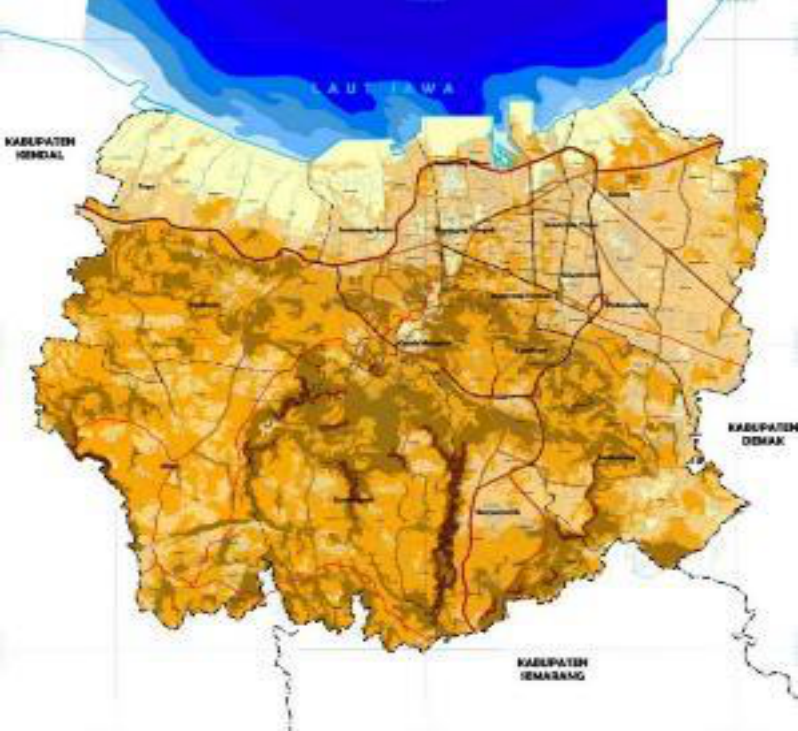
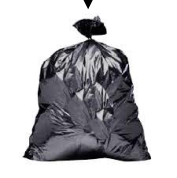
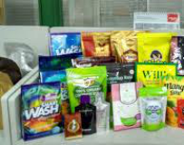

#### **KAJIAN PENGELOLAAN SAMPAH DI TINGKAT HULU** **KOTA SEMARANG**

#### **Badan Perencanaan Pembangunan Daerah** **Pemerintah Kota Semarang** **Tahun 2021**

#### **Kata Pengantar**

Puji Syukur kami panjatkan kehadirat Tuhan Yang Maha Esa atas limpahan rahmat

Nya sehingga “Kajian Pengelolaan Sampah di Tingkat Hulu” dapat diselesaikan. Kajian ini

dilakukan untuk mengetahui status pengurangan sampah saat ini, skenario, dan proyeksi

pengurangan sampah yang optimal dengan tanpa mengurangi kelayakan PSEL Kota Semarang.

Dengan disusunnya kajian ini, arahan kebijakan dan strategi pengurangan sampah yang

optimal telah tersedia. Kebijakan dan strategi tersebut telah mencakup aspek sosial, teknis dan

teknologi, tata kelola, dan pembiayaan. Menjadi tantangan selanjutnya adalah

mengimplementasikan kebijakan dan strategi tersebut agar Kota Semarang dapat mencapai

pengurangan sampah yang optimal. Semoga kajian dapat menjadi acuan bagi seluruh pelaku

pengelolaan sampah di Kota Semarang termasuk masyarakat, swasta, dan sektor informal, yang

tanpa peran sertanya pengurangan sampah yang optimal mustahil dapat diwujudkan.

Kami sadar sepenuhnya bahwa dokumen ini masih jauh dari kesempurnaan karena

keterbatasan data dan informasi. Untuk itu, saran dan masukan dari berbagai pihak sangat

dibutuhkan untuk penyempurnaan dokumen ini. Selaku koordinator penyusunan, Badan

Perencanaan Pembangunan Daerah Kota Semarang mengucapkan terimakasih sehingga kajian

ini dapat selesai sesuai dengan waktu yang telah direncanakan.

Akhirnya, semoga kajian ini bermanfaat untuk semua pihak.

Semarang,  Maret 2021

BAPPEDA Kota Semarang

Dr. BUNYAMIN, M.Pd

NIP.

Laporan Akhir
Kajian Pengelolaan Sampah di Tingkat Hulu di Kota Semarang     - **ii -**

#### **Daftar Isi**

Kata Pengantar ........................................................................................................................... ii

Daftar Isi .................................................................................................................................. iii

Daftar Tabel .............................................................................................................................. vi

Daftar Gambar ....................................................................................................................... viii

BAB I PENDAHULUAN ......................................................................................................... 1

1.1 Latar Belakang ................................................................................................. 1

1.2 Maksud dan Tujuan .......................................................................................... 2

1.2.1 Maksud .......................................................................................................... 2

1.2.2 Tujuan ........................................................................................................... 3

1.2.3 Sasaran .......................................................................................................... 3

1.3 Dasar Hukum.................................................................................................... 3

1.4 Ruang Lingkup ................................................................................................. 5

1.5 Metodologi Penelitian ...................................................................................... 5

1.5.1 Jenis Penelitian.............................................................................................. 5

1.5.2 Model Konseptual ......................................................................................... 6

1.5.3 Jenis, Sumber, Pengumpulan dan Analisa Data............................................ 9

1.6 Sistematika Pelaporan .................................................................................... 13

BAB II GAMBARAN UMUM KOTA SEMARANG DAN PENGELOLAAN

SAMPAHNYA ........................................................................................................................ 15

2.1 Rona Wilayah Kota Semarang ....................................................................... 15

2.1.1 Batas Administratif ..................................................................................... 15

2.1.2 Kondisi Fisik Dasar..................................................................................... 16

2.1.3 Penggunaan Lahan ...................................................................................... 18

Laporan Akhir
Kajian Pengelolaan Sampah di Tingkat Hulu di Kota Semarang     - **iii -**

2.1.4 Kondisi Kependudukan ............................................................................... 19

2.1.5 Kondisi Perekonomian ................................................................................ 22

2.2 Pengelolaan Sampah di Kota Semarang......................................................... 24

2.2.1 Jumlah dan Proyeksi Timbulan Sampah ..................................................... 24

2.2.2 Komposisi Sampah ..................................................................................... 25

2.2.3 Tata Kelola Pengelolaan Sampah ............................................................... 27

2.2.4 Pembiayaan Pengelolaan Sampah............................................................... 31

BAB III KONSEP OPTIMALISASI PENGURANGAN SAMPAH DI TINGKAT HULU . 35

3.1 Kajian Pustaka ................................................................................................ 35

3.1.1 Sistem Pengelolaan Sampah ....................................................................... 35

3.1.2 Ekonomi Sirkuler dalam Pengelolaan Sampah ........................................... 38

3.1.2 Pertukaran Bahan Daur Ulang dan Pemulihan Energi ................................ 40

3.2 Optimasi Pengurangan Sampah di Tingkat Hulu ........................................... 41

3.2.1 Pemilahan dan Pewadahan .......................................................................... 41

3.2.2 Pengumpulan............................................................................................... 47

3.2.3 Pengolahan di Bank Sampah, TPS, atau TPS3R ........................................ 48

3.2.4 Pengangkutan .............................................................................................. 55

BAB IV STATUS DAN PROYEKSI PENGURANGAN SAMPAH DI TINGKAT HULU 56

4.1 Pengurangan Sampah Eksisting ..................................................................... 56

4.1.1 Pembatasan Sampah.................................................................................... 56

4.1.2 Pengurangan Sampah oleh Masyarakat ...................................................... 57

4.2 Skenario dan Proyeksi Pengurangan Sampah ................................................ 61

4.2.1 Pengembangan Skenario Pengurangan Sampah ......................................... 61

4.2.2 Proyeksi Pengurangan Sampah dan Kebijakan Pendukungnya .................. 66

4.2.3 Kebutuhan Sarana Prasarana Pendukung.................................................... 69

BAB V ANALISA TATA KELOLA & PEMBIAYAAN PENGELOLAAN SAMPAH ..... 71

Laporan Akhir
Kajian Pengelolaan Sampah di Tingkat Hulu di Kota Semarang     - **iv -**

5.1 Perbaikan Tata Kelola Pengelolaan Sampah .................................................. 71

5.1.1 Pengumpulan Sampah oleh Pemerintah...................................................... 72

5.1.2 Integrasi Sektor Informal dalam Sistem Pengelolaan Sampah Kota .......... 75

5.1.3 Pengebangan Sistem Insentif dan Disinsentif ............................................. 77

5.2 Alternatif Pembiayaan Sampah ...................................................................... 80

BAB VI PENUTUP ................................................................................................................ 84

6.1 Kesimpulan..................................................................................................... 84

6.2 Rekomendasi .................................................................................................. 85

Daftar Pustaka .......................................................................................................................... 88

Lampiran .................................................................................................................................. 91

Laporan Akhir
Kajian Pengelolaan Sampah di Tingkat Hulu di Kota Semarang     - **v -**

#### **Daftar Tabel**

Tabel 1. 1 Metode pelaksanaan pekerjaan input-proses-output ............................................... 11

Tabel 2. 1 Luasan Kelerengan Tiap Kecamatan Di Kota Semarang ....................................... 18

Tabel 2. 2 Tingkat Kesanggupan Rumah Tangga Di Kota Semarang Tahun 2016 ................. 23

Tabel 2. 3 Kenaikan Angka Timbulan Sampah di Kota Semarang ......................................... 25

Tabel 2. 4 Perkiraan Timbulan Sampah di Kota Semarang sampai Tahun 2040 .................... 25

Tabel 2. 5 Perkiraan Komposisi & Nilai Kalor Sampah Kota Semarang ................................ 26

Tabel 2. 6 Komposisi & Nilai Kalor Sampah Kota Semarang ................................................ 27

Tabel 2. 7 Pembagian Peran dalam Pengelolaan Sampah ....................................................... 29

Tabel 2. 8 Survei Besaran Tarif Iuran Sampah per Rumah Tangga di Kota Semarang .......... 32

Tabel 3. 1 Perbandingan Umur Sampah Organik dan Anorganik ........................................... 43

Tabel 3. 2 Karakteristik Wadah Sampah ................................................................................. 46

Tabel 3. 3 Alternatif-alternatif Jadual Pengumpulan Sampah ................................................. 48

Tabel 3. 4 Golongan Sampah Anorganik ................................................................................. 54

Tabel 4. 1 Pemantauan Kebijakan Pengendalian Penggunaan Plastik di Kota Semarang ....... 57

Tabel 4. 2 Pengurangan Sampah oleh TPS3R di Kota Semarang ........................................... 59

Tabel 4. 3 Data Volume Sampah Melalui Sampling Pemulung ............................................. 60

Tabel 4. 4 Data Rekapitulasi Pengurangan Sampah oleh Pelaku Daur Ulang......................... 61

Tabel 4. 5 Proyeksi Kebutuhan TPS3R Kota Semarang Tahun 2020-2040 ............................ 64

Tabel 4. 6 Kuantifikasi Skenario Pengurangan Sampah Kota Semarang ................................ 65

Tabel 5. 1 Perkiraan Tambahan Biaya Tenaga Kerja Pengumpul Sampah ………………..80

Laporan Akhir
Kajian Pengelolaan Sampah di Tingkat Hulu di Kota Semarang     - **vi -**

Tabel 5. 2 Pendapatan dari Iuran Bulanan untuk Pengumpulan Sampah ................................ 82

Laporan Akhir
Kajian Pengelolaan Sampah di Tingkat Hulu di Kota Semarang     - **vii -**

#### **Daftar Gambar**

Gambar 1. 1 Model Konseptual Optimalisasi Pengolahan Sampah di Tingkat Hulu ................ 7

Gambar 2. 1 Peta Administrasi Kota Semarang ...................................................................... 15

Gambar 2. 2 Peta Topografi Kota Semarang ........................................................................... 17

Gambar 2. 3 Peta Penggunaan Lahan Kota Semarang ............................................................ 19

Gambar 2. 4 Piramida Penduduk Kota Semarang Tahun 2019 ............................................... 20

Gambar 2. 5 Peta Kepadatan Penduduk Kota Semarang ......................................................... 21

Gambar 2. 6 Peta Kepadatan Penduduk Kota Semarang ......................................................... 22

Gambar 2. 7 Skema Tanggung jawab pengelolaan sampah .................................................... 31

Gambar 3. 1 Sampah Organik atau Sampah Basah ................................................................. 42

Gambar 3. 3 Sampah Anorganik atau Sampah Kering ............................................................ 44

Gambar 3. 3 Proses Pemilahan di dalam Sumber Sampah ...................................................... 45

Gambar 3. 4 Ilustrasi Jenis-Jenis Wadah Sampah di dalam dan di luar Rumah ...................... 46

Gambar 3. 5 Contoh Modifikasi Moda Transportasi Sampah ................................................. 47

Gambar 3. 6 Komposting Sistem Aerator Bambu ................................................................... 52

Gambar 3. 7 Pengomposan Metode Takakura Susun .............................................................. 53

Gambar 4. 1 Pertukaran antara Pemulihan Energi, Bahan Daur Ulang, dan Pembuangan

Sampah ..................................................................................................................................... 63

Gambar 4. 2 Proyeksi Pengurangan Sampah (ton) Kota Semarang Tahun 2020-2040 ........... 66

Gambar 4. 3 Proyeksi Pengurangan Sampah (%) Kota Semarang Tahun 2020-2040 ............ 67

Gambar 4. 4 Nilai Kalor Masukan PSEL pada Pengambilan Daur Ulang Skenario Progresif

(kcal/kg) Kota Semarang Tahun 2020-2040 ............................................................................ 68

Laporan Akhir
Kajian Pengelolaan Sampah di Tingkat Hulu di Kota Semarang     - **viii -**

Gambar 5. 1 Diagram Perbandingan Kinerja Tata Kelola Pengumpulan Sampah .................. 73

Gambar 5. 2 Diagram Jejaring Pelaku dalam Rantai Nilai (Value Chain) Daur Ulang di Kota

Semarang Tahun 2021 ............................................................................................................. 76

Gambar 5. 3 Diagram Perbandingan Kinerja Tata Kelola Pengumpulan Sampah, dengan

Integrasi Iuran Bulanan ke dalam Retribusi Sampah ............................................................... 83

Laporan Akhir
Kajian Pengelolaan Sampah di Tingkat Hulu di Kota Semarang     - **ix -**

#### **BAB I** **PENDAHULUAN**

**1.1** **Latar Belakang**

Semarang merupakan salah satu dari lima kota penyumbang sampah plastik laut

terbesar di bagian barat Indonesia (World Bank, 2018). Berdasarkan Rencana Induk

Pengelolaan Sampah yang telah diperbarui, Semarang menghasilkan sekitar 1.200 ton sampah

per hari pada tahun 2016. Total sampah yang diangkut ke TPA oleh layanan kota sekitar 70

80% dari total timbulan sampah. Sekitar 83% dari total wilayah Semarang telah terlayani oleh

pengangkutan sampah kota sementara 17% sisanya tidak terlayani (COWI, 2018).

Sistem pengelolaan sampah saat ini bertumpu pada pengumpulan, pengangkutan dan

pembuangan (Kumpul-Angkut-Buang) meskipun telah ada upaya pemilahan dan daur ulang

secara terbatas. Sistem ini telah memberi beban yang besar kepada TPA Jatibarang. Sebanyak

800-900 ton sampah diangkut dan ditimbun di TPA Jatibarang setiap hari sebagai tempat

pemrosesan akhir [COWI, 2018]. Akumulasi sampah ini menciptakan krisis pada pengelolaan

TPA. Seperti halnya di kota-kota berkembang lainnya, TPA menjadi sulit dikelola dengan

memenuhi standar teknis yang disyaratkan sehingga menyebabkan masalah kesehatan dan

pencemaran lingkungan (Sudibyo, 2017; Lino dan Ismail, 2013). Pengolahan konvensional ini

tidak dapat menyelesaikan masalah sampah karena terbentur ketersediaan ruang, peraturan,

anggaran, dan infrastruktur (Ibrahim, dan Mohamed, 2016; Dong, Trang T.T., 2009; Narayana,

T. 2009).

Untuk mendorong penyelesaian krisis pengelolaan sampah, Presiden menerbitkan

peraturan No. 97 Tahun 2017 tentang Kebijakan dan Strategi Nasional Pengelolaan Sampah

Rumah Tangga dan Sampah Sejenis Sampah Rumah Tangga. Peraturan ini membuat target

pengurangan sampah sebesar 30% dan penanganan sampah sebesar 70% dari sebelum adanya

kebijakan dan strategi nasional pada tahun 2025. Menyadari bahwa beban pemrosesan 70%

sampah masih berisiko apabila diproses secara konvensional, Pemerintah mempercepat

penggunaan teknologi Pengolah Sampah menjadi Energi Listrik (PSEL) Berbasis Teknologi

Ramah Lingkungan. Melalui Perpres No. 35 Tahun 2018, Pemerintah menetapkan Kota

Semarang sebagai salah satu penerima amanat percepatan PSEL.

Laporan Akhir
Kajian Pengelolaan Sampah di Tingkat Hulu di Kota Semarang     - **1 -**

Menanggapi kebijakan nasional dalam pengelolaan sampah, Pemerintah Kota

Semarang telah melakukan beberapa upaya baik dalam pengurangan maupun penanganan

sampah. Dalam hal pengurangan sampah, telah diterbitkan Peraturan Walikota Semarang No.

27 Tahun 2019 tentang Pengendalian Penggunaan Plastik. Pelaku usaha yang meliputi hotel,

restoran dan sejenisnya serta toko modern dilarang menyediakan kantong plastik, pipet minum

plastik, atau Styrofoam. Kota Semarang juga mendorong pembentukan dan operasional Bank

Sampah dan TPS 3R untuk mengurangi sampah sehingga telah terbentuk lebih dari 100 bank

sampah dan 38 TPS 3R (DLH, 2019).

Dalam bidang penanganan sampah, Kota Semarang telah melakukan kajian Pra-Studi

Kelayakan Proyek Pengolahan Sampah menjadi Energi pada tahun 2019. Studi

merekomendasikan penggunaan teknologi _moving grade incinerator_ agar dapat mengurangi

volume sampah secara signifikan. Meskipun teknologi ini paling sesuai namun biaya _tipping_

_fee_ untuk operasional dan pengembalian investasinya relatif tinggi. Studi ini juga

mengkhawatirkan pengurangan sampah di tingkat hulu yang belum terpetakan status dan

proyeksinya sehingga dapat mempengaruhi asumsi-asumsi mendasar pada pembangunan

PSEL (Cardno, 2019).

Mengingat pengurangan dan penanganan sampah sangat terkait erat dan saling

mempengaruhi maka dipandang penting untuk menyusun kajian pengelolaan sampah di tingkat

hulu. Kajian ini dilakukan untuk mengetahui status pengurangan sampah saat ini, skenario dan

proyeksi pengurangan sampah yang optimal dengan tanpa mengurangi kelayakan PSEL.

Berbasis kajian ini diharapkan dapat ditetapkan kebijakan yang komprehensif dan strategis

tentang pengurangan dan penanganan sampah yang harmonis.

**1.2** **Maksud dan Tujuan**

1.2.1 Maksud

Kajian ini dimaksudkan untuk memberikan referensi data dan informasi pengurangan

sampah di tingkat hulu agar skenario penanganan sampah khususnya pengembangan PSEL

dapat direncanakan lebih efektif dan efisien.

Laporan Akhir
Kajian Pengelolaan Sampah di Tingkat Hulu di Kota Semarang     - **2 -**

1.2.2 Tujuan

Kegiatan kajian ini bertujuan untuk menyediakan informasi yang memadai mengenai

status dan optimalisasi potensi pengurangan sampah di tingkat hulu yang mendukung

pengembangan PSEL. Kajian juga memberikan rekomendasi mengenai strategi optimalisasi

pengurangan sampah, tata kelola _(governance)_, dan pembiayaannya.

1.2.3 Sasaran

Untuk mencapai tujuan di atas, ditetapkan sasaran-sasaran sebagai berikut:

1. Menghitung status pengurangan sampah baik dari pembatasan maupun dari

pengambilan bahan daur ulang,

2. Membuat skenario dan proyeksi pengurangan sampah yang optimal dan

mendukung kelayakan PSEL,

3. Mengidentifikasi, mendeskripsikan, dan menganalisis kelemahan tata kelola

dan pembiayaan pengurangan dan penanganan sampah saat ini, dan

4. Merekomendasikan strategi tata kelola dan pembiayaan untuk mencapai

pengurangan yang optimal.

**1.3** **Dasar Hukum**

Dalam proses penyusunan Kajian Pengelolaan Sampah di Tingkat Hulu di Kota

Semarang Tahun 2021 mengacu pada peraturan, standar, pedoman, kebijakan teknis yang

relevan dan terkait substansi pengelolaan sampah rumah tangga dan sampah sejenis sampah

rumah tangga. Acuan dasar hukum tersebut sekurang-kurangnya mencakup:

1. Undang – Undang RI Nomor 16 Tahun 1950 Tentang Pembentukan Daerah

Kota Besar dalam Lingkungan Provinsi Jawa Timur, Jawa Tengah, Jawa Barat

dan Daerah Istimewa Yogyakarta; Undang-Undang Nomor 18 Tahun 2008

tentang Pengelolaan Sampah

2. Undang-Undang Nomor 18 Tahun 2008 tentang Pengelolaan Sampah;

3. Undang-Undang Nomor 32 Tahun 2009 tentang Perlindungan dan Pengelolaan

Lingkungan Hidup;

Laporan Akhir
Kajian Pengelolaan Sampah di Tingkat Hulu di Kota Semarang     - **3 -**

4. Undang-Undang Nomor 23 Tahun 2014 tentang Pemerintahan Daerah

sebagaimana telah diubah beberapa kali, terakhir dengan Undang- Undang

Nomor 9 Tahun 2015 tentang Perubahan Kedua Atas Undang- Undang Nomor

23 Tahun 2014 tentang Pemerintahan Daerah;

5. Peraturan Pemerintah Republik Indonesia Nomor 81 tahun 2012 tentang

pengelolaan sampah rumah tangga dan sampah sejenis sampah rumah tangga.

6. Peraturan Presiden Republik Indonesia Nomor 97 Tahun 2017 tentang

Kebijakan dan Strategi Nasional Pengelolaan Sampah Rumah Tangga dan

Sampah Sejenis Sampah Rumah Tangga;

7. Peraturan Presiden Republik Indonesia Nomor 83 Tahun 2018 tentang

Penanganan Sampah Laut;

8. Peraturan Menteri Pekerjaan Umum Republik Indonesia Nomor

03/PRT/M/2013 tentang Penyelenggaraan Prasarana dan Sarana Persampahan

dalam Penanganan Sampah Rumah Tangga dan Sampah Sejenis Sampah

Rumah Tangga

9. Peraturan Menteri Negara Lingkungan Hidup Republik Indonesia Nomor 13

Tahun 2012 tentang Pedoman Pelaksanaan _Reduce, Reuse,_ dan _Recycle_ melalui

Bank Sampah;

10. Peraturan Daerah Kota Semarang Nomor 13 Tahun 2006 Tentang Pengendalian

Lingkungan Hidup;

11. Peraturan Daerah Kota Semarang Nomor 6 Tahun 2012 tentang Pengelolaan

Sampah;

12. Peraturan Daerah Kota Semarang Nomor 14 Tahun 2016 tentang Pembentukan

dan Susunan Perangkat Daerah Kota Semarang;

13. Peraturan Walikota Semarang Nomor 27 Tahun 2019 tentang Pengendalian

Penggunaan Plastik.

14. SNI 3242:2008 tentang Pengelolaan Sampah di Permukiman

15. SNI 19-3964-1994 Metode pengambilan dan pengukuran contoh timbulan dan

komposisi sampah perkotaan.

Beberapa studi–studi terdahulu yang dapat diacu dalam melaksanakan Jasa Konsultasi

Kajian Pengelolaan Sampah di Tingkat Hulu di Kota Semarang Tahun 2021 yakni:

Laporan Akhir
Kajian Pengelolaan Sampah di Tingkat Hulu di Kota Semarang     - **4 -**

1. Rencana Induk Pengelolaan Sampah Kota Semarang yang diperbaharui Tahun

2018.

2. Kajian Pengelolaan Sampah Berbasis Masyarakat Kota Semarang 2018.

3. Evaluasi Kebijakan dan Strategi Pengelolaan Sampah Daerah (Jakstrada) Kota

Semarang 2018-2020.

4. Studi Pra-Kelayakan Proyek PSEL tahun 2019.

**1.4** **Ruang Lingkup**

Pelaksanaan studi ini mencakup beberapa substansi di bawah ini:

1. Perhitungan status dan potensi pengurangan sampah yang optimal di tingkat

hulu Kota Semarang. Pengurangan sampah optimal mempertimbangkan nilai

kalor minimal yang disyaratkan PSEL;

2. Memetakan keterbatasan dan kelemahan kebijakan dan strategi pengelolaan

sampah saat ini dalam mencapai skenario pengurangan sampah yang optimal;

3. Rekomendasi perbaikan kebijakan dan strategi pengelolaan sampah yang

mendukung pengurangan sampah yang optimal di tingkat hulu Kota Semarang.

Lingkup Wilayah dalam pelaksanaan studi ini adalah Kota Semarang dengan luas

wilayah 373,70 Km2. Secara administratif Kota Semarang terbagi menjadi 16 Kecamatan dan

177 Kelurahan. Bank sampah yang akan dikaji adalah seluruh bank sampah dan TPS 3R di

Kota Semarang.

**1.5** **Metodologi Penelitian**

1.5.1 Jenis Penelitian

Kajian ini merupakan penelitian kombinasi antara pendekatan kualitatif dan kuantitatif.

Pendekatan kualitatif digunakan untuk mengkaji sistem pengelolaan sampah saat ini, tata

kelola, dan pembiayaannya. Deskripsi sistem, tata kelola, dan pembiayaan pengelolaan sampah

akan dibandingkan dengan prinsip dan hierarki pengelolaan sampah mengacu pada ekonomi

sirkuler. Pendekatan ekonomi sirkuler dipilih karena akan menekan konsumsi,

mengoptimalkan siklus sumber daya baru, serta menghemat biaya pengolahan akhir. Hasil

analisa kesenjangan antara sistem pengelolaan sampah saat ini dan pendekatan ekonomi

Laporan Akhir
Kajian Pengelolaan Sampah di Tingkat Hulu di Kota Semarang     - **5 -**

sirkuler akan di analisa sebagai strategi perbaikan sistem, tata kelola, dan pembiayaan

pengelolaan sampah.

Pendekatan kuantitatif menekankan aspek pengukuran, perhitungan, dan kepastian data

numerik. Pada kajian ini, pendekatan kuantitatif digunakan untuk mengukur jumlah timbulan,

komposisi, tingkat pengurangan saat ini, trade-off antara pemanfaatan daur ulang dan

pemulihan energi dan potensi pengurangan optimal. Hasil dari analisa kuantitatif ini mencakup:

     - Jumlah dan komposisi timbulan sampah rumah tangga dan sampah sejenis

sampah rumah tangga di Kota Semarang,

     - Jumlah pengurangan sampah yang dilakukan aktor-aktor saat ini,

     - Formulasi pengurangan optimal dengan mempertimbangkan nilai ekonomi dan

treshold nilai kalor untuk PSEL, dan

     - Skenario dan potensi pengurangan sampah optimal.

1.5.2 Model Konseptual

Model konseptual merupakan suatu model yang menunjukkan konsep hubungan logis

antara variabel yang telah diidentifikasi penting untuk menganalisis masalah penelitian

(Sinulingga, 2014). Model konseptual disusun berdasarkan teori-teori yang telah ada dan hasil

hasil penelitian terdahulu. Variabel-variabel yang diidentifikasi merupakan satu kesatuan yang

bermanfaat dalam menganalisis masalah penelitian.

Kajian ini bertujuan untuk mengoptimalkan pengurangan sampah (termasuk

pengumpulan material daur ulang) dengan sinergi terhadap pemulihan energi. Tujuan akhir

dari upaya ini adalah membangun sistem pengelolaan yang dapat mengurangi volume akhir

sampah, setelah melalui berbagai proses pengolahan. Dengan tujuan tersebut maka prioritas

pengolahan dilakukan dengan urutan prioritas: pengurangan timbulan, penggunaan kembali,

daur ulang, pemulihan energi, dan pemrosesan akhir. Deskripsi masing-masing pengolahan

prioritas adalah:

1. Pengurangan sampah merupakan upaya mencegah agar sampah tidak timbul.

Hal ini dilakukan melalui pembatasan timbulan, larangan penggunaan jenis

jenis sampah tertentu, dan upaya-upaya persuasif untuk mencegah penggunaan

barang yang mudah menjadi sampah. Perhitungan dapat dilakukan melalui

asumsi pembatasan oleh peraturan-peraturan yang berlaku.

Laporan Akhir
Kajian Pengelolaan Sampah di Tingkat Hulu di Kota Semarang     - **6 -**

2. Penggunaan kembali merupakan upaya untuk menggunakan benda atau barang

yang seharusnya menjadi sampah untuk digunakan kembali agar

memperpanjang siklus hidupnya. Penggunaan kembali dilakukan tanpa proses

perubahan fisika maupun kimia serta sesuai dengan fungsi asal barang.

3. Daur ulang merupakan proses pengolahan sampah menjadi barang baru yang

dapat berbeda dengan fungsi asalnya melalui pengolahan fisika maupun kimia.

4. Pemulihan energi merupakan proses pengolahan sampah untuk dimanfaatkan

nilai kalornya.

5. Pemrosesan akhir merupakan pengembalian sampah kembali ke media alam

dengan aman.

Hierarki pengolahan sampah ini dijelaskan dalam model konseptual sebagai

berikut:

**Gambar 1. 1 Model Konseptual Optimalisasi Pengolahan Sampah di Tingkat Hulu**

Model hierarki pengolahan sampah ini memaksimalkan pengurangan volume sampah

dari atas menuju ke piramida bawah. Proses pengurangan ini memberi keuntungan ekonomi

Laporan Akhir
Kajian Pengelolaan Sampah di Tingkat Hulu di Kota Semarang     - **7 -**

baik langsung misalnya melalu pengurangan konsumsi SDA dan nilai ekonomi material

maupun tidak langsung misal misalnya penghindaran biaya transportasi, penyimpanan, dan

pengolahan. Hal ini ditunjukkan dengan panah hijau. Namun pengurangan volume sampah juga

terdapat batasan atau limitasi berupa nilai kalor minimal agar sampah dapat dipulihkan

energinya atau bahkan jika hanya di insinerasi saja.

Nilai ekonomi sampah dapat dihitung dari sampah yang dikumpulkan dan harga

masing-masing jenis sampah. Potensi nilai ekonomi dapat diperhitungkan dari potensi sampah

yang dapat dijual untuk daur ulang meskipun tingkat pengumpulan lebih rendah dari

potensinya (M. Asim et al, 2012; Mahyudin, Hadi dan Purwanto, 2015). Nilai ekonomi sampah

secara keseluruhan merupakan jumlah jenis sampah yang dapat didaur dikali harga jenis

sampah. Nilai ekonomi ini secara matematis dijelaskan pada persamaan berikut:

𝐸𝑉𝑟= ∑ 𝑛𝑖=1 𝑚𝑓𝑖. 𝑞 . 𝑝𝑟𝑖 (1)

Dimana 𝐸𝑉𝑟 adalah nilai ekonomi sampah yang potensial didaur ulang sedangkan 𝑚𝑓𝑖

adalah fraksi sampah jenis i dan 𝑝𝑟𝑖 merupakan harga sampah jenis i apabila didaur ulang.

𝐿𝐻𝑉𝑤𝑒𝑡= 𝐻𝐻𝑉𝑑𝑎𝑓 . (1 −(𝑓𝑤 . 𝐴𝑤)) −(𝑓𝑤. 𝛾)

(2)

Dimana HHVdaf adalah Higher Heating Value sampah kering dan bebas abu dan 𝛾

merupakan energi yang digunakan untuk menguapkan air pada suhu 200C dan setara dengan

2,45 GJ/ton.

Fraksi Abu dalam material basah (Aw) dihitung dengan persamaan sebagai berikut:

𝐴𝑤= (1 −𝑓𝑤). 𝐴𝑑 (3)

Dimana 𝑓𝑤 adalah fraksi air dalam material basah dan 𝐴𝑑 merupakan fraksi abu dalam

material kering. Seluruh fraksi tidak memiliki satuan. Jumlah energi panas yang dihasilkan dari

pembakaran sampah di tungku (kiln) diperhitungkan dengan persamaan:

𝐸ℎ= ∑ 𝑛𝑖=1 𝐿𝐻𝑉𝑖. 𝑚𝑓𝑖. 𝑞 (4)

Dimana 𝐸ℎ adalah potensi energi panas (Gj), 𝐿𝐻𝑉𝑖 merupakan LHVwet jenis sampah

i, 𝑚𝑓𝑖 merupakan fraksi sampah jenis i terhadap jumlah sampah keseluruhan dalam kondisi

basah dan 𝑞 jumlah seluruh sampah dalam kondisi basah.

Laporan Akhir
Kajian Pengelolaan Sampah di Tingkat Hulu di Kota Semarang     - **8 -**

Nilai ekonomi jenis sampah i dari pemanfaatan energi panas diperhitungkan dengan

persamaan:

𝐸𝑉ℎ𝑖= 𝐸ℎ𝑖. 𝑝ℎ (5)

Dimana 𝐸𝑉ℎ𝑖 adalah nilai ekonomi energi panas dan 𝐸ℎ𝑖 adalah energi panas sampah

jenis i dan 𝑝ℎ merupakan harga listrik dari PSEL.

𝐸ℎ𝑠≥3.000 𝑘𝑐𝑎𝑙/𝑘𝑔 (6)

Dimana 𝐸ℎ𝑠 adalah potensi energi dari sampah-sampah jenis tertentu setelah

dibandingkan dengan nilai ekonomi jika dilakukan daur ulang. Pemanfaatan sampah untuk

material daur ulang tidak dapat menurunkan nilai kalor sampai dibawah ambang batas

(threshold) sehingga jenis sampah tertentu harus dipertahankan untuk menjamin nilai

kandungan kalor ini. Jenis sampah yang dipertahankan adalah jenis dengan nilai paling rendah

untuk pemanfaatan daur ulang sehingga diperoleh manfaat yang paling optimal. Nilai ekonomi

optimal diperoleh jika jumlah nilai ekonomi energi (EVh) dan daur ulang sampah (EVr)

mencapai nilai tertinggi dengan energi panas sampah tertentu (Ehs) tidak kurang dari 3.000

kcal/Kg.

1.5.3 Jenis, Sumber, Pengumpulan dan Analisa Data

Untuk pendekatan kuantitatif dengan tujuan menghitung tingkat pengurangan sampah

saat ini dan pengurangan sampah optimal tanpa mengurangi kelayakan pemulihan energi maka

jenis dan sumber data yang dibutuhkan adalah:

1. Jumlah timbulan sampah saat ini. Data ini merupakan data sekunder atau data

perhitungan dari jumlah penduduk dikali jumlah rerata timbulan sampah.

2. Data komposisi sampah. Data komposisi sampah diusahakan melalui data sekunder

namun apabila tidak diperoleh sesuai dengan kebutuhan maka akan dilakukan

dengan survei primer.

3. Data pengurangan sampah saat ini. Diperoleh dari data sekunder penelitian

terdahulu, laporan kinerja SKPD terkait, dan dapat diperoleh melalui survei dari

sumber-sumber pengurangan sampah.

Laporan Akhir
Kajian Pengelolaan Sampah di Tingkat Hulu di Kota Semarang     - **9 -**

4. Nilai kalor jenis-jenis sampah. Data nilai kalor jenis-jenis sampah dibutuhkan untuk

mengonversi nilai kalor sampah. Jenis data yang dibutuhkan adalah data sekunder

yang akan diperoleh dari penelitian-penelitian terdahulu.

5. Harga material daur ulang. Data ini digunakan untuk mengonversi nilai ekonomi

sampah daur ulang. Jenis data yang dibutuhkan adalah data primer dari wawancara

dengan pemulung namun demikian data sekunder akan digunakan sebagai

pembanding.

Pendekatan kualitatif membutuhkan data dan informasi meliputi:

1. Sistem pengelolaan sampah saat ini. Informasi ini diperoleh dari peraturan

perundang-undangan yang berlaku dan dari laporan kajian terdahulu.

2. Kinerja sistem pengelolaan sampah saat ini. Informasi ini diperoleh melalui data

primer baik di tingkat sumber sampah, pengumpulan, maupun pengangkutan

sampah.

3. Prinsip-prinsip pengelolaan sampah dengan pendekatan ekonomi sirkuler.

Informasi ini diperoleh dari kajian-kajian terdahulu baik di wilayah Kota Semarang,

Indonesia maupun luar negeri. Rujukan utama informasi ini adalah artikel ilmiah

yang terpercaya misalnya dari Science Direct maupun Scopus.

Dari kebutuhan data di atas, pengumpulan data sekunder akan dilakukan dengan

meminta langsung kepada sumber data dan atau menukil dari dokumen kajian dan penelitian.

Sumber data akan dicantumkan. Data sekunder dikumpulkan dengan dua cara yakni:

1. Wawancara, metode wawancara akan digunakan untuk memperoleh data mengenai

klasifikasi sampah terutama dari perspektif daur ulang. Peneliti akan melakukan

wawancara kepada pemulung, bank sampah dan TPS 3R dengan panduan untuk

wawancara terlampir.

2. Survei dan Sampling. Metode survei akan digunakan untuk mengetahui data yang

jumlah populasinya sedikit. Dalam penelitian ini sasarannya adalah TPS 3R dan

bank sampah. Sedangkan metode sampling akan dilakukan untuk memperoleh

informasi jumlah pengurangan sampah dengan populasi banyak seperti pemulung.

Sampling akan dilakukan untuk mengetahui komposisi sampah hanya jika tidak ada

penelitian terdahulu yang reliabel. Jika dilakukan sampling contoh sampah maka

metode sampling dilakukan dengan mengacu pada Standar Nasional Indonesia No.

Laporan Akhir
Kajian Pengelolaan Sampah di Tingkat Hulu di Kota Semarang     - **10 -**

19-3964-1994 tentang metode untuk mengumpulkan dan mengukur timbulan

sampah perkotaan.

3. Kajian Pustaka (Desk Study). Studi pustaka merupakan pengumpulan dan

peninjauan informasi yang sudah tersedia tentang suatu situs, dan dilakukan pada

tahap awal penilaian lokasi untuk menginformasikan dan memandu penyelidikan

lebih lanjut. Studi pustaka juga mencakup observasi visual terhadap objek

penelitian namun dalam kajian ini tidak dilakukan. Sumber-sumber pustaka utama

meliputi penelitian-penelitian terdahulu yang diperoleh dari jurnal-jurnal ilmiah.

Analisa dilakukan dengan metode komparatif dengan menggabungkan pendekatan

kuantitatif dan kualitatif. Pendekatan kuantitatif dilakukan untuk menghitung nilai ekonomi

pemrosesan sampah baik daur ulang maupun pemulihan energinya melalui persamaan

persamaan yang dikemukakan pada bagian sebelumnya. Metode kualitatif digunakan untuk

menganalisis aspek lingkungan dan sosial dari pemrosesan sampah. Terhadap data kualitatif

dilakukan pengembangan skala dan bobot. Hasil Analisa kuantitatif dan kualitatif yang telah

diberi bobot digunakan untuk membandingkan pemrosesan sampah dengan dan tanpa

pengambilan material daur ulang. Perbandingan ini mengukur dan menggambarkan tingkat

efisiensi teknis dan efisiensi frontier pada masing-masing skenario.

Metode pelaksanaan pekerjaan penyusunan kajian pengelolaan sampah di tingkat hulu

Kota Semarang secara ringkas ditampilkan dalam tabel input-proses-output mengacu pada

output setiap tujuan sebagai berikut:

**Tabel 1. 1 Metode pelaksanaan pekerjaan input-proses-output**

|1|status pengurangan sampah baik dari pembatasan maupun dari pengambilan bahan daur ulang|Col3|Col4|
|---|---|---|---|
|**MASUKAN**|**MASUKAN**|**PROSES**|**OUTPUT**|
|`o` Jumlah timbulan sampah `o` Pembatasan sampah plastik single use `o` Survei pengambilan bahan daur ulang oleh BS dan TPS 3R `o` Sampling pengambilan bahan daur ulang oleh pemulung|`o` Jumlah timbulan sampah `o` Pembatasan sampah plastik single use `o` Survei pengambilan bahan daur ulang oleh BS dan TPS 3R `o` Sampling pengambilan bahan daur ulang oleh pemulung|`o` Perhitungan agregat/absolut dan relatif (%) `o` Konversi nilai ekonomi|`o` Tingkat pengurangan sampah saat ini `o` Hasil dalam ton per tahun, rupiah, dan %|

Laporan Akhir
Kajian Pengelolaan Sampah di Tingkat Hulu di Kota Semarang - **11 -**

|2|skenario dan proyeksi pengurangan sampah yang optimal dan mendukung kelayakan PSEL|Col3|Col4|
|---|---|---|---|
|**MASUKAN**|**MASUKAN**|**PROSES**|**OUTPUT**|
|`o` Jumlah dan komposisi timbulan sampah `o` Nilai kalor setiap jenis sampah `o` Nilai ekonomi bahan daur ulang|`o` Jumlah dan komposisi timbulan sampah `o` Nilai kalor setiap jenis sampah `o` Nilai ekonomi bahan daur ulang|`o` Analisa trade-off daur ulang dan energi `o` Analisa skenario pengurangan sampah|Formulasi- formulasi komposisi bahan daur ulang yang dapat diambil|
|`o` Jumlah dan komposisi timbulan sampah `o` Formulasi-formulasi komposisi bahan daur ulang yang dapat diambil `o` Proyeksi penduduk akhir tahun perencanaan `o` Nilai ekonomi bahan daur ulang|`o` Jumlah dan komposisi timbulan sampah `o` Formulasi-formulasi komposisi bahan daur ulang yang dapat diambil `o` Proyeksi penduduk akhir tahun perencanaan `o` Nilai ekonomi bahan daur ulang|`o` Perhitungan agregat/absolut dan relatif (%) `o` Konversi nilai ekonomi |`o` Tingkat pengurangan sampah yang akan datang `o` Hasil dalam ton per tahun, rupiah, dan %|

|3|Kelemahan tata kelola dan pembiayaan pengurangan dan penanganan sampah saat ini|Col3|Col4|
|---|---|---|---|
|**MASUKAN**|**MASUKAN**|**PROSES**|**OUTPUT**|
|`o` Rencana Induk Pengelolaan Sampah Kota Semarang yang diperbaharui Tahun 2018. `o` Kajian Pengelolaan Sampah Berbasis Masyarakat Kota Semarang 2018. `o` Evaluasi Kebijakan dan Strategi Pengelolaan Sampah|`o` Rencana Induk Pengelolaan Sampah Kota Semarang yang diperbaharui Tahun 2018. `o` Kajian Pengelolaan Sampah Berbasis Masyarakat Kota Semarang 2018. `o` Evaluasi Kebijakan dan Strategi Pengelolaan Sampah|`o` Desk Study `o` Analisa komparatif terhadap kriteria|Potensi perbaikan sistem pengelolaan sampah saat ini|

Laporan Akhir
Kajian Pengelolaan Sampah di Tingkat Hulu di Kota Semarang - **12 -**

|4|Rekomendasi kebijakan dan strategi yang mendukung peningkatan pengurangan sampah di tingkat hulu|Col3|Col4|
|---|---|---|---|
|**MASUKAN**|**MASUKAN**|**PROSES**|**OUTPUT**|
|`o` Potensi perbaikan sistem pengelolaan sampah saat ini|`o` Potensi perbaikan sistem pengelolaan sampah saat ini|`o` Desk Study `o` Analisa komparatif terhadap kriteria `o` FGD|Rekomendasi perbaikan sistem, tata kelola, dan pembiayaan pengelolaan sampah|

_Sumber: Analisis Penyusun, 2021_

**1.6** **Sistematika Pelaporan**

Sistematika penulisan laporan akhir pekerjaan penyusunan kajian pengelolaan sampah

di tingkat hulu Kota Semarang tahun anggaran 2021 adalah sebagai berikut:

BAB 1 PENDAHULUAN

Bab ini menguraikan tentang latar belakang, maksud dan tujuan, dasar hukum, ruang

lingkup (wilayah dan materi), metodologi penelitian, serta sistematika penulisan

laporan.

BAB 2 GAMBARAN UMUM KOTA SEMARANG DAN PENGELOLAAN

SAMPAHNYA

Bab ini menguraikan profil Kota Semarang secara umum serta sistem pengelolaan

sampah di Kota Semarang. Rona wilayah Kota Semarang mendeskripsikan mengenai

batas administrasi, kondisi fisik geografis, penggunaan lahan, kependudukan, dan sosial

ekonomi. Sistem pengelolaan sampah membahas jumlah dan proyeksi timbulan

sampah, komposisi, tata kelola, dan pembiayaannya.

Laporan Akhir
Kajian Pengelolaan Sampah di Tingkat Hulu di Kota Semarang     - **13 -**

BAB 3 KONSEP OPTIMALISASI PEGURANGAN SAMPAH DI TINGKAT HULU

Bab ini menguraikan kajian pustaka tentang sistem pengelolaan sampah, ekonomi

sirkuler dalam pengelolaan sampah, dan pemulihan energi dari sampah perkotaan

sebagai dasar dalam mengkaji optimalisasi pengurangan sampah di Kota Semarang.

Bagian berikutnya mengonsepsikan sistem pengelolaan pengurangan sampah di tingkat

hulu yang optimal.

BAB 4 STATUS & PROYEKSI PENGURANGAN SAMPAH DI KOTA

SEMARANG

Bab ini menjelaskan hasil kajian tentang status dan proyeksi pengurangan sampah.

Perhitungan dilakukan dari pelaku pengurangan tangan pertama untuk menghindari

perhitungan ganda. Bagian ini juga menjelaskan tentang skenario dan proyeksi

pengurangan sampah sampai akhir tahun perencanaan.

BAB 5 ANALISA TATA KELOLA DAN PEMBIAYAAN PENGELOLAAN

SAMPAH

Bab ini menguraikan analisa kelemahan tata kelola pengelolaan sampah saat ini dan

usulan perbaikannya. Karena perubahan tata kelola memberi konsekuensi terhadap

pembiayaan maka usulan sumber pembiayaan juga dibahas.

BAB 6 PENUTUP

Menjelaskan kesimpulan menjelaskan tentang temuan dan capaian pengurangan

berdasarkan skenario optimal. Untuk mencapai skenario pengurangan optimal,

direkomendasi sistem pengelolaan di tingkat hulu, jenis-jenis sampah yang sebaiknya

dipulihkan, perbaikan tata kelola, dan perbaikan pembiayaan.

Laporan Akhir
Kajian Pengelolaan Sampah di Tingkat Hulu di Kota Semarang - **14 -**

#### **BAB II** **GAMBARAN UMUM KOTA SEMARANG DAN** **PENGELOLAAN SAMPAHNYA**

**2.1** **Rona Wilayah Kota Semarang**

2.1.1 Batas Administratif

Kota Semarang terletak antara garis 6°50' - 7°10' Lintang Selatan dan garis 109°35 

110°50' Bujur Timur. Ketinggian Kota Semarang terletak antara 0,75 sampai dengan 348,00 di

atas garis pantai.

**Gambar 2. 1 Peta Administrasi Kota Semarang**

Secara administrasi Kota Semarang dibagi menjadi 16 wilayah kecamatan dengan

jumlah kelurahan sebanyak 177 kelurahan. Luas Wilayah Kota Semarang adalah 373,70 km [2],

dengan batas administrasi sebagai berikut :

Sebelah barat : Kabupaten Kendal

Sebelah timur : Kabupaten Demak

Sebelah selatan : Kabupaten Semarang

Laporan Akhir
Kajian Pengelolaan Sampah di Tingkat Hulu di Kota Semarang     - **15 -**

Sebelah Utara : Laut Jawa

2.1.2 Kondisi Fisik Dasar

Kota Semarang memiliki karakteristik topografi yang unik, yaitu berupa daerah pantai

dan daerah perbukitan. Elevasi topografi berada pada ketinggian antara 0,75 meter sampai

sekitar 350 meter di atas permukaan laut. Kota Semarang mempunyai ketinggian sekitar 0.75

348 meter di atas permukaan laut. Ketinggian 0.75-90.5 meter termasuk dalam kawasan Pusat

Kota Semarang (Dataran Rendah Semarang Bagian Utara) yang diwakili oleh titik tinggi di

Daerah Pantai Pelabuhan Tanjung Mas, Simpang Lima, Candibaru. Sedangkan, ketinggian

90.5-348 meter terletak pada daerah pinggir Kota Semarang, yang terbesar di sepanjang arah

mata angin yang diwakili oleh titik tinggi yang berlokasi di Jatingaleh dan Gombel, Semarang

Selatan, Tugu, Mijen dan Gunungpati.

1. Kondisi Topografi Kota Semarang terdiri dari

a. Dataran pesisir pantai : 1% dari luas wilayah total dengan ketinggian wilayah

0-0,75 mdpl

b. Dataran rendah : 33% dari luas wilayah total dengan ketinggian wilayah

0,75-5 mdpl

c. Dataran tinggi : 66% dari luas wilayah total dengan ketinggian wilayah

5- 348 mdpl

2. Kondisi lereng tanah kota Semarang dibagi menjadi 4 (empat) jenis kelerengan

yaitu:

a. Lereng I (0-2 %), luasan wilayah Kota Semarang dengan kelerengan sebesar 0

2% adalah sebesar 16574,6 Ha (43%). Sebaran wilayah dengan tingkat

kelerengan ini sebagian besar meliputi kecamatan Genuk Pedurungan,

Gayamsari, Semarang Timur, Semarang Utara dan Tugu serta sebagian wilayah

Kecamatan Tembalang Banyumanik dan Mijen.

b. Lereng II (2-15 %), dengan luas wilayah sebesar 14.090,5 Ha (37%). Wilayah

di Kota Semarang dengan tingkat kelerengan ini meliputi kecamatan Semarang

Barat, Semarang Selatan, candisari, Gajahmungkur, Gunungpati dan Ngaliyan.

Laporan Akhir
Kajian Pengelolaan Sampah di Tingkat Hulu di Kota Semarang     - **16 -**

**Gambar 2. 2** **Peta Topografi Kota Semarang**

_Sumber: Materi Teknis Peninjauan Kembali RTRW Kota Semarang, 2016_

c. Lereng III (15-40 %), meliputi wilayah di sekitar Kaligarang dan Kali Kreo

(Kecamatan Gunungpati), sebagian wilayah Kecamatan Mijen (daerah

Wonoplumbon), sebagian wilayah Kecamatan Banyumanik dan Kecamatan

Candisari dengan luas keseluruhan sebesar 7050,8 Ha (18%).

d. Lereng IV (> 40 %) meliputi sebagian Wilayah Banyumanik (sebelah tenggara),

dan sebagian Wilayah Kecamatan Gunungpati, terutama di sekitar Kaligarang

dan Kali Kripik yang memiliki keseluruhan luasan sebesar 766,7 Ha (2%).

Laporan Akhir
Kajian Pengelolaan Sampah di Tingkat Hulu di Kota Semarang - **17 -**

**Tabel 2. 1 Luasan Kelerengan Tiap Kecamatan Di Kota Semarang**

|NO|KECAMATAN|LUAS (Ha)|Col4|Col5|Col6|Col7|
|---|---|---|---|---|---|---|
|**NO** |**KECAMATAN** |**0 - 2 %**  |**2- 15 %**  |**15 – 25 %**  |**25 – 40 %**  |**> 40 %**  |
|1  |Banyumanik  |971,727  |821,274  |864,678  |267,945  |165,162  |
|2  |Candisari  |2,014  |455,936  |104,410  |85,025  |12,486  |
|3  |Gajah Mungkur  |202,011  |409,329  |230,204  |20,295  |78,937  |
|4  |Gayamsari  |643,486  |-  |-  |-  |-  |
|5  |Genuk  |2.729,446  |-  |-  |-  |-  |
|6  |Gunung Pati  |342,049  |3.724,407  |1.549,748  |219,392  |305,379  |
|7  |Mijen  |453,398  |4.279,242  |530,916  |27,663  |88,003  |
|8  |Ngaliyan  |484,983  |2.219,670  |1.496,318  |286,913  |-  |
|9  |Pedurungan  |2.198,633  |-  |-  |-  |-  |
|10  |Semarang Timur  |561.73  |-  |-  |-  |-  |
|11  |Semarang Barat  |1.687,099  |297,469  |189,725  |36,125  |-  |
|12  |Semarang Selatan  |505,673  |82,976  |25,209  |-  |-  |
|13  |Semarang Tengah  |535,357  |-  |-  |-  |-  |
|14  |Semarang Utara  |1.702,067  |-  |-  |-  |-  |
|15  |Tembalang  |1.273,399  |1.690,930  |897,174  |167,308  |113,256  |
|16|Tugu|2.834,164|109,956|42,783|-|-|

_Sumber: Hasil interpretasi Peta Kelerengan Kota Semarang_

2.1.3 Penggunaan Lahan

Dari keseluruhan luas lahan di Kota Semarang sebesar 35.007 Ha, penggunaan lahan

yang mendominasi adalah penggunaan lahan untuk bukan tanah sawah atau tanah kering yaitu

sebesar 87% (30.402 Ha), sedangkan 13 % sisanya atau sebesar 4.604 ha merupakan tanah

sawah. Penggunaan tanah bukan sawah atau tanah kering sebagian besar adalah untuk

pekarangan atau bangunan dan halaman sekitar. Sedangkan, untuk tanah sawah didominasi

oleh tanah sawah tadah hujan.

Penggunaan tanah sawah tadah hujan terluas terdapat di Kecamatan Gunungpati yaitu

869,81 Ha, sedangkan penggunaan tanah pekarangan atau bangunan dan halaman sekitar

terluas terdapat di Kecamatan Tembalang yaitu 2.386 Ha. Untuk lebih jelasnya berikut ini tabel

penggunaan lahan/ tanah di masing-masing Kecamatan di Kota Semarang.

Laporan Akhir
Kajian Pengelolaan Sampah di Tingkat Hulu di Kota Semarang     - **18 -**

**Gambar 2. 3 Peta Penggunaan Lahan Kota Semarang**

_Sumber: Materi Teknis Peninjauan Kembali RTRW Kota Semarang, 2016_

2.1.4 Kondisi Kependudukan

_A._ _Jumlah dan Komposisi Penduduk_

Pada tahun 2019, jumlah penduduk di Kota Semarang tercatat sebanyak 1.814.110 jiwa.

Jumlah penduduk di Kota Semarang paling banyak terdapat di Kecamatan Pedurungan sebesar

214.689 jiwa, dan penduduk paling sedikit di Kecamatan Tugu sebesar 33.333 jiwa.

Berdasarkan jenis kelamin, jumlah penduduk laki-laki di Kota Semarang adalah sebesar

889.298 jiwa dan penduduk perempuan sebesar 924.812 jiwa. Sedangkan berdasarkan

kelompok umur, penduduk di Kota Semarang mayoritas berusia produktif (15-64 tahun).

Berdasarkan piramida penduduk di Kota Semarang tahun 2019, dapat diketahui

karakteristik penduduk berdasarkan komposisi umur dan jenis kelaminnya. Piramida penduduk

di Kota Semarang tahun 2019 termasuk ke dalam jenis piramida penduduk _Constrictive_,

dimana sebagian kecil penduduk berada dalam kelompok umur muda, dengan tingkat kelahiran

turun dengan cepat serta tingkat kematian yang rendah.

Laporan Akhir
Kajian Pengelolaan Sampah di Tingkat Hulu di Kota Semarang     - **19 -**

**Gambar 2. 4 Piramida Penduduk Kota Semarang Tahun 2019**

_Sumber: Kota Semarang Dalam Angka Tahun 2020_

Secara historis, penduduk Kota Semarang selama kurun 10 tahun terakhir menunjukkan

kecenderungan yang meningkat. Pada tahun 2010, penduduk Kota Semarang berjumlah

1.527.433 jiwa dengan tingkat pertumbuhan 1,36% per tahun. Pada tahun 2019, jumlah

penduduk meningkat menjadi 1.814.110 jiwa dengan pertumbuhan 1,57% per tahun. Tingkat

pertumbuhan penduduk namun demikian menunjukkan fluktuasi yang berkisar antara 4,7 –

1,57% per tahun.

_B._ _Kepadatan Penduduk_

Dalam kurun waktu 5 tahun (2015-2019). kepadatan penduduk cenderung naik seiring

dengan kenaikan jumlah penduduk. Di sisi lain, penyebaran penduduk di masing-masing

kecamatan belum merata. Kecamatan-kecamatan dengan kepadatan tinggi di Kota Semarang

(lebih dari 10.000 jiwa/km [2] ) antara lain adalah Kecamatan Semarang Selatan, Candisari,

Gayamsari, dan Semarang Utara. Kecamatan dengan kepadatan rendah (dibawah 2.000

jiwa/km [2] ) adalah Kecamatan Mijen dan Kecamatan Tugu.

Kepadatan penduduk berimplikasi pada timbulan sampah per kecamatan dan

penyediaan sarana prasarana. Pada area kepadatan tinggi, timbulan sampah akan lebih tinggi

Laporan Akhir
Kajian Pengelolaan Sampah di Tingkat Hulu di Kota Semarang     - **20 -**

sehingga membutuhkan fasilitas pengumpulan lebih banyak, dan intensitas pengangkutan yang

lebih tinggi. Wilayah dengan kepadatan tinggi juga memiliki kendala dalam penempatan TPS

sampah karena keterbatasan lahan di wilayah perkotaan. Keterlambatan pengangkutan di

wilayah kepadatan tinggi akan berdampak serius terhadap dekomposisi sampah sehingga

menimbulkan bau. Hal ini menjadikan masyarakat enggan menerima penempatan TPS atau

kontainer.

**Gambar 2. 5 Peta Kepadatan Penduduk Kota Semarang**

_Sumber: Materi Teknis Peninjauan Kembali RTRW Kota Semarang, 2016_

_C._ _Proyeksi Penduduk_

Kecenderungan laju pertumbuhan penduduk menjadi dasar perhitungan proyeksi

timbulan sampah sampai dengan akhir tahun perencanaan. Meningkat tingkat pertumbuhan

penduduk menunjukkan penurunan pada delapan tahun antara 2010-2018 dan kemudian

meningkat pada tahun terakhir (2019) maka skenario pertumbuhan penduduk menggunakan

pertumbuhan moderat (rerata pertumbuhan) merujuk pada proyeksi penduduk yang dilakukan

pada dokumen rencana induk pengelolaan sampah Kota Semarang (COWI, 2017).

Dokumen Rencana Induk Pengelolaan Sampah Kota Semarang memproyeksikan

jumlah penduduk pada tahun 2040 sebesar 1.958.552 jiwa. Angka proyeksi pertumbuhan

Laporan Akhir
Kajian Pengelolaan Sampah di Tingkat Hulu di Kota Semarang     - **21 -**

penduduk menggunakan tingkat pertumbuhan 0,88% dan secara gradual menurun menjadi

0,75% pada lima tahun terakhir jangka waktu perencanaan.

**Gambar 2. 6 Peta Kepadatan Penduduk Kota Semarang**

_Sumber: COWI, 2017_

Dengan perkiraan tersebut, perkiraan penduduk tahun 2020 dan 2030 lebih rendah dari

angka perkiraan penduduk BPS yang berjumlah 1.814.110 jiwa (BPS, 2020). Untuk

memperbaiki perkiraan jumlah penduduk sebagai basis perencanaan, diperlukan harmonisasi

antar dokumen perencanaan. Selain itu, mengingat perbedaan jumlah penduduk timbul karena

metode proyeksi maka verifikasi terhadap jumlah penduduk sebaiknya menggunakan hasil

survei SUSENAS 2020.

2.1.5 Kondisi Perekonomian

Kondisi perekonomian mempengaruhi kemampuan belanja konsumsi rumah tangga

sehingga mempengaruhi timbulan sampah. Meskipun hubungan pendapatan per kapita tidak

selalu linear namun pada masyarakat negara berkembang, kenaikan belanja akan meningkatkan

timbulan sampah. Untuk negara-negara maju, telah terbukti sulit untuk tidak menyertakan

timbulan sampah ketika membahas pertumbuhan ekonomi. Oleh karena itu, untuk

mengembangkan sistem timbulan sampah di Kota Semarang di masa mendatang, perlu adanya

Laporan Akhir
Kajian Pengelolaan Sampah di Tingkat Hulu di Kota Semarang     - **22 -**

sebuah skenario profil pertumbuhan timbulan sampah di masa depan di Kota Semarang,

pertumbuhan belanja rumah tangga akan diterapkan

Sebagai pusat perekonomian Jawa Tengah, Kota Semarang memberikan sumbangan

terbesar terhadap perekonomian Jawa Tengah. Secara umum kondisi perekonomian Kota

Semarang telah menunjukkan tanda- tanda perbaikan, seiring dengan peningkatan nilai

nominal PDRB tahun 2019 mencapai 191,547 triliun rupiah, naik sekitar 9,19 dibandingkan

tahun persen sebelumnya. Naiknya nilai PDRB tidak terlepas dari karakteristik Kota Semarang

sebagai pintu gerbang ekonomi Provinsi Jawa Tengah..

Selain menjadi variabel dalam menentukan tingkat timbulan sampah, pendapatan per

kapita juga menunjukkan kemampuan dalam tingkat pembayaran jasa pengelolaan sampah.

Analisa keterjangkauan iuran sampah bagi warga dimulai dengan pengkajian pendapatan

rumah tangga. Dengan demikian penting menganalisis tingkat pendapatan rumah tangga.

Tingkat keterjangkauan iuran pengelolaan sampah (pengumpulan, pengangkutan, dan

pembuangan) untuk rumah tangga, mengasumsikan bahwa tingkat kesanggupan membayar

untuk pelayanan pengelolaan sampah sebesar 1% dari pendapatan rumah tangga. Istilah “iuran’

dalam hal ini dapat merujuk seluruh komponen biaya baik iuran maupun retribusi.

**Tabel 2. 2** **Tingkat Kesanggupan Rumah Tangga Di Kota Semarang Tahun 2016**

|PARAMETER|2015|
|---|---|
|Total belanja konsumsi rumah tangga Semarang, Rp|46.213.000.000.000|
|Jumlah rumah tangga|471.327|
|Jumlah penduduk|1.589.976|
|Per kapita|29.065.219|
|1% kesanggupan membayar untuk pengelolaan dan pembuangan sampah, Rp/tahun/orang|290.652|
|Per rumah tangga|98.048.701|
|1% kesanggupan membayar untuk pengelolaan dan pembuangan sampah, Rp/tahun|980.487|

_Sumber: COWI, 2017_

Laporan Akhir
Kajian Pengelolaan Sampah di Tingkat Hulu di Kota Semarang - **23 -**

Angka pada tabel tidak mencerminkan distribusi pendapatan lintas kelompok

pendapatan rendah, menengah, dan tinggi. Penentuan iuran pada tahap selanjutnya perlu

mempertimbangkan pendapatan pada masing-masing kelompok, lokasi geografis, dan faktor

faktor lain yang biasanya dipertimbangkan dalam penentuan tarif layanan publik.

**2.2** **Pengelolaan Sampah di Kota Semarang**

2.2.1 Jumlah dan Proyeksi Timbulan Sampah

Angka timbulan sampah dapat diperoleh dengan metode pencuplikan (sampling)

maupun menggunakan standar timbulan sampah per kapita. Metode pengambilan dan

pengukuran contoh timbulan dan komposisi sampah perkotaan diatur dalam SNI 19-3964-1994

yang membutuhkan sampel dari setiap jenis sumber sampah. Sementara standar timbulan

sampah nasional memperhitungkan jumlah timbulan sampah per kapita berdasarkan ukuran

jumlah penduduk kota. Standard ini berasumsi bahwa semakin besar jumlah penduduk kota

maka tingkat pendapatan dan konsumsi lebih tinggi sehingga timbulan sampahnya lebih tinggi

pula.

Timbulan sampah di Semarang saat ini diperkirakan mencapai 3,69 liter per orang per

hari, setara dengan sekitar 0,57 kg/orang/hari, termasuk sampah sejenis rumah tangga dari

sumber-sumber non-domestik. Angka-angka ini tidak bereda jauh dari standar timbulan

sampah per kapita untuk kota dengan penduduk di atas 1 juta yakni sebesar 0,6 Kg/orang/hari.

Dengan jumlah penduduk mendekati 2 juta jiwa, angka timbulan ini kemungkinan di bawah

angka sebenarnya. Data perkiraan timbulan sampah Kota Semarang yang digunakan DLH Kota

Semarang pada tahun 2020 mencapai 1.270 ton sampah per hari. Angka ini menggunakan

rerata timbulan per kapita sebesar 0,7 Kg/orang/hari. Dengan mempertimbangkan keadaan

lingkungan Semarang angka-angka tersebut diperkirakan naik dengan meningkatnya

pendapatan dan belanja masyarakat.

Perkembangan yang diantisipasi dari angka timbulan sampah sebagai akibat dari

pertumbuhan ekonomi, diperlihatkan dalam tabel berikut.

Laporan Akhir
Kajian Pengelolaan Sampah di Tingkat Hulu di Kota Semarang     - **24 -**

**Tabel 2. 3 Kenaikan Angka Timbulan Sampah di Kota Semarang**

|PARAMETER|2020|2025|2030|2035|2040|
|---|---|---|---|---|---|
|Pertumbuhan Sampah|2,3%|2,3%|2,0%|1,5%|1,5%|

_Sumber: Perkiraan COWI, 2017_

Perkiraan timbulan sampah seluruh Kota Semarang menggunakan dua variabel yakni

perkiraan jumlah penduduk dan perkiraan rerata timbulan sampah per kapita per hari. Perkiraan

rerata timbulan sampah per kapita per hari dipengaruhi oleh perkiraan pertumbuhan ekonomi

dan belanja masyarakat. Tingkat timbulan sampah untuk Indonesia pada tahun 2025 yang

diprediksi oleh Bank Dunia adalah 0,85 kg/kapita*hari (naik dari level saat ini yaitu 0,5

kg/kapita*hari), yang menunjukkan timbulan sampah yang sedikit lebih rendah dari rerata di

negara lain dalam kelompok pendapatan menengah ke bawah

Perkiraan timbulan sampah Kota Semarang memprediksikan angka timbulan sampah

unit sebesar 0,75 kg/kapita*tahun dibandingkan dengan tingkat yang diprediksi Bank Dunia

sebesar 0,85 kg/kapita*tahun untuk tahun 2025, yang dianggap tinggi dibandingkan kota-kota

yang serupa di kawasan tersebut. Dengan mempertimbangkan variabel-variabel tersebut,

perkiraan timbulan sampah Kota Semarang sampai 2040 per kecamatan di Semarang akan

mencapai gambaran sebagaimana tabel 3.4.

**Tabel 2. 4 Perkiraan Timbulan Sampah di Kota Semarang sampai Tahun 2040**

|PARAMETER|2020|2025|2030|2035|2040|
|---|---|---|---|---|---|
|Ton/hari|1.126|1.316|1.523|1.732|1.938|
|Per kapita – kg/hari|0,68|0,75|0,83|0,90|0,94|

_Sumber: Perkiraan COWI_

2.2.2 Komposisi Sampah

Komposisi sampah sangat esensial dalam analisa pemanfaatan sampah, baik dalam

perspektif daur ulang maupun pemulihan energi. Jenis komposisi sampah yang biasanya

dilaporkan dalam buku-bulu statistik kurang memadai untuk menganalisis pemanfaatan

sampah sebagai bahan daur ulang dan pemulihan energi. Untuk mendukung analisa potensi

daur ulang, komposisi yang lebih detail terhadap jenis bahan dibutuhkan. misalnya sampah

Laporan Akhir
Kajian Pengelolaan Sampah di Tingkat Hulu di Kota Semarang     - **25 -**

jenis plastik, perlu dibagi dalam tipe-tipe lebih rinci mengingat variasi dan harga daur ulang

yang sangat berbeda. Hal sama juga berlaku dalam analisa pemulihan energi. Selain jenis yang

rinci menurut bahan baku yang berasosiasi dengan nilai kalor, komposisi sampah juga

dilengkapi dengan kelembaban agar nilai kalor bersih dapat diperhitungkan.

Pada saat ini, data komposisi yang mengakomodasi kedua aspek daur ulang dan

pemulihan energi diperoleh dari Rencana Induk Pengelolaan Sampah Kota Semarang

sebagaimana ditunjukkan dalam Tabel 3.5. Namun data ini tidak memadai untuk melakukan

analisa lebih dalam. Oleh karena itu, sumber-sumber sekunder yang lebih rinci dibutuhkan

termasuk dari studi-studi persiapan PSEL.

**Tabel 2. 5 Perkiraan Komposisi & Nilai Kalor Sampah Kota Semarang**

|JENIS SAMPAH|BERAT|KELEMBABAN|ZAT PADAT|ABU|BAHAN MUDAH BAKAR|TINGGI KJ/kg|RENDAH KJ/kg|
|---|---|---|---|---|---|---|---|
|Makanan  |61%  |66%  |34%  |13%  |21%  |17000  |1905  |
|Plastik  |16%  |29%  |71%  |8%  |63%  |33000  |20147  |
|Kain  |7%  |33%  |67%  |4%  |63%  |20000  |11793  |
|Kertas dan karton  |11%  |47%  |53%  |6%  |47%  |16000  |6435  |
|Kulit & karet  |1,5%  |11%  |89%  |26%  |63%  |23000  |14267  |
|Kayu  |0%  |35%  |65%  |5%  |60%  |17000  |9310  |
|Logam  |1%  |6%  |94%  |94%  |0%  |0  |-147  |
|Kaca  |2%  |3%  |97%  |97%  |0%  |0  |-73  |
|limbah lembam  |1%|10%|90%|90%|0%|0|-245|
|BERAT  |100%|52.72%|47.29%||||6129  |
|KALOR|||||||6.1|

_Sumber: COWI, 2017_

Nilai kalori sampah Kota Semarang diperkirakan mencapai sekitar 6,1 Mj/kg yang

tergolong rendah daripada nilai operasi minimum untuk alat pembakaran sampah standar (rata

rata setahun lebih dari 6,5 MJ/kg biasanya dikehendaki untuk mempertahankan pembakaran

yang terus-menerus tanpa penggunaan berlebihan dari bahan bakar pendukung berbasis fosil

yang mahal, dan nilai limbah padat perkotaan di negara berkembang adalah 9 – 10 MJ/kg). Ini

merupakan kesimpulan sementara dari Rencana Induk Pengelolaan Sampah Kota Semarang,

yang menjadi bagian yang harus diuji dalam kajian ini.

Laporan Akhir
Kajian Pengelolaan Sampah di Tingkat Hulu di Kota Semarang     - **26 -**

Studi komposisi sampah yang lebih mutakhir dilakukan oleh Cardno (2019) dengan

pembagian menjadi 19 jenis sampah. Komposisi, kandungan energi setiap jenis dan jumlah

energi akhir dari Analisa Tim Penyusun ditunjukkan dalam Tabel berikut sebagai pembanding.

**Tabel 2. 6 Komposisi & Nilai Kalor Sampah Kota Semarang**

|NO|JENIS SAMPAH|%|NILAI KALOR (kcal/Kg)|JUMLAH KALOR (kcal)|
|---|---|---|---|---|
|1|Sampah Makanan|16,88|1.437,86|242,77|
|2|Sampah Kebun|4,73|2.819,02|133,34|
|3|Kaca|1,12|- 174,40|-1,95|
|4|Plastik Film|6,70|11.269,80|755,54|
|5|Plastik Kresek|6,09|11.169,58|680,17|
|6|Plastik Keras/HDPE|2,10|11.682,33|244,90|
|7|Plastik Botol/PET|4,58|5.252,42|240,31|
|8|Kertas|10,94|3.392,21|371,16|
|9|Tetra Pak|0,39|3.359,17|12,99|
|10|Logam|0,44|-35,12|-0,15|
|11|Kain|3,79|3.874,96|146,69|
|12|Elektronik|0,07|-35,12|-0,02|
|13|Bahan Lain Tak Terdegradasi|0,97|4.536,71|44,14|
|14|Inert|16,95|-58,05|-9,84|
|15|Keramik|0,08|-58,05|-0,05|
|16|Pembalut|5,33|-35,12|-1,87|
|17|Kayu|1,56|1.997,45|31,14|
|18|Karet|0,44|7.537,30|33,14|
|19|Organik Campur|16,85|2.768,85|466,49|
||**JUMLAH**|**100,00**||**3.388,89**|

_Sumber: Cardno, 2019_

2.2.3 Tata Kelola Pengelolaan Sampah

Tata kelola _(governance)_ merupakan semua proses pengelolaan - baik yang dilakukan

oleh pemerintah, pasar, atau jaringan - melalui sistem sosial, hukum, norma, kekuasaan atau

bahasa dari masyarakat yang terorganisir. Proses interaksi dan pengambilan keputusan di

Laporan Akhir
Kajian Pengelolaan Sampah di Tingkat Hulu di Kota Semarang     - **27 -**

antara para aktor yang terlibat dalam masalah kolektif yang mengarah pada penciptaan,

penguatan, atau reproduksi norma dan institusi sosial (Mark, 2012). Tata kelola pengelolaan

sampah melibatkan banyak aktor baik pemerintah, masyarakat, swasta, maupun lembaga lain

yang tidak dapat dikategorikan dalam ketiga klasifikasi tersebut.

Untuk mengetahui tata kelola pengelolaan sampah, rujukan yang paling sederhana

adalah peraturan perundang-undangan baik dalam bentuk undang-undang, peraturan

pemerintah, maupun peraturan daerah. UU No. 18 Tahun 2008 dan PP No. 81 Tahun 2012 serta

Peraturan Daerah Kota Semarang No. 6 Tahun 2012 mengatur aktor, sistem hukum, norma,

dan interaksi pengambilan keputusan dalam pengelolaan sampah. Pengelolaan sampah rumah

tangga dan sampah sejenis sampah rumah tangga terdiri atas pengurangan sampah dan

penanganan sampah. Pengurangan sampah terdiri dari kegiatan pembatasan timbulan sampah,

pendauran ulang sampah, dan/atau pemanfaatan kembali sampah. Penanganan sampah terdiri

dari pewadahan dan pemilahan, pengumpulan, pengangkutan, pengolahan dan pemrosesan

akhir.

Pembagian peran dari seluruh aktor yang terlibat dalam pengurangan sampah dapat

diringkas sebagai berikut:

- Pemerintah berkewajiban mendukung kegiatan pengurangan sampah berupa menetapkan

target pengurangan sampah secara bertahap dalam jangka waktu tertentu, memfasilitasi

penerapan teknologi yang ramah lingkungan, memfasilitasi label produk yang ramah

lingkungan, memfasilitasi kegiatan mengguna ulang dan mendaur ulang, dan memfasilitasi

pemasaran produk-produk daur ulang;

- Pelaku usaha dalam melaksanakan kegiatan pengurangan ditempuh melalui penggunaan

bahan produksi yang menimbulkan sampah sesedikit mungkin, dapat diguna ulang, dapat

didaur ulang, dan/atau mudah diurai oleh proses alam; dan

- Masyarakat dalam melakukan kegiatan pengurangan sampah dapat menggunakan bahan

yang dapat diguna ulang, didaur ulang, dan/atau mudah diurai oleh proses alam.

Dalam hal penanganan sampah, proses penanganan terdiri dari pewadahan dan

pemilahan, pengumpulan, pengangkutan, pengolahan, dan pemrosesan akhir sampah.

Pembagian tanggung jawab, sistim hukum dan norma serta interaksi pengambilan keputusan

dalam penanganan sampah lebih kompleks dari kegiatan pengurangan sampah. Secara ringkas

pembagian peran menurut tahapan penanganan sampah dijabarkan dalam Tabel.

Laporan Akhir
Kajian Pengelolaan Sampah di Tingkat Hulu di Kota Semarang     - **28 -**

**Tabel 2. 7 Pembagian Peran dalam Pengelolaan Sampah**

|NO|TAHAPAN|PENANGGUNG JAWAB|DESKRIPSI KEGIATAN|
|---|---|---|---|
|1.|Pemilahan &  Pewadahan| Rumah tangga melalui RT/RW dan pengelola kawasan        Pemerintah Daerah | Memisahkan sampah dalam wadah organik dan organik di rumah tangga dan kawasan  Penyediaan wadah sampah organik dan anorganik di wilayah permukiman dan kawasan  Penyediaan wadah sampah organik dan anorganik di fasilitas umum |
|2.|Pengumpulan|~~~~ Rumah tangga melalui RT/RW  Pengelola kawasan          Pemerintah Daerah|~~~~ Pengumpulan dari rumah tangga ke TPS atau TPS 3R  Pengumpulan dari rumah tangga dan Kawasan ke TPS atau TPS 3R  Menyediakan TPS atau TPS 3R dan alat pengumpul di kawasan  Pengumpulan sampah di fasilitas umum  Menyediakan TPS atau TPS 3R dan alat pengumpul di wilayah permukiman|
|3.|Pengangkutan|Pemerintah Daerah| Menyediakan alat angkut sampah termasuk untuk sampah terpilah yang tidak mencemari lingkungan  Melakukan pengangkutan sampah dari TPS dan/atau TPS 3R ke TPA atau TPST|

Laporan Akhir
Kajian Pengelolaan Sampah di Tingkat Hulu di Kota Semarang    - **29 -**

|NO|TAHAPAN|PENANGGUNG JAWAB|DESKRIPSI KEGIATAN|
|---|---|---|---|
|4.|Pengolahan|~~~~ Semua orang/rumah tangga    Pengelola Kawasan    Pemerintah Daerah|~~~~ Pemadatan, pengomposan, daur ulang, dan daur energi di rumah tangga  Menyediakan TPS 3R untuk pengolahan sampah di kawasan  Menyediakan TPS 3R untuk wilayah permukiman dan  stasiun peralihan, TPST, serta TPA untuk seluruh wilayah.|
|5.|Pemrosesan Akhir|Pemerintah Daerah|Memproses sampah agar siap dikembalikan ke alam melalui metode lahan urug terkendalai, saniter, dan teknologi ramah lingkungan|

_Sumber: Tim Penyusun, 2021_

Tata kelola pengelolaan sampah rumah tangga dan sampah sejenis rumah tangga

tersebut menjelaskan bahwa pada pemilahan, pengumpulan, dan pengolahan menjadi tanggung

jawab rumah tangga dan pengelola kawasan, kecuali pengumpulan pada fasilitas umum dan

penyediaan prasarana wilayah permukiman yang menjadi tanggung jawab pemerintah daerah.

Pada kegiatan pengangkutan dan pemrosesan, tanggung jawab sepenuhnya berada di

pemerintah daerah.

Pemerintah Kota Semarang menyadari bahwa pembagian tanggung jawab pengelolaan

sampah membutuhkan bantuan pemerintah. Hal ini setidaknya tercermin dalam bentuk

kewajiban memberi dukungan dan fasilitasi untuk penyediaan TPST (TPS 3R) di kawasan dan

pembentukan lembaga pengelola sampah di tingkat rukun tetangga, rukun warga, kelurahan,

kecamatan, kawasan komersial, kawasan industri, fasilitas umum, fasilitas sosial, dan fasilitas

lainnya. Demikian pula pemerintah daerah dapat membentuk BLUD persampahan setingkat

unit kerja pada SKPD untuk mengelola sampah.

Laporan Akhir
Kajian Pengelolaan Sampah di Tingkat Hulu di Kota Semarang     - **30 -**

2.2.4 Pembiayaan Pengelolaan Sampah

Pengelolaan sampah diatur dalam Perda Kota Semarang Nomor 6 Tahun 2012 tentang

pengelolaan sampah, khususnya pada tahapan pengumpulan sampah yang menjelaskan bahwa:

a. Sampah rumah tangga ke TPS dan /atau TPST menjadi tanggung jawab

lembaga pengelola sampah yang dibentuk oleh RT/RW atau kelurahan

b. Sampah dari TPS, TPST ke TPA menjadi tanggung jawab Pemerintah Daerah

c. Sampah kawasan permukiman, kawasan komersial, kawasan industri, kawasan

khusus, dari sumber sampah sampai ke TPS, TPST dan /atau TPA menjadi

tanggung jawab pengelola kawasan yang di fasilitasi oleh Pemerintah Daerah

d. Sampah dari fasilitas umum, fasilitas sosial dan fasilitas lainnya dari sumber

sampah dan /atau dari TPS, TPST sampai ke TPA menjadi tanggung jawab

Pemerintah Daerah

**Gambar 2. 7 Skema Tanggung jawab pengelolaan sampah**

_Sumber: Tim Penyusun, 2021_

Sebagai konsekuensi atas tata kelola pengelolaan sampah maka pembiayaan

pengumpulan sampah dari rumah tangga sampai dengan TPS/TPS3R dibiayai oleh warga.

Pengutipan biaya ini secara umum dikenal sebagai iuran sampah (bagi permukiman tradisional)

atau menjadi bagian dari Iuran Pengelolaan Lingkungan (IPL) bagi perumahan modern dan

apartemen. Jumlah iuran ini bervariasi. Berdasarkan hasil survei di 172 wilayah, besaran iuran

sampah berkisar antara Rp 5.000 - Rp 75.000, dengan distribusi sebagaimana ditunjukkan pada

Tabel berikut.

Laporan Akhir
Kajian Pengelolaan Sampah di Tingkat Hulu di Kota Semarang     - **31 -**

**Tabel 2. 8 Survei Besaran Tarif Iuran Sampah per Rumah Tangga di Kota Semarang**

_Sumber: Hasil Survei, 2021_

Kisaran iuran sampah yang paling banyak adalah antara Rp 7.500-15.000, kemudian

disusul Rp. 15.000-22.500 dan Rp. 22.500-30.000. Besaran iuran yang lain relatif kecil. Di luar

range tersebut, terdapat delapan wilayah yang tidak memungut biaya iuran sampah sehingga

tidak ada tenaga pengumpulan sampah. Pengumpulan sampah dari rumah tangga ke TPS

dilakukan secara langsung oleh masing-masing rumah tangga. Besaran iuran sampah,

berdasarkan pengamatan selama survei berasosiasi dengan kondisi perekonomian masyarakat

dimana wilayah dengan kesejahteraan tinggi cenderung memiliki iuran sampah lebih tinggi.

Pada tahapan selanjutnya, pengangkutan sampah dari TPS ke TPA menjadi tanggung

jawab pemerintah daerah dengan menggunakan biaya retribusi. Penetapan retribusi diatur

dalam Peraturan Walikota Semarang Nomor 18 Tahun 2018 tentang Perubahan Tarif Retribusi

Pelayanan Persampahan/Kebersihan dan Retribusi Penyediaan dan/atau Penyedotan Kakus.

Besaran retribusi pelayanan persampahan terbagi dalam beberapa golongan tarif, dengan

rincian sebagai berikut:

(1) Perubahan tarif retribusi jasa umum diubah sebagai berikut:

a. Tarif retribusi pelayanan persampahan/kebersihan Rumah tangga pada:

1. Persil rumah tangga terletak di jalan kelas V dengan lebar kurang dari 4 (empat)

meter sebesar Rp 3.000,- (tiga ribu rupiah) per bulan

2. Persil rumah tangga terletak di jalan kelas IV dengan lebar 4 (empat) meter

sampai dengan kurang dari 6 (enam) meter dan kelas III dengan lebar 6 (enam)

Laporan Akhir
Kajian Pengelolaan Sampah di Tingkat Hulu di Kota Semarang     - **32 -**

meter sampai dengan kurang dari 8 (delapan) meter sebesar Rp 9.000,

(sembilan ribu rupiah) per bulan

3. Persil rumah tangga terletak di jalan kelas II dengan lebar 8 (delapan) meter

sampai dengan kurang dari 10 (sepuluh) meter dan kelas I dengan lebar 10

(sepuluh) meter ke atas sebesar Rp 12.000,- (dua belas ribu rupiah) per bulan

b. Tarif retribusi pelayanan persampahan/kebersihan Niaga

1. Golongan usaha kecil, terdiri dari kantor, warung makan, mini market, toko,

salon, arena olah raga, balai pengobatan/klinik, apotek, hotel tidak

berbintang/losmen/penginapan dan usaha sejenis lainnya terletak di:

a) Jalan kelas V dengan lebar kurang dari 4 (empat) meter sebesar Rp

18.000,00 (delapan belas ribu rupiah) per bulan;

b) Jalan kelas IV dengan lebar 4 (empat) meter sampai dengan kurang dari

6 (enam) meter dan kelas III dengan lebar 6 (enam) meter sampai

kurang dari 8 (delapan) meter sebesar Rp 43.000,00 (empat puluh tiga

ribu rupiah) per bulan;

c) Jalan kelas II dengan lebar 8 (delapan) meter sampai dengan kurang

dari 10 (sepuluh) meter dan kelas I dengan lebar 10 (sepuluh) meter ke

atas sebesar Rp 75.000,00 (tujuh puluh lima ribu rupiah) per bulan

2. Golongan Usaha besar terdiri dari hotel berbintang, supermarket/mal, pabrik

/industri/pergudangan, rumah sakit, restoran/rumah makan, kompleks

perkantoran dan usaha sejenis lainnya dikenakan tarif dasar pelayanan

persampahan/kebersihan sebesar Rp 350.000,00 (tiga ratus lima puluh ribu

rupiah) per meter kubik.

c. Tarif pengelolaan sampah pasar

1. Kios sebesar Rp 1.000,00 (seribu rupiah) per kios per hari

2. Los sebesar Rp 1.000,00 (seribu rupiah) per los per hari

3. Dasaran terbuka sebesar Rp 1.000,00 (seribu rupiah) per dasaran

terbuka per hari

d. Tarif pengelolaan sampah PKL

a) Jalan kelas V dengan lebar kurang dari 4 (empat) meter sebesar Rp

1.000,00 (seribu rupiah) per hari;

b) Jalan kelas IV dengan lebar 4 (empat) meter sampai dengan kurang dari

6 (enam) meter dan kelas III dengan lebar 6 (enam) meter sampai

Laporan Akhir
Kajian Pengelolaan Sampah di Tingkat Hulu di Kota Semarang - **33 -**

kurang dari 8 (delapan) meter sebesar Rp 2.000,00 (dua ribu rupiah)

per hari;

c) Jalan kelas II dengan lebar 8 (delapan) meter sampai dengan kurang

dari 10 (sepuluh) meter dan kelas I dengan lebar 10 (sepuluh) meter ke

atas sebesar Rp 4.000,00 (empat ribu rupiah) per hari

(2) Tarif Pembuangan langsung di TPA sebesar Rp 12.000,00 (dua belas ribu rupiah) per

m³

Pelaksanaan retribusi pelayanan persampahan menyatakan bahwa retribusi dipungut

menggunakan dokumen lain yang dipersamakan yaitu:

 - Retribusi pelayanan persampahan/kebersihan bagi rumah tangga yang berlangganan

PDAM

 - Retribusi pelayanan persampahan/kebersihan bagi Pasar dan PKL

 - Retribusi pelayanan persampahan/kebersihan untuk pembuangan langsung ke TPA, dan

 - Retribusi penyediaan dan /atau penyedotan kakus

Pembayaran retribusi bagi rumah tangga yang berlangganan PDAM dibayarkan pada

saat pembayaran langganan air minum PDAM. Bagi rumah tangga yang tidak berlangganan

air minum PDAM, retribusi pelayanan persampahan dibayarkan pada RT atau RW atau

Kelurahan.

Laporan Akhir
Kajian Pengelolaan Sampah di Tingkat Hulu di Kota Semarang     - **34 -**

#### **BAB III** **KONSEP OPTIMALISASI PENGURANGAN SAMPAH DI** **TINGKAT HULU**

**3.1** **Kajian Pustaka**

3.1.1 Sistem Pengelolaan Sampah

Menurut Undang-Undang Republik Indonesia Nomor 18 Tahun 2008 tentang

Pengelolaan Sampah, sampah adalah sisa kegiatan sehari-hari manusia dan atau proses alam

yang berbentuk padat. Sampah merupakan bahan padat buangan dari kegiatan rumah tangga,

pasar, perkantoran, rumah penginapan, hotel, rumah makan, industri, puingan bahan bangunan

dan besi tua bekas kendaraan bermotor. Sampah merupakan hasil sampingan dari aktivitas

manusia yang sudah terpakai (Sucipto, 2012). Setiap aktivitas manusia pasti menghasilkan

buangan atau sampah. Jumlah atau volume sampah sebanding dengan tingkat konsumsi

terhadap barang atau material yang digunakan sehari-hari (Sejati, 2009).

Sumber Sampah dapat bersumber dari berbagai aktivitas seperti rumah tangga, sampah

pertanian, sampah sisa bangunan, sampah dari perdagangan dan perkantoran, serta sampah dari

industri. Sampah yang paling banyak dihasilkan berasal dari sampah rumah tangga (Suwerda,

2012).

Jenis Sampah Menurut Sejati (2009) sampah dibedakan menjadi tiga golongan, yaitu:

1. Sampah organik atau basah Sampah basah adalah sampah yang berasal dari

makhluk hidup, seperti daun-daunan, sampah dapur, sampah restoran, sisa sayuran,

sisa buah. Sampah jenis ini dapat terdegradasi (membusuk atau hancur) secara

alami.

2. Sampah anorganik atau kering Sampah kering adalah sampah yang tidak dapat

terdegradasi secara alami. Contohnya : logam, besi, kaleng, plastik, karet, botol,

kaca.

3. Sampah berbahaya Sampah jenis ini berbahaya bagi manusia. Contohnya : baterai,

jarum suntik bekas, limbah racun kimia, limbah nuklir. Sampah jenis ini

memerlukan penanganan khusus

Laporan Akhir
Kajian Pengelolaan Sampah di Tingkat Hulu di Kota Semarang     - **35 -**

Menurut Undang-Undang Republik Indonesia Nomor 18 Tahun 2008 tentang

Pengelolaan Sampah, jenis sampah yang dikelola terdiri atas:

1. Sampah rumah tangga Sampah yang berasal dari kegiatan sehari-hari dalam rumah

tangga, tidak termasuk tinja dan sampah spesifik.

2. Sampah sejenis sampah rumah tangga Sampah yang berasal dari kawasan

komersial, kawasan industri, kawasan khusus, fasilitas sosial, fasilitas umum, dan

atau fasilitas lainnya.

3. Sampah spesifik Sampah yang mengandung B3, limbah B3, sampah yang timbul

akibat bencana, puing bongkaran bangunan, sampah yang secara teknologi belum

dapat diolah dan atau sampah yang timbul secara tidak periodik

Pengelolaan sampah adalah semua kegiatan yang dilakukan untuk menangani sampah

sejak ditimbulkan sampai dengan pembuangan akhir (Sejati, 2009). Spesifikasi timbulan

sampah menurut SK SNI S-04-1993-03 untuk kota sedang sebesar 2,75- 3,25 liter/orang/hari

atau 0,7-0,8 kg/orang/hari dan 1 kg/orang/hari untuk kota besar. Sedangkan menurut SNI 19

3983-1995 besar timbulan sampah kota kecil sebesar 2,5-2,75 liter/orang/hari atau 0,625-0,70

kg/orang/hari. Kegiatan penanganan sampah seperti yang dimaksud dalam Pasal 22 Undang

Undang Republik Indonesia Nomor 18 Tahun 2008 tentang Pengelolaan Sampah, meliputi:

1. pemilahan dalam bentuk pengelompokan dan pemisahan sampah sesuai dengan

jenis, jumlah, dan atau sifat sampah;

2. pengumpulan dalam bentuk pengambilan dan pemindahan sampah dari sumber

sampah ke tempat penampungan sementara atau tempat pengolahan sampah

terpadu;

3. pengangkutan dalam bentuk membawa sampah dari sumber dan atau dari tempat

penampungan sampah sementara atau dari tempat pengolahan sampah terpadu

menuju ke tempat pemrosesan akhir;

4. pengolahan dalam bentuk mengubah karakteristik, komposisi, dan jumlah sampah;

5. pemrosesan akhir sampah dalam bentuk pengembalian sampah dan atau residu hasil

pengolahan sebelumnya ke media lingkungan secara aman.

Menurut Swadaya (2008), konsep dari pengelolaan sampah terpadu terdiri dari

beberapa tahapan, yakni cegah atau reduce (mencegah atau meminimalisir penggunaannya),

reuse (memperpanjang masa pemakaian atau memanfaatkan kembali), recycle (mendaur ulang

Laporan Akhir
Kajian Pengelolaan Sampah di Tingkat Hulu di Kota Semarang     - **36 -**

sampah menjadi barang baru), pemulihan energi, dan pembuangan (memproses sampah

menjadi media yang dapat dikembalikan ke alam).

Berikut ini merupakan pengolahan sampah terpadu yang dapat dilakukan masyarakat.

1. Sistem Pengelolaan Sampah Terpadu merupakan sistem yang mengombinasikan

berbagai cara pengelolaan sampah seperti daur ulang, recycling center,

pengomposan, perubahan image pemulung, pembuatan kerajinan sampah, sampai

dengan pengadaan Pembangkit Listrik Tenaga Sampah (Sejati, 2009).

2. Sistem _Node, Sub Point_, dan _Centre Point_ merupakan inovasi dari sistem

pengolahan sampah secara terpadu dan profesional dengan melakukan pembagian

area. Pengolahan yang dimaksud mengubah sampah-sampah organik yang telah

dikumpulkan menjadi bahan daur ulang yang siap dipakai (Sejati, 2009).

3. Pengelolaan Sampah dengan Sistem Mandiri dan Produktif. Pengelolaan sampah

yang melibatkan peran serta masyarakat untuk bersama-sama mengelola sampah.

Sistem ini menekankan kemandirian masyarakat dalam mengelola sampah yang

mereka hasilkan, dan tidak harus selamanya bergantung dari Pemerintah. Terkait

dengan pemberdayaan masyarakat maka diperlukan beberapa hal penting di

antaranya menumbuhkan inisiatif lokal, menguatkan partisipasi masyarakat,

membangun kerjasama dengan stakeholder (Rahmawati dkk, 2017). Selain itu

sistem ini menekankan pada pentingnya memilah dari rumah tangga, yaitu dengan

tiga kantong tempat sampah. Setiap rumah tangga memisahkan sampah sesuai

jenisnya, seperti sampah plastik, kertas, dan kaleng. Sampah bungkus atau sachet

dimanfaatkan menjadi produk daur ulang seperti tas, dompet, tempat koran.

Sampah anorganik lainnya bisa dijual. Sampah organik yang dihasilkan selanjutnya

dimasukkan ke dalam tong atau gentong untuk dijadikan kompos.

4. Pengelolaan Sampah dengan Bank Sampah. Bank Sampah adalah suatu tempat

dimana terjadi kegiatan pelayanan terhadap penabung sampah yang dilakukan oleh

teller bank sampah. Ruangan bank sampah dibagi dalam tiga ruang atau loker

tempat menyimpan sampah yang ditabung sebelum diambil oleh pengepul atau

pihak ketiga (Suwerda, 2012). Pada prinsipnya pelayanan di bank sampah sama

seperti di bank pada umumnya, bedanya adalah yang ditabung ini adalah sampah.

Jadi dari rumah tangga sudah dipilah sesuai jenisnya lalu dibawa ke bank sampah

untuk ditabung. Bank sampah juga melakukan pengelolaan sampah dengan

Laporan Akhir
Kajian Pengelolaan Sampah di Tingkat Hulu di Kota Semarang     - **37 -**

memberdayakan masyarakat. Masyarakat diajarkan mendaur ulang sampah,

membuat kompos sampai sampah tersebut menjadi produk yang memiliki nilai

ekonomi.

3.1.2 Ekonomi Sirkuler dalam Pengelolaan Sampah

Ekonomi Sirkuler merupakan model ekonomi yang ditujukan untuk efisiensi

penggunaan sumber daya melalui minimalisasi limbah, retensi nilai jangka panjang,

pengurangan sumber daya primer, dan loop tertutup produk, bagian produk, dan bahan dalam

batas-batas perlindungan lingkungan dan manfaat sosial ekonomi. Ekonomi sirkuler memiliki

potensi untuk mendukung pencapaian pembangunan berkelanjutan dengan memisahkan

pertumbuhan ekonomi dari dampak-dampak negatif penurunan cadangan sumber daya alam

dan degradasi lingkungan (Babbitt et al., 2018). Konsep ini dibahas sebagai kebijakan penting

secara nasional maupun internasional (Komisi Eropa [EC], 2015; Sitra, 2019).

Tata ekonomi saat ini merupakan ekonomi linear dimana sumber daya diproses menjadi

produk yang diinginkan sedangkan sisa yang tidak diinginkan menjadi sampah. Cara pandang

ekonomi sirkuler mengubah paradigma ini. transisi menuju ekonomi sirkuler membutuhkan

perubahan sistemik dengan mempromosikan pengurangan, penggunaan kembali, daur ulang

dan pemulihan bahan pada tingkat yang berbeda, dengan tujuan mencapai pembangunan

berkelanjutan (Kirchherr et al., 2017). Transisi ini melibatkan banyak pihak yang

berkepentingan mulai dari produksi hingga konsumen. Bahkan juga kerja sama antar pihak

seperti perusahaan, akademisi dan konsumen. Selain itu, untuk mencapai CE, penting bagi

otoritas dan pemerintah nasional, regional dan lokal untuk memungkinkan transisi tersebut

(Geissdoerfer et al., 2017).

Ekonomi sirkuler membutuhkan perubahan pada tingkat nasional, regional dan kota.

Pada tingkat ini, kerjasama antar industri dibutuhkan untuk menghemat pemakaian sumber

daya dan energi sekaligus meminimalkan limbah atau yang terjadi. Pendekatan produksi

dengan perusahaan tunggal dan konsumsi tunggal tidak memadai dalam kacamata ekonomi

sirkuler karena menutup peluang sinergi dan simbiosis (Kirchherr et al., 2017). Hal ini

sekaligus menjadi gagasan dan dorongan praktis dimana efektivitas dan efisiensi dapat

diperbaiki (Korhonen et al., 2018).

Laporan Akhir
Kajian Pengelolaan Sampah di Tingkat Hulu di Kota Semarang     - **38 -**

Konsep ekonomi sirkuler sangat relevan dalam pengelolaan sampah karena sampah

merupakan wujud ketidakefisienan pengelolaan sumber daya alam. Praktek-praktek di negara

negara berkembang menunjukkan bahwa sampah masih menjadi sumber daya akibat banyak

sampah menjadi tidak tertangani dengan baik (Joseph Fiksel dan Rattan Lal, 2018). Sampah

kemudian menjadi komoditas dan barang publik. Sumber penghidupan bagi kaum miskin untuk

memperoleh pendapatan dan bertahan di daerah perkotaan (Zapata dan Campos, 2015).

Kegiatan memulung sampah banyak dijumpai di negara India, Kongo, Kamerun, dan

Nicaragua, dan Meksiko untuk memperoleh pendapatan dan penghidupan (Simatele dan

Etambakonga, 2015; Hartmann, 2018).

Pemulungan sampah menyediakan peluang bagi individu dan rumah tangga

berpartisipasi pada ekonomi formal melalui pengumpulan bahan daur ulang dan

mengirimkannya ke industri daur ulang (Potter, Binns, & Smith, 2010; Otang-Ababio et al.,

2013). Pemulung memainkan peran penting untuk mengurangi volume sampah perkotaan

meskipun belum diakomodasi dalam kebijakan pengelolaan sampah kota (Simatele dan

Etambakonga, 2015). Kegiatan memulung sampah merupakan salah satu contoh ekonomi

sirkuler yang dipromosikan di banyak negara maju dan internasional.

Pemulungan sampah dapat mengurangi sampah secara signifikan. Kegiatan memulung

sampah di India dapat mengurangi 70% sampah plastik dan mengubah menjadi sumber daya

baru (Joseph Fiksel dan Rattan Lal, 2018). Sementara itu di Pakistan, memulung sampah dapat

mengurangi plastik, kertas, kaca, botol PET, dan logam bahkan alas sepatu (M. Asim et al,

2012). Di Indonesia, usaha memulung sampah juga menjadi ekonomi informal alternatif

dimana 10 jenis sampah yang dapat dijualbelikan seperti plastik campur, HDPE, PET, logam,

kaca, karpet, dan ban. Studi Mahyudin et. al., di Banjarmasin menunjukkan potensi daur ulang

sampah mencapai 26,02% dari seluruh komposisi sampah anorganik sebesar 40% (Mahyudin,

Hadi dan Purwanto, 2015). Beberapa negara berupaya mengintegrasikan kegiatan pemulungan

sampah menjadi bagian ekonomi formal, termasuk Indonesia (Scheinberg, 2010).

Peran pemulungan sampah dapat berubah dengan perubahan sistem pengelolaan

sampah yang lebih modern. Pengolahan landfill ke teknologi modern terutama WtE

membutuhkan sampah-sampah dengan nilai kalor tinggi seperti plastik, kertas kayu dan bahan

organik lainnya (Dastjerdi, 2019) sementara itu plastik dan kertas merupakan sampah-sampah

bernilai tinggi yang dikumpulkan pemulung (Joseph Fiksel dan Rattan Lal, 2018; Bintari,

2018). Konflik kepentingan ini menghilangkan kontrol pemulung terhadap sampah bernilai

Laporan Akhir
Kajian Pengelolaan Sampah di Tingkat Hulu di Kota Semarang     - **39 -**

sehingga berpotensi menghilangkan penghidupan pemulung (Hartmann, 2018; Samson, 2015).

Proses ini dapat terjadi dalam operasi WtE dimana sampah-sampah bernilai kalor tinggi

menjadi material yang diperebutkan.

3.1.2 Pertukaran Bahan Daur Ulang dan Pemulihan Energi

Pelaksanaan Agenda 2030 di tingkat daerah menjadi perhatian utama pemerintah

Indonesia. Pengelolaan limbah dan daur ulang telah diintegrasikan sebagai elemen kunci dalam

Inisiatif Pembangunan Rendah Karbon (LCDI). Pengenalan LCDI, yang tidak berfokus hanya

pada pengurangan emisi tetapi juga pada keseimbangan antara aspek ekonomi, sosial dan

lingkungan, akan sangat penting untuk menyelaraskan Nationally Determined Contribution

(NDC) dan dengan demikian kebijakan iklim rendah karbon yang koheren, serta menjangkar

target yang sesuai dalam lima- rencana pembangunan tahun RPJMN 2020-2024. Salah satu

sektor prioritas dalam LCDI adalah pengelolaan sampah. Sektor sampah merupakan

penyumbang emisi gas rumah kaca (GRK) terbesar ketiga di Indonesia setelah sektor berbasis

lahan dan energi. Dalam RPJMN 2020-2024 pendekatan pengelolaan sampah direncanakan

bergeser dari solusi ujung pipa ke ekonomi sirkuler.

Meskipun demikian, isu kelangkaan energi merupakan salah satu isu penting karena

Indonesia merupakan negara dengan konsumsi energi terbesar di kawasan Asia Tenggara dan

urutan kelima di Asia Pasifik dalam konsumsi energi primer, setelah negara China, India,

Jepang, dan Korea Selatan. Pemerintah berkomitmen menurunkan emisi gas rumah kaca

(GRK) sebesar 29% dari kondisi tanpa ada aksi (business as usual) pada tahun 2030 melalui

Nationally Determined Contribution (NDC) (KLHK, 2018). Cadangan energi Indonesia,

minyak bumi diperkirakan akan habis dalam kurun 9 tahun, gas bumi habis dalam 42 tahun

dan batubara habis dalam 68 tahun dari tahun 2018 (DEN, 2018).

Menghadapi tantangan pengelolaan sampah dan kebutuhan energi di Indonesia,

pemerintah menetapkan kebijakan sinergi keduanya melalui percepatan pembangunan

Pengolahan Sampah menjadi Energi Listrik (PSEL). Pemrosesan sampah melalui WtE dapat

menjadi alternatif pemulihan energi dari sampah perkotaan sekaligus menyelesaikan masalah

masalah yang timbul dari pembuangan akhir sampah. Banyak penelitian yang telah

menunjukkan bahwa WtE dapat menjadi pilihan pemrosesan sampah yang berkelanjutan

sekaligus meningkatkan produksi energi, menurunkan emisi GRK (Bahareh Reza et. Al., 2013;

Laporan Akhir
Kajian Pengelolaan Sampah di Tingkat Hulu di Kota Semarang     - **40 -**

Dianda, P., Mahidin dan Munawar, 2017; Malinauskaite et al., 2017; Bras et al., 2017;

Lokahita, Samudro, dan Baskoro, 2018; Dastjerdi, 2019). Penerapan pengolahan sampah

menjadi energi setidaknya telah dikaji di Australia dimana pengolahan sampah dapat

menghasilkan 4.165 GWh/tahun atau 5,9% listrik dari kapasitas pembangkit terpasang

(Dastjerdi, 2019). Di Indonesia, penelitian mengenai pemanfaatan sampah menjadi energi telah

dilakukan di Semarang dan Banda Aceh. Di TPA Jatibarang, pemanfaatan sampah lama

diperkirakan dapat menghasilkan 4,04 GWh/tahun (Lokahita, Samudro, dan Baskoro, 2018)

sementara di Banda Aceh menunjukkan kelayakan penggunaan sampah menjadi RDF

meskipun kandungan organik dan kelembaban yang tinggi (Dianda, P., Mahidin dan Munawar,

2017).

Penelitian di negara-negara dengan kondisi serupa dengan Indonesia menunjukkan

hasil yang mirip. Di Lampang Thailand, penelitian mengenai kelayakan pemanfaatan sampah

untuk energi telah dilakukan dengan hasil kelayakan ekonomi yang memadai (Srisaeng, N.,

Tippayawong, N., dan Tippayawong, KY., 2017). Pengolahan sampah untuk energi juga dapat

dilakukan dengan berbagai metode, tidak hanya menjadi listrik namun juga sebagai bahan

bakar padat yang selanjutnya dapat menjadi substitusi Batubara. Pemanfaatan ini dapat

memberi keuntungan ganda baik dari sisi ekonomi melalui penghematan dan dari sisi

lingkungan melalui pemusnahan sampah di perkotaan. Penerapan semacam ini telah dilakukan

di Turki (Kara, 2012), Kanda (Bahadeh, 2013), dan Portugal (Malinauskaite et al., 2017).

**3.2** **Optimasi Pengurangan Sampah di Tingkat Hulu**

3.2.1 Pemilahan dan Pewadahan

_A._ _Pemilahan dari Sumber Sampah_

Pemilahan sampah di sumber merupakan isu kritis untuk mengurangi kontaminasi dan

pencemaran yang dapat menurunkan kualitas bahan daur ulang (RECYCLING, 2018).

Perannya sangat penting untuk meningkatkan tingkat pemulihan material daur ulang dan

kinerja daur ulang secara keseluruhan (Varotto dan Spagnolli, 2017). Sayangnya, penelitian

komprehensif tentang hambatan perilaku memilah sampah di Indonesia masih terbatas.

Minimnya pemahaman terhadap masalah ini menyebabkan kebijakan yang tidak konsisten dan

kontraproduktif antara lain pemilahan jenis sampah, penyediaan tempat sampah, dan gerobak

pengumpul.

Laporan Akhir
Kajian Pengelolaan Sampah di Tingkat Hulu di Kota Semarang     - **41 -**

Kegagalan untuk mengatur pemilahan awal dari aliran limbah memerlukan dampak

finansial yang besar (Jesson et al., 2014). Pemerintah kota menghabiskan lebih banyak

anggaran untuk mengangkut dan membuang sampah ke TPA. Pada saat yang sama tingkat

pemulihan dan nilai bahan daur ulang juga rendah karena telah terkontaminasi berbagai bahan

lain ((Varotto dan Spagnolli, 2017). Untuk mengoptimalkan pemulihan bahan daur ulang,

pemilahan dapat dilakukan dengan menentukan jenis sampah berdasarkan karakteristik dan

proses pengolahannya. Pemilahan sampah dibagi menjadi tiga jenis, yaitu sampah organik,

sampah anorganik, dan sampah residu dengan penjelasan sebagai berikut :

1. Sampah Organik

Sampah organik atau sering disebut sampah basah adalah jenis sampah yang berasal dari

jasad hidup sehingga mudah membusuk dan dapat hancur secara alami. Contohnya adalah

sayuran, daging, ikan, nasi, dan potongan rumput/daun/ranting dari kebun. Sampah

organik mudah membusuk karena proses biokimia akibat penguraian materi organik

sampah oleh mikroorganisme dengan dukungan faktor lain yang terdapat di lingkungan.

Metode pengolahan sampah organik yang paling tepat adalah melalui pembusukan yang

dikendalikan yang dikenal dengan pengomposan atau komposting.

**Gambar 3. 1 Sampah Organik atau Sampah Basah**

_Sumber: Tim Penyusun, 2021_

2. Sampah Anorganik

Sampah anorganik adalah sampah yang tersusun dari senyawa non organik yang berasal

dari sumber daya alam tidak terbaharui seperti mineral dan minyak bumi, atau dari proses

industri seperti kaca, plastik, kertas, dan logam. Sifat sampah anorganik adalah sulit

Laporan Akhir
Kajian Pengelolaan Sampah di Tingkat Hulu di Kota Semarang     - **42 -**

diuraikan oleh alam sehingga membutuhkan waktu yang sangat lama. Perbandingan waktu

penguraian anorganik dapat dilihat pada tabel berikut:

**Tabel 3. 1 Perbandingan Umur Sampah Organik dan Anorganik**

|NO|JENIS SAMPAH|LAMA PENGURAIAN|
|---|---|---|
|1.|Kertas|2-5 bulan|
|2.|Kulit Jeruk|6 bulan|
|3.|Dus Karton|5 bulan|
|4.|Filter Rokok|10-12 tahun|
|5.|Kantong Plastik|10-20 tahun|
|6.|Kulit Sepatu|25-40 tahun|
|7.|Pakaian/Nylon|30-40 tahun|
|8.|Plastik|50-80 tahun|
|9.|Alumunium|80-100 tahun|
|10.|Styrofoam|Tidak hancur|

_Sumber : Dit. PLP, Ditjen, Cipta Karya PU_

Jenis-jenis sampah anorganik yang sering ditemui di dalam rumah maupun lingkungan

sehari-hari antara lain kertas, plastik, logam, dan kaca yang dapat dipilah lebih rinci sesuai

kebutuhan proses daur ulang. Pengolahan sampah anorganik menjadi penting karena

sulitnya penguraian oleh alam sehingga volumenya sulit berkurang di TPA. Hal ini

menyebabkan TPS cepat penuh dan membutuhkan pembukaan lahan baru. Selain itu,

mengolah sampah anorganik erat hubungannya dengan penghematan sumber daya alam

yang digunakan untuk membuat bahan-bahan tersebut dan pengurangan polusi akibat

proses produksinya di dalam pabrik.

Laporan Akhir
Kajian Pengelolaan Sampah di Tingkat Hulu di Kota Semarang  - **43 -**

**Gambar 3. 2 Sampah Anorganik atau Sampah Kering**

_Sumber: Tim Penyusun, 2021_

3. Sampah Residu

Sampah residu merupakan sampah yang tidak dapat digunakan kembali _(reuse)_ atau didaur

ulang _(recycle)_ maupun untuk dijadikan kompos dan biasanya sudah tidak memiliki nilai

ekonomis. Sampah residu dapat berupa material organik yang sulit terdekomposisi

(misalnya kulit durian, kulit jagung dan bongkol jagung) dan material anorganik (misalnya

barang-barang elektronik, plastik kertas nasi, hasil limbah dari proses printing), maupun

sampah infeksius dari rumah tangga (popok dan pembalut). Selain itu, sampah residu juga

biasanya berupa limbah B3 seperti batu baterai dan lampu.

Sampah jenis ini sebaiknya dibungkus rapat agar tidak tercecer dan mencemari

lingkungan. Sampah ini diharapkan dibuang ke TPA karena tidak terdapat sistem

pengolahan di TPS/TPS3R.

Cara memilah sampah adalah dengan menempatkan pada tiga wadah yang berbeda

sejak awal timbulnya sampah. Di tingkat sumber (rumah tangga misalnya), dapat disediakan

tiga wadah sementara untuk masing-masing jenis sampah atau satu wadah besar dengan tiga

kantong bekas. Pemilahan dilakukan dengan :

1. Memasukkan sampah organik pada kantong bekas. Setalah kantong penuh, kantong

tidak diikat atau diikat dengan ikatan yang mudah dibuka, dengan tujuan agar dapat

diolah di TPS/TPS3R,

Laporan Akhir
Kajian Pengelolaan Sampah di Tingkat Hulu di Kota Semarang     - **44 -**

2. Memasukkan sampah anorganik langsung ke dalam wadah dengan terlebih dahulu

membuang sisa-sisa sampah lain agar kering,

3. Memasukkan residu ke dalam kantong dan langsung diikat mati. Hal ini agar kantong

tidak dapat dibuka karena tidak dapat diolah di TPS/TPS3R.

**Gambar 3. 3 Proses Pemilahan di dalam Sumber Sampah**

_Sumber: Tim Penyusun, 2021_

_B._ _Pewadahan_

Wadah sampah adalah tempat untuk menyimpan sampah sementara di sumber sampah

sedangkan pewadahan sampah adalah kegiatan menampung sampah sementara sebelum

sampah dikumpulkan, dipindahkan, diangkut, diolah, dan dilakukan pemrosesan akhir sampah

di TPA. Tujuan utama dari pewadahan adalah untuk menghindari terjadinya sampah yang

berserakan sehingga tidak berdampak buruk kepada kesehatan, kebersihan lingkungan, dan

estetika. Selain itu, pewadahan juga untuk memudahkan proses pengumpulan sampah dan tidak

membahayakan petugas pengumpul sampah.

Kriteria wadah sampah diuraikan dalam SNI No 19-2454-2002 tentang Tata Cara

Teknik Operasional Pengelolaan Sampah Perkotaan adalah sebagai berikut:

1. Tidak mudah rusak dan kedap air;

2. Ekonomis dan mudah diperoleh/dibuat oleh masyarakat; dan

3. Mudah dikosongkan.

Laporan Akhir
Kajian Pengelolaan Sampah di Tingkat Hulu di Kota Semarang     - **45 -**

**Gambar 3. 4 Ilustrasi Jenis-Jenis Wadah Sampah di dalam dan di luar Rumah**

**Di dalam rumah** **Di luar rumah**

_Sumber: Tim Penyusun, 2021_

Karakteristik wadah sampah yaitu bentuk, sifat, bahan, volume, dan pengadaan wadah

sampah untuk masing-masing pola pewadahan sampah dapat dilihat pada tabel berikut ini:

|Col1|Tabel 3. 2 Karakteristik Wadah Sampah|
|---|---|
|**PARAMETER**|**                   KETERANGAN**|
|Bentuk|Kotak, silinder, kontainer, bin (tong) yang bertutup, kantong plastik|
|Sifat|Ringan, mudah dipindahkan dan dikosongkan|
|Bahan|Logam, plastik, fiberglass, kayu, bambu, rotan|
|Volume|Permukiman dan toko kecil: (10 – 40) L − Kantor, toko besar, hotel, rumah makan: (100 – 500) L|

_Sumber:_ _Karakteristik Wadah Sampah Menurut SNI 19-2454-2002_

Laporan Akhir
Kajian Pengelolaan Sampah di Tingkat Hulu di Kota Semarang     - **46 -**

Cara pengambilan sampah dari wadah di luar rumah dapat dilakukan secara manual dan

mekanis. Dengan ukuran 10-40 liter dan bentuk yang mudah dikosongkan akan mempermudah

petugas menuang sampah ke dalam gerobak. Jika pengangkutan dilakukan secara mekanis

maka ukuran dan bentuk wadah harus disesuaikan dengan spesifikasi teknis kendaraan

pengangkutnya.

3.2.2 Pengumpulan

Pengumpulan sampah merupakan proses pengambilan sampah dari setiap wadah di

lingkungan untuk disatukan di fasilitas PS/TPS3R. Pengumpulan dilakukan dengan gerobak

baik bermotor maupun tak bermotor, dengan ukuran yang dapat menampung jumlah sampah

sehingga dapat ditarik oleh tenaga manusia atau tenaga penggerak lainnya. Desain gerobak

dibuat ergonomis sehingga nyaman dan aman digunakan oleh operator pengumpul sampah.

Ukuran gerobak disesuaikan dengan gang/lebar jalan perumahan sehingga

memudahkan pergerakan gerobak. Gerobak sampah untuk perumahan umumnya berukuran

lebar 0,70 m, panjang 1,50 m, tinggi 0,60 m. Jika diperlukan dapat ditambah ram kawat setinggi

kurang lebih 0,60 m. Gerobak sampah tersebut bisa disekat menjadi dua bagian untuk sampah

organik dan anorganik. Gerobak sampah yang sering dipakai harus secara berskala dibersihkan

dan diperbaiki bilamana ada bagian yang rusak.

**Gambar 3. 5 Contoh Modifikasi Moda Transportasi Sampah**

_Sumber: Modul Pengolahan Sampah Berbasis 3R Tahun, 2010_

Laporan Akhir
Kajian Pengelolaan Sampah di Tingkat Hulu di Kota Semarang     - **47 -**

Gerobak sebaiknya dilengkapi dengan sapu lidi dan pengki untuk membersihkan

sampah yang tercecer selama proses pemindahan.

Proses pengumpulan memperhatikan karakteristik sampah untuk mencegah timbulnya

bau akibat proses dekomposisi selama proses menunggu. Oleh karena itu, perlu dilakukan

penjadwalan. Sampah organik sebaiknya tidak diambil lebih dari dua hari agar tidak bau.

Beberapa model penjadwalan pengumpulan sampah minimal (jika tidak dapat dikumpulkan

setiap hari) yang disarankan adalah:

**Tabel 3. 3 Alternatif-alternatif Jadual Pengumpulan Sampah**

|HARI|MODEL 1|MODEL 2|MODEL 3|
|---|---|---|---|
|Senin|Organik, Anorganik, Residu|Organik, Anorganik|Organik, Residu|
|Rabu|Organik, Anorganik, Residu|Organik, Anorganik|Organik, Residu|
|Jumat|Organik, Anorganik, Residu|Organik, Anorganik|Organik, Residu|
|Sabtu||Residu|Anorganik|

_Sumber: Analisa Tim Penyusun, 2021_

Model 1 dan 2 sesuai untuk pengelolaan yang berbasis TPS3R karena mendistribusikan

pemilahan lebih rinci setiap hari. Model 3 cocok dilakukan untuk pengelolaan sampah yang

mengombinasikan TPS dan Bank Sampah.

3.2.3 Pengolahan di Bank Sampah, TPS, atau TPS3R

Pengolahan menurut Peraturan Pemerintah No. 8 Tahun 2012 adalah kegiatan

mengubah karakteristik, komposisi, dan/atau jumlah sampah. Pengolahan sampah meliputi

pemadatan, pengomposan, daur ulang materi, dan/atau daur ulang energi. Pada bagian ini,

pengolahan sampah difokuskan pada tingkat bank sampah, TPS, atau TPS3R sehingga

pengolahan mencakup sampah organik dan anorganik. Residu langsung dibuang ke kontainer

sampah untuk diangkut ke TPA.

Laporan Akhir
Kajian Pengelolaan Sampah di Tingkat Hulu di Kota Semarang     - **48 -**

_A._ _Pengolahan Sampah Organik_

Pengelolaan sampah Organik dilakukan melalui proses pengomposan adalah proses

dekomposisi yang dilakukan oleh mikroorganisme terhadap bahan organik biodegradable.

Tujuan pengomposan adalah untuk mengubah bahan organik yang biodegradable menjadi

bahan yang secara biologi bersifat stabil, dengan demikian mengurangi volume atau massanya.

Proses alamiah ini menguraikan materi organik menjadi humus dan bahan mineral. Karena

proses pembuatannya secara aerob, akan timbul panas, sehingga proses ini akan membunuh

bakteri patogen, telur serangga dan larva lalat, serta mikroorganisme lain yang tidak tahan pada

temperatur di atas temperatur normal. Proses pembuatan kompos terdiri dari 2 tahap, yaitu:

Pembuatan kompos setengah matang membutuhkan waktu sekitar 3 minggu; Pematangan

(maturasi) kompos yang berlangsung sekitar 4 – 6 minggu.

Kompos yang dihasilkan dari proses degradasi yang diuraikan di atas, baik pada

pengomposan tradisional maupun pada pengomposan modern (pengomposan dipercepat)

disebut sebagai kompos setengah matang yang belum stabil, dan tidak baik bila digunakan

langsung pada tanaman. Dibutuhkan proses pematangan agar tanaman yang menggunakan

tidak terganggu, misalnya akibat panas reaksi yang ditimbulkan. Proses pematangan kompos

sampai saat ini biasanya dilakukan dalam bentuk diangin-angin di udara terbuka. Pengomposan

setengah matang dapat dipercepat dengan mengatur faktor-faktor yang mempengaruhinya

sehingga berada dalam kondisi yang optimum. Rekayasa pengomposan lebih banyak

berkonsentrasi pada proses ini. Faktor-faktor yang mempengaruhi proses pengomposan

(Damanhuri, 2016):

1. Bahan yang dikomposkan.

Sebaiknya dipisah pengomposan sampah daun dan kayu dengan sampah sisa makanan.

Semakin banyak kandungan kayu atau bahan yang mengandung lignin, semakin sulit

terurai.

2. Ukuran bahan yang dikomposkan.

Kontak bakteri akan semakin baik jika ukuran sampah semakin kecil dan luas permukaan

besar. Diameter yang baik antara 25 – 75 mm. Namun apabila terlalu kecil, dikhawatirkan

kondisi akan menjadi anaerob karena proses pemampatan.

3. Kandungan karbon, nitrogen dan fosfor.

Sumber karbon (C) banyak dari jerami, sampah kota, daun-daunan. Sumber nitrogen (N)

berasal dari protein, misal kotoran hewan. Perbandingan C/N yang baik dalam bahan yang

Laporan Akhir
Kajian Pengelolaan Sampah di Tingkat Hulu di Kota Semarang     - **49 -**

dikomposkan adalah 25 – 30 (berat-kering), sedang C/N akhir proses adalah 12 – 15.

Seperti halnya nitrogen, fosfor merupakan nutrisi untuk pertumbuhan mikroorganisme.

Harga C/P untuk stabilisasi optimum adalah 100:1. Nilai C/N untuk beberapa bahan antara

lain: Kayu (200 – 400), Jerami padi (50 – 70), Kertas (50), Kotoran Ternak (10-20),

Sampah kota (30).

4. Mikroorganisme.

Mikroorganisme dibutuhkan untuk membantu proses pengomposan sesuai dengan jenis

yang dapat diinginkan. Selain menggunakan mikroorganisme pabrikan, mikroorganisme

juga dapat diperoleh dengan mengembalikan lindi dan sebagian kompos yang telah

berhasil pada timbunan kompos yang baru, sebab pada bahan itulah terkumpul

mikroorganisme dan enzim yang dibutuhkan.

5. Temperatur.

Temperatur terbaik pengomposan adalah 50 – 55 [o] C. Suhu rendah menyebabkan

pengomposan akan lama, sementara suhu tinggi (60 – 70 [o] C) menyebabkan pecahnya telur

insek, dan materinya bakteri-bakteri patogen. Berikut adalah pola temperatur pada

timbunan sampah dengan proses aerator bambu (Gotaas, 1973).

6. Kadar air.

Kadar air sangat penting dalam proses aerobik. Kadar air sampah sangat dipengaruhi oleh

komposisi sampahnya. Pembalikan diperlukan untuk menjaga kelembaban selama proses

pengomposan. Kadar air yang optimum sebaiknya berada pada rentang 50 – 65%, kurang

lebih selembab karet busa yang diperas.

7. Kondisi asam basa (pH).

pH memegang peranan penting dalam pengomposan. Bila pH terlalu rendah perlu

penambahan kapur atau abu. Di awal proses pengomposan, nilai pH pada umumnya adalah

antara 5 dan 7, dan beberapa hari kemudian pH akan turun dan mencapai nilai 5 atau

kurang akibat terbentuknya asam organik dari aktivitas mikroorganisme dan temperatur

akan naik cepat. 3 hari kemudian pH akan mengalami kenaikan menjadi 8 – 8,5 dan

akhirnya stabil pada pH 7-8 hingga akhir proses (kompos matang). Bila aerasi tidak cukup

maka akan terjadi kondisi anaerob, pH dapat turun hingga 4,5.

Terdapat standar nasional yang mengatur minimum kadar yang dimiliki oleh kompos

agar memenuhi standar kualitas yang dapat dimanfaatkan dengan baik untuk nutrisi tanaman.

Spesifikasi Kompos dari Sampah Organik Domestik diatur pada SNI 19-7030-2004.

Spesifikasi ini menetapkan kompos dari sampah organik domestik yang meliputi, persyaratan

Laporan Akhir
Kajian Pengelolaan Sampah di Tingkat Hulu di Kota Semarang     - **50 -**

kandungan kimia, fisik dan bakteri yang harus dicapai dari hasil olahan sampah organik

domestik menjadi kompos, karakteristik dan spesifikasi kualitas kompos dari sampah organik

domestik.

Berdasarkan Peraturan Menteri Pertanian No. 70 Tahun 2011 tentang Pupuk Organik,

Pupuk Hayati, dan Pembenih Tanah, terdapat persyaratan teknis pupuk organik. Pada peraturan

ini disebutkan beberapa parameter pupuk organik yang harus dipenuhi standarnya seperti C/N

rasio, kadar air, logam berat, pH, dan lain-lain. Contoh pupuk organik yang disebutkan dalam

peraturan ini salah satunya adalah kompos dari berbagai jenis bahan dasar: jerami, sisa

tanaman, kotoran hewan, blotong, tandan kosong, media jamur, sampah organik, sisa limbah

industri berbahan baku organik.

Hasil pengomposan dapat berupa kompos padat maupun lindi. Lindi (leachate) adalah

cairan yang merembes melalui tumpukan sampah dengan membawa materi terlarut atau

tersuspensi terutama hasil proses dekomposisi materi sampah. Lindi yang dihasilkan dari

proses pengomposan dapat dimanfaatkan sebagai pupuk cair atau di resirkulasi dalam proses

pengomposan karena dapat menjadi nutrisi yang baik bagi bakteri pengurai dalam proses

pengomposan. Beberapa teknologi pengomposan yang umum diterapkan di lapangan adalah:

1. Sistem Aerator Bambu

Teknik aerator bambu _(Open Windrow)_ dibuat dengan menimbun sampah organik di

atas sebuah konstruksi segitiga bambu yang dipasangi bilah memanjang pada dua sisi

segitiga itu, sehingga udara mengalir di antara rongga. Dengan demikian kebutuhan

oksigen untuk komposting. Sampah ditumpuk berdasarkan hari kedatangan sehingga

dapat dibedakan umur sampah. Tumpukan sampah dibalik secara periodik dengan

cara memindahkan tumpukan ke area berikutnya, menggantikan sampah yang

bergeser akibat satu tumpukan yang telah menjadi kompos sempurna. Ilustrasi sistem

ini dapat dilihat pada Gambar 3.6.

Tumpukan sampah yang telah menjadi kompos kemudian diayak untuk mendapatkan

ukuran yang seragam. Hasil ayakan dipindahkan ke ruang pengemasan sesuai dengan

ukuran kemasan. Sisa hasil ayakan yang memiliki ukuran lebih besar dapat

dikembalikan ke tumpukan awal agar dapat terdekomposisi sempurna, sekaligus

membantu dekomposisi sampah organik baru.

Laporan Akhir
Kajian Pengelolaan Sampah di Tingkat Hulu di Kota Semarang     - **51 -**

**Gambar 3. 6 Komposting Sistem Aerator Bambu**

_Sumber: Pedoman TPS3R Kementerian PU-PR, 2017_

2. Teknik Takakura Susun

Metode komposting ini dilakukan dengan menimbun sampah organik ke dalam

keranjang berongga, (dapat terbuat dari plastik atau bambu). Ukuran keranjang

Takakura fleksibel. Bagian dasar keranjang berlubang sebagai cara untuk mengalirkan

kelebihan air dari pengomposan. Setiap keranjang Takakura telah diisi dengan

inokulan sebagai pembangkit mikroorganisme yang membantu proses pengomposan.

Proses pengisian keranjang Takukura susun dilakukan dengan mencampur sampah

organik dengan inokulan secara merata. Campuran sampah organik dan inokulan

kemudian diisikan pada setiap keranjang Takakura. Setiap tumpukan menunjukkan

umur hari sampah. Seperti halnya sistem aerator bambu, sistem ini juga membutuhkan

pembalikan secara periodik, yang dapat dilakukan dengan menuangkan pada wadah

kosong sebagai akibat kompos yang telah jadi. Kompos yang telah jadi melalui proses

yang sama dengan sistem aerator bambu yakni melalui pengayakan dan pengemasan.

Ilustrasi pengomposan sistem Takakura Susun disajikan pada Gambar 3.7.

Keunggulan sistem pengomposan Takakura Susun adalah menghemat ruang karena

dapat ditumpuk tinggi, mencegah masuknya serangga, dan mencegah penyebaran bau.

Namun metode ini membutuhkan modal yang lebih banyak karena menggunakan

keranjang plastik dan pendukung lainnya.

Laporan Akhir
Kajian Pengelolaan Sampah di Tingkat Hulu di Kota Semarang  - **52 -**

**Gambar 3. 7 Pengomposan Metode Takakura Susun**

_Sumber: Tim Penyusun, 2021_

_B._ _Pengolahan Sampah Anorganik_

Pengolahan sampah anorganik ditujukan untuk meningkatkan nilai jual dan kualitas

bahan daur ulang. Cara yang biasa dilakukan adalah dengan melakukan pemilahan lebih rinci

sebagaimana ditunjukkan dalam klasifikasi sampah anorganik pada Tabel 3.4. Pemilahan

sampah di sumber akan mempengaruhi kualitas input sampah yang akan didaur ulang dan

memudahkan proses pengolahan sampah selanjutnya. Aktivitas yang direkomendasikan untuk

dapat dilakukan di bank sampah, TPS, dan TPS3R antara lain pemilahan secara spesifik yang

dilakukan sejak dari sumber, pemadatan/pengepresan hingga volume terkecil di lokasi TPS 3R,

dan kemudian dikirimkan atau dijual ke pelaku usaha daur ulang. Secara rinci pengolahan

sebagaimana dimaksud, dijelaskan sebagai berikut:

1. Pengolahan sampah anorganik yang dapat didaur ulang diantaranya adalah memilah

secara spesifik. Kelompok kertas dapat dibedakan lagi menjadi kertas HVS, kardus,

koran dan lain-lain demikian pula kelompok plastik. Beberapa tipe kemasan juga

menggabungkan jenis bahan yang berbeda sehingga perlu dipisahkan. Misalnya dengan

memisahkan tutup botol dan lapisan plastik pada botol dan gelas plastik air mineral.

2. Pembersihan bahan daur ulang. Meskipun telah dipilah dari sumber, kadang-kadang

sampah terkontaminasi oleh bahan lain sehingga perlu dibersihkan untuk memperoleh

harga jual yang lebih tinggi.

Laporan Akhir
Kajian Pengelolaan Sampah di Tingkat Hulu di Kota Semarang     - **53 -**

3. Pemadatan atau pengepresan merupakan proses pengecilan ukuran volume sampah

sehingga memudahkan dan menghemat pengangkutan. Proses ini dapat dilakukan

dengan mekanis atau manual.

**Tabel 3. 4 Golongan Sampah Anorganik**

|NO|KLASIFIKASI|SUB-KLASIFIKASI|
|---|---|---|
|1.|PLASTIK |1. PET 2. Emberan 3. Gelasan 4. Tutup botol|
|2.|KERTAS |1. HVS 2. koran 3. Buku Tulis 4. Kertas Semen 5. Kardus 6. Marga|
|3.|LOGAM |1. Besi 2. Kaleng 3. Aluminium 4. Seng|
|4.|KACA |1. Botol Kecap 2. Botol orson 3. Belingan|
|5.|PLASTIK KEMASAN |1. Plastik PE bening 2. Plastik PP bening 3. Plastik Sablon 4. Plastik Refill Minyak 5. Plastik kresek/HDPE|

_Sumber: Tim Penyusun, 2021_

Laporan Akhir
Kajian Pengelolaan Sampah di Tingkat Hulu di Kota Semarang - **54 -**

Harga dan jenis sampah anorganik yang dikirim atau dijual ke pelaku usaha daur ulang

dapat beraneka ragam, bergantung pada pelaku usaha daur ulang di lingkungan setempat.

Semakin baik (bersih) kualitas sampah yang dipilah maka semakin tinggi nilai jual sampah

anorganik tersebut sehingga residu sampah yang dihasilkan semakin sedikit. Pelaku daur ulang

sampah yang dimaksud di atas di antaranya lapak/bandar pengepul sampah anorganik atau

bahkan bisa juga dikirimkan ke bank sampah yang sudah memiliki skala daya tampung yang

besar.

_C._ _Penanganan Residu_

Penanganan residu yang telah ditatapkan dari sumber dengan membungkus permanen, tidak

perlu diolah di TPS/TPS3R. Residu dapat langsung dipindahkan ke kontainer sampah untuk

diangkut ke TPA. Petugas tidak perlu membuka bungkusan plastik karena dapat

membahayakan kesehatan. Jumlah residu dapat bertambah dari sisa pengolahan sampah

organik dan anorganik.

Kontainer sampah perlu ditempatkan pada area yang terlindung dari sinar matahari langsung

karena paparan sinar matahari langsung dapat menyebabkan zat-zat berbahaya dalam sampah

beracun dan berbahaya keluar ke udara. Selain itu, menempatkan kontainer sampah pada area

terlindung dapat melindungi kualitas kalor sampah dari pengaruh hujan.

3.2.4 Pengangkutan

Pengangkutan merupakan kegiatan pemindahan sampah dari TPS atau TPS3R ke TPA

atau TPST. Pengelolaan sampah hulu yang efektif dapat menekan jumlah residu yang dibuang

ke TPA. Faktor yang perlu diperhatikan dalam proses pengangkutan ini adalah kesesuaian

intensitas dan ketepatan jadwal pengangkutan dengan volume dan jadwal kontainer penuh di

TPS/TPS3R. Keterlambatan pengambilan dapat menyebabkan penumpukan dan bau sehingga

masyarakat yang berada di sekitar TPS/TPS3R terganggu.

Laporan Akhir
Kajian Pengelolaan Sampah di Tingkat Hulu di Kota Semarang     - **55 -**

#### **BAB IV** **STATUS DAN PROYEKSI PENGURANGAN SAMPAH DI** **TINGKAT HULU**

**4.1** **Pengurangan Sampah Eksisting**

4.1.1 Pembatasan Sampah

Kebijakan pengendalian penggunaan plastik dimaksudkan untuk mengendalikan

peredaran sampah plastik dari sumber penghasil sampah. Berdasarkan Peraturan Walikota

Semarang Nomor 27 Tahun 2019 tentang pengendalian penggunaan plastik ditujukan kepada

pelaku usaha dan /atau penyedia plastik, meliputi:

a. Hotel

b. Restoran/rumah makan/cafe/penjual makanan; dan

c. Toko modern

Pengendalian penggunaan plastik bertujuan untuk mengendalikan peredaran sampah

plastik dari sumber penghasil sampah. Dampak yang diinginkan adalah berkurangnya

pemakaian plastik yang tidak benar-benar diperlukan sehingga pencemaran dan atau kerusakan

lingkungan dapat dikurangi.

Jenis-jenis plastik yang menjadi target pengendalian meliputi kantong plastik, pipet

minuman, atau styrofoam. Pelaku usaha dan/atau penyedia plastik dapat menggunakan bahan

lain sebagai pengganti plastik untuk kantong alternatif, pipet minum dan kotak makanan yang

lebih ramah lingkungan. Penerapan kebijakan pengurangan plastik di Semarang telah

dilakukan oleh beberapa pelaku usaha. Pelaksanaan kebijakan pengendalian ini telah

menurunkan penggunaan plastik sebesar 300,22 Ton/Tahun atau setara dengan pengurangan

sampah sebesar 0,07% dari jumlah timbulan sampah. Data tersebut merupakan rekapitulasi

data monitoring dan evaluasi penerapan kebijakan pengurangan plastik sekali pakai Dinas

Lingkungan Hidup Kota Semarang Tahun 2020, sebagaimana ditunjukkan pada Tabel 4.1.

Laporan Akhir
Kajian Pengelolaan Sampah di Tingkat Hulu di Kota Semarang     - **56 -**

**Tabel 4. 1 Pemantauan Kebijakan Pengendalian Penggunaan Plastik di Kota Semarang**

|NAMA|UNIT|TIMBULAN|Col4|PENGURANGAN|Col6|
|---|---|---|---|---|---|
|**NAMA**|**UNIT**|**2019**|**2020**|**TOTAL**|**% **|
|PT. Indomarco Prismatama|236|187,92|0|187,92|0,05|
|PT. Sumber Alfaria Trijaya|239|78,37|0|78,37|0,02|
|PT. Lion Superindo|13|35,48|1,71|33,77|0,01|
|PT. Pollux Mall|-|0,24|0,08|0,17|0,00|
|**JUMLAH**||**302,02**|**1,79**|**300,22**|**0,07**|

Sumber: _DLH Kota Semarang, 2020_

Dari data pemantauan dapat diketahui bahwa tingkat kepatuhan dalam melaksanakan

pengendalian plastik baru berjalan di toko modern yang berjejaring. Sementara itu pada

kelompok penghasil plastik lainnya yakni hotel dan Restoran/rumah makan/cafe/penjual

makanan, hasil penerapan pengendalian penggunaan plastik tidak atau belum terpantau. Pada

toko modern, kebijakan pengendalian plastik mampu memaksa konsumen untuk membawa

wadah atau kantong sendiri dari rumah karena toko modern tidak menyediakan.

Pengurangan penggunaan plastik sekali pakai belum mampu mengurangi jumlah

sampah secara signifikan karena jumlah sumber penghasil plastik yang terlibat masih sangat

terbatas. Upaya sosialisasi terkait kebijakan pengurangan plastik sekali pakai dapat dilakukan

untuk meningkatkan kesadaran dan partisipasi sumber penghasil plastik, pemantauan, dan

penerapan sanksi sebagaimana diatur dalam peraturan Walikota.

4.1.2 Pengurangan Sampah oleh Masyarakat

Pengurangan kajian ini mencakup pengambilan jenis-jenis sampah tertentu yang layak

diaur ulang dan pengomposan. Mengingat pelaku pengomposan sangat terbatas dan tidak

kontinu maka dalam perkiraan ini diabaikan. Untuk memperkirakan pengurangan sampah oleh

masyarakat, dilakukan beberapa langkah yakni:

1. Identifikasi jenis-jenis pelaku

2. Analisa lapisan pelaku berdasarkan rantai nilai, dan

3. Penetapan pelaku pengumpul bahan daur ulang sasaran.

Laporan Akhir
Kajian Pengelolaan Sampah di Tingkat Hulu di Kota Semarang     - **57 -**

Dari analisa ini disimpulkan bahwa pelaku pengurangan sampah yang disasar

mencakup Bank Sampah, Pemulung, TPS, dan TPS3R. Pemilihan ini didasarkan pada

pengumpulan yang bersifat langsung sehingga bahan daur ulang dapat diyakini berasal dari

Kota Semarang. Alasan kedua, dengan menetapkan sasaran pada pengumpul langsung semua

maka peluang terjadinya perhitungan berulang dapat ditekan. Hasil pengurangan sampah dari

masing-masing pelaku tersebut dijelaskan sebagai berikut:

_A._ _Bank Sampah_

Jumlah Bank Sampah di Kota Semarang mencapai 160 bank sampah tersebar yang

tersebar di 92 kelurahan. Jumlah nasabah seluruh bank sampah mencapai lebih dari 12.000 KK,

baik yang aktif maupun pasif dalam pengumpulan bahan daur ulang. Mengingat profil bank

sampah yang heterogen dalam ukuran, jumlah nasabah, jenis sampah yang dikumpulkan,

maupun intensitas operasinya maka kontribusi pengurangan sampahnya dilakukan secara

sensus dengan mendatangi 160 unit bank sampah.

Hasilnya, seluruh bank sampah mengumpulkan bahan daur ulang sebanyak 330 ton per

tahun pada tahun 2020. Jumlah bahan daur ulang ini bernilai sebesar Rp. 456 juta.

B. Tempat Pembuangan Sementara (TPS)

Tempat Pembuangan Sementara (TPS) adalah tempat penampungan sampah

sementara, sebelum sampah diangkut ke TPA atau TPST. Di lokasi TPS ini, operator atau

kelompok masyarakat lainnya melakukan pemilahan dan pengumpulan bahan daur ulang

sebagai tambahan penghasilan. Oleh karena itu, pengelolaan TPS menjadi salah satu yang

berkontribusi dalam pengurangan sampah oleh masyarakat.

Berdasarkan data dari Dinas Lingkungan Hidup Kota Semarang (2021), terdapat 300

TPS terdiri dari 282 TPS dan 18 TPS3R yang beroperasi selayaknya TPS. Untuk mengetahui

jumlah volume sampah di Kota Semarang, dilakukan survei di 36 TPS sebagai sampling. Hasil

survei menunjukkan rerata pengurangan sampah di TPS mencapai 2,4 ton/tahun. Jumlah

sampah yang dikurangi oleh TPS dengan dilakukannya pemilahan daur ulang oleh petugas TPS

sebesar 720 ton per tahun.

Laporan Akhir
Kajian Pengelolaan Sampah di Tingkat Hulu di Kota Semarang     - **58 -**

C. Tempat Pengelolaan Sampah _Reduce, Reuse, Recycle_ (TPS3R)

TPS3R adalah tempat pengolahan sampah di tingkat lokal (kelurahan atau setara)

melalui _reduce, reuse, dan recycle_ . Fasilitas ini menyediakan peralatan pendukung dan sistem

operasi untuk 3R baik berupa pengolahan sampah organik maupun sampah anorganik. Menurut

modul petunjuk teknis pengelolaan sampah berbasis 3R dari Kementerian Pekerjaan Umum

dan Perumahan Rakyat (PUPR), TPS3R memiliki kriteria meliputi;

1. Mampu melayani 400 KK dengan luas bangunan minimal 200m²

2. Ada proses pemilahan, biologis, pengumpulan, penyaluran daur ulang, serta

pengangkutan sampah residu ke TPA

3. Pengumpulan sampah menggunakan gerobak/truk sampah

4. Biaya operasional dan pemeliharaan yang disubsidi oleh pemerintah

5. Masyarakat bersedia membayar iuran sampah bulanan

6. Memiliki kelompok yang aktif di masyarakat

Dari 24 TPS3R yang tercatat di DLH Kota Semarang, hanya enam unit yang memenuhi

kriteria. Keenam TPS3R tersebut kemudian didata pengurangan sampahnya sebagaimana pada

Tabel 4.2.

.

**Tabel 4. 2 Pengurangan Sampah oleh TPS3R di Kota Semarang**

|NO|NAMA TPS3R|KELURAHAN|KECAMATAN|TOTAL|
|---|---|---|---|---|
|1.|TPS 3R Sido Rahayu|Purwosari|Mijen|5,8 Ton|
|2.|TPS 3R Ngudi Kamulyan|Sampangan|Gajah Mungkur|0,2 Ton|
|3.|TPS 3R Dadi Resik|Pedurungan Lor|Pedurungan|2,7 Ton|
|4.|TPS 3R Mukti Asih|Muktiharjo Kidul|Pedurungan|0,8 Ton|
|5.|TPS 3R Skala Kota BSB|Jatisari|Mijen|24 Ton|
|6.|TPS 3R Karya Melati|Mangkang Kulon|Tugu|2,1 Ton|
|**Jumlah**|**Jumlah**|**Jumlah**|**Jumlah**|**35,6 Ton**|

Sumber: _Hasil Survei Tim Penyusun, 2021_

Dengan demikian, kontribusi TPS3R di Kota Semarang sebesar 35,6 ton/tahun atau

5,93 ton/TPS3R/tahun. Angka ini hampir 2,5 kali lipat kontribusi TPS.

Laporan Akhir
Kajian Pengelolaan Sampah di Tingkat Hulu di Kota Semarang     - **59 -**

D. Pemulung

Pelaku pengumpul/daur ulang sampah yang berupaya dalam pengurangan sampah

berikutnya adalah pemulung. Untuk mengetahui volume sampah yang dikurangi diperlukan

survei pada sampling kepada pemulung untuk mengetahui volume sampah yang dikumpulkan.

Sampling dilakukan kepada dua jenis pemulung yang berbeda yaitu pemulung pada tingkat

sumber dalam hal ini mengumpulkan sampah dari rumah tangga, jalan, sungai, dan pertokoan.

Sampling selanjutnya dilakukan pada pemulung yang mencari sampah di area TPA Jatibarang.

Metode sampling yang digunakan dalam melakukan survei pemulung adalah:

1. Menentukan pemulung tingkat sumber yaitu dengan melakukan wawancara kepada

pemulung yang berada di area sampling TPS.

2. Pemulung yang disurvei merupakan pemulung yang melakukan pengambilan

sampah langsung baik di selokan, jalan raya, rumah tangga dan pertokoan

3. Pemulung yang melakukan pengambilan sampah langsung di sekitar TPA Jatibarang

Untuk pemulung tingkat sumber dilakukan sampling kepada 187 pemulung dan 7

pemulung di area TPA Jatibarang. Berikut adalah tabel volume sampah yang dikumpulkan oleh

pemulung sebagai upaya pengurangan sampah disajikan pada Tabel 4.3.

**Tabel 4. 3 Data Volume Sampah Melalui Sampling Pemulung**

|NO|KATEGORI|SAMPEL|RERATA|TOTAL|
|---|---|---|---|---|
|1.|Pemulung TPA Jatibarang|7|31,43|11.345,71|
|2.|Pemulung Tingkat Sumber|187|3,69|8.280,36|
|**JUMLAH**|**JUMLAH**|**JUMLAH**|**JUMLAH**|**19.626,07**|

Sumber: _Perkiraan Tim Penyusun, 2021_

Berdasarkan tabel di atas dapat diketahui bahwa pemulung sebagai pelaku daur ulang

berkontribusi besar terhadap pengurangan sampah yakni sebesar 19.626 ton/tahun.

Secara keseluruhan untuk mengetahui jumlah pengurangan sampah yang dihasilkan

oleh masyarakat melalui pelaku daur ulang meliputi bank sampah, TPS3R, TPS, dan pemulung

dapat dilihat pada Tabel 4.4.

Laporan Akhir
Kajian Pengelolaan Sampah di Tingkat Hulu di Kota Semarang     - **60 -**

**Tabel 4. 4 Data Rekapitulasi Pengurangan Sampah oleh Pelaku Daur Ulang**

|KATEGORI|METODE|POPULASI|SAMPLING|PENGURANGAN|Col6|
|---|---|---|---|---|---|
|**KATEGORI**|**METODE**|**POPULASI**|**SAMPLING**|**RERATA**|**TOTAL**|
|Bank Sampah|Sensus|160|160|2,06|330,00|
|TPS3R|Sensus|6|6|5,93|35,60|
|TPS|Sampling|300|36|2,40|720,00|
|Pemulung Tingkat Sumber|Sampling|2.244|187|3,69|8.280,36|
|Pemulung TPA|Sampling|361|7|31,43|11.345,71|
|**JUMLAH**|||||**20.711,67**|

Sumber: _Tim Penyusun, 2021_

**4.2** **Skenario dan Proyeksi Pengurangan Sampah**

4.2.1 Pengembangan Skenario Pengurangan Sampah

Pengelolaan sampah rumah tangga dan sampah sejenis rumah tangga Kota Semarang

di masa yang akan datang merupakan produk dari sistem dinamis yang sangat kompleks,

ditentukan oleh kekuatan pendorong seperti timbulan dan komposisi sampah, tata kelola,

teknologi, kemampuan pembiayaan, dan perkembangan sosial ekonomi. Masing-masing faktor

tersebut dipengaruhi oleh elemen-elemen penyusun yang juga dinamis (IPCC, 1994). Dengan

dinamika tersebut, masa depan pengelolaan sampah sangat tidak pasti sehingga dibutuhkan

gambaran alternatif tentang bagaimana masa depan mungkin terungkap dan merupakan alat

yang tepat untuk menganalisis bagaimana kekuatan pendorong dapat mempengaruhi

pengelolaan sampah yang optimal di masa depan dan untuk menilai ketidakpastian terkait.

Gambaran alternatif ini disebut skenario, yang digunakan untuk membatasi dinamika dan

ketidakpastian dari setiap faktor dan elemen yang mempengaruhi pengelolaan sampah

khususnya pengurangan di tingkat hulu.

Dalam menyusun skenario pengurangan sampah, faktor-faktor yang dipertimbangkan

meliputi:

1. _**Tingkat pembatasan sampah**_, tingkat pembatasan sampah dipengaruhi oleh jenis sampah

yang dibatasi, jenis institusi yang dibatasi penggunaannya, dan tingkat kepatuhan masing

masing institusi. Pelaku usaha dan/atau penyedia plastik yang dikendalikan pemanfaatan

Laporan Akhir
Kajian Pengelolaan Sampah di Tingkat Hulu di Kota Semarang     - **61 -**

plastiknya menurut Perwal 27 Tahun 2019 meliputi hotel, restoran/rumah

makan/cafe/penjual makanan, dan toko modern sedangkan jenis plastik yang dibatasi

adalah:

  - Mengurangi penggunaan kantong plastik, pipet minum plastik, atau Styrofoam,

  - Menggunakan bahan lain sebagai pengganti kantong plastik, pipet minum plastik, atau

styrofoam, yang lebih ramah lingkungan, dan

  - Berperan serta dalam sosialisasi pengendalian penggunaan plastik.

Sampai dengan tahun 2020, pelaku usaha yang telah membatasi penggunaan sampah

plastik sekali pakai adalah toko modern sebagaimana dibahas pada bagian sebelumnya.

Sementara itu hotel dan penjual makanan (restoran, rumah makan, dan cafe) tidak

melaporkan pembatasan plastiknya. Jumlah pengurangan plastik dari kebijakan

pembatasan ini mencapai 300,22 ton plastik per tahun atau 0,07% dari total timbulan

sampah.

2. _**Tingkat pengurangan sampah dari penggunaan kembali dan daur ulang**_ . Elemen yang

mempengaruhi tingkat pengurangan sampah dibatasi dari pilihan pendekatan institusi

pengurang sampah, kemampuan pembiayaan, tingkat pengambilan material daur ulang

oleh institusi pengurang sampah, dan kandungan minimal kalor yang disyaratkan sebagai

pembatas. Institusi pengurang sampah adalah agen yang mengambil bahan daur ulang. Pada

bagian sebelumnya telah dibahas bahwa terdapat beberapa agen pengambil bahan daur

ulang yakni bank sampah, TPS, TPS3R, pemulung di tingkat sumber, pemulung di TPA.

Masing-masing memiliki tingkat pengambilan yang berbeda, yang pada saat ini

dipengaruhi berbagai faktor.

Kemampuan pembiayaan pemerintah kota dalam pengelolaan sampah mempengaruhi

kemampuan mengembangkan sistem dan teknologi untuk pengurangan sampah. Berapa

banyak agen pengurang sampah yang dipilih dapat dilipatgandakan untuk meningkatkan

pengurangan sampah, dipengaruhi oleh kemampuan pembiayaan. Pengembangan bank

sampah, TPS, TPS3R, pemulung di tingkat sumber, dan pemulung TPA membutuhkan

pembiayaan yang berbeda.

Ditinjau dari komposisi sampah dan kandungan kalornya, nilai kalor rendah _(low heating_

_value)_ sampah Kota Semarang mencapai 3.389 kcal/kg sampah. Apabila mengoptimalkan

daur ulang maka material yang bernilai untuk daur ulang dapat diambil. Namun

pengambilan bahan daur ulang tidak boleh menurunkan nilai kalor rendah di bawah 3.000

Laporan Akhir
Kajian Pengelolaan Sampah di Tingkat Hulu di Kota Semarang     - **62 -**

kcal/kg karena akan mengurangi kelayakan operasional PSEL. Interaksi pemulihan energi,

bahan daur ulang, dan pembuangan sampah dapat dijelaskan seperti Gambar 4.1. berikut.

**Gambar 4. 1 Pertukaran antara Pemulihan Energi, Bahan Daur Ulang, dan**

**Pembuangan Sampah**

_Sumber: Hasil Analisa Tim Penyusun, 2021_

Perhitungan kalor sebagai interaksi diagram di atas, menunjukkan bahwa tidak semua jenis

sampah yang cocok untuk pemulihan energi dan daur ulang (orange) dapat diambil untuk

daur ulang karena akan mengurangi kandungan kalor secara signifikan. Jenis sampah yang

tidak dapat diambil untuk daur ulang dan sebaiknya digunakan untuk energi adalah kantong

plastik karena nilai kalor dan komposisinya yang tinggi. Selain itu, pembalut disarankan

untuk dibakar dalam instalasi PSEL karena alasan Kesehatan, meskipun mengurangi nilai

kalor. Diagram pertukaran tersebut bersifat dinamis tergantung pula dengan jumlah

pengomposan.

Selain faktor nilai kalor, pengambilan daur ulang dipengaruhi oleh infrastruktur. Model

yang memiliki potensi pengurangan terbaik adalah pengurangan melalui TS3R

dibandingkan dengan TPS dan Bank Sampah. Pengurangan tertinggi dapat diperoleh jika

kebutuhan TPS3R dapat dipenuhi. Kebutuhan pembangunan TPS3R ditunjukkan pada

Tabel 4.5 berikut.

Laporan Akhir
Kajian Pengelolaan Sampah di Tingkat Hulu di Kota Semarang   - **63 -**

**Tabel 4. 5 Proyeksi Kebutuhan TPS3R Kota Semarang Tahun 2020-2040**

|PARAMETER|2020|2025|2030|2035|2040|
|---|---|---|---|---|---|
|Timbulan Sampah (ton/hr)|1.126|1.316|1.523|1.732|1.938|
|Kap TPS 3R (m3/hr)|6|6|6|6|6|
|Kap TPS 3R (ton/hr)|2,1|2,1|2,1|2,1|2,1|
|Keb. TPS 3R|536|627|725|825|923|

Kebutuhan TPS3R tersebut masih sangat jauh dari ketersediaan saat ini dimana di seluruh

Kota Semarang terdapat 306 unit pengumpul terdiri dari 24 TPS3R dan 282 TPS.

Sementara itu dari 24 TPS3R, yang beroperasi optimal menurut cara kerja TPS3R hanya

berjumlah 6 unit dan sisanya beroperasi dengan standar TPS.

Dengan mempertimbangkan faktor-faktor di atas maka pengembangan skenario

dilakukan menjadi tiga yakni skenario business as usual, progresif, dan ambisius. Adapun

storyline masing-masing skenario adalah sebagai berikut:

     - _Skenario_ Business as Usual _, menganggap bahwa pengurangan sampah dari_

_pembatasan, daur ulang, dan guna ulang sudah baik. Pembatasan berfokus_

_pada toko modern terutama yang berjejaring karena lebih mudah dan_

_terorganisir. Upaya daur ulang dan guna ulang dilakukan melalui TPS3R dan_

_bank sampah dengan peningkatan sesuai dengan kemampuan pembiayaan saat_

_ini._

     - _Skenario progresif, menargetkan pengurangan sampah ke semua kelompok_

_toko modern, penjual makanan, dan hotel setidaknya separuh dari jumlah_

_pelaku usaha atau dua kali lipat dari saat ini. Daur ulang dan guna ulang_

_ditargetkan untuk mencapai 80% target TPS3R pada tahun 2040, dengan rasio_

_pengambilan 80% dari potensi bahan daur ulang dan 80% sampah makanan_

_menjadi kompos, dengan kenaikan melebihi tingkat penetrasi saat ini,_

_menggunakan sumber-sumber pendanaan APBD lebih tinggi dari saat ini dan_

_pendanaan alternatif._

     - _Skenario ambisius dimana pengurangan sampah diwajibkan semua kelompok_

_toko modern, penjual makanan, dan hotel setidaknya 80% dari jumlah pelaku_

Laporan Akhir
Kajian Pengelolaan Sampah di Tingkat Hulu di Kota Semarang     - **64 -**

_usaha. Daur ulang dan guna ulang ditargetkan untuk mencapai 100% target_

_TPS3R pada tahun 2040, dengan rasio pengambilan 100% dari potensi bahan_

_daur ulang dan 100% sampah makanan menjadi kompos pada tahun 2040,_

_menggunakan sumber-sumber pendanaan APBD secara maksimal dan_

_pendanaan alternatif._

Dari skenario di atas, membutuhkan komitmen yang tinggi dari pemerintah kota dan

stakeholder lainnya untuk meningkatkan pengurangan sampah terutama dalam mengejar

Kebijakan dan Strategi Pengelolaan Sampah Daerah dimana pengurangan diharapkan

mencapai 30% dan penanganan 70%. Namun melihat kemampuan pembiayaan untuk

membangun TPS3R mencapai 923 unit pada tahun 2040, kebutuhan tenaga kerja, dan

operasional serta pemeliharaan maka skenario progresif adalah yang paling relevan. Untuk

memudahkan perhitungan maka skenario progresif dikuantifikasikan sebagaimana Tabel

berikut.

**Tabel 4. 6 Kuantifikasi Skenario Pengurangan Sampah Kota Semarang**

|PARAMETER|2020|2025|2030|2035|2040|
|---|---|---|---|---|---|
|Timbulan Sampah|410.940|480.484|555.899|632.113|707.206|
|Pembatasan|0,07%|0,09%|0,11%|0,13%|0,15%|
|Daur ulang & Guna Ulang||||||
|- Kebutuhan TPS3R|536|627|725|825|923|
|- Rasio Pemenuhan|45%|50%|60%|70%|80%|
|- Potensi daur ulang|25,94%|25,94%|25,94%|25,94%|25,94%|
|- Rasio Pengambilan|45%|50%|60%|70%|80%|
|- S. Makanan|16,88%|16,88%|16,88%|16,88%|16,88%|
|- Komposting S. makanan|45%|50%|60%|70%|80%|

_Sumber: Hasil Analisa Tim Penyusun, 2021_

Kuantifikasi ini tidak menafikan kinerja model pengurangan sampah yang lain seperti

bank sampah, TPS, dan pemulung. Kinerjanya pada tahap-tahap awal dikonversi dalam unit

TPS3R kemudian dikalibrasi dengan data pengurangan sampah saat ini.

Laporan Akhir
Kajian Pengelolaan Sampah di Tingkat Hulu di Kota Semarang     - **65 -**

4.2.2 Proyeksi Pengurangan Sampah dan Kebijakan Pendukungnya

Dengan skenario progresif, pengurangan sampah dari pembatasan diperhitungkan

dengan proyeksi timbulan sampah tahun 2020-2040 dan target pembatasan sebagaimana dalam

Tabel kuantifikasi diatas. Hasilnya, pembatasan sampah mencapai 300 ton plastik pada tahun

2020 dan meningkat menjadi 1.033 ton plastik pada tahun 2040. Pengurangan ini diperoleh

dari meningkatkan pelaku usaha yang terorganisir seperti penyedia makanan cepat saji,

restoran, dan toko modern yang belum berpartisipasi.

Pengurangan dari pengambilan bahan daur ulang, pada tahun 2020 mencapai 21.581

ton bahan daur ulang dan meningkat menjadi 117.453 ton bahan daur ulang pada tahun 2040.

Sementara itu jumlah sampah makanan yang terolah menjadi kompos sebesar 14.043 ton pada

tahun 2020 dan meningkat menjadi 76.430 ton pada tahun 2040. Konversi ini pada kondisi

berat kompos menjadi sepertiganya atau 4.681 ton pada tahun 2020 dan meningkat menjadi

25.477 ton pada tahun 2040. Jumlah pengurangan sampah dari pembatasan, daur ulang, dan

pengomposan sampah makanan meningkat dari 35.924 ton pada tahun 2020 dan meningkat

menjadi 194.916 ton pada tahun 2040.

**Gambar 4. 2 Proyeksi Pengurangan Sampah (ton) Kota Semarang Tahun 2020-2040**

Sumber: _Analisa Tim Penyusun, 2021_

Laporan Akhir
Kajian Pengelolaan Sampah di Tingkat Hulu di Kota Semarang     - **66 -**

Pengurangan sampah dalam persen ditunjukkan pada Gambar 4.3, dimana pengurangan

sampah maksimal yang dapat dilakukan sampai dengan 2030 adalah sebesar 21,12%,

sebagaimana ditunjukkan dalam Gambar 4.3.

**Gambar 4. 3 Proyeksi Pengurangan Sampah (%) Kota Semarang Tahun 2020-2040**

Sumber: _Analisa Tim Penyusun, 2021_

Dengan skenario pengurangan ini, nilai kalor sampah untuk PSEL masih terjaga 3.706

kcal/kg pada tahun 2020 dan menurun seiring dengan peningkatan pengambilan bahan daur

ulang sehingga menjadi 3.131 kcal/kg pada tahun 2040. Nilai kalor ini masih memenuhi syarat

minimal 3.000 kcal/kg namun hal ini hanya dapat dicapai jika seluruh pengambilan daur ulang

berjalan tepat sebagaimana diharapkan. Termasuk dalam hal ini dan yang paling penting adalah

pengomposan karena pengurangan sampah makanan untuk menjadi kompos akan berdampak

meningkatkan nilai kalor sampah yang dikirim ke PSEL. Hal ini disebabkan nilai kalor sampah

makanan yang rendah sehingga berkurangnya sampah makanan ke PSEL mengurangi faktor

pembagi nilai kalor.

Apabila pelaksanaan pengomposan tidak berjalan sebagaimana mestinya atau bahkan

tidak dilakukan, maka nilai kalor akan menurun sampai di bawah 3.000 kcal tahun setelah

tahun 2025. Hal ini akan mengganggu kelayakan PSEL, sebagaimana ditunjukkan pada

Laporan Akhir
Kajian Pengelolaan Sampah di Tingkat Hulu di Kota Semarang     - **67 -**

Gambar 4.4. Pengomposan menjadi mutlak dilakukan untuk menjalankan skenario progresif

ini. Jika pengomposan tidak dilakukan maka bahan daur ulang harus ada yang dijadikan bahan

bakar PSEL. Apabila pilihan ini dilakukan maka sampah kantong plastik direkomendasikan

menjadi bahan bakar PSEL karena nilai kalornya tinggi namun nilai ekonominya rendah.

**Gambar 4. 4 Nilai Kalor Masukan PSEL pada Pengambilan Daur Ulang Skenario**

**Progresif (kcal/kg) Kota Semarang Tahun 2020-2040**

_Sumber: Hasil Analisa Tim Penyusun, 2021_

Dengan merujuk perhitungan tersebut maka bahan daur ulang yang dapat diambil

maksimal adalah 80% dari jenis-jenis sampah di bawah ini:

    - Kaca 1,12%

    - Plastic film 6,70%

    - HDPE 2,10%

    - PET 4,58%

    - Kertas 10,94%

    - Logam, 0,44%

    - Elektronik 0,07%

    - Plastik kresek 6,09%

Laporan Akhir
Kajian Pengelolaan Sampah di Tingkat Hulu di Kota Semarang     - **68 -**

dan dengan syarat bahwa 80% sampah makanan harus dikomposkan. Apabila pengomposan

tidak berjalan maka plastik kresek tidak dapat diambil untuk daur ulang dan harus menjadi

bagian sampah yang masuk ke PSEL.

4.2.3 Kebutuhan Sarana Prasarana Pendukung

Dengan skenario ini angka pengurangan sampah masih di bawah target pengurangan

sampah nasional sebesar 30% pada tahun 2030. Bahkan, target ini pun belum dapat dicapai

pada tahun 2040 karena hanya dapat mencapai 27,56%. Menaikkan angka pengurangan sampai

dengan 30% sangat sulit dan kemungkinan mengganggu kelayakan PSEL. Terlepas dari target

tersebut, perwujudan target pengurangan sampah sebagaimana skenario ini membutuhkan

sarana prasarana pendukung. Sarana prasarana yang dibutuhkan dan strategi pemenuhannya

adalah sebagai berikut:

a. Mempromosikan pemilahan dari sumber dengan ketentuan sebagai berikut:

   Sampah dibagi menjadi tiga yakni sampah organik, anorganik, dan residu (termasuk

limbah berbahaya dan beracun),

   Penyediaan gerobak dengan sekat minimal dua bagian, dengan penyesuaian pengaturan

jadwal pengambilan. Jadwal pengambilan sampah organik setidaknya dua hari sekali

ditempatkan di sekat pertama gerobak dan sekat kedua untuk sampah anorganik atau

residu.

   Pemilahan di tingkat sumber dilanjutkan dengan pemilahan di tingkat TPS3R yang

diharapkan mencapai 80% dari potensi bahan adur ulang dan pengomposan sampah

makanan setidaknya 80%.

   Apabila pengomposan tidak berjalan maka jenis sampah kantong plastik (kresek) tidak

dapat dipungut dan menjadi masukan untuk PSEL

b. Mengembangkan TPS3R minimal 80% dari kebutuhan yang mencapai 923 unit pada tahun

2040. Untuk mencapai jumlah tersebut perlu dilakukan:

   Menambah unit-unit TPS3R baru menyesuaikan dengan jumlah dan kepadatan

penduduk.

   Mengubah TPS menjadi TPS3R dengan memberi atap, ruang pemilahan, dan

pengomposan.

   Apabila model TPS3R tidak dapat diwujudkan pada suatu wilayah maka dapat

dikembangkan model TPS dan Bank Sampah sebagai alternatif. Yang terpenting adalah

Laporan Akhir
Kajian Pengelolaan Sampah di Tingkat Hulu di Kota Semarang     - **69 -**

cara kerja pengurangan sampah dimana terjadi pemilahan dari tingkat sumber dan

pemilahan lanjutan.

Peningkatan kapasitas operator agar tingkat pemulihan bahan daur ulang dapat

ditingkatkan. Tingkat pemulihan bahan daur ulang pada tahun 2020 mencapai 5,93 ton

per tahun sementara untuk mencapai skenario ini setiap unit TPS3R harus dapat

memulihkan bahan daur ulang sebanyak 16% dari total sampah yang dikelola ditambah

pengomposan sampah makanan.

Setiap TPS3R harus tersedia kontainer sampah yang tertutup/beratap untuk menjaga

nilai kalor dan diangkut sesuai jadwal.

Laporan Akhir
Kajian Pengelolaan Sampah di Tingkat Hulu di Kota Semarang   - **70 -**

#### **BAB V** **ANALISA TATA KELOLA & PEMBIAYAAN** **PENGELOLAAN SAMPAH**

**5.1** **Perbaikan Tata Kelola Pengelolaan Sampah**

Pengelolaan sampah di Kota Semarang pada tahun 2020 mencapai 5,11% dari

pengurangan sampah dan 84,38% penanganan sampah sehingga kinerja pengelolaan sampah

baru mencapai 89,49%. Hal ini mengindikasikan bahwa potensi kebocoran sampah masih

tinggi, mencapai 10,51%. Hasil survei dan observasi pengelolaan sampah menunjukkan

beberapa tipologi sumber kebocoran, yakni:

    - Wilayah dengan karakteristik perdesaan dimana ruang terbuka masih luas.

Wilayah-wilayah ini tersebar di Kecamatan Gunungpati, Mijen, Ngalian dan Tugu.

Banyak kelurahan di empat kecamatan tersebut yang tidak memiliki layanan

pengumpulan sampah, dari rumah tangga ke TPS atau TPS 3R. Hal ini juga terlihat

pada distribusi TPS dan TPS 3R yang terkonsentrasi di Kecamatan Gajah Mungkur,

Candisari, Gayamsari, Semarang Selatan, Semarang Tengah, Semarang Barat,

Semarang Timur, dan Semarang Utara,

    - Wilayah dengan kesulitan geografis seperti kelerengan tinggi dan rentan banjir.

Wilayah tipologi ini mengalami tantangan teknis karena rentan banjir rob

mengalami genangan sehingga sulit melakukan pengumpulan sampah. Pada

wilayah dengan kelerengan tinggi, dibutuhkan moda bermotor. Kedua wilayah

membutuhkan moda pengumpulan yang khusus, moda yang mudah rusak, biaya

perawatan tinggi, dan biaya operasional tinggi. Wilayah rentan banjir meliputi

Kecamatan Tugu, Semarang Barat, Semarang Tengah, Semarang Utara, Semarang

Timur, Genuk, Gayamsari dan Semarang Selatan.

    - Wilayah dengan penduduk miskin dan berpendapatan rendah. Wilayah ini sulit

mengorganisasi pengumpulan sampah karena faktor keterbatasan ekonomi. Biaya

pengumpulan sampah yang mencapai Rp. 10.000 – Rp.60.000 per bulan akan sulit

dijangkau dan justru insentif ekonomi dari pengelolaan sampah yang dibutuhkan.

Dengan profil kebocoran sampah seperti di atas, tata kelola pengelolaan sampah yang

memberi tanggung jawab kepada wilayah permukiman untuk mengumpulkan dan membiayai

Laporan Akhir
Kajian Pengelolaan Sampah di Tingkat Hulu di Kota Semarang     - **71 -**

pengelolaan sampah akan mengalami kendala. Meskipun Peraturan Daerah Kota Semarang No.

6 Tahun 2012 memberi mandat kepada pemerintah untuk memfasilitasi termasuk membentuk

lembaga layanan sampah namun kesulitan yang dihadapi tidak hanya pada saat pendirian

namun juga pada operasional. Pembagian tata kelola ini menempatkan warga pada suatu area

bertanggung jawab atas wilayah tanpa memungkinkan terjadinya subsidi silang antara wilayah

yang berdaya dan kurang berdaya. Untuk menjawab tantangan tersebut diusulkan

perubahan/perbaikan tata kelola sebagai berikut.

5.1.1 Pengumpulan Sampah oleh Pemerintah

Karena kesenjangan kapasitas antarwilayah dalam pengumpulan sampah tidak dapat

dihindari maka perlu diupayakan kemungkinan subsidi silang. Hal ini dapat ditempuh jika

pengumpulan sampah menjadi tanggung jawab pemerintah meskipun dalam pelaksanaannya

tetap dilakukan oleh kelompok swadaya masyarakat maupun koperasi. Untuk membuat pilihan

yang tepat, analisa berikut ini membandingkan dua tata kelola pengumpulan sampah: (1)

pengumpulan sampah diorganisir dan dibiayai oleh masyarakat (seperti tata kelola saat ini) atau

(2) pengumpulan sampah diorganisir dan dibiayai oleh pemerintah kota.

Untuk mengukur dua pilihan tata kelola pengumpulan sampah, digunakan

pertimbangan aspek ekonomi, sosial, dan lingkungan sebagai pilar keberlanjutan. Adapun

kriteria penilaian adalah pertama, pada faktor ekonomi menggunakan indikator beban

pendanaan publik dan efektivitas biaya. Semakin kecil beban pendanaan publik maka nilai tata

kelola pengelolaan sampah semakin besar sedangkan efektivitas biaya dinilai besar ketika

biaya semakin efektif mengumpulkan sampah. Kedua adalah faktor sosial yang menggunakan

indikator pemerataan/subsidi silang dan partisipasi masyarakat. Semakin merata (melalui

subsidi silang) maka pilihan tata kelola semakin baik atau memiliki nilai tinggi sedangkan

partisipasi diukur dengan peluang masyarakat untuk terlibat dalam tata kelola pengelolaan

sampah. Faktor ketiga adalah aspek lingkungan yang diukur dengan indikator efektivitas

pengumpulan sampah dan tingkat kontrol pemerintah. Semakin efektif pengumpulan sampah

maka semakin baik tata kelola pengelolaan sampah. sedangkan tingkat kontrol pemerintah

diukur dengan bagaimana pemerintah kota dapat mengontrol sistem pengumpulan yang

direncanakan. Semakin pemerintah kota dapat mengontrol maka semakin baik tata kelola

pengelolaan sampah.

Laporan Akhir
Kajian Pengelolaan Sampah di Tingkat Hulu di Kota Semarang     - **72 -**

Dengan skala 0 untuk nilai paling rendah dan 10 untuk nilai paling tinggi, hasil

penilaian kedua alternatif tata kelola pengumpulan sampah ditunjukkan pada Gambar 5.1

berikut.

**Gambar 5. 1** **Diagram Perbandingan Kinerja Tata Kelola Pengumpulan Sampah**

_Sumber: Hasil Analisa Tim Penyusun, 2021_

Hasil penilaian di atas pengumpulan sampah oleh pemerintah kota memiliki kelebihan

terutama pada indikator efektivitas biaya, efektivitas pengumpulan, tingkat kontrol terhadap

pengumpul sampah, dan pemerataan dan subsidi silang. Sebaliknya, tata kelola saat ini lebih

unggul pada indikator pendanaan publik (artinya lebih murah) dan partisipasi masyarakat.

Masing-masing indikator dapat dijelaskan sebagai berikut:

  - _**Pendanaan publik**_, beban dana publik (APBD) untuk penumpulan sampah akan

meningkat jauh lebih besar apabila pemerintah kota mengambil alih pengumpulan

sampah dari masyarakat. Pemerintah kota harus membiayai tenaga kerja pengumpul

sampah yang pada saat ini dibiayai oleh masyarakat melalui RT/RT. Biaya tenaga kerja

pengumpul sampah akan sangat besar dan menjadi tambahan biaya baru bagi

pemerintah kota. Hal ini akan di analisa lebih dalam pada aspek pembiayaan, mengenai

Laporan Akhir
Kajian Pengelolaan Sampah di Tingkat Hulu di Kota Semarang     - **73 -**

sumber pendanaannya. Artinya nilai pada grafik dapat berubah apabila memperoleh

model pembiayaan yang berbeda.

- _**Efektivitas biaya**_, apabila pengumpulan sampah dilakukan oleh pemerintah kota maka

pemerintah kota dapat menerapkan standar biaya yang lebih baik (atau seragam)

Efektivitas biaya saat ini sangat berbeda-beda karena tarif iuran pengumpulan yang

berbeda antara satu wilayah dengan wilayah yang lain.

- _**Efektivitas pengumpulan sampah**_, efektivitas pengumpulan sampah akan meningkat

jauh lebih baik jika ditangani oleh pemerintah kota. Wilayah-wilayah yang tidak

memiliki lembaga layanan sampah dapat dibentuk oleh pemerintah secara langsung.

Pada tata kelola saat ini, pemerintah hanya berfungsi sebagai fasilitator pembentukan

lembaga layanan sampah sementara inisiatif dan kewajiban dipegang oleh masyarakat

melalui RT/RW atau sejenisnya. Dengan demikian wilayah yang semula tidak ada

pengumpulan menjadi terkoordinir dan sampahnya terkumpul.

- _**Tingkat kontrol**_, apabila tata kelola pengumpulan sampah diorganisir oleh pemerintah

kota maka tingkat kontrol pemerintah kota terhadap lembaga layanan sampah di

masyarakat sangat besar. Hal ini karena lembaga layanan sampah dibiayai, dibina, dan

bertanggung jawab pada pemerintah kota. Hal yang berbeda terjadi saat ini dimana

lembaga layanan sampah dibentuk, dibiayai, dan dibina oleh masyarakat, pemerintah

kota sulit membina secara langsung.

- _**Pemerataan dan subsidi silang**_, pada tata kelola saat ini pengumpulan sampah menjadi

tanggung jawab satuan masyarakat setempat sehingga pada masyarakat berpendapatan

rendah, daerah kumur, dan daerah dengan kendala geografis harus menanggung

kendala teknis dan ekonomi sendiri. Sistem ini tidak memungkinkan wilayah lain untuk

memberi subsidi sehingga layanan dapat gagal. dengan tata kelola pengumpulan oleh

pemerintah kota, subsidi silang dan pemerataan dapat dilakukan sehingga menjamin

lembaga layanan sampah di wilayah-wilayah marginal dapat terus beroperasi, layaknya

wilayah yang bukan marginal.

- _**Partisipasi masyarakat**_, tata kelola pengumpulan sampah saat ini memberi peluang

partisipasi masyarakat yang jauh lebih besar mulai dari pemilahan, pengolahan di

rumah, dan pengumpulan. Jika pengumpulan diambil alih oleh pemerintah kota maka

masyarakat hanya berpartisipasi pada pemilahan dan pengolahan sampah di rumah.

Masyarakat tidak dapat mengontrol langsung tenaga kerja pengumpul sampah.

Laporan Akhir
Kajian Pengelolaan Sampah di Tingkat Hulu di Kota Semarang   - **74 -**

Dari analisa tata kelola ini, pengumpulan sampah oleh pemerintah kota lebih menjamin

keberlanjutan pengelolaan sampah. Namun, tata kelola ini membutuhkan biaya yang jauh lebih

besar terhadap anggaran publik yang perlu digali sumber-sumbernya. Analisa pembiayaan

terutama sumber-sumbernya akan dibahas di bagian selanjutnya.

5.1.2 Integrasi Sektor Informal dalam Sistem Pengelolaan Sampah Kota

Integrasi sektor informal pengelolaan sampah menjadi isu penting bagi negara-negara

dengan sistem pengelolaan sampah yang belum mapan. Hal ini setidaknya dapat dilihat di India

dimana pemulung dapat mengurangi 70% sampah, di Pakistan dan Indonesia dimana pemulung

dapat mengurangi plastik, kertas, kaca, botol PET, dan logam bahkan alas sepatu. Indonesia

sendiri merupakan salah satu negara yang berupaya mengintegrasikan kegiatan pemulungan

sampah menjadi bagian ekonomi formal. Selengkapnya dapat dilihat di subbab 3.1.2.

Kondisi di atas terbukti pada kasus pengelolaan sampah di Kota Semarang sehingga

integrasi sektor informal menjadi sebuah kebutuhan. Hal ini didasari dua alasan dan temuan

yakni:

1. Jika dilihat dari tingkat pengumpulan bahan daur ulang saat ini, tingkat pengumpulan

sampah satu orang pemulung dapat mengumpulkan bahan daur ulang sebesar 3,69 ton/tahun.

Angka pengumpulan ini jauh lebih tinggi dari rata-rata pengumpulan bank sampah dan TPS dan

hanya di bawah TPS3R. Padahal pemerintah tidak berinvestasi dengan keberadaan dan operasional

pemulung, sementara pada Bank Sampah, TPS, dan TPS3R pemerintah berinvestasi relatif tinggi

untuk mendorong pengurangan sampah.

2. Jejaring rantai nilai bahan daur ulang dalam praktiknya telah melibatkan sektor informal karena

sektor informal yang membentuk pasar daur ulang. Bahkan, sering ditemukan bahwa institusi bank

sampah menjual bahan daur ulang kepada pengepul keliling, TPS dan TPS3R menjual bahan daur

ulang ke pelapak kecil dan besar. Kedua pelaku daur ulang ini kemudian mengirimkan bahan daur

ulang ke industri daur ulang yang memiliki skala regional, selengkapnya dapat dilihat pada Gambar

5.2. Upaya pemerintah untuk menghidupkan bank sampah dengan struktur bank sampah unit-bank

sampah sektor-bank sampah induk merupakan kebijakan yang terlalu ikut campur dalam hal

operasional. Sebaliknya, pemerintah hanya perlu fokus pada regulator dengan mempertimbangkan

seluruh pelaku pasar, termasuk pelaku informal pengelolaan sampah.

3. Masih banyak masyarakat terutama ekonomi menengah bawah yang berharap memilah dan

mengumpulkan bahan daur ulang dengan alasan ekonomi sebagai pendapatan alternatif dan

Laporan Akhir
Kajian Pengelolaan Sampah di Tingkat Hulu di Kota Semarang     - **75 -**

tambahan. Pelaku informal memberikan pelayanan yang lebih mudah seperti menjemput ke rumah

rumah yang menjual barang bekas dan bahan daur ulang.

**Gambar 5. 2** **Diagram Jejaring Pelaku dalam Rantai Nilai (Value Chain) Daur Ulang di**

**Kota Semarang Tahun 2021**

|Col1|Col2|Pelapak Besar|
|---|---|---|
||Pengepul Keliling  ||
|TPS dan TPS3R |||

Pemulung

_Sumber: Hasil Analisa Tim Penyusun, 2021_

Untuk mengintegrasikan pelaku informal pengelolaan sampah ke dalam sistem

pengelolaan sampah kota, beberapa hal di bawah ini dapat dilakukan:

    - Melakukan pendataan pelaku informal pengelolaan sampah apabila memungkinkan

dari pemulung, pengepul keliling, pelapak kecil, dan pelapak besar,

    - Memfasilitasi kerjasama antara pelaku pengurangan sampah yang telah dibina

(bank sampah, TPS, dan TPS3R) dengan pelaku informal terutama pengepul

keliling, pelapak kecil dan besar sehingga terbentuk jejaring pasar yang lebih kuat.

    - Melakukan pembinaan dalam hal teknis, usaha, dan perlindungan kesehatan seperti

akses kepada kredit, jaminan kesehatan, dan lain-lain. Contoh ini dapat digali dari

pelibatan sektor informal pengelolaan sampah di Kota Pune, India.

Laporan Akhir
Kajian Pengelolaan Sampah di Tingkat Hulu di Kota Semarang     - **76 -**

5.1.3 Pengebangan Sistem Insentif dan Disinsentif

Melihat data pengurangan sampah Kota Semarang saat ini, tingkat pengumpulan masih

rendah sehingga masih ada sampah yang dibuang dan bocor ke alam. Selain kebutuhan sarana

prasaran, dukungan kepada pelaku, ekspansi layanan pemerintah, sedikitnya insentif terutama

insentif ekonomi bagi individu dan bisnis untuk memisahkan dan mengurangi sampah menjadi

salah satu perhatian. Sistem insentif pada dasarnya bermaksud mengubah perilaku dan atau

motivasi individu maupun institusi dalam memilah dan mengurangi sampah. Pada tingkat

tertentu juga dapat meningkatkan perilaku dan motivasi sesuai tujuan insentif.

Sistem insentif (dan disinsentif) dirancang untuk mendorong rumah tangga dan

produsen sampah lainnya agar menggunakan kembali, memilah, dan mendaur ulang lebih

banyak, membantu mencegah timbulnya sampah, dan dapat membantu berkontribusi untuk

mendanai kegiatan pengelolaan sampah. Insentif mencakup hadiah dan biaya (pay-as-you

throw PAYT, dan skema pengembalian dana setoran). Hadiah diberikan kepada pengguna

untuk mendorong orang mendaur ulang lebih banyak, dalam bentuk finansial maupun non

finansial untuk individual komunitas. Selain insentif langsung, insentif daur ulang yang efektif

juga berupa pengurangan biaya sampah bagi warga yang mau memisahkan lebih banyak

sampah di sumbernya, atau ketika target daur ulang sampah di tingkat lokal tercapai.

Berdasarkan analisa terhadap perilaku dan motivasi pelaku pemilahan dan pengurangan

sampah, kajian ini menyimpulkan bahwa pelaku yang sebaiknya menerima insentif, alasan,

dan perubahan perilaku yang diharapkan, dijelaskan pada Tabel 5.1. Hasil Analisa

menunjukkan bahwa untuk meningkatkan pengurangan sampah, pemilahan dari sumber

menjadi kunci keberhasilan. Oleh karena itu, pemilah pertama yakni sumber sampah,

pemulung, operator TPS dan TPS3R, perlu memperoleh insentif untuk memotivasi pemilahan

atau meningkatkan jumlah pemilahan. Konsekuensi dari pemberian insentif adalah

peningkatan jumlah bahan daur ulang yang terkumpul. Hal ini perlu diantisipasi dengan

memberikan insentif bagi pembeli tingkat pertama yakni Bank Sampah, Pengepul Keliling, dan

lapak. Lihat kembali Gambar 5.2 sebagai referensi hubungan para pelaku dalam rantai nilai

bahan daur ulang.

Laporan Akhir
Kajian Pengelolaan Sampah di Tingkat Hulu di Kota Semarang     - **77 -**

**Tabel 5. 1 Analisa Penerima Insentif dan Perubahan Perilaku Pengurangan Sampah**

**Kota Semarang Tahun 2021**

|PERAN|JENIS PELAKU|PERILAKU SAAT INI|PERILAKU DIHARAPKAN|
|---|---|---|---|
|Pengumpul bahan daur ulang|Rumah Tangga|- Masih ada yang membuang sampah sembarangan terutama wilayah yang belum terlayani pengumpulan - Banyak yang belum memilah atau memilah terbatas dan menjual 7 kg per bulan ke bank sampah atau pengepul keliling|- Mencegah pembuangan sampah sembarang dan memilah - Memilah dan mengumpulkan lebih banyak karena potensi bahan daur ulang lebih tinggi (sekitar 20 kg)|
|Pengumpul bahan daur ulang|Warung/Toko|- Masih ada yang membuang sampah sembarangan terutama wilayah yang belum terlayani pengumpulan - Banyak yang belum memilah atau memilah terbatas dan menjual ke pengepul keliling|- Mencegah pembuangan sampah sembarang dan memilah - Memilah dan mengumpulkan lebih banyak karena potensi bahan daur ulang lebih tinggi (sekitar 80 kg, tergantung skala usaha)|
|Pengumpul bahan daur ulang|Kantor/Sekolah|- Banyak yang belum memilah - Mempercayakan pada tenaga kebersihan saja|- Menerapkan pemilahan sampah - Menyediakan wadah yang berbeda sesuai kategori - Memberikan arahan pada tenaga kebersihan untuk memilah dan mengumpulkan bahan daur ulang|
|Pengumpul bahan daur ulang|TPS/TPS3R|- Sudah memilah dalam jumlah terbatas - Mengandalkan pada pemilahan tenaga sendiri|- Memilah lebih banyak karena potensi bahan daur ulang masih sangat tinggi, - Mengedukasi dan mendorong masyarakat|

Laporan Akhir
Kajian Pengelolaan Sampah di Tingkat Hulu di Kota Semarang - **78 -**

|PERAN|JENIS PELAKU|PERILAKU SAAT INI|PERILAKU DIHARAPKAN|
|---|---|---|---|
||||untuk memilah dari rumah/sumber sampah|
|Pengumpul bahan daur ulang|Pemulung|- Sudah memilah dalam jumlah yang masih dapat ditingkatkan - Beroperasi pada wilayah- wilayah tertentu yang menjadi kebiasaan saja|- Memilah dan mengumpulkan bahan daur ulang lebih banyak - Mendorong pengambilan di wilayah-wilayah publik seperti saluran, taman, dan jalan akibat pembuangan sembarangan|
|Pembeli bahan daur ulang|Bank Sampah|- Membuka operasi hanya 1 kali dalam sebulan - Berbasis pada penyetoran bahan daur ulang oleh masyarakat|- Membuka operasi bank sampah lebih sering agar masyarakat dapat mengakses lebih baik - Melakukan jemput sampah dari rumah warga sekitar - Membeli lebih agresif bahan daur ulang dari warga sekitar|
|Pembeli bahan daur ulang|Pengepul Keliling|- Membeli pada wilayah- wilayah yang terbatas - Keliling di wilayah- wilayah tertentu|- membeli pada wilayah yang lebih luas - menggunakan jejaring informasi, sosial media, atau aplikasi untuk menjaring penjual bahan daur ulang - Membeli lebih agresif bahan daur ulang dari warga sekitar|
|Pembeli bahan daur ulang|Pelapak Kecil|- Membeli pada wilayah- wilayah dan jenis-jenis sampah yang terbatas - Membeli dengan harga yang tertutup dan rendah|- membeli jenis sampah dan pada wilayah yang lebih luas - menggunakan jejaring informasi, sosial media, atau aplikasi untuk menjaring penjual bahan daur ulang - Membeli lebih agresif bahan daur ulang dari warga sekitar|

Laporan Akhir
Kajian Pengelolaan Sampah di Tingkat Hulu di Kota Semarang - **79 -**

|PERAN|JENIS PELAKU|PERILAKU SAAT INI|PERILAKU DIHARAPKAN|
|---|---|---|---|
||||- bekerja sama dengan bank sampah dan TPS/TPS3R|

_Sumber: Hasil Analisa Tim Penyusun, 2021_

Untuk mengembangkan skema insentif ini maka langkah-langkah yang perlu dilakukan

adalah:

    - Membuat kajian lebih rinci mengenai sistem insentif untuk menentukan besaran,

mekanisme penyaluran, pemantauan, dan pengindraan kecurangan

    - Membangun aplikasi untuk memantau dan menyalurkan insentif secara langsung

dan berdasarkan perhitungan komputer. Aplikasi daring pemantauan saat ini telah

dikembangkan yakni SILAMPAH (Aplikasi Lapor Sampah) namun karena aplikasi

tidak memberi insentif/ tidak memberi keuntungan maka masyarakat enggan

melaporkan pengurangan sampahnya.

    - Melakukan kerjasama dengan pengembang aplikasi dan penyedia insentif misalnya

_Indonesia Packaging Responsibility Organization_ (IPRO) sebagai lembaga resmi

yang mendorong insentif pengumpulan bahan daur ulang di Indonesia.

**5.2** **Alternatif Pembiayaan Sampah**

Dengan perubahan tata kelola pengumpulan sampah rumah tangga dari yang semula

diorganisir, dibiayai, dan disupervisi oleh masyarakat menjadi oleh pemerintah daerah, maka

terdapat penambahan beban pembiayaan operasional tenaga pengumpul sampah sebagai item

pengeluaran yang baru. Jumlah dan besaran biaya tenaga pengumpul sampah diperkirakan

sebagai berikut:

**Tabel 5. 2 Perkiraan Tambahan Biaya Tenaga Kerja Pengumpul Sampah**

|PARAMETER|2020|2025|2030|2035|2040|
|---|---|---|---|---|---|
|Timbulan Sampah (ton/hari)|1.126|1.316|1.523|1.732|1.938|
|Konversi ton ke m3|2,86|2,86|2,86|2,86|2,86|

Laporan Akhir
Kajian Pengelolaan Sampah di Tingkat Hulu di Kota Semarang    - **80 -**

|Timbulan Sampah (m3/hari)|3.217|3.760|4.351|4.949|5.537|
|---|---|---|---|---|---|
|Kapasitas Moda (m3)|2|2|2|2|2|
|Rit (kali/hari)|2|2|2|2|2|
|Kebutuhan Moda (unit/hari)|804|940|1.088|1.237|1.384|
|Operator (orang/moda)|3|3|3|3|3|
|Kebutuhan Operator (orang)|2.413|2.820|3.264|3.711|4.153|
|UMR (juta/bulan)|2,715|2,810|2,905|3,000|3,095|
|**Biaya** **Operasional** **(juta/bulan)**|**6.551**|**7.924**|**9.481**|**11.134**|**12.853**|

_Sumber: Hasil Analisa Tim Penyusun, 2021_

Selain tambahan biaya tenaga kerja pengumpul sampah sekaligus operator moda

pengumpulan dan TPS3R, pemerintah kota juga membutuhkan anggaran tambahan untuk

penambahan moda pengumpulan (gerobak atau kendaraan bermotor) dan fasilitas TPS 3R.

Kedua komponen biaya tersebut merupakan komponen lama yang selama ini dibiayai dari

pendapatan retribusi sehingga tidak dibahas dalam kajian ini. Bagaimana tambahan biaya

pengumpulan sampah tersebut dapat didanai?

Saat ini, dimana tata kelola pengumpulan sampah di wilayah permukiman dan kawasan

menjadi tanggung jawab masyarakat dan atau pengelola kawasan, pengumpulan sampah

didanai dari iuran warga. Iuran ini dikenal dengan berbagai istilah seperti Iuran Pemeliharaan

Lingkungan (IPL) untuk kawasan perumahan dan apartemen, iuran lingkungan dan iuran

bulanan untuk wilayah permukiman dan lain-lain. Berdasarkan survei (2021), iuran bulanan

sampah bervariasi dari yang paling rendah Rp. 5.000 per KK per bulan sampai dengan tertinggi

mencapai Rp. 75.000 per KK per bulan. Dilihat dari distribusi data, range data iuran bulanan

berada antara Rp. 5.000 sampai dengan Rp. 30.000 per KK per bulan, lihat kembali Gambar

2.8. Untuk memberikan peluang subsidi silang antarwilayah dan mengingat pemerintah

memberikan layanan sampai dengan rumah warga maka biaya iuran sebaiknya diintegrasikan

dengan retribusi sehingga hanya akan ada kebijakan satu retribusi untuk semua. Dengan

kebijakan ini maka pemerintah juga dapat menerapkan sistem insentif dan disinsentif lebih

mudah karena seluruh pendapatan sampah berada dalam kontrol pemerintah.

Laporan Akhir
Kajian Pengelolaan Sampah di Tingkat Hulu di Kota Semarang     - **81 -**

Meskipun pelayanan dan pembiayaan dilakukan oleh pemerintah namun peran

masyarakat tetap dijaga. Tenaga-tenaga pengumpulan tetap tenaga kerja yang sama sehingga

tidak menimbulkan gejolak sosial. Perbaikan kelembagaan dan koordinasi perlu dilakukan

karena tenaga pengumpul dibiayai oleh pemerintah.

Untuk mendanai kebutuhan perluasan pelayanan sampah ini, integrasi iuran dan

retribusi sangat disarankan dan dengan penyesuaian sehingga memungkinkan terjadinya

subsidi silang. Artinya, masyarakat ekonomi menengah atas akan membayar lebih tinggi untuk

menyubsidi wilayah ekonomi menengah bawah. Dengan asumsi distribusi populasi untuk

masing-masing tarif sebesar 20% untuk Tarif 1, 50% untuk tarif 2, dan 30% untuk Tarif 3 maka

jumlah pendapatan bulanan ditunjukkan dalam Tabel berikut.

**Tabel 5. 3 Pendapatan dari Iuran Bulanan untuk Pengumpulan Sampah**

|PARAMETER|2020|2025|2030|2035|2040|
|---|---|---|---|---|---|
|TARIF 1 (Rp/bulan)|40.000|45.000|50.000|56.000|63.000|
|TARIF 2 (Rp/bulan)|20.000|22.500|25.000|28.000|31.000|
|TARIF 3 (Rp/bulan)|5.000|5.600|6.300|7.000|8.000|
|Rasio Tarif 1 (20%) (juta Rp)|2.944|3.509|4.078|4.790|5.773|
|Rasio Tarif 2 (50%) (juta Rp)|3.680|4.387|5.097|5.987|7.101|
|Rasio Tarif 3 (30%) (juta Rp)|552|655|771|898|1.100|
|**JUMLAH (juta Rp)**|**7.175**|**8.551**|**9.945**|**11.675**|**13.974**|

_Sumber: Hasil Analisa Tim Penyusun, 2021_

Potensi iuran bulanan dapat membiayai komponen biaya tambahan yakni tenaga kerja

pengumpul sampah. Namun perhitungan ini perlu dilakukan studi lanjut untuk memverifikasi

asumsi-asumsi perhitungan. Selain itu, perhitungan di atas mengasumsikan integrasi iuran

bulanan ke dalam retribusi sampah dengan rasio pembayaran 100%. Pada kenyataannya,

pembayaran 100% dari jumlah KK akan sulit tercapai melalui metode pembayaran saat ini,

melalui tarif PDAM. Oleh karena itu perlu cara-cara baru dalam pembayaran untuk

meningkatkan rasio pendapatan.

Laporan Akhir
Kajian Pengelolaan Sampah di Tingkat Hulu di Kota Semarang     - **82 -**

Dari narasi pembiayaan pengelolaan sampah ini maka beberapa langkah perlu

dilakukan agar upaya peningkatan pengurangan sampah dapat diwujudkan. dalam aspek

perbaikan pembiayaan, langkah-langkah yang diusulkan adalah:

     Melakukan kajian lebih lanjut dan detail mengenai penggabungan iuran sampah dan

retribusi, termasuk penyesuaian besaran dengan biaya pengelolaan sampah.

Penyesuaian biaya dapat merujuk pada Permendagri No. 7 Tahun 2021 tentang Tata

Cara Perhitungan Tarif Retribusi dalam Penyelenggaraan Penanganan Sampah,

     Meningkatkan kepatuhan dalam pembayaran retribusi sampah dengan bekerja sama

dengan agen pengumpul yang memiliki jangkauan lebih luas,

     Melakukan kajian pembayaran melalui e-money dan digabungkan dalam skema

insentif dan pemantauan pengurangan sampah dengan aplikasi mobile yang sama.

**Gambar 5. 3 Diagram Perbandingan Kinerja Tata Kelola Pengumpulan Sampah,**

**dengan Integrasi Iuran Bulanan ke dalam Retribusi Sampah**

_Sumber: Hasil Analisa Tim Penyusun, 2021_

Dengan analisa pembiayaan ini maka diagram Perbandingan Kinerja Tata Kelola

Pengumpulan Sampah mengalami perubahan terutama pada indikator pendanaan publik

sehingga menjadi seperti Gambar di atas.

Laporan Akhir
Kajian Pengelolaan Sampah di Tingkat Hulu di Kota Semarang     - **83 -**

#### **BAB VI** **PENUTUP**

**6.1** **Kesimpulan**

Kajian ini dimaksudkan untuk memberikan referensi data dan informasi pengurangan

sampah di tingkat hulu agar skenario penanganan sampah khususnya pengembangan PSEL

dapat direncanakan lebih efektif dan efisien. Kegiatan kajian ini bertujuan untuk menyediakan

informasi yang memadai mengenai status dan optimalisasi potensi pengurangan sampah di

tingkat hulu yang mendukung pengembangan PSEL. Kajian juga memberikan rekomendasi

mengenai strategi optimalisasi pengurangan sampah, tata kelola (governance), dan

pembiayaannya. Dari proses pengumpulan data dan analisa terhadap aspek teknis, tata kelola,

dan pembiayaan, telah diperoleh hasil-hasil studi yang relevan terhadap maksud dan tujuan.

Kajian Pengelolaan Sampah di Tingkat Hulu Kota Semarang ini memperoleh temuan

dan kesimpulan sebagai berikut:

a. Pengurangan sampah saat ini mencapai 5,11% terdiri dari pembatasan 0,07% dan

pengambilan daur ulang 5,04% termasuk pengambilan di TPA. Kontributor pengurangan

sampah terbesar adalah pemulung khususnya pemulung di TPA,

b. Pemulihan bahan daur ulang di tingkat hulu yang berperan besar selain pemulung adalah

TPS3R 5,93 ton per unit per tahun, disusul pemulung 3,69 ton per orang per tahun, TPS

sebesar 2,40 ton per unit per tahun, dan bank sampah 2,06 per unit per tahun,

c. Dengan menargetkan pengurangan sampah organik dan anorganik maka model

pengurangan yang efektif mengurangi sampah sekaligus menjaga kualitas kalor adalah

TPS3R,

d. Skenario pengurangan sampah yang optimal di tingkat hulu adalah skenario progresif yang

mengurangi sampah anorganik 80% dan pemanfaatan 80% sampah makanan menjadi

kompos,

e. Pertukaran pemulihan energi dan bahan daur ulang menunjukkan bahwa tingkat

pengurangan sampah dengan skenario progresif tidak mengganggu kelayakan PSEL **hanya**

**jika** pemanfaatan anorganik dan sampah makanan untuk kompos berjalan bersama.

Pemulihan bahan daur ulang tersebut menurunkan nilai kalor sampah dari semula 3.389 kcal

per kg sampah (dalam nilai kalor rendah) menjadi 3.131 kcal per kg sampah. Sampah yang

Laporan Akhir
Kajian Pengelolaan Sampah di Tingkat Hulu di Kota Semarang     - **84 -**

dapat diambil mencakup Kaca, Plastic film, HDPE, PET, Kertas, Logam, Elektronik, dan

Plastik kresek. Jika pembuatan kompos tidak berjalan maka skenario ini akan mengganggu

pasokan sampah PSEL karena nilai kalor lebih rendah dari 3.000 kcal pada tahun 2026.

f. Dengan mempertimbangkan teknologi/model pengurangan sampah, kemampuan

pembiayaan, komposisi sampah yang dapat dipulihkan materialnya, dan batasan nilai kalor

masukan PSEL, kajian ini menyimpulkan bahwa skenario progresif dapat mencapai

pengurangan sampah sebesar 21,12% pada tahun 2030 dan mencapai 27,56% pada tahun

2040 sehingga target penurunan 30% tidak tercapai.

**6.2** **Rekomendasi**

Agar dapat mencapai pengurangan sampah yang optimal maka dibutuhkan perbaikan

perbaikan pengelolaan sampah di tingkat hulu. Perbaikan meliputi model teknis pengelolaan

sampah, sarana dan prasarana pendukung, perbaikan tata kelola, dan perbaikan pembiayaan.

Dengan kebutuhan perbaikan tersebut maka kajian ini merekomendasikan sebagai berikut:

a. Mempromosikan dan mentransformasikan pengumpulan dan pengurangan sampah melalui

pemilahan di sumber sampah dan pengembangan TPS3R. Langkah-langkah yang

diperlukan adalah:

1) Sampah dibagi menjadi tiga yakni sampah organik, anorganik, dan residu (termasuk

limbah berbahaya dan beracun),

2) Penyediaan gerobak dengan sekat minimal dua bagian, dengan penyesuaian pengaturan

jadwal pengambilan. Jadwal pengambilan sampah organik setidaknya dua hari sekali

ditempatkan di sekat pertama gerobak dan sekat kedua untuk sampah anorganik atau

residu.

3) Pemilahan di tingkat sumber dilanjutkan dengan pemilahan di tingkat TPS3R untuk

mengurangi sampah anorganik 80% dan sampah makanan 80% untuk kompos,

4) Apabila pengomposan tidak berjalan maka jenis sampah kantong plastik (kresek) tidak

dapat dipungut dan menjadi masukan untuk PSEL

b. Mengembangkan prasarana pendukung minimal 80% dari kebutuhan yang terdiri dari 923

unit TPS3R pada tahun 2040 dan gerobak pengumpul bersekat dua. Untuk mengejar

kebutuhan tersebut perlu dilakukan Langkah-langkah:

1) Menambah unit-unit TPS3R baru menyesuaikan dengan jumlah dan kepadatan

penduduk.

Laporan Akhir
Kajian Pengelolaan Sampah di Tingkat Hulu di Kota Semarang     - **85 -**

2) Mengubah TPS menjadi TPS3R dengan memberi atap, ruang pemilahan, dan

pengomposan.

3) Apabila model TPS3R tidak dapat diwujudkan pada suatu wilayah maka dapat

dikembangkan model TPS dan Bank Sampah sebagai alternatif dalam satu sistem

pengelolaan agar cara kerja sesuai dengan TPS3R.

4) Meningkatkan kapasitas operator agar tingkat pemulihan bahan daur ulang anorganik

dan pengomposan sampah makanan dapat ditingkatkan.

5) Menyediakan kontainer sampah tertutup di masing-masing TPS3R dengan

pengambilan terjadwal, sesuai dengan jumlah residu.

c. Memperluas tanggung jawab pemerintah kota sampai dengan pengumpulan di tingkat

rumah tangga baik pada wilayah permukiman maupun kawasan agar lembaga layanan

sampah dalam kontrol pemerintah kota sehingga beroperasi sesuai standar. Langkah

langkah yang dapat ditempuh adalah:

1) Menyiapkan kajian sebagai naskah akademis untuk perubahan kewenangan

pengumpulan sampah sebagaimana tercantum dalam Perda Kota Semarang No. 6

Tahun 2012 tentang Pengelolaan Sampah,

2) Melakukan konsultasi publik atas gagasan perubahan kewenangan kepada pemangku

kepentingan terkait,

3) Menjamin dan menggunakan lembaga layanan pengumpulan sampah saat ini sebagai

organisasi pelaksana setelah perubahan kewenangan dengan pelatihan, supervisi, dan

pembiayaan dari pemerintah kota.

d. Mengintegrasikan pelaku informal pengelolaan sampah ke dalam sistem pengelolaan

sampah kota, beberapa hal di bawah ini dapat dilakukan:

1) Melakukan pendataan pelaku informal pengelolaan sampah apabila memungkinkan

dari pemulung, pengepul keliling, pelapak kecil, dan pelapak besar,

2) Memfasilitasi kerjasama antara pelaku pengurangan sampah yang telah dibina (bank

sampah, TPS, dan TPS3R) dengan pelaku informal terutama pengepul keliling, pelapak

kecil dan besar sehingga terbentuk jejaring pasar yang lebih kuat.

3) Melakukan pembinaan dalam hal teknis, usaha, dan perlindungan kesehatan seperti

akses kepada kredit, jaminan kesehatan, dan lain-lain.

e. Mengembangkan skema insentif dan disinsentif yang terintegrasi dengan pemantauan

pengurangan sampah serta penarikan retribusi. Langkah-langkah yang dapat dilakukan

adalah:

Laporan Akhir
Kajian Pengelolaan Sampah di Tingkat Hulu di Kota Semarang     - **86 -**

1) Membuat kajian lebih rinci mengenai sistem insentif untuk menentukan besaran,

mekanisme penyaluran, pemantauan, dan pengindraan kecurangan

2) Membangun aplikasi daring untuk memantau dan menyalurkan insentif secara

langsung dan berdasarkan perhitungan komputer serta sistem pembayaran retribusi. Hal

ini juga dapat dilakukan melalui kerjasama dengan penyedia aplikasi sampah,

3) Melakukan kerjasama dengan _Indonesia Packaging Responsibility Organization_

(IPRO) sebagai lembaga resmi yang mendorong pengumpulan bahan daur ulang di

Indonesia.

f. Menyesuaikan dan mengintegrasikan iuran bulanan sampah dan IPL ke dalam retribusi

sampah sebagai sumber pendanaan operasional lembaga layanan sampah. Langkah

langkah yang diusulkan meliputi:

1) Melakukan kajian lebih lanjut dan detail mengenai penggabungan iuran sampah dan

retribusi, termasuk penyesuaian besaran dengan biaya pengelolaan sampah.

Penyesuaian biaya dapat merujuk pada Permendagri No. 7 Tahun 2021 tentang Tata

Cara Perhitungan Tarif Retribusi dalam Penyelenggaraan Penanganan Sampah. Kajian

ini sebagai naskah akademis untuk mengusulkan perubahan Perda Kota Semarang No.

2 Tahun 2012 tentang Retribusi dan Jasa Umum.

2) Meningkatkan kepatuhan dalam pembayaran retribusi sampah dengan bekerja sama

dengan agen pengumpul yang memiliki jangkauan lebih luas atau melakukan kajian

pembayaran melalui e-money dan digabungkan dalam skema insentif dan pemantauan

pengurangan sampah dengan aplikasi mobile yang sama.

g. Merevisi masterplan pengelolaan sampah kota Semarang karena perbedaan paradigma

dalam pengelolaan sampah dari semula kumpul-angkut-bakar-buang menjadi pilah

kumpul-jual dan angkut residu-bakar-buang.

Laporan Akhir
Kajian Pengelolaan Sampah di Tingkat Hulu di Kota Semarang     - **87 -**

#### **Daftar Pustaka**

Asim, M., Batool, S., & Chaudry, M. (2012). Scavanger and their role in the recycling of waste

in Southwertern Lahore. _Resources, COnservation and Recycling_, 152-162.

Babbitt, C., Gaustad, G., Fisher, A., Chen, W., & Liu, G. (2018). Closing the loop on circular

economy research: from theory to practice and back again. _Resour. Conserv. Recycl._

_135_, 1–2.

Bras, I., Silva, M., Lobo, G., Cordeiro, A., Fario, M., & Lemos, L. (2017). Refuse Derived Fuel

from Municipal Solid Waste rejected fractions- a Case Study. _11th European_

_Conference on Industrial Furnaces and Boilers_ (pp. 349-356). Energy Procedia 120.

Change, I. P. (2000). _IPCC Special Report on Emissopns Scenarios, Summary for_

_Policymakers._ Nairobi: IPCC.

COWI. (2017). _Masterplan Pengelolaan Sampah Kota Semarang-Revisi._ Semarang: ESP3.

Damanhuri, E., & Padmi, T. (2010). _Pengelolaan sampah. Diktat Program Studi Teknik_

_Lingkungan Institut Teknologi Bandung._ Bandung.

Dastjerdi, B., Strezov, V., Kumar, R., & Behnia, M. (2019). An evaluation of the potential of

waste to energy technologies for residual solid waste in New South Wales, Australia .

_Renewable and Sustainable Energy Reviews 115_ .

DEN. (2019). _DEN, 2018. Indonesia Energy Outlook 2018._ Jakarta: DEN.

Dianda, P., Mahidin, & Munawar, E. (2017). Production and characterization refuse derived

fuel (RDF) from high organic and moisture contents of municipal solid waste (MSW).

_Material Science and Engineering 334._

Dong, T. T., & Lee, B.-K. (2009). Analysis of potential RDF resources from solid waste and

their values in the largest industry city of Korea. _Waste Management_, 1725-1731.

Geissdoerfer, M., Savaget, P., Bocken, N., & Hultink, J. (2017). The circular economy – a new

sustainability paradigm? _Clean. Prod. 143_, 757–768.

Laporan Akhir
Kajian Pengelolaan Sampah di Tingkat Hulu di Kota Semarang     - **88 -**

Hartmann, C. (2018). Waste PickerLivelihoods and Inclusive Neoliberal Municipal Solid

Waste Management Policies:the Case of the La Chureca Garbage Dump SIte in

Managua, Nicaragua. _Waste Management 71_, 565-577.

Ibrahim, M., & Mohammed, N. (2016). Towards Sustainable Management of Solid Waste in

Egypt . _Improving Sustainability Concept in Developing Countries_ (pp. 336 – 347 ).

Procedia Environmental Sciences 34 .

Kara, M. (2012). Environmental and Economic Advantages Associated with the Use of RDF

in Cement Kiln. _Resource, COnservation and Recycling 68_, 21-28.

Kirchherr, J., Reike, D., & Hekkert, M. (2017). Conceptualizing the circular economy: an

analysis of 114 definitions. _Resour. Conserv. Recycl. 127_, 221–232.

KLHK. (2015). _Pedoman Umum Pemanfaatan Sampah Rumah Tangga dan Sampah Sejenis_

_Sampah Rumah Tangga Sebagai Bahan Bakar Alternatif Refuse Derived Fuel (RDF) ._

Jakarta: KLHK.

Korhonen, J., Honkasalo, A., & Seppälä, J. (2018). Circular economy: the concept and its

limitations. _Ecol. Econ. 143_, 37–46.

KPUPERA. (2017). _Petunjuk Teknis TPS3R._ Jakarta.

Lino, F., & Ismail, K. (2013). Alternative treatments for the municipal solid waste and domestic

sewage in Campinas. _Resource Conservation & Recycle 81_, 24 - 30.

Lokahita, B., Samudro, G., Huboyo, H., Aziz, M., & Takahashi, F. (2018). Energy Recovery

Potential from Excavating Municipal Waste Dump Site in Indonesia. _10th International_

_Conference on Applied Energy (ICAE2018)_ (pp. 243-248). Hong Kong: Energy

Procedia 158.

Mahyudin, R., Hadi, S., & Purwanto. (2015 ). Waste Reduction by Scavengers in Basirih

Landfill Banjarmasin South Kalimantan Indonesia: Waste Composition Based Analysis

. _Appl. Environ. Biol. Sci._, 118-126.

Malinauskaite, J., Jouhara, H., Czajczyriska, D., Stanchev, P., Katsou, E., Rostkowski, P., . . .

Spencer, N. (2017). Municipal Solid Waste Management and Waste-to-Energy in the

Context of a Circular Economy and Energy Recycling in Europe. _Energy 141_, 2013

2044.

Laporan Akhir
Kajian Pengelolaan Sampah di Tingkat Hulu di Kota Semarang     - **89 -**

Narayana, T. (2009). Municipal solid waste management in India : From waste disposal to

recovery of resources. _Waste Management 29_, 1163-1166.

Nasional, B. S. (2002). _SNI 2454-2002 Tata Cara Teknik Operasional Pengelolaan Sampah_

_Perkotaan._ Jakarta: BSN.

Reza, B., Soltani, A., Ruparathna, A., Sadiq, R., & Hewage, K. (2013). Environmental and

Economic Aspects of Production and Utilization of RDF as Alternative Fuel in Cement

Plants: a Case Study of Metro Vancouver Waste Management. _Resources,_

_Conservation and Recycling 81_, 105-114.

Samson, M. (2015). Accumulation by dispossession and the informal economy – Struggles

over knowledge, being and waste at a Soweto garbage dump . _Environment and_

_Planning 33 (5)_, 813-830.

Scheinberg, A. S., & and Gupt, Y. (2010). _Economic Impacts of the Informal Sector in Solid_

_Waste._ GIZ.

Simatele, D., & Etambakonga, C. (2015). Scavening for Solid Waste in Kinshasa: A livelihood

Strategy for the Urban Poor in the Democratic Republic of Congo. _Habitat_

_International 49_, 266-274.

SITRA. (2016). _The Finnish Innovation Fund. Leading the Cycle – Finnish Road Map to a_

_Circular Economy 2016–2025._ Sitra Studies.

Srisaenga, N., Tippayawong, N., & Tippayawong, K. (2017). Energetic and economic

feasibility of RDF to energy plant for a local Thai municipality . _1st International_

_Conference on Energy and Power, ICEP2016_ (pp. 115-120). Melbourne, Australia:

Energy Procedia 110 .

Sudibyo, H., Majid, A. I., Pradana, Y. S., Budhijanto, W., Deendarlianto, & Budiman, A.

(2017). Technological Evaluation of Municipal Solid Waste Management System in

Indonesia. _The 8th International Conference on Applied Energy_ (pp. 263 – 269). Energy

Procedia.

Zapata, J., & Campos, M. (2015). Unexpected translation in urban policy mobility: the case of

Acahualinca development Programme in Managua, Nicaragua. _Habitat International_

_46_, 271-276.

Laporan Akhir
Kajian Pengelolaan Sampah di Tingkat Hulu di Kota Semarang     - **90 -**

#### **Lampiran** **Form Kuesioner** **“Penyiapan Masyarakat dalam Kolaborasi Pengelolaan** **Sampah (PILAH-2)”**

_(Pengisian form dilakukan oleh surveyor)_

Lokasi :

Hari/Tanggal :

Waktu

Pelaksanaan

:

Surveyor :

**1.** **Data Responden**

Nama :

Jabatan * :

Alamat :

No Telp :

Jenis Kelamin :

Usia : < 30 Tahun / >= 30 tahun _(Coret yang tidak perlu)_

_*) Jabatan dalam kepengurusan BS/TPS3R atau RT/RW_

**2.** **Data Bank Sampah / TPST3R**

Nama BS/TPST3R :

Alamat :

Titik Koordinat :

Tahun berdiri :

Nomor SK :

Laporan Akhir
Kajian Pengelolaan Sampah di Tingkat Hulu di Kota Semarang     - **91 -**

3. Apakah BS/TPST3R Bapak/Ibu aktif melakukan kegiatan ?

a. Ya, Berapa kali menerima sampah per bulan

b. Tidak, kapan aktivitas terakhir :

alasan tidak aktif:

4. Apakah BS/TPST3R yang sudah dikelola Bapak/Ibu sudah memiliki struktur

kepengurusan ?

a. Ya

b. Tidak

5. Berapa berat rata-rata sampah yang dikelola oleh BS/TPST3R per bulan?

|No|Jenis Sampah|Berat (Kg)/Bulan|Rupiah|
|---|---|---|---|
|1|Plastik| ||
|2|Kertas| ||
|3|Logam| ||
|4|Kaca/Belingan| ||
|5|Fleksible Plastik| ||
|6|Organik |||

Laporan Akhir
Kajian Pengelolaan Sampah di Tingkat Hulu di Kota Semarang    - **92 -**

|7|Lainnya|Col3|Col4|
|---|---|---|---|
|**Total**|**Total**| ||

6. Dimana Bapak/Ibu menjual hasil pemilahan sampah rumah tangga ?

|No.|Nama|Kontak Person|Alamat|Keterangan|
|---|---|---|---|---|
|1.|||||
|2.|||||
|3.|||||

7. Sarana dan Prasarana Bank Sampah / TPST3R

|Jenis Sarana & Prasarana|Unit|Keterangan|
|---|---|---|
|~~~~ Bangunan Operasional Kantor |||
|~~~~ Lahan/ Gudang Pemilahan dan Penyimpanan |||
|~~~~ Kendaraan |||
|~~~~ Timbangan |||
|~~~~ Lainnya|||

8. Apakah wilayah Bapak/Ibu terlayani oleh pengangkutan sampah dari TPS (Tempat

Pembuangan Sementara) ke TPA oleh Dinas Lingkungan Hidup? Jika tidak bagaimana

pembuangan sampah yang tidak dapat didaur ulang?

9. Berapa iuran pengangkutan sampah dari rumah tangga ke TPS per bulan? dan siapa yang

mengelola (RT/RW/Pihak Swasta) ?

10. Bagaimana Bapak/ibu membayar retribusi pengelolaan sampah untuk mengangkut sampah

dari TPS ke TPA ?

11. Apakah ada biaya lain yang bapak/ibu bayarkan selain dua biaya diatas ? untuk apa dan

berapa besar biayanya?

Laporan Akhir
Kajian Pengelolaan Sampah di Tingkat Hulu di Kota Semarang    - **93 -**

#### **KUISIONER** **PEMULUNG**

Hari/Tanggal :

Waktu

Pelaksanaan

:

Surveyor :

**1.** **Data Responden**

a) Nama Responden :
b) Alamat tempat tinggal :
c) No Telp :
d) Jenis Kelamin :
e) Usia : < 30 Tahun / >= 30 tahun _(Coret yang tidak perlu)_

**2.** **Data Aktivitas**

a) Area Pengambilan/Pencarian Sampah :
b) Sumber sampah :
1. Rumah tangga
2. Warung/Toko
3. Jalan

4. Sungai
5. TPS/TPS3R

6. Lainnya:
c) Jenis dan volume sampah yang diambil

|No|Jenis|Volume (kg/Hari)|
|---|---|---|
|1.|||
|2.|||
|3.|||
|4.|||

Laporan Akhir
Kajian Pengelolaan Sampah di Tingkat Hulu di Kota Semarang    - **94 -**

d) Berapa hari kerja/bulan:
**3.** **Data Penjualan**

a) Intensitas Penjualan :

|o|Jenis Pembeli|Nama|Alamat|Jenis Sampah|Harga (Rp/Kg)|
|---|---|---|---|---|---|
|.|Pengepul/Pelapa k/Lainnya|||||
|.||||||

Laporan Akhir
Kajian Pengelolaan Sampah di Tingkat Hulu di Kota Semarang - **95 -**

|No|NAMA BANK SAMPAH|Col3|Col4|Col5|Col6|Col7|Col8|
|---|---|---|---|---|---|---|---|
|**No**|**NAMA**|**ALAMAT**|**KELURAHAN**|**KECAMATAN**|**TITIK KORDINAT**|**Total** **Ton/Tahun**|** Total Rupiah**|
|1|BS KEMIJEN 1|JLN. RONGGOWARSITO RT 4 RW 3 KP. DEPO INDAH, KEMIJEN|KEMIJEN|SEMARANG TIMUR|6~57'22''S 110~26'00''E|1,49|Rp        200.500|
|2|BS PUNDI SEKAR MELATI|JLN. PEMALI 3 RW 2, SEMARANG TIMUR|MLATI BARU|SEMARANG TIMUR|6~57'32''S 110~26'02''E|0,34|Rp         27.500|
|3|BS BERKAH BAHARI|JLN. TAMBAKREJO RT 3 RW 16, TANJUNGMAS, SEMARANG UTARA|TANJUNGMAS|SEMARANG UTARA|6~58'19''S 110~26'25''E|0,00|Rp             -|
|4|BS MELATI|KRAJAN 1 RT 2 RW 3, MANGKANG KULON, TUGU|MANGKANG KULON|TUGU|6~57'15''S 110~18'17''E|1,22|Rp        115.251|
|5|BS MAWAR|KAUMAN RT 1 RW 4, MANGKANG KULON, TUGU|MANGKANG KULON|TUGU|6~58'05''S 110~17'52''E|0,46|Rp         39.114|
|6|BS AMARILIS|JLN. TEGAL LIRIK RT 4 RW 5, MANGKANG KULON, TUGU|MANGKANG KULON|TUGU|6~58'24''S 110~17'22''E|0,46|Rp         29.015|
|7|BS SRI REJEKI|BASKORO RT 3 RW 7, TEMBALANG|TEMBALANG|TEMBALANG|7~03'05''S 110~26'26''E|3,79|Rp        469.200|
|8|BS BINA ARTHA MULIA|NGESREP BARAT IV RT 2 RW 8|SRONDOL KULON|BANYUMANIK|7~02'55''S 110~24'53''E|0,00|Rp             -|
|9|BS GUYUB RUKUN|KP. BLUSUK RT 2 RW 11|KEMIJEN|SEMARANG TIMUR|6~57'35''S 110~26'15''E|1,58|Rp        151.697|
|10|BS AISAH|JLN. TANGGUL ASRI RT 7 RW 2, PEDURUNGAN|PEDURUNGAN KIDUL|PEDURUNGAN|7~01'27''S 110~28'39''E|0,22|Rp          8.000|
|11|BS BINA MANDIRI 3|JLN. ZEBRA MUKTI BARAT NO 46, PEDURUNGAN|PEDURUNGAN KIDUL|PEDURUNGAN|7~01'16''S 110~28'35''E|0,00|Rp             -|
|12|BS MEKAR JAYA|TAMAN LIMAN MUKTI RW 6, PEDURUNGAN|PEDURUNGAN KIDUL|PEDURUNGAN|7~00'55''S 110~28'46''E|3,68|Rp        342.670|
|13|BS ASRI SARI|PLAMONGAN SARI V RT 3 RW 9|PLAMONGAN SARI|PEDURUNGAN|7~01'35''S 110~29'17''E|0,73|Rp         84.665|
|14|BS WALUYO|PERUM SINAR WALUYO, JLN. SINAR MUSTIKA NO 16 RT 6 RW 1|KEDUNGMUNDU|TEMBALANG|7~01'29''S 110~27'57''E|4,61|Rp        653.700|
|15|BS MELATI PUTIH|CANDI RT 1 RW 1|CANDISARI|CANDISARI|7~00'31''S 110~25'57''E|0,00|Rp             -|
|16|BS MAWAR|CEPOKO RT 4 RW 1, GUNUNGPATI|CEPOKO|GUNUNGPATI|7~04'39''S 110~21'25''E|1,07|Rp         88.775|
|17|BS SEROJA ASRI|KALIALANG BARU RT 1 RW 9, GUNUNGPATI|SUKOREJO|GUNUNGPATI|7~01'30''S 110~23'09''E|0,84|Rp         55.040|
|18|BS MENTARI|PAKINTELAN RT 2 RW 3, GUNUNGPATI|PAKINTELAN|GUNUNGPATI|7~05'22''s 110~23'36''E|0,42|Rp         24.662|
|19|BS REJO ASRI|JLN. WIDURI 1 RT 3 RW 3, GENUKSARI|GENUKSARI|GENUK|6~58'05''S 110~28'10''E|1,26|Rp        171.700|
|20|BS MANDIRI|JLN. WIDURI RAYA RT 2 RW 10, GENUKSARI|GENUKSARI|GENUK|6~58'19''S 110~28'11''E|1,79|Rp        247.400|
|21|BS RAFLESIA|JOMBLANGSARI 1 RT 1 RW 1|JOMBLANG|CANDISARI|7~00'23''S 110~26'05''E|1,90|Rp        216.750|
|22|BS SEKAR ARUM|JLN. WOLOGITO 1 RT 1 RW 1, KEMBANGARUM|KEMBANG ARUM|SEMARANG BARAT|6~59'33''S 110~22'18''E|0,83|Rp         53.000|
|23|BS MULYO SEDOYO|KIMANGUNSARKORO NO. 22|BRUMBUNGAN|SEMARANG TENGAH|6~59'01''S 110~25'31''E|18,82|Rp      2.334.069|
|24|BS MAWAR MERAH|PERUM KORPRI TUGUREJO T 27 RT 3 RW 5|TUGUREJO|TUGU|6~58'49''S 110~21'10''E|7,21|Rp        544.800|
|25|BS RESIK BECIK|JLN. COKROKEMBANG 11, KROBOKAN|KROBOKAN|SEMARANG BARAT|6~58'43''S 110~23'52''E|3,54|Rp        363.275|
|26|BS LIMBAH BERKAH|BALAI RW 8, KEMBANGARUM|KEMBANG ARUM|SEMARANG BARAT|6~59'24''S 110~22'12''E|1,00|Rp        109.765|

Laporan Akhir
Kajian Pengelolaan Sampah di Tingkat Hulu di Kota Semarang        - **96 -**

|No|NAMA BANK SAMPAH|Col3|Col4|Col5|Col6|Col7|Col8|
|---|---|---|---|---|---|---|---|
|**No**|**NAMA**|**ALAMAT**|**KELURAHAN**|**KECAMATAN**|**TITIK KORDINAT**|**Total** **Ton/Tahun**|** Total Rupiah**|
|27|BS DURIAN|TOMPOMAS SELATAN III RT 6 RW 1|TAMPOMAS SELATAN|GAJAH MUNGKUR|7~00'17''S 110~24'20''E|0,00|Rp             -|
|28|BS WARAS|JLN. KAGOK DALAM III RT 1 RW 6|CANDI|CANDISARI|7~00'44''S 110~25'18''E|0,28|Rp         25.650|
|29|BS MELATI|JLN. DR. WAHIDIN NO. 110D|JATINGALEH|CANDISARI|7~01'07''S 110~25'14''E|1,56|Rp        364.500|
|30|BS LESTARI APL JOMBLANG|KINIBALU BARAT NO 50|JOMBLANG|CANDISARI|7~00'51''S 110~26'35''E|1,19|Rp         95.500|
|31|BS OMAH RESIK|ULIN SELATAN VI NO 177|PADANGSARI|BANYUMANIK|7~04'30''S 110~25'40''E|1,06|Rp        149.750|
|32|BS GEDAWANG ASRI|JLN. H. SURADI NO. 3, GEDAWANG, BANYUMANIK|GEDAWANG|BANYUMANIK|7~05'12''S 110~25'19''E|8,08|Rp        862.200|
|33|BS PAYUNG LESTARI|PUDAKPAYUNG RW 4|PUDAK PAYUNG|BANYUMANIK|7~06'19''S 110~24'53''E|13,56|Rp      1.570.950|
|34|BS MEKAR SARI|SEBUMI RT 1 RW 1, KARANGMALANG, MIJEN|KARANGMALANG|MIJEN|7~05'40''s 110~19'34''E|2,89|Rp        346.400|
|35|BS LUMINTU|MIJEN PERMAI BLOK B|MIJEN|MIJEN|7~03'28''S 110~19'03''E|5,16|Rp        561.650|
|36|BS TINJOMOYO ASRI|TINJOMOYO RT 2 RW 1|TINJOMOYO|BANYUMANIK|7~01'42''S 110~24'52''E|3,82|Rp        470.400|
|37|BS SARI ASRI 1|JLN. KARANGGAWANG BARU RT 6 RW 6, TANDANG|TANDANG|TEMBALANG|7~01'01''S 110~27'15''E|0,00|Rp             -|
|38|BS RESIK SEJAHTERA|BALAI RW 8, SAMBIROTO|SAMBIROTO|TEMBALANG|7~02'05''S 110~27'13''E|5,18|Rp        372.025|
|39|BS BANGKIT SEJAHTERA|KARAGGENENG RT 3 RW 2, SUMURREJO, GUNUNGPATI|SUMURREJO|GUNUNGPATI|7~06'32''S 110~23'36''E|0,00|Rp             -|
|40|BS MULYO SEJAHTERA|PLALANGAN RT 4 RW 2, PLALANGAN, GUNUNGPATI|PLALANGAN|GUNUNGPATI|7~05'18''S 110~21'55''E|1,26|Rp        125.858|
|41|BS GUYUB RUKUN|SUMURGUNUNG RT 6 RW 5, SUMURREJO, GUNUNGPATI|SUMUREJO|GUNUNGPATI|7~06'50''S 110~22'45''E|1,60|Rp        139.250|
|42|BS MANDIRI 7|GENUKSARI RT 4 RW 7|GENUKSARI|GENUK|6~57'55''S 110~28'27''E|0,62|Rp         55.300|
|43|BS MAKMUR ABADI|GENUK SARI RT 7 RW 8|GENUKSARI|GENUK|6~57'56''S 110~28'17''E|0,56|Rp         73.100|
|44|BS MUGI BERKAH|GENUKSARI RT 3 RW 8|GENUKSARI|GENUK|6~57'56''S 110~28'20''E|0,74|Rp         85.650|
|45|BS BINA LESTARI|JLN. PATIUNUS 3, PANDEAN LAMPER|PANDEAN LAMPER|GAYAMSARI|6~59'20''S 110~26'30''E|1,08|Rp        129.090|
|46|BS GEMAH RIPAH|JLN. GEMAH SARI V RT 1 RW 4, KEDUNGMUNDU|KEDUNGMUNDU|TEMBALANG|7~01'22''S 110~28'07''E|0,42|Rp         34.500|
|47|BS GEMAH SENTOSA|PANDANWANGI TENGAH III A72, KEDUNGMUNDU|KEDUNGMUNDU|TEMBALANG|7~00'48''S 110~28'12''E|0,91|Rp         86.725|
|48|BS SEROJA ROWOSARI|JLN. KRAJAN 1 RT 6 RW 2, ROWOSARI,TEMBALANG|ROWOSARI|TEMBALANG|7~03'37''S 110~28'43''E|0,11|Rp         13.500|
|49|BS BERKARYALING|SRONDOL KULON RT 2 RW 5, SRONDOL|SRONDOL KULON|BANYUMANIK|7~03'06''S 110~24'50''E|1,27|Rp        146.600|
|50|BS PENDAWA BERJAYA|PARIKESIT RT 10 RW 2, BANYUMANIK|BANYUMANIK|BANYUMANIK|7~04'43''S 110~24'53''E|1,33|Rp         86.326|
|51|BS MELATI JOMBLANG|JOMBLANG RW 13, CANDISARI|JOMBLANG|CANDISARI|-7,01385045364772, 110,439579461765|0,00|Rp             -|

Laporan Akhir
Kajian Pengelolaan Sampah di Tingkat Hulu di Kota Semarang        - **97 -**

|No|NAMA BANK SAMPAH|Col3|Col4|Col5|Col6|Col7|Col8|
|---|---|---|---|---|---|---|---|
|**No**|**NAMA**|**ALAMAT**|**KELURAHAN**|**KECAMATAN**|**TITIK KORDINAT**|**Total** **Ton/Tahun**|** Total Rupiah**|
|52|BS MUGI BERKAH SARI|TEGALSARI RW 4, CANDISARI|TEGALSARI|CANDISARI|-7.004019,110.421333|1,06|Rp         89.450|
|53|BS MEKAR ABADI|SEMBUNGHARJO RW 10, GENUK|SEMBUNGHARJO|GENUK|-6,98005863525543, 110,488517322308|4,02|Rp        390.800|
|54|BS SAPTA JAYA|SEMBUNGHARJO RW 7, GENUK|SEMBUNGHARJO|GENUK|-6.971772,110.487563|2,91|Rp        355.150|
|55|BS JAYA MAKMUR|PENGGARON LOR RW 1, GENUK|PENGGARON LOR|GENUK|-6,98624523387058, 110,498263594588|0,69|Rp         53.800|
|56|BS ADI DHARMA|SENDANGGUWO RW 6, TEMBALANG|SENDANGGUWO|TEMBALANG|-7,01263216961274, 110,45298058615|1,20|Rp        132.900|
|57|BS SEMANGAT SEJAHTERA|MANGUNSARI RW 4, GUNUNGPATI|MANGUNSARI|GUNUNGPATI|S 7°04'47.406"  E 110°23'09.672"|6,26|Rp        818.210|
|58|BS MANDIRI BERKAH|SEKARAN RW 7, GUNUNGPATI|SEKARAN|Gunungpati|S 7°02'50.478"  E 110°24'18.2772"|0,00|Rp             -|
|59|BS SUMBER REJEKI|SEKARAN RW 5, GUNUNGPATI|SEKARAN|Gunungpati|S 7°02'48.5376"  E 110°23'42.9756"|0,00|Rp             -|
|60|BS KAMPUNG INSPIRATIF|PODOREJO RW 7, NGALIYAN|PODOREJO|Ngaliyan|-7,005, 110,28639|0,00|Rp             -|
|61|BS GRAHA MANDIRI|PATEMON RW 7, GUNUNGPATI|PATEMON|GUNUNGPATI|S 7°03'44.6292"  E 110°23'39.084"|1,79|Rp        179.900|
|62|BS ELING RESIK|PATEMON RW 3, GUNUNGPATI|PATEMON|GUNUNGPATI|S 7°03'50.9112"  E 110°23'45.0024"|0,17|Rp         20.030|
|63|BS MAWAR|PATEMON RW 5, GUNUNGPATI|PATEMON|GUNUNGPATI|S 7°04'27.1236"  E 110°23'28.4064"|8,37|Rp        647.890|
|64|BS KEMUNING|NGIJO RW 3, GUNUNGPATI|NGIJO|GUNUNGPATI|S 7°04'23.0052"  E 110°23'16.5912"|1,21|Rp        138.370|
|65|BS MBANGUN KRAJAN|PAKINTELAN RW 5, GUNUNGPATI|PAKINTELAN|GUNUNGPATI|S 7°04'54.0624"  E 110°23'18.6828"|2,38|Rp        305.500|
|66|BS MEKAR JAYA|PAKINTELAN RW 6, GUNUNGPATI|PAKINTELAN|GUNUNGPATI|S 7°05'27.8592"  E 110°23'36.3804"|5,02|Rp        799.925|
|67|BS KARTINI|JABUNGAN RW 6, BANYUMANIK|JABUNGAN|Banyumanik|S 7°05'04.4376"  E 110°26'14.6076"|0,00|Rp             -|
|68|BS PENTUL ASRI|TINJOMOYO RW 2, BANYUMANIK|TINJOMOYO|BANYUMANIK|-7,03083, 110,40917|0,58|Rp         48.688|
|69|BS NGUDI LESTARI|TINJOMOYO RW 9, BANYUMANIK|TINJOMOYO|BANYUMANIK|-7.033573, 110.415375|9,42|Rp        946.800|

Laporan Akhir
Kajian Pengelolaan Sampah di Tingkat Hulu di Kota Semarang        - **98 -**

|No|NAMA BANK SAMPAH|Col3|Col4|Col5|Col6|Col7|Col8|
|---|---|---|---|---|---|---|---|
|**No**|**NAMA**|**ALAMAT**|**KELURAHAN**|**KECAMATAN**|**TITIK KORDINAT**|**Total** **Ton/Tahun**|** Total Rupiah**|
|70|BS BINA KARYA SEJAHTERA|TINJOMOYO RW 7, BANYUMANIK|TINJOMOYO|BANYUMANIK|-7,04444, 110,42|2,34|Rp        408.500|
|71|BS SUMBER REJEKI|TINJOMOYO RW 4, BANYUMANIK|TINJOMOYO|BANYUMANIK|-7,03111, 110,41833|4,03|Rp        386.800|
|72|BS ARTA LESTARI|PADANGSARI RW 2, BANYUMANIK|PADANGSARI|BANYUMANIK|-7.0725898,110.4215189|3,20|Rp        347.980|
|73|BS SAMBER REJEKI|BANYUMANIK RW 8, BANYUMANIK|BANYUMANIK|BANYUMANIK|S 7°04'36.4908"  E 110°25'10.3332"|4,82|Rp        453.905|
|74|BS CEMPAKA|PEDALANGAN RW 5, BANYUMANIK|PEDALANGAN|Banyumanik|-7.070849,110.428275|0,00|Rp             -|
|75|BS MAJU LESTARI|BENDAN DUWUR RW 3, GAJAH MUNGKUR|BENDAN DUWUR|GAJAH MUNGKUR|-7.019674,110.392283|1,61|Rp        212.250|
|76|BS ASA MANDIRI|WONOLOPO RW 6, MIJEN|WONOLOPO|MIJEN|-7.059904, 110.309|0,49|Rp         65.693|
|77|BS ASTER|WONOLOPO RW 8, MIJEN|WONOLOPO|MIJEN|-7.053163, 110.314996|0,00|Rp             -|
|78|BS KUMBANG HIAS|WONOLOPO RW 4, MIJEN|WONOLOPO|MIJEN|-7.052081, 110.3043|5,88|Rp        718.970|
|79|BS LANCAR REJEKI|BUBAKAN RT 1 RW 2, MIJEN|BUBAKAN|MIJEN|-7.097911, 110.317790|0,49|Rp        115.650|
|80|BS TERAS BALIKU HIJAU|BUBAKAN RW 4, MIJEN|BUBAKAN|MIJEN|-7.087089, 110.3155|1,10|Rp        134.051|
|81|BS RUN MAKE FULL|CANGKIRAN RW 8, MIJEN|CANGKIRAN|MIJEN|-7.098029, 110.3059|3,52|Rp        460.780|
|82|BS INTAN PERMATA|CANGKIRAN RW 7, MIJEN|CANGKIRAN|MIJEN|-7.097363, 110.305161|1,08|Rp        115.130|
|83|BS GEMI NASTITI|CANGKIRAN RW 1, MIJEN|CANGKIRAN|MIJEN|7°04'56.4"S 110°18'31.2"E|1,59|Rp        140.807|
|84|BS BERKAH BAROKAH|CANGKIRAN RW 4, MIJEN|CANGKIRAN|MIJEN|-7.097684, 110.3143|2,85|Rp        203.315|
|86|BS MUGI LANCAR|TAMBANGAN RW 1, MIJEN|TAMBANGAN|MIJEN|-7085913,110.31146|0,72|Rp         60.290|
|88|BS PUSPA NYIDRA|KELURAHAN BRINGIN, NGALIYAN|BRINGIN|NGALIYAN|-699666608,110332|4,21|Rp        382.990|
|89|BS MELATI RW 1 TAMBAKAJI|TAMBAKAJI RW 1, NGALIYAN|TAMBAKAJI|NGALIYAN|-6.9890795,110.3506537|5,35|Rp        495.747|

Laporan Akhir
Kajian Pengelolaan Sampah di Tingkat Hulu di Kota Semarang        - **99 -**

|No|NAMA BANK SAMPAH|Col3|Col4|Col5|Col6|Col7|Col8|
|---|---|---|---|---|---|---|---|
|**No**|**NAMA**|**ALAMAT**|**KELURAHAN**|**KECAMATAN**|**TITIK KORDINAT**|**Total** **Ton/Tahun**|** Total Rupiah**|
|90|BS AJIGUNA|TAMBAKAJI RW 12, NGALIYAN|TAMBAKAJI|NGALIYAN|- 6.9966982,110.3319348,45|18,74|Rp      1.795.144|
|91|BS BERKAH BAROKAH|PODOREJO RW 9, NGALIYAN|PODOREJO|NGALIYAN|-7,005, 110,31056|2,80|Rp        236.240|
|92|BS SAMI AJI|TAMBAKAJI RW 8, NGALIYAN|TAMBAKAJI|NGALIYAN|-6.995078, 110.331763|7,96|Rp        718.617|
|93|BS KELURAHAN INDRIA JAYA|KELURAHAN KALIPANCUR, NGALIYAN|KALIPANCUR|NGALIYAN|- 7.0078236,110.3779591,38|2,55|Rp        451.810|
|94|BS MEKAR KARYA REMAJA|WATES RT 7 RW 2, NGALIYAN|WATES|NGALIYAN|-7,00778, 110,32583|0,99|Rp        111.780|
|95|BS LESTARI BAROKAH MANDIRI|BAMBANKEREP RW 3, NGALIYAN|BAMBANKEREP|NGALIYAN|-7.0157, 110.372216|1,90|Rp        203.700|
|96|BS PALIR JAYA|PODOREJO RW 3, NGALIYAN|PODOREJO|NGALIYAN|-7.011033, 110.304507|1,20|Rp        159.147|
|97|BS TRI JAYA ABADI|PODOREJO RT 1 RW 1, NGALIYAN|PODOREJO|NGALIYAN|-7.008324, 110.291358|0,00|Rp             -|
|98|BS KAMPUNG GO GREEN NGISOR ASEM (K3G)|PODOREJO RW 2, NGALIYAN|PODOREJO|NGALIYAN|-7.000034, 110.299206|0,10|Rp         16.000|
|99|BS NUSA INDAH|PODOREJO RW 4, NGALIYAN|PODOREJO|NGALIYAN|-7,01111, 110,29306|1,21|Rp        117.300|
|100|BS TERATAI|PODOREJO RW 5, NGALIYAN|PODOREJO|NGALIYAN|-7,01194, 110,29306|0,00|Rp             -|
|101|BS MELATI|NGALIYAN RW 5, NGALIYAN|NGALIYAN|NGALIYAN|-6.998355, 110.354848|2,25|Rp        142.840|
|102|BS MAKMUR JAYA|WONOSARI RW 14, NGALIYAN|WONOSARI|NGALIYAN|-6.9908009, 110.3232754|1,07|Rp        112.364|
|103|BS BINA KELOLA|LAMPERKIDUL RW 1, SEMARANG SELATAN|LAMPERKIDUL|SEMARANG SELATAN|-7.009117,110.439027|1,72|Rp        151.500|
|104|BS SENDANG MAKMUR|WONODRI RW 5, SEMARANG SELATAN|WONODRI|SEMARANG SELATAN|-7.001261,110.425455|4,35|Rp        471.290|
|105|BS UTAMA|PODOREJO RW 12, NGALIYAN|PODOREJO|NGALIYAN|-7,00667, 110,30333|0,35|Rp         39.965|
|106|BS BERKAHE SAMPAH|PODOREJO RW 9, NGALIYAN|PODOREJO|NGALIYAN|-7,00528, 110,30472|1,49|Rp        273.845|
|107|BS ALAMANDA|PODOREJO RW 1, NGALIYAN|GUNUNGPATI|GUNUNGPATI|-7.085749,110.375748|1,39|Rp        113.780|
|108|BS LILY MEKAR|NGEMPLAK SIMONGAN|NGEMPLAK SIMONGAN|SEMARANG BARAT|-7.000087, 110.3947|0,95|Rp         90.630|
|109|BS SIDO MAJU|TAMBANGAN RW 3, MIJEN|MIJEN|MIJEN|-7085832,11031242|4,48|Rp        391.000|
|110|BS 12 RUKUN JOMBLANG|Jl. TANDANG RT 12 RW 10 JOMBLANG, CANDISARI|JOMBLANG|CANDISARI|-7.014256,110.437598|1,83|Rp        196.231|
|111|BS RESIK APIK|Asrama Ex. Brigif RW 03 Kel Srondol Kulon, Banyumanik|SRONDOL KULON|BANYUMANIK|-7.0736211,110.4085037|0,00|Rp             -|

Laporan Akhir
Kajian Pengelolaan Sampah di Tingkat Hulu di Kota Semarang        - **100 -**

|No|NAMA BANK SAMPAH|Col3|Col4|Col5|Col6|Col7|Col8|
|---|---|---|---|---|---|---|---|
|**No**|**NAMA**|**ALAMAT**|**KELURAHAN**|**KECAMATAN**|**TITIK KORDINAT**|**Total** **Ton/Tahun**|** Total Rupiah**|
|112|BS BINA ASRI|RW 3, Pudak Payung, Banyumanik|PUDAK PAYUNG|BANYUMANIK|-7.1041603,110.4113789|8,12|Rp      1.294.700|
|113|BS MEKAR MERANTI|PADANGSARI|PADANGSARI|BANYUMANIK|-7.0741035,110.418524|1,91|Rp        167.960|
|114|BS RUDAL RUMPILAH|jln Waru dalam 1 no 61 Waru dalam RW 6 Pedalangan|PEDALANGAN|BANYUMANIK|-7.0696469,110.4234156|0,19|Rp         12.200|
|115|TPS3R SUMURBOTO|RT 09 RW 02, Sumurboto, Banyumanik|SUMURBOTO|BANYUMANIK|-70509539,1104237||Rp             -|
|116|BS RT.02|Jl.Karang anyar Gunung Rt.2 Rw.4|KARANG GUNUNG|CANDISARI|-7,019481 110,429970|0,00|Rp             -|
|117|BSU Seruni|Jl.Tandang Ijen Rt.9 Rw.11|JOMBLANG|CANDISARI|-7,014372 110,440065|0,00|Rp             -|
|118|BSU anggrek 14|JL.KINIBALU BARAT II RT.3 RW.14|JOMBLANG|CANDISARI|-7.012.000.110.444.030|0,00|Rp             -|
|119|BSU LESTARI|JL.CINDE RAYA NO.26 RT.5 RW.6|JOMBLANG|CANDISARI|-7,011063 110,438223|0,22|Rp        124.620|
|120|BSU MELATI|JL.CINDE SELATAN 1 NO.140 RT.3 RW.8|JOMBLANG|CANDISARI|-7,013222 110,435923|0,00|Rp             -|
|121|KUB TUMUD|Jalan Pawiyatan Luhur, RT 3/RWI Bendanduwur|BENDAN DUWUR|GAJAH MUNGKUR|-7.020930,110.397882|0,00|Rp             -|
|122|BS MATAHARI|JALAN MARGOSARI RT 01 RW 07|SAWAH BESAR|GAYAMSARI|-6.9711037,110.4474731|0,32|Rp         22.500|
|123|BS BAROKAH|RT 02 RWVI, Banjardowo, Genuk|BANJARDOWO|GENUK|-6.965033,110.477262|3,52|Rp        428.800|
|124|BS SIDO RESIK|JALAN KARANGROTO BARAT RT 11 RW 3|KARANGROTO|GENUK|-6.9653531,110.4914785|0,76|Rp         84.050|
|125|BS MULYA SEJAHTERA|JL.PLALANGAN RT 4 RW 2, PLALANGAN, GUNUNGPATI|PLALANGAN|GUNUNGPATI|7~05'18''S 110~21'55''E|1,26|Rp        125.858|
|126|BS SEKARJATI JATISARI|JL.PERUM JATISARI ASABRI RT.4 RW.10 JATISARI- MIJEN|JATISARI|MIJEN|7'04'05.9'S 110'18'21.4'E|0,00|Rp             -|
|127|BS MANDIRI BERKAH|Purwoyoso, Ngaliyan, Semarang City, Central Java 50184|PURWOYOSO|NGALIYAN|-6.99869725,110.36842824|1,51|Rp        191.195|
|128|BS BPI|Purwoyoso, Ngaliyan, Semarang City, Central Java 50184|PURWOYOSO|NGALIYAN|-6.9932489,110.3536916|0,00|Rp             -|
|129|BS MATAHARI|JL.MEGARAYA I RT.3 RW.7 NO.222|BERINGIN|NGALIYAN|6'59'54.2'S 110'19'54.7'E|0,47|Rp         44.400|
|130|SEDEKAH SAMPAH|Tegal Rejo III Rt 4 Rw 3, Telogo Mulyo, Pedurungan|TLOGOMULYO|PEDURUNGAN|-6.989674,110.478584|0,00|Rp             -|
|131|SEDEKAH SAMPAH|Tegal Rejo III Rt 4 Rw 3, Telogo Mulyo, Pedurungan|TLOGOMULYO|PEDURUNGAN|-6.989674,110.478584|0,00|Rp             -|
|132|BS BINA MANDIRI|Jl Zebra Mukti Selatan II no. 74, Pedurungan Kidul|PEDURUNGAN KIDUL|PEDURUNGAN|-7.018820,110.474308|0,00|Rp             -|
|133|Musholla Al-Firdaus|Jl. Tanggul Asri Rt 7/ Rw II, Pedurungan Kidul|PEDURUNGAN KIDUL|PEDURUNGAN|-7.025649,110.485803|1,03|Rp        180.000|
|134|BS MAKMUR|RW 1,Kalicari, Pedurungan|KALICARI|PEDURUNGAN|-6.996687,110.455332|0,36|Rp         29.825|
|135|BS KURANTIL KRAPYAK|JL.KURATIL RAYA RT.6 RW.6 PERUMAS-KRAPYAK|KRAPYAK|SEMARANG BARAT|-6.984.285.110.366.680|0,00|Rp             -|
|136|BS KAMPUNG PILAH SAMPAH|Jl.CANDI PAWON TIMUR 13 RT.9 RW.7 SEMARANG BARAT|MANYARAN|SEMARANG BARAT|-7.013237,110.385930|0,00|Rp             -|
|137|BSU KREASI IBU|Jl. Pleburan Raya No. 39 RT 07 RW I, Pleburan|PLEBURAN|SEMARANG SELATAN|-6.998411,110.424747|0,00|Rp             -|
|138|BS RW 02|RT 02 RW 2, Peterongan, Semarang Selatan|PETERONGAN|SEMARANG SELATAN|-7.001492,110.435424|1,82|Rp        158.500|
|139|BS RESKAMSEHWAR|JALAN TIRTOYOSO BATAS RT 09 RW 01|BUGANGAN|SEMARANG TIMUR|-6.9755232,110.4385269|1,89|Rp        447.600|
|140|BS BINA WARGA SEJAHTERA|Jl.Udowo barat no 1A, RT2 RW IX, Bulu Lor|BULU LOR|SEMARANG UTARA|-6.969158,110.404255|1,99|Rp        177.000|
|141|AMARILIS|RT 8 RW 22, Meteseh, Tembalang|METESEH|TEMBALANG|-7.057662,110.470721|2,33|Rp        231.100|
|142|BS LESTARI|RT 9 RW 05, Sendangguwo, Tembalang|SENDANGGUWO|TEMBALANG|-7.012588,110.454113|1,67|Rp        174.700|

Laporan Akhir
Kajian Pengelolaan Sampah di Tingkat Hulu di Kota Semarang        - **101 -**

|No|NAMA BANK SAMPAH|Col3|Col4|Col5|Col6|Col7|Col8|
|---|---|---|---|---|---|---|---|
|**No**|**NAMA**|**ALAMAT**|**KELURAHAN**|**KECAMATAN**|**TITIK KORDINAT**|**Total** **Ton/Tahun**|** Total Rupiah**|
|143|BS SELINGSRI|RT 10 RW 02, Sendangguwo, Tembalang|SENDANGGUWO|TEMBALANG|'-7.011323,110.453429|0,00|Rp             -|
|144|BS SAMPAH BERKAH|JLN JANGLI, GABENG RW 2, JANGLI, TEMBALANG|JANGLI|TEMBALANG|-7.032635,110.441858|1,53|Rp        194.080|
|145|BS SARI ASRI 2|Jalan Karanggawang baru 02 RW 06 Tandang, Tembalang|TANDANG|TEMBALANG|-7.018239,110.448053|2,05|Rp        221.600|
|146|BS SARI ASRI 3|KINI BALU TIMUR RT 2 RW 3, TANDANG, TEMBALANG|TANDANG|TEMBALANG|-7.013881,110.447372|1,45|Rp        230.000|
|147|BS MASCINLUNG|Jalan Mulawarman Timur RT 3/ RW 3, Kramas, Tembalang|KRAMAS|TEMBALANG|-7.067752,110.441190|1,82|Rp        278.000|
|148|BS SADAR DIRI|JL.MANGKANG WETAN RT.4 RW.3|MANGKANG WETAN|TUGU|-6,970077 110,306447|0,00|Rp             -|
|149|BS ALAMANDA|JL.TUGUREJO RT.7 RW.3 TUGUREJO|TUGUREJO|TUGU|-6.58565,110,20425|12,91|Rp         28.753|
|150|BS GONDORIYO RW 6|Jl. Bukit Beringin Asri II, Gondoriyo, Kec. Ngaliyan, Kota Semarang,|GONDORIYO|NGALIYAN|-6.99267205,110.32134709|3,01|Rp        200.141|
|151|BS GONDORIYO RW 10|Jl. Bkt Beringin Tim. VI, Gondoriyo, Kec. Ngaliyan, Kota Semarang|GONDORIYO|NGALIYAN|-6.99688437,110.32474347|2,86|Rp        339.782|
|152|BS MANGUNHARJO|JL.MANGUNHARJO RT.2 RW.5|MANGUNHARJO|TUGU|-6,951552, 110,307067|0,94|Rp         34.206|
|153|BS WONOSARI/BS NGUDI LESTARI|JL.PERUM BRINGI LESTARI RT.3 RW.15|WONOSARI|NGALIYAN|-6.986.305.110.326.470||Rp             -|
|154|BS GUYUB RUKUN|PURI DINAS ELOK BLOK D 20 NO 6 RT 3 RW 21, METESEH, TEMBALANG|METESEH|TEMBALANG|-7.058224,110.467355|0,88|Rp         66.600|
|155|BS RT 3 RW 5|RT 3 RW 5, SARIREJO, SEMARANG TIMUR|SARI REJO|SEMARANG TIMUR|-6.983061,110.433167|1,08|Rp        222.500|
|156|BS NDELIK BERKAH|RW 1 JANGLI, TEMBALANG|JANGLI|TEMBALANG|-7.036531,110.436058|0,00|Rp             -|
|157|BS SAMBIREJO|JALAN MEDOHO RAYA RT 01 RW 05|SAMBIREJO|GAYAMSARI|-6.9863109,110.4452962|0,56|Rp         52.400|
|158|BS BERKAH SAMPAH|JALAN SEDAYU BENDUNGAN RT 4 RW 1|BANGETAYU WETAN|GENUK|-6.9814131,110.4799748|0,61|Rp         48.700|
|159|BS MAJU MAPAN 5758|PERUMAHAN SEMBUNGHARJO INDAH RT 7 RW 8|BANGETAYU WETAN|GENUK|-6.9844798,110.4892075|1,43|Rp        153.550|
|160|BS MUGI BERKAH|JALAN NGABLAK INDAH RT 08 RW 04|BANGETAYU KULON|GENUK|-6.9724992,110.4639442|0,94|Rp         98.700|
|161|BS SUMBER REJEKI|JALAN WIDURI 2 RT 3 RW 05|BANGETAYU KULON|GENUK|-6.9716602,110.4697518|0,29|Rp         21.150|
|162|BS PKK 07|JALAN KI DALEM RAYA RW 07|KUDU|GENUK|-6.9578792,110.5011843|0,11|Rp         10.200|
|163|BS ANUGRAH|JLN. MEDOHO 3 RT 5 RW 1 NO 34, SIWALAN, GAYAMSARI|SIWALAN|GAYAMSARI|-6.987043,110.449931|0,24|Rp         24.000|

Laporan Akhir
Kajian Pengelolaan Sampah di Tingkat Hulu di Kota Semarang        - **102 -**

|NO|KATEGORI SESUAI HASIL SURVEI|NAMA TPS|ALAMAT|RT|RW|KELURAHAN|KECAMATAN|TITIK KORDINAT|TOTAL TON/TAHUN|TOTAL RUPIAH|
|---|---|---|---|---|---|---|---|---|---|---|
|1|TPS3R Aktif|TPST Skala Kota BSB (TPS3R Skala Kota BSB)|Kel. Jatisari, Kec. Mijen|4|1|Jatisari|Mijen|-7,075333, 110,302965|5,8|Rp      524.450|
|2|TPS3R Aktif|TPST3R KAMPUNG PILAH SAMPAH KARYA MELATI|Kel Mangkang Kulon|1|2|Mangkang Kulon|Tugu|-6.96509248,110.30109182|0,2|Rp                  -|
|3|TPS3R Aktif|KSM Mukti Asih (TPS3R Mukti Asih)|Jl. Sido Asih IX, Kel. Muktiharjo Kidul|6|4|Muktiharjo Kidul|Pedurungan|-6.971956, 110.460692|2,7|Rp      871.000|
|4|TPS3R Aktif|TPS Ngudi Kementerian PU-PR (TPS 3R Ngudi Kamulyan)|Jl Akasia Kel. Bendan Ngisor|3|2|Sampangan|Gajah Mungkur|-7.01000605,110.39560264|0,8|Rp                  -|
|5|TPS3R Aktif|KSM Dadi Resik Kementerian PU-PR (TPS3R Dadi Resik)|Kel. Pedurungan Lor, Kec. Pedurungan|1|5|Pedurungan Lor|Pedurungan|7.00.44S 110.29.05E|24|Rp                  -|
|6|TPS3R Aktif|TPST Purwosari Perum Mangkang Indah (TPS3R Sido Rahayu Purwosari)|Purwosari RT 1 RW 2, Kel. Purwosari, Mijen|1|2|Purwosari|Mijen|-7.078204, 110.328527|2,1|Rp      173.378|
|7|TPS3R Aktif|Polaman Resik Sejahtera|Polaman RT 02 RW 01, Kel. Polaman, Mijen|2|1|Polaman|Mijen|-7.091909, 110.336945|0|Rp   1.000.000|
|8|TPS3R Potensial|Rumah Pencacah Sampah (TPS3R Rumah Pencacah Sampah Tugurejo)|RT 1 RW 3 Kel. Tugurejo, Kec. Tugu|1|3|Tugurejo|Tugu|6.59.03'S 110.20.35E|0|Rp                  -|
|9|TPS3R Potensial|TPST Mandiri (TPS3R Kaligawe)|Jl. Sawah Besar RT 5 RW 6 Kel. Kaligawe, Kec. Gayamsari|5|6|Kaligawe|Gayamsari|-6.9640478,110.4497607|0|Rp                  -|

Laporan Akhir
Kajian Pengelolaan Sampah di Tingkat Hulu di Kota Semarang - **103 -**

|NO|KATEGORI SESUAI HASIL SURVEI|NAMA TPS|ALAMAT|RT|RW|KELURAHAN|KECAMATAN|TITIK KORDINAT|TOTAL TON/TAHUN|TOTAL RUPIAH|
|---|---|---|---|---|---|---|---|---|---|---|
|10|TPS3R Potensial|TPS Tambkaji (TPST3R Tambak Aji)|JL. Tambak Aji RW 1, Kel. Tambak Aji, Ngaliyan|12|1|Tambakaji|Ngaliyan|-6,983139, 110,350718|0|Rp                  -|
|11|TPS3R Potensial|TPST Ngaliyan (TPST3R Ngaliyan)|Jl. Raya Ngaliyan Kel. Ngaliyan, Kec. Ngaliyan|0|0|Ngaliyan|Ngaliyan|-6997324,11034689|0|Rp                  -|
|12|TPS3R Potensial|TPS 3R Kel. Jabungan|Kel. Jabungan, Kec. Banyumanik|2|3|Jabungan|Banyumanik|-7.08510705,110.44964609|0|Rp                  -|
|13|TPS3R Potensial|TPS 3R Ngudi Lestari Kementerian PU-PR|Kel. Ngersep, Kec. Banyumanik|6|6|Ngesrep|Banyumanik|-7.03383425,110.42692573|0|Rp                  -|
|14|TPS3R Potensial|TPST Tembalang (TPS3R Tembalang)|Kel. Bulusan Kec. Tembalang||3|Bulusan|Tembalang|-705957481,110447|0|Rp                  -|
|15|TPS3R Potensial|TPST Sambiroto (TPS3R Sambiroto)|Perum Wanamukti Kel. Sambiroto, Kec. Tembalang|1|4|Sambiroto|Tembalang|7.01.43'S 110.27.43E|0|Rp                  -|
|16|TPS3R Potensial|KSM Bina Mandiri (TPS3R Bina Mandiri)|Jl. Sebramukti Selatan 2/74|5|2|Pedurungan Kidul|Pedurungan|7.00.56S 110.28.16E|0|Rp                  -|
|17|TPS3R Potensial|TPS Banpres (TPS3R Sari Asih)|Jl. Pedurungan Tengah Kel. Palebon, Kec. Pedurungan|5|1|Palebon|Pedurungan|-7.0064326,110.4698308|0|Rp                             -|

Laporan Akhir
Kajian Pengelolaan Sampah di Tingkat Hulu di Kota Semarang - **104 -**

|NO|KATEGORI SESUAI HASIL SURVEI|NAMA TPS|ALAMAT|RT|RW|KELURAHAN|KECAMATAN|TITIK KORDINAT|TOTAL TON/TAHUN|TOTAL RUPIAH|
|---|---|---|---|---|---|---|---|---|---|---|
|18|TPS3R Potensial|TPST Karangroto (TPS3R Karangroto)||7|1|Karangroto|Genuk|6.9581859,110.4947697|0|Rp                             -|
|19|TPS3R Potensial|TPS3R Sumurboto|Kel Sumurboto|9|2|Sumurboto|Banyumanik|-70509539,1104237|0|Rp                  -|
|20|TPS3R Potensial|TPS3R Kel. Sendangmulyo|Jl. Klipang Raya RT 1 RW 1, Sendangmulyo, Tembalang|1|1|Sendangmulyo|Tembalang|-7.05008, 110.480168|0|Rp                  -|
|21|TPS3R Potensial|TPS3R Perum Jatisari|Perum Jatisari RT 08 RW 08, Jatisari, Mijen|8|8|Jatisari|Mijen|-7,066639 110,306003|0|Rp                  -|

Laporan Akhir
Kajian Pengelolaan Sampah di Tingkat Hulu di Kota Semarang - **105 -**

|No.|Kategori (Pemulung/TPS)|Nama Responde|Keterangan|Durasi penjualan|Penghasilan sekali penjualan|Kelurahan|Kecamatan|Area Pengambilan/Pencarian sampah|Total Ton Per Tahun|Total Rp/Tahun|
|---|---|---|---|---|---|---|---|---|---|---|
|1|TPS|Arifin|Petugas kebersihan dan pemilah|2-3 hari sekali|Rp. 70.000|Wonodri|Semarang Selatan|Pasar Peterongan| 2|   3.120.000|
|2|TPS|Joko|Petugas kebersihan dan pemilah|2 hari sekali|Rp. 50.000 - Rp. 100.000|Mugasari|Semarang Selatan|Tri Lomba Juang| 5|   7.280.000|
|3|TPS|Rus|Petugas penjaga TPS dan pemilah|3 hari sekali|Rp. 30.000 - Rp. 50.000|Dadapsari|Semarang Utara|Pasar Purwogondo| 2|   3.120.000|
|4|TPS|Zuhri|Pengawasan TPS tidak petugas pemilaan|||Purwosari|Semarang Utara|TPS stasiun poncol| 47|   1.040.000|
|5|TPS|Yanti|Petugas pengangkut dan pemilahan|2-3 hari sekali|Rp. 100.000|Krapyak|Semarang Barat|TPS Hanoman| 2|   2.600.000|
|6|TPS|Agus|Hanya informan bukan petugas pengangkut dan pemilah|2 minggu sekali disimpan di gudang pabrik|Rp. 100.000 - Rp. 300.000|Tugurejo|Tugu|PT.Kharisma Klasik Indonesia| 1|   1.560.000|
|7|TPS|Naryo|Petugas pengangkut dan pemilah|2 hari sekali|Rp. 20.000 - Rp. 70.000|Purwoyoso|Ngaliyan|Pasar Jerakah| 1|   2.080.000|
|8|TPS|Sarmiyanto|Petugas pengelola TPS dan pemilah|2 minggu sekali|Rp. 400.000 - Rp. 700.000|Purwoyoso|Ngaliyan|TPS Purwoyoso| 7|   9.360.000|
|9|TPS|Suroso|Petugas pengangkut di 4 RT 60 KK dan pemilah|Sehari sekali (Tidak ada tempat untuk menyimpan sampah yg telah terpilah)|Rp. 20.000 - Rp. 50.000|Polaman|Mijen|Pemukiman| 1|   910.000|
|10|TPS|Wahini|Petugas pengangkut dan pemilah|2-3 hari sekali|Rp. 50.000 - Rp. 150.000|Gajah Mungkur|Gajah Mungkur|TPS Gajah Mungkur| 2|   1.820.000|
|11|TPS|Sri Juwarni|Petugas pengangkut dan pemilah|2-3 hari sekali|Rp. 25.000 - Rp. 80.000|Sampangan|Gajah Mungkur|TPS Pasar sampangan Baru| 1|   6.240.000|
|12|TPS|Ngadiman|Petugas pengangkut dan pemilah|sehari sekali|Rp. 500.000|Kauman|Semarang Tengah|TPS Matahari Johar| 1|   1.820.000|

Laporan Akhir
Kajian Pengelolaan Sampah di Tingkat Hulu di Kota Semarang       - **106 -**

|No.|Kategori (Pemulung/TPS)|Nama Responde|Keterangan|Durasi penjualan|Penghasilan sekali penjualan|Kelurahan|Kecamatan|Area Pengambilan/Pencarian sampah|Total Ton Per Tahun|Total Rp/Tahun|
|---|---|---|---|---|---|---|---|---|---|---|
|13|TPS|Sumiyati|Petugas pengangkut dan pemilah|seminggu sekali|Rp. 100.000|Sekayu|Semarang Tengah|TPS belakang lawang sewu| 4|   23.660.000|
|14|TPS|Darmi|Pengurus perkumpulan pemulung di area pasar rasamala|sebulan sekali (disimpan di kontrakan area srondol kulon)|Rp. 1500.000 - Rp. 2000.000|Srondol Wetan|Banyumanik|TPS Pasar Rasamala|0,36| 339.600|
|15|TPS|Didit|petugas pengangkut dan pemilah|sehari sekali|Rp. 2000.000 -  Rp. 8000.000|Sambiroto|Tembalang|Perumahan graha wahid|4| 10.088.000|
|16|TPS|Subur|Pemilah di TPS|Sebulan sekali|Rp. 1500.000 - Rp. 2000.000|Jangli|Jatingaleh|TPS Pasar Jatingaleh|0,19| 384.000|
|17|TPS|Mujiman|Kordinator TPS Kelurahan dan pemilah|sebulan sekali|Rp. 3600.000 (dibagi ke 6 pemulung)|Karanganyar Gunung|Candisari|TPS Karanganyar Gunung dan pemukiman|0,29| 424.800|
|18|TPS|Sugeng Purnomo|petugas pengangkut dan pemilah|seminggu sekali|Rp. 750.000|Sendangguwo|Tembalang|TPS Sendangguwo|5| 3.686.400|
|19|TPS|Pak Tris|Pengelola TPS|2 minggu sekali disimpan di gudang|Rp. 400.000|Banyumanik|Banyumanik|TPS Diponegoro|0,29| 489.600|
|20|TPS|Sutarto|Petugas pengangkut dan pemilah|sebulan sekali|Rp. 650.000|Pedurungan|Pedurungan|sepanjang jalan pedurungan kidul, puwomukti raya, Majapahit|0,19| 302.400   585.600|
|21|TPS|Sri/Bandot|petugas pengangkut dan pemilah|seminggu sekali|Rp. 400.000|Rejosari|Semarang Timur|TPS|0|0|
|22|TPS|Ali|Petugas pengangkut dan pemilah|sebulan sekali|Rp. 1000.000|Terboyo Kulon|Genuk|TPS|0,19| 720.000|
|23|TPS||||| Srondol Kulon|Gayamsari||0| -|
|24|TPS|Suro|KB2 Plaza Hotel|2 minggu sekali|Rp. 250.000|Rp. 250.000|Banyumanik|Perkantoran|0,14| 196.800|

Laporan Akhir
Kajian Pengelolaan Sampah di Tingkat Hulu di Kota Semarang       - **107 -**

|No|Kategori (Pemulung Tingkat Sumber)|Nama Responde|Keterangan|Durasi penjualan|Penghasilan sekali penjualan|Kelurahan|Kecamatan|Area Pengambilan/Pencarian sampah|Total Ton Per Tahun|Total Rp/Tahun|Berapa Pemulung Lain di Area tersebut ?|
|---|---|---|---|---|---|---|---|---|---|---|---|
|1|Pemulung|Agus Setiawan|Pengambilan langsung ke pemukiman|seminggu sekali|Rp 200.000- Rp. 400.000|Wonodri|Semarang Selatan|wonodri,peterongan,masjid agung,jatingaleh| 2,08| 124.800.000|2|
|2|Pemulung|Ari|Langsung pengambilan ke pemukiman|2 minggu sekali|Rp. 200.000 - Rp. 400.000|Purwosari|Semarang Utara|Pemukiman,alfamart,indo maret| 8| 546.000.000|10|
|3|Pemulung|Tugiyo|Langsung pengambilan dari pemukiman dan indomaret|1-2 hari sekali|Rp. 80.000 - Rp. 120.000|Kalibanteng Kulon|Semarang Barat|Muradi,lebdosari,sri kuncoro,argorejo,sri rejeki| 3| 201.240.000|3|
|4|Pemulung|Yanto|Langsung pengambilan dari perkantoran|2 hari sekali|Rp. 50.000 - Rp. 150.000|Kalibanteng Kulon|Semarang Barat|Abdulrahaman ssaleh,Suratmo,Siliwangi, Palmularsih| 3| 201.240.000|3|
|5|Pemulung|Kasmani|Tukang becak sekalian pemulung di area pasar|2 minggu sekali disimpan di rumah pemulung|Rp. 700.000 - Rp. 800.000|Wonosari|Tugu|Pasar Mangkang| 3| 187.200.000|4|
|6|Pemulung|Sumar|Langsung pengambilan dari pemukiman dan indomaret|||Pekunden|Semarang Tengah|Rusunawa,pekunden,hasa nudin,gajahmada| 2| 54.600.000|3|
|7|Pemulung|Pak surono|Kerja sambilan pengambilan langsung ke pemukiman dan indomaret (Petugas kebersihan juga di srondol kulon)|sebulan sekali (ada tempat penyimpanan di rumah)|Rp. 200.000|Banyumanik|Banyumanik|Setiabudi,Banyumanik| 0,24| 8.160.000|8|
|8|Pemulung|Paimin/Untung|pengambilan langsung ke pemukiman|sebulan sekali|Rp. 400.000|Sambiroto|Tembalang|TPS Wanamukti Pemukiman sambiroto| 0,29| 11.059.200|6|
|9|Pemulung|Dahlia|Pengambilan langsung ke pemukiman|sebulan sekali|Rp. 800.000|Kaliwiru|Candisari|pom Kaliwiru,  wilis pemukiman| 0,10| 1.689.600|2|

Laporan Akhir
Kajian Pengelolaan Sampah di Tingkat Hulu di Kota Semarang - **108 -**

|No|Kategori (Pemulung Tingkat Sumber)|Nama Responde|Keterangan|Durasi penjualan|Penghasilan sekali penjualan|Kelurahan|Kecamatan|Area Pengambilan/Pencarian sampah|Total Ton Per Tahun|Total Rp/Tahun|Berapa Pemulung Lain di Area tersebut ?|
|---|---|---|---|---|---|---|---|---|---|---|---|
|10|Pemulung|Sukri|pengambilan langsung ke pemukiman, terminal banyumanik, indomaret, sungai|sehari sekali|Rp. 20.000 - Rp. 50.000|Pudak Payung|Banyumanik|Pom Pudak payung, pemukiman| 2,60| 55.120.000|2|
|11|Pemulung|Pak Mukid|Pengambilan langsung ke pemukiman, swalayan, terminal banyumanik|sehari sekali|Rp. 25.000 - Rp. 40.000|Srondol Kulon|Banyumanik|Terminal banyumanik, Toko Ada Banyumanik| 1| 9.230.000|0|
|12|Pemulung|Kasmuri|pengambilan langsung ke pemukima, jalan, sungai menggunakan gerobak motor|2 minggu sekali|Rp. 450.000|Pedurungan|Pedurungan|PS Pasar Pedurungan, Pemukiman Gemuh Sendangguwo| 0,48| 27.264.000|4|
|13|Pemulung|Sukur|Pengambilan pemukiman dan jalan|sebulan sekali|Rp. 600.000|Kemijen|Semarang Timur|Jalan, Sungai, TPS wilayah Tegalrejo| 0,29| 12.441.600|6|
|14|Pemulung|Sutini|pengambilan langsung ke terminal terboyo, pemukiman, dan jalan menggunakan karung|sehari sekali|Rp. 30.000|Terboyo Wetan|Genuk|Kaligawe, Terminal Terboyo| 2,08| 54.496.000|2|
|15|Pemulung|Kirun|pengambilan langsung ke pemungkiman, jalan, dan sungai, menggunakan gerobak dorong|2 minggu sekali|Rp. 250.000|Pandean Lamper|Gayamsari|Jaln  Sungai, Toko| 0,19| 2.380.800|2|

Laporan Akhir
Kajian Pengelolaan Sampah di Tingkat Hulu di Kota Semarang - **109 -**

|No|Kategori Pemulung TPA Jatibarang|Nama Responde|Asal|Sumber sampah|Plastik (Ton/Tahun)|Kertas (Ton/Tahun)|Belingan (Ton/Tahun)|Logam (Ton/Tahun)|Lainnya (Ton/Tahun)|
|---|---|---|---|---|---|---|---|---|---|
|1|Pemulung|Pak Sarno|Boyolali|TPA Jatibarang|7,3|10,95|0|3,65|18,25|
|2|Pemulung|Pak Sofyan|Pemalang|TPA Jatibarang|7,3|18,25|0|3,65|14,6|
|3|Pemulung|Pak harto|Purwodadi|TPA Jatibarang|20,805|12,775|1,825|6,205|0|
|4|Pemulung|Pak Jasiman|Boyolali|TPA Jatibarang|9,125|9,125|0|0|0|
|5|Pemulung|Pak Heri Sumarno|Purwodadi|TPA Jatibarang|7,3|1,825|0|0|0|
|6|Pemulung|Pak Sunardi|Boyolali|TPA Jatibarang|12,1666667|18,25|0|0|36,5|
|**JUMLAH**|**JUMLAH**|**JUMLAH**|**JUMLAH**|**JUMLAH**|**63,9966667**|**71,175**|**1,825**|**13,505**|**69,35**|

Laporan Akhir
Kajian Pengelolaan Sampah di Tingkat Hulu di Kota Semarang    - **110 -**

**PERHITUNGAN TRADE-OFF ENERGI DAN DAUR ULANG**

|NO|JENIS SAMPAH|NILAI KALOR (kcal/Kg)|%|JUMLAH KALOR (kcal)|% SAMPAH UNTUK PSEL|Col7|Col8|Col9|Col10|
|---|---|---|---|---|---|---|---|---|---|
|**NO**|**JENIS SAMPAH**|**NILAI KALOR** **(kcal/Kg)**|**% **|**JUMLAH** **KALOR (kcal)**|**2020**|**2025**|**2030**|**2035**|**2040**|
|1|Sampah Makanan|1.437,86| 16,88|242,77|55%|50%|40%|30%|20%|
|2|Sampah Kebun|2.819,02| 4,73|133,34|100%|100%|100%|100%|100%|
|3|Kaca|-                  174,40| 1,12|-                  1,95|55%|50%|40%|30%|20%|
|4|Plastik Film|11.269,80| 6,70|755,54|55%|50%|40%|30%|20%|
|5|Plastik Kresek|11.169,58| 6,09|680,17|55%|50%|40%|30%|20%|
|6|Plastik Keras/HDPE|11.682,33| 2,10|244,90|55%|50%|40%|30%|20%|
|7|Plastik Botol/PET|5.252,42| 4,58|240,31|55%|50%|40%|30%|20%|
|8|Kertas|3.392,21| 10,94|371,16|55%|50%|40%|30%|20%|
|9|Tetra Pak|3.359,17| 0,39|12,99|100%|100%|100%|100%|100%|
|10|Logam|-                    35,12| 0,44|-                  0,15|55%|50%|40%|30%|20%|
|11|Kain|3.874,96| 3,79|146,69|100%|100%|100%|100%|100%|
|12|Elektronik|-                    35,12| 0,07|-                  0,02|55%|50%|40%|30%|20%|
|13|Bahan Lain Tak Terdegradasi|4.536,71| 0,97|44,14|100%|100%|100%|100%|100%|
|14|Inert|-                    58,05| 16,95|-                  9,84||||||

Laporan Akhir
Kajian Pengelolaan Sampah di Tingkat Hulu di Kota Semarang - **111 -**

|NO|JENIS SAMPAH|NILAI KALOR (kcal/Kg)|%|JUMLAH KALOR (kcal)|% SAMPAH UNTUK PSEL|Col7|Col8|Col9|Col10|
|---|---|---|---|---|---|---|---|---|---|
|**NO**|**JENIS SAMPAH**|**NILAI KALOR** **(kcal/Kg)**|**% **|**JUMLAH** **KALOR (kcal)**|**2020**|**2025**|**2030**|**2035**|**2040**|
|15|Keramik|-          58,05| 0,08|-         0,05||||||
|16|Pembalut|-          35,12| 5,33|-         1,87|100%|100%|100%|100%|100%|
|17|Kayu|1.997,45| 1,56|31,14|100%|100%|100%|100%|100%|
|18|Karet|7.537,30| 0,44|33,14|100%|100%|100%|100%|100%|
|19|Organik Campur|2.768,85| 16,85|466,49|100%|100%|100%|100%|100%|
||**JUMLAH KALOR**|| **100,00**|**      3.388,89**||||||
||**BERAT SAMPAH**|||||||||
||**JUMLAH KALOR AKHIR**|||||||||

Laporan Akhir
Kajian Pengelolaan Sampah di Tingkat Hulu di Kota Semarang - **112 -**

**SAMBUANGAN TABEL SEBELUMNYA**

|% SAMPAH UNTUK DAUR ULANG|Col2|Col3|Col4|Col5|% SAMPAH UNTUK PEMROSESAN AKHIR|Col7|Col8|Col9|Col10|FRAKSI SAMPAH UNTUK PSEL|Col12|Col13|Col14|Col15|
|---|---|---|---|---|---|---|---|---|---|---|---|---|---|---|
|**2020**|**2025**|**2030**|**2035**|**2040**|**2020**|**2025**|**2030**|**2035**|**2040**|**2020**|**2025**|**2030**|**2035**|**2040**|
|45%|50%|60%|70%|80%|0%|0%|0%|0%|0%| 0,09| 0,08| 0,07| 0,05| 0,03|
|0%|0%|0%|0%|0%|0%|0%|0%|0%|0%| 0,05| 0,05| 0,05| 0,05| 0,05|
|45%|50%|60%|70%|80%|0%|0%|0%|0%|0%| 0,01| 0,01| 0,00| 0,00| 0,00|
|45%|50%|60%|70%|80%|0%|0%|0%|0%|0%| 0,04| 0,03| 0,03| 0,02| 0,01|
|45%|50%|60%|70%|80%|0%|0%|0%|0%|0%| 0,03| 0,03| 0,02| 0,02| 0,01|
|45%|50%|60%|70%|80%|0%|0%|0%|0%|0%| 0,01| 0,01| 0,01| 0,01| 0,00|
|45%|50%|60%|70%|80%|0%|0%|0%|0%|0%| 0,03| 0,02| 0,02| 0,01| 0,01|
|45%|50%|60%|70%|80%|0%|0%|0%|0%|0%| 0,06| 0,05| 0,04| 0,03| 0,02|
|0%|0%|0%|0%|0%|0%|0%|0%|0%|0%| 0,00| 0,00| 0,00| 0,00| 0,00|
|45%|50%|60%|70%|80%|0%|0%|0%|0%|0%| 0,00| 0,00| 0,00| 0,00| 0,00|
|0%|0%|0%|0%|0%|0%|0%|0%|0%|0%| 0,04| 0,04| 0,04| 0,04| 0,04|
|45%|50%|60%|70%|80%|0%|0%|0%|0%|0%| 0,00| 0,00| 0,00| 0,00| 0,00|
|0%|0%|0%|0%|0%|0%|0%|0%|0%|0%| 0,01| 0,01| 0,01| 0,01| 0,01|
||||||100%|100%|100%|100%|100%|0|0|0|0|0|
||||||100%|100%|100%|100%|100%|0|0|0|0|0|

Laporan Akhir
Kajian Pengelolaan Sampah di Tingkat Hulu di Kota Semarang - **113 -**

|% SAMPAH UNTUK DAUR ULANG|Col2|Col3|Col4|Col5|% SAMPAH UNTUK PEMROSESAN AKHIR|Col7|Col8|Col9|Col10|FRAKSI SAMPAH UNTUK PSEL|Col12|Col13|Col14|Col15|
|---|---|---|---|---|---|---|---|---|---|---|---|---|---|---|
|**2020**|**2025**|**2030**|**2035**|**2040**|**2020**|**2025**|**2030**|**2035**|**2040**|**2020**|**2025**|**2030**|**2035**|**2040**|
|0%|0%|0%|0%|0%|0%|0%|0%|0%|0%| 0,05| 0,05| 0,05| 0,05| 0,05|
|0%|0%|0%|0%|0%|0%|0%|0%|0%|0%| 0,02| 0,02| 0,02| 0,02| 0,02|
|0%|0%|0%|0%|0%|0%|0%|0%|0%|0%| 0,00| 0,00| 0,00| 0,00| 0,00|
|0%|0%|0%|0%|0%|0%|0%|0%|0%|0%| 0,17| 0,17| 0,17| 0,17| 0,17|
||||||||||| **0,61**| **0,59**| **0,54**| **0,49**| **0,44**|
||||||||||||||||
||||||||||||||||

Laporan Akhir
Kajian Pengelolaan Sampah di Tingkat Hulu di Kota Semarang - **114 -**

**SAMBUNGAN TABEL SEBELUMNYA**

|FRAKSI SAMPAH UNTUK DAUR ULANG|Col2|Col3|Col4|Col5|FRAKSI SAMPAH PEMROSESAN AKHIR|Col7|Col8|Col9|Col10|Col11|KALOR SAMPAH KE PSEL + KOMPOS|Col13|Col14|Col15|Col16|
|---|---|---|---|---|---|---|---|---|---|---|---|---|---|---|---|
|**2020**|**2025**|**2030**|**2035**|**2040**|**2020**|**2025**|**2030**|**2035**|**2040**|**2020**|**2020**|**2025**|**2030**|**2035**|**2040**|
| 0,08| 0,08| 0,10| 0,12| 0,14|0|0|0|0|0| 133,53| 133,53| 121,39| 97,11| 72,83|48,55|
|-|-|   -|-|-|0|0|0|0|0| 133,34| 133,34| 133,34| 133,34| 133,34|133,34|
| 0,01| 0,01| 0,01| 0,01| 0,01|0|0|0|0|0|- 1,07|- 1,07|- 0,97|- 0,78|- 0,58|-        0,39|
| 0,03| 0,03| 0,04| 0,05| 0,05|0|0|0|0|0| 415,55| 415,55| 377,77| 302,22| 226,66|151,11|
| 0,03| 0,03| 0,04| 0,04| 0,05|0|0|0|0|0| 374,09| 374,09| 340,08| 272,07| 204,05|136,03|
| 0,01| 0,01| 0,01| 0,01| 0,02|0|0|0|0|0| 134,69| 134,69| 122,45| 97,96| 73,47|48,98|
| 0,02| 0,02| 0,03| 0,03| 0,04|0|0|0|0|0| 132,17| 132,17| 120,16| 96,12| 72,09|48,06|
| 0,05| 0,05| 0,07| 0,08| 0,09|0|0|0|0|0| 204,14| 204,14| 185,58| 148,46| 111,35|74,23|
|-|-|   -|-|-|0|0|0|0|0| 12,99| 12,99| 12,99| 12,99| 12,99|12,99|
| 0,00| 0,00| 0,00| 0,00| 0,00|0|0|0|0|0|- 0,08|- 0,08|- 0,08|- 0,06|- 0,05|-        0,03|
|-|-|   -|-|-|0|0|0|0|0| 146,69| 146,69| 146,69| 146,69| 146,69|146,69|
| 0,00| 0,00| 0,00| 0,00| 0,00|0|0|0|0|0|- 0,01|- 0,01|- 0,01|- 0,01|- 0,01|-        0,00|
|-|-|   -|-|-|0|0|0|0|0| 44,14| 44,14| 44,14| 44,14| 44,14|44,14|
|0|0|0|0|0| 0,17| 0,17| 0,17| 0,17| 0,17|||||||

Laporan Akhir
Kajian Pengelolaan Sampah di Tingkat Hulu di Kota Semarang - **115 -**

|FRAKSI SAMPAH UNTUK DAUR ULANG|Col2|Col3|Col4|Col5|FRAKSI SAMPAH PEMROSESAN AKHIR|Col7|Col8|Col9|Col10|Col11|KALOR SAMPAH KE PSEL + KOMPOS|Col13|Col14|Col15|Col16|
|---|---|---|---|---|---|---|---|---|---|---|---|---|---|---|---|
|**2020**|**2025**|**2030**|**2035**|**2040**|**2020**|**2025**|**2030**|**2035**|**2040**|**2020**|**2020**|**2025**|**2030**|**2035**|**2040**|
|0|0|0|0|0| 0,00| 0,00| 0,00| 0,00| 0,00|||||||
|-|-|   -|-|-|0|0|0|0|0|- 1,87|- 1,87|- 1,87|- 1,87|- 1,87|-        1,87|
|-|-|   -|-|-|0|0|0|0|0| 31,14| 31,14| 31,14| 31,14| 31,14|31,14|
|-|-|   -|-|-|0|0|0|0|0| 33,14| 33,14| 33,14| 33,14| 33,14|33,14|
|-|-|   -|-|-|0|0|0|0|0| 466,49| 466,49| 466,49| 466,49| 466,49|466,49|
| **0,22**| **0,24**| **0,29**|**      0,34**|**      0,39**| **0,17**| **0,17**| **0,17**| **0,17**| **0,17**|** 2.259,04**|** 2.259,04**|** 2.132,41**|** 1.879,14**|** 1.625,86**|** 1.372,59**|
|||||||||||||||||
|||||||||||** 3.705,95**|** 3.705,95**|** 3.644,43**|** 3.504,55**|** 3.336,58**|** 3.131,13**|

Laporan Akhir
Kajian Pengelolaan Sampah di Tingkat Hulu di Kota Semarang - **116 -**

**SAMBUNGAN TABEL SEBELUMNYA**

|FRAKSI SAMPAH PSEL TANPA KOMPOS|Col2|Col3|Col4|Col5|KALOR SAMPAH PSEL TANPA KOMPOS|Col7|Col8|Col9|Col10|
|---|---|---|---|---|---|---|---|---|---|
|**2020**|**2025**|**2030**|**2035**|**2040**|**2020**|**2025**|**2030**|**2035**|**2040**|
| 0,17| 0,17| 0,17| 0,17| 0,17| 40,99| 40,99| 40,99| 40,99| 40,99|
| 0,05| 0,05| 0,05| 0,05| 0,05| 133,34| 133,34| 133,34| 133,34| 133,34|
| 0,01| 0,01| 0,00| 0,00| 0,00|- 1,07|- 0,97|- 0,78|- 0,58|- 0,39|
| 0,04| 0,03| 0,03| 0,02| 0,01| 415,55| 377,77| 302,22| 226,66| 151,11|
| 0,03| 0,03| 0,02| 0,02| 0,01| 374,09| 340,08| 272,07| 204,05| 136,03|
| 0,01| 0,01| 0,01| 0,01| 0,00| 134,69| 122,45| 97,96| 73,47| 48,98|
| 0,03| 0,02| 0,02| 0,01| 0,01| 132,17| 120,16| 96,12| 72,09| 48,06|
| 0,06| 0,05| 0,04| 0,03| 0,02| 204,14| 185,58| 148,46| 111,35| 74,23|
| 0,00| 0,00| 0,00| 0,00| 0,00| 12,99| 12,99| 12,99| 12,99| 12,99|
| 0,00| 0,00| 0,00| 0,00| 0,00|- 0,08|- 0,08|- 0,06|- 0,05|- 0,03|
| 0,04| 0,04| 0,04| 0,04| 0,04| 146,69| 146,69| 146,69| 146,69| 146,69|
| 0,00| 0,00| 0,00| 0,00| 0,00|- 0,01|- 0,01|- 0,01|- 0,01|- 0,00|
| 0,01| 0,01| 0,01| 0,01| 0,01| 44,14| 44,14| 44,14| 44,14| 44,14|
|-|-|-|-|-|-|-|-|-|-|
|-|-|-|-|-|-|-|-|-|-|

Laporan Akhir
Kajian Pengelolaan Sampah di Tingkat Hulu di Kota Semarang - **117 -**

|FRAKSI SAMPAH PSEL TANPA KOMPOS|Col2|Col3|Col4|Col5|KALOR SAMPAH PSEL TANPA KOMPOS|Col7|Col8|Col9|Col10|
|---|---|---|---|---|---|---|---|---|---|
|**2020**|**2025**|**2030**|**2035**|**2040**|**2020**|**2025**|**2030**|**2035**|**2040**|
| 0,05| 0,05| 0,05| 0,05| 0,05|- 1,87|- 1,87|- 1,87|- 1,87|- 1,87|
| 0,02| 0,02| 0,02| 0,02| 0,02| 31,14| 31,14| 31,14| 31,14| 31,14|
| 0,00| 0,00| 0,00| 0,00| 0,00| 33,14| 33,14| 33,14| 33,14| 33,14|
| 0,17| 0,17| 0,17| 0,17| 0,17| 466,49| 466,49| 466,49| 466,49| 466,49|
|**   0,69**|**   0,67**|**   0,64**|**    0,61**|**    0,57**|** 2.166,51**|** 2.052,01**|** 1.823,02**|** 1.594,02**|** 1.365,03**|
|||||||||||
||||||** 3.160,24**|** 3.064,83**|** 2.859,61**|** 2.632,68**|** 2.380,40**|

Laporan Akhir
Kajian Pengelolaan Sampah di Tingkat Hulu di Kota Semarang - **118 -**

